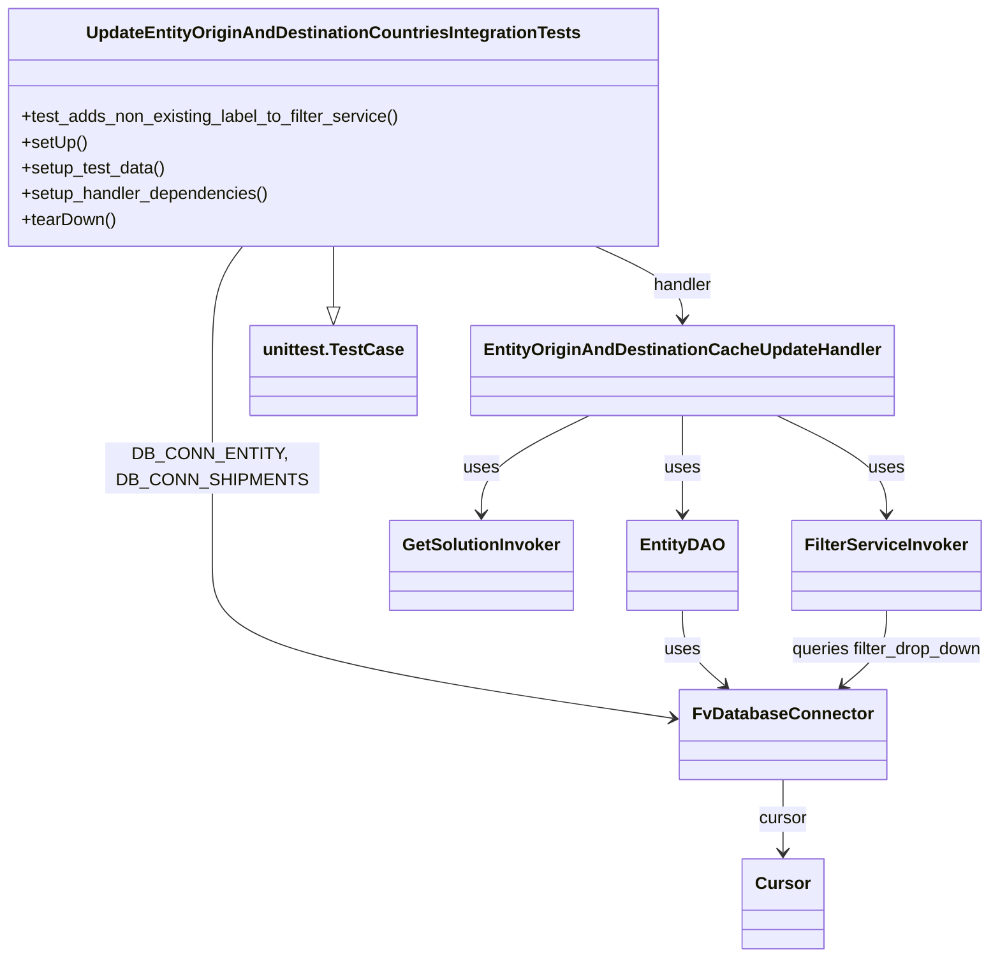
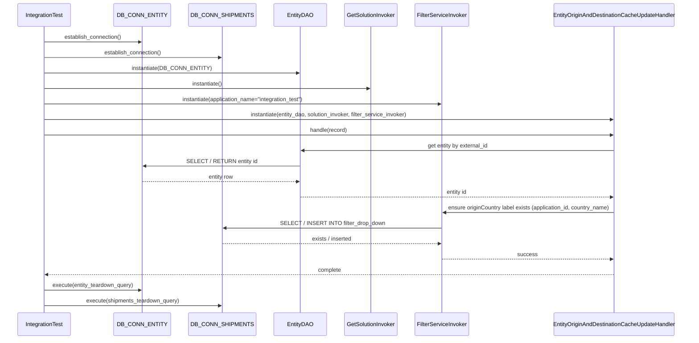

# Diagram: entity_core/entity_service/entity_listener/tests/integration/test_update_entity_origin_and_destination_cache.py

> Auto-generated by Obscura crawlers

## Diagram 1

### SVG

<svg id="container" width="905.69921875" xmlns="http://www.w3.org/2000/svg" class="classDiagram" height="894" viewBox="0 0 905.69921875 894" role="graphics-document document" aria-roledescription="class"><g><defs><marker id="container_class-aggregationStart" class="marker aggregation class" refX="18" refY="7" markerWidth="190" markerHeight="240" orient="auto"><path d="M 18,7 L9,13 L1,7 L9,1 Z"></path></marker></defs><defs><marker id="container_class-aggregationEnd" class="marker aggregation class" refX="1" refY="7" markerWidth="20" markerHeight="28" orient="auto"><path d="M 18,7 L9,13 L1,7 L9,1 Z"></path></marker></defs><defs><marker id="container_class-extensionStart" class="marker extension class" refX="18" refY="7" markerWidth="190" markerHeight="240" orient="auto"><path d="M 1,7 L18,13 V 1 Z"></path></marker></defs><defs><marker id="container_class-extensionEnd" class="marker extension class" refX="1" refY="7" markerWidth="20" markerHeight="28" orient="auto"><path d="M 1,1 V 13 L18,7 Z"></path></marker></defs><defs><marker id="container_class-compositionStart" class="marker composition class" refX="18" refY="7" markerWidth="190" markerHeight="240" orient="auto"><path d="M 18,7 L9,13 L1,7 L9,1 Z"></path></marker></defs><defs><marker id="container_class-compositionEnd" class="marker composition class" refX="1" refY="7" markerWidth="20" markerHeight="28" orient="auto"><path d="M 18,7 L9,13 L1,7 L9,1 Z"></path></marker></defs><defs><marker id="container_class-dependencyStart" class="marker dependency class" refX="6" refY="7" markerWidth="190" markerHeight="240" orient="auto"><path d="M 5,7 L9,13 L1,7 L9,1 Z"></path></marker></defs><defs><marker id="container_class-dependencyEnd" class="marker dependency class" refX="13" refY="7" markerWidth="20" markerHeight="28" orient="auto"><path d="M 18,7 L9,13 L14,7 L9,1 Z"></path></marker></defs><defs><marker id="container_class-lollipopStart" class="marker lollipop class" refX="13" refY="7" markerWidth="190" markerHeight="240" orient="auto"><circle stroke="black" fill="transparent" cx="7" cy="7" r="6"></circle></marker></defs><defs><marker id="container_class-lollipopEnd" class="marker lollipop class" refX="1" refY="7" markerWidth="190" markerHeight="240" orient="auto"><circle stroke="black" fill="transparent" cx="7" cy="7" r="6"></circle></marker></defs><g class="root"><g class="clusters"></g><g class="edgePaths"><path d="M309.137,230L309.137,236.167C309.137,242.333,309.137,254.667,309.137,264.125C309.137,273.583,309.137,280.167,309.137,283.458L309.137,286.75" id="id_UpdateEntityOriginAndDestinationCountriesIntegrationTests_unittest.TestCase_1" class="edge-thickness-normal edge-pattern-solid relation" style=";;;" data-edge="true" data-et="edge" data-id="id_UpdateEntityOriginAndDestinationCountriesIntegrationTests_unittest.TestCase_1" data-points="W3sieCI6MzA5LjEzNjcxODc1LCJ5IjoyMzB9LHsieCI6MzA5LjEzNjcxODc1LCJ5IjoyNjd9LHsieCI6MzA5LjEzNjcxODc1LCJ5IjozMDR9XQ==" marker-end="url(#container_class-extensionEnd)"></path><path d="M544.824,230L557.918,236.167C571.012,242.333,597.199,254.667,610.293,266C623.387,277.333,623.387,287.667,623.387,292.833L623.387,298" id="id_UpdateEntityOriginAndDestinationCountriesIntegrationTests_EntityOriginAndDestinationCacheUpdateHandler_2" class="edge-thickness-normal edge-pattern-solid relation" style=";;;" data-edge="true" data-et="edge" data-id="id_UpdateEntityOriginAndDestinationCountriesIntegrationTests_EntityOriginAndDestinationCacheUpdateHandler_2" data-points="W3sieCI6NTQ0LjgyNDIxODc1LCJ5IjoyMzB9LHsieCI6NjIzLjM4NjcxODc1LCJ5IjoyNjd9LHsieCI6NjIzLjM4NjcxODc1LCJ5IjozMDR9XQ==" marker-end="url(#container_class-dependencyEnd)"></path><path d="M226.854,230L222.282,236.167C217.711,242.333,208.568,254.667,203.997,274C199.426,293.333,199.426,319.667,199.426,348C199.426,376.333,199.426,406.667,199.426,437C199.426,467.333,199.426,497.667,199.426,526C199.426,554.333,199.426,580.667,269.017,604.513C338.608,628.359,477.79,649.719,547.381,660.398L616.972,671.078" id="id_UpdateEntityOriginAndDestinationCountriesIntegrationTests_FvDatabaseConnector_3" class="edge-thickness-normal edge-pattern-solid relation" style=";;;" data-edge="true" data-et="edge" data-id="id_UpdateEntityOriginAndDestinationCountriesIntegrationTests_FvDatabaseConnector_3" data-points="W3sieCI6MjI2Ljg1MzUxNTYyNSwieSI6MjMwfSx7IngiOjE5OS40MjU3ODEyNSwieSI6MjY3fSx7IngiOjE5OS40MjU3ODEyNSwieSI6MzQ2fSx7IngiOjE5OS40MjU3ODEyNSwieSI6NDM3fSx7IngiOjE5OS40MjU3ODEyNSwieSI6NTI4fSx7IngiOjE5OS40MjU3ODEyNSwieSI6NjA3fSx7IngiOjYyMi45MDIzNDM3NSwieSI6NjcxLjk4ODA4NjU2NTg5NTd9XQ==" marker-end="url(#container_class-dependencyEnd)"></path><path d="M714.207,728L714.207,734.167C714.207,740.333,714.207,752.667,714.207,764C714.207,775.333,714.207,785.667,714.207,790.833L714.207,796" id="id_FvDatabaseConnector_Cursor_4" class="edge-thickness-normal edge-pattern-solid relation" style=";;;" data-edge="true" data-et="edge" data-id="id_FvDatabaseConnector_Cursor_4" data-points="W3sieCI6NzE0LjIwNzAzMTI1LCJ5Ijo3Mjh9LHsieCI6NzE0LjIwNzAzMTI1LCJ5Ijo3NjV9LHsieCI6NzE0LjIwNzAzMTI1LCJ5Ijo4MDJ9XQ==" marker-end="url(#container_class-dependencyEnd)"></path><path d="M623.387,388L623.387,396.167C623.387,404.333,623.387,420.667,623.387,436C623.387,451.333,623.387,465.667,623.387,472.833L623.387,480" id="id_EntityOriginAndDestinationCacheUpdateHandler_EntityDAO_5" class="edge-thickness-normal edge-pattern-solid relation" style=";;;" data-edge="true" data-et="edge" data-id="id_EntityOriginAndDestinationCacheUpdateHandler_EntityDAO_5" data-points="W3sieCI6NjIzLjM4NjcxODc1LCJ5IjozODh9LHsieCI6NjIzLjM4NjcxODc1LCJ5Ijo0Mzd9LHsieCI6NjIzLjM4NjcxODc1LCJ5Ijo0ODZ9XQ==" marker-end="url(#container_class-dependencyEnd)"></path><path d="M539.553,388L523.252,396.167C506.95,404.333,474.348,420.667,458.047,436C441.746,451.333,441.746,465.667,441.746,472.833L441.746,480" id="id_EntityOriginAndDestinationCacheUpdateHandler_GetSolutionInvoker_6" class="edge-thickness-normal edge-pattern-solid relation" style=";;;" data-edge="true" data-et="edge" data-id="id_EntityOriginAndDestinationCacheUpdateHandler_GetSolutionInvoker_6" data-points="W3sieCI6NTM5LjU1MjU4NDEzNDYxNTQsInkiOjM4OH0seyJ4Ijo0NDEuNzQ2MDkzNzUsInkiOjQzN30seyJ4Ijo0NDEuNzQ2MDkzNzUsInkiOjQ4Nn1d" marker-end="url(#container_class-dependencyEnd)"></path><path d="M708.151,388L724.633,396.167C741.115,404.333,774.079,420.667,790.561,436C807.043,451.333,807.043,465.667,807.043,472.833L807.043,480" id="id_EntityOriginAndDestinationCacheUpdateHandler_FilterServiceInvoker_7" class="edge-thickness-normal edge-pattern-solid relation" style=";;;" data-edge="true" data-et="edge" data-id="id_EntityOriginAndDestinationCacheUpdateHandler_FilterServiceInvoker_7" data-points="W3sieCI6NzA4LjE1MTE0MTgyNjkyMzEsInkiOjM4OH0seyJ4Ijo4MDcuMDQyOTY4NzUsInkiOjQzN30seyJ4Ijo4MDcuMDQyOTY4NzUsInkiOjQ4Nn1d" marker-end="url(#container_class-dependencyEnd)"></path><path d="M623.387,570L623.387,576.167C623.387,582.333,623.387,594.667,629.722,606.344C636.056,618.021,648.726,629.041,655.061,634.552L661.396,640.062" id="id_EntityDAO_FvDatabaseConnector_8" class="edge-thickness-normal edge-pattern-solid relation" style=";;;" data-edge="true" data-et="edge" data-id="id_EntityDAO_FvDatabaseConnector_8" data-points="W3sieCI6NjIzLjM4NjcxODc1LCJ5Ijo1NzB9LHsieCI6NjIzLjM4NjcxODc1LCJ5Ijo2MDd9LHsieCI6NjY1LjkyMjgxNDQ3Nzg0ODEsInkiOjY0NH1d" marker-end="url(#container_class-dependencyEnd)"></path><path d="M807.043,570L807.043,576.167C807.043,582.333,807.043,594.667,800.558,606.352C794.073,618.037,781.103,629.074,774.617,634.593L768.132,640.112" id="id_FilterServiceInvoker_FvDatabaseConnector_9" class="edge-thickness-normal edge-pattern-solid relation" style=";;;" data-edge="true" data-et="edge" data-id="id_FilterServiceInvoker_FvDatabaseConnector_9" data-points="W3sieCI6ODA3LjA0Mjk2ODc1LCJ5Ijo1NzB9LHsieCI6ODA3LjA0Mjk2ODc1LCJ5Ijo2MDd9LHsieCI6NzYzLjU2Mjg0NjEyMzQxNzcsInkiOjY0NH1d" marker-end="url(#container_class-dependencyEnd)"></path></g><g class="edgeLabels"><g class="edgeLabel"><g class="label" data-id="id_UpdateEntityOriginAndDestinationCountriesIntegrationTests_unittest.TestCase_1" transform="translate(0, 0)"><foreignObject width="0" height="0">

</foreignObject></g></g><g class="edgeLabel" transform="translate(623.38671875, 267)"><g class="label" data-id="id_UpdateEntityOriginAndDestinationCountriesIntegrationTests_EntityOriginAndDestinationCacheUpdateHandler_2" transform="translate(-28.265625, -12)"><foreignObject width="56.53125" height="24">

handler

</foreignObject></g></g><g class="edgeLabel" transform="translate(199.42578125, 437)"><g class="label" data-id="id_UpdateEntityOriginAndDestinationCountriesIntegrationTests_FvDatabaseConnector_3" transform="translate(-100, -24)"><foreignObject width="200" height="48">

DB_CONN_ENTITY, DB_CONN_SHIPMENTS

</foreignObject></g></g><g class="edgeLabel" transform="translate(714.20703125, 765)"><g class="label" data-id="id_FvDatabaseConnector_Cursor_4" transform="translate(-22.8671875, -12)"><foreignObject width="45.734375" height="24">

cursor

</foreignObject></g></g><g class="edgeLabel" transform="translate(623.38671875, 437)"><g class="label" data-id="id_EntityOriginAndDestinationCacheUpdateHandler_EntityDAO_5" transform="translate(-16.4921875, -12)"><foreignObject width="32.984375" height="24">

uses

</foreignObject></g></g><g class="edgeLabel" transform="translate(441.74609375, 437)"><g class="label" data-id="id_EntityOriginAndDestinationCacheUpdateHandler_GetSolutionInvoker_6" transform="translate(-16.4921875, -12)"><foreignObject width="32.984375" height="24">

uses

</foreignObject></g></g><g class="edgeLabel" transform="translate(807.04296875, 437)"><g class="label" data-id="id_EntityOriginAndDestinationCacheUpdateHandler_FilterServiceInvoker_7" transform="translate(-16.4921875, -12)"><foreignObject width="32.984375" height="24">

uses

</foreignObject></g></g><g class="edgeLabel" transform="translate(623.38671875, 607)"><g class="label" data-id="id_EntityDAO_FvDatabaseConnector_8" transform="translate(-16.4921875, -12)"><foreignObject width="32.984375" height="24">

uses

</foreignObject></g></g><g class="edgeLabel" transform="translate(807.04296875, 607)"><g class="label" data-id="id_FilterServiceInvoker_FvDatabaseConnector_9" transform="translate(-90.65625, -12)"><foreignObject width="181.3125" height="24">

queries filter_drop_down

</foreignObject></g></g></g><g class="nodes"><g class="node default" id="classId-UpdateEntityOriginAndDestinationCountriesIntegrationTests-0" transform="translate(309.13671875, 119)"><g class="basic label-container"><path d="M-301.13671875 -111 L301.13671875 -111 L301.13671875 111 L-301.13671875 111" stroke="none" stroke-width="0" fill="#ECECFF" style=""></path><path d="M-301.13671875 -111 C-98.88349625791895 -111, 103.3697262341621 -111, 301.13671875 -111 M-301.13671875 -111 C-92.57493717327469 -111, 115.98684440345062 -111, 301.13671875 -111 M301.13671875 -111 C301.13671875 -61.26726994995027, 301.13671875 -11.534539899900537, 301.13671875 111 M301.13671875 -111 C301.13671875 -40.79223990869994, 301.13671875 29.41552018260012, 301.13671875 111 M301.13671875 111 C75.12437481515502 111, -150.88796911968996 111, -301.13671875 111 M301.13671875 111 C151.33327767834717 111, 1.5298366066943458 111, -301.13671875 111 M-301.13671875 111 C-301.13671875 47.718575533411716, -301.13671875 -15.562848933176568, -301.13671875 -111 M-301.13671875 111 C-301.13671875 47.98028479693633, -301.13671875 -15.039430406127337, -301.13671875 -111" stroke="#9370DB" stroke-width="1.3" fill="none" stroke-dasharray="0 0" style=""></path></g><g class="annotation-group text" transform="translate(0, -87)"></g><g class="label-group text" transform="translate(-221.6015625, -87)"><g class="label" style="font-weight: bolder" transform="translate(0,-12)"><foreignObject width="443.203125" height="24">

UpdateEntityOriginAndDestinationCountriesIntegrationTests

</foreignObject></g></g><g class="members-group text" transform="translate(-289.13671875, -39)"></g><g class="methods-group text" transform="translate(-289.13671875, -9)"><g class="label" style="" transform="translate(0,-12)"><foreignObject width="356.671875" height="24">

+test_adds_non_existing_label_to_filter_service()

</foreignObject></g><g class="label" style="" transform="translate(0,12)"><foreignObject width="60.421875" height="24">

+setUp()

</foreignObject></g><g class="label" style="" transform="translate(0,36)"><foreignObject width="134.96875" height="24">

+setup_test_data()

</foreignObject></g><g class="label" style="" transform="translate(0,60)"><foreignObject width="232.296875" height="24">

+setup_handler_dependencies()

</foreignObject></g><g class="label" style="" transform="translate(0,84)"><foreignObject width="87.75" height="24">

+tearDown()

</foreignObject></g></g><g class="divider" style=""><path d="M-301.13671875 -63 C-151.01071116394544 -63, -0.8847035778908889 -63, 301.13671875 -63 M-301.13671875 -63 C-82.25622081524497 -63, 136.62427711951005 -63, 301.13671875 -63" stroke="#9370DB" stroke-width="1.3" fill="none" stroke-dasharray="0 0" style=""></path></g><g class="divider" style=""><path d="M-301.13671875 -39 C-84.25673730384707 -39, 132.62324414230585 -39, 301.13671875 -39 M-301.13671875 -39 C-92.5490471346618 -39, 116.03862448067639 -39, 301.13671875 -39" stroke="#9370DB" stroke-width="1.3" fill="none" stroke-dasharray="0 0" style=""></path></g></g><g class="node default" id="classId-EntityOriginAndDestinationCacheUpdateHandler-1" transform="translate(623.38671875, 346)"><g class="basic label-container"><path d="M-189.5390625 -42 L189.5390625 -42 L189.5390625 42 L-189.5390625 42" stroke="none" stroke-width="0" fill="#ECECFF" style=""></path><path d="M-189.5390625 -42 C-78.63305489989217 -42, 32.272952700215654 -42, 189.5390625 -42 M-189.5390625 -42 C-109.15639016635255 -42, -28.773717832705103 -42, 189.5390625 -42 M189.5390625 -42 C189.5390625 -11.014276485877566, 189.5390625 19.971447028244867, 189.5390625 42 M189.5390625 -42 C189.5390625 -24.26502412252762, 189.5390625 -6.530048245055241, 189.5390625 42 M189.5390625 42 C66.88296621937141 42, -55.77313006125718 42, -189.5390625 42 M189.5390625 42 C38.55289197570826 42, -112.43327854858347 42, -189.5390625 42 M-189.5390625 42 C-189.5390625 20.1787864043935, -189.5390625 -1.6424271912130024, -189.5390625 -42 M-189.5390625 42 C-189.5390625 20.9057976172552, -189.5390625 -0.18840476548960083, -189.5390625 -42" stroke="#9370DB" stroke-width="1.3" fill="none" stroke-dasharray="0 0" style=""></path></g><g class="annotation-group text" transform="translate(0, -18)"></g><g class="label-group text" transform="translate(-177.5390625, -18)"><g class="label" style="font-weight: bolder" transform="translate(0,-12)"><foreignObject width="355.078125" height="24">

EntityOriginAndDestinationCacheUpdateHandler

</foreignObject></g></g><g class="members-group text" transform="translate(-177.5390625, 30)"></g><g class="methods-group text" transform="translate(-177.5390625, 60)"></g><g class="divider" style=""><path d="M-189.5390625 6 C-113.39775945881725 6, -37.256456417634496 6, 189.5390625 6 M-189.5390625 6 C-69.97635902279049 6, 49.58634445441902 6, 189.5390625 6" stroke="#9370DB" stroke-width="1.3" fill="none" stroke-dasharray="0 0" style=""></path></g><g class="divider" style=""><path d="M-189.5390625 24 C-80.27519966242535 24, 28.9886631751493 24, 189.5390625 24 M-189.5390625 24 C-94.73610090046307 24, 0.06686069907385672 24, 189.5390625 24" stroke="#9370DB" stroke-width="1.3" fill="none" stroke-dasharray="0 0" style=""></path></g></g><g class="node default" id="classId-EntityDAO-2" transform="translate(623.38671875, 528)"><g class="basic label-container"><path d="M-48.578125 -42 L48.578125 -42 L48.578125 42 L-48.578125 42" stroke="none" stroke-width="0" fill="#ECECFF" style=""></path><path d="M-48.578125 -42 C-24.57148052746486 -42, -0.5648360549297209 -42, 48.578125 -42 M-48.578125 -42 C-20.319744680419806 -42, 7.938635639160388 -42, 48.578125 -42 M48.578125 -42 C48.578125 -13.738792053323643, 48.578125 14.522415893352715, 48.578125 42 M48.578125 -42 C48.578125 -11.038317468125864, 48.578125 19.92336506374827, 48.578125 42 M48.578125 42 C26.881366235990576 42, 5.184607471981153 42, -48.578125 42 M48.578125 42 C11.96323998990431 42, -24.65164502019138 42, -48.578125 42 M-48.578125 42 C-48.578125 24.876021251758893, -48.578125 7.752042503517785, -48.578125 -42 M-48.578125 42 C-48.578125 8.715654598047891, -48.578125 -24.568690803904218, -48.578125 -42" stroke="#9370DB" stroke-width="1.3" fill="none" stroke-dasharray="0 0" style=""></path></g><g class="annotation-group text" transform="translate(0, -18)"></g><g class="label-group text" transform="translate(-36.578125, -18)"><g class="label" style="font-weight: bolder" transform="translate(0,-12)"><foreignObject width="73.15625" height="24">

EntityDAO

</foreignObject></g></g><g class="members-group text" transform="translate(-36.578125, 30)"></g><g class="methods-group text" transform="translate(-36.578125, 60)"></g><g class="divider" style=""><path d="M-48.578125 6 C-27.22930890478875 6, -5.880492809577497 6, 48.578125 6 M-48.578125 6 C-20.128975268017637 6, 8.320174463964726 6, 48.578125 6" stroke="#9370DB" stroke-width="1.3" fill="none" stroke-dasharray="0 0" style=""></path></g><g class="divider" style=""><path d="M-48.578125 24 C-17.823901934013254 24, 12.930321131973493 24, 48.578125 24 M-48.578125 24 C-11.164855968016411 24, 26.248413063967178 24, 48.578125 24" stroke="#9370DB" stroke-width="1.3" fill="none" stroke-dasharray="0 0" style=""></path></g></g><g class="node default" id="classId-GetSolutionInvoker-3" transform="translate(441.74609375, 528)"><g class="basic label-container"><path d="M-83.0625 -42 L83.0625 -42 L83.0625 42 L-83.0625 42" stroke="none" stroke-width="0" fill="#ECECFF" style=""></path><path d="M-83.0625 -42 C-32.004248668548996 -42, 19.054002662902008 -42, 83.0625 -42 M-83.0625 -42 C-48.0281202852271 -42, -12.993740570454193 -42, 83.0625 -42 M83.0625 -42 C83.0625 -20.54689429691015, 83.0625 0.9062114061797004, 83.0625 42 M83.0625 -42 C83.0625 -10.135511410829654, 83.0625 21.728977178340692, 83.0625 42 M83.0625 42 C33.21495594963017 42, -16.632588100739653 42, -83.0625 42 M83.0625 42 C49.3498380178311 42, 15.637176035662193 42, -83.0625 42 M-83.0625 42 C-83.0625 20.903051628316142, -83.0625 -0.19389674336771634, -83.0625 -42 M-83.0625 42 C-83.0625 17.413789748753146, -83.0625 -7.172420502493708, -83.0625 -42" stroke="#9370DB" stroke-width="1.3" fill="none" stroke-dasharray="0 0" style=""></path></g><g class="annotation-group text" transform="translate(0, -18)"></g><g class="label-group text" transform="translate(-71.0625, -18)"><g class="label" style="font-weight: bolder" transform="translate(0,-12)"><foreignObject width="142.125" height="24">

GetSolutionInvoker

</foreignObject></g></g><g class="members-group text" transform="translate(-71.0625, 30)"></g><g class="methods-group text" transform="translate(-71.0625, 60)"></g><g class="divider" style=""><path d="M-83.0625 6 C-33.101375125506884 6, 16.859749748986232 6, 83.0625 6 M-83.0625 6 C-19.975693564594152 6, 43.111112870811695 6, 83.0625 6" stroke="#9370DB" stroke-width="1.3" fill="none" stroke-dasharray="0 0" style=""></path></g><g class="divider" style=""><path d="M-83.0625 24 C-36.018214578929694 24, 11.026070842140612 24, 83.0625 24 M-83.0625 24 C-41.0926540932076 24, 0.8771918135848011 24, 83.0625 24" stroke="#9370DB" stroke-width="1.3" fill="none" stroke-dasharray="0 0" style=""></path></g></g><g class="node default" id="classId-FilterServiceInvoker-4" transform="translate(807.04296875, 528)"><g class="basic label-container"><path d="M-85.078125 -42 L85.078125 -42 L85.078125 42 L-85.078125 42" stroke="none" stroke-width="0" fill="#ECECFF" style=""></path><path d="M-85.078125 -42 C-49.30070340052794 -42, -13.523281801055873 -42, 85.078125 -42 M-85.078125 -42 C-23.45364159354709 -42, 38.17084181290582 -42, 85.078125 -42 M85.078125 -42 C85.078125 -24.072935027273672, 85.078125 -6.145870054547345, 85.078125 42 M85.078125 -42 C85.078125 -9.923163381756659, 85.078125 22.153673236486682, 85.078125 42 M85.078125 42 C43.6218890088662 42, 2.165653017732396 42, -85.078125 42 M85.078125 42 C45.06623716990367 42, 5.054349339807345 42, -85.078125 42 M-85.078125 42 C-85.078125 23.100326633691612, -85.078125 4.200653267383224, -85.078125 -42 M-85.078125 42 C-85.078125 22.226462176513603, -85.078125 2.452924353027207, -85.078125 -42" stroke="#9370DB" stroke-width="1.3" fill="none" stroke-dasharray="0 0" style=""></path></g><g class="annotation-group text" transform="translate(0, -18)"></g><g class="label-group text" transform="translate(-73.078125, -18)"><g class="label" style="font-weight: bolder" transform="translate(0,-12)"><foreignObject width="146.15625" height="24">

FilterServiceInvoker

</foreignObject></g></g><g class="members-group text" transform="translate(-73.078125, 30)"></g><g class="methods-group text" transform="translate(-73.078125, 60)"></g><g class="divider" style=""><path d="M-85.078125 6 C-34.573748330972535 6, 15.93062833805493 6, 85.078125 6 M-85.078125 6 C-20.10330674075412 6, 44.87151151849176 6, 85.078125 6" stroke="#9370DB" stroke-width="1.3" fill="none" stroke-dasharray="0 0" style=""></path></g><g class="divider" style=""><path d="M-85.078125 24 C-36.34355605866406 24, 12.391012882671873 24, 85.078125 24 M-85.078125 24 C-27.524790743244445 24, 30.02854351351111 24, 85.078125 24" stroke="#9370DB" stroke-width="1.3" fill="none" stroke-dasharray="0 0" style=""></path></g></g><g class="node default" id="classId-FvDatabaseConnector-5" transform="translate(714.20703125, 686)"><g class="basic label-container"><path d="M-91.3046875 -42 L91.3046875 -42 L91.3046875 42 L-91.3046875 42" stroke="none" stroke-width="0" fill="#ECECFF" style=""></path><path d="M-91.3046875 -42 C-22.316684780795 -42, 46.67131793841 -42, 91.3046875 -42 M-91.3046875 -42 C-25.530411364092345 -42, 40.24386477181531 -42, 91.3046875 -42 M91.3046875 -42 C91.3046875 -16.56287317502361, 91.3046875 8.874253649952777, 91.3046875 42 M91.3046875 -42 C91.3046875 -20.9175773781676, 91.3046875 0.16484524366480002, 91.3046875 42 M91.3046875 42 C25.922281058464336 42, -39.46012538307133 42, -91.3046875 42 M91.3046875 42 C51.14924738803687 42, 10.993807276073738 42, -91.3046875 42 M-91.3046875 42 C-91.3046875 20.82530656916819, -91.3046875 -0.34938686166361776, -91.3046875 -42 M-91.3046875 42 C-91.3046875 17.143335924424928, -91.3046875 -7.713328151150144, -91.3046875 -42" stroke="#9370DB" stroke-width="1.3" fill="none" stroke-dasharray="0 0" style=""></path></g><g class="annotation-group text" transform="translate(0, -18)"></g><g class="label-group text" transform="translate(-79.3046875, -18)"><g class="label" style="font-weight: bolder" transform="translate(0,-12)"><foreignObject width="158.609375" height="24">

FvDatabaseConnector

</foreignObject></g></g><g class="members-group text" transform="translate(-79.3046875, 30)"></g><g class="methods-group text" transform="translate(-79.3046875, 60)"></g><g class="divider" style=""><path d="M-91.3046875 6 C-25.502768699805017 6, 40.299150100389966 6, 91.3046875 6 M-91.3046875 6 C-25.224107545817503 6, 40.85647240836499 6, 91.3046875 6" stroke="#9370DB" stroke-width="1.3" fill="none" stroke-dasharray="0 0" style=""></path></g><g class="divider" style=""><path d="M-91.3046875 24 C-44.509218448154634 24, 2.286250603690732 24, 91.3046875 24 M-91.3046875 24 C-35.99746749641143 24, 19.309752507177137 24, 91.3046875 24" stroke="#9370DB" stroke-width="1.3" fill="none" stroke-dasharray="0 0" style=""></path></g></g><g class="node default" id="classId-Cursor-6" transform="translate(714.20703125, 844)"><g class="basic label-container"><path d="M-35.90625 -42 L35.90625 -42 L35.90625 42 L-35.90625 42" stroke="none" stroke-width="0" fill="#ECECFF" style=""></path><path d="M-35.90625 -42 C-9.432661573684836 -42, 17.040926852630328 -42, 35.90625 -42 M-35.90625 -42 C-9.375818606660054 -42, 17.15461278667989 -42, 35.90625 -42 M35.90625 -42 C35.90625 -18.330143117181187, 35.90625 5.339713765637626, 35.90625 42 M35.90625 -42 C35.90625 -16.455384477436695, 35.90625 9.08923104512661, 35.90625 42 M35.90625 42 C11.93019373892108 42, -12.04586252215784 42, -35.90625 42 M35.90625 42 C16.952819489333955 42, -2.000611021332091 42, -35.90625 42 M-35.90625 42 C-35.90625 23.185017000687573, -35.90625 4.370034001375146, -35.90625 -42 M-35.90625 42 C-35.90625 16.11401893067515, -35.90625 -9.771962138649698, -35.90625 -42" stroke="#9370DB" stroke-width="1.3" fill="none" stroke-dasharray="0 0" style=""></path></g><g class="annotation-group text" transform="translate(0, -18)"></g><g class="label-group text" transform="translate(-23.90625, -18)"><g class="label" style="font-weight: bolder" transform="translate(0,-12)"><foreignObject width="47.8125" height="24">

Cursor

</foreignObject></g></g><g class="members-group text" transform="translate(-23.90625, 30)"></g><g class="methods-group text" transform="translate(-23.90625, 60)"></g><g class="divider" style=""><path d="M-35.90625 6 C-11.821339901363444 6, 12.263570197273111 6, 35.90625 6 M-35.90625 6 C-8.549934574725839 6, 18.806380850548322 6, 35.90625 6" stroke="#9370DB" stroke-width="1.3" fill="none" stroke-dasharray="0 0" style=""></path></g><g class="divider" style=""><path d="M-35.90625 24 C-17.94108248774339 24, 0.024085024513219366 24, 35.90625 24 M-35.90625 24 C-15.774789437656466 24, 4.356671124687068 24, 35.90625 24" stroke="#9370DB" stroke-width="1.3" fill="none" stroke-dasharray="0 0" style=""></path></g></g><g class="node default" id="classId-unittest.TestCase-7" transform="translate(309.13671875, 346)"><g class="basic label-container"><path d="M-74.7109375 -42 L74.7109375 -42 L74.7109375 42 L-74.7109375 42" stroke="none" stroke-width="0" fill="#ECECFF" style=""></path><path d="M-74.7109375 -42 C-20.59279511213859 -42, 33.52534727572282 -42, 74.7109375 -42 M-74.7109375 -42 C-41.47477034050227 -42, -8.238603181004535 -42, 74.7109375 -42 M74.7109375 -42 C74.7109375 -13.971144435557328, 74.7109375 14.057711128885344, 74.7109375 42 M74.7109375 -42 C74.7109375 -11.400288022035248, 74.7109375 19.199423955929504, 74.7109375 42 M74.7109375 42 C32.872456635139976 42, -8.966024229720048 42, -74.7109375 42 M74.7109375 42 C15.383411779359392 42, -43.944113941281216 42, -74.7109375 42 M-74.7109375 42 C-74.7109375 21.502088364417038, -74.7109375 1.004176728834075, -74.7109375 -42 M-74.7109375 42 C-74.7109375 12.547234259316255, -74.7109375 -16.90553148136749, -74.7109375 -42" stroke="#9370DB" stroke-width="1.3" fill="none" stroke-dasharray="0 0" style=""></path></g><g class="annotation-group text" transform="translate(0, -18)"></g><g class="label-group text" transform="translate(-62.7109375, -18)"><g class="label" style="font-weight: bolder" transform="translate(0,-12)"><foreignObject width="125.421875" height="24">

unittest.TestCase

</foreignObject></g></g><g class="members-group text" transform="translate(-62.7109375, 30)"></g><g class="methods-group text" transform="translate(-62.7109375, 60)"></g><g class="divider" style=""><path d="M-74.7109375 6 C-36.53860840609201 6, 1.6337206878159805 6, 74.7109375 6 M-74.7109375 6 C-24.415345451087397 6, 25.880246597825206 6, 74.7109375 6" stroke="#9370DB" stroke-width="1.3" fill="none" stroke-dasharray="0 0" style=""></path></g><g class="divider" style=""><path d="M-74.7109375 24 C-34.4379646366079 24, 5.835008226784197 24, 74.7109375 24 M-74.7109375 24 C-35.05457716504259 24, 4.601783169914825 24, 74.7109375 24" stroke="#9370DB" stroke-width="1.3" fill="none" stroke-dasharray="0 0" style=""></path></g></g></g></g></g></svg>

## Diagram 2

### SVG

<svg id="container" width="2051" xmlns="http://www.w3.org/2000/svg" height="1035" viewBox="-50 -10 2051 1035" role="graphics-document document" aria-roledescription="sequence"><g><rect x="1579" y="949" fill="#eaeaea" stroke="#666" width="372" height="65" name="Handler" rx="3" ry="3" class="actor actor-bottom"></rect><text x="1765" y="981.5" dominant-baseline="central" alignment-baseline="central" class="actor actor-box" style="text-anchor: middle; font-size: 16px; font-weight: 400;"><tspan x="1765" dy="0">EntityOriginAndDestinationCacheUpdateHandler</tspan></text></g><g><rect x="1144" y="949" fill="#eaeaea" stroke="#666" width="164" height="65" name="FilterService" rx="3" ry="3" class="actor actor-bottom"></rect><text x="1226" y="981.5" dominant-baseline="central" alignment-baseline="central" class="actor actor-box" style="text-anchor: middle; font-size: 16px; font-weight: 400;"><tspan x="1226" dy="0">FilterServiceInvoker</tspan></text></g><g><rect x="933" y="949" fill="#eaeaea" stroke="#666" width="161" height="65" name="Solution" rx="3" ry="3" class="actor actor-bottom"></rect><text x="1013.5" y="981.5" dominant-baseline="central" alignment-baseline="central" class="actor actor-box" style="text-anchor: middle; font-size: 16px; font-weight: 400;"><tspan x="1013.5" dy="0">GetSolutionInvoker</tspan></text></g><g><rect x="733" y="949" fill="#eaeaea" stroke="#666" width="150" height="65" name="DAO" rx="3" ry="3" class="actor actor-bottom"></rect><text x="808" y="981.5" dominant-baseline="central" alignment-baseline="central" class="actor actor-box" style="text-anchor: middle; font-size: 16px; font-weight: 400;"><tspan x="808" dy="0">EntityDAO</tspan></text></g><g><rect x="504" y="949" fill="#eaeaea" stroke="#666" width="179" height="65" name="DBShip" rx="3" ry="3" class="actor actor-bottom"></rect><text x="593.5" y="981.5" dominant-baseline="central" alignment-baseline="central" class="actor actor-box" style="text-anchor: middle; font-size: 16px; font-weight: 400;"><tspan x="593.5" dy="0">DB_CONN_SHIPMENTS</tspan></text></g><g><rect x="304" y="949" fill="#eaeaea" stroke="#666" width="150" height="65" name="DBEntity" rx="3" ry="3" class="actor actor-bottom"></rect><text x="379" y="981.5" dominant-baseline="central" alignment-baseline="central" class="actor actor-box" style="text-anchor: middle; font-size: 16px; font-weight: 400;"><tspan x="379" dy="0">DB_CONN_ENTITY</tspan></text></g><g><rect x="0" y="949" fill="#eaeaea" stroke="#666" width="150" height="65" name="Test" rx="3" ry="3" class="actor actor-bottom"></rect><text x="75" y="981.5" dominant-baseline="central" alignment-baseline="central" class="actor actor-box" style="text-anchor: middle; font-size: 16px; font-weight: 400;"><tspan x="75" dy="0">IntegrationTest</tspan></text></g><g><line id="actor6" x1="1765" y1="65" x2="1765" y2="949" class="actor-line 200" stroke-width="0.5px" stroke="#999" name="Handler"></line><g id="root-6"><rect x="1579" y="0" fill="#eaeaea" stroke="#666" width="372" height="65" name="Handler" rx="3" ry="3" class="actor actor-top"></rect><text x="1765" y="32.5" dominant-baseline="central" alignment-baseline="central" class="actor actor-box" style="text-anchor: middle; font-size: 16px; font-weight: 400;"><tspan x="1765" dy="0">EntityOriginAndDestinationCacheUpdateHandler</tspan></text></g></g><g><line id="actor5" x1="1226" y1="65" x2="1226" y2="949" class="actor-line 200" stroke-width="0.5px" stroke="#999" name="FilterService"></line><g id="root-5"><rect x="1144" y="0" fill="#eaeaea" stroke="#666" width="164" height="65" name="FilterService" rx="3" ry="3" class="actor actor-top"></rect><text x="1226" y="32.5" dominant-baseline="central" alignment-baseline="central" class="actor actor-box" style="text-anchor: middle; font-size: 16px; font-weight: 400;"><tspan x="1226" dy="0">FilterServiceInvoker</tspan></text></g></g><g><line id="actor4" x1="1013.5" y1="65" x2="1013.5" y2="949" class="actor-line 200" stroke-width="0.5px" stroke="#999" name="Solution"></line><g id="root-4"><rect x="933" y="0" fill="#eaeaea" stroke="#666" width="161" height="65" name="Solution" rx="3" ry="3" class="actor actor-top"></rect><text x="1013.5" y="32.5" dominant-baseline="central" alignment-baseline="central" class="actor actor-box" style="text-anchor: middle; font-size: 16px; font-weight: 400;"><tspan x="1013.5" dy="0">GetSolutionInvoker</tspan></text></g></g><g><line id="actor3" x1="808" y1="65" x2="808" y2="949" class="actor-line 200" stroke-width="0.5px" stroke="#999" name="DAO"></line><g id="root-3"><rect x="733" y="0" fill="#eaeaea" stroke="#666" width="150" height="65" name="DAO" rx="3" ry="3" class="actor actor-top"></rect><text x="808" y="32.5" dominant-baseline="central" alignment-baseline="central" class="actor actor-box" style="text-anchor: middle; font-size: 16px; font-weight: 400;"><tspan x="808" dy="0">EntityDAO</tspan></text></g></g><g><line id="actor2" x1="593.5" y1="65" x2="593.5" y2="949" class="actor-line 200" stroke-width="0.5px" stroke="#999" name="DBShip"></line><g id="root-2"><rect x="504" y="0" fill="#eaeaea" stroke="#666" width="179" height="65" name="DBShip" rx="3" ry="3" class="actor actor-top"></rect><text x="593.5" y="32.5" dominant-baseline="central" alignment-baseline="central" class="actor actor-box" style="text-anchor: middle; font-size: 16px; font-weight: 400;"><tspan x="593.5" dy="0">DB_CONN_SHIPMENTS</tspan></text></g></g><g><line id="actor1" x1="379" y1="65" x2="379" y2="949" class="actor-line 200" stroke-width="0.5px" stroke="#999" name="DBEntity"></line><g id="root-1"><rect x="304" y="0" fill="#eaeaea" stroke="#666" width="150" height="65" name="DBEntity" rx="3" ry="3" class="actor actor-top"></rect><text x="379" y="32.5" dominant-baseline="central" alignment-baseline="central" class="actor actor-box" style="text-anchor: middle; font-size: 16px; font-weight: 400;"><tspan x="379" dy="0">DB_CONN_ENTITY</tspan></text></g></g><g><line id="actor0" x1="75" y1="65" x2="75" y2="949" class="actor-line 200" stroke-width="0.5px" stroke="#999" name="Test"></line><g id="root-0"><rect x="0" y="0" fill="#eaeaea" stroke="#666" width="150" height="65" name="Test" rx="3" ry="3" class="actor actor-top"></rect><text x="75" y="32.5" dominant-baseline="central" alignment-baseline="central" class="actor actor-box" style="text-anchor: middle; font-size: 16px; font-weight: 400;"><tspan x="75" dy="0">IntegrationTest</tspan></text></g></g><g></g><defs><symbol id="computer" width="24" height="24"><path transform="scale(.5)" d="M2 2v13h20v-13h-20zm18 11h-16v-9h16v9zm-10.228 6l.466-1h3.524l.467 1h-4.457zm14.228 3h-24l2-6h2.104l-1.33 4h18.45l-1.297-4h2.073l2 6zm-5-10h-14v-7h14v7z"></path></symbol></defs><defs><symbol id="database" fill-rule="evenodd" clip-rule="evenodd"><path transform="scale(.5)" d="M12.258.001l.256.004.255.005.253.008.251.01.249.012.247.015.246.016.242.019.241.02.239.023.236.024.233.027.231.028.229.031.225.032.223.034.22.036.217.038.214.04.211.041.208.043.205.045.201.046.198.048.194.05.191.051.187.053.183.054.18.056.175.057.172.059.168.06.163.061.16.063.155.064.15.066.074.033.073.033.071.034.07.034.069.035.068.035.067.035.066.035.064.036.064.036.062.036.06.036.06.037.058.037.058.037.055.038.055.038.053.038.052.038.051.039.05.039.048.039.047.039.045.04.044.04.043.04.041.04.04.041.039.041.037.041.036.041.034.041.033.042.032.042.03.042.029.042.027.042.026.043.024.043.023.043.021.043.02.043.018.044.017.043.015.044.013.044.012.044.011.045.009.044.007.045.006.045.004.045.002.045.001.045v17l-.001.045-.002.045-.004.045-.006.045-.007.045-.009.044-.011.045-.012.044-.013.044-.015.044-.017.043-.018.044-.02.043-.021.043-.023.043-.024.043-.026.043-.027.042-.029.042-.03.042-.032.042-.033.042-.034.041-.036.041-.037.041-.039.041-.04.041-.041.04-.043.04-.044.04-.045.04-.047.039-.048.039-.05.039-.051.039-.052.038-.053.038-.055.038-.055.038-.058.037-.058.037-.06.037-.06.036-.062.036-.064.036-.064.036-.066.035-.067.035-.068.035-.069.035-.07.034-.071.034-.073.033-.074.033-.15.066-.155.064-.16.063-.163.061-.168.06-.172.059-.175.057-.18.056-.183.054-.187.053-.191.051-.194.05-.198.048-.201.046-.205.045-.208.043-.211.041-.214.04-.217.038-.22.036-.223.034-.225.032-.229.031-.231.028-.233.027-.236.024-.239.023-.241.02-.242.019-.246.016-.247.015-.249.012-.251.01-.253.008-.255.005-.256.004-.258.001-.258-.001-.256-.004-.255-.005-.253-.008-.251-.01-.249-.012-.247-.015-.245-.016-.243-.019-.241-.02-.238-.023-.236-.024-.234-.027-.231-.028-.228-.031-.226-.032-.223-.034-.22-.036-.217-.038-.214-.04-.211-.041-.208-.043-.204-.045-.201-.046-.198-.048-.195-.05-.19-.051-.187-.053-.184-.054-.179-.056-.176-.057-.172-.059-.167-.06-.164-.061-.159-.063-.155-.064-.151-.066-.074-.033-.072-.033-.072-.034-.07-.034-.069-.035-.068-.035-.067-.035-.066-.035-.064-.036-.063-.036-.062-.036-.061-.036-.06-.037-.058-.037-.057-.037-.056-.038-.055-.038-.053-.038-.052-.038-.051-.039-.049-.039-.049-.039-.046-.039-.046-.04-.044-.04-.043-.04-.041-.04-.04-.041-.039-.041-.037-.041-.036-.041-.034-.041-.033-.042-.032-.042-.03-.042-.029-.042-.027-.042-.026-.043-.024-.043-.023-.043-.021-.043-.02-.043-.018-.044-.017-.043-.015-.044-.013-.044-.012-.044-.011-.045-.009-.044-.007-.045-.006-.045-.004-.045-.002-.045-.001-.045v-17l.001-.045.002-.045.004-.045.006-.045.007-.045.009-.044.011-.045.012-.044.013-.044.015-.044.017-.043.018-.044.02-.043.021-.043.023-.043.024-.043.026-.043.027-.042.029-.042.03-.042.032-.042.033-.042.034-.041.036-.041.037-.041.039-.041.04-.041.041-.04.043-.04.044-.04.046-.04.046-.039.049-.039.049-.039.051-.039.052-.038.053-.038.055-.038.056-.038.057-.037.058-.037.06-.037.061-.036.062-.036.063-.036.064-.036.066-.035.067-.035.068-.035.069-.035.07-.034.072-.034.072-.033.074-.033.151-.066.155-.064.159-.063.164-.061.167-.06.172-.059.176-.057.179-.056.184-.054.187-.053.19-.051.195-.05.198-.048.201-.046.204-.045.208-.043.211-.041.214-.04.217-.038.22-.036.223-.034.226-.032.228-.031.231-.028.234-.027.236-.024.238-.023.241-.02.243-.019.245-.016.247-.015.249-.012.251-.01.253-.008.255-.005.256-.004.258-.001.258.001zm-9.258 20.499v.01l.001.021.003.021.004.022.005.021.006.022.007.022.009.023.01.022.011.023.012.023.013.023.015.023.016.024.017.023.018.024.019.024.021.024.022.025.023.024.024.025.052.049.056.05.061.051.066.051.07.051.075.051.079.052.084.052.088.052.092.052.097.052.102.051.105.052.11.052.114.051.119.051.123.051.127.05.131.05.135.05.139.048.144.049.147.047.152.047.155.047.16.045.163.045.167.043.171.043.176.041.178.041.183.039.187.039.19.037.194.035.197.035.202.033.204.031.209.03.212.029.216.027.219.025.222.024.226.021.23.02.233.018.236.016.24.015.243.012.246.01.249.008.253.005.256.004.259.001.26-.001.257-.004.254-.005.25-.008.247-.011.244-.012.241-.014.237-.016.233-.018.231-.021.226-.021.224-.024.22-.026.216-.027.212-.028.21-.031.205-.031.202-.034.198-.034.194-.036.191-.037.187-.039.183-.04.179-.04.175-.042.172-.043.168-.044.163-.045.16-.046.155-.046.152-.047.148-.048.143-.049.139-.049.136-.05.131-.05.126-.05.123-.051.118-.052.114-.051.11-.052.106-.052.101-.052.096-.052.092-.052.088-.053.083-.051.079-.052.074-.052.07-.051.065-.051.06-.051.056-.05.051-.05.023-.024.023-.025.021-.024.02-.024.019-.024.018-.024.017-.024.015-.023.014-.024.013-.023.012-.023.01-.023.01-.022.008-.022.006-.022.006-.022.004-.022.004-.021.001-.021.001-.021v-4.127l-.077.055-.08.053-.083.054-.085.053-.087.052-.09.052-.093.051-.095.05-.097.05-.1.049-.102.049-.105.048-.106.047-.109.047-.111.046-.114.045-.115.045-.118.044-.12.043-.122.042-.124.042-.126.041-.128.04-.13.04-.132.038-.134.038-.135.037-.138.037-.139.035-.142.035-.143.034-.144.033-.147.032-.148.031-.15.03-.151.03-.153.029-.154.027-.156.027-.158.026-.159.025-.161.024-.162.023-.163.022-.165.021-.166.02-.167.019-.169.018-.169.017-.171.016-.173.015-.173.014-.175.013-.175.012-.177.011-.178.01-.179.008-.179.008-.181.006-.182.005-.182.004-.184.003-.184.002h-.37l-.184-.002-.184-.003-.182-.004-.182-.005-.181-.006-.179-.008-.179-.008-.178-.01-.176-.011-.176-.012-.175-.013-.173-.014-.172-.015-.171-.016-.17-.017-.169-.018-.167-.019-.166-.02-.165-.021-.163-.022-.162-.023-.161-.024-.159-.025-.157-.026-.156-.027-.155-.027-.153-.029-.151-.03-.15-.03-.148-.031-.146-.032-.145-.033-.143-.034-.141-.035-.14-.035-.137-.037-.136-.037-.134-.038-.132-.038-.13-.04-.128-.04-.126-.041-.124-.042-.122-.042-.12-.044-.117-.043-.116-.045-.113-.045-.112-.046-.109-.047-.106-.047-.105-.048-.102-.049-.1-.049-.097-.05-.095-.05-.093-.052-.09-.051-.087-.052-.085-.053-.083-.054-.08-.054-.077-.054v4.127zm0-5.654v.011l.001.021.003.021.004.021.005.022.006.022.007.022.009.022.01.022.011.023.012.023.013.023.015.024.016.023.017.024.018.024.019.024.021.024.022.024.023.025.024.024.052.05.056.05.061.05.066.051.07.051.075.052.079.051.084.052.088.052.092.052.097.052.102.052.105.052.11.051.114.051.119.052.123.05.127.051.131.05.135.049.139.049.144.048.147.048.152.047.155.046.16.045.163.045.167.044.171.042.176.042.178.04.183.04.187.038.19.037.194.036.197.034.202.033.204.032.209.03.212.028.216.027.219.025.222.024.226.022.23.02.233.018.236.016.24.014.243.012.246.01.249.008.253.006.256.003.259.001.26-.001.257-.003.254-.006.25-.008.247-.01.244-.012.241-.015.237-.016.233-.018.231-.02.226-.022.224-.024.22-.025.216-.027.212-.029.21-.03.205-.032.202-.033.198-.035.194-.036.191-.037.187-.039.183-.039.179-.041.175-.042.172-.043.168-.044.163-.045.16-.045.155-.047.152-.047.148-.048.143-.048.139-.05.136-.049.131-.05.126-.051.123-.051.118-.051.114-.052.11-.052.106-.052.101-.052.096-.052.092-.052.088-.052.083-.052.079-.052.074-.051.07-.052.065-.051.06-.05.056-.051.051-.049.023-.025.023-.024.021-.025.02-.024.019-.024.018-.024.017-.024.015-.023.014-.023.013-.024.012-.022.01-.023.01-.023.008-.022.006-.022.006-.022.004-.021.004-.022.001-.021.001-.021v-4.139l-.077.054-.08.054-.083.054-.085.052-.087.053-.09.051-.093.051-.095.051-.097.05-.1.049-.102.049-.105.048-.106.047-.109.047-.111.046-.114.045-.115.044-.118.044-.12.044-.122.042-.124.042-.126.041-.128.04-.13.039-.132.039-.134.038-.135.037-.138.036-.139.036-.142.035-.143.033-.144.033-.147.033-.148.031-.15.03-.151.03-.153.028-.154.028-.156.027-.158.026-.159.025-.161.024-.162.023-.163.022-.165.021-.166.02-.167.019-.169.018-.169.017-.171.016-.173.015-.173.014-.175.013-.175.012-.177.011-.178.009-.179.009-.179.007-.181.007-.182.005-.182.004-.184.003-.184.002h-.37l-.184-.002-.184-.003-.182-.004-.182-.005-.181-.007-.179-.007-.179-.009-.178-.009-.176-.011-.176-.012-.175-.013-.173-.014-.172-.015-.171-.016-.17-.017-.169-.018-.167-.019-.166-.02-.165-.021-.163-.022-.162-.023-.161-.024-.159-.025-.157-.026-.156-.027-.155-.028-.153-.028-.151-.03-.15-.03-.148-.031-.146-.033-.145-.033-.143-.033-.141-.035-.14-.036-.137-.036-.136-.037-.134-.038-.132-.039-.13-.039-.128-.04-.126-.041-.124-.042-.122-.043-.12-.043-.117-.044-.116-.044-.113-.046-.112-.046-.109-.046-.106-.047-.105-.048-.102-.049-.1-.049-.097-.05-.095-.051-.093-.051-.09-.051-.087-.053-.085-.052-.083-.054-.08-.054-.077-.054v4.139zm0-5.666v.011l.001.02.003.022.004.021.005.022.006.021.007.022.009.023.01.022.011.023.012.023.013.023.015.023.016.024.017.024.018.023.019.024.021.025.022.024.023.024.024.025.052.05.056.05.061.05.066.051.07.051.075.052.079.051.084.052.088.052.092.052.097.052.102.052.105.051.11.052.114.051.119.051.123.051.127.05.131.05.135.05.139.049.144.048.147.048.152.047.155.046.16.045.163.045.167.043.171.043.176.042.178.04.183.04.187.038.19.037.194.036.197.034.202.033.204.032.209.03.212.028.216.027.219.025.222.024.226.021.23.02.233.018.236.017.24.014.243.012.246.01.249.008.253.006.256.003.259.001.26-.001.257-.003.254-.006.25-.008.247-.01.244-.013.241-.014.237-.016.233-.018.231-.02.226-.022.224-.024.22-.025.216-.027.212-.029.21-.03.205-.032.202-.033.198-.035.194-.036.191-.037.187-.039.183-.039.179-.041.175-.042.172-.043.168-.044.163-.045.16-.045.155-.047.152-.047.148-.048.143-.049.139-.049.136-.049.131-.051.126-.05.123-.051.118-.052.114-.051.11-.052.106-.052.101-.052.096-.052.092-.052.088-.052.083-.052.079-.052.074-.052.07-.051.065-.051.06-.051.056-.05.051-.049.023-.025.023-.025.021-.024.02-.024.019-.024.018-.024.017-.024.015-.023.014-.024.013-.023.012-.023.01-.022.01-.023.008-.022.006-.022.006-.022.004-.022.004-.021.001-.021.001-.021v-4.153l-.077.054-.08.054-.083.053-.085.053-.087.053-.09.051-.093.051-.095.051-.097.05-.1.049-.102.048-.105.048-.106.048-.109.046-.111.046-.114.046-.115.044-.118.044-.12.043-.122.043-.124.042-.126.041-.128.04-.13.039-.132.039-.134.038-.135.037-.138.036-.139.036-.142.034-.143.034-.144.033-.147.032-.148.032-.15.03-.151.03-.153.028-.154.028-.156.027-.158.026-.159.024-.161.024-.162.023-.163.023-.165.021-.166.02-.167.019-.169.018-.169.017-.171.016-.173.015-.173.014-.175.013-.175.012-.177.01-.178.01-.179.009-.179.007-.181.006-.182.006-.182.004-.184.003-.184.001-.185.001-.185-.001-.184-.001-.184-.003-.182-.004-.182-.006-.181-.006-.179-.007-.179-.009-.178-.01-.176-.01-.176-.012-.175-.013-.173-.014-.172-.015-.171-.016-.17-.017-.169-.018-.167-.019-.166-.02-.165-.021-.163-.023-.162-.023-.161-.024-.159-.024-.157-.026-.156-.027-.155-.028-.153-.028-.151-.03-.15-.03-.148-.032-.146-.032-.145-.033-.143-.034-.141-.034-.14-.036-.137-.036-.136-.037-.134-.038-.132-.039-.13-.039-.128-.041-.126-.041-.124-.041-.122-.043-.12-.043-.117-.044-.116-.044-.113-.046-.112-.046-.109-.046-.106-.048-.105-.048-.102-.048-.1-.05-.097-.049-.095-.051-.093-.051-.09-.052-.087-.052-.085-.053-.083-.053-.08-.054-.077-.054v4.153zm8.74-8.179l-.257.004-.254.005-.25.008-.247.011-.244.012-.241.014-.237.016-.233.018-.231.021-.226.022-.224.023-.22.026-.216.027-.212.028-.21.031-.205.032-.202.033-.198.034-.194.036-.191.038-.187.038-.183.04-.179.041-.175.042-.172.043-.168.043-.163.045-.16.046-.155.046-.152.048-.148.048-.143.048-.139.049-.136.05-.131.05-.126.051-.123.051-.118.051-.114.052-.11.052-.106.052-.101.052-.096.052-.092.052-.088.052-.083.052-.079.052-.074.051-.07.052-.065.051-.06.05-.056.05-.051.05-.023.025-.023.024-.021.024-.02.025-.019.024-.018.024-.017.023-.015.024-.014.023-.013.023-.012.023-.01.023-.01.022-.008.022-.006.023-.006.021-.004.022-.004.021-.001.021-.001.021.001.021.001.021.004.021.004.022.006.021.006.023.008.022.01.022.01.023.012.023.013.023.014.023.015.024.017.023.018.024.019.024.02.025.021.024.023.024.023.025.051.05.056.05.06.05.065.051.07.052.074.051.079.052.083.052.088.052.092.052.096.052.101.052.106.052.11.052.114.052.118.051.123.051.126.051.131.05.136.05.139.049.143.048.148.048.152.048.155.046.16.046.163.045.168.043.172.043.175.042.179.041.183.04.187.038.191.038.194.036.198.034.202.033.205.032.21.031.212.028.216.027.22.026.224.023.226.022.231.021.233.018.237.016.241.014.244.012.247.011.25.008.254.005.257.004.26.001.26-.001.257-.004.254-.005.25-.008.247-.011.244-.012.241-.014.237-.016.233-.018.231-.021.226-.022.224-.023.22-.026.216-.027.212-.028.21-.031.205-.032.202-.033.198-.034.194-.036.191-.038.187-.038.183-.04.179-.041.175-.042.172-.043.168-.043.163-.045.16-.046.155-.046.152-.048.148-.048.143-.048.139-.049.136-.05.131-.05.126-.051.123-.051.118-.051.114-.052.11-.052.106-.052.101-.052.096-.052.092-.052.088-.052.083-.052.079-.052.074-.051.07-.052.065-.051.06-.05.056-.05.051-.05.023-.025.023-.024.021-.024.02-.025.019-.024.018-.024.017-.023.015-.024.014-.023.013-.023.012-.023.01-.023.01-.022.008-.022.006-.023.006-.021.004-.022.004-.021.001-.021.001-.021-.001-.021-.001-.021-.004-.021-.004-.022-.006-.021-.006-.023-.008-.022-.01-.022-.01-.023-.012-.023-.013-.023-.014-.023-.015-.024-.017-.023-.018-.024-.019-.024-.02-.025-.021-.024-.023-.024-.023-.025-.051-.05-.056-.05-.06-.05-.065-.051-.07-.052-.074-.051-.079-.052-.083-.052-.088-.052-.092-.052-.096-.052-.101-.052-.106-.052-.11-.052-.114-.052-.118-.051-.123-.051-.126-.051-.131-.05-.136-.05-.139-.049-.143-.048-.148-.048-.152-.048-.155-.046-.16-.046-.163-.045-.168-.043-.172-.043-.175-.042-.179-.041-.183-.04-.187-.038-.191-.038-.194-.036-.198-.034-.202-.033-.205-.032-.21-.031-.212-.028-.216-.027-.22-.026-.224-.023-.226-.022-.231-.021-.233-.018-.237-.016-.241-.014-.244-.012-.247-.011-.25-.008-.254-.005-.257-.004-.26-.001-.26.001z"></path></symbol></defs><defs><symbol id="clock" width="24" height="24"><path transform="scale(.5)" d="M12 2c5.514 0 10 4.486 10 10s-4.486 10-10 10-10-4.486-10-10 4.486-10 10-10zm0-2c-6.627 0-12 5.373-12 12s5.373 12 12 12 12-5.373 12-12-5.373-12-12-12zm5.848 12.459c.202.038.202.333.001.372-1.907.361-6.045 1.111-6.547 1.111-.719 0-1.301-.582-1.301-1.301 0-.512.77-5.447 1.125-7.445.034-.192.312-.181.343.014l.985 6.238 5.394 1.011z"></path></symbol></defs><defs><marker id="arrowhead" refX="7.9" refY="5" markerUnits="userSpaceOnUse" markerWidth="12" markerHeight="12" orient="auto-start-reverse"><path d="M -1 0 L 10 5 L 0 10 z"></path></marker></defs><defs><marker id="crosshead" markerWidth="15" markerHeight="8" orient="auto" refX="4" refY="4.5"><path fill="none" stroke="#000000" stroke-width="1pt" d="M 1,2 L 6,7 M 6,2 L 1,7" style="stroke-dasharray: 0, 0;"></path></marker></defs><defs><marker id="filled-head" refX="15.5" refY="7" markerWidth="20" markerHeight="28" orient="auto"><path d="M 18,7 L9,13 L14,7 L9,1 Z"></path></marker></defs><defs><marker id="sequencenumber" refX="15" refY="15" markerWidth="60" markerHeight="40" orient="auto"><circle cx="15" cy="15" r="6"></circle></marker></defs><text x="226" y="80" text-anchor="middle" dominant-baseline="middle" alignment-baseline="middle" class="messageText" dy="1em" style="font-size: 16px; font-weight: 400;">establish_connection()</text><line x1="76" y1="113" x2="375" y2="113" class="messageLine0" stroke-width="2" stroke="none" marker-end="url(#arrowhead)" style="fill: none;"></line><text x="333" y="128" text-anchor="middle" dominant-baseline="middle" alignment-baseline="middle" class="messageText" dy="1em" style="font-size: 16px; font-weight: 400;">establish_connection()</text><line x1="76" y1="161" x2="589.5" y2="161" class="messageLine0" stroke-width="2" stroke="none" marker-end="url(#arrowhead)" style="fill: none;"></line><text x="440" y="176" text-anchor="middle" dominant-baseline="middle" alignment-baseline="middle" class="messageText" dy="1em" style="font-size: 16px; font-weight: 400;">instantiate(DB_CONN_ENTITY)</text><line x1="76" y1="209" x2="804" y2="209" class="messageLine0" stroke-width="2" stroke="none" marker-end="url(#arrowhead)" style="fill: none;"></line><text x="543" y="224" text-anchor="middle" dominant-baseline="middle" alignment-baseline="middle" class="messageText" dy="1em" style="font-size: 16px; font-weight: 400;">instantiate()</text><line x1="76" y1="257" x2="1009.5" y2="257" class="messageLine0" stroke-width="2" stroke="none" marker-end="url(#arrowhead)" style="fill: none;"></line><text x="649" y="272" text-anchor="middle" dominant-baseline="middle" alignment-baseline="middle" class="messageText" dy="1em" style="font-size: 16px; font-weight: 400;">instantiate(application_name="integration_test")</text><line x1="76" y1="305" x2="1222" y2="305" class="messageLine0" stroke-width="2" stroke="none" marker-end="url(#arrowhead)" style="fill: none;"></line><text x="919" y="320" text-anchor="middle" dominant-baseline="middle" alignment-baseline="middle" class="messageText" dy="1em" style="font-size: 16px; font-weight: 400;">instantiate(entity_dao, solution_invoker, filter_service_invoker)</text><line x1="76" y1="353" x2="1761" y2="353" class="messageLine0" stroke-width="2" stroke="none" marker-end="url(#arrowhead)" style="fill: none;"></line><text x="919" y="368" text-anchor="middle" dominant-baseline="middle" alignment-baseline="middle" class="messageText" dy="1em" style="font-size: 16px; font-weight: 400;">handle(record)</text><line x1="76" y1="401" x2="1761" y2="401" class="messageLine0" stroke-width="2" stroke="none" marker-end="url(#arrowhead)" style="fill: none;"></line><text x="1288" y="416" text-anchor="middle" dominant-baseline="middle" alignment-baseline="middle" class="messageText" dy="1em" style="font-size: 16px; font-weight: 400;">get entity by external_id</text><line x1="1764" y1="449" x2="812" y2="449" class="messageLine0" stroke-width="2" stroke="none" marker-end="url(#arrowhead)" style="fill: none;"></line><text x="595" y="464" text-anchor="middle" dominant-baseline="middle" alignment-baseline="middle" class="messageText" dy="1em" style="font-size: 16px; font-weight: 400;">SELECT / RETURN entity id</text><line x1="807" y1="497" x2="383" y2="497" class="messageLine0" stroke-width="2" stroke="none" marker-end="url(#arrowhead)" style="fill: none;"></line><text x="592" y="512" text-anchor="middle" dominant-baseline="middle" alignment-baseline="middle" class="messageText" dy="1em" style="font-size: 16px; font-weight: 400;">entity row</text><line x1="380" y1="545" x2="804" y2="545" class="messageLine1" stroke-width="2" stroke="none" marker-end="url(#arrowhead)" style="stroke-dasharray: 3, 3; fill: none;"></line><text x="1285" y="560" text-anchor="middle" dominant-baseline="middle" alignment-baseline="middle" class="messageText" dy="1em" style="font-size: 16px; font-weight: 400;">entity id</text><line x1="809" y1="593" x2="1761" y2="593" class="messageLine1" stroke-width="2" stroke="none" marker-end="url(#arrowhead)" style="stroke-dasharray: 3, 3; fill: none;"></line><text x="1497" y="608" text-anchor="middle" dominant-baseline="middle" alignment-baseline="middle" class="messageText" dy="1em" style="font-size: 16px; font-weight: 400;">ensure originCountry label exists (application_id, country_name)</text><line x1="1764" y1="641" x2="1230" y2="641" class="messageLine0" stroke-width="2" stroke="none" marker-end="url(#arrowhead)" style="fill: none;"></line><text x="911" y="656" text-anchor="middle" dominant-baseline="middle" alignment-baseline="middle" class="messageText" dy="1em" style="font-size: 16px; font-weight: 400;">SELECT / INSERT INTO filter_drop_down</text><line x1="1225" y1="689" x2="597.5" y2="689" class="messageLine0" stroke-width="2" stroke="none" marker-end="url(#arrowhead)" style="fill: none;"></line><text x="908" y="704" text-anchor="middle" dominant-baseline="middle" alignment-baseline="middle" class="messageText" dy="1em" style="font-size: 16px; font-weight: 400;">exists / inserted</text><line x1="594.5" y1="737" x2="1222" y2="737" class="messageLine1" stroke-width="2" stroke="none" marker-end="url(#arrowhead)" style="stroke-dasharray: 3, 3; fill: none;"></line><text x="1494" y="752" text-anchor="middle" dominant-baseline="middle" alignment-baseline="middle" class="messageText" dy="1em" style="font-size: 16px; font-weight: 400;">success</text><line x1="1227" y1="785" x2="1761" y2="785" class="messageLine1" stroke-width="2" stroke="none" marker-end="url(#arrowhead)" style="stroke-dasharray: 3, 3; fill: none;"></line><text x="922" y="800" text-anchor="middle" dominant-baseline="middle" alignment-baseline="middle" class="messageText" dy="1em" style="font-size: 16px; font-weight: 400;">complete</text><line x1="1764" y1="833" x2="79" y2="833" class="messageLine1" stroke-width="2" stroke="none" marker-end="url(#arrowhead)" style="stroke-dasharray: 3, 3; fill: none;"></line><text x="226" y="848" text-anchor="middle" dominant-baseline="middle" alignment-baseline="middle" class="messageText" dy="1em" style="font-size: 16px; font-weight: 400;">execute(entity_teardown_query)</text><line x1="76" y1="881" x2="375" y2="881" class="messageLine0" stroke-width="2" stroke="none" marker-end="url(#arrowhead)" style="fill: none;"></line><text x="333" y="896" text-anchor="middle" dominant-baseline="middle" alignment-baseline="middle" class="messageText" dy="1em" style="font-size: 16px; font-weight: 400;">execute(shipments_teardown_query)</text><line x1="76" y1="929" x2="589.5" y2="929" class="messageLine0" stroke-width="2" stroke="none" marker-end="url(#arrowhead)" style="fill: none;"></line></svg>
