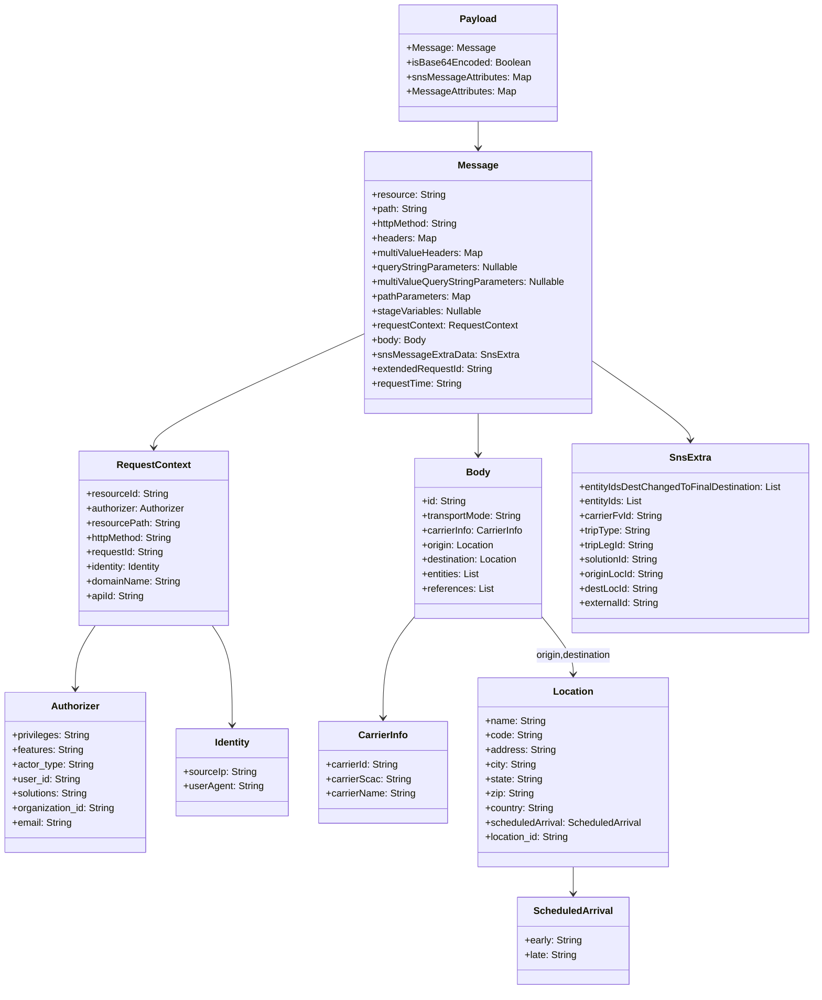

# Diagram: entity_core/entity_service/entity_listener/tests/test_data/create_tripleg_data.py


> Auto-generated by Obscura crawlers

## Diagram 1

```mermaid
flowchart LR
  Start([Start]) --> CreatePayload[/create_payload(entity_id, planned_tripleg_id, origin_location_id, destination_location_id)/]
  CreatePayload --> InitPayload[Initialize payload_dict]
  InitPayload --> SetMessage[Populate Message object]
  SetMessage --> SetHeaders[Set headers & multiValueHeaders]
  SetMessage --> SetRequestContext[Set requestContext (authorizer, identity, meta)]
  SetMessage --> SetBody[Set body (id, transportMode, carrierInfo, origin, destination, entities, references)]
  SetBody --> SetOrigin[Set origin fields + scheduledArrival + location_id]
  SetBody --> SetDestination[Set destination fields + scheduledArrival + location_id]
  SetBody --> SetCarrier[Set carrierInfo fields]
  SetMessage --> SetSnsExtra[Set snsMessageExtraData (entityIds, tripLegId, originLocId, destLocId, externalId)]
  InitPayload --> SetEncoding[Set isBase64Encoded flag]
  InitPayload --> SetAttributes[Set snsMessageAttributes & MessageAttributes]
  SetSnsExtra --> Finalize[Convert payload_dict to JSON string]
  SetAttributes --> Finalize
  SetEncoding --> Finalize
  Finalize --> ReturnVal{{Return {'body': json.dumps(payload_dict)}}}
  ReturnVal --> End([End])
```

> SVG rendering failed for this diagram.

## Diagram 2



### SVG

<svg id="container" width="1345.90234375" xmlns="http://www.w3.org/2000/svg" class="classDiagram" height="1632" viewBox="0 0 1345.90234375 1632" role="graphics-document document" aria-roledescription="class"><style>#container{font-family:"trebuchet ms",verdana,arial,sans-serif;font-size:16px;fill:#333;}@keyframes edge-animation-frame{from{stroke-dashoffset:0;}}@keyframes dash{to{stroke-dashoffset:0;}}#container .edge-animation-slow{stroke-dasharray:9,5!important;stroke-dashoffset:900;animation:dash 50s linear infinite;stroke-linecap:round;}#container .edge-animation-fast{stroke-dasharray:9,5!important;stroke-dashoffset:900;animation:dash 20s linear infinite;stroke-linecap:round;}#container .error-icon{fill:#552222;}#container .error-text{fill:#552222;stroke:#552222;}#container .edge-thickness-normal{stroke-width:1px;}#container .edge-thickness-thick{stroke-width:3.5px;}#container .edge-pattern-solid{stroke-dasharray:0;}#container .edge-thickness-invisible{stroke-width:0;fill:none;}#container .edge-pattern-dashed{stroke-dasharray:3;}#container .edge-pattern-dotted{stroke-dasharray:2;}#container .marker{fill:#333333;stroke:#333333;}#container .marker.cross{stroke:#333333;}#container svg{font-family:"trebuchet ms",verdana,arial,sans-serif;font-size:16px;}#container p{margin:0;}#container g.classGroup text{fill:#9370DB;stroke:none;font-family:"trebuchet ms",verdana,arial,sans-serif;font-size:10px;}#container g.classGroup text .title{font-weight:bolder;}#container .nodeLabel,#container .edgeLabel{color:#131300;}#container .edgeLabel .label rect{fill:#ECECFF;}#container .label text{fill:#131300;}#container .labelBkg{background:#ECECFF;}#container .edgeLabel .label span{background:#ECECFF;}#container .classTitle{font-weight:bolder;}#container .node rect,#container .node circle,#container .node ellipse,#container .node polygon,#container .node path{fill:#ECECFF;stroke:#9370DB;stroke-width:1px;}#container .divider{stroke:#9370DB;stroke-width:1;}#container g.clickable{cursor:pointer;}#container g.classGroup rect{fill:#ECECFF;stroke:#9370DB;}#container g.classGroup line{stroke:#9370DB;stroke-width:1;}#container .classLabel .box{stroke:none;stroke-width:0;fill:#ECECFF;opacity:0.5;}#container .classLabel .label{fill:#9370DB;font-size:10px;}#container .relation{stroke:#333333;stroke-width:1;fill:none;}#container .dashed-line{stroke-dasharray:3;}#container .dotted-line{stroke-dasharray:1 2;}#container #compositionStart,#container .composition{fill:#333333!important;stroke:#333333!important;stroke-width:1;}#container #compositionEnd,#container .composition{fill:#333333!important;stroke:#333333!important;stroke-width:1;}#container #dependencyStart,#container .dependency{fill:#333333!important;stroke:#333333!important;stroke-width:1;}#container #dependencyStart,#container .dependency{fill:#333333!important;stroke:#333333!important;stroke-width:1;}#container #extensionStart,#container .extension{fill:transparent!important;stroke:#333333!important;stroke-width:1;}#container #extensionEnd,#container .extension{fill:transparent!important;stroke:#333333!important;stroke-width:1;}#container #aggregationStart,#container .aggregation{fill:transparent!important;stroke:#333333!important;stroke-width:1;}#container #aggregationEnd,#container .aggregation{fill:transparent!important;stroke:#333333!important;stroke-width:1;}#container #lollipopStart,#container .lollipop{fill:#ECECFF!important;stroke:#333333!important;stroke-width:1;}#container #lollipopEnd,#container .lollipop{fill:#ECECFF!important;stroke:#333333!important;stroke-width:1;}#container .edgeTerminals{font-size:11px;line-height:initial;}#container .classTitleText{text-anchor:middle;font-size:18px;fill:#333;}#container .label-icon{display:inline-block;height:1em;overflow:visible;vertical-align:-0.125em;}#container .node .label-icon path{fill:currentColor;stroke:revert;stroke-width:revert;}#container :root{--mermaid-font-family:"trebuchet ms",verdana,arial,sans-serif;}</style><g><defs><marker id="container_class-aggregationStart" class="marker aggregation class" refX="18" refY="7" markerWidth="190" markerHeight="240" orient="auto"><path d="M 18,7 L9,13 L1,7 L9,1 Z"></path></marker></defs><defs><marker id="container_class-aggregationEnd" class="marker aggregation class" refX="1" refY="7" markerWidth="20" markerHeight="28" orient="auto"><path d="M 18,7 L9,13 L1,7 L9,1 Z"></path></marker></defs><defs><marker id="container_class-extensionStart" class="marker extension class" refX="18" refY="7" markerWidth="190" markerHeight="240" orient="auto"><path d="M 1,7 L18,13 V 1 Z"></path></marker></defs><defs><marker id="container_class-extensionEnd" class="marker extension class" refX="1" refY="7" markerWidth="20" markerHeight="28" orient="auto"><path d="M 1,1 V 13 L18,7 Z"></path></marker></defs><defs><marker id="container_class-compositionStart" class="marker composition class" refX="18" refY="7" markerWidth="190" markerHeight="240" orient="auto"><path d="M 18,7 L9,13 L1,7 L9,1 Z"></path></marker></defs><defs><marker id="container_class-compositionEnd" class="marker composition class" refX="1" refY="7" markerWidth="20" markerHeight="28" orient="auto"><path d="M 18,7 L9,13 L1,7 L9,1 Z"></path></marker></defs><defs><marker id="container_class-dependencyStart" class="marker dependency class" refX="6" refY="7" markerWidth="190" markerHeight="240" orient="auto"><path d="M 5,7 L9,13 L1,7 L9,1 Z"></path></marker></defs><defs><marker id="container_class-dependencyEnd" class="marker dependency class" refX="13" refY="7" markerWidth="20" markerHeight="28" orient="auto"><path d="M 18,7 L9,13 L14,7 L9,1 Z"></path></marker></defs><defs><marker id="container_class-lollipopStart" class="marker lollipop class" refX="13" refY="7" markerWidth="190" markerHeight="240" orient="auto"><circle stroke="black" fill="transparent" cx="7" cy="7" r="6"></circle></marker></defs><defs><marker id="container_class-lollipopEnd" class="marker lollipop class" refX="1" refY="7" markerWidth="190" markerHeight="240" orient="auto"><circle stroke="black" fill="transparent" cx="7" cy="7" r="6"></circle></marker></defs><g class="root"><g class="clusters"></g><g class="edgePaths"><path d="M790.156,200L790.156,204.167C790.156,208.333,790.156,216.667,790.156,224C790.156,231.333,790.156,237.667,790.156,240.833L790.156,244" id="id_Payload_Message_1" class="edge-thickness-normal edge-pattern-solid relation" style=";;;" data-edge="true" data-et="edge" data-id="id_Payload_Message_1" data-points="W3sieCI6NzkwLjE1NjI1LCJ5IjoyMDB9LHsieCI6NzkwLjE1NjI1LCJ5IjoyMjV9LHsieCI6NzkwLjE1NjI1LCJ5IjoyNTB9XQ==" marker-end="url(#container_class-dependencyEnd)"></path><path d="M601.422,550.943L543.632,576.953C485.842,602.962,370.262,654.981,312.472,686.157C254.682,717.333,254.682,727.667,254.682,732.833L254.682,738" id="id_Message_RequestContext_2" class="edge-thickness-normal edge-pattern-solid relation" style=";;;" data-edge="true" data-et="edge" data-id="id_Message_RequestContext_2" data-points="W3sieCI6NjAxLjQyMTg3NSwieSI6NTUwLjk0MzMwNzQ0ODQ4ODd9LHsieCI6MjU0LjY4MTY0MDYyNSwieSI6NzA3fSx7IngiOjI1NC42ODE2NDA2MjUsInkiOjc0NH1d" marker-end="url(#container_class-dependencyEnd)"></path><path d="M157.951,1032L152.465,1040.167C146.979,1048.333,136.007,1064.667,130.521,1082C125.035,1099.333,125.035,1117.667,125.035,1126.833L125.035,1136" id="id_RequestContext_Authorizer_3" class="edge-thickness-normal edge-pattern-solid relation" style=";;;" data-edge="true" data-et="edge" data-id="id_RequestContext_Authorizer_3" data-points="W3sieCI6MTU3Ljk1MDU4NDkyNTUxODExLCJ5IjoxMDMyfSx7IngiOjEyNS4wMzUxNTYyNSwieSI6MTA4MX0seyJ4IjoxMjUuMDM1MTU2MjUsInkiOjExNDJ9XQ==" marker-end="url(#container_class-dependencyEnd)"></path><path d="M351.413,1032L356.899,1040.167C362.385,1048.333,373.356,1064.667,378.842,1092C384.328,1119.333,384.328,1157.667,384.328,1176.833L384.328,1196" id="id_RequestContext_Identity_4" class="edge-thickness-normal edge-pattern-solid relation" style=";;;" data-edge="true" data-et="edge" data-id="id_RequestContext_Identity_4" data-points="W3sieCI6MzUxLjQxMjY5NjMyNDQ4MTksInkiOjEwMzJ9LHsieCI6Mzg0LjMyODEyNSwieSI6MTA4MX0seyJ4IjozODQuMzI4MTI1LCJ5IjoxMjAyfV0=" marker-end="url(#container_class-dependencyEnd)"></path><path d="M790.156,682L790.156,686.167C790.156,690.333,790.156,698.667,790.156,710C790.156,721.333,790.156,735.667,790.156,742.833L790.156,750" id="id_Message_Body_5" class="edge-thickness-normal edge-pattern-solid relation" style=";;;" data-edge="true" data-et="edge" data-id="id_Message_Body_5" data-points="W3sieCI6NzkwLjE1NjI1LCJ5Ijo2ODJ9LHsieCI6NzkwLjE1NjI1LCJ5Ijo3MDd9LHsieCI6NzkwLjE1NjI1LCJ5Ijo3NTZ9XQ==" marker-end="url(#container_class-dependencyEnd)"></path><path d="M978.891,595.163L1006.127,613.802C1033.363,632.442,1087.836,669.721,1115.072,691.527C1142.309,713.333,1142.309,719.667,1142.309,722.833L1142.309,726" id="id_Message_SnsExtra_6" class="edge-thickness-normal edge-pattern-solid relation" style=";;;" data-edge="true" data-et="edge" data-id="id_Message_SnsExtra_6" data-points="W3sieCI6OTc4Ljg5MDYyNSwieSI6NTk1LjE2MjgwNDYyNzc5MTJ9LHsieCI6MTE0Mi4zMDg1OTM3NSwieSI6NzA3fSx7IngiOjExNDIuMzA4NTkzNzUsInkiOjczMn1d" marker-end="url(#container_class-dependencyEnd)"></path><path d="M683.598,1018.755L675.143,1029.129C666.689,1039.503,649.78,1060.252,641.326,1087.792C632.871,1115.333,632.871,1149.667,632.871,1166.833L632.871,1184" id="id_Body_CarrierInfo_7" class="edge-thickness-normal edge-pattern-solid relation" style=";;;" data-edge="true" data-et="edge" data-id="id_Body_CarrierInfo_7" data-points="W3sieCI6NjgzLjU5NzY1NjI1LCJ5IjoxMDE4Ljc1NDkyMzYzMDk0NX0seyJ4Ijo2MzIuODcxMDkzNzUsInkiOjEwODF9LHsieCI6NjMyLjg3MTA5Mzc1LCJ5IjoxMTkwfV0=" marker-end="url(#container_class-dependencyEnd)"></path><path d="M896.715,1018.755L905.169,1029.129C913.624,1039.503,930.533,1060.252,938.987,1075.792C947.441,1091.333,947.441,1101.667,947.441,1106.833L947.441,1112" id="id_Body_Location_8" class="edge-thickness-normal edge-pattern-solid relation" style=";;;" data-edge="true" data-et="edge" data-id="id_Body_Location_8" data-points="W3sieCI6ODk2LjcxNDg0Mzc1LCJ5IjoxMDE4Ljc1NDkyMzYzMDk0NX0seyJ4Ijo5NDcuNDQxNDA2MjUsInkiOjEwODF9LHsieCI6OTQ3LjQ0MTQwNjI1LCJ5IjoxMTE4fV0=" marker-end="url(#container_class-dependencyEnd)"></path><path d="M947.441,1430L947.441,1434.167C947.441,1438.333,947.441,1446.667,947.441,1454C947.441,1461.333,947.441,1467.667,947.441,1470.833L947.441,1474" id="id_Location_ScheduledArrival_9" class="edge-thickness-normal edge-pattern-solid relation" style=";;;" data-edge="true" data-et="edge" data-id="id_Location_ScheduledArrival_9" data-points="W3sieCI6OTQ3LjQ0MTQwNjI1LCJ5IjoxNDMwfSx7IngiOjk0Ny40NDE0MDYyNSwieSI6MTQ1NX0seyJ4Ijo5NDcuNDQxNDA2MjUsInkiOjE0ODB9XQ==" marker-end="url(#container_class-dependencyEnd)"></path></g><g class="edgeLabels"><g class="edgeLabel"><g class="label" data-id="id_Payload_Message_1" transform="translate(0, 0)"><foreignObject width="0" height="0"><div xmlns="http://www.w3.org/1999/xhtml" class="labelBkg" style="display: table-cell; white-space: nowrap; line-height: 1.5; max-width: 200px; text-align: center;"><span class="edgeLabel"></span></div></foreignObject></g></g><g class="edgeLabel"><g class="label" data-id="id_Message_RequestContext_2" transform="translate(0, 0)"><foreignObject width="0" height="0"><div xmlns="http://www.w3.org/1999/xhtml" class="labelBkg" style="display: table-cell; white-space: nowrap; line-height: 1.5; max-width: 200px; text-align: center;"><span class="edgeLabel"></span></div></foreignObject></g></g><g class="edgeLabel"><g class="label" data-id="id_RequestContext_Authorizer_3" transform="translate(0, 0)"><foreignObject width="0" height="0"><div xmlns="http://www.w3.org/1999/xhtml" class="labelBkg" style="display: table-cell; white-space: nowrap; line-height: 1.5; max-width: 200px; text-align: center;"><span class="edgeLabel"></span></div></foreignObject></g></g><g class="edgeLabel"><g class="label" data-id="id_RequestContext_Identity_4" transform="translate(0, 0)"><foreignObject width="0" height="0"><div xmlns="http://www.w3.org/1999/xhtml" class="labelBkg" style="display: table-cell; white-space: nowrap; line-height: 1.5; max-width: 200px; text-align: center;"><span class="edgeLabel"></span></div></foreignObject></g></g><g class="edgeLabel"><g class="label" data-id="id_Message_Body_5" transform="translate(0, 0)"><foreignObject width="0" height="0"><div xmlns="http://www.w3.org/1999/xhtml" class="labelBkg" style="display: table-cell; white-space: nowrap; line-height: 1.5; max-width: 200px; text-align: center;"><span class="edgeLabel"></span></div></foreignObject></g></g><g class="edgeLabel"><g class="label" data-id="id_Message_SnsExtra_6" transform="translate(0, 0)"><foreignObject width="0" height="0"><div xmlns="http://www.w3.org/1999/xhtml" class="labelBkg" style="display: table-cell; white-space: nowrap; line-height: 1.5; max-width: 200px; text-align: center;"><span class="edgeLabel"></span></div></foreignObject></g></g><g class="edgeLabel"><g class="label" data-id="id_Body_CarrierInfo_7" transform="translate(0, 0)"><foreignObject width="0" height="0"><div xmlns="http://www.w3.org/1999/xhtml" class="labelBkg" style="display: table-cell; white-space: nowrap; line-height: 1.5; max-width: 200px; text-align: center;"><span class="edgeLabel"></span></div></foreignObject></g></g><g class="edgeLabel" transform="translate(947.44140625, 1081)"><g class="label" data-id="id_Body_Location_8" transform="translate(-64.53125, -12)"><foreignObject width="129.0625" height="24"><div xmlns="http://www.w3.org/1999/xhtml" class="labelBkg" style="display: table-cell; white-space: nowrap; line-height: 1.5; max-width: 200px; text-align: center;"><span class="edgeLabel"><p>origin,destination</p></span></div></foreignObject></g></g><g class="edgeLabel"><g class="label" data-id="id_Location_ScheduledArrival_9" transform="translate(0, 0)"><foreignObject width="0" height="0"><div xmlns="http://www.w3.org/1999/xhtml" class="labelBkg" style="display: table-cell; white-space: nowrap; line-height: 1.5; max-width: 200px; text-align: center;"><span class="edgeLabel"></span></div></foreignObject></g></g></g><g class="nodes"><g class="node default" id="classId-Payload-0" transform="translate(790.15625, 104)"><g class="basic label-container"><path d="M-128.515625 -96 L128.515625 -96 L128.515625 96 L-128.515625 96" stroke="none" stroke-width="0" fill="#ECECFF" style=""></path><path d="M-128.515625 -96 C-29.744795449037696 -96, 69.02603410192461 -96, 128.515625 -96 M-128.515625 -96 C-49.89173913766028 -96, 28.73214672467944 -96, 128.515625 -96 M128.515625 -96 C128.515625 -50.0362693159057, 128.515625 -4.072538631811398, 128.515625 96 M128.515625 -96 C128.515625 -35.07642841622862, 128.515625 25.847143167542754, 128.515625 96 M128.515625 96 C52.269807361851846 96, -23.976010276296307 96, -128.515625 96 M128.515625 96 C65.38973134192227 96, 2.263837683844528 96, -128.515625 96 M-128.515625 96 C-128.515625 38.42190592592123, -128.515625 -19.15618814815754, -128.515625 -96 M-128.515625 96 C-128.515625 30.77124235405263, -128.515625 -34.45751529189474, -128.515625 -96" stroke="#9370DB" stroke-width="1.3" fill="none" stroke-dasharray="0 0" style=""></path></g><g class="annotation-group text" transform="translate(0, -72)"></g><g class="label-group text" transform="translate(-28.90625, -72)"><g class="label" style="font-weight: bolder" transform="translate(0,-12)"><foreignObject width="57.8125" height="24"><div xmlns="http://www.w3.org/1999/xhtml" style="display: table-cell; white-space: nowrap; line-height: 1.5; max-width: 107px; text-align: center;"><span class="nodeLabel markdown-node-label" style=""><p>Payload</p></span></div></foreignObject></g></g><g class="members-group text" transform="translate(-116.515625, -24)"><g class="label" style="" transform="translate(0,-12)"><foreignObject width="138.3125" height="24"><div xmlns="http://www.w3.org/1999/xhtml" style="display: table-cell; white-space: nowrap; line-height: 1.5; max-width: 196px; text-align: center;"><span class="nodeLabel markdown-node-label" style=""><p>+Message: Message</p></span></div></foreignObject></g><g class="label" style="" transform="translate(0,12)"><foreignObject width="201.53125" height="24"><div xmlns="http://www.w3.org/1999/xhtml" style="display: table-cell; white-space: nowrap; line-height: 1.5; max-width: 259px; text-align: center;"><span class="nodeLabel markdown-node-label" style=""><p>+isBase64Encoded: Boolean</p></span></div></foreignObject></g><g class="label" style="" transform="translate(0,36)"><foreignObject width="204.125" height="24"><div xmlns="http://www.w3.org/1999/xhtml" style="display: table-cell; white-space: nowrap; line-height: 1.5; max-width: 261px; text-align: center;"><span class="nodeLabel markdown-node-label" style=""><p>+snsMessageAttributes: Map</p></span></div></foreignObject></g><g class="label" style="" transform="translate(0,60)"><foreignObject width="179.796875" height="24"><div xmlns="http://www.w3.org/1999/xhtml" style="display: table-cell; white-space: nowrap; line-height: 1.5; max-width: 237px; text-align: center;"><span class="nodeLabel markdown-node-label" style=""><p>+MessageAttributes: Map</p></span></div></foreignObject></g></g><g class="methods-group text" transform="translate(-116.515625, 96)"></g><g class="divider" style=""><path d="M-128.515625 -48 C-59.71227205868831 -48, 9.091080882623373 -48, 128.515625 -48 M-128.515625 -48 C-26.558973416336812 -48, 75.39767816732638 -48, 128.515625 -48" stroke="#9370DB" stroke-width="1.3" fill="none" stroke-dasharray="0 0" style=""></path></g><g class="divider" style=""><path d="M-128.515625 72 C-53.208276393095474 72, 22.099072213809052 72, 128.515625 72 M-128.515625 72 C-62.581658494505774 72, 3.3523080109884518 72, 128.515625 72" stroke="#9370DB" stroke-width="1.3" fill="none" stroke-dasharray="0 0" style=""></path></g></g><g class="node default" id="classId-Message-1" transform="translate(790.15625, 466)"><g class="basic label-container"><path d="M-188.734375 -216 L188.734375 -216 L188.734375 216 L-188.734375 216" stroke="none" stroke-width="0" fill="#ECECFF" style=""></path><path d="M-188.734375 -216 C-106.07164607064762 -216, -23.408917141295234 -216, 188.734375 -216 M-188.734375 -216 C-64.5993368575893 -216, 59.535701284821414 -216, 188.734375 -216 M188.734375 -216 C188.734375 -62.70855606635223, 188.734375 90.58288786729554, 188.734375 216 M188.734375 -216 C188.734375 -71.87004433558741, 188.734375 72.25991132882518, 188.734375 216 M188.734375 216 C40.22844604220296 216, -108.27748291559408 216, -188.734375 216 M188.734375 216 C100.27200842882762 216, 11.809641857655237 216, -188.734375 216 M-188.734375 216 C-188.734375 65.05943055775188, -188.734375 -85.88113888449624, -188.734375 -216 M-188.734375 216 C-188.734375 75.67251532400041, -188.734375 -64.65496935199917, -188.734375 -216" stroke="#9370DB" stroke-width="1.3" fill="none" stroke-dasharray="0 0" style=""></path></g><g class="annotation-group text" transform="translate(0, -192)"></g><g class="label-group text" transform="translate(-31.25, -192)"><g class="label" style="font-weight: bolder" transform="translate(0,-12)"><foreignObject width="62.5" height="24"><div xmlns="http://www.w3.org/1999/xhtml" style="display: table-cell; white-space: nowrap; line-height: 1.5; max-width: 111px; text-align: center;"><span class="nodeLabel markdown-node-label" style=""><p>Message</p></span></div></foreignObject></g></g><g class="members-group text" transform="translate(-176.734375, -144)"><g class="label" style="" transform="translate(0,-12)"><foreignObject width="121.234375" height="24"><div xmlns="http://www.w3.org/1999/xhtml" style="display: table-cell; white-space: nowrap; line-height: 1.5; max-width: 179px; text-align: center;"><span class="nodeLabel markdown-node-label" style=""><p>+resource: String</p></span></div></foreignObject></g><g class="label" style="" transform="translate(0,12)"><foreignObject width="92.15625" height="24"><div xmlns="http://www.w3.org/1999/xhtml" style="display: table-cell; white-space: nowrap; line-height: 1.5; max-width: 150px; text-align: center;"><span class="nodeLabel markdown-node-label" style=""><p>+path: String</p></span></div></foreignObject></g><g class="label" style="" transform="translate(0,36)"><foreignObject width="144.609375" height="24"><div xmlns="http://www.w3.org/1999/xhtml" style="display: table-cell; white-space: nowrap; line-height: 1.5; max-width: 203px; text-align: center;"><span class="nodeLabel markdown-node-label" style=""><p>+httpMethod: String</p></span></div></foreignObject></g><g class="label" style="" transform="translate(0,60)"><foreignObject width="105.0625" height="24"><div xmlns="http://www.w3.org/1999/xhtml" style="display: table-cell; white-space: nowrap; line-height: 1.5; max-width: 162px; text-align: center;"><span class="nodeLabel markdown-node-label" style=""><p>+headers: Map</p></span></div></foreignObject></g><g class="label" style="" transform="translate(0,84)"><foreignObject width="184.09375" height="24"><div xmlns="http://www.w3.org/1999/xhtml" style="display: table-cell; white-space: nowrap; line-height: 1.5; max-width: 241px; text-align: center;"><span class="nodeLabel markdown-node-label" style=""><p>+multiValueHeaders: Map</p></span></div></foreignObject></g><g class="label" style="" transform="translate(0,108)"><foreignObject width="243.203125" height="24"><div xmlns="http://www.w3.org/1999/xhtml" style="display: table-cell; white-space: nowrap; line-height: 1.5; max-width: 301px; text-align: center;"><span class="nodeLabel markdown-node-label" style=""><p>+queryStringParameters: Nullable</p></span></div></foreignObject></g><g class="label" style="" transform="translate(0,132)"><foreignObject width="322.21875" height="24"><div xmlns="http://www.w3.org/1999/xhtml" style="display: table-cell; white-space: nowrap; line-height: 1.5; max-width: 380px; text-align: center;"><span class="nodeLabel markdown-node-label" style=""><p>+multiValueQueryStringParameters: Nullable</p></span></div></foreignObject></g><g class="label" style="" transform="translate(0,156)"><foreignObject width="161.46875" height="24"><div xmlns="http://www.w3.org/1999/xhtml" style="display: table-cell; white-space: nowrap; line-height: 1.5; max-width: 219px; text-align: center;"><span class="nodeLabel markdown-node-label" style=""><p>+pathParameters: Map</p></span></div></foreignObject></g><g class="label" style="" transform="translate(0,180)"><foreignObject width="182.265625" height="24"><div xmlns="http://www.w3.org/1999/xhtml" style="display: table-cell; white-space: nowrap; line-height: 1.5; max-width: 240px; text-align: center;"><span class="nodeLabel markdown-node-label" style=""><p>+stageVariables: Nullable</p></span></div></foreignObject></g><g class="label" style="" transform="translate(0,204)"><foreignObject width="240.421875" height="24"><div xmlns="http://www.w3.org/1999/xhtml" style="display: table-cell; white-space: nowrap; line-height: 1.5; max-width: 298px; text-align: center;"><span class="nodeLabel markdown-node-label" style=""><p>+requestContext: RequestContext</p></span></div></foreignObject></g><g class="label" style="" transform="translate(0,228)"><foreignObject width="88.9375" height="24"><div xmlns="http://www.w3.org/1999/xhtml" style="display: table-cell; white-space: nowrap; line-height: 1.5; max-width: 146px; text-align: center;"><span class="nodeLabel markdown-node-label" style=""><p>+body: Body</p></span></div></foreignObject></g><g class="label" style="" transform="translate(0,252)"><foreignObject width="233.125" height="24"><div xmlns="http://www.w3.org/1999/xhtml" style="display: table-cell; white-space: nowrap; line-height: 1.5; max-width: 290px; text-align: center;"><span class="nodeLabel markdown-node-label" style=""><p>+snsMessageExtraData: SnsExtra</p></span></div></foreignObject></g><g class="label" style="" transform="translate(0,276)"><foreignObject width="200.078125" height="24"><div xmlns="http://www.w3.org/1999/xhtml" style="display: table-cell; white-space: nowrap; line-height: 1.5; max-width: 258px; text-align: center;"><span class="nodeLabel markdown-node-label" style=""><p>+extendedRequestId: String</p></span></div></foreignObject></g><g class="label" style="" transform="translate(0,300)"><foreignObject width="149.4375" height="24"><div xmlns="http://www.w3.org/1999/xhtml" style="display: table-cell; white-space: nowrap; line-height: 1.5; max-width: 207px; text-align: center;"><span class="nodeLabel markdown-node-label" style=""><p>+requestTime: String</p></span></div></foreignObject></g></g><g class="methods-group text" transform="translate(-176.734375, 216)"></g><g class="divider" style=""><path d="M-188.734375 -168 C-51.85629818586398 -168, 85.02177862827205 -168, 188.734375 -168 M-188.734375 -168 C-53.55397036219122 -168, 81.62643427561756 -168, 188.734375 -168" stroke="#9370DB" stroke-width="1.3" fill="none" stroke-dasharray="0 0" style=""></path></g><g class="divider" style=""><path d="M-188.734375 192 C-39.6763240883233 192, 109.3817268233534 192, 188.734375 192 M-188.734375 192 C-83.87257521509854 192, 20.98922456980293 192, 188.734375 192" stroke="#9370DB" stroke-width="1.3" fill="none" stroke-dasharray="0 0" style=""></path></g></g><g class="node default" id="classId-RequestContext-2" transform="translate(254.681640625, 888)"><g class="basic label-container"><path d="M-124.27734375 -144 L124.27734375 -144 L124.27734375 144 L-124.27734375 144" stroke="none" stroke-width="0" fill="#ECECFF" style=""></path><path d="M-124.27734375 -144 C-47.26586528511294 -144, 29.745613179774125 -144, 124.27734375 -144 M-124.27734375 -144 C-25.843543365059375 -144, 72.59025701988125 -144, 124.27734375 -144 M124.27734375 -144 C124.27734375 -39.32098080458951, 124.27734375 65.35803839082098, 124.27734375 144 M124.27734375 -144 C124.27734375 -75.22252187675461, 124.27734375 -6.445043753509225, 124.27734375 144 M124.27734375 144 C50.879773678274674 144, -22.517796393450652 144, -124.27734375 144 M124.27734375 144 C53.41290169205914 144, -17.451540365881726 144, -124.27734375 144 M-124.27734375 144 C-124.27734375 80.12042932873032, -124.27734375 16.24085865746065, -124.27734375 -144 M-124.27734375 144 C-124.27734375 35.21430784502934, -124.27734375 -73.57138430994132, -124.27734375 -144" stroke="#9370DB" stroke-width="1.3" fill="none" stroke-dasharray="0 0" style=""></path></g><g class="annotation-group text" transform="translate(0, -120)"></g><g class="label-group text" transform="translate(-58.1484375, -120)"><g class="label" style="font-weight: bolder" transform="translate(0,-12)"><foreignObject width="116.296875" height="24"><div xmlns="http://www.w3.org/1999/xhtml" style="display: table-cell; white-space: nowrap; line-height: 1.5; max-width: 164px; text-align: center;"><span class="nodeLabel markdown-node-label" style=""><p>RequestContext</p></span></div></foreignObject></g></g><g class="members-group text" transform="translate(-112.27734375, -72)"><g class="label" style="" transform="translate(0,-12)"><foreignObject width="135.53125" height="24"><div xmlns="http://www.w3.org/1999/xhtml" style="display: table-cell; white-space: nowrap; line-height: 1.5; max-width: 194px; text-align: center;"><span class="nodeLabel markdown-node-label" style=""><p>+resourceId: String</p></span></div></foreignObject></g><g class="label" style="" transform="translate(0,12)"><foreignObject width="166.40625" height="24"><div xmlns="http://www.w3.org/1999/xhtml" style="display: table-cell; white-space: nowrap; line-height: 1.5; max-width: 225px; text-align: center;"><span class="nodeLabel markdown-node-label" style=""><p>+authorizer: Authorizer</p></span></div></foreignObject></g><g class="label" style="" transform="translate(0,36)"><foreignObject width="153.515625" height="24"><div xmlns="http://www.w3.org/1999/xhtml" style="display: table-cell; white-space: nowrap; line-height: 1.5; max-width: 212px; text-align: center;"><span class="nodeLabel markdown-node-label" style=""><p>+resourcePath: String</p></span></div></foreignObject></g><g class="label" style="" transform="translate(0,60)"><foreignObject width="144.609375" height="24"><div xmlns="http://www.w3.org/1999/xhtml" style="display: table-cell; white-space: nowrap; line-height: 1.5; max-width: 203px; text-align: center;"><span class="nodeLabel markdown-node-label" style=""><p>+httpMethod: String</p></span></div></foreignObject></g><g class="label" style="" transform="translate(0,84)"><foreignObject width="128.5" height="24"><div xmlns="http://www.w3.org/1999/xhtml" style="display: table-cell; white-space: nowrap; line-height: 1.5; max-width: 187px; text-align: center;"><span class="nodeLabel markdown-node-label" style=""><p>+requestId: String</p></span></div></foreignObject></g><g class="label" style="" transform="translate(0,108)"><foreignObject width="128.40625" height="24"><div xmlns="http://www.w3.org/1999/xhtml" style="display: table-cell; white-space: nowrap; line-height: 1.5; max-width: 186px; text-align: center;"><span class="nodeLabel markdown-node-label" style=""><p>+identity: Identity</p></span></div></foreignObject></g><g class="label" style="" transform="translate(0,132)"><foreignObject width="156.234375" height="24"><div xmlns="http://www.w3.org/1999/xhtml" style="display: table-cell; white-space: nowrap; line-height: 1.5; max-width: 214px; text-align: center;"><span class="nodeLabel markdown-node-label" style=""><p>+domainName: String</p></span></div></foreignObject></g><g class="label" style="" transform="translate(0,156)"><foreignObject width="95.71875" height="24"><div xmlns="http://www.w3.org/1999/xhtml" style="display: table-cell; white-space: nowrap; line-height: 1.5; max-width: 154px; text-align: center;"><span class="nodeLabel markdown-node-label" style=""><p>+apiId: String</p></span></div></foreignObject></g></g><g class="methods-group text" transform="translate(-112.27734375, 144)"></g><g class="divider" style=""><path d="M-124.27734375 -96 C-47.58742793804191 -96, 29.102487873916175 -96, 124.27734375 -96 M-124.27734375 -96 C-41.10682529913629 -96, 42.06369315172742 -96, 124.27734375 -96" stroke="#9370DB" stroke-width="1.3" fill="none" stroke-dasharray="0 0" style=""></path></g><g class="divider" style=""><path d="M-124.27734375 120 C-48.275814566626906 120, 27.72571461674619 120, 124.27734375 120 M-124.27734375 120 C-59.46266633115685 120, 5.352011087686293 120, 124.27734375 120" stroke="#9370DB" stroke-width="1.3" fill="none" stroke-dasharray="0 0" style=""></path></g></g><g class="node default" id="classId-Authorizer-3" transform="translate(125.03515625, 1274)"><g class="basic label-container"><path d="M-117.03515625 -132 L117.03515625 -132 L117.03515625 132 L-117.03515625 132" stroke="none" stroke-width="0" fill="#ECECFF" style=""></path><path d="M-117.03515625 -132 C-63.822961020815406 -132, -10.610765791630811 -132, 117.03515625 -132 M-117.03515625 -132 C-60.618106603790785 -132, -4.201056957581571 -132, 117.03515625 -132 M117.03515625 -132 C117.03515625 -74.90385738270601, 117.03515625 -17.80771476541203, 117.03515625 132 M117.03515625 -132 C117.03515625 -72.68424795890968, 117.03515625 -13.368495917819374, 117.03515625 132 M117.03515625 132 C24.48675554243151 132, -68.06164516513698 132, -117.03515625 132 M117.03515625 132 C39.75743053050732 132, -37.52029518898536 132, -117.03515625 132 M-117.03515625 132 C-117.03515625 49.75831332830478, -117.03515625 -32.48337334339044, -117.03515625 -132 M-117.03515625 132 C-117.03515625 49.235295569964265, -117.03515625 -33.52940886007147, -117.03515625 -132" stroke="#9370DB" stroke-width="1.3" fill="none" stroke-dasharray="0 0" style=""></path></g><g class="annotation-group text" transform="translate(0, -108)"></g><g class="label-group text" transform="translate(-38.3671875, -108)"><g class="label" style="font-weight: bolder" transform="translate(0,-12)"><foreignObject width="76.734375" height="24"><div xmlns="http://www.w3.org/1999/xhtml" style="display: table-cell; white-space: nowrap; line-height: 1.5; max-width: 126px; text-align: center;"><span class="nodeLabel markdown-node-label" style=""><p>Authorizer</p></span></div></foreignObject></g></g><g class="members-group text" transform="translate(-105.03515625, -60)"><g class="label" style="" transform="translate(0,-12)"><foreignObject width="129.109375" height="24"><div xmlns="http://www.w3.org/1999/xhtml" style="display: table-cell; white-space: nowrap; line-height: 1.5; max-width: 187px; text-align: center;"><span class="nodeLabel markdown-node-label" style=""><p>+privileges: String</p></span></div></foreignObject></g><g class="label" style="" transform="translate(0,12)"><foreignObject width="118.15625" height="24"><div xmlns="http://www.w3.org/1999/xhtml" style="display: table-cell; white-space: nowrap; line-height: 1.5; max-width: 176px; text-align: center;"><span class="nodeLabel markdown-node-label" style=""><p>+features: String</p></span></div></foreignObject></g><g class="label" style="" transform="translate(0,36)"><foreignObject width="134.625" height="24"><div xmlns="http://www.w3.org/1999/xhtml" style="display: table-cell; white-space: nowrap; line-height: 1.5; max-width: 193px; text-align: center;"><span class="nodeLabel markdown-node-label" style=""><p>+actor_type: String</p></span></div></foreignObject></g><g class="label" style="" transform="translate(0,60)"><foreignObject width="111.75" height="24"><div xmlns="http://www.w3.org/1999/xhtml" style="display: table-cell; white-space: nowrap; line-height: 1.5; max-width: 170px; text-align: center;"><span class="nodeLabel markdown-node-label" style=""><p>+user_id: String</p></span></div></foreignObject></g><g class="label" style="" transform="translate(0,84)"><foreignObject width="126.25" height="24"><div xmlns="http://www.w3.org/1999/xhtml" style="display: table-cell; white-space: nowrap; line-height: 1.5; max-width: 184px; text-align: center;"><span class="nodeLabel markdown-node-label" style=""><p>+solutions: String</p></span></div></foreignObject></g><g class="label" style="" transform="translate(0,108)"><foreignObject width="171.703125" height="24"><div xmlns="http://www.w3.org/1999/xhtml" style="display: table-cell; white-space: nowrap; line-height: 1.5; max-width: 230px; text-align: center;"><span class="nodeLabel markdown-node-label" style=""><p>+organization_id: String</p></span></div></foreignObject></g><g class="label" style="" transform="translate(0,132)"><foreignObject width="99.453125" height="24"><div xmlns="http://www.w3.org/1999/xhtml" style="display: table-cell; white-space: nowrap; line-height: 1.5; max-width: 157px; text-align: center;"><span class="nodeLabel markdown-node-label" style=""><p>+email: String</p></span></div></foreignObject></g></g><g class="methods-group text" transform="translate(-105.03515625, 132)"></g><g class="divider" style=""><path d="M-117.03515625 -84 C-38.22100710009853 -84, 40.593142049802935 -84, 117.03515625 -84 M-117.03515625 -84 C-62.22229152858602 -84, -7.409426807172039 -84, 117.03515625 -84" stroke="#9370DB" stroke-width="1.3" fill="none" stroke-dasharray="0 0" style=""></path></g><g class="divider" style=""><path d="M-117.03515625 108 C-39.994422711839064 108, 37.04631082632187 108, 117.03515625 108 M-117.03515625 108 C-25.544058399079674 108, 65.94703945184065 108, 117.03515625 108" stroke="#9370DB" stroke-width="1.3" fill="none" stroke-dasharray="0 0" style=""></path></g></g><g class="node default" id="classId-Identity-4" transform="translate(384.328125, 1274)"><g class="basic label-container"><path d="M-92.2578125 -72 L92.2578125 -72 L92.2578125 72 L-92.2578125 72" stroke="none" stroke-width="0" fill="#ECECFF" style=""></path><path d="M-92.2578125 -72 C-47.17717921674699 -72, -2.096545933493985 -72, 92.2578125 -72 M-92.2578125 -72 C-44.762245513176694 -72, 2.733321473646612 -72, 92.2578125 -72 M92.2578125 -72 C92.2578125 -41.936109049588836, 92.2578125 -11.872218099177672, 92.2578125 72 M92.2578125 -72 C92.2578125 -18.249892198062682, 92.2578125 35.500215603874636, 92.2578125 72 M92.2578125 72 C38.285604121191234 72, -15.686604257617532 72, -92.2578125 72 M92.2578125 72 C34.149729964488365 72, -23.95835257102327 72, -92.2578125 72 M-92.2578125 72 C-92.2578125 32.12174642912477, -92.2578125 -7.756507141750461, -92.2578125 -72 M-92.2578125 72 C-92.2578125 36.86430871269694, -92.2578125 1.7286174253938782, -92.2578125 -72" stroke="#9370DB" stroke-width="1.3" fill="none" stroke-dasharray="0 0" style=""></path></g><g class="annotation-group text" transform="translate(0, -48)"></g><g class="label-group text" transform="translate(-28.71875, -48)"><g class="label" style="font-weight: bolder" transform="translate(0,-12)"><foreignObject width="57.4375" height="24"><div xmlns="http://www.w3.org/1999/xhtml" style="display: table-cell; white-space: nowrap; line-height: 1.5; max-width: 106px; text-align: center;"><span class="nodeLabel markdown-node-label" style=""><p>Identity</p></span></div></foreignObject></g></g><g class="members-group text" transform="translate(-80.2578125, 0)"><g class="label" style="" transform="translate(0,-12)"><foreignObject width="121.046875" height="24"><div xmlns="http://www.w3.org/1999/xhtml" style="display: table-cell; white-space: nowrap; line-height: 1.5; max-width: 179px; text-align: center;"><span class="nodeLabel markdown-node-label" style=""><p>+sourceIp: String</p></span></div></foreignObject></g><g class="label" style="" transform="translate(0,12)"><foreignObject width="131.796875" height="24"><div xmlns="http://www.w3.org/1999/xhtml" style="display: table-cell; white-space: nowrap; line-height: 1.5; max-width: 190px; text-align: center;"><span class="nodeLabel markdown-node-label" style=""><p>+userAgent: String</p></span></div></foreignObject></g></g><g class="methods-group text" transform="translate(-80.2578125, 72)"></g><g class="divider" style=""><path d="M-92.2578125 -24 C-37.88035585394326 -24, 16.497100792113486 -24, 92.2578125 -24 M-92.2578125 -24 C-39.26131503626785 -24, 13.735182427464295 -24, 92.2578125 -24" stroke="#9370DB" stroke-width="1.3" fill="none" stroke-dasharray="0 0" style=""></path></g><g class="divider" style=""><path d="M-92.2578125 48 C-50.379175970142185 48, -8.50053944028437 48, 92.2578125 48 M-92.2578125 48 C-46.58453861149252 48, -0.9112647229850381 48, 92.2578125 48" stroke="#9370DB" stroke-width="1.3" fill="none" stroke-dasharray="0 0" style=""></path></g></g><g class="node default" id="classId-Body-5" transform="translate(790.15625, 888)"><g class="basic label-container"><path d="M-106.55859375 -132 L106.55859375 -132 L106.55859375 132 L-106.55859375 132" stroke="none" stroke-width="0" fill="#ECECFF" style=""></path><path d="M-106.55859375 -132 C-33.70456935356175 -132, 39.1494550428765 -132, 106.55859375 -132 M-106.55859375 -132 C-50.14364472408842 -132, 6.2713043018231645 -132, 106.55859375 -132 M106.55859375 -132 C106.55859375 -39.42370330813726, 106.55859375 53.152593383725474, 106.55859375 132 M106.55859375 -132 C106.55859375 -44.46798260381337, 106.55859375 43.06403479237326, 106.55859375 132 M106.55859375 132 C39.32401661978538 132, -27.910560510429235 132, -106.55859375 132 M106.55859375 132 C30.541866730520255 132, -45.47486028895949 132, -106.55859375 132 M-106.55859375 132 C-106.55859375 38.64987003437514, -106.55859375 -54.70025993124972, -106.55859375 -132 M-106.55859375 132 C-106.55859375 30.781995983631347, -106.55859375 -70.4360080327373, -106.55859375 -132" stroke="#9370DB" stroke-width="1.3" fill="none" stroke-dasharray="0 0" style=""></path></g><g class="annotation-group text" transform="translate(0, -108)"></g><g class="label-group text" transform="translate(-18.5546875, -108)"><g class="label" style="font-weight: bolder" transform="translate(0,-12)"><foreignObject width="37.109375" height="24"><div xmlns="http://www.w3.org/1999/xhtml" style="display: table-cell; white-space: nowrap; line-height: 1.5; max-width: 87px; text-align: center;"><span class="nodeLabel markdown-node-label" style=""><p>Body</p></span></div></foreignObject></g></g><g class="members-group text" transform="translate(-94.55859375, -60)"><g class="label" style="" transform="translate(0,-12)"><foreignObject width="73.03125" height="24"><div xmlns="http://www.w3.org/1999/xhtml" style="display: table-cell; white-space: nowrap; line-height: 1.5; max-width: 131px; text-align: center;"><span class="nodeLabel markdown-node-label" style=""><p>+id: String</p></span></div></foreignObject></g><g class="label" style="" transform="translate(0,12)"><foreignObject width="166.703125" height="24"><div xmlns="http://www.w3.org/1999/xhtml" style="display: table-cell; white-space: nowrap; line-height: 1.5; max-width: 225px; text-align: center;"><span class="nodeLabel markdown-node-label" style=""><p>+transportMode: String</p></span></div></foreignObject></g><g class="label" style="" transform="translate(0,36)"><foreignObject width="170.5625" height="24"><div xmlns="http://www.w3.org/1999/xhtml" style="display: table-cell; white-space: nowrap; line-height: 1.5; max-width: 228px; text-align: center;"><span class="nodeLabel markdown-node-label" style=""><p>+carrierInfo: CarrierInfo</p></span></div></foreignObject></g><g class="label" style="" transform="translate(0,60)"><foreignObject width="120.421875" height="24"><div xmlns="http://www.w3.org/1999/xhtml" style="display: table-cell; white-space: nowrap; line-height: 1.5; max-width: 178px; text-align: center;"><span class="nodeLabel markdown-node-label" style=""><p>+origin: Location</p></span></div></foreignObject></g><g class="label" style="" transform="translate(0,84)"><foreignObject width="161.3125" height="24"><div xmlns="http://www.w3.org/1999/xhtml" style="display: table-cell; white-space: nowrap; line-height: 1.5; max-width: 219px; text-align: center;"><span class="nodeLabel markdown-node-label" style=""><p>+destination: Location</p></span></div></foreignObject></g><g class="label" style="" transform="translate(0,108)"><foreignObject width="96.65625" height="24"><div xmlns="http://www.w3.org/1999/xhtml" style="display: table-cell; white-space: nowrap; line-height: 1.5; max-width: 154px; text-align: center;"><span class="nodeLabel markdown-node-label" style=""><p>+entities: List</p></span></div></foreignObject></g><g class="label" style="" transform="translate(0,132)"><foreignObject width="117.453125" height="24"><div xmlns="http://www.w3.org/1999/xhtml" style="display: table-cell; white-space: nowrap; line-height: 1.5; max-width: 175px; text-align: center;"><span class="nodeLabel markdown-node-label" style=""><p>+references: List</p></span></div></foreignObject></g></g><g class="methods-group text" transform="translate(-94.55859375, 132)"></g><g class="divider" style=""><path d="M-106.55859375 -84 C-29.904873236623303 -84, 46.748847276753395 -84, 106.55859375 -84 M-106.55859375 -84 C-40.51144132591577 -84, 25.535711098168463 -84, 106.55859375 -84" stroke="#9370DB" stroke-width="1.3" fill="none" stroke-dasharray="0 0" style=""></path></g><g class="divider" style=""><path d="M-106.55859375 108 C-58.325208208638045 108, -10.091822667276091 108, 106.55859375 108 M-106.55859375 108 C-28.35774737063359 108, 49.84309900873282 108, 106.55859375 108" stroke="#9370DB" stroke-width="1.3" fill="none" stroke-dasharray="0 0" style=""></path></g></g><g class="node default" id="classId-CarrierInfo-6" transform="translate(632.87109375, 1274)"><g class="basic label-container"><path d="M-106.28515625 -84 L106.28515625 -84 L106.28515625 84 L-106.28515625 84" stroke="none" stroke-width="0" fill="#ECECFF" style=""></path><path d="M-106.28515625 -84 C-28.346115415258367 -84, 49.592925419483265 -84, 106.28515625 -84 M-106.28515625 -84 C-44.98586847974068 -84, 16.313419290518638 -84, 106.28515625 -84 M106.28515625 -84 C106.28515625 -42.557508201027595, 106.28515625 -1.1150164020551898, 106.28515625 84 M106.28515625 -84 C106.28515625 -32.87921176225326, 106.28515625 18.241576475493474, 106.28515625 84 M106.28515625 84 C22.220987958384143 84, -61.843180333231714 84, -106.28515625 84 M106.28515625 84 C53.01806802453446 84, -0.2490202009310849 84, -106.28515625 84 M-106.28515625 84 C-106.28515625 44.950369201670206, -106.28515625 5.900738403340412, -106.28515625 -84 M-106.28515625 84 C-106.28515625 17.78625218789564, -106.28515625 -48.42749562420872, -106.28515625 -84" stroke="#9370DB" stroke-width="1.3" fill="none" stroke-dasharray="0 0" style=""></path></g><g class="annotation-group text" transform="translate(0, -60)"></g><g class="label-group text" transform="translate(-39.6015625, -60)"><g class="label" style="font-weight: bolder" transform="translate(0,-12)"><foreignObject width="79.203125" height="24"><div xmlns="http://www.w3.org/1999/xhtml" style="display: table-cell; white-space: nowrap; line-height: 1.5; max-width: 128px; text-align: center;"><span class="nodeLabel markdown-node-label" style=""><p>CarrierInfo</p></span></div></foreignObject></g></g><g class="members-group text" transform="translate(-94.28515625, -12)"><g class="label" style="" transform="translate(0,-12)"><foreignObject width="121.1875" height="24"><div xmlns="http://www.w3.org/1999/xhtml" style="display: table-cell; white-space: nowrap; line-height: 1.5; max-width: 179px; text-align: center;"><span class="nodeLabel markdown-node-label" style=""><p>+carrierId: String</p></span></div></foreignObject></g><g class="label" style="" transform="translate(0,12)"><foreignObject width="139.53125" height="24"><div xmlns="http://www.w3.org/1999/xhtml" style="display: table-cell; white-space: nowrap; line-height: 1.5; max-width: 198px; text-align: center;"><span class="nodeLabel markdown-node-label" style=""><p>+carrierScac: String</p></span></div></foreignObject></g><g class="label" style="" transform="translate(0,36)"><foreignObject width="148.96875" height="24"><div xmlns="http://www.w3.org/1999/xhtml" style="display: table-cell; white-space: nowrap; line-height: 1.5; max-width: 207px; text-align: center;"><span class="nodeLabel markdown-node-label" style=""><p>+carrierName: String</p></span></div></foreignObject></g></g><g class="methods-group text" transform="translate(-94.28515625, 84)"></g><g class="divider" style=""><path d="M-106.28515625 -36 C-49.33313863012439 -36, 7.618878989751224 -36, 106.28515625 -36 M-106.28515625 -36 C-32.86406148436029 -36, 40.557033281279416 -36, 106.28515625 -36" stroke="#9370DB" stroke-width="1.3" fill="none" stroke-dasharray="0 0" style=""></path></g><g class="divider" style=""><path d="M-106.28515625 60 C-45.62562506513228 60, 15.033906119735434 60, 106.28515625 60 M-106.28515625 60 C-41.320914728935264 60, 23.64332679212947 60, 106.28515625 60" stroke="#9370DB" stroke-width="1.3" fill="none" stroke-dasharray="0 0" style=""></path></g></g><g class="node default" id="classId-Location-7" transform="translate(947.44140625, 1274)"><g class="basic label-container"><path d="M-158.28515625 -156 L158.28515625 -156 L158.28515625 156 L-158.28515625 156" stroke="none" stroke-width="0" fill="#ECECFF" style=""></path><path d="M-158.28515625 -156 C-76.52912288416123 -156, 5.22691048167755 -156, 158.28515625 -156 M-158.28515625 -156 C-93.45394530981157 -156, -28.622734369623146 -156, 158.28515625 -156 M158.28515625 -156 C158.28515625 -66.38166652270525, 158.28515625 23.23666695458951, 158.28515625 156 M158.28515625 -156 C158.28515625 -50.44477077383773, 158.28515625 55.110458452324536, 158.28515625 156 M158.28515625 156 C77.36126415141555 156, -3.5626279471688918 156, -158.28515625 156 M158.28515625 156 C40.773956017530125 156, -76.73724421493975 156, -158.28515625 156 M-158.28515625 156 C-158.28515625 48.096452093164544, -158.28515625 -59.80709581367091, -158.28515625 -156 M-158.28515625 156 C-158.28515625 44.03943276296724, -158.28515625 -67.92113447406552, -158.28515625 -156" stroke="#9370DB" stroke-width="1.3" fill="none" stroke-dasharray="0 0" style=""></path></g><g class="annotation-group text" transform="translate(0, -132)"></g><g class="label-group text" transform="translate(-31.3515625, -132)"><g class="label" style="font-weight: bolder" transform="translate(0,-12)"><foreignObject width="62.703125" height="24"><div xmlns="http://www.w3.org/1999/xhtml" style="display: table-cell; white-space: nowrap; line-height: 1.5; max-width: 112px; text-align: center;"><span class="nodeLabel markdown-node-label" style=""><p>Location</p></span></div></foreignObject></g></g><g class="members-group text" transform="translate(-146.28515625, -84)"><g class="label" style="" transform="translate(0,-12)"><foreignObject width="99.46875" height="24"><div xmlns="http://www.w3.org/1999/xhtml" style="display: table-cell; white-space: nowrap; line-height: 1.5; max-width: 157px; text-align: center;"><span class="nodeLabel markdown-node-label" style=""><p>+name: String</p></span></div></foreignObject></g><g class="label" style="" transform="translate(0,12)"><foreignObject width="93.90625" height="24"><div xmlns="http://www.w3.org/1999/xhtml" style="display: table-cell; white-space: nowrap; line-height: 1.5; max-width: 152px; text-align: center;"><span class="nodeLabel markdown-node-label" style=""><p>+code: String</p></span></div></foreignObject></g><g class="label" style="" transform="translate(0,36)"><foreignObject width="115.75" height="24"><div xmlns="http://www.w3.org/1999/xhtml" style="display: table-cell; white-space: nowrap; line-height: 1.5; max-width: 174px; text-align: center;"><span class="nodeLabel markdown-node-label" style=""><p>+address: String</p></span></div></foreignObject></g><g class="label" style="" transform="translate(0,60)"><foreignObject width="84.75" height="24"><div xmlns="http://www.w3.org/1999/xhtml" style="display: table-cell; white-space: nowrap; line-height: 1.5; max-width: 143px; text-align: center;"><span class="nodeLabel markdown-node-label" style=""><p>+city: String</p></span></div></foreignObject></g><g class="label" style="" transform="translate(0,84)"><foreignObject width="95.046875" height="24"><div xmlns="http://www.w3.org/1999/xhtml" style="display: table-cell; white-space: nowrap; line-height: 1.5; max-width: 153px; text-align: center;"><span class="nodeLabel markdown-node-label" style=""><p>+state: String</p></span></div></foreignObject></g><g class="label" style="" transform="translate(0,108)"><foreignObject width="79.484375" height="24"><div xmlns="http://www.w3.org/1999/xhtml" style="display: table-cell; white-space: nowrap; line-height: 1.5; max-width: 138px; text-align: center;"><span class="nodeLabel markdown-node-label" style=""><p>+zip: String</p></span></div></foreignObject></g><g class="label" style="" transform="translate(0,132)"><foreignObject width="114.203125" height="24"><div xmlns="http://www.w3.org/1999/xhtml" style="display: table-cell; white-space: nowrap; line-height: 1.5; max-width: 172px; text-align: center;"><span class="nodeLabel markdown-node-label" style=""><p>+country: String</p></span></div></foreignObject></g><g class="label" style="" transform="translate(0,156)"><foreignObject width="261.21875" height="24"><div xmlns="http://www.w3.org/1999/xhtml" style="display: table-cell; white-space: nowrap; line-height: 1.5; max-width: 319px; text-align: center;"><span class="nodeLabel markdown-node-label" style=""><p>+scheduledArrival: ScheduledArrival</p></span></div></foreignObject></g><g class="label" style="" transform="translate(0,180)"><foreignObject width="140.5" height="24"><div xmlns="http://www.w3.org/1999/xhtml" style="display: table-cell; white-space: nowrap; line-height: 1.5; max-width: 199px; text-align: center;"><span class="nodeLabel markdown-node-label" style=""><p>+location_id: String</p></span></div></foreignObject></g></g><g class="methods-group text" transform="translate(-146.28515625, 156)"></g><g class="divider" style=""><path d="M-158.28515625 -108 C-61.928122139464264 -108, 34.42891197107147 -108, 158.28515625 -108 M-158.28515625 -108 C-52.957064864217955 -108, 52.37102652156409 -108, 158.28515625 -108" stroke="#9370DB" stroke-width="1.3" fill="none" stroke-dasharray="0 0" style=""></path></g><g class="divider" style=""><path d="M-158.28515625 132 C-89.78083033573905 132, -21.27650442147811 132, 158.28515625 132 M-158.28515625 132 C-86.63884643503197 132, -14.99253662006393 132, 158.28515625 132" stroke="#9370DB" stroke-width="1.3" fill="none" stroke-dasharray="0 0" style=""></path></g></g><g class="node default" id="classId-ScheduledArrival-8" transform="translate(947.44140625, 1552)"><g class="basic label-container"><path d="M-90.6171875 -72 L90.6171875 -72 L90.6171875 72 L-90.6171875 72" stroke="none" stroke-width="0" fill="#ECECFF" style=""></path><path d="M-90.6171875 -72 C-23.423825270228022 -72, 43.769536959543956 -72, 90.6171875 -72 M-90.6171875 -72 C-22.708983795937485 -72, 45.19921990812503 -72, 90.6171875 -72 M90.6171875 -72 C90.6171875 -30.38413947277833, 90.6171875 11.23172105444334, 90.6171875 72 M90.6171875 -72 C90.6171875 -15.48636779664875, 90.6171875 41.0272644067025, 90.6171875 72 M90.6171875 72 C37.49884357717696 72, -15.619500345646074 72, -90.6171875 72 M90.6171875 72 C45.17473894950173 72, -0.2677096009965396 72, -90.6171875 72 M-90.6171875 72 C-90.6171875 32.248225294681895, -90.6171875 -7.503549410636211, -90.6171875 -72 M-90.6171875 72 C-90.6171875 15.8559759802596, -90.6171875 -40.2880480394808, -90.6171875 -72" stroke="#9370DB" stroke-width="1.3" fill="none" stroke-dasharray="0 0" style=""></path></g><g class="annotation-group text" transform="translate(0, -48)"></g><g class="label-group text" transform="translate(-62.375, -48)"><g class="label" style="font-weight: bolder" transform="translate(0,-12)"><foreignObject width="124.75" height="24"><div xmlns="http://www.w3.org/1999/xhtml" style="display: table-cell; white-space: nowrap; line-height: 1.5; max-width: 173px; text-align: center;"><span class="nodeLabel markdown-node-label" style=""><p>ScheduledArrival</p></span></div></foreignObject></g></g><g class="members-group text" transform="translate(-78.6171875, 0)"><g class="label" style="" transform="translate(0,-12)"><foreignObject width="94.859375" height="24"><div xmlns="http://www.w3.org/1999/xhtml" style="display: table-cell; white-space: nowrap; line-height: 1.5; max-width: 153px; text-align: center;"><span class="nodeLabel markdown-node-label" style=""><p>+early: String</p></span></div></foreignObject></g><g class="label" style="" transform="translate(0,12)"><foreignObject width="86.515625" height="24"><div xmlns="http://www.w3.org/1999/xhtml" style="display: table-cell; white-space: nowrap; line-height: 1.5; max-width: 145px; text-align: center;"><span class="nodeLabel markdown-node-label" style=""><p>+late: String</p></span></div></foreignObject></g></g><g class="methods-group text" transform="translate(-78.6171875, 72)"></g><g class="divider" style=""><path d="M-90.6171875 -24 C-50.35467220734526 -24, -10.09215691469052 -24, 90.6171875 -24 M-90.6171875 -24 C-51.8549595665752 -24, -13.092731633150393 -24, 90.6171875 -24" stroke="#9370DB" stroke-width="1.3" fill="none" stroke-dasharray="0 0" style=""></path></g><g class="divider" style=""><path d="M-90.6171875 48 C-26.4968559019636 48, 37.6234756960728 48, 90.6171875 48 M-90.6171875 48 C-48.13585834980301 48, -5.654529199606017 48, 90.6171875 48" stroke="#9370DB" stroke-width="1.3" fill="none" stroke-dasharray="0 0" style=""></path></g></g><g class="node default" id="classId-SnsExtra-9" transform="translate(1142.30859375, 888)"><g class="basic label-container"><path d="M-195.59375 -156 L195.59375 -156 L195.59375 156 L-195.59375 156" stroke="none" stroke-width="0" fill="#ECECFF" style=""></path><path d="M-195.59375 -156 C-91.71431654221432 -156, 12.16511691557136 -156, 195.59375 -156 M-195.59375 -156 C-41.3673270896318 -156, 112.8590958207364 -156, 195.59375 -156 M195.59375 -156 C195.59375 -78.06917685150202, 195.59375 -0.13835370300404293, 195.59375 156 M195.59375 -156 C195.59375 -64.81904549363878, 195.59375 26.361909012722435, 195.59375 156 M195.59375 156 C100.56255846742641 156, 5.5313669348528265 156, -195.59375 156 M195.59375 156 C92.70411285105182 156, -10.185524297896364 156, -195.59375 156 M-195.59375 156 C-195.59375 82.06013367236253, -195.59375 8.12026734472505, -195.59375 -156 M-195.59375 156 C-195.59375 61.215541819327186, -195.59375 -33.56891636134563, -195.59375 -156" stroke="#9370DB" stroke-width="1.3" fill="none" stroke-dasharray="0 0" style=""></path></g><g class="annotation-group text" transform="translate(0, -132)"></g><g class="label-group text" transform="translate(-31.765625, -132)"><g class="label" style="font-weight: bolder" transform="translate(0,-12)"><foreignObject width="63.53125" height="24"><div xmlns="http://www.w3.org/1999/xhtml" style="display: table-cell; white-space: nowrap; line-height: 1.5; max-width: 112px; text-align: center;"><span class="nodeLabel markdown-node-label" style=""><p>SnsExtra</p></span></div></foreignObject></g></g><g class="members-group text" transform="translate(-183.59375, -84)"><g class="label" style="" transform="translate(0,-12)"><foreignObject width="335.421875" height="24"><div xmlns="http://www.w3.org/1999/xhtml" style="display: table-cell; white-space: nowrap; line-height: 1.5; max-width: 393px; text-align: center;"><span class="nodeLabel markdown-node-label" style=""><p>+entityIdsDestChangedToFinalDestination: List</p></span></div></foreignObject></g><g class="label" style="" transform="translate(0,12)"><foreignObject width="105.515625" height="24"><div xmlns="http://www.w3.org/1999/xhtml" style="display: table-cell; white-space: nowrap; line-height: 1.5; max-width: 163px; text-align: center;"><span class="nodeLabel markdown-node-label" style=""><p>+entityIds: List</p></span></div></foreignObject></g><g class="label" style="" transform="translate(0,36)"><foreignObject width="136.359375" height="24"><div xmlns="http://www.w3.org/1999/xhtml" style="display: table-cell; white-space: nowrap; line-height: 1.5; max-width: 194px; text-align: center;"><span class="nodeLabel markdown-node-label" style=""><p>+carrierFvId: String</p></span></div></foreignObject></g><g class="label" style="" transform="translate(0,60)"><foreignObject width="118.5625" height="24"><div xmlns="http://www.w3.org/1999/xhtml" style="display: table-cell; white-space: nowrap; line-height: 1.5; max-width: 177px; text-align: center;"><span class="nodeLabel markdown-node-label" style=""><p>+tripType: String</p></span></div></foreignObject></g><g class="label" style="" transform="translate(0,84)"><foreignObject width="123.734375" height="24"><div xmlns="http://www.w3.org/1999/xhtml" style="display: table-cell; white-space: nowrap; line-height: 1.5; max-width: 182px; text-align: center;"><span class="nodeLabel markdown-node-label" style=""><p>+tripLegId: String</p></span></div></foreignObject></g><g class="label" style="" transform="translate(0,108)"><foreignObject width="133.0625" height="24"><div xmlns="http://www.w3.org/1999/xhtml" style="display: table-cell; white-space: nowrap; line-height: 1.5; max-width: 191px; text-align: center;"><span class="nodeLabel markdown-node-label" style=""><p>+solutionId: String</p></span></div></foreignObject></g><g class="label" style="" transform="translate(0,132)"><foreignObject width="140.046875" height="24"><div xmlns="http://www.w3.org/1999/xhtml" style="display: table-cell; white-space: nowrap; line-height: 1.5; max-width: 198px; text-align: center;"><span class="nodeLabel markdown-node-label" style=""><p>+originLocId: String</p></span></div></foreignObject></g><g class="label" style="" transform="translate(0,156)"><foreignObject width="129.34375" height="24"><div xmlns="http://www.w3.org/1999/xhtml" style="display: table-cell; white-space: nowrap; line-height: 1.5; max-width: 187px; text-align: center;"><span class="nodeLabel markdown-node-label" style=""><p>+destLocId: String</p></span></div></foreignObject></g><g class="label" style="" transform="translate(0,180)"><foreignObject width="132.609375" height="24"><div xmlns="http://www.w3.org/1999/xhtml" style="display: table-cell; white-space: nowrap; line-height: 1.5; max-width: 191px; text-align: center;"><span class="nodeLabel markdown-node-label" style=""><p>+externalId: String</p></span></div></foreignObject></g></g><g class="methods-group text" transform="translate(-183.59375, 156)"></g><g class="divider" style=""><path d="M-195.59375 -108 C-70.16684182600355 -108, 55.260066347992904 -108, 195.59375 -108 M-195.59375 -108 C-94.76114541739419 -108, 6.071459165211621 -108, 195.59375 -108" stroke="#9370DB" stroke-width="1.3" fill="none" stroke-dasharray="0 0" style=""></path></g><g class="divider" style=""><path d="M-195.59375 132 C-76.31391005571462 132, 42.96592988857077 132, 195.59375 132 M-195.59375 132 C-48.925818238130574 132, 97.74211352373885 132, 195.59375 132" stroke="#9370DB" stroke-width="1.3" fill="none" stroke-dasharray="0 0" style=""></path></g></g></g></g></g></svg>
