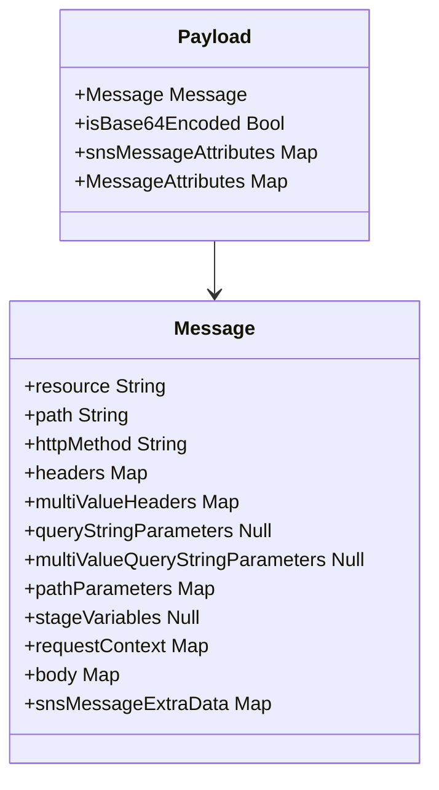

# Diagram: entity_core/entity_service/entity_listener/tests/test_data/delete_tripleg_data.py


> Auto-generated by Obscura crawlers

## Diagram 1

```mermaid
flowchart TD
  A[create_payload(entity_id, planned_tripleg_id, old_origin_location_id=288501, old_destination_location_id=288501)]
  B[Initialize payload_dict]
  C[Populate Message fields\n(resource, path, httpMethod, headers,\nmultiValueHeaders, pathParameters, requestContext, body)]
  D[Populate snsMessageExtraData\n(deletedEntityIds <- entity_id,\ntripLegId <- planned_tripleg_id,\noldOriginLocationId <- old_origin_location_id,\noldDestinationLocationId <- old_destination_location_id)]
  E[Wrap payload into return value:\n{\"body\": json.dumps(payload_dict)}]
  A --> B
  B --> C
  C --> D
  D --> E
```

> SVG rendering failed for this diagram.

## Diagram 2



### SVG

<svg id="container" width="358.171875" xmlns="http://www.w3.org/2000/svg" class="classDiagram" height="642" viewBox="0 0 358.171875 642" role="graphics-document document" aria-roledescription="class"><style>#container{font-family:"trebuchet ms",verdana,arial,sans-serif;font-size:16px;fill:#333;}@keyframes edge-animation-frame{from{stroke-dashoffset:0;}}@keyframes dash{to{stroke-dashoffset:0;}}#container .edge-animation-slow{stroke-dasharray:9,5!important;stroke-dashoffset:900;animation:dash 50s linear infinite;stroke-linecap:round;}#container .edge-animation-fast{stroke-dasharray:9,5!important;stroke-dashoffset:900;animation:dash 20s linear infinite;stroke-linecap:round;}#container .error-icon{fill:#552222;}#container .error-text{fill:#552222;stroke:#552222;}#container .edge-thickness-normal{stroke-width:1px;}#container .edge-thickness-thick{stroke-width:3.5px;}#container .edge-pattern-solid{stroke-dasharray:0;}#container .edge-thickness-invisible{stroke-width:0;fill:none;}#container .edge-pattern-dashed{stroke-dasharray:3;}#container .edge-pattern-dotted{stroke-dasharray:2;}#container .marker{fill:#333333;stroke:#333333;}#container .marker.cross{stroke:#333333;}#container svg{font-family:"trebuchet ms",verdana,arial,sans-serif;font-size:16px;}#container p{margin:0;}#container g.classGroup text{fill:#9370DB;stroke:none;font-family:"trebuchet ms",verdana,arial,sans-serif;font-size:10px;}#container g.classGroup text .title{font-weight:bolder;}#container .nodeLabel,#container .edgeLabel{color:#131300;}#container .edgeLabel .label rect{fill:#ECECFF;}#container .label text{fill:#131300;}#container .labelBkg{background:#ECECFF;}#container .edgeLabel .label span{background:#ECECFF;}#container .classTitle{font-weight:bolder;}#container .node rect,#container .node circle,#container .node ellipse,#container .node polygon,#container .node path{fill:#ECECFF;stroke:#9370DB;stroke-width:1px;}#container .divider{stroke:#9370DB;stroke-width:1;}#container g.clickable{cursor:pointer;}#container g.classGroup rect{fill:#ECECFF;stroke:#9370DB;}#container g.classGroup line{stroke:#9370DB;stroke-width:1;}#container .classLabel .box{stroke:none;stroke-width:0;fill:#ECECFF;opacity:0.5;}#container .classLabel .label{fill:#9370DB;font-size:10px;}#container .relation{stroke:#333333;stroke-width:1;fill:none;}#container .dashed-line{stroke-dasharray:3;}#container .dotted-line{stroke-dasharray:1 2;}#container #compositionStart,#container .composition{fill:#333333!important;stroke:#333333!important;stroke-width:1;}#container #compositionEnd,#container .composition{fill:#333333!important;stroke:#333333!important;stroke-width:1;}#container #dependencyStart,#container .dependency{fill:#333333!important;stroke:#333333!important;stroke-width:1;}#container #dependencyStart,#container .dependency{fill:#333333!important;stroke:#333333!important;stroke-width:1;}#container #extensionStart,#container .extension{fill:transparent!important;stroke:#333333!important;stroke-width:1;}#container #extensionEnd,#container .extension{fill:transparent!important;stroke:#333333!important;stroke-width:1;}#container #aggregationStart,#container .aggregation{fill:transparent!important;stroke:#333333!important;stroke-width:1;}#container #aggregationEnd,#container .aggregation{fill:transparent!important;stroke:#333333!important;stroke-width:1;}#container #lollipopStart,#container .lollipop{fill:#ECECFF!important;stroke:#333333!important;stroke-width:1;}#container #lollipopEnd,#container .lollipop{fill:#ECECFF!important;stroke:#333333!important;stroke-width:1;}#container .edgeTerminals{font-size:11px;line-height:initial;}#container .classTitleText{text-anchor:middle;font-size:18px;fill:#333;}#container .label-icon{display:inline-block;height:1em;overflow:visible;vertical-align:-0.125em;}#container .node .label-icon path{fill:currentColor;stroke:revert;stroke-width:revert;}#container :root{--mermaid-font-family:"trebuchet ms",verdana,arial,sans-serif;}</style><g><defs><marker id="container_class-aggregationStart" class="marker aggregation class" refX="18" refY="7" markerWidth="190" markerHeight="240" orient="auto"><path d="M 18,7 L9,13 L1,7 L9,1 Z"></path></marker></defs><defs><marker id="container_class-aggregationEnd" class="marker aggregation class" refX="1" refY="7" markerWidth="20" markerHeight="28" orient="auto"><path d="M 18,7 L9,13 L1,7 L9,1 Z"></path></marker></defs><defs><marker id="container_class-extensionStart" class="marker extension class" refX="18" refY="7" markerWidth="190" markerHeight="240" orient="auto"><path d="M 1,7 L18,13 V 1 Z"></path></marker></defs><defs><marker id="container_class-extensionEnd" class="marker extension class" refX="1" refY="7" markerWidth="20" markerHeight="28" orient="auto"><path d="M 1,1 V 13 L18,7 Z"></path></marker></defs><defs><marker id="container_class-compositionStart" class="marker composition class" refX="18" refY="7" markerWidth="190" markerHeight="240" orient="auto"><path d="M 18,7 L9,13 L1,7 L9,1 Z"></path></marker></defs><defs><marker id="container_class-compositionEnd" class="marker composition class" refX="1" refY="7" markerWidth="20" markerHeight="28" orient="auto"><path d="M 18,7 L9,13 L1,7 L9,1 Z"></path></marker></defs><defs><marker id="container_class-dependencyStart" class="marker dependency class" refX="6" refY="7" markerWidth="190" markerHeight="240" orient="auto"><path d="M 5,7 L9,13 L1,7 L9,1 Z"></path></marker></defs><defs><marker id="container_class-dependencyEnd" class="marker dependency class" refX="13" refY="7" markerWidth="20" markerHeight="28" orient="auto"><path d="M 18,7 L9,13 L14,7 L9,1 Z"></path></marker></defs><defs><marker id="container_class-lollipopStart" class="marker lollipop class" refX="13" refY="7" markerWidth="190" markerHeight="240" orient="auto"><circle stroke="black" fill="transparent" cx="7" cy="7" r="6"></circle></marker></defs><defs><marker id="container_class-lollipopEnd" class="marker lollipop class" refX="1" refY="7" markerWidth="190" markerHeight="240" orient="auto"><circle stroke="black" fill="transparent" cx="7" cy="7" r="6"></circle></marker></defs><g class="root"><g class="clusters"></g><g class="edgePaths"><path d="M179.086,200L179.086,204.167C179.086,208.333,179.086,216.667,179.086,224C179.086,231.333,179.086,237.667,179.086,240.833L179.086,244" id="id_Payload_Message_1" class="edge-thickness-normal edge-pattern-solid relation" style=";;;" data-edge="true" data-et="edge" data-id="id_Payload_Message_1" data-points="W3sieCI6MTc5LjA4NTkzNzUsInkiOjIwMH0seyJ4IjoxNzkuMDg1OTM3NSwieSI6MjI1fSx7IngiOjE3OS4wODU5Mzc1LCJ5IjoyNTB9XQ==" marker-end="url(#container_class-dependencyEnd)"></path></g><g class="edgeLabels"><g class="edgeLabel"><g class="label" data-id="id_Payload_Message_1" transform="translate(0, 0)"><foreignObject width="0" height="0"><div xmlns="http://www.w3.org/1999/xhtml" class="labelBkg" style="display: table-cell; white-space: nowrap; line-height: 1.5; max-width: 200px; text-align: center;"><span class="edgeLabel"></span></div></foreignObject></g></g></g><g class="nodes"><g class="node default" id="classId-Payload-0" transform="translate(179.0859375, 104)"><g class="basic label-container"><path d="M-126.59375 -96 L126.59375 -96 L126.59375 96 L-126.59375 96" stroke="none" stroke-width="0" fill="#ECECFF" style=""></path><path d="M-126.59375 -96 C-33.806292631630484 -96, 58.98116473673903 -96, 126.59375 -96 M-126.59375 -96 C-27.475644336809324 -96, 71.64246132638135 -96, 126.59375 -96 M126.59375 -96 C126.59375 -45.593378638410485, 126.59375 4.81324272317903, 126.59375 96 M126.59375 -96 C126.59375 -26.07963673997675, 126.59375 43.8407265200465, 126.59375 96 M126.59375 96 C32.14506263370026 96, -62.303624732599474 96, -126.59375 96 M126.59375 96 C51.926123920948896 96, -22.741502158102207 96, -126.59375 96 M-126.59375 96 C-126.59375 45.96875366610577, -126.59375 -4.062492667788462, -126.59375 -96 M-126.59375 96 C-126.59375 39.63065233104085, -126.59375 -16.7386953379183, -126.59375 -96" stroke="#9370DB" stroke-width="1.3" fill="none" stroke-dasharray="0 0" style=""></path></g><g class="annotation-group text" transform="translate(0, -72)"></g><g class="label-group text" transform="translate(-28.90625, -72)"><g class="label" style="font-weight: bolder" transform="translate(0,-12)"><foreignObject width="57.8125" height="24"><div xmlns="http://www.w3.org/1999/xhtml" style="display: table-cell; white-space: nowrap; line-height: 1.5; max-width: 107px; text-align: center;"><span class="nodeLabel markdown-node-label" style=""><p>Payload</p></span></div></foreignObject></g></g><g class="members-group text" transform="translate(-114.59375, -24)"><g class="label" style="" transform="translate(0,-12)"><foreignObject width="134.46875" height="24"><div xmlns="http://www.w3.org/1999/xhtml" style="display: table-cell; white-space: nowrap; line-height: 1.5; max-width: 192px; text-align: center;"><span class="nodeLabel markdown-node-label" style=""><p>+Message Message</p></span></div></foreignObject></g><g class="label" style="" transform="translate(0,12)"><foreignObject width="171.125" height="24"><div xmlns="http://www.w3.org/1999/xhtml" style="display: table-cell; white-space: nowrap; line-height: 1.5; max-width: 229px; text-align: center;"><span class="nodeLabel markdown-node-label" style=""><p>+isBase64Encoded Bool</p></span></div></foreignObject></g><g class="label" style="" transform="translate(0,36)"><foreignObject width="200.28125" height="24"><div xmlns="http://www.w3.org/1999/xhtml" style="display: table-cell; white-space: nowrap; line-height: 1.5; max-width: 258px; text-align: center;"><span class="nodeLabel markdown-node-label" style=""><p>+snsMessageAttributes Map</p></span></div></foreignObject></g><g class="label" style="" transform="translate(0,60)"><foreignObject width="175.953125" height="24"><div xmlns="http://www.w3.org/1999/xhtml" style="display: table-cell; white-space: nowrap; line-height: 1.5; max-width: 233px; text-align: center;"><span class="nodeLabel markdown-node-label" style=""><p>+MessageAttributes Map</p></span></div></foreignObject></g></g><g class="methods-group text" transform="translate(-114.59375, 96)"></g><g class="divider" style=""><path d="M-126.59375 -48 C-42.77100046270091 -48, 41.05174907459818 -48, 126.59375 -48 M-126.59375 -48 C-58.69514270384499 -48, 9.203464592310013 -48, 126.59375 -48" stroke="#9370DB" stroke-width="1.3" fill="none" stroke-dasharray="0 0" style=""></path></g><g class="divider" style=""><path d="M-126.59375 72 C-28.007304131900725 72, 70.57914173619855 72, 126.59375 72 M-126.59375 72 C-44.74275465911754 72, 37.108240681764926 72, 126.59375 72" stroke="#9370DB" stroke-width="1.3" fill="none" stroke-dasharray="0 0" style=""></path></g></g><g class="node default" id="classId-Message-1" transform="translate(179.0859375, 442)"><g class="basic label-container"><path d="M-171.0859375 -192 L171.0859375 -192 L171.0859375 192 L-171.0859375 192" stroke="none" stroke-width="0" fill="#ECECFF" style=""></path><path d="M-171.0859375 -192 C-62.736524842947176 -192, 45.61288781410565 -192, 171.0859375 -192 M-171.0859375 -192 C-39.406434732356985 -192, 92.27306803528603 -192, 171.0859375 -192 M171.0859375 -192 C171.0859375 -41.34491568799169, 171.0859375 109.31016862401663, 171.0859375 192 M171.0859375 -192 C171.0859375 -81.18714768604065, 171.0859375 29.625704627918708, 171.0859375 192 M171.0859375 192 C65.4671536380052 192, -40.1516302239896 192, -171.0859375 192 M171.0859375 192 C57.19621795473131 192, -56.69350159053738 192, -171.0859375 192 M-171.0859375 192 C-171.0859375 76.77087198829061, -171.0859375 -38.458256023418784, -171.0859375 -192 M-171.0859375 192 C-171.0859375 42.38156799322502, -171.0859375 -107.23686401354996, -171.0859375 -192" stroke="#9370DB" stroke-width="1.3" fill="none" stroke-dasharray="0 0" style=""></path></g><g class="annotation-group text" transform="translate(0, -168)"></g><g class="label-group text" transform="translate(-31.25, -168)"><g class="label" style="font-weight: bolder" transform="translate(0,-12)"><foreignObject width="62.5" height="24"><div xmlns="http://www.w3.org/1999/xhtml" style="display: table-cell; white-space: nowrap; line-height: 1.5; max-width: 111px; text-align: center;"><span class="nodeLabel markdown-node-label" style=""><p>Message</p></span></div></foreignObject></g></g><g class="members-group text" transform="translate(-159.0859375, -120)"><g class="label" style="" transform="translate(0,-12)"><foreignObject width="117.40625" height="24"><div xmlns="http://www.w3.org/1999/xhtml" style="display: table-cell; white-space: nowrap; line-height: 1.5; max-width: 175px; text-align: center;"><span class="nodeLabel markdown-node-label" style=""><p>+resource String</p></span></div></foreignObject></g><g class="label" style="" transform="translate(0,12)"><foreignObject width="88.3125" height="24"><div xmlns="http://www.w3.org/1999/xhtml" style="display: table-cell; white-space: nowrap; line-height: 1.5; max-width: 146px; text-align: center;"><span class="nodeLabel markdown-node-label" style=""><p>+path String</p></span></div></foreignObject></g><g class="label" style="" transform="translate(0,36)"><foreignObject width="140.78125" height="24"><div xmlns="http://www.w3.org/1999/xhtml" style="display: table-cell; white-space: nowrap; line-height: 1.5; max-width: 199px; text-align: center;"><span class="nodeLabel markdown-node-label" style=""><p>+httpMethod String</p></span></div></foreignObject></g><g class="label" style="" transform="translate(0,60)"><foreignObject width="101.21875" height="24"><div xmlns="http://www.w3.org/1999/xhtml" style="display: table-cell; white-space: nowrap; line-height: 1.5; max-width: 159px; text-align: center;"><span class="nodeLabel markdown-node-label" style=""><p>+headers Map</p></span></div></foreignObject></g><g class="label" style="" transform="translate(0,84)"><foreignObject width="180.25" height="24"><div xmlns="http://www.w3.org/1999/xhtml" style="display: table-cell; white-space: nowrap; line-height: 1.5; max-width: 238px; text-align: center;"><span class="nodeLabel markdown-node-label" style=""><p>+multiValueHeaders Map</p></span></div></foreignObject></g><g class="label" style="" transform="translate(0,108)"><foreignObject width="207.90625" height="24"><div xmlns="http://www.w3.org/1999/xhtml" style="display: table-cell; white-space: nowrap; line-height: 1.5; max-width: 266px; text-align: center;"><span class="nodeLabel markdown-node-label" style=""><p>+queryStringParameters Null</p></span></div></foreignObject></g><g class="label" style="" transform="translate(0,132)"><foreignObject width="286.921875" height="24"><div xmlns="http://www.w3.org/1999/xhtml" style="display: table-cell; white-space: nowrap; line-height: 1.5; max-width: 345px; text-align: center;"><span class="nodeLabel markdown-node-label" style=""><p>+multiValueQueryStringParameters Null</p></span></div></foreignObject></g><g class="label" style="" transform="translate(0,156)"><foreignObject width="157.625" height="24"><div xmlns="http://www.w3.org/1999/xhtml" style="display: table-cell; white-space: nowrap; line-height: 1.5; max-width: 215px; text-align: center;"><span class="nodeLabel markdown-node-label" style=""><p>+pathParameters Map</p></span></div></foreignObject></g><g class="label" style="" transform="translate(0,180)"><foreignObject width="146.96875" height="24"><div xmlns="http://www.w3.org/1999/xhtml" style="display: table-cell; white-space: nowrap; line-height: 1.5; max-width: 205px; text-align: center;"><span class="nodeLabel markdown-node-label" style=""><p>+stageVariables Null</p></span></div></foreignObject></g><g class="label" style="" transform="translate(0,204)"><foreignObject width="153.15625" height="24"><div xmlns="http://www.w3.org/1999/xhtml" style="display: table-cell; white-space: nowrap; line-height: 1.5; max-width: 211px; text-align: center;"><span class="nodeLabel markdown-node-label" style=""><p>+requestContext Map</p></span></div></foreignObject></g><g class="label" style="" transform="translate(0,228)"><foreignObject width="79.171875" height="24"><div xmlns="http://www.w3.org/1999/xhtml" style="display: table-cell; white-space: nowrap; line-height: 1.5; max-width: 137px; text-align: center;"><span class="nodeLabel markdown-node-label" style=""><p>+body Map</p></span></div></foreignObject></g><g class="label" style="" transform="translate(0,252)"><foreignObject width="197.953125" height="24"><div xmlns="http://www.w3.org/1999/xhtml" style="display: table-cell; white-space: nowrap; line-height: 1.5; max-width: 255px; text-align: center;"><span class="nodeLabel markdown-node-label" style=""><p>+snsMessageExtraData Map</p></span></div></foreignObject></g></g><g class="methods-group text" transform="translate(-159.0859375, 192)"></g><g class="divider" style=""><path d="M-171.0859375 -144 C-101.14054026125982 -144, -31.19514302251963 -144, 171.0859375 -144 M-171.0859375 -144 C-73.05532761511527 -144, 24.97528226976945 -144, 171.0859375 -144" stroke="#9370DB" stroke-width="1.3" fill="none" stroke-dasharray="0 0" style=""></path></g><g class="divider" style=""><path d="M-171.0859375 168 C-68.88072156849897 168, 33.32449436300206 168, 171.0859375 168 M-171.0859375 168 C-86.74494477978105 168, -2.4039520595621013 168, 171.0859375 168" stroke="#9370DB" stroke-width="1.3" fill="none" stroke-dasharray="0 0" style=""></path></g></g></g></g></g></svg>
