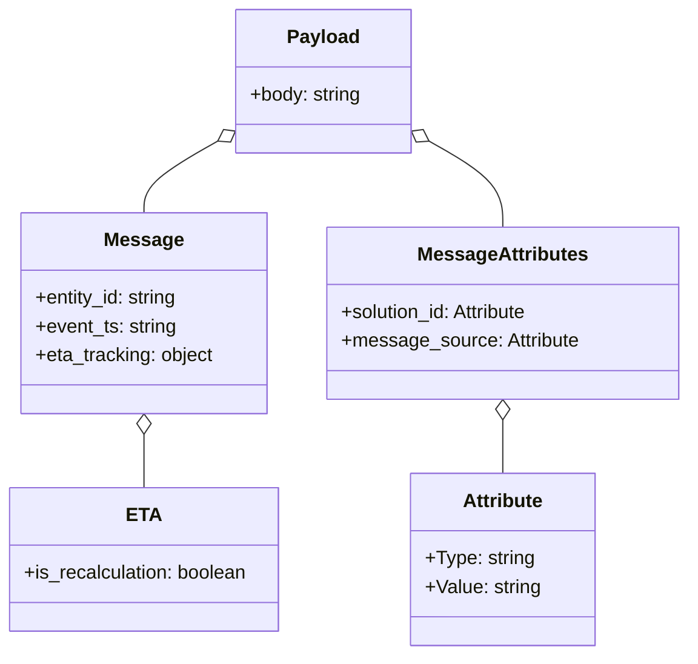

# Diagram: entity_core/entity_service/entity_listener/tests/test_data/recalculate_eta_data.py


> Auto-generated by Obscura crawlers

## Diagram 1



### SVG

<svg id="container" width="573.27734375" xmlns="http://www.w3.org/2000/svg" class="classDiagram" height="548" viewBox="0 0 573.27734375 548" role="graphics-document document" aria-roledescription="class"><style>#container{font-family:"trebuchet ms",verdana,arial,sans-serif;font-size:16px;fill:#333;}@keyframes edge-animation-frame{from{stroke-dashoffset:0;}}@keyframes dash{to{stroke-dashoffset:0;}}#container .edge-animation-slow{stroke-dasharray:9,5!important;stroke-dashoffset:900;animation:dash 50s linear infinite;stroke-linecap:round;}#container .edge-animation-fast{stroke-dasharray:9,5!important;stroke-dashoffset:900;animation:dash 20s linear infinite;stroke-linecap:round;}#container .error-icon{fill:#552222;}#container .error-text{fill:#552222;stroke:#552222;}#container .edge-thickness-normal{stroke-width:1px;}#container .edge-thickness-thick{stroke-width:3.5px;}#container .edge-pattern-solid{stroke-dasharray:0;}#container .edge-thickness-invisible{stroke-width:0;fill:none;}#container .edge-pattern-dashed{stroke-dasharray:3;}#container .edge-pattern-dotted{stroke-dasharray:2;}#container .marker{fill:#333333;stroke:#333333;}#container .marker.cross{stroke:#333333;}#container svg{font-family:"trebuchet ms",verdana,arial,sans-serif;font-size:16px;}#container p{margin:0;}#container g.classGroup text{fill:#9370DB;stroke:none;font-family:"trebuchet ms",verdana,arial,sans-serif;font-size:10px;}#container g.classGroup text .title{font-weight:bolder;}#container .nodeLabel,#container .edgeLabel{color:#131300;}#container .edgeLabel .label rect{fill:#ECECFF;}#container .label text{fill:#131300;}#container .labelBkg{background:#ECECFF;}#container .edgeLabel .label span{background:#ECECFF;}#container .classTitle{font-weight:bolder;}#container .node rect,#container .node circle,#container .node ellipse,#container .node polygon,#container .node path{fill:#ECECFF;stroke:#9370DB;stroke-width:1px;}#container .divider{stroke:#9370DB;stroke-width:1;}#container g.clickable{cursor:pointer;}#container g.classGroup rect{fill:#ECECFF;stroke:#9370DB;}#container g.classGroup line{stroke:#9370DB;stroke-width:1;}#container .classLabel .box{stroke:none;stroke-width:0;fill:#ECECFF;opacity:0.5;}#container .classLabel .label{fill:#9370DB;font-size:10px;}#container .relation{stroke:#333333;stroke-width:1;fill:none;}#container .dashed-line{stroke-dasharray:3;}#container .dotted-line{stroke-dasharray:1 2;}#container #compositionStart,#container .composition{fill:#333333!important;stroke:#333333!important;stroke-width:1;}#container #compositionEnd,#container .composition{fill:#333333!important;stroke:#333333!important;stroke-width:1;}#container #dependencyStart,#container .dependency{fill:#333333!important;stroke:#333333!important;stroke-width:1;}#container #dependencyStart,#container .dependency{fill:#333333!important;stroke:#333333!important;stroke-width:1;}#container #extensionStart,#container .extension{fill:transparent!important;stroke:#333333!important;stroke-width:1;}#container #extensionEnd,#container .extension{fill:transparent!important;stroke:#333333!important;stroke-width:1;}#container #aggregationStart,#container .aggregation{fill:transparent!important;stroke:#333333!important;stroke-width:1;}#container #aggregationEnd,#container .aggregation{fill:transparent!important;stroke:#333333!important;stroke-width:1;}#container #lollipopStart,#container .lollipop{fill:#ECECFF!important;stroke:#333333!important;stroke-width:1;}#container #lollipopEnd,#container .lollipop{fill:#ECECFF!important;stroke:#333333!important;stroke-width:1;}#container .edgeTerminals{font-size:11px;line-height:initial;}#container .classTitleText{text-anchor:middle;font-size:18px;fill:#333;}#container .label-icon{display:inline-block;height:1em;overflow:visible;vertical-align:-0.125em;}#container .node .label-icon path{fill:currentColor;stroke:revert;stroke-width:revert;}#container :root{--mermaid-font-family:"trebuchet ms",verdana,arial,sans-serif;}</style><g><defs><marker id="container_class-aggregationStart" class="marker aggregation class" refX="18" refY="7" markerWidth="190" markerHeight="240" orient="auto"><path d="M 18,7 L9,13 L1,7 L9,1 Z"></path></marker></defs><defs><marker id="container_class-aggregationEnd" class="marker aggregation class" refX="1" refY="7" markerWidth="20" markerHeight="28" orient="auto"><path d="M 18,7 L9,13 L1,7 L9,1 Z"></path></marker></defs><defs><marker id="container_class-extensionStart" class="marker extension class" refX="18" refY="7" markerWidth="190" markerHeight="240" orient="auto"><path d="M 1,7 L18,13 V 1 Z"></path></marker></defs><defs><marker id="container_class-extensionEnd" class="marker extension class" refX="1" refY="7" markerWidth="20" markerHeight="28" orient="auto"><path d="M 1,1 V 13 L18,7 Z"></path></marker></defs><defs><marker id="container_class-compositionStart" class="marker composition class" refX="18" refY="7" markerWidth="190" markerHeight="240" orient="auto"><path d="M 18,7 L9,13 L1,7 L9,1 Z"></path></marker></defs><defs><marker id="container_class-compositionEnd" class="marker composition class" refX="1" refY="7" markerWidth="20" markerHeight="28" orient="auto"><path d="M 18,7 L9,13 L1,7 L9,1 Z"></path></marker></defs><defs><marker id="container_class-dependencyStart" class="marker dependency class" refX="6" refY="7" markerWidth="190" markerHeight="240" orient="auto"><path d="M 5,7 L9,13 L1,7 L9,1 Z"></path></marker></defs><defs><marker id="container_class-dependencyEnd" class="marker dependency class" refX="13" refY="7" markerWidth="20" markerHeight="28" orient="auto"><path d="M 18,7 L9,13 L14,7 L9,1 Z"></path></marker></defs><defs><marker id="container_class-lollipopStart" class="marker lollipop class" refX="13" refY="7" markerWidth="190" markerHeight="240" orient="auto"><circle stroke="black" fill="transparent" cx="7" cy="7" r="6"></circle></marker></defs><defs><marker id="container_class-lollipopEnd" class="marker lollipop class" refX="1" refY="7" markerWidth="190" markerHeight="240" orient="auto"><circle stroke="black" fill="transparent" cx="7" cy="7" r="6"></circle></marker></defs><g class="root"><g class="clusters"></g><g class="edgePaths"><path d="M182.045,118.385L171.915,124.154C161.784,129.923,141.523,141.462,131.392,151.397C121.262,161.333,121.262,169.667,121.262,173.833L121.262,178" id="id_Payload_Message_1" class="edge-thickness-normal edge-pattern-solid relation" style=";;;" data-edge="true" data-et="edge" data-id="id_Payload_Message_1" data-points="W3sieCI6MTk3LjAzNTE1NjI1LCJ5IjoxMDkuODQ4MjA3Mjc1NTgyMzF9LHsieCI6MTIxLjI2MTcxODc1LCJ5IjoxNTN9LHsieCI6MTIxLjI2MTcxODc1LCJ5IjoxNzh9XQ==" marker-start="url(#container_class-aggregationStart)"></path><path d="M358.994,118.385L369.124,124.154C379.255,129.923,399.516,141.462,409.647,153.397C419.777,165.333,419.777,177.667,419.777,183.833L419.777,190" id="id_Payload_MessageAttributes_2" class="edge-thickness-normal edge-pattern-solid relation" style=";;;" data-edge="true" data-et="edge" data-id="id_Payload_MessageAttributes_2" data-points="W3sieCI6MzQ0LjAwMzkwNjI1LCJ5IjoxMDkuODQ4MjA3Mjc1NTgyMzF9LHsieCI6NDE5Ljc3NzM0Mzc1LCJ5IjoxNTN9LHsieCI6NDE5Ljc3NzM0Mzc1LCJ5IjoxOTB9XQ==" marker-start="url(#container_class-aggregationStart)"></path><path d="M121.262,363.25L121.262,364.542C121.262,365.833,121.262,368.417,121.262,375.875C121.262,383.333,121.262,395.667,121.262,401.833L121.262,408" id="id_Message_ETA_3" class="edge-thickness-normal edge-pattern-solid relation" style=";;;" data-edge="true" data-et="edge" data-id="id_Message_ETA_3" data-points="W3sieCI6MTIxLjI2MTcxODc1LCJ5IjozNDZ9LHsieCI6MTIxLjI2MTcxODc1LCJ5IjozNzF9LHsieCI6MTIxLjI2MTcxODc1LCJ5Ijo0MDh9XQ==" marker-start="url(#container_class-aggregationStart)"></path><path d="M419.777,351.25L419.777,354.542C419.777,357.833,419.777,364.417,419.777,371.875C419.777,379.333,419.777,387.667,419.777,391.833L419.777,396" id="id_MessageAttributes_Attribute_4" class="edge-thickness-normal edge-pattern-solid relation" style=";;;" data-edge="true" data-et="edge" data-id="id_MessageAttributes_Attribute_4" data-points="W3sieCI6NDE5Ljc3NzM0Mzc1LCJ5IjozMzR9LHsieCI6NDE5Ljc3NzM0Mzc1LCJ5IjozNzF9LHsieCI6NDE5Ljc3NzM0Mzc1LCJ5IjozOTZ9XQ==" marker-start="url(#container_class-aggregationStart)"></path></g><g class="edgeLabels"><g class="edgeLabel"><g class="label" data-id="id_Payload_Message_1" transform="translate(0, 0)"><foreignObject width="0" height="0"><div xmlns="http://www.w3.org/1999/xhtml" class="labelBkg" style="display: table-cell; white-space: nowrap; line-height: 1.5; max-width: 200px; text-align: center;"><span class="edgeLabel"></span></div></foreignObject></g></g><g class="edgeLabel"><g class="label" data-id="id_Payload_MessageAttributes_2" transform="translate(0, 0)"><foreignObject width="0" height="0"><div xmlns="http://www.w3.org/1999/xhtml" class="labelBkg" style="display: table-cell; white-space: nowrap; line-height: 1.5; max-width: 200px; text-align: center;"><span class="edgeLabel"></span></div></foreignObject></g></g><g class="edgeLabel"><g class="label" data-id="id_Message_ETA_3" transform="translate(0, 0)"><foreignObject width="0" height="0"><div xmlns="http://www.w3.org/1999/xhtml" class="labelBkg" style="display: table-cell; white-space: nowrap; line-height: 1.5; max-width: 200px; text-align: center;"><span class="edgeLabel"></span></div></foreignObject></g></g><g class="edgeLabel"><g class="label" data-id="id_MessageAttributes_Attribute_4" transform="translate(0, 0)"><foreignObject width="0" height="0"><div xmlns="http://www.w3.org/1999/xhtml" class="labelBkg" style="display: table-cell; white-space: nowrap; line-height: 1.5; max-width: 200px; text-align: center;"><span class="edgeLabel"></span></div></foreignObject></g></g></g><g class="nodes"><g class="node default" id="classId-Payload-0" transform="translate(270.51953125, 68)"><g class="basic label-container"><path d="M-73.484375 -60 L73.484375 -60 L73.484375 60 L-73.484375 60" stroke="none" stroke-width="0" fill="#ECECFF" style=""></path><path d="M-73.484375 -60 C-29.52946446998523 -60, 14.425446060029543 -60, 73.484375 -60 M-73.484375 -60 C-23.899729930563844 -60, 25.684915138872313 -60, 73.484375 -60 M73.484375 -60 C73.484375 -15.28486242103098, 73.484375 29.43027515793804, 73.484375 60 M73.484375 -60 C73.484375 -29.936931497067732, 73.484375 0.12613700586453547, 73.484375 60 M73.484375 60 C17.679160712468835 60, -38.12605357506233 60, -73.484375 60 M73.484375 60 C31.55108055363018 60, -10.382213892739642 60, -73.484375 60 M-73.484375 60 C-73.484375 17.611348575728364, -73.484375 -24.777302848543272, -73.484375 -60 M-73.484375 60 C-73.484375 33.452254665862725, -73.484375 6.90450933172545, -73.484375 -60" stroke="#9370DB" stroke-width="1.3" fill="none" stroke-dasharray="0 0" style=""></path></g><g class="annotation-group text" transform="translate(0, -36)"></g><g class="label-group text" transform="translate(-28.90625, -36)"><g class="label" style="font-weight: bolder" transform="translate(0,-12)"><foreignObject width="57.8125" height="24"><div xmlns="http://www.w3.org/1999/xhtml" style="display: table-cell; white-space: nowrap; line-height: 1.5; max-width: 107px; text-align: center;"><span class="nodeLabel markdown-node-label" style=""><p>Payload</p></span></div></foreignObject></g></g><g class="members-group text" transform="translate(-61.484375, 12)"><g class="label" style="" transform="translate(0,-12)"><foreignObject width="94.0625" height="24"><div xmlns="http://www.w3.org/1999/xhtml" style="display: table-cell; white-space: nowrap; line-height: 1.5; max-width: 152px; text-align: center;"><span class="nodeLabel markdown-node-label" style=""><p>+body: string</p></span></div></foreignObject></g></g><g class="methods-group text" transform="translate(-61.484375, 60)"></g><g class="divider" style=""><path d="M-73.484375 -12 C-21.785169696298105 -12, 29.91403560740379 -12, 73.484375 -12 M-73.484375 -12 C-28.67833258078734 -12, 16.127709838425318 -12, 73.484375 -12" stroke="#9370DB" stroke-width="1.3" fill="none" stroke-dasharray="0 0" style=""></path></g><g class="divider" style=""><path d="M-73.484375 36 C-31.230041228953034 36, 11.024292542093932 36, 73.484375 36 M-73.484375 36 C-23.4956768437143 36, 26.4930213125714 36, 73.484375 36" stroke="#9370DB" stroke-width="1.3" fill="none" stroke-dasharray="0 0" style=""></path></g></g><g class="node default" id="classId-Message-1" transform="translate(121.26171875, 262)"><g class="basic label-container"><path d="M-103.015625 -84 L103.015625 -84 L103.015625 84 L-103.015625 84" stroke="none" stroke-width="0" fill="#ECECFF" style=""></path><path d="M-103.015625 -84 C-40.032932916996444 -84, 22.949759166007112 -84, 103.015625 -84 M-103.015625 -84 C-50.78806654282707 -84, 1.439491914345865 -84, 103.015625 -84 M103.015625 -84 C103.015625 -30.815515234928895, 103.015625 22.36896953014221, 103.015625 84 M103.015625 -84 C103.015625 -34.85486905155378, 103.015625 14.290261896892446, 103.015625 84 M103.015625 84 C48.59408668056602 84, -5.827451638867956 84, -103.015625 84 M103.015625 84 C32.76233502063923 84, -37.490954958721545 84, -103.015625 84 M-103.015625 84 C-103.015625 21.320318767868052, -103.015625 -41.359362464263896, -103.015625 -84 M-103.015625 84 C-103.015625 29.26517850544137, -103.015625 -25.46964298911726, -103.015625 -84" stroke="#9370DB" stroke-width="1.3" fill="none" stroke-dasharray="0 0" style=""></path></g><g class="annotation-group text" transform="translate(0, -60)"></g><g class="label-group text" transform="translate(-31.25, -60)"><g class="label" style="font-weight: bolder" transform="translate(0,-12)"><foreignObject width="62.5" height="24"><div xmlns="http://www.w3.org/1999/xhtml" style="display: table-cell; white-space: nowrap; line-height: 1.5; max-width: 111px; text-align: center;"><span class="nodeLabel markdown-node-label" style=""><p>Message</p></span></div></foreignObject></g></g><g class="members-group text" transform="translate(-91.015625, -12)"><g class="label" style="" transform="translate(0,-12)"><foreignObject width="121.578125" height="24"><div xmlns="http://www.w3.org/1999/xhtml" style="display: table-cell; white-space: nowrap; line-height: 1.5; max-width: 180px; text-align: center;"><span class="nodeLabel markdown-node-label" style=""><p>+entity_id: string</p></span></div></foreignObject></g><g class="label" style="" transform="translate(0,12)"><foreignObject width="119.28125" height="24"><div xmlns="http://www.w3.org/1999/xhtml" style="display: table-cell; white-space: nowrap; line-height: 1.5; max-width: 177px; text-align: center;"><span class="nodeLabel markdown-node-label" style=""><p>+event_ts: string</p></span></div></foreignObject></g><g class="label" style="" transform="translate(0,36)"><foreignObject width="150.78125" height="24"><div xmlns="http://www.w3.org/1999/xhtml" style="display: table-cell; white-space: nowrap; line-height: 1.5; max-width: 208px; text-align: center;"><span class="nodeLabel markdown-node-label" style=""><p>+eta_tracking: object</p></span></div></foreignObject></g></g><g class="methods-group text" transform="translate(-91.015625, 84)"></g><g class="divider" style=""><path d="M-103.015625 -36 C-20.60916890639217 -36, 61.79728718721566 -36, 103.015625 -36 M-103.015625 -36 C-21.16435551743872 -36, 60.68691396512256 -36, 103.015625 -36" stroke="#9370DB" stroke-width="1.3" fill="none" stroke-dasharray="0 0" style=""></path></g><g class="divider" style=""><path d="M-103.015625 60 C-29.17395441753949 60, 44.66771616492102 60, 103.015625 60 M-103.015625 60 C-26.644266491371823 60, 49.72709201725635 60, 103.015625 60" stroke="#9370DB" stroke-width="1.3" fill="none" stroke-dasharray="0 0" style=""></path></g></g><g class="node default" id="classId-ETA-2" transform="translate(121.26171875, 468)"><g class="basic label-container"><path d="M-113.26171875 -60 L113.26171875 -60 L113.26171875 60 L-113.26171875 60" stroke="none" stroke-width="0" fill="#ECECFF" style=""></path><path d="M-113.26171875 -60 C-47.78060990614739 -60, 17.70049893770522 -60, 113.26171875 -60 M-113.26171875 -60 C-39.436815334786075 -60, 34.38808808042785 -60, 113.26171875 -60 M113.26171875 -60 C113.26171875 -25.54723910744852, 113.26171875 8.905521785102962, 113.26171875 60 M113.26171875 -60 C113.26171875 -21.683735554558545, 113.26171875 16.63252889088291, 113.26171875 60 M113.26171875 60 C28.433969695616284 60, -56.39377935876743 60, -113.26171875 60 M113.26171875 60 C28.946850186242543 60, -55.368018377514915 60, -113.26171875 60 M-113.26171875 60 C-113.26171875 16.42989239795658, -113.26171875 -27.140215204086843, -113.26171875 -60 M-113.26171875 60 C-113.26171875 16.813430011176592, -113.26171875 -26.373139977646815, -113.26171875 -60" stroke="#9370DB" stroke-width="1.3" fill="none" stroke-dasharray="0 0" style=""></path></g><g class="annotation-group text" transform="translate(0, -36)"></g><g class="label-group text" transform="translate(-12.8515625, -36)"><g class="label" style="font-weight: bolder" transform="translate(0,-12)"><foreignObject width="25.703125" height="24"><div xmlns="http://www.w3.org/1999/xhtml" style="display: table-cell; white-space: nowrap; line-height: 1.5; max-width: 76px; text-align: center;"><span class="nodeLabel markdown-node-label" style=""><p>ETA</p></span></div></foreignObject></g></g><g class="members-group text" transform="translate(-101.26171875, 12)"><g class="label" style="" transform="translate(0,-12)"><foreignObject width="189.671875" height="24"><div xmlns="http://www.w3.org/1999/xhtml" style="display: table-cell; white-space: nowrap; line-height: 1.5; max-width: 247px; text-align: center;"><span class="nodeLabel markdown-node-label" style=""><p>+is_recalculation: boolean</p></span></div></foreignObject></g></g><g class="methods-group text" transform="translate(-101.26171875, 60)"></g><g class="divider" style=""><path d="M-113.26171875 -12 C-36.67608149065789 -12, 39.909555768684214 -12, 113.26171875 -12 M-113.26171875 -12 C-31.951875795359527 -12, 49.357967159280946 -12, 113.26171875 -12" stroke="#9370DB" stroke-width="1.3" fill="none" stroke-dasharray="0 0" style=""></path></g><g class="divider" style=""><path d="M-113.26171875 36 C-47.95287205758778 36, 17.355974634824435 36, 113.26171875 36 M-113.26171875 36 C-52.069524620892324 36, 9.122669508215353 36, 113.26171875 36" stroke="#9370DB" stroke-width="1.3" fill="none" stroke-dasharray="0 0" style=""></path></g></g><g class="node default" id="classId-MessageAttributes-3" transform="translate(419.77734375, 262)"><g class="basic label-container"><path d="M-145.5 -72 L145.5 -72 L145.5 72 L-145.5 72" stroke="none" stroke-width="0" fill="#ECECFF" style=""></path><path d="M-145.5 -72 C-60.64545617868035 -72, 24.209087642639304 -72, 145.5 -72 M-145.5 -72 C-46.98153280611464 -72, 51.536934387770714 -72, 145.5 -72 M145.5 -72 C145.5 -36.44248901863479, 145.5 -0.8849780372695761, 145.5 72 M145.5 -72 C145.5 -42.60863633811405, 145.5 -13.217272676228106, 145.5 72 M145.5 72 C30.277500917780785 72, -84.94499816443843 72, -145.5 72 M145.5 72 C84.38686897274289 72, 23.27373794548579 72, -145.5 72 M-145.5 72 C-145.5 31.15380484934706, -145.5 -9.692390301305878, -145.5 -72 M-145.5 72 C-145.5 36.00480605417615, -145.5 0.009612108352300197, -145.5 -72" stroke="#9370DB" stroke-width="1.3" fill="none" stroke-dasharray="0 0" style=""></path></g><g class="annotation-group text" transform="translate(0, -48)"></g><g class="label-group text" transform="translate(-68.1875, -48)"><g class="label" style="font-weight: bolder" transform="translate(0,-12)"><foreignObject width="136.375" height="24"><div xmlns="http://www.w3.org/1999/xhtml" style="display: table-cell; white-space: nowrap; line-height: 1.5; max-width: 183px; text-align: center;"><span class="nodeLabel markdown-node-label" style=""><p>MessageAttributes</p></span></div></foreignObject></g></g><g class="members-group text" transform="translate(-133.5, 0)"><g class="label" style="" transform="translate(0,-12)"><foreignObject width="162.78125" height="24"><div xmlns="http://www.w3.org/1999/xhtml" style="display: table-cell; white-space: nowrap; line-height: 1.5; max-width: 220px; text-align: center;"><span class="nodeLabel markdown-node-label" style=""><p>+solution_id: Attribute</p></span></div></foreignObject></g><g class="label" style="" transform="translate(0,12)"><foreignObject width="198.8125" height="24"><div xmlns="http://www.w3.org/1999/xhtml" style="display: table-cell; white-space: nowrap; line-height: 1.5; max-width: 256px; text-align: center;"><span class="nodeLabel markdown-node-label" style=""><p>+message_source: Attribute</p></span></div></foreignObject></g></g><g class="methods-group text" transform="translate(-133.5, 72)"></g><g class="divider" style=""><path d="M-145.5 -24 C-77.8522639598664 -24, -10.204527919732811 -24, 145.5 -24 M-145.5 -24 C-35.806767997124894 -24, 73.88646400575021 -24, 145.5 -24" stroke="#9370DB" stroke-width="1.3" fill="none" stroke-dasharray="0 0" style=""></path></g><g class="divider" style=""><path d="M-145.5 48 C-37.49122384825748 48, 70.51755230348505 48, 145.5 48 M-145.5 48 C-55.254017019571805 48, 34.99196596085639 48, 145.5 48" stroke="#9370DB" stroke-width="1.3" fill="none" stroke-dasharray="0 0" style=""></path></g></g><g class="node default" id="classId-Attribute-4" transform="translate(419.77734375, 468)"><g class="basic label-container"><path d="M-76.953125 -72 L76.953125 -72 L76.953125 72 L-76.953125 72" stroke="none" stroke-width="0" fill="#ECECFF" style=""></path><path d="M-76.953125 -72 C-31.475943172736976 -72, 14.001238654526048 -72, 76.953125 -72 M-76.953125 -72 C-32.45917144974485 -72, 12.034782100510299 -72, 76.953125 -72 M76.953125 -72 C76.953125 -36.22798246758081, 76.953125 -0.4559649351616173, 76.953125 72 M76.953125 -72 C76.953125 -31.78016191605286, 76.953125 8.439676167894277, 76.953125 72 M76.953125 72 C28.48001920182454 72, -19.99308659635092 72, -76.953125 72 M76.953125 72 C44.64093581305698 72, 12.328746626113954 72, -76.953125 72 M-76.953125 72 C-76.953125 16.193838193753834, -76.953125 -39.61232361249233, -76.953125 -72 M-76.953125 72 C-76.953125 21.82591135482592, -76.953125 -28.34817729034816, -76.953125 -72" stroke="#9370DB" stroke-width="1.3" fill="none" stroke-dasharray="0 0" style=""></path></g><g class="annotation-group text" transform="translate(0, -48)"></g><g class="label-group text" transform="translate(-33.078125, -48)"><g class="label" style="font-weight: bolder" transform="translate(0,-12)"><foreignObject width="66.15625" height="24"><div xmlns="http://www.w3.org/1999/xhtml" style="display: table-cell; white-space: nowrap; line-height: 1.5; max-width: 114px; text-align: center;"><span class="nodeLabel markdown-node-label" style=""><p>Attribute</p></span></div></foreignObject></g></g><g class="members-group text" transform="translate(-64.953125, 0)"><g class="label" style="" transform="translate(0,-12)"><foreignObject width="90.625" height="24"><div xmlns="http://www.w3.org/1999/xhtml" style="display: table-cell; white-space: nowrap; line-height: 1.5; max-width: 149px; text-align: center;"><span class="nodeLabel markdown-node-label" style=""><p>+Type: string</p></span></div></foreignObject></g><g class="label" style="" transform="translate(0,12)"><foreignObject width="96.828125" height="24"><div xmlns="http://www.w3.org/1999/xhtml" style="display: table-cell; white-space: nowrap; line-height: 1.5; max-width: 155px; text-align: center;"><span class="nodeLabel markdown-node-label" style=""><p>+Value: string</p></span></div></foreignObject></g></g><g class="methods-group text" transform="translate(-64.953125, 72)"></g><g class="divider" style=""><path d="M-76.953125 -24 C-41.126789288705616 -24, -5.300453577411233 -24, 76.953125 -24 M-76.953125 -24 C-36.80015230953728 -24, 3.3528203809254364 -24, 76.953125 -24" stroke="#9370DB" stroke-width="1.3" fill="none" stroke-dasharray="0 0" style=""></path></g><g class="divider" style=""><path d="M-76.953125 48 C-34.72525672466111 48, 7.502611550677784 48, 76.953125 48 M-76.953125 48 C-15.429962571241632 48, 46.09319985751674 48, 76.953125 48" stroke="#9370DB" stroke-width="1.3" fill="none" stroke-dasharray="0 0" style=""></path></g></g></g></g></g></svg>

## Diagram 2

```mermaid
flowchart TD
    A[create_payload(entity_id, event_ts="2000-01-01T00:00:00+00:00")] --> B[Construct payload_dict]
    B --> C[Add Message {entity_id, event_ts, eta_tracking}]
    C --> F[Set eta_tracking.is_recalculation = True]
    B --> D[Set isBase64Encoded = False]
    B --> E[Add MessageAttributes {solution_id, message_source}]
    B --> G[Call json.dumps(payload_dict)]
    G --> H[Wrap as { "body": json_string }]
    H --> I[Return result]
```

> SVG rendering failed for this diagram.
