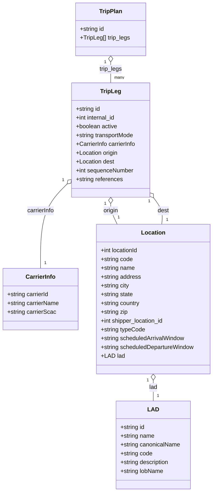

# Diagram: entity_core/entity_service/entity_listener/tests/test_data/trip_plan_data.py

> Auto-generated by Obscura crawlers

## Mermaid

### SVG

<svg id="container" width="587.921875" xmlns="http://www.w3.org/2000/svg" class="classDiagram" height="1342" viewBox="0 0 587.921875 1342" role="graphics-document document" aria-roledescription="class"><g><defs><marker id="container_class-aggregationStart" class="marker aggregation class" refX="18" refY="7" markerWidth="190" markerHeight="240" orient="auto"><path d="M 18,7 L9,13 L1,7 L9,1 Z"></path></marker></defs><defs><marker id="container_class-aggregationEnd" class="marker aggregation class" refX="1" refY="7" markerWidth="20" markerHeight="28" orient="auto"><path d="M 18,7 L9,13 L1,7 L9,1 Z"></path></marker></defs><defs><marker id="container_class-extensionStart" class="marker extension class" refX="18" refY="7" markerWidth="190" markerHeight="240" orient="auto"><path d="M 1,7 L18,13 V 1 Z"></path></marker></defs><defs><marker id="container_class-extensionEnd" class="marker extension class" refX="1" refY="7" markerWidth="20" markerHeight="28" orient="auto"><path d="M 1,1 V 13 L18,7 Z"></path></marker></defs><defs><marker id="container_class-compositionStart" class="marker composition class" refX="18" refY="7" markerWidth="190" markerHeight="240" orient="auto"><path d="M 18,7 L9,13 L1,7 L9,1 Z"></path></marker></defs><defs><marker id="container_class-compositionEnd" class="marker composition class" refX="1" refY="7" markerWidth="20" markerHeight="28" orient="auto"><path d="M 18,7 L9,13 L1,7 L9,1 Z"></path></marker></defs><defs><marker id="container_class-dependencyStart" class="marker dependency class" refX="6" refY="7" markerWidth="190" markerHeight="240" orient="auto"><path d="M 5,7 L9,13 L1,7 L9,1 Z"></path></marker></defs><defs><marker id="container_class-dependencyEnd" class="marker dependency class" refX="13" refY="7" markerWidth="20" markerHeight="28" orient="auto"><path d="M 18,7 L9,13 L14,7 L9,1 Z"></path></marker></defs><defs><marker id="container_class-lollipopStart" class="marker lollipop class" refX="13" refY="7" markerWidth="190" markerHeight="240" orient="auto"><circle stroke="black" fill="transparent" cx="7" cy="7" r="6"></circle></marker></defs><defs><marker id="container_class-lollipopEnd" class="marker lollipop class" refX="1" refY="7" markerWidth="190" markerHeight="240" orient="auto"><circle stroke="black" fill="transparent" cx="7" cy="7" r="6"></circle></marker></defs><g class="root"><g class="clusters"></g><g class="edgePaths"><path d="M306.93,169.25L306.93,172.542C306.93,175.833,306.93,182.417,306.93,191.875C306.93,201.333,306.93,213.667,306.93,219.833L306.93,226" id="id_TripPlan_TripLeg_1" class="edge-thickness-normal edge-pattern-solid relation" style=";;;" data-edge="true" data-et="edge" data-id="id_TripPlan_TripLeg_1" data-points="W3sieCI6MzA2LjkyOTY4NzUsInkiOjE1Mn0seyJ4IjozMDYuOTI5Njg3NSwieSI6MTg5fSx7IngiOjMwNi45Mjk2ODc1LCJ5IjoyMjZ9XQ==" marker-start="url(#container_class-aggregationStart)"></path><path d="M185.769,501.801L173.43,514C161.092,526.2,136.415,550.6,124.077,588.967C111.738,627.333,111.738,679.667,111.738,705.833L111.738,732" id="id_TripLeg_CarrierInfo_2" class="edge-thickness-normal edge-pattern-solid relation" style=";;;" data-edge="true" data-et="edge" data-id="id_TripLeg_CarrierInfo_2" data-points="W3sieCI6MTk4LjAzNTE1NjI1LCJ5Ijo0ODkuNjcxOTc2NjI1NTA3OH0seyJ4IjoxMTEuNzM4MjgxMjUsInkiOjU3NX0seyJ4IjoxMTEuNzM4MjgxMjUsInkiOjczMn1d" marker-start="url(#container_class-aggregationStart)"></path><path d="M306.93,555.25L306.93,558.542C306.93,561.833,306.93,568.417,309.892,577.875C312.854,587.333,318.779,599.667,321.741,605.833L324.703,612" id="id_TripLeg_Location_3" class="edge-thickness-normal edge-pattern-solid relation" style=";;;" data-edge="true" data-et="edge" data-id="id_TripLeg_Location_3" data-points="W3sieCI6MzA2LjkyOTY4NzUsInkiOjUzOH0seyJ4IjozMDYuOTI5Njg3NSwieSI6NTc1fSx7IngiOjMyNC43MDM0MzI5NjE2MTgyNiwieSI6NjEyfV0=" marker-start="url(#container_class-aggregationStart)"></path><path d="M426.15,541.546L430.316,547.121C434.483,552.697,442.816,563.849,446.254,575.591C449.693,587.333,448.237,599.667,447.509,605.833L446.781,612" id="id_TripLeg_Location_4" class="edge-thickness-normal edge-pattern-solid relation" style=";;;" data-edge="true" data-et="edge" data-id="id_TripLeg_Location_4" data-points="W3sieCI6NDE1LjgyNDIxODc1LCJ5Ijo1MjcuNzI3NTQ2MDQ1NTAzOH0seyJ4Ijo0NTEuMTQ4NDM3NSwieSI6NTc1fSx7IngiOjQ0Ni43ODA3MTUxMTkyOTQ2LCJ5Ijo2MTJ9XQ==" marker-start="url(#container_class-aggregationStart)"></path><path d="M422.699,1037.25L422.699,1040.542C422.699,1043.833,422.699,1050.417,422.699,1059.875C422.699,1069.333,422.699,1081.667,422.699,1087.833L422.699,1094" id="id_Location_LAD_5" class="edge-thickness-normal edge-pattern-solid relation" style=";;;" data-edge="true" data-et="edge" data-id="id_Location_LAD_5" data-points="W3sieCI6NDIyLjY5OTIxODc1LCJ5IjoxMDIwfSx7IngiOjQyMi42OTkyMTg3NSwieSI6MTA1N30seyJ4Ijo0MjIuNjk5MjE4NzUsInkiOjEwOTR9XQ==" marker-start="url(#container_class-aggregationStart)"></path></g><g class="edgeLabels"><g class="edgeLabel" transform="translate(306.9296875, 189)"><g class="label" data-id="id_TripPlan_TripLeg_1" transform="translate(-31.4140625, -12)"><foreignObject width="62.828125" height="24">

trip_legs

</foreignObject></g></g><g class="edgeLabel" transform="translate(111.73828125, 575)"><g class="label" data-id="id_TripLeg_CarrierInfo_2" transform="translate(-38.296875, -12)"><foreignObject width="76.59375" height="24">

carrierInfo

</foreignObject></g></g><g class="edgeLabel" transform="translate(306.9296875, 575)"><g class="label" data-id="id_TripLeg_Location_3" transform="translate(-21.125, -12)"><foreignObject width="42.25" height="24">

origin

</foreignObject></g></g><g class="edgeLabel" transform="translate(444.63709, 566.28623)"><g class="label" data-id="id_TripLeg_Location_4" transform="translate(-15.7734375, -12)"><foreignObject width="31.546875" height="24">

dest

</foreignObject></g></g><g class="edgeLabel" transform="translate(422.69921875, 1057)"><g class="label" data-id="id_Location_LAD_5" transform="translate(-11.4453125, -12)"><foreignObject width="22.890625" height="24">

lad

</foreignObject></g></g><g class="edgeTerminals" transform="translate(291.92968875, 169.50000107142858)"><g class="inner" transform="translate(0, 0)"><foreignObject style="width: 9px; height: 12px;">
1
</foreignObject></g></g><g class="edgeTerminals" transform="translate(175.04457174134689, 491.30998427698967)"><g class="inner" transform="translate(0, 0)"><foreignObject style="width: 9px; height: 12px;">
1
</foreignObject></g></g><g class="edgeTerminals" transform="translate(291.92968875, 555.5000010714285)"><g class="inner" transform="translate(0, 0)"><foreignObject style="width: 9px; height: 12px;">
1
</foreignObject></g></g><g class="edgeTerminals" transform="translate(414.28364566706017, 550.7248641758329)"><g class="inner" transform="translate(0, 0)"><foreignObject style="width: 9px; height: 12px;">
1
</foreignObject></g></g><g class="edgeTerminals" transform="translate(407.699219375, 1037.5000005357142)"><g class="inner" transform="translate(0, 0)"><foreignObject style="width: 9px; height: 12px;">
1
</foreignObject></g></g><g class="edgeTerminals" transform="translate(316.9296887499999, 203.50000107142858)"><g class="inner" transform="translate(0, 0)"></g><foreignObject style="width: 36px; height: 12px;">
many
</foreignObject></g><g class="edgeTerminals" transform="translate(121.73828062499999, 709.4999994642857)"><g class="inner" transform="translate(0, 0)"></g><foreignObject style="width: 9px; height: 12px;">
1
</foreignObject></g><g class="edgeTerminals" transform="translate(325.64676179580874, 584.7305860934384)"><g class="inner" transform="translate(0, 0)"></g><foreignObject style="width: 9px; height: 12px;">
1
</foreignObject></g><g class="edgeTerminals" transform="translate(458.72885015310186, 591.3791562619989)"><g class="inner" transform="translate(0, 0)"></g><foreignObject style="width: 9px; height: 12px;">
1
</foreignObject></g><g class="edgeTerminals" transform="translate(432.699219375, 1071.5000005357142)"><g class="inner" transform="translate(0, 0)"></g><foreignObject style="width: 9px; height: 12px;">
1
</foreignObject></g></g><g class="nodes"><g class="node default" id="classId-TripPlan-0" transform="translate(306.9296875, 80)"><g class="basic label-container"><path d="M-95.76171875 -72 L95.76171875 -72 L95.76171875 72 L-95.76171875 72" stroke="none" stroke-width="0" fill="#ECECFF" style=""></path><path d="M-95.76171875 -72 C-19.39411731815902 -72, 56.97348411368196 -72, 95.76171875 -72 M-95.76171875 -72 C-43.27808626829445 -72, 9.205546213411097 -72, 95.76171875 -72 M95.76171875 -72 C95.76171875 -38.799626001902915, 95.76171875 -5.59925200380583, 95.76171875 72 M95.76171875 -72 C95.76171875 -21.573461220502097, 95.76171875 28.853077558995807, 95.76171875 72 M95.76171875 72 C44.39103014104978 72, -6.979658467900435 72, -95.76171875 72 M95.76171875 72 C53.71662039295711 72, 11.671522035914222 72, -95.76171875 72 M-95.76171875 72 C-95.76171875 35.295894306018816, -95.76171875 -1.4082113879623677, -95.76171875 -72 M-95.76171875 72 C-95.76171875 34.003556395950106, -95.76171875 -3.9928872080997877, -95.76171875 -72" stroke="#9370DB" stroke-width="1.3" fill="none" stroke-dasharray="0 0" style=""></path></g><g class="annotation-group text" transform="translate(0, -48)"></g><g class="label-group text" transform="translate(-30.3828125, -48)"><g class="label" style="font-weight: bolder" transform="translate(0,-12)"><foreignObject width="60.765625" height="24">

TripPlan

</foreignObject></g></g><g class="members-group text" transform="translate(-83.76171875, 0)"><g class="label" style="" transform="translate(0,-12)"><foreignObject width="67.9375" height="24">

+string id

</foreignObject></g><g class="label" style="" transform="translate(0,12)"><foreignObject width="137.140625" height="24">

+TripLeg[] trip_legs

</foreignObject></g></g><g class="methods-group text" transform="translate(-83.76171875, 72)"></g><g class="divider" style=""><path d="M-95.76171875 -24 C-37.97068303149306 -24, 19.82035268701388 -24, 95.76171875 -24 M-95.76171875 -24 C-47.376716839386226 -24, 1.0082850712275473 -24, 95.76171875 -24" stroke="#9370DB" stroke-width="1.3" fill="none" stroke-dasharray="0 0" style=""></path></g><g class="divider" style=""><path d="M-95.76171875 48 C-44.89341106739219 48, 5.974896615215627 48, 95.76171875 48 M-95.76171875 48 C-24.557184490402094 48, 46.64734976919581 48, 95.76171875 48" stroke="#9370DB" stroke-width="1.3" fill="none" stroke-dasharray="0 0" style=""></path></g></g><g class="node default" id="classId-TripLeg-1" transform="translate(306.9296875, 382)"><g class="basic label-container"><path d="M-108.89453125 -156 L108.89453125 -156 L108.89453125 156 L-108.89453125 156" stroke="none" stroke-width="0" fill="#ECECFF" style=""></path><path d="M-108.89453125 -156 C-28.525214059092008 -156, 51.844103131815984 -156, 108.89453125 -156 M-108.89453125 -156 C-58.5734690006148 -156, -8.2524067512296 -156, 108.89453125 -156 M108.89453125 -156 C108.89453125 -89.71288527417688, 108.89453125 -23.425770548353768, 108.89453125 156 M108.89453125 -156 C108.89453125 -86.1338919071546, 108.89453125 -16.26778381430921, 108.89453125 156 M108.89453125 156 C33.00374675388805 156, -42.887037742223896 156, -108.89453125 156 M108.89453125 156 C21.85120997543018 156, -65.19211129913964 156, -108.89453125 156 M-108.89453125 156 C-108.89453125 78.90249179944823, -108.89453125 1.804983598896456, -108.89453125 -156 M-108.89453125 156 C-108.89453125 47.19964487797877, -108.89453125 -61.60071024404246, -108.89453125 -156" stroke="#9370DB" stroke-width="1.3" fill="none" stroke-dasharray="0 0" style=""></path></g><g class="annotation-group text" transform="translate(0, -132)"></g><g class="label-group text" transform="translate(-27.0546875, -132)"><g class="label" style="font-weight: bolder" transform="translate(0,-12)"><foreignObject width="54.109375" height="24">

TripLeg

</foreignObject></g></g><g class="members-group text" transform="translate(-96.89453125, -84)"><g class="label" style="" transform="translate(0,-12)"><foreignObject width="67.9375" height="24">

+string id

</foreignObject></g><g class="label" style="" transform="translate(0,12)"><foreignObject width="111.21875" height="24">

+int internal_id

</foreignObject></g><g class="label" style="" transform="translate(0,36)"><foreignObject width="114.84375" height="24">

+boolean active

</foreignObject></g><g class="label" style="" transform="translate(0,60)"><foreignObject width="161.6875" height="24">

+string transportMode

</foreignObject></g><g class="label" style="" transform="translate(0,84)"><foreignObject width="166.734375" height="24">

+CarrierInfo carrierInfo

</foreignObject></g><g class="label" style="" transform="translate(0,108)"><foreignObject width="116.578125" height="24">

+Location origin

</foreignObject></g><g class="label" style="" transform="translate(0,132)"><foreignObject width="105.875" height="24">

+Location dest

</foreignObject></g><g class="label" style="" transform="translate(0,156)"><foreignObject width="159.46875" height="24">

+int sequenceNumber

</foreignObject></g><g class="label" style="" transform="translate(0,180)"><foreignObject width="129.515625" height="24">

+string references

</foreignObject></g></g><g class="methods-group text" transform="translate(-96.89453125, 156)"></g><g class="divider" style=""><path d="M-108.89453125 -108 C-36.62788887585255 -108, 35.6387534982949 -108, 108.89453125 -108 M-108.89453125 -108 C-28.120643866311454 -108, 52.65324351737709 -108, 108.89453125 -108" stroke="#9370DB" stroke-width="1.3" fill="none" stroke-dasharray="0 0" style=""></path></g><g class="divider" style=""><path d="M-108.89453125 132 C-65.25957075101294 132, -21.62461025202589 132, 108.89453125 132 M-108.89453125 132 C-49.93943494161614 132, 9.015661366767716 132, 108.89453125 132" stroke="#9370DB" stroke-width="1.3" fill="none" stroke-dasharray="0 0" style=""></path></g></g><g class="node default" id="classId-CarrierInfo-2" transform="translate(111.73828125, 816)"><g class="basic label-container"><path d="M-103.73828125 -84 L103.73828125 -84 L103.73828125 84 L-103.73828125 84" stroke="none" stroke-width="0" fill="#ECECFF" style=""></path><path d="M-103.73828125 -84 C-47.29575511838685 -84, 9.1467710132263 -84, 103.73828125 -84 M-103.73828125 -84 C-28.08428087906323 -84, 47.56971949187354 -84, 103.73828125 -84 M103.73828125 -84 C103.73828125 -39.42551654818652, 103.73828125 5.148966903626956, 103.73828125 84 M103.73828125 -84 C103.73828125 -20.535060240513353, 103.73828125 42.929879518973294, 103.73828125 84 M103.73828125 84 C54.727933030929584 84, 5.717584811859169 84, -103.73828125 84 M103.73828125 84 C39.54183339518504 84, -24.654614459629926 84, -103.73828125 84 M-103.73828125 84 C-103.73828125 47.31000972763774, -103.73828125 10.620019455275482, -103.73828125 -84 M-103.73828125 84 C-103.73828125 25.984205407365536, -103.73828125 -32.03158918526893, -103.73828125 -84" stroke="#9370DB" stroke-width="1.3" fill="none" stroke-dasharray="0 0" style=""></path></g><g class="annotation-group text" transform="translate(0, -60)"></g><g class="label-group text" transform="translate(-39.6015625, -60)"><g class="label" style="font-weight: bolder" transform="translate(0,-12)"><foreignObject width="79.203125" height="24">

CarrierInfo

</foreignObject></g></g><g class="members-group text" transform="translate(-91.73828125, -12)"><g class="label" style="" transform="translate(0,-12)"><foreignObject width="116.109375" height="24">

+string carrierId

</foreignObject></g><g class="label" style="" transform="translate(0,12)"><foreignObject width="143.875" height="24">

+string carrierName

</foreignObject></g><g class="label" style="" transform="translate(0,36)"><foreignObject width="134.375" height="24">

+string carrierScac

</foreignObject></g></g><g class="methods-group text" transform="translate(-91.73828125, 84)"></g><g class="divider" style=""><path d="M-103.73828125 -36 C-42.89769886002641 -36, 17.94288352994718 -36, 103.73828125 -36 M-103.73828125 -36 C-41.464593935337184 -36, 20.80909337932563 -36, 103.73828125 -36" stroke="#9370DB" stroke-width="1.3" fill="none" stroke-dasharray="0 0" style=""></path></g><g class="divider" style=""><path d="M-103.73828125 60 C-24.09915400533869 60, 55.53997323932262 60, 103.73828125 60 M-103.73828125 60 C-35.58488599202151 60, 32.568509265956976 60, 103.73828125 60" stroke="#9370DB" stroke-width="1.3" fill="none" stroke-dasharray="0 0" style=""></path></g></g><g class="node default" id="classId-Location-3" transform="translate(422.69921875, 816)"><g class="basic label-container"><path d="M-157.22265625 -204 L157.22265625 -204 L157.22265625 204 L-157.22265625 204" stroke="none" stroke-width="0" fill="#ECECFF" style=""></path><path d="M-157.22265625 -204 C-72.13988309756242 -204, 12.942890054875164 -204, 157.22265625 -204 M-157.22265625 -204 C-82.06772094509597 -204, -6.912785640191942 -204, 157.22265625 -204 M157.22265625 -204 C157.22265625 -75.23187149734025, 157.22265625 53.5362570053195, 157.22265625 204 M157.22265625 -204 C157.22265625 -109.617873428963, 157.22265625 -15.235746857925989, 157.22265625 204 M157.22265625 204 C47.51044070832853 204, -62.20177483334294 204, -157.22265625 204 M157.22265625 204 C47.56098495451671 204, -62.100686340966575 204, -157.22265625 204 M-157.22265625 204 C-157.22265625 101.8827374322055, -157.22265625 -0.23452513558899568, -157.22265625 -204 M-157.22265625 204 C-157.22265625 44.299865353723305, -157.22265625 -115.40026929255339, -157.22265625 -204" stroke="#9370DB" stroke-width="1.3" fill="none" stroke-dasharray="0 0" style=""></path></g><g class="annotation-group text" transform="translate(0, -180)"></g><g class="label-group text" transform="translate(-31.3515625, -180)"><g class="label" style="font-weight: bolder" transform="translate(0,-12)"><foreignObject width="62.703125" height="24">

Location

</foreignObject></g></g><g class="members-group text" transform="translate(-145.22265625, -132)"><g class="label" style="" transform="translate(0,-12)"><foreignObject width="105.34375" height="24">

+int locationId

</foreignObject></g><g class="label" style="" transform="translate(0,12)"><foreignObject width="88.828125" height="24">

+string code

</foreignObject></g><g class="label" style="" transform="translate(0,36)"><foreignObject width="94.375" height="24">

+string name

</foreignObject></g><g class="label" style="" transform="translate(0,60)"><foreignObject width="110.90625" height="24">

+string address

</foreignObject></g><g class="label" style="" transform="translate(0,84)"><foreignObject width="79.59375" height="24">

+string city

</foreignObject></g><g class="label" style="" transform="translate(0,108)"><foreignObject width="89.953125" height="24">

+string state

</foreignObject></g><g class="label" style="" transform="translate(0,132)"><foreignObject width="109.046875" height="24">

+string country

</foreignObject></g><g class="label" style="" transform="translate(0,156)"><foreignObject width="74.875" height="24">

+string zip

</foreignObject></g><g class="label" style="" transform="translate(0,180)"><foreignObject width="175.59375" height="24">

+int shipper_location_id

</foreignObject></g><g class="label" style="" transform="translate(0,204)"><foreignObject width="121.921875" height="24">

+string typeCode

</foreignObject></g><g class="label" style="" transform="translate(0,228)"><foreignObject width="233.21875" height="24">

+string scheduledArrivalWindow

</foreignObject></g><g class="label" style="" transform="translate(0,252)"><foreignObject width="259.09375" height="24">

+string scheduledDepartureWindow

</foreignObject></g><g class="label" style="" transform="translate(0,276)"><foreignObject width="62.546875" height="24">

+LAD lad

</foreignObject></g></g><g class="methods-group text" transform="translate(-145.22265625, 204)"></g><g class="divider" style=""><path d="M-157.22265625 -156 C-67.80646216723545 -156, 21.609731915529096 -156, 157.22265625 -156 M-157.22265625 -156 C-83.69556660684663 -156, -10.168476963693251 -156, 157.22265625 -156" stroke="#9370DB" stroke-width="1.3" fill="none" stroke-dasharray="0 0" style=""></path></g><g class="divider" style=""><path d="M-157.22265625 180 C-67.60328621192328 180, 22.016083826153448 180, 157.22265625 180 M-157.22265625 180 C-66.34382764150874 180, 24.535000966982523 180, 157.22265625 180" stroke="#9370DB" stroke-width="1.3" fill="none" stroke-dasharray="0 0" style=""></path></g></g><g class="node default" id="classId-LAD-4" transform="translate(422.69921875, 1214)"><g class="basic label-container"><path d="M-101.74609375 -120 L101.74609375 -120 L101.74609375 120 L-101.74609375 120" stroke="none" stroke-width="0" fill="#ECECFF" style=""></path><path d="M-101.74609375 -120 C-49.945842203124236 -120, 1.8544093437515272 -120, 101.74609375 -120 M-101.74609375 -120 C-39.55353510604417 -120, 22.639023537911655 -120, 101.74609375 -120 M101.74609375 -120 C101.74609375 -57.525958943008895, 101.74609375 4.94808211398221, 101.74609375 120 M101.74609375 -120 C101.74609375 -69.76970756151309, 101.74609375 -19.539415123026174, 101.74609375 120 M101.74609375 120 C60.35967993419986 120, 18.97326611839972 120, -101.74609375 120 M101.74609375 120 C21.900577657673836 120, -57.94493843465233 120, -101.74609375 120 M-101.74609375 120 C-101.74609375 43.2080597363919, -101.74609375 -33.583880527216195, -101.74609375 -120 M-101.74609375 120 C-101.74609375 52.70199707522583, -101.74609375 -14.596005849548334, -101.74609375 -120" stroke="#9370DB" stroke-width="1.3" fill="none" stroke-dasharray="0 0" style=""></path></g><g class="annotation-group text" transform="translate(0, -96)"></g><g class="label-group text" transform="translate(-14.0390625, -96)"><g class="label" style="font-weight: bolder" transform="translate(0,-12)"><foreignObject width="28.078125" height="24">

LAD

</foreignObject></g></g><g class="members-group text" transform="translate(-89.74609375, -48)"><g class="label" style="" transform="translate(0,-12)"><foreignObject width="67.9375" height="24">

+string id

</foreignObject></g><g class="label" style="" transform="translate(0,12)"><foreignObject width="94.375" height="24">

+string name

</foreignObject></g><g class="label" style="" transform="translate(0,36)"><foreignObject width="165.453125" height="24">

+string canonicalName

</foreignObject></g><g class="label" style="" transform="translate(0,60)"><foreignObject width="88.828125" height="24">

+string code

</foreignObject></g><g class="label" style="" transform="translate(0,84)"><foreignObject width="136.46875" height="24">

+string description

</foreignObject></g><g class="label" style="" transform="translate(0,108)"><foreignObject width="119.390625" height="24">

+string lobName

</foreignObject></g></g><g class="methods-group text" transform="translate(-89.74609375, 120)"></g><g class="divider" style=""><path d="M-101.74609375 -72 C-23.322582600022827 -72, 55.10092854995435 -72, 101.74609375 -72 M-101.74609375 -72 C-55.520490223212036 -72, -9.294886696424072 -72, 101.74609375 -72" stroke="#9370DB" stroke-width="1.3" fill="none" stroke-dasharray="0 0" style=""></path></g><g class="divider" style=""><path d="M-101.74609375 96 C-32.10197581233312 96, 37.542142125333754 96, 101.74609375 96 M-101.74609375 96 C-21.651681254476614 96, 58.44273124104677 96, 101.74609375 96" stroke="#9370DB" stroke-width="1.3" fill="none" stroke-dasharray="0 0" style=""></path></g></g></g></g></g></svg>
