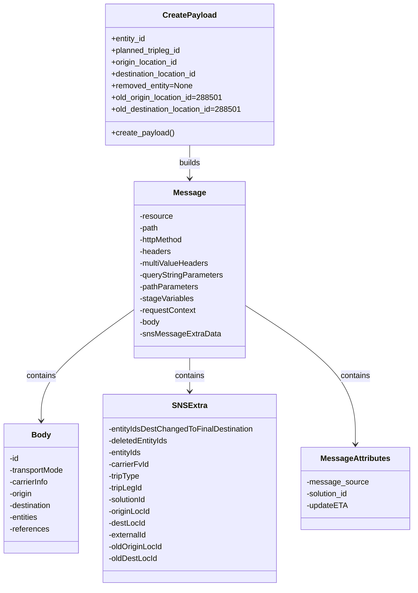

# Diagram: entity_core/entity_service/entity_listener/tests/test_data/update_tripleg_data.py


> Auto-generated by Obscura crawlers

## Diagram 1

```mermaid
flowchart TD
    inputs[Inputs: entity_id, planned_tripleg_id, origin_location_id, destination_location_id, removed_entity, old_origin_location_id, old_destination_location_id] --> func[/create_payload(entity_id, planned_tripleg_id, origin_location_id, destination_location_id, removed_entity, old_origin_location_id, old_destination_location_id)/]
    func --> build{Build payload_dict}
    build --> msg[Message]
    msg --> headers[headers]
    msg --> mvheaders[multiValueHeaders]
    msg --> reqctx[requestContext]
    msg --> body[body]
    body --> origin[origin (name, code, address, scheduledArrival, location_id)]
    body --> destination[destination (name, code, address, scheduledArrival, location_id)]
    body --> entities[entities]
    body --> references[references]
    build --> sns[snsMessageExtraData]
    sns --> sns_fields[entityIdsDestChangedToFinalDestination, deletedEntityIds, entityIds, carrierFvId, tripType, tripLegId, solutionId, originLocId, destLocId, externalId, oldOriginLocId, oldDestLocId]
    build --> msgattrs[MessageAttributes & snsMessageAttributes]
    func --> json[json.dumps(payload_dict)]
    json --> ret[Return {"body": json_string}]
```

> SVG rendering failed for this diagram.

## Diagram 2



### SVG

<svg id="container" width="846.90625" xmlns="http://www.w3.org/2000/svg" class="classDiagram" height="1196" viewBox="0 0 846.90625 1196" role="graphics-document document" aria-roledescription="class"><style>#container{font-family:"trebuchet ms",verdana,arial,sans-serif;font-size:16px;fill:#333;}@keyframes edge-animation-frame{from{stroke-dashoffset:0;}}@keyframes dash{to{stroke-dashoffset:0;}}#container .edge-animation-slow{stroke-dasharray:9,5!important;stroke-dashoffset:900;animation:dash 50s linear infinite;stroke-linecap:round;}#container .edge-animation-fast{stroke-dasharray:9,5!important;stroke-dashoffset:900;animation:dash 20s linear infinite;stroke-linecap:round;}#container .error-icon{fill:#552222;}#container .error-text{fill:#552222;stroke:#552222;}#container .edge-thickness-normal{stroke-width:1px;}#container .edge-thickness-thick{stroke-width:3.5px;}#container .edge-pattern-solid{stroke-dasharray:0;}#container .edge-thickness-invisible{stroke-width:0;fill:none;}#container .edge-pattern-dashed{stroke-dasharray:3;}#container .edge-pattern-dotted{stroke-dasharray:2;}#container .marker{fill:#333333;stroke:#333333;}#container .marker.cross{stroke:#333333;}#container svg{font-family:"trebuchet ms",verdana,arial,sans-serif;font-size:16px;}#container p{margin:0;}#container g.classGroup text{fill:#9370DB;stroke:none;font-family:"trebuchet ms",verdana,arial,sans-serif;font-size:10px;}#container g.classGroup text .title{font-weight:bolder;}#container .nodeLabel,#container .edgeLabel{color:#131300;}#container .edgeLabel .label rect{fill:#ECECFF;}#container .label text{fill:#131300;}#container .labelBkg{background:#ECECFF;}#container .edgeLabel .label span{background:#ECECFF;}#container .classTitle{font-weight:bolder;}#container .node rect,#container .node circle,#container .node ellipse,#container .node polygon,#container .node path{fill:#ECECFF;stroke:#9370DB;stroke-width:1px;}#container .divider{stroke:#9370DB;stroke-width:1;}#container g.clickable{cursor:pointer;}#container g.classGroup rect{fill:#ECECFF;stroke:#9370DB;}#container g.classGroup line{stroke:#9370DB;stroke-width:1;}#container .classLabel .box{stroke:none;stroke-width:0;fill:#ECECFF;opacity:0.5;}#container .classLabel .label{fill:#9370DB;font-size:10px;}#container .relation{stroke:#333333;stroke-width:1;fill:none;}#container .dashed-line{stroke-dasharray:3;}#container .dotted-line{stroke-dasharray:1 2;}#container #compositionStart,#container .composition{fill:#333333!important;stroke:#333333!important;stroke-width:1;}#container #compositionEnd,#container .composition{fill:#333333!important;stroke:#333333!important;stroke-width:1;}#container #dependencyStart,#container .dependency{fill:#333333!important;stroke:#333333!important;stroke-width:1;}#container #dependencyStart,#container .dependency{fill:#333333!important;stroke:#333333!important;stroke-width:1;}#container #extensionStart,#container .extension{fill:transparent!important;stroke:#333333!important;stroke-width:1;}#container #extensionEnd,#container .extension{fill:transparent!important;stroke:#333333!important;stroke-width:1;}#container #aggregationStart,#container .aggregation{fill:transparent!important;stroke:#333333!important;stroke-width:1;}#container #aggregationEnd,#container .aggregation{fill:transparent!important;stroke:#333333!important;stroke-width:1;}#container #lollipopStart,#container .lollipop{fill:#ECECFF!important;stroke:#333333!important;stroke-width:1;}#container #lollipopEnd,#container .lollipop{fill:#ECECFF!important;stroke:#333333!important;stroke-width:1;}#container .edgeTerminals{font-size:11px;line-height:initial;}#container .classTitleText{text-anchor:middle;font-size:18px;fill:#333;}#container .label-icon{display:inline-block;height:1em;overflow:visible;vertical-align:-0.125em;}#container .node .label-icon path{fill:currentColor;stroke:revert;stroke-width:revert;}#container :root{--mermaid-font-family:"trebuchet ms",verdana,arial,sans-serif;}</style><g><defs><marker id="container_class-aggregationStart" class="marker aggregation class" refX="18" refY="7" markerWidth="190" markerHeight="240" orient="auto"><path d="M 18,7 L9,13 L1,7 L9,1 Z"></path></marker></defs><defs><marker id="container_class-aggregationEnd" class="marker aggregation class" refX="1" refY="7" markerWidth="20" markerHeight="28" orient="auto"><path d="M 18,7 L9,13 L1,7 L9,1 Z"></path></marker></defs><defs><marker id="container_class-extensionStart" class="marker extension class" refX="18" refY="7" markerWidth="190" markerHeight="240" orient="auto"><path d="M 1,7 L18,13 V 1 Z"></path></marker></defs><defs><marker id="container_class-extensionEnd" class="marker extension class" refX="1" refY="7" markerWidth="20" markerHeight="28" orient="auto"><path d="M 1,1 V 13 L18,7 Z"></path></marker></defs><defs><marker id="container_class-compositionStart" class="marker composition class" refX="18" refY="7" markerWidth="190" markerHeight="240" orient="auto"><path d="M 18,7 L9,13 L1,7 L9,1 Z"></path></marker></defs><defs><marker id="container_class-compositionEnd" class="marker composition class" refX="1" refY="7" markerWidth="20" markerHeight="28" orient="auto"><path d="M 18,7 L9,13 L1,7 L9,1 Z"></path></marker></defs><defs><marker id="container_class-dependencyStart" class="marker dependency class" refX="6" refY="7" markerWidth="190" markerHeight="240" orient="auto"><path d="M 5,7 L9,13 L1,7 L9,1 Z"></path></marker></defs><defs><marker id="container_class-dependencyEnd" class="marker dependency class" refX="13" refY="7" markerWidth="20" markerHeight="28" orient="auto"><path d="M 18,7 L9,13 L14,7 L9,1 Z"></path></marker></defs><defs><marker id="container_class-lollipopStart" class="marker lollipop class" refX="13" refY="7" markerWidth="190" markerHeight="240" orient="auto"><circle stroke="black" fill="transparent" cx="7" cy="7" r="6"></circle></marker></defs><defs><marker id="container_class-lollipopEnd" class="marker lollipop class" refX="1" refY="7" markerWidth="190" markerHeight="240" orient="auto"><circle stroke="black" fill="transparent" cx="7" cy="7" r="6"></circle></marker></defs><g class="root"><g class="clusters"></g><g class="edgePaths"><path d="M393.379,296L393.379,302.167C393.379,308.333,393.379,320.667,393.379,332C393.379,343.333,393.379,353.667,393.379,358.833L393.379,364" id="id_CreatePayload_Message_1" class="edge-thickness-normal edge-pattern-solid relation" style=";;;" data-edge="true" data-et="edge" data-id="id_CreatePayload_Message_1" data-points="W3sieCI6MzkzLjM3ODkwNjI1LCJ5IjoyOTZ9LHsieCI6MzkzLjM3ODkwNjI1LCJ5IjozMzN9LHsieCI6MzkzLjM3ODkwNjI1LCJ5IjozNzB9XQ==" marker-end="url(#container_class-dependencyEnd)"></path><path d="M279.496,630.497L247.31,653.247C215.124,675.998,150.751,721.499,118.565,759.416C86.379,797.333,86.379,827.667,86.379,842.833L86.379,858" id="id_Message_Body_2" class="edge-thickness-normal edge-pattern-solid relation" style=";;;" data-edge="true" data-et="edge" data-id="id_Message_Body_2" data-points="W3sieCI6Mjc5LjQ5NjA5Mzc1LCJ5Ijo2MzAuNDk2OTcxNzAxOTU0NH0seyJ4Ijo4Ni4zNzg5MDYyNSwieSI6NzY3fSx7IngiOjg2LjM3ODkwNjI1LCJ5Ijo4NjR9XQ==" marker-end="url(#container_class-dependencyEnd)"></path><path d="M393.379,730L393.379,736.167C393.379,742.333,393.379,754.667,393.379,766C393.379,777.333,393.379,787.667,393.379,792.833L393.379,798" id="id_Message_SNSExtra_3" class="edge-thickness-normal edge-pattern-solid relation" style=";;;" data-edge="true" data-et="edge" data-id="id_Message_SNSExtra_3" data-points="W3sieCI6MzkzLjM3ODkwNjI1LCJ5Ijo3MzB9LHsieCI6MzkzLjM3ODkwNjI1LCJ5Ijo3Njd9LHsieCI6MzkzLjM3ODkwNjI1LCJ5Ijo4MDR9XQ==" marker-end="url(#container_class-dependencyEnd)"></path><path d="M507.262,623.315L544.46,647.262C581.659,671.21,656.056,719.105,693.255,766.219C730.453,813.333,730.453,859.667,730.453,882.833L730.453,906" id="id_Message_MessageAttributes_4" class="edge-thickness-normal edge-pattern-solid relation" style=";;;" data-edge="true" data-et="edge" data-id="id_Message_MessageAttributes_4" data-points="W3sieCI6NTA3LjI2MTcxODc1LCJ5Ijo2MjMuMzE0OTIyNzYxMzU0MX0seyJ4Ijo3MzAuNDUzMTI1LCJ5Ijo3Njd9LHsieCI6NzMwLjQ1MzEyNSwieSI6OTEyfV0=" marker-end="url(#container_class-dependencyEnd)"></path></g><g class="edgeLabels"><g class="edgeLabel" transform="translate(393.37890625, 333)"><g class="label" data-id="id_CreatePayload_Message_1" transform="translate(-22.4921875, -12)"><foreignObject width="44.984375" height="24"><div xmlns="http://www.w3.org/1999/xhtml" class="labelBkg" style="display: table-cell; white-space: nowrap; line-height: 1.5; max-width: 200px; text-align: center;"><span class="edgeLabel"><p>builds</p></span></div></foreignObject></g></g><g class="edgeLabel" transform="translate(86.37890625, 767)"><g class="label" data-id="id_Message_Body_2" transform="translate(-30.890625, -12)"><foreignObject width="61.78125" height="24"><div xmlns="http://www.w3.org/1999/xhtml" class="labelBkg" style="display: table-cell; white-space: nowrap; line-height: 1.5; max-width: 200px; text-align: center;"><span class="edgeLabel"><p>contains</p></span></div></foreignObject></g></g><g class="edgeLabel" transform="translate(393.37890625, 767)"><g class="label" data-id="id_Message_SNSExtra_3" transform="translate(-30.890625, -12)"><foreignObject width="61.78125" height="24"><div xmlns="http://www.w3.org/1999/xhtml" class="labelBkg" style="display: table-cell; white-space: nowrap; line-height: 1.5; max-width: 200px; text-align: center;"><span class="edgeLabel"><p>contains</p></span></div></foreignObject></g></g><g class="edgeLabel" transform="translate(730.453125, 767)"><g class="label" data-id="id_Message_MessageAttributes_4" transform="translate(-30.890625, -12)"><foreignObject width="61.78125" height="24"><div xmlns="http://www.w3.org/1999/xhtml" class="labelBkg" style="display: table-cell; white-space: nowrap; line-height: 1.5; max-width: 200px; text-align: center;"><span class="edgeLabel"><p>contains</p></span></div></foreignObject></g></g></g><g class="nodes"><g class="node default" id="classId-CreatePayload-0" transform="translate(393.37890625, 152)"><g class="basic label-container"><path d="M-172.92578125 -144 L172.92578125 -144 L172.92578125 144 L-172.92578125 144" stroke="none" stroke-width="0" fill="#ECECFF" style=""></path><path d="M-172.92578125 -144 C-41.980130063741086 -144, 88.96552112251783 -144, 172.92578125 -144 M-172.92578125 -144 C-46.82628759641038 -144, 79.27320605717924 -144, 172.92578125 -144 M172.92578125 -144 C172.92578125 -51.290624092091264, 172.92578125 41.41875181581747, 172.92578125 144 M172.92578125 -144 C172.92578125 -61.413740362901905, 172.92578125 21.17251927419619, 172.92578125 144 M172.92578125 144 C83.15782578781786 144, -6.610129674364288 144, -172.92578125 144 M172.92578125 144 C43.30995846452342 144, -86.30586432095316 144, -172.92578125 144 M-172.92578125 144 C-172.92578125 76.22285262333502, -172.92578125 8.44570524667003, -172.92578125 -144 M-172.92578125 144 C-172.92578125 53.19609326959936, -172.92578125 -37.60781346080128, -172.92578125 -144" stroke="#9370DB" stroke-width="1.3" fill="none" stroke-dasharray="0 0" style=""></path></g><g class="annotation-group text" transform="translate(0, -120)"></g><g class="label-group text" transform="translate(-52.4609375, -120)"><g class="label" style="font-weight: bolder" transform="translate(0,-12)"><foreignObject width="104.921875" height="24"><div xmlns="http://www.w3.org/1999/xhtml" style="display: table-cell; white-space: nowrap; line-height: 1.5; max-width: 153px; text-align: center;"><span class="nodeLabel markdown-node-label" style=""><p>CreatePayload</p></span></div></foreignObject></g></g><g class="members-group text" transform="translate(-160.92578125, -72)"><g class="label" style="" transform="translate(0,-12)"><foreignObject width="71.859375" height="24"><div xmlns="http://www.w3.org/1999/xhtml" style="display: table-cell; white-space: nowrap; line-height: 1.5; max-width: 129px; text-align: center;"><span class="nodeLabel markdown-node-label" style=""><p>+entity_id</p></span></div></foreignObject></g><g class="label" style="" transform="translate(0,12)"><foreignObject width="145.921875" height="24"><div xmlns="http://www.w3.org/1999/xhtml" style="display: table-cell; white-space: nowrap; line-height: 1.5; max-width: 203px; text-align: center;"><span class="nodeLabel markdown-node-label" style=""><p>+planned_tripleg_id</p></span></div></foreignObject></g><g class="label" style="" transform="translate(0,36)"><foreignObject width="139.9375" height="24"><div xmlns="http://www.w3.org/1999/xhtml" style="display: table-cell; white-space: nowrap; line-height: 1.5; max-width: 197px; text-align: center;"><span class="nodeLabel markdown-node-label" style=""><p>+origin_location_id</p></span></div></foreignObject></g><g class="label" style="" transform="translate(0,60)"><foreignObject width="180.84375" height="24"><div xmlns="http://www.w3.org/1999/xhtml" style="display: table-cell; white-space: nowrap; line-height: 1.5; max-width: 238px; text-align: center;"><span class="nodeLabel markdown-node-label" style=""><p>+destination_location_id</p></span></div></foreignObject></g><g class="label" style="" transform="translate(0,84)"><foreignObject width="167.8125" height="24"><div xmlns="http://www.w3.org/1999/xhtml" style="display: table-cell; white-space: nowrap; line-height: 1.5; max-width: 225px; text-align: center;"><span class="nodeLabel markdown-node-label" style=""><p>+removed_entity=None</p></span></div></foreignObject></g><g class="label" style="" transform="translate(0,108)"><foreignObject width="228.484375" height="24"><div xmlns="http://www.w3.org/1999/xhtml" style="display: table-cell; white-space: nowrap; line-height: 1.5; max-width: 286px; text-align: center;"><span class="nodeLabel markdown-node-label" style=""><p>+old_origin_location_id=288501</p></span></div></foreignObject></g><g class="label" style="" transform="translate(0,132)"><foreignObject width="269.390625" height="24"><div xmlns="http://www.w3.org/1999/xhtml" style="display: table-cell; white-space: nowrap; line-height: 1.5; max-width: 327px; text-align: center;"><span class="nodeLabel markdown-node-label" style=""><p>+old_destination_location_id=288501</p></span></div></foreignObject></g></g><g class="methods-group text" transform="translate(-160.92578125, 120)"><g class="label" style="" transform="translate(0,-12)"><foreignObject width="128.96875" height="24"><div xmlns="http://www.w3.org/1999/xhtml" style="display: table-cell; white-space: nowrap; line-height: 1.5; max-width: 186px; text-align: center;"><span class="nodeLabel markdown-node-label" style=""><p>+create_payload()</p></span></div></foreignObject></g></g><g class="divider" style=""><path d="M-172.92578125 -96 C-55.3279505792641 -96, 62.269880091471805 -96, 172.92578125 -96 M-172.92578125 -96 C-50.62083993659893 -96, 71.68410137680215 -96, 172.92578125 -96" stroke="#9370DB" stroke-width="1.3" fill="none" stroke-dasharray="0 0" style=""></path></g><g class="divider" style=""><path d="M-172.92578125 96 C-36.30556453828666 96, 100.31465217342668 96, 172.92578125 96 M-172.92578125 96 C-42.01013151476923 96, 88.90551822046154 96, 172.92578125 96" stroke="#9370DB" stroke-width="1.3" fill="none" stroke-dasharray="0 0" style=""></path></g></g><g class="node default" id="classId-Message-1" transform="translate(393.37890625, 550)"><g class="basic label-container"><path d="M-113.8828125 -180 L113.8828125 -180 L113.8828125 180 L-113.8828125 180" stroke="none" stroke-width="0" fill="#ECECFF" style=""></path><path d="M-113.8828125 -180 C-42.07289926303376 -180, 29.737013973932477 -180, 113.8828125 -180 M-113.8828125 -180 C-23.915695164118077 -180, 66.05142217176385 -180, 113.8828125 -180 M113.8828125 -180 C113.8828125 -52.56794410218268, 113.8828125 74.86411179563464, 113.8828125 180 M113.8828125 -180 C113.8828125 -64.51948338705552, 113.8828125 50.96103322588897, 113.8828125 180 M113.8828125 180 C65.55590566422819 180, 17.22899882845637 180, -113.8828125 180 M113.8828125 180 C62.78266345587646 180, 11.68251441175292 180, -113.8828125 180 M-113.8828125 180 C-113.8828125 48.76803628840162, -113.8828125 -82.46392742319676, -113.8828125 -180 M-113.8828125 180 C-113.8828125 98.17531713477858, -113.8828125 16.350634269557162, -113.8828125 -180" stroke="#9370DB" stroke-width="1.3" fill="none" stroke-dasharray="0 0" style=""></path></g><g class="annotation-group text" transform="translate(0, -156)"></g><g class="label-group text" transform="translate(-31.25, -156)"><g class="label" style="font-weight: bolder" transform="translate(0,-12)"><foreignObject width="62.5" height="24"><div xmlns="http://www.w3.org/1999/xhtml" style="display: table-cell; white-space: nowrap; line-height: 1.5; max-width: 111px; text-align: center;"><span class="nodeLabel markdown-node-label" style=""><p>Message</p></span></div></foreignObject></g></g><g class="members-group text" transform="translate(-101.8828125, -108)"><g class="label" style="" transform="translate(0,-12)"><foreignObject width="68.75" height="24"><div xmlns="http://www.w3.org/1999/xhtml" style="display: table-cell; white-space: nowrap; line-height: 1.5; max-width: 126px; text-align: center;"><span class="nodeLabel markdown-node-label" style=""><p>-resource</p></span></div></foreignObject></g><g class="label" style="" transform="translate(0,12)"><foreignObject width="39.65625" height="24"><div xmlns="http://www.w3.org/1999/xhtml" style="display: table-cell; white-space: nowrap; line-height: 1.5; max-width: 97px; text-align: center;"><span class="nodeLabel markdown-node-label" style=""><p>-path</p></span></div></foreignObject></g><g class="label" style="" transform="translate(0,36)"><foreignObject width="92.125" height="24"><div xmlns="http://www.w3.org/1999/xhtml" style="display: table-cell; white-space: nowrap; line-height: 1.5; max-width: 149px; text-align: center;"><span class="nodeLabel markdown-node-label" style=""><p>-httpMethod</p></span></div></foreignObject></g><g class="label" style="" transform="translate(0,60)"><foreignObject width="64.796875" height="24"><div xmlns="http://www.w3.org/1999/xhtml" style="display: table-cell; white-space: nowrap; line-height: 1.5; max-width: 122px; text-align: center;"><span class="nodeLabel markdown-node-label" style=""><p>-headers</p></span></div></foreignObject></g><g class="label" style="" transform="translate(0,84)"><foreignObject width="143.8125" height="24"><div xmlns="http://www.w3.org/1999/xhtml" style="display: table-cell; white-space: nowrap; line-height: 1.5; max-width: 201px; text-align: center;"><span class="nodeLabel markdown-node-label" style=""><p>-multiValueHeaders</p></span></div></foreignObject></g><g class="label" style="" transform="translate(0,108)"><foreignObject width="172.515625" height="24"><div xmlns="http://www.w3.org/1999/xhtml" style="display: table-cell; white-space: nowrap; line-height: 1.5; max-width: 230px; text-align: center;"><span class="nodeLabel markdown-node-label" style=""><p>-queryStringParameters</p></span></div></foreignObject></g><g class="label" style="" transform="translate(0,132)"><foreignObject width="121.1875" height="24"><div xmlns="http://www.w3.org/1999/xhtml" style="display: table-cell; white-space: nowrap; line-height: 1.5; max-width: 179px; text-align: center;"><span class="nodeLabel markdown-node-label" style=""><p>-pathParameters</p></span></div></foreignObject></g><g class="label" style="" transform="translate(0,156)"><foreignObject width="111.578125" height="24"><div xmlns="http://www.w3.org/1999/xhtml" style="display: table-cell; white-space: nowrap; line-height: 1.5; max-width: 169px; text-align: center;"><span class="nodeLabel markdown-node-label" style=""><p>-stageVariables</p></span></div></foreignObject></g><g class="label" style="" transform="translate(0,180)"><foreignObject width="116.734375" height="24"><div xmlns="http://www.w3.org/1999/xhtml" style="display: table-cell; white-space: nowrap; line-height: 1.5; max-width: 174px; text-align: center;"><span class="nodeLabel markdown-node-label" style=""><p>-requestContext</p></span></div></foreignObject></g><g class="label" style="" transform="translate(0,204)"><foreignObject width="42.75" height="24"><div xmlns="http://www.w3.org/1999/xhtml" style="display: table-cell; white-space: nowrap; line-height: 1.5; max-width: 100px; text-align: center;"><span class="nodeLabel markdown-node-label" style=""><p>-body</p></span></div></foreignObject></g><g class="label" style="" transform="translate(0,228)"><foreignObject width="161.53125" height="24"><div xmlns="http://www.w3.org/1999/xhtml" style="display: table-cell; white-space: nowrap; line-height: 1.5; max-width: 219px; text-align: center;"><span class="nodeLabel markdown-node-label" style=""><p>-snsMessageExtraData</p></span></div></foreignObject></g></g><g class="methods-group text" transform="translate(-101.8828125, 180)"></g><g class="divider" style=""><path d="M-113.8828125 -132 C-60.25803509611124 -132, -6.633257692222486 -132, 113.8828125 -132 M-113.8828125 -132 C-29.595883838776373 -132, 54.69104482244725 -132, 113.8828125 -132" stroke="#9370DB" stroke-width="1.3" fill="none" stroke-dasharray="0 0" style=""></path></g><g class="divider" style=""><path d="M-113.8828125 156 C-52.538390835635425 156, 8.806030828729149 156, 113.8828125 156 M-113.8828125 156 C-45.58289144843363 156, 22.717029603132744 156, 113.8828125 156" stroke="#9370DB" stroke-width="1.3" fill="none" stroke-dasharray="0 0" style=""></path></g></g><g class="node default" id="classId-Body-2" transform="translate(86.37890625, 996)"><g class="basic label-container"><path d="M-78.37890625 -132 L78.37890625 -132 L78.37890625 132 L-78.37890625 132" stroke="none" stroke-width="0" fill="#ECECFF" style=""></path><path d="M-78.37890625 -132 C-22.598318082158094 -132, 33.18227008568381 -132, 78.37890625 -132 M-78.37890625 -132 C-23.6354333015735 -132, 31.108039646853 -132, 78.37890625 -132 M78.37890625 -132 C78.37890625 -51.40546906846359, 78.37890625 29.189061863072823, 78.37890625 132 M78.37890625 -132 C78.37890625 -49.158821449014084, 78.37890625 33.68235710197183, 78.37890625 132 M78.37890625 132 C37.20946261383774 132, -3.959981022324527 132, -78.37890625 132 M78.37890625 132 C17.7561168273766 132, -42.8666725952468 132, -78.37890625 132 M-78.37890625 132 C-78.37890625 68.04813495655402, -78.37890625 4.096269913108046, -78.37890625 -132 M-78.37890625 132 C-78.37890625 65.11305990443921, -78.37890625 -1.7738801911215774, -78.37890625 -132" stroke="#9370DB" stroke-width="1.3" fill="none" stroke-dasharray="0 0" style=""></path></g><g class="annotation-group text" transform="translate(0, -108)"></g><g class="label-group text" transform="translate(-18.5546875, -108)"><g class="label" style="font-weight: bolder" transform="translate(0,-12)"><foreignObject width="37.109375" height="24"><div xmlns="http://www.w3.org/1999/xhtml" style="display: table-cell; white-space: nowrap; line-height: 1.5; max-width: 87px; text-align: center;"><span class="nodeLabel markdown-node-label" style=""><p>Body</p></span></div></foreignObject></g></g><g class="members-group text" transform="translate(-66.37890625, -60)"><g class="label" style="" transform="translate(0,-12)"><foreignObject width="20.53125" height="24"><div xmlns="http://www.w3.org/1999/xhtml" style="display: table-cell; white-space: nowrap; line-height: 1.5; max-width: 78px; text-align: center;"><span class="nodeLabel markdown-node-label" style=""><p>-id</p></span></div></foreignObject></g><g class="label" style="" transform="translate(0,12)"><foreignObject width="114.203125" height="24"><div xmlns="http://www.w3.org/1999/xhtml" style="display: table-cell; white-space: nowrap; line-height: 1.5; max-width: 172px; text-align: center;"><span class="nodeLabel markdown-node-label" style=""><p>-transportMode</p></span></div></foreignObject></g><g class="label" style="" transform="translate(0,36)"><foreignObject width="83.046875" height="24"><div xmlns="http://www.w3.org/1999/xhtml" style="display: table-cell; white-space: nowrap; line-height: 1.5; max-width: 140px; text-align: center;"><span class="nodeLabel markdown-node-label" style=""><p>-carrierInfo</p></span></div></foreignObject></g><g class="label" style="" transform="translate(0,60)"><foreignObject width="48.703125" height="24"><div xmlns="http://www.w3.org/1999/xhtml" style="display: table-cell; white-space: nowrap; line-height: 1.5; max-width: 106px; text-align: center;"><span class="nodeLabel markdown-node-label" style=""><p>-origin</p></span></div></foreignObject></g><g class="label" style="" transform="translate(0,84)"><foreignObject width="89.59375" height="24"><div xmlns="http://www.w3.org/1999/xhtml" style="display: table-cell; white-space: nowrap; line-height: 1.5; max-width: 147px; text-align: center;"><span class="nodeLabel markdown-node-label" style=""><p>-destination</p></span></div></foreignObject></g><g class="label" style="" transform="translate(0,108)"><foreignObject width="61.3125" height="24"><div xmlns="http://www.w3.org/1999/xhtml" style="display: table-cell; white-space: nowrap; line-height: 1.5; max-width: 119px; text-align: center;"><span class="nodeLabel markdown-node-label" style=""><p>-entities</p></span></div></foreignObject></g><g class="label" style="" transform="translate(0,132)"><foreignObject width="82.109375" height="24"><div xmlns="http://www.w3.org/1999/xhtml" style="display: table-cell; white-space: nowrap; line-height: 1.5; max-width: 139px; text-align: center;"><span class="nodeLabel markdown-node-label" style=""><p>-references</p></span></div></foreignObject></g></g><g class="methods-group text" transform="translate(-66.37890625, 132)"></g><g class="divider" style=""><path d="M-78.37890625 -84 C-31.66008441117264 -84, 15.05873742765472 -84, 78.37890625 -84 M-78.37890625 -84 C-24.443802834233125 -84, 29.49130058153375 -84, 78.37890625 -84" stroke="#9370DB" stroke-width="1.3" fill="none" stroke-dasharray="0 0" style=""></path></g><g class="divider" style=""><path d="M-78.37890625 108 C-16.075696995552335 108, 46.22751225889533 108, 78.37890625 108 M-78.37890625 108 C-21.11099989854634 108, 36.15690645290732 108, 78.37890625 108" stroke="#9370DB" stroke-width="1.3" fill="none" stroke-dasharray="0 0" style=""></path></g></g><g class="node default" id="classId-SNSExtra-3" transform="translate(393.37890625, 996)"><g class="basic label-container"><path d="M-178.62109375 -192 L178.62109375 -192 L178.62109375 192 L-178.62109375 192" stroke="none" stroke-width="0" fill="#ECECFF" style=""></path><path d="M-178.62109375 -192 C-47.481205962593066 -192, 83.65868182481387 -192, 178.62109375 -192 M-178.62109375 -192 C-78.06892194173236 -192, 22.48324986653529 -192, 178.62109375 -192 M178.62109375 -192 C178.62109375 -51.65779389388774, 178.62109375 88.68441221222452, 178.62109375 192 M178.62109375 -192 C178.62109375 -48.85997835430575, 178.62109375 94.2800432913885, 178.62109375 192 M178.62109375 192 C89.35717422001146 192, 0.09325469002291698 192, -178.62109375 192 M178.62109375 192 C46.47987272156112 192, -85.66134830687776 192, -178.62109375 192 M-178.62109375 192 C-178.62109375 46.10041157760011, -178.62109375 -99.79917684479977, -178.62109375 -192 M-178.62109375 192 C-178.62109375 57.05931215535571, -178.62109375 -77.88137568928857, -178.62109375 -192" stroke="#9370DB" stroke-width="1.3" fill="none" stroke-dasharray="0 0" style=""></path></g><g class="annotation-group text" transform="translate(0, -168)"></g><g class="label-group text" transform="translate(-33.1640625, -168)"><g class="label" style="font-weight: bolder" transform="translate(0,-12)"><foreignObject width="66.328125" height="24"><div xmlns="http://www.w3.org/1999/xhtml" style="display: table-cell; white-space: nowrap; line-height: 1.5; max-width: 115px; text-align: center;"><span class="nodeLabel markdown-node-label" style=""><p>SNSExtra</p></span></div></foreignObject></g></g><g class="members-group text" transform="translate(-166.62109375, -120)"><g class="label" style="" transform="translate(0,-12)"><foreignObject width="300.078125" height="24"><div xmlns="http://www.w3.org/1999/xhtml" style="display: table-cell; white-space: nowrap; line-height: 1.5; max-width: 357px; text-align: center;"><span class="nodeLabel markdown-node-label" style=""><p>-entityIdsDestChangedToFinalDestination</p></span></div></foreignObject></g><g class="label" style="" transform="translate(0,12)"><foreignObject width="125.28125" height="24"><div xmlns="http://www.w3.org/1999/xhtml" style="display: table-cell; white-space: nowrap; line-height: 1.5; max-width: 183px; text-align: center;"><span class="nodeLabel markdown-node-label" style=""><p>-deletedEntityIds</p></span></div></foreignObject></g><g class="label" style="" transform="translate(0,36)"><foreignObject width="70.171875" height="24"><div xmlns="http://www.w3.org/1999/xhtml" style="display: table-cell; white-space: nowrap; line-height: 1.5; max-width: 128px; text-align: center;"><span class="nodeLabel markdown-node-label" style=""><p>-entityIds</p></span></div></foreignObject></g><g class="label" style="" transform="translate(0,60)"><foreignObject width="83.859375" height="24"><div xmlns="http://www.w3.org/1999/xhtml" style="display: table-cell; white-space: nowrap; line-height: 1.5; max-width: 141px; text-align: center;"><span class="nodeLabel markdown-node-label" style=""><p>-carrierFvId</p></span></div></foreignObject></g><g class="label" style="" transform="translate(0,84)"><foreignObject width="66.078125" height="24"><div xmlns="http://www.w3.org/1999/xhtml" style="display: table-cell; white-space: nowrap; line-height: 1.5; max-width: 123px; text-align: center;"><span class="nodeLabel markdown-node-label" style=""><p>-tripType</p></span></div></foreignObject></g><g class="label" style="" transform="translate(0,108)"><foreignObject width="71.234375" height="24"><div xmlns="http://www.w3.org/1999/xhtml" style="display: table-cell; white-space: nowrap; line-height: 1.5; max-width: 129px; text-align: center;"><span class="nodeLabel markdown-node-label" style=""><p>-tripLegId</p></span></div></foreignObject></g><g class="label" style="" transform="translate(0,132)"><foreignObject width="80.5625" height="24"><div xmlns="http://www.w3.org/1999/xhtml" style="display: table-cell; white-space: nowrap; line-height: 1.5; max-width: 138px; text-align: center;"><span class="nodeLabel markdown-node-label" style=""><p>-solutionId</p></span></div></foreignObject></g><g class="label" style="" transform="translate(0,156)"><foreignObject width="87.546875" height="24"><div xmlns="http://www.w3.org/1999/xhtml" style="display: table-cell; white-space: nowrap; line-height: 1.5; max-width: 145px; text-align: center;"><span class="nodeLabel markdown-node-label" style=""><p>-originLocId</p></span></div></foreignObject></g><g class="label" style="" transform="translate(0,180)"><foreignObject width="76.84375" height="24"><div xmlns="http://www.w3.org/1999/xhtml" style="display: table-cell; white-space: nowrap; line-height: 1.5; max-width: 134px; text-align: center;"><span class="nodeLabel markdown-node-label" style=""><p>-destLocId</p></span></div></foreignObject></g><g class="label" style="" transform="translate(0,204)"><foreignObject width="80.125" height="24"><div xmlns="http://www.w3.org/1999/xhtml" style="display: table-cell; white-space: nowrap; line-height: 1.5; max-width: 137px; text-align: center;"><span class="nodeLabel markdown-node-label" style=""><p>-externalId</p></span></div></foreignObject></g><g class="label" style="" transform="translate(0,228)"><foreignObject width="112.796875" height="24"><div xmlns="http://www.w3.org/1999/xhtml" style="display: table-cell; white-space: nowrap; line-height: 1.5; max-width: 170px; text-align: center;"><span class="nodeLabel markdown-node-label" style=""><p>-oldOriginLocId</p></span></div></foreignObject></g><g class="label" style="" transform="translate(0,252)"><foreignObject width="101.09375" height="24"><div xmlns="http://www.w3.org/1999/xhtml" style="display: table-cell; white-space: nowrap; line-height: 1.5; max-width: 158px; text-align: center;"><span class="nodeLabel markdown-node-label" style=""><p>-oldDestLocId</p></span></div></foreignObject></g></g><g class="methods-group text" transform="translate(-166.62109375, 192)"></g><g class="divider" style=""><path d="M-178.62109375 -144 C-52.490342318001865 -144, 73.64040911399627 -144, 178.62109375 -144 M-178.62109375 -144 C-47.80687508507776 -144, 83.00734357984447 -144, 178.62109375 -144" stroke="#9370DB" stroke-width="1.3" fill="none" stroke-dasharray="0 0" style=""></path></g><g class="divider" style=""><path d="M-178.62109375 168 C-77.68019576611188 168, 23.26070221777624 168, 178.62109375 168 M-178.62109375 168 C-50.48653143274862 168, 77.64803088450276 168, 178.62109375 168" stroke="#9370DB" stroke-width="1.3" fill="none" stroke-dasharray="0 0" style=""></path></g></g><g class="node default" id="classId-MessageAttributes-4" transform="translate(730.453125, 996)"><g class="basic label-container"><path d="M-108.453125 -84 L108.453125 -84 L108.453125 84 L-108.453125 84" stroke="none" stroke-width="0" fill="#ECECFF" style=""></path><path d="M-108.453125 -84 C-23.933940297882444 -84, 60.58524440423511 -84, 108.453125 -84 M-108.453125 -84 C-32.403496198256406 -84, 43.64613260348719 -84, 108.453125 -84 M108.453125 -84 C108.453125 -38.746296540440866, 108.453125 6.507406919118267, 108.453125 84 M108.453125 -84 C108.453125 -33.353675914749715, 108.453125 17.29264817050057, 108.453125 84 M108.453125 84 C54.25133144630832 84, 0.04953789261664099 84, -108.453125 84 M108.453125 84 C58.79528788139782 84, 9.137450762795638 84, -108.453125 84 M-108.453125 84 C-108.453125 47.431195931113, -108.453125 10.862391862226005, -108.453125 -84 M-108.453125 84 C-108.453125 36.13767971567133, -108.453125 -11.724640568657335, -108.453125 -84" stroke="#9370DB" stroke-width="1.3" fill="none" stroke-dasharray="0 0" style=""></path></g><g class="annotation-group text" transform="translate(0, -60)"></g><g class="label-group text" transform="translate(-68.1875, -60)"><g class="label" style="font-weight: bolder" transform="translate(0,-12)"><foreignObject width="136.375" height="24"><div xmlns="http://www.w3.org/1999/xhtml" style="display: table-cell; white-space: nowrap; line-height: 1.5; max-width: 183px; text-align: center;"><span class="nodeLabel markdown-node-label" style=""><p>MessageAttributes</p></span></div></foreignObject></g></g><g class="members-group text" transform="translate(-96.453125, -12)"><g class="label" style="" transform="translate(0,-12)"><foreignObject width="124.71875" height="24"><div xmlns="http://www.w3.org/1999/xhtml" style="display: table-cell; white-space: nowrap; line-height: 1.5; max-width: 182px; text-align: center;"><span class="nodeLabel markdown-node-label" style=""><p>-message_source</p></span></div></foreignObject></g><g class="label" style="" transform="translate(0,12)"><foreignObject width="88.6875" height="24"><div xmlns="http://www.w3.org/1999/xhtml" style="display: table-cell; white-space: nowrap; line-height: 1.5; max-width: 146px; text-align: center;"><span class="nodeLabel markdown-node-label" style=""><p>-solution_id</p></span></div></foreignObject></g><g class="label" style="" transform="translate(0,36)"><foreignObject width="83" height="24"><div xmlns="http://www.w3.org/1999/xhtml" style="display: table-cell; white-space: nowrap; line-height: 1.5; max-width: 141px; text-align: center;"><span class="nodeLabel markdown-node-label" style=""><p>-updateETA</p></span></div></foreignObject></g></g><g class="methods-group text" transform="translate(-96.453125, 84)"></g><g class="divider" style=""><path d="M-108.453125 -36 C-47.71492593683426 -36, 13.023273126331475 -36, 108.453125 -36 M-108.453125 -36 C-42.87752025407087 -36, 22.698084491858253 -36, 108.453125 -36" stroke="#9370DB" stroke-width="1.3" fill="none" stroke-dasharray="0 0" style=""></path></g><g class="divider" style=""><path d="M-108.453125 60 C-46.17027588839752 60, 16.11257322320496 60, 108.453125 60 M-108.453125 60 C-62.18281279611342 60, -15.912500592226834 60, 108.453125 60" stroke="#9370DB" stroke-width="1.3" fill="none" stroke-dasharray="0 0" style=""></path></g></g></g></g></g></svg>
