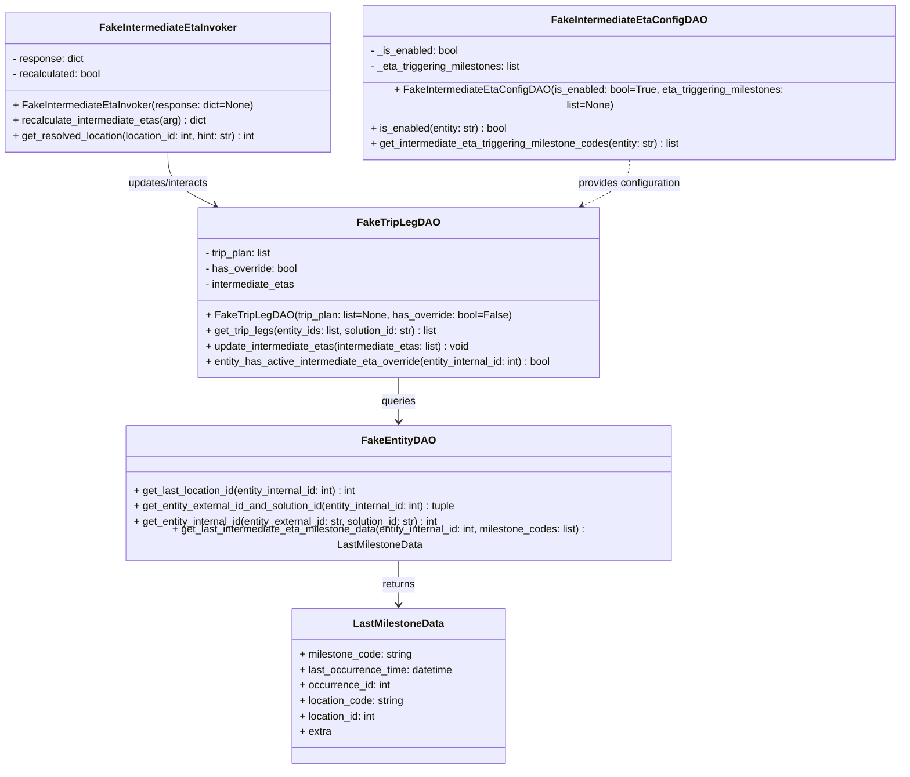

# Diagram: entity_core/entity_service/entity_listener/tests/unit/common/fake_intermediate_eta_dependencies.py

> Auto-generated by Obscura crawlers

## Mermaid

### SVG

<svg id="container" width="1399.7421875" xmlns="http://www.w3.org/2000/svg" class="classDiagram" height="1156" viewBox="0 0 1399.7421875 1156" role="graphics-document document" aria-roledescription="class"><g><defs><marker id="container_class-aggregationStart" class="marker aggregation class" refX="18" refY="7" markerWidth="190" markerHeight="240" orient="auto"><path d="M 18,7 L9,13 L1,7 L9,1 Z"></path></marker></defs><defs><marker id="container_class-aggregationEnd" class="marker aggregation class" refX="1" refY="7" markerWidth="20" markerHeight="28" orient="auto"><path d="M 18,7 L9,13 L1,7 L9,1 Z"></path></marker></defs><defs><marker id="container_class-extensionStart" class="marker extension class" refX="18" refY="7" markerWidth="190" markerHeight="240" orient="auto"><path d="M 1,7 L18,13 V 1 Z"></path></marker></defs><defs><marker id="container_class-extensionEnd" class="marker extension class" refX="1" refY="7" markerWidth="20" markerHeight="28" orient="auto"><path d="M 1,1 V 13 L18,7 Z"></path></marker></defs><defs><marker id="container_class-compositionStart" class="marker composition class" refX="18" refY="7" markerWidth="190" markerHeight="240" orient="auto"><path d="M 18,7 L9,13 L1,7 L9,1 Z"></path></marker></defs><defs><marker id="container_class-compositionEnd" class="marker composition class" refX="1" refY="7" markerWidth="20" markerHeight="28" orient="auto"><path d="M 18,7 L9,13 L1,7 L9,1 Z"></path></marker></defs><defs><marker id="container_class-dependencyStart" class="marker dependency class" refX="6" refY="7" markerWidth="190" markerHeight="240" orient="auto"><path d="M 5,7 L9,13 L1,7 L9,1 Z"></path></marker></defs><defs><marker id="container_class-dependencyEnd" class="marker dependency class" refX="13" refY="7" markerWidth="20" markerHeight="28" orient="auto"><path d="M 18,7 L9,13 L14,7 L9,1 Z"></path></marker></defs><defs><marker id="container_class-lollipopStart" class="marker lollipop class" refX="13" refY="7" markerWidth="190" markerHeight="240" orient="auto"><circle stroke="black" fill="transparent" cx="7" cy="7" r="6"></circle></marker></defs><defs><marker id="container_class-lollipopEnd" class="marker lollipop class" refX="1" refY="7" markerWidth="190" markerHeight="240" orient="auto"><circle stroke="black" fill="transparent" cx="7" cy="7" r="6"></circle></marker></defs><g class="root"><g class="clusters"></g><g class="edgePaths"><path d="M624.299,834L624.299,840.167C624.299,846.333,624.299,858.667,624.299,870C624.299,881.333,624.299,891.667,624.299,896.833L624.299,902" id="id_FakeEntityDAO_LastMilestoneData_1" class="edge-thickness-normal edge-pattern-solid relation" style=";;;" data-edge="true" data-et="edge" data-id="id_FakeEntityDAO_LastMilestoneData_1" data-points="W3sieCI6NjI0LjI5ODgyODEyNSwieSI6ODM0fSx7IngiOjYyNC4yOTg4MjgxMjUsInkiOjg3MX0seyJ4Ijo2MjQuMjk4ODI4MTI1LCJ5Ijo5MDh9XQ==" marker-end="url(#container_class-dependencyEnd)"></path><path d="M624.299,562L624.299,568.167C624.299,574.333,624.299,586.667,624.299,598C624.299,609.333,624.299,619.667,624.299,624.833L624.299,630" id="id_FakeTripLegDAO_FakeEntityDAO_2" class="edge-thickness-normal edge-pattern-solid relation" style=";;;" data-edge="true" data-et="edge" data-id="id_FakeTripLegDAO_FakeEntityDAO_2" data-points="W3sieCI6NjI0LjI5ODgyODEyNSwieSI6NTYyfSx7IngiOjYyNC4yOTg4MjgxMjUsInkiOjU5OX0seyJ4Ijo2MjQuMjk4ODI4MTI1LCJ5Ijo2MzZ9XQ==" marker-end="url(#container_class-dependencyEnd)"></path><path d="M265.863,224L265.863,230.167C265.863,236.333,265.863,248.667,278.038,260.574C290.212,272.48,314.561,283.961,326.736,289.701L338.91,295.441" id="id_FakeIntermediateEtaInvoker_FakeTripLegDAO_3" class="edge-thickness-normal edge-pattern-solid relation" style=";;;" data-edge="true" data-et="edge" data-id="id_FakeIntermediateEtaInvoker_FakeTripLegDAO_3" data-points="W3sieCI6MjY1Ljg2MzI4MTI1LCJ5IjoyMjR9LHsieCI6MjY1Ljg2MzI4MTI1LCJ5IjoyNjF9LHsieCI6MzQ0LjMzNzMzNTg5MTI3MjIsInkiOjI5OH1d" marker-end="url(#container_class-dependencyEnd)"></path><path d="M982.734,224L982.734,230.167C982.734,236.333,982.734,248.667,970.56,260.574C958.385,272.48,934.036,283.961,921.862,289.701L909.687,295.441" id="id_FakeIntermediateEtaConfigDAO_FakeTripLegDAO_4" class="edge-thickness-normal edge-pattern-dashed relation" style=";;;" data-edge="true" data-et="edge" data-id="id_FakeIntermediateEtaConfigDAO_FakeTripLegDAO_4" data-points="W3sieCI6OTgyLjczNDM3NSwieSI6MjI0fSx7IngiOjk4Mi43MzQzNzUsInkiOjI2MX0seyJ4Ijo5MDQuMjYwMzIwMzU4NzI3OCwieSI6Mjk4fV0=" marker-end="url(#container_class-dependencyEnd)"></path></g><g class="edgeLabels"><g class="edgeLabel" transform="translate(624.298828125, 871)"><g class="label" data-id="id_FakeEntityDAO_LastMilestoneData_1" transform="translate(-26.265625, -12)"><foreignObject width="52.53125" height="24">

returns

</foreignObject></g></g><g class="edgeLabel" transform="translate(624.298828125, 599)"><g class="label" data-id="id_FakeTripLegDAO_FakeEntityDAO_2" transform="translate(-27.2421875, -12)"><foreignObject width="54.484375" height="24">

queries

</foreignObject></g></g><g class="edgeLabel" transform="translate(265.86328125, 261)"><g class="label" data-id="id_FakeIntermediateEtaInvoker_FakeTripLegDAO_3" transform="translate(-65.25, -12)"><foreignObject width="130.5" height="24">

updates/interacts

</foreignObject></g></g><g class="edgeLabel" transform="translate(982.734375, 261)"><g class="label" data-id="id_FakeIntermediateEtaConfigDAO_FakeTripLegDAO_4" transform="translate(-81.4609375, -12)"><foreignObject width="162.921875" height="24">

provides configuration

</foreignObject></g></g></g><g class="nodes"><g class="node default" id="classId-FakeIntermediateEtaConfigDAO-0" transform="translate(982.734375, 116)"><g class="basic label-container"><path d="M-409.0078125 -108 L409.0078125 -108 L409.0078125 108 L-409.0078125 108" stroke="none" stroke-width="0" fill="#ECECFF" style=""></path><path d="M-409.0078125 -108 C-238.83485797982775 -108, -68.66190345965549 -108, 409.0078125 -108 M-409.0078125 -108 C-138.694005401028 -108, 131.619801697944 -108, 409.0078125 -108 M409.0078125 -108 C409.0078125 -42.08708929324506, 409.0078125 23.825821413509885, 409.0078125 108 M409.0078125 -108 C409.0078125 -38.050155386912735, 409.0078125 31.89968922617453, 409.0078125 108 M409.0078125 108 C245.218987816216 108, 81.43016313243203 108, -409.0078125 108 M409.0078125 108 C115.54379840013075 108, -177.9202156997385 108, -409.0078125 108 M-409.0078125 108 C-409.0078125 40.79414683351705, -409.0078125 -26.411706332965906, -409.0078125 -108 M-409.0078125 108 C-409.0078125 46.90744688859031, -409.0078125 -14.185106222819385, -409.0078125 -108" stroke="#9370DB" stroke-width="1.3" fill="none" stroke-dasharray="0 0" style=""></path></g><g class="annotation-group text" transform="translate(0, -84)"></g><g class="label-group text" transform="translate(-113.703125, -84)"><g class="label" style="font-weight: bolder" transform="translate(0,-12)"><foreignObject width="227.40625" height="24">

FakeIntermediateEtaConfigDAO

</foreignObject></g></g><g class="members-group text" transform="translate(-397.0078125, -36)"><g class="label" style="" transform="translate(0,-12)"><foreignObject width="138.84375" height="24">

- _is_enabled: bool

</foreignObject></g><g class="label" style="" transform="translate(0,12)"><foreignObject width="238.125" height="24">

- _eta_triggering_milestones: list

</foreignObject></g></g><g class="methods-group text" transform="translate(-397.0078125, 36)"><g class="label" style="" transform="translate(0,-12)"><foreignObject width="680.3125" height="24">

+ FakeIntermediateEtaConfigDAO(is_enabled: bool=True, eta_triggering_milestones: list=None)

</foreignObject></g><g class="label" style="" transform="translate(0,12)"><foreignObject width="216.1875" height="24">

+ is_enabled(entity: str) : bool

</foreignObject></g><g class="label" style="" transform="translate(0,36)"><foreignObject width="490.78125" height="24">

+ get_intermediate_eta_triggering_milestone_codes(entity: str) : list

</foreignObject></g></g><g class="divider" style=""><path d="M-409.0078125 -60 C-148.65238289681992 -60, 111.70304670636017 -60, 409.0078125 -60 M-409.0078125 -60 C-119.67188784034079 -60, 169.66403681931843 -60, 409.0078125 -60" stroke="#9370DB" stroke-width="1.3" fill="none" stroke-dasharray="0 0" style=""></path></g><g class="divider" style=""><path d="M-409.0078125 12 C-225.03776473563758 12, -41.06771697127516 12, 409.0078125 12 M-409.0078125 12 C-216.2249555284288 12, -23.442098556857616 12, 409.0078125 12" stroke="#9370DB" stroke-width="1.3" fill="none" stroke-dasharray="0 0" style=""></path></g></g><g class="node default" id="classId-FakeEntityDAO-1" transform="translate(624.298828125, 735)"><g class="basic label-container"><path d="M-436.9375 -99 L436.9375 -99 L436.9375 99 L-436.9375 99" stroke="none" stroke-width="0" fill="#ECECFF" style=""></path><path d="M-436.9375 -99 C-233.7008491062635 -99, -30.46419821252698 -99, 436.9375 -99 M-436.9375 -99 C-172.72069046505408 -99, 91.49611906989185 -99, 436.9375 -99 M436.9375 -99 C436.9375 -52.73684809242517, 436.9375 -6.47369618485034, 436.9375 99 M436.9375 -99 C436.9375 -32.67719209450394, 436.9375 33.645615810992126, 436.9375 99 M436.9375 99 C228.22613198797305 99, 19.514763975946096 99, -436.9375 99 M436.9375 99 C201.16741753526605 99, -34.60266492946789 99, -436.9375 99 M-436.9375 99 C-436.9375 29.787738578658193, -436.9375 -39.424522842683615, -436.9375 -99 M-436.9375 99 C-436.9375 36.902997560287645, -436.9375 -25.19400487942471, -436.9375 -99" stroke="#9370DB" stroke-width="1.3" fill="none" stroke-dasharray="0 0" style=""></path></g><g class="annotation-group text" transform="translate(0, -75)"></g><g class="label-group text" transform="translate(-53.109375, -75)"><g class="label" style="font-weight: bolder" transform="translate(0,-12)"><foreignObject width="106.21875" height="24">

FakeEntityDAO

</foreignObject></g></g><g class="members-group text" transform="translate(-424.9375, -27)"></g><g class="methods-group text" transform="translate(-424.9375, 3)"><g class="label" style="" transform="translate(0,-12)"><foreignObject width="358.28125" height="24">

+ get_last_location_id(entity_internal_id: int) : int

</foreignObject></g><g class="label" style="" transform="translate(0,12)"><foreignObject width="517.703125" height="24">

+ get_entity_external_id_and_solution_id(entity_internal_id: int) : tuple

</foreignObject></g><g class="label" style="" transform="translate(0,36)"><foreignObject width="489.546875" height="24">

+ get_entity_internal_id(entity_external_id: str, solution_id: str) : int

</foreignObject></g><g class="label" style="" transform="translate(0,60)"><foreignObject width="796.765625" height="24">

+ get_last_intermediate_eta_milestone_data(entity_internal_id: int, milestone_codes: list) : LastMilestoneData

</foreignObject></g></g><g class="divider" style=""><path d="M-436.9375 -51 C-143.67572441527415 -51, 149.5860511694517 -51, 436.9375 -51 M-436.9375 -51 C-227.19142644574154 -51, -17.445352891483083 -51, 436.9375 -51" stroke="#9370DB" stroke-width="1.3" fill="none" stroke-dasharray="0 0" style=""></path></g><g class="divider" style=""><path d="M-436.9375 -27 C-261.0840322595226 -27, -85.23056451904517 -27, 436.9375 -27 M-436.9375 -27 C-146.7354775927725 -27, 143.466544814455 -27, 436.9375 -27" stroke="#9370DB" stroke-width="1.3" fill="none" stroke-dasharray="0 0" style=""></path></g></g><g class="node default" id="classId-FakeTripLegDAO-2" transform="translate(624.298828125, 430)"><g class="basic label-container"><path d="M-317.546875 -132 L317.546875 -132 L317.546875 132 L-317.546875 132" stroke="none" stroke-width="0" fill="#ECECFF" style=""></path><path d="M-317.546875 -132 C-121.23317345709734 -132, 75.08052808580533 -132, 317.546875 -132 M-317.546875 -132 C-104.5718142695925 -132, 108.40324646081501 -132, 317.546875 -132 M317.546875 -132 C317.546875 -31.757130196732803, 317.546875 68.4857396065344, 317.546875 132 M317.546875 -132 C317.546875 -31.013314508948085, 317.546875 69.97337098210383, 317.546875 132 M317.546875 132 C79.73509404563754 132, -158.07668690872492 132, -317.546875 132 M317.546875 132 C115.83315891428427 132, -85.88055717143146 132, -317.546875 132 M-317.546875 132 C-317.546875 71.32390970096698, -317.546875 10.647819401933958, -317.546875 -132 M-317.546875 132 C-317.546875 48.08649857666559, -317.546875 -35.82700284666882, -317.546875 -132" stroke="#9370DB" stroke-width="1.3" fill="none" stroke-dasharray="0 0" style=""></path></g><g class="annotation-group text" transform="translate(0, -108)"></g><g class="label-group text" transform="translate(-58.875, -108)"><g class="label" style="font-weight: bolder" transform="translate(0,-12)"><foreignObject width="117.75" height="24">

FakeTripLegDAO

</foreignObject></g></g><g class="members-group text" transform="translate(-305.546875, -60)"><g class="label" style="" transform="translate(0,-12)"><foreignObject width="107.390625" height="24">

- trip_plan: list

</foreignObject></g><g class="label" style="" transform="translate(0,12)"><foreignObject width="145.6875" height="24">

- has_override: bool

</foreignObject></g><g class="label" style="" transform="translate(0,36)"><foreignObject width="142.5625" height="24">

- intermediate_etas

</foreignObject></g></g><g class="methods-group text" transform="translate(-305.546875, 36)"><g class="label" style="" transform="translate(0,-12)"><foreignObject width="468.078125" height="24">

+ FakeTripLegDAO(trip_plan: list=None, has_override: bool=False)

</foreignObject></g><g class="label" style="" transform="translate(0,12)"><foreignObject width="370.484375" height="24">

+ get_trip_legs(entity_ids: list, solution_id: str) : list

</foreignObject></g><g class="label" style="" transform="translate(0,36)"><foreignObject width="419.765625" height="24">

+ update_intermediate_etas(intermediate_etas: list) : void

</foreignObject></g><g class="label" style="" transform="translate(0,60)"><foreignObject width="552.21875" height="24">

+ entity_has_active_intermediate_eta_override(entity_internal_id: int) : bool

</foreignObject></g></g><g class="divider" style=""><path d="M-317.546875 -84 C-124.47129632232438 -84, 68.60428235535124 -84, 317.546875 -84 M-317.546875 -84 C-109.07562618295051 -84, 99.39562263409897 -84, 317.546875 -84" stroke="#9370DB" stroke-width="1.3" fill="none" stroke-dasharray="0 0" style=""></path></g><g class="divider" style=""><path d="M-317.546875 12 C-69.88696807371099 12, 177.77293885257802 12, 317.546875 12 M-317.546875 12 C-160.53585708036036 12, -3.524839160720717 12, 317.546875 12" stroke="#9370DB" stroke-width="1.3" fill="none" stroke-dasharray="0 0" style=""></path></g></g><g class="node default" id="classId-FakeIntermediateEtaInvoker-3" transform="translate(265.86328125, 116)"><g class="basic label-container"><path d="M-257.86328125 -108 L257.86328125 -108 L257.86328125 108 L-257.86328125 108" stroke="none" stroke-width="0" fill="#ECECFF" style=""></path><path d="M-257.86328125 -108 C-124.69736517894722 -108, 8.468550892105554 -108, 257.86328125 -108 M-257.86328125 -108 C-71.8615976943689 -108, 114.14008586126221 -108, 257.86328125 -108 M257.86328125 -108 C257.86328125 -56.24447701558428, 257.86328125 -4.488954031168561, 257.86328125 108 M257.86328125 -108 C257.86328125 -54.45501812512849, 257.86328125 -0.9100362502569794, 257.86328125 108 M257.86328125 108 C110.38385881467735 108, -37.095563620645294 108, -257.86328125 108 M257.86328125 108 C59.0158574217206 108, -139.8315664065588 108, -257.86328125 108 M-257.86328125 108 C-257.86328125 32.61933492279243, -257.86328125 -42.761330154415134, -257.86328125 -108 M-257.86328125 108 C-257.86328125 40.7251372505569, -257.86328125 -26.549725498886204, -257.86328125 -108" stroke="#9370DB" stroke-width="1.3" fill="none" stroke-dasharray="0 0" style=""></path></g><g class="annotation-group text" transform="translate(0, -84)"></g><g class="label-group text" transform="translate(-103.0390625, -84)"><g class="label" style="font-weight: bolder" transform="translate(0,-12)"><foreignObject width="206.078125" height="24">

FakeIntermediateEtaInvoker

</foreignObject></g></g><g class="members-group text" transform="translate(-245.86328125, -36)"><g class="label" style="" transform="translate(0,-12)"><foreignObject width="112.578125" height="24">

- response: dict

</foreignObject></g><g class="label" style="" transform="translate(0,12)"><foreignObject width="140.640625" height="24">

- recalculated: bool

</foreignObject></g></g><g class="methods-group text" transform="translate(-245.86328125, 36)"><g class="label" style="" transform="translate(0,-12)"><foreignObject width="374.015625" height="24">

+ FakeIntermediateEtaInvoker(response: dict=None)

</foreignObject></g><g class="label" style="" transform="translate(0,12)"><foreignObject width="304.6875" height="24">

+ recalculate_intermediate_etas(arg) : dict

</foreignObject></g><g class="label" style="" transform="translate(0,36)"><foreignObject width="388.6875" height="24">

+ get_resolved_location(location_id: int, hint: str) : int

</foreignObject></g></g><g class="divider" style=""><path d="M-257.86328125 -60 C-150.7224741474774 -60, -43.58166704495483 -60, 257.86328125 -60 M-257.86328125 -60 C-137.91654352666495 -60, -17.969805803329905 -60, 257.86328125 -60" stroke="#9370DB" stroke-width="1.3" fill="none" stroke-dasharray="0 0" style=""></path></g><g class="divider" style=""><path d="M-257.86328125 12 C-135.31097724543773 12, -12.758673240875453 12, 257.86328125 12 M-257.86328125 12 C-118.51221401924954 12, 20.83885321150092 12, 257.86328125 12" stroke="#9370DB" stroke-width="1.3" fill="none" stroke-dasharray="0 0" style=""></path></g></g><g class="node default" id="classId-LastMilestoneData-4" transform="translate(624.298828125, 1028)"><g class="basic label-container"><path d="M-165.91015625 -120 L165.91015625 -120 L165.91015625 120 L-165.91015625 120" stroke="none" stroke-width="0" fill="#ECECFF" style=""></path><path d="M-165.91015625 -120 C-71.25212339499332 -120, 23.405909460013362 -120, 165.91015625 -120 M-165.91015625 -120 C-39.0395200756202 -120, 87.8311160987596 -120, 165.91015625 -120 M165.91015625 -120 C165.91015625 -31.045151099734113, 165.91015625 57.909697800531774, 165.91015625 120 M165.91015625 -120 C165.91015625 -63.65209531577215, 165.91015625 -7.3041906315443015, 165.91015625 120 M165.91015625 120 C87.31191175531586 120, 8.713667260631723 120, -165.91015625 120 M165.91015625 120 C59.39129798613018 120, -47.12756027773963 120, -165.91015625 120 M-165.91015625 120 C-165.91015625 68.62610000398685, -165.91015625 17.2522000079737, -165.91015625 -120 M-165.91015625 120 C-165.91015625 42.411843484342384, -165.91015625 -35.17631303131523, -165.91015625 -120" stroke="#9370DB" stroke-width="1.3" fill="none" stroke-dasharray="0 0" style=""></path></g><g class="annotation-group text" transform="translate(0, -96)"></g><g class="label-group text" transform="translate(-67.9765625, -96)"><g class="label" style="font-weight: bolder" transform="translate(0,-12)"><foreignObject width="135.953125" height="24">

LastMilestoneData

</foreignObject></g></g><g class="members-group text" transform="translate(-153.91015625, -48)"><g class="label" style="" transform="translate(0,-12)"><foreignObject width="176.578125" height="24">

+ milestone_code: string

</foreignObject></g><g class="label" style="" transform="translate(0,12)"><foreignObject width="239.84375" height="24">

+ last_occurrence_time: datetime

</foreignObject></g><g class="label" style="" transform="translate(0,36)"><foreignObject width="141.546875" height="24">

+ occurrence_id: int

</foreignObject></g><g class="label" style="" transform="translate(0,60)"><foreignObject width="164.0625" height="24">

+ location_code: string

</foreignObject></g><g class="label" style="" transform="translate(0,84)"><foreignObject width="121.53125" height="24">

+ location_id: int

</foreignObject></g><g class="label" style="" transform="translate(0,108)"><foreignObject width="48.65625" height="24">

+ extra

</foreignObject></g></g><g class="methods-group text" transform="translate(-153.91015625, 120)"></g><g class="divider" style=""><path d="M-165.91015625 -72 C-72.64427217957288 -72, 20.62161189085424 -72, 165.91015625 -72 M-165.91015625 -72 C-41.487677774707834 -72, 82.93480070058433 -72, 165.91015625 -72" stroke="#9370DB" stroke-width="1.3" fill="none" stroke-dasharray="0 0" style=""></path></g><g class="divider" style=""><path d="M-165.91015625 96 C-88.42318765023276 96, -10.936219050465525 96, 165.91015625 96 M-165.91015625 96 C-50.195769951226666 96, 65.51861634754667 96, 165.91015625 96" stroke="#9370DB" stroke-width="1.3" fill="none" stroke-dasharray="0 0" style=""></path></g></g></g></g></g></svg>
