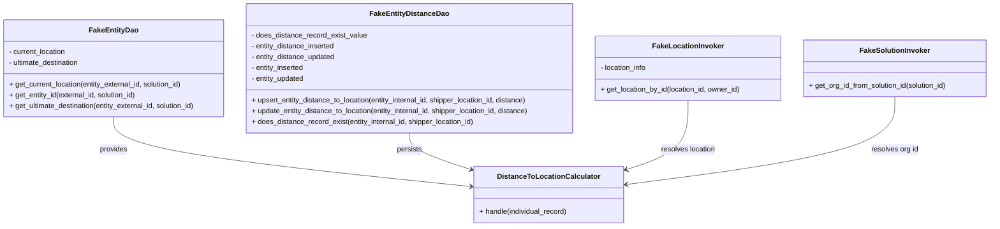
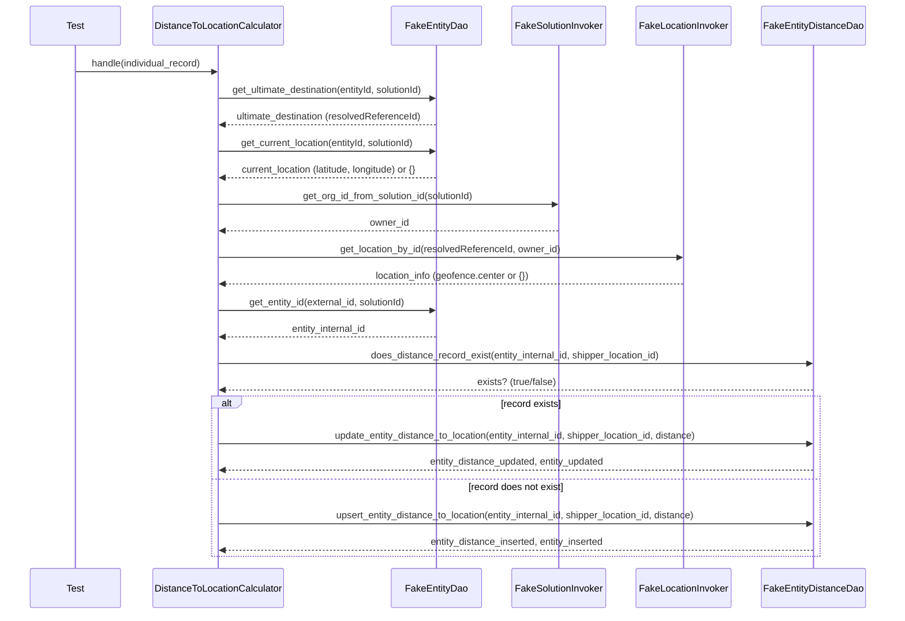

# Diagram: entity_core/entity_service/entity_listener/tests/unit/test_distance_to_location_calculator.py

> Auto-generated by Obscura crawlers

## Diagram 1

### SVG

<svg id="container" width="2236.5234375" xmlns="http://www.w3.org/2000/svg" class="classDiagram" height="504" viewBox="0 0 2236.5234375 504" role="graphics-document document" aria-roledescription="class"><g><defs><marker id="container_class-aggregationStart" class="marker aggregation class" refX="18" refY="7" markerWidth="190" markerHeight="240" orient="auto"><path d="M 18,7 L9,13 L1,7 L9,1 Z"></path></marker></defs><defs><marker id="container_class-aggregationEnd" class="marker aggregation class" refX="1" refY="7" markerWidth="20" markerHeight="28" orient="auto"><path d="M 18,7 L9,13 L1,7 L9,1 Z"></path></marker></defs><defs><marker id="container_class-extensionStart" class="marker extension class" refX="18" refY="7" markerWidth="190" markerHeight="240" orient="auto"><path d="M 1,7 L18,13 V 1 Z"></path></marker></defs><defs><marker id="container_class-extensionEnd" class="marker extension class" refX="1" refY="7" markerWidth="20" markerHeight="28" orient="auto"><path d="M 1,1 V 13 L18,7 Z"></path></marker></defs><defs><marker id="container_class-compositionStart" class="marker composition class" refX="18" refY="7" markerWidth="190" markerHeight="240" orient="auto"><path d="M 18,7 L9,13 L1,7 L9,1 Z"></path></marker></defs><defs><marker id="container_class-compositionEnd" class="marker composition class" refX="1" refY="7" markerWidth="20" markerHeight="28" orient="auto"><path d="M 18,7 L9,13 L1,7 L9,1 Z"></path></marker></defs><defs><marker id="container_class-dependencyStart" class="marker dependency class" refX="6" refY="7" markerWidth="190" markerHeight="240" orient="auto"><path d="M 5,7 L9,13 L1,7 L9,1 Z"></path></marker></defs><defs><marker id="container_class-dependencyEnd" class="marker dependency class" refX="13" refY="7" markerWidth="20" markerHeight="28" orient="auto"><path d="M 18,7 L9,13 L14,7 L9,1 Z"></path></marker></defs><defs><marker id="container_class-lollipopStart" class="marker lollipop class" refX="13" refY="7" markerWidth="190" markerHeight="240" orient="auto"><circle stroke="black" fill="transparent" cx="7" cy="7" r="6"></circle></marker></defs><defs><marker id="container_class-lollipopEnd" class="marker lollipop class" refX="1" refY="7" markerWidth="190" markerHeight="240" orient="auto"><circle stroke="black" fill="transparent" cx="7" cy="7" r="6"></circle></marker></defs><g class="root"><g class="clusters"></g><g class="edgePaths"><path d="M259.238,260L259.238,272.167C259.238,284.333,259.238,308.667,394.682,334.586C530.126,360.505,801.014,388.011,936.458,401.764L1071.902,415.516" id="id_FakeEntityDao_DistanceToLocationCalculator_1" class="edge-thickness-normal edge-pattern-solid relation" style=";;;" data-edge="true" data-et="edge" data-id="id_FakeEntityDao_DistanceToLocationCalculator_1" data-points="W3sieCI6MjU5LjIzODI4MTI1LCJ5IjoyNjB9LHsieCI6MjU5LjIzODI4MTI1LCJ5IjozMzN9LHsieCI6MTA3Ny44NzEwOTM3NSwieSI6NDE2LjEyMjQ1NjU4ODQ3N31d" marker-end="url(#container_class-dependencyEnd)"></path><path d="M930.336,296L930.336,302.167C930.336,308.333,930.336,320.667,953.972,334.367C977.609,348.067,1024.882,363.134,1048.518,370.667L1072.154,378.201" id="id_FakeEntityDistanceDao_DistanceToLocationCalculator_2" class="edge-thickness-normal edge-pattern-solid relation" style=";;;" data-edge="true" data-et="edge" data-id="id_FakeEntityDistanceDao_DistanceToLocationCalculator_2" data-points="W3sieCI6OTMwLjMzNTkzNzUsInkiOjI5Nn0seyJ4Ijo5MzAuMzM1OTM3NSwieSI6MzMzfSx7IngiOjEwNzcuODcxMDkzNzUsInkiOjM4MC4wMjI1NzE5MzAxMzAzN31d" marker-end="url(#container_class-dependencyEnd)"></path><path d="M1557.844,224L1557.844,242.167C1557.844,260.333,1557.844,296.667,1534.207,322.367C1510.571,348.067,1463.298,363.134,1439.662,370.667L1416.025,378.201" id="id_FakeLocationInvoker_DistanceToLocationCalculator_3" class="edge-thickness-normal edge-pattern-solid relation" style=";;;" data-edge="true" data-et="edge" data-id="id_FakeLocationInvoker_DistanceToLocationCalculator_3" data-points="W3sieCI6MTU1Ny44NDM3NSwieSI6MjI0fSx7IngiOjE1NTcuODQzNzUsInkiOjMzM30seyJ4IjoxNDEwLjMwODU5Mzc1LCJ5IjozODAuMDIyNTcxOTMwMTMwMzd9XQ==" marker-end="url(#container_class-dependencyEnd)"></path><path d="M2022.008,215L2022.008,234.667C2022.008,254.333,2022.008,293.667,1921.05,326.311C1820.092,358.956,1618.176,384.912,1517.218,397.89L1416.26,410.868" id="id_FakeSolutionInvoker_DistanceToLocationCalculator_4" class="edge-thickness-normal edge-pattern-solid relation" style=";;;" data-edge="true" data-et="edge" data-id="id_FakeSolutionInvoker_DistanceToLocationCalculator_4" data-points="W3sieCI6MjAyMi4wMDc4MTI1LCJ5IjoyMTV9LHsieCI6MjAyMi4wMDc4MTI1LCJ5IjozMzN9LHsieCI6MTQxMC4zMDg1OTM3NSwieSI6NDExLjYzMjg2OTE4NzA4Mjl9XQ==" marker-end="url(#container_class-dependencyEnd)"></path></g><g class="edgeLabels"><g class="edgeLabel" transform="translate(259.23828125, 333)"><g class="label" data-id="id_FakeEntityDao_DistanceToLocationCalculator_1" transform="translate(-31.3125, -12)"><foreignObject width="62.625" height="24">

provides

</foreignObject></g></g><g class="edgeLabel" transform="translate(930.3359375, 333)"><g class="label" data-id="id_FakeEntityDistanceDao_DistanceToLocationCalculator_2" transform="translate(-28.4375, -12)"><foreignObject width="56.875" height="24">

persists

</foreignObject></g></g><g class="edgeLabel" transform="translate(1557.84375, 333)"><g class="label" data-id="id_FakeLocationInvoker_DistanceToLocationCalculator_3" transform="translate(-61.578125, -12)"><foreignObject width="123.15625" height="24">

resolves location

</foreignObject></g></g><g class="edgeLabel" transform="translate(2022.0078125, 333)"><g class="label" data-id="id_FakeSolutionInvoker_DistanceToLocationCalculator_4" transform="translate(-52.9609375, -12)"><foreignObject width="105.921875" height="24">

resolves org id

</foreignObject></g></g></g><g class="nodes"><g class="node default" id="classId-FakeEntityDistanceDao-0" transform="translate(930.3359375, 152)"><g class="basic label-container"><path d="M-369.859375 -144 L369.859375 -144 L369.859375 144 L-369.859375 144" stroke="none" stroke-width="0" fill="#ECECFF" style=""></path><path d="M-369.859375 -144 C-205.80266917667078 -144, -41.74596335334155 -144, 369.859375 -144 M-369.859375 -144 C-205.48845445619136 -144, -41.117533912382726 -144, 369.859375 -144 M369.859375 -144 C369.859375 -54.54006986114662, 369.859375 34.91986027770676, 369.859375 144 M369.859375 -144 C369.859375 -68.92276653506448, 369.859375 6.154466929871035, 369.859375 144 M369.859375 144 C217.249592250166 144, 64.63980950033198 144, -369.859375 144 M369.859375 144 C95.77887969364275 144, -178.3016156127145 144, -369.859375 144 M-369.859375 144 C-369.859375 81.19540619795242, -369.859375 18.39081239590483, -369.859375 -144 M-369.859375 144 C-369.859375 33.2705699674969, -369.859375 -77.4588600650062, -369.859375 -144" stroke="#9370DB" stroke-width="1.3" fill="none" stroke-dasharray="0 0" style=""></path></g><g class="annotation-group text" transform="translate(0, -120)"></g><g class="label-group text" transform="translate(-83.40625, -120)"><g class="label" style="font-weight: bolder" transform="translate(0,-12)"><foreignObject width="166.8125" height="24">

FakeEntityDistanceDao

</foreignObject></g></g><g class="members-group text" transform="translate(-357.859375, -72)"><g class="label" style="" transform="translate(0,-12)"><foreignObject width="258" height="24">

- does_distance_record_exist_value

</foreignObject></g><g class="label" style="" transform="translate(0,12)"><foreignObject width="189.59375" height="24">

- entity_distance_inserted

</foreignObject></g><g class="label" style="" transform="translate(0,36)"><foreignObject width="190.109375" height="24">

- entity_distance_updated

</foreignObject></g><g class="label" style="" transform="translate(0,60)"><foreignObject width="120.5625" height="24">

- entity_inserted

</foreignObject></g><g class="label" style="" transform="translate(0,84)"><foreignObject width="121.078125" height="24">

- entity_updated

</foreignObject></g></g><g class="methods-group text" transform="translate(-357.859375, 72)"><g class="label" style="" transform="translate(0,-12)"><foreignObject width="628.25" height="24">

+ upsert_entity_distance_to_location(entity_internal_id, shipper_location_id, distance)

</foreignObject></g><g class="label" style="" transform="translate(0,12)"><foreignObject width="632.3125" height="24">

+ update_entity_distance_to_location(entity_internal_id, shipper_location_id, distance)

</foreignObject></g><g class="label" style="" transform="translate(0,36)"><foreignObject width="504.078125" height="24">

+ does_distance_record_exist(entity_internal_id, shipper_location_id)

</foreignObject></g></g><g class="divider" style=""><path d="M-369.859375 -96 C-77.36609387871533 -96, 215.12718724256933 -96, 369.859375 -96 M-369.859375 -96 C-189.99340645936047 -96, -10.127437918720943 -96, 369.859375 -96" stroke="#9370DB" stroke-width="1.3" fill="none" stroke-dasharray="0 0" style=""></path></g><g class="divider" style=""><path d="M-369.859375 48 C-151.87698084530797 48, 66.10541330938406 48, 369.859375 48 M-369.859375 48 C-83.72026552863355 48, 202.4188439427329 48, 369.859375 48" stroke="#9370DB" stroke-width="1.3" fill="none" stroke-dasharray="0 0" style=""></path></g></g><g class="node default" id="classId-FakeEntityDao-1" transform="translate(259.23828125, 152)"><g class="basic label-container"><path d="M-251.23828125 -108 L251.23828125 -108 L251.23828125 108 L-251.23828125 108" stroke="none" stroke-width="0" fill="#ECECFF" style=""></path><path d="M-251.23828125 -108 C-79.01409367461221 -108, 93.21009390077558 -108, 251.23828125 -108 M-251.23828125 -108 C-60.18183964405105 -108, 130.8746019618979 -108, 251.23828125 -108 M251.23828125 -108 C251.23828125 -57.17215762909969, 251.23828125 -6.344315258199373, 251.23828125 108 M251.23828125 -108 C251.23828125 -40.76553149361203, 251.23828125 26.46893701277594, 251.23828125 108 M251.23828125 108 C87.34667137723682 108, -76.54493849552637 108, -251.23828125 108 M251.23828125 108 C134.42033743141627 108, 17.602393612832515 108, -251.23828125 108 M-251.23828125 108 C-251.23828125 54.48527545606053, -251.23828125 0.9705509121210554, -251.23828125 -108 M-251.23828125 108 C-251.23828125 50.82642113687585, -251.23828125 -6.347157726248298, -251.23828125 -108" stroke="#9370DB" stroke-width="1.3" fill="none" stroke-dasharray="0 0" style=""></path></g><g class="annotation-group text" transform="translate(0, -84)"></g><g class="label-group text" transform="translate(-51.9921875, -84)"><g class="label" style="font-weight: bolder" transform="translate(0,-12)"><foreignObject width="103.984375" height="24">

FakeEntityDao

</foreignObject></g></g><g class="members-group text" transform="translate(-239.23828125, -36)"><g class="label" style="" transform="translate(0,-12)"><foreignObject width="130.546875" height="24">

- current_location

</foreignObject></g><g class="label" style="" transform="translate(0,12)"><foreignObject width="162.46875" height="24">

- ultimate_destination

</foreignObject></g></g><g class="methods-group text" transform="translate(-239.23828125, 36)"><g class="label" style="" transform="translate(0,-12)"><foreignObject width="394.5625" height="24">

+ get_current_location(entity_external_id, solution_id)

</foreignObject></g><g class="label" style="" transform="translate(0,12)"><foreignObject width="289.109375" height="24">

+ get_entity_id(external_id, solution_id)

</foreignObject></g><g class="label" style="" transform="translate(0,36)"><foreignObject width="426.484375" height="24">

+ get_ultimate_destination(entity_external_id, solution_id)

</foreignObject></g></g><g class="divider" style=""><path d="M-251.23828125 -60 C-94.02860941584396 -60, 63.18106241831208 -60, 251.23828125 -60 M-251.23828125 -60 C-137.78358859855223 -60, -24.328895947104428 -60, 251.23828125 -60" stroke="#9370DB" stroke-width="1.3" fill="none" stroke-dasharray="0 0" style=""></path></g><g class="divider" style=""><path d="M-251.23828125 12 C-135.98760504880647 12, -20.736928847612916 12, 251.23828125 12 M-251.23828125 12 C-105.84905148468155 12, 39.540178280636894 12, 251.23828125 12" stroke="#9370DB" stroke-width="1.3" fill="none" stroke-dasharray="0 0" style=""></path></g></g><g class="node default" id="classId-FakeLocationInvoker-2" transform="translate(1557.84375, 152)"><g class="basic label-container"><path d="M-207.6484375 -72 L207.6484375 -72 L207.6484375 72 L-207.6484375 72" stroke="none" stroke-width="0" fill="#ECECFF" style=""></path><path d="M-207.6484375 -72 C-90.80615753282866 -72, 26.036122434342673 -72, 207.6484375 -72 M-207.6484375 -72 C-105.11398235008843 -72, -2.5795272001768694 -72, 207.6484375 -72 M207.6484375 -72 C207.6484375 -29.764394697360196, 207.6484375 12.471210605279609, 207.6484375 72 M207.6484375 -72 C207.6484375 -25.773339329650995, 207.6484375 20.45332134069801, 207.6484375 72 M207.6484375 72 C113.25317468185649 72, 18.857911863712985 72, -207.6484375 72 M207.6484375 72 C53.94379578829168 72, -99.76084592341664 72, -207.6484375 72 M-207.6484375 72 C-207.6484375 16.07056441232386, -207.6484375 -39.85887117535228, -207.6484375 -72 M-207.6484375 72 C-207.6484375 16.42671973401331, -207.6484375 -39.14656053197338, -207.6484375 -72" stroke="#9370DB" stroke-width="1.3" fill="none" stroke-dasharray="0 0" style=""></path></g><g class="annotation-group text" transform="translate(0, -48)"></g><g class="label-group text" transform="translate(-75.4375, -48)"><g class="label" style="font-weight: bolder" transform="translate(0,-12)"><foreignObject width="150.875" height="24">

FakeLocationInvoker

</foreignObject></g></g><g class="members-group text" transform="translate(-195.6484375, 0)"><g class="label" style="" transform="translate(0,-12)"><foreignObject width="106.59375" height="24">

- location_info

</foreignObject></g></g><g class="methods-group text" transform="translate(-195.6484375, 48)"><g class="label" style="" transform="translate(0,-12)"><foreignObject width="315.859375" height="24">

+ get_location_by_id(location_id, owner_id)

</foreignObject></g></g><g class="divider" style=""><path d="M-207.6484375 -24 C-107.9310730742126 -24, -8.21370864842521 -24, 207.6484375 -24 M-207.6484375 -24 C-59.26436499681702 -24, 89.11970750636596 -24, 207.6484375 -24" stroke="#9370DB" stroke-width="1.3" fill="none" stroke-dasharray="0 0" style=""></path></g><g class="divider" style=""><path d="M-207.6484375 24 C-90.44603204384232 24, 26.756373412315355 24, 207.6484375 24 M-207.6484375 24 C-64.02403712929828 24, 79.60036324140344 24, 207.6484375 24" stroke="#9370DB" stroke-width="1.3" fill="none" stroke-dasharray="0 0" style=""></path></g></g><g class="node default" id="classId-FakeSolutionInvoker-3" transform="translate(2022.0078125, 152)"><g class="basic label-container"><path d="M-206.515625 -63 L206.515625 -63 L206.515625 63 L-206.515625 63" stroke="none" stroke-width="0" fill="#ECECFF" style=""></path><path d="M-206.515625 -63 C-94.0304069659209 -63, 18.454811068158193 -63, 206.515625 -63 M-206.515625 -63 C-91.67486218740588 -63, 23.165900625188243 -63, 206.515625 -63 M206.515625 -63 C206.515625 -17.426263243931352, 206.515625 28.147473512137296, 206.515625 63 M206.515625 -63 C206.515625 -17.016271465783113, 206.515625 28.967457068433774, 206.515625 63 M206.515625 63 C74.91740168829301 63, -56.680821623413976 63, -206.515625 63 M206.515625 63 C57.896777244879786 63, -90.72207051024043 63, -206.515625 63 M-206.515625 63 C-206.515625 25.435623632633202, -206.515625 -12.128752734733595, -206.515625 -63 M-206.515625 63 C-206.515625 25.743418210634324, -206.515625 -11.513163578731351, -206.515625 -63" stroke="#9370DB" stroke-width="1.3" fill="none" stroke-dasharray="0 0" style=""></path></g><g class="annotation-group text" transform="translate(0, -39)"></g><g class="label-group text" transform="translate(-74.921875, -39)"><g class="label" style="font-weight: bolder" transform="translate(0,-12)"><foreignObject width="149.84375" height="24">

FakeSolutionInvoker

</foreignObject></g></g><g class="members-group text" transform="translate(-194.515625, 9)"></g><g class="methods-group text" transform="translate(-194.515625, 39)"><g class="label" style="" transform="translate(0,-12)"><foreignObject width="314.109375" height="24">

+ get_org_id_from_solution_id(solution_id)

</foreignObject></g></g><g class="divider" style=""><path d="M-206.515625 -15 C-60.47167328851617 -15, 85.57227842296766 -15, 206.515625 -15 M-206.515625 -15 C-99.14890268446088 -15, 8.217819631078243 -15, 206.515625 -15" stroke="#9370DB" stroke-width="1.3" fill="none" stroke-dasharray="0 0" style=""></path></g><g class="divider" style=""><path d="M-206.515625 9 C-113.10813825502902 9, -19.700651510058037 9, 206.515625 9 M-206.515625 9 C-96.8998687600757 9, 12.71588747984859 9, 206.515625 9" stroke="#9370DB" stroke-width="1.3" fill="none" stroke-dasharray="0 0" style=""></path></g></g><g class="node default" id="classId-DistanceToLocationCalculator-4" transform="translate(1244.08984375, 433)"><g class="basic label-container"><path d="M-166.21875 -63 L166.21875 -63 L166.21875 63 L-166.21875 63" stroke="none" stroke-width="0" fill="#ECECFF" style=""></path><path d="M-166.21875 -63 C-61.726943808701094 -63, 42.76486238259781 -63, 166.21875 -63 M-166.21875 -63 C-37.16399259856212 -63, 91.89076480287576 -63, 166.21875 -63 M166.21875 -63 C166.21875 -31.448782362134544, 166.21875 0.10243527573091171, 166.21875 63 M166.21875 -63 C166.21875 -18.58170929625114, 166.21875 25.836581407497718, 166.21875 63 M166.21875 63 C86.51265142672402 63, 6.806552853448039 63, -166.21875 63 M166.21875 63 C50.217748918541034 63, -65.78325216291793 63, -166.21875 63 M-166.21875 63 C-166.21875 25.75631546573144, -166.21875 -11.48736906853712, -166.21875 -63 M-166.21875 63 C-166.21875 14.466927103207965, -166.21875 -34.06614579358407, -166.21875 -63" stroke="#9370DB" stroke-width="1.3" fill="none" stroke-dasharray="0 0" style=""></path></g><g class="annotation-group text" transform="translate(0, -39)"></g><g class="label-group text" transform="translate(-108.34375, -39)"><g class="label" style="font-weight: bolder" transform="translate(0,-12)"><foreignObject width="216.6875" height="24">

DistanceToLocationCalculator

</foreignObject></g></g><g class="members-group text" transform="translate(-154.21875, 9)"></g><g class="methods-group text" transform="translate(-154.21875, 39)"><g class="label" style="" transform="translate(0,-12)"><foreignObject width="200.09375" height="24">

+ handle(individual_record)

</foreignObject></g></g><g class="divider" style=""><path d="M-166.21875 -15 C-51.679750165592864 -15, 62.85924966881427 -15, 166.21875 -15 M-166.21875 -15 C-57.71650419552199 -15, 50.785741608956016 -15, 166.21875 -15" stroke="#9370DB" stroke-width="1.3" fill="none" stroke-dasharray="0 0" style=""></path></g><g class="divider" style=""><path d="M-166.21875 9 C-96.24855620387306 9, -26.27836240774613 9, 166.21875 9 M-166.21875 9 C-57.908525445384726 9, 50.40169910923055 9, 166.21875 9" stroke="#9370DB" stroke-width="1.3" fill="none" stroke-dasharray="0 0" style=""></path></g></g></g></g></g></svg>

## Diagram 2

### SVG

<svg id="container" width="1580" xmlns="http://www.w3.org/2000/svg" height="1087" viewBox="-50 -10 1580 1087" role="graphics-document document" aria-roledescription="sequence"><g><rect x="1296" y="1001" fill="#eaeaea" stroke="#666" width="184" height="65" name="DistDao" rx="3" ry="3" class="actor actor-bottom"></rect><text x="1388" y="1033.5" dominant-baseline="central" alignment-baseline="central" class="actor actor-box" style="text-anchor: middle; font-size: 16px; font-weight: 400;"><tspan x="1388" dy="0">FakeEntityDistanceDao</tspan></text></g><g><rect x="1077" y="1001" fill="#eaeaea" stroke="#666" width="169" height="65" name="LocInv" rx="3" ry="3" class="actor actor-bottom"></rect><text x="1161.5" y="1033.5" dominant-baseline="central" alignment-baseline="central" class="actor actor-box" style="text-anchor: middle; font-size: 16px; font-weight: 400;"><tspan x="1161.5" dy="0">FakeLocationInvoker</tspan></text></g><g><rect x="859" y="1001" fill="#eaeaea" stroke="#666" width="168" height="65" name="Sol" rx="3" ry="3" class="actor actor-bottom"></rect><text x="943" y="1033.5" dominant-baseline="central" alignment-baseline="central" class="actor actor-box" style="text-anchor: middle; font-size: 16px; font-weight: 400;"><tspan x="943" dy="0">FakeSolutionInvoker</tspan></text></g><g><rect x="659" y="1001" fill="#eaeaea" stroke="#666" width="150" height="65" name="EntityDao" rx="3" ry="3" class="actor actor-bottom"></rect><text x="734" y="1033.5" dominant-baseline="central" alignment-baseline="central" class="actor actor-box" style="text-anchor: middle; font-size: 16px; font-weight: 400;"><tspan x="734" dy="0">FakeEntityDao</tspan></text></g><g><rect x="215.5" y="1001" fill="#eaeaea" stroke="#666" width="235" height="65" name="Calc" rx="3" ry="3" class="actor actor-bottom"></rect><text x="333" y="1033.5" dominant-baseline="central" alignment-baseline="central" class="actor actor-box" style="text-anchor: middle; font-size: 16px; font-weight: 400;"><tspan x="333" dy="0">DistanceToLocationCalculator</tspan></text></g><g><rect x="0" y="1001" fill="#eaeaea" stroke="#666" width="150" height="65" name="Test" rx="3" ry="3" class="actor actor-bottom"></rect><text x="75" y="1033.5" dominant-baseline="central" alignment-baseline="central" class="actor actor-box" style="text-anchor: middle; font-size: 16px; font-weight: 400;"><tspan x="75" dy="0">Test</tspan></text></g><g><line id="actor5" x1="1388" y1="65" x2="1388" y2="1001" class="actor-line 200" stroke-width="0.5px" stroke="#999" name="DistDao"></line><g id="root-5"><rect x="1296" y="0" fill="#eaeaea" stroke="#666" width="184" height="65" name="DistDao" rx="3" ry="3" class="actor actor-top"></rect><text x="1388" y="32.5" dominant-baseline="central" alignment-baseline="central" class="actor actor-box" style="text-anchor: middle; font-size: 16px; font-weight: 400;"><tspan x="1388" dy="0">FakeEntityDistanceDao</tspan></text></g></g><g><line id="actor4" x1="1161.5" y1="65" x2="1161.5" y2="1001" class="actor-line 200" stroke-width="0.5px" stroke="#999" name="LocInv"></line><g id="root-4"><rect x="1077" y="0" fill="#eaeaea" stroke="#666" width="169" height="65" name="LocInv" rx="3" ry="3" class="actor actor-top"></rect><text x="1161.5" y="32.5" dominant-baseline="central" alignment-baseline="central" class="actor actor-box" style="text-anchor: middle; font-size: 16px; font-weight: 400;"><tspan x="1161.5" dy="0">FakeLocationInvoker</tspan></text></g></g><g><line id="actor3" x1="943" y1="65" x2="943" y2="1001" class="actor-line 200" stroke-width="0.5px" stroke="#999" name="Sol"></line><g id="root-3"><rect x="859" y="0" fill="#eaeaea" stroke="#666" width="168" height="65" name="Sol" rx="3" ry="3" class="actor actor-top"></rect><text x="943" y="32.5" dominant-baseline="central" alignment-baseline="central" class="actor actor-box" style="text-anchor: middle; font-size: 16px; font-weight: 400;"><tspan x="943" dy="0">FakeSolutionInvoker</tspan></text></g></g><g><line id="actor2" x1="734" y1="65" x2="734" y2="1001" class="actor-line 200" stroke-width="0.5px" stroke="#999" name="EntityDao"></line><g id="root-2"><rect x="659" y="0" fill="#eaeaea" stroke="#666" width="150" height="65" name="EntityDao" rx="3" ry="3" class="actor actor-top"></rect><text x="734" y="32.5" dominant-baseline="central" alignment-baseline="central" class="actor actor-box" style="text-anchor: middle; font-size: 16px; font-weight: 400;"><tspan x="734" dy="0">FakeEntityDao</tspan></text></g></g><g><line id="actor1" x1="333" y1="65" x2="333" y2="1001" class="actor-line 200" stroke-width="0.5px" stroke="#999" name="Calc"></line><g id="root-1"><rect x="215.5" y="0" fill="#eaeaea" stroke="#666" width="235" height="65" name="Calc" rx="3" ry="3" class="actor actor-top"></rect><text x="333" y="32.5" dominant-baseline="central" alignment-baseline="central" class="actor actor-box" style="text-anchor: middle; font-size: 16px; font-weight: 400;"><tspan x="333" dy="0">DistanceToLocationCalculator</tspan></text></g></g><g><line id="actor0" x1="75" y1="65" x2="75" y2="1001" class="actor-line 200" stroke-width="0.5px" stroke="#999" name="Test"></line><g id="root-0"><rect x="0" y="0" fill="#eaeaea" stroke="#666" width="150" height="65" name="Test" rx="3" ry="3" class="actor actor-top"></rect><text x="75" y="32.5" dominant-baseline="central" alignment-baseline="central" class="actor actor-box" style="text-anchor: middle; font-size: 16px; font-weight: 400;"><tspan x="75" dy="0">Test</tspan></text></g></g><g></g><defs><symbol id="computer" width="24" height="24"><path transform="scale(.5)" d="M2 2v13h20v-13h-20zm18 11h-16v-9h16v9zm-10.228 6l.466-1h3.524l.467 1h-4.457zm14.228 3h-24l2-6h2.104l-1.33 4h18.45l-1.297-4h2.073l2 6zm-5-10h-14v-7h14v7z"></path></symbol></defs><defs><symbol id="database" fill-rule="evenodd" clip-rule="evenodd"><path transform="scale(.5)" d="M12.258.001l.256.004.255.005.253.008.251.01.249.012.247.015.246.016.242.019.241.02.239.023.236.024.233.027.231.028.229.031.225.032.223.034.22.036.217.038.214.04.211.041.208.043.205.045.201.046.198.048.194.05.191.051.187.053.183.054.18.056.175.057.172.059.168.06.163.061.16.063.155.064.15.066.074.033.073.033.071.034.07.034.069.035.068.035.067.035.066.035.064.036.064.036.062.036.06.036.06.037.058.037.058.037.055.038.055.038.053.038.052.038.051.039.05.039.048.039.047.039.045.04.044.04.043.04.041.04.04.041.039.041.037.041.036.041.034.041.033.042.032.042.03.042.029.042.027.042.026.043.024.043.023.043.021.043.02.043.018.044.017.043.015.044.013.044.012.044.011.045.009.044.007.045.006.045.004.045.002.045.001.045v17l-.001.045-.002.045-.004.045-.006.045-.007.045-.009.044-.011.045-.012.044-.013.044-.015.044-.017.043-.018.044-.02.043-.021.043-.023.043-.024.043-.026.043-.027.042-.029.042-.03.042-.032.042-.033.042-.034.041-.036.041-.037.041-.039.041-.04.041-.041.04-.043.04-.044.04-.045.04-.047.039-.048.039-.05.039-.051.039-.052.038-.053.038-.055.038-.055.038-.058.037-.058.037-.06.037-.06.036-.062.036-.064.036-.064.036-.066.035-.067.035-.068.035-.069.035-.07.034-.071.034-.073.033-.074.033-.15.066-.155.064-.16.063-.163.061-.168.06-.172.059-.175.057-.18.056-.183.054-.187.053-.191.051-.194.05-.198.048-.201.046-.205.045-.208.043-.211.041-.214.04-.217.038-.22.036-.223.034-.225.032-.229.031-.231.028-.233.027-.236.024-.239.023-.241.02-.242.019-.246.016-.247.015-.249.012-.251.01-.253.008-.255.005-.256.004-.258.001-.258-.001-.256-.004-.255-.005-.253-.008-.251-.01-.249-.012-.247-.015-.245-.016-.243-.019-.241-.02-.238-.023-.236-.024-.234-.027-.231-.028-.228-.031-.226-.032-.223-.034-.22-.036-.217-.038-.214-.04-.211-.041-.208-.043-.204-.045-.201-.046-.198-.048-.195-.05-.19-.051-.187-.053-.184-.054-.179-.056-.176-.057-.172-.059-.167-.06-.164-.061-.159-.063-.155-.064-.151-.066-.074-.033-.072-.033-.072-.034-.07-.034-.069-.035-.068-.035-.067-.035-.066-.035-.064-.036-.063-.036-.062-.036-.061-.036-.06-.037-.058-.037-.057-.037-.056-.038-.055-.038-.053-.038-.052-.038-.051-.039-.049-.039-.049-.039-.046-.039-.046-.04-.044-.04-.043-.04-.041-.04-.04-.041-.039-.041-.037-.041-.036-.041-.034-.041-.033-.042-.032-.042-.03-.042-.029-.042-.027-.042-.026-.043-.024-.043-.023-.043-.021-.043-.02-.043-.018-.044-.017-.043-.015-.044-.013-.044-.012-.044-.011-.045-.009-.044-.007-.045-.006-.045-.004-.045-.002-.045-.001-.045v-17l.001-.045.002-.045.004-.045.006-.045.007-.045.009-.044.011-.045.012-.044.013-.044.015-.044.017-.043.018-.044.02-.043.021-.043.023-.043.024-.043.026-.043.027-.042.029-.042.03-.042.032-.042.033-.042.034-.041.036-.041.037-.041.039-.041.04-.041.041-.04.043-.04.044-.04.046-.04.046-.039.049-.039.049-.039.051-.039.052-.038.053-.038.055-.038.056-.038.057-.037.058-.037.06-.037.061-.036.062-.036.063-.036.064-.036.066-.035.067-.035.068-.035.069-.035.07-.034.072-.034.072-.033.074-.033.151-.066.155-.064.159-.063.164-.061.167-.06.172-.059.176-.057.179-.056.184-.054.187-.053.19-.051.195-.05.198-.048.201-.046.204-.045.208-.043.211-.041.214-.04.217-.038.22-.036.223-.034.226-.032.228-.031.231-.028.234-.027.236-.024.238-.023.241-.02.243-.019.245-.016.247-.015.249-.012.251-.01.253-.008.255-.005.256-.004.258-.001.258.001zm-9.258 20.499v.01l.001.021.003.021.004.022.005.021.006.022.007.022.009.023.01.022.011.023.012.023.013.023.015.023.016.024.017.023.018.024.019.024.021.024.022.025.023.024.024.025.052.049.056.05.061.051.066.051.07.051.075.051.079.052.084.052.088.052.092.052.097.052.102.051.105.052.11.052.114.051.119.051.123.051.127.05.131.05.135.05.139.048.144.049.147.047.152.047.155.047.16.045.163.045.167.043.171.043.176.041.178.041.183.039.187.039.19.037.194.035.197.035.202.033.204.031.209.03.212.029.216.027.219.025.222.024.226.021.23.02.233.018.236.016.24.015.243.012.246.01.249.008.253.005.256.004.259.001.26-.001.257-.004.254-.005.25-.008.247-.011.244-.012.241-.014.237-.016.233-.018.231-.021.226-.021.224-.024.22-.026.216-.027.212-.028.21-.031.205-.031.202-.034.198-.034.194-.036.191-.037.187-.039.183-.04.179-.04.175-.042.172-.043.168-.044.163-.045.16-.046.155-.046.152-.047.148-.048.143-.049.139-.049.136-.05.131-.05.126-.05.123-.051.118-.052.114-.051.11-.052.106-.052.101-.052.096-.052.092-.052.088-.053.083-.051.079-.052.074-.052.07-.051.065-.051.06-.051.056-.05.051-.05.023-.024.023-.025.021-.024.02-.024.019-.024.018-.024.017-.024.015-.023.014-.024.013-.023.012-.023.01-.023.01-.022.008-.022.006-.022.006-.022.004-.022.004-.021.001-.021.001-.021v-4.127l-.077.055-.08.053-.083.054-.085.053-.087.052-.09.052-.093.051-.095.05-.097.05-.1.049-.102.049-.105.048-.106.047-.109.047-.111.046-.114.045-.115.045-.118.044-.12.043-.122.042-.124.042-.126.041-.128.04-.13.04-.132.038-.134.038-.135.037-.138.037-.139.035-.142.035-.143.034-.144.033-.147.032-.148.031-.15.03-.151.03-.153.029-.154.027-.156.027-.158.026-.159.025-.161.024-.162.023-.163.022-.165.021-.166.02-.167.019-.169.018-.169.017-.171.016-.173.015-.173.014-.175.013-.175.012-.177.011-.178.01-.179.008-.179.008-.181.006-.182.005-.182.004-.184.003-.184.002h-.37l-.184-.002-.184-.003-.182-.004-.182-.005-.181-.006-.179-.008-.179-.008-.178-.01-.176-.011-.176-.012-.175-.013-.173-.014-.172-.015-.171-.016-.17-.017-.169-.018-.167-.019-.166-.02-.165-.021-.163-.022-.162-.023-.161-.024-.159-.025-.157-.026-.156-.027-.155-.027-.153-.029-.151-.03-.15-.03-.148-.031-.146-.032-.145-.033-.143-.034-.141-.035-.14-.035-.137-.037-.136-.037-.134-.038-.132-.038-.13-.04-.128-.04-.126-.041-.124-.042-.122-.042-.12-.044-.117-.043-.116-.045-.113-.045-.112-.046-.109-.047-.106-.047-.105-.048-.102-.049-.1-.049-.097-.05-.095-.05-.093-.052-.09-.051-.087-.052-.085-.053-.083-.054-.08-.054-.077-.054v4.127zm0-5.654v.011l.001.021.003.021.004.021.005.022.006.022.007.022.009.022.01.022.011.023.012.023.013.023.015.024.016.023.017.024.018.024.019.024.021.024.022.024.023.025.024.024.052.05.056.05.061.05.066.051.07.051.075.052.079.051.084.052.088.052.092.052.097.052.102.052.105.052.11.051.114.051.119.052.123.05.127.051.131.05.135.049.139.049.144.048.147.048.152.047.155.046.16.045.163.045.167.044.171.042.176.042.178.04.183.04.187.038.19.037.194.036.197.034.202.033.204.032.209.03.212.028.216.027.219.025.222.024.226.022.23.02.233.018.236.016.24.014.243.012.246.01.249.008.253.006.256.003.259.001.26-.001.257-.003.254-.006.25-.008.247-.01.244-.012.241-.015.237-.016.233-.018.231-.02.226-.022.224-.024.22-.025.216-.027.212-.029.21-.03.205-.032.202-.033.198-.035.194-.036.191-.037.187-.039.183-.039.179-.041.175-.042.172-.043.168-.044.163-.045.16-.045.155-.047.152-.047.148-.048.143-.048.139-.05.136-.049.131-.05.126-.051.123-.051.118-.051.114-.052.11-.052.106-.052.101-.052.096-.052.092-.052.088-.052.083-.052.079-.052.074-.051.07-.052.065-.051.06-.05.056-.051.051-.049.023-.025.023-.024.021-.025.02-.024.019-.024.018-.024.017-.024.015-.023.014-.023.013-.024.012-.022.01-.023.01-.023.008-.022.006-.022.006-.022.004-.021.004-.022.001-.021.001-.021v-4.139l-.077.054-.08.054-.083.054-.085.052-.087.053-.09.051-.093.051-.095.051-.097.05-.1.049-.102.049-.105.048-.106.047-.109.047-.111.046-.114.045-.115.044-.118.044-.12.044-.122.042-.124.042-.126.041-.128.04-.13.039-.132.039-.134.038-.135.037-.138.036-.139.036-.142.035-.143.033-.144.033-.147.033-.148.031-.15.03-.151.03-.153.028-.154.028-.156.027-.158.026-.159.025-.161.024-.162.023-.163.022-.165.021-.166.02-.167.019-.169.018-.169.017-.171.016-.173.015-.173.014-.175.013-.175.012-.177.011-.178.009-.179.009-.179.007-.181.007-.182.005-.182.004-.184.003-.184.002h-.37l-.184-.002-.184-.003-.182-.004-.182-.005-.181-.007-.179-.007-.179-.009-.178-.009-.176-.011-.176-.012-.175-.013-.173-.014-.172-.015-.171-.016-.17-.017-.169-.018-.167-.019-.166-.02-.165-.021-.163-.022-.162-.023-.161-.024-.159-.025-.157-.026-.156-.027-.155-.028-.153-.028-.151-.03-.15-.03-.148-.031-.146-.033-.145-.033-.143-.033-.141-.035-.14-.036-.137-.036-.136-.037-.134-.038-.132-.039-.13-.039-.128-.04-.126-.041-.124-.042-.122-.043-.12-.043-.117-.044-.116-.044-.113-.046-.112-.046-.109-.046-.106-.047-.105-.048-.102-.049-.1-.049-.097-.05-.095-.051-.093-.051-.09-.051-.087-.053-.085-.052-.083-.054-.08-.054-.077-.054v4.139zm0-5.666v.011l.001.02.003.022.004.021.005.022.006.021.007.022.009.023.01.022.011.023.012.023.013.023.015.023.016.024.017.024.018.023.019.024.021.025.022.024.023.024.024.025.052.05.056.05.061.05.066.051.07.051.075.052.079.051.084.052.088.052.092.052.097.052.102.052.105.051.11.052.114.051.119.051.123.051.127.05.131.05.135.05.139.049.144.048.147.048.152.047.155.046.16.045.163.045.167.043.171.043.176.042.178.04.183.04.187.038.19.037.194.036.197.034.202.033.204.032.209.03.212.028.216.027.219.025.222.024.226.021.23.02.233.018.236.017.24.014.243.012.246.01.249.008.253.006.256.003.259.001.26-.001.257-.003.254-.006.25-.008.247-.01.244-.013.241-.014.237-.016.233-.018.231-.02.226-.022.224-.024.22-.025.216-.027.212-.029.21-.03.205-.032.202-.033.198-.035.194-.036.191-.037.187-.039.183-.039.179-.041.175-.042.172-.043.168-.044.163-.045.16-.045.155-.047.152-.047.148-.048.143-.049.139-.049.136-.049.131-.051.126-.05.123-.051.118-.052.114-.051.11-.052.106-.052.101-.052.096-.052.092-.052.088-.052.083-.052.079-.052.074-.052.07-.051.065-.051.06-.051.056-.05.051-.049.023-.025.023-.025.021-.024.02-.024.019-.024.018-.024.017-.024.015-.023.014-.024.013-.023.012-.023.01-.022.01-.023.008-.022.006-.022.006-.022.004-.022.004-.021.001-.021.001-.021v-4.153l-.077.054-.08.054-.083.053-.085.053-.087.053-.09.051-.093.051-.095.051-.097.05-.1.049-.102.048-.105.048-.106.048-.109.046-.111.046-.114.046-.115.044-.118.044-.12.043-.122.043-.124.042-.126.041-.128.04-.13.039-.132.039-.134.038-.135.037-.138.036-.139.036-.142.034-.143.034-.144.033-.147.032-.148.032-.15.03-.151.03-.153.028-.154.028-.156.027-.158.026-.159.024-.161.024-.162.023-.163.023-.165.021-.166.02-.167.019-.169.018-.169.017-.171.016-.173.015-.173.014-.175.013-.175.012-.177.01-.178.01-.179.009-.179.007-.181.006-.182.006-.182.004-.184.003-.184.001-.185.001-.185-.001-.184-.001-.184-.003-.182-.004-.182-.006-.181-.006-.179-.007-.179-.009-.178-.01-.176-.01-.176-.012-.175-.013-.173-.014-.172-.015-.171-.016-.17-.017-.169-.018-.167-.019-.166-.02-.165-.021-.163-.023-.162-.023-.161-.024-.159-.024-.157-.026-.156-.027-.155-.028-.153-.028-.151-.03-.15-.03-.148-.032-.146-.032-.145-.033-.143-.034-.141-.034-.14-.036-.137-.036-.136-.037-.134-.038-.132-.039-.13-.039-.128-.041-.126-.041-.124-.041-.122-.043-.12-.043-.117-.044-.116-.044-.113-.046-.112-.046-.109-.046-.106-.048-.105-.048-.102-.048-.1-.05-.097-.049-.095-.051-.093-.051-.09-.052-.087-.052-.085-.053-.083-.053-.08-.054-.077-.054v4.153zm8.74-8.179l-.257.004-.254.005-.25.008-.247.011-.244.012-.241.014-.237.016-.233.018-.231.021-.226.022-.224.023-.22.026-.216.027-.212.028-.21.031-.205.032-.202.033-.198.034-.194.036-.191.038-.187.038-.183.04-.179.041-.175.042-.172.043-.168.043-.163.045-.16.046-.155.046-.152.048-.148.048-.143.048-.139.049-.136.05-.131.05-.126.051-.123.051-.118.051-.114.052-.11.052-.106.052-.101.052-.096.052-.092.052-.088.052-.083.052-.079.052-.074.051-.07.052-.065.051-.06.05-.056.05-.051.05-.023.025-.023.024-.021.024-.02.025-.019.024-.018.024-.017.023-.015.024-.014.023-.013.023-.012.023-.01.023-.01.022-.008.022-.006.023-.006.021-.004.022-.004.021-.001.021-.001.021.001.021.001.021.004.021.004.022.006.021.006.023.008.022.01.022.01.023.012.023.013.023.014.023.015.024.017.023.018.024.019.024.02.025.021.024.023.024.023.025.051.05.056.05.06.05.065.051.07.052.074.051.079.052.083.052.088.052.092.052.096.052.101.052.106.052.11.052.114.052.118.051.123.051.126.051.131.05.136.05.139.049.143.048.148.048.152.048.155.046.16.046.163.045.168.043.172.043.175.042.179.041.183.04.187.038.191.038.194.036.198.034.202.033.205.032.21.031.212.028.216.027.22.026.224.023.226.022.231.021.233.018.237.016.241.014.244.012.247.011.25.008.254.005.257.004.26.001.26-.001.257-.004.254-.005.25-.008.247-.011.244-.012.241-.014.237-.016.233-.018.231-.021.226-.022.224-.023.22-.026.216-.027.212-.028.21-.031.205-.032.202-.033.198-.034.194-.036.191-.038.187-.038.183-.04.179-.041.175-.042.172-.043.168-.043.163-.045.16-.046.155-.046.152-.048.148-.048.143-.048.139-.049.136-.05.131-.05.126-.051.123-.051.118-.051.114-.052.11-.052.106-.052.101-.052.096-.052.092-.052.088-.052.083-.052.079-.052.074-.051.07-.052.065-.051.06-.05.056-.05.051-.05.023-.025.023-.024.021-.024.02-.025.019-.024.018-.024.017-.023.015-.024.014-.023.013-.023.012-.023.01-.023.01-.022.008-.022.006-.023.006-.021.004-.022.004-.021.001-.021.001-.021-.001-.021-.001-.021-.004-.021-.004-.022-.006-.021-.006-.023-.008-.022-.01-.022-.01-.023-.012-.023-.013-.023-.014-.023-.015-.024-.017-.023-.018-.024-.019-.024-.02-.025-.021-.024-.023-.024-.023-.025-.051-.05-.056-.05-.06-.05-.065-.051-.07-.052-.074-.051-.079-.052-.083-.052-.088-.052-.092-.052-.096-.052-.101-.052-.106-.052-.11-.052-.114-.052-.118-.051-.123-.051-.126-.051-.131-.05-.136-.05-.139-.049-.143-.048-.148-.048-.152-.048-.155-.046-.16-.046-.163-.045-.168-.043-.172-.043-.175-.042-.179-.041-.183-.04-.187-.038-.191-.038-.194-.036-.198-.034-.202-.033-.205-.032-.21-.031-.212-.028-.216-.027-.22-.026-.224-.023-.226-.022-.231-.021-.233-.018-.237-.016-.241-.014-.244-.012-.247-.011-.25-.008-.254-.005-.257-.004-.26-.001-.26.001z"></path></symbol></defs><defs><symbol id="clock" width="24" height="24"><path transform="scale(.5)" d="M12 2c5.514 0 10 4.486 10 10s-4.486 10-10 10-10-4.486-10-10 4.486-10 10-10zm0-2c-6.627 0-12 5.373-12 12s5.373 12 12 12 12-5.373 12-12-5.373-12-12-12zm5.848 12.459c.202.038.202.333.001.372-1.907.361-6.045 1.111-6.547 1.111-.719 0-1.301-.582-1.301-1.301 0-.512.77-5.447 1.125-7.445.034-.192.312-.181.343.014l.985 6.238 5.394 1.011z"></path></symbol></defs><defs><marker id="arrowhead" refX="7.9" refY="5" markerUnits="userSpaceOnUse" markerWidth="12" markerHeight="12" orient="auto-start-reverse"><path d="M -1 0 L 10 5 L 0 10 z"></path></marker></defs><defs><marker id="crosshead" markerWidth="15" markerHeight="8" orient="auto" refX="4" refY="4.5"><path fill="none" stroke="#000000" stroke-width="1pt" d="M 1,2 L 6,7 M 6,2 L 1,7" style="stroke-dasharray: 0, 0;"></path></marker></defs><defs><marker id="filled-head" refX="15.5" refY="7" markerWidth="20" markerHeight="28" orient="auto"><path d="M 18,7 L9,13 L14,7 L9,1 Z"></path></marker></defs><defs><marker id="sequencenumber" refX="15" refY="15" markerWidth="60" markerHeight="40" orient="auto"><circle cx="15" cy="15" r="6"></circle></marker></defs><g><line x1="322" y1="699" x2="1399" y2="699" class="loopLine"></line><line x1="1399" y1="699" x2="1399" y2="981" class="loopLine"></line><line x1="322" y1="981" x2="1399" y2="981" class="loopLine"></line><line x1="322" y1="699" x2="322" y2="981" class="loopLine"></line><line x1="322" y1="845" x2="1399" y2="845" class="loopLine" style="stroke-dasharray: 3, 3;"></line><polygon points="322,699 372,699 372,712 363.6,719 322,719" class="labelBox"></polygon><text x="347" y="712" text-anchor="middle" dominant-baseline="middle" alignment-baseline="middle" class="labelText" style="font-size: 16px; font-weight: 400;">alt</text><text x="885.5" y="717" text-anchor="middle" class="loopText" style="font-size: 16px; font-weight: 400;"><tspan x="885.5">[record exists]</tspan></text><text x="860.5" y="863" text-anchor="middle" class="loopText" style="font-size: 16px; font-weight: 400;">[record does not exist]</text></g><text x="203" y="80" text-anchor="middle" dominant-baseline="middle" alignment-baseline="middle" class="messageText" dy="1em" style="font-size: 16px; font-weight: 400;">handle(individual_record)</text><line x1="76" y1="113" x2="329" y2="113" class="messageLine0" stroke-width="2" stroke="none" marker-end="url(#arrowhead)" style="fill: none;"></line><text x="532" y="128" text-anchor="middle" dominant-baseline="middle" alignment-baseline="middle" class="messageText" dy="1em" style="font-size: 16px; font-weight: 400;">get_ultimate_destination(entityId, solutionId)</text><line x1="334" y1="161" x2="730" y2="161" class="messageLine0" stroke-width="2" stroke="none" marker-end="url(#arrowhead)" style="fill: none;"></line><text x="535" y="176" text-anchor="middle" dominant-baseline="middle" alignment-baseline="middle" class="messageText" dy="1em" style="font-size: 16px; font-weight: 400;">ultimate_destination (resolvedReferenceId)</text><line x1="733" y1="209" x2="337" y2="209" class="messageLine1" stroke-width="2" stroke="none" marker-end="url(#arrowhead)" style="stroke-dasharray: 3, 3; fill: none;"></line><text x="532" y="224" text-anchor="middle" dominant-baseline="middle" alignment-baseline="middle" class="messageText" dy="1em" style="font-size: 16px; font-weight: 400;">get_current_location(entityId, solutionId)</text><line x1="334" y1="257" x2="730" y2="257" class="messageLine0" stroke-width="2" stroke="none" marker-end="url(#arrowhead)" style="fill: none;"></line><text x="535" y="272" text-anchor="middle" dominant-baseline="middle" alignment-baseline="middle" class="messageText" dy="1em" style="font-size: 16px; font-weight: 400;">current_location (latitude, longitude) or {}</text><line x1="733" y1="305" x2="337" y2="305" class="messageLine1" stroke-width="2" stroke="none" marker-end="url(#arrowhead)" style="stroke-dasharray: 3, 3; fill: none;"></line><text x="637" y="320" text-anchor="middle" dominant-baseline="middle" alignment-baseline="middle" class="messageText" dy="1em" style="font-size: 16px; font-weight: 400;">get_org_id_from_solution_id(solutionId)</text><line x1="334" y1="353" x2="939" y2="353" class="messageLine0" stroke-width="2" stroke="none" marker-end="url(#arrowhead)" style="fill: none;"></line><text x="640" y="368" text-anchor="middle" dominant-baseline="middle" alignment-baseline="middle" class="messageText" dy="1em" style="font-size: 16px; font-weight: 400;">owner_id</text><line x1="942" y1="401" x2="337" y2="401" class="messageLine1" stroke-width="2" stroke="none" marker-end="url(#arrowhead)" style="stroke-dasharray: 3, 3; fill: none;"></line><text x="746" y="416" text-anchor="middle" dominant-baseline="middle" alignment-baseline="middle" class="messageText" dy="1em" style="font-size: 16px; font-weight: 400;">get_location_by_id(resolvedReferenceId, owner_id)</text><line x1="334" y1="449" x2="1157.5" y2="449" class="messageLine0" stroke-width="2" stroke="none" marker-end="url(#arrowhead)" style="fill: none;"></line><text x="749" y="464" text-anchor="middle" dominant-baseline="middle" alignment-baseline="middle" class="messageText" dy="1em" style="font-size: 16px; font-weight: 400;">location_info (geofence.center or {})</text><line x1="1160.5" y1="497" x2="337" y2="497" class="messageLine1" stroke-width="2" stroke="none" marker-end="url(#arrowhead)" style="stroke-dasharray: 3, 3; fill: none;"></line><text x="532" y="512" text-anchor="middle" dominant-baseline="middle" alignment-baseline="middle" class="messageText" dy="1em" style="font-size: 16px; font-weight: 400;">get_entity_id(external_id, solutionId)</text><line x1="334" y1="545" x2="730" y2="545" class="messageLine0" stroke-width="2" stroke="none" marker-end="url(#arrowhead)" style="fill: none;"></line><text x="535" y="560" text-anchor="middle" dominant-baseline="middle" alignment-baseline="middle" class="messageText" dy="1em" style="font-size: 16px; font-weight: 400;">entity_internal_id</text><line x1="733" y1="593" x2="337" y2="593" class="messageLine1" stroke-width="2" stroke="none" marker-end="url(#arrowhead)" style="stroke-dasharray: 3, 3; fill: none;"></line><text x="859" y="608" text-anchor="middle" dominant-baseline="middle" alignment-baseline="middle" class="messageText" dy="1em" style="font-size: 16px; font-weight: 400;">does_distance_record_exist(entity_internal_id, shipper_location_id)</text><line x1="334" y1="641" x2="1384" y2="641" class="messageLine0" stroke-width="2" stroke="none" marker-end="url(#arrowhead)" style="fill: none;"></line><text x="862" y="656" text-anchor="middle" dominant-baseline="middle" alignment-baseline="middle" class="messageText" dy="1em" style="font-size: 16px; font-weight: 400;">exists? (true/false)</text><line x1="1387" y1="689" x2="337" y2="689" class="messageLine1" stroke-width="2" stroke="none" marker-end="url(#arrowhead)" style="stroke-dasharray: 3, 3; fill: none;"></line><text x="859" y="749" text-anchor="middle" dominant-baseline="middle" alignment-baseline="middle" class="messageText" dy="1em" style="font-size: 16px; font-weight: 400;">update_entity_distance_to_location(entity_internal_id, shipper_location_id, distance)</text><line x1="334" y1="782" x2="1384" y2="782" class="messageLine0" stroke-width="2" stroke="none" marker-end="url(#arrowhead)" style="fill: none;"></line><text x="862" y="797" text-anchor="middle" dominant-baseline="middle" alignment-baseline="middle" class="messageText" dy="1em" style="font-size: 16px; font-weight: 400;">entity_distance_updated, entity_updated</text><line x1="1387" y1="830" x2="337" y2="830" class="messageLine1" stroke-width="2" stroke="none" marker-end="url(#arrowhead)" style="stroke-dasharray: 3, 3; fill: none;"></line><text x="859" y="890" text-anchor="middle" dominant-baseline="middle" alignment-baseline="middle" class="messageText" dy="1em" style="font-size: 16px; font-weight: 400;">upsert_entity_distance_to_location(entity_internal_id, shipper_location_id, distance)</text><line x1="334" y1="923" x2="1384" y2="923" class="messageLine0" stroke-width="2" stroke="none" marker-end="url(#arrowhead)" style="fill: none;"></line><text x="862" y="938" text-anchor="middle" dominant-baseline="middle" alignment-baseline="middle" class="messageText" dy="1em" style="font-size: 16px; font-weight: 400;">entity_distance_inserted, entity_inserted</text><line x1="1387" y1="971" x2="337" y2="971" class="messageLine1" stroke-width="2" stroke="none" marker-end="url(#arrowhead)" style="stroke-dasharray: 3, 3; fill: none;"></line></svg>
