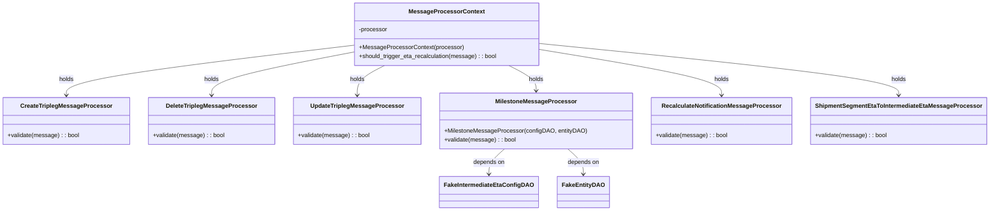
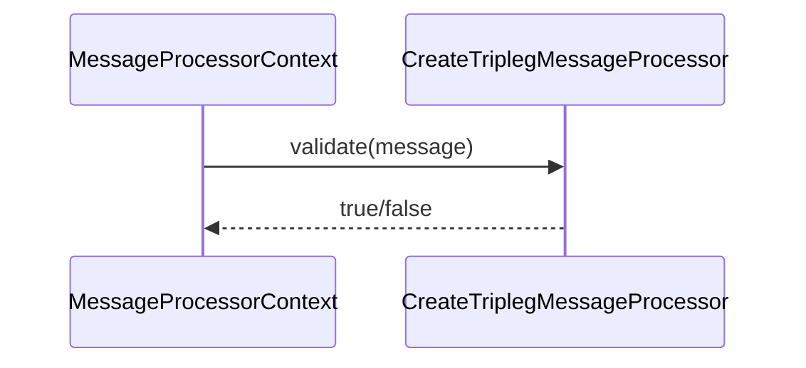
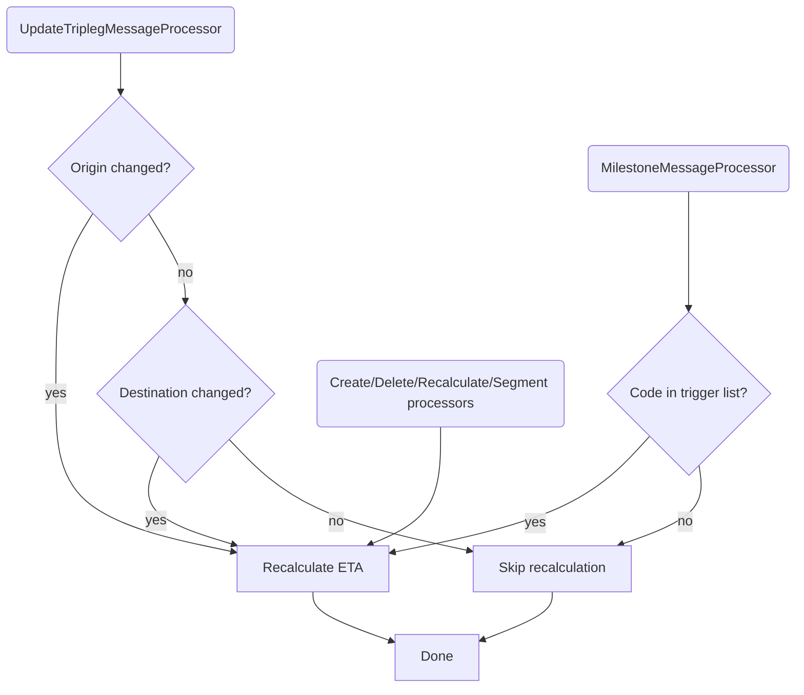

# Diagram: entity_core/entity_service/entity_listener/tests/unit/test_intermediate_eta_message_validator.py

> Auto-generated by Obscura crawlers

## Diagram 1

### SVG

<svg id="container" width="2585.1328125" xmlns="http://www.w3.org/2000/svg" class="classDiagram" height="566" viewBox="0 0 2585.1328125 566" role="graphics-document document" aria-roledescription="class"><g><defs><marker id="container_class-aggregationStart" class="marker aggregation class" refX="18" refY="7" markerWidth="190" markerHeight="240" orient="auto"><path d="M 18,7 L9,13 L1,7 L9,1 Z"></path></marker></defs><defs><marker id="container_class-aggregationEnd" class="marker aggregation class" refX="1" refY="7" markerWidth="20" markerHeight="28" orient="auto"><path d="M 18,7 L9,13 L1,7 L9,1 Z"></path></marker></defs><defs><marker id="container_class-extensionStart" class="marker extension class" refX="18" refY="7" markerWidth="190" markerHeight="240" orient="auto"><path d="M 1,7 L18,13 V 1 Z"></path></marker></defs><defs><marker id="container_class-extensionEnd" class="marker extension class" refX="1" refY="7" markerWidth="20" markerHeight="28" orient="auto"><path d="M 1,1 V 13 L18,7 Z"></path></marker></defs><defs><marker id="container_class-compositionStart" class="marker composition class" refX="18" refY="7" markerWidth="190" markerHeight="240" orient="auto"><path d="M 18,7 L9,13 L1,7 L9,1 Z"></path></marker></defs><defs><marker id="container_class-compositionEnd" class="marker composition class" refX="1" refY="7" markerWidth="20" markerHeight="28" orient="auto"><path d="M 18,7 L9,13 L1,7 L9,1 Z"></path></marker></defs><defs><marker id="container_class-dependencyStart" class="marker dependency class" refX="6" refY="7" markerWidth="190" markerHeight="240" orient="auto"><path d="M 5,7 L9,13 L1,7 L9,1 Z"></path></marker></defs><defs><marker id="container_class-dependencyEnd" class="marker dependency class" refX="13" refY="7" markerWidth="20" markerHeight="28" orient="auto"><path d="M 18,7 L9,13 L14,7 L9,1 Z"></path></marker></defs><defs><marker id="container_class-lollipopStart" class="marker lollipop class" refX="13" refY="7" markerWidth="190" markerHeight="240" orient="auto"><circle stroke="black" fill="transparent" cx="7" cy="7" r="6"></circle></marker></defs><defs><marker id="container_class-lollipopEnd" class="marker lollipop class" refX="1" refY="7" markerWidth="190" markerHeight="240" orient="auto"><circle stroke="black" fill="transparent" cx="7" cy="7" r="6"></circle></marker></defs><g class="root"><g class="clusters"></g><g class="edgePaths"><path d="M928.066,121.722L802.385,136.935C676.703,152.148,425.34,182.574,299.658,204.954C173.977,227.333,173.977,241.667,173.977,248.833L173.977,256" id="id_MessageProcessorContext_CreateTriplegMessageProcessor_1" class="edge-thickness-normal edge-pattern-solid relation" style=";;;" data-edge="true" data-et="edge" data-id="id_MessageProcessorContext_CreateTriplegMessageProcessor_1" data-points="W3sieCI6OTI4LjA2NjQwNjI1LCJ5IjoxMjEuNzIxOTY5MzA5MTYzMDl9LHsieCI6MTczLjk3NjU2MjUsInkiOjIxM30seyJ4IjoxNzMuOTc2NTYyNSwieSI6MjYyfV0=" marker-end="url(#container_class-dependencyEnd)"></path><path d="M928.066,140.108L866.059,152.257C804.052,164.406,680.038,188.703,618.031,208.018C556.023,227.333,556.023,241.667,556.023,248.833L556.023,256" id="id_MessageProcessorContext_DeleteTriplegMessageProcessor_2" class="edge-thickness-normal edge-pattern-solid relation" style=";;;" data-edge="true" data-et="edge" data-id="id_MessageProcessorContext_DeleteTriplegMessageProcessor_2" data-points="W3sieCI6OTI4LjA2NjQwNjI1LCJ5IjoxNDAuMTA4MjU4NTQwMzE4NjR9LHsieCI6NTU2LjAyMzQzNzUsInkiOjIxM30seyJ4Ijo1NTYuMDIzNDM3NSwieSI6MjYyfV0=" marker-end="url(#container_class-dependencyEnd)"></path><path d="M1011.129,176L999.201,182.167C987.272,188.333,963.415,200.667,951.487,214C939.559,227.333,939.559,241.667,939.559,248.833L939.559,256" id="id_MessageProcessorContext_UpdateTriplegMessageProcessor_3" class="edge-thickness-normal edge-pattern-solid relation" style=";;;" data-edge="true" data-et="edge" data-id="id_MessageProcessorContext_UpdateTriplegMessageProcessor_3" data-points="W3sieCI6MTAxMS4xMjkwMzUzODIyMzE1LCJ5IjoxNzZ9LHsieCI6OTM5LjU1ODU5Mzc1LCJ5IjoyMTN9LHsieCI6OTM5LjU1ODU5Mzc1LCJ5IjoyNjJ9XQ==" marker-end="url(#container_class-dependencyEnd)"></path><path d="M1336.098,176L1348.026,182.167C1359.954,188.333,1383.811,200.667,1395.74,212C1407.668,223.333,1407.668,233.667,1407.668,238.833L1407.668,244" id="id_MessageProcessorContext_MilestoneMessageProcessor_4" class="edge-thickness-normal edge-pattern-solid relation" style=";;;" data-edge="true" data-et="edge" data-id="id_MessageProcessorContext_MilestoneMessageProcessor_4" data-points="W3sieCI6MTMzNi4wOTc1MjcxMTc3Njg1LCJ5IjoxNzZ9LHsieCI6MTQwNy42Njc5Njg3NSwieSI6MjEzfSx7IngiOjE0MDcuNjY3OTY4NzUsInkiOjI1MH1d" marker-end="url(#container_class-dependencyEnd)"></path><path d="M1419.16,133.345L1498.005,146.621C1576.85,159.897,1734.54,186.448,1813.385,206.891C1892.23,227.333,1892.23,241.667,1892.23,248.833L1892.23,256" id="id_MessageProcessorContext_RecalculateNotificationMessageProcessor_5" class="edge-thickness-normal edge-pattern-solid relation" style=";;;" data-edge="true" data-et="edge" data-id="id_MessageProcessorContext_RecalculateNotificationMessageProcessor_5" data-points="W3sieCI6MTQxOS4xNjAxNTYyNSwieSI6MTMzLjM0NDkyMjQzMTMxODgyfSx7IngiOjE4OTIuMjMwNDY4NzUsInkiOjIxM30seyJ4IjoxODkyLjIzMDQ2ODc1LCJ5IjoyNjJ9XQ==" marker-end="url(#container_class-dependencyEnd)"></path><path d="M1419.16,117.221L1574.574,133.184C1729.987,149.147,2040.814,181.074,2196.227,204.204C2351.641,227.333,2351.641,241.667,2351.641,248.833L2351.641,256" id="id_MessageProcessorContext_ShipmentSegmentEtaToIntermediateEtaMessageProcessor_6" class="edge-thickness-normal edge-pattern-solid relation" style=";;;" data-edge="true" data-et="edge" data-id="id_MessageProcessorContext_ShipmentSegmentEtaToIntermediateEtaMessageProcessor_6" data-points="W3sieCI6MTQxOS4xNjAxNTYyNSwieSI6MTE3LjIyMTEyMjQ0MDUyMDZ9LHsieCI6MjM1MS42NDA2MjUsInkiOjIxM30seyJ4IjoyMzUxLjY0MDYyNSwieSI6MjYyfV0=" marker-end="url(#container_class-dependencyEnd)"></path><path d="M1327.039,400L1320.409,406.167C1313.78,412.333,1300.521,424.667,1293.891,436C1287.262,447.333,1287.262,457.667,1287.262,462.833L1287.262,468" id="id_MilestoneMessageProcessor_FakeIntermediateEtaConfigDAO_7" class="edge-thickness-normal edge-pattern-solid relation" style=";;;" data-edge="true" data-et="edge" data-id="id_MilestoneMessageProcessor_FakeIntermediateEtaConfigDAO_7" data-points="W3sieCI6MTMyNy4wMzg3ODM0ODIxNDMsInkiOjQwMH0seyJ4IjoxMjg3LjI2MTcxODc1LCJ5Ijo0Mzd9LHsieCI6MTI4Ny4yNjE3MTg3NSwieSI6NDc0fV0=" marker-end="url(#container_class-dependencyEnd)"></path><path d="M1488.297,400L1494.927,406.167C1501.556,412.333,1514.815,424.667,1521.445,436C1528.074,447.333,1528.074,457.667,1528.074,462.833L1528.074,468" id="id_MilestoneMessageProcessor_FakeEntityDAO_8" class="edge-thickness-normal edge-pattern-solid relation" style=";;;" data-edge="true" data-et="edge" data-id="id_MilestoneMessageProcessor_FakeEntityDAO_8" data-points="W3sieCI6MTQ4OC4yOTcxNTQwMTc4NTcsInkiOjQwMH0seyJ4IjoxNTI4LjA3NDIxODc1LCJ5Ijo0Mzd9LHsieCI6MTUyOC4wNzQyMTg3NSwieSI6NDc0fV0=" marker-end="url(#container_class-dependencyEnd)"></path></g><g class="edgeLabels"><g class="edgeLabel" transform="translate(173.9765625, 213)"><g class="label" data-id="id_MessageProcessorContext_CreateTriplegMessageProcessor_1" transform="translate(-20.1875, -12)"><foreignObject width="40.375" height="24">

holds

</foreignObject></g></g><g class="edgeLabel" transform="translate(556.0234375, 213)"><g class="label" data-id="id_MessageProcessorContext_DeleteTriplegMessageProcessor_2" transform="translate(-20.1875, -12)"><foreignObject width="40.375" height="24">

holds

</foreignObject></g></g><g class="edgeLabel" transform="translate(939.55859375, 213)"><g class="label" data-id="id_MessageProcessorContext_UpdateTriplegMessageProcessor_3" transform="translate(-20.1875, -12)"><foreignObject width="40.375" height="24">

holds

</foreignObject></g></g><g class="edgeLabel" transform="translate(1407.66796875, 213)"><g class="label" data-id="id_MessageProcessorContext_MilestoneMessageProcessor_4" transform="translate(-20.1875, -12)"><foreignObject width="40.375" height="24">

holds

</foreignObject></g></g><g class="edgeLabel" transform="translate(1892.23046875, 213)"><g class="label" data-id="id_MessageProcessorContext_RecalculateNotificationMessageProcessor_5" transform="translate(-20.1875, -12)"><foreignObject width="40.375" height="24">

holds

</foreignObject></g></g><g class="edgeLabel" transform="translate(2351.640625, 213)"><g class="label" data-id="id_MessageProcessorContext_ShipmentSegmentEtaToIntermediateEtaMessageProcessor_6" transform="translate(-20.1875, -12)"><foreignObject width="40.375" height="24">

holds

</foreignObject></g></g><g class="edgeLabel" transform="translate(1287.26171875, 437)"><g class="label" data-id="id_MilestoneMessageProcessor_FakeIntermediateEtaConfigDAO_7" transform="translate(-42.9453125, -12)"><foreignObject width="85.890625" height="24">

depends on

</foreignObject></g></g><g class="edgeLabel" transform="translate(1528.07421875, 437)"><g class="label" data-id="id_MilestoneMessageProcessor_FakeEntityDAO_8" transform="translate(-42.9453125, -12)"><foreignObject width="85.890625" height="24">

depends on

</foreignObject></g></g></g><g class="nodes"><g class="node default" id="classId-CreateTriplegMessageProcessor-0" transform="translate(173.9765625, 325)"><g class="basic label-container"><path d="M-165.9765625 -63 L165.9765625 -63 L165.9765625 63 L-165.9765625 63" stroke="none" stroke-width="0" fill="#ECECFF" style=""></path><path d="M-165.9765625 -63 C-65.75173484231718 -63, 34.473092815365646 -63, 165.9765625 -63 M-165.9765625 -63 C-71.0838463815372 -63, 23.8088697369256 -63, 165.9765625 -63 M165.9765625 -63 C165.9765625 -25.56103166478301, 165.9765625 11.877936670433982, 165.9765625 63 M165.9765625 -63 C165.9765625 -23.813036161630592, 165.9765625 15.373927676738816, 165.9765625 63 M165.9765625 63 C58.79584190014921 63, -48.384878699701574 63, -165.9765625 63 M165.9765625 63 C90.29981738516109 63, 14.623072270322183 63, -165.9765625 63 M-165.9765625 63 C-165.9765625 26.90958904868036, -165.9765625 -9.18082190263928, -165.9765625 -63 M-165.9765625 63 C-165.9765625 19.994751327171635, -165.9765625 -23.01049734565673, -165.9765625 -63" stroke="#9370DB" stroke-width="1.3" fill="none" stroke-dasharray="0 0" style=""></path></g><g class="annotation-group text" transform="translate(0, -39)"></g><g class="label-group text" transform="translate(-116.203125, -39)"><g class="label" style="font-weight: bolder" transform="translate(0,-12)"><foreignObject width="232.40625" height="24">

CreateTriplegMessageProcessor

</foreignObject></g></g><g class="members-group text" transform="translate(-153.9765625, 9)"></g><g class="methods-group text" transform="translate(-153.9765625, 39)"><g class="label" style="" transform="translate(0,-12)"><foreignObject width="191.75" height="24">

+validate(message) : : bool

</foreignObject></g></g><g class="divider" style=""><path d="M-165.9765625 -15 C-72.33994361428712 -15, 21.296675271425755 -15, 165.9765625 -15 M-165.9765625 -15 C-63.70818030005658 -15, 38.560201899886835 -15, 165.9765625 -15" stroke="#9370DB" stroke-width="1.3" fill="none" stroke-dasharray="0 0" style=""></path></g><g class="divider" style=""><path d="M-165.9765625 9 C-54.04515347993663 9, 57.88625554012674 9, 165.9765625 9 M-165.9765625 9 C-79.32780209801099 9, 7.320958303978017 9, 165.9765625 9" stroke="#9370DB" stroke-width="1.3" fill="none" stroke-dasharray="0 0" style=""></path></g></g><g class="node default" id="classId-DeleteTriplegMessageProcessor-1" transform="translate(556.0234375, 325)"><g class="basic label-container"><path d="M-166.0703125 -63 L166.0703125 -63 L166.0703125 63 L-166.0703125 63" stroke="none" stroke-width="0" fill="#ECECFF" style=""></path><path d="M-166.0703125 -63 C-71.54386389286691 -63, 22.98258471426618 -63, 166.0703125 -63 M-166.0703125 -63 C-73.62236833096547 -63, 18.825575838069057 -63, 166.0703125 -63 M166.0703125 -63 C166.0703125 -34.255796103457484, 166.0703125 -5.511592206914962, 166.0703125 63 M166.0703125 -63 C166.0703125 -15.46948890810431, 166.0703125 32.06102218379138, 166.0703125 63 M166.0703125 63 C45.83525231855505 63, -74.3998078628899 63, -166.0703125 63 M166.0703125 63 C88.20345388531578 63, 10.336595270631562 63, -166.0703125 63 M-166.0703125 63 C-166.0703125 32.56755248008204, -166.0703125 2.135104960164078, -166.0703125 -63 M-166.0703125 63 C-166.0703125 27.023059244716038, -166.0703125 -8.953881510567925, -166.0703125 -63" stroke="#9370DB" stroke-width="1.3" fill="none" stroke-dasharray="0 0" style=""></path></g><g class="annotation-group text" transform="translate(0, -39)"></g><g class="label-group text" transform="translate(-116.390625, -39)"><g class="label" style="font-weight: bolder" transform="translate(0,-12)"><foreignObject width="232.78125" height="24">

DeleteTriplegMessageProcessor

</foreignObject></g></g><g class="members-group text" transform="translate(-154.0703125, 9)"></g><g class="methods-group text" transform="translate(-154.0703125, 39)"><g class="label" style="" transform="translate(0,-12)"><foreignObject width="191.75" height="24">

+validate(message) : : bool

</foreignObject></g></g><g class="divider" style=""><path d="M-166.0703125 -15 C-85.84568376233095 -15, -5.621055024661899 -15, 166.0703125 -15 M-166.0703125 -15 C-80.96840587835756 -15, 4.133500743284884 -15, 166.0703125 -15" stroke="#9370DB" stroke-width="1.3" fill="none" stroke-dasharray="0 0" style=""></path></g><g class="divider" style=""><path d="M-166.0703125 9 C-83.3029457346797 9, -0.535578969359392 9, 166.0703125 9 M-166.0703125 9 C-48.26595415763114 9, 69.53840418473771 9, 166.0703125 9" stroke="#9370DB" stroke-width="1.3" fill="none" stroke-dasharray="0 0" style=""></path></g></g><g class="node default" id="classId-UpdateTriplegMessageProcessor-2" transform="translate(939.55859375, 325)"><g class="basic label-container"><path d="M-167.46484375 -63 L167.46484375 -63 L167.46484375 63 L-167.46484375 63" stroke="none" stroke-width="0" fill="#ECECFF" style=""></path><path d="M-167.46484375 -63 C-50.70950652957944 -63, 66.04583069084111 -63, 167.46484375 -63 M-167.46484375 -63 C-70.16302050729391 -63, 27.138802735412185 -63, 167.46484375 -63 M167.46484375 -63 C167.46484375 -25.345530539347877, 167.46484375 12.308938921304247, 167.46484375 63 M167.46484375 -63 C167.46484375 -29.640964157098253, 167.46484375 3.718071685803494, 167.46484375 63 M167.46484375 63 C59.46338379959772 63, -48.53807615080456 63, -167.46484375 63 M167.46484375 63 C86.06833367384799 63, 4.671823597695976 63, -167.46484375 63 M-167.46484375 63 C-167.46484375 23.674820060182903, -167.46484375 -15.650359879634195, -167.46484375 -63 M-167.46484375 63 C-167.46484375 32.507452565937086, -167.46484375 2.0149051318741726, -167.46484375 -63" stroke="#9370DB" stroke-width="1.3" fill="none" stroke-dasharray="0 0" style=""></path></g><g class="annotation-group text" transform="translate(0, -39)"></g><g class="label-group text" transform="translate(-119.1796875, -39)"><g class="label" style="font-weight: bolder" transform="translate(0,-12)"><foreignObject width="238.359375" height="24">

UpdateTriplegMessageProcessor

</foreignObject></g></g><g class="members-group text" transform="translate(-155.46484375, 9)"></g><g class="methods-group text" transform="translate(-155.46484375, 39)"><g class="label" style="" transform="translate(0,-12)"><foreignObject width="191.75" height="24">

+validate(message) : : bool

</foreignObject></g></g><g class="divider" style=""><path d="M-167.46484375 -15 C-60.310113288564736 -15, 46.84461717287053 -15, 167.46484375 -15 M-167.46484375 -15 C-64.06785951070403 -15, 39.32912472859195 -15, 167.46484375 -15" stroke="#9370DB" stroke-width="1.3" fill="none" stroke-dasharray="0 0" style=""></path></g><g class="divider" style=""><path d="M-167.46484375 9 C-48.87668390036295 9, 69.7114759492741 9, 167.46484375 9 M-167.46484375 9 C-61.935501722279724 9, 43.59384030544055 9, 167.46484375 9" stroke="#9370DB" stroke-width="1.3" fill="none" stroke-dasharray="0 0" style=""></path></g></g><g class="node default" id="classId-MilestoneMessageProcessor-3" transform="translate(1407.66796875, 325)"><g class="basic label-container"><path d="M-250.64453125 -75 L250.64453125 -75 L250.64453125 75 L-250.64453125 75" stroke="none" stroke-width="0" fill="#ECECFF" style=""></path><path d="M-250.64453125 -75 C-133.180446664194 -75, -15.716362078387988 -75, 250.64453125 -75 M-250.64453125 -75 C-68.40497736048005 -75, 113.83457652903991 -75, 250.64453125 -75 M250.64453125 -75 C250.64453125 -29.434181101456595, 250.64453125 16.13163779708681, 250.64453125 75 M250.64453125 -75 C250.64453125 -16.837881918192785, 250.64453125 41.32423616361443, 250.64453125 75 M250.64453125 75 C83.30965912269482 75, -84.02521300461035 75, -250.64453125 75 M250.64453125 75 C60.71405189885314 75, -129.21642745229371 75, -250.64453125 75 M-250.64453125 75 C-250.64453125 29.018697836175136, -250.64453125 -16.96260432764973, -250.64453125 -75 M-250.64453125 75 C-250.64453125 26.83106143075927, -250.64453125 -21.33787713848146, -250.64453125 -75" stroke="#9370DB" stroke-width="1.3" fill="none" stroke-dasharray="0 0" style=""></path></g><g class="annotation-group text" transform="translate(0, -51)"></g><g class="label-group text" transform="translate(-102.9765625, -51)"><g class="label" style="font-weight: bolder" transform="translate(0,-12)"><foreignObject width="205.953125" height="24">

MilestoneMessageProcessor

</foreignObject></g></g><g class="members-group text" transform="translate(-238.64453125, -3)"></g><g class="methods-group text" transform="translate(-238.64453125, 27)"><g class="label" style="" transform="translate(0,-12)"><foreignObject width="374.3125" height="24">

+MilestoneMessageProcessor(configDAO, entityDAO)

</foreignObject></g><g class="label" style="" transform="translate(0,12)"><foreignObject width="191.75" height="24">

+validate(message) : : bool

</foreignObject></g></g><g class="divider" style=""><path d="M-250.64453125 -27 C-116.0150386521781 -27, 18.61445394564379 -27, 250.64453125 -27 M-250.64453125 -27 C-86.13055047077322 -27, 78.38343030845357 -27, 250.64453125 -27" stroke="#9370DB" stroke-width="1.3" fill="none" stroke-dasharray="0 0" style=""></path></g><g class="divider" style=""><path d="M-250.64453125 -3 C-100.71744531288459 -3, 49.209640624230815 -3, 250.64453125 -3 M-250.64453125 -3 C-109.43414294971618 -3, 31.77624535056765 -3, 250.64453125 -3" stroke="#9370DB" stroke-width="1.3" fill="none" stroke-dasharray="0 0" style=""></path></g></g><g class="node default" id="classId-RecalculateNotificationMessageProcessor-4" transform="translate(1892.23046875, 325)"><g class="basic label-container"><path d="M-183.91796875 -63 L183.91796875 -63 L183.91796875 63 L-183.91796875 63" stroke="none" stroke-width="0" fill="#ECECFF" style=""></path><path d="M-183.91796875 -63 C-43.482983111289144 -63, 96.95200252742171 -63, 183.91796875 -63 M-183.91796875 -63 C-51.550168303772836 -63, 80.81763214245433 -63, 183.91796875 -63 M183.91796875 -63 C183.91796875 -17.802876668573944, 183.91796875 27.39424666285211, 183.91796875 63 M183.91796875 -63 C183.91796875 -24.06859300282087, 183.91796875 14.862813994358262, 183.91796875 63 M183.91796875 63 C88.06729630971932 63, -7.783376130561351 63, -183.91796875 63 M183.91796875 63 C38.86477164075086 63, -106.18842546849828 63, -183.91796875 63 M-183.91796875 63 C-183.91796875 35.7331499373697, -183.91796875 8.466299874739398, -183.91796875 -63 M-183.91796875 63 C-183.91796875 25.58161190534225, -183.91796875 -11.8367761893155, -183.91796875 -63" stroke="#9370DB" stroke-width="1.3" fill="none" stroke-dasharray="0 0" style=""></path></g><g class="annotation-group text" transform="translate(0, -39)"></g><g class="label-group text" transform="translate(-152.0859375, -39)"><g class="label" style="font-weight: bolder" transform="translate(0,-12)"><foreignObject width="304.171875" height="24">

RecalculateNotificationMessageProcessor

</foreignObject></g></g><g class="members-group text" transform="translate(-171.91796875, 9)"></g><g class="methods-group text" transform="translate(-171.91796875, 39)"><g class="label" style="" transform="translate(0,-12)"><foreignObject width="191.75" height="24">

+validate(message) : : bool

</foreignObject></g></g><g class="divider" style=""><path d="M-183.91796875 -15 C-80.95790923284274 -15, 22.002150284314524 -15, 183.91796875 -15 M-183.91796875 -15 C-77.18325162027608 -15, 29.551465509447837 -15, 183.91796875 -15" stroke="#9370DB" stroke-width="1.3" fill="none" stroke-dasharray="0 0" style=""></path></g><g class="divider" style=""><path d="M-183.91796875 9 C-104.79822162643946 9, -25.678474502878913 9, 183.91796875 9 M-183.91796875 9 C-79.33167679572655 9, 25.254615158546898 9, 183.91796875 9" stroke="#9370DB" stroke-width="1.3" fill="none" stroke-dasharray="0 0" style=""></path></g></g><g class="node default" id="classId-ShipmentSegmentEtaToIntermediateEtaMessageProcessor-5" transform="translate(2351.640625, 325)"><g class="basic label-container"><path d="M-225.4921875 -63 L225.4921875 -63 L225.4921875 63 L-225.4921875 63" stroke="none" stroke-width="0" fill="#ECECFF" style=""></path><path d="M-225.4921875 -63 C-70.35559349363524 -63, 84.78100051272952 -63, 225.4921875 -63 M-225.4921875 -63 C-55.38761238944841 -63, 114.71696272110319 -63, 225.4921875 -63 M225.4921875 -63 C225.4921875 -34.68786324776736, 225.4921875 -6.375726495534721, 225.4921875 63 M225.4921875 -63 C225.4921875 -26.417346139363815, 225.4921875 10.16530772127237, 225.4921875 63 M225.4921875 63 C52.686797346894906 63, -120.11859280621019 63, -225.4921875 63 M225.4921875 63 C77.32155258380666 63, -70.84908233238667 63, -225.4921875 63 M-225.4921875 63 C-225.4921875 20.595053636036475, -225.4921875 -21.80989272792705, -225.4921875 -63 M-225.4921875 63 C-225.4921875 28.078176120915188, -225.4921875 -6.843647758169624, -225.4921875 -63" stroke="#9370DB" stroke-width="1.3" fill="none" stroke-dasharray="0 0" style=""></path></g><g class="annotation-group text" transform="translate(0, -39)"></g><g class="label-group text" transform="translate(-213.4921875, -39)"><g class="label" style="font-weight: bolder" transform="translate(0,-12)"><foreignObject width="426.984375" height="24">

ShipmentSegmentEtaToIntermediateEtaMessageProcessor

</foreignObject></g></g><g class="members-group text" transform="translate(-213.4921875, 9)"></g><g class="methods-group text" transform="translate(-213.4921875, 39)"><g class="label" style="" transform="translate(0,-12)"><foreignObject width="191.75" height="24">

+validate(message) : : bool

</foreignObject></g></g><g class="divider" style=""><path d="M-225.4921875 -15 C-54.30378688487764 -15, 116.88461373024472 -15, 225.4921875 -15 M-225.4921875 -15 C-106.59477340537232 -15, 12.302640689255355 -15, 225.4921875 -15" stroke="#9370DB" stroke-width="1.3" fill="none" stroke-dasharray="0 0" style=""></path></g><g class="divider" style=""><path d="M-225.4921875 9 C-85.51648639279207 9, 54.45921471441585 9, 225.4921875 9 M-225.4921875 9 C-118.46564482051829 9, -11.439102141036585 9, 225.4921875 9" stroke="#9370DB" stroke-width="1.3" fill="none" stroke-dasharray="0 0" style=""></path></g></g><g class="node default" id="classId-MessageProcessorContext-6" transform="translate(1173.61328125, 92)"><g class="basic label-container"><path d="M-245.546875 -84 L245.546875 -84 L245.546875 84 L-245.546875 84" stroke="none" stroke-width="0" fill="#ECECFF" style=""></path><path d="M-245.546875 -84 C-66.96055377731435 -84, 111.62576744537131 -84, 245.546875 -84 M-245.546875 -84 C-87.01962473795186 -84, 71.50762552409628 -84, 245.546875 -84 M245.546875 -84 C245.546875 -26.805170856936627, 245.546875 30.389658286126746, 245.546875 84 M245.546875 -84 C245.546875 -36.20031451798944, 245.546875 11.59937096402112, 245.546875 84 M245.546875 84 C84.6330068897285 84, -76.28086122054299 84, -245.546875 84 M245.546875 84 C107.91493812496341 84, -29.716998750073174 84, -245.546875 84 M-245.546875 84 C-245.546875 41.99838199586381, -245.546875 -0.003236008272381241, -245.546875 -84 M-245.546875 84 C-245.546875 37.300072277876865, -245.546875 -9.39985544424627, -245.546875 -84" stroke="#9370DB" stroke-width="1.3" fill="none" stroke-dasharray="0 0" style=""></path></g><g class="annotation-group text" transform="translate(0, -60)"></g><g class="label-group text" transform="translate(-95.34375, -60)"><g class="label" style="font-weight: bolder" transform="translate(0,-12)"><foreignObject width="190.6875" height="24">

MessageProcessorContext

</foreignObject></g></g><g class="members-group text" transform="translate(-233.546875, -12)"><g class="label" style="" transform="translate(0,-12)"><foreignObject width="77.359375" height="24">

-processor

</foreignObject></g></g><g class="methods-group text" transform="translate(-233.546875, 36)"><g class="label" style="" transform="translate(0,-12)"><foreignObject width="275.75" height="24">

+MessageProcessorContext(processor)

</foreignObject></g><g class="label" style="" transform="translate(0,12)"><foreignObject width="371.75" height="24">

+should_trigger_eta_recalculation(message) : : bool

</foreignObject></g></g><g class="divider" style=""><path d="M-245.546875 -36 C-99.24616361946227 -36, 47.05454776107547 -36, 245.546875 -36 M-245.546875 -36 C-131.46399511570536 -36, -17.381115231410746 -36, 245.546875 -36" stroke="#9370DB" stroke-width="1.3" fill="none" stroke-dasharray="0 0" style=""></path></g><g class="divider" style=""><path d="M-245.546875 12 C-108.85231029421948 12, 27.842254411561044 12, 245.546875 12 M-245.546875 12 C-91.32571166590617 12, 62.89545166818766 12, 245.546875 12" stroke="#9370DB" stroke-width="1.3" fill="none" stroke-dasharray="0 0" style=""></path></g></g><g class="node default" id="classId-FakeIntermediateEtaConfigDAO-7" transform="translate(1287.26171875, 516)"><g class="basic label-container"><path d="M-125.703125 -42 L125.703125 -42 L125.703125 42 L-125.703125 42" stroke="none" stroke-width="0" fill="#ECECFF" style=""></path><path d="M-125.703125 -42 C-75.24594628661055 -42, -24.788767573221108 -42, 125.703125 -42 M-125.703125 -42 C-34.8264444691396 -42, 56.050236061720796 -42, 125.703125 -42 M125.703125 -42 C125.703125 -18.396722761863447, 125.703125 5.206554476273105, 125.703125 42 M125.703125 -42 C125.703125 -11.213718274084194, 125.703125 19.572563451831613, 125.703125 42 M125.703125 42 C50.00603447149457 42, -25.691056057010854 42, -125.703125 42 M125.703125 42 C72.51239772118183 42, 19.32167044236367 42, -125.703125 42 M-125.703125 42 C-125.703125 21.83178906569833, -125.703125 1.6635781313966618, -125.703125 -42 M-125.703125 42 C-125.703125 24.332488405577266, -125.703125 6.664976811154531, -125.703125 -42" stroke="#9370DB" stroke-width="1.3" fill="none" stroke-dasharray="0 0" style=""></path></g><g class="annotation-group text" transform="translate(0, -18)"></g><g class="label-group text" transform="translate(-113.703125, -18)"><g class="label" style="font-weight: bolder" transform="translate(0,-12)"><foreignObject width="227.40625" height="24">

FakeIntermediateEtaConfigDAO

</foreignObject></g></g><g class="members-group text" transform="translate(-113.703125, 30)"></g><g class="methods-group text" transform="translate(-113.703125, 60)"></g><g class="divider" style=""><path d="M-125.703125 6 C-65.6693371946688 6, -5.635549389337584 6, 125.703125 6 M-125.703125 6 C-51.493881203843685 6, 22.71536259231263 6, 125.703125 6" stroke="#9370DB" stroke-width="1.3" fill="none" stroke-dasharray="0 0" style=""></path></g><g class="divider" style=""><path d="M-125.703125 24 C-65.09579544656125 24, -4.488465893122523 24, 125.703125 24 M-125.703125 24 C-36.831069003066574 24, 52.04098699386685 24, 125.703125 24" stroke="#9370DB" stroke-width="1.3" fill="none" stroke-dasharray="0 0" style=""></path></g></g><g class="node default" id="classId-FakeEntityDAO-8" transform="translate(1528.07421875, 516)"><g class="basic label-container"><path d="M-65.109375 -42 L65.109375 -42 L65.109375 42 L-65.109375 42" stroke="none" stroke-width="0" fill="#ECECFF" style=""></path><path d="M-65.109375 -42 C-30.735933481173312 -42, 3.637508037653376 -42, 65.109375 -42 M-65.109375 -42 C-25.852732837509308 -42, 13.403909324981385 -42, 65.109375 -42 M65.109375 -42 C65.109375 -14.302564702495754, 65.109375 13.394870595008491, 65.109375 42 M65.109375 -42 C65.109375 -10.534532945287218, 65.109375 20.930934109425564, 65.109375 42 M65.109375 42 C35.38538184584552 42, 5.6613886916910445 42, -65.109375 42 M65.109375 42 C35.47389781405224 42, 5.838420628104487 42, -65.109375 42 M-65.109375 42 C-65.109375 22.018737968294417, -65.109375 2.0374759365888337, -65.109375 -42 M-65.109375 42 C-65.109375 13.74592835044638, -65.109375 -14.508143299107239, -65.109375 -42" stroke="#9370DB" stroke-width="1.3" fill="none" stroke-dasharray="0 0" style=""></path></g><g class="annotation-group text" transform="translate(0, -18)"></g><g class="label-group text" transform="translate(-53.109375, -18)"><g class="label" style="font-weight: bolder" transform="translate(0,-12)"><foreignObject width="106.21875" height="24">

FakeEntityDAO

</foreignObject></g></g><g class="members-group text" transform="translate(-53.109375, 30)"></g><g class="methods-group text" transform="translate(-53.109375, 60)"></g><g class="divider" style=""><path d="M-65.109375 6 C-18.19634818950169 6, 28.716678620996618 6, 65.109375 6 M-65.109375 6 C-33.75863772508603 6, -2.4079004501720647 6, 65.109375 6" stroke="#9370DB" stroke-width="1.3" fill="none" stroke-dasharray="0 0" style=""></path></g><g class="divider" style=""><path d="M-65.109375 24 C-20.82599019312272 24, 23.45739461375456 24, 65.109375 24 M-65.109375 24 C-21.5910392057653 24, 21.927296588469403 24, 65.109375 24" stroke="#9370DB" stroke-width="1.3" fill="none" stroke-dasharray="0 0" style=""></path></g></g></g></g></g></svg>

## Diagram 2

### SVG

<svg id="container" width="605" xmlns="http://www.w3.org/2000/svg" height="267" viewBox="-50 -10 605 267" role="graphics-document document" aria-roledescription="sequence"><g><rect x="257" y="181" fill="#eaeaea" stroke="#666" width="248" height="65" name="Processor" rx="3" ry="3" class="actor actor-bottom"></rect><text x="381" y="213.5" dominant-baseline="central" alignment-baseline="central" class="actor actor-box" style="text-anchor: middle; font-size: 16px; font-weight: 400;"><tspan x="381" dy="0">CreateTriplegMessageProcessor</tspan></text></g><g><rect x="0" y="181" fill="#eaeaea" stroke="#666" width="207" height="65" name="Context" rx="3" ry="3" class="actor actor-bottom"></rect><text x="103.5" y="213.5" dominant-baseline="central" alignment-baseline="central" class="actor actor-box" style="text-anchor: middle; font-size: 16px; font-weight: 400;"><tspan x="103.5" dy="0">MessageProcessorContext</tspan></text></g><g><line id="actor1" x1="381" y1="65" x2="381" y2="181" class="actor-line 200" stroke-width="0.5px" stroke="#999" name="Processor"></line><g id="root-1"><rect x="257" y="0" fill="#eaeaea" stroke="#666" width="248" height="65" name="Processor" rx="3" ry="3" class="actor actor-top"></rect><text x="381" y="32.5" dominant-baseline="central" alignment-baseline="central" class="actor actor-box" style="text-anchor: middle; font-size: 16px; font-weight: 400;"><tspan x="381" dy="0">CreateTriplegMessageProcessor</tspan></text></g></g><g><line id="actor0" x1="103.5" y1="65" x2="103.5" y2="181" class="actor-line 200" stroke-width="0.5px" stroke="#999" name="Context"></line><g id="root-0"><rect x="0" y="0" fill="#eaeaea" stroke="#666" width="207" height="65" name="Context" rx="3" ry="3" class="actor actor-top"></rect><text x="103.5" y="32.5" dominant-baseline="central" alignment-baseline="central" class="actor actor-box" style="text-anchor: middle; font-size: 16px; font-weight: 400;"><tspan x="103.5" dy="0">MessageProcessorContext</tspan></text></g></g><g></g><defs><symbol id="computer" width="24" height="24"><path transform="scale(.5)" d="M2 2v13h20v-13h-20zm18 11h-16v-9h16v9zm-10.228 6l.466-1h3.524l.467 1h-4.457zm14.228 3h-24l2-6h2.104l-1.33 4h18.45l-1.297-4h2.073l2 6zm-5-10h-14v-7h14v7z"></path></symbol></defs><defs><symbol id="database" fill-rule="evenodd" clip-rule="evenodd"><path transform="scale(.5)" d="M12.258.001l.256.004.255.005.253.008.251.01.249.012.247.015.246.016.242.019.241.02.239.023.236.024.233.027.231.028.229.031.225.032.223.034.22.036.217.038.214.04.211.041.208.043.205.045.201.046.198.048.194.05.191.051.187.053.183.054.18.056.175.057.172.059.168.06.163.061.16.063.155.064.15.066.074.033.073.033.071.034.07.034.069.035.068.035.067.035.066.035.064.036.064.036.062.036.06.036.06.037.058.037.058.037.055.038.055.038.053.038.052.038.051.039.05.039.048.039.047.039.045.04.044.04.043.04.041.04.04.041.039.041.037.041.036.041.034.041.033.042.032.042.03.042.029.042.027.042.026.043.024.043.023.043.021.043.02.043.018.044.017.043.015.044.013.044.012.044.011.045.009.044.007.045.006.045.004.045.002.045.001.045v17l-.001.045-.002.045-.004.045-.006.045-.007.045-.009.044-.011.045-.012.044-.013.044-.015.044-.017.043-.018.044-.02.043-.021.043-.023.043-.024.043-.026.043-.027.042-.029.042-.03.042-.032.042-.033.042-.034.041-.036.041-.037.041-.039.041-.04.041-.041.04-.043.04-.044.04-.045.04-.047.039-.048.039-.05.039-.051.039-.052.038-.053.038-.055.038-.055.038-.058.037-.058.037-.06.037-.06.036-.062.036-.064.036-.064.036-.066.035-.067.035-.068.035-.069.035-.07.034-.071.034-.073.033-.074.033-.15.066-.155.064-.16.063-.163.061-.168.06-.172.059-.175.057-.18.056-.183.054-.187.053-.191.051-.194.05-.198.048-.201.046-.205.045-.208.043-.211.041-.214.04-.217.038-.22.036-.223.034-.225.032-.229.031-.231.028-.233.027-.236.024-.239.023-.241.02-.242.019-.246.016-.247.015-.249.012-.251.01-.253.008-.255.005-.256.004-.258.001-.258-.001-.256-.004-.255-.005-.253-.008-.251-.01-.249-.012-.247-.015-.245-.016-.243-.019-.241-.02-.238-.023-.236-.024-.234-.027-.231-.028-.228-.031-.226-.032-.223-.034-.22-.036-.217-.038-.214-.04-.211-.041-.208-.043-.204-.045-.201-.046-.198-.048-.195-.05-.19-.051-.187-.053-.184-.054-.179-.056-.176-.057-.172-.059-.167-.06-.164-.061-.159-.063-.155-.064-.151-.066-.074-.033-.072-.033-.072-.034-.07-.034-.069-.035-.068-.035-.067-.035-.066-.035-.064-.036-.063-.036-.062-.036-.061-.036-.06-.037-.058-.037-.057-.037-.056-.038-.055-.038-.053-.038-.052-.038-.051-.039-.049-.039-.049-.039-.046-.039-.046-.04-.044-.04-.043-.04-.041-.04-.04-.041-.039-.041-.037-.041-.036-.041-.034-.041-.033-.042-.032-.042-.03-.042-.029-.042-.027-.042-.026-.043-.024-.043-.023-.043-.021-.043-.02-.043-.018-.044-.017-.043-.015-.044-.013-.044-.012-.044-.011-.045-.009-.044-.007-.045-.006-.045-.004-.045-.002-.045-.001-.045v-17l.001-.045.002-.045.004-.045.006-.045.007-.045.009-.044.011-.045.012-.044.013-.044.015-.044.017-.043.018-.044.02-.043.021-.043.023-.043.024-.043.026-.043.027-.042.029-.042.03-.042.032-.042.033-.042.034-.041.036-.041.037-.041.039-.041.04-.041.041-.04.043-.04.044-.04.046-.04.046-.039.049-.039.049-.039.051-.039.052-.038.053-.038.055-.038.056-.038.057-.037.058-.037.06-.037.061-.036.062-.036.063-.036.064-.036.066-.035.067-.035.068-.035.069-.035.07-.034.072-.034.072-.033.074-.033.151-.066.155-.064.159-.063.164-.061.167-.06.172-.059.176-.057.179-.056.184-.054.187-.053.19-.051.195-.05.198-.048.201-.046.204-.045.208-.043.211-.041.214-.04.217-.038.22-.036.223-.034.226-.032.228-.031.231-.028.234-.027.236-.024.238-.023.241-.02.243-.019.245-.016.247-.015.249-.012.251-.01.253-.008.255-.005.256-.004.258-.001.258.001zm-9.258 20.499v.01l.001.021.003.021.004.022.005.021.006.022.007.022.009.023.01.022.011.023.012.023.013.023.015.023.016.024.017.023.018.024.019.024.021.024.022.025.023.024.024.025.052.049.056.05.061.051.066.051.07.051.075.051.079.052.084.052.088.052.092.052.097.052.102.051.105.052.11.052.114.051.119.051.123.051.127.05.131.05.135.05.139.048.144.049.147.047.152.047.155.047.16.045.163.045.167.043.171.043.176.041.178.041.183.039.187.039.19.037.194.035.197.035.202.033.204.031.209.03.212.029.216.027.219.025.222.024.226.021.23.02.233.018.236.016.24.015.243.012.246.01.249.008.253.005.256.004.259.001.26-.001.257-.004.254-.005.25-.008.247-.011.244-.012.241-.014.237-.016.233-.018.231-.021.226-.021.224-.024.22-.026.216-.027.212-.028.21-.031.205-.031.202-.034.198-.034.194-.036.191-.037.187-.039.183-.04.179-.04.175-.042.172-.043.168-.044.163-.045.16-.046.155-.046.152-.047.148-.048.143-.049.139-.049.136-.05.131-.05.126-.05.123-.051.118-.052.114-.051.11-.052.106-.052.101-.052.096-.052.092-.052.088-.053.083-.051.079-.052.074-.052.07-.051.065-.051.06-.051.056-.05.051-.05.023-.024.023-.025.021-.024.02-.024.019-.024.018-.024.017-.024.015-.023.014-.024.013-.023.012-.023.01-.023.01-.022.008-.022.006-.022.006-.022.004-.022.004-.021.001-.021.001-.021v-4.127l-.077.055-.08.053-.083.054-.085.053-.087.052-.09.052-.093.051-.095.05-.097.05-.1.049-.102.049-.105.048-.106.047-.109.047-.111.046-.114.045-.115.045-.118.044-.12.043-.122.042-.124.042-.126.041-.128.04-.13.04-.132.038-.134.038-.135.037-.138.037-.139.035-.142.035-.143.034-.144.033-.147.032-.148.031-.15.03-.151.03-.153.029-.154.027-.156.027-.158.026-.159.025-.161.024-.162.023-.163.022-.165.021-.166.02-.167.019-.169.018-.169.017-.171.016-.173.015-.173.014-.175.013-.175.012-.177.011-.178.01-.179.008-.179.008-.181.006-.182.005-.182.004-.184.003-.184.002h-.37l-.184-.002-.184-.003-.182-.004-.182-.005-.181-.006-.179-.008-.179-.008-.178-.01-.176-.011-.176-.012-.175-.013-.173-.014-.172-.015-.171-.016-.17-.017-.169-.018-.167-.019-.166-.02-.165-.021-.163-.022-.162-.023-.161-.024-.159-.025-.157-.026-.156-.027-.155-.027-.153-.029-.151-.03-.15-.03-.148-.031-.146-.032-.145-.033-.143-.034-.141-.035-.14-.035-.137-.037-.136-.037-.134-.038-.132-.038-.13-.04-.128-.04-.126-.041-.124-.042-.122-.042-.12-.044-.117-.043-.116-.045-.113-.045-.112-.046-.109-.047-.106-.047-.105-.048-.102-.049-.1-.049-.097-.05-.095-.05-.093-.052-.09-.051-.087-.052-.085-.053-.083-.054-.08-.054-.077-.054v4.127zm0-5.654v.011l.001.021.003.021.004.021.005.022.006.022.007.022.009.022.01.022.011.023.012.023.013.023.015.024.016.023.017.024.018.024.019.024.021.024.022.024.023.025.024.024.052.05.056.05.061.05.066.051.07.051.075.052.079.051.084.052.088.052.092.052.097.052.102.052.105.052.11.051.114.051.119.052.123.05.127.051.131.05.135.049.139.049.144.048.147.048.152.047.155.046.16.045.163.045.167.044.171.042.176.042.178.04.183.04.187.038.19.037.194.036.197.034.202.033.204.032.209.03.212.028.216.027.219.025.222.024.226.022.23.02.233.018.236.016.24.014.243.012.246.01.249.008.253.006.256.003.259.001.26-.001.257-.003.254-.006.25-.008.247-.01.244-.012.241-.015.237-.016.233-.018.231-.02.226-.022.224-.024.22-.025.216-.027.212-.029.21-.03.205-.032.202-.033.198-.035.194-.036.191-.037.187-.039.183-.039.179-.041.175-.042.172-.043.168-.044.163-.045.16-.045.155-.047.152-.047.148-.048.143-.048.139-.05.136-.049.131-.05.126-.051.123-.051.118-.051.114-.052.11-.052.106-.052.101-.052.096-.052.092-.052.088-.052.083-.052.079-.052.074-.051.07-.052.065-.051.06-.05.056-.051.051-.049.023-.025.023-.024.021-.025.02-.024.019-.024.018-.024.017-.024.015-.023.014-.023.013-.024.012-.022.01-.023.01-.023.008-.022.006-.022.006-.022.004-.021.004-.022.001-.021.001-.021v-4.139l-.077.054-.08.054-.083.054-.085.052-.087.053-.09.051-.093.051-.095.051-.097.05-.1.049-.102.049-.105.048-.106.047-.109.047-.111.046-.114.045-.115.044-.118.044-.12.044-.122.042-.124.042-.126.041-.128.04-.13.039-.132.039-.134.038-.135.037-.138.036-.139.036-.142.035-.143.033-.144.033-.147.033-.148.031-.15.03-.151.03-.153.028-.154.028-.156.027-.158.026-.159.025-.161.024-.162.023-.163.022-.165.021-.166.02-.167.019-.169.018-.169.017-.171.016-.173.015-.173.014-.175.013-.175.012-.177.011-.178.009-.179.009-.179.007-.181.007-.182.005-.182.004-.184.003-.184.002h-.37l-.184-.002-.184-.003-.182-.004-.182-.005-.181-.007-.179-.007-.179-.009-.178-.009-.176-.011-.176-.012-.175-.013-.173-.014-.172-.015-.171-.016-.17-.017-.169-.018-.167-.019-.166-.02-.165-.021-.163-.022-.162-.023-.161-.024-.159-.025-.157-.026-.156-.027-.155-.028-.153-.028-.151-.03-.15-.03-.148-.031-.146-.033-.145-.033-.143-.033-.141-.035-.14-.036-.137-.036-.136-.037-.134-.038-.132-.039-.13-.039-.128-.04-.126-.041-.124-.042-.122-.043-.12-.043-.117-.044-.116-.044-.113-.046-.112-.046-.109-.046-.106-.047-.105-.048-.102-.049-.1-.049-.097-.05-.095-.051-.093-.051-.09-.051-.087-.053-.085-.052-.083-.054-.08-.054-.077-.054v4.139zm0-5.666v.011l.001.02.003.022.004.021.005.022.006.021.007.022.009.023.01.022.011.023.012.023.013.023.015.023.016.024.017.024.018.023.019.024.021.025.022.024.023.024.024.025.052.05.056.05.061.05.066.051.07.051.075.052.079.051.084.052.088.052.092.052.097.052.102.052.105.051.11.052.114.051.119.051.123.051.127.05.131.05.135.05.139.049.144.048.147.048.152.047.155.046.16.045.163.045.167.043.171.043.176.042.178.04.183.04.187.038.19.037.194.036.197.034.202.033.204.032.209.03.212.028.216.027.219.025.222.024.226.021.23.02.233.018.236.017.24.014.243.012.246.01.249.008.253.006.256.003.259.001.26-.001.257-.003.254-.006.25-.008.247-.01.244-.013.241-.014.237-.016.233-.018.231-.02.226-.022.224-.024.22-.025.216-.027.212-.029.21-.03.205-.032.202-.033.198-.035.194-.036.191-.037.187-.039.183-.039.179-.041.175-.042.172-.043.168-.044.163-.045.16-.045.155-.047.152-.047.148-.048.143-.049.139-.049.136-.049.131-.051.126-.05.123-.051.118-.052.114-.051.11-.052.106-.052.101-.052.096-.052.092-.052.088-.052.083-.052.079-.052.074-.052.07-.051.065-.051.06-.051.056-.05.051-.049.023-.025.023-.025.021-.024.02-.024.019-.024.018-.024.017-.024.015-.023.014-.024.013-.023.012-.023.01-.022.01-.023.008-.022.006-.022.006-.022.004-.022.004-.021.001-.021.001-.021v-4.153l-.077.054-.08.054-.083.053-.085.053-.087.053-.09.051-.093.051-.095.051-.097.05-.1.049-.102.048-.105.048-.106.048-.109.046-.111.046-.114.046-.115.044-.118.044-.12.043-.122.043-.124.042-.126.041-.128.04-.13.039-.132.039-.134.038-.135.037-.138.036-.139.036-.142.034-.143.034-.144.033-.147.032-.148.032-.15.03-.151.03-.153.028-.154.028-.156.027-.158.026-.159.024-.161.024-.162.023-.163.023-.165.021-.166.02-.167.019-.169.018-.169.017-.171.016-.173.015-.173.014-.175.013-.175.012-.177.01-.178.01-.179.009-.179.007-.181.006-.182.006-.182.004-.184.003-.184.001-.185.001-.185-.001-.184-.001-.184-.003-.182-.004-.182-.006-.181-.006-.179-.007-.179-.009-.178-.01-.176-.01-.176-.012-.175-.013-.173-.014-.172-.015-.171-.016-.17-.017-.169-.018-.167-.019-.166-.02-.165-.021-.163-.023-.162-.023-.161-.024-.159-.024-.157-.026-.156-.027-.155-.028-.153-.028-.151-.03-.15-.03-.148-.032-.146-.032-.145-.033-.143-.034-.141-.034-.14-.036-.137-.036-.136-.037-.134-.038-.132-.039-.13-.039-.128-.041-.126-.041-.124-.041-.122-.043-.12-.043-.117-.044-.116-.044-.113-.046-.112-.046-.109-.046-.106-.048-.105-.048-.102-.048-.1-.05-.097-.049-.095-.051-.093-.051-.09-.052-.087-.052-.085-.053-.083-.053-.08-.054-.077-.054v4.153zm8.74-8.179l-.257.004-.254.005-.25.008-.247.011-.244.012-.241.014-.237.016-.233.018-.231.021-.226.022-.224.023-.22.026-.216.027-.212.028-.21.031-.205.032-.202.033-.198.034-.194.036-.191.038-.187.038-.183.04-.179.041-.175.042-.172.043-.168.043-.163.045-.16.046-.155.046-.152.048-.148.048-.143.048-.139.049-.136.05-.131.05-.126.051-.123.051-.118.051-.114.052-.11.052-.106.052-.101.052-.096.052-.092.052-.088.052-.083.052-.079.052-.074.051-.07.052-.065.051-.06.05-.056.05-.051.05-.023.025-.023.024-.021.024-.02.025-.019.024-.018.024-.017.023-.015.024-.014.023-.013.023-.012.023-.01.023-.01.022-.008.022-.006.023-.006.021-.004.022-.004.021-.001.021-.001.021.001.021.001.021.004.021.004.022.006.021.006.023.008.022.01.022.01.023.012.023.013.023.014.023.015.024.017.023.018.024.019.024.02.025.021.024.023.024.023.025.051.05.056.05.06.05.065.051.07.052.074.051.079.052.083.052.088.052.092.052.096.052.101.052.106.052.11.052.114.052.118.051.123.051.126.051.131.05.136.05.139.049.143.048.148.048.152.048.155.046.16.046.163.045.168.043.172.043.175.042.179.041.183.04.187.038.191.038.194.036.198.034.202.033.205.032.21.031.212.028.216.027.22.026.224.023.226.022.231.021.233.018.237.016.241.014.244.012.247.011.25.008.254.005.257.004.26.001.26-.001.257-.004.254-.005.25-.008.247-.011.244-.012.241-.014.237-.016.233-.018.231-.021.226-.022.224-.023.22-.026.216-.027.212-.028.21-.031.205-.032.202-.033.198-.034.194-.036.191-.038.187-.038.183-.04.179-.041.175-.042.172-.043.168-.043.163-.045.16-.046.155-.046.152-.048.148-.048.143-.048.139-.049.136-.05.131-.05.126-.051.123-.051.118-.051.114-.052.11-.052.106-.052.101-.052.096-.052.092-.052.088-.052.083-.052.079-.052.074-.051.07-.052.065-.051.06-.05.056-.05.051-.05.023-.025.023-.024.021-.024.02-.025.019-.024.018-.024.017-.023.015-.024.014-.023.013-.023.012-.023.01-.023.01-.022.008-.022.006-.023.006-.021.004-.022.004-.021.001-.021.001-.021-.001-.021-.001-.021-.004-.021-.004-.022-.006-.021-.006-.023-.008-.022-.01-.022-.01-.023-.012-.023-.013-.023-.014-.023-.015-.024-.017-.023-.018-.024-.019-.024-.02-.025-.021-.024-.023-.024-.023-.025-.051-.05-.056-.05-.06-.05-.065-.051-.07-.052-.074-.051-.079-.052-.083-.052-.088-.052-.092-.052-.096-.052-.101-.052-.106-.052-.11-.052-.114-.052-.118-.051-.123-.051-.126-.051-.131-.05-.136-.05-.139-.049-.143-.048-.148-.048-.152-.048-.155-.046-.16-.046-.163-.045-.168-.043-.172-.043-.175-.042-.179-.041-.183-.04-.187-.038-.191-.038-.194-.036-.198-.034-.202-.033-.205-.032-.21-.031-.212-.028-.216-.027-.22-.026-.224-.023-.226-.022-.231-.021-.233-.018-.237-.016-.241-.014-.244-.012-.247-.011-.25-.008-.254-.005-.257-.004-.26-.001-.26.001z"></path></symbol></defs><defs><symbol id="clock" width="24" height="24"><path transform="scale(.5)" d="M12 2c5.514 0 10 4.486 10 10s-4.486 10-10 10-10-4.486-10-10 4.486-10 10-10zm0-2c-6.627 0-12 5.373-12 12s5.373 12 12 12 12-5.373 12-12-5.373-12-12-12zm5.848 12.459c.202.038.202.333.001.372-1.907.361-6.045 1.111-6.547 1.111-.719 0-1.301-.582-1.301-1.301 0-.512.77-5.447 1.125-7.445.034-.192.312-.181.343.014l.985 6.238 5.394 1.011z"></path></symbol></defs><defs><marker id="arrowhead" refX="7.9" refY="5" markerUnits="userSpaceOnUse" markerWidth="12" markerHeight="12" orient="auto-start-reverse"><path d="M -1 0 L 10 5 L 0 10 z"></path></marker></defs><defs><marker id="crosshead" markerWidth="15" markerHeight="8" orient="auto" refX="4" refY="4.5"><path fill="none" stroke="#000000" stroke-width="1pt" d="M 1,2 L 6,7 M 6,2 L 1,7" style="stroke-dasharray: 0, 0;"></path></marker></defs><defs><marker id="filled-head" refX="15.5" refY="7" markerWidth="20" markerHeight="28" orient="auto"><path d="M 18,7 L9,13 L14,7 L9,1 Z"></path></marker></defs><defs><marker id="sequencenumber" refX="15" refY="15" markerWidth="60" markerHeight="40" orient="auto"><circle cx="15" cy="15" r="6"></circle></marker></defs><text x="241" y="80" text-anchor="middle" dominant-baseline="middle" alignment-baseline="middle" class="messageText" dy="1em" style="font-size: 16px; font-weight: 400;">validate(message)</text><line x1="104.5" y1="113" x2="377" y2="113" class="messageLine0" stroke-width="2" stroke="none" marker-end="url(#arrowhead)" style="fill: none;"></line><text x="244" y="128" text-anchor="middle" dominant-baseline="middle" alignment-baseline="middle" class="messageText" dy="1em" style="font-size: 16px; font-weight: 400;">true/false</text><line x1="380" y1="161" x2="107.5" y2="161" class="messageLine1" stroke-width="2" stroke="none" marker-end="url(#arrowhead)" style="stroke-dasharray: 3, 3; fill: none;"></line></svg>

## Diagram 3

### SVG

<svg id="container" width="940.921875" xmlns="http://www.w3.org/2000/svg" class="flowchart" height="807.9375" viewBox="0 0 940.921875 807.9375" role="graphics-document document" aria-roledescription="flowchart-v2"><g><marker id="container_flowchart-v2-pointEnd" class="marker flowchart-v2" viewBox="0 0 10 10" refX="5" refY="5" markerUnits="userSpaceOnUse" markerWidth="8" markerHeight="8" orient="auto"><path d="M 0 0 L 10 5 L 0 10 z" class="arrowMarkerPath" style="stroke-width: 1; stroke-dasharray: 1, 0;"></path></marker><marker id="container_flowchart-v2-pointStart" class="marker flowchart-v2" viewBox="0 0 10 10" refX="4.5" refY="5" markerUnits="userSpaceOnUse" markerWidth="8" markerHeight="8" orient="auto"><path d="M 0 5 L 10 10 L 10 0 z" class="arrowMarkerPath" style="stroke-width: 1; stroke-dasharray: 1, 0;"></path></marker><marker id="container_flowchart-v2-circleEnd" class="marker flowchart-v2" viewBox="0 0 10 10" refX="11" refY="5" markerUnits="userSpaceOnUse" markerWidth="11" markerHeight="11" orient="auto"><circle cx="5" cy="5" r="5" class="arrowMarkerPath" style="stroke-width: 1; stroke-dasharray: 1, 0;"></circle></marker><marker id="container_flowchart-v2-circleStart" class="marker flowchart-v2" viewBox="0 0 10 10" refX="-1" refY="5" markerUnits="userSpaceOnUse" markerWidth="11" markerHeight="11" orient="auto"><circle cx="5" cy="5" r="5" class="arrowMarkerPath" style="stroke-width: 1; stroke-dasharray: 1, 0;"></circle></marker><marker id="container_flowchart-v2-crossEnd" class="marker cross flowchart-v2" viewBox="0 0 11 11" refX="12" refY="5.2" markerUnits="userSpaceOnUse" markerWidth="11" markerHeight="11" orient="auto"><path d="M 1,1 l 9,9 M 10,1 l -9,9" class="arrowMarkerPath" style="stroke-width: 2; stroke-dasharray: 1, 0;"></path></marker><marker id="container_flowchart-v2-crossStart" class="marker cross flowchart-v2" viewBox="0 0 11 11" refX="-1" refY="5.2" markerUnits="userSpaceOnUse" markerWidth="11" markerHeight="11" orient="auto"><path d="M 1,1 l 9,9 M 10,1 l -9,9" class="arrowMarkerPath" style="stroke-width: 2; stroke-dasharray: 1, 0;"></path></marker><g class="root"><g class="clusters"></g><g class="edgePaths"><path d="M140.375,62.5L140.292,66.583C140.208,70.667,140.042,78.833,139.958,86.417C139.875,94,139.875,101,139.875,104.5L139.875,108" id="L_UT_O_0" class="edge-thickness-normal edge-pattern-solid edge-thickness-normal edge-pattern-solid flowchart-link" style=";" data-edge="true" data-et="edge" data-id="L_UT_O_0" data-points="W3sieCI6MTQwLjM3NSwieSI6NjIuNX0seyJ4IjoxMzkuODc1LCJ5Ijo4N30seyJ4IjoxMzkuODc1LCJ5IjoxMTJ9XQ==" marker-end="url(#container_flowchart-v2-pointEnd)"></path><path d="M107.076,250.216L99.836,261.849C92.597,273.483,78.119,296.749,70.88,332.126C63.641,367.503,63.641,414.99,63.641,462.477C63.641,509.964,63.641,557.451,99.398,588.703C135.156,619.956,206.672,634.974,242.429,642.483L278.187,649.992" id="L_O_R_0" class="edge-thickness-normal edge-pattern-solid edge-thickness-normal edge-pattern-solid flowchart-link" style=";" data-edge="true" data-et="edge" data-id="L_O_R_0" data-points="W3sieCI6MTA3LjA3NTU0ODk4NDgyNjQ1LCJ5IjoyNTAuMjE2MTczOTg0ODI2NDR9LHsieCI6NjMuNjQwNjI1LCJ5IjozMjAuMDE1NjI1fSx7IngiOjYzLjY0MDYyNSwieSI6NDYyLjQ3NjU2MjV9LHsieCI6NjMuNjQwNjI1LCJ5Ijo2MDQuOTM3NX0seyJ4IjoyODIuMTAxNTYyNSwieSI6NjUwLjgxMzczNjg2MjM0M31d" marker-end="url(#container_flowchart-v2-pointEnd)"></path><path d="M172.674,250.216L179.914,261.849C187.153,273.483,201.631,296.749,208.87,313.882C216.109,331.016,216.109,342.016,216.109,347.516L216.109,353.016" id="L_O_D_0" class="edge-thickness-normal edge-pattern-solid edge-thickness-normal edge-pattern-solid flowchart-link" style=";" data-edge="true" data-et="edge" data-id="L_O_D_0" data-points="W3sieCI6MTcyLjY3NDQ1MTAxNTE3MzU2LCJ5IjoyNTAuMjE2MTczOTg0ODI2NDR9LHsieCI6MjE2LjEwOTM3NSwieSI6MzIwLjAxNTYyNX0seyJ4IjoyMTYuMTA5Mzc1LCJ5IjozNTcuMDE1NjI1fV0=" marker-end="url(#container_flowchart-v2-pointEnd)"></path><path d="M184.771,536.599L179.956,547.989C175.14,559.379,165.51,582.158,181.093,599.691C196.676,617.223,237.474,629.509,257.873,635.652L278.271,641.795" id="L_D_R_0" class="edge-thickness-normal edge-pattern-solid edge-thickness-normal edge-pattern-solid flowchart-link" style=";" data-edge="true" data-et="edge" data-id="L_D_R_0" data-points="W3sieCI6MTg0Ljc3MTI4NDE2NTQ3ODIyLCJ5Ijo1MzYuNTk5NDA5MTY1NDc4M30seyJ4IjoxNTUuODc4OTA2MjUsInkiOjYwNC45Mzc1fSx7IngiOjI4Mi4xMDE1NjI1LCJ5Ijo2NDIuOTQ3OTAzMDczMTM0fV0=" marker-end="url(#container_flowchart-v2-pointEnd)"></path><path d="M267.927,516.12L282.226,530.923C296.526,545.726,325.124,575.332,373.049,597.3C420.975,619.268,488.227,633.598,521.852,640.764L555.478,647.929" id="L_D_S_0" class="edge-thickness-normal edge-pattern-solid edge-thickness-normal edge-pattern-solid flowchart-link" style=";" data-edge="true" data-et="edge" data-id="L_D_S_0" data-points="W3sieCI6MjY3LjkyNzE2MDAwNjU5MDA0LCJ5Ijo1MTYuMTE5NzE0OTkzNDF9LHsieCI6MzUzLjcyMjY1NjI1LCJ5Ijo2MDQuOTM3NX0seyJ4Ijo1NTkuMzkwNjI1LCJ5Ijo2NDguNzYyNTQ2NDk1NTk3Nn1d" marker-end="url(#container_flowchart-v2-pointEnd)"></path><path d="M817.305,225.008L817.221,240.842C817.138,256.677,816.971,288.346,816.888,311.096C816.805,333.846,816.805,347.677,816.805,354.592L816.805,361.508" id="L_MT_C_0" class="edge-thickness-normal edge-pattern-solid edge-thickness-normal edge-pattern-solid flowchart-link" style=";" data-edge="true" data-et="edge" data-id="L_MT_C_0" data-points="W3sieCI6ODE3LjMwNDY4NzUsInkiOjIyNS4wMDc4MTI1fSx7IngiOjgxNi44MDQ2ODc1LCJ5IjozMjAuMDE1NjI1fSx7IngiOjgxNi44MDQ2ODc1LCJ5IjozNjUuNTA3ODEyNX1d" marker-end="url(#container_flowchart-v2-pointEnd)"></path><path d="M770.16,512.8L755.926,528.156C741.692,543.513,713.225,574.225,661.304,597.206C609.382,620.186,534.007,635.435,496.319,643.06L458.632,650.684" id="L_C_R_0" class="edge-thickness-normal edge-pattern-solid edge-thickness-normal edge-pattern-solid flowchart-link" style=";" data-edge="true" data-et="edge" data-id="L_C_R_0" data-points="W3sieCI6NzcwLjE1OTY3NDc2NDEzNzUsInkiOjUxMi44MDAyOTk3NjQxMzc1fSx7IngiOjY4NC43NTc4MTI1LCJ5Ijo2MDQuOTM3NX0seyJ4Ijo0NTQuNzEwOTM3NSwieSI6NjUxLjQ3NzQ5NDU2Njk2MjJ9XQ==" marker-end="url(#container_flowchart-v2-pointEnd)"></path><path d="M829.1,547.15L830.499,556.781C831.898,566.412,834.695,585.675,819.05,601.253C803.404,616.832,769.316,628.726,752.272,634.673L735.228,640.62" id="L_C_S_0" class="edge-thickness-normal edge-pattern-solid edge-thickness-normal edge-pattern-solid flowchart-link" style=";" data-edge="true" data-et="edge" data-id="L_C_S_0" data-points="W3sieCI6ODI5LjEwMDQ5MDMwNjExMDMsInkiOjU0Ny4xNDk1MDk2OTM4ODk3fSx7IngiOjgzNy40OTIxODc1LCJ5Ijo2MDQuOTM3NX0seyJ4Ijo3MzEuNDUxNDE2MDE1NjI1LCJ5Ijo2NDEuOTM3NX1d" marker-end="url(#container_flowchart-v2-pointEnd)"></path><path d="M521.203,501.977L521.12,519.137C521.036,536.297,520.87,570.617,506.727,593.686C492.583,616.754,464.464,628.571,450.404,634.479L436.344,640.388" id="L_CD_R_0" class="edge-thickness-normal edge-pattern-solid edge-thickness-normal edge-pattern-solid flowchart-link" style=";" data-edge="true" data-et="edge" data-id="L_CD_R_0" data-points="W3sieCI6NTIxLjIwMzEyNSwieSI6NTAxLjk3NjU2MjV9LHsieCI6NTIwLjcwMzEyNSwieSI6NjA0LjkzNzV9LHsieCI6NDMyLjY1NjQ5NDE0MDYyNSwieSI6NjQxLjkzNzV9XQ==" marker-end="url(#container_flowchart-v2-pointEnd)"></path><path d="M368.406,695.938L368.406,700.104C368.406,704.271,368.406,712.604,384.307,722.356C400.207,732.107,432.007,743.276,447.908,748.861L463.808,754.446" id="L_R_END_0" class="edge-thickness-normal edge-pattern-solid edge-thickness-normal edge-pattern-solid flowchart-link" style=";" data-edge="true" data-et="edge" data-id="L_R_END_0" data-points="W3sieCI6MzY4LjQwNjI1LCJ5Ijo2OTUuOTM3NX0seyJ4IjozNjguNDA2MjUsInkiOjcyMC45Mzc1fSx7IngiOjQ2Ny41ODIwMzEyNSwieSI6NzU1Ljc3MTA5Mjc4MTE5MzF9XQ==" marker-end="url(#container_flowchart-v2-pointEnd)"></path><path d="M654.07,695.938L654.07,700.104C654.07,704.271,654.07,712.604,639.904,722.124C625.738,731.643,597.406,742.349,583.24,747.702L569.074,753.055" id="L_S_END_0" class="edge-thickness-normal edge-pattern-solid edge-thickness-normal edge-pattern-solid flowchart-link" style=";" data-edge="true" data-et="edge" data-id="L_S_END_0" data-points="W3sieCI6NjU0LjA3MDMxMjUsInkiOjY5NS45Mzc1fSx7IngiOjY1NC4wNzAzMTI1LCJ5Ijo3MjAuOTM3NX0seyJ4Ijo1NjUuMzMyMDMxMjUsInkiOjc1NC40NjkwNzkwOTY3NjY5fV0=" marker-end="url(#container_flowchart-v2-pointEnd)"></path></g><g class="edgeLabels"><g class="edgeLabel"><g class="label" data-id="L_UT_O_0" transform="translate(0, 0)"><foreignObject width="0" height="0">

</foreignObject></g></g><g class="edgeLabel" transform="translate(63.640625, 462.4765625)"><g class="label" data-id="L_O_R_0" transform="translate(-12.0078125, -12)"><foreignObject width="24.015625" height="24">

yes

</foreignObject></g></g><g class="edgeLabel" transform="translate(216.109375, 320.015625)"><g class="label" data-id="L_O_D_0" transform="translate(-9.3671875, -12)"><foreignObject width="18.734375" height="24">

no

</foreignObject></g></g><g class="edgeLabel" transform="translate(183.46853, 613.24578)"><g class="label" data-id="L_D_R_0" transform="translate(-12.0078125, -12)"><foreignObject width="24.015625" height="24">

yes

</foreignObject></g></g><g class="edgeLabel" transform="translate(396.16805, 613.98204)"><g class="label" data-id="L_D_S_0" transform="translate(-9.3671875, -12)"><foreignObject width="18.734375" height="24">

no

</foreignObject></g></g><g class="edgeLabel"><g class="label" data-id="L_MT_C_0" transform="translate(0, 0)"><foreignObject width="0" height="0">

</foreignObject></g></g><g class="edgeLabel" transform="translate(631.30179, 615.75201)"><g class="label" data-id="L_C_R_0" transform="translate(-12.0078125, -12)"><foreignObject width="24.015625" height="24">

yes

</foreignObject></g></g><g class="edgeLabel" transform="translate(812.03894, 613.81871)"><g class="label" data-id="L_C_S_0" transform="translate(-9.3671875, -12)"><foreignObject width="18.734375" height="24">

no

</foreignObject></g></g><g class="edgeLabel"><g class="label" data-id="L_CD_R_0" transform="translate(0, 0)"><foreignObject width="0" height="0">

</foreignObject></g></g><g class="edgeLabel"><g class="label" data-id="L_R_END_0" transform="translate(0, 0)"><foreignObject width="0" height="0">

</foreignObject></g></g><g class="edgeLabel"><g class="label" data-id="L_S_END_0" transform="translate(0, 0)"><foreignObject width="0" height="0">

</foreignObject></g></g></g><g class="nodes"><g class="node default" id="flowchart-UT-0" transform="translate(139.875, 35)"><g class="basic label-container outer-path"><path d="M-126.875 -27 C-45.63952133976042 -27, 35.59595732047916 -27, 126.875 -27 C126.875 -27, 126.875 -27, 126.875 -27 C126.97207254049134 -26.995985050026587, 127.06914508098268 -26.991970100053177, 127.28789672736166 -26.982922465033347 C127.4272983298547 -26.965546073403843, 127.56669993234773 -26.948169681774342, 127.69797295140367 -26.931806517013612 C127.78880107825375 -26.912761861532797, 127.87962920510384 -26.893717206051985, 128.102427435704 -26.847001329696653 C128.22150343385087 -26.811550869091352, 128.34057943199772 -26.776100408486055, 128.4984973460234 -26.729086208503173 C128.63660214978785 -26.6751975468517, 128.77470695355228 -26.621308885200225, 128.88347712326484 -26.578866633275286 C129.00897096074033 -26.517516434473738, 129.1344647982158 -26.456166235672185, 129.25473696518537 -26.397368756032446 C129.33690002880374 -26.348410196864304, 129.4190630924221 -26.299451637696166, 129.60974079061214 -26.185832391312644 C129.6885719141177 -26.129548050956608, 129.76740303762324 -26.07326371060057, 129.94606356344835 -25.94570254698197 C130.036496844986 -25.869109464554047, 130.1269301265237 -25.792516382126127, 130.2614078581287 -25.678619553365657 C130.3623639616998 -25.577663449794574, 130.46332006527086 -25.476707346223492, 130.55361955336565 -25.386407858128706 C130.63479964649696 -25.290558703287505, 130.7159797396283 -25.1947095484463, 130.82070254698198 -25.07106356344834 C130.8970565532921 -24.964123123825146, 130.9734105596022 -24.857182684201955, 131.06083239131263 -24.734740790612136 C131.13208716537906 -24.61515985044138, 131.20334193944547 -24.495578910270623, 131.27236875603245 -24.37973696518537 C131.3381923053994 -24.245092742873506, 131.40401585476633 -24.110448520561643, 131.45386663327528 -24.008477123264846 C131.51208952852718 -23.859264630748935, 131.57031242377911 -23.710052138233028, 131.60408620850316 -23.623497346023417 C131.64311061233272 -23.492416684199913, 131.68213501616228 -23.36133602237641, 131.72200132969664 -23.227427435703994 C131.74782668802936 -23.10426065408612, 131.7736520463621 -22.981093872468247, 131.8068065170136 -22.82297295140367 C131.82567924434994 -22.671567038703614, 131.84455197168626 -22.520161126003558, 131.85792246503334 -22.412896727361662 C131.86222395443158 -22.308896302312924, 131.86652544382983 -22.20489587726419, 131.875 -22 C131.875 -22, 131.875 -22, 131.875 -22 C131.875 -13.093033947708332, 131.875 -4.186067895416663, 131.875 22 C131.875 22, 131.875 22, 131.875 22 C131.87031182864484 22.113349532800395, 131.8656236572897 22.22669906560079, 131.85792246503334 22.412896727361662 C131.83887656071465 22.56569194742597, 131.81983065639596 22.718487167490277, 131.8068065170136 22.82297295140367 C131.7732804153744 22.982866261920243, 131.73975431373518 23.142759572436812, 131.72200132969664 23.227427435703994 C131.67609170846484 23.381635135106997, 131.63018208723307 23.535842834509996, 131.60408620850316 23.623497346023417 C131.57264054916573 23.70408566421414, 131.54119488982826 23.784673982404865, 131.45386663327528 24.008477123264846 C131.3888531002492 24.141464430668215, 131.32383956722316 24.274451738071587, 131.27236875603245 24.379736965185366 C131.2279539407417 24.454274642689285, 131.18353912545095 24.528812320193204, 131.06083239131263 24.734740790612133 C131.0005222565569 24.819210389997874, 130.94021212180118 24.903679989383615, 130.82070254698198 25.07106356344834 C130.72297104533015 25.186454929402252, 130.62523954367833 25.30184629535616, 130.55361955336565 25.386407858128706 C130.45561040716555 25.484417004328815, 130.35760126096542 25.582426150528924, 130.2614078581287 25.678619553365657 C130.16765996840422 25.758019965725133, 130.07391207867974 25.83742037808461, 129.94606356344835 25.94570254698197 C129.82077786455153 26.035154816655083, 129.6954921656547 26.124607086328194, 129.60974079061214 26.185832391312644 C129.53669979641177 26.229355376931437, 129.4636588022114 26.272878362550234, 129.25473696518537 26.397368756032446 C129.148103725989 26.449498570174356, 129.0414704867926 26.501628384316266, 128.88347712326484 26.578866633275286 C128.7618588228917 26.626322241340986, 128.64024052251858 26.673777849406687, 128.4984973460234 26.729086208503173 C128.4155666687982 26.753775740832914, 128.33263599157297 26.778465273162656, 128.102427435704 26.847001329696653 C127.96094814829048 26.876666416712137, 127.819468860877 26.90633150372762, 127.69797295140367 26.931806517013612 C127.56577296270807 26.948285228419426, 127.43357297401248 26.964763939825236, 127.28789672736166 26.982922465033347 C127.17113082164599 26.98775193861749, 127.05436491593034 26.992581412201634, 126.875 27 C126.875 27, 126.875 27, 126.875 27 C75.85558101360093 27, 24.83616202720185 27, -126.875 27 C-126.875 27, -126.875 27, -126.875 27 C-126.9750058439962 26.995863727696204, -127.0750116879924 26.991727455392404, -127.28789672736166 26.982922465033347 C-127.37000923356435 26.972687151809247, -127.45212173976704 26.962451838585146, -127.69797295140367 26.931806517013612 C-127.84040205371193 26.901942274757694, -127.98283115602017 26.872078032501776, -128.102427435704 26.847001329696653 C-128.23451550792873 26.807677006796098, -128.36660358015348 26.768352683895547, -128.4984973460234 26.729086208503173 C-128.58205063653594 26.69648361337565, -128.6656039270485 26.66388101824813, -128.88347712326484 26.578866633275286 C-129.00037709893962 26.521717717505258, -129.11727707461438 26.46456880173523, -129.25473696518537 26.397368756032446 C-129.3922587222963 26.31542357548642, -129.52978047940724 26.2334783949404, -129.60974079061214 26.185832391312644 C-129.71091242799793 26.113597230632767, -129.8120840653837 26.04136206995289, -129.94606356344835 25.94570254698197 C-130.05064043038087 25.85713045877703, -130.1552172973134 25.768558370572084, -130.2614078581287 25.67861955336566 C-130.3704629591371 25.56956445235727, -130.47951806014547 25.46050935134888, -130.55361955336565 25.386407858128706 C-130.63183895475106 25.294054385426378, -130.71005835613647 25.201700912724046, -130.82070254698198 25.07106356344834 C-130.89292696183162 24.969906976534244, -130.96515137668126 24.868750389620143, -131.06083239131263 24.734740790612133 C-131.10917826070354 24.65360595310989, -131.15752413009446 24.57247111560764, -131.27236875603245 24.37973696518537 C-131.33874909829862 24.243953804793932, -131.4051294405648 24.10817064440249, -131.45386663327528 24.00847712326485 C-131.51198737358658 23.859526431424527, -131.57010811389787 23.710575739584204, -131.60408620850316 23.623497346023417 C-131.6294206112653 23.538400587198684, -131.65475501402742 23.453303828373954, -131.72200132969664 23.227427435703994 C-131.74416185290653 23.121739054247037, -131.76632237611642 23.01605067279008, -131.8068065170136 22.82297295140367 C-131.82044658459105 22.713545901245414, -131.8340866521685 22.604118851087158, -131.85792246503334 22.412896727361662 C-131.86168379407286 22.321956175696805, -131.86544512311235 22.231015624031947, -131.875 22 C-131.875 22, -131.875 22, -131.875 22 C-131.875 11.20388609527409, -131.875 0.4077721905481795, -131.875 -22 C-131.875 -22, -131.875 -22, -131.875 -22 C-131.86856735853456 -22.15552693140744, -131.86213471706913 -22.311053862814877, -131.85792246503334 -22.41289672736166 C-131.84519187759338 -22.515027499253048, -131.83246129015342 -22.617158271144437, -131.80680651701363 -22.82297295140367 C-131.77724613453054 -22.963952880004406, -131.74768575204743 -23.104932808605138, -131.72200132969664 -23.227427435703994 C-131.67604285263727 -23.38179923893909, -131.6300843755779 -23.53617104217419, -131.60408620850316 -23.623497346023417 C-131.5626580155188 -23.72966870539816, -131.5212298225344 -23.835840064772906, -131.45386663327528 -24.008477123264846 C-131.38817142656222 -24.142858816482065, -131.3224762198492 -24.277240509699283, -131.27236875603245 -24.379736965185366 C-131.2107734696948 -24.48310719331182, -131.14917818335712 -24.586477421438275, -131.06083239131266 -24.734740790612133 C-130.9681039166551 -24.864615100090923, -130.87537544199756 -24.994489409569713, -130.82070254698198 -25.07106356344834 C-130.75887847123923 -25.144059111743598, -130.69705439549648 -25.217054660038855, -130.55361955336565 -25.386407858128706 C-130.46234003071467 -25.477687380779688, -130.3710605080637 -25.568966903430667, -130.2614078581287 -25.678619553365657 C-130.1421021294989 -25.779666351089784, -130.02279640086908 -25.88071314881391, -129.94606356344835 -25.945702546981966 C-129.8632711602798 -26.004815186655367, -129.78047875711124 -26.06392782632877, -129.60974079061214 -26.185832391312644 C-129.5279447480429 -26.23457225340501, -129.44614870547366 -26.283312115497377, -129.25473696518537 -26.397368756032446 C-129.10852636059215 -26.468846765145386, -128.9623157559989 -26.540324774258327, -128.88347712326484 -26.578866633275286 C-128.79677134084585 -26.612699334561864, -128.71006555842686 -26.64653203584844, -128.4984973460234 -26.729086208503173 C-128.3778580847056 -26.765002072718936, -128.2572188233878 -26.8009179369347, -128.102427435704 -26.847001329696653 C-127.95847854370332 -26.877184238340387, -127.81452965170266 -26.90736714698412, -127.69797295140367 -26.931806517013612 C-127.59206290599008 -26.945008190406835, -127.48615286057648 -26.95820986380006, -127.28789672736167 -26.982922465033347 C-127.14975930935033 -26.98863587090451, -127.01162189133898 -26.994349276775672, -126.875 -27 C-126.875 -27, -126.875 -27, -126.875 -27" stroke="none" stroke-width="0" fill="#ECECFF" style=""></path><path d="M-126.875 -27 C-44.61781484515278 -27, 37.63937030969444 -27, 126.875 -27 M-126.875 -27 C-61.470979555692495 -27, 3.933040888615011 -27, 126.875 -27 M126.875 -27 C126.875 -27, 126.875 -27, 126.875 -27 M126.875 -27 C126.875 -27, 126.875 -27, 126.875 -27 M126.875 -27 C127.02424326813686 -26.993827252769886, 127.17348653627373 -26.987654505539773, 127.28789672736166 -26.982922465033347 M126.875 -27 C126.96079625076406 -26.996451440819612, 127.04659250152812 -26.992902881639225, 127.28789672736166 -26.982922465033347 M127.28789672736166 -26.982922465033347 C127.3721724771077 -26.972417503782776, 127.45644822685374 -26.9619125425322, 127.69797295140367 -26.931806517013612 M127.28789672736166 -26.982922465033347 C127.39214249440816 -26.969928243722237, 127.49638826145467 -26.956934022411126, 127.69797295140367 -26.931806517013612 M127.69797295140367 -26.931806517013612 C127.82295169340452 -26.905601230541503, 127.94793043540535 -26.87939594406939, 128.102427435704 -26.847001329696653 M127.69797295140367 -26.931806517013612 C127.83436497077783 -26.90320811793399, 127.97075699015198 -26.874609718854366, 128.102427435704 -26.847001329696653 M128.102427435704 -26.847001329696653 C128.23712129802811 -26.806901229471528, 128.3718151603522 -26.7668011292464, 128.4984973460234 -26.729086208503173 M128.102427435704 -26.847001329696653 C128.23888702672613 -26.806375549262054, 128.37534661774828 -26.765749768827455, 128.4984973460234 -26.729086208503173 M128.4984973460234 -26.729086208503173 C128.59506390701137 -26.691405819479183, 128.6916304679993 -26.653725430455193, 128.88347712326484 -26.578866633275286 M128.4984973460234 -26.729086208503173 C128.59112527314892 -26.69294267918135, 128.68375320027445 -26.656799149859527, 128.88347712326484 -26.578866633275286 M128.88347712326484 -26.578866633275286 C128.97207693989128 -26.53555282222958, 129.06067675651775 -26.49223901118387, 129.25473696518537 -26.397368756032446 M128.88347712326484 -26.578866633275286 C129.02139052389657 -26.511444880013435, 129.1593039245283 -26.444023126751585, 129.25473696518537 -26.397368756032446 M129.25473696518537 -26.397368756032446 C129.3717719288104 -26.327631054697562, 129.48880689243543 -26.257893353362675, 129.60974079061214 -26.185832391312644 M129.25473696518537 -26.397368756032446 C129.37972159563745 -26.32289408145704, 129.50470622608955 -26.24841940688163, 129.60974079061214 -26.185832391312644 M129.60974079061214 -26.185832391312644 C129.71342278923126 -26.111804867162725, 129.81710478785035 -26.037777343012806, 129.94606356344835 -25.94570254698197 M129.60974079061214 -26.185832391312644 C129.69701882989878 -26.123517069008876, 129.7842968691854 -26.061201746705105, 129.94606356344835 -25.94570254698197 M129.94606356344835 -25.94570254698197 C130.00940224871965 -25.892057417010207, 130.07274093399096 -25.838412287038448, 130.2614078581287 -25.678619553365657 M129.94606356344835 -25.94570254698197 C130.02001695818075 -25.883067216689273, 130.09397035291317 -25.82043188639658, 130.2614078581287 -25.678619553365657 M130.2614078581287 -25.678619553365657 C130.32934919415342 -25.61067821734094, 130.39729053017814 -25.542736881316223, 130.55361955336565 -25.386407858128706 M130.2614078581287 -25.678619553365657 C130.33649462050823 -25.603532790986133, 130.41158138288776 -25.528446028606606, 130.55361955336565 -25.386407858128706 M130.55361955336565 -25.386407858128706 C130.64913841453475 -25.273628951856196, 130.74465727570382 -25.160850045583683, 130.82070254698198 -25.07106356344834 M130.55361955336565 -25.386407858128706 C130.62580387384796 -25.301179991983943, 130.69798819433026 -25.21595212583918, 130.82070254698198 -25.07106356344834 M130.82070254698198 -25.07106356344834 C130.91532127632115 -24.938541787563725, 131.00994000566035 -24.806020011679113, 131.06083239131263 -24.734740790612136 M130.82070254698198 -25.07106356344834 C130.87697352889387 -24.992251149607934, 130.93324451080574 -24.913438735767528, 131.06083239131263 -24.734740790612136 M131.06083239131263 -24.734740790612136 C131.12826640627026 -24.621571911561222, 131.1957004212279 -24.508403032510305, 131.27236875603245 -24.37973696518537 M131.06083239131263 -24.734740790612136 C131.10397482366508 -24.662338447196493, 131.14711725601757 -24.589936103780854, 131.27236875603245 -24.37973696518537 M131.27236875603245 -24.37973696518537 C131.3223377893369 -24.277523673838107, 131.37230682264135 -24.175310382490846, 131.45386663327528 -24.008477123264846 M131.27236875603245 -24.37973696518537 C131.31868030540573 -24.285005176799697, 131.364991854779 -24.190273388414024, 131.45386663327528 -24.008477123264846 M131.45386663327528 -24.008477123264846 C131.50317539188816 -23.88210960506332, 131.55248415050102 -23.755742086861797, 131.60408620850316 -23.623497346023417 M131.45386663327528 -24.008477123264846 C131.48657101984682 -23.924662963638678, 131.51927540641833 -23.840848804012513, 131.60408620850316 -23.623497346023417 M131.60408620850316 -23.623497346023417 C131.63599423178647 -23.516320185092898, 131.6679022550698 -23.409143024162383, 131.72200132969664 -23.227427435703994 M131.60408620850316 -23.623497346023417 C131.63603682016227 -23.51617713326026, 131.6679874318214 -23.4088569204971, 131.72200132969664 -23.227427435703994 M131.72200132969664 -23.227427435703994 C131.74627528359827 -23.111659641093468, 131.77054923749992 -22.995891846482944, 131.8068065170136 -22.82297295140367 M131.72200132969664 -23.227427435703994 C131.75359199765833 -23.076764631654033, 131.78518266562006 -22.926101827604075, 131.8068065170136 -22.82297295140367 M131.8068065170136 -22.82297295140367 C131.82220821675747 -22.69941325781541, 131.83760991650132 -22.575853564227153, 131.85792246503334 -22.412896727361662 M131.8068065170136 -22.82297295140367 C131.82020975259405 -22.715445879135387, 131.8336129881745 -22.6079188068671, 131.85792246503334 -22.412896727361662 M131.85792246503334 -22.412896727361662 C131.86405901293676 -22.264528678251104, 131.8701955608402 -22.116160629140545, 131.875 -22 M131.85792246503334 -22.412896727361662 C131.8613814971691 -22.329265040968597, 131.86484052930487 -22.245633354575535, 131.875 -22 M131.875 -22 C131.875 -22, 131.875 -22, 131.875 -22 M131.875 -22 C131.875 -22, 131.875 -22, 131.875 -22 M131.875 -22 C131.875 -7.3711447927069145, 131.875 7.257710414586171, 131.875 22 M131.875 -22 C131.875 -13.152296300877852, 131.875 -4.304592601755704, 131.875 22 M131.875 22 C131.875 22, 131.875 22, 131.875 22 M131.875 22 C131.875 22, 131.875 22, 131.875 22 M131.875 22 C131.86950051155867 22.132965371408513, 131.86400102311737 22.265930742817027, 131.85792246503334 22.412896727361662 M131.875 22 C131.87066330155406 22.104851701336024, 131.86632660310815 22.209703402672048, 131.85792246503334 22.412896727361662 M131.85792246503334 22.412896727361662 C131.8453892741009 22.513443891444172, 131.83285608316845 22.613991055526682, 131.8068065170136 22.82297295140367 M131.85792246503334 22.412896727361662 C131.84454235560554 22.52023827073473, 131.83116224617777 22.627579814107794, 131.8068065170136 22.82297295140367 M131.8068065170136 22.82297295140367 C131.77601739295608 22.969813017285475, 131.74522826889856 23.116653083167282, 131.72200132969664 23.227427435703994 M131.8068065170136 22.82297295140367 C131.7897972325712 22.904093948657643, 131.77278794812884 22.98521494591162, 131.72200132969664 23.227427435703994 M131.72200132969664 23.227427435703994 C131.69177612574947 23.328952106124305, 131.6615509218023 23.430476776544612, 131.60408620850316 23.623497346023417 M131.72200132969664 23.227427435703994 C131.6878819665234 23.34203235639101, 131.65376260335017 23.456637277078027, 131.60408620850316 23.623497346023417 M131.60408620850316 23.623497346023417 C131.57009477594903 23.710609921817557, 131.53610334339493 23.7977224976117, 131.45386663327528 24.008477123264846 M131.60408620850316 23.623497346023417 C131.55904212812453 23.73893543059994, 131.51399804774593 23.85437351517647, 131.45386663327528 24.008477123264846 M131.45386663327528 24.008477123264846 C131.39019743627753 24.138714547369634, 131.32652823927978 24.268951971474422, 131.27236875603245 24.379736965185366 M131.45386663327528 24.008477123264846 C131.38786652909928 24.14348249421108, 131.32186642492326 24.278487865157313, 131.27236875603245 24.379736965185366 M131.27236875603245 24.379736965185366 C131.21061135465854 24.483379257446543, 131.1488539532846 24.58702154970772, 131.06083239131263 24.734740790612133 M131.27236875603245 24.379736965185366 C131.2033096499673 24.495633099006838, 131.13425054390217 24.611529232828314, 131.06083239131263 24.734740790612133 M131.06083239131263 24.734740790612133 C130.9867398646604 24.838513830900325, 130.91264733800816 24.942286871188518, 130.82070254698198 25.07106356344834 M131.06083239131263 24.734740790612133 C130.99994374097776 24.820020651480586, 130.93905509064285 24.90530051234904, 130.82070254698198 25.07106356344834 M130.82070254698198 25.07106356344834 C130.75539128634665 25.148176423166102, 130.6900800257113 25.225289282883864, 130.55361955336565 25.386407858128706 M130.82070254698198 25.07106356344834 C130.75468342610174 25.149012192177967, 130.6886643052215 25.226960820907596, 130.55361955336565 25.386407858128706 M130.55361955336565 25.386407858128706 C130.48804341051297 25.451984000981398, 130.42246726766027 25.517560143834093, 130.2614078581287 25.678619553365657 M130.55361955336565 25.386407858128706 C130.48677713247997 25.453250279014398, 130.41993471159427 25.520092699900093, 130.2614078581287 25.678619553365657 M130.2614078581287 25.678619553365657 C130.18812215582363 25.740689377019052, 130.11483645351856 25.802759200672444, 129.94606356344835 25.94570254698197 M130.2614078581287 25.678619553365657 C130.1362265729489 25.784642693642997, 130.01104528776915 25.890665833920337, 129.94606356344835 25.94570254698197 M129.94606356344835 25.94570254698197 C129.84983115020052 26.01441116941004, 129.7535987369527 26.083119791838108, 129.60974079061214 26.185832391312644 M129.94606356344835 25.94570254698197 C129.82357337253612 26.03315886231782, 129.70108318162386 26.120615177653672, 129.60974079061214 26.185832391312644 M129.60974079061214 26.185832391312644 C129.52704236175825 26.235109958918454, 129.4443439329044 26.284387526524263, 129.25473696518537 26.397368756032446 M129.60974079061214 26.185832391312644 C129.48414758545698 26.26066969769967, 129.35855438030183 26.335507004086693, 129.25473696518537 26.397368756032446 M129.25473696518537 26.397368756032446 C129.1243061263464 26.461132507732113, 128.9938752875074 26.524896259431785, 128.88347712326484 26.578866633275286 M129.25473696518537 26.397368756032446 C129.156490501492 26.445398525464878, 129.0582440377986 26.49342829489731, 128.88347712326484 26.578866633275286 M128.88347712326484 26.578866633275286 C128.7775297796705 26.620207415030904, 128.67158243607616 26.661548196786523, 128.4984973460234 26.729086208503173 M128.88347712326484 26.578866633275286 C128.76478020100657 26.62518231606325, 128.6460832787483 26.671497998851216, 128.4984973460234 26.729086208503173 M128.4984973460234 26.729086208503173 C128.3781242951669 26.76492281843076, 128.2577512443104 26.80075942835835, 128.102427435704 26.847001329696653 M128.4984973460234 26.729086208503173 C128.40336331131277 26.757408837766988, 128.30822927660213 26.785731467030804, 128.102427435704 26.847001329696653 M128.102427435704 26.847001329696653 C127.96755368102654 26.875281382146436, 127.83267992634909 26.903561434596217, 127.69797295140367 26.931806517013612 M128.102427435704 26.847001329696653 C127.97245280706701 26.87425414343929, 127.84247817843004 26.901506957181926, 127.69797295140367 26.931806517013612 M127.69797295140367 26.931806517013612 C127.57102268662835 26.94763085101519, 127.44407242185305 26.963455185016766, 127.28789672736166 26.982922465033347 M127.69797295140367 26.931806517013612 C127.60103847146733 26.943889387336856, 127.504103991531 26.955972257660104, 127.28789672736166 26.982922465033347 M127.28789672736166 26.982922465033347 C127.12957118889538 26.989470857742944, 126.97124565042913 26.99601925045254, 126.875 27 M127.28789672736166 26.982922465033347 C127.14639345493694 26.988775083672806, 127.00489018251223 26.99462770231227, 126.875 27 M126.875 27 C126.875 27, 126.875 27, 126.875 27 M126.875 27 C126.875 27, 126.875 27, 126.875 27 M126.875 27 C43.63863967786084 27, -39.597720644278326 27, -126.875 27 M126.875 27 C61.51958725645005 27, -3.8358254870998962 27, -126.875 27 M-126.875 27 C-126.875 27, -126.875 27, -126.875 27 M-126.875 27 C-126.875 27, -126.875 27, -126.875 27 M-126.875 27 C-127.03008604798681 26.993585593607733, -127.18517209597361 26.987171187215466, -127.28789672736166 26.982922465033347 M-126.875 27 C-127.03784022832048 26.99326487833679, -127.20068045664095 26.986529756673587, -127.28789672736166 26.982922465033347 M-127.28789672736166 26.982922465033347 C-127.3743854648361 26.972141655150104, -127.46087420231053 26.961360845266857, -127.69797295140367 26.931806517013612 M-127.28789672736166 26.982922465033347 C-127.37368039042636 26.97222954258362, -127.45946405349106 26.961536620133895, -127.69797295140367 26.931806517013612 M-127.69797295140367 26.931806517013612 C-127.78963502130748 26.912587002062505, -127.88129709121128 26.893367487111398, -128.102427435704 26.847001329696653 M-127.69797295140367 26.931806517013612 C-127.82993667408275 26.904136634108983, -127.9619003967618 26.876466751204354, -128.102427435704 26.847001329696653 M-128.102427435704 26.847001329696653 C-128.2576119246116 26.800800905629764, -128.41279641351926 26.754600481562875, -128.4984973460234 26.729086208503173 M-128.102427435704 26.847001329696653 C-128.18915538511726 26.82118130045565, -128.27588333453056 26.795361271214645, -128.4984973460234 26.729086208503173 M-128.4984973460234 26.729086208503173 C-128.5784434322114 26.69789114887083, -128.6583895183994 26.66669608923849, -128.88347712326484 26.578866633275286 M-128.4984973460234 26.729086208503173 C-128.62130016168317 26.68116840113838, -128.7441029773429 26.63325059377359, -128.88347712326484 26.578866633275286 M-128.88347712326484 26.578866633275286 C-128.96218141116208 26.540390451447045, -129.04088569905932 26.501914269618805, -129.25473696518537 26.397368756032446 M-128.88347712326484 26.578866633275286 C-129.02315051154363 26.510584474481114, -129.16282389982243 26.44230231568694, -129.25473696518537 26.397368756032446 M-129.25473696518537 26.397368756032446 C-129.33471304392162 26.349713356995345, -129.41468912265785 26.302057957958244, -129.60974079061214 26.185832391312644 M-129.25473696518537 26.397368756032446 C-129.3426451947744 26.344986821010018, -129.43055342436344 26.292604885987593, -129.60974079061214 26.185832391312644 M-129.60974079061214 26.185832391312644 C-129.68816363276954 26.129839558236203, -129.76658647492692 26.073846725159758, -129.94606356344835 25.94570254698197 M-129.60974079061214 26.185832391312644 C-129.7186322246876 26.10808540173777, -129.8275236587631 26.030338412162894, -129.94606356344835 25.94570254698197 M-129.94606356344835 25.94570254698197 C-130.06343314290672 25.84629558395762, -130.1808027223651 25.74688862093327, -130.2614078581287 25.67861955336566 M-129.94606356344835 25.94570254698197 C-130.02901935643814 25.8754425743004, -130.11197514942793 25.805182601618835, -130.2614078581287 25.67861955336566 M-130.2614078581287 25.67861955336566 C-130.3303123103147 25.609715101179656, -130.3992167625007 25.540810648993652, -130.55361955336565 25.386407858128706 M-130.2614078581287 25.67861955336566 C-130.32659527801755 25.61343213347681, -130.3917826979064 25.54824471358796, -130.55361955336565 25.386407858128706 M-130.55361955336565 25.386407858128706 C-130.60845003275466 25.32166963344508, -130.66328051214364 25.256931408761453, -130.82070254698198 25.07106356344834 M-130.55361955336565 25.386407858128706 C-130.6338728810331 25.291652933203014, -130.71412620870055 25.196898008277323, -130.82070254698198 25.07106356344834 M-130.82070254698198 25.07106356344834 C-130.9112862381258 24.944193210185304, -131.00186992926962 24.817322856922267, -131.06083239131263 24.734740790612133 M-130.82070254698198 25.07106356344834 C-130.89709660456685 24.964067028524617, -130.97349066215173 24.857070493600897, -131.06083239131263 24.734740790612133 M-131.06083239131263 24.734740790612133 C-131.10325958810162 24.663538767346886, -131.14568678489061 24.59233674408164, -131.27236875603245 24.37973696518537 M-131.06083239131263 24.734740790612133 C-131.1141059436508 24.645336234099243, -131.16737949598897 24.55593167758635, -131.27236875603245 24.37973696518537 M-131.27236875603245 24.37973696518537 C-131.32805627224676 24.265826330081854, -131.38374378846106 24.15191569497834, -131.45386663327528 24.00847712326485 M-131.27236875603245 24.37973696518537 C-131.33460968066666 24.25242111889717, -131.39685060530087 24.125105272608973, -131.45386663327528 24.00847712326485 M-131.45386663327528 24.00847712326485 C-131.50306578314726 23.882390508191868, -131.55226493301925 23.756303893118883, -131.60408620850316 23.623497346023417 M-131.45386663327528 24.00847712326485 C-131.49946155798312 23.891627345659366, -131.545056482691 23.774777568053878, -131.60408620850316 23.623497346023417 M-131.60408620850316 23.623497346023417 C-131.63526853569303 23.51875775530223, -131.6664508628829 23.41401816458104, -131.72200132969664 23.227427435703994 M-131.60408620850316 23.623497346023417 C-131.6342772343779 23.522087477724735, -131.66446826025262 23.42067760942605, -131.72200132969664 23.227427435703994 M-131.72200132969664 23.227427435703994 C-131.75073063828543 23.090411080252075, -131.77945994687423 22.95339472480015, -131.8068065170136 22.82297295140367 M-131.72200132969664 23.227427435703994 C-131.75027769555433 23.0925712631905, -131.778554061412 22.957715090677006, -131.8068065170136 22.82297295140367 M-131.8068065170136 22.82297295140367 C-131.82126651959123 22.706967996269345, -131.8357265221689 22.590963041135023, -131.85792246503334 22.412896727361662 M-131.8068065170136 22.82297295140367 C-131.82141084432055 22.70581015527591, -131.83601517162754 22.588647359148148, -131.85792246503334 22.412896727361662 M-131.85792246503334 22.412896727361662 C-131.86341051389107 22.280207939584017, -131.8688985627488 22.14751915180637, -131.875 22 M-131.85792246503334 22.412896727361662 C-131.86357734266036 22.276174391826416, -131.8692322202874 22.13945205629117, -131.875 22 M-131.875 22 C-131.875 22, -131.875 22, -131.875 22 M-131.875 22 C-131.875 22, -131.875 22, -131.875 22 M-131.875 22 C-131.875 5.246353414124908, -131.875 -11.507293171750185, -131.875 -22 M-131.875 22 C-131.875 7.09509138823422, -131.875 -7.80981722353156, -131.875 -22 M-131.875 -22 C-131.875 -22, -131.875 -22, -131.875 -22 M-131.875 -22 C-131.875 -22, -131.875 -22, -131.875 -22 M-131.875 -22 C-131.87098683584142 -22.09702936346956, -131.86697367168284 -22.19405872693912, -131.85792246503334 -22.41289672736166 M-131.875 -22 C-131.87099463653024 -22.09684076020275, -131.86698927306045 -22.1936815204055, -131.85792246503334 -22.41289672736166 M-131.85792246503334 -22.41289672736166 C-131.84159767352386 -22.543861898112212, -131.8252728820144 -22.674827068862765, -131.80680651701363 -22.82297295140367 M-131.85792246503334 -22.41289672736166 C-131.84410837061748 -22.523719902829903, -131.8302942762016 -22.634543078298144, -131.80680651701363 -22.82297295140367 M-131.80680651701363 -22.82297295140367 C-131.7764699979127 -22.967654445267637, -131.74613347881177 -23.112335939131604, -131.72200132969664 -23.227427435703994 M-131.80680651701363 -22.82297295140367 C-131.78208285064153 -22.94088552313308, -131.75735918426943 -23.058798094862485, -131.72200132969664 -23.227427435703994 M-131.72200132969664 -23.227427435703994 C-131.69234886855588 -23.327028296949784, -131.66269640741513 -23.42662915819557, -131.60408620850316 -23.623497346023417 M-131.72200132969664 -23.227427435703994 C-131.6767860406285 -23.379302914480775, -131.6315707515604 -23.53117839325755, -131.60408620850316 -23.623497346023417 M-131.60408620850316 -23.623497346023417 C-131.5602970311811 -23.735719389691553, -131.51650785385905 -23.84794143335969, -131.45386663327528 -24.008477123264846 M-131.60408620850316 -23.623497346023417 C-131.5736327692899 -23.701542821966036, -131.54317933007664 -23.779588297908656, -131.45386663327528 -24.008477123264846 M-131.45386663327528 -24.008477123264846 C-131.41287270153387 -24.09233155092658, -131.37187876979246 -24.176185978588315, -131.27236875603245 -24.379736965185366 M-131.45386663327528 -24.008477123264846 C-131.4151674826258 -24.08763750117581, -131.37646833197635 -24.166797879086772, -131.27236875603245 -24.379736965185366 M-131.27236875603245 -24.379736965185366 C-131.20682900398936 -24.489726860887906, -131.14128925194623 -24.599716756590446, -131.06083239131266 -24.734740790612133 M-131.27236875603245 -24.379736965185366 C-131.19183075932605 -24.514897163106177, -131.11129276261968 -24.65005736102699, -131.06083239131266 -24.734740790612133 M-131.06083239131266 -24.734740790612133 C-130.97006538896895 -24.861867887185067, -130.8792983866252 -24.988994983758, -130.82070254698198 -25.07106356344834 M-131.06083239131266 -24.734740790612133 C-130.9832623475205 -24.84338439669917, -130.90569230372833 -24.952028002786214, -130.82070254698198 -25.07106356344834 M-130.82070254698198 -25.07106356344834 C-130.7219251862238 -25.18768977291572, -130.62314782546562 -25.304315982383105, -130.55361955336565 -25.386407858128706 M-130.82070254698198 -25.07106356344834 C-130.7555689653402 -25.14796663797484, -130.6904353836984 -25.224869712501338, -130.55361955336565 -25.386407858128706 M-130.55361955336565 -25.386407858128706 C-130.47499332842648 -25.465034083067867, -130.39636710348734 -25.543660308007027, -130.2614078581287 -25.678619553365657 M-130.55361955336565 -25.386407858128706 C-130.46940375707896 -25.470623654415398, -130.38518796079228 -25.554839450702094, -130.2614078581287 -25.678619553365657 M-130.2614078581287 -25.678619553365657 C-130.16485250886902 -25.76039776265937, -130.0682971596093 -25.842175971953083, -129.94606356344835 -25.945702546981966 M-130.2614078581287 -25.678619553365657 C-130.18900698163824 -25.739939967781645, -130.11660610514778 -25.801260382197633, -129.94606356344835 -25.945702546981966 M-129.94606356344835 -25.945702546981966 C-129.87817812819011 -25.994171816140916, -129.81029269293185 -26.042641085299866, -129.60974079061214 -26.185832391312644 M-129.94606356344835 -25.945702546981966 C-129.8775716274904 -25.99460484931729, -129.80907969153245 -26.043507151652616, -129.60974079061214 -26.185832391312644 M-129.60974079061214 -26.185832391312644 C-129.53771051428288 -26.22875311980378, -129.4656802379536 -26.271673848294917, -129.25473696518537 -26.397368756032446 M-129.60974079061214 -26.185832391312644 C-129.4916706626952 -26.256186916680143, -129.37360053477832 -26.326541442047642, -129.25473696518537 -26.397368756032446 M-129.25473696518537 -26.397368756032446 C-129.14602071088188 -26.450516894209205, -129.03730445657843 -26.503665032385964, -128.88347712326484 -26.578866633275286 M-129.25473696518537 -26.397368756032446 C-129.1467248941062 -26.45017264000778, -129.03871282302703 -26.50297652398311, -128.88347712326484 -26.578866633275286 M-128.88347712326484 -26.578866633275286 C-128.78298571181912 -26.618078503700254, -128.68249430037343 -26.657290374125225, -128.4984973460234 -26.729086208503173 M-128.88347712326484 -26.578866633275286 C-128.78645873166136 -26.616723327152553, -128.6894403400579 -26.654580021029815, -128.4984973460234 -26.729086208503173 M-128.4984973460234 -26.729086208503173 C-128.36422555760913 -26.769060651881023, -128.22995376919488 -26.80903509525887, -128.102427435704 -26.847001329696653 M-128.4984973460234 -26.729086208503173 C-128.39391191996188 -26.760222638885303, -128.28932649390035 -26.791359069267436, -128.102427435704 -26.847001329696653 M-128.102427435704 -26.847001329696653 C-127.97324285726992 -26.874088487331996, -127.84405827883586 -26.901175644967335, -127.69797295140367 -26.931806517013612 M-128.102427435704 -26.847001329696653 C-127.94389214789263 -26.880242683918375, -127.78535686008127 -26.913484038140094, -127.69797295140367 -26.931806517013612 M-127.69797295140367 -26.931806517013612 C-127.5780015064849 -26.94676094202727, -127.45803006156612 -26.96171536704093, -127.28789672736167 -26.982922465033347 M-127.69797295140367 -26.931806517013612 C-127.60816765290231 -26.94300073579773, -127.51836235440096 -26.954194954581855, -127.28789672736167 -26.982922465033347 M-127.28789672736167 -26.982922465033347 C-127.20209847419191 -26.986471107033847, -127.11630022102217 -26.990019749034346, -126.875 -27 M-127.28789672736167 -26.982922465033347 C-127.1272284923483 -26.989567752388865, -126.9665602573349 -26.996213039744383, -126.875 -27 M-126.875 -27 C-126.875 -27, -126.875 -27, -126.875 -27 M-126.875 -27 C-126.875 -27, -126.875 -27, -126.875 -27" stroke="#9370DB" stroke-width="1.3" fill="none" stroke-dasharray="0 0" style=""></path></g><g class="label" style="" transform="translate(-116.875, -12)"><rect></rect><foreignObject width="233.75" height="24">

UpdateTriplegMessageProcessor

</foreignObject></g></g><g class="node default" id="flowchart-O-1" transform="translate(139.875, 197.5078125)"><polygon points="85.5078125,0 171.015625,-85.5078125 85.5078125,-171.015625 0,-85.5078125" class="label-container" transform="translate(-85.0078125, 85.5078125)"></polygon><g class="label" style="" transform="translate(-58.5078125, -12)"><rect></rect><foreignObject width="117.015625" height="24">

Origin changed?

</foreignObject></g></g><g class="node default" id="flowchart-R-3" transform="translate(368.40625, 668.9375)"><rect class="basic label-container" style="" x="-86.3046875" y="-27" width="172.609375" height="54"></rect><g class="label" style="" transform="translate(-56.3046875, -12)"><rect></rect><foreignObject width="112.609375" height="24">

Recalculate ETA

</foreignObject></g></g><g class="node default" id="flowchart-D-5" transform="translate(216.109375, 462.4765625)"><polygon points="105.4609375,0 210.921875,-105.4609375 105.4609375,-210.921875 0,-105.4609375" class="label-container" transform="translate(-104.9609375, 105.4609375)"></polygon><g class="label" style="" transform="translate(-78.4609375, -12)"><rect></rect><foreignObject width="156.921875" height="24">

Destination changed?

</foreignObject></g></g><g class="node default" id="flowchart-S-9" transform="translate(654.0703125, 668.9375)"><rect class="basic label-container" style="" x="-94.6796875" y="-27" width="189.359375" height="54"></rect><g class="label" style="" transform="translate(-64.6796875, -12)"><rect></rect><foreignObject width="129.359375" height="24">

Skip recalculation

</foreignObject></g></g><g class="node default" id="flowchart-MT-10" transform="translate(816.8046875, 197.5078125)"><g class="basic label-container outer-path"><path d="M-111.1171875 -27 C-28.80755475278019 -27, 53.50207799443962 -27, 111.1171875 -27 C111.1171875 -27, 111.1171875 -27, 111.1171875 -27 C111.25351593159577 -26.994361414360434, 111.38984436319156 -26.988722828720864, 111.53008422736166 -26.982922465033347 C111.64415018228861 -26.968704158579495, 111.75821613721557 -26.954485852125643, 111.94016045140367 -26.931806517013612 C112.0498326220376 -26.90881068105408, 112.15950479267153 -26.885814845094547, 112.344614935704 -26.847001329696653 C112.47060983253103 -26.80949102370765, 112.59660472935803 -26.771980717718648, 112.74068484602341 -26.729086208503173 C112.8511753287804 -26.68597268834528, 112.9616658115374 -26.64285916818739, 113.12566462326485 -26.578866633275286 C113.22967187567721 -26.528020585846473, 113.33367912808959 -26.47717453841766, 113.49692446518537 -26.397368756032446 C113.5872593160136 -26.343540868604084, 113.67759416684183 -26.289712981175725, 113.85192829061214 -26.185832391312644 C113.92805849402893 -26.131476470834304, 114.00418869744574 -26.077120550355964, 114.18825106344833 -25.94570254698197 C114.31240676755104 -25.84054802956823, 114.43656247165374 -25.735393512154484, 114.5035953581287 -25.678619553365657 C114.57155374261305 -25.610661168881318, 114.63951212709739 -25.542702784396983, 114.79580705336566 -25.386407858128706 C114.89223995518387 -25.272549746101067, 114.98867285700207 -25.15869163407343, 115.06289004698196 -25.07106356344834 C115.12351918995896 -24.986147165249097, 115.18414833293596 -24.90123076704985, 115.30301989131264 -24.734740790612136 C115.37347900240226 -24.61649514520683, 115.4439381134919 -24.498249499801524, 115.51455625603245 -24.37973696518537 C115.57625956458455 -24.253520830170324, 115.63796287313664 -24.127304695155278, 115.69605413327528 -24.008477123264846 C115.74482971767436 -23.88347601346747, 115.79360530207343 -23.75847490367009, 115.84627370850318 -23.623497346023417 C115.88946585141423 -23.478417495397508, 115.93265799432528 -23.333337644771603, 115.96418882969665 -23.227427435703994 C115.98144482082711 -23.145129840302523, 115.99870081195755 -23.062832244901053, 116.04899401701361 -22.82297295140367 C116.06164875055111 -22.72145071526496, 116.0743034840886 -22.619928479126248, 116.10010996503335 -22.412896727361662 C116.10537422900792 -22.285618559211827, 116.1106384929825 -22.15834039106199, 116.1171875 -22 C116.1171875 -22, 116.1171875 -22, 116.1171875 -22 C116.1171875 -6.873961573121152, 116.1171875 8.252076853757696, 116.1171875 22 C116.1171875 22, 116.1171875 22, 116.1171875 22 C116.11150636520036 22.137357175438552, 116.10582523040073 22.274714350877105, 116.10010996503335 22.412896727361662 C116.08886781396149 22.503086561264045, 116.0776256628896 22.59327639516643, 116.04899401701361 22.82297295140367 C116.01556140872862 22.982420371667974, 115.98212880044363 23.14186779193228, 115.96418882969665 23.227427435703994 C115.91708589579375 23.385643401713082, 115.86998296189084 23.543859367722167, 115.84627370850318 23.623497346023417 C115.78779905467277 23.77335504047999, 115.72932440084237 23.923212734936563, 115.69605413327528 24.008477123264846 C115.65770097809246 24.086929756136556, 115.61934782290965 24.165382389008265, 115.51455625603245 24.379736965185366 C115.4366749128512 24.51043872322748, 115.35879356966996 24.641140481269595, 115.30301989131264 24.734740790612133 C115.22419869536014 24.845136744330002, 115.14537749940766 24.95553269804787, 115.06289004698196 25.07106356344834 C114.99819227473782 25.147452078791368, 114.93349450249367 25.223840594134394, 114.79580705336566 25.386407858128706 C114.72577775689015 25.45643715460421, 114.65574846041466 25.526466451079713, 114.5035953581287 25.678619553365657 C114.42980963202169 25.74111287557652, 114.35602390591465 25.80360619778738, 114.18825106344833 25.94570254698197 C114.08327699469656 26.02065259147508, 113.97830292594479 26.095602635968195, 113.85192829061214 26.185832391312644 C113.75401302667457 26.244177224524037, 113.65609776273702 26.302522057735434, 113.49692446518537 26.397368756032446 C113.41087126114293 26.439437604046965, 113.32481805710049 26.481506452061485, 113.12566462326485 26.578866633275286 C112.99658851524593 26.62923228691457, 112.86751240722703 26.67959794055385, 112.74068484602341 26.729086208503173 C112.6119106016765 26.767423962099553, 112.48313635732957 26.805761715695933, 112.344614935704 26.847001329696653 C112.18493890883788 26.88048187174537, 112.02526288197177 26.913962413794085, 111.94016045140367 26.931806517013612 C111.84305940575655 26.943910149731053, 111.74595836010943 26.956013782448498, 111.53008422736166 26.982922465033347 C111.44409705474729 26.986478920799875, 111.35810988213292 26.9900353765664, 111.1171875 27 C111.1171875 27, 111.1171875 27, 111.1171875 27 C25.691969038461636 27, -59.73324942307673 27, -111.1171875 27 C-111.1171875 27, -111.1171875 27, -111.1171875 27 C-111.25153421333648 26.99444337883393, -111.38588092667297 26.98888675766786, -111.53008422736166 26.982922465033347 C-111.656470314729 26.967168455672333, -111.78285640209634 26.951414446311322, -111.94016045140367 26.931806517013612 C-112.0772234746488 26.903067423217582, -112.21428649789392 26.874328329421555, -112.344614935704 26.847001329696653 C-112.50177268842889 26.800213439538307, -112.65893044115379 26.753425549379962, -112.74068484602341 26.729086208503173 C-112.86261538127393 26.681508766010257, -112.98454591652444 26.633931323517338, -113.12566462326485 26.578866633275286 C-113.24259444608225 26.52170312612634, -113.35952426889966 26.464539618977398, -113.49692446518537 26.397368756032446 C-113.57151294342886 26.35292367007136, -113.64610142167233 26.308478584110272, -113.85192829061214 26.185832391312644 C-113.94387782868587 26.12018168298349, -114.03582736675959 26.054530974654334, -114.18825106344833 25.94570254698197 C-114.29433931789865 25.855850378846707, -114.40042757234895 25.765998210711444, -114.5035953581287 25.67861955336566 C-114.58130239359616 25.6009125178982, -114.65900942906362 25.523205482430747, -114.79580705336566 25.386407858128706 C-114.87090047309117 25.297745224997904, -114.94599389281669 25.2090825918671, -115.06289004698196 25.07106356344834 C-115.11122786837778 25.00336223223723, -115.1595656897736 24.935660901026115, -115.30301989131264 24.734740790612133 C-115.3750010741124 24.613940779292538, -115.44698225691216 24.493140767972946, -115.51455625603245 24.37973696518537 C-115.55768153676085 24.291522793486905, -115.60080681748926 24.203308621788437, -115.69605413327528 24.00847712326485 C-115.73120728828597 23.918387307974022, -115.76636044329665 23.828297492683195, -115.84627370850318 23.623497346023417 C-115.88616998433734 23.489488117760047, -115.92606626017152 23.355478889496673, -115.96418882969665 23.227427435703994 C-115.98646243358849 23.121199747745326, -116.00873603748033 23.014972059786654, -116.04899401701361 22.82297295140367 C-116.05930678627247 22.740239056388006, -116.06961955553135 22.657505161372338, -116.10010996503335 22.412896727361662 C-116.10486800657209 22.29785788927235, -116.10962604811081 22.182819051183035, -116.1171875 22 C-116.1171875 22, -116.1171875 22, -116.1171875 22 C-116.1171875 11.438009210813329, -116.1171875 0.8760184216266573, -116.1171875 -22 C-116.1171875 -22, -116.1171875 -22, -116.1171875 -22 C-116.11148561096641 -22.13785896655144, -116.10578372193282 -22.275717933102882, -116.10010996503335 -22.41289672736166 C-116.0885808744135 -22.5053885255418, -116.07705178379365 -22.597880323721945, -116.04899401701361 -22.82297295140367 C-116.01798530530905 -22.970860278795715, -115.98697659360448 -23.11874760618776, -115.96418882969665 -23.227427435703994 C-115.93151608131612 -23.337173262956604, -115.89884333293557 -23.446919090209214, -115.84627370850318 -23.623497346023417 C-115.81303917213188 -23.708670163144856, -115.77980463576057 -23.793842980266295, -115.69605413327528 -24.008477123264846 C-115.64872432216656 -24.105291799322135, -115.60139451105785 -24.202106475379427, -115.51455625603245 -24.379736965185366 C-115.43194396365139 -24.518378280409813, -115.34933167127032 -24.657019595634264, -115.30301989131264 -24.734740790612133 C-115.2458109743758 -24.814866864190314, -115.18860205743894 -24.8949929377685, -115.06289004698196 -25.07106356344834 C-114.95997930445652 -25.192570047546464, -114.85706856193107 -25.31407653164459, -114.79580705336566 -25.386407858128706 C-114.70785545403349 -25.474359457460878, -114.61990385470132 -25.56231105679305, -114.5035953581287 -25.678619553365657 C-114.39259427533621 -25.77263267485536, -114.28159319254372 -25.86664579634506, -114.18825106344833 -25.945702546981966 C-114.08040376314335 -26.022704039373718, -113.97255646283837 -26.09970553176547, -113.85192829061214 -26.185832391312644 C-113.7656570897922 -26.23723886891756, -113.67938588897226 -26.288645346522483, -113.49692446518537 -26.397368756032446 C-113.3924343361387 -26.448450867463343, -113.28794420709204 -26.49953297889424, -113.12566462326485 -26.578866633275286 C-113.02018242412566 -26.620025915101287, -112.91470022498648 -26.661185196927292, -112.74068484602341 -26.729086208503173 C-112.6389160326909 -26.75938409694449, -112.53714721935839 -26.789681985385805, -112.344614935704 -26.847001329696653 C-112.20983184523088 -26.875262371861893, -112.07504875475774 -26.903523414027134, -111.94016045140367 -26.931806517013612 C-111.83578464313173 -26.944816947946567, -111.7314088348598 -26.957827378879525, -111.53008422736167 -26.982922465033347 C-111.4192043957946 -26.9875084887899, -111.30832456422753 -26.99209451254645, -111.1171875 -27 C-111.1171875 -27, -111.1171875 -27, -111.1171875 -27" stroke="none" stroke-width="0" fill="#ECECFF" style=""></path><path d="M-111.1171875 -27 C-46.85861810998651 -27, 17.399951280026983 -27, 111.1171875 -27 M-111.1171875 -27 C-61.55139416066216 -27, -11.985600821324326 -27, 111.1171875 -27 M111.1171875 -27 C111.1171875 -27, 111.1171875 -27, 111.1171875 -27 M111.1171875 -27 C111.1171875 -27, 111.1171875 -27, 111.1171875 -27 M111.1171875 -27 C111.25228982750508 -26.994412126400743, 111.38739215501018 -26.988824252801482, 111.53008422736166 -26.982922465033347 M111.1171875 -27 C111.27617917707012 -26.993424055593945, 111.43517085414025 -26.986848111187893, 111.53008422736166 -26.982922465033347 M111.53008422736166 -26.982922465033347 C111.67768239087547 -26.9645243731381, 111.8252805543893 -26.946126281242854, 111.94016045140367 -26.931806517013612 M111.53008422736166 -26.982922465033347 C111.66380683474735 -26.966253959405744, 111.79752944213305 -26.94958545377814, 111.94016045140367 -26.931806517013612 M111.94016045140367 -26.931806517013612 C112.02937450452913 -26.913100297203247, 112.11858855765459 -26.89439407739288, 112.344614935704 -26.847001329696653 M111.94016045140367 -26.931806517013612 C112.05570726266437 -26.90757889844785, 112.17125407392507 -26.883351279882085, 112.344614935704 -26.847001329696653 M112.344614935704 -26.847001329696653 C112.48364528762643 -26.805610200581885, 112.62267563954886 -26.764219071467117, 112.74068484602341 -26.729086208503173 M112.344614935704 -26.847001329696653 C112.47590236953361 -26.807915367173734, 112.60718980336324 -26.768829404650816, 112.74068484602341 -26.729086208503173 M112.74068484602341 -26.729086208503173 C112.82114938233852 -26.697688849003473, 112.90161391865362 -26.66629148950377, 113.12566462326485 -26.578866633275286 M112.74068484602341 -26.729086208503173 C112.82021052035694 -26.698055194085498, 112.89973619469046 -26.66702417966782, 113.12566462326485 -26.578866633275286 M113.12566462326485 -26.578866633275286 C113.25695479015782 -26.514682781688578, 113.38824495705079 -26.45049893010187, 113.49692446518537 -26.397368756032446 M113.12566462326485 -26.578866633275286 C113.24169596079308 -26.522142368819207, 113.35772729832132 -26.465418104363128, 113.49692446518537 -26.397368756032446 M113.49692446518537 -26.397368756032446 C113.63282757348784 -26.316388080824606, 113.76873068179032 -26.235407405616765, 113.85192829061214 -26.185832391312644 M113.49692446518537 -26.397368756032446 C113.62923433128736 -26.318529188435864, 113.76154419738934 -26.239689620839286, 113.85192829061214 -26.185832391312644 M113.85192829061214 -26.185832391312644 C113.97648051837831 -26.096903809961137, 114.10103274614447 -26.00797522860963, 114.18825106344833 -25.94570254698197 M113.85192829061214 -26.185832391312644 C113.96716886101551 -26.103552205531056, 114.08240943141888 -26.02127201974947, 114.18825106344833 -25.94570254698197 M114.18825106344833 -25.94570254698197 C114.29854555604562 -25.85228787686043, 114.40884004864292 -25.75887320673889, 114.5035953581287 -25.678619553365657 M114.18825106344833 -25.94570254698197 C114.28600367981439 -25.862910304175305, 114.38375629618045 -25.78011806136864, 114.5035953581287 -25.678619553365657 M114.5035953581287 -25.678619553365657 C114.5835698003164 -25.598645111177962, 114.6635442425041 -25.518670668990264, 114.79580705336566 -25.386407858128706 M114.5035953581287 -25.678619553365657 C114.61077714485832 -25.571437766636052, 114.71795893158792 -25.46425597990645, 114.79580705336566 -25.386407858128706 M114.79580705336566 -25.386407858128706 C114.90101552232294 -25.26218845355892, 115.00622399128021 -25.137969048989138, 115.06289004698196 -25.07106356344834 M114.79580705336566 -25.386407858128706 C114.86596750746317 -25.303569566509065, 114.93612796156069 -25.220731274889424, 115.06289004698196 -25.07106356344834 M115.06289004698196 -25.07106356344834 C115.12734459331263 -24.980789354491712, 115.19179913964331 -24.89051514553508, 115.30301989131264 -24.734740790612136 M115.06289004698196 -25.07106356344834 C115.13170362059594 -24.974684156918805, 115.20051719420992 -24.87830475038927, 115.30301989131264 -24.734740790612136 M115.30301989131264 -24.734740790612136 C115.36939169319147 -24.62335453511577, 115.4357634950703 -24.511968279619406, 115.51455625603245 -24.37973696518537 M115.30301989131264 -24.734740790612136 C115.36536840752449 -24.63010647965475, 115.42771692373633 -24.52547216869736, 115.51455625603245 -24.37973696518537 M115.51455625603245 -24.37973696518537 C115.56815747797194 -24.270093913231797, 115.62175869991141 -24.160450861278225, 115.69605413327528 -24.008477123264846 M115.51455625603245 -24.37973696518537 C115.56142889433784 -24.28385745104443, 115.60830153264321 -24.187977936903494, 115.69605413327528 -24.008477123264846 M115.69605413327528 -24.008477123264846 C115.73659322710148 -23.904584329751735, 115.77713232092768 -23.80069153623862, 115.84627370850318 -23.623497346023417 M115.69605413327528 -24.008477123264846 C115.74993808803806 -23.870384382222333, 115.80382204280085 -23.73229164117982, 115.84627370850318 -23.623497346023417 M115.84627370850318 -23.623497346023417 C115.87032244174779 -23.54271907498337, 115.89437117499239 -23.461940803943325, 115.96418882969665 -23.227427435703994 M115.84627370850318 -23.623497346023417 C115.87430244087312 -23.529350493577592, 115.90233117324308 -23.435203641131768, 115.96418882969665 -23.227427435703994 M115.96418882969665 -23.227427435703994 C115.99334794051579 -23.088361259422467, 116.02250705133491 -22.949295083140935, 116.04899401701361 -22.82297295140367 M115.96418882969665 -23.227427435703994 C115.98556329235743 -23.125487948908845, 116.00693775501819 -23.02354846211369, 116.04899401701361 -22.82297295140367 M116.04899401701361 -22.82297295140367 C116.06853437690836 -22.666210975689875, 116.0880747368031 -22.509448999976083, 116.10010996503335 -22.412896727361662 M116.04899401701361 -22.82297295140367 C116.06597652210377 -22.68673129235319, 116.08295902719394 -22.55048963330271, 116.10010996503335 -22.412896727361662 M116.10010996503335 -22.412896727361662 C116.10643426813829 -22.25998917601018, 116.11275857124322 -22.107081624658697, 116.1171875 -22 M116.10010996503335 -22.412896727361662 C116.10510306488581 -22.292174703223044, 116.11009616473828 -22.171452679084428, 116.1171875 -22 M116.1171875 -22 C116.1171875 -22, 116.1171875 -22, 116.1171875 -22 M116.1171875 -22 C116.1171875 -22, 116.1171875 -22, 116.1171875 -22 M116.1171875 -22 C116.1171875 -11.594452335909683, 116.1171875 -1.1889046718193654, 116.1171875 22 M116.1171875 -22 C116.1171875 -12.248014207790808, 116.1171875 -2.496028415581616, 116.1171875 22 M116.1171875 22 C116.1171875 22, 116.1171875 22, 116.1171875 22 M116.1171875 22 C116.1171875 22, 116.1171875 22, 116.1171875 22 M116.1171875 22 C116.11375514550214 22.08298668057659, 116.11032279100428 22.165973361153178, 116.10010996503335 22.412896727361662 M116.1171875 22 C116.11039176888524 22.1643056297527, 116.10359603777046 22.328611259505404, 116.10010996503335 22.412896727361662 M116.10010996503335 22.412896727361662 C116.08583935815676 22.527382260927016, 116.07156875128018 22.64186779449237, 116.04899401701361 22.82297295140367 M116.10010996503335 22.412896727361662 C116.08333955721483 22.547436842145565, 116.06656914939632 22.681976956929464, 116.04899401701361 22.82297295140367 M116.04899401701361 22.82297295140367 C116.02534808356276 22.935745579143077, 116.0017021501119 23.04851820688248, 115.96418882969665 23.227427435703994 M116.04899401701361 22.82297295140367 C116.0176079547733 22.97265994602324, 115.98622189253298 23.12234694064281, 115.96418882969665 23.227427435703994 M115.96418882969665 23.227427435703994 C115.92457309367455 23.36049434734939, 115.88495735765247 23.493561258994788, 115.84627370850318 23.623497346023417 M115.96418882969665 23.227427435703994 C115.9212519551584 23.371649854980152, 115.87831508062014 23.51587227425631, 115.84627370850318 23.623497346023417 M115.84627370850318 23.623497346023417 C115.79080276019239 23.765657202963904, 115.7353318118816 23.907817059904392, 115.69605413327528 24.008477123264846 M115.84627370850318 23.623497346023417 C115.80956883902851 23.717563864668485, 115.77286396955387 23.811630383313553, 115.69605413327528 24.008477123264846 M115.69605413327528 24.008477123264846 C115.64957124448246 24.103559392035105, 115.60308835568962 24.198641660805364, 115.51455625603245 24.379736965185366 M115.69605413327528 24.008477123264846 C115.62711084597849 24.149502871511146, 115.55816755868172 24.29052861975745, 115.51455625603245 24.379736965185366 M115.51455625603245 24.379736965185366 C115.4576681114774 24.475207590130736, 115.40077996692236 24.570678215076104, 115.30301989131264 24.734740790612133 M115.51455625603245 24.379736965185366 C115.44491625332692 24.49660796935496, 115.37527625062141 24.613478973524558, 115.30301989131264 24.734740790612133 M115.30301989131264 24.734740790612133 C115.25078840622207 24.807895537136783, 115.1985569211315 24.881050283661438, 115.06289004698196 25.07106356344834 M115.30301989131264 24.734740790612133 C115.22807812248725 24.8397032685701, 115.15313635366184 24.944665746528067, 115.06289004698196 25.07106356344834 M115.06289004698196 25.07106356344834 C115.00880005103475 25.134927500984325, 114.95471005508755 25.198791438520313, 114.79580705336566 25.386407858128706 M115.06289004698196 25.07106356344834 C114.95932091209954 25.193347409933423, 114.85575177721712 25.315631256418502, 114.79580705336566 25.386407858128706 M114.79580705336566 25.386407858128706 C114.69769088015533 25.484524031339035, 114.599574706945 25.58264020454936, 114.5035953581287 25.678619553365657 M114.79580705336566 25.386407858128706 C114.73332352794448 25.448891383549885, 114.6708400025233 25.51137490897106, 114.5035953581287 25.678619553365657 M114.5035953581287 25.678619553365657 C114.38375168130045 25.780121969972626, 114.26390800447219 25.881624386579592, 114.18825106344833 25.94570254698197 M114.5035953581287 25.678619553365657 C114.42975494330751 25.741159194554676, 114.35591452848632 25.803698835743692, 114.18825106344833 25.94570254698197 M114.18825106344833 25.94570254698197 C114.08020873752187 26.022843284991055, 113.97216641159541 26.09998402300014, 113.85192829061214 26.185832391312644 M114.18825106344833 25.94570254698197 C114.0824770919485 26.02122371105985, 113.97670312044869 26.09674487513773, 113.85192829061214 26.185832391312644 M113.85192829061214 26.185832391312644 C113.71781015675668 26.265749452613825, 113.58369202290125 26.34566651391501, 113.49692446518537 26.397368756032446 M113.85192829061214 26.185832391312644 C113.75280618303815 26.24489634724146, 113.65368407546416 26.303960303170278, 113.49692446518537 26.397368756032446 M113.49692446518537 26.397368756032446 C113.39559549650276 26.44690547032927, 113.29426652782014 26.496442184626094, 113.12566462326485 26.578866633275286 M113.49692446518537 26.397368756032446 C113.35338549117768 26.467540684537415, 113.20984651716998 26.53771261304238, 113.12566462326485 26.578866633275286 M113.12566462326485 26.578866633275286 C113.02653072405766 26.617548800781055, 112.92739682485049 26.656230968286824, 112.74068484602341 26.729086208503173 M113.12566462326485 26.578866633275286 C113.01842627274765 26.620711167495408, 112.91118792223044 26.66255570171553, 112.74068484602341 26.729086208503173 M112.74068484602341 26.729086208503173 C112.60148875781927 26.770526679446835, 112.46229266961512 26.811967150390494, 112.344614935704 26.847001329696653 M112.74068484602341 26.729086208503173 C112.58837550283732 26.774430664602356, 112.43606615965125 26.819775120701543, 112.344614935704 26.847001329696653 M112.344614935704 26.847001329696653 C112.25202394408542 26.866415619049036, 112.15943295246686 26.885829908401423, 111.94016045140367 26.931806517013612 M112.344614935704 26.847001329696653 C112.2124954421072 26.87470387432805, 112.0803759485104 26.902406418959448, 111.94016045140367 26.931806517013612 M111.94016045140367 26.931806517013612 C111.79104285002202 26.950394006641567, 111.64192524864038 26.96898149626952, 111.53008422736166 26.982922465033347 M111.94016045140367 26.931806517013612 C111.81861220460854 26.946957490176185, 111.69706395781343 26.962108463338758, 111.53008422736166 26.982922465033347 M111.53008422736166 26.982922465033347 C111.41602279948494 26.987640080586655, 111.3019613716082 26.992357696139962, 111.1171875 27 M111.53008422736166 26.982922465033347 C111.41515339361834 26.987676039479286, 111.30022255987501 26.992429613925225, 111.1171875 27 M111.1171875 27 C111.1171875 27, 111.1171875 27, 111.1171875 27 M111.1171875 27 C111.1171875 27, 111.1171875 27, 111.1171875 27 M111.1171875 27 C46.2870776907274 27, -18.5430321185452 27, -111.1171875 27 M111.1171875 27 C55.23813680173494 27, -0.6409138965301224 27, -111.1171875 27 M-111.1171875 27 C-111.1171875 27, -111.1171875 27, -111.1171875 27 M-111.1171875 27 C-111.1171875 27, -111.1171875 27, -111.1171875 27 M-111.1171875 27 C-111.27382900839376 26.99352125928942, -111.43047051678754 26.987042518578836, -111.53008422736166 26.982922465033347 M-111.1171875 27 C-111.25924913195577 26.994124287439508, -111.40131076391154 26.98824857487902, -111.53008422736166 26.982922465033347 M-111.53008422736166 26.982922465033347 C-111.6456586932229 26.968516122887632, -111.76123315908414 26.95410978074192, -111.94016045140367 26.931806517013612 M-111.53008422736166 26.982922465033347 C-111.67653873529332 26.96466692965775, -111.82299324322499 26.94641139428215, -111.94016045140367 26.931806517013612 M-111.94016045140367 26.931806517013612 C-112.06317734496261 26.906012586901888, -112.18619423852155 26.880218656790163, -112.344614935704 26.847001329696653 M-111.94016045140367 26.931806517013612 C-112.06605783494737 26.9054086116656, -112.19195521849109 26.879010706317587, -112.344614935704 26.847001329696653 M-112.344614935704 26.847001329696653 C-112.47859466552326 26.807113835929787, -112.61257439534253 26.76722634216292, -112.74068484602341 26.729086208503173 M-112.344614935704 26.847001329696653 C-112.47229418975631 26.808989568835216, -112.59997344380864 26.770977807973782, -112.74068484602341 26.729086208503173 M-112.74068484602341 26.729086208503173 C-112.88683164182426 26.672059551821537, -113.0329784376251 26.615032895139905, -113.12566462326485 26.578866633275286 M-112.74068484602341 26.729086208503173 C-112.89324946473958 26.66955530954903, -113.04581408345577 26.61002441059489, -113.12566462326485 26.578866633275286 M-113.12566462326485 26.578866633275286 C-113.24627768637251 26.519902499668603, -113.36689074948018 26.460938366061924, -113.49692446518537 26.397368756032446 M-113.12566462326485 26.578866633275286 C-113.23002954129473 26.527845733780588, -113.3343944593246 26.47682483428589, -113.49692446518537 26.397368756032446 M-113.49692446518537 26.397368756032446 C-113.57612392880093 26.350176119161976, -113.65532339241648 26.30298348229151, -113.85192829061214 26.185832391312644 M-113.49692446518537 26.397368756032446 C-113.61017977527858 26.329883239352363, -113.72343508537179 26.26239772267228, -113.85192829061214 26.185832391312644 M-113.85192829061214 26.185832391312644 C-113.94193352049605 26.1215698923486, -114.03193875037996 26.057307393384555, -114.18825106344833 25.94570254698197 M-113.85192829061214 26.185832391312644 C-113.96050044279542 26.108313364627175, -114.06907259497872 26.030794337941707, -114.18825106344833 25.94570254698197 M-114.18825106344833 25.94570254698197 C-114.30862584632072 25.843750306501267, -114.42900062919311 25.741798066020568, -114.5035953581287 25.67861955336566 M-114.18825106344833 25.94570254698197 C-114.28339660892587 25.865118380583286, -114.37854215440342 25.784534214184603, -114.5035953581287 25.67861955336566 M-114.5035953581287 25.67861955336566 C-114.59240193317886 25.5898129783155, -114.68120850822903 25.50100640326534, -114.79580705336566 25.386407858128706 M-114.5035953581287 25.67861955336566 C-114.61239164247253 25.569823269021832, -114.72118792681637 25.461026984678007, -114.79580705336566 25.386407858128706 M-114.79580705336566 25.386407858128706 C-114.8627495447565 25.307369007897318, -114.92969203614734 25.228330157665926, -115.06289004698196 25.07106356344834 M-114.79580705336566 25.386407858128706 C-114.88808783924725 25.277452140123753, -114.98036862512882 25.1684964221188, -115.06289004698196 25.07106356344834 M-115.06289004698196 25.07106356344834 C-115.13894637110445 24.9645400536701, -115.21500269522696 24.858016543891857, -115.30301989131264 24.734740790612133 M-115.06289004698196 25.07106356344834 C-115.1517861275948 24.946556855798914, -115.24068220820764 24.82205014814949, -115.30301989131264 24.734740790612133 M-115.30301989131264 24.734740790612133 C-115.36531376331746 24.630198184466625, -115.42760763532227 24.525655578321118, -115.51455625603245 24.37973696518537 M-115.30301989131264 24.734740790612133 C-115.38225780129964 24.601762419723208, -115.46149571128663 24.468784048834287, -115.51455625603245 24.37973696518537 M-115.51455625603245 24.37973696518537 C-115.56624807109539 24.273999667425272, -115.61793988615833 24.168262369665175, -115.69605413327528 24.00847712326485 M-115.51455625603245 24.37973696518537 C-115.55548175071286 24.296022527769455, -115.59640724539327 24.21230809035354, -115.69605413327528 24.00847712326485 M-115.69605413327528 24.00847712326485 C-115.73660903192695 23.904543825455438, -115.7771639305786 23.800610527646022, -115.84627370850318 23.623497346023417 M-115.69605413327528 24.00847712326485 C-115.73783661149353 23.90139780865052, -115.77961908971179 23.79431849403619, -115.84627370850318 23.623497346023417 M-115.84627370850318 23.623497346023417 C-115.88467524643794 23.494508853860555, -115.9230767843727 23.36552036169769, -115.96418882969665 23.227427435703994 M-115.84627370850318 23.623497346023417 C-115.87034846673343 23.542631658597514, -115.89442322496369 23.461765971171616, -115.96418882969665 23.227427435703994 M-115.96418882969665 23.227427435703994 C-115.99197139812752 23.094926291107196, -116.01975396655838 22.962425146510395, -116.04899401701361 22.82297295140367 M-115.96418882969665 23.227427435703994 C-115.99775619931967 23.067337309147796, -116.03132356894268 22.907247182591597, -116.04899401701361 22.82297295140367 M-116.04899401701361 22.82297295140367 C-116.06030416142293 22.732237642905517, -116.07161430583227 22.641502334407363, -116.10010996503335 22.412896727361662 M-116.04899401701361 22.82297295140367 C-116.06807038084739 22.669933370754844, -116.08714674468118 22.516893790106018, -116.10010996503335 22.412896727361662 M-116.10010996503335 22.412896727361662 C-116.10684494262503 22.25005998236939, -116.11357992021672 22.087223237377117, -116.1171875 22 M-116.10010996503335 22.412896727361662 C-116.10528002488986 22.28789620479281, -116.11045008474639 22.162895682223954, -116.1171875 22 M-116.1171875 22 C-116.1171875 22, -116.1171875 22, -116.1171875 22 M-116.1171875 22 C-116.1171875 22, -116.1171875 22, -116.1171875 22 M-116.1171875 22 C-116.1171875 8.01374672037611, -116.1171875 -5.97250655924778, -116.1171875 -22 M-116.1171875 22 C-116.1171875 9.723292768096513, -116.1171875 -2.5534144638069733, -116.1171875 -22 M-116.1171875 -22 C-116.1171875 -22, -116.1171875 -22, -116.1171875 -22 M-116.1171875 -22 C-116.1171875 -22, -116.1171875 -22, -116.1171875 -22 M-116.1171875 -22 C-116.11096220347663 -22.15051379290847, -116.10473690695325 -22.301027585816936, -116.10010996503335 -22.41289672736166 M-116.1171875 -22 C-116.11222078992279 -22.120083978199432, -116.10725407984557 -22.240167956398864, -116.10010996503335 -22.41289672736166 M-116.10010996503335 -22.41289672736166 C-116.08289995714125 -22.550963521102894, -116.06568994924913 -22.689030314844132, -116.04899401701361 -22.82297295140367 M-116.10010996503335 -22.41289672736166 C-116.08815006106205 -22.508844713273213, -116.07619015709076 -22.604792699184767, -116.04899401701361 -22.82297295140367 M-116.04899401701361 -22.82297295140367 C-116.02356149187267 -22.94426622562158, -115.99812896673171 -23.06555949983949, -115.96418882969665 -23.227427435703994 M-116.04899401701361 -22.82297295140367 C-116.02310358094586 -22.946450102971756, -115.99721314487809 -23.06992725453984, -115.96418882969665 -23.227427435703994 M-115.96418882969665 -23.227427435703994 C-115.92738601014936 -23.351045927463687, -115.89058319060206 -23.474664419223384, -115.84627370850318 -23.623497346023417 M-115.96418882969665 -23.227427435703994 C-115.93304097114058 -23.33205124832514, -115.9018931125845 -23.436675060946282, -115.84627370850318 -23.623497346023417 M-115.84627370850318 -23.623497346023417 C-115.79334593377753 -23.759139607645114, -115.7404181590519 -23.89478186926681, -115.69605413327528 -24.008477123264846 M-115.84627370850318 -23.623497346023417 C-115.79575940039186 -23.752954422803853, -115.74524509228053 -23.88241149958429, -115.69605413327528 -24.008477123264846 M-115.69605413327528 -24.008477123264846 C-115.65179884613951 -24.099002760014802, -115.60754355900374 -24.189528396764757, -115.51455625603245 -24.379736965185366 M-115.69605413327528 -24.008477123264846 C-115.62713106693118 -24.149461508891314, -115.55820800058707 -24.29044589451778, -115.51455625603245 -24.379736965185366 M-115.51455625603245 -24.379736965185366 C-115.46894605965667 -24.456280750994075, -115.4233358632809 -24.53282453680278, -115.30301989131264 -24.734740790612133 M-115.51455625603245 -24.379736965185366 C-115.4718252669929 -24.451448817629288, -115.42909427795334 -24.523160670073207, -115.30301989131264 -24.734740790612133 M-115.30301989131264 -24.734740790612133 C-115.23718253141783 -24.826951750469117, -115.17134517152301 -24.9191627103261, -115.06289004698196 -25.07106356344834 M-115.30301989131264 -24.734740790612133 C-115.21685327938403 -24.855424639512748, -115.13068666745542 -24.976108488413367, -115.06289004698196 -25.07106356344834 M-115.06289004698196 -25.07106356344834 C-114.99110199289777 -25.155823558740952, -114.91931393881359 -25.240583554033567, -114.79580705336566 -25.386407858128706 M-115.06289004698196 -25.07106356344834 C-114.9595481478234 -25.19307911322125, -114.85620624866483 -25.31509466299416, -114.79580705336566 -25.386407858128706 M-114.79580705336566 -25.386407858128706 C-114.71216347406438 -25.47005143742999, -114.62851989476309 -25.55369501673127, -114.5035953581287 -25.678619553365657 M-114.79580705336566 -25.386407858128706 C-114.72342459216289 -25.458790319331488, -114.65104213096009 -25.53117278053427, -114.5035953581287 -25.678619553365657 M-114.5035953581287 -25.678619553365657 C-114.42282395927734 -25.747029438585447, -114.34205256042597 -25.815439323805236, -114.18825106344833 -25.945702546981966 M-114.5035953581287 -25.678619553365657 C-114.4232420362031 -25.746675345491706, -114.34288871427752 -25.814731137617756, -114.18825106344833 -25.945702546981966 M-114.18825106344833 -25.945702546981966 C-114.08374337217836 -26.020319604353336, -113.97923568090839 -26.094936661724702, -113.85192829061214 -26.185832391312644 M-114.18825106344833 -25.945702546981966 C-114.09878699075561 -26.009578667137994, -114.00932291806288 -26.07345478729402, -113.85192829061214 -26.185832391312644 M-113.85192829061214 -26.185832391312644 C-113.74043231171076 -26.252269574149533, -113.62893633280937 -26.318706756986426, -113.49692446518537 -26.397368756032446 M-113.85192829061214 -26.185832391312644 C-113.77607059368434 -26.23103376745227, -113.70021289675655 -26.276235143591897, -113.49692446518537 -26.397368756032446 M-113.49692446518537 -26.397368756032446 C-113.37881359389289 -26.45510964259857, -113.26070272260039 -26.51285052916469, -113.12566462326485 -26.578866633275286 M-113.49692446518537 -26.397368756032446 C-113.3690078984483 -26.459903354999227, -113.24109133171123 -26.522437953966012, -113.12566462326485 -26.578866633275286 M-113.12566462326485 -26.578866633275286 C-113.01238320323117 -26.623069180537918, -112.89910178319748 -26.667271727800554, -112.74068484602341 -26.729086208503173 M-113.12566462326485 -26.578866633275286 C-112.97965453741583 -26.635839945568186, -112.8336444515668 -26.692813257861086, -112.74068484602341 -26.729086208503173 M-112.74068484602341 -26.729086208503173 C-112.64013729118294 -26.75902051253844, -112.53958973634246 -26.78895481657371, -112.344614935704 -26.847001329696653 M-112.74068484602341 -26.729086208503173 C-112.6605659408515 -26.752938640023697, -112.5804470356796 -26.776791071544224, -112.344614935704 -26.847001329696653 M-112.344614935704 -26.847001329696653 C-112.25029895376015 -26.86677731148498, -112.1559829718163 -26.886553293273312, -111.94016045140367 -26.931806517013612 M-112.344614935704 -26.847001329696653 C-112.25031309808723 -26.866774345731468, -112.15601126047046 -26.886547361766286, -111.94016045140367 -26.931806517013612 M-111.94016045140367 -26.931806517013612 C-111.84721216846995 -26.94339250839866, -111.75426388553623 -26.954978499783707, -111.53008422736167 -26.982922465033347 M-111.94016045140367 -26.931806517013612 C-111.7829220022974 -26.95140626925479, -111.62568355319111 -26.971006021495963, -111.53008422736167 -26.982922465033347 M-111.53008422736167 -26.982922465033347 C-111.43629467802212 -26.986801629488312, -111.34250512868259 -26.990680793943277, -111.1171875 -27 M-111.53008422736167 -26.982922465033347 C-111.40686681925018 -26.988018774730374, -111.28364941113871 -26.9931150844274, -111.1171875 -27 M-111.1171875 -27 C-111.1171875 -27, -111.1171875 -27, -111.1171875 -27 M-111.1171875 -27 C-111.1171875 -27, -111.1171875 -27, -111.1171875 -27" stroke="#9370DB" stroke-width="1.3" fill="none" stroke-dasharray="0 0" style=""></path></g><g class="label" style="" transform="translate(-101.1171875, -12)"><rect></rect><foreignObject width="202.234375" height="24">

MilestoneMessageProcessor

</foreignObject></g></g><g class="node default" id="flowchart-C-11" transform="translate(816.8046875, 462.4765625)"><polygon points="96.96875,0 193.9375,-96.96875 96.96875,-193.9375 0,-96.96875" class="label-container" transform="translate(-96.46875, 96.96875)"></polygon><g class="label" style="" transform="translate(-69.96875, -12)"><rect></rect><foreignObject width="139.9375" height="24">

Code in trigger list?

</foreignObject></g></g><g class="node default" id="flowchart-CD-16" transform="translate(520.703125, 462.4765625)"><g class="basic label-container outer-path"><path d="M-144.1328125 -39 C-77.15955622381158 -39, -10.186299947623155 -39, 144.1328125 -39 C144.1328125 -39, 144.1328125 -39, 144.1328125 -39 C144.25544433721632 -38.99492790969435, 144.37807617443266 -38.989855819388694, 144.54570922736167 -38.98292246503335 C144.6356323792135 -38.97171355584441, 144.72555553106534 -38.96050464665547, 144.95578545140367 -38.93180651701361 C145.08560962861299 -38.90458524961797, 145.21543380582227 -38.87736398222233, 145.360239935704 -38.84700132969665 C145.45023633461463 -38.820208240880675, 145.54023273352524 -38.7934151520647, 145.7563098460234 -38.729086208503176 C145.8794716946459 -38.68102830604158, 146.00263354326842 -38.632970403579996, 146.14128962326484 -38.57886663327529 C146.2160364589011 -38.54232513196877, 146.29078329453733 -38.50578363066224, 146.51254946518537 -38.39736875603244 C146.6433025734374 -38.319456814767584, 146.77405568168945 -38.241544873502725, 146.86755329061214 -38.185832391312644 C146.97612959613065 -38.108310399202836, 147.08470590164913 -38.03078840709303, 147.20387606344835 -37.94570254698197 C147.27387061267407 -37.88642018779745, 147.3438651618998 -37.82713782861292, 147.5192203581287 -37.67861955336566 C147.59618044689907 -37.6016594645953, 147.6731405356694 -37.524699375824945, 147.81143205336565 -37.386407858128706 C147.9011290380813 -37.28050282839571, 147.99082602279697 -37.174597798662724, 148.07851504698198 -37.07106356344834 C148.17436956792733 -36.93681095372758, 148.2702240888727 -36.80255834400682, 148.31864489131263 -36.734740790612136 C148.3733814059037 -36.64288106665358, 148.42811792049477 -36.551021342695016, 148.53018125603245 -36.379736965185366 C148.56953481001494 -36.299237983861204, 148.6088883639974 -36.218739002537035, 148.71167913327528 -36.008477123264846 C148.75321663327568 -35.90202563401608, 148.79475413327611 -35.7955741447673, 148.86189870850316 -35.62349734602342 C148.8941043936265 -35.515320356596945, 148.9263100787498 -35.40714336717047, 148.97981382969664 -35.227427435703994 C149.01219056660094 -35.07301569696198, 149.04456730350523 -34.91860395821996, 149.0646190170136 -34.82297295140367 C149.0845793382215 -34.66284184812374, 149.1045396594294 -34.50271074484381, 149.11573496503334 -34.41289672736166 C149.1213820266942 -34.276363364465645, 149.12702908835502 -34.13983000156963, 149.1328125 -34 C149.1328125 -34, 149.1328125 -34, 149.1328125 -34 C149.1328125 -10.450071151236799, 149.1328125 13.099857697526403, 149.1328125 34 C149.1328125 34, 149.1328125 34, 149.1328125 34 C149.12828066564302 34.10956965268085, 149.12374883128604 34.21913930536169, 149.11573496503334 34.41289672736166 C149.09737028167385 34.56022687185741, 149.07900559831435 34.707557016353164, 149.0646190170136 34.82297295140367 C149.0439839420684 34.92138613648714, 149.0233488671232 35.019799321570616, 148.97981382969664 35.227427435703994 C148.94635476687878 35.339814446593785, 148.91289570406093 35.45220145748357, 148.86189870850316 35.62349734602342 C148.81449533736765 35.744981774617756, 148.76709196623213 35.86646620321209, 148.71167913327528 36.008477123264846 C148.66472026030758 36.10453303322696, 148.6177613873399 36.20058894318907, 148.53018125603245 36.379736965185366 C148.46395339633642 36.49088165453019, 148.3977255366404 36.60202634387501, 148.31864489131263 36.734740790612136 C148.26669296522158 36.807503990396114, 148.2147410391305 36.88026719018009, 148.07851504698198 37.07106356344834 C147.97632193029702 37.191722748317666, 147.87412881361206 37.31238193318699, 147.81143205336565 37.386407858128706 C147.72641811756293 37.47142179393142, 147.6414041817602 37.55643572973414, 147.5192203581287 37.67861955336566 C147.41905288704874 37.76345707378482, 147.31888541596877 37.84829459420399, 147.20387606344835 37.94570254698197 C147.12855516313508 37.99948063615074, 147.05323426282177 38.05325872531952, 146.86755329061214 38.185832391312644 C146.7866908153976 38.23401596800668, 146.70582834018307 38.28219954470071, 146.51254946518537 38.39736875603244 C146.42461355208872 38.44035800441949, 146.33667763899203 38.48334725280653, 146.14128962326484 38.57886663327529 C146.05234823315672 38.613571671389124, 145.96340684304863 38.64827670950295, 145.7563098460234 38.729086208503176 C145.63260445094988 38.76591490028796, 145.50889905587636 38.802743592072744, 145.360239935704 38.84700132969665 C145.2121741988916 38.87804744992281, 145.06410846207922 38.909093570148976, 144.95578545140367 38.93180651701361 C144.83151654761753 38.94729661971645, 144.70724764383138 38.96278672241929, 144.54570922736167 38.98292246503335 C144.4264590177718 38.987854690185785, 144.3072088081819 38.99278691533822, 144.1328125 39 C144.1328125 39, 144.1328125 39, 144.1328125 39 C75.79831057808288 39, 7.463808656165753 39, -144.1328125 39 C-144.1328125 39, -144.1328125 39, -144.1328125 39 C-144.26955281388737 38.99434437878284, -144.40629312777475 38.98868875756568, -144.54570922736167 38.98292246503335 C-144.6989734929193 38.96381809425489, -144.85223775847695 38.94471372347644, -144.95578545140367 38.93180651701361 C-145.0818080018087 38.90538236693466, -145.2078305522137 38.8789582168557, -145.360239935704 38.84700132969665 C-145.4918299959921 38.80782527137347, -145.62342005628025 38.76864921305029, -145.7563098460234 38.729086208503176 C-145.8797851470553 38.680905996531905, -146.00326044808716 38.632725784560634, -146.14128962326484 38.57886663327529 C-146.28063060952488 38.51074697592615, -146.41997159578492 38.442627318577024, -146.51254946518537 38.39736875603245 C-146.59710163024147 38.34698660140735, -146.68165379529754 38.29660444678225, -146.86755329061214 38.185832391312644 C-146.9957968294304 38.09426826452709, -147.12404036824867 38.002704137741524, -147.20387606344835 37.94570254698197 C-147.31637711629915 37.85041901565684, -147.42887816914993 37.75513548433172, -147.5192203581287 37.67861955336566 C-147.61055503044804 37.587284881046315, -147.70188970276737 37.495950208726974, -147.81143205336565 37.386407858128706 C-147.91037016519434 37.26959185023101, -148.00930827702302 37.15277584233332, -148.07851504698198 37.07106356344834 C-148.15653406605128 36.96179112836021, -148.23455308512055 36.85251869327208, -148.31864489131263 36.734740790612136 C-148.39056233982447 36.61404773922848, -148.46247978833634 36.49335468784483, -148.53018125603245 36.379736965185366 C-148.59172954809327 36.25383792147143, -148.65327784015412 36.12793887775749, -148.71167913327528 36.008477123264846 C-148.75921880020883 35.88664339847599, -148.8067584671424 35.76480967368714, -148.86189870850316 35.62349734602342 C-148.90169628072593 35.48981965734651, -148.9414938529487 35.35614196866959, -148.97981382969664 35.227427435703994 C-149.00168938249323 35.12309814046803, -149.02356493528984 35.01876884523206, -149.0646190170136 34.82297295140367 C-149.0820706099557 34.68296804854126, -149.09952220289784 34.542963145678854, -149.11573496503334 34.41289672736166 C-149.12096263180968 34.286503397885305, -149.126190298586 34.16011006840894, -149.1328125 34 C-149.1328125 34, -149.1328125 34, -149.1328125 34 C-149.1328125 9.558214885307326, -149.1328125 -14.883570229385349, -149.1328125 -34 C-149.1328125 -34, -149.1328125 -34, -149.1328125 -34 C-149.12886878624863 -34.09535020743724, -149.1249250724973 -34.190700414874485, -149.11573496503334 -34.41289672736166 C-149.10320784584536 -34.5133951810488, -149.09068072665738 -34.613893634735945, -149.06461901701363 -34.82297295140367 C-149.03245719967606 -34.97635969173132, -149.0002953823385 -35.12974643205897, -148.97981382969664 -35.227427435703994 C-148.95456818400402 -35.31222606478762, -148.92932253831137 -35.39702469387126, -148.86189870850316 -35.62349734602342 C-148.80568271537064 -35.76756658920115, -148.74946672223814 -35.911635832378884, -148.71167913327528 -36.008477123264846 C-148.6703299640477 -36.09305820081889, -148.62898079482017 -36.17763927837293, -148.53018125603245 -36.379736965185366 C-148.472895648187 -36.47587461959752, -148.41561004034153 -36.57201227400967, -148.31864489131266 -36.734740790612136 C-148.22556637955748 -36.86510535754975, -148.13248786780233 -36.99546992448737, -148.07851504698198 -37.07106356344834 C-148.00614616083135 -37.156509345865906, -147.93377727468072 -37.24195512828348, -147.81143205336565 -37.386407858128706 C-147.6985421500702 -37.49929776142416, -147.58565224677474 -37.61218766471962, -147.5192203581287 -37.67861955336566 C-147.4021545632756 -37.777769223953904, -147.2850887684225 -37.87691889454216, -147.20387606344835 -37.94570254698197 C-147.11319025953185 -38.010450966465534, -147.02250445561532 -38.0751993859491, -146.86755329061214 -38.185832391312644 C-146.7819020724282 -38.23686943945337, -146.6962508542443 -38.28790648759411, -146.51254946518537 -38.39736875603245 C-146.43800720422738 -38.43381024687285, -146.36346494326938 -38.470251737713255, -146.14128962326484 -38.57886663327528 C-146.04741043455465 -38.61549840638252, -145.95353124584446 -38.65213017948977, -145.7563098460234 -38.729086208503176 C-145.6046811933052 -38.77422801426987, -145.45305254058698 -38.81936982003657, -145.360239935704 -38.84700132969665 C-145.27929640973528 -38.86397340232368, -145.19835288376657 -38.88094547495071, -144.95578545140367 -38.93180651701361 C-144.85429362078247 -38.9444574605073, -144.75280179016127 -38.95710840400099, -144.54570922736167 -38.98292246503335 C-144.40383912074648 -38.98879025604715, -144.26196901413127 -38.994658047060966, -144.1328125 -39 C-144.1328125 -39, -144.1328125 -39, -144.1328125 -39" stroke="none" stroke-width="0" fill="#ECECFF" style=""></path><path d="M-144.1328125 -39 C-62.60475895338422 -39, 18.92329459323156 -39, 144.1328125 -39 M-144.1328125 -39 C-57.467255367228816 -39, 29.198301765542368 -39, 144.1328125 -39 M144.1328125 -39 C144.1328125 -39, 144.1328125 -39, 144.1328125 -39 M144.1328125 -39 C144.1328125 -39, 144.1328125 -39, 144.1328125 -39 M144.1328125 -39 C144.27854657434722 -38.99397239409864, 144.42428064869443 -38.98794478819728, 144.54570922736167 -38.98292246503335 M144.1328125 -39 C144.24366759883486 -38.99541499919682, 144.35452269766972 -38.990829998393636, 144.54570922736167 -38.98292246503335 M144.54570922736167 -38.98292246503335 C144.66962934190335 -38.967475838864495, 144.793549456445 -38.95202921269564, 144.95578545140367 -38.93180651701361 M144.54570922736167 -38.98292246503335 C144.667321703458 -38.96776348569673, 144.78893417955433 -38.95260450636011, 144.95578545140367 -38.93180651701361 M144.95578545140367 -38.93180651701361 C145.05849347584632 -38.910270908954075, 145.16120150028897 -38.88873530089454, 145.360239935704 -38.84700132969665 M144.95578545140367 -38.93180651701361 C145.10579345877224 -38.900353145478014, 145.25580146614084 -38.86889977394242, 145.360239935704 -38.84700132969665 M145.360239935704 -38.84700132969665 C145.48752375735145 -38.80910729416281, 145.61480757899892 -38.77121325862897, 145.7563098460234 -38.729086208503176 M145.360239935704 -38.84700132969665 C145.50421622308494 -38.80413773179844, 145.6481925104659 -38.76127413390024, 145.7563098460234 -38.729086208503176 M145.7563098460234 -38.729086208503176 C145.84861208288402 -38.69306976391708, 145.9409143197446 -38.65705331933099, 146.14128962326484 -38.57886663327529 M145.7563098460234 -38.729086208503176 C145.8701657400681 -38.684659500785855, 145.9840216341128 -38.640232793068535, 146.14128962326484 -38.57886663327529 M146.14128962326484 -38.57886663327529 C146.22243031188574 -38.53919936771127, 146.30357100050665 -38.49953210214725, 146.51254946518537 -38.39736875603244 M146.14128962326484 -38.57886663327529 C146.23707964589062 -38.5320377447058, 146.33286966851642 -38.485208856136296, 146.51254946518537 -38.39736875603244 M146.51254946518537 -38.39736875603244 C146.5856834033999 -38.353790387802334, 146.65881734161442 -38.310212019572226, 146.86755329061214 -38.185832391312644 M146.51254946518537 -38.39736875603244 C146.5844115791918 -38.35454823053606, 146.65627369319822 -38.31172770503969, 146.86755329061214 -38.185832391312644 M146.86755329061214 -38.185832391312644 C146.9563020649173 -38.122466984389035, 147.0450508392225 -38.059101577465434, 147.20387606344835 -37.94570254698197 M146.86755329061214 -38.185832391312644 C146.9616849142765 -38.118623703817285, 147.0558165379409 -38.05141501632193, 147.20387606344835 -37.94570254698197 M147.20387606344835 -37.94570254698197 C147.28454180632127 -37.8773821478112, 147.36520754919422 -37.809061748640424, 147.5192203581287 -37.67861955336566 M147.20387606344835 -37.94570254698197 C147.29619189269948 -37.867515027973404, 147.38850772195062 -37.78932750896483, 147.5192203581287 -37.67861955336566 M147.5192203581287 -37.67861955336566 C147.61846528185313 -37.579374629641215, 147.7177102055776 -37.480129705916774, 147.81143205336565 -37.386407858128706 M147.5192203581287 -37.67861955336566 C147.59139804412396 -37.6064418673704, 147.66357573011922 -37.53426418137515, 147.81143205336565 -37.386407858128706 M147.81143205336565 -37.386407858128706 C147.9114802321105 -37.26828119669974, 148.01152841085536 -37.15015453527077, 148.07851504698198 -37.07106356344834 M147.81143205336565 -37.386407858128706 C147.87934862232956 -37.306218916680024, 147.9472651912935 -37.22602997523134, 148.07851504698198 -37.07106356344834 M148.07851504698198 -37.07106356344834 C148.12906709486623 -37.00026101508384, 148.17961914275048 -36.92945846671933, 148.31864489131263 -36.734740790612136 M148.07851504698198 -37.07106356344834 C148.1657114924987 -36.94893734286385, 148.25290793801543 -36.82681112227936, 148.31864489131263 -36.734740790612136 M148.31864489131263 -36.734740790612136 C148.3632792746308 -36.659834630413606, 148.40791365794897 -36.58492847021508, 148.53018125603245 -36.379736965185366 M148.31864489131263 -36.734740790612136 C148.38508413859913 -36.62324134711728, 148.45152338588565 -36.51174190362242, 148.53018125603245 -36.379736965185366 M148.53018125603245 -36.379736965185366 C148.58612134298696 -36.26530968837504, 148.64206142994146 -36.150882411564716, 148.71167913327528 -36.008477123264846 M148.53018125603245 -36.379736965185366 C148.5800770778981 -36.27767343022981, 148.62997289976374 -36.17560989527426, 148.71167913327528 -36.008477123264846 M148.71167913327528 -36.008477123264846 C148.7670835320507 -35.86648781816668, 148.82248793082607 -35.724498513068525, 148.86189870850316 -35.62349734602342 M148.71167913327528 -36.008477123264846 C148.7702970341503 -35.8582523180955, 148.82891493502535 -35.70802751292615, 148.86189870850316 -35.62349734602342 M148.86189870850316 -35.62349734602342 C148.896836428579 -35.50614361295557, 148.93177414865485 -35.38878987988772, 148.97981382969664 -35.227427435703994 M148.86189870850316 -35.62349734602342 C148.88794890914193 -35.53599626451352, 148.9139991097807 -35.44849518300362, 148.97981382969664 -35.227427435703994 M148.97981382969664 -35.227427435703994 C149.00838499298516 -35.09116530977386, 149.03695615627365 -34.95490318384372, 149.0646190170136 -34.82297295140367 M148.97981382969664 -35.227427435703994 C148.99874839326284 -35.13712436127064, 149.01768295682905 -35.04682128683727, 149.0646190170136 -34.82297295140367 M149.0646190170136 -34.82297295140367 C149.07491926318775 -34.740339522475146, 149.08521950936193 -34.657706093546615, 149.11573496503334 -34.41289672736166 M149.0646190170136 -34.82297295140367 C149.08088393542596 -34.69248811085411, 149.09714885383835 -34.562003270304544, 149.11573496503334 -34.41289672736166 M149.11573496503334 -34.41289672736166 C149.1192707277339 -34.32740986695485, 149.12280649043444 -34.24192300654804, 149.1328125 -34 M149.11573496503334 -34.41289672736166 C149.11981477783905 -34.31425594817303, 149.1238945906448 -34.21561516898439, 149.1328125 -34 M149.1328125 -34 C149.1328125 -34, 149.1328125 -34, 149.1328125 -34 M149.1328125 -34 C149.1328125 -34, 149.1328125 -34, 149.1328125 -34 M149.1328125 -34 C149.1328125 -16.74166560488376, 149.1328125 0.5166687902324796, 149.1328125 34 M149.1328125 -34 C149.1328125 -7.2599432631568135, 149.1328125 19.480113473686373, 149.1328125 34 M149.1328125 34 C149.1328125 34, 149.1328125 34, 149.1328125 34 M149.1328125 34 C149.1328125 34, 149.1328125 34, 149.1328125 34 M149.1328125 34 C149.12792408615178 34.118190949915316, 149.12303567230356 34.236381899830626, 149.11573496503334 34.41289672736166 M149.1328125 34 C149.12841488130303 34.10632461720637, 149.1240172626061 34.212649234412744, 149.11573496503334 34.41289672736166 M149.11573496503334 34.41289672736166 C149.09749523320647 34.55922445177769, 149.07925550137963 34.70555217619371, 149.0646190170136 34.82297295140367 M149.11573496503334 34.41289672736166 C149.10308507588826 34.51438009950139, 149.09043518674318 34.61586347164112, 149.0646190170136 34.82297295140367 M149.0646190170136 34.82297295140367 C149.03509454001482 34.963781638897515, 149.00557006301608 35.10459032639136, 148.97981382969664 35.227427435703994 M149.0646190170136 34.82297295140367 C149.04645182039624 34.909616285043114, 149.02828462377886 34.99625961868256, 148.97981382969664 35.227427435703994 M148.97981382969664 35.227427435703994 C148.94737331770995 35.33639319466041, 148.91493280572325 35.445358953616825, 148.86189870850316 35.62349734602342 M148.97981382969664 35.227427435703994 C148.951718488184 35.32179802431615, 148.92362314667136 35.4161686129283, 148.86189870850316 35.62349734602342 M148.86189870850316 35.62349734602342 C148.8064713941295 35.7655453787668, 148.75104407975581 35.90759341151019, 148.71167913327528 36.008477123264846 M148.86189870850316 35.62349734602342 C148.82031896370643 35.73005709940656, 148.7787392189097 35.836616852789696, 148.71167913327528 36.008477123264846 M148.71167913327528 36.008477123264846 C148.67161247836043 36.09043477586081, 148.63154582344558 36.17239242845676, 148.53018125603245 36.379736965185366 M148.71167913327528 36.008477123264846 C148.64838780488708 36.137941604774475, 148.58509647649888 36.26740608628411, 148.53018125603245 36.379736965185366 M148.53018125603245 36.379736965185366 C148.44972292157888 36.514763472596115, 148.36926458712531 36.649789980006865, 148.31864489131263 36.734740790612136 M148.53018125603245 36.379736965185366 C148.48126016042875 36.46183715683038, 148.43233906482502 36.54393734847539, 148.31864489131263 36.734740790612136 M148.31864489131263 36.734740790612136 C148.23101855515566 36.857469110500666, 148.14339221899866 36.98019743038919, 148.07851504698198 37.07106356344834 M148.31864489131263 36.734740790612136 C148.22983429059173 36.859127776223865, 148.14102368987082 36.98351476183559, 148.07851504698198 37.07106356344834 M148.07851504698198 37.07106356344834 C147.99910641313613 37.16482116026344, 147.9196977792903 37.258578757078546, 147.81143205336565 37.386407858128706 M148.07851504698198 37.07106356344834 C147.97699099787522 37.190932781720846, 147.87546694876843 37.310801999993345, 147.81143205336565 37.386407858128706 M147.81143205336565 37.386407858128706 C147.74136432671716 37.456475584777195, 147.67129660006867 37.526543311425684, 147.5192203581287 37.67861955336566 M147.81143205336565 37.386407858128706 C147.7396220581658 37.458217853328556, 147.66781206296594 37.53002784852841, 147.5192203581287 37.67861955336566 M147.5192203581287 37.67861955336566 C147.450026015267 37.73722417233157, 147.3808316724053 37.79582879129749, 147.20387606344835 37.94570254698197 M147.5192203581287 37.67861955336566 C147.40868918594364 37.77223468087265, 147.2981580137586 37.86584980837964, 147.20387606344835 37.94570254698197 M147.20387606344835 37.94570254698197 C147.08876769028623 38.02788834574747, 146.97365931712415 38.11007414451298, 146.86755329061214 38.185832391312644 M147.20387606344835 37.94570254698197 C147.09705580883357 38.02197074284541, 146.9902355542188 38.09823893870885, 146.86755329061214 38.185832391312644 M146.86755329061214 38.185832391312644 C146.79037961441125 38.23181792089384, 146.71320593821036 38.277803450475034, 146.51254946518537 38.39736875603244 M146.86755329061214 38.185832391312644 C146.781045651309 38.23737975567324, 146.69453801200586 38.28892712003383, 146.51254946518537 38.39736875603244 M146.51254946518537 38.39736875603244 C146.4363310831707 38.43462965252744, 146.360112701156 38.47189054902244, 146.14128962326484 38.57886663327529 M146.51254946518537 38.39736875603244 C146.39129600046016 38.456645962912994, 146.27004253573497 38.51592316979355, 146.14128962326484 38.57886663327529 M146.14128962326484 38.57886663327529 C145.99056259205773 38.63768050335837, 145.83983556085064 38.69649437344145, 145.7563098460234 38.729086208503176 M146.14128962326484 38.57886663327529 C146.05990187650588 38.61062423060804, 145.97851412974694 38.64238182794079, 145.7563098460234 38.729086208503176 M145.7563098460234 38.729086208503176 C145.67148885962746 38.754338510256076, 145.5866678732315 38.779590812008976, 145.360239935704 38.84700132969665 M145.7563098460234 38.729086208503176 C145.6216119998476 38.76918749477233, 145.48691415367182 38.809288781041495, 145.360239935704 38.84700132969665 M145.360239935704 38.84700132969665 C145.2181965491526 38.87678469586322, 145.0761531626012 38.906568062029784, 144.95578545140367 38.93180651701361 M145.360239935704 38.84700132969665 C145.24036713571857 38.87213601271187, 145.12049433573318 38.89727069572708, 144.95578545140367 38.93180651701361 M144.95578545140367 38.93180651701361 C144.86900179117887 38.94262408897935, 144.78221813095408 38.95344166094509, 144.54570922736167 38.98292246503335 M144.95578545140367 38.93180651701361 C144.8076067648083 38.95027697103551, 144.65942807821293 38.96874742505741, 144.54570922736167 38.98292246503335 M144.54570922736167 38.98292246503335 C144.44405827803146 38.987126779397066, 144.34240732870126 38.99133109376079, 144.1328125 39 M144.54570922736167 38.98292246503335 C144.43368191247382 38.987555949051114, 144.32165459758596 38.99218943306887, 144.1328125 39 M144.1328125 39 C144.1328125 39, 144.1328125 39, 144.1328125 39 M144.1328125 39 C144.1328125 39, 144.1328125 39, 144.1328125 39 M144.1328125 39 C66.47385342510115 39, -11.185105649797691 39, -144.1328125 39 M144.1328125 39 C38.78488672552963 39, -66.56303904894074 39, -144.1328125 39 M-144.1328125 39 C-144.1328125 39, -144.1328125 39, -144.1328125 39 M-144.1328125 39 C-144.1328125 39, -144.1328125 39, -144.1328125 39 M-144.1328125 39 C-144.26839379884782 38.99439231599947, -144.40397509769565 38.98878463199894, -144.54570922736167 38.98292246503335 M-144.1328125 39 C-144.26039190084185 38.994723276949124, -144.3879713016837 38.98944655389825, -144.54570922736167 38.98292246503335 M-144.54570922736167 38.98292246503335 C-144.70568823325573 38.96298110274483, -144.86566723914981 38.94303974045631, -144.95578545140367 38.93180651701361 M-144.54570922736167 38.98292246503335 C-144.65732741840117 38.96900927202987, -144.76894560944066 38.9550960790264, -144.95578545140367 38.93180651701361 M-144.95578545140367 38.93180651701361 C-145.07582542872285 38.90663678059769, -145.19586540604203 38.88146704418177, -145.360239935704 38.84700132969665 M-144.95578545140367 38.93180651701361 C-145.0660783541262 38.90868052722196, -145.17637125684877 38.88555453743031, -145.360239935704 38.84700132969665 M-145.360239935704 38.84700132969665 C-145.4823829017771 38.810637793179005, -145.6045258678502 38.77427425666136, -145.7563098460234 38.729086208503176 M-145.360239935704 38.84700132969665 C-145.46497389731178 38.81582067836644, -145.5697078589196 38.78464002703623, -145.7563098460234 38.729086208503176 M-145.7563098460234 38.729086208503176 C-145.87999562762548 38.680823866758566, -146.0036814092275 38.632561525013955, -146.14128962326484 38.57886663327529 M-145.7563098460234 38.729086208503176 C-145.86285457590026 38.68751232589678, -145.96939930577713 38.64593844329039, -146.14128962326484 38.57886663327529 M-146.14128962326484 38.57886663327529 C-146.22044820771276 38.54016835939647, -146.29960679216072 38.50147008551765, -146.51254946518537 38.39736875603245 M-146.14128962326484 38.57886663327529 C-146.25709473585152 38.52225296345411, -146.37289984843824 38.465639293632925, -146.51254946518537 38.39736875603245 M-146.51254946518537 38.39736875603245 C-146.63628419199193 38.323638862370615, -146.7600189187985 38.24990896870878, -146.86755329061214 38.185832391312644 M-146.51254946518537 38.39736875603245 C-146.64019214928078 38.3213102252711, -146.76783483337616 38.24525169450975, -146.86755329061214 38.185832391312644 M-146.86755329061214 38.185832391312644 C-146.9996589373128 38.091510772500094, -147.1317645840135 37.99718915368754, -147.20387606344835 37.94570254698197 M-146.86755329061214 38.185832391312644 C-146.9618279676429 38.11852156567686, -147.05610264467367 38.05121074004108, -147.20387606344835 37.94570254698197 M-147.20387606344835 37.94570254698197 C-147.27729826148237 37.883517117343246, -147.3507204595164 37.82133168770453, -147.5192203581287 37.67861955336566 M-147.20387606344835 37.94570254698197 C-147.29679375470462 37.86700527685758, -147.3897114459609 37.7883080067332, -147.5192203581287 37.67861955336566 M-147.5192203581287 37.67861955336566 C-147.6184871722428 37.579352739251576, -147.71775398635685 37.480085925137494, -147.81143205336565 37.386407858128706 M-147.5192203581287 37.67861955336566 C-147.60686674513866 37.59097316635571, -147.6945131321486 37.50332677934576, -147.81143205336565 37.386407858128706 M-147.81143205336565 37.386407858128706 C-147.8741642471348 37.312340096905785, -147.9368964409039 37.23827233568286, -148.07851504698198 37.07106356344834 M-147.81143205336565 37.386407858128706 C-147.9046130349596 37.27638928105457, -147.99779401655357 37.16637070398043, -148.07851504698198 37.07106356344834 M-148.07851504698198 37.07106356344834 C-148.16956772587022 36.9435363519798, -148.26062040475847 36.81600914051127, -148.31864489131263 36.734740790612136 M-148.07851504698198 37.07106356344834 C-148.14115867215665 36.983325707381404, -148.20380229733132 36.89558785131447, -148.31864489131263 36.734740790612136 M-148.31864489131263 36.734740790612136 C-148.36871342307975 36.65071495262267, -148.41878195484685 36.566689114633206, -148.53018125603245 36.379736965185366 M-148.31864489131263 36.734740790612136 C-148.38190272944053 36.62858044057786, -148.44516056756845 36.522420090543584, -148.53018125603245 36.379736965185366 M-148.53018125603245 36.379736965185366 C-148.57776646346937 36.28239986758863, -148.6253516709063 36.185062769991895, -148.71167913327528 36.008477123264846 M-148.53018125603245 36.379736965185366 C-148.60233084735873 36.23215261721756, -148.674480438685 36.08456826924975, -148.71167913327528 36.008477123264846 M-148.71167913327528 36.008477123264846 C-148.76085114849235 35.88246004835256, -148.81002316370945 35.756442973440286, -148.86189870850316 35.62349734602342 M-148.71167913327528 36.008477123264846 C-148.7571255683592 35.892007891951344, -148.80257200344317 35.775538660637835, -148.86189870850316 35.62349734602342 M-148.86189870850316 35.62349734602342 C-148.88908811300547 35.532169746188295, -148.91627751750778 35.44084214635317, -148.97981382969664 35.227427435703994 M-148.86189870850316 35.62349734602342 C-148.8914884989456 35.524106991942624, -148.921078289388 35.424716637861835, -148.97981382969664 35.227427435703994 M-148.97981382969664 35.227427435703994 C-149.00408557778826 35.111670161083836, -149.02835732587988 34.995912886463685, -149.0646190170136 34.82297295140367 M-148.97981382969664 35.227427435703994 C-148.99819497547014 35.13976373175055, -149.01657612124365 35.0521000277971, -149.0646190170136 34.82297295140367 M-149.0646190170136 34.82297295140367 C-149.08200535104493 34.68349158627771, -149.09939168507626 34.54401022115176, -149.11573496503334 34.41289672736166 M-149.0646190170136 34.82297295140367 C-149.0789466819027 34.70802967157259, -149.09327434679182 34.5930863917415, -149.11573496503334 34.41289672736166 M-149.11573496503334 34.41289672736166 C-149.12014103890456 34.306367682889544, -149.12454711277576 34.199838638417425, -149.1328125 34 M-149.11573496503334 34.41289672736166 C-149.12151062270317 34.273254199626095, -149.12728628037303 34.13361167189052, -149.1328125 34 M-149.1328125 34 C-149.1328125 34, -149.1328125 34, -149.1328125 34 M-149.1328125 34 C-149.1328125 34, -149.1328125 34, -149.1328125 34 M-149.1328125 34 C-149.1328125 16.31702323232518, -149.1328125 -1.3659535353496395, -149.1328125 -34 M-149.1328125 34 C-149.1328125 19.56688331634086, -149.1328125 5.13376663268172, -149.1328125 -34 M-149.1328125 -34 C-149.1328125 -34, -149.1328125 -34, -149.1328125 -34 M-149.1328125 -34 C-149.1328125 -34, -149.1328125 -34, -149.1328125 -34 M-149.1328125 -34 C-149.12639348213924 -34.15519754301558, -149.11997446427847 -34.310395086031164, -149.11573496503334 -34.41289672736166 M-149.1328125 -34 C-149.1291491962236 -34.088570519314224, -149.12548589244722 -34.17714103862845, -149.11573496503334 -34.41289672736166 M-149.11573496503334 -34.41289672736166 C-149.10360957644332 -34.51017230887138, -149.0914841878533 -34.6074478903811, -149.06461901701363 -34.82297295140367 M-149.11573496503334 -34.41289672736166 C-149.09774181489615 -34.55724625725851, -149.07974866475897 -34.70159578715536, -149.06461901701363 -34.82297295140367 M-149.06461901701363 -34.82297295140367 C-149.0366205751379 -34.95650364366815, -149.00862213326218 -35.09003433593263, -148.97981382969664 -35.227427435703994 M-149.06461901701363 -34.82297295140367 C-149.0385470760686 -34.94731573942458, -149.01247513512357 -35.071658527445486, -148.97981382969664 -35.227427435703994 M-148.97981382969664 -35.227427435703994 C-148.94088780389424 -35.358177651559245, -148.90196177809185 -35.48892786741449, -148.86189870850316 -35.62349734602342 M-148.97981382969664 -35.227427435703994 C-148.9360016116368 -35.37459008203986, -148.892189393577 -35.52175272837572, -148.86189870850316 -35.62349734602342 M-148.86189870850316 -35.62349734602342 C-148.8160543255717 -35.74098643026527, -148.77020994264024 -35.85847551450712, -148.71167913327528 -36.008477123264846 M-148.86189870850316 -35.62349734602342 C-148.8237635429539 -35.72122939935898, -148.78562837740466 -35.81896145269454, -148.71167913327528 -36.008477123264846 M-148.71167913327528 -36.008477123264846 C-148.63988271702738 -36.155339040062906, -148.56808630077944 -36.30220095686097, -148.53018125603245 -36.379736965185366 M-148.71167913327528 -36.008477123264846 C-148.66295522344473 -36.1081434738373, -148.61423131361417 -36.20780982440975, -148.53018125603245 -36.379736965185366 M-148.53018125603245 -36.379736965185366 C-148.48287869643076 -36.45912090294625, -148.43557613682904 -36.53850484070714, -148.31864489131266 -36.734740790612136 M-148.53018125603245 -36.379736965185366 C-148.4546382758107 -36.5065144438396, -148.37909529558897 -36.63329192249383, -148.31864489131266 -36.734740790612136 M-148.31864489131266 -36.734740790612136 C-148.23578630306443 -36.850791464074305, -148.15292771481617 -36.96684213753647, -148.07851504698198 -37.07106356344834 M-148.31864489131266 -36.734740790612136 C-148.24562839395836 -36.83700675809914, -148.17261189660408 -36.93927272558616, -148.07851504698198 -37.07106356344834 M-148.07851504698198 -37.07106356344834 C-147.9961964252259 -37.168256976496664, -147.9138778034698 -37.26545038954499, -147.81143205336565 -37.386407858128706 M-148.07851504698198 -37.07106356344834 C-147.99354725032128 -37.17138485139602, -147.9085794536606 -37.2717061393437, -147.81143205336565 -37.386407858128706 M-147.81143205336565 -37.386407858128706 C-147.73361952744688 -37.46422038404747, -147.6558070015281 -37.542032909966245, -147.5192203581287 -37.67861955336566 M-147.81143205336565 -37.386407858128706 C-147.71932717939336 -37.47851273210099, -147.62722230542107 -37.57061760607328, -147.5192203581287 -37.67861955336566 M-147.5192203581287 -37.67861955336566 C-147.40894197664878 -37.77202057806685, -147.29866359516885 -37.86542160276804, -147.20387606344835 -37.94570254698197 M-147.5192203581287 -37.67861955336566 C-147.39528271659995 -37.78358938120033, -147.2713450750712 -37.88855920903501, -147.20387606344835 -37.94570254698197 M-147.20387606344835 -37.94570254698197 C-147.12959024638513 -37.998741600915, -147.05530442932192 -38.05178065484803, -146.86755329061214 -38.185832391312644 M-147.20387606344835 -37.94570254698197 C-147.0890492093275 -38.02768734501541, -146.97422235520662 -38.10967214304885, -146.86755329061214 -38.185832391312644 M-146.86755329061214 -38.185832391312644 C-146.78811415723277 -38.2331678403641, -146.7086750238534 -38.28050328941557, -146.51254946518537 -38.39736875603245 M-146.86755329061214 -38.185832391312644 C-146.76301556091857 -38.248123357582806, -146.65847783122504 -38.31041432385296, -146.51254946518537 -38.39736875603245 M-146.51254946518537 -38.39736875603245 C-146.39768391179754 -38.453523103349866, -146.28281835840968 -38.50967745066729, -146.14128962326484 -38.57886663327528 M-146.51254946518537 -38.39736875603245 C-146.4042902509717 -38.45029346092409, -146.29603103675802 -38.50321816581572, -146.14128962326484 -38.57886663327528 M-146.14128962326484 -38.57886663327528 C-146.06087133565003 -38.61024594647613, -145.98045304803523 -38.64162525967698, -145.7563098460234 -38.729086208503176 M-146.14128962326484 -38.57886663327528 C-146.00136169820433 -38.633466679064, -145.8614337731438 -38.68806672485271, -145.7563098460234 -38.729086208503176 M-145.7563098460234 -38.729086208503176 C-145.619666121909 -38.76976680773447, -145.4830223977946 -38.81044740696576, -145.360239935704 -38.84700132969665 M-145.7563098460234 -38.729086208503176 C-145.6656480643327 -38.756077390355536, -145.57498628264196 -38.78306857220789, -145.360239935704 -38.84700132969665 M-145.360239935704 -38.84700132969665 C-145.2222518036688 -38.87593439840772, -145.0842636716336 -38.90486746711879, -144.95578545140367 -38.93180651701361 M-145.360239935704 -38.84700132969665 C-145.2223624115904 -38.875911206365416, -145.0844848874768 -38.904821083034186, -144.95578545140367 -38.93180651701361 M-144.95578545140367 -38.93180651701361 C-144.86107987528206 -38.94361155476609, -144.76637429916047 -38.955416592518574, -144.54570922736167 -38.98292246503335 M-144.95578545140367 -38.93180651701361 C-144.81278155287873 -38.94963193437522, -144.66977765435377 -38.967457351736826, -144.54570922736167 -38.98292246503335 M-144.54570922736167 -38.98292246503335 C-144.4522269862759 -38.98678891912492, -144.3587447451901 -38.99065537321649, -144.1328125 -39 M-144.54570922736167 -38.98292246503335 C-144.39573889509083 -38.989125283858485, -144.24576856282 -38.99532810268362, -144.1328125 -39 M-144.1328125 -39 C-144.1328125 -39, -144.1328125 -39, -144.1328125 -39 M-144.1328125 -39 C-144.1328125 -39, -144.1328125 -39, -144.1328125 -39" stroke="#9370DB" stroke-width="1.3" fill="none" stroke-dasharray="0 0" style=""></path></g><g class="label" style="" transform="translate(-134.1328125, -24)"><rect></rect><foreignObject width="268.265625" height="48">

Create/Delete/Recalculate/Segment processors

</foreignObject></g></g><g class="node default" id="flowchart-END-19" transform="translate(516.45703125, 772.9375)"><rect class="basic label-container" style="" x="-48.875" y="-27" width="97.75" height="54"></rect><g class="label" style="" transform="translate(-18.875, -12)"><rect></rect><foreignObject width="37.75" height="24">

Done

</foreignObject></g></g></g></g></g></svg>
