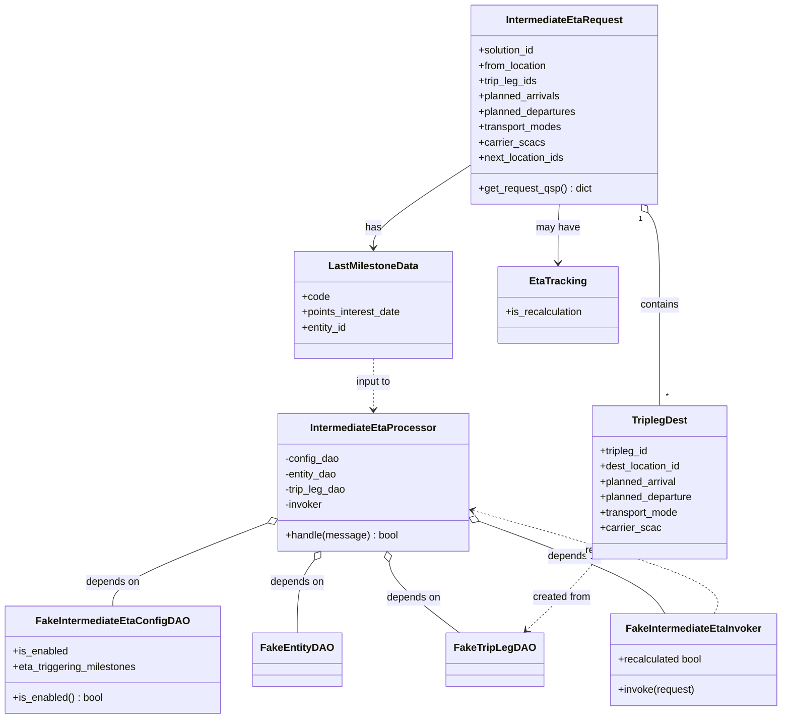
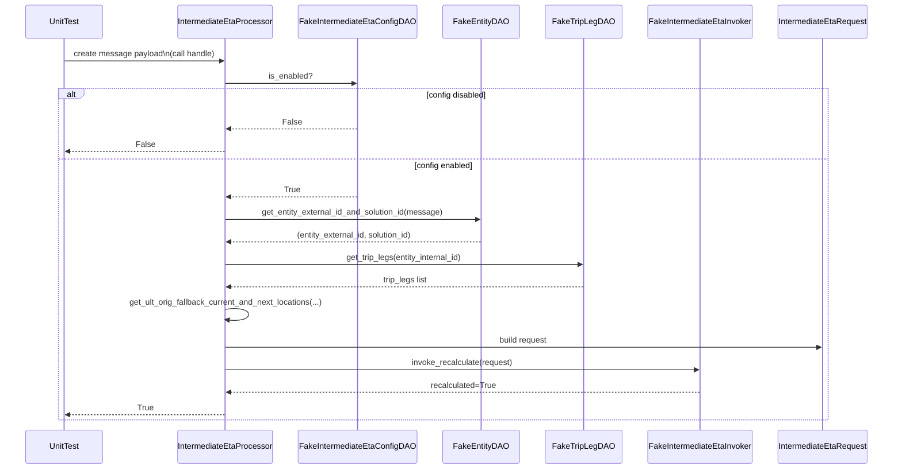

# Diagram: entity_core/entity_service/entity_listener/tests/unit/test_intermediate_eta_processor.py

> Auto-generated by Obscura crawlers

## Diagram 1

### SVG

<svg id="container" width="1208.443359375" xmlns="http://www.w3.org/2000/svg" class="classDiagram" height="1126" viewBox="0 0 1208.443359375 1126" role="graphics-document document" aria-roledescription="class"><g><defs><marker id="container_class-aggregationStart" class="marker aggregation class" refX="18" refY="7" markerWidth="190" markerHeight="240" orient="auto"><path d="M 18,7 L9,13 L1,7 L9,1 Z"></path></marker></defs><defs><marker id="container_class-aggregationEnd" class="marker aggregation class" refX="1" refY="7" markerWidth="20" markerHeight="28" orient="auto"><path d="M 18,7 L9,13 L1,7 L9,1 Z"></path></marker></defs><defs><marker id="container_class-extensionStart" class="marker extension class" refX="18" refY="7" markerWidth="190" markerHeight="240" orient="auto"><path d="M 1,7 L18,13 V 1 Z"></path></marker></defs><defs><marker id="container_class-extensionEnd" class="marker extension class" refX="1" refY="7" markerWidth="20" markerHeight="28" orient="auto"><path d="M 1,1 V 13 L18,7 Z"></path></marker></defs><defs><marker id="container_class-compositionStart" class="marker composition class" refX="18" refY="7" markerWidth="190" markerHeight="240" orient="auto"><path d="M 18,7 L9,13 L1,7 L9,1 Z"></path></marker></defs><defs><marker id="container_class-compositionEnd" class="marker composition class" refX="1" refY="7" markerWidth="20" markerHeight="28" orient="auto"><path d="M 18,7 L9,13 L1,7 L9,1 Z"></path></marker></defs><defs><marker id="container_class-dependencyStart" class="marker dependency class" refX="6" refY="7" markerWidth="190" markerHeight="240" orient="auto"><path d="M 5,7 L9,13 L1,7 L9,1 Z"></path></marker></defs><defs><marker id="container_class-dependencyEnd" class="marker dependency class" refX="13" refY="7" markerWidth="20" markerHeight="28" orient="auto"><path d="M 18,7 L9,13 L14,7 L9,1 Z"></path></marker></defs><defs><marker id="container_class-lollipopStart" class="marker lollipop class" refX="13" refY="7" markerWidth="190" markerHeight="240" orient="auto"><circle stroke="black" fill="transparent" cx="7" cy="7" r="6"></circle></marker></defs><defs><marker id="container_class-lollipopEnd" class="marker lollipop class" refX="1" refY="7" markerWidth="190" markerHeight="240" orient="auto"><circle stroke="black" fill="transparent" cx="7" cy="7" r="6"></circle></marker></defs><g class="root"><g class="clusters"></g><g class="edgePaths"><path d="M407.054,820.97L368.428,836.309C329.801,851.647,252.549,882.323,213.923,903.828C175.297,925.333,175.297,937.667,175.297,943.833L175.297,950" id="id_IntermediateEtaProcessor_FakeIntermediateEtaConfigDAO_1" class="edge-thickness-normal edge-pattern-solid relation" style=";;;" data-edge="true" data-et="edge" data-id="id_IntermediateEtaProcessor_FakeIntermediateEtaConfigDAO_1" data-points="W3sieCI6NDIzLjA4NTkzNzUsInkiOjgxNC42MDQxMjk4MjI2NTQ3fSx7IngiOjE3NS4yOTY4NzUsInkiOjkxM30seyJ4IjoxNzUuMjk2ODc1LCJ5Ijo5NTB9XQ==" marker-start="url(#container_class-aggregationStart)"></path><path d="M482.885,878.002L478.688,883.835C474.491,889.668,466.097,901.334,461.9,920.334C457.703,939.333,457.703,965.667,457.703,978.833L457.703,992" id="id_IntermediateEtaProcessor_FakeEntityDAO_2" class="edge-thickness-normal edge-pattern-solid relation" style=";;;" data-edge="true" data-et="edge" data-id="id_IntermediateEtaProcessor_FakeEntityDAO_2" data-points="W3sieCI6NDkyLjk1OTY2ODU5MDc2NDM1LCJ5Ijo4NjR9LHsieCI6NDU3LjcwMzEyNSwieSI6OTEzfSx7IngiOjQ1Ny43MDMxMjUsInkiOjk5Mn1d" marker-start="url(#container_class-aggregationStart)"></path><path d="M596.895,880.882L598.019,886.235C599.144,891.588,601.392,902.294,619.785,920.814C638.178,939.333,672.715,965.667,689.984,978.833L707.253,992" id="id_IntermediateEtaProcessor_FakeTripLegDAO_3" class="edge-thickness-normal edge-pattern-solid relation" style=";;;" data-edge="true" data-et="edge" data-id="id_IntermediateEtaProcessor_FakeTripLegDAO_3" data-points="W3sieCI6NTkzLjM0OTc5NTk3OTI5OTQsInkiOjg2NH0seyJ4Ijo2MDMuNjQwNjI1LCJ5Ijo5MTN9LHsieCI6NzA3LjI1Mjg4OTMzMzY3NzcsInkiOjk5Mn1d" marker-start="url(#container_class-aggregationStart)"></path><path d="M734.445,816.056L778.507,832.214C822.569,848.371,910.693,880.685,959.55,905.009C1008.408,929.333,1017.999,945.667,1022.794,953.833L1027.59,962" id="id_IntermediateEtaProcessor_FakeIntermediateEtaInvoker_4" class="edge-thickness-normal edge-pattern-solid relation" style=";;;" data-edge="true" data-et="edge" data-id="id_IntermediateEtaProcessor_FakeIntermediateEtaInvoker_4" data-points="W3sieCI6NzE4LjI1LCJ5Ijo4MTAuMTE3NjMwNDIxNjkyMn0seyJ4Ijo5OTguODE2NDA2MjUsInkiOjkxM30seyJ4IjoxMDI3LjU4OTgyNzYwODQ3MSwieSI6OTYyfV0=" marker-start="url(#container_class-aggregationStart)"></path><path d="M727.148,257.123L701.068,273.769C674.988,290.415,622.828,323.708,596.748,345.52C570.668,367.333,570.668,377.667,570.668,382.833L570.668,388" id="id_IntermediateEtaRequest_LastMilestoneData_5" class="edge-thickness-normal edge-pattern-solid relation" style=";;;" data-edge="true" data-et="edge" data-id="id_IntermediateEtaRequest_LastMilestoneData_5" data-points="W3sieCI6NzI3LjE0ODQzNzUsInkiOjI1Ny4xMjI4OTI2ODY4OTY5fSx7IngiOjU3MC42Njc5Njg3NSwieSI6MzU3fSx7IngiOjU3MC42Njc5Njg3NSwieSI6Mzk0fV0=" marker-end="url(#container_class-dependencyEnd)"></path><path d="M858.496,320L857.921,326.167C857.346,332.333,856.195,344.667,855.62,360C855.045,375.333,855.045,393.667,855.045,402.833L855.045,412" id="id_IntermediateEtaRequest_EtaTracking_6" class="edge-thickness-normal edge-pattern-solid relation" style=";;;" data-edge="true" data-et="edge" data-id="id_IntermediateEtaRequest_EtaTracking_6" data-points="W3sieCI6ODU4LjQ5NjA3MzUxMDM2MjcsInkiOjMyMH0seyJ4Ijo4NTUuMDQ0OTIxODc1LCJ5IjozNTd9LHsieCI6ODU1LjA0NDkyMTg3NSwieSI6NDE4fV0=" marker-end="url(#container_class-dependencyEnd)"></path><path d="M998.176,333.889L1001.012,337.741C1003.849,341.593,1009.523,349.296,1012.36,373.315C1015.197,397.333,1015.197,437.667,1015.197,478C1015.197,518.333,1015.197,558.667,1015.197,585C1015.197,611.333,1015.197,623.667,1015.197,629.833L1015.197,636" id="id_IntermediateEtaRequest_TriplegDest_7" class="edge-thickness-normal edge-pattern-solid relation" style=";;;" data-edge="true" data-et="edge" data-id="id_IntermediateEtaRequest_TriplegDest_7" data-points="W3sieCI6OTg3Ljk0NTYzNjMzNDE5NjksInkiOjMyMH0seyJ4IjoxMDE1LjE5NzI2NTYyNSwieSI6MzU3fSx7IngiOjEwMTUuMTk3MjY1NjI1LCJ5Ijo0Nzh9LHsieCI6MTAxNS4xOTcyNjU2MjUsInkiOjU5OX0seyJ4IjoxMDE1LjE5NzI2NTYyNSwieSI6NjM2fV0=" marker-start="url(#container_class-aggregationStart)"></path><path d="M919.102,876L914.164,882.167C909.226,888.333,899.349,900.667,881.301,919.311C863.253,937.955,837.033,962.909,823.923,975.386L810.814,987.864" id="id_TriplegDest_FakeTripLegDAO_8" class="edge-thickness-normal edge-pattern-dashed relation" style=";;;" data-edge="true" data-et="edge" data-id="id_TriplegDest_FakeTripLegDAO_8" data-points="W3sieCI6OTE5LjEwMjAyMjc5MDYwNTEsInkiOjg3Nn0seyJ4Ijo4ODkuNDcyNjU2MjUsInkiOjkxM30seyJ4Ijo4MDYuNDY3MzEzNDAzOTI1NiwieSI6OTkyfV0=" marker-end="url(#container_class-dependencyEnd)"></path><path d="M570.668,562L570.668,568.167C570.668,574.333,570.668,586.667,570.668,600C570.668,613.333,570.668,627.667,570.668,634.833L570.668,642" id="id_LastMilestoneData_IntermediateEtaProcessor_9" class="edge-thickness-normal edge-pattern-dashed relation" style=";;;" data-edge="true" data-et="edge" data-id="id_LastMilestoneData_IntermediateEtaProcessor_9" data-points="W3sieCI6NTcwLjY2Nzk2ODc1LCJ5Ijo1NjJ9LHsieCI6NTcwLjY2Nzk2ODc1LCJ5Ijo1OTl9LHsieCI6NTcwLjY2Nzk2ODc1LCJ5Ijo2NDh9XQ==" marker-end="url(#container_class-dependencyEnd)"></path><path d="M1103.24,962L1107.025,953.833C1110.811,945.667,1118.381,929.333,1055.178,902.227C991.975,875.12,857.999,837.24,791.012,818.3L724.024,799.36" id="id_FakeIntermediateEtaInvoker_IntermediateEtaProcessor_10" class="edge-thickness-normal edge-pattern-dashed relation" style=";;;" data-edge="true" data-et="edge" data-id="id_FakeIntermediateEtaInvoker_IntermediateEtaProcessor_10" data-points="W3sieCI6MTEwMy4yNDAyNjY2NTgwNTc5LCJ5Ijo5NjJ9LHsieCI6MTEyNS45NTExNzE4NzUsInkiOjkxM30seyJ4Ijo3MTguMjUsInkiOjc5Ny43MjcxMzgxMDg3MjEzfV0=" marker-end="url(#container_class-dependencyEnd)"></path></g><g class="edgeLabels"><g class="edgeLabel" transform="translate(175.296875, 913)"><g class="label" data-id="id_IntermediateEtaProcessor_FakeIntermediateEtaConfigDAO_1" transform="translate(-42.9453125, -12)"><foreignObject width="85.890625" height="24">

depends on

</foreignObject></g></g><g class="edgeLabel" transform="translate(457.703125, 913)"><g class="label" data-id="id_IntermediateEtaProcessor_FakeEntityDAO_2" transform="translate(-42.9453125, -12)"><foreignObject width="85.890625" height="24">

depends on

</foreignObject></g></g><g class="edgeLabel" transform="translate(635.53885, 937.32105)"><g class="label" data-id="id_IntermediateEtaProcessor_FakeTripLegDAO_3" transform="translate(-42.9453125, -12)"><foreignObject width="85.890625" height="24">

depends on

</foreignObject></g></g><g class="edgeLabel" transform="translate(885.20807, 871.34036)"><g class="label" data-id="id_IntermediateEtaProcessor_FakeIntermediateEtaInvoker_4" transform="translate(-42.9453125, -12)"><foreignObject width="85.890625" height="24">

depends on

</foreignObject></g></g><g class="edgeLabel" transform="translate(570.66796875, 357)"><g class="label" data-id="id_IntermediateEtaRequest_LastMilestoneData_5" transform="translate(-12.703125, -12)"><foreignObject width="25.40625" height="24">

has

</foreignObject></g></g><g class="edgeLabel" transform="translate(855.044921875, 357)"><g class="label" data-id="id_IntermediateEtaRequest_EtaTracking_6" transform="translate(-34.328125, -12)"><foreignObject width="68.65625" height="24">

may have

</foreignObject></g></g><g class="edgeLabel" transform="translate(1015.197265625, 478)"><g class="label" data-id="id_IntermediateEtaRequest_TriplegDest_7" transform="translate(-30.890625, -12)"><foreignObject width="61.78125" height="24">

contains

</foreignObject></g></g><g class="edgeLabel" transform="translate(865.13803, 936.16038)"><g class="label" data-id="id_TriplegDest_FakeTripLegDAO_8" transform="translate(-46.3984375, -12)"><foreignObject width="92.796875" height="24">

created from

</foreignObject></g></g><g class="edgeLabel" transform="translate(570.66796875, 599)"><g class="label" data-id="id_LastMilestoneData_IntermediateEtaProcessor_9" transform="translate(-28.8046875, -12)"><foreignObject width="57.609375" height="24">

input to

</foreignObject></g></g><g class="edgeLabel" transform="translate(948.08555, 862.71052)"><g class="label" data-id="id_FakeIntermediateEtaInvoker_IntermediateEtaProcessor_10" transform="translate(-49.21875, -12)"><foreignObject width="98.4375" height="24">

returns result

</foreignObject></g></g><g class="edgeTerminals" transform="translate(986.2461380040074, 342.9861204508011)"><g class="inner" transform="translate(0, 0)"><foreignObject style="width: 9px; height: 12px;">
1
</foreignObject></g></g><g class="edgeTerminals" transform="translate(1025.1972678124998, 613.500001875)"><g class="inner" transform="translate(0, 0)"></g><foreignObject style="width: 9px; height: 12px;">
*
</foreignObject></g></g><g class="nodes"><g class="node default" id="classId-IntermediateEtaProcessor-0" transform="translate(570.66796875, 756)"><g class="basic label-container"><path d="M-147.58203125 -108 L147.58203125 -108 L147.58203125 108 L-147.58203125 108" stroke="none" stroke-width="0" fill="#ECECFF" style=""></path><path d="M-147.58203125 -108 C-30.726474794384018 -108, 86.12908166123196 -108, 147.58203125 -108 M-147.58203125 -108 C-71.39267817040174 -108, 4.7966749091965255 -108, 147.58203125 -108 M147.58203125 -108 C147.58203125 -60.54728426976381, 147.58203125 -13.094568539527614, 147.58203125 108 M147.58203125 -108 C147.58203125 -31.105554612515547, 147.58203125 45.788890774968905, 147.58203125 108 M147.58203125 108 C57.6660157992108 108, -32.249999651578406 108, -147.58203125 108 M147.58203125 108 C31.22583660005077 108, -85.13035804989846 108, -147.58203125 108 M-147.58203125 108 C-147.58203125 29.089317090155433, -147.58203125 -49.821365819689134, -147.58203125 -108 M-147.58203125 108 C-147.58203125 47.534706534467695, -147.58203125 -12.93058693106461, -147.58203125 -108" stroke="#9370DB" stroke-width="1.3" fill="none" stroke-dasharray="0 0" style=""></path></g><g class="annotation-group text" transform="translate(0, -84)"></g><g class="label-group text" transform="translate(-94.8671875, -84)"><g class="label" style="font-weight: bolder" transform="translate(0,-12)"><foreignObject width="189.734375" height="24">

IntermediateEtaProcessor

</foreignObject></g></g><g class="members-group text" transform="translate(-135.58203125, -36)"><g class="label" style="" transform="translate(0,-12)"><foreignObject width="85.703125" height="24">

-config_dao

</foreignObject></g><g class="label" style="" transform="translate(0,12)"><foreignObject width="83.546875" height="24">

-entity_dao

</foreignObject></g><g class="label" style="" transform="translate(0,36)"><foreignObject width="97.515625" height="24">

-trip_leg_dao

</foreignObject></g><g class="label" style="" transform="translate(0,60)"><foreignObject width="60.328125" height="24">

-invoker

</foreignObject></g></g><g class="methods-group text" transform="translate(-135.58203125, 84)"><g class="label" style="" transform="translate(0,-12)"><foreignObject width="176.296875" height="24">

+handle(message) : bool

</foreignObject></g></g><g class="divider" style=""><path d="M-147.58203125 -60 C-42.473886151338704 -60, 62.63425894732259 -60, 147.58203125 -60 M-147.58203125 -60 C-41.026729259246636 -60, 65.52857273150673 -60, 147.58203125 -60" stroke="#9370DB" stroke-width="1.3" fill="none" stroke-dasharray="0 0" style=""></path></g><g class="divider" style=""><path d="M-147.58203125 60 C-43.44883367993339 60, 60.68436389013323 60, 147.58203125 60 M-147.58203125 60 C-81.06054274006244 60, -14.53905423012489 60, 147.58203125 60" stroke="#9370DB" stroke-width="1.3" fill="none" stroke-dasharray="0 0" style=""></path></g></g><g class="node default" id="classId-IntermediateEtaRequest-1" transform="translate(873.046875, 164)"><g class="basic label-container"><path d="M-145.8984375 -156 L145.8984375 -156 L145.8984375 156 L-145.8984375 156" stroke="none" stroke-width="0" fill="#ECECFF" style=""></path><path d="M-145.8984375 -156 C-48.151677569485145 -156, 49.59508236102971 -156, 145.8984375 -156 M-145.8984375 -156 C-62.501511206063384 -156, 20.895415087873232 -156, 145.8984375 -156 M145.8984375 -156 C145.8984375 -34.49736593949673, 145.8984375 87.00526812100654, 145.8984375 156 M145.8984375 -156 C145.8984375 -64.97044389679765, 145.8984375 26.059112206404706, 145.8984375 156 M145.8984375 156 C65.73440094114605 156, -14.429635617707902 156, -145.8984375 156 M145.8984375 156 C59.41035703378786 156, -27.07772343242428 156, -145.8984375 156 M-145.8984375 156 C-145.8984375 72.45385249673193, -145.8984375 -11.092295006536148, -145.8984375 -156 M-145.8984375 156 C-145.8984375 77.48943938175329, -145.8984375 -1.0211212364934283, -145.8984375 -156" stroke="#9370DB" stroke-width="1.3" fill="none" stroke-dasharray="0 0" style=""></path></g><g class="annotation-group text" transform="translate(0, -132)"></g><g class="label-group text" transform="translate(-88.921875, -132)"><g class="label" style="font-weight: bolder" transform="translate(0,-12)"><foreignObject width="177.84375" height="24">

IntermediateEtaRequest

</foreignObject></g></g><g class="members-group text" transform="translate(-133.8984375, -84)"><g class="label" style="" transform="translate(0,-12)"><foreignObject width="90.21875" height="24">

+solution_id

</foreignObject></g><g class="label" style="" transform="translate(0,12)"><foreignObject width="109.171875" height="24">

+from_location

</foreignObject></g><g class="label" style="" transform="translate(0,36)"><foreignObject width="93.296875" height="24">

+trip_leg_ids

</foreignObject></g><g class="label" style="" transform="translate(0,60)"><foreignObject width="129.734375" height="24">

+planned_arrivals

</foreignObject></g><g class="label" style="" transform="translate(0,84)"><foreignObject width="155.34375" height="24">

+planned_departures

</foreignObject></g><g class="label" style="" transform="translate(0,108)"><foreignObject width="132.796875" height="24">

+transport_modes

</foreignObject></g><g class="label" style="" transform="translate(0,132)"><foreignObject width="101.765625" height="24">

+carrier_scacs

</foreignObject></g><g class="label" style="" transform="translate(0,156)"><foreignObject width="136.671875" height="24">

+next_location_ids

</foreignObject></g></g><g class="methods-group text" transform="translate(-133.8984375, 132)"><g class="label" style="" transform="translate(0,-12)"><foreignObject width="178.875" height="24">

+get_request_qsp() : dict

</foreignObject></g></g><g class="divider" style=""><path d="M-145.8984375 -108 C-33.412315879525664 -108, 79.07380574094867 -108, 145.8984375 -108 M-145.8984375 -108 C-72.77390689188866 -108, 0.3506237162226853 -108, 145.8984375 -108" stroke="#9370DB" stroke-width="1.3" fill="none" stroke-dasharray="0 0" style=""></path></g><g class="divider" style=""><path d="M-145.8984375 108 C-75.50771795061532 108, -5.1169984012306315 108, 145.8984375 108 M-145.8984375 108 C-34.13197376561381 108, 77.63448996877239 108, 145.8984375 108" stroke="#9370DB" stroke-width="1.3" fill="none" stroke-dasharray="0 0" style=""></path></g></g><g class="node default" id="classId-TriplegDest-2" transform="translate(1015.197265625, 756)"><g class="basic label-container"><path d="M-106.9609375 -120 L106.9609375 -120 L106.9609375 120 L-106.9609375 120" stroke="none" stroke-width="0" fill="#ECECFF" style=""></path><path d="M-106.9609375 -120 C-53.74775290810871 -120, -0.5345683162174169 -120, 106.9609375 -120 M-106.9609375 -120 C-25.958556933487017 -120, 55.043823633025966 -120, 106.9609375 -120 M106.9609375 -120 C106.9609375 -33.016609783834994, 106.9609375 53.96678043233001, 106.9609375 120 M106.9609375 -120 C106.9609375 -67.56668767552011, 106.9609375 -15.133375351040215, 106.9609375 120 M106.9609375 120 C59.13219529194019 120, 11.303453083880385 120, -106.9609375 120 M106.9609375 120 C28.50589491961054 120, -49.94914766077892 120, -106.9609375 120 M-106.9609375 120 C-106.9609375 53.676388126438994, -106.9609375 -12.647223747122013, -106.9609375 -120 M-106.9609375 120 C-106.9609375 51.250309520582604, -106.9609375 -17.49938095883479, -106.9609375 -120" stroke="#9370DB" stroke-width="1.3" fill="none" stroke-dasharray="0 0" style=""></path></g><g class="annotation-group text" transform="translate(0, -96)"></g><g class="label-group text" transform="translate(-42.0625, -96)"><g class="label" style="font-weight: bolder" transform="translate(0,-12)"><foreignObject width="84.125" height="24">

TriplegDest

</foreignObject></g></g><g class="members-group text" transform="translate(-94.9609375, -48)"><g class="label" style="" transform="translate(0,-12)"><foreignObject width="77.984375" height="24">

+tripleg_id

</foreignObject></g><g class="label" style="" transform="translate(0,12)"><foreignObject width="129.234375" height="24">

+dest_location_id

</foreignObject></g><g class="label" style="" transform="translate(0,36)"><foreignObject width="122.265625" height="24">

+planned_arrival

</foreignObject></g><g class="label" style="" transform="translate(0,60)"><foreignObject width="147.859375" height="24">

+planned_departure

</foreignObject></g><g class="label" style="" transform="translate(0,84)"><foreignObject width="125.3125" height="24">

+transport_mode

</foreignObject></g><g class="label" style="" transform="translate(0,108)"><foreignObject width="94.296875" height="24">

+carrier_scac

</foreignObject></g></g><g class="methods-group text" transform="translate(-94.9609375, 120)"></g><g class="divider" style=""><path d="M-106.9609375 -72 C-26.703291488482776 -72, 53.55435452303445 -72, 106.9609375 -72 M-106.9609375 -72 C-37.2801939698161 -72, 32.40054956036781 -72, 106.9609375 -72" stroke="#9370DB" stroke-width="1.3" fill="none" stroke-dasharray="0 0" style=""></path></g><g class="divider" style=""><path d="M-106.9609375 96 C-57.78267377723543 96, -8.604410054470861 96, 106.9609375 96 M-106.9609375 96 C-32.887593211583024 96, 41.18575107683395 96, 106.9609375 96" stroke="#9370DB" stroke-width="1.3" fill="none" stroke-dasharray="0 0" style=""></path></g></g><g class="node default" id="classId-LastMilestoneData-3" transform="translate(570.66796875, 478)"><g class="basic label-container"><path d="M-125.14453125 -84 L125.14453125 -84 L125.14453125 84 L-125.14453125 84" stroke="none" stroke-width="0" fill="#ECECFF" style=""></path><path d="M-125.14453125 -84 C-63.9327838301364 -84, -2.721036410272802 -84, 125.14453125 -84 M-125.14453125 -84 C-39.22569266556981 -84, 46.69314591886038 -84, 125.14453125 -84 M125.14453125 -84 C125.14453125 -46.75509570704105, 125.14453125 -9.510191414082101, 125.14453125 84 M125.14453125 -84 C125.14453125 -18.41205008748578, 125.14453125 47.17589982502844, 125.14453125 84 M125.14453125 84 C62.84447968728776 84, 0.5444281245755178 84, -125.14453125 84 M125.14453125 84 C32.18329149475332 84, -60.77794826049336 84, -125.14453125 84 M-125.14453125 84 C-125.14453125 41.90497839338575, -125.14453125 -0.19004321322850615, -125.14453125 -84 M-125.14453125 84 C-125.14453125 31.115750344944857, -125.14453125 -21.768499310110286, -125.14453125 -84" stroke="#9370DB" stroke-width="1.3" fill="none" stroke-dasharray="0 0" style=""></path></g><g class="annotation-group text" transform="translate(0, -60)"></g><g class="label-group text" transform="translate(-67.9765625, -60)"><g class="label" style="font-weight: bolder" transform="translate(0,-12)"><foreignObject width="135.953125" height="24">

LastMilestoneData

</foreignObject></g></g><g class="members-group text" transform="translate(-113.14453125, -12)"><g class="label" style="" transform="translate(0,-12)"><foreignObject width="42.953125" height="24">

+code

</foreignObject></g><g class="label" style="" transform="translate(0,12)"><foreignObject width="158.3125" height="24">

+points_interest_date

</foreignObject></g><g class="label" style="" transform="translate(0,36)"><foreignObject width="71.859375" height="24">

+entity_id

</foreignObject></g></g><g class="methods-group text" transform="translate(-113.14453125, 84)"></g><g class="divider" style=""><path d="M-125.14453125 -36 C-48.7555691844793 -36, 27.633392881041402 -36, 125.14453125 -36 M-125.14453125 -36 C-54.755777008991416 -36, 15.632977232017168 -36, 125.14453125 -36" stroke="#9370DB" stroke-width="1.3" fill="none" stroke-dasharray="0 0" style=""></path></g><g class="divider" style=""><path d="M-125.14453125 60 C-66.12123733338022 60, -7.097943416760444 60, 125.14453125 60 M-125.14453125 60 C-65.08342940807171 60, -5.0223275661434315 60, 125.14453125 60" stroke="#9370DB" stroke-width="1.3" fill="none" stroke-dasharray="0 0" style=""></path></g></g><g class="node default" id="classId-EtaTracking-4" transform="translate(855.044921875, 478)"><g class="basic label-container"><path d="M-94.26171875 -60 L94.26171875 -60 L94.26171875 60 L-94.26171875 60" stroke="none" stroke-width="0" fill="#ECECFF" style=""></path><path d="M-94.26171875 -60 C-55.78907467206821 -60, -17.31643059413642 -60, 94.26171875 -60 M-94.26171875 -60 C-42.044482306656654 -60, 10.172754136686692 -60, 94.26171875 -60 M94.26171875 -60 C94.26171875 -15.941853846686556, 94.26171875 28.11629230662689, 94.26171875 60 M94.26171875 -60 C94.26171875 -13.663576807177385, 94.26171875 32.67284638564523, 94.26171875 60 M94.26171875 60 C43.974105324636945 60, -6.313508100726111 60, -94.26171875 60 M94.26171875 60 C31.734758603750592 60, -30.792201542498816 60, -94.26171875 60 M-94.26171875 60 C-94.26171875 23.827147734004363, -94.26171875 -12.345704531991274, -94.26171875 -60 M-94.26171875 60 C-94.26171875 22.924520273105976, -94.26171875 -14.150959453788047, -94.26171875 -60" stroke="#9370DB" stroke-width="1.3" fill="none" stroke-dasharray="0 0" style=""></path></g><g class="annotation-group text" transform="translate(0, -36)"></g><g class="label-group text" transform="translate(-42.3671875, -36)"><g class="label" style="font-weight: bolder" transform="translate(0,-12)"><foreignObject width="84.734375" height="24">

EtaTracking

</foreignObject></g></g><g class="members-group text" transform="translate(-82.26171875, 12)"><g class="label" style="" transform="translate(0,-12)"><foreignObject width="122.15625" height="24">

+is_recalculation

</foreignObject></g></g><g class="methods-group text" transform="translate(-82.26171875, 60)"></g><g class="divider" style=""><path d="M-94.26171875 -12 C-47.49640316532121 -12, -0.7310875806424235 -12, 94.26171875 -12 M-94.26171875 -12 C-51.99789607863107 -12, -9.734073407262144 -12, 94.26171875 -12" stroke="#9370DB" stroke-width="1.3" fill="none" stroke-dasharray="0 0" style=""></path></g><g class="divider" style=""><path d="M-94.26171875 36 C-32.424416746650394 36, 29.412885256699212 36, 94.26171875 36 M-94.26171875 36 C-21.149253429173996 36, 51.96321189165201 36, 94.26171875 36" stroke="#9370DB" stroke-width="1.3" fill="none" stroke-dasharray="0 0" style=""></path></g></g><g class="node default" id="classId-FakeIntermediateEtaConfigDAO-5" transform="translate(175.296875, 1034)"><g class="basic label-container"><path d="M-167.296875 -84 L167.296875 -84 L167.296875 84 L-167.296875 84" stroke="none" stroke-width="0" fill="#ECECFF" style=""></path><path d="M-167.296875 -84 C-52.768441209945905 -84, 61.75999258010819 -84, 167.296875 -84 M-167.296875 -84 C-50.64743409971139 -84, 66.00200680057722 -84, 167.296875 -84 M167.296875 -84 C167.296875 -42.421379722144096, 167.296875 -0.8427594442881912, 167.296875 84 M167.296875 -84 C167.296875 -41.29601424008658, 167.296875 1.4079715198268445, 167.296875 84 M167.296875 84 C44.99723396532444 84, -77.30240706935112 84, -167.296875 84 M167.296875 84 C89.72514763366507 84, 12.153420267330148 84, -167.296875 84 M-167.296875 84 C-167.296875 29.037112041138172, -167.296875 -25.925775917723655, -167.296875 -84 M-167.296875 84 C-167.296875 39.74403320523321, -167.296875 -4.511933589533584, -167.296875 -84" stroke="#9370DB" stroke-width="1.3" fill="none" stroke-dasharray="0 0" style=""></path></g><g class="annotation-group text" transform="translate(0, -60)"></g><g class="label-group text" transform="translate(-113.703125, -60)"><g class="label" style="font-weight: bolder" transform="translate(0,-12)"><foreignObject width="227.40625" height="24">

FakeIntermediateEtaConfigDAO

</foreignObject></g></g><g class="members-group text" transform="translate(-155.296875, -12)"><g class="label" style="" transform="translate(0,-12)"><foreignObject width="86.859375" height="24">

+is_enabled

</foreignObject></g><g class="label" style="" transform="translate(0,12)"><foreignObject width="196.890625" height="24">

+eta_triggering_milestones

</foreignObject></g></g><g class="methods-group text" transform="translate(-155.296875, 60)"><g class="label" style="" transform="translate(0,-12)"><foreignObject width="142.421875" height="24">

+is_enabled() : bool

</foreignObject></g></g><g class="divider" style=""><path d="M-167.296875 -36 C-80.16900863884065 -36, 6.958857722318697 -36, 167.296875 -36 M-167.296875 -36 C-43.62551494392925 -36, 80.0458451121415 -36, 167.296875 -36" stroke="#9370DB" stroke-width="1.3" fill="none" stroke-dasharray="0 0" style=""></path></g><g class="divider" style=""><path d="M-167.296875 36 C-44.728221813364286 36, 77.84043137327143 36, 167.296875 36 M-167.296875 36 C-36.439599730041266 36, 94.41767553991747 36, 167.296875 36" stroke="#9370DB" stroke-width="1.3" fill="none" stroke-dasharray="0 0" style=""></path></g></g><g class="node default" id="classId-FakeEntityDAO-6" transform="translate(457.703125, 1034)"><g class="basic label-container"><path d="M-65.109375 -42 L65.109375 -42 L65.109375 42 L-65.109375 42" stroke="none" stroke-width="0" fill="#ECECFF" style=""></path><path d="M-65.109375 -42 C-20.847022395530445 -42, 23.41533020893911 -42, 65.109375 -42 M-65.109375 -42 C-37.5876418374187 -42, -10.065908674837402 -42, 65.109375 -42 M65.109375 -42 C65.109375 -15.333131759478206, 65.109375 11.333736481043587, 65.109375 42 M65.109375 -42 C65.109375 -12.273545573374832, 65.109375 17.452908853250335, 65.109375 42 M65.109375 42 C34.14096295853075 42, 3.172550917061507 42, -65.109375 42 M65.109375 42 C31.525844781330683 42, -2.057685437338634 42, -65.109375 42 M-65.109375 42 C-65.109375 17.865519238679276, -65.109375 -6.2689615226414475, -65.109375 -42 M-65.109375 42 C-65.109375 9.76751282012053, -65.109375 -22.46497435975894, -65.109375 -42" stroke="#9370DB" stroke-width="1.3" fill="none" stroke-dasharray="0 0" style=""></path></g><g class="annotation-group text" transform="translate(0, -18)"></g><g class="label-group text" transform="translate(-53.109375, -18)"><g class="label" style="font-weight: bolder" transform="translate(0,-12)"><foreignObject width="106.21875" height="24">

FakeEntityDAO

</foreignObject></g></g><g class="members-group text" transform="translate(-53.109375, 30)"></g><g class="methods-group text" transform="translate(-53.109375, 60)"></g><g class="divider" style=""><path d="M-65.109375 6 C-35.812796738679104 6, -6.516218477358208 6, 65.109375 6 M-65.109375 6 C-28.110006253110278 6, 8.889362493779444 6, 65.109375 6" stroke="#9370DB" stroke-width="1.3" fill="none" stroke-dasharray="0 0" style=""></path></g><g class="divider" style=""><path d="M-65.109375 24 C-21.601249317926772 24, 21.906876364146456 24, 65.109375 24 M-65.109375 24 C-28.688907657157174 24, 7.731559685685653 24, 65.109375 24" stroke="#9370DB" stroke-width="1.3" fill="none" stroke-dasharray="0 0" style=""></path></g></g><g class="node default" id="classId-FakeTripLegDAO-7" transform="translate(762.337890625, 1034)"><g class="basic label-container"><path d="M-70.875 -42 L70.875 -42 L70.875 42 L-70.875 42" stroke="none" stroke-width="0" fill="#ECECFF" style=""></path><path d="M-70.875 -42 C-37.30761081576473 -42, -3.740221631529465 -42, 70.875 -42 M-70.875 -42 C-34.47237528665061 -42, 1.9302494266987793 -42, 70.875 -42 M70.875 -42 C70.875 -11.590360437588572, 70.875 18.819279124822856, 70.875 42 M70.875 -42 C70.875 -17.593127973604965, 70.875 6.813744052790071, 70.875 42 M70.875 42 C20.13836973056219 42, -30.59826053887562 42, -70.875 42 M70.875 42 C26.050902051377975 42, -18.77319589724405 42, -70.875 42 M-70.875 42 C-70.875 14.331778765953587, -70.875 -13.336442468092827, -70.875 -42 M-70.875 42 C-70.875 15.949353157696503, -70.875 -10.101293684606993, -70.875 -42" stroke="#9370DB" stroke-width="1.3" fill="none" stroke-dasharray="0 0" style=""></path></g><g class="annotation-group text" transform="translate(0, -18)"></g><g class="label-group text" transform="translate(-58.875, -18)"><g class="label" style="font-weight: bolder" transform="translate(0,-12)"><foreignObject width="117.75" height="24">

FakeTripLegDAO

</foreignObject></g></g><g class="members-group text" transform="translate(-58.875, 30)"></g><g class="methods-group text" transform="translate(-58.875, 60)"></g><g class="divider" style=""><path d="M-70.875 6 C-41.71541845520484 6, -12.555836910409674 6, 70.875 6 M-70.875 6 C-34.986631192320786 6, 0.901737615358428 6, 70.875 6" stroke="#9370DB" stroke-width="1.3" fill="none" stroke-dasharray="0 0" style=""></path></g><g class="divider" style=""><path d="M-70.875 24 C-40.9682412780502 24, -11.061482556100401 24, 70.875 24 M-70.875 24 C-21.318976499752324 24, 28.23704700049535 24, 70.875 24" stroke="#9370DB" stroke-width="1.3" fill="none" stroke-dasharray="0 0" style=""></path></g></g><g class="node default" id="classId-FakeIntermediateEtaInvoker-8" transform="translate(1069.869140625, 1034)"><g class="basic label-container"><path d="M-130.57421875 -72 L130.57421875 -72 L130.57421875 72 L-130.57421875 72" stroke="none" stroke-width="0" fill="#ECECFF" style=""></path><path d="M-130.57421875 -72 C-33.90630137862557 -72, 62.76161599274886 -72, 130.57421875 -72 M-130.57421875 -72 C-63.806395408651525 -72, 2.9614279326969495 -72, 130.57421875 -72 M130.57421875 -72 C130.57421875 -35.75464406515599, 130.57421875 0.4907118696880133, 130.57421875 72 M130.57421875 -72 C130.57421875 -34.46021036156546, 130.57421875 3.079579276869083, 130.57421875 72 M130.57421875 72 C76.59722535615528 72, 22.620231962310555 72, -130.57421875 72 M130.57421875 72 C30.080965174999108 72, -70.41228840000178 72, -130.57421875 72 M-130.57421875 72 C-130.57421875 32.880887888114394, -130.57421875 -6.238224223771212, -130.57421875 -72 M-130.57421875 72 C-130.57421875 20.231540586117887, -130.57421875 -31.536918827764225, -130.57421875 -72" stroke="#9370DB" stroke-width="1.3" fill="none" stroke-dasharray="0 0" style=""></path></g><g class="annotation-group text" transform="translate(0, -48)"></g><g class="label-group text" transform="translate(-103.0390625, -48)"><g class="label" style="font-weight: bolder" transform="translate(0,-12)"><foreignObject width="206.078125" height="24">

FakeIntermediateEtaInvoker

</foreignObject></g></g><g class="members-group text" transform="translate(-118.57421875, 0)"><g class="label" style="" transform="translate(0,-12)"><foreignObject width="134.109375" height="24">

+recalculated bool

</foreignObject></g></g><g class="methods-group text" transform="translate(-118.57421875, 48)"><g class="label" style="" transform="translate(0,-12)"><foreignObject width="121.3125" height="24">

+invoke(request)

</foreignObject></g></g><g class="divider" style=""><path d="M-130.57421875 -24 C-51.35525558784957 -24, 27.86370757430086 -24, 130.57421875 -24 M-130.57421875 -24 C-46.55398428228057 -24, 37.46625018543887 -24, 130.57421875 -24" stroke="#9370DB" stroke-width="1.3" fill="none" stroke-dasharray="0 0" style=""></path></g><g class="divider" style=""><path d="M-130.57421875 24 C-57.76815128628694 24, 15.037916177426126 24, 130.57421875 24 M-130.57421875 24 C-32.30837752719508 24, 65.95746369560985 24, 130.57421875 24" stroke="#9370DB" stroke-width="1.3" fill="none" stroke-dasharray="0 0" style=""></path></g></g></g></g></g></svg>

## Diagram 2

### SVG

<svg id="container" width="1845" xmlns="http://www.w3.org/2000/svg" height="973" viewBox="-50 -10 1845 973" role="graphics-document document" aria-roledescription="sequence"><g><rect x="1549" y="887" fill="#eaeaea" stroke="#666" width="196" height="65" name="IntermediateEtaRequest" rx="3" ry="3" class="actor actor-bottom"></rect><text x="1647" y="919.5" dominant-baseline="central" alignment-baseline="central" class="actor actor-box" style="text-anchor: middle; font-size: 16px; font-weight: 400;"><tspan x="1647" dy="0">IntermediateEtaRequest</tspan></text></g><g><rect x="1275" y="887" fill="#eaeaea" stroke="#666" width="224" height="65" name="Invoker" rx="3" ry="3" class="actor actor-bottom"></rect><text x="1387" y="919.5" dominant-baseline="central" alignment-baseline="central" class="actor actor-box" style="text-anchor: middle; font-size: 16px; font-weight: 400;"><tspan x="1387" dy="0">FakeIntermediateEtaInvoker</tspan></text></g><g><rect x="1075" y="887" fill="#eaeaea" stroke="#666" width="150" height="65" name="TripLegDAO" rx="3" ry="3" class="actor actor-bottom"></rect><text x="1150" y="919.5" dominant-baseline="central" alignment-baseline="central" class="actor actor-box" style="text-anchor: middle; font-size: 16px; font-weight: 400;"><tspan x="1150" dy="0">FakeTripLegDAO</tspan></text></g><g><rect x="875" y="887" fill="#eaeaea" stroke="#666" width="150" height="65" name="Entity" rx="3" ry="3" class="actor actor-bottom"></rect><text x="950" y="919.5" dominant-baseline="central" alignment-baseline="central" class="actor actor-box" style="text-anchor: middle; font-size: 16px; font-weight: 400;"><tspan x="950" dy="0">FakeEntityDAO</tspan></text></g><g><rect x="581" y="887" fill="#eaeaea" stroke="#666" width="244" height="65" name="Config" rx="3" ry="3" class="actor actor-bottom"></rect><text x="703" y="919.5" dominant-baseline="central" alignment-baseline="central" class="actor actor-box" style="text-anchor: middle; font-size: 16px; font-weight: 400;"><tspan x="703" dy="0">FakeIntermediateEtaConfigDAO</tspan></text></g><g><rect x="323" y="887" fill="#eaeaea" stroke="#666" width="208" height="65" name="Processor" rx="3" ry="3" class="actor actor-bottom"></rect><text x="427" y="919.5" dominant-baseline="central" alignment-baseline="central" class="actor actor-box" style="text-anchor: middle; font-size: 16px; font-weight: 400;"><tspan x="427" dy="0">IntermediateEtaProcessor</tspan></text></g><g><rect x="0" y="887" fill="#eaeaea" stroke="#666" width="150" height="65" name="Test" rx="3" ry="3" class="actor actor-bottom"></rect><text x="75" y="919.5" dominant-baseline="central" alignment-baseline="central" class="actor actor-box" style="text-anchor: middle; font-size: 16px; font-weight: 400;"><tspan x="75" dy="0">UnitTest</tspan></text></g><g><line id="actor6" x1="1647" y1="65" x2="1647" y2="887" class="actor-line 200" stroke-width="0.5px" stroke="#999" name="IntermediateEtaRequest"></line><g id="root-6"><rect x="1549" y="0" fill="#eaeaea" stroke="#666" width="196" height="65" name="IntermediateEtaRequest" rx="3" ry="3" class="actor actor-top"></rect><text x="1647" y="32.5" dominant-baseline="central" alignment-baseline="central" class="actor actor-box" style="text-anchor: middle; font-size: 16px; font-weight: 400;"><tspan x="1647" dy="0">IntermediateEtaRequest</tspan></text></g></g><g><line id="actor5" x1="1387" y1="65" x2="1387" y2="887" class="actor-line 200" stroke-width="0.5px" stroke="#999" name="Invoker"></line><g id="root-5"><rect x="1275" y="0" fill="#eaeaea" stroke="#666" width="224" height="65" name="Invoker" rx="3" ry="3" class="actor actor-top"></rect><text x="1387" y="32.5" dominant-baseline="central" alignment-baseline="central" class="actor actor-box" style="text-anchor: middle; font-size: 16px; font-weight: 400;"><tspan x="1387" dy="0">FakeIntermediateEtaInvoker</tspan></text></g></g><g><line id="actor4" x1="1150" y1="65" x2="1150" y2="887" class="actor-line 200" stroke-width="0.5px" stroke="#999" name="TripLegDAO"></line><g id="root-4"><rect x="1075" y="0" fill="#eaeaea" stroke="#666" width="150" height="65" name="TripLegDAO" rx="3" ry="3" class="actor actor-top"></rect><text x="1150" y="32.5" dominant-baseline="central" alignment-baseline="central" class="actor actor-box" style="text-anchor: middle; font-size: 16px; font-weight: 400;"><tspan x="1150" dy="0">FakeTripLegDAO</tspan></text></g></g><g><line id="actor3" x1="950" y1="65" x2="950" y2="887" class="actor-line 200" stroke-width="0.5px" stroke="#999" name="Entity"></line><g id="root-3"><rect x="875" y="0" fill="#eaeaea" stroke="#666" width="150" height="65" name="Entity" rx="3" ry="3" class="actor actor-top"></rect><text x="950" y="32.5" dominant-baseline="central" alignment-baseline="central" class="actor actor-box" style="text-anchor: middle; font-size: 16px; font-weight: 400;"><tspan x="950" dy="0">FakeEntityDAO</tspan></text></g></g><g><line id="actor2" x1="703" y1="65" x2="703" y2="887" class="actor-line 200" stroke-width="0.5px" stroke="#999" name="Config"></line><g id="root-2"><rect x="581" y="0" fill="#eaeaea" stroke="#666" width="244" height="65" name="Config" rx="3" ry="3" class="actor actor-top"></rect><text x="703" y="32.5" dominant-baseline="central" alignment-baseline="central" class="actor actor-box" style="text-anchor: middle; font-size: 16px; font-weight: 400;"><tspan x="703" dy="0">FakeIntermediateEtaConfigDAO</tspan></text></g></g><g><line id="actor1" x1="427" y1="65" x2="427" y2="887" class="actor-line 200" stroke-width="0.5px" stroke="#999" name="Processor"></line><g id="root-1"><rect x="323" y="0" fill="#eaeaea" stroke="#666" width="208" height="65" name="Processor" rx="3" ry="3" class="actor actor-top"></rect><text x="427" y="32.5" dominant-baseline="central" alignment-baseline="central" class="actor actor-box" style="text-anchor: middle; font-size: 16px; font-weight: 400;"><tspan x="427" dy="0">IntermediateEtaProcessor</tspan></text></g></g><g><line id="actor0" x1="75" y1="65" x2="75" y2="887" class="actor-line 200" stroke-width="0.5px" stroke="#999" name="Test"></line><g id="root-0"><rect x="0" y="0" fill="#eaeaea" stroke="#666" width="150" height="65" name="Test" rx="3" ry="3" class="actor actor-top"></rect><text x="75" y="32.5" dominant-baseline="central" alignment-baseline="central" class="actor actor-box" style="text-anchor: middle; font-size: 16px; font-weight: 400;"><tspan x="75" dy="0">UnitTest</tspan></text></g></g><g></g><defs><symbol id="computer" width="24" height="24"><path transform="scale(.5)" d="M2 2v13h20v-13h-20zm18 11h-16v-9h16v9zm-10.228 6l.466-1h3.524l.467 1h-4.457zm14.228 3h-24l2-6h2.104l-1.33 4h18.45l-1.297-4h2.073l2 6zm-5-10h-14v-7h14v7z"></path></symbol></defs><defs><symbol id="database" fill-rule="evenodd" clip-rule="evenodd"><path transform="scale(.5)" d="M12.258.001l.256.004.255.005.253.008.251.01.249.012.247.015.246.016.242.019.241.02.239.023.236.024.233.027.231.028.229.031.225.032.223.034.22.036.217.038.214.04.211.041.208.043.205.045.201.046.198.048.194.05.191.051.187.053.183.054.18.056.175.057.172.059.168.06.163.061.16.063.155.064.15.066.074.033.073.033.071.034.07.034.069.035.068.035.067.035.066.035.064.036.064.036.062.036.06.036.06.037.058.037.058.037.055.038.055.038.053.038.052.038.051.039.05.039.048.039.047.039.045.04.044.04.043.04.041.04.04.041.039.041.037.041.036.041.034.041.033.042.032.042.03.042.029.042.027.042.026.043.024.043.023.043.021.043.02.043.018.044.017.043.015.044.013.044.012.044.011.045.009.044.007.045.006.045.004.045.002.045.001.045v17l-.001.045-.002.045-.004.045-.006.045-.007.045-.009.044-.011.045-.012.044-.013.044-.015.044-.017.043-.018.044-.02.043-.021.043-.023.043-.024.043-.026.043-.027.042-.029.042-.03.042-.032.042-.033.042-.034.041-.036.041-.037.041-.039.041-.04.041-.041.04-.043.04-.044.04-.045.04-.047.039-.048.039-.05.039-.051.039-.052.038-.053.038-.055.038-.055.038-.058.037-.058.037-.06.037-.06.036-.062.036-.064.036-.064.036-.066.035-.067.035-.068.035-.069.035-.07.034-.071.034-.073.033-.074.033-.15.066-.155.064-.16.063-.163.061-.168.06-.172.059-.175.057-.18.056-.183.054-.187.053-.191.051-.194.05-.198.048-.201.046-.205.045-.208.043-.211.041-.214.04-.217.038-.22.036-.223.034-.225.032-.229.031-.231.028-.233.027-.236.024-.239.023-.241.02-.242.019-.246.016-.247.015-.249.012-.251.01-.253.008-.255.005-.256.004-.258.001-.258-.001-.256-.004-.255-.005-.253-.008-.251-.01-.249-.012-.247-.015-.245-.016-.243-.019-.241-.02-.238-.023-.236-.024-.234-.027-.231-.028-.228-.031-.226-.032-.223-.034-.22-.036-.217-.038-.214-.04-.211-.041-.208-.043-.204-.045-.201-.046-.198-.048-.195-.05-.19-.051-.187-.053-.184-.054-.179-.056-.176-.057-.172-.059-.167-.06-.164-.061-.159-.063-.155-.064-.151-.066-.074-.033-.072-.033-.072-.034-.07-.034-.069-.035-.068-.035-.067-.035-.066-.035-.064-.036-.063-.036-.062-.036-.061-.036-.06-.037-.058-.037-.057-.037-.056-.038-.055-.038-.053-.038-.052-.038-.051-.039-.049-.039-.049-.039-.046-.039-.046-.04-.044-.04-.043-.04-.041-.04-.04-.041-.039-.041-.037-.041-.036-.041-.034-.041-.033-.042-.032-.042-.03-.042-.029-.042-.027-.042-.026-.043-.024-.043-.023-.043-.021-.043-.02-.043-.018-.044-.017-.043-.015-.044-.013-.044-.012-.044-.011-.045-.009-.044-.007-.045-.006-.045-.004-.045-.002-.045-.001-.045v-17l.001-.045.002-.045.004-.045.006-.045.007-.045.009-.044.011-.045.012-.044.013-.044.015-.044.017-.043.018-.044.02-.043.021-.043.023-.043.024-.043.026-.043.027-.042.029-.042.03-.042.032-.042.033-.042.034-.041.036-.041.037-.041.039-.041.04-.041.041-.04.043-.04.044-.04.046-.04.046-.039.049-.039.049-.039.051-.039.052-.038.053-.038.055-.038.056-.038.057-.037.058-.037.06-.037.061-.036.062-.036.063-.036.064-.036.066-.035.067-.035.068-.035.069-.035.07-.034.072-.034.072-.033.074-.033.151-.066.155-.064.159-.063.164-.061.167-.06.172-.059.176-.057.179-.056.184-.054.187-.053.19-.051.195-.05.198-.048.201-.046.204-.045.208-.043.211-.041.214-.04.217-.038.22-.036.223-.034.226-.032.228-.031.231-.028.234-.027.236-.024.238-.023.241-.02.243-.019.245-.016.247-.015.249-.012.251-.01.253-.008.255-.005.256-.004.258-.001.258.001zm-9.258 20.499v.01l.001.021.003.021.004.022.005.021.006.022.007.022.009.023.01.022.011.023.012.023.013.023.015.023.016.024.017.023.018.024.019.024.021.024.022.025.023.024.024.025.052.049.056.05.061.051.066.051.07.051.075.051.079.052.084.052.088.052.092.052.097.052.102.051.105.052.11.052.114.051.119.051.123.051.127.05.131.05.135.05.139.048.144.049.147.047.152.047.155.047.16.045.163.045.167.043.171.043.176.041.178.041.183.039.187.039.19.037.194.035.197.035.202.033.204.031.209.03.212.029.216.027.219.025.222.024.226.021.23.02.233.018.236.016.24.015.243.012.246.01.249.008.253.005.256.004.259.001.26-.001.257-.004.254-.005.25-.008.247-.011.244-.012.241-.014.237-.016.233-.018.231-.021.226-.021.224-.024.22-.026.216-.027.212-.028.21-.031.205-.031.202-.034.198-.034.194-.036.191-.037.187-.039.183-.04.179-.04.175-.042.172-.043.168-.044.163-.045.16-.046.155-.046.152-.047.148-.048.143-.049.139-.049.136-.05.131-.05.126-.05.123-.051.118-.052.114-.051.11-.052.106-.052.101-.052.096-.052.092-.052.088-.053.083-.051.079-.052.074-.052.07-.051.065-.051.06-.051.056-.05.051-.05.023-.024.023-.025.021-.024.02-.024.019-.024.018-.024.017-.024.015-.023.014-.024.013-.023.012-.023.01-.023.01-.022.008-.022.006-.022.006-.022.004-.022.004-.021.001-.021.001-.021v-4.127l-.077.055-.08.053-.083.054-.085.053-.087.052-.09.052-.093.051-.095.05-.097.05-.1.049-.102.049-.105.048-.106.047-.109.047-.111.046-.114.045-.115.045-.118.044-.12.043-.122.042-.124.042-.126.041-.128.04-.13.04-.132.038-.134.038-.135.037-.138.037-.139.035-.142.035-.143.034-.144.033-.147.032-.148.031-.15.03-.151.03-.153.029-.154.027-.156.027-.158.026-.159.025-.161.024-.162.023-.163.022-.165.021-.166.02-.167.019-.169.018-.169.017-.171.016-.173.015-.173.014-.175.013-.175.012-.177.011-.178.01-.179.008-.179.008-.181.006-.182.005-.182.004-.184.003-.184.002h-.37l-.184-.002-.184-.003-.182-.004-.182-.005-.181-.006-.179-.008-.179-.008-.178-.01-.176-.011-.176-.012-.175-.013-.173-.014-.172-.015-.171-.016-.17-.017-.169-.018-.167-.019-.166-.02-.165-.021-.163-.022-.162-.023-.161-.024-.159-.025-.157-.026-.156-.027-.155-.027-.153-.029-.151-.03-.15-.03-.148-.031-.146-.032-.145-.033-.143-.034-.141-.035-.14-.035-.137-.037-.136-.037-.134-.038-.132-.038-.13-.04-.128-.04-.126-.041-.124-.042-.122-.042-.12-.044-.117-.043-.116-.045-.113-.045-.112-.046-.109-.047-.106-.047-.105-.048-.102-.049-.1-.049-.097-.05-.095-.05-.093-.052-.09-.051-.087-.052-.085-.053-.083-.054-.08-.054-.077-.054v4.127zm0-5.654v.011l.001.021.003.021.004.021.005.022.006.022.007.022.009.022.01.022.011.023.012.023.013.023.015.024.016.023.017.024.018.024.019.024.021.024.022.024.023.025.024.024.052.05.056.05.061.05.066.051.07.051.075.052.079.051.084.052.088.052.092.052.097.052.102.052.105.052.11.051.114.051.119.052.123.05.127.051.131.05.135.049.139.049.144.048.147.048.152.047.155.046.16.045.163.045.167.044.171.042.176.042.178.04.183.04.187.038.19.037.194.036.197.034.202.033.204.032.209.03.212.028.216.027.219.025.222.024.226.022.23.02.233.018.236.016.24.014.243.012.246.01.249.008.253.006.256.003.259.001.26-.001.257-.003.254-.006.25-.008.247-.01.244-.012.241-.015.237-.016.233-.018.231-.02.226-.022.224-.024.22-.025.216-.027.212-.029.21-.03.205-.032.202-.033.198-.035.194-.036.191-.037.187-.039.183-.039.179-.041.175-.042.172-.043.168-.044.163-.045.16-.045.155-.047.152-.047.148-.048.143-.048.139-.05.136-.049.131-.05.126-.051.123-.051.118-.051.114-.052.11-.052.106-.052.101-.052.096-.052.092-.052.088-.052.083-.052.079-.052.074-.051.07-.052.065-.051.06-.05.056-.051.051-.049.023-.025.023-.024.021-.025.02-.024.019-.024.018-.024.017-.024.015-.023.014-.023.013-.024.012-.022.01-.023.01-.023.008-.022.006-.022.006-.022.004-.021.004-.022.001-.021.001-.021v-4.139l-.077.054-.08.054-.083.054-.085.052-.087.053-.09.051-.093.051-.095.051-.097.05-.1.049-.102.049-.105.048-.106.047-.109.047-.111.046-.114.045-.115.044-.118.044-.12.044-.122.042-.124.042-.126.041-.128.04-.13.039-.132.039-.134.038-.135.037-.138.036-.139.036-.142.035-.143.033-.144.033-.147.033-.148.031-.15.03-.151.03-.153.028-.154.028-.156.027-.158.026-.159.025-.161.024-.162.023-.163.022-.165.021-.166.02-.167.019-.169.018-.169.017-.171.016-.173.015-.173.014-.175.013-.175.012-.177.011-.178.009-.179.009-.179.007-.181.007-.182.005-.182.004-.184.003-.184.002h-.37l-.184-.002-.184-.003-.182-.004-.182-.005-.181-.007-.179-.007-.179-.009-.178-.009-.176-.011-.176-.012-.175-.013-.173-.014-.172-.015-.171-.016-.17-.017-.169-.018-.167-.019-.166-.02-.165-.021-.163-.022-.162-.023-.161-.024-.159-.025-.157-.026-.156-.027-.155-.028-.153-.028-.151-.03-.15-.03-.148-.031-.146-.033-.145-.033-.143-.033-.141-.035-.14-.036-.137-.036-.136-.037-.134-.038-.132-.039-.13-.039-.128-.04-.126-.041-.124-.042-.122-.043-.12-.043-.117-.044-.116-.044-.113-.046-.112-.046-.109-.046-.106-.047-.105-.048-.102-.049-.1-.049-.097-.05-.095-.051-.093-.051-.09-.051-.087-.053-.085-.052-.083-.054-.08-.054-.077-.054v4.139zm0-5.666v.011l.001.02.003.022.004.021.005.022.006.021.007.022.009.023.01.022.011.023.012.023.013.023.015.023.016.024.017.024.018.023.019.024.021.025.022.024.023.024.024.025.052.05.056.05.061.05.066.051.07.051.075.052.079.051.084.052.088.052.092.052.097.052.102.052.105.051.11.052.114.051.119.051.123.051.127.05.131.05.135.05.139.049.144.048.147.048.152.047.155.046.16.045.163.045.167.043.171.043.176.042.178.04.183.04.187.038.19.037.194.036.197.034.202.033.204.032.209.03.212.028.216.027.219.025.222.024.226.021.23.02.233.018.236.017.24.014.243.012.246.01.249.008.253.006.256.003.259.001.26-.001.257-.003.254-.006.25-.008.247-.01.244-.013.241-.014.237-.016.233-.018.231-.02.226-.022.224-.024.22-.025.216-.027.212-.029.21-.03.205-.032.202-.033.198-.035.194-.036.191-.037.187-.039.183-.039.179-.041.175-.042.172-.043.168-.044.163-.045.16-.045.155-.047.152-.047.148-.048.143-.049.139-.049.136-.049.131-.051.126-.05.123-.051.118-.052.114-.051.11-.052.106-.052.101-.052.096-.052.092-.052.088-.052.083-.052.079-.052.074-.052.07-.051.065-.051.06-.051.056-.05.051-.049.023-.025.023-.025.021-.024.02-.024.019-.024.018-.024.017-.024.015-.023.014-.024.013-.023.012-.023.01-.022.01-.023.008-.022.006-.022.006-.022.004-.022.004-.021.001-.021.001-.021v-4.153l-.077.054-.08.054-.083.053-.085.053-.087.053-.09.051-.093.051-.095.051-.097.05-.1.049-.102.048-.105.048-.106.048-.109.046-.111.046-.114.046-.115.044-.118.044-.12.043-.122.043-.124.042-.126.041-.128.04-.13.039-.132.039-.134.038-.135.037-.138.036-.139.036-.142.034-.143.034-.144.033-.147.032-.148.032-.15.03-.151.03-.153.028-.154.028-.156.027-.158.026-.159.024-.161.024-.162.023-.163.023-.165.021-.166.02-.167.019-.169.018-.169.017-.171.016-.173.015-.173.014-.175.013-.175.012-.177.01-.178.01-.179.009-.179.007-.181.006-.182.006-.182.004-.184.003-.184.001-.185.001-.185-.001-.184-.001-.184-.003-.182-.004-.182-.006-.181-.006-.179-.007-.179-.009-.178-.01-.176-.01-.176-.012-.175-.013-.173-.014-.172-.015-.171-.016-.17-.017-.169-.018-.167-.019-.166-.02-.165-.021-.163-.023-.162-.023-.161-.024-.159-.024-.157-.026-.156-.027-.155-.028-.153-.028-.151-.03-.15-.03-.148-.032-.146-.032-.145-.033-.143-.034-.141-.034-.14-.036-.137-.036-.136-.037-.134-.038-.132-.039-.13-.039-.128-.041-.126-.041-.124-.041-.122-.043-.12-.043-.117-.044-.116-.044-.113-.046-.112-.046-.109-.046-.106-.048-.105-.048-.102-.048-.1-.05-.097-.049-.095-.051-.093-.051-.09-.052-.087-.052-.085-.053-.083-.053-.08-.054-.077-.054v4.153zm8.74-8.179l-.257.004-.254.005-.25.008-.247.011-.244.012-.241.014-.237.016-.233.018-.231.021-.226.022-.224.023-.22.026-.216.027-.212.028-.21.031-.205.032-.202.033-.198.034-.194.036-.191.038-.187.038-.183.04-.179.041-.175.042-.172.043-.168.043-.163.045-.16.046-.155.046-.152.048-.148.048-.143.048-.139.049-.136.05-.131.05-.126.051-.123.051-.118.051-.114.052-.11.052-.106.052-.101.052-.096.052-.092.052-.088.052-.083.052-.079.052-.074.051-.07.052-.065.051-.06.05-.056.05-.051.05-.023.025-.023.024-.021.024-.02.025-.019.024-.018.024-.017.023-.015.024-.014.023-.013.023-.012.023-.01.023-.01.022-.008.022-.006.023-.006.021-.004.022-.004.021-.001.021-.001.021.001.021.001.021.004.021.004.022.006.021.006.023.008.022.01.022.01.023.012.023.013.023.014.023.015.024.017.023.018.024.019.024.02.025.021.024.023.024.023.025.051.05.056.05.06.05.065.051.07.052.074.051.079.052.083.052.088.052.092.052.096.052.101.052.106.052.11.052.114.052.118.051.123.051.126.051.131.05.136.05.139.049.143.048.148.048.152.048.155.046.16.046.163.045.168.043.172.043.175.042.179.041.183.04.187.038.191.038.194.036.198.034.202.033.205.032.21.031.212.028.216.027.22.026.224.023.226.022.231.021.233.018.237.016.241.014.244.012.247.011.25.008.254.005.257.004.26.001.26-.001.257-.004.254-.005.25-.008.247-.011.244-.012.241-.014.237-.016.233-.018.231-.021.226-.022.224-.023.22-.026.216-.027.212-.028.21-.031.205-.032.202-.033.198-.034.194-.036.191-.038.187-.038.183-.04.179-.041.175-.042.172-.043.168-.043.163-.045.16-.046.155-.046.152-.048.148-.048.143-.048.139-.049.136-.05.131-.05.126-.051.123-.051.118-.051.114-.052.11-.052.106-.052.101-.052.096-.052.092-.052.088-.052.083-.052.079-.052.074-.051.07-.052.065-.051.06-.05.056-.05.051-.05.023-.025.023-.024.021-.024.02-.025.019-.024.018-.024.017-.023.015-.024.014-.023.013-.023.012-.023.01-.023.01-.022.008-.022.006-.023.006-.021.004-.022.004-.021.001-.021.001-.021-.001-.021-.001-.021-.004-.021-.004-.022-.006-.021-.006-.023-.008-.022-.01-.022-.01-.023-.012-.023-.013-.023-.014-.023-.015-.024-.017-.023-.018-.024-.019-.024-.02-.025-.021-.024-.023-.024-.023-.025-.051-.05-.056-.05-.06-.05-.065-.051-.07-.052-.074-.051-.079-.052-.083-.052-.088-.052-.092-.052-.096-.052-.101-.052-.106-.052-.11-.052-.114-.052-.118-.051-.123-.051-.126-.051-.131-.05-.136-.05-.139-.049-.143-.048-.148-.048-.152-.048-.155-.046-.16-.046-.163-.045-.168-.043-.172-.043-.175-.042-.179-.041-.183-.04-.187-.038-.191-.038-.194-.036-.198-.034-.202-.033-.205-.032-.21-.031-.212-.028-.216-.027-.22-.026-.224-.023-.226-.022-.231-.021-.233-.018-.237-.016-.241-.014-.244-.012-.247-.011-.25-.008-.254-.005-.257-.004-.26-.001-.26.001z"></path></symbol></defs><defs><symbol id="clock" width="24" height="24"><path transform="scale(.5)" d="M12 2c5.514 0 10 4.486 10 10s-4.486 10-10 10-10-4.486-10-10 4.486-10 10-10zm0-2c-6.627 0-12 5.373-12 12s5.373 12 12 12 12-5.373 12-12-5.373-12-12-12zm5.848 12.459c.202.038.202.333.001.372-1.907.361-6.045 1.111-6.547 1.111-.719 0-1.301-.582-1.301-1.301 0-.512.77-5.447 1.125-7.445.034-.192.312-.181.343.014l.985 6.238 5.394 1.011z"></path></symbol></defs><defs><marker id="arrowhead" refX="7.9" refY="5" markerUnits="userSpaceOnUse" markerWidth="12" markerHeight="12" orient="auto-start-reverse"><path d="M -1 0 L 10 5 L 0 10 z"></path></marker></defs><defs><marker id="crosshead" markerWidth="15" markerHeight="8" orient="auto" refX="4" refY="4.5"><path fill="none" stroke="#000000" stroke-width="1pt" d="M 1,2 L 6,7 M 6,2 L 1,7" style="stroke-dasharray: 0, 0;"></path></marker></defs><defs><marker id="filled-head" refX="15.5" refY="7" markerWidth="20" markerHeight="28" orient="auto"><path d="M 18,7 L9,13 L14,7 L9,1 Z"></path></marker></defs><defs><marker id="sequencenumber" refX="15" refY="15" markerWidth="60" markerHeight="40" orient="auto"><circle cx="15" cy="15" r="6"></circle></marker></defs><g><line x1="64" y1="171" x2="1658" y2="171" class="loopLine"></line><line x1="1658" y1="171" x2="1658" y2="867" class="loopLine"></line><line x1="64" y1="867" x2="1658" y2="867" class="loopLine"></line><line x1="64" y1="171" x2="64" y2="867" class="loopLine"></line><line x1="64" y1="317" x2="1658" y2="317" class="loopLine" style="stroke-dasharray: 3, 3;"></line><polygon points="64,171 114,171 114,184 105.6,191 64,191" class="labelBox"></polygon><text x="89" y="184" text-anchor="middle" dominant-baseline="middle" alignment-baseline="middle" class="labelText" style="font-size: 16px; font-weight: 400;">alt</text><text x="886" y="189" text-anchor="middle" class="loopText" style="font-size: 16px; font-weight: 400;"><tspan x="886">[config disabled]</tspan></text><text x="861" y="335" text-anchor="middle" class="loopText" style="font-size: 16px; font-weight: 400;">[config enabled]</text></g><text x="250" y="80" text-anchor="middle" dominant-baseline="middle" alignment-baseline="middle" class="messageText" dy="1em" style="font-size: 16px; font-weight: 400;">create message payload\n(call handle)</text><line x1="76" y1="113" x2="423" y2="113" class="messageLine0" stroke-width="2" stroke="none" marker-end="url(#arrowhead)" style="fill: none;"></line><text x="564" y="128" text-anchor="middle" dominant-baseline="middle" alignment-baseline="middle" class="messageText" dy="1em" style="font-size: 16px; font-weight: 400;">is_enabled?</text><line x1="428" y1="161" x2="699" y2="161" class="messageLine0" stroke-width="2" stroke="none" marker-end="url(#arrowhead)" style="fill: none;"></line><text x="567" y="221" text-anchor="middle" dominant-baseline="middle" alignment-baseline="middle" class="messageText" dy="1em" style="font-size: 16px; font-weight: 400;">False</text><line x1="702" y1="254" x2="431" y2="254" class="messageLine1" stroke-width="2" stroke="none" marker-end="url(#arrowhead)" style="stroke-dasharray: 3, 3; fill: none;"></line><text x="253" y="269" text-anchor="middle" dominant-baseline="middle" alignment-baseline="middle" class="messageText" dy="1em" style="font-size: 16px; font-weight: 400;">False</text><line x1="426" y1="302" x2="79" y2="302" class="messageLine1" stroke-width="2" stroke="none" marker-end="url(#arrowhead)" style="stroke-dasharray: 3, 3; fill: none;"></line><text x="567" y="362" text-anchor="middle" dominant-baseline="middle" alignment-baseline="middle" class="messageText" dy="1em" style="font-size: 16px; font-weight: 400;">True</text><line x1="702" y1="395" x2="431" y2="395" class="messageLine1" stroke-width="2" stroke="none" marker-end="url(#arrowhead)" style="stroke-dasharray: 3, 3; fill: none;"></line><text x="687" y="410" text-anchor="middle" dominant-baseline="middle" alignment-baseline="middle" class="messageText" dy="1em" style="font-size: 16px; font-weight: 400;">get_entity_external_id_and_solution_id(message)</text><line x1="428" y1="443" x2="946" y2="443" class="messageLine0" stroke-width="2" stroke="none" marker-end="url(#arrowhead)" style="fill: none;"></line><text x="690" y="458" text-anchor="middle" dominant-baseline="middle" alignment-baseline="middle" class="messageText" dy="1em" style="font-size: 16px; font-weight: 400;">(entity_external_id, solution_id)</text><line x1="949" y1="491" x2="431" y2="491" class="messageLine1" stroke-width="2" stroke="none" marker-end="url(#arrowhead)" style="stroke-dasharray: 3, 3; fill: none;"></line><text x="787" y="506" text-anchor="middle" dominant-baseline="middle" alignment-baseline="middle" class="messageText" dy="1em" style="font-size: 16px; font-weight: 400;">get_trip_legs(entity_internal_id)</text><line x1="428" y1="539" x2="1146" y2="539" class="messageLine0" stroke-width="2" stroke="none" marker-end="url(#arrowhead)" style="fill: none;"></line><text x="790" y="554" text-anchor="middle" dominant-baseline="middle" alignment-baseline="middle" class="messageText" dy="1em" style="font-size: 16px; font-weight: 400;">trip_legs list</text><line x1="1149" y1="587" x2="431" y2="587" class="messageLine1" stroke-width="2" stroke="none" marker-end="url(#arrowhead)" style="stroke-dasharray: 3, 3; fill: none;"></line><text x="428" y="602" text-anchor="middle" dominant-baseline="middle" alignment-baseline="middle" class="messageText" dy="1em" style="font-size: 16px; font-weight: 400;">get_ult_orig_fallback_current_and_next_locations(...)</text><path d="M 428,635 C 488,625 488,665 428,655" class="messageLine0" stroke-width="2" stroke="none" marker-end="url(#arrowhead)" style="fill: none;"></path><text x="1036" y="680" text-anchor="middle" dominant-baseline="middle" alignment-baseline="middle" class="messageText" dy="1em" style="font-size: 16px; font-weight: 400;">build request</text><line x1="428" y1="713" x2="1643" y2="713" class="messageLine0" stroke-width="2" stroke="none" marker-end="url(#arrowhead)" style="fill: none;"></line><text x="906" y="728" text-anchor="middle" dominant-baseline="middle" alignment-baseline="middle" class="messageText" dy="1em" style="font-size: 16px; font-weight: 400;">invoke_recalculate(request)</text><line x1="428" y1="761" x2="1383" y2="761" class="messageLine0" stroke-width="2" stroke="none" marker-end="url(#arrowhead)" style="fill: none;"></line><text x="909" y="776" text-anchor="middle" dominant-baseline="middle" alignment-baseline="middle" class="messageText" dy="1em" style="font-size: 16px; font-weight: 400;">recalculated=True</text><line x1="1386" y1="809" x2="431" y2="809" class="messageLine1" stroke-width="2" stroke="none" marker-end="url(#arrowhead)" style="stroke-dasharray: 3, 3; fill: none;"></line><text x="253" y="824" text-anchor="middle" dominant-baseline="middle" alignment-baseline="middle" class="messageText" dy="1em" style="font-size: 16px; font-weight: 400;">True</text><line x1="426" y1="857" x2="79" y2="857" class="messageLine1" stroke-width="2" stroke="none" marker-end="url(#arrowhead)" style="stroke-dasharray: 3, 3; fill: none;"></line></svg>
