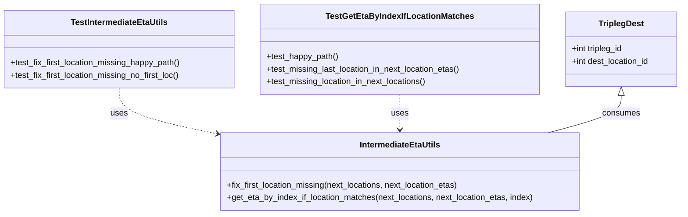

# Diagram: entity_core/entity_service/entity_listener/tests/unit/test_intermediate_eta_utils.py


> Auto-generated by Obscura crawlers

## Diagram 1



### SVG

<svg id="container" width="1320.953125" xmlns="http://www.w3.org/2000/svg" class="classDiagram" height="414" viewBox="0 0 1320.953125 414" role="graphics-document document" aria-roledescription="class"><style>#container{font-family:"trebuchet ms",verdana,arial,sans-serif;font-size:16px;fill:#333;}@keyframes edge-animation-frame{from{stroke-dashoffset:0;}}@keyframes dash{to{stroke-dashoffset:0;}}#container .edge-animation-slow{stroke-dasharray:9,5!important;stroke-dashoffset:900;animation:dash 50s linear infinite;stroke-linecap:round;}#container .edge-animation-fast{stroke-dasharray:9,5!important;stroke-dashoffset:900;animation:dash 20s linear infinite;stroke-linecap:round;}#container .error-icon{fill:#552222;}#container .error-text{fill:#552222;stroke:#552222;}#container .edge-thickness-normal{stroke-width:1px;}#container .edge-thickness-thick{stroke-width:3.5px;}#container .edge-pattern-solid{stroke-dasharray:0;}#container .edge-thickness-invisible{stroke-width:0;fill:none;}#container .edge-pattern-dashed{stroke-dasharray:3;}#container .edge-pattern-dotted{stroke-dasharray:2;}#container .marker{fill:#333333;stroke:#333333;}#container .marker.cross{stroke:#333333;}#container svg{font-family:"trebuchet ms",verdana,arial,sans-serif;font-size:16px;}#container p{margin:0;}#container g.classGroup text{fill:#9370DB;stroke:none;font-family:"trebuchet ms",verdana,arial,sans-serif;font-size:10px;}#container g.classGroup text .title{font-weight:bolder;}#container .nodeLabel,#container .edgeLabel{color:#131300;}#container .edgeLabel .label rect{fill:#ECECFF;}#container .label text{fill:#131300;}#container .labelBkg{background:#ECECFF;}#container .edgeLabel .label span{background:#ECECFF;}#container .classTitle{font-weight:bolder;}#container .node rect,#container .node circle,#container .node ellipse,#container .node polygon,#container .node path{fill:#ECECFF;stroke:#9370DB;stroke-width:1px;}#container .divider{stroke:#9370DB;stroke-width:1;}#container g.clickable{cursor:pointer;}#container g.classGroup rect{fill:#ECECFF;stroke:#9370DB;}#container g.classGroup line{stroke:#9370DB;stroke-width:1;}#container .classLabel .box{stroke:none;stroke-width:0;fill:#ECECFF;opacity:0.5;}#container .classLabel .label{fill:#9370DB;font-size:10px;}#container .relation{stroke:#333333;stroke-width:1;fill:none;}#container .dashed-line{stroke-dasharray:3;}#container .dotted-line{stroke-dasharray:1 2;}#container #compositionStart,#container .composition{fill:#333333!important;stroke:#333333!important;stroke-width:1;}#container #compositionEnd,#container .composition{fill:#333333!important;stroke:#333333!important;stroke-width:1;}#container #dependencyStart,#container .dependency{fill:#333333!important;stroke:#333333!important;stroke-width:1;}#container #dependencyStart,#container .dependency{fill:#333333!important;stroke:#333333!important;stroke-width:1;}#container #extensionStart,#container .extension{fill:transparent!important;stroke:#333333!important;stroke-width:1;}#container #extensionEnd,#container .extension{fill:transparent!important;stroke:#333333!important;stroke-width:1;}#container #aggregationStart,#container .aggregation{fill:transparent!important;stroke:#333333!important;stroke-width:1;}#container #aggregationEnd,#container .aggregation{fill:transparent!important;stroke:#333333!important;stroke-width:1;}#container #lollipopStart,#container .lollipop{fill:#ECECFF!important;stroke:#333333!important;stroke-width:1;}#container #lollipopEnd,#container .lollipop{fill:#ECECFF!important;stroke:#333333!important;stroke-width:1;}#container .edgeTerminals{font-size:11px;line-height:initial;}#container .classTitleText{text-anchor:middle;font-size:18px;fill:#333;}#container .label-icon{display:inline-block;height:1em;overflow:visible;vertical-align:-0.125em;}#container .node .label-icon path{fill:currentColor;stroke:revert;stroke-width:revert;}#container :root{--mermaid-font-family:"trebuchet ms",verdana,arial,sans-serif;}</style><g><defs><marker id="container_class-aggregationStart" class="marker aggregation class" refX="18" refY="7" markerWidth="190" markerHeight="240" orient="auto"><path d="M 18,7 L9,13 L1,7 L9,1 Z"></path></marker></defs><defs><marker id="container_class-aggregationEnd" class="marker aggregation class" refX="1" refY="7" markerWidth="20" markerHeight="28" orient="auto"><path d="M 18,7 L9,13 L1,7 L9,1 Z"></path></marker></defs><defs><marker id="container_class-extensionStart" class="marker extension class" refX="18" refY="7" markerWidth="190" markerHeight="240" orient="auto"><path d="M 1,7 L18,13 V 1 Z"></path></marker></defs><defs><marker id="container_class-extensionEnd" class="marker extension class" refX="1" refY="7" markerWidth="20" markerHeight="28" orient="auto"><path d="M 1,1 V 13 L18,7 Z"></path></marker></defs><defs><marker id="container_class-compositionStart" class="marker composition class" refX="18" refY="7" markerWidth="190" markerHeight="240" orient="auto"><path d="M 18,7 L9,13 L1,7 L9,1 Z"></path></marker></defs><defs><marker id="container_class-compositionEnd" class="marker composition class" refX="1" refY="7" markerWidth="20" markerHeight="28" orient="auto"><path d="M 18,7 L9,13 L1,7 L9,1 Z"></path></marker></defs><defs><marker id="container_class-dependencyStart" class="marker dependency class" refX="6" refY="7" markerWidth="190" markerHeight="240" orient="auto"><path d="M 5,7 L9,13 L1,7 L9,1 Z"></path></marker></defs><defs><marker id="container_class-dependencyEnd" class="marker dependency class" refX="13" refY="7" markerWidth="20" markerHeight="28" orient="auto"><path d="M 18,7 L9,13 L14,7 L9,1 Z"></path></marker></defs><defs><marker id="container_class-lollipopStart" class="marker lollipop class" refX="13" refY="7" markerWidth="190" markerHeight="240" orient="auto"><circle stroke="black" fill="transparent" cx="7" cy="7" r="6"></circle></marker></defs><defs><marker id="container_class-lollipopEnd" class="marker lollipop class" refX="1" refY="7" markerWidth="190" markerHeight="240" orient="auto"><circle stroke="black" fill="transparent" cx="7" cy="7" r="6"></circle></marker></defs><g class="root"><g class="clusters"></g><g class="edgePaths"><path d="M231.641,170L231.641,178.167C231.641,186.333,231.641,202.667,262.895,217.281C294.149,231.896,356.658,244.792,387.912,251.24L419.167,257.688" id="id_TestIntermediateEtaUtils_IntermediateEtaUtils_1" class="edge-thickness-normal edge-pattern-dashed relation" style=";;;" data-edge="true" data-et="edge" data-id="id_TestIntermediateEtaUtils_IntermediateEtaUtils_1" data-points="W3sieCI6MjMxLjY0MDYyNSwieSI6MTcwfSx7IngiOjIzMS42NDA2MjUsInkiOjIxOX0seyJ4Ijo0MjUuMDQyOTY4NzUsInkiOjI1OC45MDA2NDQ3MTU2MzQzN31d" marker-end="url(#container_class-dependencyEnd)"></path><path d="M774.516,182L774.516,188.167C774.516,194.333,774.516,206.667,774.516,218C774.516,229.333,774.516,239.667,774.516,244.833L774.516,250" id="id_TestGetEtaByIndexIfLocationMatches_IntermediateEtaUtils_2" class="edge-thickness-normal edge-pattern-dashed relation" style=";;;" data-edge="true" data-et="edge" data-id="id_TestGetEtaByIndexIfLocationMatches_IntermediateEtaUtils_2" data-points="W3sieCI6Nzc0LjUxNTYyNSwieSI6MTgyfSx7IngiOjc3NC41MTU2MjUsInkiOjIxOX0seyJ4Ijo3NzQuNTE1NjI1LCJ5IjoyNTZ9XQ==" marker-end="url(#container_class-dependencyEnd)"></path><path d="M1203.352,184.25L1203.352,190.042C1203.352,195.833,1203.352,207.417,1179.74,219.375C1156.129,231.333,1108.906,243.667,1085.294,249.833L1061.683,256" id="id_TriplegDest_IntermediateEtaUtils_3" class="edge-thickness-normal edge-pattern-solid relation" style=";;;" data-edge="true" data-et="edge" data-id="id_TriplegDest_IntermediateEtaUtils_3" data-points="W3sieCI6MTIwMy4zNTE1NjI1LCJ5IjoxNjd9LHsieCI6MTIwMy4zNTE1NjI1LCJ5IjoyMTl9LHsieCI6MTA2MS42ODI1NDc0MzMwMzU4LCJ5IjoyNTZ9XQ==" marker-start="url(#container_class-extensionStart)"></path></g><g class="edgeLabels"><g class="edgeLabel" transform="translate(231.640625, 219)"><g class="label" data-id="id_TestIntermediateEtaUtils_IntermediateEtaUtils_1" transform="translate(-16.4921875, -12)"><foreignObject width="32.984375" height="24"><div xmlns="http://www.w3.org/1999/xhtml" class="labelBkg" style="display: table-cell; white-space: nowrap; line-height: 1.5; max-width: 200px; text-align: center;"><span class="edgeLabel"><p>uses</p></span></div></foreignObject></g></g><g class="edgeLabel" transform="translate(774.515625, 219)"><g class="label" data-id="id_TestGetEtaByIndexIfLocationMatches_IntermediateEtaUtils_2" transform="translate(-16.4921875, -12)"><foreignObject width="32.984375" height="24"><div xmlns="http://www.w3.org/1999/xhtml" class="labelBkg" style="display: table-cell; white-space: nowrap; line-height: 1.5; max-width: 200px; text-align: center;"><span class="edgeLabel"><p>uses</p></span></div></foreignObject></g></g><g class="edgeLabel" transform="translate(1203.3515625, 219)"><g class="label" data-id="id_TriplegDest_IntermediateEtaUtils_3" transform="translate(-36.375, -12)"><foreignObject width="72.75" height="24"><div xmlns="http://www.w3.org/1999/xhtml" class="labelBkg" style="display: table-cell; white-space: nowrap; line-height: 1.5; max-width: 200px; text-align: center;"><span class="edgeLabel"><p>consumes</p></span></div></foreignObject></g></g></g><g class="nodes"><g class="node default" id="classId-TriplegDest-0" transform="translate(1203.3515625, 95)"><g class="basic label-container"><path d="M-109.6015625 -72 L109.6015625 -72 L109.6015625 72 L-109.6015625 72" stroke="none" stroke-width="0" fill="#ECECFF" style=""></path><path d="M-109.6015625 -72 C-39.46651284009769 -72, 30.668536819804615 -72, 109.6015625 -72 M-109.6015625 -72 C-55.63736488054551 -72, -1.6731672610910238 -72, 109.6015625 -72 M109.6015625 -72 C109.6015625 -27.395358732194296, 109.6015625 17.209282535611408, 109.6015625 72 M109.6015625 -72 C109.6015625 -28.93444060754078, 109.6015625 14.131118784918442, 109.6015625 72 M109.6015625 72 C26.14574623946521 72, -57.31007002106958 72, -109.6015625 72 M109.6015625 72 C35.50154430013322 72, -38.59847389973356 72, -109.6015625 72 M-109.6015625 72 C-109.6015625 40.60424157494553, -109.6015625 9.208483149891066, -109.6015625 -72 M-109.6015625 72 C-109.6015625 40.6344767239811, -109.6015625 9.268953447962204, -109.6015625 -72" stroke="#9370DB" stroke-width="1.3" fill="none" stroke-dasharray="0 0" style=""></path></g><g class="annotation-group text" transform="translate(0, -48)"></g><g class="label-group text" transform="translate(-42.0625, -48)"><g class="label" style="font-weight: bolder" transform="translate(0,-12)"><foreignObject width="84.125" height="24"><div xmlns="http://www.w3.org/1999/xhtml" style="display: table-cell; white-space: nowrap; line-height: 1.5; max-width: 132px; text-align: center;"><span class="nodeLabel markdown-node-label" style=""><p>TriplegDest</p></span></div></foreignObject></g></g><g class="members-group text" transform="translate(-97.6015625, 0)"><g class="label" style="" transform="translate(0,-12)"><foreignObject width="101.96875" height="24"><div xmlns="http://www.w3.org/1999/xhtml" style="display: table-cell; white-space: nowrap; line-height: 1.5; max-width: 159px; text-align: center;"><span class="nodeLabel markdown-node-label" style=""><p>+int tripleg_id</p></span></div></foreignObject></g><g class="label" style="" transform="translate(0,12)"><foreignObject width="153.140625" height="24"><div xmlns="http://www.w3.org/1999/xhtml" style="display: table-cell; white-space: nowrap; line-height: 1.5; max-width: 211px; text-align: center;"><span class="nodeLabel markdown-node-label" style=""><p>+int dest_location_id</p></span></div></foreignObject></g></g><g class="methods-group text" transform="translate(-97.6015625, 72)"></g><g class="divider" style=""><path d="M-109.6015625 -24 C-34.855180683289376 -24, 39.89120113342125 -24, 109.6015625 -24 M-109.6015625 -24 C-40.38434208214704 -24, 28.832878335705914 -24, 109.6015625 -24" stroke="#9370DB" stroke-width="1.3" fill="none" stroke-dasharray="0 0" style=""></path></g><g class="divider" style=""><path d="M-109.6015625 48 C-41.496688571989594 48, 26.60818535602081 48, 109.6015625 48 M-109.6015625 48 C-60.4029248839778 48, -11.204287267955607 48, 109.6015625 48" stroke="#9370DB" stroke-width="1.3" fill="none" stroke-dasharray="0 0" style=""></path></g></g><g class="node default" id="classId-IntermediateEtaUtils-1" transform="translate(774.515625, 331)"><g class="basic label-container"><path d="M-349.47265625 -75 L349.47265625 -75 L349.47265625 75 L-349.47265625 75" stroke="none" stroke-width="0" fill="#ECECFF" style=""></path><path d="M-349.47265625 -75 C-167.6933878876324 -75, 14.085880474735177 -75, 349.47265625 -75 M-349.47265625 -75 C-166.358306383126 -75, 16.756043483747987 -75, 349.47265625 -75 M349.47265625 -75 C349.47265625 -23.30092797261122, 349.47265625 28.39814405477756, 349.47265625 75 M349.47265625 -75 C349.47265625 -21.10260324247959, 349.47265625 32.79479351504082, 349.47265625 75 M349.47265625 75 C178.60329220844997 75, 7.733928166899943 75, -349.47265625 75 M349.47265625 75 C183.75355123148347 75, 18.03444621296694 75, -349.47265625 75 M-349.47265625 75 C-349.47265625 23.92173259055582, -349.47265625 -27.15653481888836, -349.47265625 -75 M-349.47265625 75 C-349.47265625 42.71538831157348, -349.47265625 10.430776623146954, -349.47265625 -75" stroke="#9370DB" stroke-width="1.3" fill="none" stroke-dasharray="0 0" style=""></path></g><g class="annotation-group text" transform="translate(0, -51)"></g><g class="label-group text" transform="translate(-75.7421875, -51)"><g class="label" style="font-weight: bolder" transform="translate(0,-12)"><foreignObject width="151.484375" height="24"><div xmlns="http://www.w3.org/1999/xhtml" style="display: table-cell; white-space: nowrap; line-height: 1.5; max-width: 200px; text-align: center;"><span class="nodeLabel markdown-node-label" style=""><p>IntermediateEtaUtils</p></span></div></foreignObject></g></g><g class="members-group text" transform="translate(-337.47265625, -3)"></g><g class="methods-group text" transform="translate(-337.47265625, 27)"><g class="label" style="" transform="translate(0,-12)"><foreignObject width="453.859375" height="24"><div xmlns="http://www.w3.org/1999/xhtml" style="display: table-cell; white-space: nowrap; line-height: 1.5; max-width: 511px; text-align: center;"><span class="nodeLabel markdown-node-label" style=""><p>+fix_first_location_missing(next_locations, next_location_etas)</p></span></div></foreignObject></g><g class="label" style="" transform="translate(0,12)"><foreignObject width="599.203125" height="24"><div xmlns="http://www.w3.org/1999/xhtml" style="display: table-cell; white-space: nowrap; line-height: 1.5; max-width: 657px; text-align: center;"><span class="nodeLabel markdown-node-label" style=""><p>+get_eta_by_index_if_location_matches(next_locations, next_location_etas, index)</p></span></div></foreignObject></g></g><g class="divider" style=""><path d="M-349.47265625 -27 C-166.60823215615966 -27, 16.256191937680683 -27, 349.47265625 -27 M-349.47265625 -27 C-89.95862725409245 -27, 169.5554017418151 -27, 349.47265625 -27" stroke="#9370DB" stroke-width="1.3" fill="none" stroke-dasharray="0 0" style=""></path></g><g class="divider" style=""><path d="M-349.47265625 -3 C-196.33566829619915 -3, -43.19868034239829 -3, 349.47265625 -3 M-349.47265625 -3 C-159.2108848633276 -3, 31.050886523344786 -3, 349.47265625 -3" stroke="#9370DB" stroke-width="1.3" fill="none" stroke-dasharray="0 0" style=""></path></g></g><g class="node default" id="classId-TestIntermediateEtaUtils-2" transform="translate(231.640625, 95)"><g class="basic label-container"><path d="M-223.640625 -75 L223.640625 -75 L223.640625 75 L-223.640625 75" stroke="none" stroke-width="0" fill="#ECECFF" style=""></path><path d="M-223.640625 -75 C-71.06624298698591 -75, 81.50813902602818 -75, 223.640625 -75 M-223.640625 -75 C-119.80093838541843 -75, -15.961251770836867 -75, 223.640625 -75 M223.640625 -75 C223.640625 -25.365715214757557, 223.640625 24.268569570484885, 223.640625 75 M223.640625 -75 C223.640625 -19.762744602376394, 223.640625 35.47451079524721, 223.640625 75 M223.640625 75 C84.36872516375652 75, -54.903174672486955 75, -223.640625 75 M223.640625 75 C121.57385001804768 75, 19.507075036095358 75, -223.640625 75 M-223.640625 75 C-223.640625 19.412388745815562, -223.640625 -36.175222508368876, -223.640625 -75 M-223.640625 75 C-223.640625 38.84061363143798, -223.640625 2.6812272628759644, -223.640625 -75" stroke="#9370DB" stroke-width="1.3" fill="none" stroke-dasharray="0 0" style=""></path></g><g class="annotation-group text" transform="translate(0, -51)"></g><g class="label-group text" transform="translate(-90.984375, -51)"><g class="label" style="font-weight: bolder" transform="translate(0,-12)"><foreignObject width="181.96875" height="24"><div xmlns="http://www.w3.org/1999/xhtml" style="display: table-cell; white-space: nowrap; line-height: 1.5; max-width: 229px; text-align: center;"><span class="nodeLabel markdown-node-label" style=""><p>TestIntermediateEtaUtils</p></span></div></foreignObject></g></g><g class="members-group text" transform="translate(-211.640625, -3)"></g><g class="methods-group text" transform="translate(-211.640625, 27)"><g class="label" style="" transform="translate(0,-12)"><foreignObject width="332.296875" height="24"><div xmlns="http://www.w3.org/1999/xhtml" style="display: table-cell; white-space: nowrap; line-height: 1.5; max-width: 390px; text-align: center;"><span class="nodeLabel markdown-node-label" style=""><p>+test_fix_first_location_missing_happy_path()</p></span></div></foreignObject></g><g class="label" style="" transform="translate(0,12)"><foreignObject width="330.90625" height="24"><div xmlns="http://www.w3.org/1999/xhtml" style="display: table-cell; white-space: nowrap; line-height: 1.5; max-width: 388px; text-align: center;"><span class="nodeLabel markdown-node-label" style=""><p>+test_fix_first_location_missing_no_first_loc()</p></span></div></foreignObject></g></g><g class="divider" style=""><path d="M-223.640625 -27 C-124.37019554219741 -27, -25.099766084394815 -27, 223.640625 -27 M-223.640625 -27 C-109.75654361484634 -27, 4.1275377703073275 -27, 223.640625 -27" stroke="#9370DB" stroke-width="1.3" fill="none" stroke-dasharray="0 0" style=""></path></g><g class="divider" style=""><path d="M-223.640625 -3 C-102.51978681690106 -3, 18.60105136619788 -3, 223.640625 -3 M-223.640625 -3 C-51.21440831805697 -3, 121.21180836388606 -3, 223.640625 -3" stroke="#9370DB" stroke-width="1.3" fill="none" stroke-dasharray="0 0" style=""></path></g></g><g class="node default" id="classId-TestGetEtaByIndexIfLocationMatches-3" transform="translate(774.515625, 95)"><g class="basic label-container"><path d="M-269.234375 -87 L269.234375 -87 L269.234375 87 L-269.234375 87" stroke="none" stroke-width="0" fill="#ECECFF" style=""></path><path d="M-269.234375 -87 C-122.83479340684983 -87, 23.564788186300348 -87, 269.234375 -87 M-269.234375 -87 C-59.058894515020285 -87, 151.11658596995943 -87, 269.234375 -87 M269.234375 -87 C269.234375 -42.340433452506325, 269.234375 2.3191330949873503, 269.234375 87 M269.234375 -87 C269.234375 -28.943105484033495, 269.234375 29.11378903193301, 269.234375 87 M269.234375 87 C127.94210686924157 87, -13.35016126151686 87, -269.234375 87 M269.234375 87 C116.0496917614118 87, -37.13499147717641 87, -269.234375 87 M-269.234375 87 C-269.234375 29.046048018996558, -269.234375 -28.907903962006884, -269.234375 -87 M-269.234375 87 C-269.234375 32.599275499110604, -269.234375 -21.801449001778792, -269.234375 -87" stroke="#9370DB" stroke-width="1.3" fill="none" stroke-dasharray="0 0" style=""></path></g><g class="annotation-group text" transform="translate(0, -63)"></g><g class="label-group text" transform="translate(-135.484375, -63)"><g class="label" style="font-weight: bolder" transform="translate(0,-12)"><foreignObject width="270.96875" height="24"><div xmlns="http://www.w3.org/1999/xhtml" style="display: table-cell; white-space: nowrap; line-height: 1.5; max-width: 316px; text-align: center;"><span class="nodeLabel markdown-node-label" style=""><p>TestGetEtaByIndexIfLocationMatches</p></span></div></foreignObject></g></g><g class="members-group text" transform="translate(-257.234375, -15)"></g><g class="methods-group text" transform="translate(-257.234375, 15)"><g class="label" style="" transform="translate(0,-12)"><foreignObject width="140.046875" height="24"><div xmlns="http://www.w3.org/1999/xhtml" style="display: table-cell; white-space: nowrap; line-height: 1.5; max-width: 197px; text-align: center;"><span class="nodeLabel markdown-node-label" style=""><p>+test_happy_path()</p></span></div></foreignObject></g><g class="label" style="" transform="translate(0,12)"><foreignObject width="378.984375" height="24"><div xmlns="http://www.w3.org/1999/xhtml" style="display: table-cell; white-space: nowrap; line-height: 1.5; max-width: 436px; text-align: center;"><span class="nodeLabel markdown-node-label" style=""><p>+test_missing_last_location_in_next_location_etas()</p></span></div></foreignObject></g><g class="label" style="" transform="translate(0,36)"><foreignObject width="313.5" height="24"><div xmlns="http://www.w3.org/1999/xhtml" style="display: table-cell; white-space: nowrap; line-height: 1.5; max-width: 371px; text-align: center;"><span class="nodeLabel markdown-node-label" style=""><p>+test_missing_location_in_next_locations()</p></span></div></foreignObject></g></g><g class="divider" style=""><path d="M-269.234375 -39 C-64.97301701457772 -39, 139.28834097084456 -39, 269.234375 -39 M-269.234375 -39 C-145.72200321168543 -39, -22.209631423370837 -39, 269.234375 -39" stroke="#9370DB" stroke-width="1.3" fill="none" stroke-dasharray="0 0" style=""></path></g><g class="divider" style=""><path d="M-269.234375 -15 C-152.173865883958 -15, -35.113356767915974 -15, 269.234375 -15 M-269.234375 -15 C-160.32373176923574 -15, -51.4130885384715 -15, 269.234375 -15" stroke="#9370DB" stroke-width="1.3" fill="none" stroke-dasharray="0 0" style=""></path></g></g></g></g></g></svg>

## Diagram 2

```mermaid
flowchart TD
A[fix_first_location_missing(next_locations, next_location_etas)] --> B{next_location_etas empty?}
B -->|Yes| C[Create eta entry for first next_location with eta = null]
C --> D[Append remaining next_location_etas as provided]
D --> Z[Return adjusted next_location_etas]
B -->|No| E{first next_location.dest_location_id == next_location_etas[0].locationId?}
E -->|Yes| Z1[Return next_location_etas unchanged]
Z1 --> Z
E -->|No| F[Prepend {"locationId": first_dest_id, "eta": null} to next_location_etas]
F --> G[Shift existing etas to align with subsequent next_locations]
G --> Z
```

> SVG rendering failed for this diagram.

## Diagram 3

```mermaid
flowchart TD
S[get_eta_by_index_if_location_matches(next_locations, next_location_etas, index)] --> I{index < len(next_location_etas)?}
I -->|No| R_none1[Return None]
I -->|Yes| J{index < len(next_locations)?}
J -->|No| R_none1
J -->|Yes| K{next_locations[index].dest_location_id == next_location_etas[index].locationId?}
K -->|Yes| R_ok[Return next_location_etas[index].eta]
K -->|No| L[Mismatch detected -> treat as missing leg]
L --> M[All remaining indices considered missing]
M --> R_none1
```

> SVG rendering failed for this diagram.
