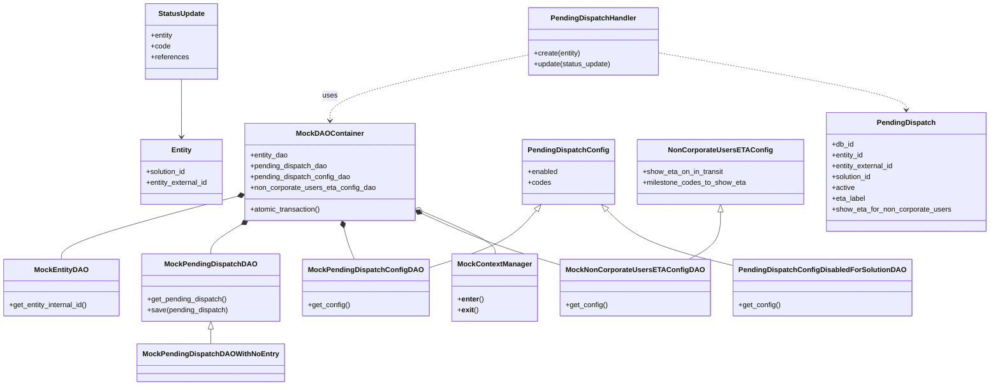

# Diagram: entity_core/entity_service/entity_listener/tests/unit/test_pending_dispatch_handler.py


> Auto-generated by Obscura crawlers

## Diagram 1



### SVG

<svg id="container" width="2142.37109375" xmlns="http://www.w3.org/2000/svg" class="classDiagram" height="856" viewBox="0 0 2142.37109375 856" role="graphics-document document" aria-roledescription="class"><style>#container{font-family:"trebuchet ms",verdana,arial,sans-serif;font-size:16px;fill:#333;}@keyframes edge-animation-frame{from{stroke-dashoffset:0;}}@keyframes dash{to{stroke-dashoffset:0;}}#container .edge-animation-slow{stroke-dasharray:9,5!important;stroke-dashoffset:900;animation:dash 50s linear infinite;stroke-linecap:round;}#container .edge-animation-fast{stroke-dasharray:9,5!important;stroke-dashoffset:900;animation:dash 20s linear infinite;stroke-linecap:round;}#container .error-icon{fill:#552222;}#container .error-text{fill:#552222;stroke:#552222;}#container .edge-thickness-normal{stroke-width:1px;}#container .edge-thickness-thick{stroke-width:3.5px;}#container .edge-pattern-solid{stroke-dasharray:0;}#container .edge-thickness-invisible{stroke-width:0;fill:none;}#container .edge-pattern-dashed{stroke-dasharray:3;}#container .edge-pattern-dotted{stroke-dasharray:2;}#container .marker{fill:#333333;stroke:#333333;}#container .marker.cross{stroke:#333333;}#container svg{font-family:"trebuchet ms",verdana,arial,sans-serif;font-size:16px;}#container p{margin:0;}#container g.classGroup text{fill:#9370DB;stroke:none;font-family:"trebuchet ms",verdana,arial,sans-serif;font-size:10px;}#container g.classGroup text .title{font-weight:bolder;}#container .nodeLabel,#container .edgeLabel{color:#131300;}#container .edgeLabel .label rect{fill:#ECECFF;}#container .label text{fill:#131300;}#container .labelBkg{background:#ECECFF;}#container .edgeLabel .label span{background:#ECECFF;}#container .classTitle{font-weight:bolder;}#container .node rect,#container .node circle,#container .node ellipse,#container .node polygon,#container .node path{fill:#ECECFF;stroke:#9370DB;stroke-width:1px;}#container .divider{stroke:#9370DB;stroke-width:1;}#container g.clickable{cursor:pointer;}#container g.classGroup rect{fill:#ECECFF;stroke:#9370DB;}#container g.classGroup line{stroke:#9370DB;stroke-width:1;}#container .classLabel .box{stroke:none;stroke-width:0;fill:#ECECFF;opacity:0.5;}#container .classLabel .label{fill:#9370DB;font-size:10px;}#container .relation{stroke:#333333;stroke-width:1;fill:none;}#container .dashed-line{stroke-dasharray:3;}#container .dotted-line{stroke-dasharray:1 2;}#container #compositionStart,#container .composition{fill:#333333!important;stroke:#333333!important;stroke-width:1;}#container #compositionEnd,#container .composition{fill:#333333!important;stroke:#333333!important;stroke-width:1;}#container #dependencyStart,#container .dependency{fill:#333333!important;stroke:#333333!important;stroke-width:1;}#container #dependencyStart,#container .dependency{fill:#333333!important;stroke:#333333!important;stroke-width:1;}#container #extensionStart,#container .extension{fill:transparent!important;stroke:#333333!important;stroke-width:1;}#container #extensionEnd,#container .extension{fill:transparent!important;stroke:#333333!important;stroke-width:1;}#container #aggregationStart,#container .aggregation{fill:transparent!important;stroke:#333333!important;stroke-width:1;}#container #aggregationEnd,#container .aggregation{fill:transparent!important;stroke:#333333!important;stroke-width:1;}#container #lollipopStart,#container .lollipop{fill:#ECECFF!important;stroke:#333333!important;stroke-width:1;}#container #lollipopEnd,#container .lollipop{fill:#ECECFF!important;stroke:#333333!important;stroke-width:1;}#container .edgeTerminals{font-size:11px;line-height:initial;}#container .classTitleText{text-anchor:middle;font-size:18px;fill:#333;}#container .label-icon{display:inline-block;height:1em;overflow:visible;vertical-align:-0.125em;}#container .node .label-icon path{fill:currentColor;stroke:revert;stroke-width:revert;}#container :root{--mermaid-font-family:"trebuchet ms",verdana,arial,sans-serif;}</style><g><defs><marker id="container_class-aggregationStart" class="marker aggregation class" refX="18" refY="7" markerWidth="190" markerHeight="240" orient="auto"><path d="M 18,7 L9,13 L1,7 L9,1 Z"></path></marker></defs><defs><marker id="container_class-aggregationEnd" class="marker aggregation class" refX="1" refY="7" markerWidth="20" markerHeight="28" orient="auto"><path d="M 18,7 L9,13 L1,7 L9,1 Z"></path></marker></defs><defs><marker id="container_class-extensionStart" class="marker extension class" refX="18" refY="7" markerWidth="190" markerHeight="240" orient="auto"><path d="M 1,7 L18,13 V 1 Z"></path></marker></defs><defs><marker id="container_class-extensionEnd" class="marker extension class" refX="1" refY="7" markerWidth="20" markerHeight="28" orient="auto"><path d="M 1,1 V 13 L18,7 Z"></path></marker></defs><defs><marker id="container_class-compositionStart" class="marker composition class" refX="18" refY="7" markerWidth="190" markerHeight="240" orient="auto"><path d="M 18,7 L9,13 L1,7 L9,1 Z"></path></marker></defs><defs><marker id="container_class-compositionEnd" class="marker composition class" refX="1" refY="7" markerWidth="20" markerHeight="28" orient="auto"><path d="M 18,7 L9,13 L1,7 L9,1 Z"></path></marker></defs><defs><marker id="container_class-dependencyStart" class="marker dependency class" refX="6" refY="7" markerWidth="190" markerHeight="240" orient="auto"><path d="M 5,7 L9,13 L1,7 L9,1 Z"></path></marker></defs><defs><marker id="container_class-dependencyEnd" class="marker dependency class" refX="13" refY="7" markerWidth="20" markerHeight="28" orient="auto"><path d="M 18,7 L9,13 L14,7 L9,1 Z"></path></marker></defs><defs><marker id="container_class-lollipopStart" class="marker lollipop class" refX="13" refY="7" markerWidth="190" markerHeight="240" orient="auto"><circle stroke="black" fill="transparent" cx="7" cy="7" r="6"></circle></marker></defs><defs><marker id="container_class-lollipopEnd" class="marker lollipop class" refX="1" refY="7" markerWidth="190" markerHeight="240" orient="auto"><circle stroke="black" fill="transparent" cx="7" cy="7" r="6"></circle></marker></defs><g class="root"><g class="clusters"></g><g class="edgePaths"><path d="M1161.669,467.712L1152.599,479.593C1143.529,491.474,1125.39,515.237,1086.427,536.753C1047.464,558.269,987.677,577.539,957.784,587.174L927.891,596.808" id="id_PendingDispatchConfig_MockPendingDispatchConfigDAO_1" class="edge-thickness-normal edge-pattern-solid relation" style=";;;" data-edge="true" data-et="edge" data-id="id_PendingDispatchConfig_MockPendingDispatchConfigDAO_1" data-points="W3sieCI6MTE3Mi4xMzU2NzM3NjU5MjM1LCJ5Ijo0NTR9LHsieCI6MTEwNy4yNSwieSI6NTM5fSx7IngiOjkyNy44OTA2MjUsInkiOjU5Ni44MDgzMjk1NTYzMjc3fV0=" marker-start="url(#container_class-extensionStart)"></path><path d="M1309.435,466.344L1321.256,478.453C1333.078,490.562,1356.721,514.781,1399.627,535.236C1442.534,555.69,1504.704,572.381,1535.79,580.726L1566.875,589.071" id="id_PendingDispatchConfig_PendingDispatchConfigDisabledForSolutionDAO_2" class="edge-thickness-normal edge-pattern-solid relation" style=";;;" data-edge="true" data-et="edge" data-id="id_PendingDispatchConfig_PendingDispatchConfigDisabledForSolutionDAO_2" data-points="W3sieCI6MTI5Ny4zODUwNzY2MzIxNjU3LCJ5Ijo0NTR9LHsieCI6MTM4MC4zNjMyODEyNSwieSI6NTM5fSx7IngiOjE1NjYuODc1LCJ5Ijo1ODkuMDcwNzg1MTM4MjY3fV0=" marker-start="url(#container_class-extensionStart)"></path><path d="M1553.629,471.25L1553.629,482.542C1553.629,493.833,1553.629,516.417,1541.886,533.875C1530.144,551.333,1506.659,563.667,1494.917,569.833L1483.174,576" id="id_NonCorporateUsersETAConfig_MockNonCorporateUsersETAConfigDAO_3" class="edge-thickness-normal edge-pattern-solid relation" style=";;;" data-edge="true" data-et="edge" data-id="id_NonCorporateUsersETAConfig_MockNonCorporateUsersETAConfigDAO_3" data-points="W3sieCI6MTU1My42Mjg5MDYyNSwieSI6NDU0fSx7IngiOjE1NTMuNjI4OTA2MjUsInkiOjUzOX0seyJ4IjoxNDgzLjE3NDI1NzgxMjUsInkiOjU3Nn1d" marker-start="url(#container_class-extensionStart)"></path><path d="M465.957,731.25L465.957,732.542C465.957,733.833,465.957,736.417,465.957,741.875C465.957,747.333,465.957,755.667,465.957,759.833L465.957,764" id="id_MockPendingDispatchDAO_MockPendingDispatchDAOWithNoEntry_4" class="edge-thickness-normal edge-pattern-solid relation" style=";;;" data-edge="true" data-et="edge" data-id="id_MockPendingDispatchDAO_MockPendingDispatchDAOWithNoEntry_4" data-points="W3sieCI6NDY1Ljk1NzAzMTI1LCJ5Ijo3MTR9LHsieCI6NDY1Ljk1NzAzMTI1LCJ5Ijo3Mzl9LHsieCI6NDY1Ljk1NzAzMTI1LCJ5Ijo3NjR9XQ==" marker-start="url(#container_class-extensionStart)"></path><path d="M1138.971,122.056L1066.431,137.214C993.892,152.371,848.813,182.685,776.274,207.009C703.734,231.333,703.734,249.667,703.734,258.833L703.734,268" id="id_PendingDispatchHandler_MockDAOContainer_5" class="edge-thickness-normal edge-pattern-dashed relation" style=";;;" data-edge="true" data-et="edge" data-id="id_PendingDispatchHandler_MockDAOContainer_5" data-points="W3sieCI6MTEzOC45NzA3MDMxMjUsInkiOjEyMi4wNTY0NTQwMzM3MDc4Mn0seyJ4Ijo3MDMuNzM0Mzc1LCJ5IjoyMTN9LHsieCI6NzAzLjczNDM3NSwieSI6Mjc0fV0=" marker-end="url(#container_class-dependencyEnd)"></path><path d="M500.571,438.273L439.962,455.061C379.353,471.849,258.136,505.424,197.527,528.379C136.918,551.333,136.918,563.667,136.918,569.833L136.918,576" id="id_MockDAOContainer_MockEntityDAO_6" class="edge-thickness-normal edge-pattern-solid relation" style=";;;" data-edge="true" data-et="edge" data-id="id_MockDAOContainer_MockEntityDAO_6" data-points="W3sieCI6NTE3LjE5NTMxMjUsInkiOjQzMy42Njg2Mzk5NTAzODA3NH0seyJ4IjoxMzYuOTE3OTY4NzUsInkiOjUzOX0seyJ4IjoxMzYuOTE3OTY4NzUsInkiOjU3Nn1d" marker-start="url(#container_class-compositionStart)"></path><path d="M525.773,499.505L515.803,506.087C505.834,512.67,485.896,525.835,475.926,536.584C465.957,547.333,465.957,555.667,465.957,559.833L465.957,564" id="id_MockDAOContainer_MockPendingDispatchDAO_7" class="edge-thickness-normal edge-pattern-solid relation" style=";;;" data-edge="true" data-et="edge" data-id="id_MockDAOContainer_MockPendingDispatchDAO_7" data-points="W3sieCI6NTQwLjE2Nzc5NDU4NTk4NzMsInkiOjQ5MH0seyJ4Ijo0NjUuOTU3MDMxMjUsInkiOjUzOX0seyJ4Ijo0NjUuOTU3MDMxMjUsInkiOjU2NH1d" marker-start="url(#container_class-compositionStart)"></path><path d="M740.718,506.536L742.325,511.947C743.932,517.357,747.146,528.179,751.628,539.756C756.11,551.333,761.86,563.667,764.735,569.833L767.611,576" id="id_MockDAOContainer_MockPendingDispatchConfigDAO_8" class="edge-thickness-normal edge-pattern-solid relation" style=";;;" data-edge="true" data-et="edge" data-id="id_MockDAOContainer_MockPendingDispatchConfigDAO_8" data-points="W3sieCI6NzM1LjgwNzYyMzQwNzY0MzMsInkiOjQ5MH0seyJ4Ijo3NTAuMzU5Mzc1LCJ5Ijo1Mzl9LHsieCI6NzY3LjYxMDYyNSwieSI6NTc2fV0=" marker-start="url(#container_class-compositionStart)"></path><path d="M905.932,475.44L928.856,486.033C951.779,496.627,997.626,517.813,1048.228,537.063C1098.831,556.314,1154.189,573.627,1181.868,582.284L1209.547,590.941" id="id_MockDAOContainer_MockNonCorporateUsersETAConfigDAO_9" class="edge-thickness-normal edge-pattern-solid relation" style=";;;" data-edge="true" data-et="edge" data-id="id_MockDAOContainer_MockNonCorporateUsersETAConfigDAO_9" data-points="W3sieCI6ODkwLjI3MzQzNzUsInkiOjQ2OC4yMDM1MTE0MzQ1ODMxNn0seyJ4IjoxMDQzLjQ3MjY1NjI1LCJ5Ijo1Mzl9LHsieCI6MTIwOS41NDY4NzUsInkiOjU5MC45NDA2NzQxMzUzNDAxfV0=" marker-start="url(#container_class-compositionStart)"></path><path d="M906.132,468.61L933.548,480.342C960.963,492.074,1015.794,515.537,1043.13,531.435C1070.466,547.333,1070.307,555.667,1070.228,559.833L1070.148,564" id="id_MockDAOContainer_MockContextManager_10" class="edge-thickness-normal edge-pattern-solid relation" style=";;;" data-edge="true" data-et="edge" data-id="id_MockDAOContainer_MockContextManager_10" data-points="W3sieCI6ODkwLjI3MzQzNzUsInkiOjQ2MS44MjM4Nzg4ODA3OTcyfSx7IngiOjEwNzAuNjI1LCJ5Ijo1Mzl9LHsieCI6MTA3MC4xNDg0Mzc1LCJ5Ijo1NjR9XQ==" marker-start="url(#container_class-aggregationStart)"></path><path d="M374.938,176L374.938,182.167C374.938,188.333,374.938,200.667,374.938,222C374.938,243.333,374.938,273.667,374.938,288.833L374.938,304" id="id_StatusUpdate_Entity_11" class="edge-thickness-normal edge-pattern-solid relation" style=";;;" data-edge="true" data-et="edge" data-id="id_StatusUpdate_Entity_11" data-points="W3sieCI6Mzc0LjkzNzUsInkiOjE3Nn0seyJ4IjozNzQuOTM3NSwieSI6MjEzfSx7IngiOjM3NC45Mzc1LCJ5IjozMTB9XQ==" marker-end="url(#container_class-dependencyEnd)"></path><path d="M1426.658,117.738L1515.392,133.615C1604.126,149.492,1781.594,181.246,1870.328,202.29C1959.063,223.333,1959.063,233.667,1959.063,238.833L1959.063,244" id="id_PendingDispatchHandler_PendingDispatch_12" class="edge-thickness-normal edge-pattern-dashed relation" style=";;;" data-edge="true" data-et="edge" data-id="id_PendingDispatchHandler_PendingDispatch_12" data-points="W3sieCI6MTQyNi42NTgyMDMxMjUsInkiOjExNy43Mzc3MzYwNzI0ODE3Mn0seyJ4IjoxOTU5LjA2MjUsInkiOjIxM30seyJ4IjoxOTU5LjA2MjUsInkiOjI1MH1d" marker-end="url(#container_class-dependencyEnd)"></path></g><g class="edgeLabels"><g class="edgeLabel"><g class="label" data-id="id_PendingDispatchConfig_MockPendingDispatchConfigDAO_1" transform="translate(0, 0)"><foreignObject width="0" height="0"><div xmlns="http://www.w3.org/1999/xhtml" class="labelBkg" style="display: table-cell; white-space: nowrap; line-height: 1.5; max-width: 200px; text-align: center;"><span class="edgeLabel"></span></div></foreignObject></g></g><g class="edgeLabel"><g class="label" data-id="id_PendingDispatchConfig_PendingDispatchConfigDisabledForSolutionDAO_2" transform="translate(0, 0)"><foreignObject width="0" height="0"><div xmlns="http://www.w3.org/1999/xhtml" class="labelBkg" style="display: table-cell; white-space: nowrap; line-height: 1.5; max-width: 200px; text-align: center;"><span class="edgeLabel"></span></div></foreignObject></g></g><g class="edgeLabel"><g class="label" data-id="id_NonCorporateUsersETAConfig_MockNonCorporateUsersETAConfigDAO_3" transform="translate(0, 0)"><foreignObject width="0" height="0"><div xmlns="http://www.w3.org/1999/xhtml" class="labelBkg" style="display: table-cell; white-space: nowrap; line-height: 1.5; max-width: 200px; text-align: center;"><span class="edgeLabel"></span></div></foreignObject></g></g><g class="edgeLabel"><g class="label" data-id="id_MockPendingDispatchDAO_MockPendingDispatchDAOWithNoEntry_4" transform="translate(0, 0)"><foreignObject width="0" height="0"><div xmlns="http://www.w3.org/1999/xhtml" class="labelBkg" style="display: table-cell; white-space: nowrap; line-height: 1.5; max-width: 200px; text-align: center;"><span class="edgeLabel"></span></div></foreignObject></g></g><g class="edgeLabel" transform="translate(703.734375, 213)"><g class="label" data-id="id_PendingDispatchHandler_MockDAOContainer_5" transform="translate(-16.4921875, -12)"><foreignObject width="32.984375" height="24"><div xmlns="http://www.w3.org/1999/xhtml" class="labelBkg" style="display: table-cell; white-space: nowrap; line-height: 1.5; max-width: 200px; text-align: center;"><span class="edgeLabel"><p>uses</p></span></div></foreignObject></g></g><g class="edgeLabel"><g class="label" data-id="id_MockDAOContainer_MockEntityDAO_6" transform="translate(0, 0)"><foreignObject width="0" height="0"><div xmlns="http://www.w3.org/1999/xhtml" class="labelBkg" style="display: table-cell; white-space: nowrap; line-height: 1.5; max-width: 200px; text-align: center;"><span class="edgeLabel"></span></div></foreignObject></g></g><g class="edgeLabel"><g class="label" data-id="id_MockDAOContainer_MockPendingDispatchDAO_7" transform="translate(0, 0)"><foreignObject width="0" height="0"><div xmlns="http://www.w3.org/1999/xhtml" class="labelBkg" style="display: table-cell; white-space: nowrap; line-height: 1.5; max-width: 200px; text-align: center;"><span class="edgeLabel"></span></div></foreignObject></g></g><g class="edgeLabel"><g class="label" data-id="id_MockDAOContainer_MockPendingDispatchConfigDAO_8" transform="translate(0, 0)"><foreignObject width="0" height="0"><div xmlns="http://www.w3.org/1999/xhtml" class="labelBkg" style="display: table-cell; white-space: nowrap; line-height: 1.5; max-width: 200px; text-align: center;"><span class="edgeLabel"></span></div></foreignObject></g></g><g class="edgeLabel"><g class="label" data-id="id_MockDAOContainer_MockNonCorporateUsersETAConfigDAO_9" transform="translate(0, 0)"><foreignObject width="0" height="0"><div xmlns="http://www.w3.org/1999/xhtml" class="labelBkg" style="display: table-cell; white-space: nowrap; line-height: 1.5; max-width: 200px; text-align: center;"><span class="edgeLabel"></span></div></foreignObject></g></g><g class="edgeLabel"><g class="label" data-id="id_MockDAOContainer_MockContextManager_10" transform="translate(0, 0)"><foreignObject width="0" height="0"><div xmlns="http://www.w3.org/1999/xhtml" class="labelBkg" style="display: table-cell; white-space: nowrap; line-height: 1.5; max-width: 200px; text-align: center;"><span class="edgeLabel"></span></div></foreignObject></g></g><g class="edgeLabel"><g class="label" data-id="id_StatusUpdate_Entity_11" transform="translate(0, 0)"><foreignObject width="0" height="0"><div xmlns="http://www.w3.org/1999/xhtml" class="labelBkg" style="display: table-cell; white-space: nowrap; line-height: 1.5; max-width: 200px; text-align: center;"><span class="edgeLabel"></span></div></foreignObject></g></g><g class="edgeLabel"><g class="label" data-id="id_PendingDispatchHandler_PendingDispatch_12" transform="translate(0, 0)"><foreignObject width="0" height="0"><div xmlns="http://www.w3.org/1999/xhtml" class="labelBkg" style="display: table-cell; white-space: nowrap; line-height: 1.5; max-width: 200px; text-align: center;"><span class="edgeLabel"></span></div></foreignObject></g></g></g><g class="nodes"><g class="node default" id="classId-PendingDispatchHandler-0" transform="translate(1282.814453125, 92)"><g class="basic label-container"><path d="M-143.84375 -75 L143.84375 -75 L143.84375 75 L-143.84375 75" stroke="none" stroke-width="0" fill="#ECECFF" style=""></path><path d="M-143.84375 -75 C-64.99352756342651 -75, 13.856694873146978 -75, 143.84375 -75 M-143.84375 -75 C-64.28612320134822 -75, 15.271503597303564 -75, 143.84375 -75 M143.84375 -75 C143.84375 -27.589037978307232, 143.84375 19.821924043385536, 143.84375 75 M143.84375 -75 C143.84375 -16.030765779942868, 143.84375 42.938468440114264, 143.84375 75 M143.84375 75 C79.16145237659373 75, 14.479154753187458 75, -143.84375 75 M143.84375 75 C74.39266331309952 75, 4.941576626199037 75, -143.84375 75 M-143.84375 75 C-143.84375 37.80307783650492, -143.84375 0.6061556730098374, -143.84375 -75 M-143.84375 75 C-143.84375 38.690696041678315, -143.84375 2.38139208335663, -143.84375 -75" stroke="#9370DB" stroke-width="1.3" fill="none" stroke-dasharray="0 0" style=""></path></g><g class="annotation-group text" transform="translate(0, -51)"></g><g class="label-group text" transform="translate(-90.5625, -51)"><g class="label" style="font-weight: bolder" transform="translate(0,-12)"><foreignObject width="181.125" height="24"><div xmlns="http://www.w3.org/1999/xhtml" style="display: table-cell; white-space: nowrap; line-height: 1.5; max-width: 230px; text-align: center;"><span class="nodeLabel markdown-node-label" style=""><p>PendingDispatchHandler</p></span></div></foreignObject></g></g><g class="members-group text" transform="translate(-131.84375, -3)"></g><g class="methods-group text" transform="translate(-131.84375, 27)"><g class="label" style="" transform="translate(0,-12)"><foreignObject width="105.171875" height="24"><div xmlns="http://www.w3.org/1999/xhtml" style="display: table-cell; white-space: nowrap; line-height: 1.5; max-width: 163px; text-align: center;"><span class="nodeLabel markdown-node-label" style=""><p>+create(entity)</p></span></div></foreignObject></g><g class="label" style="" transform="translate(0,12)"><foreignObject width="173.125" height="24"><div xmlns="http://www.w3.org/1999/xhtml" style="display: table-cell; white-space: nowrap; line-height: 1.5; max-width: 230px; text-align: center;"><span class="nodeLabel markdown-node-label" style=""><p>+update(status_update)</p></span></div></foreignObject></g></g><g class="divider" style=""><path d="M-143.84375 -27 C-46.76074712935372 -27, 50.322255741292565 -27, 143.84375 -27 M-143.84375 -27 C-67.91509447277289 -27, 8.013561054454215 -27, 143.84375 -27" stroke="#9370DB" stroke-width="1.3" fill="none" stroke-dasharray="0 0" style=""></path></g><g class="divider" style=""><path d="M-143.84375 -3 C-40.56922470803835 -3, 62.705300583923304 -3, 143.84375 -3 M-143.84375 -3 C-61.69805737474019 -3, 20.447635250519625 -3, 143.84375 -3" stroke="#9370DB" stroke-width="1.3" fill="none" stroke-dasharray="0 0" style=""></path></g></g><g class="node default" id="classId-Entity-1" transform="translate(374.9375, 382)"><g class="basic label-container"><path d="M-92.2578125 -72 L92.2578125 -72 L92.2578125 72 L-92.2578125 72" stroke="none" stroke-width="0" fill="#ECECFF" style=""></path><path d="M-92.2578125 -72 C-52.57545509437883 -72, -12.893097688757663 -72, 92.2578125 -72 M-92.2578125 -72 C-35.77905740286626 -72, 20.699697694267485 -72, 92.2578125 -72 M92.2578125 -72 C92.2578125 -39.95549539925652, 92.2578125 -7.9109907985130405, 92.2578125 72 M92.2578125 -72 C92.2578125 -31.380400600908217, 92.2578125 9.239198798183565, 92.2578125 72 M92.2578125 72 C39.79158678940692 72, -12.674638921186158 72, -92.2578125 72 M92.2578125 72 C35.71868563501303 72, -20.820441229973937 72, -92.2578125 72 M-92.2578125 72 C-92.2578125 37.436536001194426, -92.2578125 2.8730720023888523, -92.2578125 -72 M-92.2578125 72 C-92.2578125 15.553735502314467, -92.2578125 -40.892528995371066, -92.2578125 -72" stroke="#9370DB" stroke-width="1.3" fill="none" stroke-dasharray="0 0" style=""></path></g><g class="annotation-group text" transform="translate(0, -48)"></g><g class="label-group text" transform="translate(-21.28125, -48)"><g class="label" style="font-weight: bolder" transform="translate(0,-12)"><foreignObject width="42.5625" height="24"><div xmlns="http://www.w3.org/1999/xhtml" style="display: table-cell; white-space: nowrap; line-height: 1.5; max-width: 92px; text-align: center;"><span class="nodeLabel markdown-node-label" style=""><p>Entity</p></span></div></foreignObject></g></g><g class="members-group text" transform="translate(-80.2578125, 0)"><g class="label" style="" transform="translate(0,-12)"><foreignObject width="90.21875" height="24"><div xmlns="http://www.w3.org/1999/xhtml" style="display: table-cell; white-space: nowrap; line-height: 1.5; max-width: 148px; text-align: center;"><span class="nodeLabel markdown-node-label" style=""><p>+solution_id</p></span></div></foreignObject></g><g class="label" style="" transform="translate(0,12)"><foreignObject width="139.234375" height="24"><div xmlns="http://www.w3.org/1999/xhtml" style="display: table-cell; white-space: nowrap; line-height: 1.5; max-width: 197px; text-align: center;"><span class="nodeLabel markdown-node-label" style=""><p>+entity_external_id</p></span></div></foreignObject></g></g><g class="methods-group text" transform="translate(-80.2578125, 72)"></g><g class="divider" style=""><path d="M-92.2578125 -24 C-47.782056975808096 -24, -3.306301451616193 -24, 92.2578125 -24 M-92.2578125 -24 C-23.261780171181826 -24, 45.73425215763635 -24, 92.2578125 -24" stroke="#9370DB" stroke-width="1.3" fill="none" stroke-dasharray="0 0" style=""></path></g><g class="divider" style=""><path d="M-92.2578125 48 C-47.55772534884707 48, -2.8576381976941434 48, 92.2578125 48 M-92.2578125 48 C-32.195087135226295 48, 27.86763822954741 48, 92.2578125 48" stroke="#9370DB" stroke-width="1.3" fill="none" stroke-dasharray="0 0" style=""></path></g></g><g class="node default" id="classId-StatusUpdate-2" transform="translate(374.9375, 92)"><g class="basic label-container"><path d="M-78.828125 -84 L78.828125 -84 L78.828125 84 L-78.828125 84" stroke="none" stroke-width="0" fill="#ECECFF" style=""></path><path d="M-78.828125 -84 C-43.07092776283667 -84, -7.313730525673336 -84, 78.828125 -84 M-78.828125 -84 C-37.74559764957468 -84, 3.3369297008506464 -84, 78.828125 -84 M78.828125 -84 C78.828125 -33.975614759287865, 78.828125 16.04877048142427, 78.828125 84 M78.828125 -84 C78.828125 -28.729158397836393, 78.828125 26.541683204327214, 78.828125 84 M78.828125 84 C19.060723012828802 84, -40.706678974342395 84, -78.828125 84 M78.828125 84 C41.29045258337211 84, 3.752780166744216 84, -78.828125 84 M-78.828125 84 C-78.828125 25.841398838747445, -78.828125 -32.31720232250511, -78.828125 -84 M-78.828125 84 C-78.828125 40.03880379726298, -78.828125 -3.922392405474042, -78.828125 -84" stroke="#9370DB" stroke-width="1.3" fill="none" stroke-dasharray="0 0" style=""></path></g><g class="annotation-group text" transform="translate(0, -60)"></g><g class="label-group text" transform="translate(-50.015625, -60)"><g class="label" style="font-weight: bolder" transform="translate(0,-12)"><foreignObject width="100.03125" height="24"><div xmlns="http://www.w3.org/1999/xhtml" style="display: table-cell; white-space: nowrap; line-height: 1.5; max-width: 148px; text-align: center;"><span class="nodeLabel markdown-node-label" style=""><p>StatusUpdate</p></span></div></foreignObject></g></g><g class="members-group text" transform="translate(-66.828125, -12)"><g class="label" style="" transform="translate(0,-12)"><foreignObject width="49.9375" height="24"><div xmlns="http://www.w3.org/1999/xhtml" style="display: table-cell; white-space: nowrap; line-height: 1.5; max-width: 107px; text-align: center;"><span class="nodeLabel markdown-node-label" style=""><p>+entity</p></span></div></foreignObject></g><g class="label" style="" transform="translate(0,12)"><foreignObject width="42.953125" height="24"><div xmlns="http://www.w3.org/1999/xhtml" style="display: table-cell; white-space: nowrap; line-height: 1.5; max-width: 100px; text-align: center;"><span class="nodeLabel markdown-node-label" style=""><p>+code</p></span></div></foreignObject></g><g class="label" style="" transform="translate(0,36)"><foreignObject width="83.640625" height="24"><div xmlns="http://www.w3.org/1999/xhtml" style="display: table-cell; white-space: nowrap; line-height: 1.5; max-width: 141px; text-align: center;"><span class="nodeLabel markdown-node-label" style=""><p>+references</p></span></div></foreignObject></g></g><g class="methods-group text" transform="translate(-66.828125, 84)"></g><g class="divider" style=""><path d="M-78.828125 -36 C-37.81743798958117 -36, 3.193249020837655 -36, 78.828125 -36 M-78.828125 -36 C-36.806445330085666 -36, 5.215234339828669 -36, 78.828125 -36" stroke="#9370DB" stroke-width="1.3" fill="none" stroke-dasharray="0 0" style=""></path></g><g class="divider" style=""><path d="M-78.828125 60 C-20.618197975586902 60, 37.591729048826195 60, 78.828125 60 M-78.828125 60 C-21.255693530225038 60, 36.316737939549924 60, 78.828125 60" stroke="#9370DB" stroke-width="1.3" fill="none" stroke-dasharray="0 0" style=""></path></g></g><g class="node default" id="classId-PendingDispatch-3" transform="translate(1959.0625, 382)"><g class="basic label-container"><path d="M-175.30859375 -132 L175.30859375 -132 L175.30859375 132 L-175.30859375 132" stroke="none" stroke-width="0" fill="#ECECFF" style=""></path><path d="M-175.30859375 -132 C-75.04294139377862 -132, 25.22271096244276 -132, 175.30859375 -132 M-175.30859375 -132 C-84.2733474241693 -132, 6.761898901661397 -132, 175.30859375 -132 M175.30859375 -132 C175.30859375 -29.54979818285871, 175.30859375 72.90040363428258, 175.30859375 132 M175.30859375 -132 C175.30859375 -61.04286662573371, 175.30859375 9.914266748532583, 175.30859375 132 M175.30859375 132 C52.89436405170942 132, -69.51986564658117 132, -175.30859375 132 M175.30859375 132 C82.13159831690423 132, -11.045397116191538 132, -175.30859375 132 M-175.30859375 132 C-175.30859375 53.154661584911466, -175.30859375 -25.69067683017707, -175.30859375 -132 M-175.30859375 132 C-175.30859375 59.19460388765347, -175.30859375 -13.610792224693057, -175.30859375 -132" stroke="#9370DB" stroke-width="1.3" fill="none" stroke-dasharray="0 0" style=""></path></g><g class="annotation-group text" transform="translate(0, -108)"></g><g class="label-group text" transform="translate(-61.4765625, -108)"><g class="label" style="font-weight: bolder" transform="translate(0,-12)"><foreignObject width="122.953125" height="24"><div xmlns="http://www.w3.org/1999/xhtml" style="display: table-cell; white-space: nowrap; line-height: 1.5; max-width: 172px; text-align: center;"><span class="nodeLabel markdown-node-label" style=""><p>PendingDispatch</p></span></div></foreignObject></g></g><g class="members-group text" transform="translate(-163.30859375, -60)"><g class="label" style="" transform="translate(0,-12)"><foreignObject width="49.140625" height="24"><div xmlns="http://www.w3.org/1999/xhtml" style="display: table-cell; white-space: nowrap; line-height: 1.5; max-width: 107px; text-align: center;"><span class="nodeLabel markdown-node-label" style=""><p>+db_id</p></span></div></foreignObject></g><g class="label" style="" transform="translate(0,12)"><foreignObject width="71.859375" height="24"><div xmlns="http://www.w3.org/1999/xhtml" style="display: table-cell; white-space: nowrap; line-height: 1.5; max-width: 129px; text-align: center;"><span class="nodeLabel markdown-node-label" style=""><p>+entity_id</p></span></div></foreignObject></g><g class="label" style="" transform="translate(0,36)"><foreignObject width="139.234375" height="24"><div xmlns="http://www.w3.org/1999/xhtml" style="display: table-cell; white-space: nowrap; line-height: 1.5; max-width: 197px; text-align: center;"><span class="nodeLabel markdown-node-label" style=""><p>+entity_external_id</p></span></div></foreignObject></g><g class="label" style="" transform="translate(0,60)"><foreignObject width="90.21875" height="24"><div xmlns="http://www.w3.org/1999/xhtml" style="display: table-cell; white-space: nowrap; line-height: 1.5; max-width: 148px; text-align: center;"><span class="nodeLabel markdown-node-label" style=""><p>+solution_id</p></span></div></foreignObject></g><g class="label" style="" transform="translate(0,84)"><foreignObject width="50.921875" height="24"><div xmlns="http://www.w3.org/1999/xhtml" style="display: table-cell; white-space: nowrap; line-height: 1.5; max-width: 108px; text-align: center;"><span class="nodeLabel markdown-node-label" style=""><p>+active</p></span></div></foreignObject></g><g class="label" style="" transform="translate(0,108)"><foreignObject width="75.46875" height="24"><div xmlns="http://www.w3.org/1999/xhtml" style="display: table-cell; white-space: nowrap; line-height: 1.5; max-width: 133px; text-align: center;"><span class="nodeLabel markdown-node-label" style=""><p>+eta_label</p></span></div></foreignObject></g><g class="label" style="" transform="translate(0,132)"><foreignObject width="265.140625" height="24"><div xmlns="http://www.w3.org/1999/xhtml" style="display: table-cell; white-space: nowrap; line-height: 1.5; max-width: 323px; text-align: center;"><span class="nodeLabel markdown-node-label" style=""><p>+show_eta_for_non_corporate_users</p></span></div></foreignObject></g></g><g class="methods-group text" transform="translate(-163.30859375, 132)"></g><g class="divider" style=""><path d="M-175.30859375 -84 C-53.79660965668778 -84, 67.71537443662444 -84, 175.30859375 -84 M-175.30859375 -84 C-86.034861775595 -84, 3.238870198809991 -84, 175.30859375 -84" stroke="#9370DB" stroke-width="1.3" fill="none" stroke-dasharray="0 0" style=""></path></g><g class="divider" style=""><path d="M-175.30859375 108 C-48.546692196097965 108, 78.21520935780407 108, 175.30859375 108 M-175.30859375 108 C-41.97900203609257 108, 91.35058967781487 108, 175.30859375 108" stroke="#9370DB" stroke-width="1.3" fill="none" stroke-dasharray="0 0" style=""></path></g></g><g class="node default" id="classId-PendingDispatchConfig-4" transform="translate(1227.09765625, 382)"><g class="basic label-container"><path d="M-96.40625 -72 L96.40625 -72 L96.40625 72 L-96.40625 72" stroke="none" stroke-width="0" fill="#ECECFF" style=""></path><path d="M-96.40625 -72 C-35.383544946470884 -72, 25.63916010705823 -72, 96.40625 -72 M-96.40625 -72 C-47.99664816304547 -72, 0.41295367390905824 -72, 96.40625 -72 M96.40625 -72 C96.40625 -25.16958750661358, 96.40625 21.660824986772838, 96.40625 72 M96.40625 -72 C96.40625 -20.79628699033676, 96.40625 30.40742601932648, 96.40625 72 M96.40625 72 C40.32835666852767 72, -15.749536662944664 72, -96.40625 72 M96.40625 72 C52.09676708020849 72, 7.787284160416974 72, -96.40625 72 M-96.40625 72 C-96.40625 22.144956669645012, -96.40625 -27.710086660709976, -96.40625 -72 M-96.40625 72 C-96.40625 37.11008178469006, -96.40625 2.2201635693801194, -96.40625 -72" stroke="#9370DB" stroke-width="1.3" fill="none" stroke-dasharray="0 0" style=""></path></g><g class="annotation-group text" transform="translate(0, -48)"></g><g class="label-group text" transform="translate(-84.40625, -48)"><g class="label" style="font-weight: bolder" transform="translate(0,-12)"><foreignObject width="168.8125" height="24"><div xmlns="http://www.w3.org/1999/xhtml" style="display: table-cell; white-space: nowrap; line-height: 1.5; max-width: 217px; text-align: center;"><span class="nodeLabel markdown-node-label" style=""><p>PendingDispatchConfig</p></span></div></foreignObject></g></g><g class="members-group text" transform="translate(-84.40625, 0)"><g class="label" style="" transform="translate(0,-12)"><foreignObject width="67.1875" height="24"><div xmlns="http://www.w3.org/1999/xhtml" style="display: table-cell; white-space: nowrap; line-height: 1.5; max-width: 125px; text-align: center;"><span class="nodeLabel markdown-node-label" style=""><p>+enabled</p></span></div></foreignObject></g><g class="label" style="" transform="translate(0,12)"><foreignObject width="50.421875" height="24"><div xmlns="http://www.w3.org/1999/xhtml" style="display: table-cell; white-space: nowrap; line-height: 1.5; max-width: 108px; text-align: center;"><span class="nodeLabel markdown-node-label" style=""><p>+codes</p></span></div></foreignObject></g></g><g class="methods-group text" transform="translate(-84.40625, 72)"></g><g class="divider" style=""><path d="M-96.40625 -24 C-42.344679359682175 -24, 11.71689128063565 -24, 96.40625 -24 M-96.40625 -24 C-37.82170588694711 -24, 20.762838226105785 -24, 96.40625 -24" stroke="#9370DB" stroke-width="1.3" fill="none" stroke-dasharray="0 0" style=""></path></g><g class="divider" style=""><path d="M-96.40625 48 C-20.841259928225398 48, 54.723730143549204 48, 96.40625 48 M-96.40625 48 C-29.77955090747433 48, 36.84714818505134 48, 96.40625 48" stroke="#9370DB" stroke-width="1.3" fill="none" stroke-dasharray="0 0" style=""></path></g></g><g class="node default" id="classId-NonCorporateUsersETAConfig-5" transform="translate(1553.62890625, 382)"><g class="basic label-container"><path d="M-180.125 -72 L180.125 -72 L180.125 72 L-180.125 72" stroke="none" stroke-width="0" fill="#ECECFF" style=""></path><path d="M-180.125 -72 C-106.6045483976846 -72, -33.08409679536919 -72, 180.125 -72 M-180.125 -72 C-57.35113669070361 -72, 65.42272661859278 -72, 180.125 -72 M180.125 -72 C180.125 -19.325954314649096, 180.125 33.34809137070181, 180.125 72 M180.125 -72 C180.125 -23.697816718234655, 180.125 24.60436656353069, 180.125 72 M180.125 72 C74.68577657522232 72, -30.75344684955536 72, -180.125 72 M180.125 72 C58.614013208782936 72, -62.89697358243413 72, -180.125 72 M-180.125 72 C-180.125 31.55222449460365, -180.125 -8.895551010792701, -180.125 -72 M-180.125 72 C-180.125 20.534087268429232, -180.125 -30.931825463141536, -180.125 -72" stroke="#9370DB" stroke-width="1.3" fill="none" stroke-dasharray="0 0" style=""></path></g><g class="annotation-group text" transform="translate(0, -48)"></g><g class="label-group text" transform="translate(-107.15625, -48)"><g class="label" style="font-weight: bolder" transform="translate(0,-12)"><foreignObject width="214.3125" height="24"><div xmlns="http://www.w3.org/1999/xhtml" style="display: table-cell; white-space: nowrap; line-height: 1.5; max-width: 262px; text-align: center;"><span class="nodeLabel markdown-node-label" style=""><p>NonCorporateUsersETAConfig</p></span></div></foreignObject></g></g><g class="members-group text" transform="translate(-168.125, 0)"><g class="label" style="" transform="translate(0,-12)"><foreignObject width="180.578125" height="24"><div xmlns="http://www.w3.org/1999/xhtml" style="display: table-cell; white-space: nowrap; line-height: 1.5; max-width: 238px; text-align: center;"><span class="nodeLabel markdown-node-label" style=""><p>+show_eta_on_in_transit</p></span></div></foreignObject></g><g class="label" style="" transform="translate(0,12)"><foreignObject width="229.09375" height="24"><div xmlns="http://www.w3.org/1999/xhtml" style="display: table-cell; white-space: nowrap; line-height: 1.5; max-width: 286px; text-align: center;"><span class="nodeLabel markdown-node-label" style=""><p>+milestone_codes_to_show_eta</p></span></div></foreignObject></g></g><g class="methods-group text" transform="translate(-168.125, 72)"></g><g class="divider" style=""><path d="M-180.125 -24 C-73.85195823567666 -24, 32.421083528646676 -24, 180.125 -24 M-180.125 -24 C-79.08378748085401 -24, 21.957425038291973 -24, 180.125 -24" stroke="#9370DB" stroke-width="1.3" fill="none" stroke-dasharray="0 0" style=""></path></g><g class="divider" style=""><path d="M-180.125 48 C-104.5684519353295 48, -29.01190387065901 48, 180.125 48 M-180.125 48 C-63.11435454155529 48, 53.89629091688943 48, 180.125 48" stroke="#9370DB" stroke-width="1.3" fill="none" stroke-dasharray="0 0" style=""></path></g></g><g class="node default" id="classId-MockDAOContainer-6" transform="translate(703.734375, 382)"><g class="basic label-container"><path d="M-186.5390625 -108 L186.5390625 -108 L186.5390625 108 L-186.5390625 108" stroke="none" stroke-width="0" fill="#ECECFF" style=""></path><path d="M-186.5390625 -108 C-98.93427590965487 -108, -11.329489319309744 -108, 186.5390625 -108 M-186.5390625 -108 C-80.25417345309272 -108, 26.030715593814563 -108, 186.5390625 -108 M186.5390625 -108 C186.5390625 -26.712453810655475, 186.5390625 54.57509237868905, 186.5390625 108 M186.5390625 -108 C186.5390625 -24.829858780460768, 186.5390625 58.340282439078464, 186.5390625 108 M186.5390625 108 C57.3885640131376 108, -71.7619344737248 108, -186.5390625 108 M186.5390625 108 C83.84017758686872 108, -18.85870732626256 108, -186.5390625 108 M-186.5390625 108 C-186.5390625 41.83732470159063, -186.5390625 -24.325350596818737, -186.5390625 -108 M-186.5390625 108 C-186.5390625 29.562717491461797, -186.5390625 -48.87456501707641, -186.5390625 -108" stroke="#9370DB" stroke-width="1.3" fill="none" stroke-dasharray="0 0" style=""></path></g><g class="annotation-group text" transform="translate(0, -84)"></g><g class="label-group text" transform="translate(-70.109375, -84)"><g class="label" style="font-weight: bolder" transform="translate(0,-12)"><foreignObject width="140.21875" height="24"><div xmlns="http://www.w3.org/1999/xhtml" style="display: table-cell; white-space: nowrap; line-height: 1.5; max-width: 189px; text-align: center;"><span class="nodeLabel markdown-node-label" style=""><p>MockDAOContainer</p></span></div></foreignObject></g></g><g class="members-group text" transform="translate(-174.5390625, -36)"><g class="label" style="" transform="translate(0,-12)"><foreignObject width="85.078125" height="24"><div xmlns="http://www.w3.org/1999/xhtml" style="display: table-cell; white-space: nowrap; line-height: 1.5; max-width: 142px; text-align: center;"><span class="nodeLabel markdown-node-label" style=""><p>+entity_dao</p></span></div></foreignObject></g><g class="label" style="" transform="translate(0,12)"><foreignObject width="173.203125" height="24"><div xmlns="http://www.w3.org/1999/xhtml" style="display: table-cell; white-space: nowrap; line-height: 1.5; max-width: 231px; text-align: center;"><span class="nodeLabel markdown-node-label" style=""><p>+pending_dispatch_dao</p></span></div></foreignObject></g><g class="label" style="" transform="translate(0,36)"><foreignObject width="224.84375" height="24"><div xmlns="http://www.w3.org/1999/xhtml" style="display: table-cell; white-space: nowrap; line-height: 1.5; max-width: 282px; text-align: center;"><span class="nodeLabel markdown-node-label" style=""><p>+pending_dispatch_config_dao</p></span></div></foreignObject></g><g class="label" style="" transform="translate(0,60)"><foreignObject width="278.96875" height="24"><div xmlns="http://www.w3.org/1999/xhtml" style="display: table-cell; white-space: nowrap; line-height: 1.5; max-width: 336px; text-align: center;"><span class="nodeLabel markdown-node-label" style=""><p>+non_corporate_users_eta_config_dao</p></span></div></foreignObject></g></g><g class="methods-group text" transform="translate(-174.5390625, 84)"><g class="label" style="" transform="translate(0,-12)"><foreignObject width="157.71875" height="24"><div xmlns="http://www.w3.org/1999/xhtml" style="display: table-cell; white-space: nowrap; line-height: 1.5; max-width: 215px; text-align: center;"><span class="nodeLabel markdown-node-label" style=""><p>+atomic_transaction()</p></span></div></foreignObject></g></g><g class="divider" style=""><path d="M-186.5390625 -60 C-84.2521308579991 -60, 18.03480078400179 -60, 186.5390625 -60 M-186.5390625 -60 C-98.57445944961275 -60, -10.609856399225492 -60, 186.5390625 -60" stroke="#9370DB" stroke-width="1.3" fill="none" stroke-dasharray="0 0" style=""></path></g><g class="divider" style=""><path d="M-186.5390625 60 C-53.515157944786864 60, 79.50874661042627 60, 186.5390625 60 M-186.5390625 60 C-55.90349177845832 60, 74.73207894308337 60, 186.5390625 60" stroke="#9370DB" stroke-width="1.3" fill="none" stroke-dasharray="0 0" style=""></path></g></g><g class="node default" id="classId-MockPendingDispatchDAO-7" transform="translate(465.95703125, 639)"><g class="basic label-container"><path d="M-150.12109375 -75 L150.12109375 -75 L150.12109375 75 L-150.12109375 75" stroke="none" stroke-width="0" fill="#ECECFF" style=""></path><path d="M-150.12109375 -75 C-31.202714812712912 -75, 87.71566412457418 -75, 150.12109375 -75 M-150.12109375 -75 C-48.25325690053704 -75, 53.61457994892592 -75, 150.12109375 -75 M150.12109375 -75 C150.12109375 -41.53545087452246, 150.12109375 -8.070901749044921, 150.12109375 75 M150.12109375 -75 C150.12109375 -16.086007959784205, 150.12109375 42.82798408043159, 150.12109375 75 M150.12109375 75 C48.46195154956747 75, -53.19719065086505 75, -150.12109375 75 M150.12109375 75 C44.01747917514905 75, -62.0861353997019 75, -150.12109375 75 M-150.12109375 75 C-150.12109375 30.597542591130363, -150.12109375 -13.804914817739274, -150.12109375 -75 M-150.12109375 75 C-150.12109375 26.74478463285117, -150.12109375 -21.510430734297657, -150.12109375 -75" stroke="#9370DB" stroke-width="1.3" fill="none" stroke-dasharray="0 0" style=""></path></g><g class="annotation-group text" transform="translate(0, -51)"></g><g class="label-group text" transform="translate(-95.9765625, -51)"><g class="label" style="font-weight: bolder" transform="translate(0,-12)"><foreignObject width="191.953125" height="24"><div xmlns="http://www.w3.org/1999/xhtml" style="display: table-cell; white-space: nowrap; line-height: 1.5; max-width: 239px; text-align: center;"><span class="nodeLabel markdown-node-label" style=""><p>MockPendingDispatchDAO</p></span></div></foreignObject></g></g><g class="members-group text" transform="translate(-138.12109375, -3)"></g><g class="methods-group text" transform="translate(-138.12109375, 27)"><g class="label" style="" transform="translate(0,-12)"><foreignObject width="178.84375" height="24"><div xmlns="http://www.w3.org/1999/xhtml" style="display: table-cell; white-space: nowrap; line-height: 1.5; max-width: 236px; text-align: center;"><span class="nodeLabel markdown-node-label" style=""><p>+get_pending_dispatch()</p></span></div></foreignObject></g><g class="label" style="" transform="translate(0,12)"><foreignObject width="180.265625" height="24"><div xmlns="http://www.w3.org/1999/xhtml" style="display: table-cell; white-space: nowrap; line-height: 1.5; max-width: 238px; text-align: center;"><span class="nodeLabel markdown-node-label" style=""><p>+save(pending_dispatch)</p></span></div></foreignObject></g></g><g class="divider" style=""><path d="M-150.12109375 -27 C-76.34861089870111 -27, -2.5761280474022215 -27, 150.12109375 -27 M-150.12109375 -27 C-86.6466635715606 -27, -23.17223339312119 -27, 150.12109375 -27" stroke="#9370DB" stroke-width="1.3" fill="none" stroke-dasharray="0 0" style=""></path></g><g class="divider" style=""><path d="M-150.12109375 -3 C-71.04536035987326 -3, 8.030373030253486 -3, 150.12109375 -3 M-150.12109375 -3 C-35.87073923943673 -3, 78.37961527112654 -3, 150.12109375 -3" stroke="#9370DB" stroke-width="1.3" fill="none" stroke-dasharray="0 0" style=""></path></g></g><g class="node default" id="classId-MockPendingDispatchDAOWithNoEntry-8" transform="translate(465.95703125, 806)"><g class="basic label-container"><path d="M-153.875 -42 L153.875 -42 L153.875 42 L-153.875 42" stroke="none" stroke-width="0" fill="#ECECFF" style=""></path><path d="M-153.875 -42 C-36.14295639947673 -42, 81.58908720104654 -42, 153.875 -42 M-153.875 -42 C-52.60936178395987 -42, 48.65627643208026 -42, 153.875 -42 M153.875 -42 C153.875 -18.602767214166516, 153.875 4.794465571666969, 153.875 42 M153.875 -42 C153.875 -19.53322645083424, 153.875 2.9335470983315233, 153.875 42 M153.875 42 C74.0451303673319 42, -5.7847392653362135 42, -153.875 42 M153.875 42 C32.663984130720294 42, -88.54703173855941 42, -153.875 42 M-153.875 42 C-153.875 23.53887379193209, -153.875 5.077747583864181, -153.875 -42 M-153.875 42 C-153.875 15.72965225946049, -153.875 -10.54069548107902, -153.875 -42" stroke="#9370DB" stroke-width="1.3" fill="none" stroke-dasharray="0 0" style=""></path></g><g class="annotation-group text" transform="translate(0, -18)"></g><g class="label-group text" transform="translate(-141.875, -18)"><g class="label" style="font-weight: bolder" transform="translate(0,-12)"><foreignObject width="283.75" height="24"><div xmlns="http://www.w3.org/1999/xhtml" style="display: table-cell; white-space: nowrap; line-height: 1.5; max-width: 330px; text-align: center;"><span class="nodeLabel markdown-node-label" style=""><p>MockPendingDispatchDAOWithNoEntry</p></span></div></foreignObject></g></g><g class="members-group text" transform="translate(-141.875, 30)"></g><g class="methods-group text" transform="translate(-141.875, 60)"></g><g class="divider" style=""><path d="M-153.875 6 C-71.74351360369246 6, 10.387972792615074 6, 153.875 6 M-153.875 6 C-75.45297459162958 6, 2.9690508167408325 6, 153.875 6" stroke="#9370DB" stroke-width="1.3" fill="none" stroke-dasharray="0 0" style=""></path></g><g class="divider" style=""><path d="M-153.875 24 C-85.41688783905497 24, -16.95877567810993 24, 153.875 24 M-153.875 24 C-31.413167528751018 24, 91.04866494249796 24, 153.875 24" stroke="#9370DB" stroke-width="1.3" fill="none" stroke-dasharray="0 0" style=""></path></g></g><g class="node default" id="classId-MockEntityDAO-9" transform="translate(136.91796875, 639)"><g class="basic label-container"><path d="M-128.91796875 -63 L128.91796875 -63 L128.91796875 63 L-128.91796875 63" stroke="none" stroke-width="0" fill="#ECECFF" style=""></path><path d="M-128.91796875 -63 C-39.34908646169697 -63, 50.21979582660606 -63, 128.91796875 -63 M-128.91796875 -63 C-52.40355324486285 -63, 24.110862260274303 -63, 128.91796875 -63 M128.91796875 -63 C128.91796875 -22.824093999225354, 128.91796875 17.35181200154929, 128.91796875 63 M128.91796875 -63 C128.91796875 -36.18591568710643, 128.91796875 -9.371831374212867, 128.91796875 63 M128.91796875 63 C55.765780244458554 63, -17.38640826108289 63, -128.91796875 63 M128.91796875 63 C52.52372381830999 63, -23.870521113380022 63, -128.91796875 63 M-128.91796875 63 C-128.91796875 21.41700225070732, -128.91796875 -20.16599549858536, -128.91796875 -63 M-128.91796875 63 C-128.91796875 33.053955544477475, -128.91796875 3.107911088954957, -128.91796875 -63" stroke="#9370DB" stroke-width="1.3" fill="none" stroke-dasharray="0 0" style=""></path></g><g class="annotation-group text" transform="translate(0, -39)"></g><g class="label-group text" transform="translate(-55.7890625, -39)"><g class="label" style="font-weight: bolder" transform="translate(0,-12)"><foreignObject width="111.578125" height="24"><div xmlns="http://www.w3.org/1999/xhtml" style="display: table-cell; white-space: nowrap; line-height: 1.5; max-width: 160px; text-align: center;"><span class="nodeLabel markdown-node-label" style=""><p>MockEntityDAO</p></span></div></foreignObject></g></g><g class="members-group text" transform="translate(-116.91796875, 9)"></g><g class="methods-group text" transform="translate(-116.91796875, 39)"><g class="label" style="" transform="translate(0,-12)"><foreignObject width="178.046875" height="24"><div xmlns="http://www.w3.org/1999/xhtml" style="display: table-cell; white-space: nowrap; line-height: 1.5; max-width: 235px; text-align: center;"><span class="nodeLabel markdown-node-label" style=""><p>+get_entity_internal_id()</p></span></div></foreignObject></g></g><g class="divider" style=""><path d="M-128.91796875 -15 C-65.72292234275993 -15, -2.527875935519859 -15, 128.91796875 -15 M-128.91796875 -15 C-74.80759001321351 -15, -20.697211276427012 -15, 128.91796875 -15" stroke="#9370DB" stroke-width="1.3" fill="none" stroke-dasharray="0 0" style=""></path></g><g class="divider" style=""><path d="M-128.91796875 9 C-32.80860067658192 9, 63.300767396836164 9, 128.91796875 9 M-128.91796875 9 C-72.99186300049038 9, -17.06575725098078 9, 128.91796875 9" stroke="#9370DB" stroke-width="1.3" fill="none" stroke-dasharray="0 0" style=""></path></g></g><g class="node default" id="classId-MockPendingDispatchConfigDAO-10" transform="translate(796.984375, 639)"><g class="basic label-container"><path d="M-130.90625 -63 L130.90625 -63 L130.90625 63 L-130.90625 63" stroke="none" stroke-width="0" fill="#ECECFF" style=""></path><path d="M-130.90625 -63 C-63.26725587541287 -63, 4.371738249174257 -63, 130.90625 -63 M-130.90625 -63 C-48.86393225327433 -63, 33.178385493451344 -63, 130.90625 -63 M130.90625 -63 C130.90625 -24.1883739937318, 130.90625 14.623252012536398, 130.90625 63 M130.90625 -63 C130.90625 -30.695139229270893, 130.90625 1.6097215414582138, 130.90625 63 M130.90625 63 C29.676919999513345 63, -71.55241000097331 63, -130.90625 63 M130.90625 63 C36.055251600407615 63, -58.79574679918477 63, -130.90625 63 M-130.90625 63 C-130.90625 16.211539782299788, -130.90625 -30.576920435400424, -130.90625 -63 M-130.90625 63 C-130.90625 12.667452618080688, -130.90625 -37.665094763838624, -130.90625 -63" stroke="#9370DB" stroke-width="1.3" fill="none" stroke-dasharray="0 0" style=""></path></g><g class="annotation-group text" transform="translate(0, -39)"></g><g class="label-group text" transform="translate(-118.90625, -39)"><g class="label" style="font-weight: bolder" transform="translate(0,-12)"><foreignObject width="237.8125" height="24"><div xmlns="http://www.w3.org/1999/xhtml" style="display: table-cell; white-space: nowrap; line-height: 1.5; max-width: 284px; text-align: center;"><span class="nodeLabel markdown-node-label" style=""><p>MockPendingDispatchConfigDAO</p></span></div></foreignObject></g></g><g class="members-group text" transform="translate(-118.90625, 9)"></g><g class="methods-group text" transform="translate(-118.90625, 39)"><g class="label" style="" transform="translate(0,-12)"><foreignObject width="92.484375" height="24"><div xmlns="http://www.w3.org/1999/xhtml" style="display: table-cell; white-space: nowrap; line-height: 1.5; max-width: 150px; text-align: center;"><span class="nodeLabel markdown-node-label" style=""><p>+get_config()</p></span></div></foreignObject></g></g><g class="divider" style=""><path d="M-130.90625 -15 C-37.601082555405654 -15, 55.70408488918869 -15, 130.90625 -15 M-130.90625 -15 C-75.52134854752455 -15, -20.136447095049093 -15, 130.90625 -15" stroke="#9370DB" stroke-width="1.3" fill="none" stroke-dasharray="0 0" style=""></path></g><g class="divider" style=""><path d="M-130.90625 9 C-77.95635340136954 9, -25.00645680273908 9, 130.90625 9 M-130.90625 9 C-27.095780575249762 9, 76.71468884950048 9, 130.90625 9" stroke="#9370DB" stroke-width="1.3" fill="none" stroke-dasharray="0 0" style=""></path></g></g><g class="node default" id="classId-PendingDispatchConfigDisabledForSolutionDAO-11" transform="translate(1752.859375, 639)"><g class="basic label-container"><path d="M-185.984375 -63 L185.984375 -63 L185.984375 63 L-185.984375 63" stroke="none" stroke-width="0" fill="#ECECFF" style=""></path><path d="M-185.984375 -63 C-85.25679468753304 -63, 15.47078562493391 -63, 185.984375 -63 M-185.984375 -63 C-103.79516051680898 -63, -21.605946033617954 -63, 185.984375 -63 M185.984375 -63 C185.984375 -32.447496758624524, 185.984375 -1.8949935172490413, 185.984375 63 M185.984375 -63 C185.984375 -19.94450752913113, 185.984375 23.11098494173774, 185.984375 63 M185.984375 63 C104.33184491384087 63, 22.679314827681736 63, -185.984375 63 M185.984375 63 C104.43791564941624 63, 22.89145629883248 63, -185.984375 63 M-185.984375 63 C-185.984375 23.80935294913835, -185.984375 -15.381294101723299, -185.984375 -63 M-185.984375 63 C-185.984375 17.57300062163216, -185.984375 -27.853998756735677, -185.984375 -63" stroke="#9370DB" stroke-width="1.3" fill="none" stroke-dasharray="0 0" style=""></path></g><g class="annotation-group text" transform="translate(0, -39)"></g><g class="label-group text" transform="translate(-173.984375, -39)"><g class="label" style="font-weight: bolder" transform="translate(0,-12)"><foreignObject width="347.96875" height="24"><div xmlns="http://www.w3.org/1999/xhtml" style="display: table-cell; white-space: nowrap; line-height: 1.5; max-width: 394px; text-align: center;"><span class="nodeLabel markdown-node-label" style=""><p>PendingDispatchConfigDisabledForSolutionDAO</p></span></div></foreignObject></g></g><g class="members-group text" transform="translate(-173.984375, 9)"></g><g class="methods-group text" transform="translate(-173.984375, 39)"><g class="label" style="" transform="translate(0,-12)"><foreignObject width="92.484375" height="24"><div xmlns="http://www.w3.org/1999/xhtml" style="display: table-cell; white-space: nowrap; line-height: 1.5; max-width: 150px; text-align: center;"><span class="nodeLabel markdown-node-label" style=""><p>+get_config()</p></span></div></foreignObject></g></g><g class="divider" style=""><path d="M-185.984375 -15 C-49.966381848786796 -15, 86.05161130242641 -15, 185.984375 -15 M-185.984375 -15 C-48.38214180494259 -15, 89.22009139011482 -15, 185.984375 -15" stroke="#9370DB" stroke-width="1.3" fill="none" stroke-dasharray="0 0" style=""></path></g><g class="divider" style=""><path d="M-185.984375 9 C-80.01347009953041 9, 25.957434800939183 9, 185.984375 9 M-185.984375 9 C-76.86102865529026 9, 32.26231768941949 9, 185.984375 9" stroke="#9370DB" stroke-width="1.3" fill="none" stroke-dasharray="0 0" style=""></path></g></g><g class="node default" id="classId-MockNonCorporateUsersETAConfigDAO-12" transform="translate(1363.2109375, 639)"><g class="basic label-container"><path d="M-153.6640625 -63 L153.6640625 -63 L153.6640625 63 L-153.6640625 63" stroke="none" stroke-width="0" fill="#ECECFF" style=""></path><path d="M-153.6640625 -63 C-80.72884497590073 -63, -7.793627451801456 -63, 153.6640625 -63 M-153.6640625 -63 C-63.48137673046615 -63, 26.701309039067695 -63, 153.6640625 -63 M153.6640625 -63 C153.6640625 -19.742203804987312, 153.6640625 23.515592390025375, 153.6640625 63 M153.6640625 -63 C153.6640625 -29.490637428049844, 153.6640625 4.018725143900312, 153.6640625 63 M153.6640625 63 C64.5604909982026 63, -24.54308050359481 63, -153.6640625 63 M153.6640625 63 C56.948315219052944 63, -39.76743206189411 63, -153.6640625 63 M-153.6640625 63 C-153.6640625 25.96908984728789, -153.6640625 -11.06182030542422, -153.6640625 -63 M-153.6640625 63 C-153.6640625 25.782744393370514, -153.6640625 -11.434511213258972, -153.6640625 -63" stroke="#9370DB" stroke-width="1.3" fill="none" stroke-dasharray="0 0" style=""></path></g><g class="annotation-group text" transform="translate(0, -39)"></g><g class="label-group text" transform="translate(-141.6640625, -39)"><g class="label" style="font-weight: bolder" transform="translate(0,-12)"><foreignObject width="283.328125" height="24"><div xmlns="http://www.w3.org/1999/xhtml" style="display: table-cell; white-space: nowrap; line-height: 1.5; max-width: 329px; text-align: center;"><span class="nodeLabel markdown-node-label" style=""><p>MockNonCorporateUsersETAConfigDAO</p></span></div></foreignObject></g></g><g class="members-group text" transform="translate(-141.6640625, 9)"></g><g class="methods-group text" transform="translate(-141.6640625, 39)"><g class="label" style="" transform="translate(0,-12)"><foreignObject width="92.484375" height="24"><div xmlns="http://www.w3.org/1999/xhtml" style="display: table-cell; white-space: nowrap; line-height: 1.5; max-width: 150px; text-align: center;"><span class="nodeLabel markdown-node-label" style=""><p>+get_config()</p></span></div></foreignObject></g></g><g class="divider" style=""><path d="M-153.6640625 -15 C-91.58461532699155 -15, -29.505168153983092 -15, 153.6640625 -15 M-153.6640625 -15 C-52.585161257630304 -15, 48.49373998473939 -15, 153.6640625 -15" stroke="#9370DB" stroke-width="1.3" fill="none" stroke-dasharray="0 0" style=""></path></g><g class="divider" style=""><path d="M-153.6640625 9 C-33.61402818095054 9, 86.43600613809892 9, 153.6640625 9 M-153.6640625 9 C-62.04555651627993 9, 29.57294946744014 9, 153.6640625 9" stroke="#9370DB" stroke-width="1.3" fill="none" stroke-dasharray="0 0" style=""></path></g></g><g class="node default" id="classId-MockContextManager-13" transform="translate(1068.71875, 639)"><g class="basic label-container"><path d="M-90.828125 -75 L90.828125 -75 L90.828125 75 L-90.828125 75" stroke="none" stroke-width="0" fill="#ECECFF" style=""></path><path d="M-90.828125 -75 C-24.20183284753567 -75, 42.42445930492866 -75, 90.828125 -75 M-90.828125 -75 C-45.635851595711316 -75, -0.4435781914226311 -75, 90.828125 -75 M90.828125 -75 C90.828125 -17.786932399961053, 90.828125 39.426135200077894, 90.828125 75 M90.828125 -75 C90.828125 -16.72348603929956, 90.828125 41.55302792140088, 90.828125 75 M90.828125 75 C22.945820485139905 75, -44.93648402972019 75, -90.828125 75 M90.828125 75 C46.73787642311917 75, 2.6476278462383362 75, -90.828125 75 M-90.828125 75 C-90.828125 41.48993172851351, -90.828125 7.979863457027022, -90.828125 -75 M-90.828125 75 C-90.828125 30.719310162518084, -90.828125 -13.561379674963831, -90.828125 -75" stroke="#9370DB" stroke-width="1.3" fill="none" stroke-dasharray="0 0" style=""></path></g><g class="annotation-group text" transform="translate(0, -51)"></g><g class="label-group text" transform="translate(-78.828125, -51)"><g class="label" style="font-weight: bolder" transform="translate(0,-12)"><foreignObject width="157.65625" height="24"><div xmlns="http://www.w3.org/1999/xhtml" style="display: table-cell; white-space: nowrap; line-height: 1.5; max-width: 205px; text-align: center;"><span class="nodeLabel markdown-node-label" style=""><p>MockContextManager</p></span></div></foreignObject></g></g><g class="members-group text" transform="translate(-78.828125, -3)"></g><g class="methods-group text" transform="translate(-78.828125, 27)"><g class="label" style="" transform="translate(0,-12)"><foreignObject width="57.5625" height="24"><div xmlns="http://www.w3.org/1999/xhtml" style="display: table-cell; white-space: nowrap; line-height: 1.5; max-width: 144px; text-align: center;"><span class="nodeLabel markdown-node-label" style=""><p>+<strong>enter</strong>()</p></span></div></foreignObject></g><g class="label" style="" transform="translate(0,12)"><foreignObject width="45.875" height="24"><div xmlns="http://www.w3.org/1999/xhtml" style="display: table-cell; white-space: nowrap; line-height: 1.5; max-width: 134px; text-align: center;"><span class="nodeLabel markdown-node-label" style=""><p>+<strong>exit</strong>()</p></span></div></foreignObject></g></g><g class="divider" style=""><path d="M-90.828125 -27 C-34.011247876465575 -27, 22.80562924706885 -27, 90.828125 -27 M-90.828125 -27 C-35.04078710073017 -27, 20.74655079853966 -27, 90.828125 -27" stroke="#9370DB" stroke-width="1.3" fill="none" stroke-dasharray="0 0" style=""></path></g><g class="divider" style=""><path d="M-90.828125 -3 C-28.58480319661672 -3, 33.65851860676656 -3, 90.828125 -3 M-90.828125 -3 C-29.583458800315924 -3, 31.661207399368152 -3, 90.828125 -3" stroke="#9370DB" stroke-width="1.3" fill="none" stroke-dasharray="0 0" style=""></path></g></g></g></g></g></svg>

## Diagram 2

```mermaid
flowchart TD
  subgraph CreateFlow ["PendingDispatchHandler.create(entity)"]
    CStart([Start: create(entity)]) --> CCheck{Is pending dispatch enabled for solution?}
    CCheck -- No --> CNo[Return 204\nno record created]
    CCheck -- Yes --> CGet[Get existing PendingDispatch\nor prepare new record]
    CGet --> CLabel[Determine eta_label from\nPendingDispatchConfig (DEFAULT or code mapping)]
    CLabel --> CSave[Save PendingDispatch record]
    CSave --> CSuccess[Return 200\nrecord created/updated]
  end

  subgraph UpdateFlow ["PendingDispatchHandler.update(status_update)"]
    UStart([Start: update(status_update)]) --> UCheck{Is pending dispatch enabled for solution?}
    UCheck -- No --> UNo[Return 204\nno processing]
    UCheck -- Yes --> UGet[Get existing PendingDispatch]
    UGet -- NotFound --> UCreate[Create PendingDispatch record]
    UGet -- Found --> UExisting[Use existing PendingDispatch]
    UCreate --> UProc
    UExisting --> UProc
    UProc[Process StatusUpdate:\n- map code -> eta_label if configured\n- inspect references for InTransitToDealer=Y\n- consult NonCorporateUsersETAConfig\n] --> UInTransit{References contain\nInTransitToDealer == "Y"?}
    UInTransit -- Yes --> UClear[Set active = false]
    UInTransit -- No --> UNoChange[Keep active as is]
    UClear --> UNonCorpCheck
    UNoChange --> UNonCorpCheck
    UNonCorpCheck{Enable show_eta_for_non_corporate_users?} -- Yes --> UEnable[Set show_eta_for_non_corporate_users = true]
    UNonCorpCheck -- No --> UKeep[Leave show_eta_for_non_corporate_users]
    UEnable --> USave
    UKeep --> USave
    USave[Save PendingDispatch record] --> UDone[Finish update]
  end

  CSuccess --> UStart
  UDone --> End([End])
```

> SVG rendering failed for this diagram.
