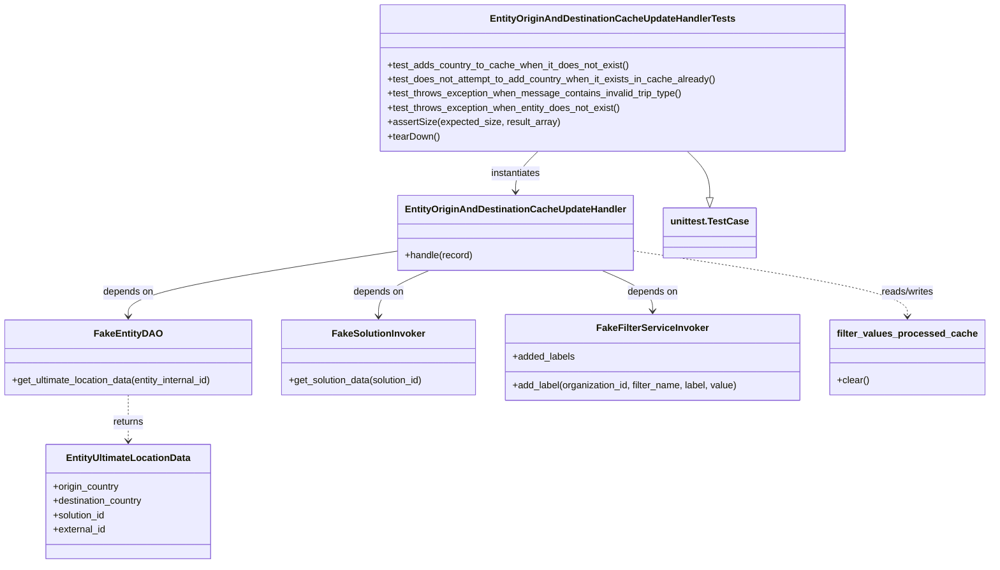
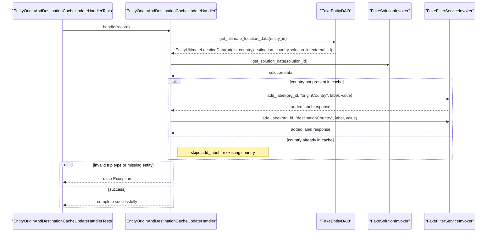

# Diagram: entity_core/entity_service/entity_listener/tests/unit/test_update_entity_origin_and_destination_cache.py

> Auto-generated by Obscura crawlers

## Diagram 1

### SVG

<svg id="container" width="1664.1484375" xmlns="http://www.w3.org/2000/svg" class="classDiagram" height="946" viewBox="0 0 1664.1484375 946" role="graphics-document document" aria-roledescription="class"><g><defs><marker id="container_class-aggregationStart" class="marker aggregation class" refX="18" refY="7" markerWidth="190" markerHeight="240" orient="auto"><path d="M 18,7 L9,13 L1,7 L9,1 Z"></path></marker></defs><defs><marker id="container_class-aggregationEnd" class="marker aggregation class" refX="1" refY="7" markerWidth="20" markerHeight="28" orient="auto"><path d="M 18,7 L9,13 L1,7 L9,1 Z"></path></marker></defs><defs><marker id="container_class-extensionStart" class="marker extension class" refX="18" refY="7" markerWidth="190" markerHeight="240" orient="auto"><path d="M 1,7 L18,13 V 1 Z"></path></marker></defs><defs><marker id="container_class-extensionEnd" class="marker extension class" refX="1" refY="7" markerWidth="20" markerHeight="28" orient="auto"><path d="M 1,1 V 13 L18,7 Z"></path></marker></defs><defs><marker id="container_class-compositionStart" class="marker composition class" refX="18" refY="7" markerWidth="190" markerHeight="240" orient="auto"><path d="M 18,7 L9,13 L1,7 L9,1 Z"></path></marker></defs><defs><marker id="container_class-compositionEnd" class="marker composition class" refX="1" refY="7" markerWidth="20" markerHeight="28" orient="auto"><path d="M 18,7 L9,13 L1,7 L9,1 Z"></path></marker></defs><defs><marker id="container_class-dependencyStart" class="marker dependency class" refX="6" refY="7" markerWidth="190" markerHeight="240" orient="auto"><path d="M 5,7 L9,13 L1,7 L9,1 Z"></path></marker></defs><defs><marker id="container_class-dependencyEnd" class="marker dependency class" refX="13" refY="7" markerWidth="20" markerHeight="28" orient="auto"><path d="M 18,7 L9,13 L14,7 L9,1 Z"></path></marker></defs><defs><marker id="container_class-lollipopStart" class="marker lollipop class" refX="13" refY="7" markerWidth="190" markerHeight="240" orient="auto"><circle stroke="black" fill="transparent" cx="7" cy="7" r="6"></circle></marker></defs><defs><marker id="container_class-lollipopEnd" class="marker lollipop class" refX="1" refY="7" markerWidth="190" markerHeight="240" orient="auto"><circle stroke="black" fill="transparent" cx="7" cy="7" r="6"></circle></marker></defs><g class="root"><g class="clusters"></g><g class="edgePaths"><path d="M915.657,254L909.602,260.167C903.546,266.333,891.434,278.667,885.378,290C879.322,301.333,879.322,311.667,879.322,316.833L879.322,322" id="id_EntityOriginAndDestinationCacheUpdateHandlerTests_EntityOriginAndDestinationCacheUpdateHandler_1" class="edge-thickness-normal edge-pattern-solid relation" style=";;;" data-edge="true" data-et="edge" data-id="id_EntityOriginAndDestinationCacheUpdateHandlerTests_EntityOriginAndDestinationCacheUpdateHandler_1" data-points="W3sieCI6OTE1LjY1NzQyMTg3NSwieSI6MjU0fSx7IngiOjg3OS4zMjIyNjU2MjUsInkiOjI5MX0seyJ4Ijo4NzkuMzIyMjY1NjI1LCJ5IjozMjh9XQ==" marker-end="url(#container_class-dependencyEnd)"></path><path d="M689.783,419.742L611.464,431.618C533.145,443.495,376.506,467.247,298.187,485.79C219.867,504.333,219.867,517.667,219.867,524.333L219.867,531" id="id_EntityOriginAndDestinationCacheUpdateHandler_FakeEntityDAO_2" class="edge-thickness-normal edge-pattern-solid relation" style=";;;" data-edge="true" data-et="edge" data-id="id_EntityOriginAndDestinationCacheUpdateHandler_FakeEntityDAO_2" data-points="W3sieCI6Njg5Ljc4MzIwMzEyNSwieSI6NDE5Ljc0MTc3MDEwNDkzMzk1fSx7IngiOjIxOS44NjcxODc1LCJ5Ijo0OTF9LHsieCI6MjE5Ljg2NzE4NzUsInkiOjUzN31d" marker-end="url(#container_class-dependencyEnd)"></path><path d="M733.058,454L718.741,460.167C704.424,466.333,675.79,478.667,661.473,491.5C647.156,504.333,647.156,517.667,647.156,524.333L647.156,531" id="id_EntityOriginAndDestinationCacheUpdateHandler_FakeSolutionInvoker_3" class="edge-thickness-normal edge-pattern-solid relation" style=";;;" data-edge="true" data-et="edge" data-id="id_EntityOriginAndDestinationCacheUpdateHandler_FakeSolutionInvoker_3" data-points="W3sieCI6NzMzLjA1NzY3NTc4MTI1LCJ5Ijo0NTR9LHsieCI6NjQ3LjE1NjI1LCJ5Ijo0OTF9LHsieCI6NjQ3LjE1NjI1LCJ5Ijo1Mzd9XQ==" marker-end="url(#container_class-dependencyEnd)"></path><path d="M1025.587,454L1039.904,460.167C1054.221,466.333,1082.854,478.667,1097.171,490C1111.488,501.333,1111.488,511.667,1111.488,516.833L1111.488,522" id="id_EntityOriginAndDestinationCacheUpdateHandler_FakeFilterServiceInvoker_4" class="edge-thickness-normal edge-pattern-solid relation" style=";;;" data-edge="true" data-et="edge" data-id="id_EntityOriginAndDestinationCacheUpdateHandler_FakeFilterServiceInvoker_4" data-points="W3sieCI6MTAyNS41ODY4NTU0Njg3NSwieSI6NDU0fSx7IngiOjExMTEuNDg4MjgxMjUsInkiOjQ5MX0seyJ4IjoxMTExLjQ4ODI4MTI1LCJ5Ijo1Mjh9XQ==" marker-end="url(#container_class-dependencyEnd)"></path><path d="M219.867,663L219.867,670.667C219.867,678.333,219.867,693.667,219.867,706.5C219.867,719.333,219.867,729.667,219.867,734.833L219.867,740" id="id_FakeEntityDAO_EntityUltimateLocationData_5" class="edge-thickness-normal edge-pattern-dashed relation" style=";;;" data-edge="true" data-et="edge" data-id="id_FakeEntityDAO_EntityUltimateLocationData_5" data-points="W3sieCI6MjE5Ljg2NzE4NzUsInkiOjY2M30seyJ4IjoyMTkuODY3MTg3NSwieSI6NzA5fSx7IngiOjIxOS44NjcxODc1LCJ5Ijo3NDZ9XQ==" marker-end="url(#container_class-dependencyEnd)"></path><path d="M1068.861,419.984L1146.263,431.82C1223.665,443.656,1378.469,467.328,1455.871,485.831C1533.273,504.333,1533.273,517.667,1533.273,524.333L1533.273,531" id="id_EntityOriginAndDestinationCacheUpdateHandler_filter_values_processed_cache_6" class="edge-thickness-normal edge-pattern-dashed relation" style=";;;" data-edge="true" data-et="edge" data-id="id_EntityOriginAndDestinationCacheUpdateHandler_filter_values_processed_cache_6" data-points="W3sieCI6MTA2OC44NjEzMjgxMjUsInkiOjQxOS45ODM2NzE5Njk5NjYyfSx7IngiOjE1MzMuMjczNDM3NSwieSI6NDkxfSx7IngiOjE1MzMuMjczNDM3NSwieSI6NTM3fV0=" marker-end="url(#container_class-dependencyEnd)"></path><path d="M1157.237,254L1163.293,260.167C1169.349,266.333,1181.461,278.667,1187.516,291.625C1193.572,304.583,1193.572,318.167,1193.572,324.958L1193.572,331.75" id="id_EntityOriginAndDestinationCacheUpdateHandlerTests_unittest.TestCase_7" class="edge-thickness-normal edge-pattern-solid relation" style=";;;" data-edge="true" data-et="edge" data-id="id_EntityOriginAndDestinationCacheUpdateHandlerTests_unittest.TestCase_7" data-points="W3sieCI6MTE1Ny4yMzcxMDkzNzUsInkiOjI1NH0seyJ4IjoxMTkzLjU3MjI2NTYyNSwieSI6MjkxfSx7IngiOjExOTMuNTcyMjY1NjI1LCJ5IjozNDl9XQ==" marker-end="url(#container_class-extensionEnd)"></path></g><g class="edgeLabels"><g class="edgeLabel" transform="translate(879.322265625, 291)"><g class="label" data-id="id_EntityOriginAndDestinationCacheUpdateHandlerTests_EntityOriginAndDestinationCacheUpdateHandler_1" transform="translate(-42.9140625, -12)"><foreignObject width="85.828125" height="24">

instantiates

</foreignObject></g></g><g class="edgeLabel" transform="translate(219.8671875, 491)"><g class="label" data-id="id_EntityOriginAndDestinationCacheUpdateHandler_FakeEntityDAO_2" transform="translate(-42.9453125, -12)"><foreignObject width="85.890625" height="24">

depends on

</foreignObject></g></g><g class="edgeLabel" transform="translate(647.15625, 491)"><g class="label" data-id="id_EntityOriginAndDestinationCacheUpdateHandler_FakeSolutionInvoker_3" transform="translate(-42.9453125, -12)"><foreignObject width="85.890625" height="24">

depends on

</foreignObject></g></g><g class="edgeLabel" transform="translate(1111.48828125, 491)"><g class="label" data-id="id_EntityOriginAndDestinationCacheUpdateHandler_FakeFilterServiceInvoker_4" transform="translate(-42.9453125, -12)"><foreignObject width="85.890625" height="24">

depends on

</foreignObject></g></g><g class="edgeLabel" transform="translate(219.8671875, 709)"><g class="label" data-id="id_FakeEntityDAO_EntityUltimateLocationData_5" transform="translate(-26.265625, -12)"><foreignObject width="52.53125" height="24">

returns

</foreignObject></g></g><g class="edgeLabel" transform="translate(1533.2734375, 491)"><g class="label" data-id="id_EntityOriginAndDestinationCacheUpdateHandler_filter_values_processed_cache_6" transform="translate(-45.9453125, -12)"><foreignObject width="91.890625" height="24">

reads/writes

</foreignObject></g></g><g class="edgeLabel"><g class="label" data-id="id_EntityOriginAndDestinationCacheUpdateHandlerTests_unittest.TestCase_7" transform="translate(0, 0)"><foreignObject width="0" height="0">

</foreignObject></g></g></g><g class="nodes"><g class="node default" id="classId-EntityOriginAndDestinationCacheUpdateHandlerTests-0" transform="translate(1036.447265625, 131)"><g class="basic label-container"><path d="M-388.55859375 -123 L388.55859375 -123 L388.55859375 123 L-388.55859375 123" stroke="none" stroke-width="0" fill="#ECECFF" style=""></path><path d="M-388.55859375 -123 C-103.51120120147158 -123, 181.53619134705684 -123, 388.55859375 -123 M-388.55859375 -123 C-212.46778809630666 -123, -36.376982442613325 -123, 388.55859375 -123 M388.55859375 -123 C388.55859375 -52.1554982938667, 388.55859375 18.6890034122666, 388.55859375 123 M388.55859375 -123 C388.55859375 -38.73572051548328, 388.55859375 45.52855896903344, 388.55859375 123 M388.55859375 123 C224.34211285261915 123, 60.125631955238305 123, -388.55859375 123 M388.55859375 123 C84.32884092378026 123, -219.90091190243947 123, -388.55859375 123 M-388.55859375 123 C-388.55859375 26.947843418051463, -388.55859375 -69.10431316389707, -388.55859375 -123 M-388.55859375 123 C-388.55859375 43.54505262876937, -388.55859375 -35.90989474246126, -388.55859375 -123" stroke="#9370DB" stroke-width="1.3" fill="none" stroke-dasharray="0 0" style=""></path></g><g class="annotation-group text" transform="translate(0, -99)"></g><g class="label-group text" transform="translate(-196.6484375, -99)"><g class="label" style="font-weight: bolder" transform="translate(0,-12)"><foreignObject width="393.296875" height="24">

EntityOriginAndDestinationCacheUpdateHandlerTests

</foreignObject></g></g><g class="members-group text" transform="translate(-376.55859375, -51)"></g><g class="methods-group text" transform="translate(-376.55859375, -21)"><g class="label" style="" transform="translate(0,-12)"><foreignObject width="406.90625" height="24">

+test_adds_country_to_cache_when_it_does_not_exist()

</foreignObject></g><g class="label" style="" transform="translate(0,12)"><foreignObject width="556.46875" height="24">

+test_does_not_attempt_to_add_country_when_it_exists_in_cache_already()

</foreignObject></g><g class="label" style="" transform="translate(0,36)"><foreignObject width="498.59375" height="24">

+test_throws_exception_when_message_contains_invalid_trip_type()

</foreignObject></g><g class="label" style="" transform="translate(0,60)"><foreignObject width="395.46875" height="24">

+test_throws_exception_when_entity_does_not_exist()

</foreignObject></g><g class="label" style="" transform="translate(0,84)"><foreignObject width="287.296875" height="24">

+assertSize(expected_size, result_array)

</foreignObject></g><g class="label" style="" transform="translate(0,108)"><foreignObject width="87.75" height="24">

+tearDown()

</foreignObject></g></g><g class="divider" style=""><path d="M-388.55859375 -75 C-159.525743858052 -75, 69.50710603389598 -75, 388.55859375 -75 M-388.55859375 -75 C-101.36588318042209 -75, 185.82682738915582 -75, 388.55859375 -75" stroke="#9370DB" stroke-width="1.3" fill="none" stroke-dasharray="0 0" style=""></path></g><g class="divider" style=""><path d="M-388.55859375 -51 C-95.49205326525271 -51, 197.57448721949459 -51, 388.55859375 -51 M-388.55859375 -51 C-145.20444691852316 -51, 98.14969991295368 -51, 388.55859375 -51" stroke="#9370DB" stroke-width="1.3" fill="none" stroke-dasharray="0 0" style=""></path></g></g><g class="node default" id="classId-EntityOriginAndDestinationCacheUpdateHandler-1" transform="translate(879.322265625, 391)"><g class="basic label-container"><path d="M-189.5390625 -63 L189.5390625 -63 L189.5390625 63 L-189.5390625 63" stroke="none" stroke-width="0" fill="#ECECFF" style=""></path><path d="M-189.5390625 -63 C-93.58515367141986 -63, 2.3687551571602796 -63, 189.5390625 -63 M-189.5390625 -63 C-101.36428922827871 -63, -13.189515956557415 -63, 189.5390625 -63 M189.5390625 -63 C189.5390625 -16.87113485885274, 189.5390625 29.257730282294517, 189.5390625 63 M189.5390625 -63 C189.5390625 -25.500926842459968, 189.5390625 11.998146315080064, 189.5390625 63 M189.5390625 63 C92.14311396145732 63, -5.252834577085366 63, -189.5390625 63 M189.5390625 63 C65.96430956671581 63, -57.610443366568376 63, -189.5390625 63 M-189.5390625 63 C-189.5390625 14.858178631622742, -189.5390625 -33.283642736754516, -189.5390625 -63 M-189.5390625 63 C-189.5390625 22.3345501899152, -189.5390625 -18.330899620169603, -189.5390625 -63" stroke="#9370DB" stroke-width="1.3" fill="none" stroke-dasharray="0 0" style=""></path></g><g class="annotation-group text" transform="translate(0, -39)"></g><g class="label-group text" transform="translate(-177.5390625, -39)"><g class="label" style="font-weight: bolder" transform="translate(0,-12)"><foreignObject width="355.078125" height="24">

EntityOriginAndDestinationCacheUpdateHandler

</foreignObject></g></g><g class="members-group text" transform="translate(-177.5390625, 9)"></g><g class="methods-group text" transform="translate(-177.5390625, 39)"><g class="label" style="" transform="translate(0,-12)"><foreignObject width="115.0625" height="24">

+handle(record)

</foreignObject></g></g><g class="divider" style=""><path d="M-189.5390625 -15 C-93.17347489191027 -15, 3.1921127161794516 -15, 189.5390625 -15 M-189.5390625 -15 C-99.6665008599119 -15, -9.793939219823812 -15, 189.5390625 -15" stroke="#9370DB" stroke-width="1.3" fill="none" stroke-dasharray="0 0" style=""></path></g><g class="divider" style=""><path d="M-189.5390625 9 C-75.3045013139968 9, 38.93005987200641 9, 189.5390625 9 M-189.5390625 9 C-38.83891257069175 9, 111.8612373586165 9, 189.5390625 9" stroke="#9370DB" stroke-width="1.3" fill="none" stroke-dasharray="0 0" style=""></path></g></g><g class="node default" id="classId-FakeEntityDAO-2" transform="translate(219.8671875, 600)"><g class="basic label-container"><path d="M-211.8671875 -63 L211.8671875 -63 L211.8671875 63 L-211.8671875 63" stroke="none" stroke-width="0" fill="#ECECFF" style=""></path><path d="M-211.8671875 -63 C-54.702998434422284 -63, 102.46119063115543 -63, 211.8671875 -63 M-211.8671875 -63 C-105.87594808429918 -63, 0.11529133140163594 -63, 211.8671875 -63 M211.8671875 -63 C211.8671875 -17.401235674362212, 211.8671875 28.197528651275576, 211.8671875 63 M211.8671875 -63 C211.8671875 -18.04571485557055, 211.8671875 26.908570288858897, 211.8671875 63 M211.8671875 63 C107.16507093131541 63, 2.462954362630825 63, -211.8671875 63 M211.8671875 63 C114.59579755825945 63, 17.324407616518897 63, -211.8671875 63 M-211.8671875 63 C-211.8671875 21.117971732774883, -211.8671875 -20.764056534450233, -211.8671875 -63 M-211.8671875 63 C-211.8671875 19.24231383997644, -211.8671875 -24.51537232004712, -211.8671875 -63" stroke="#9370DB" stroke-width="1.3" fill="none" stroke-dasharray="0 0" style=""></path></g><g class="annotation-group text" transform="translate(0, -39)"></g><g class="label-group text" transform="translate(-53.109375, -39)"><g class="label" style="font-weight: bolder" transform="translate(0,-12)"><foreignObject width="106.21875" height="24">

FakeEntityDAO

</foreignObject></g></g><g class="members-group text" transform="translate(-199.8671875, 9)"></g><g class="methods-group text" transform="translate(-199.8671875, 39)"><g class="label" style="" transform="translate(0,-12)"><foreignObject width="346.625" height="24">

+get_ultimate_location_data(entity_internal_id)

</foreignObject></g></g><g class="divider" style=""><path d="M-211.8671875 -15 C-47.605370130009504 -15, 116.65644723998099 -15, 211.8671875 -15 M-211.8671875 -15 C-66.3904120234412 -15, 79.0863634531176 -15, 211.8671875 -15" stroke="#9370DB" stroke-width="1.3" fill="none" stroke-dasharray="0 0" style=""></path></g><g class="divider" style=""><path d="M-211.8671875 9 C-52.915147490269504 9, 106.03689251946099 9, 211.8671875 9 M-211.8671875 9 C-122.15880849785073 9, -32.45042949570146 9, 211.8671875 9" stroke="#9370DB" stroke-width="1.3" fill="none" stroke-dasharray="0 0" style=""></path></g></g><g class="node default" id="classId-EntityUltimateLocationData-3" transform="translate(219.8671875, 842)"><g class="basic label-container"><path d="M-139.62890625 -96 L139.62890625 -96 L139.62890625 96 L-139.62890625 96" stroke="none" stroke-width="0" fill="#ECECFF" style=""></path><path d="M-139.62890625 -96 C-73.78117690300064 -96, -7.933447556001283 -96, 139.62890625 -96 M-139.62890625 -96 C-69.90961290577233 -96, -0.1903195615446691 -96, 139.62890625 -96 M139.62890625 -96 C139.62890625 -33.97622410013039, 139.62890625 28.047551799739225, 139.62890625 96 M139.62890625 -96 C139.62890625 -34.94780533458066, 139.62890625 26.104389330838686, 139.62890625 96 M139.62890625 96 C36.68332989051076 96, -66.26224646897847 96, -139.62890625 96 M139.62890625 96 C58.78304347284967 96, -22.06281930430066 96, -139.62890625 96 M-139.62890625 96 C-139.62890625 42.96877776513253, -139.62890625 -10.062444469734942, -139.62890625 -96 M-139.62890625 96 C-139.62890625 57.48478616290713, -139.62890625 18.969572325814255, -139.62890625 -96" stroke="#9370DB" stroke-width="1.3" fill="none" stroke-dasharray="0 0" style=""></path></g><g class="annotation-group text" transform="translate(0, -72)"></g><g class="label-group text" transform="translate(-100.9453125, -72)"><g class="label" style="font-weight: bolder" transform="translate(0,-12)"><foreignObject width="201.890625" height="24">

EntityUltimateLocationData

</foreignObject></g></g><g class="members-group text" transform="translate(-127.62890625, -24)"><g class="label" style="" transform="translate(0,-12)"><foreignObject width="113.421875" height="24">

+origin_country

</foreignObject></g><g class="label" style="" transform="translate(0,12)"><foreignObject width="154.3125" height="24">

+destination_country

</foreignObject></g><g class="label" style="" transform="translate(0,36)"><foreignObject width="90.21875" height="24">

+solution_id

</foreignObject></g><g class="label" style="" transform="translate(0,60)"><foreignObject width="89.765625" height="24">

+external_id

</foreignObject></g></g><g class="methods-group text" transform="translate(-127.62890625, 96)"></g><g class="divider" style=""><path d="M-139.62890625 -48 C-60.4491231115162 -48, 18.7306600269676 -48, 139.62890625 -48 M-139.62890625 -48 C-34.2398631706711 -48, 71.1491799086578 -48, 139.62890625 -48" stroke="#9370DB" stroke-width="1.3" fill="none" stroke-dasharray="0 0" style=""></path></g><g class="divider" style=""><path d="M-139.62890625 72 C-50.013582804372874 72, 39.60174064125425 72, 139.62890625 72 M-139.62890625 72 C-44.106725066025774 72, 51.41545611794845 72, 139.62890625 72" stroke="#9370DB" stroke-width="1.3" fill="none" stroke-dasharray="0 0" style=""></path></g></g><g class="node default" id="classId-FakeSolutionInvoker-4" transform="translate(647.15625, 600)"><g class="basic label-container"><path d="M-165.421875 -63 L165.421875 -63 L165.421875 63 L-165.421875 63" stroke="none" stroke-width="0" fill="#ECECFF" style=""></path><path d="M-165.421875 -63 C-77.12800111552524 -63, 11.165872768949527 -63, 165.421875 -63 M-165.421875 -63 C-74.65821685062699 -63, 16.10544129874603 -63, 165.421875 -63 M165.421875 -63 C165.421875 -37.593385005630026, 165.421875 -12.186770011260045, 165.421875 63 M165.421875 -63 C165.421875 -35.91724894428816, 165.421875 -8.83449788857633, 165.421875 63 M165.421875 63 C74.94116353153198 63, -15.539547936936032 63, -165.421875 63 M165.421875 63 C59.08900285605817 63, -47.243869287883655 63, -165.421875 63 M-165.421875 63 C-165.421875 16.188839217357298, -165.421875 -30.622321565285404, -165.421875 -63 M-165.421875 63 C-165.421875 26.293287862469363, -165.421875 -10.413424275061274, -165.421875 -63" stroke="#9370DB" stroke-width="1.3" fill="none" stroke-dasharray="0 0" style=""></path></g><g class="annotation-group text" transform="translate(0, -39)"></g><g class="label-group text" transform="translate(-74.921875, -39)"><g class="label" style="font-weight: bolder" transform="translate(0,-12)"><foreignObject width="149.84375" height="24">

FakeSolutionInvoker

</foreignObject></g></g><g class="members-group text" transform="translate(-153.421875, 9)"></g><g class="methods-group text" transform="translate(-153.421875, 39)"><g class="label" style="" transform="translate(0,-12)"><foreignObject width="231.921875" height="24">

+get_solution_data(solution_id)

</foreignObject></g></g><g class="divider" style=""><path d="M-165.421875 -15 C-98.30545065327632 -15, -31.18902630655265 -15, 165.421875 -15 M-165.421875 -15 C-46.605045697695374 -15, 72.21178360460925 -15, 165.421875 -15" stroke="#9370DB" stroke-width="1.3" fill="none" stroke-dasharray="0 0" style=""></path></g><g class="divider" style=""><path d="M-165.421875 9 C-72.90502569414238 9, 19.611823611715238 9, 165.421875 9 M-165.421875 9 C-75.00998765796876 9, 15.401899684062471 9, 165.421875 9" stroke="#9370DB" stroke-width="1.3" fill="none" stroke-dasharray="0 0" style=""></path></g></g><g class="node default" id="classId-FakeFilterServiceInvoker-5" transform="translate(1111.48828125, 600)"><g class="basic label-container"><path d="M-248.91015625 -72 L248.91015625 -72 L248.91015625 72 L-248.91015625 72" stroke="none" stroke-width="0" fill="#ECECFF" style=""></path><path d="M-248.91015625 -72 C-59.24837071467297 -72, 130.41341482065405 -72, 248.91015625 -72 M-248.91015625 -72 C-104.84937959477983 -72, 39.21139706044033 -72, 248.91015625 -72 M248.91015625 -72 C248.91015625 -39.93873864890712, 248.91015625 -7.877477297814238, 248.91015625 72 M248.91015625 -72 C248.91015625 -42.12440794552292, 248.91015625 -12.248815891045844, 248.91015625 72 M248.91015625 72 C127.71268942237646 72, 6.515222594752913 72, -248.91015625 72 M248.91015625 72 C81.90923909206373 72, -85.09167806587254 72, -248.91015625 72 M-248.91015625 72 C-248.91015625 42.5010861454889, -248.91015625 13.002172290977803, -248.91015625 -72 M-248.91015625 72 C-248.91015625 35.157877539552935, -248.91015625 -1.6842449208941304, -248.91015625 -72" stroke="#9370DB" stroke-width="1.3" fill="none" stroke-dasharray="0 0" style=""></path></g><g class="annotation-group text" transform="translate(0, -48)"></g><g class="label-group text" transform="translate(-89.6015625, -48)"><g class="label" style="font-weight: bolder" transform="translate(0,-12)"><foreignObject width="179.203125" height="24">

FakeFilterServiceInvoker

</foreignObject></g></g><g class="members-group text" transform="translate(-236.91015625, 0)"><g class="label" style="" transform="translate(0,-12)"><foreignObject width="105.734375" height="24">

+added_labels

</foreignObject></g></g><g class="methods-group text" transform="translate(-236.91015625, 48)"><g class="label" style="" transform="translate(0,-12)"><foreignObject width="384.21875" height="24">

+add_label(organization_id, filter_name, label, value)

</foreignObject></g></g><g class="divider" style=""><path d="M-248.91015625 -24 C-108.86191138175388 -24, 31.18633348649223 -24, 248.91015625 -24 M-248.91015625 -24 C-79.24636847797609 -24, 90.41741929404782 -24, 248.91015625 -24" stroke="#9370DB" stroke-width="1.3" fill="none" stroke-dasharray="0 0" style=""></path></g><g class="divider" style=""><path d="M-248.91015625 24 C-94.68417728407039 24, 59.541801681859226 24, 248.91015625 24 M-248.91015625 24 C-55.135501062366046 24, 138.6391541252679 24, 248.91015625 24" stroke="#9370DB" stroke-width="1.3" fill="none" stroke-dasharray="0 0" style=""></path></g></g><g class="node default" id="classId-filter_values_processed_cache-6" transform="translate(1533.2734375, 600)"><g class="basic label-container"><path d="M-122.875 -63 L122.875 -63 L122.875 63 L-122.875 63" stroke="none" stroke-width="0" fill="#ECECFF" style=""></path><path d="M-122.875 -63 C-33.877159273735614 -63, 55.12068145252877 -63, 122.875 -63 M-122.875 -63 C-28.237971337488204 -63, 66.39905732502359 -63, 122.875 -63 M122.875 -63 C122.875 -24.55191143446585, 122.875 13.896177131068299, 122.875 63 M122.875 -63 C122.875 -31.00748633107078, 122.875 0.9850273378584404, 122.875 63 M122.875 63 C72.83578054407967 63, 22.796561088159336 63, -122.875 63 M122.875 63 C35.334695141778 63, -52.205609716444 63, -122.875 63 M-122.875 63 C-122.875 27.0051532457016, -122.875 -8.989693508596801, -122.875 -63 M-122.875 63 C-122.875 26.76286508041312, -122.875 -9.474269839173758, -122.875 -63" stroke="#9370DB" stroke-width="1.3" fill="none" stroke-dasharray="0 0" style=""></path></g><g class="annotation-group text" transform="translate(0, -39)"></g><g class="label-group text" transform="translate(-110.875, -39)"><g class="label" style="font-weight: bolder" transform="translate(0,-12)"><foreignObject width="221.75" height="24">

filter_values_processed_cache

</foreignObject></g></g><g class="members-group text" transform="translate(-110.875, 9)"></g><g class="methods-group text" transform="translate(-110.875, 39)"><g class="label" style="" transform="translate(0,-12)"><foreignObject width="54.0625" height="24">

+clear()

</foreignObject></g></g><g class="divider" style=""><path d="M-122.875 -15 C-60.054223405893616 -15, 2.766553188212768 -15, 122.875 -15 M-122.875 -15 C-26.37317477082874 -15, 70.12865045834252 -15, 122.875 -15" stroke="#9370DB" stroke-width="1.3" fill="none" stroke-dasharray="0 0" style=""></path></g><g class="divider" style=""><path d="M-122.875 9 C-64.66856849522671 9, -6.462136990453402 9, 122.875 9 M-122.875 9 C-47.22299432748815 9, 28.429011345023696 9, 122.875 9" stroke="#9370DB" stroke-width="1.3" fill="none" stroke-dasharray="0 0" style=""></path></g></g><g class="node default" id="classId-unittest.TestCase-7" transform="translate(1193.572265625, 391)"><g class="basic label-container"><path d="M-74.7109375 -42 L74.7109375 -42 L74.7109375 42 L-74.7109375 42" stroke="none" stroke-width="0" fill="#ECECFF" style=""></path><path d="M-74.7109375 -42 C-24.454866186904773 -42, 25.801205126190453 -42, 74.7109375 -42 M-74.7109375 -42 C-26.26246158723098 -42, 22.18601432553804 -42, 74.7109375 -42 M74.7109375 -42 C74.7109375 -23.029102172185656, 74.7109375 -4.058204344371312, 74.7109375 42 M74.7109375 -42 C74.7109375 -23.456944811958266, 74.7109375 -4.913889623916532, 74.7109375 42 M74.7109375 42 C15.868577195191634 42, -42.97378310961673 42, -74.7109375 42 M74.7109375 42 C44.20132540415875 42, 13.69171330831751 42, -74.7109375 42 M-74.7109375 42 C-74.7109375 14.169745113455999, -74.7109375 -13.660509773088002, -74.7109375 -42 M-74.7109375 42 C-74.7109375 18.351652946280495, -74.7109375 -5.296694107439009, -74.7109375 -42" stroke="#9370DB" stroke-width="1.3" fill="none" stroke-dasharray="0 0" style=""></path></g><g class="annotation-group text" transform="translate(0, -18)"></g><g class="label-group text" transform="translate(-62.7109375, -18)"><g class="label" style="font-weight: bolder" transform="translate(0,-12)"><foreignObject width="125.421875" height="24">

unittest.TestCase

</foreignObject></g></g><g class="members-group text" transform="translate(-62.7109375, 30)"></g><g class="methods-group text" transform="translate(-62.7109375, 60)"></g><g class="divider" style=""><path d="M-74.7109375 6 C-23.069154964456935 6, 28.57262757108613 6, 74.7109375 6 M-74.7109375 6 C-29.169969886435567 6, 16.370997727128866 6, 74.7109375 6" stroke="#9370DB" stroke-width="1.3" fill="none" stroke-dasharray="0 0" style=""></path></g><g class="divider" style=""><path d="M-74.7109375 24 C-33.0708648732509 24, 8.569207753498205 24, 74.7109375 24 M-74.7109375 24 C-24.538422050600545 24, 25.63409339879891 24, 74.7109375 24" stroke="#9370DB" stroke-width="1.3" fill="none" stroke-dasharray="0 0" style=""></path></g></g></g></g></g></svg>

## Diagram 2

### SVG

<svg id="container" width="2031" xmlns="http://www.w3.org/2000/svg" height="948" viewBox="-50 -10 2031 948" role="graphics-document document" aria-roledescription="sequence"><g><rect x="1723" y="862" fill="#eaeaea" stroke="#666" width="208" height="65" name="Filter" rx="3" ry="3" class="actor actor-bottom"></rect><text x="1827" y="894.5" dominant-baseline="central" alignment-baseline="central" class="actor actor-box" style="text-anchor: middle; font-size: 16px; font-weight: 400;"><tspan x="1827" dy="0">"FakeFilterServiceInvoker"</tspan></text></g><g><rect x="1493" y="862" fill="#eaeaea" stroke="#666" width="180" height="65" name="Solution" rx="3" ry="3" class="actor actor-bottom"></rect><text x="1583" y="894.5" dominant-baseline="central" alignment-baseline="central" class="actor actor-box" style="text-anchor: middle; font-size: 16px; font-weight: 400;"><tspan x="1583" dy="0">"FakeSolutionInvoker"</tspan></text></g><g><rect x="1293" y="862" fill="#eaeaea" stroke="#666" width="150" height="65" name="DAO" rx="3" ry="3" class="actor actor-bottom"></rect><text x="1368" y="894.5" dominant-baseline="central" alignment-baseline="central" class="actor actor-box" style="text-anchor: middle; font-size: 16px; font-weight: 400;"><tspan x="1368" dy="0">"FakeEntityDAO"</tspan></text></g><g><rect x="471" y="862" fill="#eaeaea" stroke="#666" width="384" height="65" name="Handler" rx="3" ry="3" class="actor actor-bottom"></rect><text x="663" y="894.5" dominant-baseline="central" alignment-baseline="central" class="actor actor-box" style="text-anchor: middle; font-size: 16px; font-weight: 400;"><tspan x="663" dy="0">"EntityOriginAndDestinationCacheUpdateHandler"</tspan></text></g><g><rect x="0" y="862" fill="#eaeaea" stroke="#666" width="421" height="65" name="Tests" rx="3" ry="3" class="actor actor-bottom"></rect><text x="210.5" y="894.5" dominant-baseline="central" alignment-baseline="central" class="actor actor-box" style="text-anchor: middle; font-size: 16px; font-weight: 400;"><tspan x="210.5" dy="0">"EntityOriginAndDestinationCacheUpdateHandlerTests"</tspan></text></g><g><line id="actor4" x1="1827" y1="65" x2="1827" y2="862" class="actor-line 200" stroke-width="0.5px" stroke="#999" name="Filter"></line><g id="root-4"><rect x="1723" y="0" fill="#eaeaea" stroke="#666" width="208" height="65" name="Filter" rx="3" ry="3" class="actor actor-top"></rect><text x="1827" y="32.5" dominant-baseline="central" alignment-baseline="central" class="actor actor-box" style="text-anchor: middle; font-size: 16px; font-weight: 400;"><tspan x="1827" dy="0">"FakeFilterServiceInvoker"</tspan></text></g></g><g><line id="actor3" x1="1583" y1="65" x2="1583" y2="862" class="actor-line 200" stroke-width="0.5px" stroke="#999" name="Solution"></line><g id="root-3"><rect x="1493" y="0" fill="#eaeaea" stroke="#666" width="180" height="65" name="Solution" rx="3" ry="3" class="actor actor-top"></rect><text x="1583" y="32.5" dominant-baseline="central" alignment-baseline="central" class="actor actor-box" style="text-anchor: middle; font-size: 16px; font-weight: 400;"><tspan x="1583" dy="0">"FakeSolutionInvoker"</tspan></text></g></g><g><line id="actor2" x1="1368" y1="65" x2="1368" y2="862" class="actor-line 200" stroke-width="0.5px" stroke="#999" name="DAO"></line><g id="root-2"><rect x="1293" y="0" fill="#eaeaea" stroke="#666" width="150" height="65" name="DAO" rx="3" ry="3" class="actor actor-top"></rect><text x="1368" y="32.5" dominant-baseline="central" alignment-baseline="central" class="actor actor-box" style="text-anchor: middle; font-size: 16px; font-weight: 400;"><tspan x="1368" dy="0">"FakeEntityDAO"</tspan></text></g></g><g><line id="actor1" x1="663" y1="65" x2="663" y2="862" class="actor-line 200" stroke-width="0.5px" stroke="#999" name="Handler"></line><g id="root-1"><rect x="471" y="0" fill="#eaeaea" stroke="#666" width="384" height="65" name="Handler" rx="3" ry="3" class="actor actor-top"></rect><text x="663" y="32.5" dominant-baseline="central" alignment-baseline="central" class="actor actor-box" style="text-anchor: middle; font-size: 16px; font-weight: 400;"><tspan x="663" dy="0">"EntityOriginAndDestinationCacheUpdateHandler"</tspan></text></g></g><g><line id="actor0" x1="210.5" y1="65" x2="210.5" y2="862" class="actor-line 200" stroke-width="0.5px" stroke="#999" name="Tests"></line><g id="root-0"><rect x="0" y="0" fill="#eaeaea" stroke="#666" width="421" height="65" name="Tests" rx="3" ry="3" class="actor actor-top"></rect><text x="210.5" y="32.5" dominant-baseline="central" alignment-baseline="central" class="actor actor-box" style="text-anchor: middle; font-size: 16px; font-weight: 400;"><tspan x="210.5" dy="0">"EntityOriginAndDestinationCacheUpdateHandlerTests"</tspan></text></g></g><g></g><defs><symbol id="computer" width="24" height="24"><path transform="scale(.5)" d="M2 2v13h20v-13h-20zm18 11h-16v-9h16v9zm-10.228 6l.466-1h3.524l.467 1h-4.457zm14.228 3h-24l2-6h2.104l-1.33 4h18.45l-1.297-4h2.073l2 6zm-5-10h-14v-7h14v7z"></path></symbol></defs><defs><symbol id="database" fill-rule="evenodd" clip-rule="evenodd"><path transform="scale(.5)" d="M12.258.001l.256.004.255.005.253.008.251.01.249.012.247.015.246.016.242.019.241.02.239.023.236.024.233.027.231.028.229.031.225.032.223.034.22.036.217.038.214.04.211.041.208.043.205.045.201.046.198.048.194.05.191.051.187.053.183.054.18.056.175.057.172.059.168.06.163.061.16.063.155.064.15.066.074.033.073.033.071.034.07.034.069.035.068.035.067.035.066.035.064.036.064.036.062.036.06.036.06.037.058.037.058.037.055.038.055.038.053.038.052.038.051.039.05.039.048.039.047.039.045.04.044.04.043.04.041.04.04.041.039.041.037.041.036.041.034.041.033.042.032.042.03.042.029.042.027.042.026.043.024.043.023.043.021.043.02.043.018.044.017.043.015.044.013.044.012.044.011.045.009.044.007.045.006.045.004.045.002.045.001.045v17l-.001.045-.002.045-.004.045-.006.045-.007.045-.009.044-.011.045-.012.044-.013.044-.015.044-.017.043-.018.044-.02.043-.021.043-.023.043-.024.043-.026.043-.027.042-.029.042-.03.042-.032.042-.033.042-.034.041-.036.041-.037.041-.039.041-.04.041-.041.04-.043.04-.044.04-.045.04-.047.039-.048.039-.05.039-.051.039-.052.038-.053.038-.055.038-.055.038-.058.037-.058.037-.06.037-.06.036-.062.036-.064.036-.064.036-.066.035-.067.035-.068.035-.069.035-.07.034-.071.034-.073.033-.074.033-.15.066-.155.064-.16.063-.163.061-.168.06-.172.059-.175.057-.18.056-.183.054-.187.053-.191.051-.194.05-.198.048-.201.046-.205.045-.208.043-.211.041-.214.04-.217.038-.22.036-.223.034-.225.032-.229.031-.231.028-.233.027-.236.024-.239.023-.241.02-.242.019-.246.016-.247.015-.249.012-.251.01-.253.008-.255.005-.256.004-.258.001-.258-.001-.256-.004-.255-.005-.253-.008-.251-.01-.249-.012-.247-.015-.245-.016-.243-.019-.241-.02-.238-.023-.236-.024-.234-.027-.231-.028-.228-.031-.226-.032-.223-.034-.22-.036-.217-.038-.214-.04-.211-.041-.208-.043-.204-.045-.201-.046-.198-.048-.195-.05-.19-.051-.187-.053-.184-.054-.179-.056-.176-.057-.172-.059-.167-.06-.164-.061-.159-.063-.155-.064-.151-.066-.074-.033-.072-.033-.072-.034-.07-.034-.069-.035-.068-.035-.067-.035-.066-.035-.064-.036-.063-.036-.062-.036-.061-.036-.06-.037-.058-.037-.057-.037-.056-.038-.055-.038-.053-.038-.052-.038-.051-.039-.049-.039-.049-.039-.046-.039-.046-.04-.044-.04-.043-.04-.041-.04-.04-.041-.039-.041-.037-.041-.036-.041-.034-.041-.033-.042-.032-.042-.03-.042-.029-.042-.027-.042-.026-.043-.024-.043-.023-.043-.021-.043-.02-.043-.018-.044-.017-.043-.015-.044-.013-.044-.012-.044-.011-.045-.009-.044-.007-.045-.006-.045-.004-.045-.002-.045-.001-.045v-17l.001-.045.002-.045.004-.045.006-.045.007-.045.009-.044.011-.045.012-.044.013-.044.015-.044.017-.043.018-.044.02-.043.021-.043.023-.043.024-.043.026-.043.027-.042.029-.042.03-.042.032-.042.033-.042.034-.041.036-.041.037-.041.039-.041.04-.041.041-.04.043-.04.044-.04.046-.04.046-.039.049-.039.049-.039.051-.039.052-.038.053-.038.055-.038.056-.038.057-.037.058-.037.06-.037.061-.036.062-.036.063-.036.064-.036.066-.035.067-.035.068-.035.069-.035.07-.034.072-.034.072-.033.074-.033.151-.066.155-.064.159-.063.164-.061.167-.06.172-.059.176-.057.179-.056.184-.054.187-.053.19-.051.195-.05.198-.048.201-.046.204-.045.208-.043.211-.041.214-.04.217-.038.22-.036.223-.034.226-.032.228-.031.231-.028.234-.027.236-.024.238-.023.241-.02.243-.019.245-.016.247-.015.249-.012.251-.01.253-.008.255-.005.256-.004.258-.001.258.001zm-9.258 20.499v.01l.001.021.003.021.004.022.005.021.006.022.007.022.009.023.01.022.011.023.012.023.013.023.015.023.016.024.017.023.018.024.019.024.021.024.022.025.023.024.024.025.052.049.056.05.061.051.066.051.07.051.075.051.079.052.084.052.088.052.092.052.097.052.102.051.105.052.11.052.114.051.119.051.123.051.127.05.131.05.135.05.139.048.144.049.147.047.152.047.155.047.16.045.163.045.167.043.171.043.176.041.178.041.183.039.187.039.19.037.194.035.197.035.202.033.204.031.209.03.212.029.216.027.219.025.222.024.226.021.23.02.233.018.236.016.24.015.243.012.246.01.249.008.253.005.256.004.259.001.26-.001.257-.004.254-.005.25-.008.247-.011.244-.012.241-.014.237-.016.233-.018.231-.021.226-.021.224-.024.22-.026.216-.027.212-.028.21-.031.205-.031.202-.034.198-.034.194-.036.191-.037.187-.039.183-.04.179-.04.175-.042.172-.043.168-.044.163-.045.16-.046.155-.046.152-.047.148-.048.143-.049.139-.049.136-.05.131-.05.126-.05.123-.051.118-.052.114-.051.11-.052.106-.052.101-.052.096-.052.092-.052.088-.053.083-.051.079-.052.074-.052.07-.051.065-.051.06-.051.056-.05.051-.05.023-.024.023-.025.021-.024.02-.024.019-.024.018-.024.017-.024.015-.023.014-.024.013-.023.012-.023.01-.023.01-.022.008-.022.006-.022.006-.022.004-.022.004-.021.001-.021.001-.021v-4.127l-.077.055-.08.053-.083.054-.085.053-.087.052-.09.052-.093.051-.095.05-.097.05-.1.049-.102.049-.105.048-.106.047-.109.047-.111.046-.114.045-.115.045-.118.044-.12.043-.122.042-.124.042-.126.041-.128.04-.13.04-.132.038-.134.038-.135.037-.138.037-.139.035-.142.035-.143.034-.144.033-.147.032-.148.031-.15.03-.151.03-.153.029-.154.027-.156.027-.158.026-.159.025-.161.024-.162.023-.163.022-.165.021-.166.02-.167.019-.169.018-.169.017-.171.016-.173.015-.173.014-.175.013-.175.012-.177.011-.178.01-.179.008-.179.008-.181.006-.182.005-.182.004-.184.003-.184.002h-.37l-.184-.002-.184-.003-.182-.004-.182-.005-.181-.006-.179-.008-.179-.008-.178-.01-.176-.011-.176-.012-.175-.013-.173-.014-.172-.015-.171-.016-.17-.017-.169-.018-.167-.019-.166-.02-.165-.021-.163-.022-.162-.023-.161-.024-.159-.025-.157-.026-.156-.027-.155-.027-.153-.029-.151-.03-.15-.03-.148-.031-.146-.032-.145-.033-.143-.034-.141-.035-.14-.035-.137-.037-.136-.037-.134-.038-.132-.038-.13-.04-.128-.04-.126-.041-.124-.042-.122-.042-.12-.044-.117-.043-.116-.045-.113-.045-.112-.046-.109-.047-.106-.047-.105-.048-.102-.049-.1-.049-.097-.05-.095-.05-.093-.052-.09-.051-.087-.052-.085-.053-.083-.054-.08-.054-.077-.054v4.127zm0-5.654v.011l.001.021.003.021.004.021.005.022.006.022.007.022.009.022.01.022.011.023.012.023.013.023.015.024.016.023.017.024.018.024.019.024.021.024.022.024.023.025.024.024.052.05.056.05.061.05.066.051.07.051.075.052.079.051.084.052.088.052.092.052.097.052.102.052.105.052.11.051.114.051.119.052.123.05.127.051.131.05.135.049.139.049.144.048.147.048.152.047.155.046.16.045.163.045.167.044.171.042.176.042.178.04.183.04.187.038.19.037.194.036.197.034.202.033.204.032.209.03.212.028.216.027.219.025.222.024.226.022.23.02.233.018.236.016.24.014.243.012.246.01.249.008.253.006.256.003.259.001.26-.001.257-.003.254-.006.25-.008.247-.01.244-.012.241-.015.237-.016.233-.018.231-.02.226-.022.224-.024.22-.025.216-.027.212-.029.21-.03.205-.032.202-.033.198-.035.194-.036.191-.037.187-.039.183-.039.179-.041.175-.042.172-.043.168-.044.163-.045.16-.045.155-.047.152-.047.148-.048.143-.048.139-.05.136-.049.131-.05.126-.051.123-.051.118-.051.114-.052.11-.052.106-.052.101-.052.096-.052.092-.052.088-.052.083-.052.079-.052.074-.051.07-.052.065-.051.06-.05.056-.051.051-.049.023-.025.023-.024.021-.025.02-.024.019-.024.018-.024.017-.024.015-.023.014-.023.013-.024.012-.022.01-.023.01-.023.008-.022.006-.022.006-.022.004-.021.004-.022.001-.021.001-.021v-4.139l-.077.054-.08.054-.083.054-.085.052-.087.053-.09.051-.093.051-.095.051-.097.05-.1.049-.102.049-.105.048-.106.047-.109.047-.111.046-.114.045-.115.044-.118.044-.12.044-.122.042-.124.042-.126.041-.128.04-.13.039-.132.039-.134.038-.135.037-.138.036-.139.036-.142.035-.143.033-.144.033-.147.033-.148.031-.15.03-.151.03-.153.028-.154.028-.156.027-.158.026-.159.025-.161.024-.162.023-.163.022-.165.021-.166.02-.167.019-.169.018-.169.017-.171.016-.173.015-.173.014-.175.013-.175.012-.177.011-.178.009-.179.009-.179.007-.181.007-.182.005-.182.004-.184.003-.184.002h-.37l-.184-.002-.184-.003-.182-.004-.182-.005-.181-.007-.179-.007-.179-.009-.178-.009-.176-.011-.176-.012-.175-.013-.173-.014-.172-.015-.171-.016-.17-.017-.169-.018-.167-.019-.166-.02-.165-.021-.163-.022-.162-.023-.161-.024-.159-.025-.157-.026-.156-.027-.155-.028-.153-.028-.151-.03-.15-.03-.148-.031-.146-.033-.145-.033-.143-.033-.141-.035-.14-.036-.137-.036-.136-.037-.134-.038-.132-.039-.13-.039-.128-.04-.126-.041-.124-.042-.122-.043-.12-.043-.117-.044-.116-.044-.113-.046-.112-.046-.109-.046-.106-.047-.105-.048-.102-.049-.1-.049-.097-.05-.095-.051-.093-.051-.09-.051-.087-.053-.085-.052-.083-.054-.08-.054-.077-.054v4.139zm0-5.666v.011l.001.02.003.022.004.021.005.022.006.021.007.022.009.023.01.022.011.023.012.023.013.023.015.023.016.024.017.024.018.023.019.024.021.025.022.024.023.024.024.025.052.05.056.05.061.05.066.051.07.051.075.052.079.051.084.052.088.052.092.052.097.052.102.052.105.051.11.052.114.051.119.051.123.051.127.05.131.05.135.05.139.049.144.048.147.048.152.047.155.046.16.045.163.045.167.043.171.043.176.042.178.04.183.04.187.038.19.037.194.036.197.034.202.033.204.032.209.03.212.028.216.027.219.025.222.024.226.021.23.02.233.018.236.017.24.014.243.012.246.01.249.008.253.006.256.003.259.001.26-.001.257-.003.254-.006.25-.008.247-.01.244-.013.241-.014.237-.016.233-.018.231-.02.226-.022.224-.024.22-.025.216-.027.212-.029.21-.03.205-.032.202-.033.198-.035.194-.036.191-.037.187-.039.183-.039.179-.041.175-.042.172-.043.168-.044.163-.045.16-.045.155-.047.152-.047.148-.048.143-.049.139-.049.136-.049.131-.051.126-.05.123-.051.118-.052.114-.051.11-.052.106-.052.101-.052.096-.052.092-.052.088-.052.083-.052.079-.052.074-.052.07-.051.065-.051.06-.051.056-.05.051-.049.023-.025.023-.025.021-.024.02-.024.019-.024.018-.024.017-.024.015-.023.014-.024.013-.023.012-.023.01-.022.01-.023.008-.022.006-.022.006-.022.004-.022.004-.021.001-.021.001-.021v-4.153l-.077.054-.08.054-.083.053-.085.053-.087.053-.09.051-.093.051-.095.051-.097.05-.1.049-.102.048-.105.048-.106.048-.109.046-.111.046-.114.046-.115.044-.118.044-.12.043-.122.043-.124.042-.126.041-.128.04-.13.039-.132.039-.134.038-.135.037-.138.036-.139.036-.142.034-.143.034-.144.033-.147.032-.148.032-.15.03-.151.03-.153.028-.154.028-.156.027-.158.026-.159.024-.161.024-.162.023-.163.023-.165.021-.166.02-.167.019-.169.018-.169.017-.171.016-.173.015-.173.014-.175.013-.175.012-.177.01-.178.01-.179.009-.179.007-.181.006-.182.006-.182.004-.184.003-.184.001-.185.001-.185-.001-.184-.001-.184-.003-.182-.004-.182-.006-.181-.006-.179-.007-.179-.009-.178-.01-.176-.01-.176-.012-.175-.013-.173-.014-.172-.015-.171-.016-.17-.017-.169-.018-.167-.019-.166-.02-.165-.021-.163-.023-.162-.023-.161-.024-.159-.024-.157-.026-.156-.027-.155-.028-.153-.028-.151-.03-.15-.03-.148-.032-.146-.032-.145-.033-.143-.034-.141-.034-.14-.036-.137-.036-.136-.037-.134-.038-.132-.039-.13-.039-.128-.041-.126-.041-.124-.041-.122-.043-.12-.043-.117-.044-.116-.044-.113-.046-.112-.046-.109-.046-.106-.048-.105-.048-.102-.048-.1-.05-.097-.049-.095-.051-.093-.051-.09-.052-.087-.052-.085-.053-.083-.053-.08-.054-.077-.054v4.153zm8.74-8.179l-.257.004-.254.005-.25.008-.247.011-.244.012-.241.014-.237.016-.233.018-.231.021-.226.022-.224.023-.22.026-.216.027-.212.028-.21.031-.205.032-.202.033-.198.034-.194.036-.191.038-.187.038-.183.04-.179.041-.175.042-.172.043-.168.043-.163.045-.16.046-.155.046-.152.048-.148.048-.143.048-.139.049-.136.05-.131.05-.126.051-.123.051-.118.051-.114.052-.11.052-.106.052-.101.052-.096.052-.092.052-.088.052-.083.052-.079.052-.074.051-.07.052-.065.051-.06.05-.056.05-.051.05-.023.025-.023.024-.021.024-.02.025-.019.024-.018.024-.017.023-.015.024-.014.023-.013.023-.012.023-.01.023-.01.022-.008.022-.006.023-.006.021-.004.022-.004.021-.001.021-.001.021.001.021.001.021.004.021.004.022.006.021.006.023.008.022.01.022.01.023.012.023.013.023.014.023.015.024.017.023.018.024.019.024.02.025.021.024.023.024.023.025.051.05.056.05.06.05.065.051.07.052.074.051.079.052.083.052.088.052.092.052.096.052.101.052.106.052.11.052.114.052.118.051.123.051.126.051.131.05.136.05.139.049.143.048.148.048.152.048.155.046.16.046.163.045.168.043.172.043.175.042.179.041.183.04.187.038.191.038.194.036.198.034.202.033.205.032.21.031.212.028.216.027.22.026.224.023.226.022.231.021.233.018.237.016.241.014.244.012.247.011.25.008.254.005.257.004.26.001.26-.001.257-.004.254-.005.25-.008.247-.011.244-.012.241-.014.237-.016.233-.018.231-.021.226-.022.224-.023.22-.026.216-.027.212-.028.21-.031.205-.032.202-.033.198-.034.194-.036.191-.038.187-.038.183-.04.179-.041.175-.042.172-.043.168-.043.163-.045.16-.046.155-.046.152-.048.148-.048.143-.048.139-.049.136-.05.131-.05.126-.051.123-.051.118-.051.114-.052.11-.052.106-.052.101-.052.096-.052.092-.052.088-.052.083-.052.079-.052.074-.051.07-.052.065-.051.06-.05.056-.05.051-.05.023-.025.023-.024.021-.024.02-.025.019-.024.018-.024.017-.023.015-.024.014-.023.013-.023.012-.023.01-.023.01-.022.008-.022.006-.023.006-.021.004-.022.004-.021.001-.021.001-.021-.001-.021-.001-.021-.004-.021-.004-.022-.006-.021-.006-.023-.008-.022-.01-.022-.01-.023-.012-.023-.013-.023-.014-.023-.015-.024-.017-.023-.018-.024-.019-.024-.02-.025-.021-.024-.023-.024-.023-.025-.051-.05-.056-.05-.06-.05-.065-.051-.07-.052-.074-.051-.079-.052-.083-.052-.088-.052-.092-.052-.096-.052-.101-.052-.106-.052-.11-.052-.114-.052-.118-.051-.123-.051-.126-.051-.131-.05-.136-.05-.139-.049-.143-.048-.148-.048-.152-.048-.155-.046-.16-.046-.163-.045-.168-.043-.172-.043-.175-.042-.179-.041-.183-.04-.187-.038-.191-.038-.194-.036-.198-.034-.202-.033-.205-.032-.21-.031-.212-.028-.216-.027-.22-.026-.224-.023-.226-.022-.231-.021-.233-.018-.237-.016-.241-.014-.244-.012-.247-.011-.25-.008-.254-.005-.257-.004-.26-.001-.26.001z"></path></symbol></defs><defs><symbol id="clock" width="24" height="24"><path transform="scale(.5)" d="M12 2c5.514 0 10 4.486 10 10s-4.486 10-10 10-10-4.486-10-10 4.486-10 10-10zm0-2c-6.627 0-12 5.373-12 12s5.373 12 12 12 12-5.373 12-12-5.373-12-12-12zm5.848 12.459c.202.038.202.333.001.372-1.907.361-6.045 1.111-6.547 1.111-.719 0-1.301-.582-1.301-1.301 0-.512.77-5.447 1.125-7.445.034-.192.312-.181.343.014l.985 6.238 5.394 1.011z"></path></symbol></defs><defs><marker id="arrowhead" refX="7.9" refY="5" markerUnits="userSpaceOnUse" markerWidth="12" markerHeight="12" orient="auto-start-reverse"><path d="M -1 0 L 10 5 L 0 10 z"></path></marker></defs><defs><marker id="crosshead" markerWidth="15" markerHeight="8" orient="auto" refX="4" refY="4.5"><path fill="none" stroke="#000000" stroke-width="1pt" d="M 1,2 L 6,7 M 6,2 L 1,7" style="stroke-dasharray: 0, 0;"></path></marker></defs><defs><marker id="filled-head" refX="15.5" refY="7" markerWidth="20" markerHeight="28" orient="auto"><path d="M 18,7 L9,13 L14,7 L9,1 Z"></path></marker></defs><defs><marker id="sequencenumber" refX="15" refY="15" markerWidth="60" markerHeight="40" orient="auto"><circle cx="15" cy="15" r="6"></circle></marker></defs><g><rect x="688" y="597" fill="#EDF2AE" stroke="#666" width="384" height="39" class="note"></rect><text x="880" y="602" text-anchor="middle" dominant-baseline="middle" alignment-baseline="middle" class="noteText" dy="1em" style="font-size: 16px; font-weight: 400;"><tspan x="880">skips add_label for existing country</tspan></text></g><g><line x1="652" y1="315" x2="1838" y2="315" class="loopLine"></line><line x1="1838" y1="315" x2="1838" y2="646" class="loopLine"></line><line x1="652" y1="646" x2="1838" y2="646" class="loopLine"></line><line x1="652" y1="315" x2="652" y2="646" class="loopLine"></line><line x1="652" y1="557" x2="1838" y2="557" class="loopLine" style="stroke-dasharray: 3, 3;"></line><polygon points="652,315 702,315 702,328 693.6,335 652,335" class="labelBox"></polygon><text x="677" y="328" text-anchor="middle" dominant-baseline="middle" alignment-baseline="middle" class="labelText" style="font-size: 16px; font-weight: 400;">alt</text><text x="1270" y="333" text-anchor="middle" class="loopText" style="font-size: 16px; font-weight: 400;"><tspan x="1270">[country not present in cache]</tspan></text><text x="1245" y="575" text-anchor="middle" class="loopText" style="font-size: 16px; font-weight: 400;">[country already in cache]</text></g><g><line x1="199.5" y1="656" x2="674" y2="656" class="loopLine"></line><line x1="674" y1="656" x2="674" y2="842" class="loopLine"></line><line x1="199.5" y1="842" x2="674" y2="842" class="loopLine"></line><line x1="199.5" y1="656" x2="199.5" y2="842" class="loopLine"></line><line x1="199.5" y1="754" x2="674" y2="754" class="loopLine" style="stroke-dasharray: 3, 3;"></line><polygon points="199.5,656 249.5,656 249.5,669 241.1,676 199.5,676" class="labelBox"></polygon><text x="225" y="669" text-anchor="middle" dominant-baseline="middle" alignment-baseline="middle" class="labelText" style="font-size: 16px; font-weight: 400;">alt</text><text x="461.75" y="674" text-anchor="middle" class="loopText" style="font-size: 16px; font-weight: 400;"><tspan x="461.75">[invalid trip type or missing entity]</tspan></text><text x="436.75" y="772" text-anchor="middle" class="loopText" style="font-size: 16px; font-weight: 400;">[success]</text></g><text x="435" y="80" text-anchor="middle" dominant-baseline="middle" alignment-baseline="middle" class="messageText" dy="1em" style="font-size: 16px; font-weight: 400;">handle(record)</text><line x1="211.5" y1="113" x2="659" y2="113" class="messageLine0" stroke-width="2" stroke="none" marker-end="url(#arrowhead)" style="fill: none;"></line><text x="1014" y="128" text-anchor="middle" dominant-baseline="middle" alignment-baseline="middle" class="messageText" dy="1em" style="font-size: 16px; font-weight: 400;">get_ultimate_location_data(entity_id)</text><line x1="664" y1="161" x2="1364" y2="161" class="messageLine0" stroke-width="2" stroke="none" marker-end="url(#arrowhead)" style="fill: none;"></line><text x="1017" y="176" text-anchor="middle" dominant-baseline="middle" alignment-baseline="middle" class="messageText" dy="1em" style="font-size: 16px; font-weight: 400;">EntityUltimateLocationData(origin_country,destination_country,solution_id,external_id)</text><line x1="1367" y1="209" x2="667" y2="209" class="messageLine1" stroke-width="2" stroke="none" marker-end="url(#arrowhead)" style="stroke-dasharray: 3, 3; fill: none;"></line><text x="1122" y="224" text-anchor="middle" dominant-baseline="middle" alignment-baseline="middle" class="messageText" dy="1em" style="font-size: 16px; font-weight: 400;">get_solution_data(solution_id)</text><line x1="664" y1="257" x2="1579" y2="257" class="messageLine0" stroke-width="2" stroke="none" marker-end="url(#arrowhead)" style="fill: none;"></line><text x="1125" y="272" text-anchor="middle" dominant-baseline="middle" alignment-baseline="middle" class="messageText" dy="1em" style="font-size: 16px; font-weight: 400;">solution data</text><line x1="1582" y1="305" x2="667" y2="305" class="messageLine1" stroke-width="2" stroke="none" marker-end="url(#arrowhead)" style="stroke-dasharray: 3, 3; fill: none;"></line><text x="1244" y="365" text-anchor="middle" dominant-baseline="middle" alignment-baseline="middle" class="messageText" dy="1em" style="font-size: 16px; font-weight: 400;">add_label(org_id, "originCountry", label, value)</text><line x1="664" y1="398" x2="1823" y2="398" class="messageLine0" stroke-width="2" stroke="none" marker-end="url(#arrowhead)" style="fill: none;"></line><text x="1247" y="413" text-anchor="middle" dominant-baseline="middle" alignment-baseline="middle" class="messageText" dy="1em" style="font-size: 16px; font-weight: 400;">added label response</text><line x1="1826" y1="446" x2="667" y2="446" class="messageLine1" stroke-width="2" stroke="none" marker-end="url(#arrowhead)" style="stroke-dasharray: 3, 3; fill: none;"></line><text x="1244" y="461" text-anchor="middle" dominant-baseline="middle" alignment-baseline="middle" class="messageText" dy="1em" style="font-size: 16px; font-weight: 400;">add_label(org_id, "destinationCountry", label, value)</text><line x1="664" y1="494" x2="1823" y2="494" class="messageLine0" stroke-width="2" stroke="none" marker-end="url(#arrowhead)" style="fill: none;"></line><text x="1247" y="509" text-anchor="middle" dominant-baseline="middle" alignment-baseline="middle" class="messageText" dy="1em" style="font-size: 16px; font-weight: 400;">added label response</text><line x1="1826" y1="542" x2="667" y2="542" class="messageLine1" stroke-width="2" stroke="none" marker-end="url(#arrowhead)" style="stroke-dasharray: 3, 3; fill: none;"></line><text x="438" y="706" text-anchor="middle" dominant-baseline="middle" alignment-baseline="middle" class="messageText" dy="1em" style="font-size: 16px; font-weight: 400;">raise Exception</text><line x1="662" y1="739" x2="214.5" y2="739" class="messageLine1" stroke-width="2" stroke="none" marker-end="url(#arrowhead)" style="stroke-dasharray: 3, 3; fill: none;"></line><text x="438" y="799" text-anchor="middle" dominant-baseline="middle" alignment-baseline="middle" class="messageText" dy="1em" style="font-size: 16px; font-weight: 400;">complete successfully</text><line x1="662" y1="832" x2="214.5" y2="832" class="messageLine1" stroke-width="2" stroke="none" marker-end="url(#arrowhead)" style="stroke-dasharray: 3, 3; fill: none;"></line></svg>
