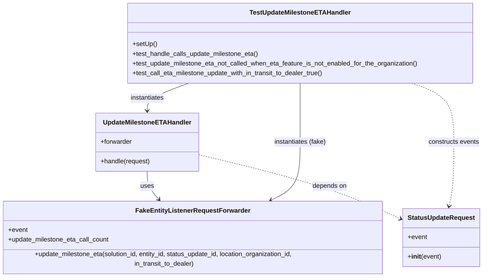

# Diagram: entity_core/entity_service/entity_listener/tests/unit/test_update_milestone_eta_handler.py

> Auto-generated by Obscura crawlers

## Mermaid

### SVG

<svg id="container" width="1223.82421875" xmlns="http://www.w3.org/2000/svg" class="classDiagram" height="674" viewBox="0 0 1223.82421875 674" role="graphics-document document" aria-roledescription="class"><g><defs><marker id="container_class-aggregationStart" class="marker aggregation class" refX="18" refY="7" markerWidth="190" markerHeight="240" orient="auto"><path d="M 18,7 L9,13 L1,7 L9,1 Z"></path></marker></defs><defs><marker id="container_class-aggregationEnd" class="marker aggregation class" refX="1" refY="7" markerWidth="20" markerHeight="28" orient="auto"><path d="M 18,7 L9,13 L1,7 L9,1 Z"></path></marker></defs><defs><marker id="container_class-extensionStart" class="marker extension class" refX="18" refY="7" markerWidth="190" markerHeight="240" orient="auto"><path d="M 1,7 L18,13 V 1 Z"></path></marker></defs><defs><marker id="container_class-extensionEnd" class="marker extension class" refX="1" refY="7" markerWidth="20" markerHeight="28" orient="auto"><path d="M 1,1 V 13 L18,7 Z"></path></marker></defs><defs><marker id="container_class-compositionStart" class="marker composition class" refX="18" refY="7" markerWidth="190" markerHeight="240" orient="auto"><path d="M 18,7 L9,13 L1,7 L9,1 Z"></path></marker></defs><defs><marker id="container_class-compositionEnd" class="marker composition class" refX="1" refY="7" markerWidth="20" markerHeight="28" orient="auto"><path d="M 18,7 L9,13 L1,7 L9,1 Z"></path></marker></defs><defs><marker id="container_class-dependencyStart" class="marker dependency class" refX="6" refY="7" markerWidth="190" markerHeight="240" orient="auto"><path d="M 5,7 L9,13 L1,7 L9,1 Z"></path></marker></defs><defs><marker id="container_class-dependencyEnd" class="marker dependency class" refX="13" refY="7" markerWidth="20" markerHeight="28" orient="auto"><path d="M 18,7 L9,13 L14,7 L9,1 Z"></path></marker></defs><defs><marker id="container_class-lollipopStart" class="marker lollipop class" refX="13" refY="7" markerWidth="190" markerHeight="240" orient="auto"><circle stroke="black" fill="transparent" cx="7" cy="7" r="6"></circle></marker></defs><defs><marker id="container_class-lollipopEnd" class="marker lollipop class" refX="1" refY="7" markerWidth="190" markerHeight="240" orient="auto"><circle stroke="black" fill="transparent" cx="7" cy="7" r="6"></circle></marker></defs><g class="root"><g class="clusters"></g><g class="edgePaths"><path d="M379.17,424L379.17,430.167C379.17,436.333,379.17,448.667,384.26,460.27C389.351,471.873,399.531,482.747,404.621,488.183L409.712,493.62" id="id_UpdateMilestoneETAHandler_FakeEntityListenerRequestForwarder_1" class="edge-thickness-normal edge-pattern-solid relation" style=";;;" data-edge="true" data-et="edge" data-id="id_UpdateMilestoneETAHandler_FakeEntityListenerRequestForwarder_1" data-points="W3sieCI6Mzc5LjE2OTkyMTg3NSwieSI6NDI0fSx7IngiOjM3OS4xNjk5MjE4NzUsInkiOjQ2MX0seyJ4Ijo0MTMuODEyNjI5MTMyMjMxNCwieSI6NDk4fV0=" marker-end="url(#container_class-dependencyEnd)"></path><path d="M505.291,381.965L560.733,395.137C616.176,408.31,727.061,434.655,813.08,460.922C899.099,487.19,960.253,513.379,990.83,526.474L1021.406,539.569" id="id_UpdateMilestoneETAHandler_StatusUpdateRequest_2" class="edge-thickness-normal edge-pattern-dashed relation" style=";;;" data-edge="true" data-et="edge" data-id="id_UpdateMilestoneETAHandler_StatusUpdateRequest_2" data-points="W3sieCI6NTA1LjI5MTAxNTYyNSwieSI6MzgxLjk2NDk4ODMxMzgyOH0seyJ4Ijo4MzcuOTQ1MzEyNSwieSI6NDYxfSx7IngiOjEwMjYuOTIxODc1LCJ5Ijo1NDEuOTMwOTgyOTk0NjA4fV0=" marker-end="url(#container_class-dependencyEnd)"></path><path d="M483.671,206L466.254,212.167C448.837,218.333,414.004,230.667,396.587,242C379.17,253.333,379.17,263.667,379.17,268.833L379.17,274" id="id_TestUpdateMilestoneETAHandler_UpdateMilestoneETAHandler_3" class="edge-thickness-normal edge-pattern-solid relation" style=";;;" data-edge="true" data-et="edge" data-id="id_TestUpdateMilestoneETAHandler_UpdateMilestoneETAHandler_3" data-points="W3sieCI6NDgzLjY3MDc5NzkwOTAwNzQsInkiOjIwNn0seyJ4IjozNzkuMTY5OTIxODc1LCJ5IjoyNDN9LHsieCI6Mzc5LjE2OTkyMTg3NSwieSI6MjgwfV0=" marker-end="url(#container_class-dependencyEnd)"></path><path d="M763.281,206L763.281,212.167C763.281,218.333,763.281,230.667,763.281,255C763.281,279.333,763.281,315.667,763.281,352C763.281,388.333,763.281,424.667,750.392,448.592C737.503,472.517,711.725,484.035,698.836,489.794L685.947,495.552" id="id_TestUpdateMilestoneETAHandler_FakeEntityListenerRequestForwarder_4" class="edge-thickness-normal edge-pattern-solid relation" style=";;;" data-edge="true" data-et="edge" data-id="id_TestUpdateMilestoneETAHandler_FakeEntityListenerRequestForwarder_4" data-points="W3sieCI6NzYzLjI4MTI1LCJ5IjoyMDZ9LHsieCI6NzYzLjI4MTI1LCJ5IjoyNDN9LHsieCI6NzYzLjI4MTI1LCJ5IjozNTJ9LHsieCI6NzYzLjI4MTI1LCJ5Ijo0NjF9LHsieCI6NjgwLjQ2ODQyNzE2OTQyMTUsInkiOjQ5OH1d" marker-end="url(#container_class-dependencyEnd)"></path><path d="M1046.214,206L1063.838,212.167C1081.462,218.333,1116.709,230.667,1134.333,255C1151.957,279.333,1151.957,315.667,1151.957,352C1151.957,388.333,1151.957,424.667,1150.085,450.032C1148.212,475.398,1144.467,489.795,1142.595,496.994L1140.722,504.193" id="id_TestUpdateMilestoneETAHandler_StatusUpdateRequest_5" class="edge-thickness-normal edge-pattern-dashed relation" style=";;;" data-edge="true" data-et="edge" data-id="id_TestUpdateMilestoneETAHandler_StatusUpdateRequest_5" data-points="W3sieCI6MTA0Ni4yMTQzNTU0Njg3NSwieSI6MjA2fSx7IngiOjExNTEuOTU3MDMxMjUsInkiOjI0M30seyJ4IjoxMTUxLjk1NzAzMTI1LCJ5IjozNTJ9LHsieCI6MTE1MS45NTcwMzEyNSwieSI6NDYxfSx7IngiOjExMzkuMjExOTA1OTkxNzM1NiwieSI6NTEwfV0=" marker-end="url(#container_class-dependencyEnd)"></path></g><g class="edgeLabels"><g class="edgeLabel" transform="translate(379.169921875, 461)"><g class="label" data-id="id_UpdateMilestoneETAHandler_FakeEntityListenerRequestForwarder_1" transform="translate(-16.4921875, -12)"><foreignObject width="32.984375" height="24">

uses

</foreignObject></g></g><g class="edgeLabel" transform="translate(837.9453125, 461)"><g class="label" data-id="id_UpdateMilestoneETAHandler_StatusUpdateRequest_2" transform="translate(-42.9453125, -12)"><foreignObject width="85.890625" height="24">

depends on

</foreignObject></g></g><g class="edgeLabel" transform="translate(379.169921875, 243)"><g class="label" data-id="id_TestUpdateMilestoneETAHandler_UpdateMilestoneETAHandler_3" transform="translate(-42.9140625, -12)"><foreignObject width="85.828125" height="24">

instantiates

</foreignObject></g></g><g class="edgeLabel" transform="translate(763.28125, 352)"><g class="label" data-id="id_TestUpdateMilestoneETAHandler_FakeEntityListenerRequestForwarder_4" transform="translate(-65.4609375, -12)"><foreignObject width="130.921875" height="24">

instantiates (fake)

</foreignObject></g></g><g class="edgeLabel" transform="translate(1151.95703125, 352)"><g class="label" data-id="id_TestUpdateMilestoneETAHandler_StatusUpdateRequest_5" transform="translate(-63.8671875, -12)"><foreignObject width="127.734375" height="24">

constructs events

</foreignObject></g></g></g><g class="nodes"><g class="node default" id="classId-FakeEntityListenerRequestForwarder-0" transform="translate(492.4609375, 582)"><g class="basic label-container"><path d="M-484.4609375 -84 L484.4609375 -84 L484.4609375 84 L-484.4609375 84" stroke="none" stroke-width="0" fill="#ECECFF" style=""></path><path d="M-484.4609375 -84 C-271.8921618027851 -84, -59.323386105570194 -84, 484.4609375 -84 M-484.4609375 -84 C-267.21503429118764 -84, -49.96913108237533 -84, 484.4609375 -84 M484.4609375 -84 C484.4609375 -44.24132252079983, 484.4609375 -4.482645041599653, 484.4609375 84 M484.4609375 -84 C484.4609375 -31.948935624106355, 484.4609375 20.10212875178729, 484.4609375 84 M484.4609375 84 C111.1487125634435 84, -262.163512373113 84, -484.4609375 84 M484.4609375 84 C142.44062773806405 84, -199.5796820238719 84, -484.4609375 84 M-484.4609375 84 C-484.4609375 40.509015061664094, -484.4609375 -2.981969876671812, -484.4609375 -84 M-484.4609375 84 C-484.4609375 24.693873960924826, -484.4609375 -34.61225207815035, -484.4609375 -84" stroke="#9370DB" stroke-width="1.3" fill="none" stroke-dasharray="0 0" style=""></path></g><g class="annotation-group text" transform="translate(0, -60)"></g><g class="label-group text" transform="translate(-134.765625, -60)"><g class="label" style="font-weight: bolder" transform="translate(0,-12)"><foreignObject width="269.53125" height="24">

FakeEntityListenerRequestForwarder

</foreignObject></g></g><g class="members-group text" transform="translate(-472.4609375, -12)"><g class="label" style="" transform="translate(0,-12)"><foreignObject width="48.328125" height="24">

+event

</foreignObject></g><g class="label" style="" transform="translate(0,12)"><foreignObject width="252.640625" height="24">

+update_milestone_eta_call_count

</foreignObject></g></g><g class="methods-group text" transform="translate(-472.4609375, 60)"><g class="label" style="" transform="translate(0,-12)"><foreignObject width="810.15625" height="24">

+update_milestone_eta(solution_id, entity_id, status_update_id, location_organization_id, in_transit_to_dealer)

</foreignObject></g></g><g class="divider" style=""><path d="M-484.4609375 -36 C-148.78945001573123 -36, 186.88203746853753 -36, 484.4609375 -36 M-484.4609375 -36 C-247.98528660898566 -36, -11.509635717971321 -36, 484.4609375 -36" stroke="#9370DB" stroke-width="1.3" fill="none" stroke-dasharray="0 0" style=""></path></g><g class="divider" style=""><path d="M-484.4609375 36 C-257.70608362917005 36, -30.951229758340048 36, 484.4609375 36 M-484.4609375 36 C-285.36356602144554 36, -86.26619454289113 36, 484.4609375 36" stroke="#9370DB" stroke-width="1.3" fill="none" stroke-dasharray="0 0" style=""></path></g></g><g class="node default" id="classId-UpdateMilestoneETAHandler-1" transform="translate(379.169921875, 352)"><g class="basic label-container"><path d="M-126.12109375 -72 L126.12109375 -72 L126.12109375 72 L-126.12109375 72" stroke="none" stroke-width="0" fill="#ECECFF" style=""></path><path d="M-126.12109375 -72 C-67.68275569531588 -72, -9.244417640631738 -72, 126.12109375 -72 M-126.12109375 -72 C-31.24901623103996 -72, 63.62306128792008 -72, 126.12109375 -72 M126.12109375 -72 C126.12109375 -22.435188463919793, 126.12109375 27.129623072160413, 126.12109375 72 M126.12109375 -72 C126.12109375 -28.506453406446226, 126.12109375 14.987093187107547, 126.12109375 72 M126.12109375 72 C43.91817198838183 72, -38.28474977323634 72, -126.12109375 72 M126.12109375 72 C45.178636096134994 72, -35.76382155773001 72, -126.12109375 72 M-126.12109375 72 C-126.12109375 27.98638004921171, -126.12109375 -16.02723990157658, -126.12109375 -72 M-126.12109375 72 C-126.12109375 20.953549967775288, -126.12109375 -30.092900064449424, -126.12109375 -72" stroke="#9370DB" stroke-width="1.3" fill="none" stroke-dasharray="0 0" style=""></path></g><g class="annotation-group text" transform="translate(0, -48)"></g><g class="label-group text" transform="translate(-104.2734375, -48)"><g class="label" style="font-weight: bolder" transform="translate(0,-12)"><foreignObject width="208.546875" height="24">

UpdateMilestoneETAHandler

</foreignObject></g></g><g class="members-group text" transform="translate(-114.12109375, 0)"><g class="label" style="" transform="translate(0,-12)"><foreignObject width="78.609375" height="24">

+forwarder

</foreignObject></g></g><g class="methods-group text" transform="translate(-114.12109375, 48)"><g class="label" style="" transform="translate(0,-12)"><foreignObject width="123.96875" height="24">

+handle(request)

</foreignObject></g></g><g class="divider" style=""><path d="M-126.12109375 -24 C-25.31315618780313 -24, 75.49478137439374 -24, 126.12109375 -24 M-126.12109375 -24 C-30.891721986263633 -24, 64.33764977747273 -24, 126.12109375 -24" stroke="#9370DB" stroke-width="1.3" fill="none" stroke-dasharray="0 0" style=""></path></g><g class="divider" style=""><path d="M-126.12109375 24 C-71.40820025711298 24, -16.695306764225975 24, 126.12109375 24 M-126.12109375 24 C-75.12915053181085 24, -24.1372073136217 24, 126.12109375 24" stroke="#9370DB" stroke-width="1.3" fill="none" stroke-dasharray="0 0" style=""></path></g></g><g class="node default" id="classId-StatusUpdateRequest-2" transform="translate(1120.484375, 582)"><g class="basic label-container"><path d="M-93.5625 -72 L93.5625 -72 L93.5625 72 L-93.5625 72" stroke="none" stroke-width="0" fill="#ECECFF" style=""></path><path d="M-93.5625 -72 C-40.03594341980726 -72, 13.490613160385479 -72, 93.5625 -72 M-93.5625 -72 C-55.97271806822744 -72, -18.382936136454873 -72, 93.5625 -72 M93.5625 -72 C93.5625 -37.2471966977992, 93.5625 -2.4943933955983937, 93.5625 72 M93.5625 -72 C93.5625 -24.271433121324016, 93.5625 23.45713375735197, 93.5625 72 M93.5625 72 C52.885776749192274 72, 12.209053498384549 72, -93.5625 72 M93.5625 72 C41.612825890385544 72, -10.336848219228912 72, -93.5625 72 M-93.5625 72 C-93.5625 38.02038713235282, -93.5625 4.040774264705647, -93.5625 -72 M-93.5625 72 C-93.5625 31.575271635205823, -93.5625 -8.849456729588354, -93.5625 -72" stroke="#9370DB" stroke-width="1.3" fill="none" stroke-dasharray="0 0" style=""></path></g><g class="annotation-group text" transform="translate(0, -48)"></g><g class="label-group text" transform="translate(-79.984375, -48)"><g class="label" style="font-weight: bolder" transform="translate(0,-12)"><foreignObject width="159.96875" height="24">

StatusUpdateRequest

</foreignObject></g></g><g class="members-group text" transform="translate(-81.5625, 0)"><g class="label" style="" transform="translate(0,-12)"><foreignObject width="48.328125" height="24">

+event

</foreignObject></g></g><g class="methods-group text" transform="translate(-81.5625, 48)"><g class="label" style="" transform="translate(0,-12)"><foreignObject width="83.140625" height="24">

+<strong>init</strong>(event)

</foreignObject></g></g><g class="divider" style=""><path d="M-93.5625 -24 C-27.24996824402824 -24, 39.06256351194352 -24, 93.5625 -24 M-93.5625 -24 C-31.91699849237291 -24, 29.728503015254176 -24, 93.5625 -24" stroke="#9370DB" stroke-width="1.3" fill="none" stroke-dasharray="0 0" style=""></path></g><g class="divider" style=""><path d="M-93.5625 24 C-38.488956854763266 24, 16.584586290473467 24, 93.5625 24 M-93.5625 24 C-47.79609700175375 24, -2.029694003507501 24, 93.5625 24" stroke="#9370DB" stroke-width="1.3" fill="none" stroke-dasharray="0 0" style=""></path></g></g><g class="node default" id="classId-TestUpdateMilestoneETAHandler-3" transform="translate(763.28125, 107)"><g class="basic label-container"><path d="M-429.44140625 -99 L429.44140625 -99 L429.44140625 99 L-429.44140625 99" stroke="none" stroke-width="0" fill="#ECECFF" style=""></path><path d="M-429.44140625 -99 C-217.55003902354318 -99, -5.658671797086356 -99, 429.44140625 -99 M-429.44140625 -99 C-205.22835530825768 -99, 18.984695633484648 -99, 429.44140625 -99 M429.44140625 -99 C429.44140625 -42.006660765684984, 429.44140625 14.986678468630032, 429.44140625 99 M429.44140625 -99 C429.44140625 -38.182282013088845, 429.44140625 22.63543597382231, 429.44140625 99 M429.44140625 99 C144.6502883741182 99, -140.14082950176362 99, -429.44140625 99 M429.44140625 99 C170.64812429717534 99, -88.14515765564931 99, -429.44140625 99 M-429.44140625 99 C-429.44140625 22.38109958294278, -429.44140625 -54.23780083411444, -429.44140625 -99 M-429.44140625 99 C-429.44140625 48.23801458677532, -429.44140625 -2.523970826449357, -429.44140625 -99" stroke="#9370DB" stroke-width="1.3" fill="none" stroke-dasharray="0 0" style=""></path></g><g class="annotation-group text" transform="translate(0, -75)"></g><g class="label-group text" transform="translate(-119.5234375, -75)"><g class="label" style="font-weight: bolder" transform="translate(0,-12)"><foreignObject width="239.046875" height="24">

TestUpdateMilestoneETAHandler

</foreignObject></g></g><g class="members-group text" transform="translate(-417.44140625, -27)"></g><g class="methods-group text" transform="translate(-417.44140625, 3)"><g class="label" style="" transform="translate(0,-12)"><foreignObject width="60.421875" height="24">

+setUp()

</foreignObject></g><g class="label" style="" transform="translate(0,12)"><foreignObject width="314.8125" height="24">

+test_handle_calls_update_milestone_eta()

</foreignObject></g><g class="label" style="" transform="translate(0,36)"><foreignObject width="715.359375" height="24">

+test_update_milestone_eta_not_called_when_eta_feature_is_not_enabled_for_the_organization()

</foreignObject></g><g class="label" style="" transform="translate(0,60)"><foreignObject width="479.328125" height="24">

+test_call_eta_milestone_update_with_in_transit_to_dealer_true()

</foreignObject></g></g><g class="divider" style=""><path d="M-429.44140625 -51 C-188.7766104896941 -51, 51.888185270611814 -51, 429.44140625 -51 M-429.44140625 -51 C-123.16380452658609 -51, 183.11379719682782 -51, 429.44140625 -51" stroke="#9370DB" stroke-width="1.3" fill="none" stroke-dasharray="0 0" style=""></path></g><g class="divider" style=""><path d="M-429.44140625 -27 C-213.17989324288496 -27, 3.0816197642300835 -27, 429.44140625 -27 M-429.44140625 -27 C-213.65751348018054 -27, 2.126379289638919 -27, 429.44140625 -27" stroke="#9370DB" stroke-width="1.3" fill="none" stroke-dasharray="0 0" style=""></path></g></g></g></g></g></svg>
