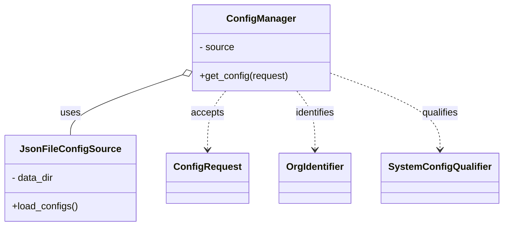
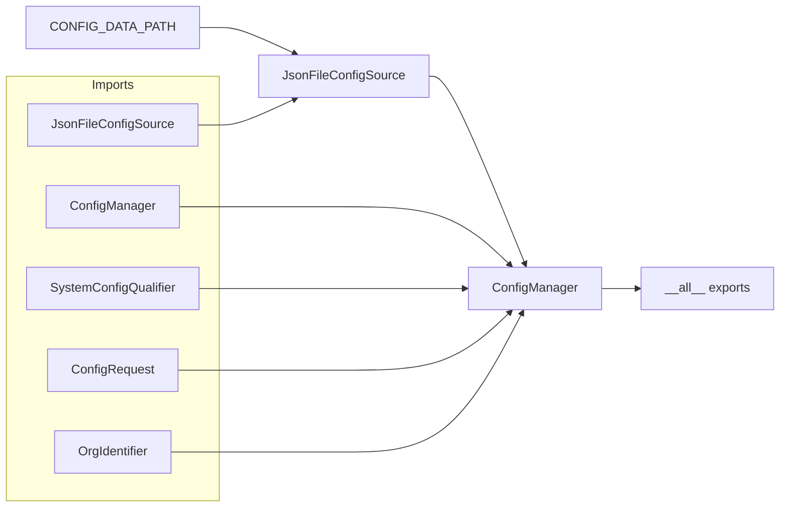

# Diagram: entity_core/entity_service/entity_service/common/config_provider/__init__.py

> Auto-generated by Obscura crawlers

## Diagram 1

### SVG

<svg id="container" width="809.171875" xmlns="http://www.w3.org/2000/svg" class="classDiagram" height="378" viewBox="0 0 809.171875 378" role="graphics-document document" aria-roledescription="class"><g><defs><marker id="container_class-aggregationStart" class="marker aggregation class" refX="18" refY="7" markerWidth="190" markerHeight="240" orient="auto"><path d="M 18,7 L9,13 L1,7 L9,1 Z"></path></marker></defs><defs><marker id="container_class-aggregationEnd" class="marker aggregation class" refX="1" refY="7" markerWidth="20" markerHeight="28" orient="auto"><path d="M 18,7 L9,13 L1,7 L9,1 Z"></path></marker></defs><defs><marker id="container_class-extensionStart" class="marker extension class" refX="18" refY="7" markerWidth="190" markerHeight="240" orient="auto"><path d="M 1,7 L18,13 V 1 Z"></path></marker></defs><defs><marker id="container_class-extensionEnd" class="marker extension class" refX="1" refY="7" markerWidth="20" markerHeight="28" orient="auto"><path d="M 1,1 V 13 L18,7 Z"></path></marker></defs><defs><marker id="container_class-compositionStart" class="marker composition class" refX="18" refY="7" markerWidth="190" markerHeight="240" orient="auto"><path d="M 18,7 L9,13 L1,7 L9,1 Z"></path></marker></defs><defs><marker id="container_class-compositionEnd" class="marker composition class" refX="1" refY="7" markerWidth="20" markerHeight="28" orient="auto"><path d="M 18,7 L9,13 L1,7 L9,1 Z"></path></marker></defs><defs><marker id="container_class-dependencyStart" class="marker dependency class" refX="6" refY="7" markerWidth="190" markerHeight="240" orient="auto"><path d="M 5,7 L9,13 L1,7 L9,1 Z"></path></marker></defs><defs><marker id="container_class-dependencyEnd" class="marker dependency class" refX="13" refY="7" markerWidth="20" markerHeight="28" orient="auto"><path d="M 18,7 L9,13 L14,7 L9,1 Z"></path></marker></defs><defs><marker id="container_class-lollipopStart" class="marker lollipop class" refX="13" refY="7" markerWidth="190" markerHeight="240" orient="auto"><circle stroke="black" fill="transparent" cx="7" cy="7" r="6"></circle></marker></defs><defs><marker id="container_class-lollipopEnd" class="marker lollipop class" refX="1" refY="7" markerWidth="190" markerHeight="240" orient="auto"><circle stroke="black" fill="transparent" cx="7" cy="7" r="6"></circle></marker></defs><g class="root"><g class="clusters"></g><g class="edgePaths"><path d="M290.063,125.972L260.513,136.477C230.964,146.981,171.865,167.991,142.315,184.662C112.766,201.333,112.766,213.667,112.766,219.833L112.766,226" id="id_ConfigManager_JsonFileConfigSource_1" class="edge-thickness-normal edge-pattern-solid relation" style=";;;" data-edge="true" data-et="edge" data-id="id_ConfigManager_JsonFileConfigSource_1" data-points="W3sieCI6MzA2LjMxNjQwNjI1LCJ5IjoxMjAuMTk0MjE4NjY2Mzk0ODd9LHsieCI6MTEyLjc2NTYyNSwieSI6MTg5fSx7IngiOjExMi43NjU2MjUsInkiOjIyNn1d" marker-start="url(#container_class-aggregationStart)"></path><path d="M361.951,152L357.032,158.167C352.113,164.333,342.275,176.667,337.356,193C332.438,209.333,332.438,229.667,332.438,239.833L332.438,250" id="id_ConfigManager_ConfigRequest_2" class="edge-thickness-normal edge-pattern-dashed relation" style=";;;" data-edge="true" data-et="edge" data-id="id_ConfigManager_ConfigRequest_2" data-points="W3sieCI6MzYxLjk1MTA0NjQ0NDk1NDE2LCJ5IjoxNTJ9LHsieCI6MzMyLjQzNzUsInkiOjE4OX0seyJ4IjozMzIuNDM3NSwieSI6MjU2fV0=" marker-end="url(#container_class-dependencyEnd)"></path><path d="M476.815,152L481.734,158.167C486.652,164.333,496.49,176.667,501.409,193C506.328,209.333,506.328,229.667,506.328,239.833L506.328,250" id="id_ConfigManager_OrgIdentifier_3" class="edge-thickness-normal edge-pattern-dashed relation" style=";;;" data-edge="true" data-et="edge" data-id="id_ConfigManager_OrgIdentifier_3" data-points="W3sieCI6NDc2LjgxNDU3ODU1NTA0NTg0LCJ5IjoxNTJ9LHsieCI6NTA2LjMyODEyNSwieSI6MTg5fSx7IngiOjUwNi4zMjgxMjUsInkiOjI1Nn1d" marker-end="url(#container_class-dependencyEnd)"></path><path d="M532.449,122.665L561.748,133.721C591.047,144.777,649.645,166.888,678.943,188.111C708.242,209.333,708.242,229.667,708.242,239.833L708.242,250" id="id_ConfigManager_SystemConfigQualifier_4" class="edge-thickness-normal edge-pattern-dashed relation" style=";;;" data-edge="true" data-et="edge" data-id="id_ConfigManager_SystemConfigQualifier_4" data-points="W3sieCI6NTMyLjQ0OTIxODc1LCJ5IjoxMjIuNjY1MTgzNjQyNTU5NjR9LHsieCI6NzA4LjI0MjE4NzUsInkiOjE4OX0seyJ4Ijo3MDguMjQyMTg3NSwieSI6MjU2fV0=" marker-end="url(#container_class-dependencyEnd)"></path></g><g class="edgeLabels"><g class="edgeLabel" transform="translate(112.765625, 189)"><g class="label" data-id="id_ConfigManager_JsonFileConfigSource_1" transform="translate(-16.4921875, -12)"><foreignObject width="32.984375" height="24">

uses

</foreignObject></g></g><g class="edgeLabel" transform="translate(332.4375, 189)"><g class="label" data-id="id_ConfigManager_ConfigRequest_2" transform="translate(-27.421875, -12)"><foreignObject width="54.84375" height="24">

accepts

</foreignObject></g></g><g class="edgeLabel" transform="translate(506.328125, 189)"><g class="label" data-id="id_ConfigManager_OrgIdentifier_3" transform="translate(-33.9296875, -12)"><foreignObject width="67.859375" height="24">

identifies

</foreignObject></g></g><g class="edgeLabel" transform="translate(708.2421875, 189)"><g class="label" data-id="id_ConfigManager_SystemConfigQualifier_4" transform="translate(-31.015625, -12)"><foreignObject width="62.03125" height="24">

qualifies

</foreignObject></g></g></g><g class="nodes"><g class="node default" id="classId-ConfigManager-0" transform="translate(419.3828125, 80)"><g class="basic label-container"><path d="M-113.06640625 -72 L113.06640625 -72 L113.06640625 72 L-113.06640625 72" stroke="none" stroke-width="0" fill="#ECECFF" style=""></path><path d="M-113.06640625 -72 C-38.74595384924409 -72, 35.57449855151182 -72, 113.06640625 -72 M-113.06640625 -72 C-54.11280961048845 -72, 4.8407870290231045 -72, 113.06640625 -72 M113.06640625 -72 C113.06640625 -19.207381890765724, 113.06640625 33.58523621846855, 113.06640625 72 M113.06640625 -72 C113.06640625 -26.159083079366802, 113.06640625 19.681833841266396, 113.06640625 72 M113.06640625 72 C37.14070534271633 72, -38.78499556456734 72, -113.06640625 72 M113.06640625 72 C46.529267554520686 72, -20.007871140958628 72, -113.06640625 72 M-113.06640625 72 C-113.06640625 32.411474151317734, -113.06640625 -7.177051697364533, -113.06640625 -72 M-113.06640625 72 C-113.06640625 40.93549054141894, -113.06640625 9.870981082837886, -113.06640625 -72" stroke="#9370DB" stroke-width="1.3" fill="none" stroke-dasharray="0 0" style=""></path></g><g class="annotation-group text" transform="translate(0, -48)"></g><g class="label-group text" transform="translate(-54.3828125, -48)"><g class="label" style="font-weight: bolder" transform="translate(0,-12)"><foreignObject width="108.765625" height="24">

ConfigManager

</foreignObject></g></g><g class="members-group text" transform="translate(-101.06640625, 0)"><g class="label" style="" transform="translate(0,-12)"><foreignObject width="58.5625" height="24">

- source

</foreignObject></g></g><g class="methods-group text" transform="translate(-101.06640625, 48)"><g class="label" style="" transform="translate(0,-12)"><foreignObject width="147.75" height="24">

+get_config(request)

</foreignObject></g></g><g class="divider" style=""><path d="M-113.06640625 -24 C-30.912456904851467 -24, 51.241492440297066 -24, 113.06640625 -24 M-113.06640625 -24 C-51.76883293991564 -24, 9.52874037016872 -24, 113.06640625 -24" stroke="#9370DB" stroke-width="1.3" fill="none" stroke-dasharray="0 0" style=""></path></g><g class="divider" style=""><path d="M-113.06640625 24 C-61.14708335260121 24, -9.227760455202414 24, 113.06640625 24 M-113.06640625 24 C-47.255876242440905 24, 18.55465376511819 24, 113.06640625 24" stroke="#9370DB" stroke-width="1.3" fill="none" stroke-dasharray="0 0" style=""></path></g></g><g class="node default" id="classId-JsonFileConfigSource-1" transform="translate(112.765625, 298)"><g class="basic label-container"><path d="M-104.765625 -72 L104.765625 -72 L104.765625 72 L-104.765625 72" stroke="none" stroke-width="0" fill="#ECECFF" style=""></path><path d="M-104.765625 -72 C-48.523383448878974 -72, 7.718858102242052 -72, 104.765625 -72 M-104.765625 -72 C-39.16353140221871 -72, 26.438562195562582 -72, 104.765625 -72 M104.765625 -72 C104.765625 -23.10801004352436, 104.765625 25.78397991295128, 104.765625 72 M104.765625 -72 C104.765625 -16.69188751678167, 104.765625 38.61622496643666, 104.765625 72 M104.765625 72 C56.139433524822195 72, 7.51324204964439 72, -104.765625 72 M104.765625 72 C23.818001855568085 72, -57.12962128886383 72, -104.765625 72 M-104.765625 72 C-104.765625 26.25600162717538, -104.765625 -19.48799674564924, -104.765625 -72 M-104.765625 72 C-104.765625 29.48196438820873, -104.765625 -13.036071223582539, -104.765625 -72" stroke="#9370DB" stroke-width="1.3" fill="none" stroke-dasharray="0 0" style=""></path></g><g class="annotation-group text" transform="translate(0, -48)"></g><g class="label-group text" transform="translate(-76.171875, -48)"><g class="label" style="font-weight: bolder" transform="translate(0,-12)"><foreignObject width="152.34375" height="24">

JsonFileConfigSource

</foreignObject></g></g><g class="members-group text" transform="translate(-92.765625, 0)"><g class="label" style="" transform="translate(0,-12)"><foreignObject width="71.59375" height="24">

- data_dir

</foreignObject></g></g><g class="methods-group text" transform="translate(-92.765625, 48)"><g class="label" style="" transform="translate(0,-12)"><foreignObject width="109.359375" height="24">

+load_configs()

</foreignObject></g></g><g class="divider" style=""><path d="M-104.765625 -24 C-28.93841530874934 -24, 46.88879438250132 -24, 104.765625 -24 M-104.765625 -24 C-56.57228601959657 -24, -8.378947039193136 -24, 104.765625 -24" stroke="#9370DB" stroke-width="1.3" fill="none" stroke-dasharray="0 0" style=""></path></g><g class="divider" style=""><path d="M-104.765625 24 C-44.73569119120494 24, 15.294242617590115 24, 104.765625 24 M-104.765625 24 C-40.09544685006243 24, 24.57473129987514 24, 104.765625 24" stroke="#9370DB" stroke-width="1.3" fill="none" stroke-dasharray="0 0" style=""></path></g></g><g class="node default" id="classId-ConfigRequest-2" transform="translate(332.4375, 298)"><g class="basic label-container"><path d="M-64.90625 -42 L64.90625 -42 L64.90625 42 L-64.90625 42" stroke="none" stroke-width="0" fill="#ECECFF" style=""></path><path d="M-64.90625 -42 C-14.18913116600676 -42, 36.52798766798648 -42, 64.90625 -42 M-64.90625 -42 C-37.58589670509894 -42, -10.265543410197878 -42, 64.90625 -42 M64.90625 -42 C64.90625 -22.913507566593157, 64.90625 -3.8270151331863147, 64.90625 42 M64.90625 -42 C64.90625 -23.659715749256502, 64.90625 -5.319431498513005, 64.90625 42 M64.90625 42 C38.63978708629831 42, 12.373324172596632 42, -64.90625 42 M64.90625 42 C33.28260687654257 42, 1.658963753085139 42, -64.90625 42 M-64.90625 42 C-64.90625 15.707616652697308, -64.90625 -10.584766694605385, -64.90625 -42 M-64.90625 42 C-64.90625 22.596099997683368, -64.90625 3.1921999953667353, -64.90625 -42" stroke="#9370DB" stroke-width="1.3" fill="none" stroke-dasharray="0 0" style=""></path></g><g class="annotation-group text" transform="translate(0, -18)"></g><g class="label-group text" transform="translate(-52.90625, -18)"><g class="label" style="font-weight: bolder" transform="translate(0,-12)"><foreignObject width="105.8125" height="24">

ConfigRequest

</foreignObject></g></g><g class="members-group text" transform="translate(-52.90625, 30)"></g><g class="methods-group text" transform="translate(-52.90625, 60)"></g><g class="divider" style=""><path d="M-64.90625 6 C-16.77256279560877 6, 31.36112440878246 6, 64.90625 6 M-64.90625 6 C-26.441968045189967 6, 12.022313909620067 6, 64.90625 6" stroke="#9370DB" stroke-width="1.3" fill="none" stroke-dasharray="0 0" style=""></path></g><g class="divider" style=""><path d="M-64.90625 24 C-15.75331918026599 24, 33.39961163946802 24, 64.90625 24 M-64.90625 24 C-27.398472593102646 24, 10.109304813794708 24, 64.90625 24" stroke="#9370DB" stroke-width="1.3" fill="none" stroke-dasharray="0 0" style=""></path></g></g><g class="node default" id="classId-OrgIdentifier-3" transform="translate(506.328125, 298)"><g class="basic label-container"><path d="M-58.984375 -42 L58.984375 -42 L58.984375 42 L-58.984375 42" stroke="none" stroke-width="0" fill="#ECECFF" style=""></path><path d="M-58.984375 -42 C-34.46835435338342 -42, -9.952333706766844 -42, 58.984375 -42 M-58.984375 -42 C-16.77013532359765 -42, 25.4441043528047 -42, 58.984375 -42 M58.984375 -42 C58.984375 -19.02927303249946, 58.984375 3.9414539350010784, 58.984375 42 M58.984375 -42 C58.984375 -25.026004069093997, 58.984375 -8.052008138187993, 58.984375 42 M58.984375 42 C29.378525350075382 42, -0.2273242998492364 42, -58.984375 42 M58.984375 42 C26.88605531811153 42, -5.212264363776939 42, -58.984375 42 M-58.984375 42 C-58.984375 13.603188581216045, -58.984375 -14.79362283756791, -58.984375 -42 M-58.984375 42 C-58.984375 24.356492702115634, -58.984375 6.712985404231269, -58.984375 -42" stroke="#9370DB" stroke-width="1.3" fill="none" stroke-dasharray="0 0" style=""></path></g><g class="annotation-group text" transform="translate(0, -18)"></g><g class="label-group text" transform="translate(-46.984375, -18)"><g class="label" style="font-weight: bolder" transform="translate(0,-12)"><foreignObject width="93.96875" height="24">

OrgIdentifier

</foreignObject></g></g><g class="members-group text" transform="translate(-46.984375, 30)"></g><g class="methods-group text" transform="translate(-46.984375, 60)"></g><g class="divider" style=""><path d="M-58.984375 6 C-24.362791631831037 6, 10.258791736337926 6, 58.984375 6 M-58.984375 6 C-22.12586510001706 6, 14.732644799965882 6, 58.984375 6" stroke="#9370DB" stroke-width="1.3" fill="none" stroke-dasharray="0 0" style=""></path></g><g class="divider" style=""><path d="M-58.984375 24 C-16.15550202019302 24, 26.673370959613962 24, 58.984375 24 M-58.984375 24 C-12.502797112352773 24, 33.97878077529445 24, 58.984375 24" stroke="#9370DB" stroke-width="1.3" fill="none" stroke-dasharray="0 0" style=""></path></g></g><g class="node default" id="classId-SystemConfigQualifier-4" transform="translate(708.2421875, 298)"><g class="basic label-container"><path d="M-92.9296875 -42 L92.9296875 -42 L92.9296875 42 L-92.9296875 42" stroke="none" stroke-width="0" fill="#ECECFF" style=""></path><path d="M-92.9296875 -42 C-34.66728021584384 -42, 23.595127068312323 -42, 92.9296875 -42 M-92.9296875 -42 C-28.170930043438958 -42, 36.587827413122085 -42, 92.9296875 -42 M92.9296875 -42 C92.9296875 -10.284637784658077, 92.9296875 21.430724430683846, 92.9296875 42 M92.9296875 -42 C92.9296875 -17.816219366237966, 92.9296875 6.367561267524067, 92.9296875 42 M92.9296875 42 C33.663447668181945 42, -25.60279216363611 42, -92.9296875 42 M92.9296875 42 C31.897637818901032 42, -29.134411862197936 42, -92.9296875 42 M-92.9296875 42 C-92.9296875 11.770605938666034, -92.9296875 -18.458788122667933, -92.9296875 -42 M-92.9296875 42 C-92.9296875 24.175753897996934, -92.9296875 6.351507795993868, -92.9296875 -42" stroke="#9370DB" stroke-width="1.3" fill="none" stroke-dasharray="0 0" style=""></path></g><g class="annotation-group text" transform="translate(0, -18)"></g><g class="label-group text" transform="translate(-80.9296875, -18)"><g class="label" style="font-weight: bolder" transform="translate(0,-12)"><foreignObject width="161.859375" height="24">

SystemConfigQualifier

</foreignObject></g></g><g class="members-group text" transform="translate(-80.9296875, 30)"></g><g class="methods-group text" transform="translate(-80.9296875, 60)"></g><g class="divider" style=""><path d="M-92.9296875 6 C-50.220217600198616 6, -7.510747700397232 6, 92.9296875 6 M-92.9296875 6 C-22.235428129203584 6, 48.45883124159283 6, 92.9296875 6" stroke="#9370DB" stroke-width="1.3" fill="none" stroke-dasharray="0 0" style=""></path></g><g class="divider" style=""><path d="M-92.9296875 24 C-46.98621740567555 24, -1.042747311351107 24, 92.9296875 24 M-92.9296875 24 C-52.54711548762941 24, -12.164543475258824 24, 92.9296875 24" stroke="#9370DB" stroke-width="1.3" fill="none" stroke-dasharray="0 0" style=""></path></g></g></g></g></g></svg>

## Diagram 2

### SVG

<svg id="container" width="948.984375" xmlns="http://www.w3.org/2000/svg" class="flowchart" height="645" viewBox="0 0 948.984375 645" role="graphics-document document" aria-roledescription="flowchart-v2"><g><marker id="container_flowchart-v2-pointEnd" class="marker flowchart-v2" viewBox="0 0 10 10" refX="5" refY="5" markerUnits="userSpaceOnUse" markerWidth="8" markerHeight="8" orient="auto"><path d="M 0 0 L 10 5 L 0 10 z" class="arrowMarkerPath" style="stroke-width: 1; stroke-dasharray: 1, 0;"></path></marker><marker id="container_flowchart-v2-pointStart" class="marker flowchart-v2" viewBox="0 0 10 10" refX="4.5" refY="5" markerUnits="userSpaceOnUse" markerWidth="8" markerHeight="8" orient="auto"><path d="M 0 5 L 10 10 L 10 0 z" class="arrowMarkerPath" style="stroke-width: 1; stroke-dasharray: 1, 0;"></path></marker><marker id="container_flowchart-v2-circleEnd" class="marker flowchart-v2" viewBox="0 0 10 10" refX="11" refY="5" markerUnits="userSpaceOnUse" markerWidth="11" markerHeight="11" orient="auto"><circle cx="5" cy="5" r="5" class="arrowMarkerPath" style="stroke-width: 1; stroke-dasharray: 1, 0;"></circle></marker><marker id="container_flowchart-v2-circleStart" class="marker flowchart-v2" viewBox="0 0 10 10" refX="-1" refY="5" markerUnits="userSpaceOnUse" markerWidth="11" markerHeight="11" orient="auto"><circle cx="5" cy="5" r="5" class="arrowMarkerPath" style="stroke-width: 1; stroke-dasharray: 1, 0;"></circle></marker><marker id="container_flowchart-v2-crossEnd" class="marker cross flowchart-v2" viewBox="0 0 11 11" refX="12" refY="5.2" markerUnits="userSpaceOnUse" markerWidth="11" markerHeight="11" orient="auto"><path d="M 1,1 l 9,9 M 10,1 l -9,9" class="arrowMarkerPath" style="stroke-width: 2; stroke-dasharray: 1, 0;"></path></marker><marker id="container_flowchart-v2-crossStart" class="marker cross flowchart-v2" viewBox="0 0 11 11" refX="-1" refY="5.2" markerUnits="userSpaceOnUse" markerWidth="11" markerHeight="11" orient="auto"><path d="M 1,1 l 9,9 M 10,1 l -9,9" class="arrowMarkerPath" style="stroke-width: 2; stroke-dasharray: 1, 0;"></path></marker><g class="root"><g class="clusters"><g class="cluster" id="Imports" data-look="classic"><rect style="" x="8" y="97" width="268.859375" height="540"></rect><g class="cluster-label" transform="translate(114.0703125, 97)"><foreignObject width="56.71875" height="24">

Imports

</foreignObject></g></g></g><g class="edgePaths"><path d="M242.914,35L248.572,35C254.229,35,265.544,35,275.368,35C285.193,35,293.526,35,309.332,40.547C325.139,46.093,348.418,57.186,360.058,62.733L371.697,68.279" id="L_CONFIG_PATH_JsonSource_0" class="edge-thickness-normal edge-pattern-solid edge-thickness-normal edge-pattern-solid flowchart-link" style=";" data-edge="true" data-et="edge" data-id="L_CONFIG_PATH_JsonSource_0" data-points="W3sieCI6MjQyLjkxNDA2MjUsInkiOjM1fSx7IngiOjI3Ni44NTkzNzUsInkiOjM1fSx7IngiOjMwMS44NTkzNzUsInkiOjM1fSx7IngiOjM3NS4zMDgyMTU3MjU4MDY0NiwieSI6NzB9XQ==" marker-end="url(#container_flowchart-v2-pointEnd)"></path><path d="M537.078,97L541.245,97C545.411,97,553.745,97,573.932,136.881C594.119,176.763,626.161,256.526,642.181,296.407L658.202,336.288" id="L_JsonSource_CM_0" class="edge-thickness-normal edge-pattern-solid edge-thickness-normal edge-pattern-solid flowchart-link" style=";" data-edge="true" data-et="edge" data-id="L_JsonSource_CM_0" data-points="W3sieCI6NTM3LjA3ODEyNSwieSI6OTd9LHsieCI6NTYyLjA3ODEyNSwieSI6OTd9LHsieCI6NjU5LjY5Mjk2ODc1LCJ5IjozNDB9XQ==" marker-end="url(#container_flowchart-v2-pointEnd)"></path><path d="M225.891,263L234.385,263C242.88,263,259.87,263,272.531,263C285.193,263,293.526,263,319.378,263C345.229,263,388.599,263,431.969,263C475.339,263,518.708,263,553.296,275.372C587.883,287.744,613.689,312.488,626.591,324.86L639.494,337.232" id="L_I1_CM_0" class="edge-thickness-normal edge-pattern-solid edge-thickness-normal edge-pattern-solid flowchart-link" style=";" data-edge="true" data-et="edge" data-id="L_I1_CM_0" data-points="W3sieCI6MjI1Ljg5MDYyNSwieSI6MjYzfSx7IngiOjI3Ni44NTkzNzUsInkiOjI2M30seyJ4IjozMDEuODU5Mzc1LCJ5IjoyNjN9LHsieCI6NDMxLjk2ODc1LCJ5IjoyNjN9LHsieCI6NTYyLjA3ODEyNSwieSI6MjYzfSx7IngiOjY0Mi4zODA5MzQ0OTUxOTIzLCJ5IjozNDB9XQ==" marker-end="url(#container_flowchart-v2-pointEnd)"></path><path d="M247.539,159L252.426,159C257.313,159,267.086,159,276.139,159C285.193,159,293.526,159,309.332,153.453C325.139,147.907,348.418,136.814,360.058,131.267L371.697,125.721" id="L_I2_JsonSource_0" class="edge-thickness-normal edge-pattern-solid edge-thickness-normal edge-pattern-solid flowchart-link" style=";" data-edge="true" data-et="edge" data-id="L_I2_JsonSource_0" data-points="W3sieCI6MjQ3LjUzOTA2MjUsInkiOjE1OX0seyJ4IjoyNzYuODU5Mzc1LCJ5IjoxNTl9LHsieCI6MzAxLjg1OTM3NSwieSI6MTU5fSx7IngiOjM3NS4zMDgyMTU3MjU4MDY0NiwieSI6MTI0fV0=" marker-end="url(#container_flowchart-v2-pointEnd)"></path><path d="M251.859,367L256.026,367C260.193,367,268.526,367,276.859,367C285.193,367,293.526,367,319.378,367C345.229,367,388.599,367,431.969,367C475.339,367,518.708,367,543.893,367C569.078,367,576.078,367,579.578,367L583.078,367" id="L_I3_CM_0" class="edge-thickness-normal edge-pattern-solid edge-thickness-normal edge-pattern-solid flowchart-link" style=";" data-edge="true" data-et="edge" data-id="L_I3_CM_0" data-points="W3sieCI6MjUxLjg1OTM3NSwieSI6MzY3fSx7IngiOjI3Ni44NTkzNzUsInkiOjM2N30seyJ4IjozMDEuODU5Mzc1LCJ5IjozNjd9LHsieCI6NDMxLjk2ODc1LCJ5IjozNjd9LHsieCI6NTYyLjA3ODEyNSwieSI6MzY3fSx7IngiOjU4Ny4wNzgxMjUsInkiOjM2N31d" marker-end="url(#container_flowchart-v2-pointEnd)"></path><path d="M224.375,471L233.122,471C241.87,471,259.365,471,272.279,471C285.193,471,293.526,471,319.378,471C345.229,471,388.599,471,431.969,471C475.339,471,518.708,471,553.296,458.628C587.883,446.256,613.689,421.512,626.591,409.14L639.494,396.768" id="L_I4_CM_0" class="edge-thickness-normal edge-pattern-solid edge-thickness-normal edge-pattern-solid flowchart-link" style=";" data-edge="true" data-et="edge" data-id="L_I4_CM_0" data-points="W3sieCI6MjI0LjM3NSwieSI6NDcxfSx7IngiOjI3Ni44NTkzNzUsInkiOjQ3MX0seyJ4IjozMDEuODU5Mzc1LCJ5Ijo0NzF9LHsieCI6NDMxLjk2ODc1LCJ5Ijo0NzF9LHsieCI6NTYyLjA3ODEyNSwieSI6NDcxfSx7IngiOjY0Mi4zODA5MzQ0OTUxOTIzLCJ5IjozOTR9XQ==" marker-end="url(#container_flowchart-v2-pointEnd)"></path><path d="M218.484,575L228.214,575C237.943,575,257.401,575,271.297,575C285.193,575,293.526,575,319.378,575C345.229,575,388.599,575,431.969,575C475.339,575,518.708,575,555.815,545.424C592.922,515.849,623.766,456.698,639.188,427.122L654.611,397.547" id="L_I5_CM_0" class="edge-thickness-normal edge-pattern-solid edge-thickness-normal edge-pattern-solid flowchart-link" style=";" data-edge="true" data-et="edge" data-id="L_I5_CM_0" data-points="W3sieCI6MjE4LjQ4NDM3NSwieSI6NTc1fSx7IngiOjI3Ni44NTkzNzUsInkiOjU3NX0seyJ4IjozMDEuODU5Mzc1LCJ5Ijo1NzV9LHsieCI6NDMxLjk2ODc1LCJ5Ijo1NzV9LHsieCI6NTYyLjA3ODEyNSwieSI6NTc1fSx7IngiOjY1Ni40NTk5OTg0OTc1OTYyLCJ5IjozOTR9XQ==" marker-end="url(#container_flowchart-v2-pointEnd)"></path><path d="M754,367L758.167,367C762.333,367,770.667,367,778.333,367C786,367,793,367,796.5,367L800,367" id="L_CM_Exports_0" class="edge-thickness-normal edge-pattern-solid edge-thickness-normal edge-pattern-solid flowchart-link" style=";" data-edge="true" data-et="edge" data-id="L_CM_Exports_0" data-points="W3sieCI6NzU0LCJ5IjozNjd9LHsieCI6Nzc5LCJ5IjozNjd9LHsieCI6ODA0LCJ5IjozNjd9XQ==" marker-end="url(#container_flowchart-v2-pointEnd)"></path></g><g class="edgeLabels"><g class="edgeLabel"><g class="label" data-id="L_CONFIG_PATH_JsonSource_0" transform="translate(0, 0)"><foreignObject width="0" height="0">

</foreignObject></g></g><g class="edgeLabel"><g class="label" data-id="L_JsonSource_CM_0" transform="translate(0, 0)"><foreignObject width="0" height="0">

</foreignObject></g></g><g class="edgeLabel"><g class="label" data-id="L_I1_CM_0" transform="translate(0, 0)"><foreignObject width="0" height="0">

</foreignObject></g></g><g class="edgeLabel"><g class="label" data-id="L_I2_JsonSource_0" transform="translate(0, 0)"><foreignObject width="0" height="0">

</foreignObject></g></g><g class="edgeLabel"><g class="label" data-id="L_I3_CM_0" transform="translate(0, 0)"><foreignObject width="0" height="0">

</foreignObject></g></g><g class="edgeLabel"><g class="label" data-id="L_I4_CM_0" transform="translate(0, 0)"><foreignObject width="0" height="0">

</foreignObject></g></g><g class="edgeLabel"><g class="label" data-id="L_I5_CM_0" transform="translate(0, 0)"><foreignObject width="0" height="0">

</foreignObject></g></g><g class="edgeLabel"><g class="label" data-id="L_CM_Exports_0" transform="translate(0, 0)"><foreignObject width="0" height="0">

</foreignObject></g></g></g><g class="nodes"><g class="node default" id="flowchart-I1-0" transform="translate(142.4296875, 263)"><rect class="basic label-container" style="" x="-83.4609375" y="-27" width="166.921875" height="54"></rect><g class="label" style="" transform="translate(-53.4609375, -12)"><rect></rect><foreignObject width="106.921875" height="24">

ConfigManager

</foreignObject></g></g><g class="node default" id="flowchart-I2-1" transform="translate(142.4296875, 159)"><rect class="basic label-container" style="" x="-105.109375" y="-27" width="210.21875" height="54"></rect><g class="label" style="" transform="translate(-75.109375, -12)"><rect></rect><foreignObject width="150.21875" height="24">

JsonFileConfigSource

</foreignObject></g></g><g class="node default" id="flowchart-I3-2" transform="translate(142.4296875, 367)"><rect class="basic label-container" style="" x="-109.4296875" y="-27" width="218.859375" height="54"></rect><g class="label" style="" transform="translate(-79.4296875, -12)"><rect></rect><foreignObject width="158.859375" height="24">

SystemConfigQualifier

</foreignObject></g></g><g class="node default" id="flowchart-I4-3" transform="translate(142.4296875, 471)"><rect class="basic label-container" style="" x="-81.9453125" y="-27" width="163.890625" height="54"></rect><g class="label" style="" transform="translate(-51.9453125, -12)"><rect></rect><foreignObject width="103.890625" height="24">

ConfigRequest

</foreignObject></g></g><g class="node default" id="flowchart-I5-4" transform="translate(142.4296875, 575)"><rect class="basic label-container" style="" x="-76.0546875" y="-27" width="152.109375" height="54"></rect><g class="label" style="" transform="translate(-46.0546875, -12)"><rect></rect><foreignObject width="92.109375" height="24">

OrgIdentifier

</foreignObject></g></g><g class="node default" id="flowchart-CONFIG_PATH-5" transform="translate(142.4296875, 35)"><rect class="basic label-container" style="" x="-100.484375" y="-27" width="200.96875" height="54"></rect><g class="label" style="" transform="translate(-70.484375, -12)"><rect></rect><foreignObject width="140.96875" height="24">

CONFIG_DATA_PATH

</foreignObject></g></g><g class="node default" id="flowchart-JsonSource-6" transform="translate(431.96875, 97)"><rect class="basic label-container" style="" x="-105.109375" y="-27" width="210.21875" height="54"></rect><g class="label" style="" transform="translate(-75.109375, -12)"><rect></rect><foreignObject width="150.21875" height="24">

JsonFileConfigSource

</foreignObject></g></g><g class="node default" id="flowchart-CM-8" transform="translate(670.5390625, 367)"><rect class="basic label-container" style="" x="-83.4609375" y="-27" width="166.921875" height="54"></rect><g class="label" style="" transform="translate(-53.4609375, -12)"><rect></rect><foreignObject width="106.921875" height="24">

ConfigManager

</foreignObject></g></g><g class="node default" id="flowchart-Exports-20" transform="translate(872.4921875, 367)"><rect class="basic label-container" style="" x="-68.4921875" y="-27" width="136.984375" height="54"></rect><g class="label" style="" transform="translate(-38.4921875, -12)"><rect></rect><foreignObject width="76.984375" height="24">

<strong>all</strong> exports

</foreignObject></g></g></g></g></g></svg>
