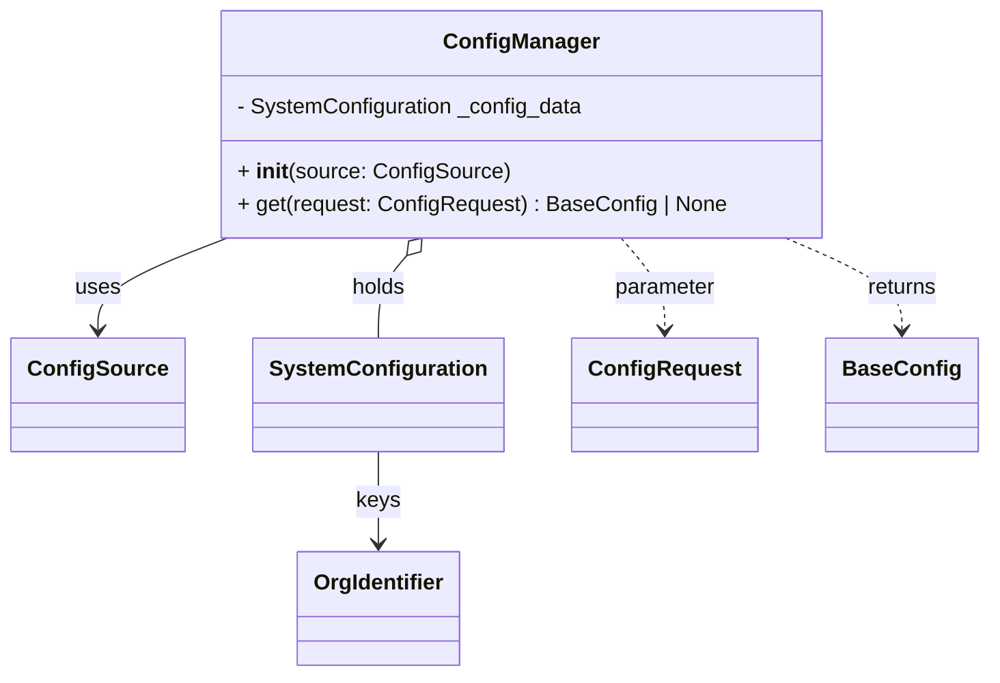

# Diagram: entity_core/entity_service/entity_service/common/config_provider/manager.py


> Auto-generated by Obscura crawlers

## Diagram 1



### SVG

<svg id="container" width="696.1875" xmlns="http://www.w3.org/2000/svg" class="classDiagram" height="500" viewBox="0 0 696.1875 500" role="graphics-document document" aria-roledescription="class"><style>#container{font-family:"trebuchet ms",verdana,arial,sans-serif;font-size:16px;fill:#333;}@keyframes edge-animation-frame{from{stroke-dashoffset:0;}}@keyframes dash{to{stroke-dashoffset:0;}}#container .edge-animation-slow{stroke-dasharray:9,5!important;stroke-dashoffset:900;animation:dash 50s linear infinite;stroke-linecap:round;}#container .edge-animation-fast{stroke-dasharray:9,5!important;stroke-dashoffset:900;animation:dash 20s linear infinite;stroke-linecap:round;}#container .error-icon{fill:#552222;}#container .error-text{fill:#552222;stroke:#552222;}#container .edge-thickness-normal{stroke-width:1px;}#container .edge-thickness-thick{stroke-width:3.5px;}#container .edge-pattern-solid{stroke-dasharray:0;}#container .edge-thickness-invisible{stroke-width:0;fill:none;}#container .edge-pattern-dashed{stroke-dasharray:3;}#container .edge-pattern-dotted{stroke-dasharray:2;}#container .marker{fill:#333333;stroke:#333333;}#container .marker.cross{stroke:#333333;}#container svg{font-family:"trebuchet ms",verdana,arial,sans-serif;font-size:16px;}#container p{margin:0;}#container g.classGroup text{fill:#9370DB;stroke:none;font-family:"trebuchet ms",verdana,arial,sans-serif;font-size:10px;}#container g.classGroup text .title{font-weight:bolder;}#container .nodeLabel,#container .edgeLabel{color:#131300;}#container .edgeLabel .label rect{fill:#ECECFF;}#container .label text{fill:#131300;}#container .labelBkg{background:#ECECFF;}#container .edgeLabel .label span{background:#ECECFF;}#container .classTitle{font-weight:bolder;}#container .node rect,#container .node circle,#container .node ellipse,#container .node polygon,#container .node path{fill:#ECECFF;stroke:#9370DB;stroke-width:1px;}#container .divider{stroke:#9370DB;stroke-width:1;}#container g.clickable{cursor:pointer;}#container g.classGroup rect{fill:#ECECFF;stroke:#9370DB;}#container g.classGroup line{stroke:#9370DB;stroke-width:1;}#container .classLabel .box{stroke:none;stroke-width:0;fill:#ECECFF;opacity:0.5;}#container .classLabel .label{fill:#9370DB;font-size:10px;}#container .relation{stroke:#333333;stroke-width:1;fill:none;}#container .dashed-line{stroke-dasharray:3;}#container .dotted-line{stroke-dasharray:1 2;}#container #compositionStart,#container .composition{fill:#333333!important;stroke:#333333!important;stroke-width:1;}#container #compositionEnd,#container .composition{fill:#333333!important;stroke:#333333!important;stroke-width:1;}#container #dependencyStart,#container .dependency{fill:#333333!important;stroke:#333333!important;stroke-width:1;}#container #dependencyStart,#container .dependency{fill:#333333!important;stroke:#333333!important;stroke-width:1;}#container #extensionStart,#container .extension{fill:transparent!important;stroke:#333333!important;stroke-width:1;}#container #extensionEnd,#container .extension{fill:transparent!important;stroke:#333333!important;stroke-width:1;}#container #aggregationStart,#container .aggregation{fill:transparent!important;stroke:#333333!important;stroke-width:1;}#container #aggregationEnd,#container .aggregation{fill:transparent!important;stroke:#333333!important;stroke-width:1;}#container #lollipopStart,#container .lollipop{fill:#ECECFF!important;stroke:#333333!important;stroke-width:1;}#container #lollipopEnd,#container .lollipop{fill:#ECECFF!important;stroke:#333333!important;stroke-width:1;}#container .edgeTerminals{font-size:11px;line-height:initial;}#container .classTitleText{text-anchor:middle;font-size:18px;fill:#333;}#container .label-icon{display:inline-block;height:1em;overflow:visible;vertical-align:-0.125em;}#container .node .label-icon path{fill:currentColor;stroke:revert;stroke-width:revert;}#container :root{--mermaid-font-family:"trebuchet ms",verdana,arial,sans-serif;}</style><g><defs><marker id="container_class-aggregationStart" class="marker aggregation class" refX="18" refY="7" markerWidth="190" markerHeight="240" orient="auto"><path d="M 18,7 L9,13 L1,7 L9,1 Z"></path></marker></defs><defs><marker id="container_class-aggregationEnd" class="marker aggregation class" refX="1" refY="7" markerWidth="20" markerHeight="28" orient="auto"><path d="M 18,7 L9,13 L1,7 L9,1 Z"></path></marker></defs><defs><marker id="container_class-extensionStart" class="marker extension class" refX="18" refY="7" markerWidth="190" markerHeight="240" orient="auto"><path d="M 1,7 L18,13 V 1 Z"></path></marker></defs><defs><marker id="container_class-extensionEnd" class="marker extension class" refX="1" refY="7" markerWidth="20" markerHeight="28" orient="auto"><path d="M 1,1 V 13 L18,7 Z"></path></marker></defs><defs><marker id="container_class-compositionStart" class="marker composition class" refX="18" refY="7" markerWidth="190" markerHeight="240" orient="auto"><path d="M 18,7 L9,13 L1,7 L9,1 Z"></path></marker></defs><defs><marker id="container_class-compositionEnd" class="marker composition class" refX="1" refY="7" markerWidth="20" markerHeight="28" orient="auto"><path d="M 18,7 L9,13 L1,7 L9,1 Z"></path></marker></defs><defs><marker id="container_class-dependencyStart" class="marker dependency class" refX="6" refY="7" markerWidth="190" markerHeight="240" orient="auto"><path d="M 5,7 L9,13 L1,7 L9,1 Z"></path></marker></defs><defs><marker id="container_class-dependencyEnd" class="marker dependency class" refX="13" refY="7" markerWidth="20" markerHeight="28" orient="auto"><path d="M 18,7 L9,13 L14,7 L9,1 Z"></path></marker></defs><defs><marker id="container_class-lollipopStart" class="marker lollipop class" refX="13" refY="7" markerWidth="190" markerHeight="240" orient="auto"><circle stroke="black" fill="transparent" cx="7" cy="7" r="6"></circle></marker></defs><defs><marker id="container_class-lollipopEnd" class="marker lollipop class" refX="1" refY="7" markerWidth="190" markerHeight="240" orient="auto"><circle stroke="black" fill="transparent" cx="7" cy="7" r="6"></circle></marker></defs><g class="root"><g class="clusters"></g><g class="edgePaths"><path d="M159.288,176L144.042,182.167C128.796,188.333,98.304,200.667,83.058,212C67.813,223.333,67.813,233.667,67.813,238.833L67.813,244" id="id_ConfigManager_ConfigSource_1" class="edge-thickness-normal edge-pattern-solid relation" style=";;;" data-edge="true" data-et="edge" data-id="id_ConfigManager_ConfigSource_1" data-points="W3sieCI6MTU5LjI4NzY0MjA0NTQ1NDUzLCJ5IjoxNzZ9LHsieCI6NjcuODEyNSwieSI6MjEzfSx7IngiOjY3LjgxMjUsInkiOjI1MH1d" marker-end="url(#container_class-dependencyEnd)"></path><path d="M285.477,189.221L282.155,193.184C278.834,197.147,272.19,205.074,268.869,215.203C265.547,225.333,265.547,237.667,265.547,243.833L265.547,250" id="id_ConfigManager_SystemConfiguration_2" class="edge-thickness-normal edge-pattern-solid relation" style=";;;" data-edge="true" data-et="edge" data-id="id_ConfigManager_SystemConfiguration_2" data-points="W3sieCI6Mjk2LjU1Nzc4NjY3MzU1MzcsInkiOjE3Nn0seyJ4IjoyNjUuNTQ2ODc1LCJ5IjoyMTN9LHsieCI6MjY1LjU0Njg3NSwieSI6MjUwfV0=" marker-start="url(#container_class-aggregationStart)"></path><path d="M437.364,176L442.533,182.167C447.701,188.333,458.038,200.667,463.207,212C468.375,223.333,468.375,233.667,468.375,238.833L468.375,244" id="id_ConfigManager_ConfigRequest_3" class="edge-thickness-normal edge-pattern-dashed relation" style=";;;" data-edge="true" data-et="edge" data-id="id_ConfigManager_ConfigRequest_3" data-points="W3sieCI6NDM3LjM2NDA4ODMyNjQ0NjMsInkiOjE3Nn0seyJ4Ijo0NjguMzc1LCJ5IjoyMTN9LHsieCI6NDY4LjM3NSwieSI6MjUwfV0=" marker-end="url(#container_class-dependencyEnd)"></path><path d="M553.547,176L567.245,182.167C580.943,188.333,608.339,200.667,622.037,212C635.734,223.333,635.734,233.667,635.734,238.833L635.734,244" id="id_ConfigManager_BaseConfig_4" class="edge-thickness-normal edge-pattern-dashed relation" style=";;;" data-edge="true" data-et="edge" data-id="id_ConfigManager_BaseConfig_4" data-points="W3sieCI6NTUzLjU0NzQ1NjA5NTA0MTMsInkiOjE3Nn0seyJ4Ijo2MzUuNzM0Mzc1LCJ5IjoyMTN9LHsieCI6NjM1LjczNDM3NSwieSI6MjUwfV0=" marker-end="url(#container_class-dependencyEnd)"></path><path d="M265.547,334L265.547,340.167C265.547,346.333,265.547,358.667,265.547,370C265.547,381.333,265.547,391.667,265.547,396.833L265.547,402" id="id_SystemConfiguration_OrgIdentifier_5" class="edge-thickness-normal edge-pattern-solid relation" style=";;;" data-edge="true" data-et="edge" data-id="id_SystemConfiguration_OrgIdentifier_5" data-points="W3sieCI6MjY1LjU0Njg3NSwieSI6MzM0fSx7IngiOjI2NS41NDY4NzUsInkiOjM3MX0seyJ4IjoyNjUuNTQ2ODc1LCJ5Ijo0MDh9XQ==" marker-end="url(#container_class-dependencyEnd)"></path></g><g class="edgeLabels"><g class="edgeLabel" transform="translate(67.8125, 213)"><g class="label" data-id="id_ConfigManager_ConfigSource_1" transform="translate(-16.4921875, -12)"><foreignObject width="32.984375" height="24"><div xmlns="http://www.w3.org/1999/xhtml" class="labelBkg" style="display: table-cell; white-space: nowrap; line-height: 1.5; max-width: 200px; text-align: center;"><span class="edgeLabel"><p>uses</p></span></div></foreignObject></g></g><g class="edgeLabel" transform="translate(265.546875, 213)"><g class="label" data-id="id_ConfigManager_SystemConfiguration_2" transform="translate(-20.1875, -12)"><foreignObject width="40.375" height="24"><div xmlns="http://www.w3.org/1999/xhtml" class="labelBkg" style="display: table-cell; white-space: nowrap; line-height: 1.5; max-width: 200px; text-align: center;"><span class="edgeLabel"><p>holds</p></span></div></foreignObject></g></g><g class="edgeLabel" transform="translate(468.375, 213)"><g class="label" data-id="id_ConfigManager_ConfigRequest_3" transform="translate(-37.6171875, -12)"><foreignObject width="75.234375" height="24"><div xmlns="http://www.w3.org/1999/xhtml" class="labelBkg" style="display: table-cell; white-space: nowrap; line-height: 1.5; max-width: 200px; text-align: center;"><span class="edgeLabel"><p>parameter</p></span></div></foreignObject></g></g><g class="edgeLabel" transform="translate(635.734375, 213)"><g class="label" data-id="id_ConfigManager_BaseConfig_4" transform="translate(-26.265625, -12)"><foreignObject width="52.53125" height="24"><div xmlns="http://www.w3.org/1999/xhtml" class="labelBkg" style="display: table-cell; white-space: nowrap; line-height: 1.5; max-width: 200px; text-align: center;"><span class="edgeLabel"><p>returns</p></span></div></foreignObject></g></g><g class="edgeLabel" transform="translate(265.546875, 371)"><g class="label" data-id="id_SystemConfiguration_OrgIdentifier_5" transform="translate(-15.96875, -12)"><foreignObject width="31.9375" height="24"><div xmlns="http://www.w3.org/1999/xhtml" class="labelBkg" style="display: table-cell; white-space: nowrap; line-height: 1.5; max-width: 200px; text-align: center;"><span class="edgeLabel"><p>keys</p></span></div></foreignObject></g></g></g><g class="nodes"><g class="node default" id="classId-ConfigManager-0" transform="translate(366.9609375, 92)"><g class="basic label-container"><path d="M-217.90234375 -84 L217.90234375 -84 L217.90234375 84 L-217.90234375 84" stroke="none" stroke-width="0" fill="#ECECFF" style=""></path><path d="M-217.90234375 -84 C-59.714770167924115 -84, 98.47280341415177 -84, 217.90234375 -84 M-217.90234375 -84 C-122.11214203313337 -84, -26.321940316266733 -84, 217.90234375 -84 M217.90234375 -84 C217.90234375 -24.18197626092507, 217.90234375 35.63604747814986, 217.90234375 84 M217.90234375 -84 C217.90234375 -23.86185855056251, 217.90234375 36.27628289887498, 217.90234375 84 M217.90234375 84 C128.26062510454994 84, 38.61890645909992 84, -217.90234375 84 M217.90234375 84 C81.85063649338656 84, -54.20107076322688 84, -217.90234375 84 M-217.90234375 84 C-217.90234375 43.70087195760145, -217.90234375 3.4017439152029, -217.90234375 -84 M-217.90234375 84 C-217.90234375 36.6947310302659, -217.90234375 -10.610537939468202, -217.90234375 -84" stroke="#9370DB" stroke-width="1.3" fill="none" stroke-dasharray="0 0" style=""></path></g><g class="annotation-group text" transform="translate(0, -60)"></g><g class="label-group text" transform="translate(-54.3828125, -60)"><g class="label" style="font-weight: bolder" transform="translate(0,-12)"><foreignObject width="108.765625" height="24"><div xmlns="http://www.w3.org/1999/xhtml" style="display: table-cell; white-space: nowrap; line-height: 1.5; max-width: 158px; text-align: center;"><span class="nodeLabel markdown-node-label" style=""><p>ConfigManager</p></span></div></foreignObject></g></g><g class="members-group text" transform="translate(-205.90234375, -12)"><g class="label" style="" transform="translate(0,-12)"><foreignObject width="256.328125" height="24"><div xmlns="http://www.w3.org/1999/xhtml" style="display: table-cell; white-space: nowrap; line-height: 1.5; max-width: 314px; text-align: center;"><span class="nodeLabel markdown-node-label" style=""><p>- SystemConfiguration _config_data</p></span></div></foreignObject></g></g><g class="methods-group text" transform="translate(-205.90234375, 36)"><g class="label" style="" transform="translate(0,-12)"><foreignObject width="197" height="24"><div xmlns="http://www.w3.org/1999/xhtml" style="display: table-cell; white-space: nowrap; line-height: 1.5; max-width: 287px; text-align: center;"><span class="nodeLabel markdown-node-label" style=""><p>+ <strong>init</strong>(source: ConfigSource)</p></span></div></foreignObject></g><g class="label" style="" transform="translate(0,12)"><foreignObject width="357.421875" height="24"><div xmlns="http://www.w3.org/1999/xhtml" style="display: table-cell; white-space: nowrap; line-height: 1.5; max-width: 415px; text-align: center;"><span class="nodeLabel markdown-node-label" style=""><p>+ get(request: ConfigRequest) : BaseConfig | None</p></span></div></foreignObject></g></g><g class="divider" style=""><path d="M-217.90234375 -36 C-91.56734527143303 -36, 34.76765320713395 -36, 217.90234375 -36 M-217.90234375 -36 C-91.27673882599602 -36, 35.34886609800796 -36, 217.90234375 -36" stroke="#9370DB" stroke-width="1.3" fill="none" stroke-dasharray="0 0" style=""></path></g><g class="divider" style=""><path d="M-217.90234375 12 C-94.69643022681139 12, 28.509483296377226 12, 217.90234375 12 M-217.90234375 12 C-128.66129306207023 12, -39.420242374140486 12, 217.90234375 12" stroke="#9370DB" stroke-width="1.3" fill="none" stroke-dasharray="0 0" style=""></path></g></g><g class="node default" id="classId-ConfigSource-1" transform="translate(67.8125, 292)"><g class="basic label-container"><path d="M-59.8125 -42 L59.8125 -42 L59.8125 42 L-59.8125 42" stroke="none" stroke-width="0" fill="#ECECFF" style=""></path><path d="M-59.8125 -42 C-25.654415384940492 -42, 8.503669230119016 -42, 59.8125 -42 M-59.8125 -42 C-16.22872639445886 -42, 27.35504721108228 -42, 59.8125 -42 M59.8125 -42 C59.8125 -14.215474779808893, 59.8125 13.569050440382213, 59.8125 42 M59.8125 -42 C59.8125 -13.719602924337757, 59.8125 14.560794151324487, 59.8125 42 M59.8125 42 C29.925199845328514 42, 0.03789969065702792 42, -59.8125 42 M59.8125 42 C29.864574324936275 42, -0.08335135012745098 42, -59.8125 42 M-59.8125 42 C-59.8125 18.971633387015743, -59.8125 -4.0567332259685145, -59.8125 -42 M-59.8125 42 C-59.8125 23.370080809296915, -59.8125 4.740161618593831, -59.8125 -42" stroke="#9370DB" stroke-width="1.3" fill="none" stroke-dasharray="0 0" style=""></path></g><g class="annotation-group text" transform="translate(0, -18)"></g><g class="label-group text" transform="translate(-47.8125, -18)"><g class="label" style="font-weight: bolder" transform="translate(0,-12)"><foreignObject width="95.625" height="24"><div xmlns="http://www.w3.org/1999/xhtml" style="display: table-cell; white-space: nowrap; line-height: 1.5; max-width: 144px; text-align: center;"><span class="nodeLabel markdown-node-label" style=""><p>ConfigSource</p></span></div></foreignObject></g></g><g class="members-group text" transform="translate(-47.8125, 30)"></g><g class="methods-group text" transform="translate(-47.8125, 60)"></g><g class="divider" style=""><path d="M-59.8125 6 C-30.685530557161833 6, -1.5585611143236662 6, 59.8125 6 M-59.8125 6 C-35.44206606004441 6, -11.071632120088815 6, 59.8125 6" stroke="#9370DB" stroke-width="1.3" fill="none" stroke-dasharray="0 0" style=""></path></g><g class="divider" style=""><path d="M-59.8125 24 C-25.214526151120744 24, 9.383447697758513 24, 59.8125 24 M-59.8125 24 C-21.98110911504466 24, 15.85028176991068 24, 59.8125 24" stroke="#9370DB" stroke-width="1.3" fill="none" stroke-dasharray="0 0" style=""></path></g></g><g class="node default" id="classId-SystemConfiguration-2" transform="translate(265.546875, 292)"><g class="basic label-container"><path d="M-87.921875 -42 L87.921875 -42 L87.921875 42 L-87.921875 42" stroke="none" stroke-width="0" fill="#ECECFF" style=""></path><path d="M-87.921875 -42 C-38.804785905043175 -42, 10.31230318991365 -42, 87.921875 -42 M-87.921875 -42 C-28.84553326887272 -42, 30.230808462254558 -42, 87.921875 -42 M87.921875 -42 C87.921875 -19.33840499259184, 87.921875 3.323190014816319, 87.921875 42 M87.921875 -42 C87.921875 -21.219137039288135, 87.921875 -0.43827407857627065, 87.921875 42 M87.921875 42 C31.33370188052271 42, -25.25447123895458 42, -87.921875 42 M87.921875 42 C28.907738272446977 42, -30.106398455106046 42, -87.921875 42 M-87.921875 42 C-87.921875 15.707935580120651, -87.921875 -10.584128839758698, -87.921875 -42 M-87.921875 42 C-87.921875 15.26652024967386, -87.921875 -11.46695950065228, -87.921875 -42" stroke="#9370DB" stroke-width="1.3" fill="none" stroke-dasharray="0 0" style=""></path></g><g class="annotation-group text" transform="translate(0, -18)"></g><g class="label-group text" transform="translate(-75.921875, -18)"><g class="label" style="font-weight: bolder" transform="translate(0,-12)"><foreignObject width="151.84375" height="24"><div xmlns="http://www.w3.org/1999/xhtml" style="display: table-cell; white-space: nowrap; line-height: 1.5; max-width: 199px; text-align: center;"><span class="nodeLabel markdown-node-label" style=""><p>SystemConfiguration</p></span></div></foreignObject></g></g><g class="members-group text" transform="translate(-75.921875, 30)"></g><g class="methods-group text" transform="translate(-75.921875, 60)"></g><g class="divider" style=""><path d="M-87.921875 6 C-20.560328729641228 6, 46.801217540717545 6, 87.921875 6 M-87.921875 6 C-39.14618908005761 6, 9.62949683988478 6, 87.921875 6" stroke="#9370DB" stroke-width="1.3" fill="none" stroke-dasharray="0 0" style=""></path></g><g class="divider" style=""><path d="M-87.921875 24 C-21.607265850567103 24, 44.707343298865794 24, 87.921875 24 M-87.921875 24 C-39.394514800064734 24, 9.132845399870533 24, 87.921875 24" stroke="#9370DB" stroke-width="1.3" fill="none" stroke-dasharray="0 0" style=""></path></g></g><g class="node default" id="classId-ConfigRequest-3" transform="translate(468.375, 292)"><g class="basic label-container"><path d="M-64.90625 -42 L64.90625 -42 L64.90625 42 L-64.90625 42" stroke="none" stroke-width="0" fill="#ECECFF" style=""></path><path d="M-64.90625 -42 C-25.827746096878926 -42, 13.250757806242149 -42, 64.90625 -42 M-64.90625 -42 C-35.49014656290677 -42, -6.074043125813553 -42, 64.90625 -42 M64.90625 -42 C64.90625 -10.585766501097424, 64.90625 20.82846699780515, 64.90625 42 M64.90625 -42 C64.90625 -23.88523273942953, 64.90625 -5.770465478859059, 64.90625 42 M64.90625 42 C20.477167848825104 42, -23.951914302349792 42, -64.90625 42 M64.90625 42 C26.764061606283462 42, -11.378126787433075 42, -64.90625 42 M-64.90625 42 C-64.90625 17.84350343526435, -64.90625 -6.312993129471302, -64.90625 -42 M-64.90625 42 C-64.90625 16.673517401625762, -64.90625 -8.652965196748475, -64.90625 -42" stroke="#9370DB" stroke-width="1.3" fill="none" stroke-dasharray="0 0" style=""></path></g><g class="annotation-group text" transform="translate(0, -18)"></g><g class="label-group text" transform="translate(-52.90625, -18)"><g class="label" style="font-weight: bolder" transform="translate(0,-12)"><foreignObject width="105.8125" height="24"><div xmlns="http://www.w3.org/1999/xhtml" style="display: table-cell; white-space: nowrap; line-height: 1.5; max-width: 154px; text-align: center;"><span class="nodeLabel markdown-node-label" style=""><p>ConfigRequest</p></span></div></foreignObject></g></g><g class="members-group text" transform="translate(-52.90625, 30)"></g><g class="methods-group text" transform="translate(-52.90625, 60)"></g><g class="divider" style=""><path d="M-64.90625 6 C-27.071218261196336 6, 10.763813477607329 6, 64.90625 6 M-64.90625 6 C-28.643636174396853 6, 7.6189776512062934 6, 64.90625 6" stroke="#9370DB" stroke-width="1.3" fill="none" stroke-dasharray="0 0" style=""></path></g><g class="divider" style=""><path d="M-64.90625 24 C-28.042557515751938 24, 8.821134968496125 24, 64.90625 24 M-64.90625 24 C-16.261597192892708 24, 32.383055614214584 24, 64.90625 24" stroke="#9370DB" stroke-width="1.3" fill="none" stroke-dasharray="0 0" style=""></path></g></g><g class="node default" id="classId-BaseConfig-4" transform="translate(635.734375, 292)"><g class="basic label-container"><path d="M-52.453125 -42 L52.453125 -42 L52.453125 42 L-52.453125 42" stroke="none" stroke-width="0" fill="#ECECFF" style=""></path><path d="M-52.453125 -42 C-27.04809218760574 -42, -1.6430593752114788 -42, 52.453125 -42 M-52.453125 -42 C-23.024022478358667 -42, 6.405080043282666 -42, 52.453125 -42 M52.453125 -42 C52.453125 -16.453953057221387, 52.453125 9.092093885557226, 52.453125 42 M52.453125 -42 C52.453125 -8.888791299792338, 52.453125 24.222417400415324, 52.453125 42 M52.453125 42 C28.44174748715938 42, 4.430369974318758 42, -52.453125 42 M52.453125 42 C29.43275713896379 42, 6.412389277927581 42, -52.453125 42 M-52.453125 42 C-52.453125 11.974006140145761, -52.453125 -18.051987719708478, -52.453125 -42 M-52.453125 42 C-52.453125 18.026597338495197, -52.453125 -5.946805323009606, -52.453125 -42" stroke="#9370DB" stroke-width="1.3" fill="none" stroke-dasharray="0 0" style=""></path></g><g class="annotation-group text" transform="translate(0, -18)"></g><g class="label-group text" transform="translate(-40.453125, -18)"><g class="label" style="font-weight: bolder" transform="translate(0,-12)"><foreignObject width="80.90625" height="24"><div xmlns="http://www.w3.org/1999/xhtml" style="display: table-cell; white-space: nowrap; line-height: 1.5; max-width: 130px; text-align: center;"><span class="nodeLabel markdown-node-label" style=""><p>BaseConfig</p></span></div></foreignObject></g></g><g class="members-group text" transform="translate(-40.453125, 30)"></g><g class="methods-group text" transform="translate(-40.453125, 60)"></g><g class="divider" style=""><path d="M-52.453125 6 C-16.23078307094265 6, 19.9915588581147 6, 52.453125 6 M-52.453125 6 C-18.504147194329796 6, 15.444830611340407 6, 52.453125 6" stroke="#9370DB" stroke-width="1.3" fill="none" stroke-dasharray="0 0" style=""></path></g><g class="divider" style=""><path d="M-52.453125 24 C-14.934972232716191 24, 22.583180534567617 24, 52.453125 24 M-52.453125 24 C-24.171713347506273 24, 4.109698304987454 24, 52.453125 24" stroke="#9370DB" stroke-width="1.3" fill="none" stroke-dasharray="0 0" style=""></path></g></g><g class="node default" id="classId-OrgIdentifier-5" transform="translate(265.546875, 450)"><g class="basic label-container"><path d="M-58.984375 -42 L58.984375 -42 L58.984375 42 L-58.984375 42" stroke="none" stroke-width="0" fill="#ECECFF" style=""></path><path d="M-58.984375 -42 C-24.470754689545032 -42, 10.042865620909936 -42, 58.984375 -42 M-58.984375 -42 C-28.270630517420066 -42, 2.443113965159867 -42, 58.984375 -42 M58.984375 -42 C58.984375 -17.790586336471563, 58.984375 6.418827327056874, 58.984375 42 M58.984375 -42 C58.984375 -24.293399513527504, 58.984375 -6.586799027055008, 58.984375 42 M58.984375 42 C33.69527303429449 42, 8.406171068588982 42, -58.984375 42 M58.984375 42 C30.78768920065912 42, 2.5910034013182397 42, -58.984375 42 M-58.984375 42 C-58.984375 23.430642359668088, -58.984375 4.861284719336176, -58.984375 -42 M-58.984375 42 C-58.984375 12.627762120299852, -58.984375 -16.744475759400295, -58.984375 -42" stroke="#9370DB" stroke-width="1.3" fill="none" stroke-dasharray="0 0" style=""></path></g><g class="annotation-group text" transform="translate(0, -18)"></g><g class="label-group text" transform="translate(-46.984375, -18)"><g class="label" style="font-weight: bolder" transform="translate(0,-12)"><foreignObject width="93.96875" height="24"><div xmlns="http://www.w3.org/1999/xhtml" style="display: table-cell; white-space: nowrap; line-height: 1.5; max-width: 143px; text-align: center;"><span class="nodeLabel markdown-node-label" style=""><p>OrgIdentifier</p></span></div></foreignObject></g></g><g class="members-group text" transform="translate(-46.984375, 30)"></g><g class="methods-group text" transform="translate(-46.984375, 60)"></g><g class="divider" style=""><path d="M-58.984375 6 C-33.526301155176874 6, -8.068227310353748 6, 58.984375 6 M-58.984375 6 C-22.859023162058513 6, 13.266328675882974 6, 58.984375 6" stroke="#9370DB" stroke-width="1.3" fill="none" stroke-dasharray="0 0" style=""></path></g><g class="divider" style=""><path d="M-58.984375 24 C-23.49887559647336 24, 11.986623807053277 24, 58.984375 24 M-58.984375 24 C-14.05364848369397 24, 30.87707803261206 24, 58.984375 24" stroke="#9370DB" stroke-width="1.3" fill="none" stroke-dasharray="0 0" style=""></path></g></g></g></g></g></svg>

## Diagram 2

```mermaid
flowchart TD
    A[Start] --> B[call source.load()]
    B --> C[SystemConfiguration.model_validate(raw_data)]
    C --> D{config_set = root.get(request.qualifier)}
    D -- No --> K[return []]
    D -- Yes --> E[config_obj = config_set.get(request.org_identifier)]
    E --> F{config_obj and config_obj.is_active?}
    F -- Yes --> G[return config_obj.value]
    F -- No --> H[default_config = config_set.get("default")]
    H --> I{default_config exists?}
    I -- Yes --> J[return default_config.value]
    I -- No --> K
```

> SVG rendering failed for this diagram.
