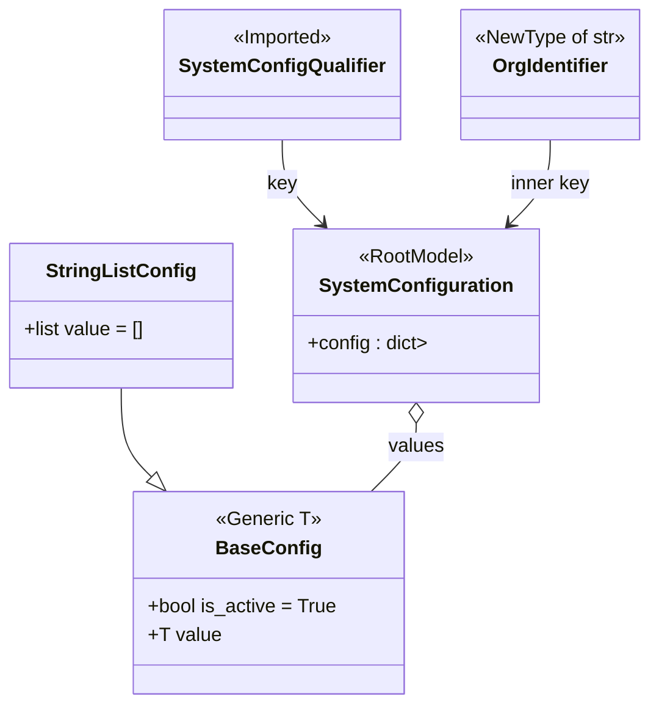

# Diagram: entity_core/entity_service/entity_service/common/config_provider/models/config.py

> Auto-generated by Obscura crawlers

## Mermaid

### SVG

<svg id="container" width="532.03515625" xmlns="http://www.w3.org/2000/svg" class="classDiagram" height="584" viewBox="0 0 532.03515625 584" role="graphics-document document" aria-roledescription="class"><g><defs><marker id="container_class-aggregationStart" class="marker aggregation class" refX="18" refY="7" markerWidth="190" markerHeight="240" orient="auto"><path d="M 18,7 L9,13 L1,7 L9,1 Z"></path></marker></defs><defs><marker id="container_class-aggregationEnd" class="marker aggregation class" refX="1" refY="7" markerWidth="20" markerHeight="28" orient="auto"><path d="M 18,7 L9,13 L1,7 L9,1 Z"></path></marker></defs><defs><marker id="container_class-extensionStart" class="marker extension class" refX="18" refY="7" markerWidth="190" markerHeight="240" orient="auto"><path d="M 1,7 L18,13 V 1 Z"></path></marker></defs><defs><marker id="container_class-extensionEnd" class="marker extension class" refX="1" refY="7" markerWidth="20" markerHeight="28" orient="auto"><path d="M 1,1 V 13 L18,7 Z"></path></marker></defs><defs><marker id="container_class-compositionStart" class="marker composition class" refX="18" refY="7" markerWidth="190" markerHeight="240" orient="auto"><path d="M 18,7 L9,13 L1,7 L9,1 Z"></path></marker></defs><defs><marker id="container_class-compositionEnd" class="marker composition class" refX="1" refY="7" markerWidth="20" markerHeight="28" orient="auto"><path d="M 18,7 L9,13 L1,7 L9,1 Z"></path></marker></defs><defs><marker id="container_class-dependencyStart" class="marker dependency class" refX="6" refY="7" markerWidth="190" markerHeight="240" orient="auto"><path d="M 5,7 L9,13 L1,7 L9,1 Z"></path></marker></defs><defs><marker id="container_class-dependencyEnd" class="marker dependency class" refX="13" refY="7" markerWidth="20" markerHeight="28" orient="auto"><path d="M 18,7 L9,13 L14,7 L9,1 Z"></path></marker></defs><defs><marker id="container_class-lollipopStart" class="marker lollipop class" refX="13" refY="7" markerWidth="190" markerHeight="240" orient="auto"><circle stroke="black" fill="transparent" cx="7" cy="7" r="6"></circle></marker></defs><defs><marker id="container_class-lollipopEnd" class="marker lollipop class" refX="1" refY="7" markerWidth="190" markerHeight="240" orient="auto"><circle stroke="black" fill="transparent" cx="7" cy="7" r="6"></circle></marker></defs><g class="root"><g class="clusters"></g><g class="edgePaths"><path d="M99.371,322L99.371,330.167C99.371,338.333,99.371,354.667,103.484,366.963C107.597,379.259,115.823,387.519,119.936,391.648L124.049,395.778" id="id_StringListConfig_BaseConfig_1" class="edge-thickness-normal edge-pattern-solid relation" style=";;;" data-edge="true" data-et="edge" data-id="id_StringListConfig_BaseConfig_1" data-points="W3sieCI6OTkuMzcxMDkzNzUsInkiOjMyMn0seyJ4Ijo5OS4zNzEwOTM3NSwieSI6MzcxfSx7IngiOjEzNi4yMjIzODE4NDQwMDgyOCwieSI6NDA4fV0=" marker-end="url(#container_class-extensionEnd)"></path><path d="M340.398,351.25L340.398,354.542C340.398,357.833,340.398,364.417,334.257,373.875C328.115,383.333,315.831,395.667,309.689,401.833L303.547,408" id="id_SystemConfiguration_BaseConfig_2" class="edge-thickness-normal edge-pattern-solid relation" style=";;;" data-edge="true" data-et="edge" data-id="id_SystemConfiguration_BaseConfig_2" data-points="W3sieCI6MzQwLjM5ODQzNzUsInkiOjMzNH0seyJ4IjozNDAuMzk4NDM3NSwieSI6MzcxfSx7IngiOjMwMy41NDcxNDk0MDU5OTE3LCJ5Ijo0MDh9XQ==" marker-start="url(#container_class-aggregationStart)"></path><path d="M231.543,116L231.543,122.167C231.543,128.333,231.543,140.667,236.995,152.292C242.447,163.918,253.35,174.836,258.802,180.295L264.254,185.755" id="id_SystemConfigQualifier_SystemConfiguration_3" class="edge-thickness-normal edge-pattern-solid relation" style=";;;" data-edge="true" data-et="edge" data-id="id_SystemConfigQualifier_SystemConfiguration_3" data-points="W3sieCI6MjMxLjU0Mjk2ODc1LCJ5IjoxMTZ9LHsieCI6MjMxLjU0Mjk2ODc1LCJ5IjoxNTN9LHsieCI6MjY4LjQ5MzkwNzY4MzQ4NjIsInkiOjE5MH1d" marker-end="url(#container_class-dependencyEnd)"></path><path d="M449.254,116L449.254,122.167C449.254,128.333,449.254,140.667,443.802,152.292C438.35,163.918,427.446,174.836,421.995,180.295L416.543,185.755" id="id_OrgIdentifier_SystemConfiguration_4" class="edge-thickness-normal edge-pattern-solid relation" style=";;;" data-edge="true" data-et="edge" data-id="id_OrgIdentifier_SystemConfiguration_4" data-points="W3sieCI6NDQ5LjI1MzkwNjI1LCJ5IjoxMTZ9LHsieCI6NDQ5LjI1MzkwNjI1LCJ5IjoxNTN9LHsieCI6NDEyLjMwMjk2NzMxNjUxMzgsInkiOjE5MH1d" marker-end="url(#container_class-dependencyEnd)"></path></g><g class="edgeLabels"><g class="edgeLabel"><g class="label" data-id="id_StringListConfig_BaseConfig_1" transform="translate(0, 0)"><foreignObject width="0" height="0">

</foreignObject></g></g><g class="edgeLabel" transform="translate(340.3984375, 371)"><g class="label" data-id="id_SystemConfiguration_BaseConfig_2" transform="translate(-23.1796875, -12)"><foreignObject width="46.359375" height="24">

values

</foreignObject></g></g><g class="edgeLabel" transform="translate(231.54296875, 153)"><g class="label" data-id="id_SystemConfigQualifier_SystemConfiguration_3" transform="translate(-12.2890625, -12)"><foreignObject width="24.578125" height="24">

key

</foreignObject></g></g><g class="edgeLabel" transform="translate(449.25390625, 153)"><g class="label" data-id="id_OrgIdentifier_SystemConfiguration_4" transform="translate(-33.4921875, -12)"><foreignObject width="66.984375" height="24">

inner key

</foreignObject></g></g></g><g class="nodes"><g class="node default" id="classId-OrgIdentifier-0" transform="translate(449.25390625, 62)"><g class="basic label-container"><path d="M-74.78125 -54 L74.78125 -54 L74.78125 54 L-74.78125 54" stroke="none" stroke-width="0" fill="#ECECFF" style=""></path><path d="M-74.78125 -54 C-25.55575909025105 -54, 23.669731819497898 -54, 74.78125 -54 M-74.78125 -54 C-29.780053325076203 -54, 15.221143349847594 -54, 74.78125 -54 M74.78125 -54 C74.78125 -22.097849456265543, 74.78125 9.804301087468914, 74.78125 54 M74.78125 -54 C74.78125 -12.328922333352892, 74.78125 29.342155333294215, 74.78125 54 M74.78125 54 C26.76403849512773 54, -21.253173009744543 54, -74.78125 54 M74.78125 54 C36.44267478052959 54, -1.8959004389408136 54, -74.78125 54 M-74.78125 54 C-74.78125 29.166961577848525, -74.78125 4.33392315569705, -74.78125 -54 M-74.78125 54 C-74.78125 16.2485262140816, -74.78125 -21.5029475718368, -74.78125 -54" stroke="#9370DB" stroke-width="1.3" fill="none" stroke-dasharray="0 0" style=""></path></g><g class="annotation-group text" transform="translate(-62.78125, -30)"><g class="label" style="" transform="translate(0,-12)"><foreignObject width="125.5625" height="24">

«NewType of str»

</foreignObject></g></g><g class="label-group text" transform="translate(-46.984375, -6)"><g class="label" style="font-weight: bolder" transform="translate(0,-12)"><foreignObject width="93.96875" height="24">

OrgIdentifier

</foreignObject></g></g><g class="members-group text" transform="translate(-62.78125, 42)"></g><g class="methods-group text" transform="translate(-62.78125, 72)"></g><g class="divider" style=""><path d="M-74.78125 18 C-19.910001573806724 18, 34.96124685238655 18, 74.78125 18 M-74.78125 18 C-23.922710129794666 18, 26.935829740410668 18, 74.78125 18" stroke="#9370DB" stroke-width="1.3" fill="none" stroke-dasharray="0 0" style=""></path></g><g class="divider" style=""><path d="M-74.78125 36 C-22.147681682283668 36, 30.485886635432664 36, 74.78125 36 M-74.78125 36 C-28.301820355540983 36, 18.177609288918035 36, 74.78125 36" stroke="#9370DB" stroke-width="1.3" fill="none" stroke-dasharray="0 0" style=""></path></g></g><g class="node default" id="classId-SystemConfigQualifier-1" transform="translate(231.54296875, 62)"><g class="basic label-container"><path d="M-92.9296875 -54 L92.9296875 -54 L92.9296875 54 L-92.9296875 54" stroke="none" stroke-width="0" fill="#ECECFF" style=""></path><path d="M-92.9296875 -54 C-40.493882375499716 -54, 11.941922749000568 -54, 92.9296875 -54 M-92.9296875 -54 C-24.82663567590805 -54, 43.2764161481839 -54, 92.9296875 -54 M92.9296875 -54 C92.9296875 -25.9153625753659, 92.9296875 2.1692748492681986, 92.9296875 54 M92.9296875 -54 C92.9296875 -24.095892524525993, 92.9296875 5.808214950948013, 92.9296875 54 M92.9296875 54 C50.01930062440977 54, 7.108913748819546 54, -92.9296875 54 M92.9296875 54 C19.995262515051778 54, -52.939162469896445 54, -92.9296875 54 M-92.9296875 54 C-92.9296875 19.58910309522073, -92.9296875 -14.821793809558542, -92.9296875 -54 M-92.9296875 54 C-92.9296875 31.07273817303962, -92.9296875 8.145476346079242, -92.9296875 -54" stroke="#9370DB" stroke-width="1.3" fill="none" stroke-dasharray="0 0" style=""></path></g><g class="annotation-group text" transform="translate(-42.7734375, -30)"><g class="label" style="" transform="translate(0,-12)"><foreignObject width="85.546875" height="24">

«Imported»

</foreignObject></g></g><g class="label-group text" transform="translate(-80.9296875, -6)"><g class="label" style="font-weight: bolder" transform="translate(0,-12)"><foreignObject width="161.859375" height="24">

SystemConfigQualifier

</foreignObject></g></g><g class="members-group text" transform="translate(-80.9296875, 42)"></g><g class="methods-group text" transform="translate(-80.9296875, 72)"></g><g class="divider" style=""><path d="M-92.9296875 18 C-31.920705716681475 18, 29.08827606663705 18, 92.9296875 18 M-92.9296875 18 C-23.528924087920416 18, 45.87183932415917 18, 92.9296875 18" stroke="#9370DB" stroke-width="1.3" fill="none" stroke-dasharray="0 0" style=""></path></g><g class="divider" style=""><path d="M-92.9296875 36 C-25.400127148481047 36, 42.129433203037905 36, 92.9296875 36 M-92.9296875 36 C-52.26986091413357 36, -11.610034328267133 36, 92.9296875 36" stroke="#9370DB" stroke-width="1.3" fill="none" stroke-dasharray="0 0" style=""></path></g></g><g class="node default" id="classId-BaseConfig-2" transform="translate(219.884765625, 492)"><g class="basic label-container"><path d="M-111.63671875 -84 L111.63671875 -84 L111.63671875 84 L-111.63671875 84" stroke="none" stroke-width="0" fill="#ECECFF" style=""></path><path d="M-111.63671875 -84 C-51.494189920159634 -84, 8.648338909680731 -84, 111.63671875 -84 M-111.63671875 -84 C-39.34065500625442 -84, 32.955408737491155 -84, 111.63671875 -84 M111.63671875 -84 C111.63671875 -39.4586840351087, 111.63671875 5.082631929782593, 111.63671875 84 M111.63671875 -84 C111.63671875 -41.56144275239473, 111.63671875 0.8771144952105345, 111.63671875 84 M111.63671875 84 C28.00464968277126 84, -55.62741938445748 84, -111.63671875 84 M111.63671875 84 C57.16832770876476 84, 2.6999366675295136 84, -111.63671875 84 M-111.63671875 84 C-111.63671875 28.679589914648844, -111.63671875 -26.640820170702312, -111.63671875 -84 M-111.63671875 84 C-111.63671875 43.90191009287204, -111.63671875 3.8038201857440868, -111.63671875 -84" stroke="#9370DB" stroke-width="1.3" fill="none" stroke-dasharray="0 0" style=""></path></g><g class="annotation-group text" transform="translate(-42.8515625, -60)"><g class="label" style="" transform="translate(0,-12)"><foreignObject width="85.703125" height="24">

«Generic T»

</foreignObject></g></g><g class="label-group text" transform="translate(-40.453125, -36)"><g class="label" style="font-weight: bolder" transform="translate(0,-12)"><foreignObject width="80.90625" height="24">

BaseConfig

</foreignObject></g></g><g class="members-group text" transform="translate(-99.63671875, 12)"><g class="label" style="" transform="translate(0,-12)"><foreignObject width="156.421875" height="24">

+bool is_active = True

</foreignObject></g><g class="label" style="" transform="translate(0,12)"><foreignObject width="58.578125" height="24">

+T value

</foreignObject></g></g><g class="methods-group text" transform="translate(-99.63671875, 84)"></g><g class="divider" style=""><path d="M-111.63671875 -12 C-54.937116802540984 -12, 1.7624851449180312 -12, 111.63671875 -12 M-111.63671875 -12 C-39.15367081916304 -12, 33.32937711167392 -12, 111.63671875 -12" stroke="#9370DB" stroke-width="1.3" fill="none" stroke-dasharray="0 0" style=""></path></g><g class="divider" style=""><path d="M-111.63671875 60 C-56.57307558514681 60, -1.5094324202936207 60, 111.63671875 60 M-111.63671875 60 C-24.691555094865734 60, 62.25360856026853 60, 111.63671875 60" stroke="#9370DB" stroke-width="1.3" fill="none" stroke-dasharray="0 0" style=""></path></g></g><g class="node default" id="classId-StringListConfig-3" transform="translate(99.37109375, 262)"><g class="basic label-container"><path d="M-91.37109375 -60 L91.37109375 -60 L91.37109375 60 L-91.37109375 60" stroke="none" stroke-width="0" fill="#ECECFF" style=""></path><path d="M-91.37109375 -60 C-54.5210476286002 -60, -17.6710015072004 -60, 91.37109375 -60 M-91.37109375 -60 C-18.61172237545702 -60, 54.14764899908596 -60, 91.37109375 -60 M91.37109375 -60 C91.37109375 -17.073468800504436, 91.37109375 25.853062398991128, 91.37109375 60 M91.37109375 -60 C91.37109375 -35.09098386000132, 91.37109375 -10.181967720002646, 91.37109375 60 M91.37109375 60 C45.75269621700075 60, 0.13429868400149303 60, -91.37109375 60 M91.37109375 60 C54.59004583381901 60, 17.808997917638024 60, -91.37109375 60 M-91.37109375 60 C-91.37109375 24.182873099177563, -91.37109375 -11.634253801644874, -91.37109375 -60 M-91.37109375 60 C-91.37109375 14.57836439744397, -91.37109375 -30.84327120511206, -91.37109375 -60" stroke="#9370DB" stroke-width="1.3" fill="none" stroke-dasharray="0 0" style=""></path></g><g class="annotation-group text" transform="translate(0, -36)"></g><g class="label-group text" transform="translate(-58.3984375, -36)"><g class="label" style="font-weight: bolder" transform="translate(0,-12)"><foreignObject width="116.796875" height="24">

StringListConfig

</foreignObject></g></g><g class="members-group text" transform="translate(-79.37109375, 12)"><g class="label" style="" transform="translate(0,-12)"><foreignObject width="100.34375" height="24">

+list value = []

</foreignObject></g></g><g class="methods-group text" transform="translate(-79.37109375, 60)"></g><g class="divider" style=""><path d="M-91.37109375 -12 C-48.125198377998124 -12, -4.879303005996249 -12, 91.37109375 -12 M-91.37109375 -12 C-52.892576835308176 -12, -14.414059920616353 -12, 91.37109375 -12" stroke="#9370DB" stroke-width="1.3" fill="none" stroke-dasharray="0 0" style=""></path></g><g class="divider" style=""><path d="M-91.37109375 36 C-36.903212628103546 36, 17.564668493792908 36, 91.37109375 36 M-91.37109375 36 C-36.04566362196024 36, 19.279766506079525 36, 91.37109375 36" stroke="#9370DB" stroke-width="1.3" fill="none" stroke-dasharray="0 0" style=""></path></g></g><g class="node default" id="classId-SystemConfiguration-4" transform="translate(340.3984375, 262)"><g class="basic label-container"><path d="M-99.65625 -72 L99.65625 -72 L99.65625 72 L-99.65625 72" stroke="none" stroke-width="0" fill="#ECECFF" style=""></path><path d="M-99.65625 -72 C-40.962354494417504 -72, 17.731541011164992 -72, 99.65625 -72 M-99.65625 -72 C-29.672895821123277 -72, 40.31045835775345 -72, 99.65625 -72 M99.65625 -72 C99.65625 -32.851431620475836, 99.65625 6.297136759048328, 99.65625 72 M99.65625 -72 C99.65625 -17.37022600243244, 99.65625 37.25954799513512, 99.65625 72 M99.65625 72 C46.082551411861196 72, -7.491147176277607 72, -99.65625 72 M99.65625 72 C53.77693478272096 72, 7.897619565441914 72, -99.65625 72 M-99.65625 72 C-99.65625 38.490893607902166, -99.65625 4.9817872158043315, -99.65625 -72 M-99.65625 72 C-99.65625 24.794419203364463, -99.65625 -22.411161593271075, -99.65625 -72" stroke="#9370DB" stroke-width="1.3" fill="none" stroke-dasharray="0 0" style=""></path></g><g class="annotation-group text" transform="translate(-48.46875, -48)"><g class="label" style="" transform="translate(0,-12)"><foreignObject width="96.9375" height="24">

«RootModel»

</foreignObject></g></g><g class="label-group text" transform="translate(-75.921875, -24)"><g class="label" style="font-weight: bolder" transform="translate(0,-12)"><foreignObject width="151.84375" height="24">

SystemConfiguration

</foreignObject></g></g><g class="members-group text" transform="translate(-87.65625, 24)"><g class="label" style="" transform="translate(0,-12)"><foreignObject width="99.390625" height="24">

+config : dict&gt;

</foreignObject></g></g><g class="methods-group text" transform="translate(-87.65625, 72)"></g><g class="divider" style=""><path d="M-99.65625 0 C-46.18095055823817 0, 7.294348883523654 0, 99.65625 0 M-99.65625 0 C-40.645134479437544 0, 18.36598104112491 0, 99.65625 0" stroke="#9370DB" stroke-width="1.3" fill="none" stroke-dasharray="0 0" style=""></path></g><g class="divider" style=""><path d="M-99.65625 48 C-36.62757861396719 48, 26.401092772065624 48, 99.65625 48 M-99.65625 48 C-57.38416606184558 48, -15.112082123691167 48, 99.65625 48" stroke="#9370DB" stroke-width="1.3" fill="none" stroke-dasharray="0 0" style=""></path></g></g></g></g></g></svg>
