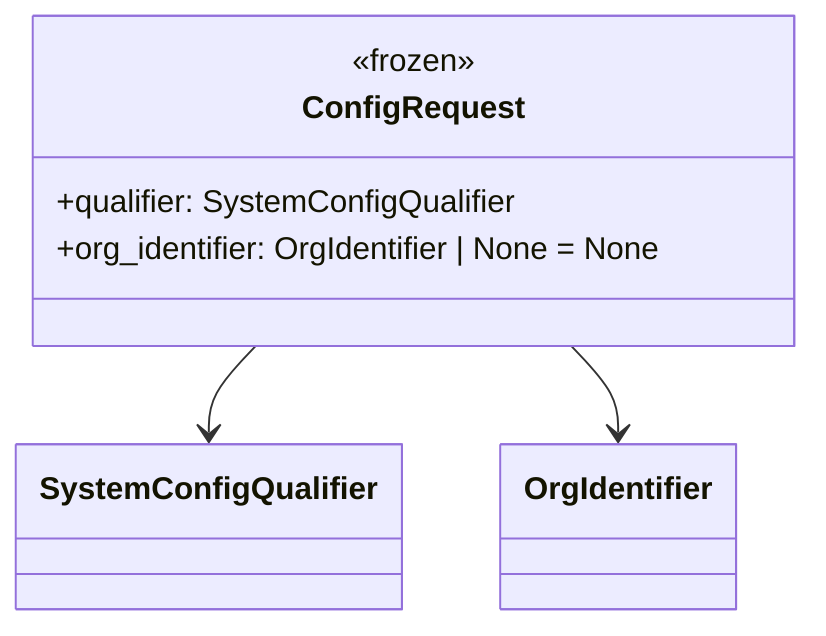

# Diagram: entity_core/entity_service/entity_service/common/config_provider/models/request.py

> Auto-generated by Obscura crawlers

## Mermaid

```mermaid
classDiagram
class SystemConfigQualifier
class OrgIdentifier
class ConfigRequest <<frozen>> {
  +qualifier: SystemConfigQualifier
  +org_identifier: OrgIdentifier | None = None
}
ConfigRequest --> SystemConfigQualifier
ConfigRequest --> OrgIdentifier
```

> SVG rendering failed for this diagram.
