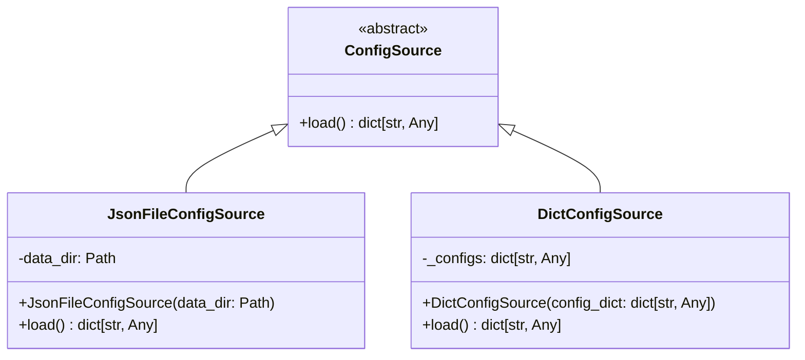

# Diagram: entity_core/entity_service/entity_service/common/config_provider/sources.py

> Auto-generated by Obscura crawlers

## Mermaid

### SVG

<svg id="container" width="840.4140625" xmlns="http://www.w3.org/2000/svg" class="classDiagram" height="384" viewBox="0 0 840.4140625 384" role="graphics-document document" aria-roledescription="class"><g><defs><marker id="container_class-aggregationStart" class="marker aggregation class" refX="18" refY="7" markerWidth="190" markerHeight="240" orient="auto"><path d="M 18,7 L9,13 L1,7 L9,1 Z"></path></marker></defs><defs><marker id="container_class-aggregationEnd" class="marker aggregation class" refX="1" refY="7" markerWidth="20" markerHeight="28" orient="auto"><path d="M 18,7 L9,13 L1,7 L9,1 Z"></path></marker></defs><defs><marker id="container_class-extensionStart" class="marker extension class" refX="18" refY="7" markerWidth="190" markerHeight="240" orient="auto"><path d="M 1,7 L18,13 V 1 Z"></path></marker></defs><defs><marker id="container_class-extensionEnd" class="marker extension class" refX="1" refY="7" markerWidth="20" markerHeight="28" orient="auto"><path d="M 1,1 V 13 L18,7 Z"></path></marker></defs><defs><marker id="container_class-compositionStart" class="marker composition class" refX="18" refY="7" markerWidth="190" markerHeight="240" orient="auto"><path d="M 18,7 L9,13 L1,7 L9,1 Z"></path></marker></defs><defs><marker id="container_class-compositionEnd" class="marker composition class" refX="1" refY="7" markerWidth="20" markerHeight="28" orient="auto"><path d="M 18,7 L9,13 L1,7 L9,1 Z"></path></marker></defs><defs><marker id="container_class-dependencyStart" class="marker dependency class" refX="6" refY="7" markerWidth="190" markerHeight="240" orient="auto"><path d="M 5,7 L9,13 L1,7 L9,1 Z"></path></marker></defs><defs><marker id="container_class-dependencyEnd" class="marker dependency class" refX="13" refY="7" markerWidth="20" markerHeight="28" orient="auto"><path d="M 18,7 L9,13 L14,7 L9,1 Z"></path></marker></defs><defs><marker id="container_class-lollipopStart" class="marker lollipop class" refX="13" refY="7" markerWidth="190" markerHeight="240" orient="auto"><circle stroke="black" fill="transparent" cx="7" cy="7" r="6"></circle></marker></defs><defs><marker id="container_class-lollipopEnd" class="marker lollipop class" refX="1" refY="7" markerWidth="190" markerHeight="240" orient="auto"><circle stroke="black" fill="transparent" cx="7" cy="7" r="6"></circle></marker></defs><g class="root"><g class="clusters"></g><g class="edgePaths"><path d="M283.472,141.614L268.393,148.512C253.314,155.409,223.157,169.205,208.079,180.269C193,191.333,193,199.667,193,203.833L193,208" id="id_ConfigSource_JsonFileConfigSource_1" class="edge-thickness-normal edge-pattern-solid relation" style=";;;" data-edge="true" data-et="edge" data-id="id_ConfigSource_JsonFileConfigSource_1" data-points="W3sieCI6Mjk5LjE1ODIwMzEyNSwieSI6MTM0LjQzODAxNjUyODkyNTYzfSx7IngiOjE5MywieSI6MTgzfSx7IngiOjE5MywieSI6MjA4fV0=" marker-start="url(#container_class-extensionStart)"></path><path d="M539.735,141.614L554.814,148.512C569.893,155.409,600.05,169.205,615.128,180.269C630.207,191.333,630.207,199.667,630.207,203.833L630.207,208" id="id_ConfigSource_DictConfigSource_2" class="edge-thickness-normal edge-pattern-solid relation" style=";;;" data-edge="true" data-et="edge" data-id="id_ConfigSource_DictConfigSource_2" data-points="W3sieCI6NTI0LjA0ODgyODEyNSwieSI6MTM0LjQzODAxNjUyODkyNTYzfSx7IngiOjYzMC4yMDcwMzEyNSwieSI6MTgzfSx7IngiOjYzMC4yMDcwMzEyNSwieSI6MjA4fV0=" marker-start="url(#container_class-extensionStart)"></path></g><g class="edgeLabels"><g class="edgeLabel"><g class="label" data-id="id_ConfigSource_JsonFileConfigSource_1" transform="translate(0, 0)"><foreignObject width="0" height="0">

</foreignObject></g></g><g class="edgeLabel"><g class="label" data-id="id_ConfigSource_DictConfigSource_2" transform="translate(0, 0)"><foreignObject width="0" height="0">

</foreignObject></g></g></g><g class="nodes"><g class="node default" id="classId-ConfigSource-0" transform="translate(411.603515625, 83)"><g class="basic label-container"><path d="M-112.4453125 -75 L112.4453125 -75 L112.4453125 75 L-112.4453125 75" stroke="none" stroke-width="0" fill="#ECECFF" style=""></path><path d="M-112.4453125 -75 C-63.31760456458677 -75, -14.189896629173546 -75, 112.4453125 -75 M-112.4453125 -75 C-49.15025666576849 -75, 14.144799168463024 -75, 112.4453125 -75 M112.4453125 -75 C112.4453125 -35.94329531652859, 112.4453125 3.1134093669428182, 112.4453125 75 M112.4453125 -75 C112.4453125 -26.405077742264197, 112.4453125 22.189844515471606, 112.4453125 75 M112.4453125 75 C61.90492578090856 75, 11.364539061817126 75, -112.4453125 75 M112.4453125 75 C60.89090042560681 75, 9.336488351213617 75, -112.4453125 75 M-112.4453125 75 C-112.4453125 31.213409069907122, -112.4453125 -12.573181860185755, -112.4453125 -75 M-112.4453125 75 C-112.4453125 36.007502023039294, -112.4453125 -2.9849959539214126, -112.4453125 -75" stroke="#9370DB" stroke-width="1.3" fill="none" stroke-dasharray="0 0" style=""></path></g><g class="annotation-group text" transform="translate(-38.609375, -51)"><g class="label" style="" transform="translate(0,-12)"><foreignObject width="77.21875" height="24">

«abstract»

</foreignObject></g></g><g class="label-group text" transform="translate(-47.8125, -27)"><g class="label" style="font-weight: bolder" transform="translate(0,-12)"><foreignObject width="95.625" height="24">

ConfigSource

</foreignObject></g></g><g class="members-group text" transform="translate(-100.4453125, 21)"></g><g class="methods-group text" transform="translate(-100.4453125, 51)"><g class="label" style="" transform="translate(0,-12)"><foreignObject width="153.078125" height="24">

+load() : dict[str, Any]

</foreignObject></g></g><g class="divider" style=""><path d="M-112.4453125 -3 C-37.37254510076568 -3, 37.700222298468645 -3, 112.4453125 -3 M-112.4453125 -3 C-57.49924733011432 -3, -2.553182160228644 -3, 112.4453125 -3" stroke="#9370DB" stroke-width="1.3" fill="none" stroke-dasharray="0 0" style=""></path></g><g class="divider" style=""><path d="M-112.4453125 21 C-39.81705239087556 21, 32.81120771824888 21, 112.4453125 21 M-112.4453125 21 C-64.61879164272274 21, -16.79227078544548 21, 112.4453125 21" stroke="#9370DB" stroke-width="1.3" fill="none" stroke-dasharray="0 0" style=""></path></g></g><g class="node default" id="classId-JsonFileConfigSource-1" transform="translate(193, 292)"><g class="basic label-container"><path d="M-185 -84 L185 -84 L185 84 L-185 84" stroke="none" stroke-width="0" fill="#ECECFF" style=""></path><path d="M-185 -84 C-52.612979826978545 -84, 79.77404034604291 -84, 185 -84 M-185 -84 C-50.982696164050054 -84, 83.03460767189989 -84, 185 -84 M185 -84 C185 -38.7484142933646, 185 6.503171413270806, 185 84 M185 -84 C185 -47.65765558467369, 185 -11.315311169347382, 185 84 M185 84 C52.50280406540497 84, -79.99439186919005 84, -185 84 M185 84 C58.321914030805004 84, -68.35617193838999 84, -185 84 M-185 84 C-185 40.956864974181144, -185 -2.0862700516377117, -185 -84 M-185 84 C-185 34.01403511827975, -185 -15.9719297634405, -185 -84" stroke="#9370DB" stroke-width="1.3" fill="none" stroke-dasharray="0 0" style=""></path></g><g class="annotation-group text" transform="translate(0, -60)"></g><g class="label-group text" transform="translate(-76.171875, -60)"><g class="label" style="font-weight: bolder" transform="translate(0,-12)"><foreignObject width="152.34375" height="24">

JsonFileConfigSource

</foreignObject></g></g><g class="members-group text" transform="translate(-173, -12)"><g class="label" style="" transform="translate(0,-12)"><foreignObject width="107.859375" height="24">

-data_dir: Path

</foreignObject></g></g><g class="methods-group text" transform="translate(-173, 36)"><g class="label" style="" transform="translate(0,-12)"><foreignObject width="269.828125" height="24">

+JsonFileConfigSource(data_dir: Path)

</foreignObject></g><g class="label" style="" transform="translate(0,12)"><foreignObject width="153.078125" height="24">

+load() : dict[str, Any]

</foreignObject></g></g><g class="divider" style=""><path d="M-185 -36 C-91.52806556337384 -36, 1.9438688732523133 -36, 185 -36 M-185 -36 C-39.68523465610656 -36, 105.62953068778688 -36, 185 -36" stroke="#9370DB" stroke-width="1.3" fill="none" stroke-dasharray="0 0" style=""></path></g><g class="divider" style=""><path d="M-185 12 C-78.06770817828811 12, 28.86458364342377 12, 185 12 M-185 12 C-89.7933209023177 12, 5.413358195364594 12, 185 12" stroke="#9370DB" stroke-width="1.3" fill="none" stroke-dasharray="0 0" style=""></path></g></g><g class="node default" id="classId-DictConfigSource-2" transform="translate(630.20703125, 292)"><g class="basic label-container"><path d="M-202.20703125 -84 L202.20703125 -84 L202.20703125 84 L-202.20703125 84" stroke="none" stroke-width="0" fill="#ECECFF" style=""></path><path d="M-202.20703125 -84 C-67.77225756797094 -84, 66.66251611405812 -84, 202.20703125 -84 M-202.20703125 -84 C-111.76166976726604 -84, -21.316308284532084 -84, 202.20703125 -84 M202.20703125 -84 C202.20703125 -24.649900350670784, 202.20703125 34.70019929865843, 202.20703125 84 M202.20703125 -84 C202.20703125 -37.875229895581555, 202.20703125 8.24954020883689, 202.20703125 84 M202.20703125 84 C80.59286874002795 84, -41.021293769944094 84, -202.20703125 84 M202.20703125 84 C69.62913996617164 84, -62.94875131765673 84, -202.20703125 84 M-202.20703125 84 C-202.20703125 43.1467123674785, -202.20703125 2.293424734957, -202.20703125 -84 M-202.20703125 84 C-202.20703125 33.89533020185149, -202.20703125 -16.209339596297013, -202.20703125 -84" stroke="#9370DB" stroke-width="1.3" fill="none" stroke-dasharray="0 0" style=""></path></g><g class="annotation-group text" transform="translate(0, -60)"></g><g class="label-group text" transform="translate(-62.1953125, -60)"><g class="label" style="font-weight: bolder" transform="translate(0,-12)"><foreignObject width="124.390625" height="24">

DictConfigSource

</foreignObject></g></g><g class="members-group text" transform="translate(-190.20703125, -12)"><g class="label" style="" transform="translate(0,-12)"><foreignObject width="162.515625" height="24">

-_configs: dict[str, Any]

</foreignObject></g></g><g class="methods-group text" transform="translate(-190.20703125, 36)"><g class="label" style="" transform="translate(0,-12)"><foreignObject width="318.21875" height="24">

+DictConfigSource(config_dict: dict[str, Any])

</foreignObject></g><g class="label" style="" transform="translate(0,12)"><foreignObject width="153.078125" height="24">

+load() : dict[str, Any]

</foreignObject></g></g><g class="divider" style=""><path d="M-202.20703125 -36 C-103.85593809539257 -36, -5.504844940785148 -36, 202.20703125 -36 M-202.20703125 -36 C-117.2098175248052 -36, -32.212603799610406 -36, 202.20703125 -36" stroke="#9370DB" stroke-width="1.3" fill="none" stroke-dasharray="0 0" style=""></path></g><g class="divider" style=""><path d="M-202.20703125 12 C-46.13903203708182 12, 109.92896717583636 12, 202.20703125 12 M-202.20703125 12 C-51.4526045341064 12, 99.3018221817872 12, 202.20703125 12" stroke="#9370DB" stroke-width="1.3" fill="none" stroke-dasharray="0 0" style=""></path></g></g></g></g></g></svg>
