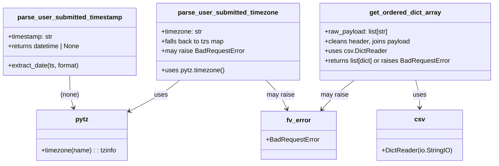
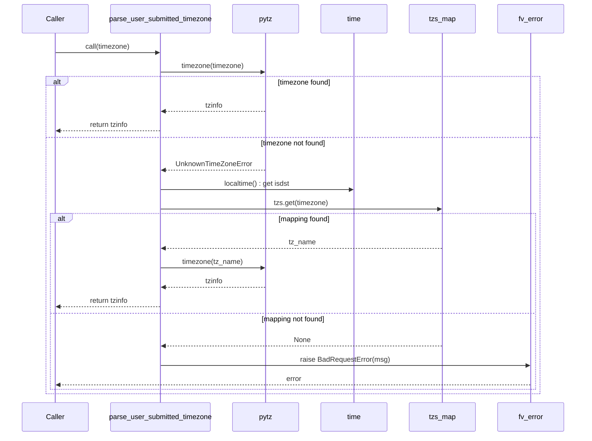

# Diagram: entity_core/entity_service/entity_service/common/csv_utils.py


> Auto-generated by Obscura crawlers

## Diagram 1

```mermaid
flowchart LR
TS[parse_user_submitted_timestamp(timestamp)] --> ED[extract_date(ts, format)]
ED --> CHECK{parsed?}
CHECK -->|yes| RETURN[return dt]
CHECK -->|no| NEXT[try next format]
TS --> F1["format: %Y-%m-%dT%H:%M:%S.%f"] --> ED
TS --> F2["format: %Y-%m-%dT%H:%M:%S"] --> ED
TS --> F3["format: %Y-%m-%d %H:%M:%S.%f"] --> ED
TS --> F4["format: %Y-%m-%d %H:%M:%S"] --> ED
NEXT --> ED
```

> SVG rendering failed for this diagram.

## Diagram 2



### SVG

<svg id="container" width="1223.859375" xmlns="http://www.w3.org/2000/svg" class="classDiagram" height="408" viewBox="0 0 1223.859375 408" role="graphics-document document" aria-roledescription="class"><style>#container{font-family:"trebuchet ms",verdana,arial,sans-serif;font-size:16px;fill:#333;}@keyframes edge-animation-frame{from{stroke-dashoffset:0;}}@keyframes dash{to{stroke-dashoffset:0;}}#container .edge-animation-slow{stroke-dasharray:9,5!important;stroke-dashoffset:900;animation:dash 50s linear infinite;stroke-linecap:round;}#container .edge-animation-fast{stroke-dasharray:9,5!important;stroke-dashoffset:900;animation:dash 20s linear infinite;stroke-linecap:round;}#container .error-icon{fill:#552222;}#container .error-text{fill:#552222;stroke:#552222;}#container .edge-thickness-normal{stroke-width:1px;}#container .edge-thickness-thick{stroke-width:3.5px;}#container .edge-pattern-solid{stroke-dasharray:0;}#container .edge-thickness-invisible{stroke-width:0;fill:none;}#container .edge-pattern-dashed{stroke-dasharray:3;}#container .edge-pattern-dotted{stroke-dasharray:2;}#container .marker{fill:#333333;stroke:#333333;}#container .marker.cross{stroke:#333333;}#container svg{font-family:"trebuchet ms",verdana,arial,sans-serif;font-size:16px;}#container p{margin:0;}#container g.classGroup text{fill:#9370DB;stroke:none;font-family:"trebuchet ms",verdana,arial,sans-serif;font-size:10px;}#container g.classGroup text .title{font-weight:bolder;}#container .nodeLabel,#container .edgeLabel{color:#131300;}#container .edgeLabel .label rect{fill:#ECECFF;}#container .label text{fill:#131300;}#container .labelBkg{background:#ECECFF;}#container .edgeLabel .label span{background:#ECECFF;}#container .classTitle{font-weight:bolder;}#container .node rect,#container .node circle,#container .node ellipse,#container .node polygon,#container .node path{fill:#ECECFF;stroke:#9370DB;stroke-width:1px;}#container .divider{stroke:#9370DB;stroke-width:1;}#container g.clickable{cursor:pointer;}#container g.classGroup rect{fill:#ECECFF;stroke:#9370DB;}#container g.classGroup line{stroke:#9370DB;stroke-width:1;}#container .classLabel .box{stroke:none;stroke-width:0;fill:#ECECFF;opacity:0.5;}#container .classLabel .label{fill:#9370DB;font-size:10px;}#container .relation{stroke:#333333;stroke-width:1;fill:none;}#container .dashed-line{stroke-dasharray:3;}#container .dotted-line{stroke-dasharray:1 2;}#container #compositionStart,#container .composition{fill:#333333!important;stroke:#333333!important;stroke-width:1;}#container #compositionEnd,#container .composition{fill:#333333!important;stroke:#333333!important;stroke-width:1;}#container #dependencyStart,#container .dependency{fill:#333333!important;stroke:#333333!important;stroke-width:1;}#container #dependencyStart,#container .dependency{fill:#333333!important;stroke:#333333!important;stroke-width:1;}#container #extensionStart,#container .extension{fill:transparent!important;stroke:#333333!important;stroke-width:1;}#container #extensionEnd,#container .extension{fill:transparent!important;stroke:#333333!important;stroke-width:1;}#container #aggregationStart,#container .aggregation{fill:transparent!important;stroke:#333333!important;stroke-width:1;}#container #aggregationEnd,#container .aggregation{fill:transparent!important;stroke:#333333!important;stroke-width:1;}#container #lollipopStart,#container .lollipop{fill:#ECECFF!important;stroke:#333333!important;stroke-width:1;}#container #lollipopEnd,#container .lollipop{fill:#ECECFF!important;stroke:#333333!important;stroke-width:1;}#container .edgeTerminals{font-size:11px;line-height:initial;}#container .classTitleText{text-anchor:middle;font-size:18px;fill:#333;}#container .label-icon{display:inline-block;height:1em;overflow:visible;vertical-align:-0.125em;}#container .node .label-icon path{fill:currentColor;stroke:revert;stroke-width:revert;}#container :root{--mermaid-font-family:"trebuchet ms",verdana,arial,sans-serif;}</style><g><defs><marker id="container_class-aggregationStart" class="marker aggregation class" refX="18" refY="7" markerWidth="190" markerHeight="240" orient="auto"><path d="M 18,7 L9,13 L1,7 L9,1 Z"></path></marker></defs><defs><marker id="container_class-aggregationEnd" class="marker aggregation class" refX="1" refY="7" markerWidth="20" markerHeight="28" orient="auto"><path d="M 18,7 L9,13 L1,7 L9,1 Z"></path></marker></defs><defs><marker id="container_class-extensionStart" class="marker extension class" refX="18" refY="7" markerWidth="190" markerHeight="240" orient="auto"><path d="M 1,7 L18,13 V 1 Z"></path></marker></defs><defs><marker id="container_class-extensionEnd" class="marker extension class" refX="1" refY="7" markerWidth="20" markerHeight="28" orient="auto"><path d="M 1,1 V 13 L18,7 Z"></path></marker></defs><defs><marker id="container_class-compositionStart" class="marker composition class" refX="18" refY="7" markerWidth="190" markerHeight="240" orient="auto"><path d="M 18,7 L9,13 L1,7 L9,1 Z"></path></marker></defs><defs><marker id="container_class-compositionEnd" class="marker composition class" refX="1" refY="7" markerWidth="20" markerHeight="28" orient="auto"><path d="M 18,7 L9,13 L1,7 L9,1 Z"></path></marker></defs><defs><marker id="container_class-dependencyStart" class="marker dependency class" refX="6" refY="7" markerWidth="190" markerHeight="240" orient="auto"><path d="M 5,7 L9,13 L1,7 L9,1 Z"></path></marker></defs><defs><marker id="container_class-dependencyEnd" class="marker dependency class" refX="13" refY="7" markerWidth="20" markerHeight="28" orient="auto"><path d="M 18,7 L9,13 L14,7 L9,1 Z"></path></marker></defs><defs><marker id="container_class-lollipopStart" class="marker lollipop class" refX="13" refY="7" markerWidth="190" markerHeight="240" orient="auto"><circle stroke="black" fill="transparent" cx="7" cy="7" r="6"></circle></marker></defs><defs><marker id="container_class-lollipopEnd" class="marker lollipop class" refX="1" refY="7" markerWidth="190" markerHeight="240" orient="auto"><circle stroke="black" fill="transparent" cx="7" cy="7" r="6"></circle></marker></defs><g class="root"><g class="clusters"></g><g class="edgePaths"><path d="M173.988,188L173.988,196.167C173.988,204.333,173.988,220.667,175.553,234.042C177.118,247.418,180.248,257.836,181.813,263.045L183.378,268.254" id="id_parse_user_submitted_timestamp_pytz_1" class="edge-thickness-normal edge-pattern-solid relation" style=";;;" data-edge="true" data-et="edge" data-id="id_parse_user_submitted_timestamp_pytz_1" data-points="W3sieCI6MTczLjk4ODI4MTI1LCJ5IjoxODh9LHsieCI6MTczLjk4ODI4MTI1LCJ5IjoyMzd9LHsieCI6MTg1LjEwNDE3OTY4NzUsInkiOjI3NH1d" marker-end="url(#container_class-dependencyEnd)"></path><path d="M444.747,200L437.105,206.167C429.463,212.333,414.179,224.667,393.86,237.339C373.541,250.011,348.188,263.022,335.511,269.527L322.834,276.033" id="id_parse_user_submitted_timezone_pytz_2" class="edge-thickness-normal edge-pattern-solid relation" style=";;;" data-edge="true" data-et="edge" data-id="id_parse_user_submitted_timezone_pytz_2" data-points="W3sieCI6NDQ0Ljc0Njc5ODYzNzIxODAzLCJ5IjoyMDB9LHsieCI6Mzk4Ljg5NDUzMTI1LCJ5IjoyMzd9LHsieCI6MzE3LjQ5NjA5Mzc1LCJ5IjoyNzguNzcyMDc1Nzc0MjgwODR9XQ==" marker-end="url(#container_class-dependencyEnd)"></path><path d="M658.376,200L664.456,206.167C670.537,212.333,682.698,224.667,691.348,236.587C699.998,248.507,705.137,260.014,707.706,265.768L710.275,271.521" id="id_parse_user_submitted_timezone_fv_error_3" class="edge-thickness-normal edge-pattern-solid relation" style=";;;" data-edge="true" data-et="edge" data-id="id_parse_user_submitted_timezone_fv_error_3" data-points="W3sieCI6NjU4LjM3NTU1ODAzNTcxNDMsInkiOjIwMH0seyJ4Ijo2OTQuODU5Mzc1LCJ5IjoyMzd9LHsieCI6NzEyLjcyMTg3NSwieSI6Mjc3fV0=" marker-end="url(#container_class-dependencyEnd)"></path><path d="M1027.334,200L1028.983,206.167C1030.633,212.333,1033.932,224.667,1035.581,236C1037.23,247.333,1037.23,257.667,1037.23,262.833L1037.23,268" id="id_get_ordered_dict_array_csv_4" class="edge-thickness-normal edge-pattern-solid relation" style=";;;" data-edge="true" data-et="edge" data-id="id_get_ordered_dict_array_csv_4" data-points="W3sieCI6MTAyNy4zMzM4ODE1Nzg5NDczLCJ5IjoyMDB9LHsieCI6MTAzNy4yMzA0Njg3NSwieSI6MjM3fSx7IngiOjEwMzcuMjMwNDY4NzUsInkiOjI3NH1d" marker-end="url(#container_class-dependencyEnd)"></path><path d="M875.835,200L867.753,206.167C859.671,212.333,843.506,224.667,830.229,236.749C816.951,248.831,806.561,260.661,801.366,266.577L796.171,272.492" id="id_get_ordered_dict_array_fv_error_5" class="edge-thickness-normal edge-pattern-solid relation" style=";;;" data-edge="true" data-et="edge" data-id="id_get_ordered_dict_array_fv_error_5" data-points="W3sieCI6ODc1LjgzNTI5MTM1MzM4MzUsInkiOjIwMH0seyJ4Ijo4MjcuMzQxNzk2ODc1LCJ5IjoyMzd9LHsieCI6NzkyLjIxMTMyODEyNSwieSI6Mjc3fV0=" marker-end="url(#container_class-dependencyEnd)"></path></g><g class="edgeLabels"><g class="edgeLabel" transform="translate(173.98828125, 237)"><g class="label" data-id="id_parse_user_submitted_timestamp_pytz_1" transform="translate(-23.59375, -12)"><foreignObject width="47.1875" height="24"><div xmlns="http://www.w3.org/1999/xhtml" class="labelBkg" style="display: table-cell; white-space: nowrap; line-height: 1.5; max-width: 200px; text-align: center;"><span class="edgeLabel"><p>(none)</p></span></div></foreignObject></g></g><g class="edgeLabel" transform="translate(398.89453125, 237)"><g class="label" data-id="id_parse_user_submitted_timezone_pytz_2" transform="translate(-16.4921875, -12)"><foreignObject width="32.984375" height="24"><div xmlns="http://www.w3.org/1999/xhtml" class="labelBkg" style="display: table-cell; white-space: nowrap; line-height: 1.5; max-width: 200px; text-align: center;"><span class="edgeLabel"><p>uses</p></span></div></foreignObject></g></g><g class="edgeLabel" transform="translate(694.859375, 237)"><g class="label" data-id="id_parse_user_submitted_timezone_fv_error_3" transform="translate(-34.65625, -12)"><foreignObject width="69.3125" height="24"><div xmlns="http://www.w3.org/1999/xhtml" class="labelBkg" style="display: table-cell; white-space: nowrap; line-height: 1.5; max-width: 200px; text-align: center;"><span class="edgeLabel"><p>may raise</p></span></div></foreignObject></g></g><g class="edgeLabel" transform="translate(1037.23046875, 237)"><g class="label" data-id="id_get_ordered_dict_array_csv_4" transform="translate(-16.4921875, -12)"><foreignObject width="32.984375" height="24"><div xmlns="http://www.w3.org/1999/xhtml" class="labelBkg" style="display: table-cell; white-space: nowrap; line-height: 1.5; max-width: 200px; text-align: center;"><span class="edgeLabel"><p>uses</p></span></div></foreignObject></g></g><g class="edgeLabel" transform="translate(827.341796875, 237)"><g class="label" data-id="id_get_ordered_dict_array_fv_error_5" transform="translate(-34.65625, -12)"><foreignObject width="69.3125" height="24"><div xmlns="http://www.w3.org/1999/xhtml" class="labelBkg" style="display: table-cell; white-space: nowrap; line-height: 1.5; max-width: 200px; text-align: center;"><span class="edgeLabel"><p>may raise</p></span></div></foreignObject></g></g></g><g class="nodes"><g class="node default" id="classId-parse_user_submitted_timestamp-0" transform="translate(173.98828125, 104)"><g class="basic label-container"><path d="M-165.98828125 -84 L165.98828125 -84 L165.98828125 84 L-165.98828125 84" stroke="none" stroke-width="0" fill="#ECECFF" style=""></path><path d="M-165.98828125 -84 C-34.225641851707195 -84, 97.53699754658561 -84, 165.98828125 -84 M-165.98828125 -84 C-39.68767139423376 -84, 86.61293846153248 -84, 165.98828125 -84 M165.98828125 -84 C165.98828125 -37.49010486291902, 165.98828125 9.019790274161963, 165.98828125 84 M165.98828125 -84 C165.98828125 -31.504890642217617, 165.98828125 20.990218715564765, 165.98828125 84 M165.98828125 84 C41.63387238873486 84, -82.72053647253028 84, -165.98828125 84 M165.98828125 84 C68.51727215066414 84, -28.953736948671718 84, -165.98828125 84 M-165.98828125 84 C-165.98828125 36.93214081307666, -165.98828125 -10.135718373846686, -165.98828125 -84 M-165.98828125 84 C-165.98828125 23.87915920895861, -165.98828125 -36.24168158208278, -165.98828125 -84" stroke="#9370DB" stroke-width="1.3" fill="none" stroke-dasharray="0 0" style=""></path></g><g class="annotation-group text" transform="translate(0, -60)"></g><g class="label-group text" transform="translate(-124.6796875, -60)"><g class="label" style="font-weight: bolder" transform="translate(0,-12)"><foreignObject width="249.359375" height="24"><div xmlns="http://www.w3.org/1999/xhtml" style="display: table-cell; white-space: nowrap; line-height: 1.5; max-width: 296px; text-align: center;"><span class="nodeLabel markdown-node-label" style=""><p>parse_user_submitted_timestamp</p></span></div></foreignObject></g></g><g class="members-group text" transform="translate(-153.98828125, -12)"><g class="label" style="" transform="translate(0,-12)"><foreignObject width="113.1875" height="24"><div xmlns="http://www.w3.org/1999/xhtml" style="display: table-cell; white-space: nowrap; line-height: 1.5; max-width: 171px; text-align: center;"><span class="nodeLabel markdown-node-label" style=""><p>+timestamp: str</p></span></div></foreignObject></g><g class="label" style="" transform="translate(0,12)"><foreignObject width="183.296875" height="24"><div xmlns="http://www.w3.org/1999/xhtml" style="display: table-cell; white-space: nowrap; line-height: 1.5; max-width: 241px; text-align: center;"><span class="nodeLabel markdown-node-label" style=""><p>+returns datetime | None</p></span></div></foreignObject></g></g><g class="methods-group text" transform="translate(-153.98828125, 60)"><g class="label" style="" transform="translate(0,-12)"><foreignObject width="178.984375" height="24"><div xmlns="http://www.w3.org/1999/xhtml" style="display: table-cell; white-space: nowrap; line-height: 1.5; max-width: 236px; text-align: center;"><span class="nodeLabel markdown-node-label" style=""><p>+extract_date(ts, format)</p></span></div></foreignObject></g></g><g class="divider" style=""><path d="M-165.98828125 -36 C-87.86260566466684 -36, -9.736930079333689 -36, 165.98828125 -36 M-165.98828125 -36 C-99.21251551634876 -36, -32.43674978269752 -36, 165.98828125 -36" stroke="#9370DB" stroke-width="1.3" fill="none" stroke-dasharray="0 0" style=""></path></g><g class="divider" style=""><path d="M-165.98828125 36 C-39.1573038847758 36, 87.6736734804484 36, 165.98828125 36 M-165.98828125 36 C-86.25283823696104 36, -6.51739522392208 36, 165.98828125 36" stroke="#9370DB" stroke-width="1.3" fill="none" stroke-dasharray="0 0" style=""></path></g></g><g class="node default" id="classId-parse_user_submitted_timezone-1" transform="translate(563.71484375, 104)"><g class="basic label-container"><path d="M-173.73828125 -96 L173.73828125 -96 L173.73828125 96 L-173.73828125 96" stroke="none" stroke-width="0" fill="#ECECFF" style=""></path><path d="M-173.73828125 -96 C-78.95872164059332 -96, 15.82083796881335 -96, 173.73828125 -96 M-173.73828125 -96 C-40.95107700598976 -96, 91.83612723802048 -96, 173.73828125 -96 M173.73828125 -96 C173.73828125 -41.86188934647181, 173.73828125 12.276221307056375, 173.73828125 96 M173.73828125 -96 C173.73828125 -46.778348970412196, 173.73828125 2.4433020591756076, 173.73828125 96 M173.73828125 96 C89.1998933360963 96, 4.66150542219259 96, -173.73828125 96 M173.73828125 96 C66.91034398785423 96, -39.917593274291534 96, -173.73828125 96 M-173.73828125 96 C-173.73828125 31.821792989509035, -173.73828125 -32.35641402098193, -173.73828125 -96 M-173.73828125 96 C-173.73828125 41.33466152495251, -173.73828125 -13.330676950094983, -173.73828125 -96" stroke="#9370DB" stroke-width="1.3" fill="none" stroke-dasharray="0 0" style=""></path></g><g class="annotation-group text" transform="translate(0, -72)"></g><g class="label-group text" transform="translate(-119.1328125, -72)"><g class="label" style="font-weight: bolder" transform="translate(0,-12)"><foreignObject width="238.265625" height="24"><div xmlns="http://www.w3.org/1999/xhtml" style="display: table-cell; white-space: nowrap; line-height: 1.5; max-width: 286px; text-align: center;"><span class="nodeLabel markdown-node-label" style=""><p>parse_user_submitted_timezone</p></span></div></foreignObject></g></g><g class="members-group text" transform="translate(-161.73828125, -24)"><g class="label" style="" transform="translate(0,-12)"><foreignObject width="102.34375" height="24"><div xmlns="http://www.w3.org/1999/xhtml" style="display: table-cell; white-space: nowrap; line-height: 1.5; max-width: 161px; text-align: center;"><span class="nodeLabel markdown-node-label" style=""><p>+timezone: str</p></span></div></foreignObject></g><g class="label" style="" transform="translate(0,12)"><foreignObject width="155.921875" height="24"><div xmlns="http://www.w3.org/1999/xhtml" style="display: table-cell; white-space: nowrap; line-height: 1.5; max-width: 213px; text-align: center;"><span class="nodeLabel markdown-node-label" style=""><p>+falls back to tzs map</p></span></div></foreignObject></g><g class="label" style="" transform="translate(0,36)"><foreignObject width="204.34375" height="24"><div xmlns="http://www.w3.org/1999/xhtml" style="display: table-cell; white-space: nowrap; line-height: 1.5; max-width: 263px; text-align: center;"><span class="nodeLabel markdown-node-label" style=""><p>+may raise BadRequestError</p></span></div></foreignObject></g></g><g class="methods-group text" transform="translate(-161.73828125, 72)"><g class="label" style="" transform="translate(0,-12)"><foreignObject width="155.9375" height="24"><div xmlns="http://www.w3.org/1999/xhtml" style="display: table-cell; white-space: nowrap; line-height: 1.5; max-width: 213px; text-align: center;"><span class="nodeLabel markdown-node-label" style=""><p>+uses pytz.timezone()</p></span></div></foreignObject></g></g><g class="divider" style=""><path d="M-173.73828125 -48 C-96.92471794894234 -48, -20.11115464788469 -48, 173.73828125 -48 M-173.73828125 -48 C-93.62715292480513 -48, -13.516024599610262 -48, 173.73828125 -48" stroke="#9370DB" stroke-width="1.3" fill="none" stroke-dasharray="0 0" style=""></path></g><g class="divider" style=""><path d="M-173.73828125 48 C-68.65275098870129 48, 36.43277927259743 48, 173.73828125 48 M-173.73828125 48 C-101.37169405294007 48, -29.005106855880143 48, 173.73828125 48" stroke="#9370DB" stroke-width="1.3" fill="none" stroke-dasharray="0 0" style=""></path></g></g><g class="node default" id="classId-get_ordered_dict_array-2" transform="translate(1001.65625, 104)"><g class="basic label-container"><path d="M-214.203125 -96 L214.203125 -96 L214.203125 96 L-214.203125 96" stroke="none" stroke-width="0" fill="#ECECFF" style=""></path><path d="M-214.203125 -96 C-56.64355549079363 -96, 100.91601401841274 -96, 214.203125 -96 M-214.203125 -96 C-54.705593176554714 -96, 104.79193864689057 -96, 214.203125 -96 M214.203125 -96 C214.203125 -24.73361583027156, 214.203125 46.53276833945688, 214.203125 96 M214.203125 -96 C214.203125 -29.16920630692188, 214.203125 37.66158738615624, 214.203125 96 M214.203125 96 C43.70669399001707 96, -126.78973701996586 96, -214.203125 96 M214.203125 96 C82.88132653379131 96, -48.44047193241738 96, -214.203125 96 M-214.203125 96 C-214.203125 45.603535261530425, -214.203125 -4.79292947693915, -214.203125 -96 M-214.203125 96 C-214.203125 50.3592820721183, -214.203125 4.718564144236595, -214.203125 -96" stroke="#9370DB" stroke-width="1.3" fill="none" stroke-dasharray="0 0" style=""></path></g><g class="annotation-group text" transform="translate(0, -72)"></g><g class="label-group text" transform="translate(-85.6875, -72)"><g class="label" style="font-weight: bolder" transform="translate(0,-12)"><foreignObject width="171.375" height="24"><div xmlns="http://www.w3.org/1999/xhtml" style="display: table-cell; white-space: nowrap; line-height: 1.5; max-width: 218px; text-align: center;"><span class="nodeLabel markdown-node-label" style=""><p>get_ordered_dict_array</p></span></div></foreignObject></g></g><g class="members-group text" transform="translate(-202.203125, -24)"><g class="label" style="" transform="translate(0,-12)"><foreignObject width="159.703125" height="24"><div xmlns="http://www.w3.org/1999/xhtml" style="display: table-cell; white-space: nowrap; line-height: 1.5; max-width: 217px; text-align: center;"><span class="nodeLabel markdown-node-label" style=""><p>+raw_payload: list[str]</p></span></div></foreignObject></g><g class="label" style="" transform="translate(0,12)"><foreignObject width="213.671875" height="24"><div xmlns="http://www.w3.org/1999/xhtml" style="display: table-cell; white-space: nowrap; line-height: 1.5; max-width: 271px; text-align: center;"><span class="nodeLabel markdown-node-label" style=""><p>+cleans header, joins payload</p></span></div></foreignObject></g><g class="label" style="" transform="translate(0,36)"><foreignObject width="150.53125" height="24"><div xmlns="http://www.w3.org/1999/xhtml" style="display: table-cell; white-space: nowrap; line-height: 1.5; max-width: 209px; text-align: center;"><span class="nodeLabel markdown-node-label" style=""><p>+uses csv.DictReader</p></span></div></foreignObject></g><g class="label" style="" transform="translate(0,60)"><foreignObject width="318.71875" height="24"><div xmlns="http://www.w3.org/1999/xhtml" style="display: table-cell; white-space: nowrap; line-height: 1.5; max-width: 377px; text-align: center;"><span class="nodeLabel markdown-node-label" style=""><p>+returns list[dict] or raises BadRequestError</p></span></div></foreignObject></g></g><g class="methods-group text" transform="translate(-202.203125, 96)"></g><g class="divider" style=""><path d="M-214.203125 -48 C-121.32452718128606 -48, -28.445929362572116 -48, 214.203125 -48 M-214.203125 -48 C-59.9476895965785 -48, 94.307745806843 -48, 214.203125 -48" stroke="#9370DB" stroke-width="1.3" fill="none" stroke-dasharray="0 0" style=""></path></g><g class="divider" style=""><path d="M-214.203125 72 C-64.43571408706063 72, 85.33169682587874 72, 214.203125 72 M-214.203125 72 C-119.49141663660248 72, -24.77970827320496 72, 214.203125 72" stroke="#9370DB" stroke-width="1.3" fill="none" stroke-dasharray="0 0" style=""></path></g></g><g class="node default" id="classId-pytz-3" transform="translate(204.03125, 337)"><g class="basic label-container"><path d="M-113.46484375 -63 L113.46484375 -63 L113.46484375 63 L-113.46484375 63" stroke="none" stroke-width="0" fill="#ECECFF" style=""></path><path d="M-113.46484375 -63 C-31.2706912029751 -63, 50.9234613440498 -63, 113.46484375 -63 M-113.46484375 -63 C-61.66326377126201 -63, -9.861683792524019 -63, 113.46484375 -63 M113.46484375 -63 C113.46484375 -23.090843273597514, 113.46484375 16.818313452804972, 113.46484375 63 M113.46484375 -63 C113.46484375 -30.90771656037532, 113.46484375 1.1845668792493598, 113.46484375 63 M113.46484375 63 C63.77339066634853 63, 14.081937582697066 63, -113.46484375 63 M113.46484375 63 C31.32116126448919 63, -50.82252122102162 63, -113.46484375 63 M-113.46484375 63 C-113.46484375 30.095863262279252, -113.46484375 -2.8082734754414957, -113.46484375 -63 M-113.46484375 63 C-113.46484375 22.74771275186938, -113.46484375 -17.50457449626124, -113.46484375 -63" stroke="#9370DB" stroke-width="1.3" fill="none" stroke-dasharray="0 0" style=""></path></g><g class="annotation-group text" transform="translate(0, -39)"></g><g class="label-group text" transform="translate(-15.6171875, -39)"><g class="label" style="font-weight: bolder" transform="translate(0,-12)"><foreignObject width="31.234375" height="24"><div xmlns="http://www.w3.org/1999/xhtml" style="display: table-cell; white-space: nowrap; line-height: 1.5; max-width: 80px; text-align: center;"><span class="nodeLabel markdown-node-label" style=""><p>pytz</p></span></div></foreignObject></g></g><g class="members-group text" transform="translate(-101.46484375, 9)"></g><g class="methods-group text" transform="translate(-101.46484375, 39)"><g class="label" style="" transform="translate(0,-12)"><foreignObject width="187.3125" height="24"><div xmlns="http://www.w3.org/1999/xhtml" style="display: table-cell; white-space: nowrap; line-height: 1.5; max-width: 245px; text-align: center;"><span class="nodeLabel markdown-node-label" style=""><p>+timezone(name) : : tzinfo</p></span></div></foreignObject></g></g><g class="divider" style=""><path d="M-113.46484375 -15 C-58.30611131592853 -15, -3.1473788818570654 -15, 113.46484375 -15 M-113.46484375 -15 C-66.95191148584715 -15, -20.43897922169431 -15, 113.46484375 -15" stroke="#9370DB" stroke-width="1.3" fill="none" stroke-dasharray="0 0" style=""></path></g><g class="divider" style=""><path d="M-113.46484375 9 C-67.61113600667764 9, -21.757428263355266 9, 113.46484375 9 M-113.46484375 9 C-48.6102975963999 9, 16.244248557200194 9, 113.46484375 9" stroke="#9370DB" stroke-width="1.3" fill="none" stroke-dasharray="0 0" style=""></path></g></g><g class="node default" id="classId-csv-4" transform="translate(1037.23046875, 337)"><g class="basic label-container"><path d="M-104.80859375 -63 L104.80859375 -63 L104.80859375 63 L-104.80859375 63" stroke="none" stroke-width="0" fill="#ECECFF" style=""></path><path d="M-104.80859375 -63 C-58.281809233680754 -63, -11.755024717361508 -63, 104.80859375 -63 M-104.80859375 -63 C-53.77374874015522 -63, -2.73890373031044 -63, 104.80859375 -63 M104.80859375 -63 C104.80859375 -28.80966498276583, 104.80859375 5.380670034468338, 104.80859375 63 M104.80859375 -63 C104.80859375 -16.342270086859443, 104.80859375 30.315459826281113, 104.80859375 63 M104.80859375 63 C23.53740544054898 63, -57.73378286890204 63, -104.80859375 63 M104.80859375 63 C56.05539764106247 63, 7.30220153212494 63, -104.80859375 63 M-104.80859375 63 C-104.80859375 24.938445917275267, -104.80859375 -13.123108165449466, -104.80859375 -63 M-104.80859375 63 C-104.80859375 37.290304908801645, -104.80859375 11.580609817603289, -104.80859375 -63" stroke="#9370DB" stroke-width="1.3" fill="none" stroke-dasharray="0 0" style=""></path></g><g class="annotation-group text" transform="translate(0, -39)"></g><g class="label-group text" transform="translate(-11.6484375, -39)"><g class="label" style="font-weight: bolder" transform="translate(0,-12)"><foreignObject width="23.296875" height="24"><div xmlns="http://www.w3.org/1999/xhtml" style="display: table-cell; white-space: nowrap; line-height: 1.5; max-width: 73px; text-align: center;"><span class="nodeLabel markdown-node-label" style=""><p>csv</p></span></div></foreignObject></g></g><g class="members-group text" transform="translate(-92.80859375, 9)"></g><g class="methods-group text" transform="translate(-92.80859375, 39)"><g class="label" style="" transform="translate(0,-12)"><foreignObject width="173.96875" height="24"><div xmlns="http://www.w3.org/1999/xhtml" style="display: table-cell; white-space: nowrap; line-height: 1.5; max-width: 231px; text-align: center;"><span class="nodeLabel markdown-node-label" style=""><p>+DictReader(io.StringIO)</p></span></div></foreignObject></g></g><g class="divider" style=""><path d="M-104.80859375 -15 C-24.30135635196757 -15, 56.20588104606486 -15, 104.80859375 -15 M-104.80859375 -15 C-52.66790808744666 -15, -0.5272224248933242 -15, 104.80859375 -15" stroke="#9370DB" stroke-width="1.3" fill="none" stroke-dasharray="0 0" style=""></path></g><g class="divider" style=""><path d="M-104.80859375 9 C-41.765665200452524 9, 21.27726334909495 9, 104.80859375 9 M-104.80859375 9 C-34.03774192098366 9, 36.733109908032674 9, 104.80859375 9" stroke="#9370DB" stroke-width="1.3" fill="none" stroke-dasharray="0 0" style=""></path></g></g><g class="node default" id="classId-fv_error-5" transform="translate(739.515625, 337)"><g class="basic label-container"><path d="M-91.9921875 -60 L91.9921875 -60 L91.9921875 60 L-91.9921875 60" stroke="none" stroke-width="0" fill="#ECECFF" style=""></path><path d="M-91.9921875 -60 C-20.35685106305928 -60, 51.27848537388144 -60, 91.9921875 -60 M-91.9921875 -60 C-50.99542861176698 -60, -9.998669723533965 -60, 91.9921875 -60 M91.9921875 -60 C91.9921875 -29.62367777184396, 91.9921875 0.7526444563120833, 91.9921875 60 M91.9921875 -60 C91.9921875 -14.591448644301153, 91.9921875 30.817102711397695, 91.9921875 60 M91.9921875 60 C51.42013216565101 60, 10.848076831302023 60, -91.9921875 60 M91.9921875 60 C21.167137655384167 60, -49.657912189231666 60, -91.9921875 60 M-91.9921875 60 C-91.9921875 27.882527926208752, -91.9921875 -4.234944147582496, -91.9921875 -60 M-91.9921875 60 C-91.9921875 12.599207087567699, -91.9921875 -34.8015858248646, -91.9921875 -60" stroke="#9370DB" stroke-width="1.3" fill="none" stroke-dasharray="0 0" style=""></path></g><g class="annotation-group text" transform="translate(0, -36)"></g><g class="label-group text" transform="translate(-29.1875, -36)"><g class="label" style="font-weight: bolder" transform="translate(0,-12)"><foreignObject width="58.375" height="24"><div xmlns="http://www.w3.org/1999/xhtml" style="display: table-cell; white-space: nowrap; line-height: 1.5; max-width: 108px; text-align: center;"><span class="nodeLabel markdown-node-label" style=""><p>fv_error</p></span></div></foreignObject></g></g><g class="members-group text" transform="translate(-79.9921875, 12)"><g class="label" style="" transform="translate(0,-12)"><foreignObject width="130.796875" height="24"><div xmlns="http://www.w3.org/1999/xhtml" style="display: table-cell; white-space: nowrap; line-height: 1.5; max-width: 189px; text-align: center;"><span class="nodeLabel markdown-node-label" style=""><p>+BadRequestError</p></span></div></foreignObject></g></g><g class="methods-group text" transform="translate(-79.9921875, 60)"></g><g class="divider" style=""><path d="M-91.9921875 -12 C-20.709605580417303 -12, 50.57297633916539 -12, 91.9921875 -12 M-91.9921875 -12 C-46.93795589147173 -12, -1.8837242829434615 -12, 91.9921875 -12" stroke="#9370DB" stroke-width="1.3" fill="none" stroke-dasharray="0 0" style=""></path></g><g class="divider" style=""><path d="M-91.9921875 36 C-50.839988982319184 36, -9.687790464638368 36, 91.9921875 36 M-91.9921875 36 C-44.08815430081966 36, 3.8158788983606797 36, 91.9921875 36" stroke="#9370DB" stroke-width="1.3" fill="none" stroke-dasharray="0 0" style=""></path></g></g></g></g></g></svg>

## Diagram 3



### SVG

<svg id="container" width="1356" xmlns="http://www.w3.org/2000/svg" height="1043" viewBox="-50 -10 1356 1043" role="graphics-document document" aria-roledescription="sequence"><g><rect x="1106" y="957" fill="#eaeaea" stroke="#666" width="150" height="65" name="fv_error" rx="3" ry="3" class="actor actor-bottom"></rect><text x="1181" y="989.5" dominant-baseline="central" alignment-baseline="central" class="actor actor-box" style="text-anchor: middle; font-size: 16px; font-weight: 400;"><tspan x="1181" dy="0">fv_error</tspan></text></g><g><rect x="906" y="957" fill="#eaeaea" stroke="#666" width="150" height="65" name="tzs_map" rx="3" ry="3" class="actor actor-bottom"></rect><text x="981" y="989.5" dominant-baseline="central" alignment-baseline="central" class="actor actor-box" style="text-anchor: middle; font-size: 16px; font-weight: 400;"><tspan x="981" dy="0">tzs_map</tspan></text></g><g><rect x="706" y="957" fill="#eaeaea" stroke="#666" width="150" height="65" name="time" rx="3" ry="3" class="actor actor-bottom"></rect><text x="781" y="989.5" dominant-baseline="central" alignment-baseline="central" class="actor actor-box" style="text-anchor: middle; font-size: 16px; font-weight: 400;"><tspan x="781" dy="0">time</tspan></text></g><g><rect x="506" y="957" fill="#eaeaea" stroke="#666" width="150" height="65" name="pytz" rx="3" ry="3" class="actor actor-bottom"></rect><text x="581" y="989.5" dominant-baseline="central" alignment-baseline="central" class="actor actor-box" style="text-anchor: middle; font-size: 16px; font-weight: 400;"><tspan x="581" dy="0">pytz</tspan></text></g><g><rect x="200" y="957" fill="#eaeaea" stroke="#666" width="256" height="65" name="parseTZ" rx="3" ry="3" class="actor actor-bottom"></rect><text x="328" y="989.5" dominant-baseline="central" alignment-baseline="central" class="actor actor-box" style="text-anchor: middle; font-size: 16px; font-weight: 400;"><tspan x="328" dy="0">parse_user_submitted_timezone</tspan></text></g><g><rect x="0" y="957" fill="#eaeaea" stroke="#666" width="150" height="65" name="Caller" rx="3" ry="3" class="actor actor-bottom"></rect><text x="75" y="989.5" dominant-baseline="central" alignment-baseline="central" class="actor actor-box" style="text-anchor: middle; font-size: 16px; font-weight: 400;"><tspan x="75" dy="0">Caller</tspan></text></g><g><line id="actor5" x1="1181" y1="65" x2="1181" y2="957" class="actor-line 200" stroke-width="0.5px" stroke="#999" name="fv_error"></line><g id="root-5"><rect x="1106" y="0" fill="#eaeaea" stroke="#666" width="150" height="65" name="fv_error" rx="3" ry="3" class="actor actor-top"></rect><text x="1181" y="32.5" dominant-baseline="central" alignment-baseline="central" class="actor actor-box" style="text-anchor: middle; font-size: 16px; font-weight: 400;"><tspan x="1181" dy="0">fv_error</tspan></text></g></g><g><line id="actor4" x1="981" y1="65" x2="981" y2="957" class="actor-line 200" stroke-width="0.5px" stroke="#999" name="tzs_map"></line><g id="root-4"><rect x="906" y="0" fill="#eaeaea" stroke="#666" width="150" height="65" name="tzs_map" rx="3" ry="3" class="actor actor-top"></rect><text x="981" y="32.5" dominant-baseline="central" alignment-baseline="central" class="actor actor-box" style="text-anchor: middle; font-size: 16px; font-weight: 400;"><tspan x="981" dy="0">tzs_map</tspan></text></g></g><g><line id="actor3" x1="781" y1="65" x2="781" y2="957" class="actor-line 200" stroke-width="0.5px" stroke="#999" name="time"></line><g id="root-3"><rect x="706" y="0" fill="#eaeaea" stroke="#666" width="150" height="65" name="time" rx="3" ry="3" class="actor actor-top"></rect><text x="781" y="32.5" dominant-baseline="central" alignment-baseline="central" class="actor actor-box" style="text-anchor: middle; font-size: 16px; font-weight: 400;"><tspan x="781" dy="0">time</tspan></text></g></g><g><line id="actor2" x1="581" y1="65" x2="581" y2="957" class="actor-line 200" stroke-width="0.5px" stroke="#999" name="pytz"></line><g id="root-2"><rect x="506" y="0" fill="#eaeaea" stroke="#666" width="150" height="65" name="pytz" rx="3" ry="3" class="actor actor-top"></rect><text x="581" y="32.5" dominant-baseline="central" alignment-baseline="central" class="actor actor-box" style="text-anchor: middle; font-size: 16px; font-weight: 400;"><tspan x="581" dy="0">pytz</tspan></text></g></g><g><line id="actor1" x1="328" y1="65" x2="328" y2="957" class="actor-line 200" stroke-width="0.5px" stroke="#999" name="parseTZ"></line><g id="root-1"><rect x="200" y="0" fill="#eaeaea" stroke="#666" width="256" height="65" name="parseTZ" rx="3" ry="3" class="actor actor-top"></rect><text x="328" y="32.5" dominant-baseline="central" alignment-baseline="central" class="actor actor-box" style="text-anchor: middle; font-size: 16px; font-weight: 400;"><tspan x="328" dy="0">parse_user_submitted_timezone</tspan></text></g></g><g><line id="actor0" x1="75" y1="65" x2="75" y2="957" class="actor-line 200" stroke-width="0.5px" stroke="#999" name="Caller"></line><g id="root-0"><rect x="0" y="0" fill="#eaeaea" stroke="#666" width="150" height="65" name="Caller" rx="3" ry="3" class="actor actor-top"></rect><text x="75" y="32.5" dominant-baseline="central" alignment-baseline="central" class="actor actor-box" style="text-anchor: middle; font-size: 16px; font-weight: 400;"><tspan x="75" dy="0">Caller</tspan></text></g></g><style>#container{font-family:"trebuchet ms",verdana,arial,sans-serif;font-size:16px;fill:#333;}@keyframes edge-animation-frame{from{stroke-dashoffset:0;}}@keyframes dash{to{stroke-dashoffset:0;}}#container .edge-animation-slow{stroke-dasharray:9,5!important;stroke-dashoffset:900;animation:dash 50s linear infinite;stroke-linecap:round;}#container .edge-animation-fast{stroke-dasharray:9,5!important;stroke-dashoffset:900;animation:dash 20s linear infinite;stroke-linecap:round;}#container .error-icon{fill:#552222;}#container .error-text{fill:#552222;stroke:#552222;}#container .edge-thickness-normal{stroke-width:1px;}#container .edge-thickness-thick{stroke-width:3.5px;}#container .edge-pattern-solid{stroke-dasharray:0;}#container .edge-thickness-invisible{stroke-width:0;fill:none;}#container .edge-pattern-dashed{stroke-dasharray:3;}#container .edge-pattern-dotted{stroke-dasharray:2;}#container .marker{fill:#333333;stroke:#333333;}#container .marker.cross{stroke:#333333;}#container svg{font-family:"trebuchet ms",verdana,arial,sans-serif;font-size:16px;}#container p{margin:0;}#container .actor{stroke:hsl(259.6261682243, 59.7765363128%, 87.9019607843%);fill:#ECECFF;}#container text.actor&gt;tspan{fill:black;stroke:none;}#container .actor-line{stroke:hsl(259.6261682243, 59.7765363128%, 87.9019607843%);}#container .innerArc{stroke-width:1.5;stroke-dasharray:none;}#container .messageLine0{stroke-width:1.5;stroke-dasharray:none;stroke:#333;}#container .messageLine1{stroke-width:1.5;stroke-dasharray:2,2;stroke:#333;}#container #arrowhead path{fill:#333;stroke:#333;}#container .sequenceNumber{fill:white;}#container #sequencenumber{fill:#333;}#container #crosshead path{fill:#333;stroke:#333;}#container .messageText{fill:#333;stroke:none;}#container .labelBox{stroke:hsl(259.6261682243, 59.7765363128%, 87.9019607843%);fill:#ECECFF;}#container .labelText,#container .labelText&gt;tspan{fill:black;stroke:none;}#container .loopText,#container .loopText&gt;tspan{fill:black;stroke:none;}#container .loopLine{stroke-width:2px;stroke-dasharray:2,2;stroke:hsl(259.6261682243, 59.7765363128%, 87.9019607843%);fill:hsl(259.6261682243, 59.7765363128%, 87.9019607843%);}#container .note{stroke:#aaaa33;fill:#fff5ad;}#container .noteText,#container .noteText&gt;tspan{fill:black;stroke:none;}#container .activation0{fill:#f4f4f4;stroke:#666;}#container .activation1{fill:#f4f4f4;stroke:#666;}#container .activation2{fill:#f4f4f4;stroke:#666;}#container .actorPopupMenu{position:absolute;}#container .actorPopupMenuPanel{position:absolute;fill:#ECECFF;box-shadow:0px 8px 16px 0px rgba(0,0,0,0.2);filter:drop-shadow(3px 5px 2px rgb(0 0 0 / 0.4));}#container .actor-man line{stroke:hsl(259.6261682243, 59.7765363128%, 87.9019607843%);fill:#ECECFF;}#container .actor-man circle,#container line{stroke:hsl(259.6261682243, 59.7765363128%, 87.9019607843%);fill:#ECECFF;stroke-width:2px;}#container :root{--mermaid-font-family:"trebuchet ms",verdana,arial,sans-serif;}</style><g></g><defs><symbol id="computer" width="24" height="24"><path transform="scale(.5)" d="M2 2v13h20v-13h-20zm18 11h-16v-9h16v9zm-10.228 6l.466-1h3.524l.467 1h-4.457zm14.228 3h-24l2-6h2.104l-1.33 4h18.45l-1.297-4h2.073l2 6zm-5-10h-14v-7h14v7z"></path></symbol></defs><defs><symbol id="database" fill-rule="evenodd" clip-rule="evenodd"><path transform="scale(.5)" d="M12.258.001l.256.004.255.005.253.008.251.01.249.012.247.015.246.016.242.019.241.02.239.023.236.024.233.027.231.028.229.031.225.032.223.034.22.036.217.038.214.04.211.041.208.043.205.045.201.046.198.048.194.05.191.051.187.053.183.054.18.056.175.057.172.059.168.06.163.061.16.063.155.064.15.066.074.033.073.033.071.034.07.034.069.035.068.035.067.035.066.035.064.036.064.036.062.036.06.036.06.037.058.037.058.037.055.038.055.038.053.038.052.038.051.039.05.039.048.039.047.039.045.04.044.04.043.04.041.04.04.041.039.041.037.041.036.041.034.041.033.042.032.042.03.042.029.042.027.042.026.043.024.043.023.043.021.043.02.043.018.044.017.043.015.044.013.044.012.044.011.045.009.044.007.045.006.045.004.045.002.045.001.045v17l-.001.045-.002.045-.004.045-.006.045-.007.045-.009.044-.011.045-.012.044-.013.044-.015.044-.017.043-.018.044-.02.043-.021.043-.023.043-.024.043-.026.043-.027.042-.029.042-.03.042-.032.042-.033.042-.034.041-.036.041-.037.041-.039.041-.04.041-.041.04-.043.04-.044.04-.045.04-.047.039-.048.039-.05.039-.051.039-.052.038-.053.038-.055.038-.055.038-.058.037-.058.037-.06.037-.06.036-.062.036-.064.036-.064.036-.066.035-.067.035-.068.035-.069.035-.07.034-.071.034-.073.033-.074.033-.15.066-.155.064-.16.063-.163.061-.168.06-.172.059-.175.057-.18.056-.183.054-.187.053-.191.051-.194.05-.198.048-.201.046-.205.045-.208.043-.211.041-.214.04-.217.038-.22.036-.223.034-.225.032-.229.031-.231.028-.233.027-.236.024-.239.023-.241.02-.242.019-.246.016-.247.015-.249.012-.251.01-.253.008-.255.005-.256.004-.258.001-.258-.001-.256-.004-.255-.005-.253-.008-.251-.01-.249-.012-.247-.015-.245-.016-.243-.019-.241-.02-.238-.023-.236-.024-.234-.027-.231-.028-.228-.031-.226-.032-.223-.034-.22-.036-.217-.038-.214-.04-.211-.041-.208-.043-.204-.045-.201-.046-.198-.048-.195-.05-.19-.051-.187-.053-.184-.054-.179-.056-.176-.057-.172-.059-.167-.06-.164-.061-.159-.063-.155-.064-.151-.066-.074-.033-.072-.033-.072-.034-.07-.034-.069-.035-.068-.035-.067-.035-.066-.035-.064-.036-.063-.036-.062-.036-.061-.036-.06-.037-.058-.037-.057-.037-.056-.038-.055-.038-.053-.038-.052-.038-.051-.039-.049-.039-.049-.039-.046-.039-.046-.04-.044-.04-.043-.04-.041-.04-.04-.041-.039-.041-.037-.041-.036-.041-.034-.041-.033-.042-.032-.042-.03-.042-.029-.042-.027-.042-.026-.043-.024-.043-.023-.043-.021-.043-.02-.043-.018-.044-.017-.043-.015-.044-.013-.044-.012-.044-.011-.045-.009-.044-.007-.045-.006-.045-.004-.045-.002-.045-.001-.045v-17l.001-.045.002-.045.004-.045.006-.045.007-.045.009-.044.011-.045.012-.044.013-.044.015-.044.017-.043.018-.044.02-.043.021-.043.023-.043.024-.043.026-.043.027-.042.029-.042.03-.042.032-.042.033-.042.034-.041.036-.041.037-.041.039-.041.04-.041.041-.04.043-.04.044-.04.046-.04.046-.039.049-.039.049-.039.051-.039.052-.038.053-.038.055-.038.056-.038.057-.037.058-.037.06-.037.061-.036.062-.036.063-.036.064-.036.066-.035.067-.035.068-.035.069-.035.07-.034.072-.034.072-.033.074-.033.151-.066.155-.064.159-.063.164-.061.167-.06.172-.059.176-.057.179-.056.184-.054.187-.053.19-.051.195-.05.198-.048.201-.046.204-.045.208-.043.211-.041.214-.04.217-.038.22-.036.223-.034.226-.032.228-.031.231-.028.234-.027.236-.024.238-.023.241-.02.243-.019.245-.016.247-.015.249-.012.251-.01.253-.008.255-.005.256-.004.258-.001.258.001zm-9.258 20.499v.01l.001.021.003.021.004.022.005.021.006.022.007.022.009.023.01.022.011.023.012.023.013.023.015.023.016.024.017.023.018.024.019.024.021.024.022.025.023.024.024.025.052.049.056.05.061.051.066.051.07.051.075.051.079.052.084.052.088.052.092.052.097.052.102.051.105.052.11.052.114.051.119.051.123.051.127.05.131.05.135.05.139.048.144.049.147.047.152.047.155.047.16.045.163.045.167.043.171.043.176.041.178.041.183.039.187.039.19.037.194.035.197.035.202.033.204.031.209.03.212.029.216.027.219.025.222.024.226.021.23.02.233.018.236.016.24.015.243.012.246.01.249.008.253.005.256.004.259.001.26-.001.257-.004.254-.005.25-.008.247-.011.244-.012.241-.014.237-.016.233-.018.231-.021.226-.021.224-.024.22-.026.216-.027.212-.028.21-.031.205-.031.202-.034.198-.034.194-.036.191-.037.187-.039.183-.04.179-.04.175-.042.172-.043.168-.044.163-.045.16-.046.155-.046.152-.047.148-.048.143-.049.139-.049.136-.05.131-.05.126-.05.123-.051.118-.052.114-.051.11-.052.106-.052.101-.052.096-.052.092-.052.088-.053.083-.051.079-.052.074-.052.07-.051.065-.051.06-.051.056-.05.051-.05.023-.024.023-.025.021-.024.02-.024.019-.024.018-.024.017-.024.015-.023.014-.024.013-.023.012-.023.01-.023.01-.022.008-.022.006-.022.006-.022.004-.022.004-.021.001-.021.001-.021v-4.127l-.077.055-.08.053-.083.054-.085.053-.087.052-.09.052-.093.051-.095.05-.097.05-.1.049-.102.049-.105.048-.106.047-.109.047-.111.046-.114.045-.115.045-.118.044-.12.043-.122.042-.124.042-.126.041-.128.04-.13.04-.132.038-.134.038-.135.037-.138.037-.139.035-.142.035-.143.034-.144.033-.147.032-.148.031-.15.03-.151.03-.153.029-.154.027-.156.027-.158.026-.159.025-.161.024-.162.023-.163.022-.165.021-.166.02-.167.019-.169.018-.169.017-.171.016-.173.015-.173.014-.175.013-.175.012-.177.011-.178.01-.179.008-.179.008-.181.006-.182.005-.182.004-.184.003-.184.002h-.37l-.184-.002-.184-.003-.182-.004-.182-.005-.181-.006-.179-.008-.179-.008-.178-.01-.176-.011-.176-.012-.175-.013-.173-.014-.172-.015-.171-.016-.17-.017-.169-.018-.167-.019-.166-.02-.165-.021-.163-.022-.162-.023-.161-.024-.159-.025-.157-.026-.156-.027-.155-.027-.153-.029-.151-.03-.15-.03-.148-.031-.146-.032-.145-.033-.143-.034-.141-.035-.14-.035-.137-.037-.136-.037-.134-.038-.132-.038-.13-.04-.128-.04-.126-.041-.124-.042-.122-.042-.12-.044-.117-.043-.116-.045-.113-.045-.112-.046-.109-.047-.106-.047-.105-.048-.102-.049-.1-.049-.097-.05-.095-.05-.093-.052-.09-.051-.087-.052-.085-.053-.083-.054-.08-.054-.077-.054v4.127zm0-5.654v.011l.001.021.003.021.004.021.005.022.006.022.007.022.009.022.01.022.011.023.012.023.013.023.015.024.016.023.017.024.018.024.019.024.021.024.022.024.023.025.024.024.052.05.056.05.061.05.066.051.07.051.075.052.079.051.084.052.088.052.092.052.097.052.102.052.105.052.11.051.114.051.119.052.123.05.127.051.131.05.135.049.139.049.144.048.147.048.152.047.155.046.16.045.163.045.167.044.171.042.176.042.178.04.183.04.187.038.19.037.194.036.197.034.202.033.204.032.209.03.212.028.216.027.219.025.222.024.226.022.23.02.233.018.236.016.24.014.243.012.246.01.249.008.253.006.256.003.259.001.26-.001.257-.003.254-.006.25-.008.247-.01.244-.012.241-.015.237-.016.233-.018.231-.02.226-.022.224-.024.22-.025.216-.027.212-.029.21-.03.205-.032.202-.033.198-.035.194-.036.191-.037.187-.039.183-.039.179-.041.175-.042.172-.043.168-.044.163-.045.16-.045.155-.047.152-.047.148-.048.143-.048.139-.05.136-.049.131-.05.126-.051.123-.051.118-.051.114-.052.11-.052.106-.052.101-.052.096-.052.092-.052.088-.052.083-.052.079-.052.074-.051.07-.052.065-.051.06-.05.056-.051.051-.049.023-.025.023-.024.021-.025.02-.024.019-.024.018-.024.017-.024.015-.023.014-.023.013-.024.012-.022.01-.023.01-.023.008-.022.006-.022.006-.022.004-.021.004-.022.001-.021.001-.021v-4.139l-.077.054-.08.054-.083.054-.085.052-.087.053-.09.051-.093.051-.095.051-.097.05-.1.049-.102.049-.105.048-.106.047-.109.047-.111.046-.114.045-.115.044-.118.044-.12.044-.122.042-.124.042-.126.041-.128.04-.13.039-.132.039-.134.038-.135.037-.138.036-.139.036-.142.035-.143.033-.144.033-.147.033-.148.031-.15.03-.151.03-.153.028-.154.028-.156.027-.158.026-.159.025-.161.024-.162.023-.163.022-.165.021-.166.02-.167.019-.169.018-.169.017-.171.016-.173.015-.173.014-.175.013-.175.012-.177.011-.178.009-.179.009-.179.007-.181.007-.182.005-.182.004-.184.003-.184.002h-.37l-.184-.002-.184-.003-.182-.004-.182-.005-.181-.007-.179-.007-.179-.009-.178-.009-.176-.011-.176-.012-.175-.013-.173-.014-.172-.015-.171-.016-.17-.017-.169-.018-.167-.019-.166-.02-.165-.021-.163-.022-.162-.023-.161-.024-.159-.025-.157-.026-.156-.027-.155-.028-.153-.028-.151-.03-.15-.03-.148-.031-.146-.033-.145-.033-.143-.033-.141-.035-.14-.036-.137-.036-.136-.037-.134-.038-.132-.039-.13-.039-.128-.04-.126-.041-.124-.042-.122-.043-.12-.043-.117-.044-.116-.044-.113-.046-.112-.046-.109-.046-.106-.047-.105-.048-.102-.049-.1-.049-.097-.05-.095-.051-.093-.051-.09-.051-.087-.053-.085-.052-.083-.054-.08-.054-.077-.054v4.139zm0-5.666v.011l.001.02.003.022.004.021.005.022.006.021.007.022.009.023.01.022.011.023.012.023.013.023.015.023.016.024.017.024.018.023.019.024.021.025.022.024.023.024.024.025.052.05.056.05.061.05.066.051.07.051.075.052.079.051.084.052.088.052.092.052.097.052.102.052.105.051.11.052.114.051.119.051.123.051.127.05.131.05.135.05.139.049.144.048.147.048.152.047.155.046.16.045.163.045.167.043.171.043.176.042.178.04.183.04.187.038.19.037.194.036.197.034.202.033.204.032.209.03.212.028.216.027.219.025.222.024.226.021.23.02.233.018.236.017.24.014.243.012.246.01.249.008.253.006.256.003.259.001.26-.001.257-.003.254-.006.25-.008.247-.01.244-.013.241-.014.237-.016.233-.018.231-.02.226-.022.224-.024.22-.025.216-.027.212-.029.21-.03.205-.032.202-.033.198-.035.194-.036.191-.037.187-.039.183-.039.179-.041.175-.042.172-.043.168-.044.163-.045.16-.045.155-.047.152-.047.148-.048.143-.049.139-.049.136-.049.131-.051.126-.05.123-.051.118-.052.114-.051.11-.052.106-.052.101-.052.096-.052.092-.052.088-.052.083-.052.079-.052.074-.052.07-.051.065-.051.06-.051.056-.05.051-.049.023-.025.023-.025.021-.024.02-.024.019-.024.018-.024.017-.024.015-.023.014-.024.013-.023.012-.023.01-.022.01-.023.008-.022.006-.022.006-.022.004-.022.004-.021.001-.021.001-.021v-4.153l-.077.054-.08.054-.083.053-.085.053-.087.053-.09.051-.093.051-.095.051-.097.05-.1.049-.102.048-.105.048-.106.048-.109.046-.111.046-.114.046-.115.044-.118.044-.12.043-.122.043-.124.042-.126.041-.128.04-.13.039-.132.039-.134.038-.135.037-.138.036-.139.036-.142.034-.143.034-.144.033-.147.032-.148.032-.15.03-.151.03-.153.028-.154.028-.156.027-.158.026-.159.024-.161.024-.162.023-.163.023-.165.021-.166.02-.167.019-.169.018-.169.017-.171.016-.173.015-.173.014-.175.013-.175.012-.177.01-.178.01-.179.009-.179.007-.181.006-.182.006-.182.004-.184.003-.184.001-.185.001-.185-.001-.184-.001-.184-.003-.182-.004-.182-.006-.181-.006-.179-.007-.179-.009-.178-.01-.176-.01-.176-.012-.175-.013-.173-.014-.172-.015-.171-.016-.17-.017-.169-.018-.167-.019-.166-.02-.165-.021-.163-.023-.162-.023-.161-.024-.159-.024-.157-.026-.156-.027-.155-.028-.153-.028-.151-.03-.15-.03-.148-.032-.146-.032-.145-.033-.143-.034-.141-.034-.14-.036-.137-.036-.136-.037-.134-.038-.132-.039-.13-.039-.128-.041-.126-.041-.124-.041-.122-.043-.12-.043-.117-.044-.116-.044-.113-.046-.112-.046-.109-.046-.106-.048-.105-.048-.102-.048-.1-.05-.097-.049-.095-.051-.093-.051-.09-.052-.087-.052-.085-.053-.083-.053-.08-.054-.077-.054v4.153zm8.74-8.179l-.257.004-.254.005-.25.008-.247.011-.244.012-.241.014-.237.016-.233.018-.231.021-.226.022-.224.023-.22.026-.216.027-.212.028-.21.031-.205.032-.202.033-.198.034-.194.036-.191.038-.187.038-.183.04-.179.041-.175.042-.172.043-.168.043-.163.045-.16.046-.155.046-.152.048-.148.048-.143.048-.139.049-.136.05-.131.05-.126.051-.123.051-.118.051-.114.052-.11.052-.106.052-.101.052-.096.052-.092.052-.088.052-.083.052-.079.052-.074.051-.07.052-.065.051-.06.05-.056.05-.051.05-.023.025-.023.024-.021.024-.02.025-.019.024-.018.024-.017.023-.015.024-.014.023-.013.023-.012.023-.01.023-.01.022-.008.022-.006.023-.006.021-.004.022-.004.021-.001.021-.001.021.001.021.001.021.004.021.004.022.006.021.006.023.008.022.01.022.01.023.012.023.013.023.014.023.015.024.017.023.018.024.019.024.02.025.021.024.023.024.023.025.051.05.056.05.06.05.065.051.07.052.074.051.079.052.083.052.088.052.092.052.096.052.101.052.106.052.11.052.114.052.118.051.123.051.126.051.131.05.136.05.139.049.143.048.148.048.152.048.155.046.16.046.163.045.168.043.172.043.175.042.179.041.183.04.187.038.191.038.194.036.198.034.202.033.205.032.21.031.212.028.216.027.22.026.224.023.226.022.231.021.233.018.237.016.241.014.244.012.247.011.25.008.254.005.257.004.26.001.26-.001.257-.004.254-.005.25-.008.247-.011.244-.012.241-.014.237-.016.233-.018.231-.021.226-.022.224-.023.22-.026.216-.027.212-.028.21-.031.205-.032.202-.033.198-.034.194-.036.191-.038.187-.038.183-.04.179-.041.175-.042.172-.043.168-.043.163-.045.16-.046.155-.046.152-.048.148-.048.143-.048.139-.049.136-.05.131-.05.126-.051.123-.051.118-.051.114-.052.11-.052.106-.052.101-.052.096-.052.092-.052.088-.052.083-.052.079-.052.074-.051.07-.052.065-.051.06-.05.056-.05.051-.05.023-.025.023-.024.021-.024.02-.025.019-.024.018-.024.017-.023.015-.024.014-.023.013-.023.012-.023.01-.023.01-.022.008-.022.006-.023.006-.021.004-.022.004-.021.001-.021.001-.021-.001-.021-.001-.021-.004-.021-.004-.022-.006-.021-.006-.023-.008-.022-.01-.022-.01-.023-.012-.023-.013-.023-.014-.023-.015-.024-.017-.023-.018-.024-.019-.024-.02-.025-.021-.024-.023-.024-.023-.025-.051-.05-.056-.05-.06-.05-.065-.051-.07-.052-.074-.051-.079-.052-.083-.052-.088-.052-.092-.052-.096-.052-.101-.052-.106-.052-.11-.052-.114-.052-.118-.051-.123-.051-.126-.051-.131-.05-.136-.05-.139-.049-.143-.048-.148-.048-.152-.048-.155-.046-.16-.046-.163-.045-.168-.043-.172-.043-.175-.042-.179-.041-.183-.04-.187-.038-.191-.038-.194-.036-.198-.034-.202-.033-.205-.032-.21-.031-.212-.028-.216-.027-.22-.026-.224-.023-.226-.022-.231-.021-.233-.018-.237-.016-.241-.014-.244-.012-.247-.011-.25-.008-.254-.005-.257-.004-.26-.001-.26.001z"></path></symbol></defs><defs><symbol id="clock" width="24" height="24"><path transform="scale(.5)" d="M12 2c5.514 0 10 4.486 10 10s-4.486 10-10 10-10-4.486-10-10 4.486-10 10-10zm0-2c-6.627 0-12 5.373-12 12s5.373 12 12 12 12-5.373 12-12-5.373-12-12-12zm5.848 12.459c.202.038.202.333.001.372-1.907.361-6.045 1.111-6.547 1.111-.719 0-1.301-.582-1.301-1.301 0-.512.77-5.447 1.125-7.445.034-.192.312-.181.343.014l.985 6.238 5.394 1.011z"></path></symbol></defs><defs><marker id="arrowhead" refX="7.9" refY="5" markerUnits="userSpaceOnUse" markerWidth="12" markerHeight="12" orient="auto-start-reverse"><path d="M -1 0 L 10 5 L 0 10 z"></path></marker></defs><defs><marker id="crosshead" markerWidth="15" markerHeight="8" orient="auto" refX="4" refY="4.5"><path fill="none" stroke="#000000" stroke-width="1pt" d="M 1,2 L 6,7 M 6,2 L 1,7" style="stroke-dasharray: 0, 0;"></path></marker></defs><defs><marker id="filled-head" refX="15.5" refY="7" markerWidth="20" markerHeight="28" orient="auto"><path d="M 18,7 L9,13 L14,7 L9,1 Z"></path></marker></defs><defs><marker id="sequencenumber" refX="15" refY="15" markerWidth="60" markerHeight="40" orient="auto"><circle cx="15" cy="15" r="6"></circle></marker></defs><g><line x1="64" y1="501" x2="1192" y2="501" class="loopLine"></line><line x1="1192" y1="501" x2="1192" y2="927" class="loopLine"></line><line x1="64" y1="927" x2="1192" y2="927" class="loopLine"></line><line x1="64" y1="501" x2="64" y2="927" class="loopLine"></line><line x1="64" y1="743" x2="1192" y2="743" class="loopLine" style="stroke-dasharray: 3, 3;"></line><polygon points="64,501 114,501 114,514 105.6,521 64,521" class="labelBox"></polygon><text x="89" y="514" text-anchor="middle" dominant-baseline="middle" alignment-baseline="middle" class="labelText" style="font-size: 16px; font-weight: 400;">alt</text><text x="653" y="519" text-anchor="middle" class="loopText" style="font-size: 16px; font-weight: 400;"><tspan x="653">[mapping found]</tspan></text><text x="628" y="761" text-anchor="middle" class="loopText" style="font-size: 16px; font-weight: 400;">[mapping not found]</text></g><g><line x1="54" y1="171" x2="1202" y2="171" class="loopLine"></line><line x1="1202" y1="171" x2="1202" y2="937" class="loopLine"></line><line x1="54" y1="937" x2="1202" y2="937" class="loopLine"></line><line x1="54" y1="171" x2="54" y2="937" class="loopLine"></line><line x1="54" y1="317" x2="1202" y2="317" class="loopLine" style="stroke-dasharray: 3, 3;"></line><polygon points="54,171 104,171 104,184 95.6,191 54,191" class="labelBox"></polygon><text x="79" y="184" text-anchor="middle" dominant-baseline="middle" alignment-baseline="middle" class="labelText" style="font-size: 16px; font-weight: 400;">alt</text><text x="653" y="189" text-anchor="middle" class="loopText" style="font-size: 16px; font-weight: 400;"><tspan x="653">[timezone found]</tspan></text><text x="628" y="335" text-anchor="middle" class="loopText" style="font-size: 16px; font-weight: 400;">[timezone not found]</text></g><text x="200" y="80" text-anchor="middle" dominant-baseline="middle" alignment-baseline="middle" class="messageText" dy="1em" style="font-size: 16px; font-weight: 400;">call(timezone)</text><line x1="76" y1="113" x2="324" y2="113" class="messageLine0" stroke-width="2" stroke="none" marker-end="url(#arrowhead)" style="fill: none;"></line><text x="453" y="128" text-anchor="middle" dominant-baseline="middle" alignment-baseline="middle" class="messageText" dy="1em" style="font-size: 16px; font-weight: 400;">timezone(timezone)</text><line x1="329" y1="161" x2="577" y2="161" class="messageLine0" stroke-width="2" stroke="none" marker-end="url(#arrowhead)" style="fill: none;"></line><text x="456" y="221" text-anchor="middle" dominant-baseline="middle" alignment-baseline="middle" class="messageText" dy="1em" style="font-size: 16px; font-weight: 400;">tzinfo</text><line x1="580" y1="254" x2="332" y2="254" class="messageLine1" stroke-width="2" stroke="none" marker-end="url(#arrowhead)" style="stroke-dasharray: 3, 3; fill: none;"></line><text x="203" y="269" text-anchor="middle" dominant-baseline="middle" alignment-baseline="middle" class="messageText" dy="1em" style="font-size: 16px; font-weight: 400;">return tzinfo</text><line x1="327" y1="302" x2="79" y2="302" class="messageLine1" stroke-width="2" stroke="none" marker-end="url(#arrowhead)" style="stroke-dasharray: 3, 3; fill: none;"></line><text x="456" y="362" text-anchor="middle" dominant-baseline="middle" alignment-baseline="middle" class="messageText" dy="1em" style="font-size: 16px; font-weight: 400;">UnknownTimeZoneError</text><line x1="580" y1="395" x2="332" y2="395" class="messageLine1" stroke-width="2" stroke="none" marker-end="url(#arrowhead)" style="stroke-dasharray: 3, 3; fill: none;"></line><text x="553" y="410" text-anchor="middle" dominant-baseline="middle" alignment-baseline="middle" class="messageText" dy="1em" style="font-size: 16px; font-weight: 400;">localtime() : get isdst</text><line x1="329" y1="443" x2="777" y2="443" class="messageLine0" stroke-width="2" stroke="none" marker-end="url(#arrowhead)" style="fill: none;"></line><text x="653" y="458" text-anchor="middle" dominant-baseline="middle" alignment-baseline="middle" class="messageText" dy="1em" style="font-size: 16px; font-weight: 400;">tzs.get(timezone)</text><line x1="329" y1="491" x2="977" y2="491" class="messageLine0" stroke-width="2" stroke="none" marker-end="url(#arrowhead)" style="fill: none;"></line><text x="656" y="551" text-anchor="middle" dominant-baseline="middle" alignment-baseline="middle" class="messageText" dy="1em" style="font-size: 16px; font-weight: 400;">tz_name</text><line x1="980" y1="584" x2="332" y2="584" class="messageLine1" stroke-width="2" stroke="none" marker-end="url(#arrowhead)" style="stroke-dasharray: 3, 3; fill: none;"></line><text x="453" y="599" text-anchor="middle" dominant-baseline="middle" alignment-baseline="middle" class="messageText" dy="1em" style="font-size: 16px; font-weight: 400;">timezone(tz_name)</text><line x1="329" y1="632" x2="577" y2="632" class="messageLine0" stroke-width="2" stroke="none" marker-end="url(#arrowhead)" style="fill: none;"></line><text x="456" y="647" text-anchor="middle" dominant-baseline="middle" alignment-baseline="middle" class="messageText" dy="1em" style="font-size: 16px; font-weight: 400;">tzinfo</text><line x1="580" y1="680" x2="332" y2="680" class="messageLine1" stroke-width="2" stroke="none" marker-end="url(#arrowhead)" style="stroke-dasharray: 3, 3; fill: none;"></line><text x="203" y="695" text-anchor="middle" dominant-baseline="middle" alignment-baseline="middle" class="messageText" dy="1em" style="font-size: 16px; font-weight: 400;">return tzinfo</text><line x1="327" y1="728" x2="79" y2="728" class="messageLine1" stroke-width="2" stroke="none" marker-end="url(#arrowhead)" style="stroke-dasharray: 3, 3; fill: none;"></line><text x="656" y="788" text-anchor="middle" dominant-baseline="middle" alignment-baseline="middle" class="messageText" dy="1em" style="font-size: 16px; font-weight: 400;">None</text><line x1="980" y1="821" x2="332" y2="821" class="messageLine1" stroke-width="2" stroke="none" marker-end="url(#arrowhead)" style="stroke-dasharray: 3, 3; fill: none;"></line><text x="753" y="836" text-anchor="middle" dominant-baseline="middle" alignment-baseline="middle" class="messageText" dy="1em" style="font-size: 16px; font-weight: 400;">raise BadRequestError(msg)</text><line x1="329" y1="869" x2="1177" y2="869" class="messageLine0" stroke-width="2" stroke="none" marker-end="url(#arrowhead)" style="fill: none;"></line><text x="630" y="884" text-anchor="middle" dominant-baseline="middle" alignment-baseline="middle" class="messageText" dy="1em" style="font-size: 16px; font-weight: 400;">error</text><line x1="1180" y1="917" x2="79" y2="917" class="messageLine1" stroke-width="2" stroke="none" marker-end="url(#arrowhead)" style="stroke-dasharray: 3, 3; fill: none;"></line></svg>
