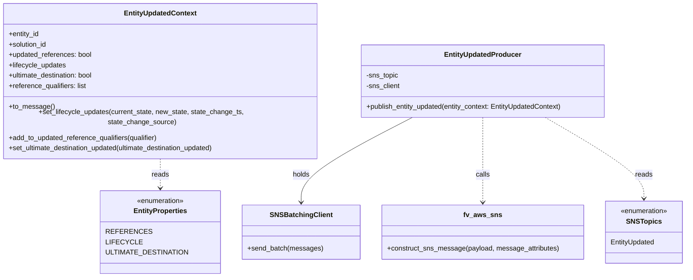
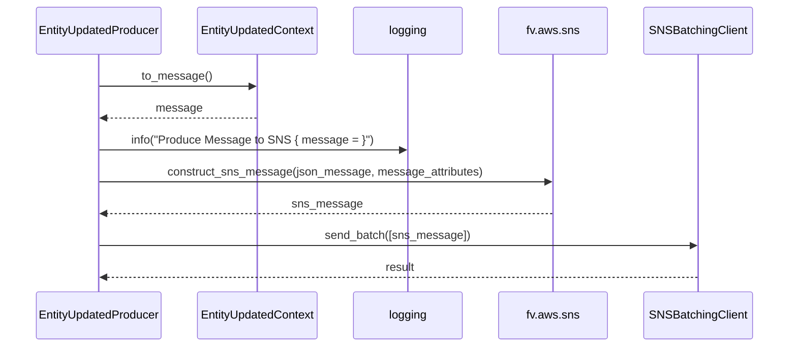

# Diagram: entity_core/entity_service/entity_service/common/entity_updated_producer.py

> Auto-generated by Obscura crawlers

## Diagram 1

### SVG

<svg id="container" width="1573.67578125" xmlns="http://www.w3.org/2000/svg" class="classDiagram" height="618" viewBox="0 0 1573.67578125 618" role="graphics-document document" aria-roledescription="class"><g><defs><marker id="container_class-aggregationStart" class="marker aggregation class" refX="18" refY="7" markerWidth="190" markerHeight="240" orient="auto"><path d="M 18,7 L9,13 L1,7 L9,1 Z"></path></marker></defs><defs><marker id="container_class-aggregationEnd" class="marker aggregation class" refX="1" refY="7" markerWidth="20" markerHeight="28" orient="auto"><path d="M 18,7 L9,13 L1,7 L9,1 Z"></path></marker></defs><defs><marker id="container_class-extensionStart" class="marker extension class" refX="18" refY="7" markerWidth="190" markerHeight="240" orient="auto"><path d="M 1,7 L18,13 V 1 Z"></path></marker></defs><defs><marker id="container_class-extensionEnd" class="marker extension class" refX="1" refY="7" markerWidth="20" markerHeight="28" orient="auto"><path d="M 1,1 V 13 L18,7 Z"></path></marker></defs><defs><marker id="container_class-compositionStart" class="marker composition class" refX="18" refY="7" markerWidth="190" markerHeight="240" orient="auto"><path d="M 18,7 L9,13 L1,7 L9,1 Z"></path></marker></defs><defs><marker id="container_class-compositionEnd" class="marker composition class" refX="1" refY="7" markerWidth="20" markerHeight="28" orient="auto"><path d="M 18,7 L9,13 L1,7 L9,1 Z"></path></marker></defs><defs><marker id="container_class-dependencyStart" class="marker dependency class" refX="6" refY="7" markerWidth="190" markerHeight="240" orient="auto"><path d="M 5,7 L9,13 L1,7 L9,1 Z"></path></marker></defs><defs><marker id="container_class-dependencyEnd" class="marker dependency class" refX="13" refY="7" markerWidth="20" markerHeight="28" orient="auto"><path d="M 18,7 L9,13 L14,7 L9,1 Z"></path></marker></defs><defs><marker id="container_class-lollipopStart" class="marker lollipop class" refX="13" refY="7" markerWidth="190" markerHeight="240" orient="auto"><circle stroke="black" fill="transparent" cx="7" cy="7" r="6"></circle></marker></defs><defs><marker id="container_class-lollipopEnd" class="marker lollipop class" refX="1" refY="7" markerWidth="190" markerHeight="240" orient="auto"><circle stroke="black" fill="transparent" cx="7" cy="7" r="6"></circle></marker></defs><g class="root"><g class="clusters"></g><g class="edgePaths"><path d="M931.902,260L891.262,280.167C850.622,300.333,769.342,340.667,728.702,371.5C688.063,402.333,688.063,423.667,688.063,434.333L688.063,445" id="id_EntityUpdatedProducer_SNSBatchingClient_1" class="edge-thickness-normal edge-pattern-solid relation" style=";;;" data-edge="true" data-et="edge" data-id="id_EntityUpdatedProducer_SNSBatchingClient_1" data-points="W3sieCI6OTMxLjkwMjQwMDkxNDYzNDIsInkiOjI2MH0seyJ4Ijo2ODguMDYyNSwieSI6MzgxfSx7IngiOjY4OC4wNjI1LCJ5Ijo0NTF9XQ==" marker-end="url(#container_class-dependencyEnd)"></path><path d="M1101.18,260L1101.18,280.167C1101.18,300.333,1101.18,340.667,1101.18,371.5C1101.18,402.333,1101.18,423.667,1101.18,434.333L1101.18,445" id="id_EntityUpdatedProducer_fv_aws_sns_2" class="edge-thickness-normal edge-pattern-dashed relation" style=";;;" data-edge="true" data-et="edge" data-id="id_EntityUpdatedProducer_fv_aws_sns_2" data-points="W3sieCI6MTEwMS4xNzk2ODc1LCJ5IjoyNjB9LHsieCI6MTEwMS4xNzk2ODc1LCJ5IjozODF9LHsieCI6MTEwMS4xNzk2ODc1LCJ5Ijo0NTF9XQ==" marker-end="url(#container_class-dependencyEnd)"></path><path d="M378.992,344L378.992,350.167C378.992,356.333,378.992,368.667,378.992,380C378.992,391.333,378.992,401.667,378.992,406.833L378.992,412" id="id_EntityUpdatedContext_EntityProperties_3" class="edge-thickness-normal edge-pattern-dashed relation" style=";;;" data-edge="true" data-et="edge" data-id="id_EntityUpdatedContext_EntityProperties_3" data-points="W3sieCI6Mzc4Ljk5MjE4NzUsInkiOjM0NH0seyJ4IjozNzguOTkyMTg3NSwieSI6MzgxfSx7IngiOjM3OC45OTIxODc1LCJ5Ijo0MTh9XQ==" marker-end="url(#container_class-dependencyEnd)"></path><path d="M1253.939,260L1290.613,280.167C1327.287,300.333,1400.636,340.667,1437.31,370C1473.984,399.333,1473.984,417.667,1473.984,426.833L1473.984,436" id="id_EntityUpdatedProducer_SNSTopics_4" class="edge-thickness-normal edge-pattern-dashed relation" style=";;;" data-edge="true" data-et="edge" data-id="id_EntityUpdatedProducer_SNSTopics_4" data-points="W3sieCI6MTI1My45Mzg2ODE0MDI0MzksInkiOjI2MH0seyJ4IjoxNDczLjk4NDM3NSwieSI6MzgxfSx7IngiOjE0NzMuOTg0Mzc1LCJ5Ijo0NDJ9XQ==" marker-end="url(#container_class-dependencyEnd)"></path></g><g class="edgeLabels"><g class="edgeLabel" transform="translate(688.0625, 381)"><g class="label" data-id="id_EntityUpdatedProducer_SNSBatchingClient_1" transform="translate(-20.1875, -12)"><foreignObject width="40.375" height="24">

holds

</foreignObject></g></g><g class="edgeLabel" transform="translate(1101.1796875, 381)"><g class="label" data-id="id_EntityUpdatedProducer_fv_aws_sns_2" transform="translate(-16.4453125, -12)"><foreignObject width="32.890625" height="24">

calls

</foreignObject></g></g><g class="edgeLabel" transform="translate(378.9921875, 381)"><g class="label" data-id="id_EntityUpdatedContext_EntityProperties_3" transform="translate(-20.0078125, -12)"><foreignObject width="40.015625" height="24">

reads

</foreignObject></g></g><g class="edgeLabel" transform="translate(1473.984375, 381)"><g class="label" data-id="id_EntityUpdatedProducer_SNSTopics_4" transform="translate(-20.0078125, -12)"><foreignObject width="40.015625" height="24">

reads

</foreignObject></g></g></g><g class="nodes"><g class="node default" id="classId-EntityUpdatedContext-0" transform="translate(378.9921875, 176)"><g class="basic label-container"><path d="M-370.9921875 -168 L370.9921875 -168 L370.9921875 168 L-370.9921875 168" stroke="none" stroke-width="0" fill="#ECECFF" style=""></path><path d="M-370.9921875 -168 C-115.2305524175917 -168, 140.5310826648166 -168, 370.9921875 -168 M-370.9921875 -168 C-102.89517935486737 -168, 165.20182879026527 -168, 370.9921875 -168 M370.9921875 -168 C370.9921875 -40.11155093146563, 370.9921875 87.77689813706874, 370.9921875 168 M370.9921875 -168 C370.9921875 -38.0699363028823, 370.9921875 91.8601273942354, 370.9921875 168 M370.9921875 168 C141.31270944701612 168, -88.36676860596776 168, -370.9921875 168 M370.9921875 168 C92.28047448272099 168, -186.43123853455802 168, -370.9921875 168 M-370.9921875 168 C-370.9921875 40.22104669112244, -370.9921875 -87.55790661775512, -370.9921875 -168 M-370.9921875 168 C-370.9921875 99.04320756002538, -370.9921875 30.08641512005076, -370.9921875 -168" stroke="#9370DB" stroke-width="1.3" fill="none" stroke-dasharray="0 0" style=""></path></g><g class="annotation-group text" transform="translate(0, -144)"></g><g class="label-group text" transform="translate(-80.78125, -144)"><g class="label" style="font-weight: bolder" transform="translate(0,-12)"><foreignObject width="161.5625" height="24">

EntityUpdatedContext

</foreignObject></g></g><g class="members-group text" transform="translate(-358.9921875, -96)"><g class="label" style="" transform="translate(0,-12)"><foreignObject width="71.859375" height="24">

+entity_id

</foreignObject></g><g class="label" style="" transform="translate(0,12)"><foreignObject width="90.21875" height="24">

+solution_id

</foreignObject></g><g class="label" style="" transform="translate(0,36)"><foreignObject width="193.828125" height="24">

+updated_references: bool

</foreignObject></g><g class="label" style="" transform="translate(0,60)"><foreignObject width="134.046875" height="24">

+lifecycle_updates

</foreignObject></g><g class="label" style="" transform="translate(0,84)"><foreignObject width="200.734375" height="24">

+ultimate_destination: bool

</foreignObject></g><g class="label" style="" transform="translate(0,108)"><foreignObject width="182.328125" height="24">

+reference_qualifiers: list

</foreignObject></g></g><g class="methods-group text" transform="translate(-358.9921875, 72)"><g class="label" style="" transform="translate(0,-12)"><foreignObject width="103.546875" height="24">

+to_message()

</foreignObject></g><g class="label" style="" transform="translate(0,12)"><foreignObject width="637.203125" height="24">

+set_lifecycle_updates(current_state, new_state, state_change_ts, state_change_source)

</foreignObject></g><g class="label" style="" transform="translate(0,36)"><foreignObject width="350.28125" height="24">

+add_to_updated_reference_qualifiers(qualifier)

</foreignObject></g><g class="label" style="" transform="translate(0,60)"><foreignObject width="489.703125" height="24">

+set_ultimate_destination_updated(ultimate_destination_updated)

</foreignObject></g></g><g class="divider" style=""><path d="M-370.9921875 -120 C-155.36414575408284 -120, 60.26389599183432 -120, 370.9921875 -120 M-370.9921875 -120 C-78.89083731955435 -120, 213.2105128608913 -120, 370.9921875 -120" stroke="#9370DB" stroke-width="1.3" fill="none" stroke-dasharray="0 0" style=""></path></g><g class="divider" style=""><path d="M-370.9921875 48 C-75.3419730713573 48, 220.3082413572854 48, 370.9921875 48 M-370.9921875 48 C-189.25828709064575 48, -7.524386681291503 48, 370.9921875 48" stroke="#9370DB" stroke-width="1.3" fill="none" stroke-dasharray="0 0" style=""></path></g></g><g class="node default" id="classId-EntityUpdatedProducer-1" transform="translate(1101.1796875, 176)"><g class="basic label-container"><path d="M-285.40625 -84 L285.40625 -84 L285.40625 84 L-285.40625 84" stroke="none" stroke-width="0" fill="#ECECFF" style=""></path><path d="M-285.40625 -84 C-81.13300050242981 -84, 123.14024899514038 -84, 285.40625 -84 M-285.40625 -84 C-121.264064969228 -84, 42.878120061543996 -84, 285.40625 -84 M285.40625 -84 C285.40625 -34.34349427548164, 285.40625 15.313011449036722, 285.40625 84 M285.40625 -84 C285.40625 -36.70568450696568, 285.40625 10.588630986068637, 285.40625 84 M285.40625 84 C127.58973629248504 84, -30.226777415029915 84, -285.40625 84 M285.40625 84 C161.86045027148242 84, 38.31465054296487 84, -285.40625 84 M-285.40625 84 C-285.40625 37.033183567591976, -285.40625 -9.933632864816047, -285.40625 -84 M-285.40625 84 C-285.40625 23.35783412277079, -285.40625 -37.28433175445842, -285.40625 -84" stroke="#9370DB" stroke-width="1.3" fill="none" stroke-dasharray="0 0" style=""></path></g><g class="annotation-group text" transform="translate(0, -60)"></g><g class="label-group text" transform="translate(-85.5625, -60)"><g class="label" style="font-weight: bolder" transform="translate(0,-12)"><foreignObject width="171.125" height="24">

EntityUpdatedProducer

</foreignObject></g></g><g class="members-group text" transform="translate(-273.40625, -12)"><g class="label" style="" transform="translate(0,-12)"><foreignObject width="75" height="24">

-sns_topic

</foreignObject></g><g class="label" style="" transform="translate(0,12)"><foreignObject width="79.171875" height="24">

-sns_client

</foreignObject></g></g><g class="methods-group text" transform="translate(-273.40625, 60)"><g class="label" style="" transform="translate(0,-12)"><foreignObject width="461.25" height="24">

+publish_entity_updated(entity_context: EntityUpdatedContext)

</foreignObject></g></g><g class="divider" style=""><path d="M-285.40625 -36 C-147.06463204612007 -36, -8.723014092240135 -36, 285.40625 -36 M-285.40625 -36 C-128.27836142053266 -36, 28.849527158934677 -36, 285.40625 -36" stroke="#9370DB" stroke-width="1.3" fill="none" stroke-dasharray="0 0" style=""></path></g><g class="divider" style=""><path d="M-285.40625 36 C-138.31276988392636 36, 8.780710232147271 36, 285.40625 36 M-285.40625 36 C-119.44229911315986 36, 46.521651773680276 36, 285.40625 36" stroke="#9370DB" stroke-width="1.3" fill="none" stroke-dasharray="0 0" style=""></path></g></g><g class="node default" id="classId-SNSBatchingClient-2" transform="translate(688.0625, 514)"><g class="basic label-container"><path d="M-132.00390625 -63 L132.00390625 -63 L132.00390625 63 L-132.00390625 63" stroke="none" stroke-width="0" fill="#ECECFF" style=""></path><path d="M-132.00390625 -63 C-59.052876599936596 -63, 13.898153050126808 -63, 132.00390625 -63 M-132.00390625 -63 C-78.65043144934059 -63, -25.296956648681174 -63, 132.00390625 -63 M132.00390625 -63 C132.00390625 -21.562492411116857, 132.00390625 19.875015177766286, 132.00390625 63 M132.00390625 -63 C132.00390625 -12.784741403949049, 132.00390625 37.4305171921019, 132.00390625 63 M132.00390625 63 C62.60508637184155 63, -6.793733506316897 63, -132.00390625 63 M132.00390625 63 C60.878001599048005 63, -10.24790305190399 63, -132.00390625 63 M-132.00390625 63 C-132.00390625 26.266682078487023, -132.00390625 -10.466635843025955, -132.00390625 -63 M-132.00390625 63 C-132.00390625 31.34607494292292, -132.00390625 -0.30785011415415653, -132.00390625 -63" stroke="#9370DB" stroke-width="1.3" fill="none" stroke-dasharray="0 0" style=""></path></g><g class="annotation-group text" transform="translate(0, -39)"></g><g class="label-group text" transform="translate(-67.7265625, -39)"><g class="label" style="font-weight: bolder" transform="translate(0,-12)"><foreignObject width="135.453125" height="24">

SNSBatchingClient

</foreignObject></g></g><g class="members-group text" transform="translate(-120.00390625, 9)"></g><g class="methods-group text" transform="translate(-120.00390625, 39)"><g class="label" style="" transform="translate(0,-12)"><foreignObject width="172.28125" height="24">

+send_batch(messages)

</foreignObject></g></g><g class="divider" style=""><path d="M-132.00390625 -15 C-72.15977939735748 -15, -12.315652544714979 -15, 132.00390625 -15 M-132.00390625 -15 C-51.48664369413413 -15, 29.03061886173174 -15, 132.00390625 -15" stroke="#9370DB" stroke-width="1.3" fill="none" stroke-dasharray="0 0" style=""></path></g><g class="divider" style=""><path d="M-132.00390625 9 C-38.57557235264319 9, 54.852761544713616 9, 132.00390625 9 M-132.00390625 9 C-31.322784345133996 9, 69.358337559732 9, 132.00390625 9" stroke="#9370DB" stroke-width="1.3" fill="none" stroke-dasharray="0 0" style=""></path></g></g><g class="node default" id="classId-SNSTopics-3" transform="translate(1473.984375, 514)"><g class="basic label-container"><path d="M-91.69140625 -72 L91.69140625 -72 L91.69140625 72 L-91.69140625 72" stroke="none" stroke-width="0" fill="#ECECFF" style=""></path><path d="M-91.69140625 -72 C-20.505772049506234 -72, 50.67986215098753 -72, 91.69140625 -72 M-91.69140625 -72 C-28.41249856568043 -72, 34.86640911863914 -72, 91.69140625 -72 M91.69140625 -72 C91.69140625 -27.7039147554325, 91.69140625 16.592170489135, 91.69140625 72 M91.69140625 -72 C91.69140625 -27.97150104027436, 91.69140625 16.056997919451277, 91.69140625 72 M91.69140625 72 C40.01229125229604 72, -11.666823745407925 72, -91.69140625 72 M91.69140625 72 C25.95353674864056 72, -39.78433275271888 72, -91.69140625 72 M-91.69140625 72 C-91.69140625 18.91173742796417, -91.69140625 -34.17652514407166, -91.69140625 -72 M-91.69140625 72 C-91.69140625 40.72639761159064, -91.69140625 9.452795223181276, -91.69140625 -72" stroke="#9370DB" stroke-width="1.3" fill="none" stroke-dasharray="0 0" style=""></path></g><g class="annotation-group text" transform="translate(-55.5546875, -48)"><g class="label" style="" transform="translate(0,-12)"><foreignObject width="111.109375" height="24">

«enumeration»

</foreignObject></g></g><g class="label-group text" transform="translate(-37.5703125, -24)"><g class="label" style="font-weight: bolder" transform="translate(0,-12)"><foreignObject width="75.140625" height="24">

SNSTopics

</foreignObject></g></g><g class="members-group text" transform="translate(-79.69140625, 24)"><g class="label" style="" transform="translate(0,-12)"><foreignObject width="103.828125" height="24">

EntityUpdated

</foreignObject></g></g><g class="methods-group text" transform="translate(-79.69140625, 72)"></g><g class="divider" style=""><path d="M-91.69140625 0 C-49.79474118614125 0, -7.898076122282504 0, 91.69140625 0 M-91.69140625 0 C-30.2384600601887 0, 31.2144861296226 0, 91.69140625 0" stroke="#9370DB" stroke-width="1.3" fill="none" stroke-dasharray="0 0" style=""></path></g><g class="divider" style=""><path d="M-91.69140625 48 C-24.55324858859882 48, 42.58490907280236 48, 91.69140625 48 M-91.69140625 48 C-54.94342604488833 48, -18.195445839776653 48, 91.69140625 48" stroke="#9370DB" stroke-width="1.3" fill="none" stroke-dasharray="0 0" style=""></path></g></g><g class="node default" id="classId-EntityProperties-4" transform="translate(378.9921875, 514)"><g class="basic label-container"><path d="M-127.06640625 -96 L127.06640625 -96 L127.06640625 96 L-127.06640625 96" stroke="none" stroke-width="0" fill="#ECECFF" style=""></path><path d="M-127.06640625 -96 C-66.28564270001868 -96, -5.504879150037368 -96, 127.06640625 -96 M-127.06640625 -96 C-28.135827713568787 -96, 70.79475082286243 -96, 127.06640625 -96 M127.06640625 -96 C127.06640625 -34.43899425959452, 127.06640625 27.122011480810954, 127.06640625 96 M127.06640625 -96 C127.06640625 -28.37457858982833, 127.06640625 39.25084282034334, 127.06640625 96 M127.06640625 96 C55.55907365092945 96, -15.948258948141103 96, -127.06640625 96 M127.06640625 96 C55.35180468111996 96, -16.362796887760084 96, -127.06640625 96 M-127.06640625 96 C-127.06640625 54.13814824583609, -127.06640625 12.276296491672184, -127.06640625 -96 M-127.06640625 96 C-127.06640625 31.19516248368282, -127.06640625 -33.60967503263436, -127.06640625 -96" stroke="#9370DB" stroke-width="1.3" fill="none" stroke-dasharray="0 0" style=""></path></g><g class="annotation-group text" transform="translate(-55.5546875, -72)"><g class="label" style="" transform="translate(0,-12)"><foreignObject width="111.109375" height="24">

«enumeration»

</foreignObject></g></g><g class="label-group text" transform="translate(-59.5859375, -48)"><g class="label" style="font-weight: bolder" transform="translate(0,-12)"><foreignObject width="119.171875" height="24">

EntityProperties

</foreignObject></g></g><g class="members-group text" transform="translate(-115.06640625, 0)"><g class="label" style="" transform="translate(0,-12)"><foreignObject width="89.90625" height="24">

REFERENCES

</foreignObject></g><g class="label" style="" transform="translate(0,12)"><foreignObject width="71.40625" height="24">

LIFECYCLE

</foreignObject></g><g class="label" style="" transform="translate(0,36)"><foreignObject width="170.546875" height="24">

ULTIMATE_DESTINATION

</foreignObject></g></g><g class="methods-group text" transform="translate(-115.06640625, 96)"></g><g class="divider" style=""><path d="M-127.06640625 -24 C-53.23568981363597 -24, 20.595026622728057 -24, 127.06640625 -24 M-127.06640625 -24 C-37.791918376291136 -24, 51.48256949741773 -24, 127.06640625 -24" stroke="#9370DB" stroke-width="1.3" fill="none" stroke-dasharray="0 0" style=""></path></g><g class="divider" style=""><path d="M-127.06640625 72 C-26.9390265301723 72, 73.1883531896554 72, 127.06640625 72 M-127.06640625 72 C-62.082409955621415 72, 2.90158633875717 72, 127.06640625 72" stroke="#9370DB" stroke-width="1.3" fill="none" stroke-dasharray="0 0" style=""></path></g></g><g class="node default" id="classId-fv_aws_sns-5" transform="translate(1101.1796875, 514)"><g class="basic label-container"><path d="M-231.11328125 -63 L231.11328125 -63 L231.11328125 63 L-231.11328125 63" stroke="none" stroke-width="0" fill="#ECECFF" style=""></path><path d="M-231.11328125 -63 C-116.82604158351164 -63, -2.538801917023278 -63, 231.11328125 -63 M-231.11328125 -63 C-117.6564561212402 -63, -4.199630992480394 -63, 231.11328125 -63 M231.11328125 -63 C231.11328125 -17.298852982004618, 231.11328125 28.402294035990764, 231.11328125 63 M231.11328125 -63 C231.11328125 -18.99474485446426, 231.11328125 25.010510291071483, 231.11328125 63 M231.11328125 63 C63.007637766257716 63, -105.09800571748457 63, -231.11328125 63 M231.11328125 63 C129.37525962512711 63, 27.6372380002542 63, -231.11328125 63 M-231.11328125 63 C-231.11328125 14.39106002004899, -231.11328125 -34.21787995990202, -231.11328125 -63 M-231.11328125 63 C-231.11328125 17.693951340992626, -231.11328125 -27.612097318014747, -231.11328125 -63" stroke="#9370DB" stroke-width="1.3" fill="none" stroke-dasharray="0 0" style=""></path></g><g class="annotation-group text" transform="translate(0, -39)"></g><g class="label-group text" transform="translate(-41.2578125, -39)"><g class="label" style="font-weight: bolder" transform="translate(0,-12)"><foreignObject width="82.515625" height="24">

fv_aws_sns

</foreignObject></g></g><g class="members-group text" transform="translate(-219.11328125, 9)"></g><g class="methods-group text" transform="translate(-219.11328125, 39)"><g class="label" style="" transform="translate(0,-12)"><foreignObject width="396.96875" height="24">

+construct_sns_message(payload, message_attributes)

</foreignObject></g></g><g class="divider" style=""><path d="M-231.11328125 -15 C-94.74469467176974 -15, 41.62389190646053 -15, 231.11328125 -15 M-231.11328125 -15 C-120.53487839801186 -15, -9.95647554602371 -15, 231.11328125 -15" stroke="#9370DB" stroke-width="1.3" fill="none" stroke-dasharray="0 0" style=""></path></g><g class="divider" style=""><path d="M-231.11328125 9 C-55.10505044175065 9, 120.9031803664987 9, 231.11328125 9 M-231.11328125 9 C-74.56315012909471 9, 81.98698099181058 9, 231.11328125 9" stroke="#9370DB" stroke-width="1.3" fill="none" stroke-dasharray="0 0" style=""></path></g></g></g></g></g></svg>

## Diagram 2

### SVG

<svg id="container" width="1123" xmlns="http://www.w3.org/2000/svg" height="507" viewBox="-50 -10 1123 507" role="graphics-document document" aria-roledescription="sequence"><g><rect x="869" y="421" fill="#eaeaea" stroke="#666" width="154" height="65" name="SNSclient" rx="3" ry="3" class="actor actor-bottom"></rect><text x="946" y="453.5" dominant-baseline="central" alignment-baseline="central" class="actor actor-box" style="text-anchor: middle; font-size: 16px; font-weight: 400;"><tspan x="946" dy="0">SNSBatchingClient</tspan></text></g><g><rect x="669" y="421" fill="#eaeaea" stroke="#666" width="150" height="65" name="SNS" rx="3" ry="3" class="actor actor-bottom"></rect><text x="744" y="453.5" dominant-baseline="central" alignment-baseline="central" class="actor actor-box" style="text-anchor: middle; font-size: 16px; font-weight: 400;"><tspan x="744" dy="0">fv.aws.sns</tspan></text></g><g><rect x="469" y="421" fill="#eaeaea" stroke="#666" width="150" height="65" name="Logger" rx="3" ry="3" class="actor actor-bottom"></rect><text x="544" y="453.5" dominant-baseline="central" alignment-baseline="central" class="actor actor-box" style="text-anchor: middle; font-size: 16px; font-weight: 400;"><tspan x="544" dy="0">logging</tspan></text></g><g><rect x="240" y="421" fill="#eaeaea" stroke="#666" width="179" height="65" name="Context" rx="3" ry="3" class="actor actor-bottom"></rect><text x="329.5" y="453.5" dominant-baseline="central" alignment-baseline="central" class="actor actor-box" style="text-anchor: middle; font-size: 16px; font-weight: 400;"><tspan x="329.5" dy="0">EntityUpdatedContext</tspan></text></g><g><rect x="0" y="421" fill="#eaeaea" stroke="#666" width="190" height="65" name="Producer" rx="3" ry="3" class="actor actor-bottom"></rect><text x="95" y="453.5" dominant-baseline="central" alignment-baseline="central" class="actor actor-box" style="text-anchor: middle; font-size: 16px; font-weight: 400;"><tspan x="95" dy="0">EntityUpdatedProducer</tspan></text></g><g><line id="actor4" x1="946" y1="65" x2="946" y2="421" class="actor-line 200" stroke-width="0.5px" stroke="#999" name="SNSclient"></line><g id="root-4"><rect x="869" y="0" fill="#eaeaea" stroke="#666" width="154" height="65" name="SNSclient" rx="3" ry="3" class="actor actor-top"></rect><text x="946" y="32.5" dominant-baseline="central" alignment-baseline="central" class="actor actor-box" style="text-anchor: middle; font-size: 16px; font-weight: 400;"><tspan x="946" dy="0">SNSBatchingClient</tspan></text></g></g><g><line id="actor3" x1="744" y1="65" x2="744" y2="421" class="actor-line 200" stroke-width="0.5px" stroke="#999" name="SNS"></line><g id="root-3"><rect x="669" y="0" fill="#eaeaea" stroke="#666" width="150" height="65" name="SNS" rx="3" ry="3" class="actor actor-top"></rect><text x="744" y="32.5" dominant-baseline="central" alignment-baseline="central" class="actor actor-box" style="text-anchor: middle; font-size: 16px; font-weight: 400;"><tspan x="744" dy="0">fv.aws.sns</tspan></text></g></g><g><line id="actor2" x1="544" y1="65" x2="544" y2="421" class="actor-line 200" stroke-width="0.5px" stroke="#999" name="Logger"></line><g id="root-2"><rect x="469" y="0" fill="#eaeaea" stroke="#666" width="150" height="65" name="Logger" rx="3" ry="3" class="actor actor-top"></rect><text x="544" y="32.5" dominant-baseline="central" alignment-baseline="central" class="actor actor-box" style="text-anchor: middle; font-size: 16px; font-weight: 400;"><tspan x="544" dy="0">logging</tspan></text></g></g><g><line id="actor1" x1="329.5" y1="65" x2="329.5" y2="421" class="actor-line 200" stroke-width="0.5px" stroke="#999" name="Context"></line><g id="root-1"><rect x="240" y="0" fill="#eaeaea" stroke="#666" width="179" height="65" name="Context" rx="3" ry="3" class="actor actor-top"></rect><text x="329.5" y="32.5" dominant-baseline="central" alignment-baseline="central" class="actor actor-box" style="text-anchor: middle; font-size: 16px; font-weight: 400;"><tspan x="329.5" dy="0">EntityUpdatedContext</tspan></text></g></g><g><line id="actor0" x1="95" y1="65" x2="95" y2="421" class="actor-line 200" stroke-width="0.5px" stroke="#999" name="Producer"></line><g id="root-0"><rect x="0" y="0" fill="#eaeaea" stroke="#666" width="190" height="65" name="Producer" rx="3" ry="3" class="actor actor-top"></rect><text x="95" y="32.5" dominant-baseline="central" alignment-baseline="central" class="actor actor-box" style="text-anchor: middle; font-size: 16px; font-weight: 400;"><tspan x="95" dy="0">EntityUpdatedProducer</tspan></text></g></g><g></g><defs><symbol id="computer" width="24" height="24"><path transform="scale(.5)" d="M2 2v13h20v-13h-20zm18 11h-16v-9h16v9zm-10.228 6l.466-1h3.524l.467 1h-4.457zm14.228 3h-24l2-6h2.104l-1.33 4h18.45l-1.297-4h2.073l2 6zm-5-10h-14v-7h14v7z"></path></symbol></defs><defs><symbol id="database" fill-rule="evenodd" clip-rule="evenodd"><path transform="scale(.5)" d="M12.258.001l.256.004.255.005.253.008.251.01.249.012.247.015.246.016.242.019.241.02.239.023.236.024.233.027.231.028.229.031.225.032.223.034.22.036.217.038.214.04.211.041.208.043.205.045.201.046.198.048.194.05.191.051.187.053.183.054.18.056.175.057.172.059.168.06.163.061.16.063.155.064.15.066.074.033.073.033.071.034.07.034.069.035.068.035.067.035.066.035.064.036.064.036.062.036.06.036.06.037.058.037.058.037.055.038.055.038.053.038.052.038.051.039.05.039.048.039.047.039.045.04.044.04.043.04.041.04.04.041.039.041.037.041.036.041.034.041.033.042.032.042.03.042.029.042.027.042.026.043.024.043.023.043.021.043.02.043.018.044.017.043.015.044.013.044.012.044.011.045.009.044.007.045.006.045.004.045.002.045.001.045v17l-.001.045-.002.045-.004.045-.006.045-.007.045-.009.044-.011.045-.012.044-.013.044-.015.044-.017.043-.018.044-.02.043-.021.043-.023.043-.024.043-.026.043-.027.042-.029.042-.03.042-.032.042-.033.042-.034.041-.036.041-.037.041-.039.041-.04.041-.041.04-.043.04-.044.04-.045.04-.047.039-.048.039-.05.039-.051.039-.052.038-.053.038-.055.038-.055.038-.058.037-.058.037-.06.037-.06.036-.062.036-.064.036-.064.036-.066.035-.067.035-.068.035-.069.035-.07.034-.071.034-.073.033-.074.033-.15.066-.155.064-.16.063-.163.061-.168.06-.172.059-.175.057-.18.056-.183.054-.187.053-.191.051-.194.05-.198.048-.201.046-.205.045-.208.043-.211.041-.214.04-.217.038-.22.036-.223.034-.225.032-.229.031-.231.028-.233.027-.236.024-.239.023-.241.02-.242.019-.246.016-.247.015-.249.012-.251.01-.253.008-.255.005-.256.004-.258.001-.258-.001-.256-.004-.255-.005-.253-.008-.251-.01-.249-.012-.247-.015-.245-.016-.243-.019-.241-.02-.238-.023-.236-.024-.234-.027-.231-.028-.228-.031-.226-.032-.223-.034-.22-.036-.217-.038-.214-.04-.211-.041-.208-.043-.204-.045-.201-.046-.198-.048-.195-.05-.19-.051-.187-.053-.184-.054-.179-.056-.176-.057-.172-.059-.167-.06-.164-.061-.159-.063-.155-.064-.151-.066-.074-.033-.072-.033-.072-.034-.07-.034-.069-.035-.068-.035-.067-.035-.066-.035-.064-.036-.063-.036-.062-.036-.061-.036-.06-.037-.058-.037-.057-.037-.056-.038-.055-.038-.053-.038-.052-.038-.051-.039-.049-.039-.049-.039-.046-.039-.046-.04-.044-.04-.043-.04-.041-.04-.04-.041-.039-.041-.037-.041-.036-.041-.034-.041-.033-.042-.032-.042-.03-.042-.029-.042-.027-.042-.026-.043-.024-.043-.023-.043-.021-.043-.02-.043-.018-.044-.017-.043-.015-.044-.013-.044-.012-.044-.011-.045-.009-.044-.007-.045-.006-.045-.004-.045-.002-.045-.001-.045v-17l.001-.045.002-.045.004-.045.006-.045.007-.045.009-.044.011-.045.012-.044.013-.044.015-.044.017-.043.018-.044.02-.043.021-.043.023-.043.024-.043.026-.043.027-.042.029-.042.03-.042.032-.042.033-.042.034-.041.036-.041.037-.041.039-.041.04-.041.041-.04.043-.04.044-.04.046-.04.046-.039.049-.039.049-.039.051-.039.052-.038.053-.038.055-.038.056-.038.057-.037.058-.037.06-.037.061-.036.062-.036.063-.036.064-.036.066-.035.067-.035.068-.035.069-.035.07-.034.072-.034.072-.033.074-.033.151-.066.155-.064.159-.063.164-.061.167-.06.172-.059.176-.057.179-.056.184-.054.187-.053.19-.051.195-.05.198-.048.201-.046.204-.045.208-.043.211-.041.214-.04.217-.038.22-.036.223-.034.226-.032.228-.031.231-.028.234-.027.236-.024.238-.023.241-.02.243-.019.245-.016.247-.015.249-.012.251-.01.253-.008.255-.005.256-.004.258-.001.258.001zm-9.258 20.499v.01l.001.021.003.021.004.022.005.021.006.022.007.022.009.023.01.022.011.023.012.023.013.023.015.023.016.024.017.023.018.024.019.024.021.024.022.025.023.024.024.025.052.049.056.05.061.051.066.051.07.051.075.051.079.052.084.052.088.052.092.052.097.052.102.051.105.052.11.052.114.051.119.051.123.051.127.05.131.05.135.05.139.048.144.049.147.047.152.047.155.047.16.045.163.045.167.043.171.043.176.041.178.041.183.039.187.039.19.037.194.035.197.035.202.033.204.031.209.03.212.029.216.027.219.025.222.024.226.021.23.02.233.018.236.016.24.015.243.012.246.01.249.008.253.005.256.004.259.001.26-.001.257-.004.254-.005.25-.008.247-.011.244-.012.241-.014.237-.016.233-.018.231-.021.226-.021.224-.024.22-.026.216-.027.212-.028.21-.031.205-.031.202-.034.198-.034.194-.036.191-.037.187-.039.183-.04.179-.04.175-.042.172-.043.168-.044.163-.045.16-.046.155-.046.152-.047.148-.048.143-.049.139-.049.136-.05.131-.05.126-.05.123-.051.118-.052.114-.051.11-.052.106-.052.101-.052.096-.052.092-.052.088-.053.083-.051.079-.052.074-.052.07-.051.065-.051.06-.051.056-.05.051-.05.023-.024.023-.025.021-.024.02-.024.019-.024.018-.024.017-.024.015-.023.014-.024.013-.023.012-.023.01-.023.01-.022.008-.022.006-.022.006-.022.004-.022.004-.021.001-.021.001-.021v-4.127l-.077.055-.08.053-.083.054-.085.053-.087.052-.09.052-.093.051-.095.05-.097.05-.1.049-.102.049-.105.048-.106.047-.109.047-.111.046-.114.045-.115.045-.118.044-.12.043-.122.042-.124.042-.126.041-.128.04-.13.04-.132.038-.134.038-.135.037-.138.037-.139.035-.142.035-.143.034-.144.033-.147.032-.148.031-.15.03-.151.03-.153.029-.154.027-.156.027-.158.026-.159.025-.161.024-.162.023-.163.022-.165.021-.166.02-.167.019-.169.018-.169.017-.171.016-.173.015-.173.014-.175.013-.175.012-.177.011-.178.01-.179.008-.179.008-.181.006-.182.005-.182.004-.184.003-.184.002h-.37l-.184-.002-.184-.003-.182-.004-.182-.005-.181-.006-.179-.008-.179-.008-.178-.01-.176-.011-.176-.012-.175-.013-.173-.014-.172-.015-.171-.016-.17-.017-.169-.018-.167-.019-.166-.02-.165-.021-.163-.022-.162-.023-.161-.024-.159-.025-.157-.026-.156-.027-.155-.027-.153-.029-.151-.03-.15-.03-.148-.031-.146-.032-.145-.033-.143-.034-.141-.035-.14-.035-.137-.037-.136-.037-.134-.038-.132-.038-.13-.04-.128-.04-.126-.041-.124-.042-.122-.042-.12-.044-.117-.043-.116-.045-.113-.045-.112-.046-.109-.047-.106-.047-.105-.048-.102-.049-.1-.049-.097-.05-.095-.05-.093-.052-.09-.051-.087-.052-.085-.053-.083-.054-.08-.054-.077-.054v4.127zm0-5.654v.011l.001.021.003.021.004.021.005.022.006.022.007.022.009.022.01.022.011.023.012.023.013.023.015.024.016.023.017.024.018.024.019.024.021.024.022.024.023.025.024.024.052.05.056.05.061.05.066.051.07.051.075.052.079.051.084.052.088.052.092.052.097.052.102.052.105.052.11.051.114.051.119.052.123.05.127.051.131.05.135.049.139.049.144.048.147.048.152.047.155.046.16.045.163.045.167.044.171.042.176.042.178.04.183.04.187.038.19.037.194.036.197.034.202.033.204.032.209.03.212.028.216.027.219.025.222.024.226.022.23.02.233.018.236.016.24.014.243.012.246.01.249.008.253.006.256.003.259.001.26-.001.257-.003.254-.006.25-.008.247-.01.244-.012.241-.015.237-.016.233-.018.231-.02.226-.022.224-.024.22-.025.216-.027.212-.029.21-.03.205-.032.202-.033.198-.035.194-.036.191-.037.187-.039.183-.039.179-.041.175-.042.172-.043.168-.044.163-.045.16-.045.155-.047.152-.047.148-.048.143-.048.139-.05.136-.049.131-.05.126-.051.123-.051.118-.051.114-.052.11-.052.106-.052.101-.052.096-.052.092-.052.088-.052.083-.052.079-.052.074-.051.07-.052.065-.051.06-.05.056-.051.051-.049.023-.025.023-.024.021-.025.02-.024.019-.024.018-.024.017-.024.015-.023.014-.023.013-.024.012-.022.01-.023.01-.023.008-.022.006-.022.006-.022.004-.021.004-.022.001-.021.001-.021v-4.139l-.077.054-.08.054-.083.054-.085.052-.087.053-.09.051-.093.051-.095.051-.097.05-.1.049-.102.049-.105.048-.106.047-.109.047-.111.046-.114.045-.115.044-.118.044-.12.044-.122.042-.124.042-.126.041-.128.04-.13.039-.132.039-.134.038-.135.037-.138.036-.139.036-.142.035-.143.033-.144.033-.147.033-.148.031-.15.03-.151.03-.153.028-.154.028-.156.027-.158.026-.159.025-.161.024-.162.023-.163.022-.165.021-.166.02-.167.019-.169.018-.169.017-.171.016-.173.015-.173.014-.175.013-.175.012-.177.011-.178.009-.179.009-.179.007-.181.007-.182.005-.182.004-.184.003-.184.002h-.37l-.184-.002-.184-.003-.182-.004-.182-.005-.181-.007-.179-.007-.179-.009-.178-.009-.176-.011-.176-.012-.175-.013-.173-.014-.172-.015-.171-.016-.17-.017-.169-.018-.167-.019-.166-.02-.165-.021-.163-.022-.162-.023-.161-.024-.159-.025-.157-.026-.156-.027-.155-.028-.153-.028-.151-.03-.15-.03-.148-.031-.146-.033-.145-.033-.143-.033-.141-.035-.14-.036-.137-.036-.136-.037-.134-.038-.132-.039-.13-.039-.128-.04-.126-.041-.124-.042-.122-.043-.12-.043-.117-.044-.116-.044-.113-.046-.112-.046-.109-.046-.106-.047-.105-.048-.102-.049-.1-.049-.097-.05-.095-.051-.093-.051-.09-.051-.087-.053-.085-.052-.083-.054-.08-.054-.077-.054v4.139zm0-5.666v.011l.001.02.003.022.004.021.005.022.006.021.007.022.009.023.01.022.011.023.012.023.013.023.015.023.016.024.017.024.018.023.019.024.021.025.022.024.023.024.024.025.052.05.056.05.061.05.066.051.07.051.075.052.079.051.084.052.088.052.092.052.097.052.102.052.105.051.11.052.114.051.119.051.123.051.127.05.131.05.135.05.139.049.144.048.147.048.152.047.155.046.16.045.163.045.167.043.171.043.176.042.178.04.183.04.187.038.19.037.194.036.197.034.202.033.204.032.209.03.212.028.216.027.219.025.222.024.226.021.23.02.233.018.236.017.24.014.243.012.246.01.249.008.253.006.256.003.259.001.26-.001.257-.003.254-.006.25-.008.247-.01.244-.013.241-.014.237-.016.233-.018.231-.02.226-.022.224-.024.22-.025.216-.027.212-.029.21-.03.205-.032.202-.033.198-.035.194-.036.191-.037.187-.039.183-.039.179-.041.175-.042.172-.043.168-.044.163-.045.16-.045.155-.047.152-.047.148-.048.143-.049.139-.049.136-.049.131-.051.126-.05.123-.051.118-.052.114-.051.11-.052.106-.052.101-.052.096-.052.092-.052.088-.052.083-.052.079-.052.074-.052.07-.051.065-.051.06-.051.056-.05.051-.049.023-.025.023-.025.021-.024.02-.024.019-.024.018-.024.017-.024.015-.023.014-.024.013-.023.012-.023.01-.022.01-.023.008-.022.006-.022.006-.022.004-.022.004-.021.001-.021.001-.021v-4.153l-.077.054-.08.054-.083.053-.085.053-.087.053-.09.051-.093.051-.095.051-.097.05-.1.049-.102.048-.105.048-.106.048-.109.046-.111.046-.114.046-.115.044-.118.044-.12.043-.122.043-.124.042-.126.041-.128.04-.13.039-.132.039-.134.038-.135.037-.138.036-.139.036-.142.034-.143.034-.144.033-.147.032-.148.032-.15.03-.151.03-.153.028-.154.028-.156.027-.158.026-.159.024-.161.024-.162.023-.163.023-.165.021-.166.02-.167.019-.169.018-.169.017-.171.016-.173.015-.173.014-.175.013-.175.012-.177.01-.178.01-.179.009-.179.007-.181.006-.182.006-.182.004-.184.003-.184.001-.185.001-.185-.001-.184-.001-.184-.003-.182-.004-.182-.006-.181-.006-.179-.007-.179-.009-.178-.01-.176-.01-.176-.012-.175-.013-.173-.014-.172-.015-.171-.016-.17-.017-.169-.018-.167-.019-.166-.02-.165-.021-.163-.023-.162-.023-.161-.024-.159-.024-.157-.026-.156-.027-.155-.028-.153-.028-.151-.03-.15-.03-.148-.032-.146-.032-.145-.033-.143-.034-.141-.034-.14-.036-.137-.036-.136-.037-.134-.038-.132-.039-.13-.039-.128-.041-.126-.041-.124-.041-.122-.043-.12-.043-.117-.044-.116-.044-.113-.046-.112-.046-.109-.046-.106-.048-.105-.048-.102-.048-.1-.05-.097-.049-.095-.051-.093-.051-.09-.052-.087-.052-.085-.053-.083-.053-.08-.054-.077-.054v4.153zm8.74-8.179l-.257.004-.254.005-.25.008-.247.011-.244.012-.241.014-.237.016-.233.018-.231.021-.226.022-.224.023-.22.026-.216.027-.212.028-.21.031-.205.032-.202.033-.198.034-.194.036-.191.038-.187.038-.183.04-.179.041-.175.042-.172.043-.168.043-.163.045-.16.046-.155.046-.152.048-.148.048-.143.048-.139.049-.136.05-.131.05-.126.051-.123.051-.118.051-.114.052-.11.052-.106.052-.101.052-.096.052-.092.052-.088.052-.083.052-.079.052-.074.051-.07.052-.065.051-.06.05-.056.05-.051.05-.023.025-.023.024-.021.024-.02.025-.019.024-.018.024-.017.023-.015.024-.014.023-.013.023-.012.023-.01.023-.01.022-.008.022-.006.023-.006.021-.004.022-.004.021-.001.021-.001.021.001.021.001.021.004.021.004.022.006.021.006.023.008.022.01.022.01.023.012.023.013.023.014.023.015.024.017.023.018.024.019.024.02.025.021.024.023.024.023.025.051.05.056.05.06.05.065.051.07.052.074.051.079.052.083.052.088.052.092.052.096.052.101.052.106.052.11.052.114.052.118.051.123.051.126.051.131.05.136.05.139.049.143.048.148.048.152.048.155.046.16.046.163.045.168.043.172.043.175.042.179.041.183.04.187.038.191.038.194.036.198.034.202.033.205.032.21.031.212.028.216.027.22.026.224.023.226.022.231.021.233.018.237.016.241.014.244.012.247.011.25.008.254.005.257.004.26.001.26-.001.257-.004.254-.005.25-.008.247-.011.244-.012.241-.014.237-.016.233-.018.231-.021.226-.022.224-.023.22-.026.216-.027.212-.028.21-.031.205-.032.202-.033.198-.034.194-.036.191-.038.187-.038.183-.04.179-.041.175-.042.172-.043.168-.043.163-.045.16-.046.155-.046.152-.048.148-.048.143-.048.139-.049.136-.05.131-.05.126-.051.123-.051.118-.051.114-.052.11-.052.106-.052.101-.052.096-.052.092-.052.088-.052.083-.052.079-.052.074-.051.07-.052.065-.051.06-.05.056-.05.051-.05.023-.025.023-.024.021-.024.02-.025.019-.024.018-.024.017-.023.015-.024.014-.023.013-.023.012-.023.01-.023.01-.022.008-.022.006-.023.006-.021.004-.022.004-.021.001-.021.001-.021-.001-.021-.001-.021-.004-.021-.004-.022-.006-.021-.006-.023-.008-.022-.01-.022-.01-.023-.012-.023-.013-.023-.014-.023-.015-.024-.017-.023-.018-.024-.019-.024-.02-.025-.021-.024-.023-.024-.023-.025-.051-.05-.056-.05-.06-.05-.065-.051-.07-.052-.074-.051-.079-.052-.083-.052-.088-.052-.092-.052-.096-.052-.101-.052-.106-.052-.11-.052-.114-.052-.118-.051-.123-.051-.126-.051-.131-.05-.136-.05-.139-.049-.143-.048-.148-.048-.152-.048-.155-.046-.16-.046-.163-.045-.168-.043-.172-.043-.175-.042-.179-.041-.183-.04-.187-.038-.191-.038-.194-.036-.198-.034-.202-.033-.205-.032-.21-.031-.212-.028-.216-.027-.22-.026-.224-.023-.226-.022-.231-.021-.233-.018-.237-.016-.241-.014-.244-.012-.247-.011-.25-.008-.254-.005-.257-.004-.26-.001-.26.001z"></path></symbol></defs><defs><symbol id="clock" width="24" height="24"><path transform="scale(.5)" d="M12 2c5.514 0 10 4.486 10 10s-4.486 10-10 10-10-4.486-10-10 4.486-10 10-10zm0-2c-6.627 0-12 5.373-12 12s5.373 12 12 12 12-5.373 12-12-5.373-12-12-12zm5.848 12.459c.202.038.202.333.001.372-1.907.361-6.045 1.111-6.547 1.111-.719 0-1.301-.582-1.301-1.301 0-.512.77-5.447 1.125-7.445.034-.192.312-.181.343.014l.985 6.238 5.394 1.011z"></path></symbol></defs><defs><marker id="arrowhead" refX="7.9" refY="5" markerUnits="userSpaceOnUse" markerWidth="12" markerHeight="12" orient="auto-start-reverse"><path d="M -1 0 L 10 5 L 0 10 z"></path></marker></defs><defs><marker id="crosshead" markerWidth="15" markerHeight="8" orient="auto" refX="4" refY="4.5"><path fill="none" stroke="#000000" stroke-width="1pt" d="M 1,2 L 6,7 M 6,2 L 1,7" style="stroke-dasharray: 0, 0;"></path></marker></defs><defs><marker id="filled-head" refX="15.5" refY="7" markerWidth="20" markerHeight="28" orient="auto"><path d="M 18,7 L9,13 L14,7 L9,1 Z"></path></marker></defs><defs><marker id="sequencenumber" refX="15" refY="15" markerWidth="60" markerHeight="40" orient="auto"><circle cx="15" cy="15" r="6"></circle></marker></defs><text x="211" y="80" text-anchor="middle" dominant-baseline="middle" alignment-baseline="middle" class="messageText" dy="1em" style="font-size: 16px; font-weight: 400;">to_message()</text><line x1="96" y1="113" x2="325.5" y2="113" class="messageLine0" stroke-width="2" stroke="none" marker-end="url(#arrowhead)" style="fill: none;"></line><text x="214" y="128" text-anchor="middle" dominant-baseline="middle" alignment-baseline="middle" class="messageText" dy="1em" style="font-size: 16px; font-weight: 400;">message</text><line x1="328.5" y1="161" x2="99" y2="161" class="messageLine1" stroke-width="2" stroke="none" marker-end="url(#arrowhead)" style="stroke-dasharray: 3, 3; fill: none;"></line><text x="318" y="176" text-anchor="middle" dominant-baseline="middle" alignment-baseline="middle" class="messageText" dy="1em" style="font-size: 16px; font-weight: 400;">info("Produce Message to SNS { message = }")</text><line x1="96" y1="209" x2="540" y2="209" class="messageLine0" stroke-width="2" stroke="none" marker-end="url(#arrowhead)" style="fill: none;"></line><text x="418" y="224" text-anchor="middle" dominant-baseline="middle" alignment-baseline="middle" class="messageText" dy="1em" style="font-size: 16px; font-weight: 400;">construct_sns_message(json_message, message_attributes)</text><line x1="96" y1="257" x2="740" y2="257" class="messageLine0" stroke-width="2" stroke="none" marker-end="url(#arrowhead)" style="fill: none;"></line><text x="421" y="272" text-anchor="middle" dominant-baseline="middle" alignment-baseline="middle" class="messageText" dy="1em" style="font-size: 16px; font-weight: 400;">sns_message</text><line x1="743" y1="305" x2="99" y2="305" class="messageLine1" stroke-width="2" stroke="none" marker-end="url(#arrowhead)" style="stroke-dasharray: 3, 3; fill: none;"></line><text x="519" y="320" text-anchor="middle" dominant-baseline="middle" alignment-baseline="middle" class="messageText" dy="1em" style="font-size: 16px; font-weight: 400;">send_batch([sns_message])</text><line x1="96" y1="353" x2="942" y2="353" class="messageLine0" stroke-width="2" stroke="none" marker-end="url(#arrowhead)" style="fill: none;"></line><text x="522" y="368" text-anchor="middle" dominant-baseline="middle" alignment-baseline="middle" class="messageText" dy="1em" style="font-size: 16px; font-weight: 400;">result</text><line x1="945" y1="401" x2="99" y2="401" class="messageLine1" stroke-width="2" stroke="none" marker-end="url(#arrowhead)" style="stroke-dasharray: 3, 3; fill: none;"></line></svg>
