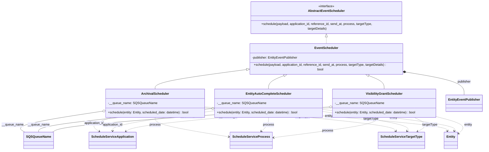

# Diagram: entity_core/entity_service/entity_service/common/event_scheduler.py

> Auto-generated by Obscura crawlers

## Mermaid

### SVG

<svg id="container" width="2468.3984375" xmlns="http://www.w3.org/2000/svg" class="classDiagram" height="736" viewBox="0 0 2468.3984375 736" role="graphics-document document" aria-roledescription="class"><g><defs><marker id="container_class-aggregationStart" class="marker aggregation class" refX="18" refY="7" markerWidth="190" markerHeight="240" orient="auto"><path d="M 18,7 L9,13 L1,7 L9,1 Z"></path></marker></defs><defs><marker id="container_class-aggregationEnd" class="marker aggregation class" refX="1" refY="7" markerWidth="20" markerHeight="28" orient="auto"><path d="M 18,7 L9,13 L1,7 L9,1 Z"></path></marker></defs><defs><marker id="container_class-extensionStart" class="marker extension class" refX="18" refY="7" markerWidth="190" markerHeight="240" orient="auto"><path d="M 1,7 L18,13 V 1 Z"></path></marker></defs><defs><marker id="container_class-extensionEnd" class="marker extension class" refX="1" refY="7" markerWidth="20" markerHeight="28" orient="auto"><path d="M 1,1 V 13 L18,7 Z"></path></marker></defs><defs><marker id="container_class-compositionStart" class="marker composition class" refX="18" refY="7" markerWidth="190" markerHeight="240" orient="auto"><path d="M 18,7 L9,13 L1,7 L9,1 Z"></path></marker></defs><defs><marker id="container_class-compositionEnd" class="marker composition class" refX="1" refY="7" markerWidth="20" markerHeight="28" orient="auto"><path d="M 18,7 L9,13 L1,7 L9,1 Z"></path></marker></defs><defs><marker id="container_class-dependencyStart" class="marker dependency class" refX="6" refY="7" markerWidth="190" markerHeight="240" orient="auto"><path d="M 5,7 L9,13 L1,7 L9,1 Z"></path></marker></defs><defs><marker id="container_class-dependencyEnd" class="marker dependency class" refX="13" refY="7" markerWidth="20" markerHeight="28" orient="auto"><path d="M 18,7 L9,13 L14,7 L9,1 Z"></path></marker></defs><defs><marker id="container_class-lollipopStart" class="marker lollipop class" refX="13" refY="7" markerWidth="190" markerHeight="240" orient="auto"><circle stroke="black" fill="transparent" cx="7" cy="7" r="6"></circle></marker></defs><defs><marker id="container_class-lollipopEnd" class="marker lollipop class" refX="1" refY="7" markerWidth="190" markerHeight="240" orient="auto"><circle stroke="black" fill="transparent" cx="7" cy="7" r="6"></circle></marker></defs><g class="root"><g class="clusters"></g><g class="edgePaths"><path d="M1674.059,175.25L1674.059,176.542C1674.059,177.833,1674.059,180.417,1674.059,185.875C1674.059,191.333,1674.059,199.667,1674.059,203.833L1674.059,208" id="id_AbstractEventScheduler_EventScheduler_1" class="edge-thickness-normal edge-pattern-dashed relation" style=";;;" data-edge="true" data-et="edge" data-id="id_AbstractEventScheduler_EventScheduler_1" data-points="W3sieCI6MTY3NC4wNTg1OTM3NSwieSI6MTU4fSx7IngiOjE2NzQuMDU4NTkzNzUsInkiOjE4M30seyJ4IjoxNjc0LjA1ODU5Mzc1LCJ5IjoyMDh9XQ==" marker-start="url(#container_class-extensionStart)"></path><path d="M1260.254,331.614L1183.575,341.179C1106.896,350.743,953.538,369.871,876.859,385.602C800.18,401.333,800.18,413.667,800.18,419.833L800.18,426" id="id_EventScheduler_ArchivalScheduler_2" class="edge-thickness-normal edge-pattern-solid relation" style=";;;" data-edge="true" data-et="edge" data-id="id_EventScheduler_ArchivalScheduler_2" data-points="W3sieCI6MTI3Ny4zNzEwOTM3NSwieSI6MzI5LjQ3OTMyMzk1NTI0NjIzfSx7IngiOjgwMC4xNzk2ODc1LCJ5IjozODl9LHsieCI6ODAwLjE3OTY4NzUsInkiOjQyNn1d" marker-start="url(#container_class-extensionStart)"></path><path d="M1462.935,357.977L1448.935,363.147C1434.936,368.318,1406.937,378.659,1392.937,389.996C1378.938,401.333,1378.938,413.667,1378.938,419.833L1378.938,426" id="id_EventScheduler_EntityAutoCompleteScheduler_3" class="edge-thickness-normal edge-pattern-solid relation" style=";;;" data-edge="true" data-et="edge" data-id="id_EventScheduler_EntityAutoCompleteScheduler_3" data-points="W3sieCI6MTQ3OS4xMTYyMTk4OTY3ODksInkiOjM1Mn0seyJ4IjoxMzc4LjkzNzUsInkiOjM4OX0seyJ4IjoxMzc4LjkzNzUsInkiOjQyNn1d" marker-start="url(#container_class-extensionStart)"></path><path d="M1885.183,357.977L1899.182,363.147C1913.182,368.318,1941.181,378.659,1955.18,389.996C1969.18,401.333,1969.18,413.667,1969.18,419.833L1969.18,426" id="id_EventScheduler_VisibilityGrantScheduler_4" class="edge-thickness-normal edge-pattern-solid relation" style=";;;" data-edge="true" data-et="edge" data-id="id_EventScheduler_VisibilityGrantScheduler_4" data-points="W3sieCI6MTg2OS4wMDA5Njc2MDMyMTEsInkiOjM1Mn0seyJ4IjoxOTY5LjE3OTY4NzUsInkiOjM4OX0seyJ4IjoxOTY5LjE3OTY4NzUsInkiOjQyNn1d" marker-start="url(#container_class-extensionStart)"></path><path d="M2087.79,344.593L2135.196,351.994C2182.602,359.395,2277.414,374.198,2324.82,392.765C2372.227,411.333,2372.227,433.667,2372.227,444.833L2372.227,456" id="id_EventScheduler_EntityEventPublisher_5" class="edge-thickness-normal edge-pattern-solid relation" style=";;;" data-edge="true" data-et="edge" data-id="id_EventScheduler_EntityEventPublisher_5" data-points="W3sieCI6MjA3MC43NDYwOTM3NSwieSI6MzQxLjkzMTk5ODM2NjI1OTl9LHsieCI6MjM3Mi4yMjY1NjI1LCJ5IjozODl9LHsieCI6MjM3Mi4yMjY1NjI1LCJ5Ijo0NTZ9XQ==" marker-start="url(#container_class-compositionStart)"></path><path d="M529.725,537.998L451.963,549.498C374.202,560.999,218.679,583.999,151.09,601.666C83.5,619.333,103.845,631.667,114.017,637.833L124.189,644" id="id_ArchivalScheduler_SQSQueueName_6" class="edge-thickness-normal edge-pattern-solid relation" style=";;;" data-edge="true" data-et="edge" data-id="id_ArchivalScheduler_SQSQueueName_6" data-points="W3sieCI6NTQ2Ljc4OTA2MjUsInkiOjUzNS40NzQ0OTA5MzE2NDAyfSx7IngiOjYzLjE1NjI1LCJ5Ijo2MDd9LHsieCI6MTI0LjE4ODY4NjcwODg2MDc2LCJ5Ijo2NDR9XQ==" marker-start="url(#container_class-aggregationStart)"></path><path d="M1086.393,524.899L937.572,538.582C788.751,552.266,491.11,579.633,342.289,599.483C193.469,619.333,193.469,631.667,193.469,637.833L193.469,644" id="id_EntityAutoCompleteScheduler_SQSQueueName_7" class="edge-thickness-normal edge-pattern-solid relation" style=";;;" data-edge="true" data-et="edge" data-id="id_EntityAutoCompleteScheduler_SQSQueueName_7" data-points="W3sieCI6MTEwMy41NzAzMTI1LCJ5Ijo1MjMuMzE5MTE4MjI4NTQ4OX0seyJ4IjoxOTMuNDY4NzUsInkiOjYwN30seyJ4IjoxOTMuNDY4NzUsInkiOjY0NH1d" marker-start="url(#container_class-aggregationStart)"></path><path d="M1687.092,516.687L1459.874,531.739C1232.655,546.791,778.218,576.896,540.828,598.114C303.437,619.333,283.093,631.667,272.921,637.833L262.749,644" id="id_VisibilityGrantScheduler_SQSQueueName_8" class="edge-thickness-normal edge-pattern-solid relation" style=";;;" data-edge="true" data-et="edge" data-id="id_VisibilityGrantScheduler_SQSQueueName_8" data-points="W3sieCI6MTcwNC4zMDQ2ODc1LCJ5Ijo1MTUuNTQ2NzM3ODI0NzF9LHsieCI6MzIzLjc4MTI1LCJ5Ijo2MDd9LHsieCI6MjYyLjc0ODgxMzI5MTEzOTI0LCJ5Ijo2NDR9XQ==" marker-start="url(#container_class-aggregationStart)"></path><path d="M569.658,570L549.914,576.167C530.17,582.333,490.683,594.667,479.814,606.464C468.946,618.262,486.696,629.524,495.571,635.155L504.446,640.786" id="id_ArchivalScheduler_ScheduleServiceApplication_9" class="edge-thickness-normal edge-pattern-dashed relation" style=";;;" data-edge="true" data-et="edge" data-id="id_ArchivalScheduler_ScheduleServiceApplication_9" data-points="W3sieCI6NTY5LjY1Nzg5ODUwOTE3NDMsInkiOjU3MH0seyJ4Ijo0NTEuMTk1MzEyNSwieSI6NjA3fSx7IngiOjUwOS41MTI3NTcxMjAyNTMyLCJ5Ijo2NDR9XQ==" marker-end="url(#container_class-dependencyEnd)"></path><path d="M800.18,570L800.18,576.167C800.18,582.333,800.18,594.667,864.463,611.158C928.747,627.649,1057.314,648.298,1121.597,658.622L1185.881,668.946" id="id_ArchivalScheduler_ScheduleServiceProcess_10" class="edge-thickness-normal edge-pattern-dashed relation" style=";;;" data-edge="true" data-et="edge" data-id="id_ArchivalScheduler_ScheduleServiceProcess_10" data-points="W3sieCI6ODAwLjE3OTY4NzUsInkiOjU3MH0seyJ4Ijo4MDAuMTc5Njg3NSwieSI6NjA3fSx7IngiOjExOTEuODA0Njg3NSwieSI6NjY5Ljg5Nzg1NzQwMzc4OTd9XQ==" marker-end="url(#container_class-dependencyEnd)"></path><path d="M1053.57,520.967L1211.766,535.306C1369.962,549.645,1686.354,578.322,1847.799,597.975C2009.243,617.627,2015.74,628.254,2018.988,633.567L2022.237,638.881" id="id_ArchivalScheduler_ScheduleServiceTargetType_11" class="edge-thickness-normal edge-pattern-dashed relation" style=";;;" data-edge="true" data-et="edge" data-id="id_ArchivalScheduler_ScheduleServiceTargetType_11" data-points="W3sieCI6MTA1My41NzAzMTI1LCJ5Ijo1MjAuOTY3MTk1ODA4NDQzNX0seyJ4IjoyMDAyLjc0NjA5Mzc1LCJ5Ijo2MDd9LHsieCI6MjAyNS4zNjYxNDkxMjk3NDY5LCJ5Ijo2NDR9XQ==" marker-end="url(#container_class-dependencyEnd)"></path><path d="M1103.57,535.368L1015.594,547.307C927.617,559.245,751.664,583.123,663.688,600.228C575.711,617.333,575.711,627.667,575.711,632.833L575.711,638" id="id_EntityAutoCompleteScheduler_ScheduleServiceApplication_12" class="edge-thickness-normal edge-pattern-dashed relation" style=";;;" data-edge="true" data-et="edge" data-id="id_EntityAutoCompleteScheduler_ScheduleServiceApplication_12" data-points="W3sieCI6MTEwMy41NzAzMTI1LCJ5Ijo1MzUuMzY4MDY2Mjk1MTE4M30seyJ4Ijo1NzUuNzEwOTM3NSwieSI6NjA3fSx7IngiOjU3NS43MTA5Mzc1LCJ5Ijo2NDR9XQ==" marker-end="url(#container_class-dependencyEnd)"></path><path d="M1378.938,570L1378.938,576.167C1378.938,582.333,1378.938,594.667,1372.896,606.327C1366.854,617.988,1354.771,628.976,1348.73,634.469L1342.688,639.963" id="id_EntityAutoCompleteScheduler_ScheduleServiceProcess_13" class="edge-thickness-normal edge-pattern-dashed relation" style=";;;" data-edge="true" data-et="edge" data-id="id_EntityAutoCompleteScheduler_ScheduleServiceProcess_13" data-points="W3sieCI6MTM3OC45Mzc1LCJ5Ijo1NzB9LHsieCI6MTM3OC45Mzc1LCJ5Ijo2MDd9LHsieCI6MTMzOC4yNDkyMDg4NjA3NTk2LCJ5Ijo2NDR9XQ==" marker-end="url(#container_class-dependencyEnd)"></path><path d="M1654.305,539.664L1728.477,550.887C1802.65,562.11,1950.995,584.555,2021.919,601.091C2092.843,617.627,2086.346,628.254,2083.098,633.567L2079.849,638.881" id="id_EntityAutoCompleteScheduler_ScheduleServiceTargetType_14" class="edge-thickness-normal edge-pattern-dashed relation" style=";;;" data-edge="true" data-et="edge" data-id="id_EntityAutoCompleteScheduler_ScheduleServiceTargetType_14" data-points="W3sieCI6MTY1NC4zMDQ2ODc1LCJ5Ijo1MzkuNjY0MjUwMTIwNjQ2Nn0seyJ4IjoyMDk5LjMzOTg0Mzc1LCJ5Ijo2MDd9LHsieCI6MjA3Ni43MTk3ODgzNzAyNTM0LCJ5Ijo2NDR9XQ==" marker-end="url(#container_class-dependencyEnd)"></path><path d="M1704.305,520.752L1536.958,535.127C1369.612,549.501,1034.919,578.251,858.698,598.256C682.476,618.262,664.726,629.524,655.851,635.155L646.975,640.786" id="id_VisibilityGrantScheduler_ScheduleServiceApplication_15" class="edge-thickness-normal edge-pattern-dashed relation" style=";;;" data-edge="true" data-et="edge" data-id="id_VisibilityGrantScheduler_ScheduleServiceApplication_15" data-points="W3sieCI6MTcwNC4zMDQ2ODc1LCJ5Ijo1MjAuNzUyMTIwOTY1ODU1Mn0seyJ4Ijo3MDAuMjI2NTYyNSwieSI6NjA3fSx7IngiOjY0MS45MDkxMTc4Nzk3NDY5LCJ5Ijo2NDR9XQ==" marker-end="url(#container_class-dependencyEnd)"></path><path d="M1934.55,570L1931.584,576.167C1928.618,582.333,1922.686,594.667,1833.306,611.761C1743.927,628.856,1571.1,650.712,1484.686,661.64L1398.273,672.568" id="id_VisibilityGrantScheduler_ScheduleServiceProcess_16" class="edge-thickness-normal edge-pattern-dashed relation" style=";;;" data-edge="true" data-et="edge" data-id="id_VisibilityGrantScheduler_ScheduleServiceProcess_16" data-points="W3sieCI6MTkzNC41NDk4MTM2NDY3ODksInkiOjU3MH0seyJ4IjoxOTE2Ljc1MzkwNjI1LCJ5Ijo2MDd9LHsieCI6MTM5Mi4zMjAzMTI1LCJ5Ijo2NzMuMzIxMTUyMzE4OTU3NX1d" marker-end="url(#container_class-dependencyEnd)"></path><path d="M2118.962,570L2131.791,576.167C2144.619,582.333,2170.276,594.667,2172.673,606.521C2175.069,618.376,2154.205,629.752,2143.773,635.44L2133.341,641.128" id="id_VisibilityGrantScheduler_ScheduleServiceTargetType_17" class="edge-thickness-normal edge-pattern-dashed relation" style=";;;" data-edge="true" data-et="edge" data-id="id_VisibilityGrantScheduler_ScheduleServiceTargetType_17" data-points="W3sieCI6MjExOC45NjIwODQyODg5OTEsInkiOjU3MH0seyJ4IjoyMTk1LjkzMzU5Mzc1LCJ5Ijo2MDd9LHsieCI6MjEyOC4wNzM0Mjc2MTA3NTk2LCJ5Ijo2NDR9XQ==" marker-end="url(#container_class-dependencyEnd)"></path><path d="M1053.57,516.725L1257.176,531.771C1460.783,546.817,1867.995,576.908,2073.654,597.19C2279.313,617.471,2283.419,627.943,2285.472,633.178L2287.525,638.414" id="id_ArchivalScheduler_Entity_18" class="edge-thickness-normal edge-pattern-dashed relation" style=";;;" data-edge="true" data-et="edge" data-id="id_ArchivalScheduler_Entity_18" data-points="W3sieCI6MTA1My41NzAzMTI1LCJ5Ijo1MTYuNzI0NzkwNTg5MTU3NX0seyJ4IjoyMjc1LjIwNzAzMTI1LCJ5Ijo2MDd9LHsieCI6MjI4OS43MTUwNDE1MzQ4MSwieSI6NjQ0fV0=" marker-end="url(#container_class-dependencyEnd)"></path><path d="M1654.305,529.324L1768.114,542.27C1881.923,555.216,2109.542,581.108,2221.298,599.29C2333.054,617.471,2328.948,627.943,2326.895,633.178L2324.842,638.414" id="id_EntityAutoCompleteScheduler_Entity_19" class="edge-thickness-normal edge-pattern-dashed relation" style=";;;" data-edge="true" data-et="edge" data-id="id_EntityAutoCompleteScheduler_Entity_19" data-points="W3sieCI6MTY1NC4zMDQ2ODc1LCJ5Ijo1MjkuMzIzNjQxOTk2Njk4fSx7IngiOjIzMzcuMTYwMTU2MjUsInkiOjYwN30seyJ4IjoyMzIyLjY1MjE0NTk2NTE5LCJ5Ijo2NDR9XQ==" marker-end="url(#container_class-dependencyEnd)"></path><path d="M2234.055,565.153L2261.564,572.128C2289.074,579.102,2344.094,593.051,2362.424,607.829C2380.754,622.607,2362.395,638.214,2353.216,646.018L2344.036,653.821" id="id_VisibilityGrantScheduler_Entity_20" class="edge-thickness-normal edge-pattern-dashed relation" style=";;;" data-edge="true" data-et="edge" data-id="id_VisibilityGrantScheduler_Entity_20" data-points="W3sieCI6MjIzNC4wNTQ2ODc1LCJ5Ijo1NjUuMTUzMTAzMjIyNjk5OH0seyJ4IjoyMzk5LjExMzI4MTI1LCJ5Ijo2MDd9LHsieCI6MjMzOS40NjQ4NDM3NSwieSI6NjU3LjcwNzQ0MDEwMDg4Mjh9XQ==" marker-end="url(#container_class-dependencyEnd)"></path></g><g class="edgeLabels"><g class="edgeLabel"><g class="label" data-id="id_AbstractEventScheduler_EventScheduler_1" transform="translate(0, 0)"><foreignObject width="0" height="0">

</foreignObject></g></g><g class="edgeLabel"><g class="label" data-id="id_EventScheduler_ArchivalScheduler_2" transform="translate(0, 0)"><foreignObject width="0" height="0">

</foreignObject></g></g><g class="edgeLabel"><g class="label" data-id="id_EventScheduler_EntityAutoCompleteScheduler_3" transform="translate(0, 0)"><foreignObject width="0" height="0">

</foreignObject></g></g><g class="edgeLabel"><g class="label" data-id="id_EventScheduler_VisibilityGrantScheduler_4" transform="translate(0, 0)"><foreignObject width="0" height="0">

</foreignObject></g></g><g class="edgeLabel" transform="translate(2372.2265625, 389)"><g class="label" data-id="id_EventScheduler_EntityEventPublisher_5" transform="translate(-34.6328125, -12)"><foreignObject width="69.265625" height="24">

publisher

</foreignObject></g></g><g class="edgeLabel" transform="translate(63.15625, 607)"><g class="label" data-id="id_ArchivalScheduler_SQSQueueName_6" transform="translate(-55.15625, -12)"><foreignObject width="110.3125" height="24">

__queue_name

</foreignObject></g></g><g class="edgeLabel" transform="translate(193.46875, 607)"><g class="label" data-id="id_EntityAutoCompleteScheduler_SQSQueueName_7" transform="translate(-55.15625, -12)"><foreignObject width="110.3125" height="24">

__queue_name

</foreignObject></g></g><g class="edgeLabel" transform="translate(978.43503, 563.63223)"><g class="label" data-id="id_VisibilityGrantScheduler_SQSQueueName_8" transform="translate(-55.15625, -12)"><foreignObject width="110.3125" height="24">

__queue_name

</foreignObject></g></g><g class="edgeLabel" transform="translate(477.46465, 598.79517)"><g class="label" data-id="id_ArchivalScheduler_ScheduleServiceApplication_9" transform="translate(-52.2578125, -12)"><foreignObject width="104.515625" height="24">

application_id

</foreignObject></g></g><g class="edgeLabel" transform="translate(800.1796875, 607)"><g class="label" data-id="id_ArchivalScheduler_ScheduleServiceProcess_10" transform="translate(-27.6953125, -12)"><foreignObject width="55.390625" height="24">

process

</foreignObject></g></g><g class="edgeLabel" transform="translate(1549.75301, 565.94094)"><g class="label" data-id="id_ArchivalScheduler_ScheduleServiceTargetType_11" transform="translate(-38.296875, -12)"><foreignObject width="76.59375" height="24">

targetType

</foreignObject></g></g><g class="edgeLabel" transform="translate(575.7109375, 607)"><g class="label" data-id="id_EntityAutoCompleteScheduler_ScheduleServiceApplication_12" transform="translate(-52.2578125, -12)"><foreignObject width="104.515625" height="24">

application_id

</foreignObject></g></g><g class="edgeLabel" transform="translate(1378.9375, 607)"><g class="label" data-id="id_EntityAutoCompleteScheduler_ScheduleServiceProcess_13" transform="translate(-27.6953125, -12)"><foreignObject width="55.390625" height="24">

process

</foreignObject></g></g><g class="edgeLabel" transform="translate(1898.26158, 576.57599)"><g class="label" data-id="id_EntityAutoCompleteScheduler_ScheduleServiceTargetType_14" transform="translate(-38.296875, -12)"><foreignObject width="76.59375" height="24">

targetType

</foreignObject></g></g><g class="edgeLabel" transform="translate(1167.86, 566.83142)"><g class="label" data-id="id_VisibilityGrantScheduler_ScheduleServiceApplication_15" transform="translate(-52.2578125, -12)"><foreignObject width="104.515625" height="24">

application_id

</foreignObject></g></g><g class="edgeLabel" transform="translate(1674.9035, 637.58499)"><g class="label" data-id="id_VisibilityGrantScheduler_ScheduleServiceProcess_16" transform="translate(-27.6953125, -12)"><foreignObject width="55.390625" height="24">

process

</foreignObject></g></g><g class="edgeLabel" transform="translate(2195.93359375, 607)"><g class="label" data-id="id_VisibilityGrantScheduler_ScheduleServiceTargetType_17" transform="translate(-38.296875, -12)"><foreignObject width="76.59375" height="24">

targetType

</foreignObject></g></g><g class="edgeLabel" transform="translate(1684.20599, 563.32683)"><g class="label" data-id="id_ArchivalScheduler_Entity_18" transform="translate(-20.9765625, -12)"><foreignObject width="41.953125" height="24">

entity

</foreignObject></g></g><g class="edgeLabel" transform="translate(2015.47644, 570.40775)"><g class="label" data-id="id_EntityAutoCompleteScheduler_Entity_19" transform="translate(-20.9765625, -12)"><foreignObject width="41.953125" height="24">

entity

</foreignObject></g></g><g class="edgeLabel" transform="translate(2354.52807, 595.69642)"><g class="label" data-id="id_VisibilityGrantScheduler_Entity_20" transform="translate(-20.9765625, -12)"><foreignObject width="41.953125" height="24">

entity

</foreignObject></g></g></g><g class="nodes"><g class="node default" id="classId-AbstractEventScheduler-0" transform="translate(1674.05859375, 83)"><g class="basic label-container"><path d="M-389.4296875 -75 L389.4296875 -75 L389.4296875 75 L-389.4296875 75" stroke="none" stroke-width="0" fill="#ECECFF" style=""></path><path d="M-389.4296875 -75 C-128.16714271368403 -75, 133.09540207263194 -75, 389.4296875 -75 M-389.4296875 -75 C-134.99203078596065 -75, 119.4456259280787 -75, 389.4296875 -75 M389.4296875 -75 C389.4296875 -31.521534845903567, 389.4296875 11.956930308192867, 389.4296875 75 M389.4296875 -75 C389.4296875 -18.56333330045301, 389.4296875 37.87333339909398, 389.4296875 75 M389.4296875 75 C158.57907500158151 75, -72.27153749683697 75, -389.4296875 75 M389.4296875 75 C139.257961359852 75, -110.91376478029599 75, -389.4296875 75 M-389.4296875 75 C-389.4296875 31.17189447066194, -389.4296875 -12.65621105867612, -389.4296875 -75 M-389.4296875 75 C-389.4296875 23.386679849643677, -389.4296875 -28.226640300712646, -389.4296875 -75" stroke="#9370DB" stroke-width="1.3" fill="none" stroke-dasharray="0 0" style=""></path></g><g class="annotation-group text" transform="translate(-41.015625, -51)"><g class="label" style="" transform="translate(0,-12)"><foreignObject width="82.03125" height="24">

«interface»

</foreignObject></g></g><g class="label-group text" transform="translate(-87.671875, -27)"><g class="label" style="font-weight: bolder" transform="translate(0,-12)"><foreignObject width="175.34375" height="24">

AbstractEventScheduler

</foreignObject></g></g><g class="members-group text" transform="translate(-377.4296875, 21)"></g><g class="methods-group text" transform="translate(-377.4296875, 51)"><g class="label" style="" transform="translate(0,-12)"><foreignObject width="667.1875" height="24">

+schedule(payload, application_id, reference_id, send_at, process, targetType, targetDetails)

</foreignObject></g></g><g class="divider" style=""><path d="M-389.4296875 -3 C-81.41642711326648 -3, 226.59683327346704 -3, 389.4296875 -3 M-389.4296875 -3 C-182.79440414411525 -3, 23.840879211769504 -3, 389.4296875 -3" stroke="#9370DB" stroke-width="1.3" fill="none" stroke-dasharray="0 0" style=""></path></g><g class="divider" style=""><path d="M-389.4296875 21 C-108.70268794937874 21, 172.02431160124252 21, 389.4296875 21 M-389.4296875 21 C-172.8625540177581 21, 43.7045794644838 21, 389.4296875 21" stroke="#9370DB" stroke-width="1.3" fill="none" stroke-dasharray="0 0" style=""></path></g></g><g class="node default" id="classId-EventScheduler-1" transform="translate(1674.05859375, 280)"><g class="basic label-container"><path d="M-396.6875 -72 L396.6875 -72 L396.6875 72 L-396.6875 72" stroke="none" stroke-width="0" fill="#ECECFF" style=""></path><path d="M-396.6875 -72 C-183.1902470503341 -72, 30.307005899331784 -72, 396.6875 -72 M-396.6875 -72 C-156.43122851043142 -72, 83.82504297913715 -72, 396.6875 -72 M396.6875 -72 C396.6875 -17.833266345881718, 396.6875 36.333467308236564, 396.6875 72 M396.6875 -72 C396.6875 -25.48680181711905, 396.6875 21.026396365761897, 396.6875 72 M396.6875 72 C126.47244608860092 72, -143.74260782279816 72, -396.6875 72 M396.6875 72 C197.80065261271025 72, -1.0861947745794964 72, -396.6875 72 M-396.6875 72 C-396.6875 38.28778721243058, -396.6875 4.575574424861159, -396.6875 -72 M-396.6875 72 C-396.6875 32.79828484866953, -396.6875 -6.4034303026609365, -396.6875 -72" stroke="#9370DB" stroke-width="1.3" fill="none" stroke-dasharray="0 0" style=""></path></g><g class="annotation-group text" transform="translate(0, -48)"></g><g class="label-group text" transform="translate(-56.984375, -48)"><g class="label" style="font-weight: bolder" transform="translate(0,-12)"><foreignObject width="113.96875" height="24">

EventScheduler

</foreignObject></g></g><g class="members-group text" transform="translate(-384.6875, 0)"><g class="label" style="" transform="translate(0,-12)"><foreignObject width="234.140625" height="24">

-publisher: EntityEventPublisher

</foreignObject></g></g><g class="methods-group text" transform="translate(-384.6875, 48)"><g class="label" style="" transform="translate(0,-12)"><foreignObject width="712.390625" height="24">

+schedule(payload, application_id, reference_id, send_at, process, targetType, targetDetails) : bool

</foreignObject></g></g><g class="divider" style=""><path d="M-396.6875 -24 C-101.04662993539745 -24, 194.5942401292051 -24, 396.6875 -24 M-396.6875 -24 C-201.67486311112063 -24, -6.662226222241259 -24, 396.6875 -24" stroke="#9370DB" stroke-width="1.3" fill="none" stroke-dasharray="0 0" style=""></path></g><g class="divider" style=""><path d="M-396.6875 24 C-132.27922192073953 24, 132.12905615852094 24, 396.6875 24 M-396.6875 24 C-217.9420233974919 24, -39.19654679498382 24, 396.6875 24" stroke="#9370DB" stroke-width="1.3" fill="none" stroke-dasharray="0 0" style=""></path></g></g><g class="node default" id="classId-ArchivalScheduler-2" transform="translate(800.1796875, 498)"><g class="basic label-container"><path d="M-253.390625 -72 L253.390625 -72 L253.390625 72 L-253.390625 72" stroke="none" stroke-width="0" fill="#ECECFF" style=""></path><path d="M-253.390625 -72 C-94.78082230980937 -72, 63.82898038038127 -72, 253.390625 -72 M-253.390625 -72 C-53.82984947951496 -72, 145.73092604097008 -72, 253.390625 -72 M253.390625 -72 C253.390625 -36.47750844461897, 253.390625 -0.9550168892379389, 253.390625 72 M253.390625 -72 C253.390625 -21.972835872166534, 253.390625 28.05432825566693, 253.390625 72 M253.390625 72 C74.84182199886072 72, -103.70698100227855 72, -253.390625 72 M253.390625 72 C125.64681816552061 72, -2.0969886689587725 72, -253.390625 72 M-253.390625 72 C-253.390625 37.8663436125436, -253.390625 3.7326872250872043, -253.390625 -72 M-253.390625 72 C-253.390625 37.37865579179238, -253.390625 2.757311583584766, -253.390625 -72" stroke="#9370DB" stroke-width="1.3" fill="none" stroke-dasharray="0 0" style=""></path></g><g class="annotation-group text" transform="translate(0, -48)"></g><g class="label-group text" transform="translate(-65.78125, -48)"><g class="label" style="font-weight: bolder" transform="translate(0,-12)"><foreignObject width="131.5625" height="24">

ArchivalScheduler

</foreignObject></g></g><g class="members-group text" transform="translate(-241.390625, 0)"><g class="label" style="" transform="translate(0,-12)"><foreignObject width="241.234375" height="24">

-__queue_name: SQSQueueName

</foreignObject></g></g><g class="methods-group text" transform="translate(-241.390625, 48)"><g class="label" style="" transform="translate(0,-12)"><foreignObject width="417" height="24">

+schedule(entity: Entity, scheduled_date: datetime) : bool

</foreignObject></g></g><g class="divider" style=""><path d="M-253.390625 -24 C-52.712643984217976 -24, 147.96533703156405 -24, 253.390625 -24 M-253.390625 -24 C-125.73360395295786 -24, 1.9234170940842716 -24, 253.390625 -24" stroke="#9370DB" stroke-width="1.3" fill="none" stroke-dasharray="0 0" style=""></path></g><g class="divider" style=""><path d="M-253.390625 24 C-131.55117754806372 24, -9.711730096127411 24, 253.390625 24 M-253.390625 24 C-126.02841828179848 24, 1.3337884364030401 24, 253.390625 24" stroke="#9370DB" stroke-width="1.3" fill="none" stroke-dasharray="0 0" style=""></path></g></g><g class="node default" id="classId-EntityAutoCompleteScheduler-3" transform="translate(1378.9375, 498)"><g class="basic label-container"><path d="M-275.3671875 -72 L275.3671875 -72 L275.3671875 72 L-275.3671875 72" stroke="none" stroke-width="0" fill="#ECECFF" style=""></path><path d="M-275.3671875 -72 C-163.08143695167522 -72, -50.79568640335043 -72, 275.3671875 -72 M-275.3671875 -72 C-131.5065841157456 -72, 12.354019268508807 -72, 275.3671875 -72 M275.3671875 -72 C275.3671875 -42.89408858537146, 275.3671875 -13.788177170742934, 275.3671875 72 M275.3671875 -72 C275.3671875 -16.485378640446427, 275.3671875 39.029242719107145, 275.3671875 72 M275.3671875 72 C70.64541161142094 72, -134.07636427715812 72, -275.3671875 72 M275.3671875 72 C68.27492560972004 72, -138.8173362805599 72, -275.3671875 72 M-275.3671875 72 C-275.3671875 21.964181890966543, -275.3671875 -28.071636218066914, -275.3671875 -72 M-275.3671875 72 C-275.3671875 26.460338639621106, -275.3671875 -19.079322720757787, -275.3671875 -72" stroke="#9370DB" stroke-width="1.3" fill="none" stroke-dasharray="0 0" style=""></path></g><g class="annotation-group text" transform="translate(0, -48)"></g><g class="label-group text" transform="translate(-109.734375, -48)"><g class="label" style="font-weight: bolder" transform="translate(0,-12)"><foreignObject width="219.46875" height="24">

EntityAutoCompleteScheduler

</foreignObject></g></g><g class="members-group text" transform="translate(-263.3671875, 0)"><g class="label" style="" transform="translate(0,-12)"><foreignObject width="241.234375" height="24">

-__queue_name: SQSQueueName

</foreignObject></g></g><g class="methods-group text" transform="translate(-263.3671875, 48)"><g class="label" style="" transform="translate(0,-12)"><foreignObject width="417" height="24">

+schedule(entity: Entity, scheduled_date: datetime) : bool

</foreignObject></g></g><g class="divider" style=""><path d="M-275.3671875 -24 C-103.62857120736325 -24, 68.1100450852735 -24, 275.3671875 -24 M-275.3671875 -24 C-111.97705447398576 -24, 51.41307855202848 -24, 275.3671875 -24" stroke="#9370DB" stroke-width="1.3" fill="none" stroke-dasharray="0 0" style=""></path></g><g class="divider" style=""><path d="M-275.3671875 24 C-103.14083003871372 24, 69.08552742257257 24, 275.3671875 24 M-275.3671875 24 C-90.70729904323275 24, 93.9525894135345 24, 275.3671875 24" stroke="#9370DB" stroke-width="1.3" fill="none" stroke-dasharray="0 0" style=""></path></g></g><g class="node default" id="classId-VisibilityGrantScheduler-4" transform="translate(1969.1796875, 498)"><g class="basic label-container"><path d="M-264.875 -72 L264.875 -72 L264.875 72 L-264.875 72" stroke="none" stroke-width="0" fill="#ECECFF" style=""></path><path d="M-264.875 -72 C-106.09475977206822 -72, 52.68548045586357 -72, 264.875 -72 M-264.875 -72 C-155.82488676401476 -72, -46.7747735280295 -72, 264.875 -72 M264.875 -72 C264.875 -38.222649141920954, 264.875 -4.4452982838419075, 264.875 72 M264.875 -72 C264.875 -42.295288812020544, 264.875 -12.590577624041082, 264.875 72 M264.875 72 C92.68770476610138 72, -79.49959046779725 72, -264.875 72 M264.875 72 C54.20146366152997 72, -156.47207267694006 72, -264.875 72 M-264.875 72 C-264.875 28.877937655195325, -264.875 -14.24412468960935, -264.875 -72 M-264.875 72 C-264.875 41.56729211578167, -264.875 11.134584231563338, -264.875 -72" stroke="#9370DB" stroke-width="1.3" fill="none" stroke-dasharray="0 0" style=""></path></g><g class="annotation-group text" transform="translate(0, -48)"></g><g class="label-group text" transform="translate(-88.75, -48)"><g class="label" style="font-weight: bolder" transform="translate(0,-12)"><foreignObject width="177.5" height="24">

VisibilityGrantScheduler

</foreignObject></g></g><g class="members-group text" transform="translate(-252.875, 0)"><g class="label" style="" transform="translate(0,-12)"><foreignObject width="241.234375" height="24">

-__queue_name: SQSQueueName

</foreignObject></g></g><g class="methods-group text" transform="translate(-252.875, 48)"><g class="label" style="" transform="translate(0,-12)"><foreignObject width="417" height="24">

+schedule(entity: Entity, scheduled_date: datetime) : bool

</foreignObject></g></g><g class="divider" style=""><path d="M-264.875 -24 C-119.7378844779644 -24, 25.3992310440712 -24, 264.875 -24 M-264.875 -24 C-154.7120667655879 -24, -44.54913353117581 -24, 264.875 -24" stroke="#9370DB" stroke-width="1.3" fill="none" stroke-dasharray="0 0" style=""></path></g><g class="divider" style=""><path d="M-264.875 24 C-103.5462869771386 24, 57.78242604572279 24, 264.875 24 M-264.875 24 C-54.530011093020846 24, 155.8149778139583 24, 264.875 24" stroke="#9370DB" stroke-width="1.3" fill="none" stroke-dasharray="0 0" style=""></path></g></g><g class="node default" id="classId-EntityEventPublisher-5" transform="translate(2372.2265625, 498)"><g class="basic label-container"><path d="M-88.171875 -42 L88.171875 -42 L88.171875 42 L-88.171875 42" stroke="none" stroke-width="0" fill="#ECECFF" style=""></path><path d="M-88.171875 -42 C-37.151857326658856 -42, 13.868160346682288 -42, 88.171875 -42 M-88.171875 -42 C-27.55808639708603 -42, 33.05570220582794 -42, 88.171875 -42 M88.171875 -42 C88.171875 -20.9912179063372, 88.171875 0.017564187325596947, 88.171875 42 M88.171875 -42 C88.171875 -9.957152889191505, 88.171875 22.08569422161699, 88.171875 42 M88.171875 42 C24.77246984963397 42, -38.62693530073206 42, -88.171875 42 M88.171875 42 C52.594458571074696 42, 17.017042142149393 42, -88.171875 42 M-88.171875 42 C-88.171875 13.172598364175762, -88.171875 -15.654803271648476, -88.171875 -42 M-88.171875 42 C-88.171875 13.335314128341214, -88.171875 -15.329371743317573, -88.171875 -42" stroke="#9370DB" stroke-width="1.3" fill="none" stroke-dasharray="0 0" style=""></path></g><g class="annotation-group text" transform="translate(0, -18)"></g><g class="label-group text" transform="translate(-76.171875, -18)"><g class="label" style="font-weight: bolder" transform="translate(0,-12)"><foreignObject width="152.34375" height="24">

EntityEventPublisher

</foreignObject></g></g><g class="members-group text" transform="translate(-76.171875, 30)"></g><g class="methods-group text" transform="translate(-76.171875, 60)"></g><g class="divider" style=""><path d="M-88.171875 6 C-44.611888359729015 6, -1.05190171945803 6, 88.171875 6 M-88.171875 6 C-51.32930975184166 6, -14.486744503683326 6, 88.171875 6" stroke="#9370DB" stroke-width="1.3" fill="none" stroke-dasharray="0 0" style=""></path></g><g class="divider" style=""><path d="M-88.171875 24 C-25.042320240427053 24, 38.087234519145895 24, 88.171875 24 M-88.171875 24 C-46.36650076277493 24, -4.5611265255498665 24, 88.171875 24" stroke="#9370DB" stroke-width="1.3" fill="none" stroke-dasharray="0 0" style=""></path></g></g><g class="node default" id="classId-ScheduleServiceApplication-6" transform="translate(575.7109375, 686)"><g class="basic label-container"><path d="M-113.890625 -42 L113.890625 -42 L113.890625 42 L-113.890625 42" stroke="none" stroke-width="0" fill="#ECECFF" style=""></path><path d="M-113.890625 -42 C-46.97005998606771 -42, 19.95050502786458 -42, 113.890625 -42 M-113.890625 -42 C-26.62588010466611 -42, 60.63886479066778 -42, 113.890625 -42 M113.890625 -42 C113.890625 -13.75511276611181, 113.890625 14.489774467776378, 113.890625 42 M113.890625 -42 C113.890625 -22.556136663161837, 113.890625 -3.112273326323674, 113.890625 42 M113.890625 42 C66.34609775808485 42, 18.80157051616969 42, -113.890625 42 M113.890625 42 C43.4581404330751 42, -26.974344133849797 42, -113.890625 42 M-113.890625 42 C-113.890625 20.352873641387767, -113.890625 -1.2942527172244667, -113.890625 -42 M-113.890625 42 C-113.890625 16.367333494695036, -113.890625 -9.265333010609929, -113.890625 -42" stroke="#9370DB" stroke-width="1.3" fill="none" stroke-dasharray="0 0" style=""></path></g><g class="annotation-group text" transform="translate(0, -18)"></g><g class="label-group text" transform="translate(-101.890625, -18)"><g class="label" style="font-weight: bolder" transform="translate(0,-12)"><foreignObject width="203.78125" height="24">

ScheduleServiceApplication

</foreignObject></g></g><g class="members-group text" transform="translate(-101.890625, 30)"></g><g class="methods-group text" transform="translate(-101.890625, 60)"></g><g class="divider" style=""><path d="M-113.890625 6 C-24.89582282327656 6, 64.09897935344688 6, 113.890625 6 M-113.890625 6 C-30.75995269854448 6, 52.37071960291104 6, 113.890625 6" stroke="#9370DB" stroke-width="1.3" fill="none" stroke-dasharray="0 0" style=""></path></g><g class="divider" style=""><path d="M-113.890625 24 C-62.258989803052465 24, -10.62735460610493 24, 113.890625 24 M-113.890625 24 C-42.211756090409565 24, 29.46711281918087 24, 113.890625 24" stroke="#9370DB" stroke-width="1.3" fill="none" stroke-dasharray="0 0" style=""></path></g></g><g class="node default" id="classId-ScheduleServiceTargetType-7" transform="translate(2051.04296875, 686)"><g class="basic label-container"><path d="M-112.7109375 -42 L112.7109375 -42 L112.7109375 42 L-112.7109375 42" stroke="none" stroke-width="0" fill="#ECECFF" style=""></path><path d="M-112.7109375 -42 C-45.25644203215981 -42, 22.19805343568038 -42, 112.7109375 -42 M-112.7109375 -42 C-43.98683455709843 -42, 24.737268385803134 -42, 112.7109375 -42 M112.7109375 -42 C112.7109375 -23.619157003950043, 112.7109375 -5.238314007900087, 112.7109375 42 M112.7109375 -42 C112.7109375 -15.855735544128624, 112.7109375 10.288528911742752, 112.7109375 42 M112.7109375 42 C29.79246725118324 42, -53.12600299763352 42, -112.7109375 42 M112.7109375 42 C32.63141895363523 42, -47.448099592729534 42, -112.7109375 42 M-112.7109375 42 C-112.7109375 19.85153654057308, -112.7109375 -2.296926918853842, -112.7109375 -42 M-112.7109375 42 C-112.7109375 15.716418381681414, -112.7109375 -10.567163236637171, -112.7109375 -42" stroke="#9370DB" stroke-width="1.3" fill="none" stroke-dasharray="0 0" style=""></path></g><g class="annotation-group text" transform="translate(0, -18)"></g><g class="label-group text" transform="translate(-100.7109375, -18)"><g class="label" style="font-weight: bolder" transform="translate(0,-12)"><foreignObject width="201.421875" height="24">

ScheduleServiceTargetType

</foreignObject></g></g><g class="members-group text" transform="translate(-100.7109375, 30)"></g><g class="methods-group text" transform="translate(-100.7109375, 60)"></g><g class="divider" style=""><path d="M-112.7109375 6 C-55.202479137004076 6, 2.305979225991848 6, 112.7109375 6 M-112.7109375 6 C-34.583908227809914 6, 43.54312104438017 6, 112.7109375 6" stroke="#9370DB" stroke-width="1.3" fill="none" stroke-dasharray="0 0" style=""></path></g><g class="divider" style=""><path d="M-112.7109375 24 C-41.20354322486652 24, 30.303851050266957 24, 112.7109375 24 M-112.7109375 24 C-58.99972606278924 24, -5.288514625578486 24, 112.7109375 24" stroke="#9370DB" stroke-width="1.3" fill="none" stroke-dasharray="0 0" style=""></path></g></g><g class="node default" id="classId-ScheduleServiceProcess-8" transform="translate(1292.0625, 686)"><g class="basic label-container"><path d="M-100.2578125 -42 L100.2578125 -42 L100.2578125 42 L-100.2578125 42" stroke="none" stroke-width="0" fill="#ECECFF" style=""></path><path d="M-100.2578125 -42 C-23.657201630024787 -42, 52.94340923995043 -42, 100.2578125 -42 M-100.2578125 -42 C-53.86492513719226 -42, -7.472037774384518 -42, 100.2578125 -42 M100.2578125 -42 C100.2578125 -24.34963373369121, 100.2578125 -6.69926746738242, 100.2578125 42 M100.2578125 -42 C100.2578125 -8.656737095413483, 100.2578125 24.686525809173034, 100.2578125 42 M100.2578125 42 C24.212599212477386 42, -51.83261407504523 42, -100.2578125 42 M100.2578125 42 C41.002088012675856 42, -18.25363647464829 42, -100.2578125 42 M-100.2578125 42 C-100.2578125 11.870094726039657, -100.2578125 -18.259810547920686, -100.2578125 -42 M-100.2578125 42 C-100.2578125 20.33201005668848, -100.2578125 -1.3359798866230435, -100.2578125 -42" stroke="#9370DB" stroke-width="1.3" fill="none" stroke-dasharray="0 0" style=""></path></g><g class="annotation-group text" transform="translate(0, -18)"></g><g class="label-group text" transform="translate(-88.2578125, -18)"><g class="label" style="font-weight: bolder" transform="translate(0,-12)"><foreignObject width="176.515625" height="24">

ScheduleServiceProcess

</foreignObject></g></g><g class="members-group text" transform="translate(-88.2578125, 30)"></g><g class="methods-group text" transform="translate(-88.2578125, 60)"></g><g class="divider" style=""><path d="M-100.2578125 6 C-56.199497973667846 6, -12.141183447335692 6, 100.2578125 6 M-100.2578125 6 C-36.26044277480928 6, 27.736926950381445 6, 100.2578125 6" stroke="#9370DB" stroke-width="1.3" fill="none" stroke-dasharray="0 0" style=""></path></g><g class="divider" style=""><path d="M-100.2578125 24 C-34.729393695523086 24, 30.799025108953828 24, 100.2578125 24 M-100.2578125 24 C-37.786652844079484 24, 24.684506811841032 24, 100.2578125 24" stroke="#9370DB" stroke-width="1.3" fill="none" stroke-dasharray="0 0" style=""></path></g></g><g class="node default" id="classId-SQSQueueName-9" transform="translate(193.46875, 686)"><g class="basic label-container"><path d="M-71.046875 -42 L71.046875 -42 L71.046875 42 L-71.046875 42" stroke="none" stroke-width="0" fill="#ECECFF" style=""></path><path d="M-71.046875 -42 C-21.035738795373476 -42, 28.97539740925305 -42, 71.046875 -42 M-71.046875 -42 C-19.46159828803971 -42, 32.12367842392058 -42, 71.046875 -42 M71.046875 -42 C71.046875 -21.9099613300518, 71.046875 -1.8199226601036003, 71.046875 42 M71.046875 -42 C71.046875 -21.58473875859633, 71.046875 -1.1694775171926608, 71.046875 42 M71.046875 42 C39.557386049376774 42, 8.067897098753555 42, -71.046875 42 M71.046875 42 C36.01910735576832 42, 0.9913397115366394 42, -71.046875 42 M-71.046875 42 C-71.046875 10.521260532622065, -71.046875 -20.95747893475587, -71.046875 -42 M-71.046875 42 C-71.046875 16.4774077111488, -71.046875 -9.0451845777024, -71.046875 -42" stroke="#9370DB" stroke-width="1.3" fill="none" stroke-dasharray="0 0" style=""></path></g><g class="annotation-group text" transform="translate(0, -18)"></g><g class="label-group text" transform="translate(-59.046875, -18)"><g class="label" style="font-weight: bolder" transform="translate(0,-12)"><foreignObject width="118.09375" height="24">

SQSQueueName

</foreignObject></g></g><g class="members-group text" transform="translate(-59.046875, 30)"></g><g class="methods-group text" transform="translate(-59.046875, 60)"></g><g class="divider" style=""><path d="M-71.046875 6 C-39.80443653769173 6, -8.561998075383464 6, 71.046875 6 M-71.046875 6 C-19.44200138698838 6, 32.16287222602324 6, 71.046875 6" stroke="#9370DB" stroke-width="1.3" fill="none" stroke-dasharray="0 0" style=""></path></g><g class="divider" style=""><path d="M-71.046875 24 C-36.7611338232283 24, -2.475392646456598 24, 71.046875 24 M-71.046875 24 C-32.39960357461371 24, 6.2476678507725865 24, 71.046875 24" stroke="#9370DB" stroke-width="1.3" fill="none" stroke-dasharray="0 0" style=""></path></g></g><g class="node default" id="classId-Entity-10" transform="translate(2306.18359375, 686)"><g class="basic label-container"><path d="M-33.28125 -42 L33.28125 -42 L33.28125 42 L-33.28125 42" stroke="none" stroke-width="0" fill="#ECECFF" style=""></path><path d="M-33.28125 -42 C-16.35178835771179 -42, 0.5776732845764201 -42, 33.28125 -42 M-33.28125 -42 C-8.331638339612933 -42, 16.617973320774134 -42, 33.28125 -42 M33.28125 -42 C33.28125 -14.702206738647615, 33.28125 12.595586522704771, 33.28125 42 M33.28125 -42 C33.28125 -9.14993229796137, 33.28125 23.70013540407726, 33.28125 42 M33.28125 42 C14.374935008244734 42, -4.531379983510533 42, -33.28125 42 M33.28125 42 C13.82853468057639 42, -5.624180638847221 42, -33.28125 42 M-33.28125 42 C-33.28125 20.82284524156455, -33.28125 -0.35430951687089873, -33.28125 -42 M-33.28125 42 C-33.28125 13.29559058752826, -33.28125 -15.40881882494348, -33.28125 -42" stroke="#9370DB" stroke-width="1.3" fill="none" stroke-dasharray="0 0" style=""></path></g><g class="annotation-group text" transform="translate(0, -18)"></g><g class="label-group text" transform="translate(-21.28125, -18)"><g class="label" style="font-weight: bolder" transform="translate(0,-12)"><foreignObject width="42.5625" height="24">

Entity

</foreignObject></g></g><g class="members-group text" transform="translate(-21.28125, 30)"></g><g class="methods-group text" transform="translate(-21.28125, 60)"></g><g class="divider" style=""><path d="M-33.28125 6 C-19.71655339795887 6, -6.151856795917734 6, 33.28125 6 M-33.28125 6 C-9.017717696732188 6, 15.245814606535625 6, 33.28125 6" stroke="#9370DB" stroke-width="1.3" fill="none" stroke-dasharray="0 0" style=""></path></g><g class="divider" style=""><path d="M-33.28125 24 C-19.04172917845122 24, -4.802208356902444 24, 33.28125 24 M-33.28125 24 C-14.30597474960367 24, 4.669300500792659 24, 33.28125 24" stroke="#9370DB" stroke-width="1.3" fill="none" stroke-dasharray="0 0" style=""></path></g></g></g></g></g></svg>
