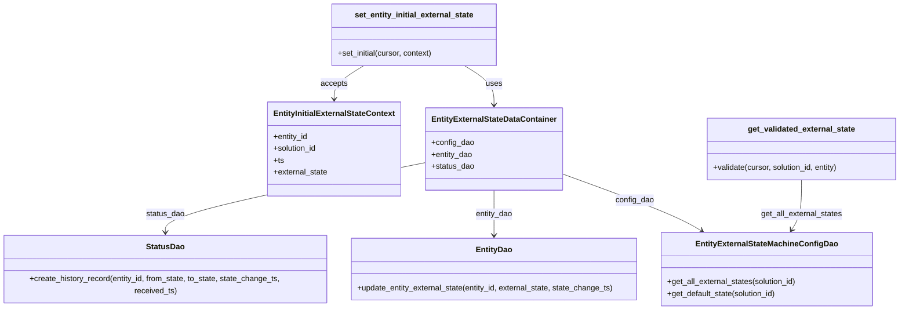

# Diagram: entity_core/entity_service/entity_service/common/external_state.py


> Auto-generated by Obscura crawlers

## Diagram 1



### SVG

<svg id="container" width="1858.98828125" xmlns="http://www.w3.org/2000/svg" class="classDiagram" height="632" viewBox="0 0 1858.98828125 632" role="graphics-document document" aria-roledescription="class"><style>#container{font-family:"trebuchet ms",verdana,arial,sans-serif;font-size:16px;fill:#333;}@keyframes edge-animation-frame{from{stroke-dashoffset:0;}}@keyframes dash{to{stroke-dashoffset:0;}}#container .edge-animation-slow{stroke-dasharray:9,5!important;stroke-dashoffset:900;animation:dash 50s linear infinite;stroke-linecap:round;}#container .edge-animation-fast{stroke-dasharray:9,5!important;stroke-dashoffset:900;animation:dash 20s linear infinite;stroke-linecap:round;}#container .error-icon{fill:#552222;}#container .error-text{fill:#552222;stroke:#552222;}#container .edge-thickness-normal{stroke-width:1px;}#container .edge-thickness-thick{stroke-width:3.5px;}#container .edge-pattern-solid{stroke-dasharray:0;}#container .edge-thickness-invisible{stroke-width:0;fill:none;}#container .edge-pattern-dashed{stroke-dasharray:3;}#container .edge-pattern-dotted{stroke-dasharray:2;}#container .marker{fill:#333333;stroke:#333333;}#container .marker.cross{stroke:#333333;}#container svg{font-family:"trebuchet ms",verdana,arial,sans-serif;font-size:16px;}#container p{margin:0;}#container g.classGroup text{fill:#9370DB;stroke:none;font-family:"trebuchet ms",verdana,arial,sans-serif;font-size:10px;}#container g.classGroup text .title{font-weight:bolder;}#container .nodeLabel,#container .edgeLabel{color:#131300;}#container .edgeLabel .label rect{fill:#ECECFF;}#container .label text{fill:#131300;}#container .labelBkg{background:#ECECFF;}#container .edgeLabel .label span{background:#ECECFF;}#container .classTitle{font-weight:bolder;}#container .node rect,#container .node circle,#container .node ellipse,#container .node polygon,#container .node path{fill:#ECECFF;stroke:#9370DB;stroke-width:1px;}#container .divider{stroke:#9370DB;stroke-width:1;}#container g.clickable{cursor:pointer;}#container g.classGroup rect{fill:#ECECFF;stroke:#9370DB;}#container g.classGroup line{stroke:#9370DB;stroke-width:1;}#container .classLabel .box{stroke:none;stroke-width:0;fill:#ECECFF;opacity:0.5;}#container .classLabel .label{fill:#9370DB;font-size:10px;}#container .relation{stroke:#333333;stroke-width:1;fill:none;}#container .dashed-line{stroke-dasharray:3;}#container .dotted-line{stroke-dasharray:1 2;}#container #compositionStart,#container .composition{fill:#333333!important;stroke:#333333!important;stroke-width:1;}#container #compositionEnd,#container .composition{fill:#333333!important;stroke:#333333!important;stroke-width:1;}#container #dependencyStart,#container .dependency{fill:#333333!important;stroke:#333333!important;stroke-width:1;}#container #dependencyStart,#container .dependency{fill:#333333!important;stroke:#333333!important;stroke-width:1;}#container #extensionStart,#container .extension{fill:transparent!important;stroke:#333333!important;stroke-width:1;}#container #extensionEnd,#container .extension{fill:transparent!important;stroke:#333333!important;stroke-width:1;}#container #aggregationStart,#container .aggregation{fill:transparent!important;stroke:#333333!important;stroke-width:1;}#container #aggregationEnd,#container .aggregation{fill:transparent!important;stroke:#333333!important;stroke-width:1;}#container #lollipopStart,#container .lollipop{fill:#ECECFF!important;stroke:#333333!important;stroke-width:1;}#container #lollipopEnd,#container .lollipop{fill:#ECECFF!important;stroke:#333333!important;stroke-width:1;}#container .edgeTerminals{font-size:11px;line-height:initial;}#container .classTitleText{text-anchor:middle;font-size:18px;fill:#333;}#container .label-icon{display:inline-block;height:1em;overflow:visible;vertical-align:-0.125em;}#container .node .label-icon path{fill:currentColor;stroke:revert;stroke-width:revert;}#container :root{--mermaid-font-family:"trebuchet ms",verdana,arial,sans-serif;}</style><g><defs><marker id="container_class-aggregationStart" class="marker aggregation class" refX="18" refY="7" markerWidth="190" markerHeight="240" orient="auto"><path d="M 18,7 L9,13 L1,7 L9,1 Z"></path></marker></defs><defs><marker id="container_class-aggregationEnd" class="marker aggregation class" refX="1" refY="7" markerWidth="20" markerHeight="28" orient="auto"><path d="M 18,7 L9,13 L1,7 L9,1 Z"></path></marker></defs><defs><marker id="container_class-extensionStart" class="marker extension class" refX="18" refY="7" markerWidth="190" markerHeight="240" orient="auto"><path d="M 1,7 L18,13 V 1 Z"></path></marker></defs><defs><marker id="container_class-extensionEnd" class="marker extension class" refX="1" refY="7" markerWidth="20" markerHeight="28" orient="auto"><path d="M 1,1 V 13 L18,7 Z"></path></marker></defs><defs><marker id="container_class-compositionStart" class="marker composition class" refX="18" refY="7" markerWidth="190" markerHeight="240" orient="auto"><path d="M 18,7 L9,13 L1,7 L9,1 Z"></path></marker></defs><defs><marker id="container_class-compositionEnd" class="marker composition class" refX="1" refY="7" markerWidth="20" markerHeight="28" orient="auto"><path d="M 18,7 L9,13 L1,7 L9,1 Z"></path></marker></defs><defs><marker id="container_class-dependencyStart" class="marker dependency class" refX="6" refY="7" markerWidth="190" markerHeight="240" orient="auto"><path d="M 5,7 L9,13 L1,7 L9,1 Z"></path></marker></defs><defs><marker id="container_class-dependencyEnd" class="marker dependency class" refX="13" refY="7" markerWidth="20" markerHeight="28" orient="auto"><path d="M 18,7 L9,13 L14,7 L9,1 Z"></path></marker></defs><defs><marker id="container_class-lollipopStart" class="marker lollipop class" refX="13" refY="7" markerWidth="190" markerHeight="240" orient="auto"><circle stroke="black" fill="transparent" cx="7" cy="7" r="6"></circle></marker></defs><defs><marker id="container_class-lollipopEnd" class="marker lollipop class" refX="1" refY="7" markerWidth="190" markerHeight="240" orient="auto"><circle stroke="black" fill="transparent" cx="7" cy="7" r="6"></circle></marker></defs><g class="root"><g class="clusters"></g><g class="edgePaths"><path d="M1158.109,352.627L1197.222,366.689C1236.334,380.751,1314.559,408.876,1363.301,428.598C1412.044,448.32,1431.305,459.64,1440.936,465.3L1450.566,470.96" id="id_EntityExternalStateDataContainer_EntityExternalStateMachineConfigDao_1" class="edge-thickness-normal edge-pattern-solid relation" style=";;;" data-edge="true" data-et="edge" data-id="id_EntityExternalStateDataContainer_EntityExternalStateMachineConfigDao_1" data-points="W3sieCI6MTE1OC4xMDkzNzUsInkiOjM1Mi42MjY5MDI3MDkwNjd9LHsieCI6MTM5Mi43ODMyMDMxMjUsInkiOjQzN30seyJ4IjoxNDU1LjczODgyMTg0NzA5ODMsInkiOjQ3NH1d" marker-end="url(#container_class-dependencyEnd)"></path><path d="M1022.859,388L1022.859,396.167C1022.859,404.333,1022.859,420.667,1022.859,436C1022.859,451.333,1022.859,465.667,1022.859,472.833L1022.859,480" id="id_EntityExternalStateDataContainer_EntityDao_2" class="edge-thickness-normal edge-pattern-solid relation" style=";;;" data-edge="true" data-et="edge" data-id="id_EntityExternalStateDataContainer_EntityDao_2" data-points="W3sieCI6MTAyMi44NTkzNzUsInkiOjM4OH0seyJ4IjoxMDIyLjg1OTM3NSwieSI6NDM3fSx7IngiOjEwMjIuODU5Mzc1LCJ5Ijo0ODZ9XQ==" marker-end="url(#container_class-dependencyEnd)"></path><path d="M887.609,330.452L796.814,348.21C706.018,365.968,524.427,401.484,433.632,426.409C342.836,451.333,342.836,465.667,342.836,472.833L342.836,480" id="id_EntityExternalStateDataContainer_StatusDao_3" class="edge-thickness-normal edge-pattern-solid relation" style=";;;" data-edge="true" data-et="edge" data-id="id_EntityExternalStateDataContainer_StatusDao_3" data-points="W3sieCI6ODg3LjYwOTM3NSwieSI6MzMwLjQ1MjM5NzA5MTA5Mjl9LHsieCI6MzQyLjgzNTkzNzUsInkiOjQzN30seyJ4IjozNDIuODM1OTM3NSwieSI6NDg2fV0=" marker-end="url(#container_class-dependencyEnd)"></path><path d="M1655.102,367L1655.102,378.667C1655.102,390.333,1655.102,413.667,1651.69,430.658C1648.279,447.649,1641.457,458.299,1638.046,463.623L1634.635,468.948" id="id_get_validated_external_state_EntityExternalStateMachineConfigDao_4" class="edge-thickness-normal edge-pattern-solid relation" style=";;;" data-edge="true" data-et="edge" data-id="id_get_validated_external_state_EntityExternalStateMachineConfigDao_4" data-points="W3sieCI6MTY1NS4xMDE1NjI1LCJ5IjozNjd9LHsieCI6MTY1NS4xMDE1NjI1LCJ5Ijo0Mzd9LHsieCI6MTYzMS4zOTg0Mzc1LCJ5Ijo0NzR9XQ==" marker-end="url(#container_class-dependencyEnd)"></path><path d="M964.136,134L973.924,140.167C983.711,146.333,1003.285,158.667,1013.072,172C1022.859,185.333,1022.859,199.667,1022.859,206.833L1022.859,214" id="id_set_entity_initial_external_state_EntityExternalStateDataContainer_5" class="edge-thickness-normal edge-pattern-solid relation" style=";;;" data-edge="true" data-et="edge" data-id="id_set_entity_initial_external_state_EntityExternalStateDataContainer_5" data-points="W3sieCI6OTY0LjEzNjMyODEyNSwieSI6MTM0fSx7IngiOjEwMjIuODU5Mzc1LCJ5IjoxNzF9LHsieCI6MTAyMi44NTkzNzUsInkiOjIyMH1d" marker-end="url(#container_class-dependencyEnd)"></path><path d="M764.161,134L754.373,140.167C744.586,146.333,725.012,158.667,715.225,170C705.438,181.333,705.438,191.667,705.438,196.833L705.438,202" id="id_set_entity_initial_external_state_EntityInitialExternalStateContext_6" class="edge-thickness-normal edge-pattern-solid relation" style=";;;" data-edge="true" data-et="edge" data-id="id_set_entity_initial_external_state_EntityInitialExternalStateContext_6" data-points="W3sieCI6NzY0LjE2MDU0Njg3NSwieSI6MTM0fSx7IngiOjcwNS40Mzc1LCJ5IjoxNzF9LHsieCI6NzA1LjQzNzUsInkiOjIwOH1d" marker-end="url(#container_class-dependencyEnd)"></path></g><g class="edgeLabels"><g class="edgeLabel" transform="translate(1309.80477, 407.16648)"><g class="label" data-id="id_EntityExternalStateDataContainer_EntityExternalStateMachineConfigDao_1" transform="translate(-39.625, -12)"><foreignObject width="79.25" height="24"><div xmlns="http://www.w3.org/1999/xhtml" class="labelBkg" style="display: table-cell; white-space: nowrap; line-height: 1.5; max-width: 200px; text-align: center;"><span class="edgeLabel"><p>config_dao</p></span></div></foreignObject></g></g><g class="edgeLabel" transform="translate(1022.859375, 437)"><g class="label" data-id="id_EntityExternalStateDataContainer_EntityDao_2" transform="translate(-38.546875, -12)"><foreignObject width="77.09375" height="24"><div xmlns="http://www.w3.org/1999/xhtml" class="labelBkg" style="display: table-cell; white-space: nowrap; line-height: 1.5; max-width: 200px; text-align: center;"><span class="edgeLabel"><p>entity_dao</p></span></div></foreignObject></g></g><g class="edgeLabel" transform="translate(342.8359375, 437)"><g class="label" data-id="id_EntityExternalStateDataContainer_StatusDao_3" transform="translate(-39.8515625, -12)"><foreignObject width="79.703125" height="24"><div xmlns="http://www.w3.org/1999/xhtml" class="labelBkg" style="display: table-cell; white-space: nowrap; line-height: 1.5; max-width: 200px; text-align: center;"><span class="edgeLabel"><p>status_dao</p></span></div></foreignObject></g></g><g class="edgeLabel" transform="translate(1655.1015625, 437)"><g class="label" data-id="id_get_validated_external_state_EntityExternalStateMachineConfigDao_4" transform="translate(-83.875, -12)"><foreignObject width="167.75" height="24"><div xmlns="http://www.w3.org/1999/xhtml" class="labelBkg" style="display: table-cell; white-space: nowrap; line-height: 1.5; max-width: 200px; text-align: center;"><span class="edgeLabel"><p>get_all_external_states</p></span></div></foreignObject></g></g><g class="edgeLabel" transform="translate(1022.859375, 171)"><g class="label" data-id="id_set_entity_initial_external_state_EntityExternalStateDataContainer_5" transform="translate(-16.4921875, -12)"><foreignObject width="32.984375" height="24"><div xmlns="http://www.w3.org/1999/xhtml" class="labelBkg" style="display: table-cell; white-space: nowrap; line-height: 1.5; max-width: 200px; text-align: center;"><span class="edgeLabel"><p>uses</p></span></div></foreignObject></g></g><g class="edgeLabel" transform="translate(705.4375, 171)"><g class="label" data-id="id_set_entity_initial_external_state_EntityInitialExternalStateContext_6" transform="translate(-27.421875, -12)"><foreignObject width="54.84375" height="24"><div xmlns="http://www.w3.org/1999/xhtml" class="labelBkg" style="display: table-cell; white-space: nowrap; line-height: 1.5; max-width: 200px; text-align: center;"><span class="edgeLabel"><p>accepts</p></span></div></foreignObject></g></g></g><g class="nodes"><g class="node default" id="classId-EntityInitialExternalStateContext-0" transform="translate(705.4375, 304)"><g class="basic label-container"><path d="M-132.171875 -96 L132.171875 -96 L132.171875 96 L-132.171875 96" stroke="none" stroke-width="0" fill="#ECECFF" style=""></path><path d="M-132.171875 -96 C-74.70402198773662 -96, -17.236168975473248 -96, 132.171875 -96 M-132.171875 -96 C-48.957471580098456 -96, 34.25693183980309 -96, 132.171875 -96 M132.171875 -96 C132.171875 -47.39491180463415, 132.171875 1.2101763907317036, 132.171875 96 M132.171875 -96 C132.171875 -22.567802852582076, 132.171875 50.86439429483585, 132.171875 96 M132.171875 96 C53.6092780427321 96, -24.9533189145358 96, -132.171875 96 M132.171875 96 C30.514191508574186 96, -71.14349198285163 96, -132.171875 96 M-132.171875 96 C-132.171875 51.19762086362525, -132.171875 6.395241727250493, -132.171875 -96 M-132.171875 96 C-132.171875 46.39153582556514, -132.171875 -3.2169283488697147, -132.171875 -96" stroke="#9370DB" stroke-width="1.3" fill="none" stroke-dasharray="0 0" style=""></path></g><g class="annotation-group text" transform="translate(0, -72)"></g><g class="label-group text" transform="translate(-120.171875, -72)"><g class="label" style="font-weight: bolder" transform="translate(0,-12)"><foreignObject width="240.34375" height="24"><div xmlns="http://www.w3.org/1999/xhtml" style="display: table-cell; white-space: nowrap; line-height: 1.5; max-width: 286px; text-align: center;"><span class="nodeLabel markdown-node-label" style=""><p>EntityInitialExternalStateContext</p></span></div></foreignObject></g></g><g class="members-group text" transform="translate(-120.171875, -24)"><g class="label" style="" transform="translate(0,-12)"><foreignObject width="71.859375" height="24"><div xmlns="http://www.w3.org/1999/xhtml" style="display: table-cell; white-space: nowrap; line-height: 1.5; max-width: 129px; text-align: center;"><span class="nodeLabel markdown-node-label" style=""><p>+entity_id</p></span></div></foreignObject></g><g class="label" style="" transform="translate(0,12)"><foreignObject width="90.21875" height="24"><div xmlns="http://www.w3.org/1999/xhtml" style="display: table-cell; white-space: nowrap; line-height: 1.5; max-width: 148px; text-align: center;"><span class="nodeLabel markdown-node-label" style=""><p>+solution_id</p></span></div></foreignObject></g><g class="label" style="" transform="translate(0,36)"><foreignObject width="21.15625" height="24"><div xmlns="http://www.w3.org/1999/xhtml" style="display: table-cell; white-space: nowrap; line-height: 1.5; max-width: 79px; text-align: center;"><span class="nodeLabel markdown-node-label" style=""><p>+ts</p></span></div></foreignObject></g><g class="label" style="" transform="translate(0,60)"><foreignObject width="111.78125" height="24"><div xmlns="http://www.w3.org/1999/xhtml" style="display: table-cell; white-space: nowrap; line-height: 1.5; max-width: 169px; text-align: center;"><span class="nodeLabel markdown-node-label" style=""><p>+external_state</p></span></div></foreignObject></g></g><g class="methods-group text" transform="translate(-120.171875, 96)"></g><g class="divider" style=""><path d="M-132.171875 -48 C-57.683128557370495 -48, 16.80561788525901 -48, 132.171875 -48 M-132.171875 -48 C-64.78800692157085 -48, 2.595861156858291 -48, 132.171875 -48" stroke="#9370DB" stroke-width="1.3" fill="none" stroke-dasharray="0 0" style=""></path></g><g class="divider" style=""><path d="M-132.171875 72 C-46.571667300137165 72, 39.02854039972567 72, 132.171875 72 M-132.171875 72 C-67.99225355861044 72, -3.812632117220886 72, 132.171875 72" stroke="#9370DB" stroke-width="1.3" fill="none" stroke-dasharray="0 0" style=""></path></g></g><g class="node default" id="classId-EntityExternalStateMachineConfigDao-1" transform="translate(1583.3515625, 549)"><g class="basic label-container"><path d="M-215.3046875 -75 L215.3046875 -75 L215.3046875 75 L-215.3046875 75" stroke="none" stroke-width="0" fill="#ECECFF" style=""></path><path d="M-215.3046875 -75 C-57.65683104007721 -75, 99.99102541984558 -75, 215.3046875 -75 M-215.3046875 -75 C-104.54957596422314 -75, 6.205535571553725 -75, 215.3046875 -75 M215.3046875 -75 C215.3046875 -24.287699631257276, 215.3046875 26.42460073748545, 215.3046875 75 M215.3046875 -75 C215.3046875 -27.500990278857202, 215.3046875 19.998019442285596, 215.3046875 75 M215.3046875 75 C52.17176444761006 75, -110.96115860477988 75, -215.3046875 75 M215.3046875 75 C127.29812470455043 75, 39.291561909100864 75, -215.3046875 75 M-215.3046875 75 C-215.3046875 33.55521236287481, -215.3046875 -7.889575274250376, -215.3046875 -75 M-215.3046875 75 C-215.3046875 42.57074509927522, -215.3046875 10.141490198550443, -215.3046875 -75" stroke="#9370DB" stroke-width="1.3" fill="none" stroke-dasharray="0 0" style=""></path></g><g class="annotation-group text" transform="translate(0, -51)"></g><g class="label-group text" transform="translate(-138.28125, -51)"><g class="label" style="font-weight: bolder" transform="translate(0,-12)"><foreignObject width="276.5625" height="24"><div xmlns="http://www.w3.org/1999/xhtml" style="display: table-cell; white-space: nowrap; line-height: 1.5; max-width: 322px; text-align: center;"><span class="nodeLabel markdown-node-label" style=""><p>EntityExternalStateMachineConfigDao</p></span></div></foreignObject></g></g><g class="members-group text" transform="translate(-203.3046875, -3)"></g><g class="methods-group text" transform="translate(-203.3046875, 27)"><g class="label" style="" transform="translate(0,-12)"><foreignObject width="268.328125" height="24"><div xmlns="http://www.w3.org/1999/xhtml" style="display: table-cell; white-space: nowrap; line-height: 1.5; max-width: 326px; text-align: center;"><span class="nodeLabel markdown-node-label" style=""><p>+get_all_external_states(solution_id)</p></span></div></foreignObject></g><g class="label" style="" transform="translate(0,12)"><foreignObject width="227.34375" height="24"><div xmlns="http://www.w3.org/1999/xhtml" style="display: table-cell; white-space: nowrap; line-height: 1.5; max-width: 285px; text-align: center;"><span class="nodeLabel markdown-node-label" style=""><p>+get_default_state(solution_id)</p></span></div></foreignObject></g></g><g class="divider" style=""><path d="M-215.3046875 -27 C-123.06183010212094 -27, -30.818972704241872 -27, 215.3046875 -27 M-215.3046875 -27 C-59.72403751232105 -27, 95.8566124753579 -27, 215.3046875 -27" stroke="#9370DB" stroke-width="1.3" fill="none" stroke-dasharray="0 0" style=""></path></g><g class="divider" style=""><path d="M-215.3046875 -3 C-84.33698120603214 -3, 46.63072508793573 -3, 215.3046875 -3 M-215.3046875 -3 C-104.75855147308586 -3, 5.787584553828282 -3, 215.3046875 -3" stroke="#9370DB" stroke-width="1.3" fill="none" stroke-dasharray="0 0" style=""></path></g></g><g class="node default" id="classId-EntityExternalStateDataContainer-2" transform="translate(1022.859375, 304)"><g class="basic label-container"><path d="M-135.25 -84 L135.25 -84 L135.25 84 L-135.25 84" stroke="none" stroke-width="0" fill="#ECECFF" style=""></path><path d="M-135.25 -84 C-41.03249109463478 -84, 53.18501781073044 -84, 135.25 -84 M-135.25 -84 C-60.2870612121002 -84, 14.675877575799603 -84, 135.25 -84 M135.25 -84 C135.25 -38.915249603662254, 135.25 6.169500792675493, 135.25 84 M135.25 -84 C135.25 -46.42137624169142, 135.25 -8.842752483382839, 135.25 84 M135.25 84 C66.1224489509945 84, -3.005102098011008 84, -135.25 84 M135.25 84 C43.51049415966001 84, -48.229011680679974 84, -135.25 84 M-135.25 84 C-135.25 42.69240601749806, -135.25 1.3848120349961164, -135.25 -84 M-135.25 84 C-135.25 22.311187985801638, -135.25 -39.377624028396724, -135.25 -84" stroke="#9370DB" stroke-width="1.3" fill="none" stroke-dasharray="0 0" style=""></path></g><g class="annotation-group text" transform="translate(0, -60)"></g><g class="label-group text" transform="translate(-123.25, -60)"><g class="label" style="font-weight: bolder" transform="translate(0,-12)"><foreignObject width="246.5" height="24"><div xmlns="http://www.w3.org/1999/xhtml" style="display: table-cell; white-space: nowrap; line-height: 1.5; max-width: 293px; text-align: center;"><span class="nodeLabel markdown-node-label" style=""><p>EntityExternalStateDataContainer</p></span></div></foreignObject></g></g><g class="members-group text" transform="translate(-123.25, -12)"><g class="label" style="" transform="translate(0,-12)"><foreignObject width="87.234375" height="24"><div xmlns="http://www.w3.org/1999/xhtml" style="display: table-cell; white-space: nowrap; line-height: 1.5; max-width: 145px; text-align: center;"><span class="nodeLabel markdown-node-label" style=""><p>+config_dao</p></span></div></foreignObject></g><g class="label" style="" transform="translate(0,12)"><foreignObject width="85.078125" height="24"><div xmlns="http://www.w3.org/1999/xhtml" style="display: table-cell; white-space: nowrap; line-height: 1.5; max-width: 142px; text-align: center;"><span class="nodeLabel markdown-node-label" style=""><p>+entity_dao</p></span></div></foreignObject></g><g class="label" style="" transform="translate(0,36)"><foreignObject width="87.6875" height="24"><div xmlns="http://www.w3.org/1999/xhtml" style="display: table-cell; white-space: nowrap; line-height: 1.5; max-width: 145px; text-align: center;"><span class="nodeLabel markdown-node-label" style=""><p>+status_dao</p></span></div></foreignObject></g></g><g class="methods-group text" transform="translate(-123.25, 84)"></g><g class="divider" style=""><path d="M-135.25 -36 C-72.61397419022117 -36, -9.977948380442356 -36, 135.25 -36 M-135.25 -36 C-56.90696876933215 -36, 21.436062461335695 -36, 135.25 -36" stroke="#9370DB" stroke-width="1.3" fill="none" stroke-dasharray="0 0" style=""></path></g><g class="divider" style=""><path d="M-135.25 60 C-63.03262767546201 60, 9.18474464907598 60, 135.25 60 M-135.25 60 C-36.78602627248718 60, 61.677947455025645 60, 135.25 60" stroke="#9370DB" stroke-width="1.3" fill="none" stroke-dasharray="0 0" style=""></path></g></g><g class="node default" id="classId-EntityDao-3" transform="translate(1022.859375, 549)"><g class="basic label-container"><path d="M-295.1875 -63 L295.1875 -63 L295.1875 63 L-295.1875 63" stroke="none" stroke-width="0" fill="#ECECFF" style=""></path><path d="M-295.1875 -63 C-107.39059738850136 -63, 80.40630522299728 -63, 295.1875 -63 M-295.1875 -63 C-108.41550470536751 -63, 78.35649058926498 -63, 295.1875 -63 M295.1875 -63 C295.1875 -26.965060183333023, 295.1875 9.069879633333954, 295.1875 63 M295.1875 -63 C295.1875 -14.027497999317411, 295.1875 34.94500400136518, 295.1875 63 M295.1875 63 C151.15078435819882 63, 7.1140687163976395 63, -295.1875 63 M295.1875 63 C104.62767639970411 63, -85.93214720059177 63, -295.1875 63 M-295.1875 63 C-295.1875 13.424401742433645, -295.1875 -36.15119651513271, -295.1875 -63 M-295.1875 63 C-295.1875 29.540864862648043, -295.1875 -3.9182702747039144, -295.1875 -63" stroke="#9370DB" stroke-width="1.3" fill="none" stroke-dasharray="0 0" style=""></path></g><g class="annotation-group text" transform="translate(0, -39)"></g><g class="label-group text" transform="translate(-35.46875, -39)"><g class="label" style="font-weight: bolder" transform="translate(0,-12)"><foreignObject width="70.9375" height="24"><div xmlns="http://www.w3.org/1999/xhtml" style="display: table-cell; white-space: nowrap; line-height: 1.5; max-width: 120px; text-align: center;"><span class="nodeLabel markdown-node-label" style=""><p>EntityDao</p></span></div></foreignObject></g></g><g class="members-group text" transform="translate(-283.1875, 9)"></g><g class="methods-group text" transform="translate(-283.1875, 39)"><g class="label" style="" transform="translate(0,-12)"><foreignObject width="530.90625" height="24"><div xmlns="http://www.w3.org/1999/xhtml" style="display: table-cell; white-space: nowrap; line-height: 1.5; max-width: 588px; text-align: center;"><span class="nodeLabel markdown-node-label" style=""><p>+update_entity_external_state(entity_id, external_state, state_change_ts)</p></span></div></foreignObject></g></g><g class="divider" style=""><path d="M-295.1875 -15 C-85.88021518516757 -15, 123.42706962966486 -15, 295.1875 -15 M-295.1875 -15 C-75.3999249178778 -15, 144.3876501642444 -15, 295.1875 -15" stroke="#9370DB" stroke-width="1.3" fill="none" stroke-dasharray="0 0" style=""></path></g><g class="divider" style=""><path d="M-295.1875 9 C-144.52425177674743 9, 6.138996446505132 9, 295.1875 9 M-295.1875 9 C-131.30451247883798 9, 32.578475042324044 9, 295.1875 9" stroke="#9370DB" stroke-width="1.3" fill="none" stroke-dasharray="0 0" style=""></path></g></g><g class="node default" id="classId-StatusDao-4" transform="translate(342.8359375, 549)"><g class="basic label-container"><path d="M-334.8359375 -63 L334.8359375 -63 L334.8359375 63 L-334.8359375 63" stroke="none" stroke-width="0" fill="#ECECFF" style=""></path><path d="M-334.8359375 -63 C-198.37489989377653 -63, -61.91386228755306 -63, 334.8359375 -63 M-334.8359375 -63 C-111.70294067324332 -63, 111.43005615351336 -63, 334.8359375 -63 M334.8359375 -63 C334.8359375 -23.584096248691665, 334.8359375 15.83180750261667, 334.8359375 63 M334.8359375 -63 C334.8359375 -19.171656764394406, 334.8359375 24.656686471211188, 334.8359375 63 M334.8359375 63 C75.95483077272667 63, -182.92627595454667 63, -334.8359375 63 M334.8359375 63 C139.3443288778619 63, -56.147279744276204 63, -334.8359375 63 M-334.8359375 63 C-334.8359375 13.025792047147846, -334.8359375 -36.94841590570431, -334.8359375 -63 M-334.8359375 63 C-334.8359375 34.54112585778662, -334.8359375 6.082251715573236, -334.8359375 -63" stroke="#9370DB" stroke-width="1.3" fill="none" stroke-dasharray="0 0" style=""></path></g><g class="annotation-group text" transform="translate(0, -39)"></g><g class="label-group text" transform="translate(-37.671875, -39)"><g class="label" style="font-weight: bolder" transform="translate(0,-12)"><foreignObject width="75.34375" height="24"><div xmlns="http://www.w3.org/1999/xhtml" style="display: table-cell; white-space: nowrap; line-height: 1.5; max-width: 124px; text-align: center;"><span class="nodeLabel markdown-node-label" style=""><p>StatusDao</p></span></div></foreignObject></g></g><g class="members-group text" transform="translate(-322.8359375, 9)"></g><g class="methods-group text" transform="translate(-322.8359375, 39)"><g class="label" style="" transform="translate(0,-12)"><foreignObject width="608" height="24"><div xmlns="http://www.w3.org/1999/xhtml" style="display: table-cell; white-space: nowrap; line-height: 1.5; max-width: 665px; text-align: center;"><span class="nodeLabel markdown-node-label" style=""><p>+create_history_record(entity_id, from_state, to_state, state_change_ts, received_ts)</p></span></div></foreignObject></g></g><g class="divider" style=""><path d="M-334.8359375 -15 C-74.08902985313273 -15, 186.65787779373454 -15, 334.8359375 -15 M-334.8359375 -15 C-155.0750708117265 -15, 24.68579587654699 -15, 334.8359375 -15" stroke="#9370DB" stroke-width="1.3" fill="none" stroke-dasharray="0 0" style=""></path></g><g class="divider" style=""><path d="M-334.8359375 9 C-180.84717788399902 9, -26.858418267998047 9, 334.8359375 9 M-334.8359375 9 C-141.64282847191762 9, 51.55028055616475 9, 334.8359375 9" stroke="#9370DB" stroke-width="1.3" fill="none" stroke-dasharray="0 0" style=""></path></g></g><g class="node default" id="classId-get_validated_external_state-5" transform="translate(1655.1015625, 304)"><g class="basic label-container"><path d="M-195.88671875 -63 L195.88671875 -63 L195.88671875 63 L-195.88671875 63" stroke="none" stroke-width="0" fill="#ECECFF" style=""></path><path d="M-195.88671875 -63 C-80.51484746680264 -63, 34.85702381639473 -63, 195.88671875 -63 M-195.88671875 -63 C-88.58157415309792 -63, 18.723570443804164 -63, 195.88671875 -63 M195.88671875 -63 C195.88671875 -19.10227600571578, 195.88671875 24.79544798856844, 195.88671875 63 M195.88671875 -63 C195.88671875 -30.96686607522401, 195.88671875 1.066267849551977, 195.88671875 63 M195.88671875 63 C39.99759020797367 63, -115.89153833405265 63, -195.88671875 63 M195.88671875 63 C109.24593634468181 63, 22.605153939363618 63, -195.88671875 63 M-195.88671875 63 C-195.88671875 15.598279811580397, -195.88671875 -31.803440376839205, -195.88671875 -63 M-195.88671875 63 C-195.88671875 35.60857111316189, -195.88671875 8.217142226323773, -195.88671875 -63" stroke="#9370DB" stroke-width="1.3" fill="none" stroke-dasharray="0 0" style=""></path></g><g class="annotation-group text" transform="translate(0, -39)"></g><g class="label-group text" transform="translate(-106.8984375, -39)"><g class="label" style="font-weight: bolder" transform="translate(0,-12)"><foreignObject width="213.796875" height="24"><div xmlns="http://www.w3.org/1999/xhtml" style="display: table-cell; white-space: nowrap; line-height: 1.5; max-width: 260px; text-align: center;"><span class="nodeLabel markdown-node-label" style=""><p>get_validated_external_state</p></span></div></foreignObject></g></g><g class="members-group text" transform="translate(-183.88671875, 9)"></g><g class="methods-group text" transform="translate(-183.88671875, 39)"><g class="label" style="" transform="translate(0,-12)"><foreignObject width="260.875" height="24"><div xmlns="http://www.w3.org/1999/xhtml" style="display: table-cell; white-space: nowrap; line-height: 1.5; max-width: 318px; text-align: center;"><span class="nodeLabel markdown-node-label" style=""><p>+validate(cursor, solution_id, entity)</p></span></div></foreignObject></g></g><g class="divider" style=""><path d="M-195.88671875 -15 C-114.86147410747427 -15, -33.83622946494853 -15, 195.88671875 -15 M-195.88671875 -15 C-97.2382276864939 -15, 1.4102633770121997 -15, 195.88671875 -15" stroke="#9370DB" stroke-width="1.3" fill="none" stroke-dasharray="0 0" style=""></path></g><g class="divider" style=""><path d="M-195.88671875 9 C-78.88713777746452 9, 38.112443195070966 9, 195.88671875 9 M-195.88671875 9 C-58.192405271817734 9, 79.50190820636453 9, 195.88671875 9" stroke="#9370DB" stroke-width="1.3" fill="none" stroke-dasharray="0 0" style=""></path></g></g><g class="node default" id="classId-set_entity_initial_external_state-6" transform="translate(864.1484375, 71)"><g class="basic label-container"><path d="M-169.921875 -63 L169.921875 -63 L169.921875 63 L-169.921875 63" stroke="none" stroke-width="0" fill="#ECECFF" style=""></path><path d="M-169.921875 -63 C-67.40352488282977 -63, 35.11482523434046 -63, 169.921875 -63 M-169.921875 -63 C-85.30956212069997 -63, -0.6972492413999305 -63, 169.921875 -63 M169.921875 -63 C169.921875 -30.78585674039688, 169.921875 1.4282865192062388, 169.921875 63 M169.921875 -63 C169.921875 -32.7594562153087, 169.921875 -2.518912430617398, 169.921875 63 M169.921875 63 C64.93895545140884 63, -40.04396409718231 63, -169.921875 63 M169.921875 63 C55.10712644278951 63, -59.707622114420985 63, -169.921875 63 M-169.921875 63 C-169.921875 37.39193153459816, -169.921875 11.783863069196308, -169.921875 -63 M-169.921875 63 C-169.921875 28.45990392965752, -169.921875 -6.080192140684957, -169.921875 -63" stroke="#9370DB" stroke-width="1.3" fill="none" stroke-dasharray="0 0" style=""></path></g><g class="annotation-group text" transform="translate(0, -39)"></g><g class="label-group text" transform="translate(-119.046875, -39)"><g class="label" style="font-weight: bolder" transform="translate(0,-12)"><foreignObject width="238.09375" height="24"><div xmlns="http://www.w3.org/1999/xhtml" style="display: table-cell; white-space: nowrap; line-height: 1.5; max-width: 283px; text-align: center;"><span class="nodeLabel markdown-node-label" style=""><p>set_entity_initial_external_state</p></span></div></foreignObject></g></g><g class="members-group text" transform="translate(-157.921875, 9)"></g><g class="methods-group text" transform="translate(-157.921875, 39)"><g class="label" style="" transform="translate(0,-12)"><foreignObject width="196.796875" height="24"><div xmlns="http://www.w3.org/1999/xhtml" style="display: table-cell; white-space: nowrap; line-height: 1.5; max-width: 254px; text-align: center;"><span class="nodeLabel markdown-node-label" style=""><p>+set_initial(cursor, context)</p></span></div></foreignObject></g></g><g class="divider" style=""><path d="M-169.921875 -15 C-71.28808517255176 -15, 27.34570465489648 -15, 169.921875 -15 M-169.921875 -15 C-67.5220216929678 -15, 34.877831614064405 -15, 169.921875 -15" stroke="#9370DB" stroke-width="1.3" fill="none" stroke-dasharray="0 0" style=""></path></g><g class="divider" style=""><path d="M-169.921875 9 C-37.46995405509091 9, 94.98196688981818 9, 169.921875 9 M-169.921875 9 C-63.521558015007656 9, 42.87875896998469 9, 169.921875 9" stroke="#9370DB" stroke-width="1.3" fill="none" stroke-dasharray="0 0" style=""></path></g></g></g></g></g></svg>

## Diagram 2

```mermaid
flowchart TD
    subgraph ValidateExternalState
      V_Start[Start] --> V_Get[Call EntityExternalStateMachineConfigDao.get_all_external_states(solution_id)]
      V_Get --> V_Check{desired_state in valid_states?}
      V_Check -- Yes --> V_ReturnOK[Return {external_state, external_state_change_ts}]
      V_Check -- No --> V_LogError[Log error: invalid external state] --> V_ReturnEmpty[Return {}]
    end

    subgraph SetInitialExternalState
      S_Start[Start] --> S_CheckEntity{context.entity_id present?}
      S_CheckEntity -- No --> S_ReturnNone[Return None]
      S_CheckEntity -- Yes --> S_CreateDC[Instantiate EntityExternalStateDataContainer(cursor)]
      S_CreateDC --> S_GetDefault[default_state = config_dao.get_default_state(context.solution_id)]
      S_GetDefault --> S_CheckDefault{default_state present?}
      S_CheckDefault -- No --> S_LogInfo[Log info: default not found] --> S_ReturnNone2[Return None]
      S_CheckDefault -- Yes --> S_Update[entity_dao.update_entity_external_state(entity_id, default_state, context.ts)]
      S_Update --> S_History[status_dao.create_history_record(entity_id, from_state=None, to_state=default_state, state_change_ts=context.ts, received_ts=context.ts)]
      S_History --> S_Assign[context.external_state = default_state]
      S_Assign --> S_ReturnContext[Return context]
      S_CreateDC -.-> S_Exception[Exception caught -> Log error]
    end
```

> SVG rendering failed for this diagram.
