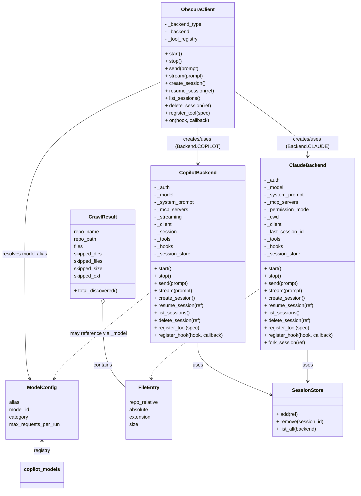

# Diagram: entity_core/entity_service/entity_service/common/integration_notifier/config/__init__.py


> Auto-generated by Obscura crawlers

## Diagram 1



### SVG

<svg id="container" width="1163.8359375" xmlns="http://www.w3.org/2000/svg" class="classDiagram" height="1594" viewBox="0 0 1163.8359375 1594" role="graphics-document document" aria-roledescription="class"><style>#container{font-family:"trebuchet ms",verdana,arial,sans-serif;font-size:16px;fill:#333;}@keyframes edge-animation-frame{from{stroke-dashoffset:0;}}@keyframes dash{to{stroke-dashoffset:0;}}#container .edge-animation-slow{stroke-dasharray:9,5!important;stroke-dashoffset:900;animation:dash 50s linear infinite;stroke-linecap:round;}#container .edge-animation-fast{stroke-dasharray:9,5!important;stroke-dashoffset:900;animation:dash 20s linear infinite;stroke-linecap:round;}#container .error-icon{fill:#552222;}#container .error-text{fill:#552222;stroke:#552222;}#container .edge-thickness-normal{stroke-width:1px;}#container .edge-thickness-thick{stroke-width:3.5px;}#container .edge-pattern-solid{stroke-dasharray:0;}#container .edge-thickness-invisible{stroke-width:0;fill:none;}#container .edge-pattern-dashed{stroke-dasharray:3;}#container .edge-pattern-dotted{stroke-dasharray:2;}#container .marker{fill:#333333;stroke:#333333;}#container .marker.cross{stroke:#333333;}#container svg{font-family:"trebuchet ms",verdana,arial,sans-serif;font-size:16px;}#container p{margin:0;}#container g.classGroup text{fill:#9370DB;stroke:none;font-family:"trebuchet ms",verdana,arial,sans-serif;font-size:10px;}#container g.classGroup text .title{font-weight:bolder;}#container .nodeLabel,#container .edgeLabel{color:#131300;}#container .edgeLabel .label rect{fill:#ECECFF;}#container .label text{fill:#131300;}#container .labelBkg{background:#ECECFF;}#container .edgeLabel .label span{background:#ECECFF;}#container .classTitle{font-weight:bolder;}#container .node rect,#container .node circle,#container .node ellipse,#container .node polygon,#container .node path{fill:#ECECFF;stroke:#9370DB;stroke-width:1px;}#container .divider{stroke:#9370DB;stroke-width:1;}#container g.clickable{cursor:pointer;}#container g.classGroup rect{fill:#ECECFF;stroke:#9370DB;}#container g.classGroup line{stroke:#9370DB;stroke-width:1;}#container .classLabel .box{stroke:none;stroke-width:0;fill:#ECECFF;opacity:0.5;}#container .classLabel .label{fill:#9370DB;font-size:10px;}#container .relation{stroke:#333333;stroke-width:1;fill:none;}#container .dashed-line{stroke-dasharray:3;}#container .dotted-line{stroke-dasharray:1 2;}#container #compositionStart,#container .composition{fill:#333333!important;stroke:#333333!important;stroke-width:1;}#container #compositionEnd,#container .composition{fill:#333333!important;stroke:#333333!important;stroke-width:1;}#container #dependencyStart,#container .dependency{fill:#333333!important;stroke:#333333!important;stroke-width:1;}#container #dependencyStart,#container .dependency{fill:#333333!important;stroke:#333333!important;stroke-width:1;}#container #extensionStart,#container .extension{fill:transparent!important;stroke:#333333!important;stroke-width:1;}#container #extensionEnd,#container .extension{fill:transparent!important;stroke:#333333!important;stroke-width:1;}#container #aggregationStart,#container .aggregation{fill:transparent!important;stroke:#333333!important;stroke-width:1;}#container #aggregationEnd,#container .aggregation{fill:transparent!important;stroke:#333333!important;stroke-width:1;}#container #lollipopStart,#container .lollipop{fill:#ECECFF!important;stroke:#333333!important;stroke-width:1;}#container #lollipopEnd,#container .lollipop{fill:#ECECFF!important;stroke:#333333!important;stroke-width:1;}#container .edgeTerminals{font-size:11px;line-height:initial;}#container .classTitleText{text-anchor:middle;font-size:18px;fill:#333;}#container .label-icon{display:inline-block;height:1em;overflow:visible;vertical-align:-0.125em;}#container .node .label-icon path{fill:currentColor;stroke:revert;stroke-width:revert;}#container :root{--mermaid-font-family:"trebuchet ms",verdana,arial,sans-serif;}</style><g><defs><marker id="container_class-aggregationStart" class="marker aggregation class" refX="18" refY="7" markerWidth="190" markerHeight="240" orient="auto"><path d="M 18,7 L9,13 L1,7 L9,1 Z"></path></marker></defs><defs><marker id="container_class-aggregationEnd" class="marker aggregation class" refX="1" refY="7" markerWidth="20" markerHeight="28" orient="auto"><path d="M 18,7 L9,13 L1,7 L9,1 Z"></path></marker></defs><defs><marker id="container_class-extensionStart" class="marker extension class" refX="18" refY="7" markerWidth="190" markerHeight="240" orient="auto"><path d="M 1,7 L18,13 V 1 Z"></path></marker></defs><defs><marker id="container_class-extensionEnd" class="marker extension class" refX="1" refY="7" markerWidth="20" markerHeight="28" orient="auto"><path d="M 1,1 V 13 L18,7 Z"></path></marker></defs><defs><marker id="container_class-compositionStart" class="marker composition class" refX="18" refY="7" markerWidth="190" markerHeight="240" orient="auto"><path d="M 18,7 L9,13 L1,7 L9,1 Z"></path></marker></defs><defs><marker id="container_class-compositionEnd" class="marker composition class" refX="1" refY="7" markerWidth="20" markerHeight="28" orient="auto"><path d="M 18,7 L9,13 L1,7 L9,1 Z"></path></marker></defs><defs><marker id="container_class-dependencyStart" class="marker dependency class" refX="6" refY="7" markerWidth="190" markerHeight="240" orient="auto"><path d="M 5,7 L9,13 L1,7 L9,1 Z"></path></marker></defs><defs><marker id="container_class-dependencyEnd" class="marker dependency class" refX="13" refY="7" markerWidth="20" markerHeight="28" orient="auto"><path d="M 18,7 L9,13 L14,7 L9,1 Z"></path></marker></defs><defs><marker id="container_class-lollipopStart" class="marker lollipop class" refX="13" refY="7" markerWidth="190" markerHeight="240" orient="auto"><circle stroke="black" fill="transparent" cx="7" cy="7" r="6"></circle></marker></defs><defs><marker id="container_class-lollipopEnd" class="marker lollipop class" refX="1" refY="7" markerWidth="190" markerHeight="240" orient="auto"><circle stroke="black" fill="transparent" cx="7" cy="7" r="6"></circle></marker></defs><g class="root"><g class="clusters"></g><g class="edgePaths"><path d="M647.613,416L647.613,424.167C647.613,432.333,647.613,448.667,647.613,468C647.613,487.333,647.613,509.667,647.613,520.833L647.613,532" id="id_ObscuraClient_CopilotBackend_1" class="edge-thickness-normal edge-pattern-solid relation" style=";;;" data-edge="true" data-et="edge" data-id="id_ObscuraClient_CopilotBackend_1" data-points="W3sieCI6NjQ3LjYxMzI4MTI1LCJ5Ijo0MTZ9LHsieCI6NjQ3LjYxMzI4MTI1LCJ5Ijo0NjV9LHsieCI6NjQ3LjYxMzI4MTI1LCJ5Ijo1Mzh9XQ==" marker-end="url(#container_class-dependencyEnd)"></path><path d="M764.906,295.431L804.638,323.693C844.37,351.954,923.833,408.477,963.565,443.905C1003.297,479.333,1003.297,493.667,1003.297,500.833L1003.297,508" id="id_ObscuraClient_ClaudeBackend_2" class="edge-thickness-normal edge-pattern-solid relation" style=";;;" data-edge="true" data-et="edge" data-id="id_ObscuraClient_ClaudeBackend_2" data-points="W3sieCI6NzY0LjkwNjI1LCJ5IjoyOTUuNDMxMjMzODY5NjM5MjR9LHsieCI6MTAwMy4yOTY4NzUsInkiOjQ2NX0seyJ4IjoxMDAzLjI5Njg3NSwieSI6NTE0fV0=" marker-end="url(#container_class-dependencyEnd)"></path><path d="M530.32,264.468L455.604,297.89C380.888,331.312,231.456,398.156,156.74,491.745C82.023,585.333,82.023,705.667,82.023,826C82.023,946.333,82.023,1066.667,84.848,1134.068C87.672,1201.47,93.32,1215.94,96.144,1223.176L98.968,1230.411" id="id_ObscuraClient_ModelConfig_3" class="edge-thickness-normal edge-pattern-solid relation" style=";;;" data-edge="true" data-et="edge" data-id="id_ObscuraClient_ModelConfig_3" data-points="W3sieCI6NTMwLjMyMDMxMjUsInkiOjI2NC40Njc1NjM1OTE2NTk3fSx7IngiOjgyLjAyMzQzNzUsInkiOjQ2NX0seyJ4Ijo4Mi4wMjM0Mzc1LCJ5Ijo4MjZ9LHsieCI6ODIuMDIzNDM3NSwieSI6MTE4N30seyJ4IjoxMDEuMTQ5NTQyMDI1ODYyMDgsInkiOjEyMzZ9XQ==" marker-end="url(#container_class-dependencyEnd)"></path><path d="M647.613,1114L647.613,1126.167C647.613,1138.333,647.613,1162.667,687.224,1190.981C726.834,1219.296,806.055,1251.591,845.666,1267.739L885.276,1283.887" id="id_CopilotBackend_SessionStore_4" class="edge-thickness-normal edge-pattern-solid relation" style=";;;" data-edge="true" data-et="edge" data-id="id_CopilotBackend_SessionStore_4" data-points="W3sieCI6NjQ3LjYxMzI4MTI1LCJ5IjoxMTE0fSx7IngiOjY0Ny42MTMyODEyNSwieSI6MTE4N30seyJ4Ijo4OTAuODMyMDMxMjUsInkiOjEyODYuMTUxOTQxMTM0NDc5fV0=" marker-end="url(#container_class-dependencyEnd)"></path><path d="M1003.297,1138L1003.297,1146.167C1003.297,1154.333,1003.297,1170.667,1003.297,1187.5C1003.297,1204.333,1003.297,1221.667,1003.297,1230.333L1003.297,1239" id="id_ClaudeBackend_SessionStore_5" class="edge-thickness-normal edge-pattern-solid relation" style=";;;" data-edge="true" data-et="edge" data-id="id_ClaudeBackend_SessionStore_5" data-points="W3sieCI6MTAwMy4yOTY4NzUsInkiOjExMzh9LHsieCI6MTAwMy4yOTY4NzUsInkiOjExODd9LHsieCI6MTAwMy4yOTY4NzUsInkiOjEyNDV9XQ==" marker-end="url(#container_class-dependencyEnd)"></path><path d="M339.305,987.25L339.305,1020.542C339.305,1053.833,339.305,1120.417,351.814,1165.729C364.323,1211.042,389.341,1235.083,401.85,1247.104L414.359,1259.125" id="id_CrawlResult_FileEntry_6" class="edge-thickness-normal edge-pattern-solid relation" style=";;;" data-edge="true" data-et="edge" data-id="id_CrawlResult_FileEntry_6" data-points="W3sieCI6MzM5LjMwNDY4NzUsInkiOjk3MH0seyJ4IjozMzkuMzA0Njg3NSwieSI6MTE4N30seyJ4Ijo0MTQuMzU5Mzc1LCJ5IjoxMjU5LjEyNDYyNDYyNDYyNDZ9XQ==" marker-start="url(#container_class-aggregationStart)"></path><path d="M138.621,1434L138.621,1439.167C138.621,1444.333,138.621,1454.667,138.621,1466C138.621,1477.333,138.621,1489.667,138.621,1495.833L138.621,1502" id="id_ModelConfig_copilot_models_7" class="edge-thickness-normal edge-pattern-solid relation" style=";;;" data-edge="true" data-et="edge" data-id="id_ModelConfig_copilot_models_7" data-points="W3sieCI6MTM4LjYyMTA5Mzc1LCJ5IjoxNDI4fSx7IngiOjEzOC42MjEwOTM3NSwieSI6MTQ2NX0seyJ4IjoxMzguNjIxMDkzNzUsInkiOjE1MDJ9XQ==" marker-start="url(#container_class-dependencyStart)"></path><path d="M494.469,948.206L444.594,988.005C394.719,1027.804,294.969,1107.402,242.27,1154.436C189.571,1201.47,183.922,1215.94,181.098,1223.176L178.274,1230.411" id="id_CopilotBackend_ModelConfig_8" class="edge-thickness-normal edge-pattern-dashed relation" style=";;;" data-edge="true" data-et="edge" data-id="id_CopilotBackend_ModelConfig_8" data-points="W3sieCI6NDk0LjQ2ODc1LCJ5Ijo5NDguMjA1NjY3NzU3NTA1Nn0seyJ4IjoxOTUuMjE4NzUsInkiOjExODd9LHsieCI6MTc2LjA5MjY0NTQ3NDEzNzkyLCJ5IjoxMjM2fV0=" marker-end="url(#container_class-dependencyEnd)"></path><path d="M850.758,935.555L792.408,977.463C734.058,1019.37,617.358,1103.185,558.491,1152.262C499.624,1201.339,498.589,1215.677,498.072,1222.846L497.554,1230.016" id="id_ClaudeBackend_FileEntry_9" class="edge-thickness-normal edge-pattern-dashed relation" style=";;;" data-edge="true" data-et="edge" data-id="id_ClaudeBackend_FileEntry_9" data-points="W3sieCI6ODUwLjc1NzgxMjUsInkiOjkzNS41NTUwNDM1MDA4OTk1fSx7IngiOjUwMC42NTgyMDMxMjUsInkiOjExODd9LHsieCI6NDk3LjEyMjQ2NzY3MjQxMzgsInkiOjEyMzZ9XQ==" marker-end="url(#container_class-dependencyEnd)"></path></g><g class="edgeLabels"><g class="edgeLabel" transform="translate(647.61328125, 465)"><g class="label" data-id="id_ObscuraClient_CopilotBackend_1" transform="translate(-100, -24)"><foreignObject width="200" height="48"><div xmlns="http://www.w3.org/1999/xhtml" class="labelBkg" style="display: table; white-space: break-spaces; line-height: 1.5; max-width: 200px; text-align: center; width: 200px;"><span class="edgeLabel"><p>creates/uses (Backend.COPILOT)</p></span></div></foreignObject></g></g><g class="edgeLabel" transform="translate(1003.296875, 465)"><g class="label" data-id="id_ObscuraClient_ClaudeBackend_2" transform="translate(-100, -24)"><foreignObject width="200" height="48"><div xmlns="http://www.w3.org/1999/xhtml" class="labelBkg" style="display: table; white-space: break-spaces; line-height: 1.5; max-width: 200px; text-align: center; width: 200px;"><span class="edgeLabel"><p>creates/uses (Backend.CLAUDE)</p></span></div></foreignObject></g></g><g class="edgeLabel" transform="translate(82.0234375, 826)"><g class="label" data-id="id_ObscuraClient_ModelConfig_3" transform="translate(-74.0234375, -12)"><foreignObject width="148.046875" height="24"><div xmlns="http://www.w3.org/1999/xhtml" class="labelBkg" style="display: table-cell; white-space: nowrap; line-height: 1.5; max-width: 200px; text-align: center;"><span class="edgeLabel"><p>resolves model alias</p></span></div></foreignObject></g></g><g class="edgeLabel" transform="translate(647.61328125, 1187)"><g class="label" data-id="id_CopilotBackend_SessionStore_4" transform="translate(-16.4921875, -12)"><foreignObject width="32.984375" height="24"><div xmlns="http://www.w3.org/1999/xhtml" class="labelBkg" style="display: table-cell; white-space: nowrap; line-height: 1.5; max-width: 200px; text-align: center;"><span class="edgeLabel"><p>uses</p></span></div></foreignObject></g></g><g class="edgeLabel" transform="translate(1003.296875, 1187)"><g class="label" data-id="id_ClaudeBackend_SessionStore_5" transform="translate(-16.4921875, -12)"><foreignObject width="32.984375" height="24"><div xmlns="http://www.w3.org/1999/xhtml" class="labelBkg" style="display: table-cell; white-space: nowrap; line-height: 1.5; max-width: 200px; text-align: center;"><span class="edgeLabel"><p>uses</p></span></div></foreignObject></g></g><g class="edgeLabel" transform="translate(339.3046875, 1187)"><g class="label" data-id="id_CrawlResult_FileEntry_6" transform="translate(-30.890625, -12)"><foreignObject width="61.78125" height="24"><div xmlns="http://www.w3.org/1999/xhtml" class="labelBkg" style="display: table-cell; white-space: nowrap; line-height: 1.5; max-width: 200px; text-align: center;"><span class="edgeLabel"><p>contains</p></span></div></foreignObject></g></g><g class="edgeLabel" transform="translate(138.62109375, 1465)"><g class="label" data-id="id_ModelConfig_copilot_models_7" transform="translate(-27.2734375, -12)"><foreignObject width="54.546875" height="24"><div xmlns="http://www.w3.org/1999/xhtml" class="labelBkg" style="display: table-cell; white-space: nowrap; line-height: 1.5; max-width: 200px; text-align: center;"><span class="edgeLabel"><p>registry</p></span></div></foreignObject></g></g><g class="edgeLabel" transform="translate(324.28644, 1084.00707)"><g class="label" data-id="id_CopilotBackend_ModelConfig_8" transform="translate(-93.1953125, -12)"><foreignObject width="186.390625" height="24"><div xmlns="http://www.w3.org/1999/xhtml" class="labelBkg" style="display: table-cell; white-space: nowrap; line-height: 1.5; max-width: 200px; text-align: center;"><span class="edgeLabel"><p>may reference via _model</p></span></div></foreignObject></g></g><g class="edgeLabel" transform="translate(655.7568, 1075.60667)"><g class="label" data-id="id_ClaudeBackend_FileEntry_9" transform="translate(-100, -24)"><foreignObject width="200" height="48"><div xmlns="http://www.w3.org/1999/xhtml" class="labelBkg" style="display: table; white-space: break-spaces; line-height: 1.5; max-width: 200px; text-align: center; width: 200px;"><span class="edgeLabel"><p>processes files (via crawlers)</p></span></div></foreignObject></g></g></g><g class="nodes"><g class="node default" id="classId-ObscuraClient-0" transform="translate(647.61328125, 212)"><g class="basic label-container"><path d="M-117.29296875 -204 L117.29296875 -204 L117.29296875 204 L-117.29296875 204" stroke="none" stroke-width="0" fill="#ECECFF" style=""></path><path d="M-117.29296875 -204 C-43.6171530322416 -204, 30.058662685516794 -204, 117.29296875 -204 M-117.29296875 -204 C-52.49761159562833 -204, 12.297745558743344 -204, 117.29296875 -204 M117.29296875 -204 C117.29296875 -64.27159795074795, 117.29296875 75.45680409850411, 117.29296875 204 M117.29296875 -204 C117.29296875 -107.40175619500256, 117.29296875 -10.803512390005125, 117.29296875 204 M117.29296875 204 C45.58813185188738 204, -26.116705046225235 204, -117.29296875 204 M117.29296875 204 C61.90860412229315 204, 6.524239494586297 204, -117.29296875 204 M-117.29296875 204 C-117.29296875 84.36297964211992, -117.29296875 -35.27404071576015, -117.29296875 -204 M-117.29296875 204 C-117.29296875 56.11029691486283, -117.29296875 -91.77940617027434, -117.29296875 -204" stroke="#9370DB" stroke-width="1.3" fill="none" stroke-dasharray="0 0" style=""></path></g><g class="annotation-group text" transform="translate(0, -180)"></g><g class="label-group text" transform="translate(-51.0859375, -180)"><g class="label" style="font-weight: bolder" transform="translate(0,-12)"><foreignObject width="102.171875" height="24"><div xmlns="http://www.w3.org/1999/xhtml" style="display: table-cell; white-space: nowrap; line-height: 1.5; max-width: 151px; text-align: center;"><span class="nodeLabel markdown-node-label" style=""><p>ObscuraClient</p></span></div></foreignObject></g></g><g class="members-group text" transform="translate(-105.29296875, -132)"><g class="label" style="" transform="translate(0,-12)"><foreignObject width="120.21875" height="24"><div xmlns="http://www.w3.org/1999/xhtml" style="display: table-cell; white-space: nowrap; line-height: 1.5; max-width: 178px; text-align: center;"><span class="nodeLabel markdown-node-label" style=""><p>- _backend_type</p></span></div></foreignObject></g><g class="label" style="" transform="translate(0,12)"><foreignObject width="80.421875" height="24"><div xmlns="http://www.w3.org/1999/xhtml" style="display: table-cell; white-space: nowrap; line-height: 1.5; max-width: 138px; text-align: center;"><span class="nodeLabel markdown-node-label" style=""><p>- _backend</p></span></div></foreignObject></g><g class="label" style="" transform="translate(0,36)"><foreignObject width="110.46875" height="24"><div xmlns="http://www.w3.org/1999/xhtml" style="display: table-cell; white-space: nowrap; line-height: 1.5; max-width: 168px; text-align: center;"><span class="nodeLabel markdown-node-label" style=""><p>- _tool_registry</p></span></div></foreignObject></g></g><g class="methods-group text" transform="translate(-105.29296875, -36)"><g class="label" style="" transform="translate(0,-12)"><foreignObject width="56.390625" height="24"><div xmlns="http://www.w3.org/1999/xhtml" style="display: table-cell; white-space: nowrap; line-height: 1.5; max-width: 114px; text-align: center;"><span class="nodeLabel markdown-node-label" style=""><p>+ start()</p></span></div></foreignObject></g><g class="label" style="" transform="translate(0,12)"><foreignObject width="54.453125" height="24"><div xmlns="http://www.w3.org/1999/xhtml" style="display: table-cell; white-space: nowrap; line-height: 1.5; max-width: 112px; text-align: center;"><span class="nodeLabel markdown-node-label" style=""><p>+ stop()</p></span></div></foreignObject></g><g class="label" style="" transform="translate(0,36)"><foreignObject width="111.265625" height="24"><div xmlns="http://www.w3.org/1999/xhtml" style="display: table-cell; white-space: nowrap; line-height: 1.5; max-width: 169px; text-align: center;"><span class="nodeLabel markdown-node-label" style=""><p>+ send(prompt)</p></span></div></foreignObject></g><g class="label" style="" transform="translate(0,60)"><foreignObject width="126.0625" height="24"><div xmlns="http://www.w3.org/1999/xhtml" style="display: table-cell; white-space: nowrap; line-height: 1.5; max-width: 183px; text-align: center;"><span class="nodeLabel markdown-node-label" style=""><p>+ stream(prompt)</p></span></div></foreignObject></g><g class="label" style="" transform="translate(0,84)"><foreignObject width="129.671875" height="24"><div xmlns="http://www.w3.org/1999/xhtml" style="display: table-cell; white-space: nowrap; line-height: 1.5; max-width: 187px; text-align: center;"><span class="nodeLabel markdown-node-label" style=""><p>+ create_session()</p></span></div></foreignObject></g><g class="label" style="" transform="translate(0,108)"><foreignObject width="159.5" height="24"><div xmlns="http://www.w3.org/1999/xhtml" style="display: table-cell; white-space: nowrap; line-height: 1.5; max-width: 217px; text-align: center;"><span class="nodeLabel markdown-node-label" style=""><p>+ resume_session(ref)</p></span></div></foreignObject></g><g class="label" style="" transform="translate(0,132)"><foreignObject width="115.046875" height="24"><div xmlns="http://www.w3.org/1999/xhtml" style="display: table-cell; white-space: nowrap; line-height: 1.5; max-width: 172px; text-align: center;"><span class="nodeLabel markdown-node-label" style=""><p>+ list_sessions()</p></span></div></foreignObject></g><g class="label" style="" transform="translate(0,156)"><foreignObject width="151.734375" height="24"><div xmlns="http://www.w3.org/1999/xhtml" style="display: table-cell; white-space: nowrap; line-height: 1.5; max-width: 209px; text-align: center;"><span class="nodeLabel markdown-node-label" style=""><p>+ delete_session(ref)</p></span></div></foreignObject></g><g class="label" style="" transform="translate(0,180)"><foreignObject width="146.734375" height="24"><div xmlns="http://www.w3.org/1999/xhtml" style="display: table-cell; white-space: nowrap; line-height: 1.5; max-width: 204px; text-align: center;"><span class="nodeLabel markdown-node-label" style=""><p>+ register_tool(spec)</p></span></div></foreignObject></g><g class="label" style="" transform="translate(0,204)"><foreignObject width="145.015625" height="24"><div xmlns="http://www.w3.org/1999/xhtml" style="display: table-cell; white-space: nowrap; line-height: 1.5; max-width: 202px; text-align: center;"><span class="nodeLabel markdown-node-label" style=""><p>+ on(hook, callback)</p></span></div></foreignObject></g></g><g class="divider" style=""><path d="M-117.29296875 -156 C-30.537004443260457 -156, 56.218959863479085 -156, 117.29296875 -156 M-117.29296875 -156 C-41.92445396139932 -156, 33.444060827201355 -156, 117.29296875 -156" stroke="#9370DB" stroke-width="1.3" fill="none" stroke-dasharray="0 0" style=""></path></g><g class="divider" style=""><path d="M-117.29296875 -60 C-66.24301235339374 -60, -15.193055956787461 -60, 117.29296875 -60 M-117.29296875 -60 C-59.60634023005979 -60, -1.9197117101195857 -60, 117.29296875 -60" stroke="#9370DB" stroke-width="1.3" fill="none" stroke-dasharray="0 0" style=""></path></g></g><g class="node default" id="classId-CopilotBackend-1" transform="translate(647.61328125, 826)"><g class="basic label-container"><path d="M-153.14453125 -288 L153.14453125 -288 L153.14453125 288 L-153.14453125 288" stroke="none" stroke-width="0" fill="#ECECFF" style=""></path><path d="M-153.14453125 -288 C-40.789854689268665 -288, 71.56482187146267 -288, 153.14453125 -288 M-153.14453125 -288 C-45.8687082345468 -288, 61.4071147809064 -288, 153.14453125 -288 M153.14453125 -288 C153.14453125 -154.15793516587425, 153.14453125 -20.3158703317485, 153.14453125 288 M153.14453125 -288 C153.14453125 -171.42371734699532, 153.14453125 -54.847434693990664, 153.14453125 288 M153.14453125 288 C65.41708999165814 288, -22.31035126668371 288, -153.14453125 288 M153.14453125 288 C89.17842038536062 288, 25.212309520721263 288, -153.14453125 288 M-153.14453125 288 C-153.14453125 146.2091233992351, -153.14453125 4.418246798470193, -153.14453125 -288 M-153.14453125 288 C-153.14453125 125.30816673810497, -153.14453125 -37.383666523790055, -153.14453125 -288" stroke="#9370DB" stroke-width="1.3" fill="none" stroke-dasharray="0 0" style=""></path></g><g class="annotation-group text" transform="translate(0, -264)"></g><g class="label-group text" transform="translate(-57.5390625, -264)"><g class="label" style="font-weight: bolder" transform="translate(0,-12)"><foreignObject width="115.078125" height="24"><div xmlns="http://www.w3.org/1999/xhtml" style="display: table-cell; white-space: nowrap; line-height: 1.5; max-width: 164px; text-align: center;"><span class="nodeLabel markdown-node-label" style=""><p>CopilotBackend</p></span></div></foreignObject></g></g><g class="members-group text" transform="translate(-141.14453125, -216)"><g class="label" style="" transform="translate(0,-12)"><foreignObject width="51.859375" height="24"><div xmlns="http://www.w3.org/1999/xhtml" style="display: table-cell; white-space: nowrap; line-height: 1.5; max-width: 109px; text-align: center;"><span class="nodeLabel markdown-node-label" style=""><p>- _auth</p></span></div></foreignObject></g><g class="label" style="" transform="translate(0,12)"><foreignObject width="65.046875" height="24"><div xmlns="http://www.w3.org/1999/xhtml" style="display: table-cell; white-space: nowrap; line-height: 1.5; max-width: 123px; text-align: center;"><span class="nodeLabel markdown-node-label" style=""><p>- _model</p></span></div></foreignObject></g><g class="label" style="" transform="translate(0,36)"><foreignObject width="131.265625" height="24"><div xmlns="http://www.w3.org/1999/xhtml" style="display: table-cell; white-space: nowrap; line-height: 1.5; max-width: 189px; text-align: center;"><span class="nodeLabel markdown-node-label" style=""><p>- _system_prompt</p></span></div></foreignObject></g><g class="label" style="" transform="translate(0,60)"><foreignObject width="110.1875" height="24"><div xmlns="http://www.w3.org/1999/xhtml" style="display: table-cell; white-space: nowrap; line-height: 1.5; max-width: 168px; text-align: center;"><span class="nodeLabel markdown-node-label" style=""><p>- _mcp_servers</p></span></div></foreignObject></g><g class="label" style="" transform="translate(0,84)"><foreignObject width="91.140625" height="24"><div xmlns="http://www.w3.org/1999/xhtml" style="display: table-cell; white-space: nowrap; line-height: 1.5; max-width: 149px; text-align: center;"><span class="nodeLabel markdown-node-label" style=""><p>- _streaming</p></span></div></foreignObject></g><g class="label" style="" transform="translate(0,108)"><foreignObject width="59.421875" height="24"><div xmlns="http://www.w3.org/1999/xhtml" style="display: table-cell; white-space: nowrap; line-height: 1.5; max-width: 117px; text-align: center;"><span class="nodeLabel markdown-node-label" style=""><p>- _client</p></span></div></foreignObject></g><g class="label" style="" transform="translate(0,132)"><foreignObject width="73.21875" height="24"><div xmlns="http://www.w3.org/1999/xhtml" style="display: table-cell; white-space: nowrap; line-height: 1.5; max-width: 131px; text-align: center;"><span class="nodeLabel markdown-node-label" style=""><p>- _session</p></span></div></foreignObject></g><g class="label" style="" transform="translate(0,156)"><foreignObject width="55.078125" height="24"><div xmlns="http://www.w3.org/1999/xhtml" style="display: table-cell; white-space: nowrap; line-height: 1.5; max-width: 112px; text-align: center;"><span class="nodeLabel markdown-node-label" style=""><p>- _tools</p></span></div></foreignObject></g><g class="label" style="" transform="translate(0,180)"><foreignObject width="62.65625" height="24"><div xmlns="http://www.w3.org/1999/xhtml" style="display: table-cell; white-space: nowrap; line-height: 1.5; max-width: 120px; text-align: center;"><span class="nodeLabel markdown-node-label" style=""><p>- _hooks</p></span></div></foreignObject></g><g class="label" style="" transform="translate(0,204)"><foreignObject width="118.3125" height="24"><div xmlns="http://www.w3.org/1999/xhtml" style="display: table-cell; white-space: nowrap; line-height: 1.5; max-width: 176px; text-align: center;"><span class="nodeLabel markdown-node-label" style=""><p>- _session_store</p></span></div></foreignObject></g></g><g class="methods-group text" transform="translate(-141.14453125, 48)"><g class="label" style="" transform="translate(0,-12)"><foreignObject width="56.390625" height="24"><div xmlns="http://www.w3.org/1999/xhtml" style="display: table-cell; white-space: nowrap; line-height: 1.5; max-width: 114px; text-align: center;"><span class="nodeLabel markdown-node-label" style=""><p>+ start()</p></span></div></foreignObject></g><g class="label" style="" transform="translate(0,12)"><foreignObject width="54.453125" height="24"><div xmlns="http://www.w3.org/1999/xhtml" style="display: table-cell; white-space: nowrap; line-height: 1.5; max-width: 112px; text-align: center;"><span class="nodeLabel markdown-node-label" style=""><p>+ stop()</p></span></div></foreignObject></g><g class="label" style="" transform="translate(0,36)"><foreignObject width="111.265625" height="24"><div xmlns="http://www.w3.org/1999/xhtml" style="display: table-cell; white-space: nowrap; line-height: 1.5; max-width: 169px; text-align: center;"><span class="nodeLabel markdown-node-label" style=""><p>+ send(prompt)</p></span></div></foreignObject></g><g class="label" style="" transform="translate(0,60)"><foreignObject width="126.0625" height="24"><div xmlns="http://www.w3.org/1999/xhtml" style="display: table-cell; white-space: nowrap; line-height: 1.5; max-width: 183px; text-align: center;"><span class="nodeLabel markdown-node-label" style=""><p>+ stream(prompt)</p></span></div></foreignObject></g><g class="label" style="" transform="translate(0,84)"><foreignObject width="129.671875" height="24"><div xmlns="http://www.w3.org/1999/xhtml" style="display: table-cell; white-space: nowrap; line-height: 1.5; max-width: 187px; text-align: center;"><span class="nodeLabel markdown-node-label" style=""><p>+ create_session()</p></span></div></foreignObject></g><g class="label" style="" transform="translate(0,108)"><foreignObject width="159.5" height="24"><div xmlns="http://www.w3.org/1999/xhtml" style="display: table-cell; white-space: nowrap; line-height: 1.5; max-width: 217px; text-align: center;"><span class="nodeLabel markdown-node-label" style=""><p>+ resume_session(ref)</p></span></div></foreignObject></g><g class="label" style="" transform="translate(0,132)"><foreignObject width="115.046875" height="24"><div xmlns="http://www.w3.org/1999/xhtml" style="display: table-cell; white-space: nowrap; line-height: 1.5; max-width: 172px; text-align: center;"><span class="nodeLabel markdown-node-label" style=""><p>+ list_sessions()</p></span></div></foreignObject></g><g class="label" style="" transform="translate(0,156)"><foreignObject width="151.734375" height="24"><div xmlns="http://www.w3.org/1999/xhtml" style="display: table-cell; white-space: nowrap; line-height: 1.5; max-width: 209px; text-align: center;"><span class="nodeLabel markdown-node-label" style=""><p>+ delete_session(ref)</p></span></div></foreignObject></g><g class="label" style="" transform="translate(0,180)"><foreignObject width="146.734375" height="24"><div xmlns="http://www.w3.org/1999/xhtml" style="display: table-cell; white-space: nowrap; line-height: 1.5; max-width: 204px; text-align: center;"><span class="nodeLabel markdown-node-label" style=""><p>+ register_tool(spec)</p></span></div></foreignObject></g><g class="label" style="" transform="translate(0,204)"><foreignObject width="224.75" height="24"><div xmlns="http://www.w3.org/1999/xhtml" style="display: table-cell; white-space: nowrap; line-height: 1.5; max-width: 282px; text-align: center;"><span class="nodeLabel markdown-node-label" style=""><p>+ register_hook(hook, callback)</p></span></div></foreignObject></g></g><g class="divider" style=""><path d="M-153.14453125 -240 C-61.1246297304824 -240, 30.895271789035206 -240, 153.14453125 -240 M-153.14453125 -240 C-46.177451119772556 -240, 60.78962901045489 -240, 153.14453125 -240" stroke="#9370DB" stroke-width="1.3" fill="none" stroke-dasharray="0 0" style=""></path></g><g class="divider" style=""><path d="M-153.14453125 24 C-58.78670633003685 24, 35.5711185899263 24, 153.14453125 24 M-153.14453125 24 C-72.39277141507804 24, 8.35898841984391 24, 153.14453125 24" stroke="#9370DB" stroke-width="1.3" fill="none" stroke-dasharray="0 0" style=""></path></g></g><g class="node default" id="classId-ClaudeBackend-2" transform="translate(1003.296875, 826)"><g class="basic label-container"><path d="M-152.5390625 -312 L152.5390625 -312 L152.5390625 312 L-152.5390625 312" stroke="none" stroke-width="0" fill="#ECECFF" style=""></path><path d="M-152.5390625 -312 C-34.76396538975523 -312, 83.01113172048954 -312, 152.5390625 -312 M-152.5390625 -312 C-58.55075463454965 -312, 35.437553230900704 -312, 152.5390625 -312 M152.5390625 -312 C152.5390625 -113.88567496749837, 152.5390625 84.22865006500325, 152.5390625 312 M152.5390625 -312 C152.5390625 -146.95494139797768, 152.5390625 18.090117204044645, 152.5390625 312 M152.5390625 312 C37.19681255723654 312, -78.14543738552692 312, -152.5390625 312 M152.5390625 312 C41.12655660922269 312, -70.28594928155462 312, -152.5390625 312 M-152.5390625 312 C-152.5390625 85.74921258109637, -152.5390625 -140.50157483780725, -152.5390625 -312 M-152.5390625 312 C-152.5390625 121.11322623017006, -152.5390625 -69.77354753965989, -152.5390625 -312" stroke="#9370DB" stroke-width="1.3" fill="none" stroke-dasharray="0 0" style=""></path></g><g class="annotation-group text" transform="translate(0, -288)"></g><g class="label-group text" transform="translate(-56.328125, -288)"><g class="label" style="font-weight: bolder" transform="translate(0,-12)"><foreignObject width="112.65625" height="24"><div xmlns="http://www.w3.org/1999/xhtml" style="display: table-cell; white-space: nowrap; line-height: 1.5; max-width: 162px; text-align: center;"><span class="nodeLabel markdown-node-label" style=""><p>ClaudeBackend</p></span></div></foreignObject></g></g><g class="members-group text" transform="translate(-140.5390625, -240)"><g class="label" style="" transform="translate(0,-12)"><foreignObject width="51.859375" height="24"><div xmlns="http://www.w3.org/1999/xhtml" style="display: table-cell; white-space: nowrap; line-height: 1.5; max-width: 109px; text-align: center;"><span class="nodeLabel markdown-node-label" style=""><p>- _auth</p></span></div></foreignObject></g><g class="label" style="" transform="translate(0,12)"><foreignObject width="65.046875" height="24"><div xmlns="http://www.w3.org/1999/xhtml" style="display: table-cell; white-space: nowrap; line-height: 1.5; max-width: 123px; text-align: center;"><span class="nodeLabel markdown-node-label" style=""><p>- _model</p></span></div></foreignObject></g><g class="label" style="" transform="translate(0,36)"><foreignObject width="131.265625" height="24"><div xmlns="http://www.w3.org/1999/xhtml" style="display: table-cell; white-space: nowrap; line-height: 1.5; max-width: 189px; text-align: center;"><span class="nodeLabel markdown-node-label" style=""><p>- _system_prompt</p></span></div></foreignObject></g><g class="label" style="" transform="translate(0,60)"><foreignObject width="110.1875" height="24"><div xmlns="http://www.w3.org/1999/xhtml" style="display: table-cell; white-space: nowrap; line-height: 1.5; max-width: 168px; text-align: center;"><span class="nodeLabel markdown-node-label" style=""><p>- _mcp_servers</p></span></div></foreignObject></g><g class="label" style="" transform="translate(0,84)"><foreignObject width="149.3125" height="24"><div xmlns="http://www.w3.org/1999/xhtml" style="display: table-cell; white-space: nowrap; line-height: 1.5; max-width: 207px; text-align: center;"><span class="nodeLabel markdown-node-label" style=""><p>- _permission_mode</p></span></div></foreignObject></g><g class="label" style="" transform="translate(0,108)"><foreignObject width="47.390625" height="24"><div xmlns="http://www.w3.org/1999/xhtml" style="display: table-cell; white-space: nowrap; line-height: 1.5; max-width: 105px; text-align: center;"><span class="nodeLabel markdown-node-label" style=""><p>- _cwd</p></span></div></foreignObject></g><g class="label" style="" transform="translate(0,132)"><foreignObject width="59.421875" height="24"><div xmlns="http://www.w3.org/1999/xhtml" style="display: table-cell; white-space: nowrap; line-height: 1.5; max-width: 117px; text-align: center;"><span class="nodeLabel markdown-node-label" style=""><p>- _client</p></span></div></foreignObject></g><g class="label" style="" transform="translate(0,156)"><foreignObject width="130.1875" height="24"><div xmlns="http://www.w3.org/1999/xhtml" style="display: table-cell; white-space: nowrap; line-height: 1.5; max-width: 188px; text-align: center;"><span class="nodeLabel markdown-node-label" style=""><p>- _last_session_id</p></span></div></foreignObject></g><g class="label" style="" transform="translate(0,180)"><foreignObject width="55.078125" height="24"><div xmlns="http://www.w3.org/1999/xhtml" style="display: table-cell; white-space: nowrap; line-height: 1.5; max-width: 112px; text-align: center;"><span class="nodeLabel markdown-node-label" style=""><p>- _tools</p></span></div></foreignObject></g><g class="label" style="" transform="translate(0,204)"><foreignObject width="62.65625" height="24"><div xmlns="http://www.w3.org/1999/xhtml" style="display: table-cell; white-space: nowrap; line-height: 1.5; max-width: 120px; text-align: center;"><span class="nodeLabel markdown-node-label" style=""><p>- _hooks</p></span></div></foreignObject></g><g class="label" style="" transform="translate(0,228)"><foreignObject width="118.3125" height="24"><div xmlns="http://www.w3.org/1999/xhtml" style="display: table-cell; white-space: nowrap; line-height: 1.5; max-width: 176px; text-align: center;"><span class="nodeLabel markdown-node-label" style=""><p>- _session_store</p></span></div></foreignObject></g></g><g class="methods-group text" transform="translate(-140.5390625, 48)"><g class="label" style="" transform="translate(0,-12)"><foreignObject width="56.390625" height="24"><div xmlns="http://www.w3.org/1999/xhtml" style="display: table-cell; white-space: nowrap; line-height: 1.5; max-width: 114px; text-align: center;"><span class="nodeLabel markdown-node-label" style=""><p>+ start()</p></span></div></foreignObject></g><g class="label" style="" transform="translate(0,12)"><foreignObject width="54.453125" height="24"><div xmlns="http://www.w3.org/1999/xhtml" style="display: table-cell; white-space: nowrap; line-height: 1.5; max-width: 112px; text-align: center;"><span class="nodeLabel markdown-node-label" style=""><p>+ stop()</p></span></div></foreignObject></g><g class="label" style="" transform="translate(0,36)"><foreignObject width="111.265625" height="24"><div xmlns="http://www.w3.org/1999/xhtml" style="display: table-cell; white-space: nowrap; line-height: 1.5; max-width: 169px; text-align: center;"><span class="nodeLabel markdown-node-label" style=""><p>+ send(prompt)</p></span></div></foreignObject></g><g class="label" style="" transform="translate(0,60)"><foreignObject width="126.0625" height="24"><div xmlns="http://www.w3.org/1999/xhtml" style="display: table-cell; white-space: nowrap; line-height: 1.5; max-width: 183px; text-align: center;"><span class="nodeLabel markdown-node-label" style=""><p>+ stream(prompt)</p></span></div></foreignObject></g><g class="label" style="" transform="translate(0,84)"><foreignObject width="129.671875" height="24"><div xmlns="http://www.w3.org/1999/xhtml" style="display: table-cell; white-space: nowrap; line-height: 1.5; max-width: 187px; text-align: center;"><span class="nodeLabel markdown-node-label" style=""><p>+ create_session()</p></span></div></foreignObject></g><g class="label" style="" transform="translate(0,108)"><foreignObject width="159.5" height="24"><div xmlns="http://www.w3.org/1999/xhtml" style="display: table-cell; white-space: nowrap; line-height: 1.5; max-width: 217px; text-align: center;"><span class="nodeLabel markdown-node-label" style=""><p>+ resume_session(ref)</p></span></div></foreignObject></g><g class="label" style="" transform="translate(0,132)"><foreignObject width="115.046875" height="24"><div xmlns="http://www.w3.org/1999/xhtml" style="display: table-cell; white-space: nowrap; line-height: 1.5; max-width: 172px; text-align: center;"><span class="nodeLabel markdown-node-label" style=""><p>+ list_sessions()</p></span></div></foreignObject></g><g class="label" style="" transform="translate(0,156)"><foreignObject width="151.734375" height="24"><div xmlns="http://www.w3.org/1999/xhtml" style="display: table-cell; white-space: nowrap; line-height: 1.5; max-width: 209px; text-align: center;"><span class="nodeLabel markdown-node-label" style=""><p>+ delete_session(ref)</p></span></div></foreignObject></g><g class="label" style="" transform="translate(0,180)"><foreignObject width="146.734375" height="24"><div xmlns="http://www.w3.org/1999/xhtml" style="display: table-cell; white-space: nowrap; line-height: 1.5; max-width: 204px; text-align: center;"><span class="nodeLabel markdown-node-label" style=""><p>+ register_tool(spec)</p></span></div></foreignObject></g><g class="label" style="" transform="translate(0,204)"><foreignObject width="224.75" height="24"><div xmlns="http://www.w3.org/1999/xhtml" style="display: table-cell; white-space: nowrap; line-height: 1.5; max-width: 282px; text-align: center;"><span class="nodeLabel markdown-node-label" style=""><p>+ register_hook(hook, callback)</p></span></div></foreignObject></g><g class="label" style="" transform="translate(0,228)"><foreignObject width="135.09375" height="24"><div xmlns="http://www.w3.org/1999/xhtml" style="display: table-cell; white-space: nowrap; line-height: 1.5; max-width: 192px; text-align: center;"><span class="nodeLabel markdown-node-label" style=""><p>+ fork_session(ref)</p></span></div></foreignObject></g></g><g class="divider" style=""><path d="M-152.5390625 -264 C-33.72122668004843 -264, 85.09660913990314 -264, 152.5390625 -264 M-152.5390625 -264 C-71.92864058864716 -264, 8.681781322705689 -264, 152.5390625 -264" stroke="#9370DB" stroke-width="1.3" fill="none" stroke-dasharray="0 0" style=""></path></g><g class="divider" style=""><path d="M-152.5390625 24 C-77.79332590594309 24, -3.0475893118861848 24, 152.5390625 24 M-152.5390625 24 C-51.26939214682022 24, 50.00027820635955 24, 152.5390625 24" stroke="#9370DB" stroke-width="1.3" fill="none" stroke-dasharray="0 0" style=""></path></g></g><g class="node default" id="classId-ModelConfig-3" transform="translate(138.62109375, 1332)"><g class="basic label-container"><path d="M-117.515625 -96 L117.515625 -96 L117.515625 96 L-117.515625 96" stroke="none" stroke-width="0" fill="#ECECFF" style=""></path><path d="M-117.515625 -96 C-46.23530771644792 -96, 25.04500956710416 -96, 117.515625 -96 M-117.515625 -96 C-69.13210176317881 -96, -20.748578526357633 -96, 117.515625 -96 M117.515625 -96 C117.515625 -57.346791624148196, 117.515625 -18.69358324829639, 117.515625 96 M117.515625 -96 C117.515625 -57.54669184339818, 117.515625 -19.093383686796358, 117.515625 96 M117.515625 96 C32.084857154023 96, -53.345910691954 96, -117.515625 96 M117.515625 96 C57.41436195704338 96, -2.6869010859132345 96, -117.515625 96 M-117.515625 96 C-117.515625 50.27209961263799, -117.515625 4.544199225275975, -117.515625 -96 M-117.515625 96 C-117.515625 39.74875026345309, -117.515625 -16.50249947309382, -117.515625 -96" stroke="#9370DB" stroke-width="1.3" fill="none" stroke-dasharray="0 0" style=""></path></g><g class="annotation-group text" transform="translate(0, -72)"></g><g class="label-group text" transform="translate(-45.484375, -72)"><g class="label" style="font-weight: bolder" transform="translate(0,-12)"><foreignObject width="90.96875" height="24"><div xmlns="http://www.w3.org/1999/xhtml" style="display: table-cell; white-space: nowrap; line-height: 1.5; max-width: 140px; text-align: center;"><span class="nodeLabel markdown-node-label" style=""><p>ModelConfig</p></span></div></foreignObject></g></g><g class="members-group text" transform="translate(-105.515625, -24)"><g class="label" style="" transform="translate(0,-12)"><foreignObject width="33.765625" height="24"><div xmlns="http://www.w3.org/1999/xhtml" style="display: table-cell; white-space: nowrap; line-height: 1.5; max-width: 84px; text-align: center;"><span class="nodeLabel markdown-node-label" style=""><p>alias</p></span></div></foreignObject></g><g class="label" style="" transform="translate(0,12)"><foreignObject width="68.4375" height="24"><div xmlns="http://www.w3.org/1999/xhtml" style="display: table-cell; white-space: nowrap; line-height: 1.5; max-width: 118px; text-align: center;"><span class="nodeLabel markdown-node-label" style=""><p>model_id</p></span></div></foreignObject></g><g class="label" style="" transform="translate(0,36)"><foreignObject width="61.90625" height="24"><div xmlns="http://www.w3.org/1999/xhtml" style="display: table-cell; white-space: nowrap; line-height: 1.5; max-width: 112px; text-align: center;"><span class="nodeLabel markdown-node-label" style=""><p>category</p></span></div></foreignObject></g><g class="label" style="" transform="translate(0,60)"><foreignObject width="165.546875" height="24"><div xmlns="http://www.w3.org/1999/xhtml" style="display: table-cell; white-space: nowrap; line-height: 1.5; max-width: 216px; text-align: center;"><span class="nodeLabel markdown-node-label" style=""><p>max_requests_per_run</p></span></div></foreignObject></g></g><g class="methods-group text" transform="translate(-105.515625, 96)"></g><g class="divider" style=""><path d="M-117.515625 -48 C-63.0334952324591 -48, -8.551365464918206 -48, 117.515625 -48 M-117.515625 -48 C-26.783787806805307 -48, 63.948049386389386 -48, 117.515625 -48" stroke="#9370DB" stroke-width="1.3" fill="none" stroke-dasharray="0 0" style=""></path></g><g class="divider" style=""><path d="M-117.515625 72 C-29.42118462792446 72, 58.67325574415108 72, 117.515625 72 M-117.515625 72 C-60.65728763992444 72, -3.7989502798488815 72, 117.515625 72" stroke="#9370DB" stroke-width="1.3" fill="none" stroke-dasharray="0 0" style=""></path></g></g><g class="node default" id="classId-FileEntry-4" transform="translate(490.1953125, 1332)"><g class="basic label-container"><path d="M-75.8359375 -96 L75.8359375 -96 L75.8359375 96 L-75.8359375 96" stroke="none" stroke-width="0" fill="#ECECFF" style=""></path><path d="M-75.8359375 -96 C-29.961822248318185 -96, 15.91229300336363 -96, 75.8359375 -96 M-75.8359375 -96 C-29.724227563651723 -96, 16.387482372696553 -96, 75.8359375 -96 M75.8359375 -96 C75.8359375 -56.591992786852614, 75.8359375 -17.18398557370523, 75.8359375 96 M75.8359375 -96 C75.8359375 -44.37596246298901, 75.8359375 7.248075074021983, 75.8359375 96 M75.8359375 96 C27.876779706116082 96, -20.082378087767836 96, -75.8359375 96 M75.8359375 96 C43.8711390597076 96, 11.906340619415204 96, -75.8359375 96 M-75.8359375 96 C-75.8359375 51.84692020957153, -75.8359375 7.693840419143058, -75.8359375 -96 M-75.8359375 96 C-75.8359375 39.824581836386855, -75.8359375 -16.35083632722629, -75.8359375 -96" stroke="#9370DB" stroke-width="1.3" fill="none" stroke-dasharray="0 0" style=""></path></g><g class="annotation-group text" transform="translate(0, -72)"></g><g class="label-group text" transform="translate(-31.859375, -72)"><g class="label" style="font-weight: bolder" transform="translate(0,-12)"><foreignObject width="63.71875" height="24"><div xmlns="http://www.w3.org/1999/xhtml" style="display: table-cell; white-space: nowrap; line-height: 1.5; max-width: 113px; text-align: center;"><span class="nodeLabel markdown-node-label" style=""><p>FileEntry</p></span></div></foreignObject></g></g><g class="members-group text" transform="translate(-63.8359375, -24)"><g class="label" style="" transform="translate(0,-12)"><foreignObject width="95.8125" height="24"><div xmlns="http://www.w3.org/1999/xhtml" style="display: table-cell; white-space: nowrap; line-height: 1.5; max-width: 146px; text-align: center;"><span class="nodeLabel markdown-node-label" style=""><p>repo_relative</p></span></div></foreignObject></g><g class="label" style="" transform="translate(0,12)"><foreignObject width="63.28125" height="24"><div xmlns="http://www.w3.org/1999/xhtml" style="display: table-cell; white-space: nowrap; line-height: 1.5; max-width: 113px; text-align: center;"><span class="nodeLabel markdown-node-label" style=""><p>absolute</p></span></div></foreignObject></g><g class="label" style="" transform="translate(0,36)"><foreignObject width="70.6875" height="24"><div xmlns="http://www.w3.org/1999/xhtml" style="display: table-cell; white-space: nowrap; line-height: 1.5; max-width: 121px; text-align: center;"><span class="nodeLabel markdown-node-label" style=""><p>extension</p></span></div></foreignObject></g><g class="label" style="" transform="translate(0,60)"><foreignObject width="27.59375" height="24"><div xmlns="http://www.w3.org/1999/xhtml" style="display: table-cell; white-space: nowrap; line-height: 1.5; max-width: 78px; text-align: center;"><span class="nodeLabel markdown-node-label" style=""><p>size</p></span></div></foreignObject></g></g><g class="methods-group text" transform="translate(-63.8359375, 96)"></g><g class="divider" style=""><path d="M-75.8359375 -48 C-26.288493428595267 -48, 23.258950642809467 -48, 75.8359375 -48 M-75.8359375 -48 C-41.09539107664598 -48, -6.354844653291963 -48, 75.8359375 -48" stroke="#9370DB" stroke-width="1.3" fill="none" stroke-dasharray="0 0" style=""></path></g><g class="divider" style=""><path d="M-75.8359375 72 C-32.15081283741423 72, 11.534311825171542 72, 75.8359375 72 M-75.8359375 72 C-24.228747149711836 72, 27.378443200576328 72, 75.8359375 72" stroke="#9370DB" stroke-width="1.3" fill="none" stroke-dasharray="0 0" style=""></path></g></g><g class="node default" id="classId-CrawlResult-5" transform="translate(339.3046875, 826)"><g class="basic label-container"><path d="M-105.1640625 -144 L105.1640625 -144 L105.1640625 144 L-105.1640625 144" stroke="none" stroke-width="0" fill="#ECECFF" style=""></path><path d="M-105.1640625 -144 C-31.074790716603744 -144, 43.01448106679251 -144, 105.1640625 -144 M-105.1640625 -144 C-33.86640364471053 -144, 37.43125521057894 -144, 105.1640625 -144 M105.1640625 -144 C105.1640625 -60.13307575089084, 105.1640625 23.73384849821832, 105.1640625 144 M105.1640625 -144 C105.1640625 -73.38645992908678, 105.1640625 -2.772919858173566, 105.1640625 144 M105.1640625 144 C35.042182418581305 144, -35.07969766283739 144, -105.1640625 144 M105.1640625 144 C46.125106103450044 144, -12.913850293099912 144, -105.1640625 144 M-105.1640625 144 C-105.1640625 83.43294829169506, -105.1640625 22.86589658339011, -105.1640625 -144 M-105.1640625 144 C-105.1640625 82.24584994713423, -105.1640625 20.491699894268464, -105.1640625 -144" stroke="#9370DB" stroke-width="1.3" fill="none" stroke-dasharray="0 0" style=""></path></g><g class="annotation-group text" transform="translate(0, -120)"></g><g class="label-group text" transform="translate(-43.28125, -120)"><g class="label" style="font-weight: bolder" transform="translate(0,-12)"><foreignObject width="86.5625" height="24"><div xmlns="http://www.w3.org/1999/xhtml" style="display: table-cell; white-space: nowrap; line-height: 1.5; max-width: 135px; text-align: center;"><span class="nodeLabel markdown-node-label" style=""><p>CrawlResult</p></span></div></foreignObject></g></g><g class="members-group text" transform="translate(-93.1640625, -72)"><g class="label" style="" transform="translate(0,-12)"><foreignObject width="81.78125" height="24"><div xmlns="http://www.w3.org/1999/xhtml" style="display: table-cell; white-space: nowrap; line-height: 1.5; max-width: 132px; text-align: center;"><span class="nodeLabel markdown-node-label" style=""><p>repo_name</p></span></div></foreignObject></g><g class="label" style="" transform="translate(0,12)"><foreignObject width="74.46875" height="24"><div xmlns="http://www.w3.org/1999/xhtml" style="display: table-cell; white-space: nowrap; line-height: 1.5; max-width: 124px; text-align: center;"><span class="nodeLabel markdown-node-label" style=""><p>repo_path</p></span></div></foreignObject></g><g class="label" style="" transform="translate(0,36)"><foreignObject width="30.015625" height="24"><div xmlns="http://www.w3.org/1999/xhtml" style="display: table-cell; white-space: nowrap; line-height: 1.5; max-width: 80px; text-align: center;"><span class="nodeLabel markdown-node-label" style=""><p>files</p></span></div></foreignObject></g><g class="label" style="" transform="translate(0,60)"><foreignObject width="92.96875" height="24"><div xmlns="http://www.w3.org/1999/xhtml" style="display: table-cell; white-space: nowrap; line-height: 1.5; max-width: 143px; text-align: center;"><span class="nodeLabel markdown-node-label" style=""><p>skipped_dirs</p></span></div></foreignObject></g><g class="label" style="" transform="translate(0,84)"><foreignObject width="95.484375" height="24"><div xmlns="http://www.w3.org/1999/xhtml" style="display: table-cell; white-space: nowrap; line-height: 1.5; max-width: 145px; text-align: center;"><span class="nodeLabel markdown-node-label" style=""><p>skipped_files</p></span></div></foreignObject></g><g class="label" style="" transform="translate(0,108)"><foreignObject width="93.390625" height="24"><div xmlns="http://www.w3.org/1999/xhtml" style="display: table-cell; white-space: nowrap; line-height: 1.5; max-width: 143px; text-align: center;"><span class="nodeLabel markdown-node-label" style=""><p>skipped_size</p></span></div></foreignObject></g><g class="label" style="" transform="translate(0,132)"><foreignObject width="87.59375" height="24"><div xmlns="http://www.w3.org/1999/xhtml" style="display: table-cell; white-space: nowrap; line-height: 1.5; max-width: 138px; text-align: center;"><span class="nodeLabel markdown-node-label" style=""><p>skipped_ext</p></span></div></foreignObject></g></g><g class="methods-group text" transform="translate(-93.1640625, 120)"><g class="label" style="" transform="translate(0,-12)"><foreignObject width="143.046875" height="24"><div xmlns="http://www.w3.org/1999/xhtml" style="display: table-cell; white-space: nowrap; line-height: 1.5; max-width: 200px; text-align: center;"><span class="nodeLabel markdown-node-label" style=""><p>+ total_discovered()</p></span></div></foreignObject></g></g><g class="divider" style=""><path d="M-105.1640625 -96 C-50.77599520569255 -96, 3.6120720886148945 -96, 105.1640625 -96 M-105.1640625 -96 C-50.1365767187599 -96, 4.890909062480205 -96, 105.1640625 -96" stroke="#9370DB" stroke-width="1.3" fill="none" stroke-dasharray="0 0" style=""></path></g><g class="divider" style=""><path d="M-105.1640625 96 C-33.916952644987106 96, 37.33015721002579 96, 105.1640625 96 M-105.1640625 96 C-40.028972373429454 96, 25.106117753141092 96, 105.1640625 96" stroke="#9370DB" stroke-width="1.3" fill="none" stroke-dasharray="0 0" style=""></path></g></g><g class="node default" id="classId-SessionStore-6" transform="translate(1003.296875, 1332)"><g class="basic label-container"><path d="M-112.46484375 -87 L112.46484375 -87 L112.46484375 87 L-112.46484375 87" stroke="none" stroke-width="0" fill="#ECECFF" style=""></path><path d="M-112.46484375 -87 C-58.96637038241637 -87, -5.467897014832744 -87, 112.46484375 -87 M-112.46484375 -87 C-53.503911585971046 -87, 5.457020578057907 -87, 112.46484375 -87 M112.46484375 -87 C112.46484375 -20.28871508046865, 112.46484375 46.4225698390627, 112.46484375 87 M112.46484375 -87 C112.46484375 -20.127478106567878, 112.46484375 46.745043786864244, 112.46484375 87 M112.46484375 87 C29.41743562683267 87, -53.62997249633466 87, -112.46484375 87 M112.46484375 87 C58.267643804133634 87, 4.070443858267268 87, -112.46484375 87 M-112.46484375 87 C-112.46484375 40.2522711022279, -112.46484375 -6.495457795544198, -112.46484375 -87 M-112.46484375 87 C-112.46484375 37.494408628930444, -112.46484375 -12.011182742139113, -112.46484375 -87" stroke="#9370DB" stroke-width="1.3" fill="none" stroke-dasharray="0 0" style=""></path></g><g class="annotation-group text" transform="translate(0, -63)"></g><g class="label-group text" transform="translate(-47.7890625, -63)"><g class="label" style="font-weight: bolder" transform="translate(0,-12)"><foreignObject width="95.578125" height="24"><div xmlns="http://www.w3.org/1999/xhtml" style="display: table-cell; white-space: nowrap; line-height: 1.5; max-width: 143px; text-align: center;"><span class="nodeLabel markdown-node-label" style=""><p>SessionStore</p></span></div></foreignObject></g></g><g class="members-group text" transform="translate(-100.46484375, -15)"></g><g class="methods-group text" transform="translate(-100.46484375, 15)"><g class="label" style="" transform="translate(0,-12)"><foreignObject width="71.5" height="24"><div xmlns="http://www.w3.org/1999/xhtml" style="display: table-cell; white-space: nowrap; line-height: 1.5; max-width: 129px; text-align: center;"><span class="nodeLabel markdown-node-label" style=""><p>+ add(ref)</p></span></div></foreignObject></g><g class="label" style="" transform="translate(0,12)"><foreignObject width="153.140625" height="24"><div xmlns="http://www.w3.org/1999/xhtml" style="display: table-cell; white-space: nowrap; line-height: 1.5; max-width: 211px; text-align: center;"><span class="nodeLabel markdown-node-label" style=""><p>+ remove(session_id)</p></span></div></foreignObject></g><g class="label" style="" transform="translate(0,36)"><foreignObject width="132.375" height="24"><div xmlns="http://www.w3.org/1999/xhtml" style="display: table-cell; white-space: nowrap; line-height: 1.5; max-width: 190px; text-align: center;"><span class="nodeLabel markdown-node-label" style=""><p>+ list_all(backend)</p></span></div></foreignObject></g></g><g class="divider" style=""><path d="M-112.46484375 -39 C-46.992717160816525 -39, 18.47940942836695 -39, 112.46484375 -39 M-112.46484375 -39 C-32.12814401222094 -39, 48.208555725558114 -39, 112.46484375 -39" stroke="#9370DB" stroke-width="1.3" fill="none" stroke-dasharray="0 0" style=""></path></g><g class="divider" style=""><path d="M-112.46484375 -15 C-54.76946774401876 -15, 2.9259082619624763 -15, 112.46484375 -15 M-112.46484375 -15 C-60.19763883579059 -15, -7.930433921581184 -15, 112.46484375 -15" stroke="#9370DB" stroke-width="1.3" fill="none" stroke-dasharray="0 0" style=""></path></g></g><g class="node default" id="classId-copilot_models-7" transform="translate(138.62109375, 1544)"><g class="basic label-container"><path d="M-68.5234375 -42 L68.5234375 -42 L68.5234375 42 L-68.5234375 42" stroke="none" stroke-width="0" fill="#ECECFF" style=""></path><path d="M-68.5234375 -42 C-17.830614371939824 -42, 32.86220875612035 -42, 68.5234375 -42 M-68.5234375 -42 C-17.655694062232335 -42, 33.21204937553533 -42, 68.5234375 -42 M68.5234375 -42 C68.5234375 -9.178877610321493, 68.5234375 23.642244779357014, 68.5234375 42 M68.5234375 -42 C68.5234375 -12.79133754589741, 68.5234375 16.41732490820518, 68.5234375 42 M68.5234375 42 C32.15746722511967 42, -4.208503049760665 42, -68.5234375 42 M68.5234375 42 C27.164446984827997 42, -14.194543530344006 42, -68.5234375 42 M-68.5234375 42 C-68.5234375 19.69803638605246, -68.5234375 -2.6039272278950776, -68.5234375 -42 M-68.5234375 42 C-68.5234375 13.39127737162228, -68.5234375 -15.21744525675544, -68.5234375 -42" stroke="#9370DB" stroke-width="1.3" fill="none" stroke-dasharray="0 0" style=""></path></g><g class="annotation-group text" transform="translate(0, -18)"></g><g class="label-group text" transform="translate(-56.5234375, -18)"><g class="label" style="font-weight: bolder" transform="translate(0,-12)"><foreignObject width="113.046875" height="24"><div xmlns="http://www.w3.org/1999/xhtml" style="display: table-cell; white-space: nowrap; line-height: 1.5; max-width: 162px; text-align: center;"><span class="nodeLabel markdown-node-label" style=""><p>copilot_models</p></span></div></foreignObject></g></g><g class="members-group text" transform="translate(-56.5234375, 30)"></g><g class="methods-group text" transform="translate(-56.5234375, 60)"></g><g class="divider" style=""><path d="M-68.5234375 6 C-36.17262438912603 6, -3.8218112782520564 6, 68.5234375 6 M-68.5234375 6 C-36.51182652752649 6, -4.500215555052975 6, 68.5234375 6" stroke="#9370DB" stroke-width="1.3" fill="none" stroke-dasharray="0 0" style=""></path></g><g class="divider" style=""><path d="M-68.5234375 24 C-28.444537045954945 24, 11.63436340809011 24, 68.5234375 24 M-68.5234375 24 C-26.498540980120325 24, 15.52635553975935 24, 68.5234375 24" stroke="#9370DB" stroke-width="1.3" fill="none" stroke-dasharray="0 0" style=""></path></g></g></g></g></g></svg>

## Diagram 2

```mermaid
flowchart TD
Start([Start]) --> CrawlRepo[crawl_repo(repo_path)]
CrawlRepo --> Discover[Discover source files\n(FileEntry list)]
Discover --> ForEach{For each FileEntry}
ForEach --> Generate[generate_stub(entry)]
Generate --> CopilotCall[_run_copilot_for_mermaid(code)]
CopilotCall --> Trim[trim/proof raw text\n_strip_markdown_fences/_trim_leading_prose]
Trim --> Split[split_mermaid_diagrams(raw_mermaid)]
Split --> Choose{Diagram(s) produced?}
Choose -->|yes| RenderStep[Render each diagram]
Choose -->|no| FailNote[Write "no diagrams" note]
RenderStep --> RenderDecision{Try mmdc first}
RenderDecision -->|mmdc available| MMDC[_render_svg_with_mmdc(mermaid)]
RenderDecision -->|mmdc missing/fails| Kroki[_render_svg_with_kroki(mermaid)]
MMDC --> WriteFile[Write Markdown (.md) with Mermaid + SVG]
Kroki --> WriteFile
WriteFile --> IndexUpdate[generate_index(result) -> INDEX.md]
IndexUpdate --> Done([Done])
```

> SVG rendering failed for this diagram.
