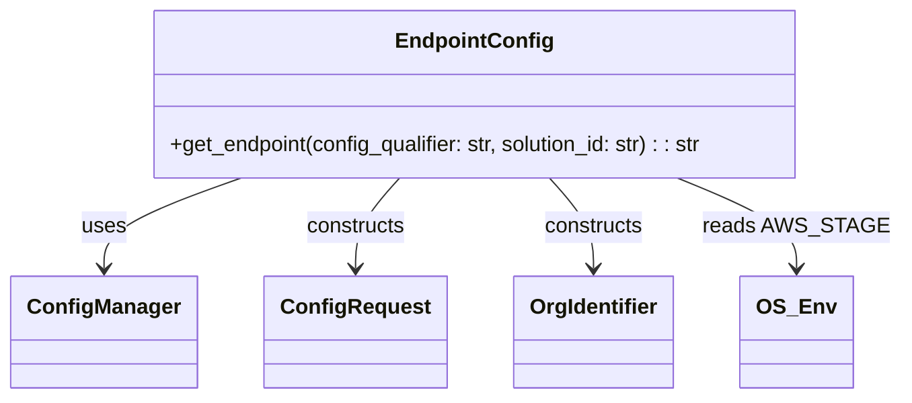
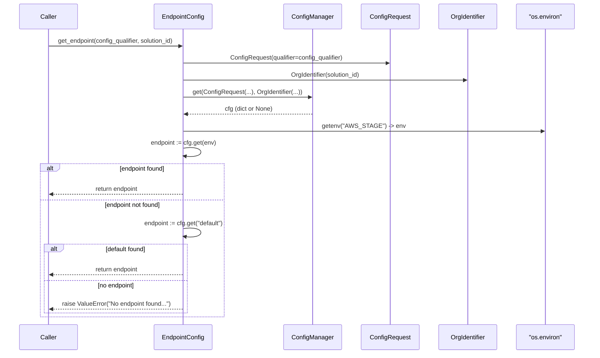

# Diagram: entity_core/entity_service/entity_service/common/integration_notifier/config/endpoint_config.py

> Auto-generated by Obscura crawlers

## Diagram 1

### SVG

<svg id="container" width="648.484375" xmlns="http://www.w3.org/2000/svg" class="classDiagram" height="300" viewBox="0 0 648.484375 300" role="graphics-document document" aria-roledescription="class"><g><defs><marker id="container_class-aggregationStart" class="marker aggregation class" refX="18" refY="7" markerWidth="190" markerHeight="240" orient="auto"><path d="M 18,7 L9,13 L1,7 L9,1 Z"></path></marker></defs><defs><marker id="container_class-aggregationEnd" class="marker aggregation class" refX="1" refY="7" markerWidth="20" markerHeight="28" orient="auto"><path d="M 18,7 L9,13 L1,7 L9,1 Z"></path></marker></defs><defs><marker id="container_class-extensionStart" class="marker extension class" refX="18" refY="7" markerWidth="190" markerHeight="240" orient="auto"><path d="M 1,7 L18,13 V 1 Z"></path></marker></defs><defs><marker id="container_class-extensionEnd" class="marker extension class" refX="1" refY="7" markerWidth="20" markerHeight="28" orient="auto"><path d="M 1,1 V 13 L18,7 Z"></path></marker></defs><defs><marker id="container_class-compositionStart" class="marker composition class" refX="18" refY="7" markerWidth="190" markerHeight="240" orient="auto"><path d="M 18,7 L9,13 L1,7 L9,1 Z"></path></marker></defs><defs><marker id="container_class-compositionEnd" class="marker composition class" refX="1" refY="7" markerWidth="20" markerHeight="28" orient="auto"><path d="M 18,7 L9,13 L1,7 L9,1 Z"></path></marker></defs><defs><marker id="container_class-dependencyStart" class="marker dependency class" refX="6" refY="7" markerWidth="190" markerHeight="240" orient="auto"><path d="M 5,7 L9,13 L1,7 L9,1 Z"></path></marker></defs><defs><marker id="container_class-dependencyEnd" class="marker dependency class" refX="13" refY="7" markerWidth="20" markerHeight="28" orient="auto"><path d="M 18,7 L9,13 L14,7 L9,1 Z"></path></marker></defs><defs><marker id="container_class-lollipopStart" class="marker lollipop class" refX="13" refY="7" markerWidth="190" markerHeight="240" orient="auto"><circle stroke="black" fill="transparent" cx="7" cy="7" r="6"></circle></marker></defs><defs><marker id="container_class-lollipopEnd" class="marker lollipop class" refX="1" refY="7" markerWidth="190" markerHeight="240" orient="auto"><circle stroke="black" fill="transparent" cx="7" cy="7" r="6"></circle></marker></defs><g class="root"><g class="clusters"></g><g class="edgePaths"><path d="M173.63,134L157.088,140.167C140.547,146.333,107.465,158.667,90.924,170C74.383,181.333,74.383,191.667,74.383,196.833L74.383,202" id="id_EndpointConfig_ConfigManager_1" class="edge-thickness-normal edge-pattern-solid relation" style=";;;" data-edge="true" data-et="edge" data-id="id_EndpointConfig_ConfigManager_1" data-points="W3sieCI6MTczLjYyOTUzMTI1LCJ5IjoxMzR9LHsieCI6NzQuMzgyODEyNSwieSI6MTcxfSx7IngiOjc0LjM4MjgxMjUsInkiOjIwOH1d" marker-end="url(#container_class-dependencyEnd)"></path><path d="M287.842,134L282.48,140.167C277.118,146.333,266.395,158.667,261.034,170C255.672,181.333,255.672,191.667,255.672,196.833L255.672,202" id="id_EndpointConfig_ConfigRequest_2" class="edge-thickness-normal edge-pattern-solid relation" style=";;;" data-edge="true" data-et="edge" data-id="id_EndpointConfig_ConfigRequest_2" data-points="W3sieCI6Mjg3Ljg0MTY0MDYyNDk5OTk3LCJ5IjoxMzR9LHsieCI6MjU1LjY3MTg3NSwieSI6MTcxfSx7IngiOjI1NS42NzE4NzUsInkiOjIwOH1d" marker-end="url(#container_class-dependencyEnd)"></path><path d="M397.393,134L402.754,140.167C408.116,146.333,418.839,158.667,424.201,170C429.563,181.333,429.563,191.667,429.563,196.833L429.563,202" id="id_EndpointConfig_OrgIdentifier_3" class="edge-thickness-normal edge-pattern-solid relation" style=";;;" data-edge="true" data-et="edge" data-id="id_EndpointConfig_OrgIdentifier_3" data-points="W3sieCI6Mzk3LjM5MjczNDM3NTAwMDAzLCJ5IjoxMzR9LHsieCI6NDI5LjU2MjUsInkiOjE3MX0seyJ4Ijo0MjkuNTYyNSwieSI6MjA4fV0=" marker-end="url(#container_class-dependencyEnd)"></path><path d="M490.515,134L504.991,140.167C519.468,146.333,548.422,158.667,562.898,170C577.375,181.333,577.375,191.667,577.375,196.833L577.375,202" id="id_EndpointConfig_OS_Env_4" class="edge-thickness-normal edge-pattern-solid relation" style=";;;" data-edge="true" data-et="edge" data-id="id_EndpointConfig_OS_Env_4" data-points="W3sieCI6NDkwLjUxNDYwOTM3NDk5OTk2LCJ5IjoxMzR9LHsieCI6NTc3LjM3NSwieSI6MTcxfSx7IngiOjU3Ny4zNzUsInkiOjIwOH1d" marker-end="url(#container_class-dependencyEnd)"></path></g><g class="edgeLabels"><g class="edgeLabel" transform="translate(74.3828125, 171)"><g class="label" data-id="id_EndpointConfig_ConfigManager_1" transform="translate(-16.4921875, -12)"><foreignObject width="32.984375" height="24">

uses

</foreignObject></g></g><g class="edgeLabel" transform="translate(255.671875, 171)"><g class="label" data-id="id_EndpointConfig_ConfigRequest_2" transform="translate(-37.84375, -12)"><foreignObject width="75.6875" height="24">

constructs

</foreignObject></g></g><g class="edgeLabel" transform="translate(429.5625, 171)"><g class="label" data-id="id_EndpointConfig_OrgIdentifier_3" transform="translate(-37.84375, -12)"><foreignObject width="75.6875" height="24">

constructs

</foreignObject></g></g><g class="edgeLabel" transform="translate(577.375, 171)"><g class="label" data-id="id_EndpointConfig_OS_Env_4" transform="translate(-63.109375, -12)"><foreignObject width="126.21875" height="24">

reads AWS_STAGE

</foreignObject></g></g></g><g class="nodes"><g class="node default" id="classId-EndpointConfig-0" transform="translate(342.6171875, 71)"><g class="basic label-container"><path d="M-245.67578125 -63 L245.67578125 -63 L245.67578125 63 L-245.67578125 63" stroke="none" stroke-width="0" fill="#ECECFF" style=""></path><path d="M-245.67578125 -63 C-130.08003900602196 -63, -14.484296762043925 -63, 245.67578125 -63 M-245.67578125 -63 C-71.8428786839005 -63, 101.99002388219901 -63, 245.67578125 -63 M245.67578125 -63 C245.67578125 -26.224400690177852, 245.67578125 10.551198619644296, 245.67578125 63 M245.67578125 -63 C245.67578125 -32.41463044657068, 245.67578125 -1.8292608931413668, 245.67578125 63 M245.67578125 63 C123.42423629717209 63, 1.172691344344173 63, -245.67578125 63 M245.67578125 63 C83.47592132305294 63, -78.72393860389411 63, -245.67578125 63 M-245.67578125 63 C-245.67578125 30.13013921355642, -245.67578125 -2.739721572887163, -245.67578125 -63 M-245.67578125 63 C-245.67578125 27.130355011173222, -245.67578125 -8.739289977653556, -245.67578125 -63" stroke="#9370DB" stroke-width="1.3" fill="none" stroke-dasharray="0 0" style=""></path></g><g class="annotation-group text" transform="translate(0, -39)"></g><g class="label-group text" transform="translate(-55.8828125, -39)"><g class="label" style="font-weight: bolder" transform="translate(0,-12)"><foreignObject width="111.765625" height="24">

EndpointConfig

</foreignObject></g></g><g class="members-group text" transform="translate(-233.67578125, 9)"></g><g class="methods-group text" transform="translate(-233.67578125, 39)"><g class="label" style="" transform="translate(0,-12)"><foreignObject width="411.46875" height="24">

+get_endpoint(config_qualifier: str, solution_id: str) : : str

</foreignObject></g></g><g class="divider" style=""><path d="M-245.67578125 -15 C-120.85674331781591 -15, 3.962294614368176 -15, 245.67578125 -15 M-245.67578125 -15 C-143.78545110611714 -15, -41.895120962234245 -15, 245.67578125 -15" stroke="#9370DB" stroke-width="1.3" fill="none" stroke-dasharray="0 0" style=""></path></g><g class="divider" style=""><path d="M-245.67578125 9 C-119.00387136803391 9, 7.668038513932174 9, 245.67578125 9 M-245.67578125 9 C-136.6275756165699 9, -27.579369983139856 9, 245.67578125 9" stroke="#9370DB" stroke-width="1.3" fill="none" stroke-dasharray="0 0" style=""></path></g></g><g class="node default" id="classId-ConfigManager-1" transform="translate(74.3828125, 250)"><g class="basic label-container"><path d="M-66.3828125 -42 L66.3828125 -42 L66.3828125 42 L-66.3828125 42" stroke="none" stroke-width="0" fill="#ECECFF" style=""></path><path d="M-66.3828125 -42 C-18.508922721764435 -42, 29.36496705647113 -42, 66.3828125 -42 M-66.3828125 -42 C-17.322925952639807 -42, 31.736960594720387 -42, 66.3828125 -42 M66.3828125 -42 C66.3828125 -23.635163209972436, 66.3828125 -5.2703264199448725, 66.3828125 42 M66.3828125 -42 C66.3828125 -19.555430977197727, 66.3828125 2.889138045604547, 66.3828125 42 M66.3828125 42 C14.249099909825325 42, -37.88461268034935 42, -66.3828125 42 M66.3828125 42 C28.171811024526235 42, -10.03919045094753 42, -66.3828125 42 M-66.3828125 42 C-66.3828125 18.191329715521334, -66.3828125 -5.6173405689573315, -66.3828125 -42 M-66.3828125 42 C-66.3828125 21.138144884712084, -66.3828125 0.2762897694241673, -66.3828125 -42" stroke="#9370DB" stroke-width="1.3" fill="none" stroke-dasharray="0 0" style=""></path></g><g class="annotation-group text" transform="translate(0, -18)"></g><g class="label-group text" transform="translate(-54.3828125, -18)"><g class="label" style="font-weight: bolder" transform="translate(0,-12)"><foreignObject width="108.765625" height="24">

ConfigManager

</foreignObject></g></g><g class="members-group text" transform="translate(-54.3828125, 30)"></g><g class="methods-group text" transform="translate(-54.3828125, 60)"></g><g class="divider" style=""><path d="M-66.3828125 6 C-28.33137175665705 6, 9.720068986685902 6, 66.3828125 6 M-66.3828125 6 C-30.130794309445463 6, 6.121223881109074 6, 66.3828125 6" stroke="#9370DB" stroke-width="1.3" fill="none" stroke-dasharray="0 0" style=""></path></g><g class="divider" style=""><path d="M-66.3828125 24 C-24.13804946762589 24, 18.10671356474822 24, 66.3828125 24 M-66.3828125 24 C-33.07230752933535 24, 0.2381974413293051 24, 66.3828125 24" stroke="#9370DB" stroke-width="1.3" fill="none" stroke-dasharray="0 0" style=""></path></g></g><g class="node default" id="classId-ConfigRequest-2" transform="translate(255.671875, 250)"><g class="basic label-container"><path d="M-64.90625 -42 L64.90625 -42 L64.90625 42 L-64.90625 42" stroke="none" stroke-width="0" fill="#ECECFF" style=""></path><path d="M-64.90625 -42 C-31.37627522437859 -42, 2.1536995512428234 -42, 64.90625 -42 M-64.90625 -42 C-13.08775088606184 -42, 38.73074822787632 -42, 64.90625 -42 M64.90625 -42 C64.90625 -9.716924277628536, 64.90625 22.56615144474293, 64.90625 42 M64.90625 -42 C64.90625 -21.36935090480519, 64.90625 -0.738701809610383, 64.90625 42 M64.90625 42 C20.486071378545915 42, -23.93410724290817 42, -64.90625 42 M64.90625 42 C27.334384201929446 42, -10.237481596141109 42, -64.90625 42 M-64.90625 42 C-64.90625 18.05284639543103, -64.90625 -5.894307209137942, -64.90625 -42 M-64.90625 42 C-64.90625 15.529965052793028, -64.90625 -10.940069894413945, -64.90625 -42" stroke="#9370DB" stroke-width="1.3" fill="none" stroke-dasharray="0 0" style=""></path></g><g class="annotation-group text" transform="translate(0, -18)"></g><g class="label-group text" transform="translate(-52.90625, -18)"><g class="label" style="font-weight: bolder" transform="translate(0,-12)"><foreignObject width="105.8125" height="24">

ConfigRequest

</foreignObject></g></g><g class="members-group text" transform="translate(-52.90625, 30)"></g><g class="methods-group text" transform="translate(-52.90625, 60)"></g><g class="divider" style=""><path d="M-64.90625 6 C-21.487205594129826 6, 21.93183881174035 6, 64.90625 6 M-64.90625 6 C-34.869853065685454 6, -4.833456131370909 6, 64.90625 6" stroke="#9370DB" stroke-width="1.3" fill="none" stroke-dasharray="0 0" style=""></path></g><g class="divider" style=""><path d="M-64.90625 24 C-20.3594867021541 24, 24.1872765956918 24, 64.90625 24 M-64.90625 24 C-32.0502397925285 24, 0.8057704149429981 24, 64.90625 24" stroke="#9370DB" stroke-width="1.3" fill="none" stroke-dasharray="0 0" style=""></path></g></g><g class="node default" id="classId-OrgIdentifier-3" transform="translate(429.5625, 250)"><g class="basic label-container"><path d="M-58.984375 -42 L58.984375 -42 L58.984375 42 L-58.984375 42" stroke="none" stroke-width="0" fill="#ECECFF" style=""></path><path d="M-58.984375 -42 C-12.735986764026535 -42, 33.51240147194693 -42, 58.984375 -42 M-58.984375 -42 C-34.078665714865295 -42, -9.172956429730583 -42, 58.984375 -42 M58.984375 -42 C58.984375 -21.92968636486104, 58.984375 -1.8593727297220823, 58.984375 42 M58.984375 -42 C58.984375 -25.15125358267867, 58.984375 -8.30250716535734, 58.984375 42 M58.984375 42 C21.62599418512658 42, -15.732386629746841 42, -58.984375 42 M58.984375 42 C24.154260041244726 42, -10.675854917510549 42, -58.984375 42 M-58.984375 42 C-58.984375 24.32647841601955, -58.984375 6.652956832039102, -58.984375 -42 M-58.984375 42 C-58.984375 10.489022612649954, -58.984375 -21.02195477470009, -58.984375 -42" stroke="#9370DB" stroke-width="1.3" fill="none" stroke-dasharray="0 0" style=""></path></g><g class="annotation-group text" transform="translate(0, -18)"></g><g class="label-group text" transform="translate(-46.984375, -18)"><g class="label" style="font-weight: bolder" transform="translate(0,-12)"><foreignObject width="93.96875" height="24">

OrgIdentifier

</foreignObject></g></g><g class="members-group text" transform="translate(-46.984375, 30)"></g><g class="methods-group text" transform="translate(-46.984375, 60)"></g><g class="divider" style=""><path d="M-58.984375 6 C-17.060540370075472 6, 24.863294259849056 6, 58.984375 6 M-58.984375 6 C-32.87690497159694 6, -6.769434943193893 6, 58.984375 6" stroke="#9370DB" stroke-width="1.3" fill="none" stroke-dasharray="0 0" style=""></path></g><g class="divider" style=""><path d="M-58.984375 24 C-17.638143914426124 24, 23.708087171147753 24, 58.984375 24 M-58.984375 24 C-21.235080778851703 24, 16.514213442296594 24, 58.984375 24" stroke="#9370DB" stroke-width="1.3" fill="none" stroke-dasharray="0 0" style=""></path></g></g><g class="node default" id="classId-OS_Env-4" transform="translate(577.375, 250)"><g class="basic label-container"><path d="M-38.828125 -42 L38.828125 -42 L38.828125 42 L-38.828125 42" stroke="none" stroke-width="0" fill="#ECECFF" style=""></path><path d="M-38.828125 -42 C-18.856005276483817 -42, 1.1161144470323663 -42, 38.828125 -42 M-38.828125 -42 C-22.740380797677375 -42, -6.65263659535475 -42, 38.828125 -42 M38.828125 -42 C38.828125 -18.408186355036634, 38.828125 5.183627289926733, 38.828125 42 M38.828125 -42 C38.828125 -16.33958411492753, 38.828125 9.320831770144942, 38.828125 42 M38.828125 42 C9.808161168360176 42, -19.21180266327965 42, -38.828125 42 M38.828125 42 C12.194401939329762 42, -14.439321121340477 42, -38.828125 42 M-38.828125 42 C-38.828125 18.171396814753965, -38.828125 -5.657206370492069, -38.828125 -42 M-38.828125 42 C-38.828125 11.845863494345132, -38.828125 -18.308273011309737, -38.828125 -42" stroke="#9370DB" stroke-width="1.3" fill="none" stroke-dasharray="0 0" style=""></path></g><g class="annotation-group text" transform="translate(0, -18)"></g><g class="label-group text" transform="translate(-26.828125, -18)"><g class="label" style="font-weight: bolder" transform="translate(0,-12)"><foreignObject width="53.65625" height="24">

OS_Env

</foreignObject></g></g><g class="members-group text" transform="translate(-26.828125, 30)"></g><g class="methods-group text" transform="translate(-26.828125, 60)"></g><g class="divider" style=""><path d="M-38.828125 6 C-16.56362666520464 6, 5.700871669590718 6, 38.828125 6 M-38.828125 6 C-22.094294377937597 6, -5.360463755875195 6, 38.828125 6" stroke="#9370DB" stroke-width="1.3" fill="none" stroke-dasharray="0 0" style=""></path></g><g class="divider" style=""><path d="M-38.828125 24 C-17.416532227737893 24, 3.9950605445242147 24, 38.828125 24 M-38.828125 24 C-10.148003927609857 24, 18.532117144780287 24, 38.828125 24" stroke="#9370DB" stroke-width="1.3" fill="none" stroke-dasharray="0 0" style=""></path></g></g></g></g></g></svg>

## Diagram 2

### SVG

<svg id="container" width="1579" xmlns="http://www.w3.org/2000/svg" height="959" viewBox="-50 -10 1579 959" role="graphics-document document" aria-roledescription="sequence"><g><rect x="1329" y="873" fill="#eaeaea" stroke="#666" width="150" height="65" name="OS" rx="3" ry="3" class="actor actor-bottom"></rect><text x="1404" y="905.5" dominant-baseline="central" alignment-baseline="central" class="actor actor-box" style="text-anchor: middle; font-size: 16px; font-weight: 400;"><tspan x="1404" dy="0">"os.environ"</tspan></text></g><g><rect x="1129" y="873" fill="#eaeaea" stroke="#666" width="150" height="65" name="OrgIdentifier" rx="3" ry="3" class="actor actor-bottom"></rect><text x="1204" y="905.5" dominant-baseline="central" alignment-baseline="central" class="actor actor-box" style="text-anchor: middle; font-size: 16px; font-weight: 400;"><tspan x="1204" dy="0">OrgIdentifier</tspan></text></g><g><rect x="929" y="873" fill="#eaeaea" stroke="#666" width="150" height="65" name="ConfigRequest" rx="3" ry="3" class="actor actor-bottom"></rect><text x="1004" y="905.5" dominant-baseline="central" alignment-baseline="central" class="actor actor-box" style="text-anchor: middle; font-size: 16px; font-weight: 400;"><tspan x="1004" dy="0">ConfigRequest</tspan></text></g><g><rect x="729" y="873" fill="#eaeaea" stroke="#666" width="150" height="65" name="ConfigManager" rx="3" ry="3" class="actor actor-bottom"></rect><text x="804" y="905.5" dominant-baseline="central" alignment-baseline="central" class="actor actor-box" style="text-anchor: middle; font-size: 16px; font-weight: 400;"><tspan x="804" dy="0">ConfigManager</tspan></text></g><g><rect x="378" y="873" fill="#eaeaea" stroke="#666" width="150" height="65" name="EndpointConfig" rx="3" ry="3" class="actor actor-bottom"></rect><text x="453" y="905.5" dominant-baseline="central" alignment-baseline="central" class="actor actor-box" style="text-anchor: middle; font-size: 16px; font-weight: 400;"><tspan x="453" dy="0">EndpointConfig</tspan></text></g><g><rect x="0" y="873" fill="#eaeaea" stroke="#666" width="150" height="65" name="Caller" rx="3" ry="3" class="actor actor-bottom"></rect><text x="75" y="905.5" dominant-baseline="central" alignment-baseline="central" class="actor actor-box" style="text-anchor: middle; font-size: 16px; font-weight: 400;"><tspan x="75" dy="0">Caller</tspan></text></g><g><line id="actor5" x1="1404" y1="65" x2="1404" y2="873" class="actor-line 200" stroke-width="0.5px" stroke="#999" name="OS"></line><g id="root-5"><rect x="1329" y="0" fill="#eaeaea" stroke="#666" width="150" height="65" name="OS" rx="3" ry="3" class="actor actor-top"></rect><text x="1404" y="32.5" dominant-baseline="central" alignment-baseline="central" class="actor actor-box" style="text-anchor: middle; font-size: 16px; font-weight: 400;"><tspan x="1404" dy="0">"os.environ"</tspan></text></g></g><g><line id="actor4" x1="1204" y1="65" x2="1204" y2="873" class="actor-line 200" stroke-width="0.5px" stroke="#999" name="OrgIdentifier"></line><g id="root-4"><rect x="1129" y="0" fill="#eaeaea" stroke="#666" width="150" height="65" name="OrgIdentifier" rx="3" ry="3" class="actor actor-top"></rect><text x="1204" y="32.5" dominant-baseline="central" alignment-baseline="central" class="actor actor-box" style="text-anchor: middle; font-size: 16px; font-weight: 400;"><tspan x="1204" dy="0">OrgIdentifier</tspan></text></g></g><g><line id="actor3" x1="1004" y1="65" x2="1004" y2="873" class="actor-line 200" stroke-width="0.5px" stroke="#999" name="ConfigRequest"></line><g id="root-3"><rect x="929" y="0" fill="#eaeaea" stroke="#666" width="150" height="65" name="ConfigRequest" rx="3" ry="3" class="actor actor-top"></rect><text x="1004" y="32.5" dominant-baseline="central" alignment-baseline="central" class="actor actor-box" style="text-anchor: middle; font-size: 16px; font-weight: 400;"><tspan x="1004" dy="0">ConfigRequest</tspan></text></g></g><g><line id="actor2" x1="804" y1="65" x2="804" y2="873" class="actor-line 200" stroke-width="0.5px" stroke="#999" name="ConfigManager"></line><g id="root-2"><rect x="729" y="0" fill="#eaeaea" stroke="#666" width="150" height="65" name="ConfigManager" rx="3" ry="3" class="actor actor-top"></rect><text x="804" y="32.5" dominant-baseline="central" alignment-baseline="central" class="actor actor-box" style="text-anchor: middle; font-size: 16px; font-weight: 400;"><tspan x="804" dy="0">ConfigManager</tspan></text></g></g><g><line id="actor1" x1="453" y1="65" x2="453" y2="873" class="actor-line 200" stroke-width="0.5px" stroke="#999" name="EndpointConfig"></line><g id="root-1"><rect x="378" y="0" fill="#eaeaea" stroke="#666" width="150" height="65" name="EndpointConfig" rx="3" ry="3" class="actor actor-top"></rect><text x="453" y="32.5" dominant-baseline="central" alignment-baseline="central" class="actor actor-box" style="text-anchor: middle; font-size: 16px; font-weight: 400;"><tspan x="453" dy="0">EndpointConfig</tspan></text></g></g><g><line id="actor0" x1="75" y1="65" x2="75" y2="873" class="actor-line 200" stroke-width="0.5px" stroke="#999" name="Caller"></line><g id="root-0"><rect x="0" y="0" fill="#eaeaea" stroke="#666" width="150" height="65" name="Caller" rx="3" ry="3" class="actor actor-top"></rect><text x="75" y="32.5" dominant-baseline="central" alignment-baseline="central" class="actor actor-box" style="text-anchor: middle; font-size: 16px; font-weight: 400;"><tspan x="75" dy="0">Caller</tspan></text></g></g><g></g><defs><symbol id="computer" width="24" height="24"><path transform="scale(.5)" d="M2 2v13h20v-13h-20zm18 11h-16v-9h16v9zm-10.228 6l.466-1h3.524l.467 1h-4.457zm14.228 3h-24l2-6h2.104l-1.33 4h18.45l-1.297-4h2.073l2 6zm-5-10h-14v-7h14v7z"></path></symbol></defs><defs><symbol id="database" fill-rule="evenodd" clip-rule="evenodd"><path transform="scale(.5)" d="M12.258.001l.256.004.255.005.253.008.251.01.249.012.247.015.246.016.242.019.241.02.239.023.236.024.233.027.231.028.229.031.225.032.223.034.22.036.217.038.214.04.211.041.208.043.205.045.201.046.198.048.194.05.191.051.187.053.183.054.18.056.175.057.172.059.168.06.163.061.16.063.155.064.15.066.074.033.073.033.071.034.07.034.069.035.068.035.067.035.066.035.064.036.064.036.062.036.06.036.06.037.058.037.058.037.055.038.055.038.053.038.052.038.051.039.05.039.048.039.047.039.045.04.044.04.043.04.041.04.04.041.039.041.037.041.036.041.034.041.033.042.032.042.03.042.029.042.027.042.026.043.024.043.023.043.021.043.02.043.018.044.017.043.015.044.013.044.012.044.011.045.009.044.007.045.006.045.004.045.002.045.001.045v17l-.001.045-.002.045-.004.045-.006.045-.007.045-.009.044-.011.045-.012.044-.013.044-.015.044-.017.043-.018.044-.02.043-.021.043-.023.043-.024.043-.026.043-.027.042-.029.042-.03.042-.032.042-.033.042-.034.041-.036.041-.037.041-.039.041-.04.041-.041.04-.043.04-.044.04-.045.04-.047.039-.048.039-.05.039-.051.039-.052.038-.053.038-.055.038-.055.038-.058.037-.058.037-.06.037-.06.036-.062.036-.064.036-.064.036-.066.035-.067.035-.068.035-.069.035-.07.034-.071.034-.073.033-.074.033-.15.066-.155.064-.16.063-.163.061-.168.06-.172.059-.175.057-.18.056-.183.054-.187.053-.191.051-.194.05-.198.048-.201.046-.205.045-.208.043-.211.041-.214.04-.217.038-.22.036-.223.034-.225.032-.229.031-.231.028-.233.027-.236.024-.239.023-.241.02-.242.019-.246.016-.247.015-.249.012-.251.01-.253.008-.255.005-.256.004-.258.001-.258-.001-.256-.004-.255-.005-.253-.008-.251-.01-.249-.012-.247-.015-.245-.016-.243-.019-.241-.02-.238-.023-.236-.024-.234-.027-.231-.028-.228-.031-.226-.032-.223-.034-.22-.036-.217-.038-.214-.04-.211-.041-.208-.043-.204-.045-.201-.046-.198-.048-.195-.05-.19-.051-.187-.053-.184-.054-.179-.056-.176-.057-.172-.059-.167-.06-.164-.061-.159-.063-.155-.064-.151-.066-.074-.033-.072-.033-.072-.034-.07-.034-.069-.035-.068-.035-.067-.035-.066-.035-.064-.036-.063-.036-.062-.036-.061-.036-.06-.037-.058-.037-.057-.037-.056-.038-.055-.038-.053-.038-.052-.038-.051-.039-.049-.039-.049-.039-.046-.039-.046-.04-.044-.04-.043-.04-.041-.04-.04-.041-.039-.041-.037-.041-.036-.041-.034-.041-.033-.042-.032-.042-.03-.042-.029-.042-.027-.042-.026-.043-.024-.043-.023-.043-.021-.043-.02-.043-.018-.044-.017-.043-.015-.044-.013-.044-.012-.044-.011-.045-.009-.044-.007-.045-.006-.045-.004-.045-.002-.045-.001-.045v-17l.001-.045.002-.045.004-.045.006-.045.007-.045.009-.044.011-.045.012-.044.013-.044.015-.044.017-.043.018-.044.02-.043.021-.043.023-.043.024-.043.026-.043.027-.042.029-.042.03-.042.032-.042.033-.042.034-.041.036-.041.037-.041.039-.041.04-.041.041-.04.043-.04.044-.04.046-.04.046-.039.049-.039.049-.039.051-.039.052-.038.053-.038.055-.038.056-.038.057-.037.058-.037.06-.037.061-.036.062-.036.063-.036.064-.036.066-.035.067-.035.068-.035.069-.035.07-.034.072-.034.072-.033.074-.033.151-.066.155-.064.159-.063.164-.061.167-.06.172-.059.176-.057.179-.056.184-.054.187-.053.19-.051.195-.05.198-.048.201-.046.204-.045.208-.043.211-.041.214-.04.217-.038.22-.036.223-.034.226-.032.228-.031.231-.028.234-.027.236-.024.238-.023.241-.02.243-.019.245-.016.247-.015.249-.012.251-.01.253-.008.255-.005.256-.004.258-.001.258.001zm-9.258 20.499v.01l.001.021.003.021.004.022.005.021.006.022.007.022.009.023.01.022.011.023.012.023.013.023.015.023.016.024.017.023.018.024.019.024.021.024.022.025.023.024.024.025.052.049.056.05.061.051.066.051.07.051.075.051.079.052.084.052.088.052.092.052.097.052.102.051.105.052.11.052.114.051.119.051.123.051.127.05.131.05.135.05.139.048.144.049.147.047.152.047.155.047.16.045.163.045.167.043.171.043.176.041.178.041.183.039.187.039.19.037.194.035.197.035.202.033.204.031.209.03.212.029.216.027.219.025.222.024.226.021.23.02.233.018.236.016.24.015.243.012.246.01.249.008.253.005.256.004.259.001.26-.001.257-.004.254-.005.25-.008.247-.011.244-.012.241-.014.237-.016.233-.018.231-.021.226-.021.224-.024.22-.026.216-.027.212-.028.21-.031.205-.031.202-.034.198-.034.194-.036.191-.037.187-.039.183-.04.179-.04.175-.042.172-.043.168-.044.163-.045.16-.046.155-.046.152-.047.148-.048.143-.049.139-.049.136-.05.131-.05.126-.05.123-.051.118-.052.114-.051.11-.052.106-.052.101-.052.096-.052.092-.052.088-.053.083-.051.079-.052.074-.052.07-.051.065-.051.06-.051.056-.05.051-.05.023-.024.023-.025.021-.024.02-.024.019-.024.018-.024.017-.024.015-.023.014-.024.013-.023.012-.023.01-.023.01-.022.008-.022.006-.022.006-.022.004-.022.004-.021.001-.021.001-.021v-4.127l-.077.055-.08.053-.083.054-.085.053-.087.052-.09.052-.093.051-.095.05-.097.05-.1.049-.102.049-.105.048-.106.047-.109.047-.111.046-.114.045-.115.045-.118.044-.12.043-.122.042-.124.042-.126.041-.128.04-.13.04-.132.038-.134.038-.135.037-.138.037-.139.035-.142.035-.143.034-.144.033-.147.032-.148.031-.15.03-.151.03-.153.029-.154.027-.156.027-.158.026-.159.025-.161.024-.162.023-.163.022-.165.021-.166.02-.167.019-.169.018-.169.017-.171.016-.173.015-.173.014-.175.013-.175.012-.177.011-.178.01-.179.008-.179.008-.181.006-.182.005-.182.004-.184.003-.184.002h-.37l-.184-.002-.184-.003-.182-.004-.182-.005-.181-.006-.179-.008-.179-.008-.178-.01-.176-.011-.176-.012-.175-.013-.173-.014-.172-.015-.171-.016-.17-.017-.169-.018-.167-.019-.166-.02-.165-.021-.163-.022-.162-.023-.161-.024-.159-.025-.157-.026-.156-.027-.155-.027-.153-.029-.151-.03-.15-.03-.148-.031-.146-.032-.145-.033-.143-.034-.141-.035-.14-.035-.137-.037-.136-.037-.134-.038-.132-.038-.13-.04-.128-.04-.126-.041-.124-.042-.122-.042-.12-.044-.117-.043-.116-.045-.113-.045-.112-.046-.109-.047-.106-.047-.105-.048-.102-.049-.1-.049-.097-.05-.095-.05-.093-.052-.09-.051-.087-.052-.085-.053-.083-.054-.08-.054-.077-.054v4.127zm0-5.654v.011l.001.021.003.021.004.021.005.022.006.022.007.022.009.022.01.022.011.023.012.023.013.023.015.024.016.023.017.024.018.024.019.024.021.024.022.024.023.025.024.024.052.05.056.05.061.05.066.051.07.051.075.052.079.051.084.052.088.052.092.052.097.052.102.052.105.052.11.051.114.051.119.052.123.05.127.051.131.05.135.049.139.049.144.048.147.048.152.047.155.046.16.045.163.045.167.044.171.042.176.042.178.04.183.04.187.038.19.037.194.036.197.034.202.033.204.032.209.03.212.028.216.027.219.025.222.024.226.022.23.02.233.018.236.016.24.014.243.012.246.01.249.008.253.006.256.003.259.001.26-.001.257-.003.254-.006.25-.008.247-.01.244-.012.241-.015.237-.016.233-.018.231-.02.226-.022.224-.024.22-.025.216-.027.212-.029.21-.03.205-.032.202-.033.198-.035.194-.036.191-.037.187-.039.183-.039.179-.041.175-.042.172-.043.168-.044.163-.045.16-.045.155-.047.152-.047.148-.048.143-.048.139-.05.136-.049.131-.05.126-.051.123-.051.118-.051.114-.052.11-.052.106-.052.101-.052.096-.052.092-.052.088-.052.083-.052.079-.052.074-.051.07-.052.065-.051.06-.05.056-.051.051-.049.023-.025.023-.024.021-.025.02-.024.019-.024.018-.024.017-.024.015-.023.014-.023.013-.024.012-.022.01-.023.01-.023.008-.022.006-.022.006-.022.004-.021.004-.022.001-.021.001-.021v-4.139l-.077.054-.08.054-.083.054-.085.052-.087.053-.09.051-.093.051-.095.051-.097.05-.1.049-.102.049-.105.048-.106.047-.109.047-.111.046-.114.045-.115.044-.118.044-.12.044-.122.042-.124.042-.126.041-.128.04-.13.039-.132.039-.134.038-.135.037-.138.036-.139.036-.142.035-.143.033-.144.033-.147.033-.148.031-.15.03-.151.03-.153.028-.154.028-.156.027-.158.026-.159.025-.161.024-.162.023-.163.022-.165.021-.166.02-.167.019-.169.018-.169.017-.171.016-.173.015-.173.014-.175.013-.175.012-.177.011-.178.009-.179.009-.179.007-.181.007-.182.005-.182.004-.184.003-.184.002h-.37l-.184-.002-.184-.003-.182-.004-.182-.005-.181-.007-.179-.007-.179-.009-.178-.009-.176-.011-.176-.012-.175-.013-.173-.014-.172-.015-.171-.016-.17-.017-.169-.018-.167-.019-.166-.02-.165-.021-.163-.022-.162-.023-.161-.024-.159-.025-.157-.026-.156-.027-.155-.028-.153-.028-.151-.03-.15-.03-.148-.031-.146-.033-.145-.033-.143-.033-.141-.035-.14-.036-.137-.036-.136-.037-.134-.038-.132-.039-.13-.039-.128-.04-.126-.041-.124-.042-.122-.043-.12-.043-.117-.044-.116-.044-.113-.046-.112-.046-.109-.046-.106-.047-.105-.048-.102-.049-.1-.049-.097-.05-.095-.051-.093-.051-.09-.051-.087-.053-.085-.052-.083-.054-.08-.054-.077-.054v4.139zm0-5.666v.011l.001.02.003.022.004.021.005.022.006.021.007.022.009.023.01.022.011.023.012.023.013.023.015.023.016.024.017.024.018.023.019.024.021.025.022.024.023.024.024.025.052.05.056.05.061.05.066.051.07.051.075.052.079.051.084.052.088.052.092.052.097.052.102.052.105.051.11.052.114.051.119.051.123.051.127.05.131.05.135.05.139.049.144.048.147.048.152.047.155.046.16.045.163.045.167.043.171.043.176.042.178.04.183.04.187.038.19.037.194.036.197.034.202.033.204.032.209.03.212.028.216.027.219.025.222.024.226.021.23.02.233.018.236.017.24.014.243.012.246.01.249.008.253.006.256.003.259.001.26-.001.257-.003.254-.006.25-.008.247-.01.244-.013.241-.014.237-.016.233-.018.231-.02.226-.022.224-.024.22-.025.216-.027.212-.029.21-.03.205-.032.202-.033.198-.035.194-.036.191-.037.187-.039.183-.039.179-.041.175-.042.172-.043.168-.044.163-.045.16-.045.155-.047.152-.047.148-.048.143-.049.139-.049.136-.049.131-.051.126-.05.123-.051.118-.052.114-.051.11-.052.106-.052.101-.052.096-.052.092-.052.088-.052.083-.052.079-.052.074-.052.07-.051.065-.051.06-.051.056-.05.051-.049.023-.025.023-.025.021-.024.02-.024.019-.024.018-.024.017-.024.015-.023.014-.024.013-.023.012-.023.01-.022.01-.023.008-.022.006-.022.006-.022.004-.022.004-.021.001-.021.001-.021v-4.153l-.077.054-.08.054-.083.053-.085.053-.087.053-.09.051-.093.051-.095.051-.097.05-.1.049-.102.048-.105.048-.106.048-.109.046-.111.046-.114.046-.115.044-.118.044-.12.043-.122.043-.124.042-.126.041-.128.04-.13.039-.132.039-.134.038-.135.037-.138.036-.139.036-.142.034-.143.034-.144.033-.147.032-.148.032-.15.03-.151.03-.153.028-.154.028-.156.027-.158.026-.159.024-.161.024-.162.023-.163.023-.165.021-.166.02-.167.019-.169.018-.169.017-.171.016-.173.015-.173.014-.175.013-.175.012-.177.01-.178.01-.179.009-.179.007-.181.006-.182.006-.182.004-.184.003-.184.001-.185.001-.185-.001-.184-.001-.184-.003-.182-.004-.182-.006-.181-.006-.179-.007-.179-.009-.178-.01-.176-.01-.176-.012-.175-.013-.173-.014-.172-.015-.171-.016-.17-.017-.169-.018-.167-.019-.166-.02-.165-.021-.163-.023-.162-.023-.161-.024-.159-.024-.157-.026-.156-.027-.155-.028-.153-.028-.151-.03-.15-.03-.148-.032-.146-.032-.145-.033-.143-.034-.141-.034-.14-.036-.137-.036-.136-.037-.134-.038-.132-.039-.13-.039-.128-.041-.126-.041-.124-.041-.122-.043-.12-.043-.117-.044-.116-.044-.113-.046-.112-.046-.109-.046-.106-.048-.105-.048-.102-.048-.1-.05-.097-.049-.095-.051-.093-.051-.09-.052-.087-.052-.085-.053-.083-.053-.08-.054-.077-.054v4.153zm8.74-8.179l-.257.004-.254.005-.25.008-.247.011-.244.012-.241.014-.237.016-.233.018-.231.021-.226.022-.224.023-.22.026-.216.027-.212.028-.21.031-.205.032-.202.033-.198.034-.194.036-.191.038-.187.038-.183.04-.179.041-.175.042-.172.043-.168.043-.163.045-.16.046-.155.046-.152.048-.148.048-.143.048-.139.049-.136.05-.131.05-.126.051-.123.051-.118.051-.114.052-.11.052-.106.052-.101.052-.096.052-.092.052-.088.052-.083.052-.079.052-.074.051-.07.052-.065.051-.06.05-.056.05-.051.05-.023.025-.023.024-.021.024-.02.025-.019.024-.018.024-.017.023-.015.024-.014.023-.013.023-.012.023-.01.023-.01.022-.008.022-.006.023-.006.021-.004.022-.004.021-.001.021-.001.021.001.021.001.021.004.021.004.022.006.021.006.023.008.022.01.022.01.023.012.023.013.023.014.023.015.024.017.023.018.024.019.024.02.025.021.024.023.024.023.025.051.05.056.05.06.05.065.051.07.052.074.051.079.052.083.052.088.052.092.052.096.052.101.052.106.052.11.052.114.052.118.051.123.051.126.051.131.05.136.05.139.049.143.048.148.048.152.048.155.046.16.046.163.045.168.043.172.043.175.042.179.041.183.04.187.038.191.038.194.036.198.034.202.033.205.032.21.031.212.028.216.027.22.026.224.023.226.022.231.021.233.018.237.016.241.014.244.012.247.011.25.008.254.005.257.004.26.001.26-.001.257-.004.254-.005.25-.008.247-.011.244-.012.241-.014.237-.016.233-.018.231-.021.226-.022.224-.023.22-.026.216-.027.212-.028.21-.031.205-.032.202-.033.198-.034.194-.036.191-.038.187-.038.183-.04.179-.041.175-.042.172-.043.168-.043.163-.045.16-.046.155-.046.152-.048.148-.048.143-.048.139-.049.136-.05.131-.05.126-.051.123-.051.118-.051.114-.052.11-.052.106-.052.101-.052.096-.052.092-.052.088-.052.083-.052.079-.052.074-.051.07-.052.065-.051.06-.05.056-.05.051-.05.023-.025.023-.024.021-.024.02-.025.019-.024.018-.024.017-.023.015-.024.014-.023.013-.023.012-.023.01-.023.01-.022.008-.022.006-.023.006-.021.004-.022.004-.021.001-.021.001-.021-.001-.021-.001-.021-.004-.021-.004-.022-.006-.021-.006-.023-.008-.022-.01-.022-.01-.023-.012-.023-.013-.023-.014-.023-.015-.024-.017-.023-.018-.024-.019-.024-.02-.025-.021-.024-.023-.024-.023-.025-.051-.05-.056-.05-.06-.05-.065-.051-.07-.052-.074-.051-.079-.052-.083-.052-.088-.052-.092-.052-.096-.052-.101-.052-.106-.052-.11-.052-.114-.052-.118-.051-.123-.051-.126-.051-.131-.05-.136-.05-.139-.049-.143-.048-.148-.048-.152-.048-.155-.046-.16-.046-.163-.045-.168-.043-.172-.043-.175-.042-.179-.041-.183-.04-.187-.038-.191-.038-.194-.036-.198-.034-.202-.033-.205-.032-.21-.031-.212-.028-.216-.027-.22-.026-.224-.023-.226-.022-.231-.021-.233-.018-.237-.016-.241-.014-.244-.012-.247-.011-.25-.008-.254-.005-.257-.004-.26-.001-.26.001z"></path></symbol></defs><defs><symbol id="clock" width="24" height="24"><path transform="scale(.5)" d="M12 2c5.514 0 10 4.486 10 10s-4.486 10-10 10-10-4.486-10-10 4.486-10 10-10zm0-2c-6.627 0-12 5.373-12 12s5.373 12 12 12 12-5.373 12-12-5.373-12-12-12zm5.848 12.459c.202.038.202.333.001.372-1.907.361-6.045 1.111-6.547 1.111-.719 0-1.301-.582-1.301-1.301 0-.512.77-5.447 1.125-7.445.034-.192.312-.181.343.014l.985 6.238 5.394 1.011z"></path></symbol></defs><defs><marker id="arrowhead" refX="7.9" refY="5" markerUnits="userSpaceOnUse" markerWidth="12" markerHeight="12" orient="auto-start-reverse"><path d="M -1 0 L 10 5 L 0 10 z"></path></marker></defs><defs><marker id="crosshead" markerWidth="15" markerHeight="8" orient="auto" refX="4" refY="4.5"><path fill="none" stroke="#000000" stroke-width="1pt" d="M 1,2 L 6,7 M 6,2 L 1,7" style="stroke-dasharray: 0, 0;"></path></marker></defs><defs><marker id="filled-head" refX="15.5" refY="7" markerWidth="20" markerHeight="28" orient="auto"><path d="M 18,7 L9,13 L14,7 L9,1 Z"></path></marker></defs><defs><marker id="sequencenumber" refX="15" refY="15" markerWidth="60" markerHeight="40" orient="auto"><circle cx="15" cy="15" r="6"></circle></marker></defs><g><line x1="64" y1="657" x2="464" y2="657" class="loopLine"></line><line x1="464" y1="657" x2="464" y2="843" class="loopLine"></line><line x1="64" y1="843" x2="464" y2="843" class="loopLine"></line><line x1="64" y1="657" x2="64" y2="843" class="loopLine"></line><line x1="64" y1="755" x2="464" y2="755" class="loopLine" style="stroke-dasharray: 3, 3;"></line><polygon points="64,657 114,657 114,670 105.6,677 64,677" class="labelBox"></polygon><text x="89" y="670" text-anchor="middle" dominant-baseline="middle" alignment-baseline="middle" class="labelText" style="font-size: 16px; font-weight: 400;">alt</text><text x="289" y="675" text-anchor="middle" class="loopText" style="font-size: 16px; font-weight: 400;"><tspan x="289">[default found]</tspan></text><text x="264" y="773" text-anchor="middle" class="loopText" style="font-size: 16px; font-weight: 400;">[no endpoint]</text></g><g><line x1="54" y1="441" x2="568.5" y2="441" class="loopLine"></line><line x1="568.5" y1="441" x2="568.5" y2="853" class="loopLine"></line><line x1="54" y1="853" x2="568.5" y2="853" class="loopLine"></line><line x1="54" y1="441" x2="54" y2="853" class="loopLine"></line><line x1="54" y1="539" x2="568.5" y2="539" class="loopLine" style="stroke-dasharray: 3, 3;"></line><polygon points="54,441 104,441 104,454 95.6,461 54,461" class="labelBox"></polygon><text x="79" y="454" text-anchor="middle" dominant-baseline="middle" alignment-baseline="middle" class="labelText" style="font-size: 16px; font-weight: 400;">alt</text><text x="336.25" y="459" text-anchor="middle" class="loopText" style="font-size: 16px; font-weight: 400;"><tspan x="336.25">[endpoint found]</tspan></text><text x="311.25" y="557" text-anchor="middle" class="loopText" style="font-size: 16px; font-weight: 400;">[endpoint not found]</text></g><text x="263" y="80" text-anchor="middle" dominant-baseline="middle" alignment-baseline="middle" class="messageText" dy="1em" style="font-size: 16px; font-weight: 400;">get_endpoint(config_qualifier, solution_id)</text><line x1="76" y1="113" x2="449" y2="113" class="messageLine0" stroke-width="2" stroke="none" marker-end="url(#arrowhead)" style="fill: none;"></line><text x="727" y="128" text-anchor="middle" dominant-baseline="middle" alignment-baseline="middle" class="messageText" dy="1em" style="font-size: 16px; font-weight: 400;">ConfigRequest(qualifier=config_qualifier)</text><line x1="454" y1="161" x2="1000" y2="161" class="messageLine0" stroke-width="2" stroke="none" marker-end="url(#arrowhead)" style="fill: none;"></line><text x="827" y="176" text-anchor="middle" dominant-baseline="middle" alignment-baseline="middle" class="messageText" dy="1em" style="font-size: 16px; font-weight: 400;">OrgIdentifier(solution_id)</text><line x1="454" y1="209" x2="1200" y2="209" class="messageLine0" stroke-width="2" stroke="none" marker-end="url(#arrowhead)" style="fill: none;"></line><text x="627" y="224" text-anchor="middle" dominant-baseline="middle" alignment-baseline="middle" class="messageText" dy="1em" style="font-size: 16px; font-weight: 400;">get(ConfigRequest(...), OrgIdentifier(...))</text><line x1="454" y1="257" x2="800" y2="257" class="messageLine0" stroke-width="2" stroke="none" marker-end="url(#arrowhead)" style="fill: none;"></line><text x="630" y="272" text-anchor="middle" dominant-baseline="middle" alignment-baseline="middle" class="messageText" dy="1em" style="font-size: 16px; font-weight: 400;">cfg (dict or None)</text><line x1="803" y1="305" x2="457" y2="305" class="messageLine1" stroke-width="2" stroke="none" marker-end="url(#arrowhead)" style="stroke-dasharray: 3, 3; fill: none;"></line><text x="927" y="320" text-anchor="middle" dominant-baseline="middle" alignment-baseline="middle" class="messageText" dy="1em" style="font-size: 16px; font-weight: 400;">getenv("AWS_STAGE") -&gt; env</text><line x1="454" y1="353" x2="1400" y2="353" class="messageLine0" stroke-width="2" stroke="none" marker-end="url(#arrowhead)" style="fill: none;"></line><text x="454" y="368" text-anchor="middle" dominant-baseline="middle" alignment-baseline="middle" class="messageText" dy="1em" style="font-size: 16px; font-weight: 400;">endpoint := cfg.get(env)</text><path d="M 454,401 C 514,391 514,431 454,421" class="messageLine0" stroke-width="2" stroke="none" marker-end="url(#arrowhead)" style="fill: none;"></path><text x="266" y="491" text-anchor="middle" dominant-baseline="middle" alignment-baseline="middle" class="messageText" dy="1em" style="font-size: 16px; font-weight: 400;">return endpoint</text><line x1="452" y1="524" x2="79" y2="524" class="messageLine1" stroke-width="2" stroke="none" marker-end="url(#arrowhead)" style="stroke-dasharray: 3, 3; fill: none;"></line><text x="454" y="584" text-anchor="middle" dominant-baseline="middle" alignment-baseline="middle" class="messageText" dy="1em" style="font-size: 16px; font-weight: 400;">endpoint := cfg.get("default")</text><path d="M 454,617 C 514,607 514,647 454,637" class="messageLine0" stroke-width="2" stroke="none" marker-end="url(#arrowhead)" style="fill: none;"></path><text x="266" y="707" text-anchor="middle" dominant-baseline="middle" alignment-baseline="middle" class="messageText" dy="1em" style="font-size: 16px; font-weight: 400;">return endpoint</text><line x1="452" y1="740" x2="79" y2="740" class="messageLine1" stroke-width="2" stroke="none" marker-end="url(#arrowhead)" style="stroke-dasharray: 3, 3; fill: none;"></line><text x="266" y="800" text-anchor="middle" dominant-baseline="middle" alignment-baseline="middle" class="messageText" dy="1em" style="font-size: 16px; font-weight: 400;">raise ValueError("No endpoint found...")</text><line x1="452" y1="833" x2="79" y2="833" class="messageLine1" stroke-width="2" stroke="none" marker-end="url(#arrowhead)" style="stroke-dasharray: 3, 3; fill: none;"></line></svg>
