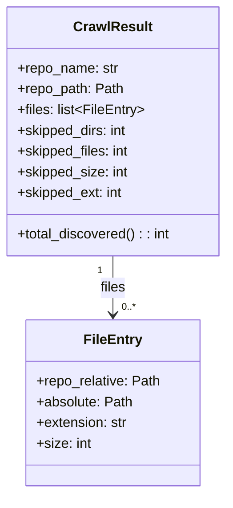
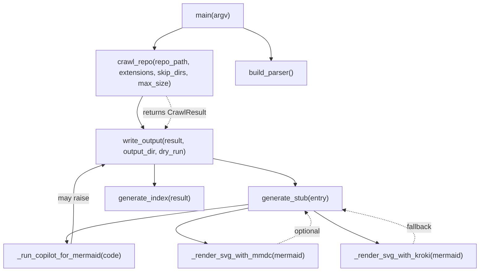

# Diagram: entity_core/entity_service/entity_service/common/integration_notifier/models/__init__.py

> Auto-generated by Obscura crawlers

## Diagram 1

### SVG

<svg id="container" width="262.078125" xmlns="http://www.w3.org/2000/svg" class="classDiagram" height="570" viewBox="0 0 262.078125 570" role="graphics-document document" aria-roledescription="class"><g><defs><marker id="container_class-aggregationStart" class="marker aggregation class" refX="18" refY="7" markerWidth="190" markerHeight="240" orient="auto"><path d="M 18,7 L9,13 L1,7 L9,1 Z"></path></marker></defs><defs><marker id="container_class-aggregationEnd" class="marker aggregation class" refX="1" refY="7" markerWidth="20" markerHeight="28" orient="auto"><path d="M 18,7 L9,13 L1,7 L9,1 Z"></path></marker></defs><defs><marker id="container_class-extensionStart" class="marker extension class" refX="18" refY="7" markerWidth="190" markerHeight="240" orient="auto"><path d="M 1,7 L18,13 V 1 Z"></path></marker></defs><defs><marker id="container_class-extensionEnd" class="marker extension class" refX="1" refY="7" markerWidth="20" markerHeight="28" orient="auto"><path d="M 1,1 V 13 L18,7 Z"></path></marker></defs><defs><marker id="container_class-compositionStart" class="marker composition class" refX="18" refY="7" markerWidth="190" markerHeight="240" orient="auto"><path d="M 18,7 L9,13 L1,7 L9,1 Z"></path></marker></defs><defs><marker id="container_class-compositionEnd" class="marker composition class" refX="1" refY="7" markerWidth="20" markerHeight="28" orient="auto"><path d="M 18,7 L9,13 L1,7 L9,1 Z"></path></marker></defs><defs><marker id="container_class-dependencyStart" class="marker dependency class" refX="6" refY="7" markerWidth="190" markerHeight="240" orient="auto"><path d="M 5,7 L9,13 L1,7 L9,1 Z"></path></marker></defs><defs><marker id="container_class-dependencyEnd" class="marker dependency class" refX="13" refY="7" markerWidth="20" markerHeight="28" orient="auto"><path d="M 18,7 L9,13 L14,7 L9,1 Z"></path></marker></defs><defs><marker id="container_class-lollipopStart" class="marker lollipop class" refX="13" refY="7" markerWidth="190" markerHeight="240" orient="auto"><circle stroke="black" fill="transparent" cx="7" cy="7" r="6"></circle></marker></defs><defs><marker id="container_class-lollipopEnd" class="marker lollipop class" refX="1" refY="7" markerWidth="190" markerHeight="240" orient="auto"><circle stroke="black" fill="transparent" cx="7" cy="7" r="6"></circle></marker></defs><g class="root"><g class="clusters"></g><g class="edgePaths"><path d="M131.039,296L131.039,302.167C131.039,308.333,131.039,320.667,131.039,332C131.039,343.333,131.039,353.667,131.039,358.833L131.039,364" id="id_CrawlResult_FileEntry_1" class="edge-thickness-normal edge-pattern-solid relation" style=";;;" data-edge="true" data-et="edge" data-id="id_CrawlResult_FileEntry_1" data-points="W3sieCI6MTMxLjAzOTA2MjUsInkiOjI5Nn0seyJ4IjoxMzEuMDM5MDYyNSwieSI6MzMzfSx7IngiOjEzMS4wMzkwNjI1LCJ5IjozNzB9XQ==" marker-end="url(#container_class-dependencyEnd)"></path></g><g class="edgeLabels"><g class="edgeLabel" transform="translate(131.0390625, 333)"><g class="label" data-id="id_CrawlResult_FileEntry_1" transform="translate(-15.0078125, -12)"><foreignObject width="30.015625" height="24">

files

</foreignObject></g></g><g class="edgeTerminals" transform="translate(116.03906125000005, 313.4999989285714)"><g class="inner" transform="translate(0, 0)"><foreignObject style="width: 9px; height: 12px;">
1
</foreignObject></g></g><g class="edgeTerminals" transform="translate(141.03906124999997, 347.4999989285714)"><g class="inner" transform="translate(0, 0)"></g><foreignObject style="width: 36px; height: 12px;">
0..*
</foreignObject></g></g><g class="nodes"><g class="node default" id="classId-FileEntry-0" transform="translate(131.0390625, 466)"><g class="basic label-container"><path d="M-100.0078125 -96 L100.0078125 -96 L100.0078125 96 L-100.0078125 96" stroke="none" stroke-width="0" fill="#ECECFF" style=""></path><path d="M-100.0078125 -96 C-53.88487498970859 -96, -7.761937479417185 -96, 100.0078125 -96 M-100.0078125 -96 C-59.81309437161668 -96, -19.618376243233357 -96, 100.0078125 -96 M100.0078125 -96 C100.0078125 -41.40813664440266, 100.0078125 13.18372671119468, 100.0078125 96 M100.0078125 -96 C100.0078125 -19.654195084229443, 100.0078125 56.691609831541115, 100.0078125 96 M100.0078125 96 C47.28806368095082 96, -5.431685138098359 96, -100.0078125 96 M100.0078125 96 C23.826695981542073 96, -52.35442053691585 96, -100.0078125 96 M-100.0078125 96 C-100.0078125 24.228874385324687, -100.0078125 -47.542251229350626, -100.0078125 -96 M-100.0078125 96 C-100.0078125 47.736076391594764, -100.0078125 -0.5278472168104713, -100.0078125 -96" stroke="#9370DB" stroke-width="1.3" fill="none" stroke-dasharray="0 0" style=""></path></g><g class="annotation-group text" transform="translate(0, -72)"></g><g class="label-group text" transform="translate(-31.859375, -72)"><g class="label" style="font-weight: bolder" transform="translate(0,-12)"><foreignObject width="63.71875" height="24">

FileEntry

</foreignObject></g></g><g class="members-group text" transform="translate(-88.0078125, -24)"><g class="label" style="" transform="translate(0,-12)"><foreignObject width="144.15625" height="24">

+repo_relative: Path

</foreignObject></g><g class="label" style="" transform="translate(0,12)"><foreignObject width="111.390625" height="24">

+absolute: Path

</foreignObject></g><g class="label" style="" transform="translate(0,36)"><foreignObject width="106.171875" height="24">

+extension: str

</foreignObject></g><g class="label" style="" transform="translate(0,60)"><foreignObject width="63.3125" height="24">

+size: int

</foreignObject></g></g><g class="methods-group text" transform="translate(-88.0078125, 96)"></g><g class="divider" style=""><path d="M-100.0078125 -48 C-59.356741465681374 -48, -18.705670431362748 -48, 100.0078125 -48 M-100.0078125 -48 C-21.567379942944342 -48, 56.873052614111316 -48, 100.0078125 -48" stroke="#9370DB" stroke-width="1.3" fill="none" stroke-dasharray="0 0" style=""></path></g><g class="divider" style=""><path d="M-100.0078125 72 C-41.52964359653802 72, 16.948525306923955 72, 100.0078125 72 M-100.0078125 72 C-57.57023534696636 72, -15.132658193932727 72, 100.0078125 72" stroke="#9370DB" stroke-width="1.3" fill="none" stroke-dasharray="0 0" style=""></path></g></g><g class="node default" id="classId-CrawlResult-1" transform="translate(131.0390625, 152)"><g class="basic label-container"><path d="M-123.0390625 -144 L123.0390625 -144 L123.0390625 144 L-123.0390625 144" stroke="none" stroke-width="0" fill="#ECECFF" style=""></path><path d="M-123.0390625 -144 C-36.093316582477925 -144, 50.85242933504415 -144, 123.0390625 -144 M-123.0390625 -144 C-39.55422613607111 -144, 43.930610227857784 -144, 123.0390625 -144 M123.0390625 -144 C123.0390625 -36.45060492264565, 123.0390625 71.0987901547087, 123.0390625 144 M123.0390625 -144 C123.0390625 -76.14547540062159, 123.0390625 -8.290950801243184, 123.0390625 144 M123.0390625 144 C40.614606846520985 144, -41.80984880695803 144, -123.0390625 144 M123.0390625 144 C69.51700243285762 144, 15.994942365715247 144, -123.0390625 144 M-123.0390625 144 C-123.0390625 37.01670893746531, -123.0390625 -69.96658212506938, -123.0390625 -144 M-123.0390625 144 C-123.0390625 54.31253812006972, -123.0390625 -35.374923759860565, -123.0390625 -144" stroke="#9370DB" stroke-width="1.3" fill="none" stroke-dasharray="0 0" style=""></path></g><g class="annotation-group text" transform="translate(0, -120)"></g><g class="label-group text" transform="translate(-43.28125, -120)"><g class="label" style="font-weight: bolder" transform="translate(0,-12)"><foreignObject width="86.5625" height="24">

CrawlResult

</foreignObject></g></g><g class="members-group text" transform="translate(-111.0390625, -72)"><g class="label" style="" transform="translate(0,-12)"><foreignObject width="117.265625" height="24">

+repo_name: str

</foreignObject></g><g class="label" style="" transform="translate(0,12)"><foreignObject width="122.8125" height="24">

+repo_path: Path

</foreignObject></g><g class="label" style="" transform="translate(0,36)"><foreignObject width="147.015625" height="24">

+files: list&lt;FileEntry&gt;

</foreignObject></g><g class="label" style="" transform="translate(0,60)"><foreignObject width="128.703125" height="24">

+skipped_dirs: int

</foreignObject></g><g class="label" style="" transform="translate(0,84)"><foreignObject width="131.203125" height="24">

+skipped_files: int

</foreignObject></g><g class="label" style="" transform="translate(0,108)"><foreignObject width="129.109375" height="24">

+skipped_size: int

</foreignObject></g><g class="label" style="" transform="translate(0,132)"><foreignObject width="123.390625" height="24">

+skipped_ext: int

</foreignObject></g></g><g class="methods-group text" transform="translate(-111.0390625, 120)"><g class="label" style="" transform="translate(0,-12)"><foreignObject width="178.796875" height="24">

+total_discovered() : : int

</foreignObject></g></g><g class="divider" style=""><path d="M-123.0390625 -96 C-45.1996218100995 -96, 32.639818879801 -96, 123.0390625 -96 M-123.0390625 -96 C-38.67574188003337 -96, 45.68757873993326 -96, 123.0390625 -96" stroke="#9370DB" stroke-width="1.3" fill="none" stroke-dasharray="0 0" style=""></path></g><g class="divider" style=""><path d="M-123.0390625 96 C-25.428522160130612 96, 72.18201817973878 96, 123.0390625 96 M-123.0390625 96 C-43.73884229605889 96, 35.56137790788222 96, 123.0390625 96" stroke="#9370DB" stroke-width="1.3" fill="none" stroke-dasharray="0 0" style=""></path></g></g></g></g></g></svg>

## Diagram 2

### SVG

<svg id="container" width="1080.6328125" xmlns="http://www.w3.org/2000/svg" class="flowchart" height="606" viewBox="0 0 1080.6328125 606" role="graphics-document document" aria-roledescription="flowchart-v2"><g><marker id="container_flowchart-v2-pointEnd" class="marker flowchart-v2" viewBox="0 0 10 10" refX="5" refY="5" markerUnits="userSpaceOnUse" markerWidth="8" markerHeight="8" orient="auto"><path d="M 0 0 L 10 5 L 0 10 z" class="arrowMarkerPath" style="stroke-width: 1; stroke-dasharray: 1, 0;"></path></marker><marker id="container_flowchart-v2-pointStart" class="marker flowchart-v2" viewBox="0 0 10 10" refX="4.5" refY="5" markerUnits="userSpaceOnUse" markerWidth="8" markerHeight="8" orient="auto"><path d="M 0 5 L 10 10 L 10 0 z" class="arrowMarkerPath" style="stroke-width: 1; stroke-dasharray: 1, 0;"></path></marker><marker id="container_flowchart-v2-circleEnd" class="marker flowchart-v2" viewBox="0 0 10 10" refX="11" refY="5" markerUnits="userSpaceOnUse" markerWidth="11" markerHeight="11" orient="auto"><circle cx="5" cy="5" r="5" class="arrowMarkerPath" style="stroke-width: 1; stroke-dasharray: 1, 0;"></circle></marker><marker id="container_flowchart-v2-circleStart" class="marker flowchart-v2" viewBox="0 0 10 10" refX="-1" refY="5" markerUnits="userSpaceOnUse" markerWidth="11" markerHeight="11" orient="auto"><circle cx="5" cy="5" r="5" class="arrowMarkerPath" style="stroke-width: 1; stroke-dasharray: 1, 0;"></circle></marker><marker id="container_flowchart-v2-crossEnd" class="marker cross flowchart-v2" viewBox="0 0 11 11" refX="12" refY="5.2" markerUnits="userSpaceOnUse" markerWidth="11" markerHeight="11" orient="auto"><path d="M 1,1 l 9,9 M 10,1 l -9,9" class="arrowMarkerPath" style="stroke-width: 2; stroke-dasharray: 1, 0;"></path></marker><marker id="container_flowchart-v2-crossStart" class="marker cross flowchart-v2" viewBox="0 0 11 11" refX="-1" refY="5.2" markerUnits="userSpaceOnUse" markerWidth="11" markerHeight="11" orient="auto"><path d="M 1,1 l 9,9 M 10,1 l -9,9" class="arrowMarkerPath" style="stroke-width: 2; stroke-dasharray: 1, 0;"></path></marker><g class="root"><g class="clusters"></g><g class="edgePaths"><path d="M546.663,62L557.13,66.167C567.598,70.333,588.533,78.667,599.001,90.333C609.469,102,609.469,117,609.469,124.5L609.469,132" id="L_main_build_parser_0" class="edge-thickness-normal edge-pattern-solid edge-thickness-normal edge-pattern-solid flowchart-link" style=";" data-edge="true" data-et="edge" data-id="L_main_build_parser_0" data-points="W3sieCI6NTQ2LjY2MjYzNTIxNjM0NjIsInkiOjYyfSx7IngiOjYwOS40Njg3NSwieSI6ODd9LHsieCI6NjA5LjQ2ODc1LCJ5IjoxMzZ9XQ==" marker-end="url(#container_flowchart-v2-pointEnd)"></path><path d="M411.001,62L400.534,66.167C390.066,70.333,369.131,78.667,358.663,86.333C348.195,94,348.195,101,348.195,104.5L348.195,108" id="L_main_crawl_repo_0" class="edge-thickness-normal edge-pattern-solid edge-thickness-normal edge-pattern-solid flowchart-link" style=";" data-edge="true" data-et="edge" data-id="L_main_crawl_repo_0" data-points="W3sieCI6NDExLjAwMTQyNzI4MzY1MzgsInkiOjYyfSx7IngiOjM0OC4xOTUzMTI1LCJ5Ijo4N30seyJ4IjozNDguMTk1MzEyNSwieSI6MTEyfV0=" marker-end="url(#container_flowchart-v2-pointEnd)"></path><path d="M321.928,214L318.752,220.167C315.576,226.333,309.223,238.667,309.383,250.427C309.543,262.188,316.216,273.376,319.552,278.97L322.888,284.565" id="L_crawl_repo_write_output_0" class="edge-thickness-normal edge-pattern-solid edge-thickness-normal edge-pattern-solid flowchart-link" style=";" data-edge="true" data-et="edge" data-id="L_crawl_repo_write_output_0" data-points="W3sieCI6MzIxLjkyNzg2NzU0MjYxMzYsInkiOjIxNH0seyJ4IjozMDIuODcxMDkzNzUsInkiOjI1MX0seyJ4IjozMjQuOTM2ODMxODI1NjU3OSwieSI6Mjg4fV0=" marker-end="url(#container_flowchart-v2-pointEnd)"></path><path d="M478.195,353.243L509.368,359.536C540.542,365.829,602.888,378.414,634.061,388.207C665.234,398,665.234,405,665.234,408.5L665.234,412" id="L_write_output_generate_stub_0" class="edge-thickness-normal edge-pattern-solid edge-thickness-normal edge-pattern-solid flowchart-link" style=";" data-edge="true" data-et="edge" data-id="L_write_output_generate_stub_0" data-points="W3sieCI6NDc4LjE5NTMxMjUsInkiOjM1My4yNDI4MjI5OTU5ODMzfSx7IngiOjY2NS4yMzQzNzUsInkiOjM5MX0seyJ4Ijo2NjUuMjM0Mzc1LCJ5Ijo0MTZ9XQ==" marker-end="url(#container_flowchart-v2-pointEnd)"></path><path d="M559.328,456.076L490.59,464.564C421.852,473.051,284.375,490.025,216.497,504.021C148.62,518.016,150.341,529.032,151.202,534.54L152.062,540.048" id="L_generate_stub_run_copilot_0" class="edge-thickness-normal edge-pattern-solid edge-thickness-normal edge-pattern-solid flowchart-link" style=";" data-edge="true" data-et="edge" data-id="L_generate_stub_run_copilot_0" data-points="W3sieCI6NTU5LjMyODEyNSwieSI6NDU2LjA3NjQ2MTYzMzUzMjh9LHsieCI6MTQ2Ljg5ODQzNzUsInkiOjUwN30seyJ4IjoxNTIuNjc5Njg3NSwieSI6NTQ0fV0=" marker-end="url(#container_flowchart-v2-pointEnd)"></path><path d="M559.328,464.166L523.607,471.305C487.885,478.444,416.443,492.722,400.743,505.837C385.043,518.952,425.086,530.904,445.108,536.88L465.13,542.856" id="L_generate_stub_render_mmdc_0" class="edge-thickness-normal edge-pattern-solid edge-thickness-normal edge-pattern-solid flowchart-link" style=";" data-edge="true" data-et="edge" data-id="L_generate_stub_render_mmdc_0" data-points="W3sieCI6NTU5LjMyODEyNSwieSI6NDY0LjE2NTc0Nzc0MzM1MjAzfSx7IngiOjM0NSwieSI6NTA3fSx7IngiOjQ2OC45NjI2NDY0ODQzNzUsInkiOjU0NH1d" marker-end="url(#container_flowchart-v2-pointEnd)"></path><path d="M707.249,470L716.845,476.167C726.441,482.333,745.632,494.667,769.533,506.745C793.434,518.824,822.044,530.648,836.348,536.56L850.653,542.472" id="L_generate_stub_render_kroki_0" class="edge-thickness-normal edge-pattern-solid edge-thickness-normal edge-pattern-solid flowchart-link" style=";" data-edge="true" data-et="edge" data-id="L_generate_stub_render_kroki_0" data-points="W3sieCI6NzA3LjI0ODg0MDMzMjAzMTIsInkiOjQ3MH0seyJ4Ijo3NjQuODI0MjE4NzUsInkiOjUwN30seyJ4Ijo4NTQuMzUwMDM2NjIxMDkzOCwieSI6NTQ0fV0=" marker-end="url(#container_flowchart-v2-pointEnd)"></path><path d="M348.195,366L348.195,370.167C348.195,374.333,348.195,382.667,348.195,390.333C348.195,398,348.195,405,348.195,408.5L348.195,412" id="L_write_output_generate_index_0" class="edge-thickness-normal edge-pattern-solid edge-thickness-normal edge-pattern-solid flowchart-link" style=";" data-edge="true" data-et="edge" data-id="L_write_output_generate_index_0" data-points="W3sieCI6MzQ4LjE5NTMxMjUsInkiOjM2Nn0seyJ4IjozNDguMTk1MzEyNSwieSI6MzkxfSx7IngiOjM0OC4xOTUzMTI1LCJ5Ijo0MTZ9XQ==" marker-end="url(#container_flowchart-v2-pointEnd)"></path><path d="M374.463,214L377.639,220.167C380.815,226.333,387.167,238.667,387.007,250.427C386.847,262.188,380.175,273.376,376.839,278.97L373.503,284.565" id="L_crawl_repo_write_output_2" class="edge-thickness-normal edge-pattern-dotted edge-thickness-normal edge-pattern-solid flowchart-link" style=";" data-edge="true" data-et="edge" data-id="L_crawl_repo_write_output_2" data-points="W3sieCI6Mzc0LjQ2Mjc1NzQ1NzM4NjQsInkiOjIxNH0seyJ4IjozOTMuNTE5NTMxMjUsInkiOjI1MX0seyJ4IjozNzEuNDUzNzkzMTc0MzQyMSwieSI6Mjg4fV0=" marker-end="url(#container_flowchart-v2-pointEnd)"></path><path d="M161.117,544L162.081,537.833C163.044,531.667,164.971,519.333,165.935,502.5C166.898,485.667,166.898,464.333,166.898,445C166.898,425.667,166.898,408.333,178.073,395.722C189.248,383.111,211.597,375.221,222.771,371.276L233.946,367.332" id="L_run_copilot_write_output_0" class="edge-thickness-normal edge-pattern-solid edge-thickness-normal edge-pattern-solid flowchart-link" style=";" data-edge="true" data-et="edge" data-id="L_run_copilot_write_output_0" data-points="W3sieCI6MTYxLjExNzE4NzUsInkiOjU0NH0seyJ4IjoxNjYuODk4NDM3NSwieSI6NTA3fSx7IngiOjE2Ni44OTg0Mzc1LCJ5Ijo0NDN9LHsieCI6MTY2Ljg5ODQzNzUsInkiOjM5MX0seyJ4IjoyMzcuNzE3NTI5Mjk2ODc1LCJ5IjozNjZ9XQ==" marker-end="url(#container_flowchart-v2-pointEnd)"></path><path d="M624.752,544L639.672,537.833C654.593,531.667,684.435,519.333,695.036,507.529C705.637,495.725,696.997,484.45,692.677,478.812L688.357,473.175" id="L_render_mmdc_generate_stub_0" class="edge-thickness-normal edge-pattern-dotted edge-thickness-normal edge-pattern-solid flowchart-link" style=";" data-edge="true" data-et="edge" data-id="L_render_mmdc_generate_stub_0" data-points="W3sieCI6NjI0Ljc1MTUyNTg3ODkwNjIsInkiOjU0NH0seyJ4Ijo3MTQuMjc3MzQzNzUsInkiOjUwN30seyJ4Ijo2ODUuOTI0Mzc3NDQxNDA2MiwieSI6NDcwfV0=" marker-end="url(#container_flowchart-v2-pointEnd)"></path><path d="M929.892,544L932.224,537.833C934.557,531.667,939.222,519.333,913.413,506.703C887.604,494.073,831.322,481.146,803.18,474.683L775.039,468.22" id="L_render_kroki_generate_stub_0" class="edge-thickness-normal edge-pattern-dotted edge-thickness-normal edge-pattern-solid flowchart-link" style=";" data-edge="true" data-et="edge" data-id="L_render_kroki_generate_stub_0" data-points="W3sieCI6OTI5Ljg5MjAyODgwODU5MzgsInkiOjU0NH0seyJ4Ijo5NDMuODg2NzE4NzUsInkiOjUwN30seyJ4Ijo3NzEuMTQwNjI1LCJ5Ijo0NjcuMzI0MjE2NzIzOTA4M31d" marker-end="url(#container_flowchart-v2-pointEnd)"></path></g><g class="edgeLabels"><g class="edgeLabel"><g class="label" data-id="L_main_build_parser_0" transform="translate(0, 0)"><foreignObject width="0" height="0">

</foreignObject></g></g><g class="edgeLabel"><g class="label" data-id="L_main_crawl_repo_0" transform="translate(0, 0)"><foreignObject width="0" height="0">

</foreignObject></g></g><g class="edgeLabel"><g class="label" data-id="L_crawl_repo_write_output_0" transform="translate(0, 0)"><foreignObject width="0" height="0">

</foreignObject></g></g><g class="edgeLabel"><g class="label" data-id="L_write_output_generate_stub_0" transform="translate(0, 0)"><foreignObject width="0" height="0">

</foreignObject></g></g><g class="edgeLabel"><g class="label" data-id="L_generate_stub_run_copilot_0" transform="translate(0, 0)"><foreignObject width="0" height="0">

</foreignObject></g></g><g class="edgeLabel"><g class="label" data-id="L_generate_stub_render_mmdc_0" transform="translate(0, 0)"><foreignObject width="0" height="0">

</foreignObject></g></g><g class="edgeLabel"><g class="label" data-id="L_generate_stub_render_kroki_0" transform="translate(0, 0)"><foreignObject width="0" height="0">

</foreignObject></g></g><g class="edgeLabel"><g class="label" data-id="L_write_output_generate_index_0" transform="translate(0, 0)"><foreignObject width="0" height="0">

</foreignObject></g></g><g class="edgeLabel" transform="translate(393.1454, 251.62735)"><g class="label" data-id="L_crawl_repo_write_output_2" transform="translate(-70.6484375, -12)"><foreignObject width="141.296875" height="24">

returns CrawlResult

</foreignObject></g></g><g class="edgeLabel" transform="translate(166.8984375, 443)"><g class="label" data-id="L_run_copilot_write_output_0" transform="translate(-34.65625, -12)"><foreignObject width="69.3125" height="24">

may raise

</foreignObject></g></g><g class="edgeLabel" transform="translate(691.05446, 516.59775)"><g class="label" data-id="L_render_mmdc_generate_stub_0" transform="translate(-30.546875, -12)"><foreignObject width="61.09375" height="24">

optional

</foreignObject></g></g><g class="edgeLabel" transform="translate(943.88671875, 507)"><g class="label" data-id="L_render_kroki_generate_stub_0" transform="translate(-28.4140625, -12)"><foreignObject width="56.828125" height="24">

fallback

</foreignObject></g></g></g><g class="nodes"><g class="node default" id="flowchart-main-0" transform="translate(478.83203125, 35)"><rect class="basic label-container" style="" x="-68.7578125" y="-27" width="137.515625" height="54"></rect><g class="label" style="" transform="translate(-38.7578125, -12)"><rect></rect><foreignObject width="77.515625" height="24">

main(argv)

</foreignObject></g></g><g class="node default" id="flowchart-crawl_repo-1" transform="translate(348.1953125, 163)"><rect class="basic label-container" style="" x="-130" y="-51" width="260" height="102"></rect><g class="label" style="" transform="translate(-100, -36)"><rect></rect><foreignObject width="200" height="72">

crawl_repo(repo_path, extensions, skip_dirs, max_size)

</foreignObject></g></g><g class="node default" id="flowchart-write_output-2" transform="translate(348.1953125, 327)"><rect class="basic label-container" style="" x="-130" y="-39" width="260" height="78"></rect><g class="label" style="" transform="translate(-100, -24)"><rect></rect><foreignObject width="200" height="48">

write_output(result, output_dir, dry_run)

</foreignObject></g></g><g class="node default" id="flowchart-generate_stub-3" transform="translate(665.234375, 443)"><rect class="basic label-container" style="" x="-105.90625" y="-27" width="211.8125" height="54"></rect><g class="label" style="" transform="translate(-75.90625, -12)"><rect></rect><foreignObject width="151.8125" height="24">

generate_stub(entry)

</foreignObject></g></g><g class="node default" id="flowchart-run_copilot-4" transform="translate(156.8984375, 571)"><rect class="basic label-container" style="" x="-148.8984375" y="-27" width="297.796875" height="54"></rect><g class="label" style="" transform="translate(-118.8984375, -12)"><rect></rect><foreignObject width="237.796875" height="24">

_run_copilot_for_mermaid(code)

</foreignObject></g></g><g class="node default" id="flowchart-render_mmdc-5" transform="translate(559.421875, 571)"><rect class="basic label-container" style="" x="-157.3046875" y="-27" width="314.609375" height="54"></rect><g class="label" style="" transform="translate(-127.3046875, -12)"><rect></rect><foreignObject width="254.609375" height="24">

_render_svg_with_mmdc(mermaid)

</foreignObject></g></g><g class="node default" id="flowchart-render_kroki-6" transform="translate(919.6796875, 571)"><rect class="basic label-container" style="" x="-152.953125" y="-27" width="305.90625" height="54"></rect><g class="label" style="" transform="translate(-122.953125, -12)"><rect></rect><foreignObject width="245.90625" height="24">

_render_svg_with_kroki(mermaid)

</foreignObject></g></g><g class="node default" id="flowchart-generate_index-7" transform="translate(348.1953125, 443)"><rect class="basic label-container" style="" x="-111.640625" y="-27" width="223.28125" height="54"></rect><g class="label" style="" transform="translate(-81.640625, -12)"><rect></rect><foreignObject width="163.28125" height="24">

generate_index(result)

</foreignObject></g></g><g class="node default" id="flowchart-build_parser-8" transform="translate(609.46875, 163)"><rect class="basic label-container" style="" x="-81.2734375" y="-27" width="162.546875" height="54"></rect><g class="label" style="" transform="translate(-51.2734375, -12)"><rect></rect><foreignObject width="102.546875" height="24">

build_parser()

</foreignObject></g></g></g></g></g></svg>
