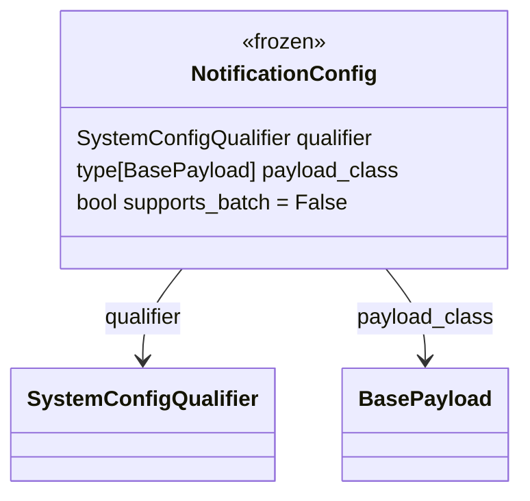

# Diagram: entity_core/entity_service/entity_service/common/integration_notifier/models/notification_config.py

> Auto-generated by Obscura crawlers

## Mermaid

### SVG

<svg id="container" width="373.9921875" xmlns="http://www.w3.org/2000/svg" class="classDiagram" height="366" viewBox="0 0 373.9921875 366" role="graphics-document document" aria-roledescription="class"><g><defs><marker id="container_class-aggregationStart" class="marker aggregation class" refX="18" refY="7" markerWidth="190" markerHeight="240" orient="auto"><path d="M 18,7 L9,13 L1,7 L9,1 Z"></path></marker></defs><defs><marker id="container_class-aggregationEnd" class="marker aggregation class" refX="1" refY="7" markerWidth="20" markerHeight="28" orient="auto"><path d="M 18,7 L9,13 L1,7 L9,1 Z"></path></marker></defs><defs><marker id="container_class-extensionStart" class="marker extension class" refX="18" refY="7" markerWidth="190" markerHeight="240" orient="auto"><path d="M 1,7 L18,13 V 1 Z"></path></marker></defs><defs><marker id="container_class-extensionEnd" class="marker extension class" refX="1" refY="7" markerWidth="20" markerHeight="28" orient="auto"><path d="M 1,1 V 13 L18,7 Z"></path></marker></defs><defs><marker id="container_class-compositionStart" class="marker composition class" refX="18" refY="7" markerWidth="190" markerHeight="240" orient="auto"><path d="M 18,7 L9,13 L1,7 L9,1 Z"></path></marker></defs><defs><marker id="container_class-compositionEnd" class="marker composition class" refX="1" refY="7" markerWidth="20" markerHeight="28" orient="auto"><path d="M 18,7 L9,13 L1,7 L9,1 Z"></path></marker></defs><defs><marker id="container_class-dependencyStart" class="marker dependency class" refX="6" refY="7" markerWidth="190" markerHeight="240" orient="auto"><path d="M 5,7 L9,13 L1,7 L9,1 Z"></path></marker></defs><defs><marker id="container_class-dependencyEnd" class="marker dependency class" refX="13" refY="7" markerWidth="20" markerHeight="28" orient="auto"><path d="M 18,7 L9,13 L14,7 L9,1 Z"></path></marker></defs><defs><marker id="container_class-lollipopStart" class="marker lollipop class" refX="13" refY="7" markerWidth="190" markerHeight="240" orient="auto"><circle stroke="black" fill="transparent" cx="7" cy="7" r="6"></circle></marker></defs><defs><marker id="container_class-lollipopEnd" class="marker lollipop class" refX="1" refY="7" markerWidth="190" markerHeight="240" orient="auto"><circle stroke="black" fill="transparent" cx="7" cy="7" r="6"></circle></marker></defs><g class="root"><g class="clusters"></g><g class="edgePaths"><path d="M128.938,200L124.27,206.167C119.602,212.333,110.266,224.667,105.598,236C100.93,247.333,100.93,257.667,100.93,262.833L100.93,268" id="id_NotificationConfig_SystemConfigQualifier_1" class="edge-thickness-normal edge-pattern-solid relation" style=";;;" data-edge="true" data-et="edge" data-id="id_NotificationConfig_SystemConfigQualifier_1" data-points="W3sieCI6MTI4LjkzODMyMjM2ODQyMTA0LCJ5IjoyMDB9LHsieCI6MTAwLjkyOTY4NzUsInkiOjIzN30seyJ4IjoxMDAuOTI5Njg3NSwieSI6Mjc0fV0=" marker-end="url(#container_class-dependencyEnd)"></path><path d="M274.28,200L278.949,206.167C283.617,212.333,292.953,224.667,297.621,236C302.289,247.333,302.289,257.667,302.289,262.833L302.289,268" id="id_NotificationConfig_BasePayload_2" class="edge-thickness-normal edge-pattern-solid relation" style=";;;" data-edge="true" data-et="edge" data-id="id_NotificationConfig_BasePayload_2" data-points="W3sieCI6Mjc0LjI4MDQyNzYzMTU3ODk2LCJ5IjoyMDB9LHsieCI6MzAyLjI4OTA2MjUsInkiOjIzN30seyJ4IjozMDIuMjg5MDYyNSwieSI6Mjc0fV0=" marker-end="url(#container_class-dependencyEnd)"></path></g><g class="edgeLabels"><g class="edgeLabel" transform="translate(100.9296875, 237)"><g class="label" data-id="id_NotificationConfig_SystemConfigQualifier_1" transform="translate(-30.3671875, -12)"><foreignObject width="60.734375" height="24">

qualifier

</foreignObject></g></g><g class="edgeLabel" transform="translate(302.2890625, 237)"><g class="label" data-id="id_NotificationConfig_BasePayload_2" transform="translate(-50.671875, -12)"><foreignObject width="101.34375" height="24">

payload_class

</foreignObject></g></g></g><g class="nodes"><g class="node default" id="classId-NotificationConfig-0" transform="translate(201.609375, 104)"><g class="basic label-container"><path d="M-164.3828125 -96 L164.3828125 -96 L164.3828125 96 L-164.3828125 96" stroke="none" stroke-width="0" fill="#ECECFF" style=""></path><path d="M-164.3828125 -96 C-95.69734550717669 -96, -27.011878514353384 -96, 164.3828125 -96 M-164.3828125 -96 C-77.04874222084575 -96, 10.285328058308494 -96, 164.3828125 -96 M164.3828125 -96 C164.3828125 -32.24759634566374, 164.3828125 31.504807308672525, 164.3828125 96 M164.3828125 -96 C164.3828125 -42.356156525610466, 164.3828125 11.287686948779069, 164.3828125 96 M164.3828125 96 C40.6602193094633 96, -83.0623738810734 96, -164.3828125 96 M164.3828125 96 C83.49526128832028 96, 2.607710076640558 96, -164.3828125 96 M-164.3828125 96 C-164.3828125 51.24892595924361, -164.3828125 6.497851918487214, -164.3828125 -96 M-164.3828125 96 C-164.3828125 31.647399710326823, -164.3828125 -32.705200579346354, -164.3828125 -96" stroke="#9370DB" stroke-width="1.3" fill="none" stroke-dasharray="0 0" style=""></path></g><g class="annotation-group text" transform="translate(-31.765625, -72)"><g class="label" style="" transform="translate(0,-12)"><foreignObject width="63.53125" height="24">

«frozen»

</foreignObject></g></g><g class="label-group text" transform="translate(-65.8125, -48)"><g class="label" style="font-weight: bolder" transform="translate(0,-12)"><foreignObject width="131.625" height="24">

NotificationConfig

</foreignObject></g></g><g class="members-group text" transform="translate(-152.3828125, 0)"><g class="label" style="" transform="translate(0,-12)"><foreignObject width="223.8125" height="24">

SystemConfigQualifier qualifier

</foreignObject></g><g class="label" style="" transform="translate(0,12)"><foreignObject width="238.953125" height="24">

type[BasePayload] payload_class

</foreignObject></g><g class="label" style="" transform="translate(0,36)"><foreignObject width="203.09375" height="24">

bool supports_batch = False

</foreignObject></g></g><g class="methods-group text" transform="translate(-152.3828125, 96)"></g><g class="divider" style=""><path d="M-164.3828125 -24 C-63.26130705938756 -24, 37.860198381224876 -24, 164.3828125 -24 M-164.3828125 -24 C-33.218376099325724 -24, 97.94606030134855 -24, 164.3828125 -24" stroke="#9370DB" stroke-width="1.3" fill="none" stroke-dasharray="0 0" style=""></path></g><g class="divider" style=""><path d="M-164.3828125 72 C-82.13305852500581 72, 0.11669544998838433 72, 164.3828125 72 M-164.3828125 72 C-56.29216537526045 72, 51.798481749479095 72, 164.3828125 72" stroke="#9370DB" stroke-width="1.3" fill="none" stroke-dasharray="0 0" style=""></path></g></g><g class="node default" id="classId-SystemConfigQualifier-1" transform="translate(100.9296875, 316)"><g class="basic label-container"><path d="M-92.9296875 -42 L92.9296875 -42 L92.9296875 42 L-92.9296875 42" stroke="none" stroke-width="0" fill="#ECECFF" style=""></path><path d="M-92.9296875 -42 C-31.737843116577658 -42, 29.454001266844685 -42, 92.9296875 -42 M-92.9296875 -42 C-24.514541137246965 -42, 43.90060522550607 -42, 92.9296875 -42 M92.9296875 -42 C92.9296875 -17.850482740514558, 92.9296875 6.299034518970885, 92.9296875 42 M92.9296875 -42 C92.9296875 -9.474474787823326, 92.9296875 23.05105042435335, 92.9296875 42 M92.9296875 42 C33.85957552579673 42, -25.210536448406543 42, -92.9296875 42 M92.9296875 42 C55.06039095049812 42, 17.191094400996235 42, -92.9296875 42 M-92.9296875 42 C-92.9296875 16.256861087259285, -92.9296875 -9.48627782548143, -92.9296875 -42 M-92.9296875 42 C-92.9296875 20.878550263961415, -92.9296875 -0.24289947207716978, -92.9296875 -42" stroke="#9370DB" stroke-width="1.3" fill="none" stroke-dasharray="0 0" style=""></path></g><g class="annotation-group text" transform="translate(0, -18)"></g><g class="label-group text" transform="translate(-80.9296875, -18)"><g class="label" style="font-weight: bolder" transform="translate(0,-12)"><foreignObject width="161.859375" height="24">

SystemConfigQualifier

</foreignObject></g></g><g class="members-group text" transform="translate(-80.9296875, 30)"></g><g class="methods-group text" transform="translate(-80.9296875, 60)"></g><g class="divider" style=""><path d="M-92.9296875 6 C-29.27793649521125 6, 34.3738145095775 6, 92.9296875 6 M-92.9296875 6 C-26.059387264267045 6, 40.81091297146591 6, 92.9296875 6" stroke="#9370DB" stroke-width="1.3" fill="none" stroke-dasharray="0 0" style=""></path></g><g class="divider" style=""><path d="M-92.9296875 24 C-33.87400831573881 24, 25.181670868522374 24, 92.9296875 24 M-92.9296875 24 C-40.21340884741765 24, 12.502869805164707 24, 92.9296875 24" stroke="#9370DB" stroke-width="1.3" fill="none" stroke-dasharray="0 0" style=""></path></g></g><g class="node default" id="classId-BasePayload-2" transform="translate(302.2890625, 316)"><g class="basic label-container"><path d="M-58.4296875 -42 L58.4296875 -42 L58.4296875 42 L-58.4296875 42" stroke="none" stroke-width="0" fill="#ECECFF" style=""></path><path d="M-58.4296875 -42 C-18.997998348615738 -42, 20.433690802768524 -42, 58.4296875 -42 M-58.4296875 -42 C-23.859892783639168 -42, 10.709901932721664 -42, 58.4296875 -42 M58.4296875 -42 C58.4296875 -21.06692274083164, 58.4296875 -0.13384548166327903, 58.4296875 42 M58.4296875 -42 C58.4296875 -17.44474286034488, 58.4296875 7.110514279310237, 58.4296875 42 M58.4296875 42 C17.475135593172197 42, -23.479416313655605 42, -58.4296875 42 M58.4296875 42 C33.173839707410565 42, 7.917991914821137 42, -58.4296875 42 M-58.4296875 42 C-58.4296875 24.38078031483233, -58.4296875 6.7615606296646575, -58.4296875 -42 M-58.4296875 42 C-58.4296875 23.034391159548804, -58.4296875 4.068782319097608, -58.4296875 -42" stroke="#9370DB" stroke-width="1.3" fill="none" stroke-dasharray="0 0" style=""></path></g><g class="annotation-group text" transform="translate(0, -18)"></g><g class="label-group text" transform="translate(-46.4296875, -18)"><g class="label" style="font-weight: bolder" transform="translate(0,-12)"><foreignObject width="92.859375" height="24">

BasePayload

</foreignObject></g></g><g class="members-group text" transform="translate(-46.4296875, 30)"></g><g class="methods-group text" transform="translate(-46.4296875, 60)"></g><g class="divider" style=""><path d="M-58.4296875 6 C-12.310232248858426 6, 33.80922300228315 6, 58.4296875 6 M-58.4296875 6 C-29.987530314032274 6, -1.545373128064547 6, 58.4296875 6" stroke="#9370DB" stroke-width="1.3" fill="none" stroke-dasharray="0 0" style=""></path></g><g class="divider" style=""><path d="M-58.4296875 24 C-28.290403016356 24, 1.8488814672880025 24, 58.4296875 24 M-58.4296875 24 C-13.89207129100734 24, 30.64554491798532 24, 58.4296875 24" stroke="#9370DB" stroke-width="1.3" fill="none" stroke-dasharray="0 0" style=""></path></g></g></g></g></g></svg>
