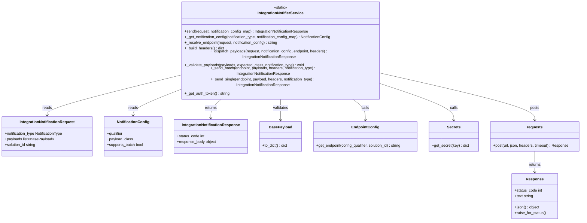
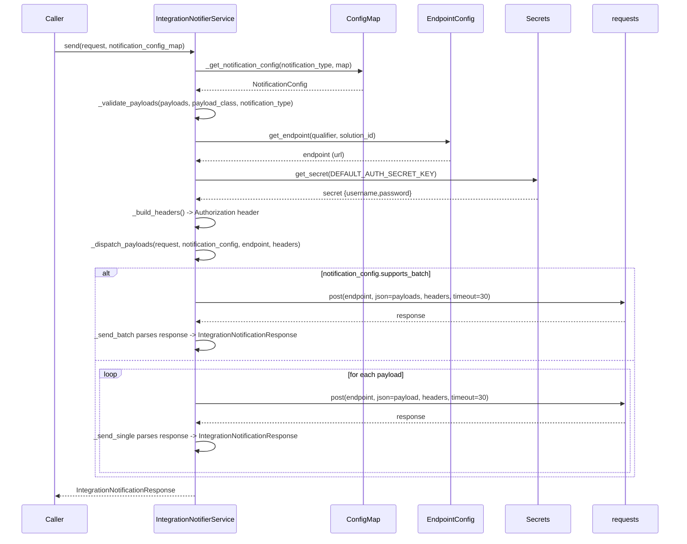

# Diagram: entity_core/entity_service/entity_service/common/integration_notifier/notifier_service.py

> Auto-generated by Obscura crawlers

## Diagram 1

### SVG

<svg id="container" width="2484.25" xmlns="http://www.w3.org/2000/svg" class="classDiagram" height="866" viewBox="0 0 2484.25 866" role="graphics-document document" aria-roledescription="class"><g><defs><marker id="container_class-aggregationStart" class="marker aggregation class" refX="18" refY="7" markerWidth="190" markerHeight="240" orient="auto"><path d="M 18,7 L9,13 L1,7 L9,1 Z"></path></marker></defs><defs><marker id="container_class-aggregationEnd" class="marker aggregation class" refX="1" refY="7" markerWidth="20" markerHeight="28" orient="auto"><path d="M 18,7 L9,13 L1,7 L9,1 Z"></path></marker></defs><defs><marker id="container_class-extensionStart" class="marker extension class" refX="18" refY="7" markerWidth="190" markerHeight="240" orient="auto"><path d="M 1,7 L18,13 V 1 Z"></path></marker></defs><defs><marker id="container_class-extensionEnd" class="marker extension class" refX="1" refY="7" markerWidth="20" markerHeight="28" orient="auto"><path d="M 1,1 V 13 L18,7 Z"></path></marker></defs><defs><marker id="container_class-compositionStart" class="marker composition class" refX="18" refY="7" markerWidth="190" markerHeight="240" orient="auto"><path d="M 18,7 L9,13 L1,7 L9,1 Z"></path></marker></defs><defs><marker id="container_class-compositionEnd" class="marker composition class" refX="1" refY="7" markerWidth="20" markerHeight="28" orient="auto"><path d="M 18,7 L9,13 L1,7 L9,1 Z"></path></marker></defs><defs><marker id="container_class-dependencyStart" class="marker dependency class" refX="6" refY="7" markerWidth="190" markerHeight="240" orient="auto"><path d="M 5,7 L9,13 L1,7 L9,1 Z"></path></marker></defs><defs><marker id="container_class-dependencyEnd" class="marker dependency class" refX="13" refY="7" markerWidth="20" markerHeight="28" orient="auto"><path d="M 18,7 L9,13 L14,7 L9,1 Z"></path></marker></defs><defs><marker id="container_class-lollipopStart" class="marker lollipop class" refX="13" refY="7" markerWidth="190" markerHeight="240" orient="auto"><circle stroke="black" fill="transparent" cx="7" cy="7" r="6"></circle></marker></defs><defs><marker id="container_class-lollipopEnd" class="marker lollipop class" refX="1" refY="7" markerWidth="190" markerHeight="240" orient="auto"><circle stroke="black" fill="transparent" cx="7" cy="7" r="6"></circle></marker></defs><g class="root"><g class="clusters"></g><g class="edgePaths"><path d="M765.207,269.59L671.644,289.158C578.081,308.726,390.954,347.863,297.391,372.598C203.828,397.333,203.828,407.667,203.828,412.833L203.828,418" id="id_IntegrationNotifierService_IntegrationNotificationRequest_1" class="edge-thickness-normal edge-pattern-solid relation" style=";;;" data-edge="true" data-et="edge" data-id="id_IntegrationNotifierService_IntegrationNotificationRequest_1" data-points="W3sieCI6NzY1LjIwNzAzMTI1LCJ5IjoyNjkuNTg5NzI0MTUyMjg3N30seyJ4IjoyMDMuODI4MTI1LCJ5IjozODd9LHsieCI6MjAzLjgyODEyNSwieSI6NDI0fV0=" marker-end="url(#container_class-dependencyEnd)"></path><path d="M765.207,323.231L733.29,333.859C701.372,344.487,637.538,365.744,605.62,381.539C573.703,397.333,573.703,407.667,573.703,412.833L573.703,418" id="id_IntegrationNotifierService_NotificationConfig_2" class="edge-thickness-normal edge-pattern-solid relation" style=";;;" data-edge="true" data-et="edge" data-id="id_IntegrationNotifierService_NotificationConfig_2" data-points="W3sieCI6NzY1LjIwNzAzMTI1LCJ5IjozMjMuMjMxMjMxNTEyOTIzfSx7IngiOjU3My43MDMxMjUsInkiOjM4N30seyJ4Ijo1NzMuNzAzMTI1LCJ5Ijo0MjR9XQ==" marker-end="url(#container_class-dependencyEnd)"></path><path d="M955.865,350L947.121,356.167C938.376,362.333,920.887,374.667,912.143,388C903.398,401.333,903.398,415.667,903.398,422.833L903.398,430" id="id_IntegrationNotifierService_IntegrationNotificationResponse_3" class="edge-thickness-normal edge-pattern-solid relation" style=";;;" data-edge="true" data-et="edge" data-id="id_IntegrationNotifierService_IntegrationNotificationResponse_3" data-points="W3sieCI6OTU1Ljg2NTM2NTgzNTMzNjUsInkiOjM1MH0seyJ4Ijo5MDMuMzk4NDM3NSwieSI6Mzg3fSx7IngiOjkwMy4zOTg0Mzc1LCJ5Ijo0MzZ9XQ==" marker-end="url(#container_class-dependencyEnd)"></path><path d="M1497.97,350L1508.775,356.167C1519.58,362.333,1541.191,374.667,1551.996,389.5C1562.801,404.333,1562.801,421.667,1562.801,430.333L1562.801,439" id="id_IntegrationNotifierService_EndpointConfig_4" class="edge-thickness-normal edge-pattern-solid relation" style=";;;" data-edge="true" data-et="edge" data-id="id_IntegrationNotifierService_EndpointConfig_4" data-points="W3sieCI6MTQ5Ny45NzAxNzcyODM2NTM4LCJ5IjozNTB9LHsieCI6MTU2Mi44MDA3ODEyNSwieSI6Mzg3fSx7IngiOjE1NjIuODAwNzgxMjUsInkiOjQ0NX1d" marker-end="url(#container_class-dependencyEnd)"></path><path d="M1198.348,350L1198.348,356.167C1198.348,362.333,1198.348,374.667,1198.348,389.5C1198.348,404.333,1198.348,421.667,1198.348,430.333L1198.348,439" id="id_IntegrationNotifierService_BasePayload_5" class="edge-thickness-normal edge-pattern-solid relation" style=";;;" data-edge="true" data-et="edge" data-id="id_IntegrationNotifierService_BasePayload_5" data-points="W3sieCI6MTE5OC4zNDc2NTYyNSwieSI6MzUwfSx7IngiOjExOTguMzQ3NjU2MjUsInkiOjM4N30seyJ4IjoxMTk4LjM0NzY1NjI1LCJ5Ijo0NDV9XQ==" marker-end="url(#container_class-dependencyEnd)"></path><path d="M1631.488,300.089L1683.302,314.574C1735.116,329.06,1838.743,358.03,1890.557,381.182C1942.371,404.333,1942.371,421.667,1942.371,430.333L1942.371,439" id="id_IntegrationNotifierService_Secrets_6" class="edge-thickness-normal edge-pattern-solid relation" style=";;;" data-edge="true" data-et="edge" data-id="id_IntegrationNotifierService_Secrets_6" data-points="W3sieCI6MTYzMS40ODgyODEyNSwieSI6MzAwLjA4OTI2MzQwMTA2MDV9LHsieCI6MTk0Mi4zNzEwOTM3NSwieSI6Mzg3fSx7IngiOjE5NDIuMzcxMDkzNzUsInkiOjQ0NX1d" marker-end="url(#container_class-dependencyEnd)"></path><path d="M1631.488,261.793L1740.66,282.661C1849.832,303.529,2068.176,345.264,2177.348,374.799C2286.52,404.333,2286.52,421.667,2286.52,430.333L2286.52,439" id="id_IntegrationNotifierService_requests_7" class="edge-thickness-normal edge-pattern-solid relation" style=";;;" data-edge="true" data-et="edge" data-id="id_IntegrationNotifierService_requests_7" data-points="W3sieCI6MTYzMS40ODgyODEyNSwieSI6MjYxLjc5MzIxNjgzNDQyNjk3fSx7IngiOjIyODYuNTE5NTMxMjUsInkiOjM4N30seyJ4IjoyMjg2LjUxOTUzMTI1LCJ5Ijo0NDV9XQ==" marker-end="url(#container_class-dependencyEnd)"></path><path d="M2286.52,571L2286.52,580.667C2286.52,590.333,2286.52,609.667,2286.52,624.5C2286.52,639.333,2286.52,649.667,2286.52,654.833L2286.52,660" id="id_requests_Response_8" class="edge-thickness-normal edge-pattern-solid relation" style=";;;" data-edge="true" data-et="edge" data-id="id_requests_Response_8" data-points="W3sieCI6MjI4Ni41MTk1MzEyNSwieSI6NTcxfSx7IngiOjIyODYuNTE5NTMxMjUsInkiOjYyOX0seyJ4IjoyMjg2LjUxOTUzMTI1LCJ5Ijo2NjZ9XQ==" marker-end="url(#container_class-dependencyEnd)"></path></g><g class="edgeLabels"><g class="edgeLabel" transform="translate(203.828125, 387)"><g class="label" data-id="id_IntegrationNotifierService_IntegrationNotificationRequest_1" transform="translate(-20.0078125, -12)"><foreignObject width="40.015625" height="24">

reads

</foreignObject></g></g><g class="edgeLabel" transform="translate(573.703125, 387)"><g class="label" data-id="id_IntegrationNotifierService_NotificationConfig_2" transform="translate(-20.0078125, -12)"><foreignObject width="40.015625" height="24">

reads

</foreignObject></g></g><g class="edgeLabel" transform="translate(903.3984375, 387)"><g class="label" data-id="id_IntegrationNotifierService_IntegrationNotificationResponse_3" transform="translate(-26.265625, -12)"><foreignObject width="52.53125" height="24">

returns

</foreignObject></g></g><g class="edgeLabel" transform="translate(1562.80078125, 387)"><g class="label" data-id="id_IntegrationNotifierService_EndpointConfig_4" transform="translate(-16.4453125, -12)"><foreignObject width="32.890625" height="24">

calls

</foreignObject></g></g><g class="edgeLabel" transform="translate(1198.34765625, 387)"><g class="label" data-id="id_IntegrationNotifierService_BasePayload_5" transform="translate(-32.6875, -12)"><foreignObject width="65.375" height="24">

validates

</foreignObject></g></g><g class="edgeLabel" transform="translate(1942.37109375, 387)"><g class="label" data-id="id_IntegrationNotifierService_Secrets_6" transform="translate(-16.4453125, -12)"><foreignObject width="32.890625" height="24">

calls

</foreignObject></g></g><g class="edgeLabel" transform="translate(2286.51953125, 387)"><g class="label" data-id="id_IntegrationNotifierService_requests_7" transform="translate(-19.7890625, -12)"><foreignObject width="39.578125" height="24">

posts

</foreignObject></g></g><g class="edgeLabel" transform="translate(2286.51953125, 629)"><g class="label" data-id="id_requests_Response_8" transform="translate(-26.265625, -12)"><foreignObject width="52.53125" height="24">

returns

</foreignObject></g></g></g><g class="nodes"><g class="node default" id="classId-IntegrationNotifierService-0" transform="translate(1198.34765625, 179)"><g class="basic label-container"><path d="M-433.140625 -171 L433.140625 -171 L433.140625 171 L-433.140625 171" stroke="none" stroke-width="0" fill="#ECECFF" style=""></path><path d="M-433.140625 -171 C-134.33866610261975 -171, 164.4632927947605 -171, 433.140625 -171 M-433.140625 -171 C-205.28941201774032 -171, 22.561800964519364 -171, 433.140625 -171 M433.140625 -171 C433.140625 -71.79926722607696, 433.140625 27.401465547846072, 433.140625 171 M433.140625 -171 C433.140625 -48.254725056346246, 433.140625 74.49054988730751, 433.140625 171 M433.140625 171 C191.13883432287264 171, -50.86295635425472 171, -433.140625 171 M433.140625 171 C248.32544937478974 171, 63.51027374957948 171, -433.140625 171 M-433.140625 171 C-433.140625 89.75437812002612, -433.140625 8.508756240052236, -433.140625 -171 M-433.140625 171 C-433.140625 54.15453236713603, -433.140625 -62.690935265727944, -433.140625 -171" stroke="#9370DB" stroke-width="1.3" fill="none" stroke-dasharray="0 0" style=""></path></g><g class="annotation-group text" transform="translate(-29.0234375, -147)"><g class="label" style="" transform="translate(0,-12)"><foreignObject width="58.046875" height="24">

«static»

</foreignObject></g></g><g class="label-group text" transform="translate(-95.0625, -123)"><g class="label" style="font-weight: bolder" transform="translate(0,-12)"><foreignObject width="190.125" height="24">

IntegrationNotifierService

</foreignObject></g></g><g class="members-group text" transform="translate(-421.140625, -75)"></g><g class="methods-group text" transform="translate(-421.140625, -45)"><g class="label" style="" transform="translate(0,-12)"><foreignObject width="539.515625" height="24">

+send(request, notification_config_map) : IntegrationNotificationResponse

</foreignObject></g><g class="label" style="" transform="translate(0,12)"><foreignObject width="639.96875" height="24">

+_get_notification_config(notification_type, notification_config_map) : NotificationConfig

</foreignObject></g><g class="label" style="" transform="translate(0,36)"><foreignObject width="403.875" height="24">

+_resolve_endpoint(request, notification_config) : string

</foreignObject></g><g class="label" style="" transform="translate(0,60)"><foreignObject width="169.390625" height="24">

+_build_headers() : dict

</foreignObject></g><g class="label" style="" transform="translate(0,84)"><foreignObject width="747.21875" height="24">

+_dispatch_payloads(request, notification_config, endpoint, headers) : IntegrationNotificationResponse

</foreignObject></g><g class="label" style="" transform="translate(0,108)"><foreignObject width="513.765625" height="24">

+_validate_payloads(payloads, expected_class, notification_type) : void

</foreignObject></g><g class="label" style="" transform="translate(0,132)"><foreignObject width="694.03125" height="24">

+_send_batch(endpoint, payloads, headers, notification_type) : IntegrationNotificationResponse

</foreignObject></g><g class="label" style="" transform="translate(0,156)"><foreignObject width="688.953125" height="24">

+_send_single(endpoint, payload, headers, notification_type) : IntegrationNotificationResponse

</foreignObject></g><g class="label" style="" transform="translate(0,180)"><foreignObject width="192.25" height="24">

+_get_auth_token() : string

</foreignObject></g></g><g class="divider" style=""><path d="M-433.140625 -99 C-116.45073658045806 -99, 200.2391518390839 -99, 433.140625 -99 M-433.140625 -99 C-131.01217068659582 -99, 171.11628362680835 -99, 433.140625 -99" stroke="#9370DB" stroke-width="1.3" fill="none" stroke-dasharray="0 0" style=""></path></g><g class="divider" style=""><path d="M-433.140625 -75 C-192.38820281574885 -75, 48.36421936850229 -75, 433.140625 -75 M-433.140625 -75 C-254.69331553668928 -75, -76.24600607337857 -75, 433.140625 -75" stroke="#9370DB" stroke-width="1.3" fill="none" stroke-dasharray="0 0" style=""></path></g></g><g class="node default" id="classId-IntegrationNotificationRequest-1" transform="translate(203.828125, 508)"><g class="basic label-container"><path d="M-195.828125 -84 L195.828125 -84 L195.828125 84 L-195.828125 84" stroke="none" stroke-width="0" fill="#ECECFF" style=""></path><path d="M-195.828125 -84 C-40.998459535174106 -84, 113.83120592965179 -84, 195.828125 -84 M-195.828125 -84 C-81.29466736859065 -84, 33.238790262818696 -84, 195.828125 -84 M195.828125 -84 C195.828125 -21.172948071734197, 195.828125 41.654103856531606, 195.828125 84 M195.828125 -84 C195.828125 -31.38147640324116, 195.828125 21.237047193517682, 195.828125 84 M195.828125 84 C72.80997438704244 84, -50.20817622591511 84, -195.828125 84 M195.828125 84 C46.67948473353388 84, -102.46915553293223 84, -195.828125 84 M-195.828125 84 C-195.828125 22.270538136387906, -195.828125 -39.45892372722419, -195.828125 -84 M-195.828125 84 C-195.828125 37.376397146354584, -195.828125 -9.247205707290831, -195.828125 -84" stroke="#9370DB" stroke-width="1.3" fill="none" stroke-dasharray="0 0" style=""></path></g><g class="annotation-group text" transform="translate(0, -60)"></g><g class="label-group text" transform="translate(-113.53125, -60)"><g class="label" style="font-weight: bolder" transform="translate(0,-12)"><foreignObject width="227.0625" height="24">

IntegrationNotificationRequest

</foreignObject></g></g><g class="members-group text" transform="translate(-183.828125, -12)"><g class="label" style="" transform="translate(0,-12)"><foreignObject width="254.125" height="24">

+notification_type NotificationType

</foreignObject></g><g class="label" style="" transform="translate(0,12)"><foreignObject width="207.171875" height="24">

+payloads list&lt;BasePayload&gt;

</foreignObject></g><g class="label" style="" transform="translate(0,36)"><foreignObject width="136.09375" height="24">

+solution_id string

</foreignObject></g></g><g class="methods-group text" transform="translate(-183.828125, 84)"></g><g class="divider" style=""><path d="M-195.828125 -36 C-81.53607030256354 -36, 32.75598439487291 -36, 195.828125 -36 M-195.828125 -36 C-83.95427986199702 -36, 27.919565276005955 -36, 195.828125 -36" stroke="#9370DB" stroke-width="1.3" fill="none" stroke-dasharray="0 0" style=""></path></g><g class="divider" style=""><path d="M-195.828125 60 C-45.60502173275583 60, 104.61808153448834 60, 195.828125 60 M-195.828125 60 C-79.25574968695713 60, 37.31662562608574 60, 195.828125 60" stroke="#9370DB" stroke-width="1.3" fill="none" stroke-dasharray="0 0" style=""></path></g></g><g class="node default" id="classId-NotificationConfig-2" transform="translate(573.703125, 508)"><g class="basic label-container"><path d="M-124.046875 -84 L124.046875 -84 L124.046875 84 L-124.046875 84" stroke="none" stroke-width="0" fill="#ECECFF" style=""></path><path d="M-124.046875 -84 C-32.14284181685427 -84, 59.761191366291456 -84, 124.046875 -84 M-124.046875 -84 C-63.09187658448797 -84, -2.13687816897594 -84, 124.046875 -84 M124.046875 -84 C124.046875 -24.72756836644905, 124.046875 34.5448632671019, 124.046875 84 M124.046875 -84 C124.046875 -40.75877414622905, 124.046875 2.482451707541898, 124.046875 84 M124.046875 84 C34.424375434768706 84, -55.19812413046259 84, -124.046875 84 M124.046875 84 C31.997991194624404 84, -60.05089261075119 84, -124.046875 84 M-124.046875 84 C-124.046875 21.219094567153746, -124.046875 -41.56181086569251, -124.046875 -84 M-124.046875 84 C-124.046875 37.16382317688962, -124.046875 -9.672353646220756, -124.046875 -84" stroke="#9370DB" stroke-width="1.3" fill="none" stroke-dasharray="0 0" style=""></path></g><g class="annotation-group text" transform="translate(0, -60)"></g><g class="label-group text" transform="translate(-65.8125, -60)"><g class="label" style="font-weight: bolder" transform="translate(0,-12)"><foreignObject width="131.625" height="24">

NotificationConfig

</foreignObject></g></g><g class="members-group text" transform="translate(-112.046875, -12)"><g class="label" style="" transform="translate(0,-12)"><foreignObject width="68.71875" height="24">

+qualifier

</foreignObject></g><g class="label" style="" transform="translate(0,12)"><foreignObject width="109.3125" height="24">

+payload_class

</foreignObject></g><g class="label" style="" transform="translate(0,36)"><foreignObject width="158.28125" height="24">

+supports_batch bool

</foreignObject></g></g><g class="methods-group text" transform="translate(-112.046875, 84)"></g><g class="divider" style=""><path d="M-124.046875 -36 C-30.747975196090138 -36, 62.550924607819724 -36, 124.046875 -36 M-124.046875 -36 C-63.58500223856964 -36, -3.123129477139287 -36, 124.046875 -36" stroke="#9370DB" stroke-width="1.3" fill="none" stroke-dasharray="0 0" style=""></path></g><g class="divider" style=""><path d="M-124.046875 60 C-31.78991543563194 60, 60.46704412873612 60, 124.046875 60 M-124.046875 60 C-69.89867531404897 60, -15.75047562809793 60, 124.046875 60" stroke="#9370DB" stroke-width="1.3" fill="none" stroke-dasharray="0 0" style=""></path></g></g><g class="node default" id="classId-IntegrationNotificationResponse-3" transform="translate(903.3984375, 508)"><g class="basic label-container"><path d="M-155.6484375 -72 L155.6484375 -72 L155.6484375 72 L-155.6484375 72" stroke="none" stroke-width="0" fill="#ECECFF" style=""></path><path d="M-155.6484375 -72 C-74.513665723769 -72, 6.621106052462011 -72, 155.6484375 -72 M-155.6484375 -72 C-36.61278815019563 -72, 82.42286119960875 -72, 155.6484375 -72 M155.6484375 -72 C155.6484375 -37.7768542902353, 155.6484375 -3.553708580470598, 155.6484375 72 M155.6484375 -72 C155.6484375 -42.00411373890223, 155.6484375 -12.008227477804454, 155.6484375 72 M155.6484375 72 C88.2258565368252 72, 20.80327557365041 72, -155.6484375 72 M155.6484375 72 C68.22562289535524 72, -19.197191709289513 72, -155.6484375 72 M-155.6484375 72 C-155.6484375 37.27382999870436, -155.6484375 2.547659997408715, -155.6484375 -72 M-155.6484375 72 C-155.6484375 21.13358259370665, -155.6484375 -29.732834812586702, -155.6484375 -72" stroke="#9370DB" stroke-width="1.3" fill="none" stroke-dasharray="0 0" style=""></path></g><g class="annotation-group text" transform="translate(0, -48)"></g><g class="label-group text" transform="translate(-119, -48)"><g class="label" style="font-weight: bolder" transform="translate(0,-12)"><foreignObject width="238" height="24">

IntegrationNotificationResponse

</foreignObject></g></g><g class="members-group text" transform="translate(-143.6484375, 0)"><g class="label" style="" transform="translate(0,-12)"><foreignObject width="118.9375" height="24">

+status_code int

</foreignObject></g><g class="label" style="" transform="translate(0,12)"><foreignObject width="168.296875" height="24">

+response_body object

</foreignObject></g></g><g class="methods-group text" transform="translate(-143.6484375, 72)"></g><g class="divider" style=""><path d="M-155.6484375 -24 C-74.3334510555848 -24, 6.981535388830395 -24, 155.6484375 -24 M-155.6484375 -24 C-60.118078543645936 -24, 35.41228041270813 -24, 155.6484375 -24" stroke="#9370DB" stroke-width="1.3" fill="none" stroke-dasharray="0 0" style=""></path></g><g class="divider" style=""><path d="M-155.6484375 48 C-37.19460863628247 48, 81.25922022743507 48, 155.6484375 48 M-155.6484375 48 C-51.7667040279933 48, 52.1150294440134 48, 155.6484375 48" stroke="#9370DB" stroke-width="1.3" fill="none" stroke-dasharray="0 0" style=""></path></g></g><g class="node default" id="classId-BasePayload-4" transform="translate(1198.34765625, 508)"><g class="basic label-container"><path d="M-89.30078125 -63 L89.30078125 -63 L89.30078125 63 L-89.30078125 63" stroke="none" stroke-width="0" fill="#ECECFF" style=""></path><path d="M-89.30078125 -63 C-19.520790680050922 -63, 50.259199889898156 -63, 89.30078125 -63 M-89.30078125 -63 C-28.485839680434097 -63, 32.329101889131806 -63, 89.30078125 -63 M89.30078125 -63 C89.30078125 -28.833072129024032, 89.30078125 5.333855741951936, 89.30078125 63 M89.30078125 -63 C89.30078125 -17.373417571769018, 89.30078125 28.253164856461964, 89.30078125 63 M89.30078125 63 C23.793594914132925 63, -41.71359142173415 63, -89.30078125 63 M89.30078125 63 C22.485472431860487 63, -44.32983638627903 63, -89.30078125 63 M-89.30078125 63 C-89.30078125 30.571488234937462, -89.30078125 -1.8570235301250761, -89.30078125 -63 M-89.30078125 63 C-89.30078125 14.226814165890154, -89.30078125 -34.54637166821969, -89.30078125 -63" stroke="#9370DB" stroke-width="1.3" fill="none" stroke-dasharray="0 0" style=""></path></g><g class="annotation-group text" transform="translate(0, -39)"></g><g class="label-group text" transform="translate(-46.4296875, -39)"><g class="label" style="font-weight: bolder" transform="translate(0,-12)"><foreignObject width="92.859375" height="24">

BasePayload

</foreignObject></g></g><g class="members-group text" transform="translate(-77.30078125, 9)"></g><g class="methods-group text" transform="translate(-77.30078125, 39)"><g class="label" style="" transform="translate(0,-12)"><foreignObject width="108.171875" height="24">

+to_dict() : dict

</foreignObject></g></g><g class="divider" style=""><path d="M-89.30078125 -15 C-51.5965548831972 -15, -13.8923285163944 -15, 89.30078125 -15 M-89.30078125 -15 C-40.07246145568995 -15, 9.155858338620106 -15, 89.30078125 -15" stroke="#9370DB" stroke-width="1.3" fill="none" stroke-dasharray="0 0" style=""></path></g><g class="divider" style=""><path d="M-89.30078125 9 C-44.42760022061201 9, 0.44558080877598627 9, 89.30078125 9 M-89.30078125 9 C-43.72405758783643 9, 1.8526660743271464 9, 89.30078125 9" stroke="#9370DB" stroke-width="1.3" fill="none" stroke-dasharray="0 0" style=""></path></g></g><g class="node default" id="classId-EndpointConfig-5" transform="translate(1562.80078125, 508)"><g class="basic label-container"><path d="M-225.15234375 -63 L225.15234375 -63 L225.15234375 63 L-225.15234375 63" stroke="none" stroke-width="0" fill="#ECECFF" style=""></path><path d="M-225.15234375 -63 C-109.0589386364766 -63, 7.034466477046806 -63, 225.15234375 -63 M-225.15234375 -63 C-98.96673667720698 -63, 27.218870395586038 -63, 225.15234375 -63 M225.15234375 -63 C225.15234375 -23.907160274659766, 225.15234375 15.185679450680468, 225.15234375 63 M225.15234375 -63 C225.15234375 -17.32691957340191, 225.15234375 28.34616085319618, 225.15234375 63 M225.15234375 63 C120.9929481591707 63, 16.83355256834139 63, -225.15234375 63 M225.15234375 63 C110.02558929548239 63, -5.101165159035219 63, -225.15234375 63 M-225.15234375 63 C-225.15234375 15.152408354191508, -225.15234375 -32.695183291616985, -225.15234375 -63 M-225.15234375 63 C-225.15234375 22.83904532593268, -225.15234375 -17.32190934813464, -225.15234375 -63" stroke="#9370DB" stroke-width="1.3" fill="none" stroke-dasharray="0 0" style=""></path></g><g class="annotation-group text" transform="translate(0, -39)"></g><g class="label-group text" transform="translate(-55.8828125, -39)"><g class="label" style="font-weight: bolder" transform="translate(0,-12)"><foreignObject width="111.765625" height="24">

EndpointConfig

</foreignObject></g></g><g class="members-group text" transform="translate(-213.15234375, 9)"></g><g class="methods-group text" transform="translate(-213.15234375, 39)"><g class="label" style="" transform="translate(0,-12)"><foreignObject width="370.421875" height="24">

+get_endpoint(config_qualifier, solution_id) : string

</foreignObject></g></g><g class="divider" style=""><path d="M-225.15234375 -15 C-89.47500738359642 -15, 46.20232898280716 -15, 225.15234375 -15 M-225.15234375 -15 C-58.135362048823964 -15, 108.88161965235207 -15, 225.15234375 -15" stroke="#9370DB" stroke-width="1.3" fill="none" stroke-dasharray="0 0" style=""></path></g><g class="divider" style=""><path d="M-225.15234375 9 C-54.86215690813228 9, 115.42802993373544 9, 225.15234375 9 M-225.15234375 9 C-112.09665361714215 9, 0.9590365157156953 9, 225.15234375 9" stroke="#9370DB" stroke-width="1.3" fill="none" stroke-dasharray="0 0" style=""></path></g></g><g class="node default" id="classId-Secrets-6" transform="translate(1942.37109375, 508)"><g class="basic label-container"><path d="M-104.41796875 -63 L104.41796875 -63 L104.41796875 63 L-104.41796875 63" stroke="none" stroke-width="0" fill="#ECECFF" style=""></path><path d="M-104.41796875 -63 C-28.924945747611417 -63, 46.568077254777165 -63, 104.41796875 -63 M-104.41796875 -63 C-56.35754628295384 -63, -8.297123815907682 -63, 104.41796875 -63 M104.41796875 -63 C104.41796875 -19.03425604674061, 104.41796875 24.931487906518782, 104.41796875 63 M104.41796875 -63 C104.41796875 -35.073223265733176, 104.41796875 -7.14644653146636, 104.41796875 63 M104.41796875 63 C62.11439373674652 63, 19.810818723493043 63, -104.41796875 63 M104.41796875 63 C36.837712754806205 63, -30.74254324038759 63, -104.41796875 63 M-104.41796875 63 C-104.41796875 36.01806822729818, -104.41796875 9.03613645459636, -104.41796875 -63 M-104.41796875 63 C-104.41796875 14.333200950707479, -104.41796875 -34.33359809858504, -104.41796875 -63" stroke="#9370DB" stroke-width="1.3" fill="none" stroke-dasharray="0 0" style=""></path></g><g class="annotation-group text" transform="translate(0, -39)"></g><g class="label-group text" transform="translate(-27.1640625, -39)"><g class="label" style="font-weight: bolder" transform="translate(0,-12)"><foreignObject width="54.328125" height="24">

Secrets

</foreignObject></g></g><g class="members-group text" transform="translate(-92.41796875, 9)"></g><g class="methods-group text" transform="translate(-92.41796875, 39)"><g class="label" style="" transform="translate(0,-12)"><foreignObject width="157.671875" height="24">

+get_secret(key) : dict

</foreignObject></g></g><g class="divider" style=""><path d="M-104.41796875 -15 C-45.27984207822027 -15, 13.85828459355946 -15, 104.41796875 -15 M-104.41796875 -15 C-60.38063083065071 -15, -16.34329291130142 -15, 104.41796875 -15" stroke="#9370DB" stroke-width="1.3" fill="none" stroke-dasharray="0 0" style=""></path></g><g class="divider" style=""><path d="M-104.41796875 9 C-30.624915160545825 9, 43.16813842890835 9, 104.41796875 9 M-104.41796875 9 C-50.797486903106105 9, 2.8229949437877906 9, 104.41796875 9" stroke="#9370DB" stroke-width="1.3" fill="none" stroke-dasharray="0 0" style=""></path></g></g><g class="node default" id="classId-requests-7" transform="translate(2286.51953125, 508)"><g class="basic label-container"><path d="M-189.73046875 -63 L189.73046875 -63 L189.73046875 63 L-189.73046875 63" stroke="none" stroke-width="0" fill="#ECECFF" style=""></path><path d="M-189.73046875 -63 C-71.99068327397005 -63, 45.7491022020599 -63, 189.73046875 -63 M-189.73046875 -63 C-98.76908388729026 -63, -7.807699024580529 -63, 189.73046875 -63 M189.73046875 -63 C189.73046875 -21.538808129453685, 189.73046875 19.92238374109263, 189.73046875 63 M189.73046875 -63 C189.73046875 -13.44669953797991, 189.73046875 36.10660092404018, 189.73046875 63 M189.73046875 63 C56.116316272107355 63, -77.49783620578529 63, -189.73046875 63 M189.73046875 63 C88.1949326711804 63, -13.340603407639207 63, -189.73046875 63 M-189.73046875 63 C-189.73046875 29.582819942898034, -189.73046875 -3.834360114203932, -189.73046875 -63 M-189.73046875 63 C-189.73046875 33.24921535324141, -189.73046875 3.4984307064828215, -189.73046875 -63" stroke="#9370DB" stroke-width="1.3" fill="none" stroke-dasharray="0 0" style=""></path></g><g class="annotation-group text" transform="translate(0, -39)"></g><g class="label-group text" transform="translate(-31.9921875, -39)"><g class="label" style="font-weight: bolder" transform="translate(0,-12)"><foreignObject width="63.984375" height="24">

requests

</foreignObject></g></g><g class="members-group text" transform="translate(-177.73046875, 9)"></g><g class="methods-group text" transform="translate(-177.73046875, 39)"><g class="label" style="" transform="translate(0,-12)"><foreignObject width="323.46875" height="24">

+post(url, json, headers, timeout) : Response

</foreignObject></g></g><g class="divider" style=""><path d="M-189.73046875 -15 C-105.50477248477692 -15, -21.279076219553843 -15, 189.73046875 -15 M-189.73046875 -15 C-87.0468924925282 -15, 15.636683764943598 -15, 189.73046875 -15" stroke="#9370DB" stroke-width="1.3" fill="none" stroke-dasharray="0 0" style=""></path></g><g class="divider" style=""><path d="M-189.73046875 9 C-91.42429609290602 9, 6.881876564187962 9, 189.73046875 9 M-189.73046875 9 C-74.34547154508302 9, 41.03952565983397 9, 189.73046875 9" stroke="#9370DB" stroke-width="1.3" fill="none" stroke-dasharray="0 0" style=""></path></g></g><g class="node default" id="classId-Response-8" transform="translate(2286.51953125, 762)"><g class="basic label-container"><path d="M-96.33203125 -96 L96.33203125 -96 L96.33203125 96 L-96.33203125 96" stroke="none" stroke-width="0" fill="#ECECFF" style=""></path><path d="M-96.33203125 -96 C-32.70466789415111 -96, 30.922695461697785 -96, 96.33203125 -96 M-96.33203125 -96 C-31.33685579171832 -96, 33.65831966656336 -96, 96.33203125 -96 M96.33203125 -96 C96.33203125 -25.655946721326046, 96.33203125 44.68810655734791, 96.33203125 96 M96.33203125 -96 C96.33203125 -38.61230430949836, 96.33203125 18.775391381003274, 96.33203125 96 M96.33203125 96 C43.00930503256487 96, -10.313421184870265 96, -96.33203125 96 M96.33203125 96 C21.66071425736054 96, -53.01060273527892 96, -96.33203125 96 M-96.33203125 96 C-96.33203125 27.840765919807637, -96.33203125 -40.318468160384725, -96.33203125 -96 M-96.33203125 96 C-96.33203125 40.827049595514346, -96.33203125 -14.345900808971308, -96.33203125 -96" stroke="#9370DB" stroke-width="1.3" fill="none" stroke-dasharray="0 0" style=""></path></g><g class="annotation-group text" transform="translate(0, -72)"></g><g class="label-group text" transform="translate(-35.4453125, -72)"><g class="label" style="font-weight: bolder" transform="translate(0,-12)"><foreignObject width="70.890625" height="24">

Response

</foreignObject></g></g><g class="members-group text" transform="translate(-84.33203125, -24)"><g class="label" style="" transform="translate(0,-12)"><foreignObject width="118.9375" height="24">

+status_code int

</foreignObject></g><g class="label" style="" transform="translate(0,12)"><foreignObject width="81.4375" height="24">

+text string

</foreignObject></g></g><g class="methods-group text" transform="translate(-84.33203125, 48)"><g class="label" style="" transform="translate(0,-12)"><foreignObject width="106.65625" height="24">

+json() : object

</foreignObject></g><g class="label" style="" transform="translate(0,12)"><foreignObject width="133.21875" height="24">

+raise_for_status()

</foreignObject></g></g><g class="divider" style=""><path d="M-96.33203125 -48 C-37.37565872777701 -48, 21.580713794445984 -48, 96.33203125 -48 M-96.33203125 -48 C-51.51508621915064 -48, -6.698141188301278 -48, 96.33203125 -48" stroke="#9370DB" stroke-width="1.3" fill="none" stroke-dasharray="0 0" style=""></path></g><g class="divider" style=""><path d="M-96.33203125 24 C-52.09518608905767 24, -7.858340928115339 24, 96.33203125 24 M-96.33203125 24 C-44.28087020692995 24, 7.770290836140106 24, 96.33203125 24" stroke="#9370DB" stroke-width="1.3" fill="none" stroke-dasharray="0 0" style=""></path></g></g></g></g></g></svg>

## Diagram 2

### SVG

<svg id="container" width="1622" xmlns="http://www.w3.org/2000/svg" height="1302" viewBox="-50 -10 1622 1302" role="graphics-document document" aria-roledescription="sequence"><g><rect x="1372" y="1216" fill="#eaeaea" stroke="#666" width="150" height="65" name="HTTP" rx="3" ry="3" class="actor actor-bottom"></rect><text x="1447" y="1248.5" dominant-baseline="central" alignment-baseline="central" class="actor actor-box" style="text-anchor: middle; font-size: 16px; font-weight: 400;"><tspan x="1447" dy="0">requests</tspan></text></g><g><rect x="1172" y="1216" fill="#eaeaea" stroke="#666" width="150" height="65" name="Secrets" rx="3" ry="3" class="actor actor-bottom"></rect><text x="1247" y="1248.5" dominant-baseline="central" alignment-baseline="central" class="actor actor-box" style="text-anchor: middle; font-size: 16px; font-weight: 400;"><tspan x="1247" dy="0">Secrets</tspan></text></g><g><rect x="972" y="1216" fill="#eaeaea" stroke="#666" width="150" height="65" name="EndpointConfig" rx="3" ry="3" class="actor actor-bottom"></rect><text x="1047" y="1248.5" dominant-baseline="central" alignment-baseline="central" class="actor actor-box" style="text-anchor: middle; font-size: 16px; font-weight: 400;"><tspan x="1047" dy="0">EndpointConfig</tspan></text></g><g><rect x="772" y="1216" fill="#eaeaea" stroke="#666" width="150" height="65" name="ConfigMap" rx="3" ry="3" class="actor actor-bottom"></rect><text x="847" y="1248.5" dominant-baseline="central" alignment-baseline="central" class="actor actor-box" style="text-anchor: middle; font-size: 16px; font-weight: 400;"><tspan x="847" dy="0">ConfigMap</tspan></text></g><g><rect x="325.5" y="1216" fill="#eaeaea" stroke="#666" width="207" height="65" name="Service" rx="3" ry="3" class="actor actor-bottom"></rect><text x="429" y="1248.5" dominant-baseline="central" alignment-baseline="central" class="actor actor-box" style="text-anchor: middle; font-size: 16px; font-weight: 400;"><tspan x="429" dy="0">IntegrationNotifierService</tspan></text></g><g><rect x="0" y="1216" fill="#eaeaea" stroke="#666" width="150" height="65" name="Caller" rx="3" ry="3" class="actor actor-bottom"></rect><text x="75" y="1248.5" dominant-baseline="central" alignment-baseline="central" class="actor actor-box" style="text-anchor: middle; font-size: 16px; font-weight: 400;"><tspan x="75" dy="0">Caller</tspan></text></g><g><line id="actor5" x1="1447" y1="65" x2="1447" y2="1216" class="actor-line 200" stroke-width="0.5px" stroke="#999" name="HTTP"></line><g id="root-5"><rect x="1372" y="0" fill="#eaeaea" stroke="#666" width="150" height="65" name="HTTP" rx="3" ry="3" class="actor actor-top"></rect><text x="1447" y="32.5" dominant-baseline="central" alignment-baseline="central" class="actor actor-box" style="text-anchor: middle; font-size: 16px; font-weight: 400;"><tspan x="1447" dy="0">requests</tspan></text></g></g><g><line id="actor4" x1="1247" y1="65" x2="1247" y2="1216" class="actor-line 200" stroke-width="0.5px" stroke="#999" name="Secrets"></line><g id="root-4"><rect x="1172" y="0" fill="#eaeaea" stroke="#666" width="150" height="65" name="Secrets" rx="3" ry="3" class="actor actor-top"></rect><text x="1247" y="32.5" dominant-baseline="central" alignment-baseline="central" class="actor actor-box" style="text-anchor: middle; font-size: 16px; font-weight: 400;"><tspan x="1247" dy="0">Secrets</tspan></text></g></g><g><line id="actor3" x1="1047" y1="65" x2="1047" y2="1216" class="actor-line 200" stroke-width="0.5px" stroke="#999" name="EndpointConfig"></line><g id="root-3"><rect x="972" y="0" fill="#eaeaea" stroke="#666" width="150" height="65" name="EndpointConfig" rx="3" ry="3" class="actor actor-top"></rect><text x="1047" y="32.5" dominant-baseline="central" alignment-baseline="central" class="actor actor-box" style="text-anchor: middle; font-size: 16px; font-weight: 400;"><tspan x="1047" dy="0">EndpointConfig</tspan></text></g></g><g><line id="actor2" x1="847" y1="65" x2="847" y2="1216" class="actor-line 200" stroke-width="0.5px" stroke="#999" name="ConfigMap"></line><g id="root-2"><rect x="772" y="0" fill="#eaeaea" stroke="#666" width="150" height="65" name="ConfigMap" rx="3" ry="3" class="actor actor-top"></rect><text x="847" y="32.5" dominant-baseline="central" alignment-baseline="central" class="actor actor-box" style="text-anchor: middle; font-size: 16px; font-weight: 400;"><tspan x="847" dy="0">ConfigMap</tspan></text></g></g><g><line id="actor1" x1="429" y1="65" x2="429" y2="1216" class="actor-line 200" stroke-width="0.5px" stroke="#999" name="Service"></line><g id="root-1"><rect x="325.5" y="0" fill="#eaeaea" stroke="#666" width="207" height="65" name="Service" rx="3" ry="3" class="actor actor-top"></rect><text x="429" y="32.5" dominant-baseline="central" alignment-baseline="central" class="actor actor-box" style="text-anchor: middle; font-size: 16px; font-weight: 400;"><tspan x="429" dy="0">IntegrationNotifierService</tspan></text></g></g><g><line id="actor0" x1="75" y1="65" x2="75" y2="1216" class="actor-line 200" stroke-width="0.5px" stroke="#999" name="Caller"></line><g id="root-0"><rect x="0" y="0" fill="#eaeaea" stroke="#666" width="150" height="65" name="Caller" rx="3" ry="3" class="actor actor-top"></rect><text x="75" y="32.5" dominant-baseline="central" alignment-baseline="central" class="actor actor-box" style="text-anchor: middle; font-size: 16px; font-weight: 400;"><tspan x="75" dy="0">Caller</tspan></text></g></g><g></g><defs><symbol id="computer" width="24" height="24"><path transform="scale(.5)" d="M2 2v13h20v-13h-20zm18 11h-16v-9h16v9zm-10.228 6l.466-1h3.524l.467 1h-4.457zm14.228 3h-24l2-6h2.104l-1.33 4h18.45l-1.297-4h2.073l2 6zm-5-10h-14v-7h14v7z"></path></symbol></defs><defs><symbol id="database" fill-rule="evenodd" clip-rule="evenodd"><path transform="scale(.5)" d="M12.258.001l.256.004.255.005.253.008.251.01.249.012.247.015.246.016.242.019.241.02.239.023.236.024.233.027.231.028.229.031.225.032.223.034.22.036.217.038.214.04.211.041.208.043.205.045.201.046.198.048.194.05.191.051.187.053.183.054.18.056.175.057.172.059.168.06.163.061.16.063.155.064.15.066.074.033.073.033.071.034.07.034.069.035.068.035.067.035.066.035.064.036.064.036.062.036.06.036.06.037.058.037.058.037.055.038.055.038.053.038.052.038.051.039.05.039.048.039.047.039.045.04.044.04.043.04.041.04.04.041.039.041.037.041.036.041.034.041.033.042.032.042.03.042.029.042.027.042.026.043.024.043.023.043.021.043.02.043.018.044.017.043.015.044.013.044.012.044.011.045.009.044.007.045.006.045.004.045.002.045.001.045v17l-.001.045-.002.045-.004.045-.006.045-.007.045-.009.044-.011.045-.012.044-.013.044-.015.044-.017.043-.018.044-.02.043-.021.043-.023.043-.024.043-.026.043-.027.042-.029.042-.03.042-.032.042-.033.042-.034.041-.036.041-.037.041-.039.041-.04.041-.041.04-.043.04-.044.04-.045.04-.047.039-.048.039-.05.039-.051.039-.052.038-.053.038-.055.038-.055.038-.058.037-.058.037-.06.037-.06.036-.062.036-.064.036-.064.036-.066.035-.067.035-.068.035-.069.035-.07.034-.071.034-.073.033-.074.033-.15.066-.155.064-.16.063-.163.061-.168.06-.172.059-.175.057-.18.056-.183.054-.187.053-.191.051-.194.05-.198.048-.201.046-.205.045-.208.043-.211.041-.214.04-.217.038-.22.036-.223.034-.225.032-.229.031-.231.028-.233.027-.236.024-.239.023-.241.02-.242.019-.246.016-.247.015-.249.012-.251.01-.253.008-.255.005-.256.004-.258.001-.258-.001-.256-.004-.255-.005-.253-.008-.251-.01-.249-.012-.247-.015-.245-.016-.243-.019-.241-.02-.238-.023-.236-.024-.234-.027-.231-.028-.228-.031-.226-.032-.223-.034-.22-.036-.217-.038-.214-.04-.211-.041-.208-.043-.204-.045-.201-.046-.198-.048-.195-.05-.19-.051-.187-.053-.184-.054-.179-.056-.176-.057-.172-.059-.167-.06-.164-.061-.159-.063-.155-.064-.151-.066-.074-.033-.072-.033-.072-.034-.07-.034-.069-.035-.068-.035-.067-.035-.066-.035-.064-.036-.063-.036-.062-.036-.061-.036-.06-.037-.058-.037-.057-.037-.056-.038-.055-.038-.053-.038-.052-.038-.051-.039-.049-.039-.049-.039-.046-.039-.046-.04-.044-.04-.043-.04-.041-.04-.04-.041-.039-.041-.037-.041-.036-.041-.034-.041-.033-.042-.032-.042-.03-.042-.029-.042-.027-.042-.026-.043-.024-.043-.023-.043-.021-.043-.02-.043-.018-.044-.017-.043-.015-.044-.013-.044-.012-.044-.011-.045-.009-.044-.007-.045-.006-.045-.004-.045-.002-.045-.001-.045v-17l.001-.045.002-.045.004-.045.006-.045.007-.045.009-.044.011-.045.012-.044.013-.044.015-.044.017-.043.018-.044.02-.043.021-.043.023-.043.024-.043.026-.043.027-.042.029-.042.03-.042.032-.042.033-.042.034-.041.036-.041.037-.041.039-.041.04-.041.041-.04.043-.04.044-.04.046-.04.046-.039.049-.039.049-.039.051-.039.052-.038.053-.038.055-.038.056-.038.057-.037.058-.037.06-.037.061-.036.062-.036.063-.036.064-.036.066-.035.067-.035.068-.035.069-.035.07-.034.072-.034.072-.033.074-.033.151-.066.155-.064.159-.063.164-.061.167-.06.172-.059.176-.057.179-.056.184-.054.187-.053.19-.051.195-.05.198-.048.201-.046.204-.045.208-.043.211-.041.214-.04.217-.038.22-.036.223-.034.226-.032.228-.031.231-.028.234-.027.236-.024.238-.023.241-.02.243-.019.245-.016.247-.015.249-.012.251-.01.253-.008.255-.005.256-.004.258-.001.258.001zm-9.258 20.499v.01l.001.021.003.021.004.022.005.021.006.022.007.022.009.023.01.022.011.023.012.023.013.023.015.023.016.024.017.023.018.024.019.024.021.024.022.025.023.024.024.025.052.049.056.05.061.051.066.051.07.051.075.051.079.052.084.052.088.052.092.052.097.052.102.051.105.052.11.052.114.051.119.051.123.051.127.05.131.05.135.05.139.048.144.049.147.047.152.047.155.047.16.045.163.045.167.043.171.043.176.041.178.041.183.039.187.039.19.037.194.035.197.035.202.033.204.031.209.03.212.029.216.027.219.025.222.024.226.021.23.02.233.018.236.016.24.015.243.012.246.01.249.008.253.005.256.004.259.001.26-.001.257-.004.254-.005.25-.008.247-.011.244-.012.241-.014.237-.016.233-.018.231-.021.226-.021.224-.024.22-.026.216-.027.212-.028.21-.031.205-.031.202-.034.198-.034.194-.036.191-.037.187-.039.183-.04.179-.04.175-.042.172-.043.168-.044.163-.045.16-.046.155-.046.152-.047.148-.048.143-.049.139-.049.136-.05.131-.05.126-.05.123-.051.118-.052.114-.051.11-.052.106-.052.101-.052.096-.052.092-.052.088-.053.083-.051.079-.052.074-.052.07-.051.065-.051.06-.051.056-.05.051-.05.023-.024.023-.025.021-.024.02-.024.019-.024.018-.024.017-.024.015-.023.014-.024.013-.023.012-.023.01-.023.01-.022.008-.022.006-.022.006-.022.004-.022.004-.021.001-.021.001-.021v-4.127l-.077.055-.08.053-.083.054-.085.053-.087.052-.09.052-.093.051-.095.05-.097.05-.1.049-.102.049-.105.048-.106.047-.109.047-.111.046-.114.045-.115.045-.118.044-.12.043-.122.042-.124.042-.126.041-.128.04-.13.04-.132.038-.134.038-.135.037-.138.037-.139.035-.142.035-.143.034-.144.033-.147.032-.148.031-.15.03-.151.03-.153.029-.154.027-.156.027-.158.026-.159.025-.161.024-.162.023-.163.022-.165.021-.166.02-.167.019-.169.018-.169.017-.171.016-.173.015-.173.014-.175.013-.175.012-.177.011-.178.01-.179.008-.179.008-.181.006-.182.005-.182.004-.184.003-.184.002h-.37l-.184-.002-.184-.003-.182-.004-.182-.005-.181-.006-.179-.008-.179-.008-.178-.01-.176-.011-.176-.012-.175-.013-.173-.014-.172-.015-.171-.016-.17-.017-.169-.018-.167-.019-.166-.02-.165-.021-.163-.022-.162-.023-.161-.024-.159-.025-.157-.026-.156-.027-.155-.027-.153-.029-.151-.03-.15-.03-.148-.031-.146-.032-.145-.033-.143-.034-.141-.035-.14-.035-.137-.037-.136-.037-.134-.038-.132-.038-.13-.04-.128-.04-.126-.041-.124-.042-.122-.042-.12-.044-.117-.043-.116-.045-.113-.045-.112-.046-.109-.047-.106-.047-.105-.048-.102-.049-.1-.049-.097-.05-.095-.05-.093-.052-.09-.051-.087-.052-.085-.053-.083-.054-.08-.054-.077-.054v4.127zm0-5.654v.011l.001.021.003.021.004.021.005.022.006.022.007.022.009.022.01.022.011.023.012.023.013.023.015.024.016.023.017.024.018.024.019.024.021.024.022.024.023.025.024.024.052.05.056.05.061.05.066.051.07.051.075.052.079.051.084.052.088.052.092.052.097.052.102.052.105.052.11.051.114.051.119.052.123.05.127.051.131.05.135.049.139.049.144.048.147.048.152.047.155.046.16.045.163.045.167.044.171.042.176.042.178.04.183.04.187.038.19.037.194.036.197.034.202.033.204.032.209.03.212.028.216.027.219.025.222.024.226.022.23.02.233.018.236.016.24.014.243.012.246.01.249.008.253.006.256.003.259.001.26-.001.257-.003.254-.006.25-.008.247-.01.244-.012.241-.015.237-.016.233-.018.231-.02.226-.022.224-.024.22-.025.216-.027.212-.029.21-.03.205-.032.202-.033.198-.035.194-.036.191-.037.187-.039.183-.039.179-.041.175-.042.172-.043.168-.044.163-.045.16-.045.155-.047.152-.047.148-.048.143-.048.139-.05.136-.049.131-.05.126-.051.123-.051.118-.051.114-.052.11-.052.106-.052.101-.052.096-.052.092-.052.088-.052.083-.052.079-.052.074-.051.07-.052.065-.051.06-.05.056-.051.051-.049.023-.025.023-.024.021-.025.02-.024.019-.024.018-.024.017-.024.015-.023.014-.023.013-.024.012-.022.01-.023.01-.023.008-.022.006-.022.006-.022.004-.021.004-.022.001-.021.001-.021v-4.139l-.077.054-.08.054-.083.054-.085.052-.087.053-.09.051-.093.051-.095.051-.097.05-.1.049-.102.049-.105.048-.106.047-.109.047-.111.046-.114.045-.115.044-.118.044-.12.044-.122.042-.124.042-.126.041-.128.04-.13.039-.132.039-.134.038-.135.037-.138.036-.139.036-.142.035-.143.033-.144.033-.147.033-.148.031-.15.03-.151.03-.153.028-.154.028-.156.027-.158.026-.159.025-.161.024-.162.023-.163.022-.165.021-.166.02-.167.019-.169.018-.169.017-.171.016-.173.015-.173.014-.175.013-.175.012-.177.011-.178.009-.179.009-.179.007-.181.007-.182.005-.182.004-.184.003-.184.002h-.37l-.184-.002-.184-.003-.182-.004-.182-.005-.181-.007-.179-.007-.179-.009-.178-.009-.176-.011-.176-.012-.175-.013-.173-.014-.172-.015-.171-.016-.17-.017-.169-.018-.167-.019-.166-.02-.165-.021-.163-.022-.162-.023-.161-.024-.159-.025-.157-.026-.156-.027-.155-.028-.153-.028-.151-.03-.15-.03-.148-.031-.146-.033-.145-.033-.143-.033-.141-.035-.14-.036-.137-.036-.136-.037-.134-.038-.132-.039-.13-.039-.128-.04-.126-.041-.124-.042-.122-.043-.12-.043-.117-.044-.116-.044-.113-.046-.112-.046-.109-.046-.106-.047-.105-.048-.102-.049-.1-.049-.097-.05-.095-.051-.093-.051-.09-.051-.087-.053-.085-.052-.083-.054-.08-.054-.077-.054v4.139zm0-5.666v.011l.001.02.003.022.004.021.005.022.006.021.007.022.009.023.01.022.011.023.012.023.013.023.015.023.016.024.017.024.018.023.019.024.021.025.022.024.023.024.024.025.052.05.056.05.061.05.066.051.07.051.075.052.079.051.084.052.088.052.092.052.097.052.102.052.105.051.11.052.114.051.119.051.123.051.127.05.131.05.135.05.139.049.144.048.147.048.152.047.155.046.16.045.163.045.167.043.171.043.176.042.178.04.183.04.187.038.19.037.194.036.197.034.202.033.204.032.209.03.212.028.216.027.219.025.222.024.226.021.23.02.233.018.236.017.24.014.243.012.246.01.249.008.253.006.256.003.259.001.26-.001.257-.003.254-.006.25-.008.247-.01.244-.013.241-.014.237-.016.233-.018.231-.02.226-.022.224-.024.22-.025.216-.027.212-.029.21-.03.205-.032.202-.033.198-.035.194-.036.191-.037.187-.039.183-.039.179-.041.175-.042.172-.043.168-.044.163-.045.16-.045.155-.047.152-.047.148-.048.143-.049.139-.049.136-.049.131-.051.126-.05.123-.051.118-.052.114-.051.11-.052.106-.052.101-.052.096-.052.092-.052.088-.052.083-.052.079-.052.074-.052.07-.051.065-.051.06-.051.056-.05.051-.049.023-.025.023-.025.021-.024.02-.024.019-.024.018-.024.017-.024.015-.023.014-.024.013-.023.012-.023.01-.022.01-.023.008-.022.006-.022.006-.022.004-.022.004-.021.001-.021.001-.021v-4.153l-.077.054-.08.054-.083.053-.085.053-.087.053-.09.051-.093.051-.095.051-.097.05-.1.049-.102.048-.105.048-.106.048-.109.046-.111.046-.114.046-.115.044-.118.044-.12.043-.122.043-.124.042-.126.041-.128.04-.13.039-.132.039-.134.038-.135.037-.138.036-.139.036-.142.034-.143.034-.144.033-.147.032-.148.032-.15.03-.151.03-.153.028-.154.028-.156.027-.158.026-.159.024-.161.024-.162.023-.163.023-.165.021-.166.02-.167.019-.169.018-.169.017-.171.016-.173.015-.173.014-.175.013-.175.012-.177.01-.178.01-.179.009-.179.007-.181.006-.182.006-.182.004-.184.003-.184.001-.185.001-.185-.001-.184-.001-.184-.003-.182-.004-.182-.006-.181-.006-.179-.007-.179-.009-.178-.01-.176-.01-.176-.012-.175-.013-.173-.014-.172-.015-.171-.016-.17-.017-.169-.018-.167-.019-.166-.02-.165-.021-.163-.023-.162-.023-.161-.024-.159-.024-.157-.026-.156-.027-.155-.028-.153-.028-.151-.03-.15-.03-.148-.032-.146-.032-.145-.033-.143-.034-.141-.034-.14-.036-.137-.036-.136-.037-.134-.038-.132-.039-.13-.039-.128-.041-.126-.041-.124-.041-.122-.043-.12-.043-.117-.044-.116-.044-.113-.046-.112-.046-.109-.046-.106-.048-.105-.048-.102-.048-.1-.05-.097-.049-.095-.051-.093-.051-.09-.052-.087-.052-.085-.053-.083-.053-.08-.054-.077-.054v4.153zm8.74-8.179l-.257.004-.254.005-.25.008-.247.011-.244.012-.241.014-.237.016-.233.018-.231.021-.226.022-.224.023-.22.026-.216.027-.212.028-.21.031-.205.032-.202.033-.198.034-.194.036-.191.038-.187.038-.183.04-.179.041-.175.042-.172.043-.168.043-.163.045-.16.046-.155.046-.152.048-.148.048-.143.048-.139.049-.136.05-.131.05-.126.051-.123.051-.118.051-.114.052-.11.052-.106.052-.101.052-.096.052-.092.052-.088.052-.083.052-.079.052-.074.051-.07.052-.065.051-.06.05-.056.05-.051.05-.023.025-.023.024-.021.024-.02.025-.019.024-.018.024-.017.023-.015.024-.014.023-.013.023-.012.023-.01.023-.01.022-.008.022-.006.023-.006.021-.004.022-.004.021-.001.021-.001.021.001.021.001.021.004.021.004.022.006.021.006.023.008.022.01.022.01.023.012.023.013.023.014.023.015.024.017.023.018.024.019.024.02.025.021.024.023.024.023.025.051.05.056.05.06.05.065.051.07.052.074.051.079.052.083.052.088.052.092.052.096.052.101.052.106.052.11.052.114.052.118.051.123.051.126.051.131.05.136.05.139.049.143.048.148.048.152.048.155.046.16.046.163.045.168.043.172.043.175.042.179.041.183.04.187.038.191.038.194.036.198.034.202.033.205.032.21.031.212.028.216.027.22.026.224.023.226.022.231.021.233.018.237.016.241.014.244.012.247.011.25.008.254.005.257.004.26.001.26-.001.257-.004.254-.005.25-.008.247-.011.244-.012.241-.014.237-.016.233-.018.231-.021.226-.022.224-.023.22-.026.216-.027.212-.028.21-.031.205-.032.202-.033.198-.034.194-.036.191-.038.187-.038.183-.04.179-.041.175-.042.172-.043.168-.043.163-.045.16-.046.155-.046.152-.048.148-.048.143-.048.139-.049.136-.05.131-.05.126-.051.123-.051.118-.051.114-.052.11-.052.106-.052.101-.052.096-.052.092-.052.088-.052.083-.052.079-.052.074-.051.07-.052.065-.051.06-.05.056-.05.051-.05.023-.025.023-.024.021-.024.02-.025.019-.024.018-.024.017-.023.015-.024.014-.023.013-.023.012-.023.01-.023.01-.022.008-.022.006-.023.006-.021.004-.022.004-.021.001-.021.001-.021-.001-.021-.001-.021-.004-.021-.004-.022-.006-.021-.006-.023-.008-.022-.01-.022-.01-.023-.012-.023-.013-.023-.014-.023-.015-.024-.017-.023-.018-.024-.019-.024-.02-.025-.021-.024-.023-.024-.023-.025-.051-.05-.056-.05-.06-.05-.065-.051-.07-.052-.074-.051-.079-.052-.083-.052-.088-.052-.092-.052-.096-.052-.101-.052-.106-.052-.11-.052-.114-.052-.118-.051-.123-.051-.126-.051-.131-.05-.136-.05-.139-.049-.143-.048-.148-.048-.152-.048-.155-.046-.16-.046-.163-.045-.168-.043-.172-.043-.175-.042-.179-.041-.183-.04-.187-.038-.191-.038-.194-.036-.198-.034-.202-.033-.205-.032-.21-.031-.212-.028-.216-.027-.22-.026-.224-.023-.226-.022-.231-.021-.233-.018-.237-.016-.241-.014-.244-.012-.247-.011-.25-.008-.254-.005-.257-.004-.26-.001-.26.001z"></path></symbol></defs><defs><symbol id="clock" width="24" height="24"><path transform="scale(.5)" d="M12 2c5.514 0 10 4.486 10 10s-4.486 10-10 10-10-4.486-10-10 4.486-10 10-10zm0-2c-6.627 0-12 5.373-12 12s5.373 12 12 12 12-5.373 12-12-5.373-12-12-12zm5.848 12.459c.202.038.202.333.001.372-1.907.361-6.045 1.111-6.547 1.111-.719 0-1.301-.582-1.301-1.301 0-.512.77-5.447 1.125-7.445.034-.192.312-.181.343.014l.985 6.238 5.394 1.011z"></path></symbol></defs><defs><marker id="arrowhead" refX="7.9" refY="5" markerUnits="userSpaceOnUse" markerWidth="12" markerHeight="12" orient="auto-start-reverse"><path d="M -1 0 L 10 5 L 0 10 z"></path></marker></defs><defs><marker id="crosshead" markerWidth="15" markerHeight="8" orient="auto" refX="4" refY="4.5"><path fill="none" stroke="#000000" stroke-width="1pt" d="M 1,2 L 6,7 M 6,2 L 1,7" style="stroke-dasharray: 0, 0;"></path></marker></defs><defs><marker id="filled-head" refX="15.5" refY="7" markerWidth="20" markerHeight="28" orient="auto"><path d="M 18,7 L9,13 L14,7 L9,1 Z"></path></marker></defs><defs><marker id="sequencenumber" refX="15" refY="15" markerWidth="60" markerHeight="40" orient="auto"><circle cx="15" cy="15" r="6"></circle></marker></defs><g><line x1="182.5" y1="889" x2="1458" y2="889" class="loopLine"></line><line x1="1458" y1="889" x2="1458" y2="1138" class="loopLine"></line><line x1="182.5" y1="1138" x2="1458" y2="1138" class="loopLine"></line><line x1="182.5" y1="889" x2="182.5" y2="1138" class="loopLine"></line><polygon points="182.5,889 232.5,889 232.5,902 224.1,909 182.5,909" class="labelBox"></polygon><text x="208" y="902" text-anchor="middle" dominant-baseline="middle" alignment-baseline="middle" class="labelText" style="font-size: 16px; font-weight: 400;">loop</text><text x="845.25" y="907" text-anchor="middle" class="loopText" style="font-size: 16px; font-weight: 400;"><tspan x="845.25">[for each payload]</tspan></text></g><g><line x1="172.5" y1="645" x2="1468" y2="645" class="loopLine"></line><line x1="1468" y1="645" x2="1468" y2="1148" class="loopLine"></line><line x1="172.5" y1="1148" x2="1468" y2="1148" class="loopLine"></line><line x1="172.5" y1="645" x2="172.5" y2="1148" class="loopLine"></line><line x1="172.5" y1="869" x2="1468" y2="869" class="loopLine" style="stroke-dasharray: 3, 3;"></line><polygon points="172.5,645 222.5,645 222.5,658 214.1,665 172.5,665" class="labelBox"></polygon><text x="198" y="658" text-anchor="middle" dominant-baseline="middle" alignment-baseline="middle" class="labelText" style="font-size: 16px; font-weight: 400;">alt</text><text x="845.25" y="663" text-anchor="middle" class="loopText" style="font-size: 16px; font-weight: 400;"><tspan x="845.25">[notification_config.supports_batch]</tspan></text></g><text x="251" y="80" text-anchor="middle" dominant-baseline="middle" alignment-baseline="middle" class="messageText" dy="1em" style="font-size: 16px; font-weight: 400;">send(request, notification_config_map)</text><line x1="76" y1="113" x2="425" y2="113" class="messageLine0" stroke-width="2" stroke="none" marker-end="url(#arrowhead)" style="fill: none;"></line><text x="637" y="128" text-anchor="middle" dominant-baseline="middle" alignment-baseline="middle" class="messageText" dy="1em" style="font-size: 16px; font-weight: 400;">_get_notification_config(notification_type, map)</text><line x1="430" y1="161" x2="843" y2="161" class="messageLine0" stroke-width="2" stroke="none" marker-end="url(#arrowhead)" style="fill: none;"></line><text x="640" y="176" text-anchor="middle" dominant-baseline="middle" alignment-baseline="middle" class="messageText" dy="1em" style="font-size: 16px; font-weight: 400;">NotificationConfig</text><line x1="846" y1="209" x2="433" y2="209" class="messageLine1" stroke-width="2" stroke="none" marker-end="url(#arrowhead)" style="stroke-dasharray: 3, 3; fill: none;"></line><text x="430" y="224" text-anchor="middle" dominant-baseline="middle" alignment-baseline="middle" class="messageText" dy="1em" style="font-size: 16px; font-weight: 400;">_validate_payloads(payloads, payload_class, notification_type)</text><path d="M 430,257 C 490,247 490,287 430,277" class="messageLine0" stroke-width="2" stroke="none" marker-end="url(#arrowhead)" style="fill: none;"></path><text x="737" y="302" text-anchor="middle" dominant-baseline="middle" alignment-baseline="middle" class="messageText" dy="1em" style="font-size: 16px; font-weight: 400;">get_endpoint(qualifier, solution_id)</text><line x1="430" y1="335" x2="1043" y2="335" class="messageLine0" stroke-width="2" stroke="none" marker-end="url(#arrowhead)" style="fill: none;"></line><text x="740" y="350" text-anchor="middle" dominant-baseline="middle" alignment-baseline="middle" class="messageText" dy="1em" style="font-size: 16px; font-weight: 400;">endpoint (url)</text><line x1="1046" y1="383" x2="433" y2="383" class="messageLine1" stroke-width="2" stroke="none" marker-end="url(#arrowhead)" style="stroke-dasharray: 3, 3; fill: none;"></line><text x="837" y="398" text-anchor="middle" dominant-baseline="middle" alignment-baseline="middle" class="messageText" dy="1em" style="font-size: 16px; font-weight: 400;">get_secret(DEFAULT_AUTH_SECRET_KEY)</text><line x1="430" y1="431" x2="1243" y2="431" class="messageLine0" stroke-width="2" stroke="none" marker-end="url(#arrowhead)" style="fill: none;"></line><text x="840" y="446" text-anchor="middle" dominant-baseline="middle" alignment-baseline="middle" class="messageText" dy="1em" style="font-size: 16px; font-weight: 400;">secret {username,password}</text><line x1="1246" y1="479" x2="433" y2="479" class="messageLine1" stroke-width="2" stroke="none" marker-end="url(#arrowhead)" style="stroke-dasharray: 3, 3; fill: none;"></line><text x="430" y="494" text-anchor="middle" dominant-baseline="middle" alignment-baseline="middle" class="messageText" dy="1em" style="font-size: 16px; font-weight: 400;">_build_headers() -&gt; Authorization header</text><path d="M 430,527 C 490,517 490,557 430,547" class="messageLine0" stroke-width="2" stroke="none" marker-end="url(#arrowhead)" style="fill: none;"></path><text x="430" y="572" text-anchor="middle" dominant-baseline="middle" alignment-baseline="middle" class="messageText" dy="1em" style="font-size: 16px; font-weight: 400;">_dispatch_payloads(request, notification_config, endpoint, headers)</text><path d="M 430,605 C 490,595 490,635 430,625" class="messageLine0" stroke-width="2" stroke="none" marker-end="url(#arrowhead)" style="fill: none;"></path><text x="937" y="695" text-anchor="middle" dominant-baseline="middle" alignment-baseline="middle" class="messageText" dy="1em" style="font-size: 16px; font-weight: 400;">post(endpoint, json=payloads, headers, timeout=30)</text><line x1="430" y1="728" x2="1443" y2="728" class="messageLine0" stroke-width="2" stroke="none" marker-end="url(#arrowhead)" style="fill: none;"></line><text x="940" y="743" text-anchor="middle" dominant-baseline="middle" alignment-baseline="middle" class="messageText" dy="1em" style="font-size: 16px; font-weight: 400;">response</text><line x1="1446" y1="776" x2="433" y2="776" class="messageLine1" stroke-width="2" stroke="none" marker-end="url(#arrowhead)" style="stroke-dasharray: 3, 3; fill: none;"></line><text x="430" y="791" text-anchor="middle" dominant-baseline="middle" alignment-baseline="middle" class="messageText" dy="1em" style="font-size: 16px; font-weight: 400;">_send_batch parses response -&gt; IntegrationNotificationResponse</text><path d="M 430,824 C 490,814 490,854 430,844" class="messageLine0" stroke-width="2" stroke="none" marker-end="url(#arrowhead)" style="fill: none;"></path><text x="937" y="939" text-anchor="middle" dominant-baseline="middle" alignment-baseline="middle" class="messageText" dy="1em" style="font-size: 16px; font-weight: 400;">post(endpoint, json=payload, headers, timeout=30)</text><line x1="430" y1="972" x2="1443" y2="972" class="messageLine0" stroke-width="2" stroke="none" marker-end="url(#arrowhead)" style="fill: none;"></line><text x="940" y="987" text-anchor="middle" dominant-baseline="middle" alignment-baseline="middle" class="messageText" dy="1em" style="font-size: 16px; font-weight: 400;">response</text><line x1="1446" y1="1020" x2="433" y2="1020" class="messageLine1" stroke-width="2" stroke="none" marker-end="url(#arrowhead)" style="stroke-dasharray: 3, 3; fill: none;"></line><text x="430" y="1035" text-anchor="middle" dominant-baseline="middle" alignment-baseline="middle" class="messageText" dy="1em" style="font-size: 16px; font-weight: 400;">_send_single parses response -&gt; IntegrationNotificationResponse</text><path d="M 430,1068 C 490,1058 490,1098 430,1088" class="messageLine0" stroke-width="2" stroke="none" marker-end="url(#arrowhead)" style="fill: none;"></path><text x="254" y="1163" text-anchor="middle" dominant-baseline="middle" alignment-baseline="middle" class="messageText" dy="1em" style="font-size: 16px; font-weight: 400;">IntegrationNotificationResponse</text><line x1="428" y1="1196" x2="79" y2="1196" class="messageLine1" stroke-width="2" stroke="none" marker-end="url(#arrowhead)" style="stroke-dasharray: 3, 3; fill: none;"></line></svg>
