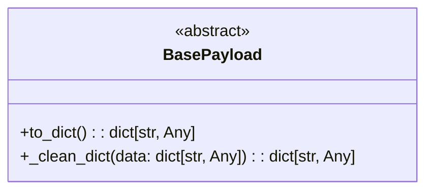

# Diagram: entity_core/entity_service/entity_service/common/integration_notifier/payloads/base.py

> Auto-generated by Obscura crawlers

## Mermaid

### SVG

<svg id="container" width="427.6953125" xmlns="http://www.w3.org/2000/svg" class="classDiagram" height="190" viewBox="0 0 427.6953125 190" role="graphics-document document" aria-roledescription="class"><g><defs><marker id="container_class-aggregationStart" class="marker aggregation class" refX="18" refY="7" markerWidth="190" markerHeight="240" orient="auto"><path d="M 18,7 L9,13 L1,7 L9,1 Z"></path></marker></defs><defs><marker id="container_class-aggregationEnd" class="marker aggregation class" refX="1" refY="7" markerWidth="20" markerHeight="28" orient="auto"><path d="M 18,7 L9,13 L1,7 L9,1 Z"></path></marker></defs><defs><marker id="container_class-extensionStart" class="marker extension class" refX="18" refY="7" markerWidth="190" markerHeight="240" orient="auto"><path d="M 1,7 L18,13 V 1 Z"></path></marker></defs><defs><marker id="container_class-extensionEnd" class="marker extension class" refX="1" refY="7" markerWidth="20" markerHeight="28" orient="auto"><path d="M 1,1 V 13 L18,7 Z"></path></marker></defs><defs><marker id="container_class-compositionStart" class="marker composition class" refX="18" refY="7" markerWidth="190" markerHeight="240" orient="auto"><path d="M 18,7 L9,13 L1,7 L9,1 Z"></path></marker></defs><defs><marker id="container_class-compositionEnd" class="marker composition class" refX="1" refY="7" markerWidth="20" markerHeight="28" orient="auto"><path d="M 18,7 L9,13 L1,7 L9,1 Z"></path></marker></defs><defs><marker id="container_class-dependencyStart" class="marker dependency class" refX="6" refY="7" markerWidth="190" markerHeight="240" orient="auto"><path d="M 5,7 L9,13 L1,7 L9,1 Z"></path></marker></defs><defs><marker id="container_class-dependencyEnd" class="marker dependency class" refX="13" refY="7" markerWidth="20" markerHeight="28" orient="auto"><path d="M 18,7 L9,13 L14,7 L9,1 Z"></path></marker></defs><defs><marker id="container_class-lollipopStart" class="marker lollipop class" refX="13" refY="7" markerWidth="190" markerHeight="240" orient="auto"><circle stroke="black" fill="transparent" cx="7" cy="7" r="6"></circle></marker></defs><defs><marker id="container_class-lollipopEnd" class="marker lollipop class" refX="1" refY="7" markerWidth="190" markerHeight="240" orient="auto"><circle stroke="black" fill="transparent" cx="7" cy="7" r="6"></circle></marker></defs><g class="root"><g class="clusters"></g><g class="edgePaths"></g><g class="edgeLabels"></g><g class="nodes"><g class="node default" id="classId-BasePayload-0" transform="translate(213.84765625, 95)"><g class="basic label-container"><path d="M-205.84765625 -87 L205.84765625 -87 L205.84765625 87 L-205.84765625 87" stroke="none" stroke-width="0" fill="#ECECFF" style=""></path><path d="M-205.84765625 -87 C-54.521503038516244 -87, 96.80465017296751 -87, 205.84765625 -87 M-205.84765625 -87 C-105.05712559178508 -87, -4.266594933570161 -87, 205.84765625 -87 M205.84765625 -87 C205.84765625 -21.412464762255055, 205.84765625 44.17507047548989, 205.84765625 87 M205.84765625 -87 C205.84765625 -24.20559622267492, 205.84765625 38.58880755465016, 205.84765625 87 M205.84765625 87 C117.20060415366623 87, 28.553552057332467 87, -205.84765625 87 M205.84765625 87 C95.65436852562217 87, -14.53891919875565 87, -205.84765625 87 M-205.84765625 87 C-205.84765625 17.535329075228347, -205.84765625 -51.929341849543306, -205.84765625 -87 M-205.84765625 87 C-205.84765625 21.489012885182134, -205.84765625 -44.02197422963573, -205.84765625 -87" stroke="#9370DB" stroke-width="1.3" fill="none" stroke-dasharray="0 0" style=""></path></g><g class="annotation-group text" transform="translate(-38.609375, -63)"><g class="label" style="" transform="translate(0,-12)"><foreignObject width="77.21875" height="24">

«abstract»

</foreignObject></g></g><g class="label-group text" transform="translate(-46.4296875, -39)"><g class="label" style="font-weight: bolder" transform="translate(0,-12)"><foreignObject width="92.859375" height="24">

BasePayload

</foreignObject></g></g><g class="members-group text" transform="translate(-193.84765625, 9)"></g><g class="methods-group text" transform="translate(-193.84765625, 39)"><g class="label" style="" transform="translate(0,-12)"><foreignObject width="179.078125" height="24">

+to_dict() : : dict[str, Any]

</foreignObject></g><g class="label" style="" transform="translate(0,12)"><foreignObject width="341.265625" height="24">

+_clean_dict(data: dict[str, Any]) : : dict[str, Any]

</foreignObject></g></g><g class="divider" style=""><path d="M-205.84765625 -15 C-101.12430747722043 -15, 3.5990412955591466 -15, 205.84765625 -15 M-205.84765625 -15 C-107.86906723428652 -15, -9.890478218573037 -15, 205.84765625 -15" stroke="#9370DB" stroke-width="1.3" fill="none" stroke-dasharray="0 0" style=""></path></g><g class="divider" style=""><path d="M-205.84765625 9 C-108.57462644808912 9, -11.30159664617824 9, 205.84765625 9 M-205.84765625 9 C-85.14333638331547 9, 35.56098348336906 9, 205.84765625 9" stroke="#9370DB" stroke-width="1.3" fill="none" stroke-dasharray="0 0" style=""></path></g></g></g></g></g></svg>
