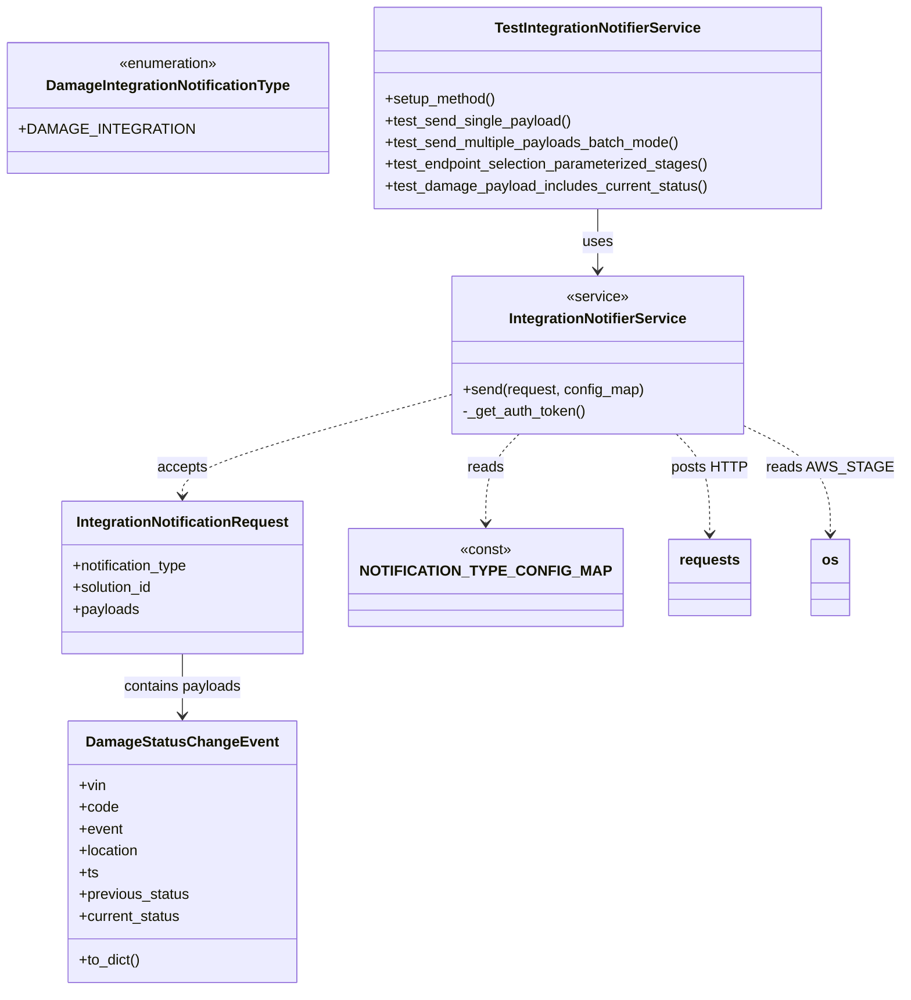
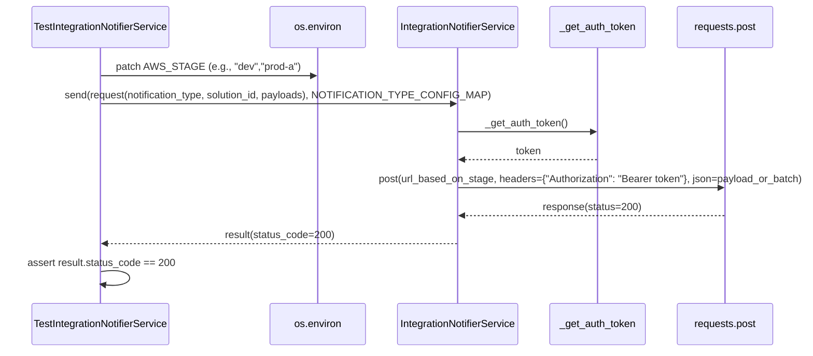

# Diagram: entity_core/entity_service/entity_service/common/integration_notifier/tests/test_integration_notifier_service.py

> Auto-generated by Obscura crawlers

## Diagram 1

### SVG

<svg id="container" width="939.97265625" xmlns="http://www.w3.org/2000/svg" class="classDiagram" height="1090" viewBox="0 0 939.97265625 1090" role="graphics-document document" aria-roledescription="class"><g><defs><marker id="container_class-aggregationStart" class="marker aggregation class" refX="18" refY="7" markerWidth="190" markerHeight="240" orient="auto"><path d="M 18,7 L9,13 L1,7 L9,1 Z"></path></marker></defs><defs><marker id="container_class-aggregationEnd" class="marker aggregation class" refX="1" refY="7" markerWidth="20" markerHeight="28" orient="auto"><path d="M 18,7 L9,13 L1,7 L9,1 Z"></path></marker></defs><defs><marker id="container_class-extensionStart" class="marker extension class" refX="18" refY="7" markerWidth="190" markerHeight="240" orient="auto"><path d="M 1,7 L18,13 V 1 Z"></path></marker></defs><defs><marker id="container_class-extensionEnd" class="marker extension class" refX="1" refY="7" markerWidth="20" markerHeight="28" orient="auto"><path d="M 1,1 V 13 L18,7 Z"></path></marker></defs><defs><marker id="container_class-compositionStart" class="marker composition class" refX="18" refY="7" markerWidth="190" markerHeight="240" orient="auto"><path d="M 18,7 L9,13 L1,7 L9,1 Z"></path></marker></defs><defs><marker id="container_class-compositionEnd" class="marker composition class" refX="1" refY="7" markerWidth="20" markerHeight="28" orient="auto"><path d="M 18,7 L9,13 L1,7 L9,1 Z"></path></marker></defs><defs><marker id="container_class-dependencyStart" class="marker dependency class" refX="6" refY="7" markerWidth="190" markerHeight="240" orient="auto"><path d="M 5,7 L9,13 L1,7 L9,1 Z"></path></marker></defs><defs><marker id="container_class-dependencyEnd" class="marker dependency class" refX="13" refY="7" markerWidth="20" markerHeight="28" orient="auto"><path d="M 18,7 L9,13 L14,7 L9,1 Z"></path></marker></defs><defs><marker id="container_class-lollipopStart" class="marker lollipop class" refX="13" refY="7" markerWidth="190" markerHeight="240" orient="auto"><circle stroke="black" fill="transparent" cx="7" cy="7" r="6"></circle></marker></defs><defs><marker id="container_class-lollipopEnd" class="marker lollipop class" refX="1" refY="7" markerWidth="190" markerHeight="240" orient="auto"><circle stroke="black" fill="transparent" cx="7" cy="7" r="6"></circle></marker></defs><g class="root"><g class="clusters"></g><g class="edgePaths"><path d="M631.395,230L631.395,236.167C631.395,242.333,631.395,254.667,631.395,266C631.395,277.333,631.395,287.667,631.395,292.833L631.395,298" id="id_TestIntegrationNotifierService_IntegrationNotifierService_1" class="edge-thickness-normal edge-pattern-solid relation" style=";;;" data-edge="true" data-et="edge" data-id="id_TestIntegrationNotifierService_IntegrationNotifierService_1" data-points="W3sieCI6NjMxLjM5NDUzMTI1LCJ5IjoyMzB9LHsieCI6NjMxLjM5NDUzMTI1LCJ5IjoyNjd9LHsieCI6NjMxLjM5NDUzMTI1LCJ5IjozMDR9XQ==" marker-end="url(#container_class-dependencyEnd)"></path><path d="M471.473,436.835L426.018,449.862C380.564,462.89,289.655,488.945,244.201,507.139C198.746,525.333,198.746,535.667,198.746,540.833L198.746,546" id="id_IntegrationNotifierService_IntegrationNotificationRequest_2" class="edge-thickness-normal edge-pattern-dashed relation" style=";;;" data-edge="true" data-et="edge" data-id="id_IntegrationNotifierService_IntegrationNotificationRequest_2" data-points="W3sieCI6NDcxLjQ3MjY1NjI1LCJ5Ijo0MzYuODM0NzAyNjg1MTMzNH0seyJ4IjoxOTguNzQ2MDkzNzUsInkiOjUxNX0seyJ4IjoxOTguNzQ2MDkzNzUsInkiOjU1Mn1d" marker-end="url(#container_class-dependencyEnd)"></path><path d="M198.746,720L198.746,726.167C198.746,732.333,198.746,744.667,198.746,756C198.746,767.333,198.746,777.667,198.746,782.833L198.746,788" id="id_IntegrationNotificationRequest_DamageStatusChangeEvent_3" class="edge-thickness-normal edge-pattern-solid relation" style=";;;" data-edge="true" data-et="edge" data-id="id_IntegrationNotificationRequest_DamageStatusChangeEvent_3" data-points="W3sieCI6MTk4Ljc0NjA5Mzc1LCJ5Ijo3MjB9LHsieCI6MTk4Ljc0NjA5Mzc1LCJ5Ijo3NTd9LHsieCI6MTk4Ljc0NjA5Mzc1LCJ5Ijo3OTR9XQ==" marker-end="url(#container_class-dependencyEnd)"></path><path d="M551.345,478L545.671,484.167C539.997,490.333,528.649,502.667,522.975,519C517.301,535.333,517.301,555.667,517.301,565.833L517.301,576" id="id_IntegrationNotifierService_NOTIFICATION_TYPE_CONFIG_MAP_4" class="edge-thickness-normal edge-pattern-dashed relation" style=";;;" data-edge="true" data-et="edge" data-id="id_IntegrationNotifierService_NOTIFICATION_TYPE_CONFIG_MAP_4" data-points="W3sieCI6NTUxLjM0NDg4NDA3MjU4MDYsInkiOjQ3OH0seyJ4Ijo1MTcuMzAwNzgxMjUsInkiOjUxNX0seyJ4Ijo1MTcuMzAwNzgxMjUsInkiOjU4Mn1d" marker-end="url(#container_class-dependencyEnd)"></path><path d="M711.444,478L717.118,484.167C722.792,490.333,734.14,502.667,739.814,521C745.488,539.333,745.488,563.667,745.488,575.833L745.488,588" id="id_IntegrationNotifierService_requests_5" class="edge-thickness-normal edge-pattern-dashed relation" style=";;;" data-edge="true" data-et="edge" data-id="id_IntegrationNotifierService_requests_5" data-points="W3sieCI6NzExLjQ0NDE3ODQyNzQxOTQsInkiOjQ3OH0seyJ4Ijo3NDUuNDg4MjgxMjUsInkiOjUxNX0seyJ4Ijo3NDUuNDg4MjgxMjUsInkiOjU5NH1d" marker-end="url(#container_class-dependencyEnd)"></path><path d="M791.316,474.507L804.241,481.256C817.165,488.005,843.014,501.502,855.939,520.418C868.863,539.333,868.863,563.667,868.863,575.833L868.863,588" id="id_IntegrationNotifierService_os_6" class="edge-thickness-normal edge-pattern-dashed relation" style=";;;" data-edge="true" data-et="edge" data-id="id_IntegrationNotifierService_os_6" data-points="W3sieCI6NzkxLjMxNjQwNjI1LCJ5Ijo0NzQuNTA3MDQwNDAwMDUyNjN9LHsieCI6ODY4Ljg2MzI4MTI1LCJ5Ijo1MTV9LHsieCI6ODY4Ljg2MzI4MTI1LCJ5Ijo1OTR9XQ==" marker-end="url(#container_class-dependencyEnd)"></path></g><g class="edgeLabels"><g class="edgeLabel" transform="translate(631.39453125, 267)"><g class="label" data-id="id_TestIntegrationNotifierService_IntegrationNotifierService_1" transform="translate(-16.4921875, -12)"><foreignObject width="32.984375" height="24">

uses

</foreignObject></g></g><g class="edgeLabel" transform="translate(198.74609375, 515)"><g class="label" data-id="id_IntegrationNotifierService_IntegrationNotificationRequest_2" transform="translate(-27.421875, -12)"><foreignObject width="54.84375" height="24">

accepts

</foreignObject></g></g><g class="edgeLabel" transform="translate(198.74609375, 757)"><g class="label" data-id="id_IntegrationNotificationRequest_DamageStatusChangeEvent_3" transform="translate(-65.6171875, -12)"><foreignObject width="131.234375" height="24">

contains payloads

</foreignObject></g></g><g class="edgeLabel" transform="translate(517.30078125, 515)"><g class="label" data-id="id_IntegrationNotifierService_NOTIFICATION_TYPE_CONFIG_MAP_4" transform="translate(-20.0078125, -12)"><foreignObject width="40.015625" height="24">

reads

</foreignObject></g></g><g class="edgeLabel" transform="translate(745.48828125, 515)"><g class="label" data-id="id_IntegrationNotifierService_requests_5" transform="translate(-40.265625, -12)"><foreignObject width="80.53125" height="24">

posts HTTP

</foreignObject></g></g><g class="edgeLabel" transform="translate(868.86328125, 515)"><g class="label" data-id="id_IntegrationNotifierService_os_6" transform="translate(-63.109375, -12)"><foreignObject width="126.21875" height="24">

reads AWS_STAGE

</foreignObject></g></g></g><g class="nodes"><g class="node default" id="classId-IntegrationNotifierService-0" transform="translate(631.39453125, 391)"><g class="basic label-container"><path d="M-159.921875 -87 L159.921875 -87 L159.921875 87 L-159.921875 87" stroke="none" stroke-width="0" fill="#ECECFF" style=""></path><path d="M-159.921875 -87 C-87.67672299408258 -87, -15.431570988165163 -87, 159.921875 -87 M-159.921875 -87 C-71.93993233137714 -87, 16.042010337245728 -87, 159.921875 -87 M159.921875 -87 C159.921875 -19.84215630293994, 159.921875 47.31568739412012, 159.921875 87 M159.921875 -87 C159.921875 -22.164270617428514, 159.921875 42.67145876514297, 159.921875 87 M159.921875 87 C62.23647420445329 87, -35.448926591093425 87, -159.921875 87 M159.921875 87 C53.19874106108358 87, -53.52439287783284 87, -159.921875 87 M-159.921875 87 C-159.921875 51.07899208620653, -159.921875 15.157984172413066, -159.921875 -87 M-159.921875 87 C-159.921875 38.318460816849594, -159.921875 -10.363078366300812, -159.921875 -87" stroke="#9370DB" stroke-width="1.3" fill="none" stroke-dasharray="0 0" style=""></path></g><g class="annotation-group text" transform="translate(-34.375, -63)"><g class="label" style="" transform="translate(0,-12)"><foreignObject width="68.75" height="24">

«service»

</foreignObject></g></g><g class="label-group text" transform="translate(-95.0625, -39)"><g class="label" style="font-weight: bolder" transform="translate(0,-12)"><foreignObject width="190.125" height="24">

IntegrationNotifierService

</foreignObject></g></g><g class="members-group text" transform="translate(-147.921875, 9)"></g><g class="methods-group text" transform="translate(-147.921875, 39)"><g class="label" style="" transform="translate(0,-12)"><foreignObject width="200.78125" height="24">

+send(request, config_map)

</foreignObject></g><g class="label" style="" transform="translate(0,12)"><foreignObject width="136.765625" height="24">

-_get_auth_token()

</foreignObject></g></g><g class="divider" style=""><path d="M-159.921875 -15 C-95.70660996832001 -15, -31.49134493664002 -15, 159.921875 -15 M-159.921875 -15 C-58.251376941704805 -15, 43.41912111659039 -15, 159.921875 -15" stroke="#9370DB" stroke-width="1.3" fill="none" stroke-dasharray="0 0" style=""></path></g><g class="divider" style=""><path d="M-159.921875 9 C-63.468671972291034 9, 32.98453105541793 9, 159.921875 9 M-159.921875 9 C-67.17762671031166 9, 25.566621579376687 9, 159.921875 9" stroke="#9370DB" stroke-width="1.3" fill="none" stroke-dasharray="0 0" style=""></path></g></g><g class="node default" id="classId-IntegrationNotificationRequest-1" transform="translate(198.74609375, 636)"><g class="basic label-container"><path d="M-134.359375 -84 L134.359375 -84 L134.359375 84 L-134.359375 84" stroke="none" stroke-width="0" fill="#ECECFF" style=""></path><path d="M-134.359375 -84 C-74.05812567440387 -84, -13.756876348807722 -84, 134.359375 -84 M-134.359375 -84 C-38.29440865591171 -84, 57.77055768817658 -84, 134.359375 -84 M134.359375 -84 C134.359375 -29.57208836583152, 134.359375 24.855823268336962, 134.359375 84 M134.359375 -84 C134.359375 -29.41114614419905, 134.359375 25.177707711601897, 134.359375 84 M134.359375 84 C34.06788608086413 84, -66.22360283827174 84, -134.359375 84 M134.359375 84 C50.55202903558374 84, -33.255316928832514 84, -134.359375 84 M-134.359375 84 C-134.359375 43.79784012394565, -134.359375 3.595680247891295, -134.359375 -84 M-134.359375 84 C-134.359375 23.9589213072907, -134.359375 -36.0821573854186, -134.359375 -84" stroke="#9370DB" stroke-width="1.3" fill="none" stroke-dasharray="0 0" style=""></path></g><g class="annotation-group text" transform="translate(0, -60)"></g><g class="label-group text" transform="translate(-113.53125, -60)"><g class="label" style="font-weight: bolder" transform="translate(0,-12)"><foreignObject width="227.0625" height="24">

IntegrationNotificationRequest

</foreignObject></g></g><g class="members-group text" transform="translate(-122.359375, -12)"><g class="label" style="" transform="translate(0,-12)"><foreignObject width="131.1875" height="24">

+notification_type

</foreignObject></g><g class="label" style="" transform="translate(0,12)"><foreignObject width="90.21875" height="24">

+solution_id

</foreignObject></g><g class="label" style="" transform="translate(0,36)"><foreignObject width="73.203125" height="24">

+payloads

</foreignObject></g></g><g class="methods-group text" transform="translate(-122.359375, 84)"></g><g class="divider" style=""><path d="M-134.359375 -36 C-37.99903367414262 -36, 58.36130765171475 -36, 134.359375 -36 M-134.359375 -36 C-55.53775913659513 -36, 23.283856726809745 -36, 134.359375 -36" stroke="#9370DB" stroke-width="1.3" fill="none" stroke-dasharray="0 0" style=""></path></g><g class="divider" style=""><path d="M-134.359375 60 C-59.65919349155979 60, 15.04098801688042 60, 134.359375 60 M-134.359375 60 C-36.730349970797405 60, 60.89867505840519 60, 134.359375 60" stroke="#9370DB" stroke-width="1.3" fill="none" stroke-dasharray="0 0" style=""></path></g></g><g class="node default" id="classId-DamageIntegrationNotificationType-2" transform="translate(170.63671875, 119)"><g class="basic label-container"><path d="M-162.63671875 -72 L162.63671875 -72 L162.63671875 72 L-162.63671875 72" stroke="none" stroke-width="0" fill="#ECECFF" style=""></path><path d="M-162.63671875 -72 C-52.59390861729385 -72, 57.4489015154123 -72, 162.63671875 -72 M-162.63671875 -72 C-62.021450728909386 -72, 38.59381729218123 -72, 162.63671875 -72 M162.63671875 -72 C162.63671875 -36.87105845315794, 162.63671875 -1.7421169063158857, 162.63671875 72 M162.63671875 -72 C162.63671875 -40.40360734183311, 162.63671875 -8.807214683666224, 162.63671875 72 M162.63671875 72 C83.07905996242295 72, 3.5214011748458915 72, -162.63671875 72 M162.63671875 72 C47.23278237560176 72, -68.17115399879648 72, -162.63671875 72 M-162.63671875 72 C-162.63671875 28.031473769566148, -162.63671875 -15.937052460867704, -162.63671875 -72 M-162.63671875 72 C-162.63671875 21.44361871308307, -162.63671875 -29.112762573833862, -162.63671875 -72" stroke="#9370DB" stroke-width="1.3" fill="none" stroke-dasharray="0 0" style=""></path></g><g class="annotation-group text" transform="translate(-55.5546875, -48)"><g class="label" style="" transform="translate(0,-12)"><foreignObject width="111.109375" height="24">

«enumeration»

</foreignObject></g></g><g class="label-group text" transform="translate(-130.1171875, -24)"><g class="label" style="font-weight: bolder" transform="translate(0,-12)"><foreignObject width="260.234375" height="24">

DamageIntegrationNotificationType

</foreignObject></g></g><g class="members-group text" transform="translate(-150.63671875, 24)"><g class="label" style="" transform="translate(0,-12)"><foreignObject width="171.15625" height="24">

+DAMAGE_INTEGRATION

</foreignObject></g></g><g class="methods-group text" transform="translate(-150.63671875, 72)"></g><g class="divider" style=""><path d="M-162.63671875 0 C-47.101840279769135 0, 68.43303819046173 0, 162.63671875 0 M-162.63671875 0 C-39.775074480148405 0, 83.08656978970319 0, 162.63671875 0" stroke="#9370DB" stroke-width="1.3" fill="none" stroke-dasharray="0 0" style=""></path></g><g class="divider" style=""><path d="M-162.63671875 48 C-88.58114533203025 48, -14.525571914060492 48, 162.63671875 48 M-162.63671875 48 C-71.2919772880124 48, 20.05276417397519 48, 162.63671875 48" stroke="#9370DB" stroke-width="1.3" fill="none" stroke-dasharray="0 0" style=""></path></g></g><g class="node default" id="classId-DamageStatusChangeEvent-3" transform="translate(198.74609375, 938)"><g class="basic label-container"><path d="M-123.234375 -144 L123.234375 -144 L123.234375 144 L-123.234375 144" stroke="none" stroke-width="0" fill="#ECECFF" style=""></path><path d="M-123.234375 -144 C-29.965084432370958 -144, 63.304206135258084 -144, 123.234375 -144 M-123.234375 -144 C-58.00198937321571 -144, 7.2303962535685855 -144, 123.234375 -144 M123.234375 -144 C123.234375 -61.55344581697145, 123.234375 20.893108366057106, 123.234375 144 M123.234375 -144 C123.234375 -77.21190526641787, 123.234375 -10.423810532835745, 123.234375 144 M123.234375 144 C32.385092114573794 144, -58.46419077085241 144, -123.234375 144 M123.234375 144 C29.303154513080727 144, -64.62806597383855 144, -123.234375 144 M-123.234375 144 C-123.234375 69.77048764669532, -123.234375 -4.45902470660937, -123.234375 -144 M-123.234375 144 C-123.234375 32.29877982536975, -123.234375 -79.4024403492605, -123.234375 -144" stroke="#9370DB" stroke-width="1.3" fill="none" stroke-dasharray="0 0" style=""></path></g><g class="annotation-group text" transform="translate(0, -120)"></g><g class="label-group text" transform="translate(-99.703125, -120)"><g class="label" style="font-weight: bolder" transform="translate(0,-12)"><foreignObject width="199.40625" height="24">

DamageStatusChangeEvent

</foreignObject></g></g><g class="members-group text" transform="translate(-111.234375, -72)"><g class="label" style="" transform="translate(0,-12)"><foreignObject width="29.59375" height="24">

+vin

</foreignObject></g><g class="label" style="" transform="translate(0,12)"><foreignObject width="42.953125" height="24">

+code

</foreignObject></g><g class="label" style="" transform="translate(0,36)"><foreignObject width="48.328125" height="24">

+event

</foreignObject></g><g class="label" style="" transform="translate(0,60)"><foreignObject width="67.140625" height="24">

+location

</foreignObject></g><g class="label" style="" transform="translate(0,84)"><foreignObject width="21.15625" height="24">

+ts

</foreignObject></g><g class="label" style="" transform="translate(0,108)"><foreignObject width="122.765625" height="24">

+previous_status

</foreignObject></g><g class="label" style="" transform="translate(0,132)"><foreignObject width="113.25" height="24">

+current_status

</foreignObject></g></g><g class="methods-group text" transform="translate(-111.234375, 120)"><g class="label" style="" transform="translate(0,-12)"><foreignObject width="68.34375" height="24">

+to_dict()

</foreignObject></g></g><g class="divider" style=""><path d="M-123.234375 -96 C-71.48256914794712 -96, -19.73076329589422 -96, 123.234375 -96 M-123.234375 -96 C-41.194772388290744 -96, 40.84483022341851 -96, 123.234375 -96" stroke="#9370DB" stroke-width="1.3" fill="none" stroke-dasharray="0 0" style=""></path></g><g class="divider" style=""><path d="M-123.234375 96 C-67.34766480457924 96, -11.460954609158463 96, 123.234375 96 M-123.234375 96 C-44.680560997817736 96, 33.87325300436453 96, 123.234375 96" stroke="#9370DB" stroke-width="1.3" fill="none" stroke-dasharray="0 0" style=""></path></g></g><g class="node default" id="classId-NOTIFICATION_TYPE_CONFIG_MAP-4" transform="translate(517.30078125, 636)"><g class="basic label-container"><path d="M-134.1953125 -54 L134.1953125 -54 L134.1953125 54 L-134.1953125 54" stroke="none" stroke-width="0" fill="#ECECFF" style=""></path><path d="M-134.1953125 -54 C-41.87790943393391 -54, 50.439493632132184 -54, 134.1953125 -54 M-134.1953125 -54 C-64.62171587156709 -54, 4.951880756865819 -54, 134.1953125 -54 M134.1953125 -54 C134.1953125 -18.117925024144064, 134.1953125 17.76414995171187, 134.1953125 54 M134.1953125 -54 C134.1953125 -28.350025566900502, 134.1953125 -2.7000511338010043, 134.1953125 54 M134.1953125 54 C49.266959493631205 54, -35.66139351273759 54, -134.1953125 54 M134.1953125 54 C29.894374995895745 54, -74.40656250820851 54, -134.1953125 54 M-134.1953125 54 C-134.1953125 16.006096087878312, -134.1953125 -21.987807824243376, -134.1953125 -54 M-134.1953125 54 C-134.1953125 13.917782305502897, -134.1953125 -26.164435388994207, -134.1953125 -54" stroke="#9370DB" stroke-width="1.3" fill="none" stroke-dasharray="0 0" style=""></path></g><g class="annotation-group text" transform="translate(-28.6171875, -30)"><g class="label" style="" transform="translate(0,-12)"><foreignObject width="57.234375" height="24">

«const»

</foreignObject></g></g><g class="label-group text" transform="translate(-122.1953125, -6)"><g class="label" style="font-weight: bolder" transform="translate(0,-12)"><foreignObject width="244.390625" height="24">

NOTIFICATION_TYPE_CONFIG_MAP

</foreignObject></g></g><g class="members-group text" transform="translate(-122.1953125, 42)"></g><g class="methods-group text" transform="translate(-122.1953125, 72)"></g><g class="divider" style=""><path d="M-134.1953125 18 C-50.747114619228924 18, 32.70108326154215 18, 134.1953125 18 M-134.1953125 18 C-60.08163818617699 18, 14.032036127646023 18, 134.1953125 18" stroke="#9370DB" stroke-width="1.3" fill="none" stroke-dasharray="0 0" style=""></path></g><g class="divider" style=""><path d="M-134.1953125 36 C-66.43972853169672 36, 1.3158554366065687 36, 134.1953125 36 M-134.1953125 36 C-62.274135364767744 36, 9.647041770464512 36, 134.1953125 36" stroke="#9370DB" stroke-width="1.3" fill="none" stroke-dasharray="0 0" style=""></path></g></g><g class="node default" id="classId-TestIntegrationNotifierService-5" transform="translate(631.39453125, 119)"><g class="basic label-container"><path d="M-248.12109375 -111 L248.12109375 -111 L248.12109375 111 L-248.12109375 111" stroke="none" stroke-width="0" fill="#ECECFF" style=""></path><path d="M-248.12109375 -111 C-128.4269089049311 -111, -8.732724059862193 -111, 248.12109375 -111 M-248.12109375 -111 C-127.81050522399103 -111, -7.499916697982059 -111, 248.12109375 -111 M248.12109375 -111 C248.12109375 -24.094716935742554, 248.12109375 62.81056612851489, 248.12109375 111 M248.12109375 -111 C248.12109375 -62.41468553892657, 248.12109375 -13.82937107785314, 248.12109375 111 M248.12109375 111 C115.15428266041496 111, -17.812528429170072 111, -248.12109375 111 M248.12109375 111 C94.00639023098049 111, -60.10831328803903 111, -248.12109375 111 M-248.12109375 111 C-248.12109375 24.74018896093986, -248.12109375 -61.51962207812028, -248.12109375 -111 M-248.12109375 111 C-248.12109375 43.17212648607921, -248.12109375 -24.655747027841585, -248.12109375 -111" stroke="#9370DB" stroke-width="1.3" fill="none" stroke-dasharray="0 0" style=""></path></g><g class="annotation-group text" transform="translate(0, -87)"></g><g class="label-group text" transform="translate(-110.3046875, -87)"><g class="label" style="font-weight: bolder" transform="translate(0,-12)"><foreignObject width="220.609375" height="24">

TestIntegrationNotifierService

</foreignObject></g></g><g class="members-group text" transform="translate(-236.12109375, -39)"></g><g class="methods-group text" transform="translate(-236.12109375, -9)"><g class="label" style="" transform="translate(0,-12)"><foreignObject width="123.640625" height="24">

+setup_method()

</foreignObject></g><g class="label" style="" transform="translate(0,12)"><foreignObject width="206.3125" height="24">

+test_send_single_payload()

</foreignObject></g><g class="label" style="" transform="translate(0,36)"><foreignObject width="329.875" height="24">

+test_send_multiple_payloads_batch_mode()

</foreignObject></g><g class="label" style="" transform="translate(0,60)"><foreignObject width="361.9375" height="24">

+test_endpoint_selection_parameterized_stages()

</foreignObject></g><g class="label" style="" transform="translate(0,84)"><foreignObject width="359.40625" height="24">

+test_damage_payload_includes_current_status()

</foreignObject></g></g><g class="divider" style=""><path d="M-248.12109375 -63 C-99.58462028962262 -63, 48.95185317075476 -63, 248.12109375 -63 M-248.12109375 -63 C-76.38124263368303 -63, 95.35860848263394 -63, 248.12109375 -63" stroke="#9370DB" stroke-width="1.3" fill="none" stroke-dasharray="0 0" style=""></path></g><g class="divider" style=""><path d="M-248.12109375 -39 C-105.75875628611746 -39, 36.60358117776508 -39, 248.12109375 -39 M-248.12109375 -39 C-129.5140846049464 -39, -10.90707545989278 -39, 248.12109375 -39" stroke="#9370DB" stroke-width="1.3" fill="none" stroke-dasharray="0 0" style=""></path></g></g><g class="node default" id="classId-requests-6" transform="translate(745.48828125, 636)"><g class="basic label-container"><path d="M-43.9921875 -42 L43.9921875 -42 L43.9921875 42 L-43.9921875 42" stroke="none" stroke-width="0" fill="#ECECFF" style=""></path><path d="M-43.9921875 -42 C-16.59195502257481 -42, 10.808277454850383 -42, 43.9921875 -42 M-43.9921875 -42 C-22.912635454844537 -42, -1.833083409689074 -42, 43.9921875 -42 M43.9921875 -42 C43.9921875 -10.408999701663632, 43.9921875 21.182000596672736, 43.9921875 42 M43.9921875 -42 C43.9921875 -10.191075821279469, 43.9921875 21.617848357441062, 43.9921875 42 M43.9921875 42 C10.093893989523927 42, -23.804399520952146 42, -43.9921875 42 M43.9921875 42 C24.06940971305941 42, 4.146631926118822 42, -43.9921875 42 M-43.9921875 42 C-43.9921875 17.525928075983206, -43.9921875 -6.948143848033588, -43.9921875 -42 M-43.9921875 42 C-43.9921875 19.55142696945174, -43.9921875 -2.897146061096521, -43.9921875 -42" stroke="#9370DB" stroke-width="1.3" fill="none" stroke-dasharray="0 0" style=""></path></g><g class="annotation-group text" transform="translate(0, -18)"></g><g class="label-group text" transform="translate(-31.9921875, -18)"><g class="label" style="font-weight: bolder" transform="translate(0,-12)"><foreignObject width="63.984375" height="24">

requests

</foreignObject></g></g><g class="members-group text" transform="translate(-31.9921875, 30)"></g><g class="methods-group text" transform="translate(-31.9921875, 60)"></g><g class="divider" style=""><path d="M-43.9921875 6 C-11.232404747538347 6, 21.527378004923307 6, 43.9921875 6 M-43.9921875 6 C-13.546434242180375 6, 16.89931901563925 6, 43.9921875 6" stroke="#9370DB" stroke-width="1.3" fill="none" stroke-dasharray="0 0" style=""></path></g><g class="divider" style=""><path d="M-43.9921875 24 C-12.125871030056299 24, 19.740445439887402 24, 43.9921875 24 M-43.9921875 24 C-12.44238129420544 24, 19.10742491158912 24, 43.9921875 24" stroke="#9370DB" stroke-width="1.3" fill="none" stroke-dasharray="0 0" style=""></path></g></g><g class="node default" id="classId-os-7" transform="translate(868.86328125, 636)"><g class="basic label-container"><path d="M-20.5390625 -42 L20.5390625 -42 L20.5390625 42 L-20.5390625 42" stroke="none" stroke-width="0" fill="#ECECFF" style=""></path><path d="M-20.5390625 -42 C-10.171985630791088 -42, 0.19509123841782383 -42, 20.5390625 -42 M-20.5390625 -42 C-7.492279781134371 -42, 5.554502937731257 -42, 20.5390625 -42 M20.5390625 -42 C20.5390625 -12.90498130597182, 20.5390625 16.19003738805636, 20.5390625 42 M20.5390625 -42 C20.5390625 -23.913524372112597, 20.5390625 -5.827048744225195, 20.5390625 42 M20.5390625 42 C11.240948186965058 42, 1.942833873930116 42, -20.5390625 42 M20.5390625 42 C8.14933626541212 42, -4.240389969175759 42, -20.5390625 42 M-20.5390625 42 C-20.5390625 19.79196546409119, -20.5390625 -2.416069071817617, -20.5390625 -42 M-20.5390625 42 C-20.5390625 24.247556420974156, -20.5390625 6.495112841948313, -20.5390625 -42" stroke="#9370DB" stroke-width="1.3" fill="none" stroke-dasharray="0 0" style=""></path></g><g class="annotation-group text" transform="translate(0, -18)"></g><g class="label-group text" transform="translate(-8.5390625, -18)"><g class="label" style="font-weight: bolder" transform="translate(0,-12)"><foreignObject width="17.078125" height="24">

os

</foreignObject></g></g><g class="members-group text" transform="translate(-8.5390625, 30)"></g><g class="methods-group text" transform="translate(-8.5390625, 60)"></g><g class="divider" style=""><path d="M-20.5390625 6 C-4.486139617772999 6, 11.566783264454003 6, 20.5390625 6 M-20.5390625 6 C-6.795906708739109 6, 6.9472490825217825 6, 20.5390625 6" stroke="#9370DB" stroke-width="1.3" fill="none" stroke-dasharray="0 0" style=""></path></g><g class="divider" style=""><path d="M-20.5390625 24 C-8.020078035783042 24, 4.498906428433916 24, 20.5390625 24 M-20.5390625 24 C-7.302742523385623 24, 5.933577453228754 24, 20.5390625 24" stroke="#9370DB" stroke-width="1.3" fill="none" stroke-dasharray="0 0" style=""></path></g></g></g></g></g></svg>

## Diagram 2

### SVG

<svg id="container" width="1295" xmlns="http://www.w3.org/2000/svg" height="585" viewBox="-50 -10 1295 585" role="graphics-document document" aria-roledescription="sequence"><g><rect x="1045" y="499" fill="#eaeaea" stroke="#666" width="150" height="65" name="HTTP" rx="3" ry="3" class="actor actor-bottom"></rect><text x="1120" y="531.5" dominant-baseline="central" alignment-baseline="central" class="actor actor-box" style="text-anchor: middle; font-size: 16px; font-weight: 400;"><tspan x="1120" dy="0">requests.post</tspan></text></g><g><rect x="845" y="499" fill="#eaeaea" stroke="#666" width="150" height="65" name="Auth" rx="3" ry="3" class="actor actor-bottom"></rect><text x="920" y="531.5" dominant-baseline="central" alignment-baseline="central" class="actor actor-box" style="text-anchor: middle; font-size: 16px; font-weight: 400;"><tspan x="920" dy="0">_get_auth_token</tspan></text></g><g><rect x="588" y="499" fill="#eaeaea" stroke="#666" width="207" height="65" name="Notifier" rx="3" ry="3" class="actor actor-bottom"></rect><text x="691.5" y="531.5" dominant-baseline="central" alignment-baseline="central" class="actor actor-box" style="text-anchor: middle; font-size: 16px; font-weight: 400;"><tspan x="691.5" dy="0">IntegrationNotifierService</tspan></text></g><g><rect x="388" y="499" fill="#eaeaea" stroke="#666" width="150" height="65" name="Env" rx="3" ry="3" class="actor actor-bottom"></rect><text x="463" y="531.5" dominant-baseline="central" alignment-baseline="central" class="actor actor-box" style="text-anchor: middle; font-size: 16px; font-weight: 400;"><tspan x="463" dy="0">os.environ</tspan></text></g><g><rect x="0" y="499" fill="#eaeaea" stroke="#666" width="236" height="65" name="Test" rx="3" ry="3" class="actor actor-bottom"></rect><text x="118" y="531.5" dominant-baseline="central" alignment-baseline="central" class="actor actor-box" style="text-anchor: middle; font-size: 16px; font-weight: 400;"><tspan x="118" dy="0">TestIntegrationNotifierService</tspan></text></g><g><line id="actor4" x1="1120" y1="65" x2="1120" y2="499" class="actor-line 200" stroke-width="0.5px" stroke="#999" name="HTTP"></line><g id="root-4"><rect x="1045" y="0" fill="#eaeaea" stroke="#666" width="150" height="65" name="HTTP" rx="3" ry="3" class="actor actor-top"></rect><text x="1120" y="32.5" dominant-baseline="central" alignment-baseline="central" class="actor actor-box" style="text-anchor: middle; font-size: 16px; font-weight: 400;"><tspan x="1120" dy="0">requests.post</tspan></text></g></g><g><line id="actor3" x1="920" y1="65" x2="920" y2="499" class="actor-line 200" stroke-width="0.5px" stroke="#999" name="Auth"></line><g id="root-3"><rect x="845" y="0" fill="#eaeaea" stroke="#666" width="150" height="65" name="Auth" rx="3" ry="3" class="actor actor-top"></rect><text x="920" y="32.5" dominant-baseline="central" alignment-baseline="central" class="actor actor-box" style="text-anchor: middle; font-size: 16px; font-weight: 400;"><tspan x="920" dy="0">_get_auth_token</tspan></text></g></g><g><line id="actor2" x1="691.5" y1="65" x2="691.5" y2="499" class="actor-line 200" stroke-width="0.5px" stroke="#999" name="Notifier"></line><g id="root-2"><rect x="588" y="0" fill="#eaeaea" stroke="#666" width="207" height="65" name="Notifier" rx="3" ry="3" class="actor actor-top"></rect><text x="691.5" y="32.5" dominant-baseline="central" alignment-baseline="central" class="actor actor-box" style="text-anchor: middle; font-size: 16px; font-weight: 400;"><tspan x="691.5" dy="0">IntegrationNotifierService</tspan></text></g></g><g><line id="actor1" x1="463" y1="65" x2="463" y2="499" class="actor-line 200" stroke-width="0.5px" stroke="#999" name="Env"></line><g id="root-1"><rect x="388" y="0" fill="#eaeaea" stroke="#666" width="150" height="65" name="Env" rx="3" ry="3" class="actor actor-top"></rect><text x="463" y="32.5" dominant-baseline="central" alignment-baseline="central" class="actor actor-box" style="text-anchor: middle; font-size: 16px; font-weight: 400;"><tspan x="463" dy="0">os.environ</tspan></text></g></g><g><line id="actor0" x1="118" y1="65" x2="118" y2="499" class="actor-line 200" stroke-width="0.5px" stroke="#999" name="Test"></line><g id="root-0"><rect x="0" y="0" fill="#eaeaea" stroke="#666" width="236" height="65" name="Test" rx="3" ry="3" class="actor actor-top"></rect><text x="118" y="32.5" dominant-baseline="central" alignment-baseline="central" class="actor actor-box" style="text-anchor: middle; font-size: 16px; font-weight: 400;"><tspan x="118" dy="0">TestIntegrationNotifierService</tspan></text></g></g><g></g><defs><symbol id="computer" width="24" height="24"><path transform="scale(.5)" d="M2 2v13h20v-13h-20zm18 11h-16v-9h16v9zm-10.228 6l.466-1h3.524l.467 1h-4.457zm14.228 3h-24l2-6h2.104l-1.33 4h18.45l-1.297-4h2.073l2 6zm-5-10h-14v-7h14v7z"></path></symbol></defs><defs><symbol id="database" fill-rule="evenodd" clip-rule="evenodd"><path transform="scale(.5)" d="M12.258.001l.256.004.255.005.253.008.251.01.249.012.247.015.246.016.242.019.241.02.239.023.236.024.233.027.231.028.229.031.225.032.223.034.22.036.217.038.214.04.211.041.208.043.205.045.201.046.198.048.194.05.191.051.187.053.183.054.18.056.175.057.172.059.168.06.163.061.16.063.155.064.15.066.074.033.073.033.071.034.07.034.069.035.068.035.067.035.066.035.064.036.064.036.062.036.06.036.06.037.058.037.058.037.055.038.055.038.053.038.052.038.051.039.05.039.048.039.047.039.045.04.044.04.043.04.041.04.04.041.039.041.037.041.036.041.034.041.033.042.032.042.03.042.029.042.027.042.026.043.024.043.023.043.021.043.02.043.018.044.017.043.015.044.013.044.012.044.011.045.009.044.007.045.006.045.004.045.002.045.001.045v17l-.001.045-.002.045-.004.045-.006.045-.007.045-.009.044-.011.045-.012.044-.013.044-.015.044-.017.043-.018.044-.02.043-.021.043-.023.043-.024.043-.026.043-.027.042-.029.042-.03.042-.032.042-.033.042-.034.041-.036.041-.037.041-.039.041-.04.041-.041.04-.043.04-.044.04-.045.04-.047.039-.048.039-.05.039-.051.039-.052.038-.053.038-.055.038-.055.038-.058.037-.058.037-.06.037-.06.036-.062.036-.064.036-.064.036-.066.035-.067.035-.068.035-.069.035-.07.034-.071.034-.073.033-.074.033-.15.066-.155.064-.16.063-.163.061-.168.06-.172.059-.175.057-.18.056-.183.054-.187.053-.191.051-.194.05-.198.048-.201.046-.205.045-.208.043-.211.041-.214.04-.217.038-.22.036-.223.034-.225.032-.229.031-.231.028-.233.027-.236.024-.239.023-.241.02-.242.019-.246.016-.247.015-.249.012-.251.01-.253.008-.255.005-.256.004-.258.001-.258-.001-.256-.004-.255-.005-.253-.008-.251-.01-.249-.012-.247-.015-.245-.016-.243-.019-.241-.02-.238-.023-.236-.024-.234-.027-.231-.028-.228-.031-.226-.032-.223-.034-.22-.036-.217-.038-.214-.04-.211-.041-.208-.043-.204-.045-.201-.046-.198-.048-.195-.05-.19-.051-.187-.053-.184-.054-.179-.056-.176-.057-.172-.059-.167-.06-.164-.061-.159-.063-.155-.064-.151-.066-.074-.033-.072-.033-.072-.034-.07-.034-.069-.035-.068-.035-.067-.035-.066-.035-.064-.036-.063-.036-.062-.036-.061-.036-.06-.037-.058-.037-.057-.037-.056-.038-.055-.038-.053-.038-.052-.038-.051-.039-.049-.039-.049-.039-.046-.039-.046-.04-.044-.04-.043-.04-.041-.04-.04-.041-.039-.041-.037-.041-.036-.041-.034-.041-.033-.042-.032-.042-.03-.042-.029-.042-.027-.042-.026-.043-.024-.043-.023-.043-.021-.043-.02-.043-.018-.044-.017-.043-.015-.044-.013-.044-.012-.044-.011-.045-.009-.044-.007-.045-.006-.045-.004-.045-.002-.045-.001-.045v-17l.001-.045.002-.045.004-.045.006-.045.007-.045.009-.044.011-.045.012-.044.013-.044.015-.044.017-.043.018-.044.02-.043.021-.043.023-.043.024-.043.026-.043.027-.042.029-.042.03-.042.032-.042.033-.042.034-.041.036-.041.037-.041.039-.041.04-.041.041-.04.043-.04.044-.04.046-.04.046-.039.049-.039.049-.039.051-.039.052-.038.053-.038.055-.038.056-.038.057-.037.058-.037.06-.037.061-.036.062-.036.063-.036.064-.036.066-.035.067-.035.068-.035.069-.035.07-.034.072-.034.072-.033.074-.033.151-.066.155-.064.159-.063.164-.061.167-.06.172-.059.176-.057.179-.056.184-.054.187-.053.19-.051.195-.05.198-.048.201-.046.204-.045.208-.043.211-.041.214-.04.217-.038.22-.036.223-.034.226-.032.228-.031.231-.028.234-.027.236-.024.238-.023.241-.02.243-.019.245-.016.247-.015.249-.012.251-.01.253-.008.255-.005.256-.004.258-.001.258.001zm-9.258 20.499v.01l.001.021.003.021.004.022.005.021.006.022.007.022.009.023.01.022.011.023.012.023.013.023.015.023.016.024.017.023.018.024.019.024.021.024.022.025.023.024.024.025.052.049.056.05.061.051.066.051.07.051.075.051.079.052.084.052.088.052.092.052.097.052.102.051.105.052.11.052.114.051.119.051.123.051.127.05.131.05.135.05.139.048.144.049.147.047.152.047.155.047.16.045.163.045.167.043.171.043.176.041.178.041.183.039.187.039.19.037.194.035.197.035.202.033.204.031.209.03.212.029.216.027.219.025.222.024.226.021.23.02.233.018.236.016.24.015.243.012.246.01.249.008.253.005.256.004.259.001.26-.001.257-.004.254-.005.25-.008.247-.011.244-.012.241-.014.237-.016.233-.018.231-.021.226-.021.224-.024.22-.026.216-.027.212-.028.21-.031.205-.031.202-.034.198-.034.194-.036.191-.037.187-.039.183-.04.179-.04.175-.042.172-.043.168-.044.163-.045.16-.046.155-.046.152-.047.148-.048.143-.049.139-.049.136-.05.131-.05.126-.05.123-.051.118-.052.114-.051.11-.052.106-.052.101-.052.096-.052.092-.052.088-.053.083-.051.079-.052.074-.052.07-.051.065-.051.06-.051.056-.05.051-.05.023-.024.023-.025.021-.024.02-.024.019-.024.018-.024.017-.024.015-.023.014-.024.013-.023.012-.023.01-.023.01-.022.008-.022.006-.022.006-.022.004-.022.004-.021.001-.021.001-.021v-4.127l-.077.055-.08.053-.083.054-.085.053-.087.052-.09.052-.093.051-.095.05-.097.05-.1.049-.102.049-.105.048-.106.047-.109.047-.111.046-.114.045-.115.045-.118.044-.12.043-.122.042-.124.042-.126.041-.128.04-.13.04-.132.038-.134.038-.135.037-.138.037-.139.035-.142.035-.143.034-.144.033-.147.032-.148.031-.15.03-.151.03-.153.029-.154.027-.156.027-.158.026-.159.025-.161.024-.162.023-.163.022-.165.021-.166.02-.167.019-.169.018-.169.017-.171.016-.173.015-.173.014-.175.013-.175.012-.177.011-.178.01-.179.008-.179.008-.181.006-.182.005-.182.004-.184.003-.184.002h-.37l-.184-.002-.184-.003-.182-.004-.182-.005-.181-.006-.179-.008-.179-.008-.178-.01-.176-.011-.176-.012-.175-.013-.173-.014-.172-.015-.171-.016-.17-.017-.169-.018-.167-.019-.166-.02-.165-.021-.163-.022-.162-.023-.161-.024-.159-.025-.157-.026-.156-.027-.155-.027-.153-.029-.151-.03-.15-.03-.148-.031-.146-.032-.145-.033-.143-.034-.141-.035-.14-.035-.137-.037-.136-.037-.134-.038-.132-.038-.13-.04-.128-.04-.126-.041-.124-.042-.122-.042-.12-.044-.117-.043-.116-.045-.113-.045-.112-.046-.109-.047-.106-.047-.105-.048-.102-.049-.1-.049-.097-.05-.095-.05-.093-.052-.09-.051-.087-.052-.085-.053-.083-.054-.08-.054-.077-.054v4.127zm0-5.654v.011l.001.021.003.021.004.021.005.022.006.022.007.022.009.022.01.022.011.023.012.023.013.023.015.024.016.023.017.024.018.024.019.024.021.024.022.024.023.025.024.024.052.05.056.05.061.05.066.051.07.051.075.052.079.051.084.052.088.052.092.052.097.052.102.052.105.052.11.051.114.051.119.052.123.05.127.051.131.05.135.049.139.049.144.048.147.048.152.047.155.046.16.045.163.045.167.044.171.042.176.042.178.04.183.04.187.038.19.037.194.036.197.034.202.033.204.032.209.03.212.028.216.027.219.025.222.024.226.022.23.02.233.018.236.016.24.014.243.012.246.01.249.008.253.006.256.003.259.001.26-.001.257-.003.254-.006.25-.008.247-.01.244-.012.241-.015.237-.016.233-.018.231-.02.226-.022.224-.024.22-.025.216-.027.212-.029.21-.03.205-.032.202-.033.198-.035.194-.036.191-.037.187-.039.183-.039.179-.041.175-.042.172-.043.168-.044.163-.045.16-.045.155-.047.152-.047.148-.048.143-.048.139-.05.136-.049.131-.05.126-.051.123-.051.118-.051.114-.052.11-.052.106-.052.101-.052.096-.052.092-.052.088-.052.083-.052.079-.052.074-.051.07-.052.065-.051.06-.05.056-.051.051-.049.023-.025.023-.024.021-.025.02-.024.019-.024.018-.024.017-.024.015-.023.014-.023.013-.024.012-.022.01-.023.01-.023.008-.022.006-.022.006-.022.004-.021.004-.022.001-.021.001-.021v-4.139l-.077.054-.08.054-.083.054-.085.052-.087.053-.09.051-.093.051-.095.051-.097.05-.1.049-.102.049-.105.048-.106.047-.109.047-.111.046-.114.045-.115.044-.118.044-.12.044-.122.042-.124.042-.126.041-.128.04-.13.039-.132.039-.134.038-.135.037-.138.036-.139.036-.142.035-.143.033-.144.033-.147.033-.148.031-.15.03-.151.03-.153.028-.154.028-.156.027-.158.026-.159.025-.161.024-.162.023-.163.022-.165.021-.166.02-.167.019-.169.018-.169.017-.171.016-.173.015-.173.014-.175.013-.175.012-.177.011-.178.009-.179.009-.179.007-.181.007-.182.005-.182.004-.184.003-.184.002h-.37l-.184-.002-.184-.003-.182-.004-.182-.005-.181-.007-.179-.007-.179-.009-.178-.009-.176-.011-.176-.012-.175-.013-.173-.014-.172-.015-.171-.016-.17-.017-.169-.018-.167-.019-.166-.02-.165-.021-.163-.022-.162-.023-.161-.024-.159-.025-.157-.026-.156-.027-.155-.028-.153-.028-.151-.03-.15-.03-.148-.031-.146-.033-.145-.033-.143-.033-.141-.035-.14-.036-.137-.036-.136-.037-.134-.038-.132-.039-.13-.039-.128-.04-.126-.041-.124-.042-.122-.043-.12-.043-.117-.044-.116-.044-.113-.046-.112-.046-.109-.046-.106-.047-.105-.048-.102-.049-.1-.049-.097-.05-.095-.051-.093-.051-.09-.051-.087-.053-.085-.052-.083-.054-.08-.054-.077-.054v4.139zm0-5.666v.011l.001.02.003.022.004.021.005.022.006.021.007.022.009.023.01.022.011.023.012.023.013.023.015.023.016.024.017.024.018.023.019.024.021.025.022.024.023.024.024.025.052.05.056.05.061.05.066.051.07.051.075.052.079.051.084.052.088.052.092.052.097.052.102.052.105.051.11.052.114.051.119.051.123.051.127.05.131.05.135.05.139.049.144.048.147.048.152.047.155.046.16.045.163.045.167.043.171.043.176.042.178.04.183.04.187.038.19.037.194.036.197.034.202.033.204.032.209.03.212.028.216.027.219.025.222.024.226.021.23.02.233.018.236.017.24.014.243.012.246.01.249.008.253.006.256.003.259.001.26-.001.257-.003.254-.006.25-.008.247-.01.244-.013.241-.014.237-.016.233-.018.231-.02.226-.022.224-.024.22-.025.216-.027.212-.029.21-.03.205-.032.202-.033.198-.035.194-.036.191-.037.187-.039.183-.039.179-.041.175-.042.172-.043.168-.044.163-.045.16-.045.155-.047.152-.047.148-.048.143-.049.139-.049.136-.049.131-.051.126-.05.123-.051.118-.052.114-.051.11-.052.106-.052.101-.052.096-.052.092-.052.088-.052.083-.052.079-.052.074-.052.07-.051.065-.051.06-.051.056-.05.051-.049.023-.025.023-.025.021-.024.02-.024.019-.024.018-.024.017-.024.015-.023.014-.024.013-.023.012-.023.01-.022.01-.023.008-.022.006-.022.006-.022.004-.022.004-.021.001-.021.001-.021v-4.153l-.077.054-.08.054-.083.053-.085.053-.087.053-.09.051-.093.051-.095.051-.097.05-.1.049-.102.048-.105.048-.106.048-.109.046-.111.046-.114.046-.115.044-.118.044-.12.043-.122.043-.124.042-.126.041-.128.04-.13.039-.132.039-.134.038-.135.037-.138.036-.139.036-.142.034-.143.034-.144.033-.147.032-.148.032-.15.03-.151.03-.153.028-.154.028-.156.027-.158.026-.159.024-.161.024-.162.023-.163.023-.165.021-.166.02-.167.019-.169.018-.169.017-.171.016-.173.015-.173.014-.175.013-.175.012-.177.01-.178.01-.179.009-.179.007-.181.006-.182.006-.182.004-.184.003-.184.001-.185.001-.185-.001-.184-.001-.184-.003-.182-.004-.182-.006-.181-.006-.179-.007-.179-.009-.178-.01-.176-.01-.176-.012-.175-.013-.173-.014-.172-.015-.171-.016-.17-.017-.169-.018-.167-.019-.166-.02-.165-.021-.163-.023-.162-.023-.161-.024-.159-.024-.157-.026-.156-.027-.155-.028-.153-.028-.151-.03-.15-.03-.148-.032-.146-.032-.145-.033-.143-.034-.141-.034-.14-.036-.137-.036-.136-.037-.134-.038-.132-.039-.13-.039-.128-.041-.126-.041-.124-.041-.122-.043-.12-.043-.117-.044-.116-.044-.113-.046-.112-.046-.109-.046-.106-.048-.105-.048-.102-.048-.1-.05-.097-.049-.095-.051-.093-.051-.09-.052-.087-.052-.085-.053-.083-.053-.08-.054-.077-.054v4.153zm8.74-8.179l-.257.004-.254.005-.25.008-.247.011-.244.012-.241.014-.237.016-.233.018-.231.021-.226.022-.224.023-.22.026-.216.027-.212.028-.21.031-.205.032-.202.033-.198.034-.194.036-.191.038-.187.038-.183.04-.179.041-.175.042-.172.043-.168.043-.163.045-.16.046-.155.046-.152.048-.148.048-.143.048-.139.049-.136.05-.131.05-.126.051-.123.051-.118.051-.114.052-.11.052-.106.052-.101.052-.096.052-.092.052-.088.052-.083.052-.079.052-.074.051-.07.052-.065.051-.06.05-.056.05-.051.05-.023.025-.023.024-.021.024-.02.025-.019.024-.018.024-.017.023-.015.024-.014.023-.013.023-.012.023-.01.023-.01.022-.008.022-.006.023-.006.021-.004.022-.004.021-.001.021-.001.021.001.021.001.021.004.021.004.022.006.021.006.023.008.022.01.022.01.023.012.023.013.023.014.023.015.024.017.023.018.024.019.024.02.025.021.024.023.024.023.025.051.05.056.05.06.05.065.051.07.052.074.051.079.052.083.052.088.052.092.052.096.052.101.052.106.052.11.052.114.052.118.051.123.051.126.051.131.05.136.05.139.049.143.048.148.048.152.048.155.046.16.046.163.045.168.043.172.043.175.042.179.041.183.04.187.038.191.038.194.036.198.034.202.033.205.032.21.031.212.028.216.027.22.026.224.023.226.022.231.021.233.018.237.016.241.014.244.012.247.011.25.008.254.005.257.004.26.001.26-.001.257-.004.254-.005.25-.008.247-.011.244-.012.241-.014.237-.016.233-.018.231-.021.226-.022.224-.023.22-.026.216-.027.212-.028.21-.031.205-.032.202-.033.198-.034.194-.036.191-.038.187-.038.183-.04.179-.041.175-.042.172-.043.168-.043.163-.045.16-.046.155-.046.152-.048.148-.048.143-.048.139-.049.136-.05.131-.05.126-.051.123-.051.118-.051.114-.052.11-.052.106-.052.101-.052.096-.052.092-.052.088-.052.083-.052.079-.052.074-.051.07-.052.065-.051.06-.05.056-.05.051-.05.023-.025.023-.024.021-.024.02-.025.019-.024.018-.024.017-.023.015-.024.014-.023.013-.023.012-.023.01-.023.01-.022.008-.022.006-.023.006-.021.004-.022.004-.021.001-.021.001-.021-.001-.021-.001-.021-.004-.021-.004-.022-.006-.021-.006-.023-.008-.022-.01-.022-.01-.023-.012-.023-.013-.023-.014-.023-.015-.024-.017-.023-.018-.024-.019-.024-.02-.025-.021-.024-.023-.024-.023-.025-.051-.05-.056-.05-.06-.05-.065-.051-.07-.052-.074-.051-.079-.052-.083-.052-.088-.052-.092-.052-.096-.052-.101-.052-.106-.052-.11-.052-.114-.052-.118-.051-.123-.051-.126-.051-.131-.05-.136-.05-.139-.049-.143-.048-.148-.048-.152-.048-.155-.046-.16-.046-.163-.045-.168-.043-.172-.043-.175-.042-.179-.041-.183-.04-.187-.038-.191-.038-.194-.036-.198-.034-.202-.033-.205-.032-.21-.031-.212-.028-.216-.027-.22-.026-.224-.023-.226-.022-.231-.021-.233-.018-.237-.016-.241-.014-.244-.012-.247-.011-.25-.008-.254-.005-.257-.004-.26-.001-.26.001z"></path></symbol></defs><defs><symbol id="clock" width="24" height="24"><path transform="scale(.5)" d="M12 2c5.514 0 10 4.486 10 10s-4.486 10-10 10-10-4.486-10-10 4.486-10 10-10zm0-2c-6.627 0-12 5.373-12 12s5.373 12 12 12 12-5.373 12-12-5.373-12-12-12zm5.848 12.459c.202.038.202.333.001.372-1.907.361-6.045 1.111-6.547 1.111-.719 0-1.301-.582-1.301-1.301 0-.512.77-5.447 1.125-7.445.034-.192.312-.181.343.014l.985 6.238 5.394 1.011z"></path></symbol></defs><defs><marker id="arrowhead" refX="7.9" refY="5" markerUnits="userSpaceOnUse" markerWidth="12" markerHeight="12" orient="auto-start-reverse"><path d="M -1 0 L 10 5 L 0 10 z"></path></marker></defs><defs><marker id="crosshead" markerWidth="15" markerHeight="8" orient="auto" refX="4" refY="4.5"><path fill="none" stroke="#000000" stroke-width="1pt" d="M 1,2 L 6,7 M 6,2 L 1,7" style="stroke-dasharray: 0, 0;"></path></marker></defs><defs><marker id="filled-head" refX="15.5" refY="7" markerWidth="20" markerHeight="28" orient="auto"><path d="M 18,7 L9,13 L14,7 L9,1 Z"></path></marker></defs><defs><marker id="sequencenumber" refX="15" refY="15" markerWidth="60" markerHeight="40" orient="auto"><circle cx="15" cy="15" r="6"></circle></marker></defs><text x="289" y="80" text-anchor="middle" dominant-baseline="middle" alignment-baseline="middle" class="messageText" dy="1em" style="font-size: 16px; font-weight: 400;">patch AWS_STAGE (e.g., "dev","prod-a")</text><line x1="119" y1="113" x2="459" y2="113" class="messageLine0" stroke-width="2" stroke="none" marker-end="url(#arrowhead)" style="fill: none;"></line><text x="403" y="128" text-anchor="middle" dominant-baseline="middle" alignment-baseline="middle" class="messageText" dy="1em" style="font-size: 16px; font-weight: 400;">send(request(notification_type, solution_id, payloads), NOTIFICATION_TYPE_CONFIG_MAP)</text><line x1="119" y1="161" x2="687.5" y2="161" class="messageLine0" stroke-width="2" stroke="none" marker-end="url(#arrowhead)" style="fill: none;"></line><text x="804" y="176" text-anchor="middle" dominant-baseline="middle" alignment-baseline="middle" class="messageText" dy="1em" style="font-size: 16px; font-weight: 400;">_get_auth_token()</text><line x1="692.5" y1="209" x2="916" y2="209" class="messageLine0" stroke-width="2" stroke="none" marker-end="url(#arrowhead)" style="fill: none;"></line><text x="807" y="224" text-anchor="middle" dominant-baseline="middle" alignment-baseline="middle" class="messageText" dy="1em" style="font-size: 16px; font-weight: 400;">token</text><line x1="919" y1="257" x2="695.5" y2="257" class="messageLine1" stroke-width="2" stroke="none" marker-end="url(#arrowhead)" style="stroke-dasharray: 3, 3; fill: none;"></line><text x="904" y="272" text-anchor="middle" dominant-baseline="middle" alignment-baseline="middle" class="messageText" dy="1em" style="font-size: 16px; font-weight: 400;">post(url_based_on_stage, headers={"Authorization": "Bearer token"}, json=payload_or_batch)</text><line x1="692.5" y1="305" x2="1116" y2="305" class="messageLine0" stroke-width="2" stroke="none" marker-end="url(#arrowhead)" style="fill: none;"></line><text x="907" y="320" text-anchor="middle" dominant-baseline="middle" alignment-baseline="middle" class="messageText" dy="1em" style="font-size: 16px; font-weight: 400;">response(status=200)</text><line x1="1119" y1="353" x2="695.5" y2="353" class="messageLine1" stroke-width="2" stroke="none" marker-end="url(#arrowhead)" style="stroke-dasharray: 3, 3; fill: none;"></line><text x="406" y="368" text-anchor="middle" dominant-baseline="middle" alignment-baseline="middle" class="messageText" dy="1em" style="font-size: 16px; font-weight: 400;">result(status_code=200)</text><line x1="690.5" y1="401" x2="122" y2="401" class="messageLine1" stroke-width="2" stroke="none" marker-end="url(#arrowhead)" style="stroke-dasharray: 3, 3; fill: none;"></line><text x="119" y="416" text-anchor="middle" dominant-baseline="middle" alignment-baseline="middle" class="messageText" dy="1em" style="font-size: 16px; font-weight: 400;">assert result.status_code == 200</text><path d="M 119,449 C 179,439 179,479 119,469" class="messageLine0" stroke-width="2" stroke="none" marker-end="url(#arrowhead)" style="fill: none;"></path></svg>
