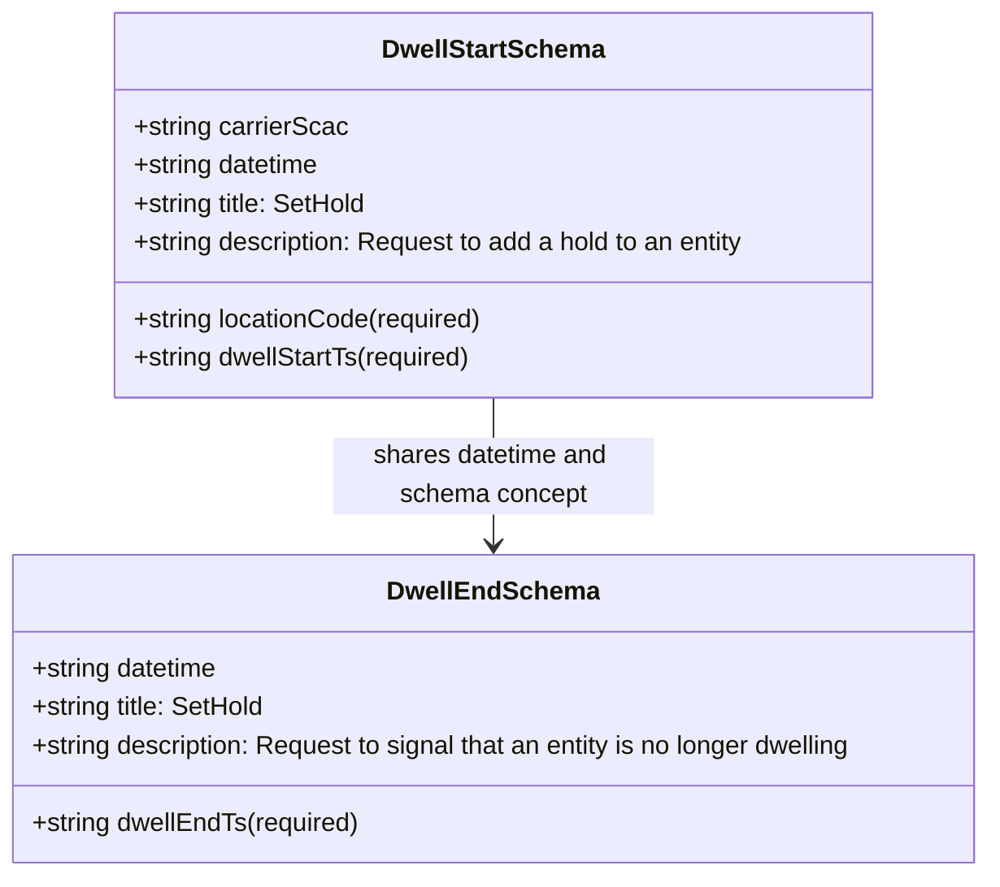

# Diagram: entity_core/entity_service/entity_service/common/json_schema/dwell_schema.py

> Auto-generated by Obscura crawlers

## Mermaid

### SVG

<svg id="container" width="630.015625" xmlns="http://www.w3.org/2000/svg" class="classDiagram" height="546" viewBox="0 0 630.015625 546" role="graphics-document document" aria-roledescription="class"><g><defs><marker id="container_class-aggregationStart" class="marker aggregation class" refX="18" refY="7" markerWidth="190" markerHeight="240" orient="auto"><path d="M 18,7 L9,13 L1,7 L9,1 Z"></path></marker></defs><defs><marker id="container_class-aggregationEnd" class="marker aggregation class" refX="1" refY="7" markerWidth="20" markerHeight="28" orient="auto"><path d="M 18,7 L9,13 L1,7 L9,1 Z"></path></marker></defs><defs><marker id="container_class-extensionStart" class="marker extension class" refX="18" refY="7" markerWidth="190" markerHeight="240" orient="auto"><path d="M 1,7 L18,13 V 1 Z"></path></marker></defs><defs><marker id="container_class-extensionEnd" class="marker extension class" refX="1" refY="7" markerWidth="20" markerHeight="28" orient="auto"><path d="M 1,1 V 13 L18,7 Z"></path></marker></defs><defs><marker id="container_class-compositionStart" class="marker composition class" refX="18" refY="7" markerWidth="190" markerHeight="240" orient="auto"><path d="M 18,7 L9,13 L1,7 L9,1 Z"></path></marker></defs><defs><marker id="container_class-compositionEnd" class="marker composition class" refX="1" refY="7" markerWidth="20" markerHeight="28" orient="auto"><path d="M 18,7 L9,13 L1,7 L9,1 Z"></path></marker></defs><defs><marker id="container_class-dependencyStart" class="marker dependency class" refX="6" refY="7" markerWidth="190" markerHeight="240" orient="auto"><path d="M 5,7 L9,13 L1,7 L9,1 Z"></path></marker></defs><defs><marker id="container_class-dependencyEnd" class="marker dependency class" refX="13" refY="7" markerWidth="20" markerHeight="28" orient="auto"><path d="M 18,7 L9,13 L14,7 L9,1 Z"></path></marker></defs><defs><marker id="container_class-lollipopStart" class="marker lollipop class" refX="13" refY="7" markerWidth="190" markerHeight="240" orient="auto"><circle stroke="black" fill="transparent" cx="7" cy="7" r="6"></circle></marker></defs><defs><marker id="container_class-lollipopEnd" class="marker lollipop class" refX="1" refY="7" markerWidth="190" markerHeight="240" orient="auto"><circle stroke="black" fill="transparent" cx="7" cy="7" r="6"></circle></marker></defs><g class="root"><g class="clusters"></g><g class="edgePaths"><path d="M315.008,248L315.008,256.167C315.008,264.333,315.008,280.667,315.008,296C315.008,311.333,315.008,325.667,315.008,332.833L315.008,340" id="id_DwellStartSchema_DwellEndSchema_1" class="edge-thickness-normal edge-pattern-solid relation" style=";;;" data-edge="true" data-et="edge" data-id="id_DwellStartSchema_DwellEndSchema_1" data-points="W3sieCI6MzE1LjAwNzgxMjUsInkiOjI0OH0seyJ4IjozMTUuMDA3ODEyNSwieSI6Mjk3fSx7IngiOjMxNS4wMDc4MTI1LCJ5IjozNDZ9XQ==" marker-end="url(#container_class-dependencyEnd)"></path></g><g class="edgeLabels"><g class="edgeLabel" transform="translate(315.0078125, 297)"><g class="label" data-id="id_DwellStartSchema_DwellEndSchema_1" transform="translate(-100, -24)"><foreignObject width="200" height="48">

shares datetime and schema concept

</foreignObject></g></g></g><g class="nodes"><g class="node default" id="classId-DwellStartSchema-0" transform="translate(315.0078125, 128)"><g class="basic label-container"><path d="M-241.8359375 -120 L241.8359375 -120 L241.8359375 120 L-241.8359375 120" stroke="none" stroke-width="0" fill="#ECECFF" style=""></path><path d="M-241.8359375 -120 C-97.16780128001045 -120, 47.5003349399791 -120, 241.8359375 -120 M-241.8359375 -120 C-70.93946448896327 -120, 99.95700852207347 -120, 241.8359375 -120 M241.8359375 -120 C241.8359375 -27.488421762005913, 241.8359375 65.02315647598817, 241.8359375 120 M241.8359375 -120 C241.8359375 -54.44154727424046, 241.8359375 11.116905451519074, 241.8359375 120 M241.8359375 120 C113.65502899225328 120, -14.525879515493443 120, -241.8359375 120 M241.8359375 120 C83.26816115981106 120, -75.29961518037788 120, -241.8359375 120 M-241.8359375 120 C-241.8359375 39.306287991011686, -241.8359375 -41.38742401797663, -241.8359375 -120 M-241.8359375 120 C-241.8359375 45.183912622004584, -241.8359375 -29.63217475599083, -241.8359375 -120" stroke="#9370DB" stroke-width="1.3" fill="none" stroke-dasharray="0 0" style=""></path></g><g class="annotation-group text" transform="translate(0, -96)"></g><g class="label-group text" transform="translate(-67.203125, -96)"><g class="label" style="font-weight: bolder" transform="translate(0,-12)"><foreignObject width="134.40625" height="24">

DwellStartSchema

</foreignObject></g></g><g class="members-group text" transform="translate(-229.8359375, -48)"><g class="label" style="" transform="translate(0,-12)"><foreignObject width="134.375" height="24">

+string carrierScac

</foreignObject></g><g class="label" style="" transform="translate(0,12)"><foreignObject width="119.109375" height="24">

+string datetime

</foreignObject></g><g class="label" style="" transform="translate(0,36)"><foreignObject width="148.796875" height="24">

+string title: SetHold

</foreignObject></g><g class="label" style="" transform="translate(0,60)"><foreignObject width="392.46875" height="24">

+string description: Request to add a hold to an entity

</foreignObject></g></g><g class="methods-group text" transform="translate(-229.8359375, 72)"><g class="label" style="" transform="translate(0,-12)"><foreignObject width="221.453125" height="24">

+string locationCode(required)

</foreignObject></g><g class="label" style="" transform="translate(0,12)"><foreignObject width="215.140625" height="24">

+string dwellStartTs(required)

</foreignObject></g></g><g class="divider" style=""><path d="M-241.8359375 -72 C-76.55693258440891 -72, 88.72207233118218 -72, 241.8359375 -72 M-241.8359375 -72 C-130.73215587931367 -72, -19.628374258627304 -72, 241.8359375 -72" stroke="#9370DB" stroke-width="1.3" fill="none" stroke-dasharray="0 0" style=""></path></g><g class="divider" style=""><path d="M-241.8359375 48 C-128.61249810096965 48, -15.389058701939291 48, 241.8359375 48 M-241.8359375 48 C-59.79888485555506 48, 122.23816778888988 48, 241.8359375 48" stroke="#9370DB" stroke-width="1.3" fill="none" stroke-dasharray="0 0" style=""></path></g></g><g class="node default" id="classId-DwellEndSchema-1" transform="translate(315.0078125, 442)"><g class="basic label-container"><path d="M-307.0078125 -96 L307.0078125 -96 L307.0078125 96 L-307.0078125 96" stroke="none" stroke-width="0" fill="#ECECFF" style=""></path><path d="M-307.0078125 -96 C-106.80659026156854 -96, 93.39463197686291 -96, 307.0078125 -96 M-307.0078125 -96 C-146.71063591909092 -96, 13.586540661818162 -96, 307.0078125 -96 M307.0078125 -96 C307.0078125 -35.79603341492628, 307.0078125 24.407933170147444, 307.0078125 96 M307.0078125 -96 C307.0078125 -54.240204910405296, 307.0078125 -12.480409820810593, 307.0078125 96 M307.0078125 96 C68.71857223775879 96, -169.57066802448242 96, -307.0078125 96 M307.0078125 96 C151.02133077076056 96, -4.965150958478887 96, -307.0078125 96 M-307.0078125 96 C-307.0078125 35.548578425638055, -307.0078125 -24.90284314872389, -307.0078125 -96 M-307.0078125 96 C-307.0078125 41.20553494221362, -307.0078125 -13.588930115572765, -307.0078125 -96" stroke="#9370DB" stroke-width="1.3" fill="none" stroke-dasharray="0 0" style=""></path></g><g class="annotation-group text" transform="translate(0, -72)"></g><g class="label-group text" transform="translate(-62.5, -72)"><g class="label" style="font-weight: bolder" transform="translate(0,-12)"><foreignObject width="125" height="24">

DwellEndSchema

</foreignObject></g></g><g class="members-group text" transform="translate(-295.0078125, -24)"><g class="label" style="" transform="translate(0,-12)"><foreignObject width="119.109375" height="24">

+string datetime

</foreignObject></g><g class="label" style="" transform="translate(0,12)"><foreignObject width="148.796875" height="24">

+string title: SetHold

</foreignObject></g><g class="label" style="" transform="translate(0,36)"><foreignObject width="527.515625" height="24">

+string description: Request to signal that an entity is no longer dwelling

</foreignObject></g></g><g class="methods-group text" transform="translate(-295.0078125, 72)"><g class="label" style="" transform="translate(0,-12)"><foreignObject width="207.453125" height="24">

+string dwellEndTs(required)

</foreignObject></g></g><g class="divider" style=""><path d="M-307.0078125 -48 C-63.96242798107042 -48, 179.08295653785916 -48, 307.0078125 -48 M-307.0078125 -48 C-141.3357152022032 -48, 24.336382095593592 -48, 307.0078125 -48" stroke="#9370DB" stroke-width="1.3" fill="none" stroke-dasharray="0 0" style=""></path></g><g class="divider" style=""><path d="M-307.0078125 48 C-116.76815906285375 48, 73.47149437429249 48, 307.0078125 48 M-307.0078125 48 C-62.56235560413418 48, 181.88310129173163 48, 307.0078125 48" stroke="#9370DB" stroke-width="1.3" fill="none" stroke-dasharray="0 0" style=""></path></g></g></g></g></g></svg>
