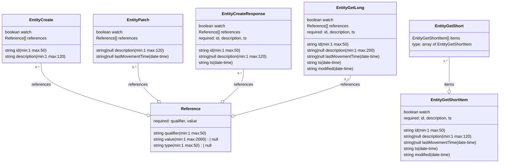

# Diagram: entity_core/entity_service/entity_service/common/json_schema/entity_schema.py

> Auto-generated by Obscura crawlers

## Mermaid

### SVG

<svg id="container" width="1995.70703125" xmlns="http://www.w3.org/2000/svg" class="classDiagram" height="642" viewBox="0 0 1995.70703125 642" role="graphics-document document" aria-roledescription="class"><g><defs><marker id="container_class-aggregationStart" class="marker aggregation class" refX="18" refY="7" markerWidth="190" markerHeight="240" orient="auto"><path d="M 18,7 L9,13 L1,7 L9,1 Z"></path></marker></defs><defs><marker id="container_class-aggregationEnd" class="marker aggregation class" refX="1" refY="7" markerWidth="20" markerHeight="28" orient="auto"><path d="M 18,7 L9,13 L1,7 L9,1 Z"></path></marker></defs><defs><marker id="container_class-extensionStart" class="marker extension class" refX="18" refY="7" markerWidth="190" markerHeight="240" orient="auto"><path d="M 1,7 L18,13 V 1 Z"></path></marker></defs><defs><marker id="container_class-extensionEnd" class="marker extension class" refX="1" refY="7" markerWidth="20" markerHeight="28" orient="auto"><path d="M 1,1 V 13 L18,7 Z"></path></marker></defs><defs><marker id="container_class-compositionStart" class="marker composition class" refX="18" refY="7" markerWidth="190" markerHeight="240" orient="auto"><path d="M 18,7 L9,13 L1,7 L9,1 Z"></path></marker></defs><defs><marker id="container_class-compositionEnd" class="marker composition class" refX="1" refY="7" markerWidth="20" markerHeight="28" orient="auto"><path d="M 18,7 L9,13 L1,7 L9,1 Z"></path></marker></defs><defs><marker id="container_class-dependencyStart" class="marker dependency class" refX="6" refY="7" markerWidth="190" markerHeight="240" orient="auto"><path d="M 5,7 L9,13 L1,7 L9,1 Z"></path></marker></defs><defs><marker id="container_class-dependencyEnd" class="marker dependency class" refX="13" refY="7" markerWidth="20" markerHeight="28" orient="auto"><path d="M 18,7 L9,13 L14,7 L9,1 Z"></path></marker></defs><defs><marker id="container_class-lollipopStart" class="marker lollipop class" refX="13" refY="7" markerWidth="190" markerHeight="240" orient="auto"><circle stroke="black" fill="transparent" cx="7" cy="7" r="6"></circle></marker></defs><defs><marker id="container_class-lollipopEnd" class="marker lollipop class" refX="1" refY="7" markerWidth="190" markerHeight="240" orient="auto"><circle stroke="black" fill="transparent" cx="7" cy="7" r="6"></circle></marker></defs><g class="root"><g class="clusters"></g><g class="edgePaths"><path d="M161.441,248L161.441,262.167C161.441,276.333,161.441,304.667,231.654,338.722C301.866,372.778,442.291,412.557,512.503,432.446L582.716,452.335" id="id_EntityCreate_Reference_1" class="edge-thickness-normal edge-pattern-solid relation" style=";;;" data-edge="true" data-et="edge" data-id="id_EntityCreate_Reference_1" data-points="W3sieCI6MTYxLjQ0MTQwNjI1LCJ5IjoyNDh9LHsieCI6MTYxLjQ0MTQwNjI1LCJ5IjozMzN9LHsieCI6NTk5LjMxMjUsInkiOjQ1Ny4wMzYyNDA0MjQyNzgxNn1d" marker-end="url(#container_class-aggregationEnd)"></path><path d="M547.52,248L547.52,262.167C547.52,276.333,547.52,304.667,560.434,329.2C573.348,353.734,599.176,374.468,612.09,384.834L625.004,395.201" id="id_EntityPatch_Reference_2" class="edge-thickness-normal edge-pattern-solid relation" style=";;;" data-edge="true" data-et="edge" data-id="id_EntityPatch_Reference_2" data-points="W3sieCI6NTQ3LjUxOTUzMTI1LCJ5IjoyNDh9LHsieCI6NTQ3LjUxOTUzMTI1LCJ5IjozMzN9LHsieCI6NjM4LjQ1NTY5MDY0MzQ5MTIsInkiOjQwNn1d" marker-end="url(#container_class-aggregationEnd)"></path><path d="M968.566,272L968.566,282.167C968.566,292.333,968.566,312.667,955.652,333.2C942.738,353.734,916.91,374.468,903.996,384.834L891.082,395.201" id="id_EntityCreateResponse_Reference_3" class="edge-thickness-normal edge-pattern-solid relation" style=";;;" data-edge="true" data-et="edge" data-id="id_EntityCreateResponse_Reference_3" data-points="W3sieCI6OTY4LjU2NjQwNjI1LCJ5IjoyNzJ9LHsieCI6OTY4LjU2NjQwNjI1LCJ5IjozMzN9LHsieCI6ODc3LjYzMDI0Njg1NjUwODgsInkiOjQwNn1d" marker-end="url(#container_class-aggregationEnd)"></path><path d="M1394.664,296L1394.664,302.167C1394.664,308.333,1394.664,320.667,1317.794,347.239C1240.925,373.812,1087.185,414.625,1010.316,435.031L933.446,455.437" id="id_EntityGetLong_Reference_4" class="edge-thickness-normal edge-pattern-solid relation" style=";;;" data-edge="true" data-et="edge" data-id="id_EntityGetLong_Reference_4" data-points="W3sieCI6MTM5NC42NjQwNjI1LCJ5IjoyOTZ9LHsieCI6MTM5NC42NjQwNjI1LCJ5IjozMzN9LHsieCI6OTE2Ljc3MzQzNzUsInkiOjQ1OS44NjI3NzAzNjM1NTI2N31d" marker-end="url(#container_class-aggregationEnd)"></path><path d="M1790.508,224L1790.508,242.167C1790.508,260.333,1790.508,296.667,1790.508,318.125C1790.508,339.583,1790.508,346.167,1790.508,349.458L1790.508,352.75" id="id_EntityGetShort_EntityGetShortItem_5" class="edge-thickness-normal edge-pattern-solid relation" style=";;;" data-edge="true" data-et="edge" data-id="id_EntityGetShort_EntityGetShortItem_5" data-points="W3sieCI6MTc5MC41MDc4MTI1LCJ5IjoyMjR9LHsieCI6MTc5MC41MDc4MTI1LCJ5IjozMzN9LHsieCI6MTc5MC41MDc4MTI1LCJ5IjozNzB9XQ==" marker-end="url(#container_class-aggregationEnd)"></path></g><g class="edgeLabels"><g class="edgeLabel" transform="translate(161.44140625, 333)"><g class="label" data-id="id_EntityCreate_Reference_1" transform="translate(-37.828125, -12)"><foreignObject width="75.65625" height="24">

references

</foreignObject></g></g><g class="edgeLabel" transform="translate(547.51953125, 333)"><g class="label" data-id="id_EntityPatch_Reference_2" transform="translate(-37.828125, -12)"><foreignObject width="75.65625" height="24">

references

</foreignObject></g></g><g class="edgeLabel" transform="translate(968.56640625, 333)"><g class="label" data-id="id_EntityCreateResponse_Reference_3" transform="translate(-37.828125, -12)"><foreignObject width="75.65625" height="24">

references

</foreignObject></g></g><g class="edgeLabel" transform="translate(1394.6640625, 333)"><g class="label" data-id="id_EntityGetLong_Reference_4" transform="translate(-37.828125, -12)"><foreignObject width="75.65625" height="24">

references

</foreignObject></g></g><g class="edgeLabel" transform="translate(1790.5078125, 333)"><g class="label" data-id="id_EntityGetShort_EntityGetShortItem_5" transform="translate(-19.9765625, -12)"><foreignObject width="39.953125" height="24">

items

</foreignObject></g></g><g class="edgeTerminals" transform="translate(146.4414081250001, 265.50000160714285)"><g class="inner" transform="translate(0, 0)"><foreignObject style="width: 36px; height: 12px;">
0..*
</foreignObject></g></g><g class="edgeTerminals" transform="translate(532.519530625, 265.49999946428574)"><g class="inner" transform="translate(0, 0)"><foreignObject style="width: 36px; height: 12px;">
0..*
</foreignObject></g></g><g class="edgeTerminals" transform="translate(953.5664081250001, 289.50000160714285)"><g class="inner" transform="translate(0, 0)"><foreignObject style="width: 36px; height: 12px;">
0..*
</foreignObject></g></g><g class="edgeTerminals" transform="translate(1379.66406125, 313.4999989285715)"><g class="inner" transform="translate(0, 0)"><foreignObject style="width: 36px; height: 12px;">
0..*
</foreignObject></g></g><g class="edgeTerminals" transform="translate(1775.50781125, 241.49999892857144)"><g class="inner" transform="translate(0, 0)"><foreignObject style="width: 36px; height: 12px;">
1..*
</foreignObject></g></g></g><g class="nodes"><g class="node default" id="classId-Reference-0" transform="translate(758.04296875, 502)"><g class="basic label-container"><path d="M-158.73046875 -96 L158.73046875 -96 L158.73046875 96 L-158.73046875 96" stroke="none" stroke-width="0" fill="#ECECFF" style=""></path><path d="M-158.73046875 -96 C-63.3713292764085 -96, 31.987810197182995 -96, 158.73046875 -96 M-158.73046875 -96 C-32.02463566945883 -96, 94.68119741108234 -96, 158.73046875 -96 M158.73046875 -96 C158.73046875 -54.27936866831625, 158.73046875 -12.558737336632504, 158.73046875 96 M158.73046875 -96 C158.73046875 -41.54272123227361, 158.73046875 12.914557535452786, 158.73046875 96 M158.73046875 96 C89.79605237703507 96, 20.861636004070135 96, -158.73046875 96 M158.73046875 96 C61.9980714625775 96, -34.734325824845 96, -158.73046875 96 M-158.73046875 96 C-158.73046875 49.334393836739316, -158.73046875 2.668787673478633, -158.73046875 -96 M-158.73046875 96 C-158.73046875 43.60979002314893, -158.73046875 -8.780419953702136, -158.73046875 -96" stroke="#9370DB" stroke-width="1.3" fill="none" stroke-dasharray="0 0" style=""></path></g><g class="annotation-group text" transform="translate(0, -72)"></g><g class="label-group text" transform="translate(-36.5078125, -72)"><g class="label" style="font-weight: bolder" transform="translate(0,-12)"><foreignObject width="73.015625" height="24">

Reference

</foreignObject></g></g><g class="members-group text" transform="translate(-146.73046875, -24)"><g class="label" style="" transform="translate(0,-12)"><foreignObject width="176.28125" height="24">

required: qualifier, value

</foreignObject></g></g><g class="methods-group text" transform="translate(-146.73046875, 24)"><g class="label" style="" transform="translate(0,-12)"><foreignObject width="210.03125" height="24">

string qualifier(min:1 max:50)

</foreignObject></g><g class="label" style="" transform="translate(0,12)"><foreignObject width="256.953125" height="24">

string value(min:1 max:2000) : | null

</foreignObject></g><g class="label" style="" transform="translate(0,36)"><foreignObject width="232.171875" height="24">

string type(min:1 max:50) : | null

</foreignObject></g></g><g class="divider" style=""><path d="M-158.73046875 -48 C-38.510354344266446 -48, 81.70976006146711 -48, 158.73046875 -48 M-158.73046875 -48 C-93.25043443405964 -48, -27.770400118119284 -48, 158.73046875 -48" stroke="#9370DB" stroke-width="1.3" fill="none" stroke-dasharray="0 0" style=""></path></g><g class="divider" style=""><path d="M-158.73046875 0 C-74.37872257665 0, 9.973023596699989 0, 158.73046875 0 M-158.73046875 0 C-36.94540439517773 0, 84.83965995964454 0, 158.73046875 0" stroke="#9370DB" stroke-width="1.3" fill="none" stroke-dasharray="0 0" style=""></path></g></g><g class="node default" id="classId-EntityCreate-1" transform="translate(161.44140625, 152)"><g class="basic label-container"><path d="M-153.44140625 -96 L153.44140625 -96 L153.44140625 96 L-153.44140625 96" stroke="none" stroke-width="0" fill="#ECECFF" style=""></path><path d="M-153.44140625 -96 C-40.78223093237318 -96, 71.87694438525364 -96, 153.44140625 -96 M-153.44140625 -96 C-31.103812324759502 -96, 91.233781600481 -96, 153.44140625 -96 M153.44140625 -96 C153.44140625 -47.89558058920674, 153.44140625 0.20883882158652511, 153.44140625 96 M153.44140625 -96 C153.44140625 -39.5544761827027, 153.44140625 16.8910476345946, 153.44140625 96 M153.44140625 96 C67.6660364565704 96, -18.10933333685921 96, -153.44140625 96 M153.44140625 96 C59.02583440535052 96, -35.389737439298955 96, -153.44140625 96 M-153.44140625 96 C-153.44140625 53.50073885234387, -153.44140625 11.001477704687744, -153.44140625 -96 M-153.44140625 96 C-153.44140625 56.31433456115066, -153.44140625 16.628669122301318, -153.44140625 -96" stroke="#9370DB" stroke-width="1.3" fill="none" stroke-dasharray="0 0" style=""></path></g><g class="annotation-group text" transform="translate(0, -72)"></g><g class="label-group text" transform="translate(-44.8359375, -72)"><g class="label" style="font-weight: bolder" transform="translate(0,-12)"><foreignObject width="89.671875" height="24">

EntityCreate

</foreignObject></g></g><g class="members-group text" transform="translate(-141.44140625, -24)"><g class="label" style="" transform="translate(0,-12)"><foreignObject width="106.234375" height="24">

boolean watch

</foreignObject></g><g class="label" style="" transform="translate(0,12)"><foreignObject width="162.125" height="24">

Reference[] references

</foreignObject></g></g><g class="methods-group text" transform="translate(-141.44140625, 48)"><g class="label" style="" transform="translate(0,-12)"><foreignObject width="163.390625" height="24">

string id(min:1 max:50)

</foreignObject></g><g class="label" style="" transform="translate(0,12)"><foreignObject width="238.046875" height="24">

string description(min:1 max:120)

</foreignObject></g></g><g class="divider" style=""><path d="M-153.44140625 -48 C-91.76754765756498 -48, -30.09368906512995 -48, 153.44140625 -48 M-153.44140625 -48 C-76.22256376459103 -48, 0.9962787208179407 -48, 153.44140625 -48" stroke="#9370DB" stroke-width="1.3" fill="none" stroke-dasharray="0 0" style=""></path></g><g class="divider" style=""><path d="M-153.44140625 24 C-84.36876570804895 24, -15.296125166097909 24, 153.44140625 24 M-153.44140625 24 C-84.93454544473248 24, -16.427684639464957 24, 153.44140625 24" stroke="#9370DB" stroke-width="1.3" fill="none" stroke-dasharray="0 0" style=""></path></g></g><g class="node default" id="classId-EntityPatch-2" transform="translate(547.51953125, 152)"><g class="basic label-container"><path d="M-182.63671875 -96 L182.63671875 -96 L182.63671875 96 L-182.63671875 96" stroke="none" stroke-width="0" fill="#ECECFF" style=""></path><path d="M-182.63671875 -96 C-52.61405172801881 -96, 77.40861529396238 -96, 182.63671875 -96 M-182.63671875 -96 C-70.3505296285622 -96, 41.9356594928756 -96, 182.63671875 -96 M182.63671875 -96 C182.63671875 -40.66531571186154, 182.63671875 14.669368576276923, 182.63671875 96 M182.63671875 -96 C182.63671875 -19.657945287668298, 182.63671875 56.684109424663404, 182.63671875 96 M182.63671875 96 C53.54520652892381 96, -75.54630569215237 96, -182.63671875 96 M182.63671875 96 C69.14277023351292 96, -44.35117828297416 96, -182.63671875 96 M-182.63671875 96 C-182.63671875 25.900712232315186, -182.63671875 -44.19857553536963, -182.63671875 -96 M-182.63671875 96 C-182.63671875 57.127209449572064, -182.63671875 18.254418899144127, -182.63671875 -96" stroke="#9370DB" stroke-width="1.3" fill="none" stroke-dasharray="0 0" style=""></path></g><g class="annotation-group text" transform="translate(0, -72)"></g><g class="label-group text" transform="translate(-41.4453125, -72)"><g class="label" style="font-weight: bolder" transform="translate(0,-12)"><foreignObject width="82.890625" height="24">

EntityPatch

</foreignObject></g></g><g class="members-group text" transform="translate(-170.63671875, -24)"><g class="label" style="" transform="translate(0,-12)"><foreignObject width="106.234375" height="24">

boolean watch

</foreignObject></g><g class="label" style="" transform="translate(0,12)"><foreignObject width="162.125" height="24">

Reference[] references

</foreignObject></g></g><g class="methods-group text" transform="translate(-170.63671875, 48)"><g class="label" style="" transform="translate(0,-12)"><foreignObject width="272.546875" height="24">

string|null description(min:1 max:120)

</foreignObject></g><g class="label" style="" transform="translate(0,12)"><foreignObject width="299.828125" height="24">

string|null lastMovementTime(date-time)

</foreignObject></g></g><g class="divider" style=""><path d="M-182.63671875 -48 C-97.24369800113105 -48, -11.850677252262102 -48, 182.63671875 -48 M-182.63671875 -48 C-83.56185302919357 -48, 15.513012691612857 -48, 182.63671875 -48" stroke="#9370DB" stroke-width="1.3" fill="none" stroke-dasharray="0 0" style=""></path></g><g class="divider" style=""><path d="M-182.63671875 24 C-107.00931505980981 24, -31.381911369619615 24, 182.63671875 24 M-182.63671875 24 C-68.54031497178667 24, 45.55608880642666 24, 182.63671875 24" stroke="#9370DB" stroke-width="1.3" fill="none" stroke-dasharray="0 0" style=""></path></g></g><g class="node default" id="classId-EntityCreateResponse-3" transform="translate(968.56640625, 152)"><g class="basic label-container"><path d="M-188.41015625 -120 L188.41015625 -120 L188.41015625 120 L-188.41015625 120" stroke="none" stroke-width="0" fill="#ECECFF" style=""></path><path d="M-188.41015625 -120 C-91.93716027391929 -120, 4.535835702161421 -120, 188.41015625 -120 M-188.41015625 -120 C-109.61536512671728 -120, -30.820574003434558 -120, 188.41015625 -120 M188.41015625 -120 C188.41015625 -59.51579824697232, 188.41015625 0.9684035060553668, 188.41015625 120 M188.41015625 -120 C188.41015625 -67.70110324394935, 188.41015625 -15.40220648789871, 188.41015625 120 M188.41015625 120 C49.4369259813931 120, -89.5363042872138 120, -188.41015625 120 M188.41015625 120 C57.743206387772204 120, -72.92374347445559 120, -188.41015625 120 M-188.41015625 120 C-188.41015625 69.68865757030429, -188.41015625 19.377315140608573, -188.41015625 -120 M-188.41015625 120 C-188.41015625 24.947125029805733, -188.41015625 -70.10574994038853, -188.41015625 -120" stroke="#9370DB" stroke-width="1.3" fill="none" stroke-dasharray="0 0" style=""></path></g><g class="annotation-group text" transform="translate(0, -96)"></g><g class="label-group text" transform="translate(-80.2734375, -96)"><g class="label" style="font-weight: bolder" transform="translate(0,-12)"><foreignObject width="160.546875" height="24">

EntityCreateResponse

</foreignObject></g></g><g class="members-group text" transform="translate(-176.41015625, -48)"><g class="label" style="" transform="translate(0,-12)"><foreignObject width="106.234375" height="24">

boolean watch

</foreignObject></g><g class="label" style="" transform="translate(0,12)"><foreignObject width="162.125" height="24">

Reference[] references

</foreignObject></g><g class="label" style="" transform="translate(0,36)"><foreignObject width="195.96875" height="24">

required: id, description, ts

</foreignObject></g></g><g class="methods-group text" transform="translate(-176.41015625, 48)"><g class="label" style="" transform="translate(0,-12)"><foreignObject width="163.390625" height="24">

string id(min:1 max:50)

</foreignObject></g><g class="label" style="" transform="translate(0,12)"><foreignObject width="272.546875" height="24">

string|null description(min:1 max:120)

</foreignObject></g><g class="label" style="" transform="translate(0,36)"><foreignObject width="141.109375" height="24">

string ts(date-time)

</foreignObject></g></g><g class="divider" style=""><path d="M-188.41015625 -72 C-37.900173245515845 -72, 112.60980975896831 -72, 188.41015625 -72 M-188.41015625 -72 C-100.77057441793218 -72, -13.130992585864362 -72, 188.41015625 -72" stroke="#9370DB" stroke-width="1.3" fill="none" stroke-dasharray="0 0" style=""></path></g><g class="divider" style=""><path d="M-188.41015625 24 C-80.30951212173896 24, 27.791132006522076 24, 188.41015625 24 M-188.41015625 24 C-93.53424541756058 24, 1.3416654148788325 24, 188.41015625 24" stroke="#9370DB" stroke-width="1.3" fill="none" stroke-dasharray="0 0" style=""></path></g></g><g class="node default" id="classId-EntityGetShortItem-4" transform="translate(1790.5078125, 502)"><g class="basic label-container"><path d="M-197.19921875 -132 L197.19921875 -132 L197.19921875 132 L-197.19921875 132" stroke="none" stroke-width="0" fill="#ECECFF" style=""></path><path d="M-197.19921875 -132 C-46.48576696891254 -132, 104.22768481217491 -132, 197.19921875 -132 M-197.19921875 -132 C-78.30118048667347 -132, 40.59685777665305 -132, 197.19921875 -132 M197.19921875 -132 C197.19921875 -36.295779577142824, 197.19921875 59.40844084571435, 197.19921875 132 M197.19921875 -132 C197.19921875 -42.119335122371496, 197.19921875 47.76132975525701, 197.19921875 132 M197.19921875 132 C86.99998849745447 132, -23.199241755091066 132, -197.19921875 132 M197.19921875 132 C53.44718395539269 132, -90.30485083921462 132, -197.19921875 132 M-197.19921875 132 C-197.19921875 64.2705145175876, -197.19921875 -3.4589709648248004, -197.19921875 -132 M-197.19921875 132 C-197.19921875 55.22216422286206, -197.19921875 -21.555671554275875, -197.19921875 -132" stroke="#9370DB" stroke-width="1.3" fill="none" stroke-dasharray="0 0" style=""></path></g><g class="annotation-group text" transform="translate(0, -108)"></g><g class="label-group text" transform="translate(-70.5703125, -108)"><g class="label" style="font-weight: bolder" transform="translate(0,-12)"><foreignObject width="141.140625" height="24">

EntityGetShortItem

</foreignObject></g></g><g class="members-group text" transform="translate(-185.19921875, -60)"><g class="label" style="" transform="translate(0,-12)"><foreignObject width="106.234375" height="24">

boolean watch

</foreignObject></g><g class="label" style="" transform="translate(0,12)"><foreignObject width="195.96875" height="24">

required: id, description, ts

</foreignObject></g></g><g class="methods-group text" transform="translate(-185.19921875, 12)"><g class="label" style="" transform="translate(0,-12)"><foreignObject width="163.390625" height="24">

string id(min:1 max:50)

</foreignObject></g><g class="label" style="" transform="translate(0,12)"><foreignObject width="272.546875" height="24">

string|null description(min:1 max:120)

</foreignObject></g><g class="label" style="" transform="translate(0,36)"><foreignObject width="299.828125" height="24">

string|null lastMovementTime(date-time)

</foreignObject></g><g class="label" style="" transform="translate(0,60)"><foreignObject width="141.109375" height="24">

string ts(date-time)

</foreignObject></g><g class="label" style="" transform="translate(0,84)"><foreignObject width="192.484375" height="24">

string modified(date-time)

</foreignObject></g></g><g class="divider" style=""><path d="M-197.19921875 -84 C-46.63199771056733 -84, 103.93522332886533 -84, 197.19921875 -84 M-197.19921875 -84 C-66.86989456927921 -84, 63.45942961144158 -84, 197.19921875 -84" stroke="#9370DB" stroke-width="1.3" fill="none" stroke-dasharray="0 0" style=""></path></g><g class="divider" style=""><path d="M-197.19921875 -12 C-109.04158109321062 -12, -20.883943436421248 -12, 197.19921875 -12 M-197.19921875 -12 C-65.58005101967382 -12, 66.03911671065237 -12, 197.19921875 -12" stroke="#9370DB" stroke-width="1.3" fill="none" stroke-dasharray="0 0" style=""></path></g></g><g class="node default" id="classId-EntityGetShort-5" transform="translate(1790.5078125, 152)"><g class="basic label-container"><path d="M-158.15625 -72 L158.15625 -72 L158.15625 72 L-158.15625 72" stroke="none" stroke-width="0" fill="#ECECFF" style=""></path><path d="M-158.15625 -72 C-59.96811392557548 -72, 38.22002214884904 -72, 158.15625 -72 M-158.15625 -72 C-41.089544616012006 -72, 75.97716076797599 -72, 158.15625 -72 M158.15625 -72 C158.15625 -21.31498871779396, 158.15625 29.370022564412082, 158.15625 72 M158.15625 -72 C158.15625 -21.155340432598003, 158.15625 29.689319134803995, 158.15625 72 M158.15625 72 C69.78399109889081 72, -18.588267802218382 72, -158.15625 72 M158.15625 72 C80.47159813171473 72, 2.7869462634294564 72, -158.15625 72 M-158.15625 72 C-158.15625 36.64280723418719, -158.15625 1.2856144683743764, -158.15625 -72 M-158.15625 72 C-158.15625 34.33488458092667, -158.15625 -3.3302308381466617, -158.15625 -72" stroke="#9370DB" stroke-width="1.3" fill="none" stroke-dasharray="0 0" style=""></path></g><g class="annotation-group text" transform="translate(0, -48)"></g><g class="label-group text" transform="translate(-54.109375, -48)"><g class="label" style="font-weight: bolder" transform="translate(0,-12)"><foreignObject width="108.21875" height="24">

EntityGetShort

</foreignObject></g></g><g class="members-group text" transform="translate(-146.15625, 0)"><g class="label" style="" transform="translate(0,-12)"><foreignObject width="192.8125" height="24">

EntityGetShortItem[] items

</foreignObject></g><g class="label" style="" transform="translate(0,12)"><foreignObject width="238.203125" height="24">

type: array of EntityGetShortItem

</foreignObject></g></g><g class="methods-group text" transform="translate(-146.15625, 72)"></g><g class="divider" style=""><path d="M-158.15625 -24 C-80.68379401319098 -24, -3.211338026381952 -24, 158.15625 -24 M-158.15625 -24 C-60.81543650736532 -24, 36.52537698526936 -24, 158.15625 -24" stroke="#9370DB" stroke-width="1.3" fill="none" stroke-dasharray="0 0" style=""></path></g><g class="divider" style=""><path d="M-158.15625 48 C-40.450917717306496 48, 77.25441456538701 48, 158.15625 48 M-158.15625 48 C-75.92438113870239 48, 6.307487722595226 48, 158.15625 48" stroke="#9370DB" stroke-width="1.3" fill="none" stroke-dasharray="0 0" style=""></path></g></g><g class="node default" id="classId-EntityGetLong-6" transform="translate(1394.6640625, 152)"><g class="basic label-container"><path d="M-187.6875 -144 L187.6875 -144 L187.6875 144 L-187.6875 144" stroke="none" stroke-width="0" fill="#ECECFF" style=""></path><path d="M-187.6875 -144 C-72.65036096362776 -144, 42.38677807274448 -144, 187.6875 -144 M-187.6875 -144 C-51.85685058988622 -144, 83.97379882022756 -144, 187.6875 -144 M187.6875 -144 C187.6875 -55.34634713828814, 187.6875 33.307305723423724, 187.6875 144 M187.6875 -144 C187.6875 -56.68334400762231, 187.6875 30.63331198475538, 187.6875 144 M187.6875 144 C48.83204426072794 144, -90.02341147854412 144, -187.6875 144 M187.6875 144 C106.97804786177363 144, 26.268595723547264 144, -187.6875 144 M-187.6875 144 C-187.6875 33.211715820557544, -187.6875 -77.57656835888491, -187.6875 -144 M-187.6875 144 C-187.6875 36.35207497492492, -187.6875 -71.29585005015016, -187.6875 -144" stroke="#9370DB" stroke-width="1.3" fill="none" stroke-dasharray="0 0" style=""></path></g><g class="annotation-group text" transform="translate(0, -120)"></g><g class="label-group text" transform="translate(-51.546875, -120)"><g class="label" style="font-weight: bolder" transform="translate(0,-12)"><foreignObject width="103.09375" height="24">

EntityGetLong

</foreignObject></g></g><g class="members-group text" transform="translate(-175.6875, -72)"><g class="label" style="" transform="translate(0,-12)"><foreignObject width="106.234375" height="24">

boolean watch

</foreignObject></g><g class="label" style="" transform="translate(0,12)"><foreignObject width="162.125" height="24">

Reference[] references

</foreignObject></g><g class="label" style="" transform="translate(0,36)"><foreignObject width="195.96875" height="24">

required: id, description, ts

</foreignObject></g></g><g class="methods-group text" transform="translate(-175.6875, 24)"><g class="label" style="" transform="translate(0,-12)"><foreignObject width="163.390625" height="24">

string id(min:1 max:50)

</foreignObject></g><g class="label" style="" transform="translate(0,12)"><foreignObject width="275.1875" height="24">

string|null description(min:1 max:200)

</foreignObject></g><g class="label" style="" transform="translate(0,36)"><foreignObject width="299.828125" height="24">

string|null lastMovementTime(date-time)

</foreignObject></g><g class="label" style="" transform="translate(0,60)"><foreignObject width="141.109375" height="24">

string ts(date-time)

</foreignObject></g><g class="label" style="" transform="translate(0,84)"><foreignObject width="192.484375" height="24">

string modified(date-time)

</foreignObject></g></g><g class="divider" style=""><path d="M-187.6875 -96 C-40.942652768177595 -96, 105.80219446364481 -96, 187.6875 -96 M-187.6875 -96 C-92.64371919090226 -96, 2.4000616181954797 -96, 187.6875 -96" stroke="#9370DB" stroke-width="1.3" fill="none" stroke-dasharray="0 0" style=""></path></g><g class="divider" style=""><path d="M-187.6875 0 C-55.44499377616893 0, 76.79751244766214 0, 187.6875 0 M-187.6875 0 C-53.689029319198795 0, 80.30944136160241 0, 187.6875 0" stroke="#9370DB" stroke-width="1.3" fill="none" stroke-dasharray="0 0" style=""></path></g></g></g></g></g></svg>
