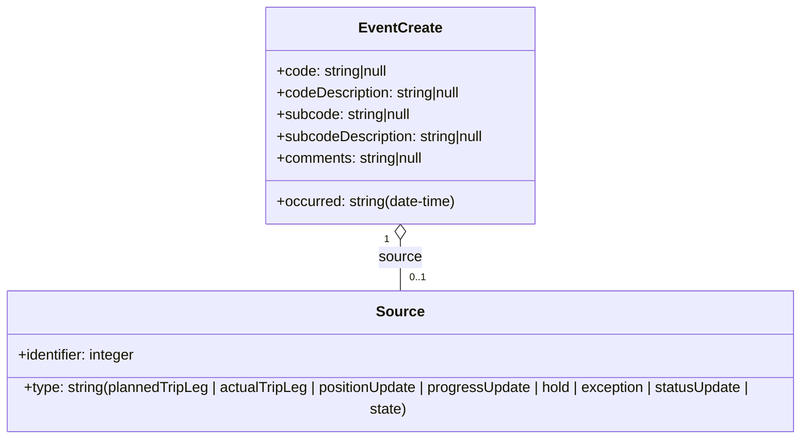
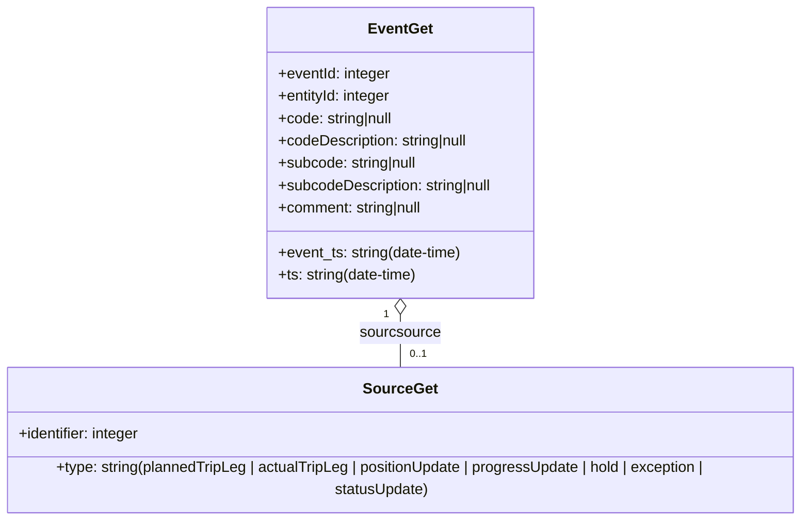

# Diagram: entity_core/entity_service/entity_service/common/json_schema/event_schema.py

> Auto-generated by Obscura crawlers

## Diagram 1

### SVG

<svg id="container" width="942.7890625" xmlns="http://www.w3.org/2000/svg" class="classDiagram" height="474" viewBox="0 0 942.7890625 474" role="graphics-document document" aria-roledescription="class"><g><defs><marker id="container_class-aggregationStart" class="marker aggregation class" refX="18" refY="7" markerWidth="190" markerHeight="240" orient="auto"><path d="M 18,7 L9,13 L1,7 L9,1 Z"></path></marker></defs><defs><marker id="container_class-aggregationEnd" class="marker aggregation class" refX="1" refY="7" markerWidth="20" markerHeight="28" orient="auto"><path d="M 18,7 L9,13 L1,7 L9,1 Z"></path></marker></defs><defs><marker id="container_class-extensionStart" class="marker extension class" refX="18" refY="7" markerWidth="190" markerHeight="240" orient="auto"><path d="M 1,7 L18,13 V 1 Z"></path></marker></defs><defs><marker id="container_class-extensionEnd" class="marker extension class" refX="1" refY="7" markerWidth="20" markerHeight="28" orient="auto"><path d="M 1,1 V 13 L18,7 Z"></path></marker></defs><defs><marker id="container_class-compositionStart" class="marker composition class" refX="18" refY="7" markerWidth="190" markerHeight="240" orient="auto"><path d="M 18,7 L9,13 L1,7 L9,1 Z"></path></marker></defs><defs><marker id="container_class-compositionEnd" class="marker composition class" refX="1" refY="7" markerWidth="20" markerHeight="28" orient="auto"><path d="M 18,7 L9,13 L1,7 L9,1 Z"></path></marker></defs><defs><marker id="container_class-dependencyStart" class="marker dependency class" refX="6" refY="7" markerWidth="190" markerHeight="240" orient="auto"><path d="M 5,7 L9,13 L1,7 L9,1 Z"></path></marker></defs><defs><marker id="container_class-dependencyEnd" class="marker dependency class" refX="13" refY="7" markerWidth="20" markerHeight="28" orient="auto"><path d="M 18,7 L9,13 L14,7 L9,1 Z"></path></marker></defs><defs><marker id="container_class-lollipopStart" class="marker lollipop class" refX="13" refY="7" markerWidth="190" markerHeight="240" orient="auto"><circle stroke="black" fill="transparent" cx="7" cy="7" r="6"></circle></marker></defs><defs><marker id="container_class-lollipopEnd" class="marker lollipop class" refX="1" refY="7" markerWidth="190" markerHeight="240" orient="auto"><circle stroke="black" fill="transparent" cx="7" cy="7" r="6"></circle></marker></defs><g class="root"><g class="clusters"></g><g class="edgePaths"><path d="M471.395,265.25L471.395,268.542C471.395,271.833,471.395,278.417,471.395,287.875C471.395,297.333,471.395,309.667,471.395,315.833L471.395,322" id="id_EventCreate_Source_1" class="edge-thickness-normal edge-pattern-solid relation" style=";;;" data-edge="true" data-et="edge" data-id="id_EventCreate_Source_1" data-points="W3sieCI6NDcxLjM5NDUzMTI1LCJ5IjoyNDh9LHsieCI6NDcxLjM5NDUzMTI1LCJ5IjoyODV9LHsieCI6NDcxLjM5NDUzMTI1LCJ5IjozMjJ9XQ==" marker-start="url(#container_class-aggregationStart)"></path></g><g class="edgeLabels"><g class="edgeLabel" transform="translate(471.39453125, 285)"><g class="label" data-id="id_EventCreate_Source_1" transform="translate(-23.9375, -12)"><foreignObject width="47.875" height="24">

source

</foreignObject></g></g><g class="edgeTerminals" transform="translate(456.394530625, 265.4999994642857)"><g class="inner" transform="translate(0, 0)"><foreignObject style="width: 9px; height: 12px;">
1
</foreignObject></g></g><g class="edgeTerminals" transform="translate(481.394530625, 299.4999994642857)"><g class="inner" transform="translate(0, 0)"></g><foreignObject style="width: 36px; height: 12px;">
0..1
</foreignObject></g></g><g class="nodes"><g class="node default" id="classId-EventCreate-0" transform="translate(471.39453125, 128)"><g class="basic label-container"><path d="M-152.2890625 -120 L152.2890625 -120 L152.2890625 120 L-152.2890625 120" stroke="none" stroke-width="0" fill="#ECECFF" style=""></path><path d="M-152.2890625 -120 C-65.19039355983496 -120, 21.908275380330082 -120, 152.2890625 -120 M-152.2890625 -120 C-41.45957349039588 -120, 69.36991551920823 -120, 152.2890625 -120 M152.2890625 -120 C152.2890625 -69.97702488828767, 152.2890625 -19.954049776575346, 152.2890625 120 M152.2890625 -120 C152.2890625 -62.807553842389, 152.2890625 -5.615107684777996, 152.2890625 120 M152.2890625 120 C76.9361034493719 120, 1.5831443987437979 120, -152.2890625 120 M152.2890625 120 C74.55653676288212 120, -3.1759889742357643 120, -152.2890625 120 M-152.2890625 120 C-152.2890625 66.96262499870369, -152.2890625 13.925249997407377, -152.2890625 -120 M-152.2890625 120 C-152.2890625 53.01665434155794, -152.2890625 -13.966691316884123, -152.2890625 -120" stroke="#9370DB" stroke-width="1.3" fill="none" stroke-dasharray="0 0" style=""></path></g><g class="annotation-group text" transform="translate(0, -96)"></g><g class="label-group text" transform="translate(-43.765625, -96)"><g class="label" style="font-weight: bolder" transform="translate(0,-12)"><foreignObject width="87.53125" height="24">

EventCreate

</foreignObject></g></g><g class="members-group text" transform="translate(-140.2890625, -48)"><g class="label" style="" transform="translate(0,-12)"><foreignObject width="127.171875" height="24">

+code: string|null

</foreignObject></g><g class="label" style="" transform="translate(0,12)"><foreignObject width="210.515625" height="24">

+codeDescription: string|null

</foreignObject></g><g class="label" style="" transform="translate(0,36)"><foreignObject width="153.46875" height="24">

+subcode: string|null

</foreignObject></g><g class="label" style="" transform="translate(0,60)"><foreignObject width="236.8125" height="24">

+subcodeDescription: string|null

</foreignObject></g><g class="label" style="" transform="translate(0,84)"><foreignObject width="167.65625" height="24">

+comments: string|null

</foreignObject></g></g><g class="methods-group text" transform="translate(-140.2890625, 96)"><g class="label" style="" transform="translate(0,-12)"><foreignObject width="203.3125" height="24">

+occurred: string(date-time)

</foreignObject></g></g><g class="divider" style=""><path d="M-152.2890625 -72 C-66.3472285822142 -72, 19.5946053355716 -72, 152.2890625 -72 M-152.2890625 -72 C-58.95758905811657 -72, 34.373884383766864 -72, 152.2890625 -72" stroke="#9370DB" stroke-width="1.3" fill="none" stroke-dasharray="0 0" style=""></path></g><g class="divider" style=""><path d="M-152.2890625 72 C-44.07752591245644 72, 64.13401067508713 72, 152.2890625 72 M-152.2890625 72 C-90.97298328610576 72, -29.656904072211518 72, 152.2890625 72" stroke="#9370DB" stroke-width="1.3" fill="none" stroke-dasharray="0 0" style=""></path></g></g><g class="node default" id="classId-Source-1" transform="translate(471.39453125, 394)"><g class="basic label-container"><path d="M-463.39453125 -72 L463.39453125 -72 L463.39453125 72 L-463.39453125 72" stroke="none" stroke-width="0" fill="#ECECFF" style=""></path><path d="M-463.39453125 -72 C-198.3998978449457 -72, 66.59473556010857 -72, 463.39453125 -72 M-463.39453125 -72 C-256.31367441768896 -72, -49.23281758537797 -72, 463.39453125 -72 M463.39453125 -72 C463.39453125 -23.34414786960189, 463.39453125 25.31170426079622, 463.39453125 72 M463.39453125 -72 C463.39453125 -31.656391791677827, 463.39453125 8.687216416644347, 463.39453125 72 M463.39453125 72 C99.46877336964047 72, -264.45698451071905 72, -463.39453125 72 M463.39453125 72 C176.61108774647937 72, -110.17235575704126 72, -463.39453125 72 M-463.39453125 72 C-463.39453125 23.874403472560516, -463.39453125 -24.251193054878968, -463.39453125 -72 M-463.39453125 72 C-463.39453125 18.97565151804143, -463.39453125 -34.04869696391714, -463.39453125 -72" stroke="#9370DB" stroke-width="1.3" fill="none" stroke-dasharray="0 0" style=""></path></g><g class="annotation-group text" transform="translate(0, -48)"></g><g class="label-group text" transform="translate(-24.8828125, -48)"><g class="label" style="font-weight: bolder" transform="translate(0,-12)"><foreignObject width="49.765625" height="24">

Source

</foreignObject></g></g><g class="members-group text" transform="translate(-451.39453125, 0)"><g class="label" style="" transform="translate(0,-12)"><foreignObject width="133.890625" height="24">

+identifier: integer

</foreignObject></g></g><g class="methods-group text" transform="translate(-451.39453125, 48)"><g class="label" style="" transform="translate(0,-12)"><foreignObject width="877.90625" height="24">

+type: string(plannedTripLeg | actualTripLeg | positionUpdate | progressUpdate | hold | exception | statusUpdate | state)

</foreignObject></g></g><g class="divider" style=""><path d="M-463.39453125 -24 C-162.1854474753103 -24, 139.0236362993794 -24, 463.39453125 -24 M-463.39453125 -24 C-255.17889619667423 -24, -46.96326114334846 -24, 463.39453125 -24" stroke="#9370DB" stroke-width="1.3" fill="none" stroke-dasharray="0 0" style=""></path></g><g class="divider" style=""><path d="M-463.39453125 24 C-243.76083323418425 24, -24.127135218368494 24, 463.39453125 24 M-463.39453125 24 C-203.6778368704638 24, 56.038857509072386 24, 463.39453125 24" stroke="#9370DB" stroke-width="1.3" fill="none" stroke-dasharray="0 0" style=""></path></g></g></g></g></g></svg>

## Diagram 2

### SVG

<svg id="container" width="904.4375" xmlns="http://www.w3.org/2000/svg" class="classDiagram" height="546" viewBox="0 0 904.4375 546" role="graphics-document document" aria-roledescription="class"><g><defs><marker id="container_class-aggregationStart" class="marker aggregation class" refX="18" refY="7" markerWidth="190" markerHeight="240" orient="auto"><path d="M 18,7 L9,13 L1,7 L9,1 Z"></path></marker></defs><defs><marker id="container_class-aggregationEnd" class="marker aggregation class" refX="1" refY="7" markerWidth="20" markerHeight="28" orient="auto"><path d="M 18,7 L9,13 L1,7 L9,1 Z"></path></marker></defs><defs><marker id="container_class-extensionStart" class="marker extension class" refX="18" refY="7" markerWidth="190" markerHeight="240" orient="auto"><path d="M 1,7 L18,13 V 1 Z"></path></marker></defs><defs><marker id="container_class-extensionEnd" class="marker extension class" refX="1" refY="7" markerWidth="20" markerHeight="28" orient="auto"><path d="M 1,1 V 13 L18,7 Z"></path></marker></defs><defs><marker id="container_class-compositionStart" class="marker composition class" refX="18" refY="7" markerWidth="190" markerHeight="240" orient="auto"><path d="M 18,7 L9,13 L1,7 L9,1 Z"></path></marker></defs><defs><marker id="container_class-compositionEnd" class="marker composition class" refX="1" refY="7" markerWidth="20" markerHeight="28" orient="auto"><path d="M 18,7 L9,13 L1,7 L9,1 Z"></path></marker></defs><defs><marker id="container_class-dependencyStart" class="marker dependency class" refX="6" refY="7" markerWidth="190" markerHeight="240" orient="auto"><path d="M 5,7 L9,13 L1,7 L9,1 Z"></path></marker></defs><defs><marker id="container_class-dependencyEnd" class="marker dependency class" refX="13" refY="7" markerWidth="20" markerHeight="28" orient="auto"><path d="M 18,7 L9,13 L14,7 L9,1 Z"></path></marker></defs><defs><marker id="container_class-lollipopStart" class="marker lollipop class" refX="13" refY="7" markerWidth="190" markerHeight="240" orient="auto"><circle stroke="black" fill="transparent" cx="7" cy="7" r="6"></circle></marker></defs><defs><marker id="container_class-lollipopEnd" class="marker lollipop class" refX="1" refY="7" markerWidth="190" markerHeight="240" orient="auto"><circle stroke="black" fill="transparent" cx="7" cy="7" r="6"></circle></marker></defs><g class="root"><g class="clusters"></g><g class="edgePaths"><path d="M452.219,337.25L452.219,340.542C452.219,343.833,452.219,350.417,452.219,359.875C452.219,369.333,452.219,381.667,452.219,387.833L452.219,394" id="id_EventGet_SourceGet_1" class="edge-thickness-normal edge-pattern-solid relation" style=";;;" data-edge="true" data-et="edge" data-id="id_EventGet_SourceGet_1" data-points="W3sieCI6NDUyLjIxODc1LCJ5IjozMjB9LHsieCI6NDUyLjIxODc1LCJ5IjozNTd9LHsieCI6NDUyLjIxODc1LCJ5IjozOTR9XQ==" marker-start="url(#container_class-aggregationStart)"></path></g><g class="edgeLabels"><g class="edgeLabel" transform="translate(452.21875, 357)"><g class="label" data-id="id_EventGet_SourceGet_1" transform="translate(-43.6796875, -12)"><foreignObject width="87.359375" height="24">

sourcsource

</foreignObject></g></g><g class="edgeTerminals" transform="translate(437.21875, 337.5)"><g class="inner" transform="translate(0, 0)"><foreignObject style="width: 9px; height: 12px;">
1
</foreignObject></g></g><g class="edgeTerminals" transform="translate(462.21875, 371.5)"><g class="inner" transform="translate(0, 0)"></g><foreignObject style="width: 36px; height: 12px;">
0..1
</foreignObject></g></g><g class="nodes"><g class="node default" id="classId-EventGet-0" transform="translate(452.21875, 164)"><g class="basic label-container"><path d="M-146.84375 -156 L146.84375 -156 L146.84375 156 L-146.84375 156" stroke="none" stroke-width="0" fill="#ECECFF" style=""></path><path d="M-146.84375 -156 C-56.68846905474037 -156, 33.46681189051927 -156, 146.84375 -156 M-146.84375 -156 C-46.83836934039171 -156, 53.167011319216584 -156, 146.84375 -156 M146.84375 -156 C146.84375 -43.69781887679535, 146.84375 68.6043622464093, 146.84375 156 M146.84375 -156 C146.84375 -60.55625482308078, 146.84375 34.887490353838444, 146.84375 156 M146.84375 156 C79.6611127381516 156, 12.478475476303203 156, -146.84375 156 M146.84375 156 C42.207423446609525 156, -62.42890310678095 156, -146.84375 156 M-146.84375 156 C-146.84375 66.27899185313447, -146.84375 -23.442016293731058, -146.84375 -156 M-146.84375 156 C-146.84375 53.70325070793817, -146.84375 -48.593498584123665, -146.84375 -156" stroke="#9370DB" stroke-width="1.3" fill="none" stroke-dasharray="0 0" style=""></path></g><g class="annotation-group text" transform="translate(0, -132)"></g><g class="label-group text" transform="translate(-32.875, -132)"><g class="label" style="font-weight: bolder" transform="translate(0,-12)"><foreignObject width="65.75" height="24">

EventGet

</foreignObject></g></g><g class="members-group text" transform="translate(-134.84375, -84)"><g class="label" style="" transform="translate(0,-12)"><foreignObject width="121.796875" height="24">

+eventId: integer

</foreignObject></g><g class="label" style="" transform="translate(0,12)"><foreignObject width="123.421875" height="24">

+entityId: integer

</foreignObject></g><g class="label" style="" transform="translate(0,36)"><foreignObject width="127.171875" height="24">

+code: string|null

</foreignObject></g><g class="label" style="" transform="translate(0,60)"><foreignObject width="210.515625" height="24">

+codeDescription: string|null

</foreignObject></g><g class="label" style="" transform="translate(0,84)"><foreignObject width="153.46875" height="24">

+subcode: string|null

</foreignObject></g><g class="label" style="" transform="translate(0,108)"><foreignObject width="236.8125" height="24">

+subcodeDescription: string|null

</foreignObject></g><g class="label" style="" transform="translate(0,132)"><foreignObject width="160.25" height="24">

+comment: string|null

</foreignObject></g></g><g class="methods-group text" transform="translate(-134.84375, 108)"><g class="label" style="" transform="translate(0,-12)"><foreignObject width="201.265625" height="24">

+event_ts: string(date-time)

</foreignObject></g><g class="label" style="" transform="translate(0,12)"><foreignObject width="152.859375" height="24">

+ts: string(date-time)

</foreignObject></g></g><g class="divider" style=""><path d="M-146.84375 -108 C-56.44124170747709 -108, 33.96126658504582 -108, 146.84375 -108 M-146.84375 -108 C-30.05231697962398 -108, 86.73911604075204 -108, 146.84375 -108" stroke="#9370DB" stroke-width="1.3" fill="none" stroke-dasharray="0 0" style=""></path></g><g class="divider" style=""><path d="M-146.84375 84 C-46.16117572013253 84, 54.52139855973493 84, 146.84375 84 M-146.84375 84 C-53.768812456666964 84, 39.30612508666607 84, 146.84375 84" stroke="#9370DB" stroke-width="1.3" fill="none" stroke-dasharray="0 0" style=""></path></g></g><g class="node default" id="classId-SourceGet-1" transform="translate(452.21875, 466)"><g class="basic label-container"><path d="M-444.21875 -72 L444.21875 -72 L444.21875 72 L-444.21875 72" stroke="none" stroke-width="0" fill="#ECECFF" style=""></path><path d="M-444.21875 -72 C-112.2114853711758 -72, 219.7957792576484 -72, 444.21875 -72 M-444.21875 -72 C-258.60869309011434 -72, -72.99863618022869 -72, 444.21875 -72 M444.21875 -72 C444.21875 -39.021890327724115, 444.21875 -6.043780655448231, 444.21875 72 M444.21875 -72 C444.21875 -30.725015753110455, 444.21875 10.54996849377909, 444.21875 72 M444.21875 72 C106.56285933485759 72, -231.09303133028482 72, -444.21875 72 M444.21875 72 C243.4274883295718 72, 42.636226659143574 72, -444.21875 72 M-444.21875 72 C-444.21875 41.26379324718211, -444.21875 10.527586494364215, -444.21875 -72 M-444.21875 72 C-444.21875 42.84809954081844, -444.21875 13.696199081636877, -444.21875 -72" stroke="#9370DB" stroke-width="1.3" fill="none" stroke-dasharray="0 0" style=""></path></g><g class="annotation-group text" transform="translate(0, -48)"></g><g class="label-group text" transform="translate(-37.546875, -48)"><g class="label" style="font-weight: bolder" transform="translate(0,-12)"><foreignObject width="75.09375" height="24">

SourceGet

</foreignObject></g></g><g class="members-group text" transform="translate(-432.21875, 0)"><g class="label" style="" transform="translate(0,-12)"><foreignObject width="133.890625" height="24">

+identifier: integer

</foreignObject></g></g><g class="methods-group text" transform="translate(-432.21875, 48)"><g class="label" style="" transform="translate(0,-12)"><foreignObject width="826.890625" height="24">

+type: string(plannedTripLeg | actualTripLeg | positionUpdate | progressUpdate | hold | exception | statusUpdate)

</foreignObject></g></g><g class="divider" style=""><path d="M-444.21875 -24 C-161.35759963613384 -24, 121.50355072773232 -24, 444.21875 -24 M-444.21875 -24 C-220.04328483692802 -24, 4.132180326143953 -24, 444.21875 -24" stroke="#9370DB" stroke-width="1.3" fill="none" stroke-dasharray="0 0" style=""></path></g><g class="divider" style=""><path d="M-444.21875 24 C-197.52589084558775 24, 49.166968308824494 24, 444.21875 24 M-444.21875 24 C-120.1891209987503 24, 203.8405080024994 24, 444.21875 24" stroke="#9370DB" stroke-width="1.3" fill="none" stroke-dasharray="0 0" style=""></path></g></g></g></g></g></svg>
