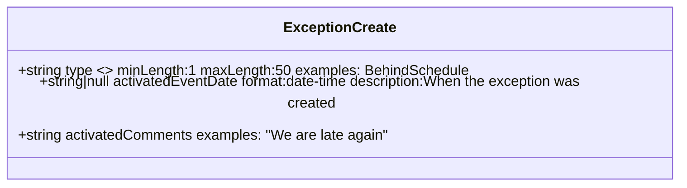
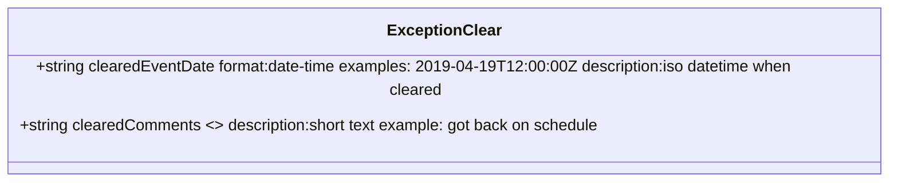

# Diagram: entity_core/entity_service/entity_service/common/json_schema/exception_schema.py

> Auto-generated by Obscura crawlers

## Diagram 1

### SVG

<svg id="container" width="780.796875" xmlns="http://www.w3.org/2000/svg" class="classDiagram" height="184" viewBox="0 0 780.796875 184" role="graphics-document document" aria-roledescription="class"><g><defs><marker id="container_class-aggregationStart" class="marker aggregation class" refX="18" refY="7" markerWidth="190" markerHeight="240" orient="auto"><path d="M 18,7 L9,13 L1,7 L9,1 Z"></path></marker></defs><defs><marker id="container_class-aggregationEnd" class="marker aggregation class" refX="1" refY="7" markerWidth="20" markerHeight="28" orient="auto"><path d="M 18,7 L9,13 L1,7 L9,1 Z"></path></marker></defs><defs><marker id="container_class-extensionStart" class="marker extension class" refX="18" refY="7" markerWidth="190" markerHeight="240" orient="auto"><path d="M 1,7 L18,13 V 1 Z"></path></marker></defs><defs><marker id="container_class-extensionEnd" class="marker extension class" refX="1" refY="7" markerWidth="20" markerHeight="28" orient="auto"><path d="M 1,1 V 13 L18,7 Z"></path></marker></defs><defs><marker id="container_class-compositionStart" class="marker composition class" refX="18" refY="7" markerWidth="190" markerHeight="240" orient="auto"><path d="M 18,7 L9,13 L1,7 L9,1 Z"></path></marker></defs><defs><marker id="container_class-compositionEnd" class="marker composition class" refX="1" refY="7" markerWidth="20" markerHeight="28" orient="auto"><path d="M 18,7 L9,13 L1,7 L9,1 Z"></path></marker></defs><defs><marker id="container_class-dependencyStart" class="marker dependency class" refX="6" refY="7" markerWidth="190" markerHeight="240" orient="auto"><path d="M 5,7 L9,13 L1,7 L9,1 Z"></path></marker></defs><defs><marker id="container_class-dependencyEnd" class="marker dependency class" refX="13" refY="7" markerWidth="20" markerHeight="28" orient="auto"><path d="M 18,7 L9,13 L14,7 L9,1 Z"></path></marker></defs><defs><marker id="container_class-lollipopStart" class="marker lollipop class" refX="13" refY="7" markerWidth="190" markerHeight="240" orient="auto"><circle stroke="black" fill="transparent" cx="7" cy="7" r="6"></circle></marker></defs><defs><marker id="container_class-lollipopEnd" class="marker lollipop class" refX="1" refY="7" markerWidth="190" markerHeight="240" orient="auto"><circle stroke="black" fill="transparent" cx="7" cy="7" r="6"></circle></marker></defs><g class="root"><g class="clusters"></g><g class="edgePaths"></g><g class="edgeLabels"></g><g class="nodes"><g class="node default" id="classId-ExceptionCreate-0" transform="translate(390.3984375, 92)"><g class="basic label-container"><path d="M-382.3984375 -84 L382.3984375 -84 L382.3984375 84 L-382.3984375 84" stroke="none" stroke-width="0" fill="#ECECFF" style=""></path><path d="M-382.3984375 -84 C-190.91410079043175 -84, 0.5702359191365076 -84, 382.3984375 -84 M-382.3984375 -84 C-213.80063168908927 -84, -45.202825878178544 -84, 382.3984375 -84 M382.3984375 -84 C382.3984375 -26.75990192724222, 382.3984375 30.480196145515563, 382.3984375 84 M382.3984375 -84 C382.3984375 -21.503591337262755, 382.3984375 40.99281732547449, 382.3984375 84 M382.3984375 84 C202.17180038386994 84, 21.945163267739872 84, -382.3984375 84 M382.3984375 84 C143.70934526710963 84, -94.97974696578075 84, -382.3984375 84 M-382.3984375 84 C-382.3984375 19.75501106136001, -382.3984375 -44.48997787727998, -382.3984375 -84 M-382.3984375 84 C-382.3984375 24.315437411107382, -382.3984375 -35.369125177785236, -382.3984375 -84" stroke="#9370DB" stroke-width="1.3" fill="none" stroke-dasharray="0 0" style=""></path></g><g class="annotation-group text" transform="translate(0, -60)"></g><g class="label-group text" transform="translate(-59.25, -60)"><g class="label" style="font-weight: bolder" transform="translate(0,-12)"><foreignObject width="118.5" height="24">

ExceptionCreate

</foreignObject></g></g><g class="members-group text" transform="translate(-370.3984375, -12)"><g class="label" style="" transform="translate(0,-12)"><foreignObject width="500.484375" height="24">

+string type &lt;&gt; minLength:1 maxLength:50 examples: BehindSchedule

</foreignObject></g><g class="label" style="" transform="translate(0,12)"><foreignObject width="681.546875" height="24">

+string|null activatedEventDate format:date-time description:When the exception was created

</foreignObject></g><g class="label" style="" transform="translate(0,36)"><foreignObject width="415.484375" height="24">

+string activatedComments examples: "We are late again"

</foreignObject></g></g><g class="methods-group text" transform="translate(-370.3984375, 84)"></g><g class="divider" style=""><path d="M-382.3984375 -36 C-114.80776699498557 -36, 152.78290351002886 -36, 382.3984375 -36 M-382.3984375 -36 C-121.76177501819757 -36, 138.87488746360486 -36, 382.3984375 -36" stroke="#9370DB" stroke-width="1.3" fill="none" stroke-dasharray="0 0" style=""></path></g><g class="divider" style=""><path d="M-382.3984375 60 C-226.99042608837942 60, -71.58241467675884 60, 382.3984375 60 M-382.3984375 60 C-78.3520327926305 60, 225.694371914739 60, 382.3984375 60" stroke="#9370DB" stroke-width="1.3" fill="none" stroke-dasharray="0 0" style=""></path></g></g></g></g></g></svg>

## Diagram 2

### SVG

<svg id="container" width="917.34375" xmlns="http://www.w3.org/2000/svg" class="classDiagram" height="160" viewBox="0 0 917.34375 160" role="graphics-document document" aria-roledescription="class"><g><defs><marker id="container_class-aggregationStart" class="marker aggregation class" refX="18" refY="7" markerWidth="190" markerHeight="240" orient="auto"><path d="M 18,7 L9,13 L1,7 L9,1 Z"></path></marker></defs><defs><marker id="container_class-aggregationEnd" class="marker aggregation class" refX="1" refY="7" markerWidth="20" markerHeight="28" orient="auto"><path d="M 18,7 L9,13 L1,7 L9,1 Z"></path></marker></defs><defs><marker id="container_class-extensionStart" class="marker extension class" refX="18" refY="7" markerWidth="190" markerHeight="240" orient="auto"><path d="M 1,7 L18,13 V 1 Z"></path></marker></defs><defs><marker id="container_class-extensionEnd" class="marker extension class" refX="1" refY="7" markerWidth="20" markerHeight="28" orient="auto"><path d="M 1,1 V 13 L18,7 Z"></path></marker></defs><defs><marker id="container_class-compositionStart" class="marker composition class" refX="18" refY="7" markerWidth="190" markerHeight="240" orient="auto"><path d="M 18,7 L9,13 L1,7 L9,1 Z"></path></marker></defs><defs><marker id="container_class-compositionEnd" class="marker composition class" refX="1" refY="7" markerWidth="20" markerHeight="28" orient="auto"><path d="M 18,7 L9,13 L1,7 L9,1 Z"></path></marker></defs><defs><marker id="container_class-dependencyStart" class="marker dependency class" refX="6" refY="7" markerWidth="190" markerHeight="240" orient="auto"><path d="M 5,7 L9,13 L1,7 L9,1 Z"></path></marker></defs><defs><marker id="container_class-dependencyEnd" class="marker dependency class" refX="13" refY="7" markerWidth="20" markerHeight="28" orient="auto"><path d="M 18,7 L9,13 L14,7 L9,1 Z"></path></marker></defs><defs><marker id="container_class-lollipopStart" class="marker lollipop class" refX="13" refY="7" markerWidth="190" markerHeight="240" orient="auto"><circle stroke="black" fill="transparent" cx="7" cy="7" r="6"></circle></marker></defs><defs><marker id="container_class-lollipopEnd" class="marker lollipop class" refX="1" refY="7" markerWidth="190" markerHeight="240" orient="auto"><circle stroke="black" fill="transparent" cx="7" cy="7" r="6"></circle></marker></defs><g class="root"><g class="clusters"></g><g class="edgePaths"></g><g class="edgeLabels"></g><g class="nodes"><g class="node default" id="classId-ExceptionClear-0" transform="translate(458.671875, 80)"><g class="basic label-container"><path d="M-450.671875 -72 L450.671875 -72 L450.671875 72 L-450.671875 72" stroke="none" stroke-width="0" fill="#ECECFF" style=""></path><path d="M-450.671875 -72 C-180.60734038536134 -72, 89.45719422927732 -72, 450.671875 -72 M-450.671875 -72 C-210.1997972615238 -72, 30.272280476952403 -72, 450.671875 -72 M450.671875 -72 C450.671875 -37.383868756311536, 450.671875 -2.7677375126230714, 450.671875 72 M450.671875 -72 C450.671875 -27.031126935064435, 450.671875 17.93774612987113, 450.671875 72 M450.671875 72 C96.88908065883163 72, -256.89371368233674 72, -450.671875 72 M450.671875 72 C150.9501379486927 72, -148.77159910261457 72, -450.671875 72 M-450.671875 72 C-450.671875 35.048580751613756, -450.671875 -1.902838496772489, -450.671875 -72 M-450.671875 72 C-450.671875 17.45171572028397, -450.671875 -37.09656855943206, -450.671875 -72" stroke="#9370DB" stroke-width="1.3" fill="none" stroke-dasharray="0 0" style=""></path></g><g class="annotation-group text" transform="translate(0, -48)"></g><g class="label-group text" transform="translate(-54.484375, -48)"><g class="label" style="font-weight: bolder" transform="translate(0,-12)"><foreignObject width="108.96875" height="24">

ExceptionClear

</foreignObject></g></g><g class="members-group text" transform="translate(-438.671875, 0)"><g class="label" style="" transform="translate(0,-12)"><foreignObject width="822.859375" height="24">

+string clearedEventDate format:date-time examples: 2019-04-19T12:00:00Z description:iso datetime when cleared

</foreignObject></g><g class="label" style="" transform="translate(0,12)"><foreignObject width="592.84375" height="24">

+string clearedComments &lt;&gt; description:short text example: got back on schedule

</foreignObject></g></g><g class="methods-group text" transform="translate(-438.671875, 72)"></g><g class="divider" style=""><path d="M-450.671875 -24 C-142.6545338413443 -24, 165.36280731731142 -24, 450.671875 -24 M-450.671875 -24 C-205.77580225837784 -24, 39.120270483244326 -24, 450.671875 -24" stroke="#9370DB" stroke-width="1.3" fill="none" stroke-dasharray="0 0" style=""></path></g><g class="divider" style=""><path d="M-450.671875 48 C-198.71348658185903 48, 53.24490183628194 48, 450.671875 48 M-450.671875 48 C-222.86599569032018 48, 4.939883619359648 48, 450.671875 48" stroke="#9370DB" stroke-width="1.3" fill="none" stroke-dasharray="0 0" style=""></path></g></g></g></g></g></svg>
