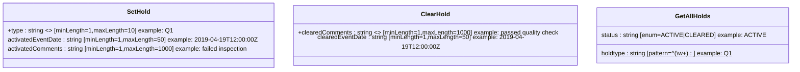

# Diagram: entity_core/entity_service/entity_service/common/json_schema/hold_schema.py

> Auto-generated by Obscura crawlers

## Mermaid

### SVG

<svg id="container" width="1997.515625" xmlns="http://www.w3.org/2000/svg" class="classDiagram" height="184" viewBox="0 0 1997.515625 184" role="graphics-document document" aria-roledescription="class"><g><defs><marker id="container_class-aggregationStart" class="marker aggregation class" refX="18" refY="7" markerWidth="190" markerHeight="240" orient="auto"><path d="M 18,7 L9,13 L1,7 L9,1 Z"></path></marker></defs><defs><marker id="container_class-aggregationEnd" class="marker aggregation class" refX="1" refY="7" markerWidth="20" markerHeight="28" orient="auto"><path d="M 18,7 L9,13 L1,7 L9,1 Z"></path></marker></defs><defs><marker id="container_class-extensionStart" class="marker extension class" refX="18" refY="7" markerWidth="190" markerHeight="240" orient="auto"><path d="M 1,7 L18,13 V 1 Z"></path></marker></defs><defs><marker id="container_class-extensionEnd" class="marker extension class" refX="1" refY="7" markerWidth="20" markerHeight="28" orient="auto"><path d="M 1,1 V 13 L18,7 Z"></path></marker></defs><defs><marker id="container_class-compositionStart" class="marker composition class" refX="18" refY="7" markerWidth="190" markerHeight="240" orient="auto"><path d="M 18,7 L9,13 L1,7 L9,1 Z"></path></marker></defs><defs><marker id="container_class-compositionEnd" class="marker composition class" refX="1" refY="7" markerWidth="20" markerHeight="28" orient="auto"><path d="M 18,7 L9,13 L1,7 L9,1 Z"></path></marker></defs><defs><marker id="container_class-dependencyStart" class="marker dependency class" refX="6" refY="7" markerWidth="190" markerHeight="240" orient="auto"><path d="M 5,7 L9,13 L1,7 L9,1 Z"></path></marker></defs><defs><marker id="container_class-dependencyEnd" class="marker dependency class" refX="13" refY="7" markerWidth="20" markerHeight="28" orient="auto"><path d="M 18,7 L9,13 L14,7 L9,1 Z"></path></marker></defs><defs><marker id="container_class-lollipopStart" class="marker lollipop class" refX="13" refY="7" markerWidth="190" markerHeight="240" orient="auto"><circle stroke="black" fill="transparent" cx="7" cy="7" r="6"></circle></marker></defs><defs><marker id="container_class-lollipopEnd" class="marker lollipop class" refX="1" refY="7" markerWidth="190" markerHeight="240" orient="auto"><circle stroke="black" fill="transparent" cx="7" cy="7" r="6"></circle></marker></defs><g class="root"><g class="clusters"></g><g class="edgePaths"></g><g class="edgeLabels"></g><g class="nodes"><g class="node default" id="classId-SetHold-0" transform="translate(350.4296875, 92)"><g class="basic label-container"><path d="M-342.4296875 -84 L342.4296875 -84 L342.4296875 84 L-342.4296875 84" stroke="none" stroke-width="0" fill="#ECECFF" style=""></path><path d="M-342.4296875 -84 C-168.04373065020366 -84, 6.342226199592687 -84, 342.4296875 -84 M-342.4296875 -84 C-102.00243443030172 -84, 138.42481863939656 -84, 342.4296875 -84 M342.4296875 -84 C342.4296875 -38.62801361245379, 342.4296875 6.743972775092416, 342.4296875 84 M342.4296875 -84 C342.4296875 -36.80460893709361, 342.4296875 10.390782125812777, 342.4296875 84 M342.4296875 84 C119.43124899247957 84, -103.56718951504087 84, -342.4296875 84 M342.4296875 84 C106.03642106052513 84, -130.35684537894974 84, -342.4296875 84 M-342.4296875 84 C-342.4296875 42.23051799713517, -342.4296875 0.4610359942703468, -342.4296875 -84 M-342.4296875 84 C-342.4296875 21.81746377451106, -342.4296875 -40.36507245097788, -342.4296875 -84" stroke="#9370DB" stroke-width="1.3" fill="none" stroke-dasharray="0 0" style=""></path></g><g class="annotation-group text" transform="translate(0, -60)"></g><g class="label-group text" transform="translate(-29.21875, -60)"><g class="label" style="font-weight: bolder" transform="translate(0,-12)"><foreignObject width="58.4375" height="24">

SetHold

</foreignObject></g></g><g class="members-group text" transform="translate(-330.4296875, -12)"><g class="label" style="" transform="translate(0,-12)"><foreignObject width="417.921875" height="24">

+type : string &lt;&gt; [minLength=1,maxLength=10] example: Q1

</foreignObject></g><g class="label" style="" transform="translate(0,12)"><foreignObject width="631.640625" height="24">

activatedEventDate : string [minLength=1,maxLength=50] example: 2019-04-19T12:00:00Z

</foreignObject></g><g class="label" style="" transform="translate(0,36)"><foreignObject width="623.1875" height="24">

activatedComments : string [minLength=1,maxLength=1000] example: failed inspection

</foreignObject></g></g><g class="methods-group text" transform="translate(-330.4296875, 84)"></g><g class="divider" style=""><path d="M-342.4296875 -36 C-180.65527214344954 -36, -18.880856786899074 -36, 342.4296875 -36 M-342.4296875 -36 C-87.77471017421547 -36, 166.88026715156906 -36, 342.4296875 -36" stroke="#9370DB" stroke-width="1.3" fill="none" stroke-dasharray="0 0" style=""></path></g><g class="divider" style=""><path d="M-342.4296875 60 C-111.9049004465339 60, 118.6198866069322 60, 342.4296875 60 M-342.4296875 60 C-199.11772999866912 60, -55.80577249733824 60, 342.4296875 60" stroke="#9370DB" stroke-width="1.3" fill="none" stroke-dasharray="0 0" style=""></path></g></g><g class="node default" id="classId-ClearHold-1" transform="translate(1106.6953125, 92)"><g class="basic label-container"><path d="M-363.8359375 -72 L363.8359375 -72 L363.8359375 72 L-363.8359375 72" stroke="none" stroke-width="0" fill="#ECECFF" style=""></path><path d="M-363.8359375 -72 C-114.0813486848254 -72, 135.6732401303492 -72, 363.8359375 -72 M-363.8359375 -72 C-127.17968928352818 -72, 109.47655893294365 -72, 363.8359375 -72 M363.8359375 -72 C363.8359375 -16.59417517521591, 363.8359375 38.81164964956818, 363.8359375 72 M363.8359375 -72 C363.8359375 -36.102050502458944, 363.8359375 -0.20410100491788796, 363.8359375 72 M363.8359375 72 C81.4865253477833 72, -200.8628868044334 72, -363.8359375 72 M363.8359375 72 C86.33203500849936 72, -191.17186748300128 72, -363.8359375 72 M-363.8359375 72 C-363.8359375 18.380168812785698, -363.8359375 -35.239662374428605, -363.8359375 -72 M-363.8359375 72 C-363.8359375 36.16777806814537, -363.8359375 0.3355561362907338, -363.8359375 -72" stroke="#9370DB" stroke-width="1.3" fill="none" stroke-dasharray="0 0" style=""></path></g><g class="annotation-group text" transform="translate(0, -48)"></g><g class="label-group text" transform="translate(-35.921875, -48)"><g class="label" style="font-weight: bolder" transform="translate(0,-12)"><foreignObject width="71.84375" height="24">

ClearHold

</foreignObject></g></g><g class="members-group text" transform="translate(-351.8359375, 0)"><g class="label" style="" transform="translate(0,-12)"><foreignObject width="667.75" height="24">

+clearedComments : string &lt;&gt; [minLength=1,maxLength=1000] example: passed quality check

</foreignObject></g><g class="label" style="" transform="translate(0,12)"><foreignObject width="618.359375" height="24">

clearedEventDate : string [minLength=1,maxLength=50] example: 2019-04-19T12:00:00Z

</foreignObject></g></g><g class="methods-group text" transform="translate(-351.8359375, 72)"></g><g class="divider" style=""><path d="M-363.8359375 -24 C-111.31105286978405 -24, 141.2138317604319 -24, 363.8359375 -24 M-363.8359375 -24 C-214.00009659551844 -24, -64.16425569103689 -24, 363.8359375 -24" stroke="#9370DB" stroke-width="1.3" fill="none" stroke-dasharray="0 0" style=""></path></g><g class="divider" style=""><path d="M-363.8359375 48 C-203.4463642338927 48, -43.05679096778539 48, 363.8359375 48 M-363.8359375 48 C-191.5861304732531 48, -19.336323446506185 48, 363.8359375 48" stroke="#9370DB" stroke-width="1.3" fill="none" stroke-dasharray="0 0" style=""></path></g></g><g class="node default" id="classId-GetAllHolds-2" transform="translate(1755.0234375, 92)"><g class="basic label-container"><path d="M-234.4921875 -72 L234.4921875 -72 L234.4921875 72 L-234.4921875 72" stroke="none" stroke-width="0" fill="#ECECFF" style=""></path><path d="M-234.4921875 -72 C-67.84341509692248 -72, 98.80535730615503 -72, 234.4921875 -72 M-234.4921875 -72 C-120.02643815707422 -72, -5.560688814148449 -72, 234.4921875 -72 M234.4921875 -72 C234.4921875 -31.75633310094547, 234.4921875 8.487333798109063, 234.4921875 72 M234.4921875 -72 C234.4921875 -38.610945653671905, 234.4921875 -5.22189130734381, 234.4921875 72 M234.4921875 72 C98.23166044444122 72, -38.028866611117564 72, -234.4921875 72 M234.4921875 72 C52.385249471477124 72, -129.72168855704575 72, -234.4921875 72 M-234.4921875 72 C-234.4921875 30.15988346725068, -234.4921875 -11.68023306549864, -234.4921875 -72 M-234.4921875 72 C-234.4921875 27.390427245725675, -234.4921875 -17.21914550854865, -234.4921875 -72" stroke="#9370DB" stroke-width="1.3" fill="none" stroke-dasharray="0 0" style=""></path></g><g class="annotation-group text" transform="translate(0, -48)"></g><g class="label-group text" transform="translate(-43.140625, -48)"><g class="label" style="font-weight: bolder" transform="translate(0,-12)"><foreignObject width="86.28125" height="24">

GetAllHolds

</foreignObject></g></g><g class="members-group text" transform="translate(-222.4921875, 0)"><g class="label" style="" transform="translate(0,-12)"><foreignObject width="401.84375" height="24">

status : string [enum=ACTIVE|CLEARED] example: ACTIVE

</foreignObject></g></g><g class="methods-group text" transform="translate(-222.4921875, 48)"><g class="label" style="text-decoration:underline;" transform="translate(0,-12)"><foreignObject width="345.390625" height="24">

holdtype : string [pattern=^(\w+) : ] example: Q1

</foreignObject></g></g><g class="divider" style=""><path d="M-234.4921875 -24 C-114.40267603090729 -24, 5.686835438185426 -24, 234.4921875 -24 M-234.4921875 -24 C-113.39543129670172 -24, 7.701324906596568 -24, 234.4921875 -24" stroke="#9370DB" stroke-width="1.3" fill="none" stroke-dasharray="0 0" style=""></path></g><g class="divider" style=""><path d="M-234.4921875 24 C-131.93925776359208 24, -29.386328027184163 24, 234.4921875 24 M-234.4921875 24 C-104.33281920301224 24, 25.82654909397553 24, 234.4921875 24" stroke="#9370DB" stroke-width="1.3" fill="none" stroke-dasharray="0 0" style=""></path></g></g></g></g></g></svg>
