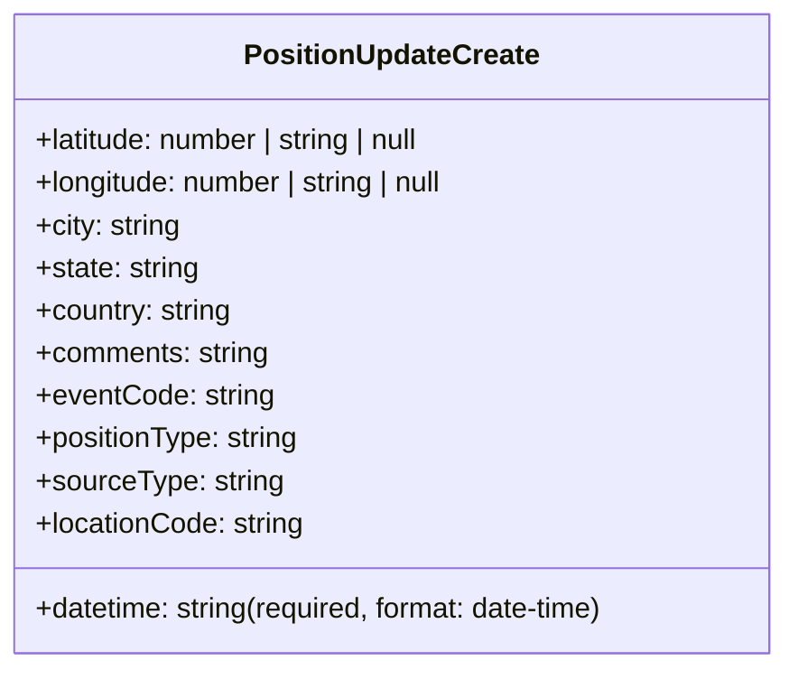
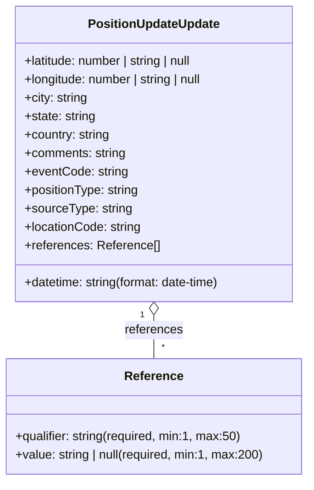

# Diagram: entity_core/entity_service/entity_service/common/json_schema/position_update_schema.py

> Auto-generated by Obscura crawlers

## Diagram 1

### SVG

<svg id="container" width="451.9296875" xmlns="http://www.w3.org/2000/svg" class="classDiagram" height="376" viewBox="0 0 451.9296875 376" role="graphics-document document" aria-roledescription="class"><g><defs><marker id="container_class-aggregationStart" class="marker aggregation class" refX="18" refY="7" markerWidth="190" markerHeight="240" orient="auto"><path d="M 18,7 L9,13 L1,7 L9,1 Z"></path></marker></defs><defs><marker id="container_class-aggregationEnd" class="marker aggregation class" refX="1" refY="7" markerWidth="20" markerHeight="28" orient="auto"><path d="M 18,7 L9,13 L1,7 L9,1 Z"></path></marker></defs><defs><marker id="container_class-extensionStart" class="marker extension class" refX="18" refY="7" markerWidth="190" markerHeight="240" orient="auto"><path d="M 1,7 L18,13 V 1 Z"></path></marker></defs><defs><marker id="container_class-extensionEnd" class="marker extension class" refX="1" refY="7" markerWidth="20" markerHeight="28" orient="auto"><path d="M 1,1 V 13 L18,7 Z"></path></marker></defs><defs><marker id="container_class-compositionStart" class="marker composition class" refX="18" refY="7" markerWidth="190" markerHeight="240" orient="auto"><path d="M 18,7 L9,13 L1,7 L9,1 Z"></path></marker></defs><defs><marker id="container_class-compositionEnd" class="marker composition class" refX="1" refY="7" markerWidth="20" markerHeight="28" orient="auto"><path d="M 18,7 L9,13 L1,7 L9,1 Z"></path></marker></defs><defs><marker id="container_class-dependencyStart" class="marker dependency class" refX="6" refY="7" markerWidth="190" markerHeight="240" orient="auto"><path d="M 5,7 L9,13 L1,7 L9,1 Z"></path></marker></defs><defs><marker id="container_class-dependencyEnd" class="marker dependency class" refX="13" refY="7" markerWidth="20" markerHeight="28" orient="auto"><path d="M 18,7 L9,13 L14,7 L9,1 Z"></path></marker></defs><defs><marker id="container_class-lollipopStart" class="marker lollipop class" refX="13" refY="7" markerWidth="190" markerHeight="240" orient="auto"><circle stroke="black" fill="transparent" cx="7" cy="7" r="6"></circle></marker></defs><defs><marker id="container_class-lollipopEnd" class="marker lollipop class" refX="1" refY="7" markerWidth="190" markerHeight="240" orient="auto"><circle stroke="black" fill="transparent" cx="7" cy="7" r="6"></circle></marker></defs><g class="root"><g class="clusters"></g><g class="edgePaths"></g><g class="edgeLabels"></g><g class="nodes"><g class="node default" id="classId-PositionUpdateCreate-0" transform="translate(225.96484375, 188)"><g class="basic label-container"><path d="M-217.96484375 -180 L217.96484375 -180 L217.96484375 180 L-217.96484375 180" stroke="none" stroke-width="0" fill="#ECECFF" style=""></path><path d="M-217.96484375 -180 C-49.72669103157955 -180, 118.5114616868409 -180, 217.96484375 -180 M-217.96484375 -180 C-128.13874580049333 -180, -38.31264785098668 -180, 217.96484375 -180 M217.96484375 -180 C217.96484375 -68.41070118817348, 217.96484375 43.17859762365305, 217.96484375 180 M217.96484375 -180 C217.96484375 -43.17769737391319, 217.96484375 93.64460525217362, 217.96484375 180 M217.96484375 180 C92.75834625320299 180, -32.448151243594026 180, -217.96484375 180 M217.96484375 180 C72.86999393948648 180, -72.22485587102705 180, -217.96484375 180 M-217.96484375 180 C-217.96484375 105.62730514111323, -217.96484375 31.25461028222645, -217.96484375 -180 M-217.96484375 180 C-217.96484375 107.09684793332788, -217.96484375 34.19369586665576, -217.96484375 -180" stroke="#9370DB" stroke-width="1.3" fill="none" stroke-dasharray="0 0" style=""></path></g><g class="annotation-group text" transform="translate(0, -156)"></g><g class="label-group text" transform="translate(-80.0703125, -156)"><g class="label" style="font-weight: bolder" transform="translate(0,-12)"><foreignObject width="160.140625" height="24">

PositionUpdateCreate

</foreignObject></g></g><g class="members-group text" transform="translate(-205.96484375, -108)"><g class="label" style="" transform="translate(0,-12)"><foreignObject width="229.40625" height="24">

+latitude: number | string | null

</foreignObject></g><g class="label" style="" transform="translate(0,12)"><foreignObject width="241.953125" height="24">

+longitude: number | string | null

</foreignObject></g><g class="label" style="" transform="translate(0,36)"><foreignObject width="83.5" height="24">

+city: string

</foreignObject></g><g class="label" style="" transform="translate(0,60)"><foreignObject width="93.796875" height="24">

+state: string

</foreignObject></g><g class="label" style="" transform="translate(0,84)"><foreignObject width="112.953125" height="24">

+country: string

</foreignObject></g><g class="label" style="" transform="translate(0,108)"><foreignObject width="133.140625" height="24">

+comments: string

</foreignObject></g><g class="label" style="" transform="translate(0,132)"><foreignObject width="134.3125" height="24">

+eventCode: string

</foreignObject></g><g class="label" style="" transform="translate(0,156)"><foreignObject width="151.265625" height="24">

+positionType: string

</foreignObject></g><g class="label" style="" transform="translate(0,180)"><foreignObject width="139.296875" height="24">

+sourceType: string

</foreignObject></g><g class="label" style="" transform="translate(0,204)"><foreignObject width="153.125" height="24">

+locationCode: string

</foreignObject></g></g><g class="methods-group text" transform="translate(-205.96484375, 156)"><g class="label" style="" transform="translate(0,-12)"><foreignObject width="331.859375" height="24">

+datetime: string(required, format: date-time)

</foreignObject></g></g><g class="divider" style=""><path d="M-217.96484375 -132 C-101.50372274130504 -132, 14.95739826738992 -132, 217.96484375 -132 M-217.96484375 -132 C-79.73428885046337 -132, 58.496266049073256 -132, 217.96484375 -132" stroke="#9370DB" stroke-width="1.3" fill="none" stroke-dasharray="0 0" style=""></path></g><g class="divider" style=""><path d="M-217.96484375 132 C-69.56927313940676 132, 78.82629747118648 132, 217.96484375 132 M-217.96484375 132 C-81.47308311167293 132, 55.01867752665413 132, 217.96484375 132" stroke="#9370DB" stroke-width="1.3" fill="none" stroke-dasharray="0 0" style=""></path></g></g></g></g></g></svg>

## Diagram 2

### SVG

<svg id="container" width="401.8359375" xmlns="http://www.w3.org/2000/svg" class="classDiagram" height="624" viewBox="0 0 401.8359375 624" role="graphics-document document" aria-roledescription="class"><g><defs><marker id="container_class-aggregationStart" class="marker aggregation class" refX="18" refY="7" markerWidth="190" markerHeight="240" orient="auto"><path d="M 18,7 L9,13 L1,7 L9,1 Z"></path></marker></defs><defs><marker id="container_class-aggregationEnd" class="marker aggregation class" refX="1" refY="7" markerWidth="20" markerHeight="28" orient="auto"><path d="M 18,7 L9,13 L1,7 L9,1 Z"></path></marker></defs><defs><marker id="container_class-extensionStart" class="marker extension class" refX="18" refY="7" markerWidth="190" markerHeight="240" orient="auto"><path d="M 1,7 L18,13 V 1 Z"></path></marker></defs><defs><marker id="container_class-extensionEnd" class="marker extension class" refX="1" refY="7" markerWidth="20" markerHeight="28" orient="auto"><path d="M 1,1 V 13 L18,7 Z"></path></marker></defs><defs><marker id="container_class-compositionStart" class="marker composition class" refX="18" refY="7" markerWidth="190" markerHeight="240" orient="auto"><path d="M 18,7 L9,13 L1,7 L9,1 Z"></path></marker></defs><defs><marker id="container_class-compositionEnd" class="marker composition class" refX="1" refY="7" markerWidth="20" markerHeight="28" orient="auto"><path d="M 18,7 L9,13 L1,7 L9,1 Z"></path></marker></defs><defs><marker id="container_class-dependencyStart" class="marker dependency class" refX="6" refY="7" markerWidth="190" markerHeight="240" orient="auto"><path d="M 5,7 L9,13 L1,7 L9,1 Z"></path></marker></defs><defs><marker id="container_class-dependencyEnd" class="marker dependency class" refX="13" refY="7" markerWidth="20" markerHeight="28" orient="auto"><path d="M 18,7 L9,13 L14,7 L9,1 Z"></path></marker></defs><defs><marker id="container_class-lollipopStart" class="marker lollipop class" refX="13" refY="7" markerWidth="190" markerHeight="240" orient="auto"><circle stroke="black" fill="transparent" cx="7" cy="7" r="6"></circle></marker></defs><defs><marker id="container_class-lollipopEnd" class="marker lollipop class" refX="1" refY="7" markerWidth="190" markerHeight="240" orient="auto"><circle stroke="black" fill="transparent" cx="7" cy="7" r="6"></circle></marker></defs><g class="root"><g class="clusters"></g><g class="edgePaths"><path d="M200.918,409.25L200.918,412.542C200.918,415.833,200.918,422.417,200.918,431.875C200.918,441.333,200.918,453.667,200.918,459.833L200.918,466" id="id_PositionUpdateUpdate_Reference_1" class="edge-thickness-normal edge-pattern-solid relation" style=";;;" data-edge="true" data-et="edge" data-id="id_PositionUpdateUpdate_Reference_1" data-points="W3sieCI6MjAwLjkxNzk2ODc1LCJ5IjozOTJ9LHsieCI6MjAwLjkxNzk2ODc1LCJ5Ijo0Mjl9LHsieCI6MjAwLjkxNzk2ODc1LCJ5Ijo0NjZ9XQ==" marker-start="url(#container_class-aggregationStart)"></path></g><g class="edgeLabels"><g class="edgeLabel" transform="translate(200.91796875, 429)"><g class="label" data-id="id_PositionUpdateUpdate_Reference_1" transform="translate(-37.828125, -12)"><foreignObject width="75.65625" height="24">

references

</foreignObject></g></g><g class="edgeTerminals" transform="translate(185.91796937499998, 409.50000053571426)"><g class="inner" transform="translate(0, 0)"><foreignObject style="width: 9px; height: 12px;">
1
</foreignObject></g></g><g class="edgeTerminals" transform="translate(210.91796937499998, 443.50000053571426)"><g class="inner" transform="translate(0, 0)"></g><foreignObject style="width: 9px; height: 12px;">
*
</foreignObject></g></g><g class="nodes"><g class="node default" id="classId-PositionUpdateUpdate-0" transform="translate(200.91796875, 200)"><g class="basic label-container"><path d="M-184.5234375 -192 L184.5234375 -192 L184.5234375 192 L-184.5234375 192" stroke="none" stroke-width="0" fill="#ECECFF" style=""></path><path d="M-184.5234375 -192 C-58.16525804229869 -192, 68.19292141540262 -192, 184.5234375 -192 M-184.5234375 -192 C-58.304849489328305 -192, 67.91373852134339 -192, 184.5234375 -192 M184.5234375 -192 C184.5234375 -54.04846196098924, 184.5234375 83.90307607802151, 184.5234375 192 M184.5234375 -192 C184.5234375 -91.3483300593395, 184.5234375 9.303339881320994, 184.5234375 192 M184.5234375 192 C39.27968754168444 192, -105.96406241663112 192, -184.5234375 192 M184.5234375 192 C57.26081354349634 192, -70.00181041300732 192, -184.5234375 192 M-184.5234375 192 C-184.5234375 38.83006538990182, -184.5234375 -114.33986922019636, -184.5234375 -192 M-184.5234375 192 C-184.5234375 55.985266435274355, -184.5234375 -80.02946712945129, -184.5234375 -192" stroke="#9370DB" stroke-width="1.3" fill="none" stroke-dasharray="0 0" style=""></path></g><g class="annotation-group text" transform="translate(0, -168)"></g><g class="label-group text" transform="translate(-83.046875, -168)"><g class="label" style="font-weight: bolder" transform="translate(0,-12)"><foreignObject width="166.09375" height="24">

PositionUpdateUpdate

</foreignObject></g></g><g class="members-group text" transform="translate(-172.5234375, -120)"><g class="label" style="" transform="translate(0,-12)"><foreignObject width="229.40625" height="24">

+latitude: number | string | null

</foreignObject></g><g class="label" style="" transform="translate(0,12)"><foreignObject width="241.953125" height="24">

+longitude: number | string | null

</foreignObject></g><g class="label" style="" transform="translate(0,36)"><foreignObject width="83.5" height="24">

+city: string

</foreignObject></g><g class="label" style="" transform="translate(0,60)"><foreignObject width="93.796875" height="24">

+state: string

</foreignObject></g><g class="label" style="" transform="translate(0,84)"><foreignObject width="112.953125" height="24">

+country: string

</foreignObject></g><g class="label" style="" transform="translate(0,108)"><foreignObject width="133.140625" height="24">

+comments: string

</foreignObject></g><g class="label" style="" transform="translate(0,132)"><foreignObject width="134.3125" height="24">

+eventCode: string

</foreignObject></g><g class="label" style="" transform="translate(0,156)"><foreignObject width="151.265625" height="24">

+positionType: string

</foreignObject></g><g class="label" style="" transform="translate(0,180)"><foreignObject width="139.296875" height="24">

+sourceType: string

</foreignObject></g><g class="label" style="" transform="translate(0,204)"><foreignObject width="153.125" height="24">

+locationCode: string

</foreignObject></g><g class="label" style="" transform="translate(0,228)"><foreignObject width="173.9375" height="24">

+references: Reference[]

</foreignObject></g></g><g class="methods-group text" transform="translate(-172.5234375, 168)"><g class="label" style="" transform="translate(0,-12)"><foreignObject width="262" height="24">

+datetime: string(format: date-time)

</foreignObject></g></g><g class="divider" style=""><path d="M-184.5234375 -144 C-98.44525568085025 -144, -12.367073861700504 -144, 184.5234375 -144 M-184.5234375 -144 C-46.67232810580697 -144, 91.17878128838606 -144, 184.5234375 -144" stroke="#9370DB" stroke-width="1.3" fill="none" stroke-dasharray="0 0" style=""></path></g><g class="divider" style=""><path d="M-184.5234375 144 C-47.87981393043498 144, 88.76380963913005 144, 184.5234375 144 M-184.5234375 144 C-63.622594923796996 144, 57.27824765240601 144, 184.5234375 144" stroke="#9370DB" stroke-width="1.3" fill="none" stroke-dasharray="0 0" style=""></path></g></g><g class="node default" id="classId-Reference-1" transform="translate(200.91796875, 541)"><g class="basic label-container"><path d="M-192.91796875 -75 L192.91796875 -75 L192.91796875 75 L-192.91796875 75" stroke="none" stroke-width="0" fill="#ECECFF" style=""></path><path d="M-192.91796875 -75 C-93.1395538618871 -75, 6.638861026225811 -75, 192.91796875 -75 M-192.91796875 -75 C-115.41003233802891 -75, -37.902095926057825 -75, 192.91796875 -75 M192.91796875 -75 C192.91796875 -44.44639125727818, 192.91796875 -13.892782514556366, 192.91796875 75 M192.91796875 -75 C192.91796875 -44.69122800370533, 192.91796875 -14.382456007410667, 192.91796875 75 M192.91796875 75 C105.55593084550328 75, 18.193892941006567 75, -192.91796875 75 M192.91796875 75 C61.08285956885564 75, -70.75224961228872 75, -192.91796875 75 M-192.91796875 75 C-192.91796875 15.587554886712063, -192.91796875 -43.824890226575874, -192.91796875 -75 M-192.91796875 75 C-192.91796875 20.507187557619154, -192.91796875 -33.98562488476169, -192.91796875 -75" stroke="#9370DB" stroke-width="1.3" fill="none" stroke-dasharray="0 0" style=""></path></g><g class="annotation-group text" transform="translate(0, -51)"></g><g class="label-group text" transform="translate(-36.5078125, -51)"><g class="label" style="font-weight: bolder" transform="translate(0,-12)"><foreignObject width="73.015625" height="24">

Reference

</foreignObject></g></g><g class="members-group text" transform="translate(-180.91796875, -3)"></g><g class="methods-group text" transform="translate(-180.91796875, 27)"><g class="label" style="" transform="translate(0,-12)"><foreignObject width="295.71875" height="24">

+qualifier: string(required, min:1, max:50)

</foreignObject></g><g class="label" style="" transform="translate(0,12)"><foreignObject width="325.328125" height="24">

+value: string | null(required, min:1, max:200)

</foreignObject></g></g><g class="divider" style=""><path d="M-192.91796875 -27 C-44.46147685668237 -27, 103.99501503663527 -27, 192.91796875 -27 M-192.91796875 -27 C-97.5384570372319 -27, -2.1589453244637866 -27, 192.91796875 -27" stroke="#9370DB" stroke-width="1.3" fill="none" stroke-dasharray="0 0" style=""></path></g><g class="divider" style=""><path d="M-192.91796875 -3 C-60.12928495937501 -3, 72.65939883124997 -3, 192.91796875 -3 M-192.91796875 -3 C-71.91499263898817 -3, 49.087983472023666 -3, 192.91796875 -3" stroke="#9370DB" stroke-width="1.3" fill="none" stroke-dasharray="0 0" style=""></path></g></g></g></g></g></svg>
