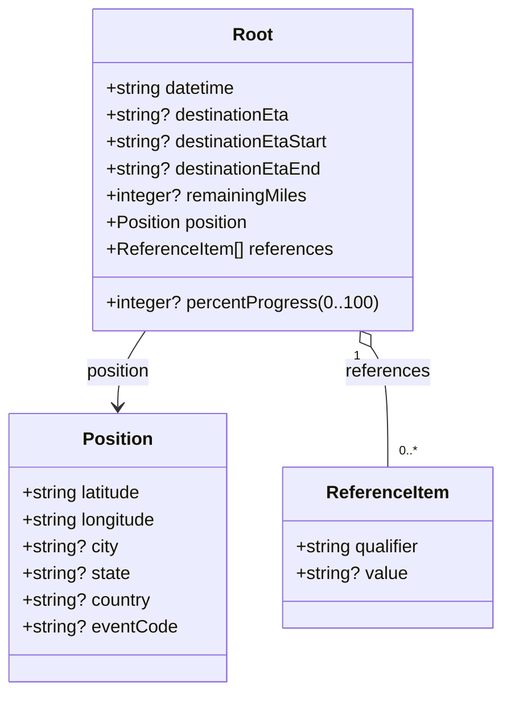

# Diagram: entity_core/entity_service/entity_service/common/json_schema/progress_update_schema.py

> Auto-generated by Obscura crawlers

## Mermaid

### SVG

<svg id="container" width="449.03125" xmlns="http://www.w3.org/2000/svg" class="classDiagram" height="618" viewBox="0 0 449.03125 618" role="graphics-document document" aria-roledescription="class"><g><defs><marker id="container_class-aggregationStart" class="marker aggregation class" refX="18" refY="7" markerWidth="190" markerHeight="240" orient="auto"><path d="M 18,7 L9,13 L1,7 L9,1 Z"></path></marker></defs><defs><marker id="container_class-aggregationEnd" class="marker aggregation class" refX="1" refY="7" markerWidth="20" markerHeight="28" orient="auto"><path d="M 18,7 L9,13 L1,7 L9,1 Z"></path></marker></defs><defs><marker id="container_class-extensionStart" class="marker extension class" refX="18" refY="7" markerWidth="190" markerHeight="240" orient="auto"><path d="M 1,7 L18,13 V 1 Z"></path></marker></defs><defs><marker id="container_class-extensionEnd" class="marker extension class" refX="1" refY="7" markerWidth="20" markerHeight="28" orient="auto"><path d="M 1,1 V 13 L18,7 Z"></path></marker></defs><defs><marker id="container_class-compositionStart" class="marker composition class" refX="18" refY="7" markerWidth="190" markerHeight="240" orient="auto"><path d="M 18,7 L9,13 L1,7 L9,1 Z"></path></marker></defs><defs><marker id="container_class-compositionEnd" class="marker composition class" refX="1" refY="7" markerWidth="20" markerHeight="28" orient="auto"><path d="M 18,7 L9,13 L1,7 L9,1 Z"></path></marker></defs><defs><marker id="container_class-dependencyStart" class="marker dependency class" refX="6" refY="7" markerWidth="190" markerHeight="240" orient="auto"><path d="M 5,7 L9,13 L1,7 L9,1 Z"></path></marker></defs><defs><marker id="container_class-dependencyEnd" class="marker dependency class" refX="13" refY="7" markerWidth="20" markerHeight="28" orient="auto"><path d="M 18,7 L9,13 L14,7 L9,1 Z"></path></marker></defs><defs><marker id="container_class-lollipopStart" class="marker lollipop class" refX="13" refY="7" markerWidth="190" markerHeight="240" orient="auto"><circle stroke="black" fill="transparent" cx="7" cy="7" r="6"></circle></marker></defs><defs><marker id="container_class-lollipopEnd" class="marker lollipop class" refX="1" refY="7" markerWidth="190" markerHeight="240" orient="auto"><circle stroke="black" fill="transparent" cx="7" cy="7" r="6"></circle></marker></defs><g class="root"><g class="clusters"></g><g class="edgePaths"><path d="M128.427,296L124.313,302.167C120.199,308.333,111.971,320.667,107.856,332C103.742,343.333,103.742,353.667,103.742,358.833L103.742,364" id="id_Root_Position_1" class="edge-thickness-normal edge-pattern-solid relation" style=";;;" data-edge="true" data-et="edge" data-id="id_Root_Position_1" data-points="W3sieCI6MTI4LjQyNzQ4NjE4Nzg0NTMyLCJ5IjoyOTZ9LHsieCI6MTAzLjc0MjE4NzUsInkiOjMzM30seyJ4IjoxMDMuNzQyMTg3NSwieSI6MzcwfV0=" marker-end="url(#container_class-dependencyEnd)"></path><path d="M330.146,310.35L332.665,314.125C335.183,317.9,340.221,325.45,342.739,343.392C345.258,361.333,345.258,389.667,345.258,403.833L345.258,418" id="id_Root_ReferenceItem_2" class="edge-thickness-normal edge-pattern-solid relation" style=";;;" data-edge="true" data-et="edge" data-id="id_Root_ReferenceItem_2" data-points="W3sieCI6MzIwLjU3MjUxMzgxMjE1NDcsInkiOjI5Nn0seyJ4IjozNDUuMjU3ODEyNSwieSI6MzMzfSx7IngiOjM0NS4yNTc4MTI1LCJ5Ijo0MTh9XQ==" marker-start="url(#container_class-aggregationStart)"></path></g><g class="edgeLabels"><g class="edgeLabel" transform="translate(103.7421875, 333)"><g class="label" data-id="id_Root_Position_1" transform="translate(-29.921875, -12)"><foreignObject width="59.84375" height="24">

position

</foreignObject></g></g><g class="edgeLabel" transform="translate(345.2578125, 333)"><g class="label" data-id="id_Root_ReferenceItem_2" transform="translate(-37.828125, -12)"><foreignObject width="75.65625" height="24">

references

</foreignObject></g></g><g class="edgeTerminals" transform="translate(317.8069885942114, 318.88234795531145)"><g class="inner" transform="translate(0, 0)"><foreignObject style="width: 9px; height: 12px;">
1
</foreignObject></g></g><g class="edgeTerminals" transform="translate(355.25781125, 395.4999989285714)"><g class="inner" transform="translate(0, 0)"></g><foreignObject style="width: 36px; height: 12px;">
0..*
</foreignObject></g></g><g class="nodes"><g class="node default" id="classId-Root-0" transform="translate(224.5, 152)"><g class="basic label-container"><path d="M-139.0390625 -144 L139.0390625 -144 L139.0390625 144 L-139.0390625 144" stroke="none" stroke-width="0" fill="#ECECFF" style=""></path><path d="M-139.0390625 -144 C-50.63499656566418 -144, 37.76906936867164 -144, 139.0390625 -144 M-139.0390625 -144 C-29.020824042368318 -144, 80.99741441526336 -144, 139.0390625 -144 M139.0390625 -144 C139.0390625 -83.00667528305384, 139.0390625 -22.013350566107675, 139.0390625 144 M139.0390625 -144 C139.0390625 -82.68056654141724, 139.0390625 -21.36113308283447, 139.0390625 144 M139.0390625 144 C51.28825214344167 144, -36.462558213116665 144, -139.0390625 144 M139.0390625 144 C58.840191058522976 144, -21.35868038295405 144, -139.0390625 144 M-139.0390625 144 C-139.0390625 35.8606178462142, -139.0390625 -72.2787643075716, -139.0390625 -144 M-139.0390625 144 C-139.0390625 70.0862438118898, -139.0390625 -3.8275123762203975, -139.0390625 -144" stroke="#9370DB" stroke-width="1.3" fill="none" stroke-dasharray="0 0" style=""></path></g><g class="annotation-group text" transform="translate(0, -120)"></g><g class="label-group text" transform="translate(-17.25, -120)"><g class="label" style="font-weight: bolder" transform="translate(0,-12)"><foreignObject width="34.5" height="24">

Root

</foreignObject></g></g><g class="members-group text" transform="translate(-127.0390625, -72)"><g class="label" style="" transform="translate(0,-12)"><foreignObject width="119.109375" height="24">

+string datetime

</foreignObject></g><g class="label" style="" transform="translate(0,12)"><foreignObject width="166.734375" height="24">

+string? destinationEta

</foreignObject></g><g class="label" style="" transform="translate(0,36)"><foreignObject width="201.765625" height="24">

+string? destinationEtaStart

</foreignObject></g><g class="label" style="" transform="translate(0,60)"><foreignObject width="194.078125" height="24">

+string? destinationEtaEnd

</foreignObject></g><g class="label" style="" transform="translate(0,84)"><foreignObject width="180.890625" height="24">

+integer? remainingMiles

</foreignObject></g><g class="label" style="" transform="translate(0,108)"><foreignObject width="131.21875" height="24">

+Position position

</foreignObject></g><g class="label" style="" transform="translate(0,132)"><foreignObject width="202.796875" height="24">

+ReferenceItem[] references

</foreignObject></g></g><g class="methods-group text" transform="translate(-127.0390625, 120)"><g class="label" style="" transform="translate(0,-12)"><foreignObject width="236.828125" height="24">

+integer? percentProgress(0..100)

</foreignObject></g></g><g class="divider" style=""><path d="M-139.0390625 -96 C-80.95955176844186 -96, -22.88004103688371 -96, 139.0390625 -96 M-139.0390625 -96 C-49.2960489179046 -96, 40.4469646641908 -96, 139.0390625 -96" stroke="#9370DB" stroke-width="1.3" fill="none" stroke-dasharray="0 0" style=""></path></g><g class="divider" style=""><path d="M-139.0390625 96 C-74.50503577678526 96, -9.971009053570526 96, 139.0390625 96 M-139.0390625 96 C-75.6487864740684 96, -12.258510448136818 96, 139.0390625 96" stroke="#9370DB" stroke-width="1.3" fill="none" stroke-dasharray="0 0" style=""></path></g></g><g class="node default" id="classId-Position-1" transform="translate(103.7421875, 490)"><g class="basic label-container"><path d="M-95.7421875 -120 L95.7421875 -120 L95.7421875 120 L-95.7421875 120" stroke="none" stroke-width="0" fill="#ECECFF" style=""></path><path d="M-95.7421875 -120 C-25.461105774220925 -120, 44.81997595155815 -120, 95.7421875 -120 M-95.7421875 -120 C-46.40210964502923 -120, 2.9379682099415447 -120, 95.7421875 -120 M95.7421875 -120 C95.7421875 -52.4652441187706, 95.7421875 15.069511762458802, 95.7421875 120 M95.7421875 -120 C95.7421875 -65.37071886039561, 95.7421875 -10.741437720791225, 95.7421875 120 M95.7421875 120 C38.40757321128285 120, -18.927041077434296 120, -95.7421875 120 M95.7421875 120 C53.95097344572847 120, 12.159759391456944 120, -95.7421875 120 M-95.7421875 120 C-95.7421875 66.53458046470445, -95.7421875 13.069160929408895, -95.7421875 -120 M-95.7421875 120 C-95.7421875 48.514876564791166, -95.7421875 -22.970246870417668, -95.7421875 -120" stroke="#9370DB" stroke-width="1.3" fill="none" stroke-dasharray="0 0" style=""></path></g><g class="annotation-group text" transform="translate(0, -96)"></g><g class="label-group text" transform="translate(-29.984375, -96)"><g class="label" style="font-weight: bolder" transform="translate(0,-12)"><foreignObject width="59.96875" height="24">

Position

</foreignObject></g></g><g class="members-group text" transform="translate(-83.7421875, -48)"><g class="label" style="" transform="translate(0,-12)"><foreignObject width="110.84375" height="24">

+string latitude

</foreignObject></g><g class="label" style="" transform="translate(0,12)"><foreignObject width="123.40625" height="24">

+string longitude

</foreignObject></g><g class="label" style="" transform="translate(0,36)"><foreignObject width="86.609375" height="24">

+string? city

</foreignObject></g><g class="label" style="" transform="translate(0,60)"><foreignObject width="96.984375" height="24">

+string? state

</foreignObject></g><g class="label" style="" transform="translate(0,84)"><foreignObject width="116.078125" height="24">

+string? country

</foreignObject></g><g class="label" style="" transform="translate(0,108)"><foreignObject width="137.5" height="24">

+string? eventCode

</foreignObject></g></g><g class="methods-group text" transform="translate(-83.7421875, 120)"></g><g class="divider" style=""><path d="M-95.7421875 -72 C-56.58939470700665 -72, -17.436601914013295 -72, 95.7421875 -72 M-95.7421875 -72 C-42.52974072517028 -72, 10.682706049659444 -72, 95.7421875 -72" stroke="#9370DB" stroke-width="1.3" fill="none" stroke-dasharray="0 0" style=""></path></g><g class="divider" style=""><path d="M-95.7421875 96 C-39.238801373665645 96, 17.26458475266871 96, 95.7421875 96 M-95.7421875 96 C-47.38141506113481 96, 0.9793573777303806 96, 95.7421875 96" stroke="#9370DB" stroke-width="1.3" fill="none" stroke-dasharray="0 0" style=""></path></g></g><g class="node default" id="classId-ReferenceItem-2" transform="translate(345.2578125, 490)"><g class="basic label-container"><path d="M-95.7734375 -72 L95.7734375 -72 L95.7734375 72 L-95.7734375 72" stroke="none" stroke-width="0" fill="#ECECFF" style=""></path><path d="M-95.7734375 -72 C-21.144826868150986 -72, 53.48378376369803 -72, 95.7734375 -72 M-95.7734375 -72 C-55.63903614574274 -72, -15.504634791485486 -72, 95.7734375 -72 M95.7734375 -72 C95.7734375 -26.347731971896536, 95.7734375 19.304536056206928, 95.7734375 72 M95.7734375 -72 C95.7734375 -30.409286179560894, 95.7734375 11.181427640878212, 95.7734375 72 M95.7734375 72 C37.16207594247557 72, -21.449285615048865 72, -95.7734375 72 M95.7734375 72 C23.615717441484605 72, -48.54200261703079 72, -95.7734375 72 M-95.7734375 72 C-95.7734375 15.822462380646925, -95.7734375 -40.35507523870615, -95.7734375 -72 M-95.7734375 72 C-95.7734375 15.237442114920334, -95.7734375 -41.52511577015933, -95.7734375 -72" stroke="#9370DB" stroke-width="1.3" fill="none" stroke-dasharray="0 0" style=""></path></g><g class="annotation-group text" transform="translate(0, -48)"></g><g class="label-group text" transform="translate(-52.96875, -48)"><g class="label" style="font-weight: bolder" transform="translate(0,-12)"><foreignObject width="105.9375" height="24">

ReferenceItem

</foreignObject></g></g><g class="members-group text" transform="translate(-83.7734375, 0)"><g class="label" style="" transform="translate(0,-12)"><foreignObject width="114.578125" height="24">

+string qualifier

</foreignObject></g><g class="label" style="" transform="translate(0,12)"><foreignObject width="99.765625" height="24">

+string? value

</foreignObject></g></g><g class="methods-group text" transform="translate(-83.7734375, 72)"></g><g class="divider" style=""><path d="M-95.7734375 -24 C-54.08573612318206 -24, -12.398034746364118 -24, 95.7734375 -24 M-95.7734375 -24 C-28.470345657668673 -24, 38.83274618466265 -24, 95.7734375 -24" stroke="#9370DB" stroke-width="1.3" fill="none" stroke-dasharray="0 0" style=""></path></g><g class="divider" style=""><path d="M-95.7734375 48 C-41.1163825220757 48, 13.540672455848593 48, 95.7734375 48 M-95.7734375 48 C-53.47234464390805 48, -11.171251787816104 48, 95.7734375 48" stroke="#9370DB" stroke-width="1.3" fill="none" stroke-dasharray="0 0" style=""></path></g></g></g></g></g></svg>
