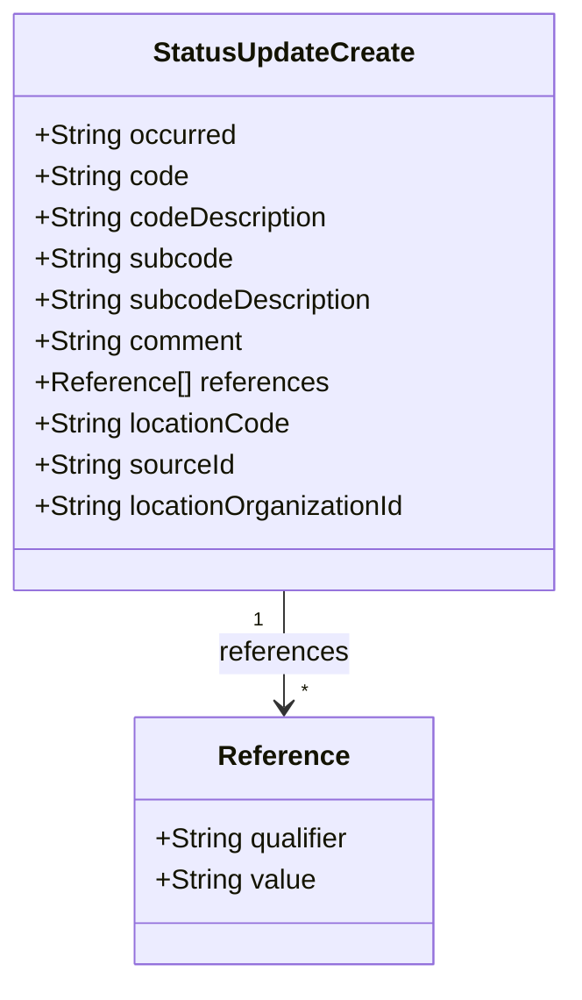
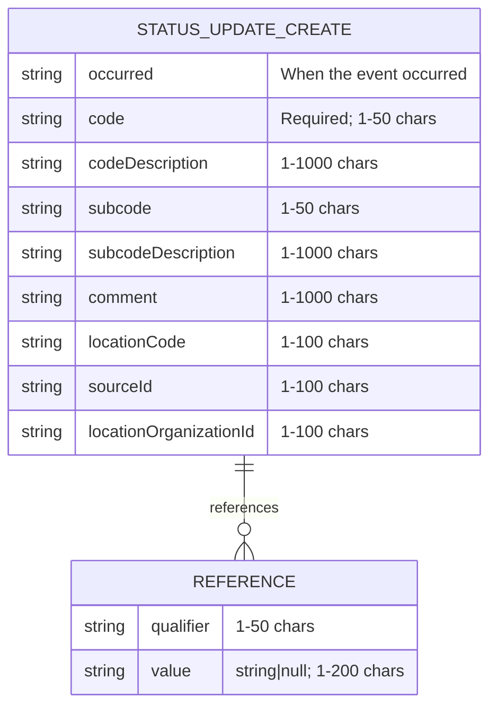

# Diagram: entity_core/entity_service/entity_service/common/json_schema/status_update.py

> Auto-generated by Obscura crawlers

## Diagram 1

### SVG

<svg id="container" width="333.5625" xmlns="http://www.w3.org/2000/svg" class="classDiagram" height="570" viewBox="0 0 333.5625 570" role="graphics-document document" aria-roledescription="class"><g><defs><marker id="container_class-aggregationStart" class="marker aggregation class" refX="18" refY="7" markerWidth="190" markerHeight="240" orient="auto"><path d="M 18,7 L9,13 L1,7 L9,1 Z"></path></marker></defs><defs><marker id="container_class-aggregationEnd" class="marker aggregation class" refX="1" refY="7" markerWidth="20" markerHeight="28" orient="auto"><path d="M 18,7 L9,13 L1,7 L9,1 Z"></path></marker></defs><defs><marker id="container_class-extensionStart" class="marker extension class" refX="18" refY="7" markerWidth="190" markerHeight="240" orient="auto"><path d="M 1,7 L18,13 V 1 Z"></path></marker></defs><defs><marker id="container_class-extensionEnd" class="marker extension class" refX="1" refY="7" markerWidth="20" markerHeight="28" orient="auto"><path d="M 1,1 V 13 L18,7 Z"></path></marker></defs><defs><marker id="container_class-compositionStart" class="marker composition class" refX="18" refY="7" markerWidth="190" markerHeight="240" orient="auto"><path d="M 18,7 L9,13 L1,7 L9,1 Z"></path></marker></defs><defs><marker id="container_class-compositionEnd" class="marker composition class" refX="1" refY="7" markerWidth="20" markerHeight="28" orient="auto"><path d="M 18,7 L9,13 L1,7 L9,1 Z"></path></marker></defs><defs><marker id="container_class-dependencyStart" class="marker dependency class" refX="6" refY="7" markerWidth="190" markerHeight="240" orient="auto"><path d="M 5,7 L9,13 L1,7 L9,1 Z"></path></marker></defs><defs><marker id="container_class-dependencyEnd" class="marker dependency class" refX="13" refY="7" markerWidth="20" markerHeight="28" orient="auto"><path d="M 18,7 L9,13 L14,7 L9,1 Z"></path></marker></defs><defs><marker id="container_class-lollipopStart" class="marker lollipop class" refX="13" refY="7" markerWidth="190" markerHeight="240" orient="auto"><circle stroke="black" fill="transparent" cx="7" cy="7" r="6"></circle></marker></defs><defs><marker id="container_class-lollipopEnd" class="marker lollipop class" refX="1" refY="7" markerWidth="190" markerHeight="240" orient="auto"><circle stroke="black" fill="transparent" cx="7" cy="7" r="6"></circle></marker></defs><g class="root"><g class="clusters"></g><g class="edgePaths"><path d="M166.781,344L166.781,350.167C166.781,356.333,166.781,368.667,166.781,380C166.781,391.333,166.781,401.667,166.781,406.833L166.781,412" id="id_StatusUpdateCreate_Reference_1" class="edge-thickness-normal edge-pattern-solid relation" style=";;;" data-edge="true" data-et="edge" data-id="id_StatusUpdateCreate_Reference_1" data-points="W3sieCI6MTY2Ljc4MTI1LCJ5IjozNDR9LHsieCI6MTY2Ljc4MTI1LCJ5IjozODF9LHsieCI6MTY2Ljc4MTI1LCJ5Ijo0MTh9XQ==" marker-end="url(#container_class-dependencyEnd)"></path></g><g class="edgeLabels"><g class="edgeLabel" transform="translate(166.78125, 381)"><g class="label" data-id="id_StatusUpdateCreate_Reference_1" transform="translate(-37.828125, -12)"><foreignObject width="75.65625" height="24">

references

</foreignObject></g></g><g class="edgeTerminals" transform="translate(151.78125, 361.5)"><g class="inner" transform="translate(0, 0)"><foreignObject style="width: 9px; height: 12px;">
1
</foreignObject></g></g><g class="edgeTerminals" transform="translate(176.78125, 395.5)"><g class="inner" transform="translate(0, 0)"></g><foreignObject style="width: 9px; height: 12px;">
*
</foreignObject></g></g><g class="nodes"><g class="node default" id="classId-StatusUpdateCreate-0" transform="translate(166.78125, 176)"><g class="basic label-container"><path d="M-158.78125 -168 L158.78125 -168 L158.78125 168 L-158.78125 168" stroke="none" stroke-width="0" fill="#ECECFF" style=""></path><path d="M-158.78125 -168 C-85.44837867845865 -168, -12.115507356917306 -168, 158.78125 -168 M-158.78125 -168 C-62.78997483056595 -168, 33.201300338868094 -168, 158.78125 -168 M158.78125 -168 C158.78125 -67.68709461681914, 158.78125 32.625810766361724, 158.78125 168 M158.78125 -168 C158.78125 -92.0257086642195, 158.78125 -16.051417328438987, 158.78125 168 M158.78125 168 C56.85532993123199 168, -45.070590137536016 168, -158.78125 168 M158.78125 168 C33.4003960756901 168, -91.9804578486198 168, -158.78125 168 M-158.78125 168 C-158.78125 82.79690865086614, -158.78125 -2.4061826982677132, -158.78125 -168 M-158.78125 168 C-158.78125 38.381870099598245, -158.78125 -91.23625980080351, -158.78125 -168" stroke="#9370DB" stroke-width="1.3" fill="none" stroke-dasharray="0 0" style=""></path></g><g class="annotation-group text" transform="translate(0, -144)"></g><g class="label-group text" transform="translate(-73.5625, -144)"><g class="label" style="font-weight: bolder" transform="translate(0,-12)"><foreignObject width="147.125" height="24">

StatusUpdateCreate

</foreignObject></g></g><g class="members-group text" transform="translate(-146.78125, -96)"><g class="label" style="" transform="translate(0,-12)"><foreignObject width="118.109375" height="24">

+String occurred

</foreignObject></g><g class="label" style="" transform="translate(0,12)"><foreignObject width="89.4375" height="24">

+String code

</foreignObject></g><g class="label" style="" transform="translate(0,36)"><foreignObject width="172.78125" height="24">

+String codeDescription

</foreignObject></g><g class="label" style="" transform="translate(0,60)"><foreignObject width="115.71875" height="24">

+String subcode

</foreignObject></g><g class="label" style="" transform="translate(0,84)"><foreignObject width="199.0625" height="24">

+String subcodeDescription

</foreignObject></g><g class="label" style="" transform="translate(0,108)"><foreignObject width="122.4375" height="24">

+String comment

</foreignObject></g><g class="label" style="" transform="translate(0,132)"><foreignObject width="170.109375" height="24">

+Reference[] references

</foreignObject></g><g class="label" style="" transform="translate(0,156)"><foreignObject width="149.890625" height="24">

+String locationCode

</foreignObject></g><g class="label" style="" transform="translate(0,180)"><foreignObject width="116.625" height="24">

+String sourceId

</foreignObject></g><g class="label" style="" transform="translate(0,204)"><foreignObject width="220" height="24">

+String locationOrganizationId

</foreignObject></g></g><g class="methods-group text" transform="translate(-146.78125, 168)"></g><g class="divider" style=""><path d="M-158.78125 -120 C-32.33963033215821 -120, 94.10198933568358 -120, 158.78125 -120 M-158.78125 -120 C-42.305481806935376 -120, 74.17028638612925 -120, 158.78125 -120" stroke="#9370DB" stroke-width="1.3" fill="none" stroke-dasharray="0 0" style=""></path></g><g class="divider" style=""><path d="M-158.78125 144 C-52.27075828252268 144, 54.239733434954644 144, 158.78125 144 M-158.78125 144 C-94.01130358783598 144, -29.241357175671965 144, 158.78125 144" stroke="#9370DB" stroke-width="1.3" fill="none" stroke-dasharray="0 0" style=""></path></g></g><g class="node default" id="classId-Reference-1" transform="translate(166.78125, 490)"><g class="basic label-container"><path d="M-87.84765625 -72 L87.84765625 -72 L87.84765625 72 L-87.84765625 72" stroke="none" stroke-width="0" fill="#ECECFF" style=""></path><path d="M-87.84765625 -72 C-25.208684043828995 -72, 37.43028816234201 -72, 87.84765625 -72 M-87.84765625 -72 C-52.6645005506068 -72, -17.481344851213606 -72, 87.84765625 -72 M87.84765625 -72 C87.84765625 -21.331903763745757, 87.84765625 29.336192472508486, 87.84765625 72 M87.84765625 -72 C87.84765625 -22.865518530028936, 87.84765625 26.268962939942128, 87.84765625 72 M87.84765625 72 C48.74054614893711 72, 9.633436047874227 72, -87.84765625 72 M87.84765625 72 C52.52911434561754 72, 17.210572441235087 72, -87.84765625 72 M-87.84765625 72 C-87.84765625 22.47309541634928, -87.84765625 -27.053809167301438, -87.84765625 -72 M-87.84765625 72 C-87.84765625 28.526018474607547, -87.84765625 -14.947963050784907, -87.84765625 -72" stroke="#9370DB" stroke-width="1.3" fill="none" stroke-dasharray="0 0" style=""></path></g><g class="annotation-group text" transform="translate(0, -48)"></g><g class="label-group text" transform="translate(-36.5078125, -48)"><g class="label" style="font-weight: bolder" transform="translate(0,-12)"><foreignObject width="73.015625" height="24">

Reference

</foreignObject></g></g><g class="members-group text" transform="translate(-75.84765625, 0)"><g class="label" style="" transform="translate(0,-12)"><foreignObject width="115.1875" height="24">

+String qualifier

</foreignObject></g><g class="label" style="" transform="translate(0,12)"><foreignObject width="93.359375" height="24">

+String value

</foreignObject></g></g><g class="methods-group text" transform="translate(-75.84765625, 72)"></g><g class="divider" style=""><path d="M-87.84765625 -24 C-31.198549064392623 -24, 25.450558121214755 -24, 87.84765625 -24 M-87.84765625 -24 C-38.66815398373944 -24, 10.511348282521126 -24, 87.84765625 -24" stroke="#9370DB" stroke-width="1.3" fill="none" stroke-dasharray="0 0" style=""></path></g><g class="divider" style=""><path d="M-87.84765625 48 C-19.64403721481642 48, 48.55958182036716 48, 87.84765625 48 M-87.84765625 48 C-19.070518870662752 48, 49.706618508674495 48, 87.84765625 48" stroke="#9370DB" stroke-width="1.3" fill="none" stroke-dasharray="0 0" style=""></path></g></g></g></g></g></svg>

## Diagram 2

### SVG

<svg id="container" width="479.421875" xmlns="http://www.w3.org/2000/svg" class="erDiagram" height="672.75" viewBox="0 0 479.421875 672.75" role="graphics-document document" aria-roledescription="er"><g><defs><marker id="container_er-onlyOneStart" class="marker onlyOne er" refX="0" refY="9" markerWidth="18" markerHeight="18" orient="auto"><path d="M9,0 L9,18 M15,0 L15,18"></path></marker></defs><defs><marker id="container_er-onlyOneEnd" class="marker onlyOne er" refX="18" refY="9" markerWidth="18" markerHeight="18" orient="auto"><path d="M3,0 L3,18 M9,0 L9,18"></path></marker></defs><defs><marker id="container_er-zeroOrOneStart" class="marker zeroOrOne er" refX="0" refY="9" markerWidth="30" markerHeight="18" orient="auto"><circle fill="white" cx="21" cy="9" r="6"></circle><path d="M9,0 L9,18"></path></marker></defs><defs><marker id="container_er-zeroOrOneEnd" class="marker zeroOrOne er" refX="30" refY="9" markerWidth="30" markerHeight="18" orient="auto"><circle fill="white" cx="9" cy="9" r="6"></circle><path d="M21,0 L21,18"></path></marker></defs><defs><marker id="container_er-oneOrMoreStart" class="marker oneOrMore er" refX="18" refY="18" markerWidth="45" markerHeight="36" orient="auto"><path d="M0,18 Q 18,0 36,18 Q 18,36 0,18 M42,9 L42,27"></path></marker></defs><defs><marker id="container_er-oneOrMoreEnd" class="marker oneOrMore er" refX="27" refY="18" markerWidth="45" markerHeight="36" orient="auto"><path d="M3,9 L3,27 M9,18 Q27,0 45,18 Q27,36 9,18"></path></marker></defs><defs><marker id="container_er-zeroOrMoreStart" class="marker zeroOrMore er" refX="18" refY="18" markerWidth="57" markerHeight="36" orient="auto"><circle fill="white" cx="48" cy="18" r="6"></circle><path d="M0,18 Q18,0 36,18 Q18,36 0,18"></path></marker></defs><defs><marker id="container_er-zeroOrMoreEnd" class="marker zeroOrMore er" refX="39" refY="18" markerWidth="57" markerHeight="36" orient="auto"><circle fill="white" cx="9" cy="18" r="6"></circle><path d="M21,18 Q39,0 57,18 Q39,36 21,18"></path></marker></defs><g class="root"><g class="clusters"></g><g class="edgePaths"><path d="M239.711,435.5L239.711,443.917C239.711,452.333,239.711,469.167,239.711,486C239.711,502.833,239.711,519.667,239.711,528.083L239.711,536.5" id="id_entity-STATUS_UPDATE_CREATE-0_entity-REFERENCE-1_0" class="edge-thickness-normal edge-pattern-solid relationshipLine" style="undefined;;;undefined" data-edge="true" data-et="edge" data-id="id_entity-STATUS_UPDATE_CREATE-0_entity-REFERENCE-1_0" data-points="W3sieCI6MjM5LjcxMDkzNzUsInkiOjQzNS41fSx7IngiOjIzOS43MTA5Mzc1LCJ5Ijo0ODZ9LHsieCI6MjM5LjcxMDkzNzUsInkiOjUzNi41fV0=" marker-start="url(#container_er-onlyOneStart)" marker-end="url(#container_er-zeroOrMoreEnd)"></path></g><g class="edgeLabels"><g class="edgeLabel" transform="translate(239.7109375, 486)"><g class="label" data-id="id_entity-STATUS_UPDATE_CREATE-0_entity-REFERENCE-1_0" transform="translate(-33.1015625, -10.5)"><foreignObject width="66.203125" height="21">

references

</foreignObject></g></g></g><g class="nodes"><g class="node default" id="entity-STATUS_UPDATE_CREATE-0" transform="translate(239.7109375, 221.75)"><g style=""><path d="M-231.7109375 -213.75 L231.7109375 -213.75 L231.7109375 213.75 L-231.7109375 213.75" stroke="none" stroke-width="0" fill="#ECECFF"></path><path d="M-231.7109375 -213.75 C-49.01990123742701 -213.75, 133.671135025146 -213.75, 231.7109375 -213.75 M-231.7109375 -213.75 C-106.62669118983102 -213.75, 18.457555120337958 -213.75, 231.7109375 -213.75 M231.7109375 -213.75 C231.7109375 -91.84974135993335, 231.7109375 30.050517280133306, 231.7109375 213.75 M231.7109375 -213.75 C231.7109375 -106.24185127072036, 231.7109375 1.2662974585592792, 231.7109375 213.75 M231.7109375 213.75 C91.91300105885176 213.75, -47.884935382296476 213.75, -231.7109375 213.75 M231.7109375 213.75 C119.96809212979738 213.75, 8.225246759594768 213.75, -231.7109375 213.75 M-231.7109375 213.75 C-231.7109375 85.21430802213811, -231.7109375 -43.321383955723775, -231.7109375 -213.75 M-231.7109375 213.75 C-231.7109375 112.07548695746965, -231.7109375 10.4009739149393, -231.7109375 -213.75" stroke="#9370DB" stroke-width="1.3" fill="none" stroke-dasharray="0 0"></path></g><g style="" class="row-rect-odd"><path d="M-231.7109375 -171 L231.7109375 -171 L231.7109375 -128.25 L-231.7109375 -128.25" stroke="none" stroke-width="0" fill="hsl(240, 100%, 100%)"></path><path d="M-231.7109375 -171 C-64.20555547809468 -171, 103.29982654381064 -171, 231.7109375 -171 M-231.7109375 -171 C-121.12122326386859 -171, -10.531509027737172 -171, 231.7109375 -171 M231.7109375 -171 C231.7109375 -161.48626215561575, 231.7109375 -151.9725243112315, 231.7109375 -128.25 M231.7109375 -171 C231.7109375 -155.8862799436924, 231.7109375 -140.77255988738477, 231.7109375 -128.25 M231.7109375 -128.25 C135.14090807121266 -128.25, 38.5708786424253 -128.25, -231.7109375 -128.25 M231.7109375 -128.25 C110.39760598608699 -128.25, -10.915725527826027 -128.25, -231.7109375 -128.25 M-231.7109375 -128.25 C-231.7109375 -144.65827731734151, -231.7109375 -161.06655463468303, -231.7109375 -171 M-231.7109375 -128.25 C-231.7109375 -144.82790515983464, -231.7109375 -161.40581031966929, -231.7109375 -171" stroke="#9370DB" stroke-width="1.3" fill="none" stroke-dasharray="0 0"></path></g><g style="" class="row-rect-even"><path d="M-231.7109375 -128.25 L231.7109375 -128.25 L231.7109375 -85.5 L-231.7109375 -85.5" stroke="none" stroke-width="0" fill="hsl(240, 100%, 97.2745098039%)"></path><path d="M-231.7109375 -128.25 C-56.20356950521381 -128.25, 119.30379848957239 -128.25, 231.7109375 -128.25 M-231.7109375 -128.25 C-62.180964063821705 -128.25, 107.34900937235659 -128.25, 231.7109375 -128.25 M231.7109375 -128.25 C231.7109375 -113.61841400453667, 231.7109375 -98.98682800907334, 231.7109375 -85.5 M231.7109375 -128.25 C231.7109375 -112.81252111594736, 231.7109375 -97.37504223189472, 231.7109375 -85.5 M231.7109375 -85.5 C65.06247461814445 -85.5, -101.5859882637111 -85.5, -231.7109375 -85.5 M231.7109375 -85.5 C90.2821577541742 -85.5, -51.146621991651614 -85.5, -231.7109375 -85.5 M-231.7109375 -85.5 C-231.7109375 -97.50544123561578, -231.7109375 -109.51088247123155, -231.7109375 -128.25 M-231.7109375 -85.5 C-231.7109375 -101.25996658476282, -231.7109375 -117.01993316952564, -231.7109375 -128.25" stroke="#9370DB" stroke-width="1.3" fill="none" stroke-dasharray="0 0"></path></g><g style="" class="row-rect-odd"><path d="M-231.7109375 -85.5 L231.7109375 -85.5 L231.7109375 -42.75 L-231.7109375 -42.75" stroke="none" stroke-width="0" fill="hsl(240, 100%, 100%)"></path><path d="M-231.7109375 -85.5 C-99.17315414873093 -85.5, 33.36462920253814 -85.5, 231.7109375 -85.5 M-231.7109375 -85.5 C-100.8580778279632 -85.5, 29.9947818440736 -85.5, 231.7109375 -85.5 M231.7109375 -85.5 C231.7109375 -75.21877246466948, 231.7109375 -64.93754492933897, 231.7109375 -42.75 M231.7109375 -85.5 C231.7109375 -68.66181002139922, 231.7109375 -51.82362004279844, 231.7109375 -42.75 M231.7109375 -42.75 C62.195231132030756 -42.75, -107.32047523593849 -42.75, -231.7109375 -42.75 M231.7109375 -42.75 C137.57382000563697 -42.75, 43.43670251127395 -42.75, -231.7109375 -42.75 M-231.7109375 -42.75 C-231.7109375 -58.73939740774094, -231.7109375 -74.72879481548188, -231.7109375 -85.5 M-231.7109375 -42.75 C-231.7109375 -51.516504860672086, -231.7109375 -60.28300972134417, -231.7109375 -85.5" stroke="#9370DB" stroke-width="1.3" fill="none" stroke-dasharray="0 0"></path></g><g style="" class="row-rect-even"><path d="M-231.7109375 -42.75 L231.7109375 -42.75 L231.7109375 0 L-231.7109375 0" stroke="none" stroke-width="0" fill="hsl(240, 100%, 97.2745098039%)"></path><path d="M-231.7109375 -42.75 C-81.43877167882783 -42.75, 68.83339414234433 -42.75, 231.7109375 -42.75 M-231.7109375 -42.75 C-93.25154627246226 -42.75, 45.20784495507547 -42.75, 231.7109375 -42.75 M231.7109375 -42.75 C231.7109375 -30.842089240723716, 231.7109375 -18.934178481447432, 231.7109375 0 M231.7109375 -42.75 C231.7109375 -32.768814832027246, 231.7109375 -22.787629664054492, 231.7109375 0 M231.7109375 0 C88.5989729926091 0, -54.51299151478179 0, -231.7109375 0 M231.7109375 0 C97.90278482501398 0, -35.90536784997204 0, -231.7109375 0 M-231.7109375 0 C-231.7109375 -13.459747131874852, -231.7109375 -26.919494263749705, -231.7109375 -42.75 M-231.7109375 0 C-231.7109375 -10.46230821794936, -231.7109375 -20.92461643589872, -231.7109375 -42.75" stroke="#9370DB" stroke-width="1.3" fill="none" stroke-dasharray="0 0"></path></g><g style="" class="row-rect-odd"><path d="M-231.7109375 0 L231.7109375 0 L231.7109375 42.75 L-231.7109375 42.75" stroke="none" stroke-width="0" fill="hsl(240, 100%, 100%)"></path><path d="M-231.7109375 0 C-106.42034362347867 0, 18.870250253042656 0, 231.7109375 0 M-231.7109375 0 C-47.47022738022628 0, 136.77048273954745 0, 231.7109375 0 M231.7109375 0 C231.7109375 16.670165947385055, 231.7109375 33.34033189477011, 231.7109375 42.75 M231.7109375 0 C231.7109375 8.853601431783058, 231.7109375 17.707202863566117, 231.7109375 42.75 M231.7109375 42.75 C110.99742275558421 42.75, -9.716091988831579 42.75, -231.7109375 42.75 M231.7109375 42.75 C48.81897147669142 42.75, -134.07299454661717 42.75, -231.7109375 42.75 M-231.7109375 42.75 C-231.7109375 27.78901521883963, -231.7109375 12.82803043767926, -231.7109375 0 M-231.7109375 42.75 C-231.7109375 32.86863915007967, -231.7109375 22.987278300159346, -231.7109375 0" stroke="#9370DB" stroke-width="1.3" fill="none" stroke-dasharray="0 0"></path></g><g style="" class="row-rect-even"><path d="M-231.7109375 42.75 L231.7109375 42.75 L231.7109375 85.5 L-231.7109375 85.5" stroke="none" stroke-width="0" fill="hsl(240, 100%, 97.2745098039%)"></path><path d="M-231.7109375 42.75 C-128.64905150514232 42.75, -25.58716551028465 42.75, 231.7109375 42.75 M-231.7109375 42.75 C-54.29155483143873 42.75, 123.12782783712254 42.75, 231.7109375 42.75 M231.7109375 42.75 C231.7109375 58.14783932263165, 231.7109375 73.5456786452633, 231.7109375 85.5 M231.7109375 42.75 C231.7109375 58.75291689403615, 231.7109375 74.7558337880723, 231.7109375 85.5 M231.7109375 85.5 C130.74310305858063 85.5, 29.77526861716126 85.5, -231.7109375 85.5 M231.7109375 85.5 C96.84345955358029 85.5, -38.02401839283942 85.5, -231.7109375 85.5 M-231.7109375 85.5 C-231.7109375 68.82057336300855, -231.7109375 52.141146726017084, -231.7109375 42.75 M-231.7109375 85.5 C-231.7109375 75.42998692821936, -231.7109375 65.35997385643873, -231.7109375 42.75" stroke="#9370DB" stroke-width="1.3" fill="none" stroke-dasharray="0 0"></path></g><g style="" class="row-rect-odd"><path d="M-231.7109375 85.5 L231.7109375 85.5 L231.7109375 128.25 L-231.7109375 128.25" stroke="none" stroke-width="0" fill="hsl(240, 100%, 100%)"></path><path d="M-231.7109375 85.5 C-103.8547711905862 85.5, 24.00139511882759 85.5, 231.7109375 85.5 M-231.7109375 85.5 C-97.22203771260664 85.5, 37.26686207478673 85.5, 231.7109375 85.5 M231.7109375 85.5 C231.7109375 98.47290762996633, 231.7109375 111.44581525993264, 231.7109375 128.25 M231.7109375 85.5 C231.7109375 96.53452732867038, 231.7109375 107.56905465734077, 231.7109375 128.25 M231.7109375 128.25 C88.01590934879698 128.25, -55.67911880240604 128.25, -231.7109375 128.25 M231.7109375 128.25 C53.763311913948854 128.25, -124.18431367210229 128.25, -231.7109375 128.25 M-231.7109375 128.25 C-231.7109375 117.53272637924945, -231.7109375 106.8154527584989, -231.7109375 85.5 M-231.7109375 128.25 C-231.7109375 111.33749503815037, -231.7109375 94.42499007630073, -231.7109375 85.5" stroke="#9370DB" stroke-width="1.3" fill="none" stroke-dasharray="0 0"></path></g><g style="" class="row-rect-even"><path d="M-231.7109375 128.25 L231.7109375 128.25 L231.7109375 171 L-231.7109375 171" stroke="none" stroke-width="0" fill="hsl(240, 100%, 97.2745098039%)"></path><path d="M-231.7109375 128.25 C-59.33785406306254 128.25, 113.03522937387493 128.25, 231.7109375 128.25 M-231.7109375 128.25 C-82.48114904715857 128.25, 66.74863940568287 128.25, 231.7109375 128.25 M231.7109375 128.25 C231.7109375 137.62592925028792, 231.7109375 147.00185850057588, 231.7109375 171 M231.7109375 128.25 C231.7109375 141.4164304583559, 231.7109375 154.5828609167118, 231.7109375 171 M231.7109375 171 C121.33277379442406 171, 10.954610088848113 171, -231.7109375 171 M231.7109375 171 C104.66769893443707 171, -22.37553963112586 171, -231.7109375 171 M-231.7109375 171 C-231.7109375 156.7704287573693, -231.7109375 142.54085751473863, -231.7109375 128.25 M-231.7109375 171 C-231.7109375 158.80855622870683, -231.7109375 146.61711245741364, -231.7109375 128.25" stroke="#9370DB" stroke-width="1.3" fill="none" stroke-dasharray="0 0"></path></g><g style="" class="row-rect-odd"><path d="M-231.7109375 171 L231.7109375 171 L231.7109375 213.75 L-231.7109375 213.75" stroke="none" stroke-width="0" fill="hsl(240, 100%, 100%)"></path><path d="M-231.7109375 171 C-108.35603378541336 171, 14.998869929173281 171, 231.7109375 171 M-231.7109375 171 C-88.07134425176608 171, 55.568248996467844 171, 231.7109375 171 M231.7109375 171 C231.7109375 182.91591535860582, 231.7109375 194.83183071721163, 231.7109375 213.75 M231.7109375 171 C231.7109375 180.10289925133307, 231.7109375 189.2057985026661, 231.7109375 213.75 M231.7109375 213.75 C75.68685368433071 213.75, -80.33723013133857 213.75, -231.7109375 213.75 M231.7109375 213.75 C70.52353463406993 213.75, -90.66386823186014 213.75, -231.7109375 213.75 M-231.7109375 213.75 C-231.7109375 204.90841931787722, -231.7109375 196.06683863575446, -231.7109375 171 M-231.7109375 213.75 C-231.7109375 204.09358815179962, -231.7109375 194.43717630359927, -231.7109375 171" stroke="#9370DB" stroke-width="1.3" fill="none" stroke-dasharray="0 0"></path></g><g class="label name" transform="translate(-87.1796875, -204.375)" style=""><foreignObject width="174.359375" height="24">

STATUS_UPDATE_CREATE

</foreignObject></g><g class="label attribute-type" transform="translate(-219.2109375, -161.625)" style=""><foreignObject width="41.640625" height="24">

string

</foreignObject></g><g class="label attribute-name" transform="translate(-152.5703125, -161.625)" style=""><foreignObject width="63.640625" height="24">

occurred

</foreignObject></g><g class="label attribute-keys" transform="translate(37.9609375, -161.625)" style=""><foreignObject width="0" height="0">

</foreignObject></g><g class="label attribute-comment" transform="translate(37.9609375, -161.625)" style=""><foreignObject width="181.25" height="24">

When the event occurred

</foreignObject></g><g class="label attribute-type" transform="translate(-219.2109375, -118.875)" style=""><foreignObject width="41.640625" height="24">

string

</foreignObject></g><g class="label attribute-name" transform="translate(-152.5703125, -118.875)" style=""><foreignObject width="34.96875" height="24">

code

</foreignObject></g><g class="label attribute-keys" transform="translate(37.9609375, -118.875)" style=""><foreignObject width="0" height="0">

</foreignObject></g><g class="label attribute-comment" transform="translate(37.9609375, -118.875)" style=""><foreignObject width="147.15625" height="24">

Required; 1-50 chars

</foreignObject></g><g class="label attribute-type" transform="translate(-219.2109375, -76.125)" style=""><foreignObject width="41.640625" height="24">

string

</foreignObject></g><g class="label attribute-name" transform="translate(-152.5703125, -76.125)" style=""><foreignObject width="118.3125" height="24">

codeDescription

</foreignObject></g><g class="label attribute-keys" transform="translate(37.9609375, -76.125)" style=""><foreignObject width="0" height="0">

</foreignObject></g><g class="label attribute-comment" transform="translate(37.9609375, -76.125)" style=""><foreignObject width="89.359375" height="24">

1-1000 chars

</foreignObject></g><g class="label attribute-type" transform="translate(-219.2109375, -33.375)" style=""><foreignObject width="41.640625" height="24">

string

</foreignObject></g><g class="label attribute-name" transform="translate(-152.5703125, -33.375)" style=""><foreignObject width="61.25" height="24">

subcode

</foreignObject></g><g class="label attribute-keys" transform="translate(37.9609375, -33.375)" style=""><foreignObject width="0" height="0">

</foreignObject></g><g class="label attribute-comment" transform="translate(37.9609375, -33.375)" style=""><foreignObject width="73.546875" height="24">

1-50 chars

</foreignObject></g><g class="label attribute-type" transform="translate(-219.2109375, 9.375)" style=""><foreignObject width="41.640625" height="24">

string

</foreignObject></g><g class="label attribute-name" transform="translate(-152.5703125, 9.375)" style=""><foreignObject width="144.59375" height="24">

subcodeDescription

</foreignObject></g><g class="label attribute-keys" transform="translate(37.9609375, 9.375)" style=""><foreignObject width="0" height="0">

</foreignObject></g><g class="label attribute-comment" transform="translate(37.9609375, 9.375)" style=""><foreignObject width="89.359375" height="24">

1-1000 chars

</foreignObject></g><g class="label attribute-type" transform="translate(-219.2109375, 52.125)" style=""><foreignObject width="41.640625" height="24">

string

</foreignObject></g><g class="label attribute-name" transform="translate(-152.5703125, 52.125)" style=""><foreignObject width="67.96875" height="24">

comment

</foreignObject></g><g class="label attribute-keys" transform="translate(37.9609375, 52.125)" style=""><foreignObject width="0" height="0">

</foreignObject></g><g class="label attribute-comment" transform="translate(37.9609375, 52.125)" style=""><foreignObject width="89.359375" height="24">

1-1000 chars

</foreignObject></g><g class="label attribute-type" transform="translate(-219.2109375, 94.875)" style=""><foreignObject width="41.640625" height="24">

string

</foreignObject></g><g class="label attribute-name" transform="translate(-152.5703125, 94.875)" style=""><foreignObject width="95.4375" height="24">

locationCode

</foreignObject></g><g class="label attribute-keys" transform="translate(37.9609375, 94.875)" style=""><foreignObject width="0" height="0">

</foreignObject></g><g class="label attribute-comment" transform="translate(37.9609375, 94.875)" style=""><foreignObject width="80.421875" height="24">

1-100 chars

</foreignObject></g><g class="label attribute-type" transform="translate(-219.2109375, 137.625)" style=""><foreignObject width="41.640625" height="24">

string

</foreignObject></g><g class="label attribute-name" transform="translate(-152.5703125, 137.625)" style=""><foreignObject width="62.171875" height="24">

sourceId

</foreignObject></g><g class="label attribute-keys" transform="translate(37.9609375, 137.625)" style=""><foreignObject width="0" height="0">

</foreignObject></g><g class="label attribute-comment" transform="translate(37.9609375, 137.625)" style=""><foreignObject width="80.421875" height="24">

1-100 chars

</foreignObject></g><g class="label attribute-type" transform="translate(-219.2109375, 180.375)" style=""><foreignObject width="41.640625" height="24">

string

</foreignObject></g><g class="label attribute-name" transform="translate(-152.5703125, 180.375)" style=""><foreignObject width="165.53125" height="24">

locationOrganizationId

</foreignObject></g><g class="label attribute-keys" transform="translate(37.9609375, 180.375)" style=""><foreignObject width="0" height="0">

</foreignObject></g><g class="label attribute-comment" transform="translate(37.9609375, 180.375)" style=""><foreignObject width="80.421875" height="24">

1-100 chars

</foreignObject></g><g class="divider"><path d="M-231.7109375 -171 C-90.7744766404991 -171, 50.161984219001795 -171, 231.7109375 -171 M-231.7109375 -171 C-90.95288562143955 -171, 49.8051662571209 -171, 231.7109375 -171" stroke="#9370DB" stroke-width="1.3" fill="none" stroke-dasharray="0 0"></path></g><g class="divider"><path d="M-165.0703125 -171 C-165.0703125 -30.918398406637493, -165.0703125 109.16320318672501, -165.0703125 213.75 M-165.0703125 -171 C-165.0703125 -48.924156867813636, -165.0703125 73.15168626437273, -165.0703125 213.75" stroke="#9370DB" stroke-width="1.3" fill="none" stroke-dasharray="0 0"></path></g><g class="divider"><path d="M25.4609375 -171 C25.4609375 -28.043209570067745, 25.4609375 114.91358085986451, 25.4609375 213.75 M25.4609375 -171 C25.4609375 -18.635556554726122, 25.4609375 133.72888689054776, 25.4609375 213.75" stroke="#9370DB" stroke-width="1.3" fill="none" stroke-dasharray="0 0"></path></g><g class="divider"><path d="M-231.7109375 -171 C-92.6053281342241 -171, 46.50028123155181 -171, 231.7109375 -171 M-231.7109375 -171 C-99.5400344056614 -171, 32.6308686886772 -171, 231.7109375 -171" stroke="#9370DB" stroke-width="1.3" fill="none" stroke-dasharray="0 0"></path></g></g><g class="node default" id="entity-REFERENCE-1" transform="translate(239.7109375, 600.625)"><g style=""><path d="M-171.65625 -64.125 L171.65625 -64.125 L171.65625 64.125 L-171.65625 64.125" stroke="none" stroke-width="0" fill="#ECECFF"></path><path d="M-171.65625 -64.125 C-92.3512422379105 -64.125, -13.046234475820995 -64.125, 171.65625 -64.125 M-171.65625 -64.125 C-68.77222654912369 -64.125, 34.111796901752626 -64.125, 171.65625 -64.125 M171.65625 -64.125 C171.65625 -23.91380344016612, 171.65625 16.29739311966776, 171.65625 64.125 M171.65625 -64.125 C171.65625 -20.034495919315198, 171.65625 24.056008161369604, 171.65625 64.125 M171.65625 64.125 C68.7481229921809 64.125, -34.16000401563821 64.125, -171.65625 64.125 M171.65625 64.125 C52.296130166776166 64.125, -67.06398966644767 64.125, -171.65625 64.125 M-171.65625 64.125 C-171.65625 23.501608772561532, -171.65625 -17.121782454876936, -171.65625 -64.125 M-171.65625 64.125 C-171.65625 27.550258878340607, -171.65625 -9.024482243318786, -171.65625 -64.125" stroke="#9370DB" stroke-width="1.3" fill="none" stroke-dasharray="0 0"></path></g><g style="" class="row-rect-odd"><path d="M-171.65625 -21.375 L171.65625 -21.375 L171.65625 21.375 L-171.65625 21.375" stroke="none" stroke-width="0" fill="hsl(240, 100%, 100%)"></path><path d="M-171.65625 -21.375 C-35.52344240705921 -21.375, 100.60936518588159 -21.375, 171.65625 -21.375 M-171.65625 -21.375 C-91.95500756488829 -21.375, -12.253765129776582 -21.375, 171.65625 -21.375 M171.65625 -21.375 C171.65625 -8.645822163057042, 171.65625 4.083355673885915, 171.65625 21.375 M171.65625 -21.375 C171.65625 -11.183226971794094, 171.65625 -0.9914539435881871, 171.65625 21.375 M171.65625 21.375 C78.94262796219886 21.375, -13.770994075602289 21.375, -171.65625 21.375 M171.65625 21.375 C99.43448523731011 21.375, 27.212720474620227 21.375, -171.65625 21.375 M-171.65625 21.375 C-171.65625 9.494880409949756, -171.65625 -2.3852391801004877, -171.65625 -21.375 M-171.65625 21.375 C-171.65625 11.138358200622365, -171.65625 0.9017164012447303, -171.65625 -21.375" stroke="#9370DB" stroke-width="1.3" fill="none" stroke-dasharray="0 0"></path></g><g style="" class="row-rect-even"><path d="M-171.65625 21.375 L171.65625 21.375 L171.65625 64.125 L-171.65625 64.125" stroke="none" stroke-width="0" fill="hsl(240, 100%, 97.2745098039%)"></path><path d="M-171.65625 21.375 C-46.71585176134708 21.375, 78.22454647730584 21.375, 171.65625 21.375 M-171.65625 21.375 C-76.12859966341489 21.375, 19.399050673170223 21.375, 171.65625 21.375 M171.65625 21.375 C171.65625 30.546012619113824, 171.65625 39.71702523822765, 171.65625 64.125 M171.65625 21.375 C171.65625 36.93667824127895, 171.65625 52.498356482557895, 171.65625 64.125 M171.65625 64.125 C61.32338625544328 64.125, -49.009477489113436 64.125, -171.65625 64.125 M171.65625 64.125 C86.3385645878172 64.125, 1.0208791756344056 64.125, -171.65625 64.125 M-171.65625 64.125 C-171.65625 52.00620800084319, -171.65625 39.88741600168638, -171.65625 21.375 M-171.65625 64.125 C-171.65625 51.569232898224556, -171.65625 39.01346579644912, -171.65625 21.375" stroke="#9370DB" stroke-width="1.3" fill="none" stroke-dasharray="0 0"></path></g><g class="label name" transform="translate(-40.6796875, -54.75)" style=""><foreignObject width="81.359375" height="24">

REFERENCE

</foreignObject></g><g class="label attribute-type" transform="translate(-159.15625, -12)" style=""><foreignObject width="41.640625" height="24">

string

</foreignObject></g><g class="label attribute-name" transform="translate(-92.515625, -12)" style=""><foreignObject width="60.734375" height="24">

qualifier

</foreignObject></g><g class="label attribute-keys" transform="translate(-6.78125, -12)" style=""><foreignObject width="0" height="0">

</foreignObject></g><g class="label attribute-comment" transform="translate(-6.78125, -12)" style=""><foreignObject width="73.546875" height="24">

1-50 chars

</foreignObject></g><g class="label attribute-type" transform="translate(-159.15625, 30.75)" style=""><foreignObject width="41.640625" height="24">

string

</foreignObject></g><g class="label attribute-name" transform="translate(-92.515625, 30.75)" style=""><foreignObject width="38.890625" height="24">

value

</foreignObject></g><g class="label attribute-keys" transform="translate(-6.78125, 30.75)" style=""><foreignObject width="0" height="0">

</foreignObject></g><g class="label attribute-comment" transform="translate(-6.78125, 30.75)" style=""><foreignObject width="165.9375" height="24">

string|null; 1-200 chars

</foreignObject></g><g class="divider"><path d="M-171.65625 -21.375 C-101.57972732315304 -21.375, -31.503204646306074 -21.375, 171.65625 -21.375 M-171.65625 -21.375 C-58.21220743553084 -21.375, 55.231835128938314 -21.375, 171.65625 -21.375" stroke="#9370DB" stroke-width="1.3" fill="none" stroke-dasharray="0 0"></path></g><g class="divider"><path d="M-105.015625 -21.375 C-105.015625 1.9063294051684494, -105.015625 25.1876588103369, -105.015625 64.125 M-105.015625 -21.375 C-105.015625 0.7279909233439241, -105.015625 22.83098184668785, -105.015625 64.125" stroke="#9370DB" stroke-width="1.3" fill="none" stroke-dasharray="0 0"></path></g><g class="divider"><path d="M-19.28125 -21.375 C-19.28125 5.807391213067291, -19.28125 32.98978242613458, -19.28125 64.125 M-19.28125 -21.375 C-19.28125 5.528602241481607, -19.28125 32.432204482963215, -19.28125 64.125" stroke="#9370DB" stroke-width="1.3" fill="none" stroke-dasharray="0 0"></path></g><g class="divider"><path d="M-171.65625 -21.375 C-98.20068559572704 -21.375, -24.745121191454075 -21.375, 171.65625 -21.375 M-171.65625 -21.375 C-69.4342167185404 -21.375, 32.787816562919204 -21.375, 171.65625 -21.375" stroke="#9370DB" stroke-width="1.3" fill="none" stroke-dasharray="0 0"></path></g></g></g></g></g></svg>
