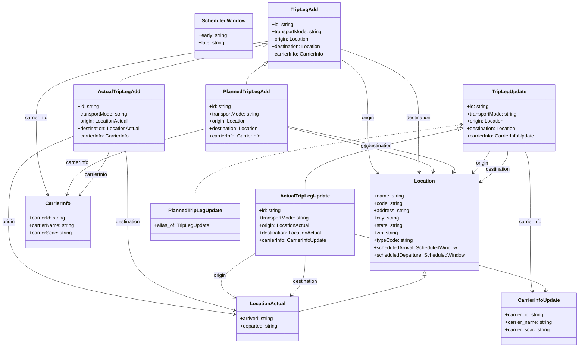

# Diagram: entity_core/entity_service/entity_service/common/json_schema/trip_leg_schema.py

> Auto-generated by Obscura crawlers

## Mermaid

### SVG

<svg id="container" width="1893.58203125" xmlns="http://www.w3.org/2000/svg" class="classDiagram" height="1126" viewBox="0 0 1893.58203125 1126" role="graphics-document document" aria-roledescription="class"><g><defs><marker id="container_class-aggregationStart" class="marker aggregation class" refX="18" refY="7" markerWidth="190" markerHeight="240" orient="auto"><path d="M 18,7 L9,13 L1,7 L9,1 Z"></path></marker></defs><defs><marker id="container_class-aggregationEnd" class="marker aggregation class" refX="1" refY="7" markerWidth="20" markerHeight="28" orient="auto"><path d="M 18,7 L9,13 L1,7 L9,1 Z"></path></marker></defs><defs><marker id="container_class-extensionStart" class="marker extension class" refX="18" refY="7" markerWidth="190" markerHeight="240" orient="auto"><path d="M 1,7 L18,13 V 1 Z"></path></marker></defs><defs><marker id="container_class-extensionEnd" class="marker extension class" refX="1" refY="7" markerWidth="20" markerHeight="28" orient="auto"><path d="M 1,1 V 13 L18,7 Z"></path></marker></defs><defs><marker id="container_class-compositionStart" class="marker composition class" refX="18" refY="7" markerWidth="190" markerHeight="240" orient="auto"><path d="M 18,7 L9,13 L1,7 L9,1 Z"></path></marker></defs><defs><marker id="container_class-compositionEnd" class="marker composition class" refX="1" refY="7" markerWidth="20" markerHeight="28" orient="auto"><path d="M 18,7 L9,13 L1,7 L9,1 Z"></path></marker></defs><defs><marker id="container_class-dependencyStart" class="marker dependency class" refX="6" refY="7" markerWidth="190" markerHeight="240" orient="auto"><path d="M 5,7 L9,13 L1,7 L9,1 Z"></path></marker></defs><defs><marker id="container_class-dependencyEnd" class="marker dependency class" refX="13" refY="7" markerWidth="20" markerHeight="28" orient="auto"><path d="M 18,7 L9,13 L14,7 L9,1 Z"></path></marker></defs><defs><marker id="container_class-lollipopStart" class="marker lollipop class" refX="13" refY="7" markerWidth="190" markerHeight="240" orient="auto"><circle stroke="black" fill="transparent" cx="7" cy="7" r="6"></circle></marker></defs><defs><marker id="container_class-lollipopEnd" class="marker lollipop class" refX="1" refY="7" markerWidth="190" markerHeight="240" orient="auto"><circle stroke="black" fill="transparent" cx="7" cy="7" r="6"></circle></marker></defs><g class="root"><g class="clusters"></g><g class="edgePaths"><path d="M864.006,134.203L740.008,153.335C616.01,172.468,368.014,210.734,244.016,252.034C120.018,293.333,120.018,337.667,120.018,384C120.018,430.333,120.018,478.667,126.346,520.061C132.674,561.456,145.33,595.912,151.658,613.14L157.987,630.368" id="id_TripLegAdd_CarrierInfo_1" class="edge-thickness-normal edge-pattern-solid relation" style=";;;" data-edge="true" data-et="edge" data-id="id_TripLegAdd_CarrierInfo_1" data-points="W3sieCI6ODY0LjAwNTg1OTM3NSwieSI6MTM0LjIwMjU4MjI0MTUzNzkzfSx7IngiOjEyMC4wMTc1NzgxMjUsInkiOjI0OX0seyJ4IjoxMjAuMDE3NTc4MTI1LCJ5IjozODJ9LHsieCI6MTIwLjAxNzU3ODEyNSwieSI6NTI3fSx7IngiOjE2MC4wNTUzNTU0MDgwMzExLCJ5Ijo2MzZ9XQ==" marker-end="url(#container_class-dependencyEnd)"></path><path d="M1099.943,188.363L1116.419,198.469C1132.894,208.576,1165.844,228.788,1182.32,261.061C1198.795,293.333,1198.795,337.667,1198.795,384C1198.795,430.333,1198.795,478.667,1203.988,508.276C1209.182,537.886,1219.568,548.773,1224.761,554.216L1229.955,559.659" id="id_TripLegAdd_Location_2" class="edge-thickness-normal edge-pattern-solid relation" style=";;;" data-edge="true" data-et="edge" data-id="id_TripLegAdd_Location_2" data-points="W3sieCI6MTA5OS45NDMzNTkzNzUsInkiOjE4OC4zNjMzNDgxMDY1MTF9LHsieCI6MTE5OC43OTQ5MjE4NzUsInkiOjI0OX0seyJ4IjoxMTk4Ljc5NDkyMTg3NSwieSI6MzgyfSx7IngiOjExOTguNzk0OTIxODc1LCJ5Ijo1Mjd9LHsieCI6MTIzNC4wOTY0OTI0NzA4NTQ5LCJ5Ijo1NjR9XQ==" marker-end="url(#container_class-dependencyEnd)"></path><path d="M1099.943,157.246L1143.682,172.538C1187.42,187.831,1274.896,218.415,1318.635,255.874C1362.373,293.333,1362.373,337.667,1362.373,384C1362.373,430.333,1362.373,478.667,1362.924,508.006C1363.475,537.345,1364.577,547.689,1365.128,552.861L1365.679,558.034" id="id_TripLegAdd_Location_3" class="edge-thickness-normal edge-pattern-solid relation" style=";;;" data-edge="true" data-et="edge" data-id="id_TripLegAdd_Location_3" data-points="W3sieCI6MTA5OS45NDMzNTkzNzUsInkiOjE1Ny4yNDU4MTU0NDg0NDAxN30seyJ4IjoxMzYyLjM3MzA0Njg3NSwieSI6MjQ5fSx7IngiOjEzNjIuMzczMDQ2ODc1LCJ5IjozODJ9LHsieCI6MTM2Mi4zNzMwNDY4NzUsInkiOjUyN30seyJ4IjoxMzY2LjMxNTA4MDU1Mzc1NjQsInkiOjU2NH1d" marker-end="url(#container_class-dependencyEnd)"></path><path d="M663.971,417.43L595.466,435.692C526.961,453.954,389.951,490.477,315.913,525.953C241.876,561.429,230.81,595.859,225.277,613.073L219.744,630.288" id="id_PlannedTripLegAdd_CarrierInfo_4" class="edge-thickness-normal edge-pattern-solid relation" style=";;;" data-edge="true" data-et="edge" data-id="id_PlannedTripLegAdd_CarrierInfo_4" data-points="W3sieCI6NjYzLjk3MDcwMzEyNSwieSI6NDE3LjQzMDM2MzcwMjMwMn0seyJ4IjoyNTIuOTQxNDA2MjUsInkiOjUyN30seyJ4IjoyMTcuOTA4MjEzMjQ0ODE4NjUsInkiOjYzNn1d" marker-end="url(#container_class-dependencyEnd)"></path><path d="M929.791,413.243L1010.445,432.203C1091.1,451.162,1252.408,489.081,1332.236,513.22C1412.065,537.358,1410.413,547.717,1409.587,552.896L1408.761,558.075" id="id_PlannedTripLegAdd_Location_5" class="edge-thickness-normal edge-pattern-solid relation" style=";;;" data-edge="true" data-et="edge" data-id="id_PlannedTripLegAdd_Location_5" data-points="W3sieCI6OTI5Ljc5MTAxNTYyNSwieSI6NDEzLjI0MzI3MTQ4Mzc1NjZ9LHsieCI6MTQxMy43MTY3OTY4NzUsInkiOjUyN30seyJ4IjoxNDA3LjgxNTcyODIyMjE1MDMsInkiOjU2NH1d" marker-end="url(#container_class-dependencyEnd)"></path><path d="M929.791,409.55L1024.228,429.125C1118.665,448.7,1307.538,487.85,1398.856,512.73C1490.174,537.609,1483.936,548.219,1480.818,553.523L1477.699,558.828" id="id_PlannedTripLegAdd_Location_6" class="edge-thickness-normal edge-pattern-solid relation" style=";;;" data-edge="true" data-et="edge" data-id="id_PlannedTripLegAdd_Location_6" data-points="W3sieCI6OTI5Ljc5MTAxNTYyNSwieSI6NDA5LjU0OTgzODA2MTIwMTd9LHsieCI6MTQ5Ni40MTIxMDkzNzUsInkiOjUyN30seyJ4IjoxNDc0LjY1NzUzNTIxNjk2ODksInkiOjU2NH1d" marker-end="url(#container_class-dependencyEnd)"></path><path d="M360.461,490L358.64,496.167C356.819,502.333,353.177,514.667,337.06,538.227C320.943,561.788,292.351,596.576,278.055,613.971L263.759,631.365" id="id_ActualTripLegAdd_CarrierInfo_7" class="edge-thickness-normal edge-pattern-solid relation" style=";;;" data-edge="true" data-et="edge" data-id="id_ActualTripLegAdd_CarrierInfo_7" data-points="W3sieCI6MzYwLjQ2MTIyMDM2NjM3OTM0LCJ5Ijo0OTB9LHsieCI6MzQ5LjUzNTE1NjI1LCJ5Ijo1Mjd9LHsieCI6MjU5Ljk0OTAxNjM1MzYyNjksInkiOjYzNn1d" marker-end="url(#container_class-dependencyEnd)"></path><path d="M244.994,440.826L209.016,455.188C173.038,469.55,101.081,498.275,65.103,544.804C29.125,591.333,29.125,655.667,29.125,720C29.125,784.333,29.125,848.667,152.16,898.445C275.195,948.224,521.266,983.448,644.301,1001.06L767.336,1018.671" id="id_ActualTripLegAdd_LocationActual_8" class="edge-thickness-normal edge-pattern-solid relation" style=";;;" data-edge="true" data-et="edge" data-id="id_ActualTripLegAdd_LocationActual_8" data-points="W3sieCI6MjQ0Ljk5NDE0MDYyNSwieSI6NDQwLjgyNTUyODQzNjkyMzY2fSx7IngiOjI5LjEyNSwieSI6NTI3fSx7IngiOjI5LjEyNSwieSI6NzIwfSx7IngiOjI5LjEyNSwieSI6OTEzfSx7IngiOjc3My4yNzUzOTA2MjUsInkiOjEwMTkuNTIxNjM1MTU0MTUwN31d" marker-end="url(#container_class-dependencyEnd)"></path><path d="M414.064,490L415.304,496.167C416.543,502.333,419.023,514.667,420.262,553C421.502,591.333,421.502,655.667,421.502,720C421.502,784.333,421.502,848.667,479.165,896.238C536.828,943.81,652.153,974.62,709.816,990.025L767.479,1005.43" id="id_ActualTripLegAdd_LocationActual_9" class="edge-thickness-normal edge-pattern-solid relation" style=";;;" data-edge="true" data-et="edge" data-id="id_ActualTripLegAdd_LocationActual_9" data-points="W3sieCI6NDE0LjA2NDA3NTk2OTgyNzU3LCJ5Ijo0OTB9LHsieCI6NDIxLjUwMTk1MzEyNSwieSI6NTI3fSx7IngiOjQyMS41MDE5NTMxMjUsInkiOjcyMH0seyJ4Ijo0MjEuNTAxOTUzMTI1LCJ5Ijo5MTN9LHsieCI6NzczLjI3NTM5MDYyNSwieSI6MTAwNi45Nzg1NzY0MTg1MzZ9XQ==" marker-end="url(#container_class-dependencyEnd)"></path><path d="M1716.359,490L1719.427,496.167C1722.495,502.333,1728.63,514.667,1731.698,553C1734.766,591.333,1734.766,655.667,1734.766,720C1734.766,784.333,1734.766,848.667,1736.017,886.028C1737.268,923.389,1739.771,933.778,1741.022,938.972L1742.274,944.167" id="id_TripLegUpdate_CarrierInfoUpdate_10" class="edge-thickness-normal edge-pattern-solid relation" style=";;;" data-edge="true" data-et="edge" data-id="id_TripLegUpdate_CarrierInfoUpdate_10" data-points="W3sieCI6MTcxNi4zNTkzMjExMjA2ODk2LCJ5Ijo0OTB9LHsieCI6MTczNC43NjU2MjUsInkiOjUyN30seyJ4IjoxNzM0Ljc2NTYyNSwieSI6NzIwfSx7IngiOjE3MzQuNzY1NjI1LCJ5Ijo5MTN9LHsieCI6MTc0My42Nzg3ODM1NzQzOCwieSI6OTUwfV0=" marker-end="url(#container_class-dependencyEnd)"></path><path d="M1600.421,490L1596.869,496.167C1593.316,502.333,1586.212,514.667,1577.104,526.299C1567.997,537.931,1556.887,548.861,1551.332,554.327L1545.776,559.792" id="id_TripLegUpdate_Location_11" class="edge-thickness-normal edge-pattern-solid relation" style=";;;" data-edge="true" data-et="edge" data-id="id_TripLegUpdate_Location_11" data-points="W3sieCI6MTYwMC40MjA3OTc0MTM3OTMsInkiOjQ5MH0seyJ4IjoxNTc5LjEwNzQyMTg3NSwieSI6NTI3fSx7IngiOjE1NDEuNDk5MzQyMjExNzg3NSwieSI6NTY0fV0=" marker-end="url(#container_class-dependencyEnd)"></path><path d="M1662.015,490L1661.979,496.167C1661.944,502.333,1661.873,514.667,1645.591,532.078C1629.308,549.489,1596.813,571.978,1580.566,583.223L1564.318,594.467" id="id_TripLegUpdate_Location_12" class="edge-thickness-normal edge-pattern-solid relation" style=";;;" data-edge="true" data-et="edge" data-id="id_TripLegUpdate_Location_12" data-points="W3sieCI6MTY2Mi4wMTQ1NDc0MTM3OTMsInkiOjQ5MH0seyJ4IjoxNjYxLjgwMjczNDM3NSwieSI6NTI3fSx7IngiOjE1NTkuMzg0NzY1NjI1LCJ5Ijo1OTcuODgyMDE0Mjg3NzE1NH1d" marker-end="url(#container_class-dependencyEnd)"></path><path d="M1156.486,759.12L1262.582,784.767C1368.678,810.413,1580.87,861.707,1685.715,892.548C1790.56,923.389,1788.057,933.778,1786.806,938.972L1785.555,944.167" id="id_ActualTripLegUpdate_CarrierInfoUpdate_13" class="edge-thickness-normal edge-pattern-solid relation" style=";;;" data-edge="true" data-et="edge" data-id="id_ActualTripLegUpdate_CarrierInfoUpdate_13" data-points="W3sieCI6MTE1Ni40ODYzMjgxMjUsInkiOjc1OS4xMTk4MTYwNDAyMTY3fSx7IngiOjE3OTMuMDYyNSwieSI6OTEzfSx7IngiOjE3ODQuMTQ5MzQxNDI1NjIsInkiOjk1MH1d" marker-end="url(#container_class-dependencyEnd)"></path><path d="M832.822,821.618L808.567,836.849C784.313,852.079,735.803,882.539,725.039,906.493C714.274,930.447,741.256,947.893,754.746,956.617L768.237,965.34" id="id_ActualTripLegUpdate_LocationActual_14" class="edge-thickness-normal edge-pattern-solid relation" style=";;;" data-edge="true" data-et="edge" data-id="id_ActualTripLegUpdate_LocationActual_14" data-points="W3sieCI6ODMyLjgyMjI2NTYyNSwieSI6ODIxLjYxODQ1MDkwMjAyMDF9LHsieCI6Njg3LjI5Mjk2ODc1LCJ5Ijo5MTN9LHsieCI6NzczLjI3NTM5MDYyNSwieSI6OTY4LjU5NzkzOTY1MDc2MzV9XQ==" marker-end="url(#container_class-dependencyEnd)"></path><path d="M994.654,828L994.654,842.167C994.654,856.333,994.654,884.667,987.244,906.291C979.834,927.915,965.014,942.829,957.604,950.287L950.193,957.744" id="id_ActualTripLegUpdate_LocationActual_15" class="edge-thickness-normal edge-pattern-solid relation" style=";;;" data-edge="true" data-et="edge" data-id="id_ActualTripLegUpdate_LocationActual_15" data-points="W3sieCI6OTk0LjY1NDI5Njg3NSwieSI6ODI4fSx7IngiOjk5NC42NTQyOTY4NzUsInkiOjkxM30seyJ4Ijo5NDUuOTY0MzQzMzYyNjAzNCwieSI6OTYyfV0=" marker-end="url(#container_class-dependencyEnd)"></path><path d="M849.997,210.833L841.145,217.194C832.292,223.555,814.586,236.278,805.734,246.805C796.881,257.333,796.881,265.667,796.881,269.833L796.881,274" id="id_TripLegAdd_PlannedTripLegAdd_16" class="edge-thickness-normal edge-pattern-solid relation" style=";;;" data-edge="true" data-et="edge" data-id="id_TripLegAdd_PlannedTripLegAdd_16" data-points="W3sieCI6ODY0LjAwNTg1OTM3NSwieSI6MjAwLjc2NzAwOTk2MTE2ODMzfSx7IngiOjc5Ni44ODA4NTkzNzUsInkiOjI0OX0seyJ4Ijo3OTYuODgwODU5Mzc1LCJ5IjoyNzR9XQ==" marker-start="url(#container_class-extensionStart)"></path><path d="M847.179,146.406L771.374,163.505C695.57,180.604,543.962,214.802,468.158,236.068C392.354,257.333,392.354,265.667,392.354,269.833L392.354,274" id="id_TripLegAdd_ActualTripLegAdd_17" class="edge-thickness-normal edge-pattern-solid relation" style=";;;" data-edge="true" data-et="edge" data-id="id_TripLegAdd_ActualTripLegAdd_17" data-points="W3sieCI6ODY0LjAwNTg1OTM3NSwieSI6MTQyLjYxMDA0NDg1MTM2Nzc1fSx7IngiOjM5Mi4zNTM1MTU2MjUsInkiOjI0OX0seyJ4IjozOTIuMzUzNTE1NjI1LCJ5IjoyNzR9XQ==" marker-start="url(#container_class-extensionStart)"></path><path d="M1495.393,418.303L1411.936,436.419C1328.48,454.536,1161.567,490.768,1078.111,523.051C994.654,555.333,994.654,583.667,994.654,597.833L994.654,612" id="id_TripLegUpdate_ActualTripLegUpdate_18" class="edge-thickness-normal edge-pattern-solid relation" style=";;;" data-edge="true" data-et="edge" data-id="id_TripLegUpdate_ActualTripLegUpdate_18" data-points="W3sieCI6MTUxMi4yNSwieSI6NDE0LjY0NDAyNTY3MjEzOTI2fSx7IngiOjk5NC42NTQyOTY4NzUsInkiOjUyN30seyJ4Ijo5OTQuNjU0Mjk2ODc1LCJ5Ijo2MTJ9XQ==" marker-start="url(#container_class-extensionStart)"></path><path d="M1506.309,404.175L1361.999,424.646C1217.689,445.117,929.068,486.058,784.758,528.696C640.447,571.333,640.447,615.667,640.447,637.833L640.447,660" id="id_TripLegUpdate_PlannedTripLegUpdate_19" class="edge-thickness-normal edge-pattern-dashed relation" style=";;;" data-edge="true" data-et="edge" data-id="id_TripLegUpdate_PlannedTripLegUpdate_19" data-points="W3sieCI6MTUxMi4yNSwieSI6NDAzLjMzMjI0MDM5MzMwNTU0fSx7IngiOjY0MC40NDcyNjU2MjUsInkiOjUyN30seyJ4Ijo2NDAuNDQ3MjY1NjI1LCJ5Ijo2NjB9XQ==" marker-start="url(#container_class-dependencyStart)"></path><path d="M1382.936,893.25L1382.936,896.542C1382.936,899.833,1382.936,906.417,1315.04,925.864C1247.145,945.311,1111.355,977.622,1043.46,993.777L975.564,1009.933" id="id_Location_LocationActual_20" class="edge-thickness-normal edge-pattern-solid relation" style=";;;" data-edge="true" data-et="edge" data-id="id_Location_LocationActual_20" data-points="W3sieCI6MTM4Mi45MzU1NDY4NzUsInkiOjg3Nn0seyJ4IjoxMzgyLjkzNTU0Njg3NSwieSI6OTEzfSx7IngiOjk3NS41NjQ0NTMxMjUsInkiOjEwMDkuOTMyOTE1OTYyNTEzNH1d" marker-start="url(#container_class-extensionStart)"></path></g><g class="edgeLabels"><g class="edgeLabel" transform="translate(120.017578125, 382)"><g class="label" data-id="id_TripLegAdd_CarrierInfo_1" transform="translate(-38.296875, -12)"><foreignObject width="76.59375" height="24">

carrierInfo

</foreignObject></g></g><g class="edgeLabel" transform="translate(1198.794921875, 382)"><g class="label" data-id="id_TripLegAdd_Location_2" transform="translate(-21.125, -12)"><foreignObject width="42.25" height="24">

origin

</foreignObject></g></g><g class="edgeLabel" transform="translate(1362.373046875, 382)"><g class="label" data-id="id_TripLegAdd_Location_3" transform="translate(-41.5703125, -12)"><foreignObject width="83.140625" height="24">

destination

</foreignObject></g></g><g class="edgeLabel" transform="translate(252.94140625, 527)"><g class="label" data-id="id_PlannedTripLegAdd_CarrierInfo_4" transform="translate(-38.296875, -12)"><foreignObject width="76.59375" height="24">

carrierInfo

</foreignObject></g></g><g class="edgeLabel" transform="translate(1189.99063, 474.40855)"><g class="label" data-id="id_PlannedTripLegAdd_Location_5" transform="translate(-21.125, -12)"><foreignObject width="42.25" height="24">

origin

</foreignObject></g></g><g class="edgeLabel" transform="translate(1234.11565, 472.63075)"><g class="label" data-id="id_PlannedTripLegAdd_Location_6" transform="translate(-41.5703125, -12)"><foreignObject width="83.140625" height="24">

destination

</foreignObject></g></g><g class="edgeLabel" transform="translate(316.99017, 566.59768)"><g class="label" data-id="id_ActualTripLegAdd_CarrierInfo_7" transform="translate(-38.296875, -12)"><foreignObject width="76.59375" height="24">

carrierInfo

</foreignObject></g></g><g class="edgeLabel" transform="translate(29.125, 720)"><g class="label" data-id="id_ActualTripLegAdd_LocationActual_8" transform="translate(-21.125, -12)"><foreignObject width="42.25" height="24">

origin

</foreignObject></g></g><g class="edgeLabel" transform="translate(421.501953125, 720)"><g class="label" data-id="id_ActualTripLegAdd_LocationActual_9" transform="translate(-41.5703125, -12)"><foreignObject width="83.140625" height="24">

destination

</foreignObject></g></g><g class="edgeLabel" transform="translate(1734.765625, 720)"><g class="label" data-id="id_TripLegUpdate_CarrierInfoUpdate_10" transform="translate(-38.296875, -12)"><foreignObject width="76.59375" height="24">

carrierInfo

</foreignObject></g></g><g class="edgeLabel" transform="translate(1575.52252, 530.52693)"><g class="label" data-id="id_TripLegUpdate_Location_11" transform="translate(-21.125, -12)"><foreignObject width="42.25" height="24">

origin

</foreignObject></g></g><g class="edgeLabel" transform="translate(1661.802734375, 527)"><g class="label" data-id="id_TripLegUpdate_Location_12" transform="translate(-41.5703125, -12)"><foreignObject width="83.140625" height="24">

destination

</foreignObject></g></g><g class="edgeLabel" transform="translate(1493.27089, 840.53108)"><g class="label" data-id="id_ActualTripLegUpdate_CarrierInfoUpdate_13" transform="translate(-38.296875, -12)"><foreignObject width="76.59375" height="24">

carrierInfo

</foreignObject></g></g><g class="edgeLabel" transform="translate(716.70063, 894.53418)"><g class="label" data-id="id_ActualTripLegUpdate_LocationActual_14" transform="translate(-21.125, -12)"><foreignObject width="42.25" height="24">

origin

</foreignObject></g></g><g class="edgeLabel" transform="translate(994.654296875, 913)"><g class="label" data-id="id_ActualTripLegUpdate_LocationActual_15" transform="translate(-41.5703125, -12)"><foreignObject width="83.140625" height="24">

destination

</foreignObject></g></g><g class="edgeLabel"><g class="label" data-id="id_TripLegAdd_PlannedTripLegAdd_16" transform="translate(0, 0)"><foreignObject width="0" height="0">

</foreignObject></g></g><g class="edgeLabel"><g class="label" data-id="id_TripLegAdd_ActualTripLegAdd_17" transform="translate(0, 0)"><foreignObject width="0" height="0">

</foreignObject></g></g><g class="edgeLabel"><g class="label" data-id="id_TripLegUpdate_ActualTripLegUpdate_18" transform="translate(0, 0)"><foreignObject width="0" height="0">

</foreignObject></g></g><g class="edgeLabel"><g class="label" data-id="id_TripLegUpdate_PlannedTripLegUpdate_19" transform="translate(0, 0)"><foreignObject width="0" height="0">

</foreignObject></g></g><g class="edgeLabel"><g class="label" data-id="id_Location_LocationActual_20" transform="translate(0, 0)"><foreignObject width="0" height="0">

</foreignObject></g></g></g><g class="nodes"><g class="node default" id="classId-ScheduledWindow-0" transform="translate(721.458984375, 116)"><g class="basic label-container"><path d="M-92.546875 -72 L92.546875 -72 L92.546875 72 L-92.546875 72" stroke="none" stroke-width="0" fill="#ECECFF" style=""></path><path d="M-92.546875 -72 C-46.37244843885783 -72, -0.19802187771566082 -72, 92.546875 -72 M-92.546875 -72 C-25.948442865452336 -72, 40.64998926909533 -72, 92.546875 -72 M92.546875 -72 C92.546875 -19.148151651003133, 92.546875 33.703696697993735, 92.546875 72 M92.546875 -72 C92.546875 -36.65339234391415, 92.546875 -1.3067846878282978, 92.546875 72 M92.546875 72 C33.76224078084348 72, -25.022393438313046 72, -92.546875 72 M92.546875 72 C34.07841715305893 72, -24.390040693882142 72, -92.546875 72 M-92.546875 72 C-92.546875 24.54667580380606, -92.546875 -22.90664839238788, -92.546875 -72 M-92.546875 72 C-92.546875 39.454304263794164, -92.546875 6.908608527588328, -92.546875 -72" stroke="#9370DB" stroke-width="1.3" fill="none" stroke-dasharray="0 0" style=""></path></g><g class="annotation-group text" transform="translate(0, -48)"></g><g class="label-group text" transform="translate(-67.484375, -48)"><g class="label" style="font-weight: bolder" transform="translate(0,-12)"><foreignObject width="134.96875" height="24">

ScheduledWindow

</foreignObject></g></g><g class="members-group text" transform="translate(-80.546875, 0)"><g class="label" style="" transform="translate(0,-12)"><foreignObject width="93.609375" height="24">

+early: string

</foreignObject></g><g class="label" style="" transform="translate(0,12)"><foreignObject width="85.265625" height="24">

+late: string

</foreignObject></g></g><g class="methods-group text" transform="translate(-80.546875, 72)"></g><g class="divider" style=""><path d="M-92.546875 -24 C-32.61825082432579 -24, 27.310373351348417 -24, 92.546875 -24 M-92.546875 -24 C-33.59200846723178 -24, 25.362858065536443 -24, 92.546875 -24" stroke="#9370DB" stroke-width="1.3" fill="none" stroke-dasharray="0 0" style=""></path></g><g class="divider" style=""><path d="M-92.546875 48 C-38.068842171241265 48, 16.40919065751747 48, 92.546875 48 M-92.546875 48 C-39.983555040825834 48, 12.579764918348332 48, 92.546875 48" stroke="#9370DB" stroke-width="1.3" fill="none" stroke-dasharray="0 0" style=""></path></g></g><g class="node default" id="classId-Location-1" transform="translate(1382.935546875, 720)"><g class="basic label-container"><path d="M-176.44921875 -156 L176.44921875 -156 L176.44921875 156 L-176.44921875 156" stroke="none" stroke-width="0" fill="#ECECFF" style=""></path><path d="M-176.44921875 -156 C-86.13800038016753 -156, 4.173217989664948 -156, 176.44921875 -156 M-176.44921875 -156 C-47.28787421202145 -156, 81.8734703259571 -156, 176.44921875 -156 M176.44921875 -156 C176.44921875 -39.410191762510266, 176.44921875 77.17961647497947, 176.44921875 156 M176.44921875 -156 C176.44921875 -49.01343989981183, 176.44921875 57.97312020037634, 176.44921875 156 M176.44921875 156 C65.20891345898325 156, -46.031391832033506 156, -176.44921875 156 M176.44921875 156 C101.27088578169823 156, 26.092552813396452 156, -176.44921875 156 M-176.44921875 156 C-176.44921875 73.3264839918044, -176.44921875 -9.34703201639121, -176.44921875 -156 M-176.44921875 156 C-176.44921875 71.56078279309058, -176.44921875 -12.878434413818837, -176.44921875 -156" stroke="#9370DB" stroke-width="1.3" fill="none" stroke-dasharray="0 0" style=""></path></g><g class="annotation-group text" transform="translate(0, -132)"></g><g class="label-group text" transform="translate(-31.3515625, -132)"><g class="label" style="font-weight: bolder" transform="translate(0,-12)"><foreignObject width="62.703125" height="24">

Location

</foreignObject></g></g><g class="members-group text" transform="translate(-164.44921875, -84)"><g class="label" style="" transform="translate(0,-12)"><foreignObject width="98.21875" height="24">

+name: string

</foreignObject></g><g class="label" style="" transform="translate(0,12)"><foreignObject width="92.65625" height="24">

+code: string

</foreignObject></g><g class="label" style="" transform="translate(0,36)"><foreignObject width="114.5" height="24">

+address: string

</foreignObject></g><g class="label" style="" transform="translate(0,60)"><foreignObject width="83.5" height="24">

+city: string

</foreignObject></g><g class="label" style="" transform="translate(0,84)"><foreignObject width="93.796875" height="24">

+state: string

</foreignObject></g><g class="label" style="" transform="translate(0,108)"><foreignObject width="78.234375" height="24">

+zip: string

</foreignObject></g><g class="label" style="" transform="translate(0,132)"><foreignObject width="125.6875" height="24">

+typeCode: string

</foreignObject></g><g class="label" style="" transform="translate(0,156)"><foreignObject width="271.828125" height="24">

+scheduledArrival: ScheduledWindow

</foreignObject></g><g class="label" style="" transform="translate(0,180)"><foreignObject width="297.546875" height="24">

+scheduledDeparture: ScheduledWindow

</foreignObject></g></g><g class="methods-group text" transform="translate(-164.44921875, 156)"></g><g class="divider" style=""><path d="M-176.44921875 -108 C-82.0246460271413 -108, 12.399926695717397 -108, 176.44921875 -108 M-176.44921875 -108 C-100.3915156529034 -108, -24.333812555806787 -108, 176.44921875 -108" stroke="#9370DB" stroke-width="1.3" fill="none" stroke-dasharray="0 0" style=""></path></g><g class="divider" style=""><path d="M-176.44921875 132 C-86.64454124701044 132, 3.1601362559791255 132, 176.44921875 132 M-176.44921875 132 C-87.44306362181115 132, 1.5630915063777024 132, 176.44921875 132" stroke="#9370DB" stroke-width="1.3" fill="none" stroke-dasharray="0 0" style=""></path></g></g><g class="node default" id="classId-LocationActual-2" transform="translate(874.419921875, 1034)"><g class="basic label-container"><path d="M-101.14453125 -72 L101.14453125 -72 L101.14453125 72 L-101.14453125 72" stroke="none" stroke-width="0" fill="#ECECFF" style=""></path><path d="M-101.14453125 -72 C-40.951028855914785 -72, 19.24247353817043 -72, 101.14453125 -72 M-101.14453125 -72 C-25.226953760783786 -72, 50.69062372843243 -72, 101.14453125 -72 M101.14453125 -72 C101.14453125 -29.761167082857554, 101.14453125 12.477665834284892, 101.14453125 72 M101.14453125 -72 C101.14453125 -41.68157197415994, 101.14453125 -11.363143948319873, 101.14453125 72 M101.14453125 72 C56.14297032764114 72, 11.141409405282275 72, -101.14453125 72 M101.14453125 72 C57.167314371077495 72, 13.19009749215499 72, -101.14453125 72 M-101.14453125 72 C-101.14453125 34.525772373682585, -101.14453125 -2.9484552526348295, -101.14453125 -72 M-101.14453125 72 C-101.14453125 35.815580421105096, -101.14453125 -0.36883915778980736, -101.14453125 -72" stroke="#9370DB" stroke-width="1.3" fill="none" stroke-dasharray="0 0" style=""></path></g><g class="annotation-group text" transform="translate(0, -48)"></g><g class="label-group text" transform="translate(-54.2421875, -48)"><g class="label" style="font-weight: bolder" transform="translate(0,-12)"><foreignObject width="108.484375" height="24">

LocationActual

</foreignObject></g></g><g class="members-group text" transform="translate(-89.14453125, 0)"><g class="label" style="" transform="translate(0,-12)"><foreignObject width="109.125" height="24">

+arrived: string

</foreignObject></g><g class="label" style="" transform="translate(0,12)"><foreignObject width="124.046875" height="24">

+departed: string

</foreignObject></g></g><g class="methods-group text" transform="translate(-89.14453125, 72)"></g><g class="divider" style=""><path d="M-101.14453125 -24 C-29.271546147402816 -24, 42.60143895519437 -24, 101.14453125 -24 M-101.14453125 -24 C-46.88570096812893 -24, 7.37312931374214 -24, 101.14453125 -24" stroke="#9370DB" stroke-width="1.3" fill="none" stroke-dasharray="0 0" style=""></path></g><g class="divider" style=""><path d="M-101.14453125 48 C-31.11260511931907 48, 38.91932101136186 48, 101.14453125 48 M-101.14453125 48 C-57.8940289798118 48, -14.6435267096236 48, 101.14453125 48" stroke="#9370DB" stroke-width="1.3" fill="none" stroke-dasharray="0 0" style=""></path></g></g><g class="node default" id="classId-CarrierInfo-3" transform="translate(190.91015625, 720)"><g class="basic label-container"><path d="M-105.66015625 -84 L105.66015625 -84 L105.66015625 84 L-105.66015625 84" stroke="none" stroke-width="0" fill="#ECECFF" style=""></path><path d="M-105.66015625 -84 C-35.12817266977868 -84, 35.403810910442644 -84, 105.66015625 -84 M-105.66015625 -84 C-46.23989354291488 -84, 13.180369164170244 -84, 105.66015625 -84 M105.66015625 -84 C105.66015625 -37.49760597972691, 105.66015625 9.004788040546174, 105.66015625 84 M105.66015625 -84 C105.66015625 -17.321727434120874, 105.66015625 49.35654513175825, 105.66015625 84 M105.66015625 84 C59.21074438223789 84, 12.761332514475782 84, -105.66015625 84 M105.66015625 84 C27.878080380137717 84, -49.903995489724565 84, -105.66015625 84 M-105.66015625 84 C-105.66015625 21.927216686334233, -105.66015625 -40.14556662733153, -105.66015625 -84 M-105.66015625 84 C-105.66015625 42.66538641909624, -105.66015625 1.3307728381924733, -105.66015625 -84" stroke="#9370DB" stroke-width="1.3" fill="none" stroke-dasharray="0 0" style=""></path></g><g class="annotation-group text" transform="translate(0, -60)"></g><g class="label-group text" transform="translate(-39.6015625, -60)"><g class="label" style="font-weight: bolder" transform="translate(0,-12)"><foreignObject width="79.203125" height="24">

CarrierInfo

</foreignObject></g></g><g class="members-group text" transform="translate(-93.66015625, -12)"><g class="label" style="" transform="translate(0,-12)"><foreignObject width="119.9375" height="24">

+carrierId: string

</foreignObject></g><g class="label" style="" transform="translate(0,12)"><foreignObject width="147.71875" height="24">

+carrierName: string

</foreignObject></g><g class="label" style="" transform="translate(0,36)"><foreignObject width="138.28125" height="24">

+carrierScac: string

</foreignObject></g></g><g class="methods-group text" transform="translate(-93.66015625, 84)"></g><g class="divider" style=""><path d="M-105.66015625 -36 C-53.467416758297574 -36, -1.2746772665951482 -36, 105.66015625 -36 M-105.66015625 -36 C-35.106851660104226 -36, 35.44645292979155 -36, 105.66015625 -36" stroke="#9370DB" stroke-width="1.3" fill="none" stroke-dasharray="0 0" style=""></path></g><g class="divider" style=""><path d="M-105.66015625 60 C-30.25819258319588 60, 45.14377108360824 60, 105.66015625 60 M-105.66015625 60 C-37.84282239305607 60, 29.974511463887865 60, 105.66015625 60" stroke="#9370DB" stroke-width="1.3" fill="none" stroke-dasharray="0 0" style=""></path></g></g><g class="node default" id="classId-CarrierInfoUpdate-4" transform="translate(1763.9140625, 1034)"><g class="basic label-container"><path d="M-121.66796875 -84 L121.66796875 -84 L121.66796875 84 L-121.66796875 84" stroke="none" stroke-width="0" fill="#ECECFF" style=""></path><path d="M-121.66796875 -84 C-35.354828374248 -84, 50.958312001504 -84, 121.66796875 -84 M-121.66796875 -84 C-31.990474307037374 -84, 57.68702013592525 -84, 121.66796875 -84 M121.66796875 -84 C121.66796875 -20.701511800811055, 121.66796875 42.59697639837789, 121.66796875 84 M121.66796875 -84 C121.66796875 -27.464742134704373, 121.66796875 29.070515730591254, 121.66796875 84 M121.66796875 84 C25.234555909086126 84, -71.19885693182775 84, -121.66796875 84 M121.66796875 84 C25.105342825515393 84, -71.45728309896921 84, -121.66796875 84 M-121.66796875 84 C-121.66796875 20.83893711461603, -121.66796875 -42.32212577076794, -121.66796875 -84 M-121.66796875 84 C-121.66796875 28.486397649310696, -121.66796875 -27.027204701378608, -121.66796875 -84" stroke="#9370DB" stroke-width="1.3" fill="none" stroke-dasharray="0 0" style=""></path></g><g class="annotation-group text" transform="translate(0, -60)"></g><g class="label-group text" transform="translate(-66.1328125, -60)"><g class="label" style="font-weight: bolder" transform="translate(0,-12)"><foreignObject width="132.265625" height="24">

CarrierInfoUpdate

</foreignObject></g></g><g class="members-group text" transform="translate(-109.66796875, -12)"><g class="label" style="" transform="translate(0,-12)"><foreignObject width="126.78125" height="24">

+carrier_id: string

</foreignObject></g><g class="label" style="" transform="translate(0,12)"><foreignObject width="153.203125" height="24">

+carrier_name: string

</foreignObject></g><g class="label" style="" transform="translate(0,36)"><foreignObject width="144.078125" height="24">

+carrier_scac: string

</foreignObject></g></g><g class="methods-group text" transform="translate(-109.66796875, 84)"></g><g class="divider" style=""><path d="M-121.66796875 -36 C-55.571229312559666 -36, 10.525510124880668 -36, 121.66796875 -36 M-121.66796875 -36 C-56.55992836462208 -36, 8.548112020755838 -36, 121.66796875 -36" stroke="#9370DB" stroke-width="1.3" fill="none" stroke-dasharray="0 0" style=""></path></g><g class="divider" style=""><path d="M-121.66796875 60 C-64.22272489271882 60, -6.777481035437646 60, 121.66796875 60 M-121.66796875 60 C-65.37297586622407 60, -9.077982982448134 60, 121.66796875 60" stroke="#9370DB" stroke-width="1.3" fill="none" stroke-dasharray="0 0" style=""></path></g></g><g class="node default" id="classId-TripLegAdd-5" transform="translate(981.974609375, 116)"><g class="basic label-container"><path d="M-117.96875 -108 L117.96875 -108 L117.96875 108 L-117.96875 108" stroke="none" stroke-width="0" fill="#ECECFF" style=""></path><path d="M-117.96875 -108 C-56.99255194782444 -108, 3.9836461043511235 -108, 117.96875 -108 M-117.96875 -108 C-41.090061065250566 -108, 35.78862786949887 -108, 117.96875 -108 M117.96875 -108 C117.96875 -31.05393412432427, 117.96875 45.89213175135146, 117.96875 108 M117.96875 -108 C117.96875 -45.71487465749733, 117.96875 16.570250685005334, 117.96875 108 M117.96875 108 C56.97782028349385 108, -4.013109433012303 108, -117.96875 108 M117.96875 108 C61.44203261683905 108, 4.9153152336781005 108, -117.96875 108 M-117.96875 108 C-117.96875 51.779137491319275, -117.96875 -4.441725017361449, -117.96875 -108 M-117.96875 108 C-117.96875 48.975949964849256, -117.96875 -10.048100070301487, -117.96875 -108" stroke="#9370DB" stroke-width="1.3" fill="none" stroke-dasharray="0 0" style=""></path></g><g class="annotation-group text" transform="translate(0, -84)"></g><g class="label-group text" transform="translate(-41.375, -84)"><g class="label" style="font-weight: bolder" transform="translate(0,-12)"><foreignObject width="82.75" height="24">

TripLegAdd

</foreignObject></g></g><g class="members-group text" transform="translate(-105.96875, -36)"><g class="label" style="" transform="translate(0,-12)"><foreignObject width="71.78125" height="24">

+id: string

</foreignObject></g><g class="label" style="" transform="translate(0,12)"><foreignObject width="165.453125" height="24">

+transportMode: string

</foreignObject></g><g class="label" style="" transform="translate(0,36)"><foreignObject width="120.421875" height="24">

+origin: Location

</foreignObject></g><g class="label" style="" transform="translate(0,60)"><foreignObject width="161.3125" height="24">

+destination: Location

</foreignObject></g><g class="label" style="" transform="translate(0,84)"><foreignObject width="170.5625" height="24">

+carrierInfo: CarrierInfo

</foreignObject></g></g><g class="methods-group text" transform="translate(-105.96875, 108)"></g><g class="divider" style=""><path d="M-117.96875 -60 C-67.33887120379643 -60, -16.708992407592845 -60, 117.96875 -60 M-117.96875 -60 C-67.7257419426419 -60, -17.482733885283807 -60, 117.96875 -60" stroke="#9370DB" stroke-width="1.3" fill="none" stroke-dasharray="0 0" style=""></path></g><g class="divider" style=""><path d="M-117.96875 84 C-48.0642251199787 84, 21.840299760042598 84, 117.96875 84 M-117.96875 84 C-54.77460435931972 84, 8.419541281360566 84, 117.96875 84" stroke="#9370DB" stroke-width="1.3" fill="none" stroke-dasharray="0 0" style=""></path></g></g><g class="node default" id="classId-PlannedTripLegAdd-6" transform="translate(796.880859375, 382)"><g class="basic label-container"><path d="M-132.91015625 -108 L132.91015625 -108 L132.91015625 108 L-132.91015625 108" stroke="none" stroke-width="0" fill="#ECECFF" style=""></path><path d="M-132.91015625 -108 C-40.34998398597821 -108, 52.210188278043574 -108, 132.91015625 -108 M-132.91015625 -108 C-32.023941973916806 -108, 68.86227230216639 -108, 132.91015625 -108 M132.91015625 -108 C132.91015625 -32.444002312014874, 132.91015625 43.11199537597025, 132.91015625 108 M132.91015625 -108 C132.91015625 -27.843332606324367, 132.91015625 52.313334787351266, 132.91015625 108 M132.91015625 108 C59.87425922842736 108, -13.161637793145275 108, -132.91015625 108 M132.91015625 108 C76.03383261015856 108, 19.15750897031711 108, -132.91015625 108 M-132.91015625 108 C-132.91015625 58.91671483990473, -132.91015625 9.833429679809456, -132.91015625 -108 M-132.91015625 108 C-132.91015625 47.560429121677934, -132.91015625 -12.879141756644131, -132.91015625 -108" stroke="#9370DB" stroke-width="1.3" fill="none" stroke-dasharray="0 0" style=""></path></g><g class="annotation-group text" transform="translate(0, -84)"></g><g class="label-group text" transform="translate(-71.2578125, -84)"><g class="label" style="font-weight: bolder" transform="translate(0,-12)"><foreignObject width="142.515625" height="24">

PlannedTripLegAdd

</foreignObject></g></g><g class="members-group text" transform="translate(-120.91015625, -36)"><g class="label" style="" transform="translate(0,-12)"><foreignObject width="71.78125" height="24">

+id: string

</foreignObject></g><g class="label" style="" transform="translate(0,12)"><foreignObject width="165.453125" height="24">

+transportMode: string

</foreignObject></g><g class="label" style="" transform="translate(0,36)"><foreignObject width="120.421875" height="24">

+origin: Location

</foreignObject></g><g class="label" style="" transform="translate(0,60)"><foreignObject width="161.3125" height="24">

+destination: Location

</foreignObject></g><g class="label" style="" transform="translate(0,84)"><foreignObject width="170.5625" height="24">

+carrierInfo: CarrierInfo

</foreignObject></g></g><g class="methods-group text" transform="translate(-120.91015625, 108)"></g><g class="divider" style=""><path d="M-132.91015625 -60 C-55.84483173160511 -60, 21.220492786789777 -60, 132.91015625 -60 M-132.91015625 -60 C-78.36296931701389 -60, -23.8157823840278 -60, 132.91015625 -60" stroke="#9370DB" stroke-width="1.3" fill="none" stroke-dasharray="0 0" style=""></path></g><g class="divider" style=""><path d="M-132.91015625 84 C-38.437916388228516 84, 56.03432347354297 84, 132.91015625 84 M-132.91015625 84 C-74.75312099774149 84, -16.596085745482995 84, 132.91015625 84" stroke="#9370DB" stroke-width="1.3" fill="none" stroke-dasharray="0 0" style=""></path></g></g><g class="node default" id="classId-ActualTripLegAdd-7" transform="translate(392.353515625, 382)"><g class="basic label-container"><path d="M-147.359375 -108 L147.359375 -108 L147.359375 108 L-147.359375 108" stroke="none" stroke-width="0" fill="#ECECFF" style=""></path><path d="M-147.359375 -108 C-80.202760719643 -108, -13.046146439285991 -108, 147.359375 -108 M-147.359375 -108 C-39.13311522946516 -108, 69.09314454106968 -108, 147.359375 -108 M147.359375 -108 C147.359375 -39.585395270925545, 147.359375 28.82920945814891, 147.359375 108 M147.359375 -108 C147.359375 -57.35178086560196, 147.359375 -6.703561731203919, 147.359375 108 M147.359375 108 C66.08623773160176 108, -15.186899536796489 108, -147.359375 108 M147.359375 108 C42.23628050143657 108, -62.886813997126865 108, -147.359375 108 M-147.359375 108 C-147.359375 44.57146845148325, -147.359375 -18.857063097033503, -147.359375 -108 M-147.359375 108 C-147.359375 43.52471393469847, -147.359375 -20.950572130603064, -147.359375 -108" stroke="#9370DB" stroke-width="1.3" fill="none" stroke-dasharray="0 0" style=""></path></g><g class="annotation-group text" transform="translate(0, -84)"></g><g class="label-group text" transform="translate(-64.265625, -84)"><g class="label" style="font-weight: bolder" transform="translate(0,-12)"><foreignObject width="128.53125" height="24">

ActualTripLegAdd

</foreignObject></g></g><g class="members-group text" transform="translate(-135.359375, -36)"><g class="label" style="" transform="translate(0,-12)"><foreignObject width="71.78125" height="24">

+id: string

</foreignObject></g><g class="label" style="" transform="translate(0,12)"><foreignObject width="165.453125" height="24">

+transportMode: string

</foreignObject></g><g class="label" style="" transform="translate(0,36)"><foreignObject width="165.5625" height="24">

+origin: LocationActual

</foreignObject></g><g class="label" style="" transform="translate(0,60)"><foreignObject width="206.453125" height="24">

+destination: LocationActual

</foreignObject></g><g class="label" style="" transform="translate(0,84)"><foreignObject width="170.5625" height="24">

+carrierInfo: CarrierInfo

</foreignObject></g></g><g class="methods-group text" transform="translate(-135.359375, 108)"></g><g class="divider" style=""><path d="M-147.359375 -60 C-60.69803632724944 -60, 25.96330234550112 -60, 147.359375 -60 M-147.359375 -60 C-34.217102735190764 -60, 78.92516952961847 -60, 147.359375 -60" stroke="#9370DB" stroke-width="1.3" fill="none" stroke-dasharray="0 0" style=""></path></g><g class="divider" style=""><path d="M-147.359375 84 C-78.97250734997179 84, -10.585639699943584 84, 147.359375 84 M-147.359375 84 C-83.6889672680905 84, -20.018559536181 84, 147.359375 84" stroke="#9370DB" stroke-width="1.3" fill="none" stroke-dasharray="0 0" style=""></path></g></g><g class="node default" id="classId-TripLegUpdate-8" transform="translate(1662.6328125, 382)"><g class="basic label-container"><path d="M-150.3828125 -108 L150.3828125 -108 L150.3828125 108 L-150.3828125 108" stroke="none" stroke-width="0" fill="#ECECFF" style=""></path><path d="M-150.3828125 -108 C-60.686402344557706 -108, 29.010007810884588 -108, 150.3828125 -108 M-150.3828125 -108 C-79.4815513342892 -108, -8.580290168578387 -108, 150.3828125 -108 M150.3828125 -108 C150.3828125 -38.495908016937236, 150.3828125 31.00818396612553, 150.3828125 108 M150.3828125 -108 C150.3828125 -29.80022843758887, 150.3828125 48.39954312482226, 150.3828125 108 M150.3828125 108 C83.71287083852471 108, 17.042929177049416 108, -150.3828125 108 M150.3828125 108 C84.52463298929722 108, 18.666453478594434 108, -150.3828125 108 M-150.3828125 108 C-150.3828125 25.96387645164434, -150.3828125 -56.07224709671132, -150.3828125 -108 M-150.3828125 108 C-150.3828125 36.856129531599194, -150.3828125 -34.28774093680161, -150.3828125 -108" stroke="#9370DB" stroke-width="1.3" fill="none" stroke-dasharray="0 0" style=""></path></g><g class="annotation-group text" transform="translate(0, -84)"></g><g class="label-group text" transform="translate(-53.578125, -84)"><g class="label" style="font-weight: bolder" transform="translate(0,-12)"><foreignObject width="107.15625" height="24">

TripLegUpdate

</foreignObject></g></g><g class="members-group text" transform="translate(-138.3828125, -36)"><g class="label" style="" transform="translate(0,-12)"><foreignObject width="71.78125" height="24">

+id: string

</foreignObject></g><g class="label" style="" transform="translate(0,12)"><foreignObject width="165.453125" height="24">

+transportMode: string

</foreignObject></g><g class="label" style="" transform="translate(0,36)"><foreignObject width="120.421875" height="24">

+origin: Location

</foreignObject></g><g class="label" style="" transform="translate(0,60)"><foreignObject width="161.3125" height="24">

+destination: Location

</foreignObject></g><g class="label" style="" transform="translate(0,84)"><foreignObject width="223.1875" height="24">

+carrierInfo: CarrierInfoUpdate

</foreignObject></g></g><g class="methods-group text" transform="translate(-138.3828125, 108)"></g><g class="divider" style=""><path d="M-150.3828125 -60 C-43.479366607103856 -60, 63.42407928579229 -60, 150.3828125 -60 M-150.3828125 -60 C-83.66283693685963 -60, -16.942861373719268 -60, 150.3828125 -60" stroke="#9370DB" stroke-width="1.3" fill="none" stroke-dasharray="0 0" style=""></path></g><g class="divider" style=""><path d="M-150.3828125 84 C-30.939417480539404 84, 88.50397753892119 84, 150.3828125 84 M-150.3828125 84 C-58.52401768746893 84, 33.334777125062146 84, 150.3828125 84" stroke="#9370DB" stroke-width="1.3" fill="none" stroke-dasharray="0 0" style=""></path></g></g><g class="node default" id="classId-ActualTripLegUpdate-9" transform="translate(994.654296875, 720)"><g class="basic label-container"><path d="M-161.83203125 -108 L161.83203125 -108 L161.83203125 108 L-161.83203125 108" stroke="none" stroke-width="0" fill="#ECECFF" style=""></path><path d="M-161.83203125 -108 C-94.56693866059042 -108, -27.301846071180847 -108, 161.83203125 -108 M-161.83203125 -108 C-76.32295911527709 -108, 9.186113019445827 -108, 161.83203125 -108 M161.83203125 -108 C161.83203125 -27.325515788501946, 161.83203125 53.34896842299611, 161.83203125 108 M161.83203125 -108 C161.83203125 -62.391252103924906, 161.83203125 -16.78250420784981, 161.83203125 108 M161.83203125 108 C66.70824771325081 108, -28.415535823498374 108, -161.83203125 108 M161.83203125 108 C94.73117657527001 108, 27.630321900540025 108, -161.83203125 108 M-161.83203125 108 C-161.83203125 27.926861304119342, -161.83203125 -52.146277391761316, -161.83203125 -108 M-161.83203125 108 C-161.83203125 43.705064454300626, -161.83203125 -20.58987109139875, -161.83203125 -108" stroke="#9370DB" stroke-width="1.3" fill="none" stroke-dasharray="0 0" style=""></path></g><g class="annotation-group text" transform="translate(0, -84)"></g><g class="label-group text" transform="translate(-76.4765625, -84)"><g class="label" style="font-weight: bolder" transform="translate(0,-12)"><foreignObject width="152.953125" height="24">

ActualTripLegUpdate

</foreignObject></g></g><g class="members-group text" transform="translate(-149.83203125, -36)"><g class="label" style="" transform="translate(0,-12)"><foreignObject width="71.78125" height="24">

+id: string

</foreignObject></g><g class="label" style="" transform="translate(0,12)"><foreignObject width="165.453125" height="24">

+transportMode: string

</foreignObject></g><g class="label" style="" transform="translate(0,36)"><foreignObject width="165.5625" height="24">

+origin: LocationActual

</foreignObject></g><g class="label" style="" transform="translate(0,60)"><foreignObject width="206.453125" height="24">

+destination: LocationActual

</foreignObject></g><g class="label" style="" transform="translate(0,84)"><foreignObject width="223.1875" height="24">

+carrierInfo: CarrierInfoUpdate

</foreignObject></g></g><g class="methods-group text" transform="translate(-149.83203125, 108)"></g><g class="divider" style=""><path d="M-161.83203125 -60 C-45.726757395829054 -60, 70.37851645834189 -60, 161.83203125 -60 M-161.83203125 -60 C-81.06916275792578 -60, -0.3062942658515624 -60, 161.83203125 -60" stroke="#9370DB" stroke-width="1.3" fill="none" stroke-dasharray="0 0" style=""></path></g><g class="divider" style=""><path d="M-161.83203125 84 C-93.42798915180366 84, -25.023947053607316 84, 161.83203125 84 M-161.83203125 84 C-70.87373501752357 84, 20.084561214952856 84, 161.83203125 84" stroke="#9370DB" stroke-width="1.3" fill="none" stroke-dasharray="0 0" style=""></path></g></g><g class="node default" id="classId-PlannedTripLegUpdate-10" transform="translate(640.447265625, 720)"><g class="basic label-container"><path d="M-142.375 -60 L142.375 -60 L142.375 60 L-142.375 60" stroke="none" stroke-width="0" fill="#ECECFF" style=""></path><path d="M-142.375 -60 C-69.54038995708704 -60, 3.2942200858259127 -60, 142.375 -60 M-142.375 -60 C-48.77185121043125 -60, 44.8312975791375 -60, 142.375 -60 M142.375 -60 C142.375 -16.38362919772684, 142.375 27.23274160454632, 142.375 60 M142.375 -60 C142.375 -22.20274921798756, 142.375 15.594501564024881, 142.375 60 M142.375 60 C44.40166596420514 60, -53.57166807158973 60, -142.375 60 M142.375 60 C38.755980438400655 60, -64.86303912319869 60, -142.375 60 M-142.375 60 C-142.375 27.97010270721527, -142.375 -4.059794585569463, -142.375 -60 M-142.375 60 C-142.375 17.589874928931003, -142.375 -24.820250142137994, -142.375 -60" stroke="#9370DB" stroke-width="1.3" fill="none" stroke-dasharray="0 0" style=""></path></g><g class="annotation-group text" transform="translate(0, -36)"></g><g class="label-group text" transform="translate(-83.46875, -36)"><g class="label" style="font-weight: bolder" transform="translate(0,-12)"><foreignObject width="166.9375" height="24">

PlannedTripLegUpdate

</foreignObject></g></g><g class="members-group text" transform="translate(-130.375, 12)"><g class="label" style="" transform="translate(0,-12)"><foreignObject width="177.28125" height="24">

+alias_of: TripLegUpdate

</foreignObject></g></g><g class="methods-group text" transform="translate(-130.375, 60)"></g><g class="divider" style=""><path d="M-142.375 -12 C-73.88655346420566 -12, -5.398106928411323 -12, 142.375 -12 M-142.375 -12 C-82.48357115936979 -12, -22.592142318739576 -12, 142.375 -12" stroke="#9370DB" stroke-width="1.3" fill="none" stroke-dasharray="0 0" style=""></path></g><g class="divider" style=""><path d="M-142.375 36 C-47.036438613683345 36, 48.30212277263331 36, 142.375 36 M-142.375 36 C-77.08373039305044 36, -11.79246078610089 36, 142.375 36" stroke="#9370DB" stroke-width="1.3" fill="none" stroke-dasharray="0 0" style=""></path></g></g></g></g></g></svg>
