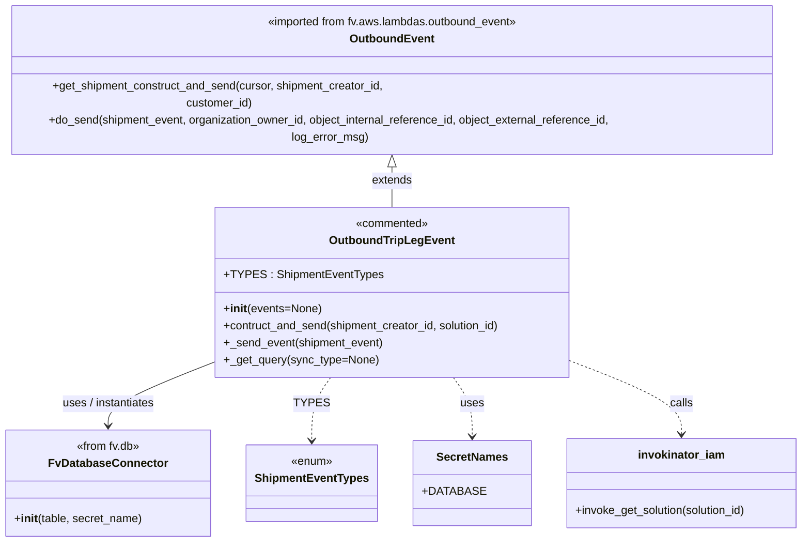
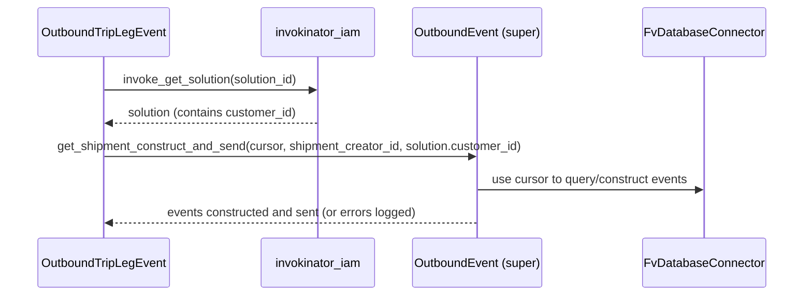

# Diagram: entity_core/entity_service/entity_service/common/outbound_tripleg_event.py

> Auto-generated by Obscura crawlers

## Diagram 1

### SVG

<svg id="container" width="1140.06640625" xmlns="http://www.w3.org/2000/svg" class="classDiagram" height="728" viewBox="0 0 1140.06640625 728" role="graphics-document document" aria-roledescription="class"><g><defs><marker id="container_class-aggregationStart" class="marker aggregation class" refX="18" refY="7" markerWidth="190" markerHeight="240" orient="auto"><path d="M 18,7 L9,13 L1,7 L9,1 Z"></path></marker></defs><defs><marker id="container_class-aggregationEnd" class="marker aggregation class" refX="1" refY="7" markerWidth="20" markerHeight="28" orient="auto"><path d="M 18,7 L9,13 L1,7 L9,1 Z"></path></marker></defs><defs><marker id="container_class-extensionStart" class="marker extension class" refX="18" refY="7" markerWidth="190" markerHeight="240" orient="auto"><path d="M 1,7 L18,13 V 1 Z"></path></marker></defs><defs><marker id="container_class-extensionEnd" class="marker extension class" refX="1" refY="7" markerWidth="20" markerHeight="28" orient="auto"><path d="M 1,1 V 13 L18,7 Z"></path></marker></defs><defs><marker id="container_class-compositionStart" class="marker composition class" refX="18" refY="7" markerWidth="190" markerHeight="240" orient="auto"><path d="M 18,7 L9,13 L1,7 L9,1 Z"></path></marker></defs><defs><marker id="container_class-compositionEnd" class="marker composition class" refX="1" refY="7" markerWidth="20" markerHeight="28" orient="auto"><path d="M 18,7 L9,13 L1,7 L9,1 Z"></path></marker></defs><defs><marker id="container_class-dependencyStart" class="marker dependency class" refX="6" refY="7" markerWidth="190" markerHeight="240" orient="auto"><path d="M 5,7 L9,13 L1,7 L9,1 Z"></path></marker></defs><defs><marker id="container_class-dependencyEnd" class="marker dependency class" refX="13" refY="7" markerWidth="20" markerHeight="28" orient="auto"><path d="M 18,7 L9,13 L14,7 L9,1 Z"></path></marker></defs><defs><marker id="container_class-lollipopStart" class="marker lollipop class" refX="13" refY="7" markerWidth="190" markerHeight="240" orient="auto"><circle stroke="black" fill="transparent" cx="7" cy="7" r="6"></circle></marker></defs><defs><marker id="container_class-lollipopEnd" class="marker lollipop class" refX="1" refY="7" markerWidth="190" markerHeight="240" orient="auto"><circle stroke="black" fill="transparent" cx="7" cy="7" r="6"></circle></marker></defs><g class="root"><g class="clusters"></g><g class="edgePaths"><path d="M569.281,199.25L569.281,202.542C569.281,205.833,569.281,212.417,569.281,221.875C569.281,231.333,569.281,243.667,569.281,249.833L569.281,256" id="id_OutboundEvent_OutboundTripLegEvent_1" class="edge-thickness-normal edge-pattern-solid relation" style=";;;" data-edge="true" data-et="edge" data-id="id_OutboundEvent_OutboundTripLegEvent_1" data-points="W3sieCI6NTY5LjI4MTI1LCJ5IjoxODJ9LHsieCI6NTY5LjI4MTI1LCJ5IjoyMTl9LHsieCI6NTY5LjI4MTI1LCJ5IjoyNTZ9XQ==" marker-start="url(#container_class-extensionStart)"></path><path d="M316.469,478.395L293.999,487.496C271.529,496.596,226.589,514.798,204.118,529.066C181.648,543.333,181.648,553.667,181.648,558.833L181.648,564" id="id_OutboundTripLegEvent_FvDatabaseConnector_2" class="edge-thickness-normal edge-pattern-solid relation" style=";;;" data-edge="true" data-et="edge" data-id="id_OutboundTripLegEvent_FvDatabaseConnector_2" data-points="W3sieCI6MzE2LjQ2ODc1LCJ5Ijo0NzguMzk0NzQzNzM3MDI1NjR9LHsieCI6MTgxLjY0ODQzNzUsInkiOjUzM30seyJ4IjoxODEuNjQ4NDM3NSwieSI6NTcwfV0=" marker-end="url(#container_class-dependencyEnd)"></path><path d="M487.441,496L483.235,502.167C479.03,508.333,470.618,520.667,466.413,535.5C462.207,550.333,462.207,567.667,462.207,576.333L462.207,585" id="id_OutboundTripLegEvent_ShipmentEventTypes_3" class="edge-thickness-normal edge-pattern-dashed relation" style=";;;" data-edge="true" data-et="edge" data-id="id_OutboundTripLegEvent_ShipmentEventTypes_3" data-points="W3sieCI6NDg3LjQ0MTA4MjgwMjU0NzgsInkiOjQ5Nn0seyJ4Ijo0NjIuMjA3MDMxMjUsInkiOjUzM30seyJ4Ijo0NjIuMjA3MDMxMjUsInkiOjU5MX1d" marker-end="url(#container_class-dependencyEnd)"></path><path d="M651.121,496L655.327,502.167C659.533,508.333,667.944,520.667,672.15,534.5C676.355,548.333,676.355,563.667,676.355,571.333L676.355,579" id="id_OutboundTripLegEvent_SecretNames_4" class="edge-thickness-normal edge-pattern-dashed relation" style=";;;" data-edge="true" data-et="edge" data-id="id_OutboundTripLegEvent_SecretNames_4" data-points="W3sieCI6NjUxLjEyMTQxNzE5NzQ1MjMsInkiOjQ5Nn0seyJ4Ijo2NzYuMzU1NDY4NzUsInkiOjUzM30seyJ4Ijo2NzYuMzU1NDY4NzUsInkiOjU4NX1d" marker-end="url(#container_class-dependencyEnd)"></path><path d="M822.094,475.791L846.249,485.326C870.405,494.861,918.716,513.93,942.872,530.632C967.027,547.333,967.027,561.667,967.027,568.833L967.027,576" id="id_OutboundTripLegEvent_invokinator_iam_5" class="edge-thickness-normal edge-pattern-dashed relation" style=";;;" data-edge="true" data-et="edge" data-id="id_OutboundTripLegEvent_invokinator_iam_5" data-points="W3sieCI6ODIyLjA5Mzc1LCJ5Ijo0NzUuNzkxMjA2MzA4OTg3MTd9LHsieCI6OTY3LjAyNzM0Mzc1LCJ5Ijo1MzN9LHsieCI6OTY3LjAyNzM0Mzc1LCJ5Ijo1ODJ9XQ==" marker-end="url(#container_class-dependencyEnd)"></path></g><g class="edgeLabels"><g class="edgeLabel" transform="translate(569.28125, 219)"><g class="label" data-id="id_OutboundEvent_OutboundTripLegEvent_1" transform="translate(-28.5078125, -12)"><foreignObject width="57.015625" height="24">

extends

</foreignObject></g></g><g class="edgeLabel" transform="translate(181.6484375, 533)"><g class="label" data-id="id_OutboundTripLegEvent_FvDatabaseConnector_2" transform="translate(-67.8046875, -12)"><foreignObject width="135.609375" height="24">

uses / instantiates

</foreignObject></g></g><g class="edgeLabel" transform="translate(462.20703125, 533)"><g class="label" data-id="id_OutboundTripLegEvent_ShipmentEventTypes_3" transform="translate(-21.75, -12)"><foreignObject width="43.5" height="24">

TYPES

</foreignObject></g></g><g class="edgeLabel" transform="translate(676.35546875, 533)"><g class="label" data-id="id_OutboundTripLegEvent_SecretNames_4" transform="translate(-16.4921875, -12)"><foreignObject width="32.984375" height="24">

uses

</foreignObject></g></g><g class="edgeLabel" transform="translate(967.02734375, 533)"><g class="label" data-id="id_OutboundTripLegEvent_invokinator_iam_5" transform="translate(-16.4453125, -12)"><foreignObject width="32.890625" height="24">

calls

</foreignObject></g></g></g><g class="nodes"><g class="node default" id="classId-OutboundEvent-0" transform="translate(569.28125, 95)"><g class="basic label-container"><path d="M-561.28125 -87 L561.28125 -87 L561.28125 87 L-561.28125 87" stroke="none" stroke-width="0" fill="#ECECFF" style=""></path><path d="M-561.28125 -87 C-272.2529824546742 -87, 16.77528509065155 -87, 561.28125 -87 M-561.28125 -87 C-179.26949534300098 -87, 202.74225931399803 -87, 561.28125 -87 M561.28125 -87 C561.28125 -35.44936447187317, 561.28125 16.101271056253665, 561.28125 87 M561.28125 -87 C561.28125 -35.78049921406325, 561.28125 15.439001571873504, 561.28125 87 M561.28125 87 C145.93880122781457 87, -269.40364754437087 87, -561.28125 87 M561.28125 87 C324.4172236636201 87, 87.55319732724024 87, -561.28125 87 M-561.28125 87 C-561.28125 23.667080481666886, -561.28125 -39.66583903666623, -561.28125 -87 M-561.28125 87 C-561.28125 34.71195610790583, -561.28125 -17.576087784188346, -561.28125 -87" stroke="#9370DB" stroke-width="1.3" fill="none" stroke-dasharray="0 0" style=""></path></g><g class="annotation-group text" transform="translate(-180.71875, -63)"><g class="label" style="" transform="translate(0,-12)"><foreignObject width="361.4375" height="24">

«imported from fv.aws.lambdas.outbound_event»

</foreignObject></g></g><g class="label-group text" transform="translate(-56.84375, -39)"><g class="label" style="font-weight: bolder" transform="translate(0,-12)"><foreignObject width="113.6875" height="24">

OutboundEvent

</foreignObject></g></g><g class="members-group text" transform="translate(-549.28125, 9)"></g><g class="methods-group text" transform="translate(-549.28125, 39)"><g class="label" style="" transform="translate(0,-12)"><foreignObject width="571.71875" height="24">

+get_shipment_construct_and_send(cursor, shipment_creator_id, customer_id)

</foreignObject></g><g class="label" style="" transform="translate(0,12)"><foreignObject width="917.84375" height="24">

+do_send(shipment_event, organization_owner_id, object_internal_reference_id, object_external_reference_id, log_error_msg)

</foreignObject></g></g><g class="divider" style=""><path d="M-561.28125 -15 C-259.40103723945145 -15, 42.47917552109709 -15, 561.28125 -15 M-561.28125 -15 C-118.36705633978733 -15, 324.54713732042535 -15, 561.28125 -15" stroke="#9370DB" stroke-width="1.3" fill="none" stroke-dasharray="0 0" style=""></path></g><g class="divider" style=""><path d="M-561.28125 9 C-240.31138192983258 9, 80.65848614033484 9, 561.28125 9 M-561.28125 9 C-230.96940257692665 9, 99.34244484614669 9, 561.28125 9" stroke="#9370DB" stroke-width="1.3" fill="none" stroke-dasharray="0 0" style=""></path></g></g><g class="node default" id="classId-OutboundTripLegEvent-1" transform="translate(569.28125, 376)"><g class="basic label-container"><path d="M-252.8125 -120 L252.8125 -120 L252.8125 120 L-252.8125 120" stroke="none" stroke-width="0" fill="#ECECFF" style=""></path><path d="M-252.8125 -120 C-103.71680609794265 -120, 45.3788878041147 -120, 252.8125 -120 M-252.8125 -120 C-91.20079265017674 -120, 70.41091469964653 -120, 252.8125 -120 M252.8125 -120 C252.8125 -60.02774501507949, 252.8125 -0.05549003015897824, 252.8125 120 M252.8125 -120 C252.8125 -48.113454837030744, 252.8125 23.77309032593851, 252.8125 120 M252.8125 120 C102.96899285335164 120, -46.87451429329673 120, -252.8125 120 M252.8125 120 C77.95985763898437 120, -96.89278472203125 120, -252.8125 120 M-252.8125 120 C-252.8125 29.387148291475228, -252.8125 -61.225703417049544, -252.8125 -120 M-252.8125 120 C-252.8125 29.337319393376504, -252.8125 -61.32536121324699, -252.8125 -120" stroke="#9370DB" stroke-width="1.3" fill="none" stroke-dasharray="0 0" style=""></path></g><g class="annotation-group text" transform="translate(-51.9765625, -96)"><g class="label" style="" transform="translate(0,-12)"><foreignObject width="103.953125" height="24">

«commented»

</foreignObject></g></g><g class="label-group text" transform="translate(-83.890625, -72)"><g class="label" style="font-weight: bolder" transform="translate(0,-12)"><foreignObject width="167.78125" height="24">

OutboundTripLegEvent

</foreignObject></g></g><g class="members-group text" transform="translate(-240.8125, -24)"><g class="label" style="" transform="translate(0,-12)"><foreignObject width="213.8125" height="24">

+TYPES : ShipmentEventTypes

</foreignObject></g></g><g class="methods-group text" transform="translate(-240.8125, 24)"><g class="label" style="" transform="translate(0,-12)"><foreignObject width="136.96875" height="24">

+<strong>init</strong>(events=None)

</foreignObject></g><g class="label" style="" transform="translate(0,12)"><foreignObject width="397.734375" height="24">

+contruct_and_send(shipment_creator_id, solution_id)

</foreignObject></g><g class="label" style="" transform="translate(0,36)"><foreignObject width="225.65625" height="24">

+_send_event(shipment_event)

</foreignObject></g><g class="label" style="" transform="translate(0,60)"><foreignObject width="216.015625" height="24">

+_get_query(sync_type=None)

</foreignObject></g></g><g class="divider" style=""><path d="M-252.8125 -48 C-102.80913840869678 -48, 47.194223182606436 -48, 252.8125 -48 M-252.8125 -48 C-117.84697292037359 -48, 17.118554159252824 -48, 252.8125 -48" stroke="#9370DB" stroke-width="1.3" fill="none" stroke-dasharray="0 0" style=""></path></g><g class="divider" style=""><path d="M-252.8125 0 C-65.07574982907252 0, 122.66100034185496 0, 252.8125 0 M-252.8125 0 C-146.52709605532044 0, -40.24169211064091 0, 252.8125 0" stroke="#9370DB" stroke-width="1.3" fill="none" stroke-dasharray="0 0" style=""></path></g></g><g class="node default" id="classId-FvDatabaseConnector-2" transform="translate(181.6484375, 645)"><g class="basic label-container"><path d="M-142.04296875 -75 L142.04296875 -75 L142.04296875 75 L-142.04296875 75" stroke="none" stroke-width="0" fill="#ECECFF" style=""></path><path d="M-142.04296875 -75 C-84.86767885670491 -75, -27.69238896340981 -75, 142.04296875 -75 M-142.04296875 -75 C-36.092041253450404 -75, 69.85888624309919 -75, 142.04296875 -75 M142.04296875 -75 C142.04296875 -23.647681299407964, 142.04296875 27.704637401184073, 142.04296875 75 M142.04296875 -75 C142.04296875 -20.51308219398441, 142.04296875 33.97383561203118, 142.04296875 75 M142.04296875 75 C52.307086053511156 75, -37.42879664297769 75, -142.04296875 75 M142.04296875 75 C71.21868649711104 75, 0.39440424422207343 75, -142.04296875 75 M-142.04296875 75 C-142.04296875 20.068249546926616, -142.04296875 -34.86350090614677, -142.04296875 -75 M-142.04296875 75 C-142.04296875 19.33752097837028, -142.04296875 -36.32495804325944, -142.04296875 -75" stroke="#9370DB" stroke-width="1.3" fill="none" stroke-dasharray="0 0" style=""></path></g><g class="annotation-group text" transform="translate(-45.8203125, -51)"><g class="label" style="" transform="translate(0,-12)"><foreignObject width="91.640625" height="24">

«from fv.db»

</foreignObject></g></g><g class="label-group text" transform="translate(-79.3046875, -27)"><g class="label" style="font-weight: bolder" transform="translate(0,-12)"><foreignObject width="158.609375" height="24">

FvDatabaseConnector

</foreignObject></g></g><g class="members-group text" transform="translate(-130.04296875, 21)"></g><g class="methods-group text" transform="translate(-130.04296875, 51)"><g class="label" style="" transform="translate(0,-12)"><foreignObject width="180.78125" height="24">

+<strong>init</strong>(table, secret_name)

</foreignObject></g></g><g class="divider" style=""><path d="M-142.04296875 -3 C-38.66870972125747 -3, 64.70554930748506 -3, 142.04296875 -3 M-142.04296875 -3 C-68.29418970518512 -3, 5.454589339629763 -3, 142.04296875 -3" stroke="#9370DB" stroke-width="1.3" fill="none" stroke-dasharray="0 0" style=""></path></g><g class="divider" style=""><path d="M-142.04296875 21 C-78.41529021497627 21, -14.78761167995252 21, 142.04296875 21 M-142.04296875 21 C-69.40129052678807 21, 3.240387696423852 21, 142.04296875 21" stroke="#9370DB" stroke-width="1.3" fill="none" stroke-dasharray="0 0" style=""></path></g></g><g class="node default" id="classId-ShipmentEventTypes-3" transform="translate(462.20703125, 645)"><g class="basic label-container"><path d="M-88.515625 -54 L88.515625 -54 L88.515625 54 L-88.515625 54" stroke="none" stroke-width="0" fill="#ECECFF" style=""></path><path d="M-88.515625 -54 C-50.543810110476265 -54, -12.57199522095253 -54, 88.515625 -54 M-88.515625 -54 C-22.939257418267545 -54, 42.63711016346491 -54, 88.515625 -54 M88.515625 -54 C88.515625 -23.67864027607204, 88.515625 6.642719447855917, 88.515625 54 M88.515625 -54 C88.515625 -29.22537999309121, 88.515625 -4.450759986182419, 88.515625 54 M88.515625 54 C26.71680410306942 54, -35.08201679386116 54, -88.515625 54 M88.515625 54 C32.2070114263768 54, -24.101602147246396 54, -88.515625 54 M-88.515625 54 C-88.515625 26.09961341256381, -88.515625 -1.8007731748723828, -88.515625 -54 M-88.515625 54 C-88.515625 21.106614231603004, -88.515625 -11.786771536793992, -88.515625 -54" stroke="#9370DB" stroke-width="1.3" fill="none" stroke-dasharray="0 0" style=""></path></g><g class="annotation-group text" transform="translate(-29.53125, -30)"><g class="label" style="" transform="translate(0,-12)"><foreignObject width="59.0625" height="24">

«enum»

</foreignObject></g></g><g class="label-group text" transform="translate(-76.515625, -6)"><g class="label" style="font-weight: bolder" transform="translate(0,-12)"><foreignObject width="153.03125" height="24">

ShipmentEventTypes

</foreignObject></g></g><g class="members-group text" transform="translate(-76.515625, 42)"></g><g class="methods-group text" transform="translate(-76.515625, 72)"></g><g class="divider" style=""><path d="M-88.515625 18 C-50.032804028000385 18, -11.54998305600077 18, 88.515625 18 M-88.515625 18 C-33.87402337734133 18, 20.76757824531734 18, 88.515625 18" stroke="#9370DB" stroke-width="1.3" fill="none" stroke-dasharray="0 0" style=""></path></g><g class="divider" style=""><path d="M-88.515625 36 C-40.08819476836517 36, 8.33923546326966 36, 88.515625 36 M-88.515625 36 C-43.89854419845945 36, 0.7185366030811053 36, 88.515625 36" stroke="#9370DB" stroke-width="1.3" fill="none" stroke-dasharray="0 0" style=""></path></g></g><g class="node default" id="classId-SecretNames-4" transform="translate(676.35546875, 645)"><g class="basic label-container"><path d="M-75.6328125 -60 L75.6328125 -60 L75.6328125 60 L-75.6328125 60" stroke="none" stroke-width="0" fill="#ECECFF" style=""></path><path d="M-75.6328125 -60 C-35.13092413440453 -60, 5.370964231190939 -60, 75.6328125 -60 M-75.6328125 -60 C-39.715361076606 -60, -3.7979096532120025 -60, 75.6328125 -60 M75.6328125 -60 C75.6328125 -29.54359399396495, 75.6328125 0.9128120120700984, 75.6328125 60 M75.6328125 -60 C75.6328125 -30.903344850013966, 75.6328125 -1.8066897000279312, 75.6328125 60 M75.6328125 60 C17.260129505040595 60, -41.11255348991881 60, -75.6328125 60 M75.6328125 60 C20.168761156049527 60, -35.295290187900946 60, -75.6328125 60 M-75.6328125 60 C-75.6328125 23.122411816863377, -75.6328125 -13.755176366273247, -75.6328125 -60 M-75.6328125 60 C-75.6328125 26.400657633274818, -75.6328125 -7.198684733450364, -75.6328125 -60" stroke="#9370DB" stroke-width="1.3" fill="none" stroke-dasharray="0 0" style=""></path></g><g class="annotation-group text" transform="translate(0, -36)"></g><g class="label-group text" transform="translate(-48.03125, -36)"><g class="label" style="font-weight: bolder" transform="translate(0,-12)"><foreignObject width="96.0625" height="24">

SecretNames

</foreignObject></g></g><g class="members-group text" transform="translate(-63.6328125, 12)"><g class="label" style="" transform="translate(0,-12)"><foreignObject width="79.234375" height="24">

+DATABASE

</foreignObject></g></g><g class="methods-group text" transform="translate(-63.6328125, 60)"></g><g class="divider" style=""><path d="M-75.6328125 -12 C-28.944677277248744 -12, 17.743457945502513 -12, 75.6328125 -12 M-75.6328125 -12 C-17.53891441135842 -12, 40.55498367728316 -12, 75.6328125 -12" stroke="#9370DB" stroke-width="1.3" fill="none" stroke-dasharray="0 0" style=""></path></g><g class="divider" style=""><path d="M-75.6328125 36 C-42.83523838202641 36, -10.037664264052822 36, 75.6328125 36 M-75.6328125 36 C-41.75593926308596 36, -7.879066026171927 36, 75.6328125 36" stroke="#9370DB" stroke-width="1.3" fill="none" stroke-dasharray="0 0" style=""></path></g></g><g class="node default" id="classId-invokinator_iam-5" transform="translate(967.02734375, 645)"><g class="basic label-container"><path d="M-165.0390625 -63 L165.0390625 -63 L165.0390625 63 L-165.0390625 63" stroke="none" stroke-width="0" fill="#ECECFF" style=""></path><path d="M-165.0390625 -63 C-91.92261843191253 -63, -18.80617436382505 -63, 165.0390625 -63 M-165.0390625 -63 C-70.71093161655241 -63, 23.61719926689517 -63, 165.0390625 -63 M165.0390625 -63 C165.0390625 -12.99320491999314, 165.0390625 37.01359016001372, 165.0390625 63 M165.0390625 -63 C165.0390625 -28.50018982001943, 165.0390625 5.999620359961142, 165.0390625 63 M165.0390625 63 C74.19999821649594 63, -16.639066067008116 63, -165.0390625 63 M165.0390625 63 C62.73064778913749 63, -39.577766921725015 63, -165.0390625 63 M-165.0390625 63 C-165.0390625 29.402734831016367, -165.0390625 -4.194530337967265, -165.0390625 -63 M-165.0390625 63 C-165.0390625 36.09481316823073, -165.0390625 9.189626336461465, -165.0390625 -63" stroke="#9370DB" stroke-width="1.3" fill="none" stroke-dasharray="0 0" style=""></path></g><g class="annotation-group text" transform="translate(0, -39)"></g><g class="label-group text" transform="translate(-58.953125, -39)"><g class="label" style="font-weight: bolder" transform="translate(0,-12)"><foreignObject width="117.90625" height="24">

invokinator_iam

</foreignObject></g></g><g class="members-group text" transform="translate(-153.0390625, 9)"></g><g class="methods-group text" transform="translate(-153.0390625, 39)"><g class="label" style="" transform="translate(0,-12)"><foreignObject width="247.125" height="24">

+invoke_get_solution(solution_id)

</foreignObject></g></g><g class="divider" style=""><path d="M-165.0390625 -15 C-37.12229108673044 -15, 90.79448032653912 -15, 165.0390625 -15 M-165.0390625 -15 C-65.71986521667502 -15, 33.599332066649964 -15, 165.0390625 -15" stroke="#9370DB" stroke-width="1.3" fill="none" stroke-dasharray="0 0" style=""></path></g><g class="divider" style=""><path d="M-165.0390625 9 C-48.622433237140996 9, 67.79419602571801 9, 165.0390625 9 M-165.0390625 9 C-49.42395673385086 9, 66.19114903229828 9, 165.0390625 9" stroke="#9370DB" stroke-width="1.3" fill="none" stroke-dasharray="0 0" style=""></path></g></g></g></g></g></svg>

## Diagram 2

### SVG

<svg id="container" width="1148" xmlns="http://www.w3.org/2000/svg" height="411" viewBox="-50 -10 1148 411" role="graphics-document document" aria-roledescription="sequence"><g><rect x="871" y="325" fill="#eaeaea" stroke="#666" width="177" height="65" name="DB" rx="3" ry="3" class="actor actor-bottom"></rect><text x="959.5" y="357.5" dominant-baseline="central" alignment-baseline="central" class="actor actor-box" style="text-anchor: middle; font-size: 16px; font-weight: 400;"><tspan x="959.5" dy="0">FvDatabaseConnector</tspan></text></g><g><rect x="527" y="325" fill="#eaeaea" stroke="#666" width="189" height="65" name="S" rx="3" ry="3" class="actor actor-bottom"></rect><text x="621.5" y="357.5" dominant-baseline="central" alignment-baseline="central" class="actor actor-box" style="text-anchor: middle; font-size: 16px; font-weight: 400;"><tspan x="621.5" dy="0">OutboundEvent (super)</tspan></text></g><g><rect x="327" y="325" fill="#eaeaea" stroke="#666" width="150" height="65" name="I" rx="3" ry="3" class="actor actor-bottom"></rect><text x="402" y="357.5" dominant-baseline="central" alignment-baseline="central" class="actor actor-box" style="text-anchor: middle; font-size: 16px; font-weight: 400;"><tspan x="402" dy="0">invokinator_iam</tspan></text></g><g><rect x="0" y="325" fill="#eaeaea" stroke="#666" width="186" height="65" name="O" rx="3" ry="3" class="actor actor-bottom"></rect><text x="93" y="357.5" dominant-baseline="central" alignment-baseline="central" class="actor actor-box" style="text-anchor: middle; font-size: 16px; font-weight: 400;"><tspan x="93" dy="0">OutboundTripLegEvent</tspan></text></g><g><line id="actor3" x1="959.5" y1="65" x2="959.5" y2="325" class="actor-line 200" stroke-width="0.5px" stroke="#999" name="DB"></line><g id="root-3"><rect x="871" y="0" fill="#eaeaea" stroke="#666" width="177" height="65" name="DB" rx="3" ry="3" class="actor actor-top"></rect><text x="959.5" y="32.5" dominant-baseline="central" alignment-baseline="central" class="actor actor-box" style="text-anchor: middle; font-size: 16px; font-weight: 400;"><tspan x="959.5" dy="0">FvDatabaseConnector</tspan></text></g></g><g><line id="actor2" x1="621.5" y1="65" x2="621.5" y2="325" class="actor-line 200" stroke-width="0.5px" stroke="#999" name="S"></line><g id="root-2"><rect x="527" y="0" fill="#eaeaea" stroke="#666" width="189" height="65" name="S" rx="3" ry="3" class="actor actor-top"></rect><text x="621.5" y="32.5" dominant-baseline="central" alignment-baseline="central" class="actor actor-box" style="text-anchor: middle; font-size: 16px; font-weight: 400;"><tspan x="621.5" dy="0">OutboundEvent (super)</tspan></text></g></g><g><line id="actor1" x1="402" y1="65" x2="402" y2="325" class="actor-line 200" stroke-width="0.5px" stroke="#999" name="I"></line><g id="root-1"><rect x="327" y="0" fill="#eaeaea" stroke="#666" width="150" height="65" name="I" rx="3" ry="3" class="actor actor-top"></rect><text x="402" y="32.5" dominant-baseline="central" alignment-baseline="central" class="actor actor-box" style="text-anchor: middle; font-size: 16px; font-weight: 400;"><tspan x="402" dy="0">invokinator_iam</tspan></text></g></g><g><line id="actor0" x1="93" y1="65" x2="93" y2="325" class="actor-line 200" stroke-width="0.5px" stroke="#999" name="O"></line><g id="root-0"><rect x="0" y="0" fill="#eaeaea" stroke="#666" width="186" height="65" name="O" rx="3" ry="3" class="actor actor-top"></rect><text x="93" y="32.5" dominant-baseline="central" alignment-baseline="central" class="actor actor-box" style="text-anchor: middle; font-size: 16px; font-weight: 400;"><tspan x="93" dy="0">OutboundTripLegEvent</tspan></text></g></g><g></g><defs><symbol id="computer" width="24" height="24"><path transform="scale(.5)" d="M2 2v13h20v-13h-20zm18 11h-16v-9h16v9zm-10.228 6l.466-1h3.524l.467 1h-4.457zm14.228 3h-24l2-6h2.104l-1.33 4h18.45l-1.297-4h2.073l2 6zm-5-10h-14v-7h14v7z"></path></symbol></defs><defs><symbol id="database" fill-rule="evenodd" clip-rule="evenodd"><path transform="scale(.5)" d="M12.258.001l.256.004.255.005.253.008.251.01.249.012.247.015.246.016.242.019.241.02.239.023.236.024.233.027.231.028.229.031.225.032.223.034.22.036.217.038.214.04.211.041.208.043.205.045.201.046.198.048.194.05.191.051.187.053.183.054.18.056.175.057.172.059.168.06.163.061.16.063.155.064.15.066.074.033.073.033.071.034.07.034.069.035.068.035.067.035.066.035.064.036.064.036.062.036.06.036.06.037.058.037.058.037.055.038.055.038.053.038.052.038.051.039.05.039.048.039.047.039.045.04.044.04.043.04.041.04.04.041.039.041.037.041.036.041.034.041.033.042.032.042.03.042.029.042.027.042.026.043.024.043.023.043.021.043.02.043.018.044.017.043.015.044.013.044.012.044.011.045.009.044.007.045.006.045.004.045.002.045.001.045v17l-.001.045-.002.045-.004.045-.006.045-.007.045-.009.044-.011.045-.012.044-.013.044-.015.044-.017.043-.018.044-.02.043-.021.043-.023.043-.024.043-.026.043-.027.042-.029.042-.03.042-.032.042-.033.042-.034.041-.036.041-.037.041-.039.041-.04.041-.041.04-.043.04-.044.04-.045.04-.047.039-.048.039-.05.039-.051.039-.052.038-.053.038-.055.038-.055.038-.058.037-.058.037-.06.037-.06.036-.062.036-.064.036-.064.036-.066.035-.067.035-.068.035-.069.035-.07.034-.071.034-.073.033-.074.033-.15.066-.155.064-.16.063-.163.061-.168.06-.172.059-.175.057-.18.056-.183.054-.187.053-.191.051-.194.05-.198.048-.201.046-.205.045-.208.043-.211.041-.214.04-.217.038-.22.036-.223.034-.225.032-.229.031-.231.028-.233.027-.236.024-.239.023-.241.02-.242.019-.246.016-.247.015-.249.012-.251.01-.253.008-.255.005-.256.004-.258.001-.258-.001-.256-.004-.255-.005-.253-.008-.251-.01-.249-.012-.247-.015-.245-.016-.243-.019-.241-.02-.238-.023-.236-.024-.234-.027-.231-.028-.228-.031-.226-.032-.223-.034-.22-.036-.217-.038-.214-.04-.211-.041-.208-.043-.204-.045-.201-.046-.198-.048-.195-.05-.19-.051-.187-.053-.184-.054-.179-.056-.176-.057-.172-.059-.167-.06-.164-.061-.159-.063-.155-.064-.151-.066-.074-.033-.072-.033-.072-.034-.07-.034-.069-.035-.068-.035-.067-.035-.066-.035-.064-.036-.063-.036-.062-.036-.061-.036-.06-.037-.058-.037-.057-.037-.056-.038-.055-.038-.053-.038-.052-.038-.051-.039-.049-.039-.049-.039-.046-.039-.046-.04-.044-.04-.043-.04-.041-.04-.04-.041-.039-.041-.037-.041-.036-.041-.034-.041-.033-.042-.032-.042-.03-.042-.029-.042-.027-.042-.026-.043-.024-.043-.023-.043-.021-.043-.02-.043-.018-.044-.017-.043-.015-.044-.013-.044-.012-.044-.011-.045-.009-.044-.007-.045-.006-.045-.004-.045-.002-.045-.001-.045v-17l.001-.045.002-.045.004-.045.006-.045.007-.045.009-.044.011-.045.012-.044.013-.044.015-.044.017-.043.018-.044.02-.043.021-.043.023-.043.024-.043.026-.043.027-.042.029-.042.03-.042.032-.042.033-.042.034-.041.036-.041.037-.041.039-.041.04-.041.041-.04.043-.04.044-.04.046-.04.046-.039.049-.039.049-.039.051-.039.052-.038.053-.038.055-.038.056-.038.057-.037.058-.037.06-.037.061-.036.062-.036.063-.036.064-.036.066-.035.067-.035.068-.035.069-.035.07-.034.072-.034.072-.033.074-.033.151-.066.155-.064.159-.063.164-.061.167-.06.172-.059.176-.057.179-.056.184-.054.187-.053.19-.051.195-.05.198-.048.201-.046.204-.045.208-.043.211-.041.214-.04.217-.038.22-.036.223-.034.226-.032.228-.031.231-.028.234-.027.236-.024.238-.023.241-.02.243-.019.245-.016.247-.015.249-.012.251-.01.253-.008.255-.005.256-.004.258-.001.258.001zm-9.258 20.499v.01l.001.021.003.021.004.022.005.021.006.022.007.022.009.023.01.022.011.023.012.023.013.023.015.023.016.024.017.023.018.024.019.024.021.024.022.025.023.024.024.025.052.049.056.05.061.051.066.051.07.051.075.051.079.052.084.052.088.052.092.052.097.052.102.051.105.052.11.052.114.051.119.051.123.051.127.05.131.05.135.05.139.048.144.049.147.047.152.047.155.047.16.045.163.045.167.043.171.043.176.041.178.041.183.039.187.039.19.037.194.035.197.035.202.033.204.031.209.03.212.029.216.027.219.025.222.024.226.021.23.02.233.018.236.016.24.015.243.012.246.01.249.008.253.005.256.004.259.001.26-.001.257-.004.254-.005.25-.008.247-.011.244-.012.241-.014.237-.016.233-.018.231-.021.226-.021.224-.024.22-.026.216-.027.212-.028.21-.031.205-.031.202-.034.198-.034.194-.036.191-.037.187-.039.183-.04.179-.04.175-.042.172-.043.168-.044.163-.045.16-.046.155-.046.152-.047.148-.048.143-.049.139-.049.136-.05.131-.05.126-.05.123-.051.118-.052.114-.051.11-.052.106-.052.101-.052.096-.052.092-.052.088-.053.083-.051.079-.052.074-.052.07-.051.065-.051.06-.051.056-.05.051-.05.023-.024.023-.025.021-.024.02-.024.019-.024.018-.024.017-.024.015-.023.014-.024.013-.023.012-.023.01-.023.01-.022.008-.022.006-.022.006-.022.004-.022.004-.021.001-.021.001-.021v-4.127l-.077.055-.08.053-.083.054-.085.053-.087.052-.09.052-.093.051-.095.05-.097.05-.1.049-.102.049-.105.048-.106.047-.109.047-.111.046-.114.045-.115.045-.118.044-.12.043-.122.042-.124.042-.126.041-.128.04-.13.04-.132.038-.134.038-.135.037-.138.037-.139.035-.142.035-.143.034-.144.033-.147.032-.148.031-.15.03-.151.03-.153.029-.154.027-.156.027-.158.026-.159.025-.161.024-.162.023-.163.022-.165.021-.166.02-.167.019-.169.018-.169.017-.171.016-.173.015-.173.014-.175.013-.175.012-.177.011-.178.01-.179.008-.179.008-.181.006-.182.005-.182.004-.184.003-.184.002h-.37l-.184-.002-.184-.003-.182-.004-.182-.005-.181-.006-.179-.008-.179-.008-.178-.01-.176-.011-.176-.012-.175-.013-.173-.014-.172-.015-.171-.016-.17-.017-.169-.018-.167-.019-.166-.02-.165-.021-.163-.022-.162-.023-.161-.024-.159-.025-.157-.026-.156-.027-.155-.027-.153-.029-.151-.03-.15-.03-.148-.031-.146-.032-.145-.033-.143-.034-.141-.035-.14-.035-.137-.037-.136-.037-.134-.038-.132-.038-.13-.04-.128-.04-.126-.041-.124-.042-.122-.042-.12-.044-.117-.043-.116-.045-.113-.045-.112-.046-.109-.047-.106-.047-.105-.048-.102-.049-.1-.049-.097-.05-.095-.05-.093-.052-.09-.051-.087-.052-.085-.053-.083-.054-.08-.054-.077-.054v4.127zm0-5.654v.011l.001.021.003.021.004.021.005.022.006.022.007.022.009.022.01.022.011.023.012.023.013.023.015.024.016.023.017.024.018.024.019.024.021.024.022.024.023.025.024.024.052.05.056.05.061.05.066.051.07.051.075.052.079.051.084.052.088.052.092.052.097.052.102.052.105.052.11.051.114.051.119.052.123.05.127.051.131.05.135.049.139.049.144.048.147.048.152.047.155.046.16.045.163.045.167.044.171.042.176.042.178.04.183.04.187.038.19.037.194.036.197.034.202.033.204.032.209.03.212.028.216.027.219.025.222.024.226.022.23.02.233.018.236.016.24.014.243.012.246.01.249.008.253.006.256.003.259.001.26-.001.257-.003.254-.006.25-.008.247-.01.244-.012.241-.015.237-.016.233-.018.231-.02.226-.022.224-.024.22-.025.216-.027.212-.029.21-.03.205-.032.202-.033.198-.035.194-.036.191-.037.187-.039.183-.039.179-.041.175-.042.172-.043.168-.044.163-.045.16-.045.155-.047.152-.047.148-.048.143-.048.139-.05.136-.049.131-.05.126-.051.123-.051.118-.051.114-.052.11-.052.106-.052.101-.052.096-.052.092-.052.088-.052.083-.052.079-.052.074-.051.07-.052.065-.051.06-.05.056-.051.051-.049.023-.025.023-.024.021-.025.02-.024.019-.024.018-.024.017-.024.015-.023.014-.023.013-.024.012-.022.01-.023.01-.023.008-.022.006-.022.006-.022.004-.021.004-.022.001-.021.001-.021v-4.139l-.077.054-.08.054-.083.054-.085.052-.087.053-.09.051-.093.051-.095.051-.097.05-.1.049-.102.049-.105.048-.106.047-.109.047-.111.046-.114.045-.115.044-.118.044-.12.044-.122.042-.124.042-.126.041-.128.04-.13.039-.132.039-.134.038-.135.037-.138.036-.139.036-.142.035-.143.033-.144.033-.147.033-.148.031-.15.03-.151.03-.153.028-.154.028-.156.027-.158.026-.159.025-.161.024-.162.023-.163.022-.165.021-.166.02-.167.019-.169.018-.169.017-.171.016-.173.015-.173.014-.175.013-.175.012-.177.011-.178.009-.179.009-.179.007-.181.007-.182.005-.182.004-.184.003-.184.002h-.37l-.184-.002-.184-.003-.182-.004-.182-.005-.181-.007-.179-.007-.179-.009-.178-.009-.176-.011-.176-.012-.175-.013-.173-.014-.172-.015-.171-.016-.17-.017-.169-.018-.167-.019-.166-.02-.165-.021-.163-.022-.162-.023-.161-.024-.159-.025-.157-.026-.156-.027-.155-.028-.153-.028-.151-.03-.15-.03-.148-.031-.146-.033-.145-.033-.143-.033-.141-.035-.14-.036-.137-.036-.136-.037-.134-.038-.132-.039-.13-.039-.128-.04-.126-.041-.124-.042-.122-.043-.12-.043-.117-.044-.116-.044-.113-.046-.112-.046-.109-.046-.106-.047-.105-.048-.102-.049-.1-.049-.097-.05-.095-.051-.093-.051-.09-.051-.087-.053-.085-.052-.083-.054-.08-.054-.077-.054v4.139zm0-5.666v.011l.001.02.003.022.004.021.005.022.006.021.007.022.009.023.01.022.011.023.012.023.013.023.015.023.016.024.017.024.018.023.019.024.021.025.022.024.023.024.024.025.052.05.056.05.061.05.066.051.07.051.075.052.079.051.084.052.088.052.092.052.097.052.102.052.105.051.11.052.114.051.119.051.123.051.127.05.131.05.135.05.139.049.144.048.147.048.152.047.155.046.16.045.163.045.167.043.171.043.176.042.178.04.183.04.187.038.19.037.194.036.197.034.202.033.204.032.209.03.212.028.216.027.219.025.222.024.226.021.23.02.233.018.236.017.24.014.243.012.246.01.249.008.253.006.256.003.259.001.26-.001.257-.003.254-.006.25-.008.247-.01.244-.013.241-.014.237-.016.233-.018.231-.02.226-.022.224-.024.22-.025.216-.027.212-.029.21-.03.205-.032.202-.033.198-.035.194-.036.191-.037.187-.039.183-.039.179-.041.175-.042.172-.043.168-.044.163-.045.16-.045.155-.047.152-.047.148-.048.143-.049.139-.049.136-.049.131-.051.126-.05.123-.051.118-.052.114-.051.11-.052.106-.052.101-.052.096-.052.092-.052.088-.052.083-.052.079-.052.074-.052.07-.051.065-.051.06-.051.056-.05.051-.049.023-.025.023-.025.021-.024.02-.024.019-.024.018-.024.017-.024.015-.023.014-.024.013-.023.012-.023.01-.022.01-.023.008-.022.006-.022.006-.022.004-.022.004-.021.001-.021.001-.021v-4.153l-.077.054-.08.054-.083.053-.085.053-.087.053-.09.051-.093.051-.095.051-.097.05-.1.049-.102.048-.105.048-.106.048-.109.046-.111.046-.114.046-.115.044-.118.044-.12.043-.122.043-.124.042-.126.041-.128.04-.13.039-.132.039-.134.038-.135.037-.138.036-.139.036-.142.034-.143.034-.144.033-.147.032-.148.032-.15.03-.151.03-.153.028-.154.028-.156.027-.158.026-.159.024-.161.024-.162.023-.163.023-.165.021-.166.02-.167.019-.169.018-.169.017-.171.016-.173.015-.173.014-.175.013-.175.012-.177.01-.178.01-.179.009-.179.007-.181.006-.182.006-.182.004-.184.003-.184.001-.185.001-.185-.001-.184-.001-.184-.003-.182-.004-.182-.006-.181-.006-.179-.007-.179-.009-.178-.01-.176-.01-.176-.012-.175-.013-.173-.014-.172-.015-.171-.016-.17-.017-.169-.018-.167-.019-.166-.02-.165-.021-.163-.023-.162-.023-.161-.024-.159-.024-.157-.026-.156-.027-.155-.028-.153-.028-.151-.03-.15-.03-.148-.032-.146-.032-.145-.033-.143-.034-.141-.034-.14-.036-.137-.036-.136-.037-.134-.038-.132-.039-.13-.039-.128-.041-.126-.041-.124-.041-.122-.043-.12-.043-.117-.044-.116-.044-.113-.046-.112-.046-.109-.046-.106-.048-.105-.048-.102-.048-.1-.05-.097-.049-.095-.051-.093-.051-.09-.052-.087-.052-.085-.053-.083-.053-.08-.054-.077-.054v4.153zm8.74-8.179l-.257.004-.254.005-.25.008-.247.011-.244.012-.241.014-.237.016-.233.018-.231.021-.226.022-.224.023-.22.026-.216.027-.212.028-.21.031-.205.032-.202.033-.198.034-.194.036-.191.038-.187.038-.183.04-.179.041-.175.042-.172.043-.168.043-.163.045-.16.046-.155.046-.152.048-.148.048-.143.048-.139.049-.136.05-.131.05-.126.051-.123.051-.118.051-.114.052-.11.052-.106.052-.101.052-.096.052-.092.052-.088.052-.083.052-.079.052-.074.051-.07.052-.065.051-.06.05-.056.05-.051.05-.023.025-.023.024-.021.024-.02.025-.019.024-.018.024-.017.023-.015.024-.014.023-.013.023-.012.023-.01.023-.01.022-.008.022-.006.023-.006.021-.004.022-.004.021-.001.021-.001.021.001.021.001.021.004.021.004.022.006.021.006.023.008.022.01.022.01.023.012.023.013.023.014.023.015.024.017.023.018.024.019.024.02.025.021.024.023.024.023.025.051.05.056.05.06.05.065.051.07.052.074.051.079.052.083.052.088.052.092.052.096.052.101.052.106.052.11.052.114.052.118.051.123.051.126.051.131.05.136.05.139.049.143.048.148.048.152.048.155.046.16.046.163.045.168.043.172.043.175.042.179.041.183.04.187.038.191.038.194.036.198.034.202.033.205.032.21.031.212.028.216.027.22.026.224.023.226.022.231.021.233.018.237.016.241.014.244.012.247.011.25.008.254.005.257.004.26.001.26-.001.257-.004.254-.005.25-.008.247-.011.244-.012.241-.014.237-.016.233-.018.231-.021.226-.022.224-.023.22-.026.216-.027.212-.028.21-.031.205-.032.202-.033.198-.034.194-.036.191-.038.187-.038.183-.04.179-.041.175-.042.172-.043.168-.043.163-.045.16-.046.155-.046.152-.048.148-.048.143-.048.139-.049.136-.05.131-.05.126-.051.123-.051.118-.051.114-.052.11-.052.106-.052.101-.052.096-.052.092-.052.088-.052.083-.052.079-.052.074-.051.07-.052.065-.051.06-.05.056-.05.051-.05.023-.025.023-.024.021-.024.02-.025.019-.024.018-.024.017-.023.015-.024.014-.023.013-.023.012-.023.01-.023.01-.022.008-.022.006-.023.006-.021.004-.022.004-.021.001-.021.001-.021-.001-.021-.001-.021-.004-.021-.004-.022-.006-.021-.006-.023-.008-.022-.01-.022-.01-.023-.012-.023-.013-.023-.014-.023-.015-.024-.017-.023-.018-.024-.019-.024-.02-.025-.021-.024-.023-.024-.023-.025-.051-.05-.056-.05-.06-.05-.065-.051-.07-.052-.074-.051-.079-.052-.083-.052-.088-.052-.092-.052-.096-.052-.101-.052-.106-.052-.11-.052-.114-.052-.118-.051-.123-.051-.126-.051-.131-.05-.136-.05-.139-.049-.143-.048-.148-.048-.152-.048-.155-.046-.16-.046-.163-.045-.168-.043-.172-.043-.175-.042-.179-.041-.183-.04-.187-.038-.191-.038-.194-.036-.198-.034-.202-.033-.205-.032-.21-.031-.212-.028-.216-.027-.22-.026-.224-.023-.226-.022-.231-.021-.233-.018-.237-.016-.241-.014-.244-.012-.247-.011-.25-.008-.254-.005-.257-.004-.26-.001-.26.001z"></path></symbol></defs><defs><symbol id="clock" width="24" height="24"><path transform="scale(.5)" d="M12 2c5.514 0 10 4.486 10 10s-4.486 10-10 10-10-4.486-10-10 4.486-10 10-10zm0-2c-6.627 0-12 5.373-12 12s5.373 12 12 12 12-5.373 12-12-5.373-12-12-12zm5.848 12.459c.202.038.202.333.001.372-1.907.361-6.045 1.111-6.547 1.111-.719 0-1.301-.582-1.301-1.301 0-.512.77-5.447 1.125-7.445.034-.192.312-.181.343.014l.985 6.238 5.394 1.011z"></path></symbol></defs><defs><marker id="arrowhead" refX="7.9" refY="5" markerUnits="userSpaceOnUse" markerWidth="12" markerHeight="12" orient="auto-start-reverse"><path d="M -1 0 L 10 5 L 0 10 z"></path></marker></defs><defs><marker id="crosshead" markerWidth="15" markerHeight="8" orient="auto" refX="4" refY="4.5"><path fill="none" stroke="#000000" stroke-width="1pt" d="M 1,2 L 6,7 M 6,2 L 1,7" style="stroke-dasharray: 0, 0;"></path></marker></defs><defs><marker id="filled-head" refX="15.5" refY="7" markerWidth="20" markerHeight="28" orient="auto"><path d="M 18,7 L9,13 L14,7 L9,1 Z"></path></marker></defs><defs><marker id="sequencenumber" refX="15" refY="15" markerWidth="60" markerHeight="40" orient="auto"><circle cx="15" cy="15" r="6"></circle></marker></defs><text x="246" y="80" text-anchor="middle" dominant-baseline="middle" alignment-baseline="middle" class="messageText" dy="1em" style="font-size: 16px; font-weight: 400;">invoke_get_solution(solution_id)</text><line x1="94" y1="113" x2="398" y2="113" class="messageLine0" stroke-width="2" stroke="none" marker-end="url(#arrowhead)" style="fill: none;"></line><text x="249" y="128" text-anchor="middle" dominant-baseline="middle" alignment-baseline="middle" class="messageText" dy="1em" style="font-size: 16px; font-weight: 400;">solution (contains customer_id)</text><line x1="401" y1="161" x2="97" y2="161" class="messageLine1" stroke-width="2" stroke="none" marker-end="url(#arrowhead)" style="stroke-dasharray: 3, 3; fill: none;"></line><text x="356" y="176" text-anchor="middle" dominant-baseline="middle" alignment-baseline="middle" class="messageText" dy="1em" style="font-size: 16px; font-weight: 400;">get_shipment_construct_and_send(cursor, shipment_creator_id, solution.customer_id)</text><line x1="94" y1="209" x2="617.5" y2="209" class="messageLine0" stroke-width="2" stroke="none" marker-end="url(#arrowhead)" style="fill: none;"></line><text x="789" y="224" text-anchor="middle" dominant-baseline="middle" alignment-baseline="middle" class="messageText" dy="1em" style="font-size: 16px; font-weight: 400;">use cursor to query/construct events</text><line x1="622.5" y1="257" x2="955.5" y2="257" class="messageLine0" stroke-width="2" stroke="none" marker-end="url(#arrowhead)" style="fill: none;"></line><text x="359" y="272" text-anchor="middle" dominant-baseline="middle" alignment-baseline="middle" class="messageText" dy="1em" style="font-size: 16px; font-weight: 400;">events constructed and sent (or errors logged)</text><line x1="620.5" y1="305" x2="97" y2="305" class="messageLine1" stroke-width="2" stroke="none" marker-end="url(#arrowhead)" style="stroke-dasharray: 3, 3; fill: none;"></line></svg>
