# Diagram: entity_core/entity_service/entity_service/common/position.py

> Auto-generated by Obscura crawlers

## Mermaid

```mermaid
flowchart TD
  subgraph CoreFunctions
    LTRF["location_to_ref(refs, location, is_shipper)"]
    SOPT["set_on_mode_position_type(mode)"]
    SCRUB["scrub_position_pre_entity_update(position_update)"]
    MILE["milestone_process_position_request(position_request, event, cursor, solution_id)"]
    SHIP["shipment_process_position_request(event, solution_id, position_request, location_ids)"]
    ENT_PROC["entity_process_position_request(position_request, event, cursor, solution_id, ext_entity_id, entity_internal_id)"]
    BUILD_POS["build_position_from_location(entity_internal_id, location, trip_plan_complete_ts)"]
    GET_TZ["get_timezone(city, state, longitude, latitude, event)"]
    GET_LOCAL["get_local_time(utc_datetime, timezone)"]
    GET_CUSTOM["get_custom_connected_car_position_type(cursor, canonical_position_type, solution_id)"]
  end

  subgraph IntersectionFlow
    INT_ULT["intersection_at_ultimate_destination(event, cursor, solution_id, ext_entity_id, latitude, longitude, dateime)"]
    INT_PLANNED["intersection_at_any_planned_location(event, cursor, solution_id, ext_entity_id, latitude, longitude)"]
    INT_ENTITY["intersection_at_entity_geofences(event, cursor, solution_id, ext_entity_id, latitude, longitude, datetime)"]
  end

  subgraph ExtractorsAndLookups
    KEY_LAT["extract_id_cache_key(solution_id, lat, lon, event)"]
    KEY_CODE["extract_id_cache_key_by_code(solution_id, code, event)"]
    KEY_INT["extract_id_cache_key_intersection(solution_id, latitude, longitude, loc_ids, event, lob, lad)"]
    EX_LAT["extract_get_location_by_lat_long(solution_id, lat, lon, event)"]
    EX_CODE["extract_get_location_by_code(solution_id, code, event)"]
    EX_CODE_NOALL["extract_get_location_by_code_no_all(solution_id, code, event)"]
    EX_INT["extract_get_location_by_intersection(solution_id, latitude, longitude, loc_ids, event, lob, lad)"]
    GLAT["get_location_by_lat_long(solution_id, lat, lon, event)"]
    GCODE["get_location_by_code(solution_id, code, event)"]
    GCODE_NOALL["get_location_by_code_no_all(solution_id, code, event)"]
    LOC_INTER["location_intersection(solution_id, latitude, longitude, loc_ids, event, lob, lad)"]
    INV_LOC_INT["invoke_locations_intersections(...)"]
    GET_INTERSECTED_CONFIG["get_intersected_location_at_configured_lads(cursor, event, solution_id, latitude, longitude)"]
    SYS_CFG["system_config.get_system_configuration_setting(cursor, qualifier, solution_id)"]
  end

  subgraph EntityService
    PARSE_SHIP["parse_shipper_location(locations)"]
    CHECK_UPD["check_for_update_type(dest, origin)"]
    ENT_SHIP_TELEM["entity_shipment_telematics_position_update(cursor, dest, origin, solution_id, leg, Origin, Destination, transport_mode, feature_name, customer_id)"]
    ENT_TRIP_CUR["entity_trip_leg_current_position(cursor, entity, solution_id, planned_utl_dest_location_id, eventTs, actual_location_id, dest, origin, arrival, transport_mode, feature_name, customer_id)"]
    ENT_TRIP_UPD["entity_trip_leg_position_update(location, entity, position_type, solution_id, eventTs, arrival, location_payload, location_code, actual_trip_leg_id)"]
    INV_ADD_POS["invoke_add_position_update(location_payload, references, solution_id, entity_id, actual_trip_leg_id)"]
    ES_DB_ENT_GET_ULT["entity_service.db.entity.get_ultimate_dest_by_entity(...)"]
    ES_DB_ENT_GET_ATL["entity_service.db.entity.get_entities_on_atl(...)"]
    ES_DB_GET_TRIP_LOCS["entity_service.db.entity.get_entity_trip_locations(...)"]
    ES_COMMON_GET_LOC["entity_service.common.get_locations_and_dest_lad(planned_utl_dest_location_id, actual_location_id)"]
    ES_COMMON_TRIP_COMPLETE["entity_service.common.entity.trip_leg_completion(...)"]
  end

  %% Core call relationships
  EX_LAT -->|calls| GLAT
  EX_CODE -->|calls| GCODE
  EX_CODE_NOALL -->|calls| GCODE_NOALL
  EX_INT -->|calls| LOC_INTER
  LOC_INTER -->|invokes| INV_LOC_INT

  GET_INTERSECTED_CONFIG -->|uses| SYS_CFG
  GET_INTERSECTED_CONFIG -->|calls| EX_INT

  INT_ULT -->|queries ultimate dest| ES_DB_ENT_GET_ULT
  INT_ULT -->|calls| EX_INT
  INT_ULT -->|may call complete_trip_plan| ES_COMMON_TRIP_COMPLETE

  INT_PLANNED -->|queries trip locations| ES_DB_GET_TRIP_LOCS
  INT_PLANNED -->|calls| EX_INT
  INT_PLANNED -->|fallback->| GET_INTERSECTED_CONFIG

  INT_ENTITY --> INT_ULT
  INT_ENTITY --> INT_PLANNED

  ENT_PROC -->|uses| INT_ENTITY
  ENT_PROC -->|uses| PARSE_SHIP
  ENT_PROC -->|uses| LTRF

  SHIP -->|when lat/lon| EX_INT
  SHIP -->|when code| EX_CODE
  SHIP -->|uses| LTRF

  MILE -->|resolves code via| EX_CODE_NOALL
  MILE -->|uses| LTRF

  ENT_SHIP_TELEM -->|calls| CHECK_UPD
  ENT_SHIP_TELEM -->|gets entities| ES_DB_ENT_GET_ATL
  ENT_SHIP_TELEM -->|for each entity calls| ENT_TRIP_CUR

  ENT_TRIP_CUR -->|uses| ES_COMMON_GET_LOC
  ENT_TRIP_CUR -->|may call| ES_COMMON_TRIP_COMPLETE

  ENT_TRIP_UPD -->|builds refs with| LTRF
  ENT_TRIP_UPD -->|calls| INV_ADD_POS

  INV_ADD_POS -->|invokes lambda| fv_aws_invoke["fv.aws.lambdas.invoke_lambda(target, full_payload, invoke_type)"]
  GET_TZ -->|invokes lambda| fv_aws_invoke
  GET_LOCAL -->|uses| dateutil_tz["dateutil.tz.gettz(...)"]

  GET_CUSTOM -->|queries| SYS_CFG

  PARSE_SHIP -->|parses| ast_literal["ast.literal_eval(...)"]

  %% utility and enums
  SOPT -->|maps to| POS_ENUM["PositionUpdate.PositionType (ON_RAIL/ON_ROAD/ON_WATER/AT_LOCATION)"]

  %% common utility uses
  LTRF -->|used by| MILE
  LTRF -->|used by| SHIP
  LTRF -->|used by| ENT_PROC
  LTRF -->|used by| ENT_TRIP_UPD

  style fv_aws_invoke fill:#f9f,stroke:#333,stroke-width:1px
  style POS_ENUM fill:#ffd,stroke:#333,stroke-width:1px
  style SYS_CFG fill:#efe,stroke:#333,stroke-width:1px
```

### SVG

<svg id="container" width="8209.19140625" xmlns="http://www.w3.org/2000/svg" class="flowchart" height="1549" viewBox="0 0 8209.19140625 1549" role="graphics-document document" aria-roledescription="flowchart-v2"><g><marker id="container_flowchart-v2-pointEnd" class="marker flowchart-v2" viewBox="0 0 10 10" refX="5" refY="5" markerUnits="userSpaceOnUse" markerWidth="8" markerHeight="8" orient="auto"><path d="M 0 0 L 10 5 L 0 10 z" class="arrowMarkerPath" style="stroke-width: 1; stroke-dasharray: 1, 0;"></path></marker><marker id="container_flowchart-v2-pointStart" class="marker flowchart-v2" viewBox="0 0 10 10" refX="4.5" refY="5" markerUnits="userSpaceOnUse" markerWidth="8" markerHeight="8" orient="auto"><path d="M 0 5 L 10 10 L 10 0 z" class="arrowMarkerPath" style="stroke-width: 1; stroke-dasharray: 1, 0;"></path></marker><marker id="container_flowchart-v2-circleEnd" class="marker flowchart-v2" viewBox="0 0 10 10" refX="11" refY="5" markerUnits="userSpaceOnUse" markerWidth="11" markerHeight="11" orient="auto"><circle cx="5" cy="5" r="5" class="arrowMarkerPath" style="stroke-width: 1; stroke-dasharray: 1, 0;"></circle></marker><marker id="container_flowchart-v2-circleStart" class="marker flowchart-v2" viewBox="0 0 10 10" refX="-1" refY="5" markerUnits="userSpaceOnUse" markerWidth="11" markerHeight="11" orient="auto"><circle cx="5" cy="5" r="5" class="arrowMarkerPath" style="stroke-width: 1; stroke-dasharray: 1, 0;"></circle></marker><marker id="container_flowchart-v2-crossEnd" class="marker cross flowchart-v2" viewBox="0 0 11 11" refX="12" refY="5.2" markerUnits="userSpaceOnUse" markerWidth="11" markerHeight="11" orient="auto"><path d="M 1,1 l 9,9 M 10,1 l -9,9" class="arrowMarkerPath" style="stroke-width: 2; stroke-dasharray: 1, 0;"></path></marker><marker id="container_flowchart-v2-crossStart" class="marker cross flowchart-v2" viewBox="0 0 11 11" refX="-1" refY="5.2" markerUnits="userSpaceOnUse" markerWidth="11" markerHeight="11" orient="auto"><path d="M 1,1 l 9,9 M 10,1 l -9,9" class="arrowMarkerPath" style="stroke-width: 2; stroke-dasharray: 1, 0;"></path></marker><g class="root"><g class="clusters"><g class="cluster" id="EntityService" data-look="classic"><rect style="" x="8" y="386" width="3264.453125" height="650"></rect><g class="cluster-label" transform="translate(1593.3828125, 386)"><foreignObject width="93.6875" height="24">

EntityService

</foreignObject></g></g><g class="cluster" id="ExtractorsAndLookups" data-look="classic"><rect style="" x="4410.19140625" y="908" width="3791" height="633"></rect><g class="cluster-label" transform="translate(6225.14453125, 908)"><foreignObject width="161.09375" height="24">

ExtractorsAndLookups

</foreignObject></g></g><g class="cluster" id="IntersectionFlow" data-look="classic"><rect style="" x="4837.9375" y="386" width="1031.51953125" height="424"></rect><g class="cluster-label" transform="translate(5293.564453125, 386)"><foreignObject width="120.265625" height="24">

IntersectionFlow

</foreignObject></g></g><g class="cluster" id="CoreFunctions" data-look="classic"><rect style="" x="2174.0234375" y="8" width="6022.828125" height="304"></rect><g class="cluster-label" transform="translate(5134.1953125, 8)"><foreignObject width="102.484375" height="24">

CoreFunctions

</foreignObject></g></g></g><g class="edgePaths"><path d="M5857.168,1352L5857.168,1360.167C5857.168,1368.333,5857.168,1384.667,5857.168,1398.333C5857.168,1412,5857.168,1423,5857.168,1428.5L5857.168,1434" id="L_EX_LAT_GLAT_0" class="edge-thickness-normal edge-pattern-solid edge-thickness-normal edge-pattern-solid flowchart-link" style=";" data-edge="true" data-et="edge" data-id="L_EX_LAT_GLAT_0" data-points="W3sieCI6NTg1Ny4xNjc5Njg3NSwieSI6MTM1Mn0seyJ4Ijo1ODU3LjE2Nzk2ODc1LCJ5IjoxNDAxfSx7IngiOjU4NTcuMTY3OTY4NzUsInkiOjE0Mzh9XQ==" marker-end="url(#container_flowchart-v2-pointEnd)"></path><path d="M6993.996,1011L6993.996,1015.167C6993.996,1019.333,6993.996,1027.667,6993.996,1038C6993.996,1048.333,6993.996,1060.667,6993.996,1072.333C6993.996,1084,6993.996,1095,6993.996,1100.5L6993.996,1106" id="L_EX_CODE_GCODE_0" class="edge-thickness-normal edge-pattern-solid edge-thickness-normal edge-pattern-solid flowchart-link" style=";" data-edge="true" data-et="edge" data-id="L_EX_CODE_GCODE_0" data-points="W3sieCI6Njk5My45OTYwOTM3NSwieSI6MTAxMX0seyJ4Ijo2OTkzLjk5NjA5Mzc1LCJ5IjoxMDM2fSx7IngiOjY5OTMuOTk2MDkzNzUsInkiOjEwNzN9LHsieCI6Njk5My45OTYwOTM3NSwieSI6MTExMH1d" marker-end="url(#container_flowchart-v2-pointEnd)"></path><path d="M7453.176,1011L7453.176,1015.167C7453.176,1019.333,7453.176,1027.667,7453.176,1038C7453.176,1048.333,7453.176,1060.667,7453.176,1072.333C7453.176,1084,7453.176,1095,7453.176,1100.5L7453.176,1106" id="L_EX_CODE_NOALL_GCODE_NOALL_0" class="edge-thickness-normal edge-pattern-solid edge-thickness-normal edge-pattern-solid flowchart-link" style=";" data-edge="true" data-et="edge" data-id="L_EX_CODE_NOALL_GCODE_NOALL_0" data-points="W3sieCI6NzQ1My4xNzU3ODEyNSwieSI6MTAxMX0seyJ4Ijo3NDUzLjE3NTc4MTI1LCJ5IjoxMDM2fSx7IngiOjc0NTMuMTc1NzgxMjUsInkiOjEwNzN9LHsieCI6NzQ1My4xNzU3ODEyNSwieSI6MTExMH1d" marker-end="url(#container_flowchart-v2-pointEnd)"></path><path d="M6260.059,1188L6260.059,1194.167C6260.059,1200.333,6260.059,1212.667,6260.059,1224.333C6260.059,1236,6260.059,1247,6260.059,1252.5L6260.059,1258" id="L_EX_INT_LOC_INTER_0" class="edge-thickness-normal edge-pattern-solid edge-thickness-normal edge-pattern-solid flowchart-link" style=";" data-edge="true" data-et="edge" data-id="L_EX_INT_LOC_INTER_0" data-points="W3sieCI6NjI2MC4wNTg1OTM3NSwieSI6MTE4OH0seyJ4Ijo2MjYwLjA1ODU5Mzc1LCJ5IjoxMjI1fSx7IngiOjYyNjAuMDU4NTkzNzUsInkiOjEyNjJ9XQ==" marker-end="url(#container_flowchart-v2-pointEnd)"></path><path d="M6260.059,1364L6260.059,1370.167C6260.059,1376.333,6260.059,1388.667,6260.059,1402.333C6260.059,1416,6260.059,1431,6260.059,1438.5L6260.059,1446" id="L_LOC_INTER_INV_LOC_INT_0" class="edge-thickness-normal edge-pattern-solid edge-thickness-normal edge-pattern-solid flowchart-link" style=";" data-edge="true" data-et="edge" data-id="L_LOC_INTER_INV_LOC_INT_0" data-points="W3sieCI6NjI2MC4wNTg1OTM3NSwieSI6MTM2NH0seyJ4Ijo2MjYwLjA1ODU5Mzc1LCJ5IjoxNDAxfSx7IngiOjYyNjAuMDU4NTkzNzUsInkiOjE0NTB9XQ==" marker-end="url(#container_flowchart-v2-pointEnd)"></path><path d="M6072.121,979.618L6345.574,989.015C6619.026,998.412,7165.931,1017.206,7439.383,1032.77C7712.836,1048.333,7712.836,1060.667,7730.046,1072.782C7747.257,1084.898,7781.677,1096.795,7798.888,1102.744L7816.098,1108.693" id="L_GET_INTERSECTED_CONFIG_SYS_CFG_0" class="edge-thickness-normal edge-pattern-solid edge-thickness-normal edge-pattern-solid flowchart-link" style=";" data-edge="true" data-et="edge" data-id="L_GET_INTERSECTED_CONFIG_SYS_CFG_0" data-points="W3sieCI6NjA3Mi4xMjEwOTM3NSwieSI6OTc5LjYxNzg4MTA0NjExNjN9LHsieCI6NzcxMi44MzU5Mzc1LCJ5IjoxMDM2fSx7IngiOjc3MTIuODM1OTM3NSwieSI6MTA3M30seyJ4Ijo3ODE5Ljg3ODQ0MzY2Nzc2MywieSI6MTExMH1d" marker-end="url(#container_flowchart-v2-pointEnd)"></path><path d="M5628.762,1000.541L5582.859,1006.451C5536.957,1012.361,5445.152,1024.18,5399.25,1036.257C5353.348,1048.333,5353.348,1060.667,5468.461,1076.482C5583.574,1092.297,5813.8,1111.595,5928.913,1121.244L6044.026,1130.892" id="L_GET_INTERSECTED_CONFIG_EX_INT_0" class="edge-thickness-normal edge-pattern-solid edge-thickness-normal edge-pattern-solid flowchart-link" style=";" data-edge="true" data-et="edge" data-id="L_GET_INTERSECTED_CONFIG_EX_INT_0" data-points="W3sieCI6NTYyOC43NjE3MTg3NSwieSI6MTAwMC41NDA4OTM5NDYwNjE1fSx7IngiOjUzNTMuMzQ3NjU2MjUsInkiOjEwMzZ9LHsieCI6NTM1My4zNDc2NTYyNSwieSI6MTA3M30seyJ4Ijo2MDQ4LjAxMTcxODc1LCJ5IjoxMTMxLjIyNjM1MDM5MDc0OTV9XQ==" marker-end="url(#container_flowchart-v2-pointEnd)"></path><path d="M5012.814,749L5002.537,759.167C4992.26,769.333,4971.706,789.667,4181.69,808C3391.674,826.333,1832.197,842.667,1052.458,859C272.719,875.333,272.719,891.667,272.719,905.333C272.719,919,272.719,930,272.719,935.5L272.719,941" id="L_INT_ULT_ES_DB_ENT_GET_ULT_0" class="edge-thickness-normal edge-pattern-solid edge-thickness-normal edge-pattern-solid flowchart-link" style=";" data-edge="true" data-et="edge" data-id="L_INT_ULT_ES_DB_ENT_GET_ULT_0" data-points="W3sieCI6NTAxMi44MTM5OTk3MjA5ODIsInkiOjc0OX0seyJ4Ijo0OTUxLjE1MjM0Mzc1LCJ5Ijo4MTB9LHsieCI6MjcyLjcxODc1LCJ5Ijo4NTl9LHsieCI6MjcyLjcxODc1LCJ5Ijo5MDh9LHsieCI6MjcyLjcxODc1LCJ5Ijo5NDV9XQ==" marker-end="url(#container_flowchart-v2-pointEnd)"></path><path d="M5248.5,749L5285.207,759.167C5321.913,769.333,5395.326,789.667,5432.032,808C5468.738,826.333,5468.738,842.667,5468.738,859C5468.738,875.333,5468.738,891.667,5468.738,910.5C5468.738,929.333,5468.738,950.667,5468.738,972C5468.738,993.333,5468.738,1014.667,5468.738,1031.5C5468.738,1048.333,5468.738,1060.667,5564.62,1076.042C5660.502,1091.417,5852.266,1109.835,5948.148,1119.043L6044.03,1128.252" id="L_INT_ULT_EX_INT_0" class="edge-thickness-normal edge-pattern-solid edge-thickness-normal edge-pattern-solid flowchart-link" style=";" data-edge="true" data-et="edge" data-id="L_INT_ULT_EX_INT_0" data-points="W3sieCI6NTI0OC41MDA0NTM0MDQwMTgsInkiOjc0OX0seyJ4Ijo1NDY4LjczODI4MTI1LCJ5Ijo4MTB9LHsieCI6NTQ2OC43MzgyODEyNSwieSI6ODU5fSx7IngiOjU0NjguNzM4MjgxMjUsInkiOjkwOH0seyJ4Ijo1NDY4LjczODI4MTI1LCJ5Ijo5NzJ9LHsieCI6NTQ2OC43MzgyODEyNSwieSI6MTAzNn0seyJ4Ijo1NDY4LjczODI4MTI1LCJ5IjoxMDczfSx7IngiOjYwNDguMDExNzE4NzUsInkiOjExMjguNjM0NTkwMTMzMTgzM31d" marker-end="url(#container_flowchart-v2-pointEnd)"></path><path d="M5031.028,749L5024.382,759.167C5017.736,769.333,5004.444,789.667,4455.666,808C3906.888,826.333,2822.624,842.667,2280.492,859C1738.359,875.333,1738.359,891.667,1760.21,905.824C1782.06,919.981,1825.761,931.962,1847.612,937.952L1869.462,943.942" id="L_INT_ULT_ES_COMMON_TRIP_COMPLETE_0" class="edge-thickness-normal edge-pattern-solid edge-thickness-normal edge-pattern-solid flowchart-link" style=";" data-edge="true" data-et="edge" data-id="L_INT_ULT_ES_COMMON_TRIP_COMPLETE_0" data-points="W3sieCI6NTAzMS4wMjgyODU0MzUyNjgsInkiOjc0OX0seyJ4Ijo0OTkxLjE1MjM0Mzc1LCJ5Ijo4MTB9LHsieCI6MTczOC4zNTkzNzUsInkiOjg1OX0seyJ4IjoxNzM4LjM1OTM3NSwieSI6OTA4fSx7IngiOjE4NzMuMzE5OTQ2Mjg5MDYyNSwieSI6OTQ1fV0=" marker-end="url(#container_flowchart-v2-pointEnd)"></path><path d="M5442.535,730.888L5363.971,744.073C5285.408,757.259,5128.28,783.629,4349.436,804.981C3570.591,826.333,2170.03,842.667,1469.749,859C769.469,875.333,769.469,891.667,769.469,905.333C769.469,919,769.469,930,769.469,935.5L769.469,941" id="L_INT_PLANNED_ES_DB_GET_TRIP_LOCS_0" class="edge-thickness-normal edge-pattern-solid edge-thickness-normal edge-pattern-solid flowchart-link" style=";" data-edge="true" data-et="edge" data-id="L_INT_PLANNED_ES_DB_GET_TRIP_LOCS_0" data-points="W3sieCI6NTQ0Mi41MzUxNTYyNSwieSI6NzMwLjg4ODAzNTU4ODg1NX0seyJ4Ijo0OTcxLjE1MjM0Mzc1LCJ5Ijo4MTB9LHsieCI6NzY5LjQ2ODc1LCJ5Ijo4NTl9LHsieCI6NzY5LjQ2ODc1LCJ5Ijo5MDh9LHsieCI6NzY5LjQ2ODc1LCJ5Ijo5NDV9XQ==" marker-end="url(#container_flowchart-v2-pointEnd)"></path><path d="M5610.637,749L5605.084,759.167C5599.53,769.333,5588.423,789.667,5582.87,808C5577.316,826.333,5577.316,842.667,5577.316,859C5577.316,875.333,5577.316,891.667,5577.316,910.5C5577.316,929.333,5577.316,950.667,5577.316,972C5577.316,993.333,5577.316,1014.667,5577.316,1031.5C5577.316,1048.333,5577.316,1060.667,5655.103,1075.492C5732.89,1090.318,5888.463,1107.636,5966.25,1116.294L6044.036,1124.953" id="L_INT_PLANNED_EX_INT_0" class="edge-thickness-normal edge-pattern-solid edge-thickness-normal edge-pattern-solid flowchart-link" style=";" data-edge="true" data-et="edge" data-id="L_INT_PLANNED_EX_INT_0" data-points="W3sieCI6NTYxMC42Mzc0ODYwNDkxMDcsInkiOjc0OX0seyJ4Ijo1NTc3LjMxNjQwNjI1LCJ5Ijo4MTB9LHsieCI6NTU3Ny4zMTY0MDYyNSwieSI6ODU5fSx7IngiOjU1NzcuMzE2NDA2MjUsInkiOjkwOH0seyJ4Ijo1NTc3LjMxNjQwNjI1LCJ5Ijo5NzJ9LHsieCI6NTU3Ny4zMTY0MDYyNSwieSI6MTAzNn0seyJ4Ijo1NTc3LjMxNjQwNjI1LCJ5IjoxMDczfSx7IngiOjYwNDguMDExNzE4NzUsInkiOjExMjUuMzk1ODMwMjM0MjM0Nn1d" marker-end="url(#container_flowchart-v2-pointEnd)"></path><path d="M5686.527,749L5696.102,759.167C5705.677,769.333,5724.827,789.667,5752.146,808C5779.465,826.333,5814.953,842.667,5832.697,859C5850.441,875.333,5850.441,891.667,5850.441,903.333C5850.441,915,5850.441,922,5850.441,925.5L5850.441,929" id="L_INT_PLANNED_GET_INTERSECTED_CONFIG_0" class="edge-thickness-normal edge-pattern-solid edge-thickness-normal edge-pattern-solid flowchart-link" style=";" data-edge="true" data-et="edge" data-id="L_INT_PLANNED_GET_INTERSECTED_CONFIG_0" data-points="W3sieCI6NTY4Ni41MjczNzg2MjcyMzIsInkiOjc0OX0seyJ4Ijo1NzQzLjk3NjU2MjUsInkiOjgxMH0seyJ4Ijo1ODUwLjQ0MTQwNjI1LCJ5Ijo4NTl9LHsieCI6NTg1MC40NDE0MDYyNSwieSI6OTA4fSx7IngiOjU4NTAuNDQxNDA2MjUsInkiOjkzM31d" marker-end="url(#container_flowchart-v2-pointEnd)"></path><path d="M5171.528,525L5153.668,533.167C5135.808,541.333,5100.087,557.667,5082.227,577.333C5064.367,597,5064.367,620,5064.367,631.5L5064.367,643" id="L_INT_ENTITY_INT_ULT_0" class="edge-thickness-normal edge-pattern-solid edge-thickness-normal edge-pattern-solid flowchart-link" style=";" data-edge="true" data-et="edge" data-id="L_INT_ENTITY_INT_ULT_0" data-points="W3sieCI6NTE3MS41Mjc4OTA2MjUsInkiOjUyNX0seyJ4Ijo1MDY0LjM2NzE4NzUsInkiOjU3NH0seyJ4Ijo1MDY0LjM2NzE4NzUsInkiOjY0N31d" marker-end="url(#container_flowchart-v2-pointEnd)"></path><path d="M5460.039,523.792L5489.782,532.16C5519.525,540.528,5579.01,557.264,5608.753,577.132C5638.496,597,5638.496,620,5638.496,631.5L5638.496,643" id="L_INT_ENTITY_INT_PLANNED_0" class="edge-thickness-normal edge-pattern-solid edge-thickness-normal edge-pattern-solid flowchart-link" style=";" data-edge="true" data-et="edge" data-id="L_INT_ENTITY_INT_PLANNED_0" data-points="W3sieCI6NTQ2MC4wMzkwNjI1LCJ5Ijo1MjMuNzkxNzM3NjQ0MzgyNX0seyJ4Ijo1NjM4LjQ5NjA5Mzc1LCJ5Ijo1NzR9LHsieCI6NTYzOC40OTYwOTM3NSwieSI6NjQ3fV0=" marker-end="url(#container_flowchart-v2-pointEnd)"></path><path d="M4873.613,262.301L4941.855,270.584C5010.096,278.867,5146.579,295.434,5214.821,309.883C5283.063,324.333,5283.063,336.667,5283.063,349C5283.063,361.333,5283.063,373.667,5283.063,385.333C5283.063,397,5283.063,408,5283.063,413.5L5283.063,419" id="L_ENT_PROC_INT_ENTITY_0" class="edge-thickness-normal edge-pattern-solid edge-thickness-normal edge-pattern-solid flowchart-link" style=";" data-edge="true" data-et="edge" data-id="L_ENT_PROC_INT_ENTITY_0" data-points="W3sieCI6NDg3My42MTMyODEyNSwieSI6MjYyLjMwMDc0NDI4MDY0MzF9LHsieCI6NTI4My4wNjI1LCJ5IjozMTJ9LHsieCI6NTI4My4wNjI1LCJ5IjozNDl9LHsieCI6NTI4My4wNjI1LCJ5IjozODZ9LHsieCI6NTI4My4wNjI1LCJ5Ijo0MjN9XQ==" marker-end="url(#container_flowchart-v2-pointEnd)"></path><path d="M4440.254,246.471L4214.248,257.392C3988.242,268.314,3536.23,290.157,3310.225,307.245C3084.219,324.333,3084.219,336.667,3084.219,349C3084.219,361.333,3084.219,373.667,3084.219,389.333C3084.219,405,3084.219,424,3084.219,433.5L3084.219,443" id="L_ENT_PROC_PARSE_SHIP_0" class="edge-thickness-normal edge-pattern-solid edge-thickness-normal edge-pattern-solid flowchart-link" style=";" data-edge="true" data-et="edge" data-id="L_ENT_PROC_PARSE_SHIP_0" data-points="W3sieCI6NDQ0MC4yNTM5MDYyNSwieSI6MjQ2LjQ3MDg0NjgzODc5MTR9LHsieCI6MzA4NC4yMTg3NSwieSI6MzEyfSx7IngiOjMwODQuMjE4NzUsInkiOjM0OX0seyJ4IjozMDg0LjIxODc1LCJ5IjozODZ9LHsieCI6MzA4NC4yMTg3NSwieSI6NDQ3fV0=" marker-end="url(#container_flowchart-v2-pointEnd)"></path><path d="M4873.613,222.321L5069.828,209.934C5266.043,197.547,5658.473,172.774,5670.583,149.09C5682.694,125.407,5314.486,102.814,5130.382,91.518L4946.278,80.222" id="L_ENT_PROC_LTRF_0" class="edge-thickness-normal edge-pattern-solid edge-thickness-normal edge-pattern-solid flowchart-link" style=";" data-edge="true" data-et="edge" data-id="L_ENT_PROC_LTRF_0" data-points="W3sieCI6NDg3My42MTMyODEyNSwieSI6MjIyLjMyMTIwNTE5MjAxMDJ9LHsieCI6NjA1MC45MDIzNDM3NSwieSI6MTQ4fSx7IngiOjQ5NDIuMjg1MTU2MjUsInkiOjc5Ljk3NjYzNzI1Mjk4NX1d" marker-end="url(#container_flowchart-v2-pointEnd)"></path><path d="M6850.66,275L6831.849,281.167C6813.038,287.333,6775.415,299.667,6756.604,312C6737.793,324.333,6737.793,336.667,6737.793,349C6737.793,361.333,6737.793,373.667,6737.793,394.5C6737.793,415.333,6737.793,444.667,6737.793,476C6737.793,507.333,6737.793,540.667,6737.793,578C6737.793,615.333,6737.793,656.667,6737.793,696C6737.793,735.333,6737.793,772.667,6737.793,799.5C6737.793,826.333,6737.793,842.667,6737.793,859C6737.793,875.333,6737.793,891.667,6737.793,910.5C6737.793,929.333,6737.793,950.667,6737.793,972C6737.793,993.333,6737.793,1014.667,6737.793,1031.5C6737.793,1048.333,6737.793,1060.667,6694.17,1073.773C6650.547,1086.879,6563.302,1100.759,6519.679,1107.699L6476.056,1114.638" id="L_SHIP_EX_INT_0" class="edge-thickness-normal edge-pattern-solid edge-thickness-normal edge-pattern-solid flowchart-link" style=";" data-edge="true" data-et="edge" data-id="L_SHIP_EX_INT_0" data-points="W3sieCI6Njg1MC42NjA0NjQ2MzgxNTc1LCJ5IjoyNzV9LHsieCI6NjczNy43OTI5Njg3NSwieSI6MzEyfSx7IngiOjY3MzcuNzkyOTY4NzUsInkiOjM0OX0seyJ4Ijo2NzM3Ljc5Mjk2ODc1LCJ5IjozODZ9LHsieCI6NjczNy43OTI5Njg3NSwieSI6NDc0fSx7IngiOjY3MzcuNzkyOTY4NzUsInkiOjU3NH0seyJ4Ijo2NzM3Ljc5Mjk2ODc1LCJ5Ijo2OTh9LHsieCI6NjczNy43OTI5Njg3NSwieSI6ODEwfSx7IngiOjY3MzcuNzkyOTY4NzUsInkiOjg1OX0seyJ4Ijo2NzM3Ljc5Mjk2ODc1LCJ5Ijo5MDh9LHsieCI6NjczNy43OTI5Njg3NSwieSI6OTcyfSx7IngiOjY3MzcuNzkyOTY4NzUsInkiOjEwMzZ9LHsieCI6NjczNy43OTI5Njg3NSwieSI6MTA3M30seyJ4Ijo2NDcyLjEwNTQ2ODc1LCJ5IjoxMTE1LjI2NjY4ODQ3MDk3MzF9XQ==" marker-end="url(#container_flowchart-v2-pointEnd)"></path><path d="M6982.133,275L6984.11,281.167C6986.087,287.333,6990.042,299.667,6992.019,312C6993.996,324.333,6993.996,336.667,6993.996,349C6993.996,361.333,6993.996,373.667,6993.996,394.5C6993.996,415.333,6993.996,444.667,6993.996,476C6993.996,507.333,6993.996,540.667,6993.996,578C6993.996,615.333,6993.996,656.667,6993.996,696C6993.996,735.333,6993.996,772.667,6993.996,799.5C6993.996,826.333,6993.996,842.667,6993.996,859C6993.996,875.333,6993.996,891.667,6993.996,903.333C6993.996,915,6993.996,922,6993.996,925.5L6993.996,929" id="L_SHIP_EX_CODE_0" class="edge-thickness-normal edge-pattern-solid edge-thickness-normal edge-pattern-solid flowchart-link" style=";" data-edge="true" data-et="edge" data-id="L_SHIP_EX_CODE_0" data-points="W3sieCI6Njk4Mi4xMzMxMjA4ODgxNTc1LCJ5IjoyNzV9LHsieCI6Njk5My45OTYwOTM3NSwieSI6MzEyfSx7IngiOjY5OTMuOTk2MDkzNzUsInkiOjM0OX0seyJ4Ijo2OTkzLjk5NjA5Mzc1LCJ5IjozODZ9LHsieCI6Njk5My45OTYwOTM3NSwieSI6NDc0fSx7IngiOjY5OTMuOTk2MDkzNzUsInkiOjU3NH0seyJ4Ijo2OTkzLjk5NjA5Mzc1LCJ5Ijo2OTh9LHsieCI6Njk5My45OTYwOTM3NSwieSI6ODEwfSx7IngiOjY5OTMuOTk2MDkzNzUsInkiOjg1OX0seyJ4Ijo2OTkzLjk5NjA5Mzc1LCJ5Ijo5MDh9LHsieCI6Njk5My45OTYwOTM3NSwieSI6OTMzfV0=" marker-end="url(#container_flowchart-v2-pointEnd)"></path><path d="M7065.332,197L7085.372,188.833C7105.413,180.667,7145.493,164.333,6792.319,144.215C6439.144,124.097,5692.713,100.194,5319.498,88.243L4946.283,76.291" id="L_SHIP_LTRF_0" class="edge-thickness-normal edge-pattern-solid edge-thickness-normal edge-pattern-solid flowchart-link" style=";" data-edge="true" data-et="edge" data-id="L_SHIP_LTRF_0" data-points="W3sieCI6NzA2NS4zMzE5NDI0NzE1OTEsInkiOjE5N30seyJ4Ijo3MTg1LjU3NDIxODc1LCJ5IjoxNDh9LHsieCI6NDk0Mi4yODUxNTYyNSwieSI6NzYuMTYyOTk5MDAyNTcwOTN9XQ==" marker-end="url(#container_flowchart-v2-pointEnd)"></path><path d="M7453.176,275L7453.176,281.167C7453.176,287.333,7453.176,299.667,7453.176,312C7453.176,324.333,7453.176,336.667,7453.176,349C7453.176,361.333,7453.176,373.667,7453.176,394.5C7453.176,415.333,7453.176,444.667,7453.176,476C7453.176,507.333,7453.176,540.667,7453.176,578C7453.176,615.333,7453.176,656.667,7453.176,696C7453.176,735.333,7453.176,772.667,7453.176,799.5C7453.176,826.333,7453.176,842.667,7453.176,859C7453.176,875.333,7453.176,891.667,7453.176,903.333C7453.176,915,7453.176,922,7453.176,925.5L7453.176,929" id="L_MILE_EX_CODE_NOALL_0" class="edge-thickness-normal edge-pattern-solid edge-thickness-normal edge-pattern-solid flowchart-link" style=";" data-edge="true" data-et="edge" data-id="L_MILE_EX_CODE_NOALL_0" data-points="W3sieCI6NzQ1My4xNzU3ODEyNSwieSI6Mjc1fSx7IngiOjc0NTMuMTc1NzgxMjUsInkiOjMxMn0seyJ4Ijo3NDUzLjE3NTc4MTI1LCJ5IjozNDl9LHsieCI6NzQ1My4xNzU3ODEyNSwieSI6Mzg2fSx7IngiOjc0NTMuMTc1NzgxMjUsInkiOjQ3NH0seyJ4Ijo3NDUzLjE3NTc4MTI1LCJ5Ijo1NzR9LHsieCI6NzQ1My4xNzU3ODEyNSwieSI6Njk4fSx7IngiOjc0NTMuMTc1NzgxMjUsInkiOjgxMH0seyJ4Ijo3NDUzLjE3NTc4MTI1LCJ5Ijo4NTl9LHsieCI6NzQ1My4xNzU3ODEyNSwieSI6OTA4fSx7IngiOjc0NTMuMTc1NzgxMjUsInkiOjkzM31d" marker-end="url(#container_flowchart-v2-pointEnd)"></path><path d="M7611.011,197L7644.062,188.833C7677.113,180.667,7743.215,164.333,7299.093,144.066C6854.972,123.799,5900.628,99.599,5423.456,87.498L4946.284,75.398" id="L_MILE_LTRF_0" class="edge-thickness-normal edge-pattern-solid edge-thickness-normal edge-pattern-solid flowchart-link" style=";" data-edge="true" data-et="edge" data-id="L_MILE_LTRF_0" data-points="W3sieCI6NzYxMS4wMTA4MzA5NjU5MDksInkiOjE5N30seyJ4Ijo3ODA5LjMxNjQwNjI1LCJ5IjoxNDh9LHsieCI6NDk0Mi4yODUxNTYyNSwieSI6NzUuMjk2NTk1NTg5Mzg1MzN9XQ==" marker-end="url(#container_flowchart-v2-pointEnd)"></path><path d="M1514.629,493.499L1361,506.916C1207.371,520.333,900.113,547.166,746.484,574.083C592.855,601,592.855,628,592.855,641.5L592.855,655" id="L_ENT_SHIP_TELEM_CHECK_UPD_0" class="edge-thickness-normal edge-pattern-solid edge-thickness-normal edge-pattern-solid flowchart-link" style=";" data-edge="true" data-et="edge" data-id="L_ENT_SHIP_TELEM_CHECK_UPD_0" data-points="W3sieCI6MTUxNC42Mjg5MDYyNSwieSI6NDkzLjQ5OTA2NTI2NzUyNDU0fSx7IngiOjU5Mi44NTU0Njg3NSwieSI6NTc0fSx7IngiOjU5Mi44NTU0Njg3NSwieSI6NjU5fV0=" marker-end="url(#container_flowchart-v2-pointEnd)"></path><path d="M1961.176,494.562L2104.939,507.802C2248.702,521.041,2536.228,547.521,2679.991,576.26C2823.754,605,2823.754,636,2823.754,651.5L2823.754,667" id="L_ENT_SHIP_TELEM_ES_DB_ENT_GET_ATL_0" class="edge-thickness-normal edge-pattern-solid edge-thickness-normal edge-pattern-solid flowchart-link" style=";" data-edge="true" data-et="edge" data-id="L_ENT_SHIP_TELEM_ES_DB_ENT_GET_ATL_0" data-points="W3sieCI6MTk2MS4xNzU3ODEyNSwieSI6NDk0LjU2MjA1ODg2Nzk2Nzk1fSx7IngiOjI4MjMuNzUzOTA2MjUsInkiOjU3NH0seyJ4IjoyODIzLjc1MzkwNjI1LCJ5Ijo2NzF9XQ==" marker-end="url(#container_flowchart-v2-pointEnd)"></path><path d="M1703.33,525L1697.794,533.167C1692.258,541.333,1681.185,557.667,1675.649,571.333C1670.113,585,1670.113,596,1670.113,601.5L1670.113,607" id="L_ENT_SHIP_TELEM_ENT_TRIP_CUR_0" class="edge-thickness-normal edge-pattern-solid edge-thickness-normal edge-pattern-solid flowchart-link" style=";" data-edge="true" data-et="edge" data-id="L_ENT_SHIP_TELEM_ENT_TRIP_CUR_0" data-points="W3sieCI6MTcwMy4zMjk5MjE4NzUsInkiOjUyNX0seyJ4IjoxNjcwLjExMzI4MTI1LCJ5Ijo1NzR9LHsieCI6MTY3MC4xMTMyODEyNSwieSI6NjExfV0=" marker-end="url(#container_flowchart-v2-pointEnd)"></path><path d="M1494.402,763.231L1473.406,771.026C1452.409,778.821,1410.415,794.41,1389.419,810.372C1368.422,826.333,1368.422,842.667,1368.422,859C1368.422,875.333,1368.422,891.667,1368.422,903.333C1368.422,915,1368.422,922,1368.422,925.5L1368.422,929" id="L_ENT_TRIP_CUR_ES_COMMON_GET_LOC_0" class="edge-thickness-normal edge-pattern-solid edge-thickness-normal edge-pattern-solid flowchart-link" style=";" data-edge="true" data-et="edge" data-id="L_ENT_TRIP_CUR_ES_COMMON_GET_LOC_0" data-points="W3sieCI6MTQ5NC40MDIzNDM3NSwieSI6NzYzLjIzMDk3NjM5NjEwMDF9LHsieCI6MTM2OC40MjE4NzUsInkiOjgxMH0seyJ4IjoxMzY4LjQyMTg3NSwieSI6ODU5fSx7IngiOjEzNjguNDIxODc1LCJ5Ijo5MDh9LHsieCI6MTM2OC40MjE4NzUsInkiOjkzM31d" marker-end="url(#container_flowchart-v2-pointEnd)"></path><path d="M1845.824,750.254L1879.309,760.211C1912.793,770.169,1979.762,790.085,2013.246,808.209C2046.73,826.333,2046.73,842.667,2046.73,859C2046.73,875.333,2046.73,891.667,2040.018,905.567C2033.305,919.467,2019.88,930.935,2013.168,936.668L2006.455,942.402" id="L_ENT_TRIP_CUR_ES_COMMON_TRIP_COMPLETE_0" class="edge-thickness-normal edge-pattern-solid edge-thickness-normal edge-pattern-solid flowchart-link" style=";" data-edge="true" data-et="edge" data-id="L_ENT_TRIP_CUR_ES_COMMON_TRIP_COMPLETE_0" data-points="W3sieCI6MTg0NS44MjQyMTg3NSwieSI6NzUwLjI1MzY1NjEwODAzNDF9LHsieCI6MjA0Ni43MzA0Njg3NSwieSI6ODEwfSx7IngiOjIwNDYuNzMwNDY4NzUsInkiOjg1OX0seyJ4IjoyMDQ2LjczMDQ2ODc1LCJ5Ijo5MDh9LHsieCI6MjAwMy40MTQwMDE0NjQ4NDM4LCJ5Ijo5NDV9XQ==" marker-end="url(#container_flowchart-v2-pointEnd)"></path><path d="M2759.363,419.796L2778.324,414.163C2797.284,408.53,2835.204,397.265,2854.165,385.466C2873.125,373.667,2873.125,361.333,2873.125,349C2873.125,336.667,2873.125,324.333,2873.125,305.5C2873.125,286.667,2873.125,261.333,2873.125,234C2873.125,206.667,2873.125,177.333,3173.986,150.875C3474.846,124.417,4076.567,100.834,4377.428,89.043L4678.288,77.252" id="L_ENT_TRIP_UPD_LTRF_0" class="edge-thickness-normal edge-pattern-solid edge-thickness-normal edge-pattern-solid flowchart-link" style=";" data-edge="true" data-et="edge" data-id="L_ENT_TRIP_UPD_LTRF_0" data-points="W3sieCI6Mjc1OS4zNjMyODEyNSwieSI6NDE5Ljc5NTYyOTg3MDkwMDU0fSx7IngiOjI4NzMuMTI1LCJ5IjozODZ9LHsieCI6Mjg3My4xMjUsInkiOjM0OX0seyJ4IjoyODczLjEyNSwieSI6MzEyfSx7IngiOjI4NzMuMTI1LCJ5IjoyMzZ9LHsieCI6Mjg3My4xMjUsInkiOjE0OH0seyJ4Ijo0NjgyLjI4NTE1NjI1LCJ5Ijo3Ny4wOTQ5ODkxNzI1ODM5OH1d" marker-end="url(#container_flowchart-v2-pointEnd)"></path><path d="M2420.143,537L2404.799,543.167C2389.455,549.333,2358.766,561.667,2343.422,579.333C2328.078,597,2328.078,620,2328.078,631.5L2328.078,643" id="L_ENT_TRIP_UPD_INV_ADD_POS_0" class="edge-thickness-normal edge-pattern-solid edge-thickness-normal edge-pattern-solid flowchart-link" style=";" data-edge="true" data-et="edge" data-id="L_ENT_TRIP_UPD_INV_ADD_POS_0" data-points="W3sieCI6MjQyMC4xNDMwODU5Mzc1LCJ5Ijo1Mzd9LHsieCI6MjMyOC4wNzgxMjUsInkiOjU3NH0seyJ4IjoyMzI4LjA3ODEyNSwieSI6NjQ3fV0=" marker-end="url(#container_flowchart-v2-pointEnd)"></path><path d="M2328.078,749L2328.078,759.167C2328.078,769.333,2328.078,789.667,2328.078,808C2328.078,826.333,2328.078,842.667,2328.078,859C2328.078,875.333,2328.078,891.667,2611.876,909.51C2895.674,927.354,3463.27,946.708,3747.068,956.385L4030.866,966.061" id="L_INV_ADD_POS_fv_aws_invoke_0" class="edge-thickness-normal edge-pattern-solid edge-thickness-normal edge-pattern-solid flowchart-link" style=";" data-edge="true" data-et="edge" data-id="L_INV_ADD_POS_fv_aws_invoke_0" data-points="W3sieCI6MjMyOC4wNzgxMjUsInkiOjc0OX0seyJ4IjoyMzI4LjA3ODEyNSwieSI6ODEwfSx7IngiOjIzMjguMDc4MTI1LCJ5Ijo4NTl9LHsieCI6MjMyOC4wNzgxMjUsInkiOjkwOH0seyJ4Ijo0MDM0Ljg2MzI4MTI1LCJ5Ijo5NjYuMTk3NzY1MjM5ODg2fV0=" marker-end="url(#container_flowchart-v2-pointEnd)"></path><path d="M6322.383,275L6322.383,281.167C6322.383,287.333,6322.383,299.667,6322.383,312C6322.383,324.333,6322.383,336.667,6322.383,349C6322.383,361.333,6322.383,373.667,6322.383,394.5C6322.383,415.333,6322.383,444.667,6322.383,476C6322.383,507.333,6322.383,540.667,6322.383,578C6322.383,615.333,6322.383,656.667,6322.383,696C6322.383,735.333,6322.383,772.667,5969.49,799.5C5616.598,826.333,4910.813,842.667,4557.92,859C4205.027,875.333,4205.027,891.667,4205.027,903.333C4205.027,915,4205.027,922,4205.027,925.5L4205.027,929" id="L_GET_TZ_fv_aws_invoke_0" class="edge-thickness-normal edge-pattern-solid edge-thickness-normal edge-pattern-solid flowchart-link" style=";" data-edge="true" data-et="edge" data-id="L_GET_TZ_fv_aws_invoke_0" data-points="W3sieCI6NjMyMi4zODI4MTI1LCJ5IjoyNzV9LHsieCI6NjMyMi4zODI4MTI1LCJ5IjozMTJ9LHsieCI6NjMyMi4zODI4MTI1LCJ5IjozNDl9LHsieCI6NjMyMi4zODI4MTI1LCJ5IjozODZ9LHsieCI6NjMyMi4zODI4MTI1LCJ5Ijo0NzR9LHsieCI6NjMyMi4zODI4MTI1LCJ5Ijo1NzR9LHsieCI6NjMyMi4zODI4MTI1LCJ5Ijo2OTh9LHsieCI6NjMyMi4zODI4MTI1LCJ5Ijo4MTB9LHsieCI6NDIwNS4wMjczNDM3NSwieSI6ODU5fSx7IngiOjQyMDUuMDI3MzQzNzUsInkiOjkwOH0seyJ4Ijo0MjA1LjAyNzM0Mzc1LCJ5Ijo5MzN9XQ==" marker-end="url(#container_flowchart-v2-pointEnd)"></path><path d="M3477.734,266.84L3511.289,274.366C3544.844,281.893,3611.953,296.947,3645.508,310.64C3679.063,324.333,3679.063,336.667,3679.063,349C3679.063,361.333,3679.063,373.667,3679.063,389.333C3679.063,405,3679.063,424,3679.063,433.5L3679.063,443" id="L_GET_LOCAL_dateutil_tz_0" class="edge-thickness-normal edge-pattern-solid edge-thickness-normal edge-pattern-solid flowchart-link" style=";" data-edge="true" data-et="edge" data-id="L_GET_LOCAL_dateutil_tz_0" data-points="W3sieCI6MzQ3Ny43MzQzNzUsInkiOjI2Ni44Mzk1MTMwMDQ5ODA2M30seyJ4IjozNjc5LjA2MjUsInkiOjMxMn0seyJ4IjozNjc5LjA2MjUsInkiOjM0OX0seyJ4IjozNjc5LjA2MjUsInkiOjM4Nn0seyJ4IjozNjc5LjA2MjUsInkiOjQ0N31d" marker-end="url(#container_flowchart-v2-pointEnd)"></path><path d="M7950.953,275L7950.953,281.167C7950.953,287.333,7950.953,299.667,7950.953,312C7950.953,324.333,7950.953,336.667,7950.953,349C7950.953,361.333,7950.953,373.667,7950.953,394.5C7950.953,415.333,7950.953,444.667,7950.953,476C7950.953,507.333,7950.953,540.667,7950.953,578C7950.953,615.333,7950.953,656.667,7950.953,696C7950.953,735.333,7950.953,772.667,7950.953,799.5C7950.953,826.333,7950.953,842.667,7950.953,859C7950.953,875.333,7950.953,891.667,7950.953,910.5C7950.953,929.333,7950.953,950.667,7950.953,972C7950.953,993.333,7950.953,1014.667,7950.953,1031.5C7950.953,1048.333,7950.953,1060.667,7949.628,1072.352C7948.303,1084.037,7945.654,1095.074,7944.329,1100.592L7943.004,1106.111" id="L_GET_CUSTOM_SYS_CFG_0" class="edge-thickness-normal edge-pattern-solid edge-thickness-normal edge-pattern-solid flowchart-link" style=";" data-edge="true" data-et="edge" data-id="L_GET_CUSTOM_SYS_CFG_0" data-points="W3sieCI6Nzk1MC45NTMxMjUsInkiOjI3NX0seyJ4Ijo3OTUwLjk1MzEyNSwieSI6MzEyfSx7IngiOjc5NTAuOTUzMTI1LCJ5IjozNDl9LHsieCI6Nzk1MC45NTMxMjUsInkiOjM4Nn0seyJ4Ijo3OTUwLjk1MzEyNSwieSI6NDc0fSx7IngiOjc5NTAuOTUzMTI1LCJ5Ijo1NzR9LHsieCI6Nzk1MC45NTMxMjUsInkiOjY5OH0seyJ4Ijo3OTUwLjk1MzEyNSwieSI6ODEwfSx7IngiOjc5NTAuOTUzMTI1LCJ5Ijo4NTl9LHsieCI6Nzk1MC45NTMxMjUsInkiOjkwOH0seyJ4Ijo3OTUwLjk1MzEyNSwieSI6OTcyfSx7IngiOjc5NTAuOTUzMTI1LCJ5IjoxMDM2fSx7IngiOjc5NTAuOTUzMTI1LCJ5IjoxMDczfSx7IngiOjc5NDIuMDcwMTU4MzA1OTIxLCJ5IjoxMTEwfV0=" marker-end="url(#container_flowchart-v2-pointEnd)"></path><path d="M3084.219,501L3084.219,513.167C3084.219,525.333,3084.219,549.667,3204.437,580.036C3324.656,610.405,3565.093,646.809,3685.311,665.011L3805.529,683.214" id="L_PARSE_SHIP_ast_literal_0" class="edge-thickness-normal edge-pattern-solid edge-thickness-normal edge-pattern-solid flowchart-link" style=";" data-edge="true" data-et="edge" data-id="L_PARSE_SHIP_ast_literal_0" data-points="W3sieCI6MzA4NC4yMTg3NSwieSI6NTAxfSx7IngiOjMwODQuMjE4NzUsInkiOjU3NH0seyJ4IjozODA5LjQ4NDM3NSwieSI6NjgzLjgxMjQxNjUyOTkzNDh9XQ==" marker-end="url(#container_flowchart-v2-pointEnd)"></path><path d="M5391.098,243.918L5163.438,255.265C4935.779,266.612,4480.46,289.306,4252.8,306.82C4025.141,324.333,4025.141,336.667,4025.141,349C4025.141,361.333,4025.141,373.667,4025.141,387.333C4025.141,401,4025.141,416,4025.141,423.5L4025.141,431" id="L_SOPT_POS_ENUM_0" class="edge-thickness-normal edge-pattern-solid edge-thickness-normal edge-pattern-solid flowchart-link" style=";" data-edge="true" data-et="edge" data-id="L_SOPT_POS_ENUM_0" data-points="W3sieCI6NTM5MS4wOTc2NTYyNSwieSI6MjQzLjkxNzUzMDYzMjY4N30seyJ4Ijo0MDI1LjE0MDYyNSwieSI6MzEyfSx7IngiOjQwMjUuMTQwNjI1LCJ5IjozNDl9LHsieCI6NDAyNS4xNDA2MjUsInkiOjM4Nn0seyJ4Ijo0MDI1LjE0MDYyNSwieSI6NDM1fV0=" marker-end="url(#container_flowchart-v2-pointEnd)"></path><path d="M4942.285,76.052L5326.967,88.044C5711.65,100.035,6481.014,124.017,6883.905,143.91C7286.796,163.803,7323.213,179.605,7341.422,187.506L7359.63,195.408" id="L_LTRF_MILE_0" class="edge-thickness-normal edge-pattern-solid edge-thickness-normal edge-pattern-solid flowchart-link" style=";" data-edge="true" data-et="edge" data-id="L_LTRF_MILE_0" data-points="W3sieCI6NDk0Mi4yODUxNTYyNSwieSI6NzYuMDUyMzQ2MjIzMzU1ODV9LHsieCI6NzI1MC4zNzg5MDYyNSwieSI6MTQ4fSx7IngiOjczNjMuMjk5ODkzNDY1OTA5LCJ5IjoxOTd9XQ==" marker-end="url(#container_flowchart-v2-pointEnd)"></path><path d="M4942.285,79.58L5137.855,90.983C5333.426,102.387,5724.566,125.193,6030.358,147.955C6336.149,170.717,6556.591,193.435,6666.812,204.794L6777.033,216.152" id="L_LTRF_SHIP_0" class="edge-thickness-normal edge-pattern-solid edge-thickness-normal edge-pattern-solid flowchart-link" style=";" data-edge="true" data-et="edge" data-id="L_LTRF_SHIP_0" data-points="W3sieCI6NDk0Mi4yODUxNTYyNSwieSI6NzkuNTgwMDQ3NzEwOTUzMTR9LHsieCI6NjExNS43MDcwMzEyNSwieSI6MTQ4fSx7IngiOjY3ODEuMDExNzE4NzUsInkiOjIxNi41NjIyNTg2OTYwODk3NH1d" marker-end="url(#container_flowchart-v2-pointEnd)"></path><path d="M4682.285,78.18L4437.495,89.817C4192.706,101.453,3703.126,124.727,3662.122,148.788C3621.118,172.849,4028.69,197.697,4232.476,210.122L4436.261,222.546" id="L_LTRF_ENT_PROC_0" class="edge-thickness-normal edge-pattern-solid edge-thickness-normal edge-pattern-solid flowchart-link" style=";" data-edge="true" data-et="edge" data-id="L_LTRF_ENT_PROC_0" data-points="W3sieCI6NDY4Mi4yODUxNTYyNSwieSI6NzguMTc5ODczMjg4NzUwNjZ9LHsieCI6MzIxMy41NDY4NzUsInkiOjE0OH0seyJ4Ijo0NDQwLjI1MzkwNjI1LCJ5IjoyMjIuNzg5NTMzMDgwNTY0MX1d" marker-end="url(#container_flowchart-v2-pointEnd)"></path><path d="M4682.285,75.903L4282.018,87.919C3881.75,99.935,3081.215,123.968,2680.947,150.65C2280.68,177.333,2280.68,206.667,2280.68,234C2280.68,261.333,2280.68,286.667,2280.68,305.5C2280.68,324.333,2280.68,336.667,2280.68,349C2280.68,361.333,2280.68,373.667,2299.001,385.276C2317.322,396.886,2353.965,407.771,2372.286,413.214L2390.607,418.657" id="L_LTRF_ENT_TRIP_UPD_0" class="edge-thickness-normal edge-pattern-solid edge-thickness-normal edge-pattern-solid flowchart-link" style=";" data-edge="true" data-et="edge" data-id="L_LTRF_ENT_TRIP_UPD_0" data-points="W3sieCI6NDY4Mi4yODUxNTYyNSwieSI6NzUuOTAyNjYxODE3NTUzNH0seyJ4IjoyMjgwLjY3OTY4NzUsInkiOjE0OH0seyJ4IjoyMjgwLjY3OTY4NzUsInkiOjIzNn0seyJ4IjoyMjgwLjY3OTY4NzUsInkiOjMxMn0seyJ4IjoyMjgwLjY3OTY4NzUsInkiOjM0OX0seyJ4IjoyMjgwLjY3OTY4NzUsInkiOjM4Nn0seyJ4IjoyMzk0LjQ0MTQwNjI1LCJ5Ijo0MTkuNzk1NjI5ODcwOTAwNTR9XQ==" marker-end="url(#container_flowchart-v2-pointEnd)"></path></g><g class="edgeLabels"><g class="edgeLabel" transform="translate(5857.16796875, 1401)"><g class="label" data-id="L_EX_LAT_GLAT_0" transform="translate(-16.4453125, -12)"><foreignObject width="32.890625" height="24">

calls

</foreignObject></g></g><g class="edgeLabel" transform="translate(6993.99609375, 1073)"><g class="label" data-id="L_EX_CODE_GCODE_0" transform="translate(-16.4453125, -12)"><foreignObject width="32.890625" height="24">

calls

</foreignObject></g></g><g class="edgeLabel" transform="translate(7453.17578125, 1073)"><g class="label" data-id="L_EX_CODE_NOALL_GCODE_NOALL_0" transform="translate(-16.4453125, -12)"><foreignObject width="32.890625" height="24">

calls

</foreignObject></g></g><g class="edgeLabel" transform="translate(6260.05859375, 1225)"><g class="label" data-id="L_EX_INT_LOC_INTER_0" transform="translate(-16.4453125, -12)"><foreignObject width="32.890625" height="24">

calls

</foreignObject></g></g><g class="edgeLabel" transform="translate(6260.05859375, 1401)"><g class="label" data-id="L_LOC_INTER_INV_LOC_INT_0" transform="translate(-27.5859375, -12)"><foreignObject width="55.171875" height="24">

invokes

</foreignObject></g></g><g class="edgeLabel" transform="translate(7712.8359375, 1073)"><g class="label" data-id="L_GET_INTERSECTED_CONFIG_SYS_CFG_0" transform="translate(-16.4921875, -12)"><foreignObject width="32.984375" height="24">

uses

</foreignObject></g></g><g class="edgeLabel" transform="translate(5353.34765625, 1073)"><g class="label" data-id="L_GET_INTERSECTED_CONFIG_EX_INT_0" transform="translate(-16.4453125, -12)"><foreignObject width="32.890625" height="24">

calls

</foreignObject></g></g><g class="edgeLabel" transform="translate(272.71875, 859)"><g class="label" data-id="L_INT_ULT_ES_DB_ENT_GET_ULT_0" transform="translate(-77.734375, -12)"><foreignObject width="155.46875" height="24">

queries ultimate dest

</foreignObject></g></g><g class="edgeLabel" transform="translate(5468.73828125, 972)"><g class="label" data-id="L_INT_ULT_EX_INT_0" transform="translate(-16.4453125, -12)"><foreignObject width="32.890625" height="24">

calls

</foreignObject></g></g><g class="edgeLabel" transform="translate(1738.359375, 859)"><g class="label" data-id="L_INT_ULT_ES_COMMON_TRIP_COMPLETE_0" transform="translate(-100, -24)"><foreignObject width="200" height="48">

may call complete_trip_plan

</foreignObject></g></g><g class="edgeLabel" transform="translate(769.46875, 859)"><g class="label" data-id="L_INT_PLANNED_ES_DB_GET_TRIP_LOCS_0" transform="translate(-77.78125, -12)"><foreignObject width="155.5625" height="24">

queries trip locations

</foreignObject></g></g><g class="edgeLabel" transform="translate(5577.31640625, 972)"><g class="label" data-id="L_INT_PLANNED_EX_INT_0" transform="translate(-16.4453125, -12)"><foreignObject width="32.890625" height="24">

calls

</foreignObject></g></g><g class="edgeLabel" transform="translate(5850.44140625, 859)"><g class="label" data-id="L_INT_PLANNED_GET_INTERSECTED_CONFIG_0" transform="translate(-35.359375, -12)"><foreignObject width="70.71875" height="24">

fallback-&gt;

</foreignObject></g></g><g class="edgeLabel"><g class="label" data-id="L_INT_ENTITY_INT_ULT_0" transform="translate(0, 0)"><foreignObject width="0" height="0">

</foreignObject></g></g><g class="edgeLabel"><g class="label" data-id="L_INT_ENTITY_INT_PLANNED_0" transform="translate(0, 0)"><foreignObject width="0" height="0">

</foreignObject></g></g><g class="edgeLabel" transform="translate(5283.0625, 349)"><g class="label" data-id="L_ENT_PROC_INT_ENTITY_0" transform="translate(-16.4921875, -12)"><foreignObject width="32.984375" height="24">

uses

</foreignObject></g></g><g class="edgeLabel" transform="translate(3084.21875, 349)"><g class="label" data-id="L_ENT_PROC_PARSE_SHIP_0" transform="translate(-16.4921875, -12)"><foreignObject width="32.984375" height="24">

uses

</foreignObject></g></g><g class="edgeLabel" transform="translate(6016.50556, 150.17144)"><g class="label" data-id="L_ENT_PROC_LTRF_0" transform="translate(-16.4921875, -12)"><foreignObject width="32.984375" height="24">

uses

</foreignObject></g></g><g class="edgeLabel" transform="translate(6737.79296875, 698)"><g class="label" data-id="L_SHIP_EX_INT_0" transform="translate(-46.9609375, -12)"><foreignObject width="93.921875" height="24">

when lat/lon

</foreignObject></g></g><g class="edgeLabel" transform="translate(6993.99609375, 574)"><g class="label" data-id="L_SHIP_EX_CODE_0" transform="translate(-39.078125, -12)"><foreignObject width="78.15625" height="24">

when code

</foreignObject></g></g><g class="edgeLabel" transform="translate(6128.81793, 114.15942)"><g class="label" data-id="L_SHIP_LTRF_0" transform="translate(-16.4921875, -12)"><foreignObject width="32.984375" height="24">

uses

</foreignObject></g></g><g class="edgeLabel" transform="translate(7453.17578125, 574)"><g class="label" data-id="L_MILE_EX_CODE_NOALL_0" transform="translate(-62.1484375, -12)"><foreignObject width="124.296875" height="24">

resolves code via

</foreignObject></g></g><g class="edgeLabel" transform="translate(6477.9028, 114.23744)"><g class="label" data-id="L_MILE_LTRF_0" transform="translate(-16.4921875, -12)"><foreignObject width="32.984375" height="24">

uses

</foreignObject></g></g><g class="edgeLabel" transform="translate(592.85546875, 574)"><g class="label" data-id="L_ENT_SHIP_TELEM_CHECK_UPD_0" transform="translate(-16.4453125, -12)"><foreignObject width="32.890625" height="24">

calls

</foreignObject></g></g><g class="edgeLabel" transform="translate(2823.75390625, 574)"><g class="label" data-id="L_ENT_SHIP_TELEM_ES_DB_ENT_GET_ATL_0" transform="translate(-44.5703125, -12)"><foreignObject width="89.140625" height="24">

gets entities

</foreignObject></g></g><g class="edgeLabel" transform="translate(1670.11328125, 574)"><g class="label" data-id="L_ENT_SHIP_TELEM_ENT_TRIP_CUR_0" transform="translate(-71.28125, -12)"><foreignObject width="142.5625" height="24">

for each entity calls

</foreignObject></g></g><g class="edgeLabel" transform="translate(1368.421875, 859)"><g class="label" data-id="L_ENT_TRIP_CUR_ES_COMMON_GET_LOC_0" transform="translate(-16.4921875, -12)"><foreignObject width="32.984375" height="24">

uses

</foreignObject></g></g><g class="edgeLabel" transform="translate(2046.73046875, 859)"><g class="label" data-id="L_ENT_TRIP_CUR_ES_COMMON_TRIP_COMPLETE_0" transform="translate(-29.8515625, -12)"><foreignObject width="59.703125" height="24">

may call

</foreignObject></g></g><g class="edgeLabel" transform="translate(2873.125, 236)"><g class="label" data-id="L_ENT_TRIP_UPD_LTRF_0" transform="translate(-55.8828125, -12)"><foreignObject width="111.765625" height="24">

builds refs with

</foreignObject></g></g><g class="edgeLabel" transform="translate(2328.078125, 574)"><g class="label" data-id="L_ENT_TRIP_UPD_INV_ADD_POS_0" transform="translate(-16.4453125, -12)"><foreignObject width="32.890625" height="24">

calls

</foreignObject></g></g><g class="edgeLabel" transform="translate(2328.078125, 859)"><g class="label" data-id="L_INV_ADD_POS_fv_aws_invoke_0" transform="translate(-57.109375, -12)"><foreignObject width="114.21875" height="24">

invokes lambda

</foreignObject></g></g><g class="edgeLabel" transform="translate(6322.3828125, 574)"><g class="label" data-id="L_GET_TZ_fv_aws_invoke_0" transform="translate(-57.109375, -12)"><foreignObject width="114.21875" height="24">

invokes lambda

</foreignObject></g></g><g class="edgeLabel" transform="translate(3679.0625, 349)"><g class="label" data-id="L_GET_LOCAL_dateutil_tz_0" transform="translate(-16.4921875, -12)"><foreignObject width="32.984375" height="24">

uses

</foreignObject></g></g><g class="edgeLabel" transform="translate(7950.953125, 698)"><g class="label" data-id="L_GET_CUSTOM_SYS_CFG_0" transform="translate(-27.2421875, -12)"><foreignObject width="54.484375" height="24">

queries

</foreignObject></g></g><g class="edgeLabel" transform="translate(3084.21875, 574)"><g class="label" data-id="L_PARSE_SHIP_ast_literal_0" transform="translate(-23.828125, -12)"><foreignObject width="47.65625" height="24">

parses

</foreignObject></g></g><g class="edgeLabel" transform="translate(4025.140625, 349)"><g class="label" data-id="L_SOPT_POS_ENUM_0" transform="translate(-29.2578125, -12)"><foreignObject width="58.515625" height="24">

maps to

</foreignObject></g></g><g class="edgeLabel" transform="translate(6157.84918, 113.94378)"><g class="label" data-id="L_LTRF_MILE_0" transform="translate(-28.3125, -12)"><foreignObject width="56.625" height="24">

used by

</foreignObject></g></g><g class="edgeLabel" transform="translate(6115.70703125, 148)"><g class="label" data-id="L_LTRF_SHIP_0" transform="translate(-28.3125, -12)"><foreignObject width="56.625" height="24">

used by

</foreignObject></g></g><g class="edgeLabel" transform="translate(3334.11676, 142.26841)"><g class="label" data-id="L_LTRF_ENT_PROC_0" transform="translate(-28.3125, -12)"><foreignObject width="56.625" height="24">

used by

</foreignObject></g></g><g class="edgeLabel" transform="translate(2280.6796875, 236)"><g class="label" data-id="L_LTRF_ENT_TRIP_UPD_0" transform="translate(-28.3125, -12)"><foreignObject width="56.625" height="24">

used by

</foreignObject></g></g></g><g class="nodes"><g class="node default" id="flowchart-LTRF-0" transform="translate(4812.28515625, 72)"><rect class="basic label-container" style="" x="-130" y="-39" width="260" height="78"></rect><g class="label" style="" transform="translate(-100, -24)"><rect></rect><foreignObject width="200" height="48">

location_to_ref(refs, location, is_shipper)

</foreignObject></g></g><g class="node default" id="flowchart-SOPT-1" transform="translate(5549.94921875, 236)"><rect class="basic label-container" style="" x="-158.8515625" y="-27" width="317.703125" height="54"></rect><g class="label" style="" transform="translate(-128.8515625, -12)"><rect></rect><foreignObject width="257.703125" height="24">

set_on_mode_position_type(mode)

</foreignObject></g></g><g class="node default" id="flowchart-SCRUB-2" transform="translate(2563.1171875, 236)"><rect class="basic label-container" style="" x="-219.125" y="-27" width="438.25" height="54"></rect><g class="label" style="" transform="translate(-189.125, -12)"><rect></rect><foreignObject width="378.25" height="24">

scrub_position_pre_entity_update(position_update)

</foreignObject></g></g><g class="node default" id="flowchart-MILE-3" transform="translate(7453.17578125, 236)"><rect class="basic label-container" style="" x="-231.78125" y="-39" width="463.5625" height="78"></rect><g class="label" style="" transform="translate(-201.78125, -24)"><rect></rect><foreignObject width="403.5625" height="48">

milestone_process_position_request(position_request, event, cursor, solution_id)

</foreignObject></g></g><g class="node default" id="flowchart-SHIP-4" transform="translate(6969.62890625, 236)"><rect class="basic label-container" style="" x="-188.6171875" y="-39" width="377.234375" height="78"></rect><g class="label" style="" transform="translate(-158.6171875, -24)"><rect></rect><foreignObject width="317.234375" height="48">

shipment_process_position_request(event, solution_id, position_request, location_ids)

</foreignObject></g></g><g class="node default" id="flowchart-ENT_PROC-5" transform="translate(4656.93359375, 236)"><rect class="basic label-container" style="" x="-216.6796875" y="-51" width="433.359375" height="102"></rect><g class="label" style="" transform="translate(-186.6796875, -36)"><rect></rect><foreignObject width="373.359375" height="72">

entity_process_position_request(position_request, event, cursor, solution_id, ext_entity_id, entity_internal_id)

</foreignObject></g></g><g class="node default" id="flowchart-BUILD_POS-6" transform="translate(5132.35546875, 236)"><rect class="basic label-container" style="" x="-208.7421875" y="-39" width="417.484375" height="78"></rect><g class="label" style="" transform="translate(-178.7421875, -24)"><rect></rect><foreignObject width="357.484375" height="48">

build_position_from_location(entity_internal_id, location, trip_plan_complete_ts)

</foreignObject></g></g><g class="node default" id="flowchart-GET_TZ-7" transform="translate(6322.3828125, 236)"><rect class="basic label-container" style="" x="-130" y="-39" width="260" height="78"></rect><g class="label" style="" transform="translate(-100, -24)"><rect></rect><foreignObject width="200" height="48">

get_timezone(city, state, longitude, latitude, event)

</foreignObject></g></g><g class="node default" id="flowchart-GET_LOCAL-8" transform="translate(3340.25, 236)"><rect class="basic label-container" style="" x="-137.484375" y="-39" width="274.96875" height="78"></rect><g class="label" style="" transform="translate(-107.484375, -24)"><rect></rect><foreignObject width="214.96875" height="48">

get_local_time(utc_datetime, timezone)

</foreignObject></g></g><g class="node default" id="flowchart-GET_CUSTOM-9" transform="translate(7950.953125, 236)"><rect class="basic label-container" style="" x="-210.8984375" y="-39" width="421.796875" height="78"></rect><g class="label" style="" transform="translate(-180.8984375, -24)"><rect></rect><foreignObject width="361.796875" height="48">

get_custom_connected_car_position_type(cursor, canonical_position_type, solution_id)

</foreignObject></g></g><g class="node default" id="flowchart-INT_ULT-10" transform="translate(5064.3671875, 698)"><rect class="basic label-container" style="" x="-191.4296875" y="-51" width="382.859375" height="102"></rect><g class="label" style="" transform="translate(-161.4296875, -36)"><rect></rect><foreignObject width="322.859375" height="72">

intersection_at_ultimate_destination(event, cursor, solution_id, ext_entity_id, latitude, longitude, dateime)

</foreignObject></g></g><g class="node default" id="flowchart-INT_PLANNED-11" transform="translate(5638.49609375, 698)"><rect class="basic label-container" style="" x="-195.9609375" y="-51" width="391.921875" height="102"></rect><g class="label" style="" transform="translate(-165.9609375, -36)"><rect></rect><foreignObject width="331.921875" height="72">

intersection_at_any_planned_location(event, cursor, solution_id, ext_entity_id, latitude, longitude)

</foreignObject></g></g><g class="node default" id="flowchart-INT_ENTITY-12" transform="translate(5283.0625, 474)"><rect class="basic label-container" style="" x="-176.9765625" y="-51" width="353.953125" height="102"></rect><g class="label" style="" transform="translate(-146.9765625, -36)"><rect></rect><foreignObject width="293.953125" height="72">

intersection_at_entity_geofences(event, cursor, solution_id, ext_entity_id, latitude, longitude, datetime)

</foreignObject></g></g><g class="node default" id="flowchart-KEY_LAT-13" transform="translate(4600.32421875, 1477)"><rect class="basic label-container" style="" x="-155.1328125" y="-39" width="310.265625" height="78"></rect><g class="label" style="" transform="translate(-125.1328125, -24)"><rect></rect><foreignObject width="250.265625" height="48">

extract_id_cache_key(solution_id, lat, lon, event)

</foreignObject></g></g><g class="node default" id="flowchart-KEY_CODE-14" transform="translate(4994.40234375, 1477)"><rect class="basic label-container" style="" x="-188.9453125" y="-39" width="377.890625" height="78"></rect><g class="label" style="" transform="translate(-158.9453125, -24)"><rect></rect><foreignObject width="317.890625" height="48">

extract_id_cache_key_by_code(solution_id, code, event)

</foreignObject></g></g><g class="node default" id="flowchart-KEY_INT-15" transform="translate(5435.86328125, 1477)"><rect class="basic label-container" style="" x="-202.515625" y="-39" width="405.03125" height="78"></rect><g class="label" style="" transform="translate(-172.515625, -24)"><rect></rect><foreignObject width="345.03125" height="48">

extract_id_cache_key_intersection(solution_id, latitude, longitude, loc_ids, event, lob, lad)

</foreignObject></g></g><g class="node default" id="flowchart-EX_LAT-16" transform="translate(5857.16796875, 1313)"><rect class="basic label-container" style="" x="-197.9453125" y="-39" width="395.890625" height="78"></rect><g class="label" style="" transform="translate(-167.9453125, -24)"><rect></rect><foreignObject width="335.890625" height="48">

extract_get_location_by_lat_long(solution_id, lat, lon, event)

</foreignObject></g></g><g class="node default" id="flowchart-EX_CODE-17" transform="translate(6993.99609375, 972)"><rect class="basic label-container" style="" x="-185.8984375" y="-39" width="371.796875" height="78"></rect><g class="label" style="" transform="translate(-155.8984375, -24)"><rect></rect><foreignObject width="311.796875" height="48">

extract_get_location_by_code(solution_id, code, event)

</foreignObject></g></g><g class="node default" id="flowchart-EX_CODE_NOALL-18" transform="translate(7453.17578125, 972)"><rect class="basic label-container" style="" x="-212.0625" y="-39" width="424.125" height="78"></rect><g class="label" style="" transform="translate(-182.0625, -24)"><rect></rect><foreignObject width="364.125" height="48">

extract_get_location_by_code_no_all(solution_id, code, event)

</foreignObject></g></g><g class="node default" id="flowchart-EX_INT-19" transform="translate(6260.05859375, 1149)"><rect class="basic label-container" style="" x="-212.046875" y="-39" width="424.09375" height="78"></rect><g class="label" style="" transform="translate(-182.046875, -24)"><rect></rect><foreignObject width="364.09375" height="48">

extract_get_location_by_intersection(solution_id, latitude, longitude, loc_ids, event, lob, lad)

</foreignObject></g></g><g class="node default" id="flowchart-GLAT-20" transform="translate(5857.16796875, 1477)"><rect class="basic label-container" style="" x="-168.7890625" y="-39" width="337.578125" height="78"></rect><g class="label" style="" transform="translate(-138.7890625, -24)"><rect></rect><foreignObject width="277.578125" height="48">

get_location_by_lat_long(solution_id, lat, lon, event)

</foreignObject></g></g><g class="node default" id="flowchart-GCODE-21" transform="translate(6993.99609375, 1149)"><rect class="basic label-container" style="" x="-156.7421875" y="-39" width="313.484375" height="78"></rect><g class="label" style="" transform="translate(-126.7421875, -24)"><rect></rect><foreignObject width="253.484375" height="48">

get_location_by_code(solution_id, code, event)

</foreignObject></g></g><g class="node default" id="flowchart-GCODE_NOALL-22" transform="translate(7453.17578125, 1149)"><rect class="basic label-container" style="" x="-182.8984375" y="-39" width="365.796875" height="78"></rect><g class="label" style="" transform="translate(-152.8984375, -24)"><rect></rect><foreignObject width="305.796875" height="48">

get_location_by_code_no_all(solution_id, code, event)

</foreignObject></g></g><g class="node default" id="flowchart-LOC_INTER-23" transform="translate(6260.05859375, 1313)"><rect class="basic label-container" style="" x="-154.9453125" y="-51" width="309.890625" height="102"></rect><g class="label" style="" transform="translate(-124.9453125, -36)"><rect></rect><foreignObject width="249.890625" height="72">

location_intersection(solution_id, latitude, longitude, loc_ids, event, lob, lad)

</foreignObject></g></g><g class="node default" id="flowchart-INV_LOC_INT-24" transform="translate(6260.05859375, 1477)"><rect class="basic label-container" style="" x="-153.2265625" y="-27" width="306.453125" height="54"></rect><g class="label" style="" transform="translate(-123.2265625, -12)"><rect></rect><foreignObject width="246.453125" height="24">

invoke_locations_intersections(...)

</foreignObject></g></g><g class="node default" id="flowchart-GET_INTERSECTED_CONFIG-25" transform="translate(5850.44140625, 972)"><rect class="basic label-container" style="" x="-221.6796875" y="-39" width="443.359375" height="78"></rect><g class="label" style="" transform="translate(-191.6796875, -24)"><rect></rect><foreignObject width="383.359375" height="48">

get_intersected_location_at_configured_lads(cursor, event, solution_id, latitude, longitude)

</foreignObject></g></g><g class="node default" id="flowchart-SYS_CFG-26" transform="translate(7932.70703125, 1149)"><rect class="basic label-container" style="fill:#efe !important;stroke:#333 !important;stroke-width:1px !important" x="-233.484375" y="-39" width="466.96875" height="78"></rect><g class="label" style="" transform="translate(-203.484375, -24)"><rect></rect><foreignObject width="406.96875" height="48">

system_config.get_system_configuration_setting(cursor, qualifier, solution_id)

</foreignObject></g></g><g class="node default" id="flowchart-PARSE_SHIP-27" transform="translate(3084.21875, 474)"><rect class="basic label-container" style="" x="-153.234375" y="-27" width="306.46875" height="54"></rect><g class="label" style="" transform="translate(-123.234375, -12)"><rect></rect><foreignObject width="246.46875" height="24">

parse_shipper_location(locations)

</foreignObject></g></g><g class="node default" id="flowchart-CHECK_UPD-28" transform="translate(592.85546875, 698)"><rect class="basic label-container" style="" x="-136.359375" y="-39" width="272.71875" height="78"></rect><g class="label" style="" transform="translate(-106.359375, -24)"><rect></rect><foreignObject width="212.71875" height="48">

check_for_update_type(dest, origin)

</foreignObject></g></g><g class="node default" id="flowchart-ENT_SHIP_TELEM-29" transform="translate(1737.90234375, 474)"><rect class="basic label-container" style="" x="-223.2734375" y="-51" width="446.546875" height="102"></rect><g class="label" style="" transform="translate(-193.2734375, -36)"><rect></rect><foreignObject width="386.546875" height="72">

entity_shipment_telematics_position_update(cursor, dest, origin, solution_id, leg, Origin, Destination, transport_mode, feature_name, customer_id)

</foreignObject></g></g><g class="node default" id="flowchart-ENT_TRIP_CUR-30" transform="translate(1670.11328125, 698)"><rect class="basic label-container" style="" x="-175.7109375" y="-87" width="351.421875" height="174"></rect><g class="label" style="" transform="translate(-145.7109375, -72)"><rect></rect><foreignObject width="291.421875" height="144">

entity_trip_leg_current_position(cursor, entity, solution_id, planned_utl_dest_location_id, eventTs, actual_location_id, dest, origin, arrival, transport_mode, feature_name, customer_id)

</foreignObject></g></g><g class="node default" id="flowchart-ENT_TRIP_UPD-31" transform="translate(2576.90234375, 474)"><rect class="basic label-container" style="" x="-182.4609375" y="-63" width="364.921875" height="126"></rect><g class="label" style="" transform="translate(-152.4609375, -48)"><rect></rect><foreignObject width="304.921875" height="96">

entity_trip_leg_position_update(location, entity, position_type, solution_id, eventTs, arrival, location_payload, location_code, actual_trip_leg_id)

</foreignObject></g></g><g class="node default" id="flowchart-INV_ADD_POS-32" transform="translate(2328.078125, 698)"><rect class="basic label-container" style="" x="-204.6015625" y="-51" width="409.203125" height="102"></rect><g class="label" style="" transform="translate(-174.6015625, -36)"><rect></rect><foreignObject width="349.203125" height="72">

invoke_add_position_update(location_payload, references, solution_id, entity_id, actual_trip_leg_id)

</foreignObject></g></g><g class="node default" id="flowchart-ES_DB_ENT_GET_ULT-33" transform="translate(272.71875, 972)"><rect class="basic label-container" style="" x="-229.71875" y="-27" width="459.4375" height="54"></rect><g class="label" style="" transform="translate(-199.71875, -12)"><rect></rect><foreignObject width="399.4375" height="24">

entity_service.db.entity.get_ultimate_dest_by_entity(...)

</foreignObject></g></g><g class="node default" id="flowchart-ES_DB_ENT_GET_ATL-34" transform="translate(2823.75390625, 698)"><rect class="basic label-container" style="" x="-196.2109375" y="-27" width="392.421875" height="54"></rect><g class="label" style="" transform="translate(-166.2109375, -12)"><rect></rect><foreignObject width="332.421875" height="24">

entity_service.db.entity.get_entities_on_atl(...)

</foreignObject></g></g><g class="node default" id="flowchart-ES_DB_GET_TRIP_LOCS-35" transform="translate(769.46875, 972)"><rect class="basic label-container" style="" x="-217.03125" y="-27" width="434.0625" height="54"></rect><g class="label" style="" transform="translate(-187.03125, -12)"><rect></rect><foreignObject width="374.0625" height="24">

entity_service.db.entity.get_entity_trip_locations(...)

</foreignObject></g></g><g class="node default" id="flowchart-ES_COMMON_GET_LOC-36" transform="translate(1368.421875, 972)"><rect class="basic label-container" style="" x="-331.921875" y="-39" width="663.84375" height="78"></rect><g class="label" style="" transform="translate(-301.921875, -24)"><rect></rect><foreignObject width="603.84375" height="48">

entity_service.common.get_locations_and_dest_lad(planned_utl_dest_location_id, actual_location_id)

</foreignObject></g></g><g class="node default" id="flowchart-ES_COMMON_TRIP_COMPLETE-37" transform="translate(1971.8046875, 972)"><rect class="basic label-container" style="" x="-221.4609375" y="-27" width="442.921875" height="54"></rect><g class="label" style="" transform="translate(-191.4609375, -12)"><rect></rect><foreignObject width="382.921875" height="24">

entity_service.common.entity.trip_leg_completion(...)

</foreignObject></g></g><g class="node default" id="flowchart-fv_aws_invoke-99" transform="translate(4205.02734375, 972)"><rect class="basic label-container" style="fill:#f9f !important;stroke:#333 !important;stroke-width:1px !important" x="-170.1640625" y="-39" width="340.328125" height="78"></rect><g class="label" style="" transform="translate(-140.1640625, -24)"><rect></rect><foreignObject width="280.328125" height="48">

fv.aws.lambdas.invoke_lambda(target, full_payload, invoke_type)

</foreignObject></g></g><g class="node default" id="flowchart-dateutil_tz-103" transform="translate(3679.0625, 474)"><rect class="basic label-container" style="" x="-96.953125" y="-27" width="193.90625" height="54"></rect><g class="label" style="" transform="translate(-66.953125, -12)"><rect></rect><foreignObject width="133.90625" height="24">

dateutil.tz.gettz(...)

</foreignObject></g></g><g class="node default" id="flowchart-ast_literal-107" transform="translate(3903.1875, 698)"><rect class="basic label-container" style="" x="-93.703125" y="-27" width="187.40625" height="54"></rect><g class="label" style="" transform="translate(-63.703125, -12)"><rect></rect><foreignObject width="127.40625" height="24">

ast.literal_eval(...)

</foreignObject></g></g><g class="node default" id="flowchart-POS_ENUM-109" transform="translate(4025.140625, 474)"><rect class="basic label-container" style="fill:#ffd !important;stroke:#333 !important;stroke-width:1px !important" x="-199.125" y="-39" width="398.25" height="78"></rect><g class="label" style="" transform="translate(-169.125, -24)"><rect></rect><foreignObject width="338.25" height="48">

PositionUpdate.PositionType (ON_RAIL/ON_ROAD/ON_WATER/AT_LOCATION)

</foreignObject></g></g></g></g></g></svg>
