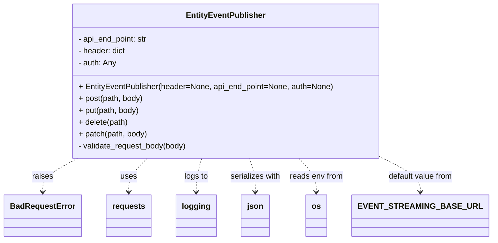

# Diagram: entity_core/entity_service/entity_service/common/publisher_api.py


> Auto-generated by Obscura crawlers

## Diagram 1



### SVG

<svg id="container" width="945.7109375" xmlns="http://www.w3.org/2000/svg" class="classDiagram" height="486" viewBox="0 0 945.7109375 486" role="graphics-document document" aria-roledescription="class"><style>#container{font-family:"trebuchet ms",verdana,arial,sans-serif;font-size:16px;fill:#333;}@keyframes edge-animation-frame{from{stroke-dashoffset:0;}}@keyframes dash{to{stroke-dashoffset:0;}}#container .edge-animation-slow{stroke-dasharray:9,5!important;stroke-dashoffset:900;animation:dash 50s linear infinite;stroke-linecap:round;}#container .edge-animation-fast{stroke-dasharray:9,5!important;stroke-dashoffset:900;animation:dash 20s linear infinite;stroke-linecap:round;}#container .error-icon{fill:#552222;}#container .error-text{fill:#552222;stroke:#552222;}#container .edge-thickness-normal{stroke-width:1px;}#container .edge-thickness-thick{stroke-width:3.5px;}#container .edge-pattern-solid{stroke-dasharray:0;}#container .edge-thickness-invisible{stroke-width:0;fill:none;}#container .edge-pattern-dashed{stroke-dasharray:3;}#container .edge-pattern-dotted{stroke-dasharray:2;}#container .marker{fill:#333333;stroke:#333333;}#container .marker.cross{stroke:#333333;}#container svg{font-family:"trebuchet ms",verdana,arial,sans-serif;font-size:16px;}#container p{margin:0;}#container g.classGroup text{fill:#9370DB;stroke:none;font-family:"trebuchet ms",verdana,arial,sans-serif;font-size:10px;}#container g.classGroup text .title{font-weight:bolder;}#container .nodeLabel,#container .edgeLabel{color:#131300;}#container .edgeLabel .label rect{fill:#ECECFF;}#container .label text{fill:#131300;}#container .labelBkg{background:#ECECFF;}#container .edgeLabel .label span{background:#ECECFF;}#container .classTitle{font-weight:bolder;}#container .node rect,#container .node circle,#container .node ellipse,#container .node polygon,#container .node path{fill:#ECECFF;stroke:#9370DB;stroke-width:1px;}#container .divider{stroke:#9370DB;stroke-width:1;}#container g.clickable{cursor:pointer;}#container g.classGroup rect{fill:#ECECFF;stroke:#9370DB;}#container g.classGroup line{stroke:#9370DB;stroke-width:1;}#container .classLabel .box{stroke:none;stroke-width:0;fill:#ECECFF;opacity:0.5;}#container .classLabel .label{fill:#9370DB;font-size:10px;}#container .relation{stroke:#333333;stroke-width:1;fill:none;}#container .dashed-line{stroke-dasharray:3;}#container .dotted-line{stroke-dasharray:1 2;}#container #compositionStart,#container .composition{fill:#333333!important;stroke:#333333!important;stroke-width:1;}#container #compositionEnd,#container .composition{fill:#333333!important;stroke:#333333!important;stroke-width:1;}#container #dependencyStart,#container .dependency{fill:#333333!important;stroke:#333333!important;stroke-width:1;}#container #dependencyStart,#container .dependency{fill:#333333!important;stroke:#333333!important;stroke-width:1;}#container #extensionStart,#container .extension{fill:transparent!important;stroke:#333333!important;stroke-width:1;}#container #extensionEnd,#container .extension{fill:transparent!important;stroke:#333333!important;stroke-width:1;}#container #aggregationStart,#container .aggregation{fill:transparent!important;stroke:#333333!important;stroke-width:1;}#container #aggregationEnd,#container .aggregation{fill:transparent!important;stroke:#333333!important;stroke-width:1;}#container #lollipopStart,#container .lollipop{fill:#ECECFF!important;stroke:#333333!important;stroke-width:1;}#container #lollipopEnd,#container .lollipop{fill:#ECECFF!important;stroke:#333333!important;stroke-width:1;}#container .edgeTerminals{font-size:11px;line-height:initial;}#container .classTitleText{text-anchor:middle;font-size:18px;fill:#333;}#container .label-icon{display:inline-block;height:1em;overflow:visible;vertical-align:-0.125em;}#container .node .label-icon path{fill:currentColor;stroke:revert;stroke-width:revert;}#container :root{--mermaid-font-family:"trebuchet ms",verdana,arial,sans-serif;}</style><g><defs><marker id="container_class-aggregationStart" class="marker aggregation class" refX="18" refY="7" markerWidth="190" markerHeight="240" orient="auto"><path d="M 18,7 L9,13 L1,7 L9,1 Z"></path></marker></defs><defs><marker id="container_class-aggregationEnd" class="marker aggregation class" refX="1" refY="7" markerWidth="20" markerHeight="28" orient="auto"><path d="M 18,7 L9,13 L1,7 L9,1 Z"></path></marker></defs><defs><marker id="container_class-extensionStart" class="marker extension class" refX="18" refY="7" markerWidth="190" markerHeight="240" orient="auto"><path d="M 1,7 L18,13 V 1 Z"></path></marker></defs><defs><marker id="container_class-extensionEnd" class="marker extension class" refX="1" refY="7" markerWidth="20" markerHeight="28" orient="auto"><path d="M 1,1 V 13 L18,7 Z"></path></marker></defs><defs><marker id="container_class-compositionStart" class="marker composition class" refX="18" refY="7" markerWidth="190" markerHeight="240" orient="auto"><path d="M 18,7 L9,13 L1,7 L9,1 Z"></path></marker></defs><defs><marker id="container_class-compositionEnd" class="marker composition class" refX="1" refY="7" markerWidth="20" markerHeight="28" orient="auto"><path d="M 18,7 L9,13 L1,7 L9,1 Z"></path></marker></defs><defs><marker id="container_class-dependencyStart" class="marker dependency class" refX="6" refY="7" markerWidth="190" markerHeight="240" orient="auto"><path d="M 5,7 L9,13 L1,7 L9,1 Z"></path></marker></defs><defs><marker id="container_class-dependencyEnd" class="marker dependency class" refX="13" refY="7" markerWidth="20" markerHeight="28" orient="auto"><path d="M 18,7 L9,13 L14,7 L9,1 Z"></path></marker></defs><defs><marker id="container_class-lollipopStart" class="marker lollipop class" refX="13" refY="7" markerWidth="190" markerHeight="240" orient="auto"><circle stroke="black" fill="transparent" cx="7" cy="7" r="6"></circle></marker></defs><defs><marker id="container_class-lollipopEnd" class="marker lollipop class" refX="1" refY="7" markerWidth="190" markerHeight="240" orient="auto"><circle stroke="black" fill="transparent" cx="7" cy="7" r="6"></circle></marker></defs><g class="root"><g class="clusters"></g><g class="edgePaths"><path d="M151.226,320L139.736,326.167C128.245,332.333,105.263,344.667,93.772,356C82.281,367.333,82.281,377.667,82.281,382.833L82.281,388" id="id_EntityEventPublisher_BadRequestError_1" class="edge-thickness-normal edge-pattern-dashed relation" style=";;;" data-edge="true" data-et="edge" data-id="id_EntityEventPublisher_BadRequestError_1" data-points="W3sieCI6MTUxLjIyNjQwMDU4MjkwMTUzLCJ5IjozMjB9LHsieCI6ODIuMjgxMjUsInkiOjM1N30seyJ4Ijo4Mi4yODEyNSwieSI6Mzk0fV0=" marker-end="url(#container_class-dependencyEnd)"></path><path d="M287.24,320L281.126,326.167C275.012,332.333,262.783,344.667,256.669,356C250.555,367.333,250.555,377.667,250.555,382.833L250.555,388" id="id_EntityEventPublisher_requests_2" class="edge-thickness-normal edge-pattern-dashed relation" style=";;;" data-edge="true" data-et="edge" data-id="id_EntityEventPublisher_requests_2" data-points="W3sieCI6Mjg3LjI0MDE2MzUzNjI2OTQsInkiOjMyMH0seyJ4IjoyNTAuNTU0Njg3NSwieSI6MzU3fSx7IngiOjI1MC41NTQ2ODc1LCJ5IjozOTR9XQ==" marker-end="url(#container_class-dependencyEnd)"></path><path d="M394.825,320L392.963,326.167C391.102,332.333,387.379,344.667,385.518,356C383.656,367.333,383.656,377.667,383.656,382.833L383.656,388" id="id_EntityEventPublisher_logging_3" class="edge-thickness-normal edge-pattern-dashed relation" style=";;;" data-edge="true" data-et="edge" data-id="id_EntityEventPublisher_logging_3" data-points="W3sieCI6Mzk0LjgyNDg0NjE3ODc1NjUsInkiOjMyMH0seyJ4IjozODMuNjU2MjUsInkiOjM1N30seyJ4IjozODMuNjU2MjUsInkiOjM5NH1d" marker-end="url(#container_class-dependencyEnd)"></path><path d="M489.003,320L490.865,326.167C492.726,332.333,496.449,344.667,498.31,356C500.172,367.333,500.172,377.667,500.172,382.833L500.172,388" id="id_EntityEventPublisher_json_4" class="edge-thickness-normal edge-pattern-dashed relation" style=";;;" data-edge="true" data-et="edge" data-id="id_EntityEventPublisher_json_4" data-points="W3sieCI6NDg5LjAwMzI3ODgyMTI0MzUsInkiOjMyMH0seyJ4Ijo1MDAuMTcxODc1LCJ5IjozNTd9LHsieCI6NTAwLjE3MTg3NSwieSI6Mzk0fV0=" marker-end="url(#container_class-dependencyEnd)"></path><path d="M590.658,320L596.538,326.167C602.418,332.333,614.178,344.667,620.058,356C625.938,367.333,625.938,377.667,625.938,382.833L625.938,388" id="id_EntityEventPublisher_os_5" class="edge-thickness-normal edge-pattern-dashed relation" style=";;;" data-edge="true" data-et="edge" data-id="id_EntityEventPublisher_os_5" data-points="W3sieCI6NTkwLjY1ODM5NTQwMTU1NDMsInkiOjMyMH0seyJ4Ijo2MjUuOTM3NSwieSI6MzU3fSx7IngiOjYyNS45Mzc1LCJ5IjozOTR9XQ==" marker-end="url(#container_class-dependencyEnd)"></path><path d="M745.168,320L757.156,326.167C769.143,332.333,793.119,344.667,805.106,356C817.094,367.333,817.094,377.667,817.094,382.833L817.094,388" id="id_EntityEventPublisher_EVENT_STREAMING_BASE_URL_6" class="edge-thickness-normal edge-pattern-dashed relation" style=";;;" data-edge="true" data-et="edge" data-id="id_EntityEventPublisher_EVENT_STREAMING_BASE_URL_6" data-points="W3sieCI6NzQ1LjE2ODExMDQyNzQ2MTIsInkiOjMyMH0seyJ4Ijo4MTcuMDkzNzUsInkiOjM1N30seyJ4Ijo4MTcuMDkzNzUsInkiOjM5NH1d" marker-end="url(#container_class-dependencyEnd)"></path></g><g class="edgeLabels"><g class="edgeLabel" transform="translate(82.28125, 357)"><g class="label" data-id="id_EntityEventPublisher_BadRequestError_1" transform="translate(-21.25, -12)"><foreignObject width="42.5" height="24"><div xmlns="http://www.w3.org/1999/xhtml" class="labelBkg" style="display: table-cell; white-space: nowrap; line-height: 1.5; max-width: 200px; text-align: center;"><span class="edgeLabel"><p>raises</p></span></div></foreignObject></g></g><g class="edgeLabel" transform="translate(250.5546875, 357)"><g class="label" data-id="id_EntityEventPublisher_requests_2" transform="translate(-16.4921875, -12)"><foreignObject width="32.984375" height="24"><div xmlns="http://www.w3.org/1999/xhtml" class="labelBkg" style="display: table-cell; white-space: nowrap; line-height: 1.5; max-width: 200px; text-align: center;"><span class="edgeLabel"><p>uses</p></span></div></foreignObject></g></g><g class="edgeLabel" transform="translate(383.65625, 357)"><g class="label" data-id="id_EntityEventPublisher_logging_3" transform="translate(-24.3828125, -12)"><foreignObject width="48.765625" height="24"><div xmlns="http://www.w3.org/1999/xhtml" class="labelBkg" style="display: table-cell; white-space: nowrap; line-height: 1.5; max-width: 200px; text-align: center;"><span class="edgeLabel"><p>logs to</p></span></div></foreignObject></g></g><g class="edgeLabel" transform="translate(500.171875, 357)"><g class="label" data-id="id_EntityEventPublisher_json_4" transform="translate(-51.5390625, -12)"><foreignObject width="103.078125" height="24"><div xmlns="http://www.w3.org/1999/xhtml" class="labelBkg" style="display: table-cell; white-space: nowrap; line-height: 1.5; max-width: 200px; text-align: center;"><span class="edgeLabel"><p>serializes with</p></span></div></foreignObject></g></g><g class="edgeLabel" transform="translate(625.9375, 357)"><g class="label" data-id="id_EntityEventPublisher_os_5" transform="translate(-54.2265625, -12)"><foreignObject width="108.453125" height="24"><div xmlns="http://www.w3.org/1999/xhtml" class="labelBkg" style="display: table-cell; white-space: nowrap; line-height: 1.5; max-width: 200px; text-align: center;"><span class="edgeLabel"><p>reads env from</p></span></div></foreignObject></g></g><g class="edgeLabel" transform="translate(817.09375, 357)"><g class="label" data-id="id_EntityEventPublisher_EVENT_STREAMING_BASE_URL_6" transform="translate(-66.625, -12)"><foreignObject width="133.25" height="24"><div xmlns="http://www.w3.org/1999/xhtml" class="labelBkg" style="display: table-cell; white-space: nowrap; line-height: 1.5; max-width: 200px; text-align: center;"><span class="edgeLabel"><p>default value from</p></span></div></foreignObject></g></g></g><g class="nodes"><g class="node default" id="classId-EntityEventPublisher-0" transform="translate(441.9140625, 164)"><g class="basic label-container"><path d="M-308.6875 -156 L308.6875 -156 L308.6875 156 L-308.6875 156" stroke="none" stroke-width="0" fill="#ECECFF" style=""></path><path d="M-308.6875 -156 C-164.92909385365334 -156, -21.170687707306683 -156, 308.6875 -156 M-308.6875 -156 C-152.53097391489683 -156, 3.6255521702063334 -156, 308.6875 -156 M308.6875 -156 C308.6875 -92.61478451249145, 308.6875 -29.229569024982908, 308.6875 156 M308.6875 -156 C308.6875 -84.41993093501462, 308.6875 -12.839861870029239, 308.6875 156 M308.6875 156 C179.07597858816075 156, 49.4644571763215 156, -308.6875 156 M308.6875 156 C123.43158420311326 156, -61.82433159377348 156, -308.6875 156 M-308.6875 156 C-308.6875 33.187433950819084, -308.6875 -89.62513209836183, -308.6875 -156 M-308.6875 156 C-308.6875 68.33549033823931, -308.6875 -19.32901932352138, -308.6875 -156" stroke="#9370DB" stroke-width="1.3" fill="none" stroke-dasharray="0 0" style=""></path></g><g class="annotation-group text" transform="translate(0, -132)"></g><g class="label-group text" transform="translate(-76.171875, -132)"><g class="label" style="font-weight: bolder" transform="translate(0,-12)"><foreignObject width="152.34375" height="24"><div xmlns="http://www.w3.org/1999/xhtml" style="display: table-cell; white-space: nowrap; line-height: 1.5; max-width: 201px; text-align: center;"><span class="nodeLabel markdown-node-label" style=""><p>EntityEventPublisher</p></span></div></foreignObject></g></g><g class="members-group text" transform="translate(-296.6875, -84)"><g class="label" style="" transform="translate(0,-12)"><foreignObject width="143.484375" height="24"><div xmlns="http://www.w3.org/1999/xhtml" style="display: table-cell; white-space: nowrap; line-height: 1.5; max-width: 202px; text-align: center;"><span class="nodeLabel markdown-node-label" style=""><p>- api_end_point: str</p></span></div></foreignObject></g><g class="label" style="" transform="translate(0,12)"><foreignObject width="97.546875" height="24"><div xmlns="http://www.w3.org/1999/xhtml" style="display: table-cell; white-space: nowrap; line-height: 1.5; max-width: 155px; text-align: center;"><span class="nodeLabel markdown-node-label" style=""><p>- header: dict</p></span></div></foreignObject></g><g class="label" style="" transform="translate(0,36)"><foreignObject width="78.25" height="24"><div xmlns="http://www.w3.org/1999/xhtml" style="display: table-cell; white-space: nowrap; line-height: 1.5; max-width: 136px; text-align: center;"><span class="nodeLabel markdown-node-label" style=""><p>- auth: Any</p></span></div></foreignObject></g></g><g class="methods-group text" transform="translate(-296.6875, 12)"><g class="label" style="" transform="translate(0,-12)"><foreignObject width="517.203125" height="24"><div xmlns="http://www.w3.org/1999/xhtml" style="display: table-cell; white-space: nowrap; line-height: 1.5; max-width: 575px; text-align: center;"><span class="nodeLabel markdown-node-label" style=""><p>+ EntityEventPublisher(header=None, api_end_point=None, auth=None)</p></span></div></foreignObject></g><g class="label" style="" transform="translate(0,12)"><foreignObject width="132.265625" height="24"><div xmlns="http://www.w3.org/1999/xhtml" style="display: table-cell; white-space: nowrap; line-height: 1.5; max-width: 190px; text-align: center;"><span class="nodeLabel markdown-node-label" style=""><p>+ post(path, body)</p></span></div></foreignObject></g><g class="label" style="" transform="translate(0,36)"><foreignObject width="124.765625" height="24"><div xmlns="http://www.w3.org/1999/xhtml" style="display: table-cell; white-space: nowrap; line-height: 1.5; max-width: 182px; text-align: center;"><span class="nodeLabel markdown-node-label" style=""><p>+ put(path, body)</p></span></div></foreignObject></g><g class="label" style="" transform="translate(0,60)"><foreignObject width="101.671875" height="24"><div xmlns="http://www.w3.org/1999/xhtml" style="display: table-cell; white-space: nowrap; line-height: 1.5; max-width: 159px; text-align: center;"><span class="nodeLabel markdown-node-label" style=""><p>+ delete(path)</p></span></div></foreignObject></g><g class="label" style="" transform="translate(0,84)"><foreignObject width="140.78125" height="24"><div xmlns="http://www.w3.org/1999/xhtml" style="display: table-cell; white-space: nowrap; line-height: 1.5; max-width: 198px; text-align: center;"><span class="nodeLabel markdown-node-label" style=""><p>+ patch(path, body)</p></span></div></foreignObject></g><g class="label" style="" transform="translate(0,108)"><foreignObject width="223.109375" height="24"><div xmlns="http://www.w3.org/1999/xhtml" style="display: table-cell; white-space: nowrap; line-height: 1.5; max-width: 280px; text-align: center;"><span class="nodeLabel markdown-node-label" style=""><p>- validate_request_body(body)</p></span></div></foreignObject></g></g><g class="divider" style=""><path d="M-308.6875 -108 C-182.6695233098181 -108, -56.65154661963621 -108, 308.6875 -108 M-308.6875 -108 C-118.51518460183914 -108, 71.65713079632172 -108, 308.6875 -108" stroke="#9370DB" stroke-width="1.3" fill="none" stroke-dasharray="0 0" style=""></path></g><g class="divider" style=""><path d="M-308.6875 -12 C-185.03003651390907 -12, -61.372573027818106 -12, 308.6875 -12 M-308.6875 -12 C-79.79732149752536 -12, 149.09285700494928 -12, 308.6875 -12" stroke="#9370DB" stroke-width="1.3" fill="none" stroke-dasharray="0 0" style=""></path></g></g><g class="node default" id="classId-BadRequestError-1" transform="translate(82.28125, 436)"><g class="basic label-container"><path d="M-74.28125 -42 L74.28125 -42 L74.28125 42 L-74.28125 42" stroke="none" stroke-width="0" fill="#ECECFF" style=""></path><path d="M-74.28125 -42 C-41.761516703342366 -42, -9.241783406684732 -42, 74.28125 -42 M-74.28125 -42 C-36.33231605958003 -42, 1.6166178808399394 -42, 74.28125 -42 M74.28125 -42 C74.28125 -17.118453082064672, 74.28125 7.763093835870656, 74.28125 42 M74.28125 -42 C74.28125 -15.193675298782349, 74.28125 11.612649402435302, 74.28125 42 M74.28125 42 C35.8092965158139 42, -2.662656968372204 42, -74.28125 42 M74.28125 42 C43.08113342101308 42, 11.881016842026149 42, -74.28125 42 M-74.28125 42 C-74.28125 13.379667759838721, -74.28125 -15.240664480322557, -74.28125 -42 M-74.28125 42 C-74.28125 8.524316919186724, -74.28125 -24.951366161626552, -74.28125 -42" stroke="#9370DB" stroke-width="1.3" fill="none" stroke-dasharray="0 0" style=""></path></g><g class="annotation-group text" transform="translate(0, -18)"></g><g class="label-group text" transform="translate(-62.28125, -18)"><g class="label" style="font-weight: bolder" transform="translate(0,-12)"><foreignObject width="124.5625" height="24"><div xmlns="http://www.w3.org/1999/xhtml" style="display: table-cell; white-space: nowrap; line-height: 1.5; max-width: 174px; text-align: center;"><span class="nodeLabel markdown-node-label" style=""><p>BadRequestError</p></span></div></foreignObject></g></g><g class="members-group text" transform="translate(-62.28125, 30)"></g><g class="methods-group text" transform="translate(-62.28125, 60)"></g><g class="divider" style=""><path d="M-74.28125 6 C-31.132641004717065 6, 12.01596799056587 6, 74.28125 6 M-74.28125 6 C-22.794857298243777 6, 28.691535403512447 6, 74.28125 6" stroke="#9370DB" stroke-width="1.3" fill="none" stroke-dasharray="0 0" style=""></path></g><g class="divider" style=""><path d="M-74.28125 24 C-31.420770475663147 24, 11.439709048673706 24, 74.28125 24 M-74.28125 24 C-28.724971530967046 24, 16.831306938065907 24, 74.28125 24" stroke="#9370DB" stroke-width="1.3" fill="none" stroke-dasharray="0 0" style=""></path></g></g><g class="node default" id="classId-requests-2" transform="translate(250.5546875, 436)"><g class="basic label-container"><path d="M-43.9921875 -42 L43.9921875 -42 L43.9921875 42 L-43.9921875 42" stroke="none" stroke-width="0" fill="#ECECFF" style=""></path><path d="M-43.9921875 -42 C-22.29568152516364 -42, -0.5991755503272813 -42, 43.9921875 -42 M-43.9921875 -42 C-9.66100929696374 -42, 24.67016890607252 -42, 43.9921875 -42 M43.9921875 -42 C43.9921875 -18.928964494552474, 43.9921875 4.142071010895052, 43.9921875 42 M43.9921875 -42 C43.9921875 -21.83770451563821, 43.9921875 -1.6754090312764234, 43.9921875 42 M43.9921875 42 C23.871318298462835 42, 3.7504490969256707 42, -43.9921875 42 M43.9921875 42 C14.12177169741739 42, -15.74864410516522 42, -43.9921875 42 M-43.9921875 42 C-43.9921875 11.930585495641417, -43.9921875 -18.138829008717167, -43.9921875 -42 M-43.9921875 42 C-43.9921875 24.407562689172423, -43.9921875 6.815125378344845, -43.9921875 -42" stroke="#9370DB" stroke-width="1.3" fill="none" stroke-dasharray="0 0" style=""></path></g><g class="annotation-group text" transform="translate(0, -18)"></g><g class="label-group text" transform="translate(-31.9921875, -18)"><g class="label" style="font-weight: bolder" transform="translate(0,-12)"><foreignObject width="63.984375" height="24"><div xmlns="http://www.w3.org/1999/xhtml" style="display: table-cell; white-space: nowrap; line-height: 1.5; max-width: 113px; text-align: center;"><span class="nodeLabel markdown-node-label" style=""><p>requests</p></span></div></foreignObject></g></g><g class="members-group text" transform="translate(-31.9921875, 30)"></g><g class="methods-group text" transform="translate(-31.9921875, 60)"></g><g class="divider" style=""><path d="M-43.9921875 6 C-22.372346004045916 6, -0.7525045080918318 6, 43.9921875 6 M-43.9921875 6 C-14.410760238960599 6, 15.170667022078803 6, 43.9921875 6" stroke="#9370DB" stroke-width="1.3" fill="none" stroke-dasharray="0 0" style=""></path></g><g class="divider" style=""><path d="M-43.9921875 24 C-20.81588045716543 24, 2.3604265856691384 24, 43.9921875 24 M-43.9921875 24 C-23.143922320073386 24, -2.2956571401467727 24, 43.9921875 24" stroke="#9370DB" stroke-width="1.3" fill="none" stroke-dasharray="0 0" style=""></path></g></g><g class="node default" id="classId-logging-3" transform="translate(383.65625, 436)"><g class="basic label-container"><path d="M-39.109375 -42 L39.109375 -42 L39.109375 42 L-39.109375 42" stroke="none" stroke-width="0" fill="#ECECFF" style=""></path><path d="M-39.109375 -42 C-11.811027704683411 -42, 15.487319590633177 -42, 39.109375 -42 M-39.109375 -42 C-18.355273976710226 -42, 2.398827046579548 -42, 39.109375 -42 M39.109375 -42 C39.109375 -20.66247192421356, 39.109375 0.6750561515728819, 39.109375 42 M39.109375 -42 C39.109375 -12.764529188759703, 39.109375 16.470941622480595, 39.109375 42 M39.109375 42 C14.677689451421475 42, -9.75399609715705 42, -39.109375 42 M39.109375 42 C18.80773455094142 42, -1.4939058981171627 42, -39.109375 42 M-39.109375 42 C-39.109375 9.160058301401662, -39.109375 -23.679883397196676, -39.109375 -42 M-39.109375 42 C-39.109375 15.834531936310597, -39.109375 -10.330936127378806, -39.109375 -42" stroke="#9370DB" stroke-width="1.3" fill="none" stroke-dasharray="0 0" style=""></path></g><g class="annotation-group text" transform="translate(0, -18)"></g><g class="label-group text" transform="translate(-27.109375, -18)"><g class="label" style="font-weight: bolder" transform="translate(0,-12)"><foreignObject width="54.21875" height="24"><div xmlns="http://www.w3.org/1999/xhtml" style="display: table-cell; white-space: nowrap; line-height: 1.5; max-width: 103px; text-align: center;"><span class="nodeLabel markdown-node-label" style=""><p>logging</p></span></div></foreignObject></g></g><g class="members-group text" transform="translate(-27.109375, 30)"></g><g class="methods-group text" transform="translate(-27.109375, 60)"></g><g class="divider" style=""><path d="M-39.109375 6 C-20.287331419531412 6, -1.4652878390628246 6, 39.109375 6 M-39.109375 6 C-11.974031068312666 6, 15.161312863374668 6, 39.109375 6" stroke="#9370DB" stroke-width="1.3" fill="none" stroke-dasharray="0 0" style=""></path></g><g class="divider" style=""><path d="M-39.109375 24 C-19.00630839074905 24, 1.096758218501897 24, 39.109375 24 M-39.109375 24 C-8.240941825579988 24, 22.627491348840024 24, 39.109375 24" stroke="#9370DB" stroke-width="1.3" fill="none" stroke-dasharray="0 0" style=""></path></g></g><g class="node default" id="classId-json-4" transform="translate(500.171875, 436)"><g class="basic label-container"><path d="M-27.40625 -42 L27.40625 -42 L27.40625 42 L-27.40625 42" stroke="none" stroke-width="0" fill="#ECECFF" style=""></path><path d="M-27.40625 -42 C-9.04255774471017 -42, 9.321134510579661 -42, 27.40625 -42 M-27.40625 -42 C-6.740065811370343 -42, 13.926118377259314 -42, 27.40625 -42 M27.40625 -42 C27.40625 -15.022675587002105, 27.40625 11.95464882599579, 27.40625 42 M27.40625 -42 C27.40625 -8.988054717396942, 27.40625 24.023890565206116, 27.40625 42 M27.40625 42 C9.953926259769574 42, -7.498397480460852 42, -27.40625 42 M27.40625 42 C11.086863346435713 42, -5.232523307128574 42, -27.40625 42 M-27.40625 42 C-27.40625 12.917852481635258, -27.40625 -16.164295036729484, -27.40625 -42 M-27.40625 42 C-27.40625 14.648411504030936, -27.40625 -12.703176991938129, -27.40625 -42" stroke="#9370DB" stroke-width="1.3" fill="none" stroke-dasharray="0 0" style=""></path></g><g class="annotation-group text" transform="translate(0, -18)"></g><g class="label-group text" transform="translate(-15.40625, -18)"><g class="label" style="font-weight: bolder" transform="translate(0,-12)"><foreignObject width="30.8125" height="24"><div xmlns="http://www.w3.org/1999/xhtml" style="display: table-cell; white-space: nowrap; line-height: 1.5; max-width: 82px; text-align: center;"><span class="nodeLabel markdown-node-label" style=""><p>json</p></span></div></foreignObject></g></g><g class="members-group text" transform="translate(-15.40625, 30)"></g><g class="methods-group text" transform="translate(-15.40625, 60)"></g><g class="divider" style=""><path d="M-27.40625 6 C-10.529210900937684 6, 6.347828198124631 6, 27.40625 6 M-27.40625 6 C-12.557218819640237 6, 2.2918123607195255 6, 27.40625 6" stroke="#9370DB" stroke-width="1.3" fill="none" stroke-dasharray="0 0" style=""></path></g><g class="divider" style=""><path d="M-27.40625 24 C-14.111401086484248 24, -0.8165521729684961 24, 27.40625 24 M-27.40625 24 C-16.38503964409213 24, -5.3638292881842595 24, 27.40625 24" stroke="#9370DB" stroke-width="1.3" fill="none" stroke-dasharray="0 0" style=""></path></g></g><g class="node default" id="classId-os-5" transform="translate(625.9375, 436)"><g class="basic label-container"><path d="M-20.5390625 -42 L20.5390625 -42 L20.5390625 42 L-20.5390625 42" stroke="none" stroke-width="0" fill="#ECECFF" style=""></path><path d="M-20.5390625 -42 C-7.945215068321133 -42, 4.648632363357734 -42, 20.5390625 -42 M-20.5390625 -42 C-9.137063146587941 -42, 2.2649362068241174 -42, 20.5390625 -42 M20.5390625 -42 C20.5390625 -15.121314076677244, 20.5390625 11.757371846645512, 20.5390625 42 M20.5390625 -42 C20.5390625 -24.109866043004406, 20.5390625 -6.219732086008811, 20.5390625 42 M20.5390625 42 C8.095718236502378 42, -4.347626026995243 42, -20.5390625 42 M20.5390625 42 C10.278709781398991 42, 0.018357062797981882 42, -20.5390625 42 M-20.5390625 42 C-20.5390625 20.875771067666285, -20.5390625 -0.24845786466742936, -20.5390625 -42 M-20.5390625 42 C-20.5390625 23.168512539801206, -20.5390625 4.337025079602412, -20.5390625 -42" stroke="#9370DB" stroke-width="1.3" fill="none" stroke-dasharray="0 0" style=""></path></g><g class="annotation-group text" transform="translate(0, -18)"></g><g class="label-group text" transform="translate(-8.5390625, -18)"><g class="label" style="font-weight: bolder" transform="translate(0,-12)"><foreignObject width="17.078125" height="24"><div xmlns="http://www.w3.org/1999/xhtml" style="display: table-cell; white-space: nowrap; line-height: 1.5; max-width: 67px; text-align: center;"><span class="nodeLabel markdown-node-label" style=""><p>os</p></span></div></foreignObject></g></g><g class="members-group text" transform="translate(-8.5390625, 30)"></g><g class="methods-group text" transform="translate(-8.5390625, 60)"></g><g class="divider" style=""><path d="M-20.5390625 6 C-9.69154255133125 6, 1.1559773973375016 6, 20.5390625 6 M-20.5390625 6 C-8.050210727384387 6, 4.4386410452312255 6, 20.5390625 6" stroke="#9370DB" stroke-width="1.3" fill="none" stroke-dasharray="0 0" style=""></path></g><g class="divider" style=""><path d="M-20.5390625 24 C-11.821167951681204 24, -3.103273403362408 24, 20.5390625 24 M-20.5390625 24 C-6.787102200534321 24, 6.964858098931359 24, 20.5390625 24" stroke="#9370DB" stroke-width="1.3" fill="none" stroke-dasharray="0 0" style=""></path></g></g><g class="node default" id="classId-EVENT_STREAMING_BASE_URL-6" transform="translate(817.09375, 436)"><g class="basic label-container"><path d="M-120.6171875 -42 L120.6171875 -42 L120.6171875 42 L-120.6171875 42" stroke="none" stroke-width="0" fill="#ECECFF" style=""></path><path d="M-120.6171875 -42 C-31.71246246263614 -42, 57.19226257472772 -42, 120.6171875 -42 M-120.6171875 -42 C-68.29167610942483 -42, -15.966164718849669 -42, 120.6171875 -42 M120.6171875 -42 C120.6171875 -21.870258825862614, 120.6171875 -1.7405176517252272, 120.6171875 42 M120.6171875 -42 C120.6171875 -15.144915446651904, 120.6171875 11.710169106696192, 120.6171875 42 M120.6171875 42 C61.98439892792459 42, 3.351610355849175 42, -120.6171875 42 M120.6171875 42 C32.860262607516944 42, -54.89666228496611 42, -120.6171875 42 M-120.6171875 42 C-120.6171875 16.44695317338955, -120.6171875 -9.106093653220903, -120.6171875 -42 M-120.6171875 42 C-120.6171875 12.059466081604018, -120.6171875 -17.881067836791964, -120.6171875 -42" stroke="#9370DB" stroke-width="1.3" fill="none" stroke-dasharray="0 0" style=""></path></g><g class="annotation-group text" transform="translate(0, -18)"></g><g class="label-group text" transform="translate(-108.6171875, -18)"><g class="label" style="font-weight: bolder" transform="translate(0,-12)"><foreignObject width="217.234375" height="24"><div xmlns="http://www.w3.org/1999/xhtml" style="display: table-cell; white-space: nowrap; line-height: 1.5; max-width: 265px; text-align: center;"><span class="nodeLabel markdown-node-label" style=""><p>EVENT_STREAMING_BASE_URL</p></span></div></foreignObject></g></g><g class="members-group text" transform="translate(-108.6171875, 30)"></g><g class="methods-group text" transform="translate(-108.6171875, 60)"></g><g class="divider" style=""><path d="M-120.6171875 6 C-36.88587164264315 6, 46.845444214713694 6, 120.6171875 6 M-120.6171875 6 C-70.74433119798293 6, -20.87147489596586 6, 120.6171875 6" stroke="#9370DB" stroke-width="1.3" fill="none" stroke-dasharray="0 0" style=""></path></g><g class="divider" style=""><path d="M-120.6171875 24 C-57.0871610300163 24, 6.442865439967406 24, 120.6171875 24 M-120.6171875 24 C-39.36396145681758 24, 41.889264586364845 24, 120.6171875 24" stroke="#9370DB" stroke-width="1.3" fill="none" stroke-dasharray="0 0" style=""></path></g></g></g></g></g></svg>

## Diagram 2

```mermaid
sequenceDiagram
participant Caller
participant Publisher as EntityEventPublisher
participant Logging as logging
participant Validator as validate_request_body
participant JSON as json
participant Requests as requests

Caller->>Publisher: post(path, body)
Publisher->>Logging: info("Event API Complete URL {api_full_url}")
Publisher->>Validator: validate_request_body(body)
alt body is None
Validator-->>Publisher: raises BadRequestError
else body valid
Validator-->>Publisher: returns
Publisher->>JSON: dumps(body)
Publisher->>Requests: post(url=api_full_url, data=data, headers=header)
Requests-->>Publisher: response(status_code, body)
Publisher->>Logging: info("Event Api endpoint responses: { response.status_code }")
Publisher-->>Caller: response
```

> SVG rendering failed for this diagram.
