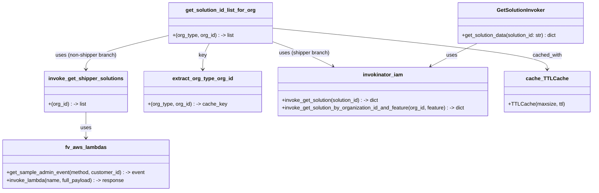

# Diagram: entity_core/entity_service/entity_service/common/solution.py


> Auto-generated by Obscura crawlers

## Diagram 1

```mermaid
flowchart TD
    Caller[Caller] --> GetSol[get_solution_id_list_for_org(org_type, org_id)]
    GetSol --> Check{OrgTypes.SHIPPER in org_type?}
    Check -- Yes --> InvokeByOrg[invokinator_iam.invoke_get_solution_by_organization_id_and_feature(org_id, Feature.FINISHED_VEHICLE)]
    InvokeByOrg --> ExtractID1[.get("solution_id")]
    ExtractID1 --> Sols1[solution_ids = [solution_id]]
    Check -- No --> InvokeShippers[invoke_get_shipper_solutions(org_id)]
    InvokeShippers --> MakeEvent[fv.aws.lambdas.get_sample_admin_event("GET", customer_id=org_id)]
    MakeEvent --> CallLambda[fv.aws.lambdas.invoke_lambda("get_shippers_associated_to_org", full_payload=event)]
    CallLambda --> ParseJSON[json.loads(res.get("body", "[]"))]
    ParseJSON --> MapIDs[solution_ids = [sol.get("solution_id") for sol in solutions]]
    Sols1 --> Return[return solution_ids]
    MapIDs --> Return
    GetSol --> CacheInfo[Cached via TTLCache(maxsize=128, ttl=300) keyed by extract_org_type_org_id]
    CacheInfo -.-> GetSol
    InvokerClass[GetSolutionInvoker.get_solution_data(solution_id)] --> InvokeGetSol[invokinator_iam.invoke_get_solution(solution_id)]
    InvokeGetSol --> ReturnDict[returns dict]
```

> SVG rendering failed for this diagram.

## Diagram 2



### SVG

<svg id="container" width="1806.12890625" xmlns="http://www.w3.org/2000/svg" class="classDiagram" height="590" viewBox="0 0 1806.12890625 590" role="graphics-document document" aria-roledescription="class"><style>#container{font-family:"trebuchet ms",verdana,arial,sans-serif;font-size:16px;fill:#333;}@keyframes edge-animation-frame{from{stroke-dashoffset:0;}}@keyframes dash{to{stroke-dashoffset:0;}}#container .edge-animation-slow{stroke-dasharray:9,5!important;stroke-dashoffset:900;animation:dash 50s linear infinite;stroke-linecap:round;}#container .edge-animation-fast{stroke-dasharray:9,5!important;stroke-dashoffset:900;animation:dash 20s linear infinite;stroke-linecap:round;}#container .error-icon{fill:#552222;}#container .error-text{fill:#552222;stroke:#552222;}#container .edge-thickness-normal{stroke-width:1px;}#container .edge-thickness-thick{stroke-width:3.5px;}#container .edge-pattern-solid{stroke-dasharray:0;}#container .edge-thickness-invisible{stroke-width:0;fill:none;}#container .edge-pattern-dashed{stroke-dasharray:3;}#container .edge-pattern-dotted{stroke-dasharray:2;}#container .marker{fill:#333333;stroke:#333333;}#container .marker.cross{stroke:#333333;}#container svg{font-family:"trebuchet ms",verdana,arial,sans-serif;font-size:16px;}#container p{margin:0;}#container g.classGroup text{fill:#9370DB;stroke:none;font-family:"trebuchet ms",verdana,arial,sans-serif;font-size:10px;}#container g.classGroup text .title{font-weight:bolder;}#container .nodeLabel,#container .edgeLabel{color:#131300;}#container .edgeLabel .label rect{fill:#ECECFF;}#container .label text{fill:#131300;}#container .labelBkg{background:#ECECFF;}#container .edgeLabel .label span{background:#ECECFF;}#container .classTitle{font-weight:bolder;}#container .node rect,#container .node circle,#container .node ellipse,#container .node polygon,#container .node path{fill:#ECECFF;stroke:#9370DB;stroke-width:1px;}#container .divider{stroke:#9370DB;stroke-width:1;}#container g.clickable{cursor:pointer;}#container g.classGroup rect{fill:#ECECFF;stroke:#9370DB;}#container g.classGroup line{stroke:#9370DB;stroke-width:1;}#container .classLabel .box{stroke:none;stroke-width:0;fill:#ECECFF;opacity:0.5;}#container .classLabel .label{fill:#9370DB;font-size:10px;}#container .relation{stroke:#333333;stroke-width:1;fill:none;}#container .dashed-line{stroke-dasharray:3;}#container .dotted-line{stroke-dasharray:1 2;}#container #compositionStart,#container .composition{fill:#333333!important;stroke:#333333!important;stroke-width:1;}#container #compositionEnd,#container .composition{fill:#333333!important;stroke:#333333!important;stroke-width:1;}#container #dependencyStart,#container .dependency{fill:#333333!important;stroke:#333333!important;stroke-width:1;}#container #dependencyStart,#container .dependency{fill:#333333!important;stroke:#333333!important;stroke-width:1;}#container #extensionStart,#container .extension{fill:transparent!important;stroke:#333333!important;stroke-width:1;}#container #extensionEnd,#container .extension{fill:transparent!important;stroke:#333333!important;stroke-width:1;}#container #aggregationStart,#container .aggregation{fill:transparent!important;stroke:#333333!important;stroke-width:1;}#container #aggregationEnd,#container .aggregation{fill:transparent!important;stroke:#333333!important;stroke-width:1;}#container #lollipopStart,#container .lollipop{fill:#ECECFF!important;stroke:#333333!important;stroke-width:1;}#container #lollipopEnd,#container .lollipop{fill:#ECECFF!important;stroke:#333333!important;stroke-width:1;}#container .edgeTerminals{font-size:11px;line-height:initial;}#container .classTitleText{text-anchor:middle;font-size:18px;fill:#333;}#container .label-icon{display:inline-block;height:1em;overflow:visible;vertical-align:-0.125em;}#container .node .label-icon path{fill:currentColor;stroke:revert;stroke-width:revert;}#container :root{--mermaid-font-family:"trebuchet ms",verdana,arial,sans-serif;}</style><g><defs><marker id="container_class-aggregationStart" class="marker aggregation class" refX="18" refY="7" markerWidth="190" markerHeight="240" orient="auto"><path d="M 18,7 L9,13 L1,7 L9,1 Z"></path></marker></defs><defs><marker id="container_class-aggregationEnd" class="marker aggregation class" refX="1" refY="7" markerWidth="20" markerHeight="28" orient="auto"><path d="M 18,7 L9,13 L1,7 L9,1 Z"></path></marker></defs><defs><marker id="container_class-extensionStart" class="marker extension class" refX="18" refY="7" markerWidth="190" markerHeight="240" orient="auto"><path d="M 1,7 L18,13 V 1 Z"></path></marker></defs><defs><marker id="container_class-extensionEnd" class="marker extension class" refX="1" refY="7" markerWidth="20" markerHeight="28" orient="auto"><path d="M 1,1 V 13 L18,7 Z"></path></marker></defs><defs><marker id="container_class-compositionStart" class="marker composition class" refX="18" refY="7" markerWidth="190" markerHeight="240" orient="auto"><path d="M 18,7 L9,13 L1,7 L9,1 Z"></path></marker></defs><defs><marker id="container_class-compositionEnd" class="marker composition class" refX="1" refY="7" markerWidth="20" markerHeight="28" orient="auto"><path d="M 18,7 L9,13 L1,7 L9,1 Z"></path></marker></defs><defs><marker id="container_class-dependencyStart" class="marker dependency class" refX="6" refY="7" markerWidth="190" markerHeight="240" orient="auto"><path d="M 5,7 L9,13 L1,7 L9,1 Z"></path></marker></defs><defs><marker id="container_class-dependencyEnd" class="marker dependency class" refX="13" refY="7" markerWidth="20" markerHeight="28" orient="auto"><path d="M 18,7 L9,13 L14,7 L9,1 Z"></path></marker></defs><defs><marker id="container_class-lollipopStart" class="marker lollipop class" refX="13" refY="7" markerWidth="190" markerHeight="240" orient="auto"><circle stroke="black" fill="transparent" cx="7" cy="7" r="6"></circle></marker></defs><defs><marker id="container_class-lollipopEnd" class="marker lollipop class" refX="1" refY="7" markerWidth="190" markerHeight="240" orient="auto"><circle stroke="black" fill="transparent" cx="7" cy="7" r="6"></circle></marker></defs><g class="root"><g class="clusters"></g><g class="edgePaths"><path d="M638.091,134L634.67,140.167C631.25,146.333,624.408,158.667,620.987,172C617.566,185.333,617.566,199.667,617.566,206.833L617.566,214" id="id_get_solution_id_list_for_org_extract_org_type_org_id_1" class="edge-thickness-normal edge-pattern-solid relation" style=";;;" data-edge="true" data-et="edge" data-id="id_get_solution_id_list_for_org_extract_org_type_org_id_1" data-points="W3sieCI6NjM4LjA5MTI4OTA2MjUsInkiOjEzNH0seyJ4Ijo2MTcuNTY2NDA2MjUsInkiOjE3MX0seyJ4Ijo2MTcuNTY2NDA2MjUsInkiOjIyMH1d" marker-end="url(#container_class-dependencyEnd)"></path><path d="M831.215,128.052L851.061,135.21C870.906,142.368,910.598,156.684,941.762,169.558C972.926,182.432,995.562,193.864,1006.881,199.579L1018.199,205.295" id="id_get_solution_id_list_for_org_invokinator_iam_2" class="edge-thickness-normal edge-pattern-solid relation" style=";;;" data-edge="true" data-et="edge" data-id="id_get_solution_id_list_for_org_invokinator_iam_2" data-points="W3sieCI6ODMxLjIxNDg0Mzc1LCJ5IjoxMjguMDUxNjc5NDQwOTM3OH0seyJ4Ijo5NTAuMjg5MDYyNSwieSI6MTcxfSx7IngiOjEwMjMuNTU0NzkyMTMxNjk2NCwieSI6MjA4fV0=" marker-end="url(#container_class-dependencyEnd)"></path><path d="M514.863,109.696L473.098,119.913C431.333,130.131,347.803,150.565,306.038,167.949C264.273,185.333,264.273,199.667,264.273,206.833L264.273,214" id="id_get_solution_id_list_for_org_invoke_get_shipper_solutions_3" class="edge-thickness-normal edge-pattern-solid relation" style=";;;" data-edge="true" data-et="edge" data-id="id_get_solution_id_list_for_org_invoke_get_shipper_solutions_3" data-points="W3sieCI6NTE0Ljg2MzI4MTI1LCJ5IjoxMDkuNjk1OTU5NjM0NTcwNTR9LHsieCI6MjY0LjI3MzQzNzUsInkiOjE3MX0seyJ4IjoyNjQuMjczNDM3NSwieSI6MjIwfV0=" marker-end="url(#container_class-dependencyEnd)"></path><path d="M264.273,346L264.273,354.167C264.273,362.333,264.273,378.667,264.273,392C264.273,405.333,264.273,415.667,264.273,420.833L264.273,426" id="id_invoke_get_shipper_solutions_fv_aws_lambdas_4" class="edge-thickness-normal edge-pattern-solid relation" style=";;;" data-edge="true" data-et="edge" data-id="id_invoke_get_shipper_solutions_fv_aws_lambdas_4" data-points="W3sieCI6MjY0LjI3MzQzNzUsInkiOjM0Nn0seyJ4IjoyNjQuMjczNDM3NSwieSI6Mzk1fSx7IngiOjI2NC4yNzM0Mzc1LCJ5Ijo0MzJ9XQ==" marker-end="url(#container_class-dependencyEnd)"></path><path d="M831.215,86.809L971.612,100.841C1112.009,114.872,1392.803,142.936,1533.201,164.135C1673.598,185.333,1673.598,199.667,1673.598,206.833L1673.598,214" id="id_get_solution_id_list_for_org_cache_TTLCache_5" class="edge-thickness-normal edge-pattern-solid relation" style=";;;" data-edge="true" data-et="edge" data-id="id_get_solution_id_list_for_org_cache_TTLCache_5" data-points="W3sieCI6ODMxLjIxNDg0Mzc1LCJ5Ijo4Ni44MDg3NDc0NTc0NzQ5Mn0seyJ4IjoxNjczLjU5NzY1NjI1LCJ5IjoxNzF9LHsieCI6MTY3My41OTc2NTYyNSwieSI6MjIwfV0=" marker-end="url(#container_class-dependencyEnd)"></path><path d="M1459.574,134L1446.632,140.167C1433.691,146.333,1407.808,158.667,1384.195,170.529C1360.581,182.392,1339.236,193.783,1328.563,199.479L1317.891,205.175" id="id_GetSolutionInvoker_invokinator_iam_6" class="edge-thickness-normal edge-pattern-solid relation" style=";;;" data-edge="true" data-et="edge" data-id="id_GetSolutionInvoker_invokinator_iam_6" data-points="W3sieCI6MTQ1OS41NzM3NSwieSI6MTM0fSx7IngiOjEzODEuOTI1NzgxMjUsInkiOjE3MX0seyJ4IjoxMzEyLjU5NzIzNzcyMzIxNDIsInkiOjIwOH1d" marker-end="url(#container_class-dependencyEnd)"></path></g><g class="edgeLabels"><g class="edgeLabel" transform="translate(617.56640625, 171)"><g class="label" data-id="id_get_solution_id_list_for_org_extract_org_type_org_id_1" transform="translate(-12.2890625, -12)"><foreignObject width="24.578125" height="24"><div xmlns="http://www.w3.org/1999/xhtml" class="labelBkg" style="display: table-cell; white-space: nowrap; line-height: 1.5; max-width: 200px; text-align: center;"><span class="edgeLabel"><p>key</p></span></div></foreignObject></g></g><g class="edgeLabel" transform="translate(929.35679, 163.45004)"><g class="label" data-id="id_get_solution_id_list_for_org_invokinator_iam_2" transform="translate(-78.65625, -12)"><foreignObject width="157.3125" height="24"><div xmlns="http://www.w3.org/1999/xhtml" class="labelBkg" style="display: table-cell; white-space: nowrap; line-height: 1.5; max-width: 200px; text-align: center;"><span class="edgeLabel"><p>uses (shipper branch)</p></span></div></foreignObject></g></g><g class="edgeLabel" transform="translate(264.2734375, 171)"><g class="label" data-id="id_get_solution_id_list_for_org_invoke_get_shipper_solutions_3" transform="translate(-95.9296875, -12)"><foreignObject width="191.859375" height="24"><div xmlns="http://www.w3.org/1999/xhtml" class="labelBkg" style="display: table-cell; white-space: nowrap; line-height: 1.5; max-width: 200px; text-align: center;"><span class="edgeLabel"><p>uses (non-shipper branch)</p></span></div></foreignObject></g></g><g class="edgeLabel" transform="translate(264.2734375, 395)"><g class="label" data-id="id_invoke_get_shipper_solutions_fv_aws_lambdas_4" transform="translate(-16.4921875, -12)"><foreignObject width="32.984375" height="24"><div xmlns="http://www.w3.org/1999/xhtml" class="labelBkg" style="display: table-cell; white-space: nowrap; line-height: 1.5; max-width: 200px; text-align: center;"><span class="edgeLabel"><p>uses</p></span></div></foreignObject></g></g><g class="edgeLabel" transform="translate(1673.59765625, 171)"><g class="label" data-id="id_get_solution_id_list_for_org_cache_TTLCache_5" transform="translate(-45.3203125, -12)"><foreignObject width="90.640625" height="24"><div xmlns="http://www.w3.org/1999/xhtml" class="labelBkg" style="display: table-cell; white-space: nowrap; line-height: 1.5; max-width: 200px; text-align: center;"><span class="edgeLabel"><p>cached_with</p></span></div></foreignObject></g></g><g class="edgeLabel" transform="translate(1381.92578125, 171)"><g class="label" data-id="id_GetSolutionInvoker_invokinator_iam_6" transform="translate(-16.4921875, -12)"><foreignObject width="32.984375" height="24"><div xmlns="http://www.w3.org/1999/xhtml" class="labelBkg" style="display: table-cell; white-space: nowrap; line-height: 1.5; max-width: 200px; text-align: center;"><span class="edgeLabel"><p>uses</p></span></div></foreignObject></g></g></g><g class="nodes"><g class="node default" id="classId-GetSolutionInvoker-0" transform="translate(1591.78515625, 71)"><g class="basic label-container"><path d="M-197.15625 -63 L197.15625 -63 L197.15625 63 L-197.15625 63" stroke="none" stroke-width="0" fill="#ECECFF" style=""></path><path d="M-197.15625 -63 C-67.75039615031164 -63, 61.65545769937671 -63, 197.15625 -63 M-197.15625 -63 C-67.82425155968858 -63, 61.50774688062285 -63, 197.15625 -63 M197.15625 -63 C197.15625 -23.104540285804916, 197.15625 16.79091942839017, 197.15625 63 M197.15625 -63 C197.15625 -33.57862634425897, 197.15625 -4.157252688517943, 197.15625 63 M197.15625 63 C92.21896729234841 63, -12.71831541530318 63, -197.15625 63 M197.15625 63 C86.30661206801051 63, -24.543025863978983 63, -197.15625 63 M-197.15625 63 C-197.15625 16.565544703745665, -197.15625 -29.86891059250867, -197.15625 -63 M-197.15625 63 C-197.15625 12.677604632731814, -197.15625 -37.64479073453637, -197.15625 -63" stroke="#9370DB" stroke-width="1.3" fill="none" stroke-dasharray="0 0" style=""></path></g><g class="annotation-group text" transform="translate(0, -39)"></g><g class="label-group text" transform="translate(-71.0625, -39)"><g class="label" style="font-weight: bolder" transform="translate(0,-12)"><foreignObject width="142.125" height="24"><div xmlns="http://www.w3.org/1999/xhtml" style="display: table-cell; white-space: nowrap; line-height: 1.5; max-width: 191px; text-align: center;"><span class="nodeLabel markdown-node-label" style=""><p>GetSolutionInvoker</p></span></div></foreignObject></g></g><g class="members-group text" transform="translate(-185.15625, 9)"></g><g class="methods-group text" transform="translate(-185.15625, 39)"><g class="label" style="" transform="translate(0,-12)"><foreignObject width="299.25" height="24"><div xmlns="http://www.w3.org/1999/xhtml" style="display: table-cell; white-space: nowrap; line-height: 1.5; max-width: 357px; text-align: center;"><span class="nodeLabel markdown-node-label" style=""><p>+get_solution_data(solution_id: str) : dict</p></span></div></foreignObject></g></g><g class="divider" style=""><path d="M-197.15625 -15 C-70.59166620008756 -15, 55.97291759982488 -15, 197.15625 -15 M-197.15625 -15 C-48.88011117773084 -15, 99.39602764453832 -15, 197.15625 -15" stroke="#9370DB" stroke-width="1.3" fill="none" stroke-dasharray="0 0" style=""></path></g><g class="divider" style=""><path d="M-197.15625 9 C-89.55504535196312 9, 18.046159296073768 9, 197.15625 9 M-197.15625 9 C-54.84480104053975 9, 87.4666479189205 9, 197.15625 9" stroke="#9370DB" stroke-width="1.3" fill="none" stroke-dasharray="0 0" style=""></path></g></g><g class="node default" id="classId-get_solution_id_list_for_org-1" transform="translate(673.0390625, 71)"><g class="basic label-container"><path d="M-158.17578125 -63 L158.17578125 -63 L158.17578125 63 L-158.17578125 63" stroke="none" stroke-width="0" fill="#ECECFF" style=""></path><path d="M-158.17578125 -63 C-55.69889889189625 -63, 46.7779834662075 -63, 158.17578125 -63 M-158.17578125 -63 C-35.72666438383051 -63, 86.72245248233898 -63, 158.17578125 -63 M158.17578125 -63 C158.17578125 -17.057379079412932, 158.17578125 28.885241841174135, 158.17578125 63 M158.17578125 -63 C158.17578125 -27.797728291652774, 158.17578125 7.404543416694452, 158.17578125 63 M158.17578125 63 C51.10775612083607 63, -55.960269008327856 63, -158.17578125 63 M158.17578125 63 C77.78890644890063 63, -2.597968352198734 63, -158.17578125 63 M-158.17578125 63 C-158.17578125 28.31750502597513, -158.17578125 -6.36498994804974, -158.17578125 -63 M-158.17578125 63 C-158.17578125 24.152680976701653, -158.17578125 -14.694638046596694, -158.17578125 -63" stroke="#9370DB" stroke-width="1.3" fill="none" stroke-dasharray="0 0" style=""></path></g><g class="annotation-group text" transform="translate(0, -39)"></g><g class="label-group text" transform="translate(-103.1015625, -39)"><g class="label" style="font-weight: bolder" transform="translate(0,-12)"><foreignObject width="206.203125" height="24"><div xmlns="http://www.w3.org/1999/xhtml" style="display: table-cell; white-space: nowrap; line-height: 1.5; max-width: 253px; text-align: center;"><span class="nodeLabel markdown-node-label" style=""><p>get_solution_id_list_for_org</p></span></div></foreignObject></g></g><g class="members-group text" transform="translate(-146.17578125, 9)"></g><g class="methods-group text" transform="translate(-146.17578125, 39)"><g class="label" style="" transform="translate(0,-12)"><foreignObject width="189.25" height="24"><div xmlns="http://www.w3.org/1999/xhtml" style="display: table-cell; white-space: nowrap; line-height: 1.5; max-width: 261px; text-align: center;"><span class="nodeLabel markdown-node-label" style=""><p>+(org_type, org_id) : -&gt; list</p></span></div></foreignObject></g></g><g class="divider" style=""><path d="M-158.17578125 -15 C-58.17415175104213 -15, 41.82747774791574 -15, 158.17578125 -15 M-158.17578125 -15 C-52.68312726106794 -15, 52.809526727864124 -15, 158.17578125 -15" stroke="#9370DB" stroke-width="1.3" fill="none" stroke-dasharray="0 0" style=""></path></g><g class="divider" style=""><path d="M-158.17578125 9 C-64.09401693537713 9, 29.987747379245747 9, 158.17578125 9 M-158.17578125 9 C-34.136161800858176 9, 89.90345764828365 9, 158.17578125 9" stroke="#9370DB" stroke-width="1.3" fill="none" stroke-dasharray="0 0" style=""></path></g></g><g class="node default" id="classId-invoke_get_shipper_solutions-2" transform="translate(264.2734375, 283)"><g class="basic label-container"><path d="M-125.79296875 -63 L125.79296875 -63 L125.79296875 63 L-125.79296875 63" stroke="none" stroke-width="0" fill="#ECECFF" style=""></path><path d="M-125.79296875 -63 C-30.38506732032485 -63, 65.0228341093503 -63, 125.79296875 -63 M-125.79296875 -63 C-69.06934396849569 -63, -12.345719186991374 -63, 125.79296875 -63 M125.79296875 -63 C125.79296875 -28.681038772930762, 125.79296875 5.637922454138476, 125.79296875 63 M125.79296875 -63 C125.79296875 -14.067670991065484, 125.79296875 34.86465801786903, 125.79296875 63 M125.79296875 63 C51.371037771792246 63, -23.05089320641551 63, -125.79296875 63 M125.79296875 63 C58.91213647296482 63, -7.968695804070364 63, -125.79296875 63 M-125.79296875 63 C-125.79296875 37.2155679991141, -125.79296875 11.4311359982282, -125.79296875 -63 M-125.79296875 63 C-125.79296875 34.46016200905467, -125.79296875 5.920324018109341, -125.79296875 -63" stroke="#9370DB" stroke-width="1.3" fill="none" stroke-dasharray="0 0" style=""></path></g><g class="annotation-group text" transform="translate(0, -39)"></g><g class="label-group text" transform="translate(-109.7109375, -39)"><g class="label" style="font-weight: bolder" transform="translate(0,-12)"><foreignObject width="219.421875" height="24"><div xmlns="http://www.w3.org/1999/xhtml" style="display: table-cell; white-space: nowrap; line-height: 1.5; max-width: 266px; text-align: center;"><span class="nodeLabel markdown-node-label" style=""><p>invoke_get_shipper_solutions</p></span></div></foreignObject></g></g><g class="members-group text" transform="translate(-113.79296875, 9)"></g><g class="methods-group text" transform="translate(-113.79296875, 39)"><g class="label" style="" transform="translate(0,-12)"><foreignObject width="117.875" height="24"><div xmlns="http://www.w3.org/1999/xhtml" style="display: table-cell; white-space: nowrap; line-height: 1.5; max-width: 189px; text-align: center;"><span class="nodeLabel markdown-node-label" style=""><p>+(org_id) : -&gt; list</p></span></div></foreignObject></g></g><g class="divider" style=""><path d="M-125.79296875 -15 C-26.64724034601001 -15, 72.49848805797998 -15, 125.79296875 -15 M-125.79296875 -15 C-44.14422045139898 -15, 37.50452784720204 -15, 125.79296875 -15" stroke="#9370DB" stroke-width="1.3" fill="none" stroke-dasharray="0 0" style=""></path></g><g class="divider" style=""><path d="M-125.79296875 9 C-52.73095283951906 9, 20.331063070961875 9, 125.79296875 9 M-125.79296875 9 C-45.57973457950142 9, 34.63349959099716 9, 125.79296875 9" stroke="#9370DB" stroke-width="1.3" fill="none" stroke-dasharray="0 0" style=""></path></g></g><g class="node default" id="classId-extract_org_type_org_id-3" transform="translate(617.56640625, 283)"><g class="basic label-container"><path d="M-177.5 -63 L177.5 -63 L177.5 63 L-177.5 63" stroke="none" stroke-width="0" fill="#ECECFF" style=""></path><path d="M-177.5 -63 C-93.98262163453981 -63, -10.465243269079622 -63, 177.5 -63 M-177.5 -63 C-94.19497811622033 -63, -10.889956232440653 -63, 177.5 -63 M177.5 -63 C177.5 -18.943573888558518, 177.5 25.112852222882964, 177.5 63 M177.5 -63 C177.5 -29.603360530001687, 177.5 3.7932789399966254, 177.5 63 M177.5 63 C72.76206959353718 63, -31.975860812925646 63, -177.5 63 M177.5 63 C95.8141269603644 63, 14.12825392072881 63, -177.5 63 M-177.5 63 C-177.5 32.01025546508145, -177.5 1.0205109301628994, -177.5 -63 M-177.5 63 C-177.5 25.77631169220215, -177.5 -11.4473766155957, -177.5 -63" stroke="#9370DB" stroke-width="1.3" fill="none" stroke-dasharray="0 0" style=""></path></g><g class="annotation-group text" transform="translate(0, -39)"></g><g class="label-group text" transform="translate(-89.6875, -39)"><g class="label" style="font-weight: bolder" transform="translate(0,-12)"><foreignObject width="179.375" height="24"><div xmlns="http://www.w3.org/1999/xhtml" style="display: table-cell; white-space: nowrap; line-height: 1.5; max-width: 225px; text-align: center;"><span class="nodeLabel markdown-node-label" style=""><p>extract_org_type_org_id</p></span></div></foreignObject></g></g><g class="members-group text" transform="translate(-165.5, 9)"></g><g class="methods-group text" transform="translate(-165.5, 39)"><g class="label" style="" transform="translate(0,-12)"><foreignObject width="241.3125" height="24"><div xmlns="http://www.w3.org/1999/xhtml" style="display: table-cell; white-space: nowrap; line-height: 1.5; max-width: 313px; text-align: center;"><span class="nodeLabel markdown-node-label" style=""><p>+(org_type, org_id) : -&gt; cache_key</p></span></div></foreignObject></g></g><g class="divider" style=""><path d="M-177.5 -15 C-97.21917910476438 -15, -16.938358209528758 -15, 177.5 -15 M-177.5 -15 C-40.65769826652135 -15, 96.1846034669573 -15, 177.5 -15" stroke="#9370DB" stroke-width="1.3" fill="none" stroke-dasharray="0 0" style=""></path></g><g class="divider" style=""><path d="M-177.5 9 C-42.748927723782344 9, 92.00214455243531 9, 177.5 9 M-177.5 9 C-37.9240506596183 9, 101.6518986807634 9, 177.5 9" stroke="#9370DB" stroke-width="1.3" fill="none" stroke-dasharray="0 0" style=""></path></g></g><g class="node default" id="classId-invokinator_iam-4" transform="translate(1172.06640625, 283)"><g class="basic label-container"><path d="M-327 -75 L327 -75 L327 75 L-327 75" stroke="none" stroke-width="0" fill="#ECECFF" style=""></path><path d="M-327 -75 C-149.2791285751561 -75, 28.441742849687785 -75, 327 -75 M-327 -75 C-185.62417360204793 -75, -44.248347204095865 -75, 327 -75 M327 -75 C327 -35.2291027743395, 327 4.541794451320996, 327 75 M327 -75 C327 -22.051746162603045, 327 30.89650767479391, 327 75 M327 75 C123.52238436245193 75, -79.95523127509614 75, -327 75 M327 75 C72.83339906592758 75, -181.33320186814484 75, -327 75 M-327 75 C-327 15.056907352073821, -327 -44.88618529585236, -327 -75 M-327 75 C-327 42.95613643859929, -327 10.912272877198575, -327 -75" stroke="#9370DB" stroke-width="1.3" fill="none" stroke-dasharray="0 0" style=""></path></g><g class="annotation-group text" transform="translate(0, -51)"></g><g class="label-group text" transform="translate(-58.953125, -51)"><g class="label" style="font-weight: bolder" transform="translate(0,-12)"><foreignObject width="117.90625" height="24"><div xmlns="http://www.w3.org/1999/xhtml" style="display: table-cell; white-space: nowrap; line-height: 1.5; max-width: 167px; text-align: center;"><span class="nodeLabel markdown-node-label" style=""><p>invokinator_iam</p></span></div></foreignObject></g></g><g class="members-group text" transform="translate(-315, -3)"></g><g class="methods-group text" transform="translate(-315, 27)"><g class="label" style="" transform="translate(0,-12)"><foreignObject width="305.640625" height="24"><div xmlns="http://www.w3.org/1999/xhtml" style="display: table-cell; white-space: nowrap; line-height: 1.5; max-width: 384px; text-align: center;"><span class="nodeLabel markdown-node-label" style=""><p>+invoke_get_solution(solution_id) : -&gt; dict</p></span></div></foreignObject></g><g class="label" style="" transform="translate(0,12)"><foreignObject width="571.046875" height="24"><div xmlns="http://www.w3.org/1999/xhtml" style="display: table-cell; white-space: nowrap; line-height: 1.5; max-width: 650px; text-align: center;"><span class="nodeLabel markdown-node-label" style=""><p>+invoke_get_solution_by_organization_id_and_feature(org_id, feature) : -&gt; dict</p></span></div></foreignObject></g></g><g class="divider" style=""><path d="M-327 -27 C-164.46703745814617 -27, -1.9340749162923316 -27, 327 -27 M-327 -27 C-92.1475037685988 -27, 142.7049924628024 -27, 327 -27" stroke="#9370DB" stroke-width="1.3" fill="none" stroke-dasharray="0 0" style=""></path></g><g class="divider" style=""><path d="M-327 -3 C-181.2326347840335 -3, -35.465269568067015 -3, 327 -3 M-327 -3 C-184.0639226848342 -3, -41.12784536966842 -3, 327 -3" stroke="#9370DB" stroke-width="1.3" fill="none" stroke-dasharray="0 0" style=""></path></g></g><g class="node default" id="classId-fv_aws_lambdas-5" transform="translate(264.2734375, 507)"><g class="basic label-container"><path d="M-256.2734375 -75 L256.2734375 -75 L256.2734375 75 L-256.2734375 75" stroke="none" stroke-width="0" fill="#ECECFF" style=""></path><path d="M-256.2734375 -75 C-95.58776578423488 -75, 65.09790593153025 -75, 256.2734375 -75 M-256.2734375 -75 C-61.19291744728153 -75, 133.88760260543694 -75, 256.2734375 -75 M256.2734375 -75 C256.2734375 -41.705790596368175, 256.2734375 -8.41158119273635, 256.2734375 75 M256.2734375 -75 C256.2734375 -17.70991249699056, 256.2734375 39.58017500601888, 256.2734375 75 M256.2734375 75 C64.57613415443433 75, -127.12116919113134 75, -256.2734375 75 M256.2734375 75 C99.64744890597487 75, -56.97853968805026 75, -256.2734375 75 M-256.2734375 75 C-256.2734375 31.495198381494234, -256.2734375 -12.009603237011532, -256.2734375 -75 M-256.2734375 75 C-256.2734375 35.93179851785801, -256.2734375 -3.136402964283974, -256.2734375 -75" stroke="#9370DB" stroke-width="1.3" fill="none" stroke-dasharray="0 0" style=""></path></g><g class="annotation-group text" transform="translate(0, -51)"></g><g class="label-group text" transform="translate(-60.0625, -51)"><g class="label" style="font-weight: bolder" transform="translate(0,-12)"><foreignObject width="120.125" height="24"><div xmlns="http://www.w3.org/1999/xhtml" style="display: table-cell; white-space: nowrap; line-height: 1.5; max-width: 168px; text-align: center;"><span class="nodeLabel markdown-node-label" style=""><p>fv_aws_lambdas</p></span></div></foreignObject></g></g><g class="members-group text" transform="translate(-244.2734375, -3)"></g><g class="methods-group text" transform="translate(-244.2734375, 27)"><g class="label" style="" transform="translate(0,-12)"><foreignObject width="428.484375" height="24"><div xmlns="http://www.w3.org/1999/xhtml" style="display: table-cell; white-space: nowrap; line-height: 1.5; max-width: 507px; text-align: center;"><span class="nodeLabel markdown-node-label" style=""><p>+get_sample_admin_event(method, customer_id) : -&gt; event</p></span></div></foreignObject></g><g class="label" style="" transform="translate(0,12)"><foreignObject width="364.546875" height="24"><div xmlns="http://www.w3.org/1999/xhtml" style="display: table-cell; white-space: nowrap; line-height: 1.5; max-width: 443px; text-align: center;"><span class="nodeLabel markdown-node-label" style=""><p>+invoke_lambda(name, full_payload) : -&gt; response</p></span></div></foreignObject></g></g><g class="divider" style=""><path d="M-256.2734375 -27 C-150.4710007221922 -27, -44.6685639443844 -27, 256.2734375 -27 M-256.2734375 -27 C-81.45654915402923 -27, 93.36033919194153 -27, 256.2734375 -27" stroke="#9370DB" stroke-width="1.3" fill="none" stroke-dasharray="0 0" style=""></path></g><g class="divider" style=""><path d="M-256.2734375 -3 C-111.80628707024815 -3, 32.66086335950371 -3, 256.2734375 -3 M-256.2734375 -3 C-66.04493432398252 -3, 124.18356885203497 -3, 256.2734375 -3" stroke="#9370DB" stroke-width="1.3" fill="none" stroke-dasharray="0 0" style=""></path></g></g><g class="node default" id="classId-cache_TTLCache-6" transform="translate(1673.59765625, 283)"><g class="basic label-container"><path d="M-124.53125 -63 L124.53125 -63 L124.53125 63 L-124.53125 63" stroke="none" stroke-width="0" fill="#ECECFF" style=""></path><path d="M-124.53125 -63 C-61.055742477690835 -63, 2.4197650446183303 -63, 124.53125 -63 M-124.53125 -63 C-69.79825548141159 -63, -15.06526096282316 -63, 124.53125 -63 M124.53125 -63 C124.53125 -34.16596551076532, 124.53125 -5.331931021530643, 124.53125 63 M124.53125 -63 C124.53125 -32.08397490332832, 124.53125 -1.1679498066566367, 124.53125 63 M124.53125 63 C33.14177468904451 63, -58.24770062191098 63, -124.53125 63 M124.53125 63 C26.219110179643522 63, -72.09302964071296 63, -124.53125 63 M-124.53125 63 C-124.53125 15.943844227627928, -124.53125 -31.112311544744145, -124.53125 -63 M-124.53125 63 C-124.53125 29.42216881720484, -124.53125 -4.155662365590317, -124.53125 -63" stroke="#9370DB" stroke-width="1.3" fill="none" stroke-dasharray="0 0" style=""></path></g><g class="annotation-group text" transform="translate(0, -39)"></g><g class="label-group text" transform="translate(-58.78125, -39)"><g class="label" style="font-weight: bolder" transform="translate(0,-12)"><foreignObject width="117.5625" height="24"><div xmlns="http://www.w3.org/1999/xhtml" style="display: table-cell; white-space: nowrap; line-height: 1.5; max-width: 166px; text-align: center;"><span class="nodeLabel markdown-node-label" style=""><p>cache_TTLCache</p></span></div></foreignObject></g></g><g class="members-group text" transform="translate(-112.53125, 9)"></g><g class="methods-group text" transform="translate(-112.53125, 39)"><g class="label" style="" transform="translate(0,-12)"><foreignObject width="166.28125" height="24"><div xmlns="http://www.w3.org/1999/xhtml" style="display: table-cell; white-space: nowrap; line-height: 1.5; max-width: 224px; text-align: center;"><span class="nodeLabel markdown-node-label" style=""><p>+TTLCache(maxsize, ttl)</p></span></div></foreignObject></g></g><g class="divider" style=""><path d="M-124.53125 -15 C-26.04705700638334 -15, 72.43713598723332 -15, 124.53125 -15 M-124.53125 -15 C-31.23325499421003 -15, 62.06474001157994 -15, 124.53125 -15" stroke="#9370DB" stroke-width="1.3" fill="none" stroke-dasharray="0 0" style=""></path></g><g class="divider" style=""><path d="M-124.53125 9 C-44.309599525433185 9, 35.91205094913363 9, 124.53125 9 M-124.53125 9 C-28.618618802753844 9, 67.29401239449231 9, 124.53125 9" stroke="#9370DB" stroke-width="1.3" fill="none" stroke-dasharray="0 0" style=""></path></g></g></g></g></g></svg>
