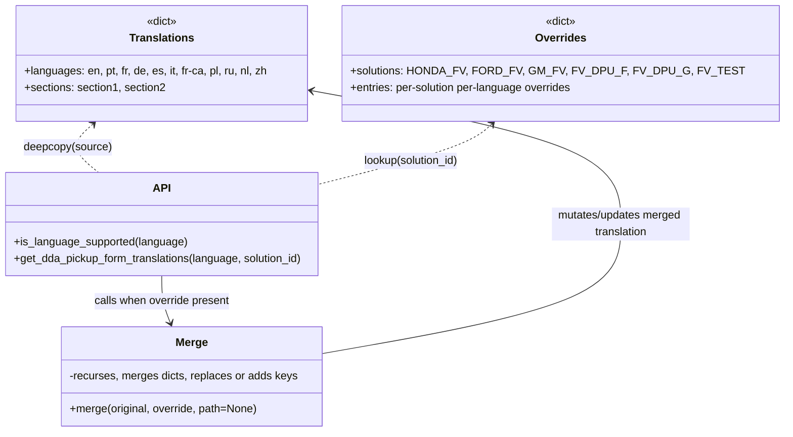
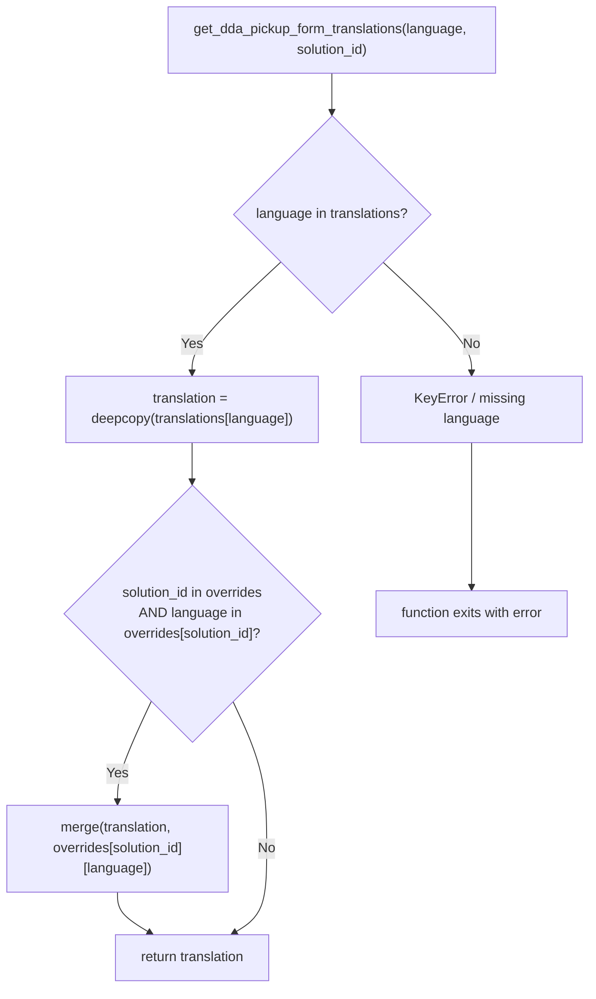

# Diagram: entity_core/entity_service/entity_service/common/translation.py

> Auto-generated by Obscura crawlers

## Diagram 1

### SVG

<svg id="container" width="1074.08203125" xmlns="http://www.w3.org/2000/svg" class="classDiagram" height="650" viewBox="0 0 1074.08203125 650" role="graphics-document document" aria-roledescription="class"><g><defs><marker id="container_class-aggregationStart" class="marker aggregation class" refX="18" refY="7" markerWidth="190" markerHeight="240" orient="auto"><path d="M 18,7 L9,13 L1,7 L9,1 Z"></path></marker></defs><defs><marker id="container_class-aggregationEnd" class="marker aggregation class" refX="1" refY="7" markerWidth="20" markerHeight="28" orient="auto"><path d="M 18,7 L9,13 L1,7 L9,1 Z"></path></marker></defs><defs><marker id="container_class-extensionStart" class="marker extension class" refX="18" refY="7" markerWidth="190" markerHeight="240" orient="auto"><path d="M 1,7 L18,13 V 1 Z"></path></marker></defs><defs><marker id="container_class-extensionEnd" class="marker extension class" refX="1" refY="7" markerWidth="20" markerHeight="28" orient="auto"><path d="M 1,1 V 13 L18,7 Z"></path></marker></defs><defs><marker id="container_class-compositionStart" class="marker composition class" refX="18" refY="7" markerWidth="190" markerHeight="240" orient="auto"><path d="M 18,7 L9,13 L1,7 L9,1 Z"></path></marker></defs><defs><marker id="container_class-compositionEnd" class="marker composition class" refX="1" refY="7" markerWidth="20" markerHeight="28" orient="auto"><path d="M 18,7 L9,13 L1,7 L9,1 Z"></path></marker></defs><defs><marker id="container_class-dependencyStart" class="marker dependency class" refX="6" refY="7" markerWidth="190" markerHeight="240" orient="auto"><path d="M 5,7 L9,13 L1,7 L9,1 Z"></path></marker></defs><defs><marker id="container_class-dependencyEnd" class="marker dependency class" refX="13" refY="7" markerWidth="20" markerHeight="28" orient="auto"><path d="M 18,7 L9,13 L14,7 L9,1 Z"></path></marker></defs><defs><marker id="container_class-lollipopStart" class="marker lollipop class" refX="13" refY="7" markerWidth="190" markerHeight="240" orient="auto"><circle stroke="black" fill="transparent" cx="7" cy="7" r="6"></circle></marker></defs><defs><marker id="container_class-lollipopEnd" class="marker lollipop class" refX="1" refY="7" markerWidth="190" markerHeight="240" orient="auto"><circle stroke="black" fill="transparent" cx="7" cy="7" r="6"></circle></marker></defs><g class="root"><g class="clusters"></g><g class="edgePaths"><path d="M139.18,179.967L132.933,185.473C126.686,190.978,114.191,201.989,115.504,213.661C116.816,225.333,131.936,237.667,139.495,243.833L147.055,250" id="id_Translations_API_1" class="edge-thickness-normal edge-pattern-dashed relation" style=";;;" data-edge="true" data-et="edge" data-id="id_Translations_API_1" data-points="W3sieCI6MTQzLjY4MTIwNDgwMzcxOTAzLCJ5IjoxNzZ9LHsieCI6MTAxLjY5NzI2NTYyNSwieSI6MjEzfSx7IngiOjE0Ny4wNTQ5MTQyMDIwMDg5NCwieSI6MjUwfV0=" marker-start="url(#container_class-dependencyStart)"></path><path d="M683.02,179.967L676.773,185.473C670.525,190.978,658.031,201.989,622.527,215.555C587.022,229.121,528.507,245.241,499.25,253.301L469.992,261.362" id="id_Overrides_API_2" class="edge-thickness-normal edge-pattern-dashed relation" style=";;;" data-edge="true" data-et="edge" data-id="id_Overrides_API_2" data-points="W3sieCI6Njg3LjUyMTA0ODU1MzcxOSwieSI6MTc2fSx7IngiOjY0NS41MzcxMDkzNzUsInkiOjIxM30seyJ4Ijo0NjkuOTkyMTg3NSwieSI6MjYxLjM2MTc0MDg2ODMyMDN9XQ==" marker-start="url(#container_class-dependencyStart)"></path><path d="M238.996,400L238.996,408.167C238.996,416.333,238.996,432.667,241.727,448.064C244.458,463.462,249.92,477.925,252.651,485.156L255.382,492.387" id="id_API_Merge_3" class="edge-thickness-normal edge-pattern-solid relation" style=";;;" data-edge="true" data-et="edge" data-id="id_API_Merge_3" data-points="W3sieCI6MjM4Ljk5NjA5Mzc1LCJ5Ijo0MDB9LHsieCI6MjM4Ljk5NjA5Mzc1LCJ5Ijo0NDl9LHsieCI6MjU3LjUwMjM4ODk0NjI4MSwieSI6NDk4fV0=" marker-end="url(#container_class-dependencyEnd)"></path><path d="M473.688,531.21L540.445,517.509C607.203,503.807,740.719,476.403,807.477,442.035C874.234,407.667,874.234,366.333,874.234,327C874.234,287.667,874.234,250.333,804.443,218.373C734.651,186.412,595.067,159.824,525.276,146.53L455.484,133.237" id="id_Merge_Translations_4" class="edge-thickness-normal edge-pattern-solid relation" style=";;;" data-edge="true" data-et="edge" data-id="id_Merge_Translations_4" data-points="W3sieCI6NDczLjY4NzUsInkiOjUzMS4yMTAyODA4MDczMDQ1fSx7IngiOjg3NC4yMzQzNzUsInkiOjQ0OX0seyJ4Ijo4NzQuMjM0Mzc1LCJ5IjozMjV9LHsieCI6ODc0LjIzNDM3NSwieSI6MjEzfSx7IngiOjQ0OS41ODk4NDM3NSwieSI6MTMyLjExMzgzNTIzNjUzMTU3fV0=" marker-end="url(#container_class-dependencyEnd)"></path></g><g class="edgeLabels"><g class="edgeLabel" transform="translate(102.69438, 213.81339)"><g class="label" data-id="id_Translations_API_1" transform="translate(-64.375, -12)"><foreignObject width="128.75" height="24">

deepcopy(source)

</foreignObject></g></g><g class="edgeLabel" transform="translate(584.74026, 229.74923)"><g class="label" data-id="id_Overrides_API_2" transform="translate(-71.3984375, -12)"><foreignObject width="142.796875" height="24">

lookup(solution_id)

</foreignObject></g></g><g class="edgeLabel" transform="translate(238.99609375, 449)"><g class="label" data-id="id_API_Merge_3" transform="translate(-100, -24)"><foreignObject width="200" height="48">

calls when override present

</foreignObject></g></g><g class="edgeLabel" transform="translate(874.234375, 325)"><g class="label" data-id="id_Merge_Translations_4" transform="translate(-100, -24)"><foreignObject width="200" height="48">

mutates/updates merged translation

</foreignObject></g></g></g><g class="nodes"><g class="node default" id="classId-Translations-0" transform="translate(238.99609375, 92)"><g class="basic label-container"><path d="M-210.59375 -84 L210.59375 -84 L210.59375 84 L-210.59375 84" stroke="none" stroke-width="0" fill="#ECECFF" style=""></path><path d="M-210.59375 -84 C-113.21351026262411 -84, -15.833270525248224 -84, 210.59375 -84 M-210.59375 -84 C-87.6697268042548 -84, 35.25429639149041 -84, 210.59375 -84 M210.59375 -84 C210.59375 -47.88762982316617, 210.59375 -11.775259646332344, 210.59375 84 M210.59375 -84 C210.59375 -30.397561680056114, 210.59375 23.20487663988777, 210.59375 84 M210.59375 84 C66.86004692169453 84, -76.87365615661093 84, -210.59375 84 M210.59375 84 C99.34233882402435 84, -11.909072351951295 84, -210.59375 84 M-210.59375 84 C-210.59375 18.470005502035278, -210.59375 -47.059988995929444, -210.59375 -84 M-210.59375 84 C-210.59375 24.14075304858482, -210.59375 -35.71849390283036, -210.59375 -84" stroke="#9370DB" stroke-width="1.3" fill="none" stroke-dasharray="0 0" style=""></path></g><g class="annotation-group text" transform="translate(-22.7265625, -60)"><g class="label" style="" transform="translate(0,-12)"><foreignObject width="45.453125" height="24">

«dict»

</foreignObject></g></g><g class="label-group text" transform="translate(-45.09375, -36)"><g class="label" style="font-weight: bolder" transform="translate(0,-12)"><foreignObject width="90.1875" height="24">

Translations

</foreignObject></g></g><g class="members-group text" transform="translate(-198.59375, 12)"><g class="label" style="" transform="translate(0,-12)"><foreignObject width="352.09375" height="24">

+languages: en, pt, fr, de, es, it, fr-ca, pl, ru, nl, zh

</foreignObject></g><g class="label" style="" transform="translate(0,12)"><foreignObject width="204.53125" height="24">

+sections: section1, section2

</foreignObject></g></g><g class="methods-group text" transform="translate(-198.59375, 84)"></g><g class="divider" style=""><path d="M-210.59375 -12 C-94.94715361096112 -12, 20.699442778077753 -12, 210.59375 -12 M-210.59375 -12 C-68.8575869025751 -12, 72.87857619484981 -12, 210.59375 -12" stroke="#9370DB" stroke-width="1.3" fill="none" stroke-dasharray="0 0" style=""></path></g><g class="divider" style=""><path d="M-210.59375 60 C-77.72117546693562 60, 55.15139906612876 60, 210.59375 60 M-210.59375 60 C-107.6285031458226 60, -4.663256291645212 60, 210.59375 60" stroke="#9370DB" stroke-width="1.3" fill="none" stroke-dasharray="0 0" style=""></path></g></g><g class="node default" id="classId-Overrides-1" transform="translate(782.8359375, 92)"><g class="basic label-container"><path d="M-283.24609375 -84 L283.24609375 -84 L283.24609375 84 L-283.24609375 84" stroke="none" stroke-width="0" fill="#ECECFF" style=""></path><path d="M-283.24609375 -84 C-143.84696915253923 -84, -4.447844555078461 -84, 283.24609375 -84 M-283.24609375 -84 C-88.62315351846058 -84, 105.99978671307883 -84, 283.24609375 -84 M283.24609375 -84 C283.24609375 -24.99328747145013, 283.24609375 34.01342505709974, 283.24609375 84 M283.24609375 -84 C283.24609375 -25.63493250773284, 283.24609375 32.73013498453432, 283.24609375 84 M283.24609375 84 C138.22286036520953 84, -6.800373019580945 84, -283.24609375 84 M283.24609375 84 C129.99125071262011 84, -23.26359232475977 84, -283.24609375 84 M-283.24609375 84 C-283.24609375 35.421033273315615, -283.24609375 -13.15793345336877, -283.24609375 -84 M-283.24609375 84 C-283.24609375 39.71049955290746, -283.24609375 -4.579000894185086, -283.24609375 -84" stroke="#9370DB" stroke-width="1.3" fill="none" stroke-dasharray="0 0" style=""></path></g><g class="annotation-group text" transform="translate(-22.7265625, -60)"><g class="label" style="" transform="translate(0,-12)"><foreignObject width="45.453125" height="24">

«dict»

</foreignObject></g></g><g class="label-group text" transform="translate(-35.7421875, -36)"><g class="label" style="font-weight: bolder" transform="translate(0,-12)"><foreignObject width="71.484375" height="24">

Overrides

</foreignObject></g></g><g class="members-group text" transform="translate(-271.24609375, 12)"><g class="label" style="" transform="translate(0,-12)"><foreignObject width="506.75" height="24">

+solutions: HONDA_FV, FORD_FV, GM_FV, FV_DPU_F, FV_DPU_G, FV_TEST

</foreignObject></g><g class="label" style="" transform="translate(0,12)"><foreignObject width="329.6875" height="24">

+entries: per-solution per-language overrides

</foreignObject></g></g><g class="methods-group text" transform="translate(-271.24609375, 84)"></g><g class="divider" style=""><path d="M-283.24609375 -12 C-63.71036139180322 -12, 155.82537096639356 -12, 283.24609375 -12 M-283.24609375 -12 C-168.11487103658396 -12, -52.98364832316793 -12, 283.24609375 -12" stroke="#9370DB" stroke-width="1.3" fill="none" stroke-dasharray="0 0" style=""></path></g><g class="divider" style=""><path d="M-283.24609375 60 C-117.74479296530484 60, 47.75650781939032 60, 283.24609375 60 M-283.24609375 60 C-90.51401720432139 60, 102.21805934135722 60, 283.24609375 60" stroke="#9370DB" stroke-width="1.3" fill="none" stroke-dasharray="0 0" style=""></path></g></g><g class="node default" id="classId-Merge-2" transform="translate(284.6953125, 570)"><g class="basic label-container"><path d="M-188.9921875 -72 L188.9921875 -72 L188.9921875 72 L-188.9921875 72" stroke="none" stroke-width="0" fill="#ECECFF" style=""></path><path d="M-188.9921875 -72 C-102.04470491790488 -72, -15.09722233580976 -72, 188.9921875 -72 M-188.9921875 -72 C-74.0281794616636 -72, 40.935828576672805 -72, 188.9921875 -72 M188.9921875 -72 C188.9921875 -34.2432141265035, 188.9921875 3.5135717469929943, 188.9921875 72 M188.9921875 -72 C188.9921875 -21.695686063122075, 188.9921875 28.60862787375585, 188.9921875 72 M188.9921875 72 C49.98968148163388 72, -89.01282453673224 72, -188.9921875 72 M188.9921875 72 C113.29093148053795 72, 37.5896754610759 72, -188.9921875 72 M-188.9921875 72 C-188.9921875 36.27958839073061, -188.9921875 0.5591767814612183, -188.9921875 -72 M-188.9921875 72 C-188.9921875 31.844890978805815, -188.9921875 -8.310218042388371, -188.9921875 -72" stroke="#9370DB" stroke-width="1.3" fill="none" stroke-dasharray="0 0" style=""></path></g><g class="annotation-group text" transform="translate(0, -48)"></g><g class="label-group text" transform="translate(-22.46875, -48)"><g class="label" style="font-weight: bolder" transform="translate(0,-12)"><foreignObject width="44.9375" height="24">

Merge

</foreignObject></g></g><g class="members-group text" transform="translate(-176.9921875, 0)"><g class="label" style="" transform="translate(0,-12)"><foreignObject width="331.515625" height="24">

-recurses, merges dicts, replaces or adds keys

</foreignObject></g></g><g class="methods-group text" transform="translate(-176.9921875, 48)"><g class="label" style="" transform="translate(0,-12)"><foreignObject width="275.578125" height="24">

+merge(original, override, path=None)

</foreignObject></g></g><g class="divider" style=""><path d="M-188.9921875 -24 C-71.10001135918664 -24, 46.792164781626724 -24, 188.9921875 -24 M-188.9921875 -24 C-65.83593292125487 -24, 57.32032165749027 -24, 188.9921875 -24" stroke="#9370DB" stroke-width="1.3" fill="none" stroke-dasharray="0 0" style=""></path></g><g class="divider" style=""><path d="M-188.9921875 24 C-97.75623088860588 24, -6.520274277211769 24, 188.9921875 24 M-188.9921875 24 C-103.04747038567383 24, -17.102753271347666 24, 188.9921875 24" stroke="#9370DB" stroke-width="1.3" fill="none" stroke-dasharray="0 0" style=""></path></g></g><g class="node default" id="classId-API-3" transform="translate(238.99609375, 325)"><g class="basic label-container"><path d="M-230.99609375 -75 L230.99609375 -75 L230.99609375 75 L-230.99609375 75" stroke="none" stroke-width="0" fill="#ECECFF" style=""></path><path d="M-230.99609375 -75 C-65.26090459850559 -75, 100.47428455298882 -75, 230.99609375 -75 M-230.99609375 -75 C-130.68601563066116 -75, -30.37593751132232 -75, 230.99609375 -75 M230.99609375 -75 C230.99609375 -25.980755292160204, 230.99609375 23.038489415679592, 230.99609375 75 M230.99609375 -75 C230.99609375 -16.809200894505906, 230.99609375 41.38159821098819, 230.99609375 75 M230.99609375 75 C102.83001497573295 75, -25.3360637985341 75, -230.99609375 75 M230.99609375 75 C114.12232044229715 75, -2.751452865405696 75, -230.99609375 75 M-230.99609375 75 C-230.99609375 40.410747388318505, -230.99609375 5.82149477663701, -230.99609375 -75 M-230.99609375 75 C-230.99609375 35.416009067608975, -230.99609375 -4.16798186478205, -230.99609375 -75" stroke="#9370DB" stroke-width="1.3" fill="none" stroke-dasharray="0 0" style=""></path></g><g class="annotation-group text" transform="translate(0, -51)"></g><g class="label-group text" transform="translate(-11.8671875, -51)"><g class="label" style="font-weight: bolder" transform="translate(0,-12)"><foreignObject width="23.734375" height="24">

API

</foreignObject></g></g><g class="members-group text" transform="translate(-218.99609375, -3)"></g><g class="methods-group text" transform="translate(-218.99609375, 27)"><g class="label" style="" transform="translate(0,-12)"><foreignObject width="252.296875" height="24">

+is_language_supported(language)

</foreignObject></g><g class="label" style="" transform="translate(0,12)"><foreignObject width="426.125" height="24">

+get_dda_pickup_form_translations(language, solution_id)

</foreignObject></g></g><g class="divider" style=""><path d="M-230.99609375 -27 C-133.98082637471472 -27, -36.96555899942945 -27, 230.99609375 -27 M-230.99609375 -27 C-130.22309388884975 -27, -29.450094027699464 -27, 230.99609375 -27" stroke="#9370DB" stroke-width="1.3" fill="none" stroke-dasharray="0 0" style=""></path></g><g class="divider" style=""><path d="M-230.99609375 -3 C-101.6168789317181 -3, 27.76233588656379 -3, 230.99609375 -3 M-230.99609375 -3 C-104.15141584213919 -3, 22.693262065721626 -3, 230.99609375 -3" stroke="#9370DB" stroke-width="1.3" fill="none" stroke-dasharray="0 0" style=""></path></g></g></g></g></g></svg>

## Diagram 2

### SVG

<svg id="container" width="695.265625" xmlns="http://www.w3.org/2000/svg" class="flowchart" height="1163.46875" viewBox="0 0 695.265625 1163.46875" role="graphics-document document" aria-roledescription="flowchart-v2"><g><marker id="container_flowchart-v2-pointEnd" class="marker flowchart-v2" viewBox="0 0 10 10" refX="5" refY="5" markerUnits="userSpaceOnUse" markerWidth="8" markerHeight="8" orient="auto"><path d="M 0 0 L 10 5 L 0 10 z" class="arrowMarkerPath" style="stroke-width: 1; stroke-dasharray: 1, 0;"></path></marker><marker id="container_flowchart-v2-pointStart" class="marker flowchart-v2" viewBox="0 0 10 10" refX="4.5" refY="5" markerUnits="userSpaceOnUse" markerWidth="8" markerHeight="8" orient="auto"><path d="M 0 5 L 10 10 L 10 0 z" class="arrowMarkerPath" style="stroke-width: 1; stroke-dasharray: 1, 0;"></path></marker><marker id="container_flowchart-v2-circleEnd" class="marker flowchart-v2" viewBox="0 0 10 10" refX="11" refY="5" markerUnits="userSpaceOnUse" markerWidth="11" markerHeight="11" orient="auto"><circle cx="5" cy="5" r="5" class="arrowMarkerPath" style="stroke-width: 1; stroke-dasharray: 1, 0;"></circle></marker><marker id="container_flowchart-v2-circleStart" class="marker flowchart-v2" viewBox="0 0 10 10" refX="-1" refY="5" markerUnits="userSpaceOnUse" markerWidth="11" markerHeight="11" orient="auto"><circle cx="5" cy="5" r="5" class="arrowMarkerPath" style="stroke-width: 1; stroke-dasharray: 1, 0;"></circle></marker><marker id="container_flowchart-v2-crossEnd" class="marker cross flowchart-v2" viewBox="0 0 11 11" refX="12" refY="5.2" markerUnits="userSpaceOnUse" markerWidth="11" markerHeight="11" orient="auto"><path d="M 1,1 l 9,9 M 10,1 l -9,9" class="arrowMarkerPath" style="stroke-width: 2; stroke-dasharray: 1, 0;"></path></marker><marker id="container_flowchart-v2-crossStart" class="marker cross flowchart-v2" viewBox="0 0 11 11" refX="-1" refY="5.2" markerUnits="userSpaceOnUse" markerWidth="11" markerHeight="11" orient="auto"><path d="M 1,1 l 9,9 M 10,1 l -9,9" class="arrowMarkerPath" style="stroke-width: 2; stroke-dasharray: 1, 0;"></path></marker><g class="root"><g class="clusters"></g><g class="edgePaths"><path d="M391.418,86L391.418,90.167C391.418,94.333,391.418,102.667,391.418,110.333C391.418,118,391.418,125,391.418,128.5L391.418,132" id="L_Start_CheckLang_0" class="edge-thickness-normal edge-pattern-solid edge-thickness-normal edge-pattern-solid flowchart-link" style=";" data-edge="true" data-et="edge" data-id="L_Start_CheckLang_0" data-points="W3sieCI6MzkxLjQxNzk2ODc1LCJ5Ijo4Nn0seyJ4IjozOTEuNDE3OTY4NzUsInkiOjExMX0seyJ4IjozOTEuNDE3OTY4NzUsInkiOjEzNn1d" marker-end="url(#container_flowchart-v2-pointEnd)"></path><path d="M452.326,310.561L469.816,326.879C487.306,343.197,522.286,375.833,539.776,397.651C557.266,419.469,557.266,430.469,557.266,435.969L557.266,441.469" id="L_CheckLang_Error_0" class="edge-thickness-normal edge-pattern-solid edge-thickness-normal edge-pattern-solid flowchart-link" style=";" data-edge="true" data-et="edge" data-id="L_CheckLang_Error_0" data-points="W3sieCI6NDUyLjMyNTg0MzMzNTcxNDQ3LCJ5IjozMTAuNTYwODc1NDE0Mjg1NTN9LHsieCI6NTU3LjI2NTYyNSwieSI6NDA4LjQ2ODc1fSx7IngiOjU1Ny4yNjU2MjUsInkiOjQ0NS40Njg3NX1d" marker-end="url(#container_flowchart-v2-pointEnd)"></path><path d="M330.51,310.561L313.02,326.879C295.53,343.197,260.55,375.833,243.06,397.651C225.57,419.469,225.57,430.469,225.57,435.969L225.57,441.469" id="L_CheckLang_Clone_0" class="edge-thickness-normal edge-pattern-solid edge-thickness-normal edge-pattern-solid flowchart-link" style=";" data-edge="true" data-et="edge" data-id="L_CheckLang_Clone_0" data-points="W3sieCI6MzMwLjUxMDA5NDE2NDI4NTUzLCJ5IjozMTAuNTYwODc1NDE0Mjg1NTN9LHsieCI6MjI1LjU3MDMxMjUsInkiOjQwOC40Njg3NX0seyJ4IjoyMjUuNTcwMzEyNSwieSI6NDQ1LjQ2ODc1fV0=" marker-end="url(#container_flowchart-v2-pointEnd)"></path><path d="M225.57,523.469L225.57,527.635C225.57,531.802,225.57,540.135,225.57,547.802C225.57,555.469,225.57,562.469,225.57,565.969L225.57,569.469" id="L_Clone_CheckOverride_0" class="edge-thickness-normal edge-pattern-solid edge-thickness-normal edge-pattern-solid flowchart-link" style=";" data-edge="true" data-et="edge" data-id="L_Clone_CheckOverride_0" data-points="W3sieCI6MjI1LjU3MDMxMjUsInkiOjUyMy40Njg3NX0seyJ4IjoyMjUuNTcwMzEyNSwieSI6NTQ4LjQ2ODc1fSx7IngiOjIyNS41NzAzMTI1LCJ5Ijo1NzMuNDY4NzV9XQ==" marker-end="url(#container_flowchart-v2-pointEnd)"></path><path d="M177.586,827.484L170.988,841.648C164.391,855.812,151.195,884.141,144.598,903.805C138,923.469,138,934.469,138,939.969L138,945.469" id="L_CheckOverride_DoMerge_0" class="edge-thickness-normal edge-pattern-solid edge-thickness-normal edge-pattern-solid flowchart-link" style=";" data-edge="true" data-et="edge" data-id="L_CheckOverride_DoMerge_0" data-points="W3sieCI6MTc3LjU4NTc2MzQxMTQ2MiwieSI6ODI3LjQ4NDIwMDkxMTQ2Mn0seyJ4IjoxMzgsInkiOjkxMi40Njg3NX0seyJ4IjoxMzgsInkiOjk0OS40Njg3NX1d" marker-end="url(#container_flowchart-v2-pointEnd)"></path><path d="M138,1051.469L138,1055.635C138,1059.802,138,1068.135,144.444,1076.128C150.887,1084.121,163.775,1091.774,170.218,1095.6L176.662,1099.426" id="L_DoMerge_Return_0" class="edge-thickness-normal edge-pattern-solid edge-thickness-normal edge-pattern-solid flowchart-link" style=";" data-edge="true" data-et="edge" data-id="L_DoMerge_Return_0" data-points="W3sieCI6MTM4LCJ5IjoxMDUxLjQ2ODc1fSx7IngiOjEzOCwieSI6MTA3Ni40Njg3NX0seyJ4IjoxODAuMTAxMTExNzc4ODQ2MTYsInkiOjExMDEuNDY4NzV9XQ==" marker-end="url(#container_flowchart-v2-pointEnd)"></path><path d="M273.555,827.484L280.152,841.648C286.75,855.812,299.945,884.141,306.543,912.971C313.141,941.802,313.141,971.135,313.141,998.469C313.141,1025.802,313.141,1051.135,306.697,1067.628C300.253,1084.121,287.366,1091.774,280.922,1095.6L274.479,1099.426" id="L_CheckOverride_Return_0" class="edge-thickness-normal edge-pattern-solid edge-thickness-normal edge-pattern-solid flowchart-link" style=";" data-edge="true" data-et="edge" data-id="L_CheckOverride_Return_0" data-points="W3sieCI6MjczLjU1NDg2MTU4ODUzNzk2LCJ5Ijo4MjcuNDg0MjAwOTExNDYyfSx7IngiOjMxMy4xNDA2MjUsInkiOjkxMi40Njg3NX0seyJ4IjozMTMuMTQwNjI1LCJ5IjoxMDAwLjQ2ODc1fSx7IngiOjMxMy4xNDA2MjUsInkiOjEwNzYuNDY4NzV9LHsieCI6MjcxLjAzOTUxMzIyMTE1Mzg3LCJ5IjoxMTAxLjQ2ODc1fV0=" marker-end="url(#container_flowchart-v2-pointEnd)"></path><path d="M557.266,523.469L557.266,527.635C557.266,531.802,557.266,540.135,557.266,568.469C557.266,596.802,557.266,645.135,557.266,669.302L557.266,693.469" id="L_Error_End_0" class="edge-thickness-normal edge-pattern-solid edge-thickness-normal edge-pattern-solid flowchart-link" style=";" data-edge="true" data-et="edge" data-id="L_Error_End_0" data-points="W3sieCI6NTU3LjI2NTYyNSwieSI6NTIzLjQ2ODc1fSx7IngiOjU1Ny4yNjU2MjUsInkiOjU0OC40Njg3NX0seyJ4Ijo1NTcuMjY1NjI1LCJ5Ijo2OTcuNDY4NzV9XQ==" marker-end="url(#container_flowchart-v2-pointEnd)"></path></g><g class="edgeLabels"><g class="edgeLabel"><g class="label" data-id="L_Start_CheckLang_0" transform="translate(0, 0)"><foreignObject width="0" height="0">

</foreignObject></g></g><g class="edgeLabel" transform="translate(557.265625, 408.46875)"><g class="label" data-id="L_CheckLang_Error_0" transform="translate(-10.140625, -12)"><foreignObject width="20.28125" height="24">

No

</foreignObject></g></g><g class="edgeLabel" transform="translate(225.5703125, 408.46875)"><g class="label" data-id="L_CheckLang_Clone_0" transform="translate(-12.03125, -12)"><foreignObject width="24.0625" height="24">

Yes

</foreignObject></g></g><g class="edgeLabel"><g class="label" data-id="L_Clone_CheckOverride_0" transform="translate(0, 0)"><foreignObject width="0" height="0">

</foreignObject></g></g><g class="edgeLabel" transform="translate(138, 912.46875)"><g class="label" data-id="L_CheckOverride_DoMerge_0" transform="translate(-12.03125, -12)"><foreignObject width="24.0625" height="24">

Yes

</foreignObject></g></g><g class="edgeLabel"><g class="label" data-id="L_DoMerge_Return_0" transform="translate(0, 0)"><foreignObject width="0" height="0">

</foreignObject></g></g><g class="edgeLabel" transform="translate(313.140625, 1000.46875)"><g class="label" data-id="L_CheckOverride_Return_0" transform="translate(-10.140625, -12)"><foreignObject width="20.28125" height="24">

No

</foreignObject></g></g><g class="edgeLabel"><g class="label" data-id="L_Error_End_0" transform="translate(0, 0)"><foreignObject width="0" height="0">

</foreignObject></g></g></g><g class="nodes"><g class="node default" id="flowchart-Start-0" transform="translate(391.41796875, 47)"><rect class="basic label-container" style="" x="-195.3671875" y="-39" width="390.734375" height="78"></rect><g class="label" style="" transform="translate(-165.3671875, -24)"><rect></rect><foreignObject width="330.734375" height="48">

get_dda_pickup_form_translations(language, solution_id)

</foreignObject></g></g><g class="node default" id="flowchart-CheckLang-2" transform="translate(391.41796875, 253.734375)"><polygon points="117.734375,0 235.46875,-117.734375 117.734375,-235.46875 0,-117.734375" class="label-container" transform="translate(-117.234375, 117.734375)"></polygon><g class="label" style="" transform="translate(-90.734375, -12)"><rect></rect><foreignObject width="181.46875" height="24">

language in translations?

</foreignObject></g></g><g class="node default" id="flowchart-Error-4" transform="translate(557.265625, 484.46875)"><rect class="basic label-container" style="" x="-130" y="-39" width="260" height="78"></rect><g class="label" style="" transform="translate(-100, -24)"><rect></rect><foreignObject width="200" height="48">

KeyError / missing language

</foreignObject></g></g><g class="node default" id="flowchart-Clone-6" transform="translate(225.5703125, 484.46875)"><rect class="basic label-container" style="" x="-151.6953125" y="-39" width="303.390625" height="78"></rect><g class="label" style="" transform="translate(-121.6953125, -24)"><rect></rect><foreignObject width="243.390625" height="48">

translation = deepcopy(translations[language])

</foreignObject></g></g><g class="node default" id="flowchart-CheckOverride-8" transform="translate(225.5703125, 724.46875)"><polygon points="151,0 302,-151 151,-302 0,-151" class="label-container" transform="translate(-150.5, 151)"></polygon><g class="label" style="" transform="translate(-100, -36)"><rect></rect><foreignObject width="200" height="72">

solution_id in overrides\nAND language in overrides[solution_id]?

</foreignObject></g></g><g class="node default" id="flowchart-DoMerge-10" transform="translate(138, 1000.46875)"><rect class="basic label-container" style="" x="-130" y="-51" width="260" height="102"></rect><g class="label" style="" transform="translate(-100, -36)"><rect></rect><foreignObject width="200" height="72">

merge(translation, overrides[solution_id][language])

</foreignObject></g></g><g class="node default" id="flowchart-Return-12" transform="translate(225.5703125, 1128.46875)"><rect class="basic label-container" style="" x="-94.28125" y="-27" width="188.5625" height="54"></rect><g class="label" style="" transform="translate(-64.28125, -12)"><rect></rect><foreignObject width="128.5625" height="24">

return translation

</foreignObject></g></g><g class="node default" id="flowchart-End-16" transform="translate(557.265625, 724.46875)"><rect class="basic label-container" style="" x="-117.390625" y="-27" width="234.78125" height="54"></rect><g class="label" style="" transform="translate(-87.390625, -12)"><rect></rect><foreignObject width="174.78125" height="24">

function exits with error

</foreignObject></g></g></g></g></g></svg>
