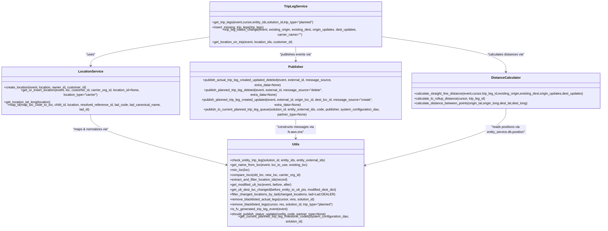

# Diagram: entity_core/entity_service/entity_service/common/trip_leg.py


> Auto-generated by Obscura crawlers

## Diagram 1

```mermaid
flowchart LR
    GT[get_trip_legs(event, cursor, entity_ids, solution_id, trip_type="planned")] -->|calls| DB[get_trip_legs_on_entities(cursor, entity_ids, trip_type, solution_id)]
    GT -->|uses| LOCIDS[get_location_ids_from_entities(entities)]
    LOCIDS -->|if ids| SOL[invokinator.get_solution(event, solution_id)]
    SOL -->|provides customer_id| GETLOC[get_location_on_trip(event, location_ids, customer_id)]
    GETLOC -->|dereference| ENTITY_ENTITY[entity_service.common.entity.get_location / get_location_details_as_admin]
    GT -->|for each entity leg| SETSTOP[set_trip_stop_location(origin/dest, loc)]
    GT -->|if planned| INSERT[insert_missing_trip_legs(trip_legs)]
    INSERT --> FV_GEN[FV_GENERATED placeholder legs]
    CSD[calculate_straight_line_distance(...)] -->|invokes| INVLOC[invokinator.invoke_get_location(location_ids)]
    INVLOC -->|returns| ORIGLOC[origin_location], DESTLOC[destination_location]
    ORIGLOC --> GETLAT[get_location_lat_long(location)]
    DESTLOC --> GETLAT
    GETLAT --> DIST[calculate_distance_between_points(lat1,long1,lat2,long2)]
    DIST -->|round & update| UPDATE_DB[entity_service.db.trip_leg.update_trip_leg_distance(cursor, trip_leg_id, distance)]
    CLR[calculate_lo_rollup_distance(cursor, trip_leg_id)] --> POS_UPDATES[get_trip_leg_position_updates(cursor, trip_leg_id)]
    POS_UPDATES -->|iterate| DIST_ROLLUP[calculate_distance_between_points between successive positions]
    DIST_ROLLUP --> UPDATE_DB
    STATUS[trip_leg_status_change(...)] -->|builds events| SNS_PUB[publish_* functions]
    SNS_PUB --> SNS[ fv.aws.sns.construct_sns_message(...) ]
    SNS --> LAMBDA_SEND[fv.aws.lambdas.send_batch(topic, [message])]
    LOC_CREATE[create_location(event, location, owner_id, customer_id)] --> INVOKE_LOC[fv.aws.lambdas.invoke_lambda("locations-post", full_payload=event_copy)]
    GET_OR_INSERT[get_or_insert_location(...)] -->|may call| LOC_CREATE
    MODIFIED[get_modified_ult_loc(before, after)] -->|uses| map_loc_code_to_loc
    MAP[map_id(...)] -->|maps| map_loc_code_to_loc
    PUBLISH_AUGMENT[publish_to_fv_trip_leg_augmentation_queue(...)] -->|uses| SQS[SQSQueue + send_multi_threaded_batch_messages]
    BUILD_MSG[build_augment_fv_trip_leg_sqs_message(...)] -->|returns| MSG{Message dict with Id, MessageBody, GroupId}
```

> SVG rendering failed for this diagram.

## Diagram 2



### SVG

<svg id="container" width="3044.421875" xmlns="http://www.w3.org/2000/svg" class="classDiagram" height="998" viewBox="0 0 3044.421875 998" role="graphics-document document" aria-roledescription="class"><style>#container{font-family:"trebuchet ms",verdana,arial,sans-serif;font-size:16px;fill:#333;}@keyframes edge-animation-frame{from{stroke-dashoffset:0;}}@keyframes dash{to{stroke-dashoffset:0;}}#container .edge-animation-slow{stroke-dasharray:9,5!important;stroke-dashoffset:900;animation:dash 50s linear infinite;stroke-linecap:round;}#container .edge-animation-fast{stroke-dasharray:9,5!important;stroke-dashoffset:900;animation:dash 20s linear infinite;stroke-linecap:round;}#container .error-icon{fill:#552222;}#container .error-text{fill:#552222;stroke:#552222;}#container .edge-thickness-normal{stroke-width:1px;}#container .edge-thickness-thick{stroke-width:3.5px;}#container .edge-pattern-solid{stroke-dasharray:0;}#container .edge-thickness-invisible{stroke-width:0;fill:none;}#container .edge-pattern-dashed{stroke-dasharray:3;}#container .edge-pattern-dotted{stroke-dasharray:2;}#container .marker{fill:#333333;stroke:#333333;}#container .marker.cross{stroke:#333333;}#container svg{font-family:"trebuchet ms",verdana,arial,sans-serif;font-size:16px;}#container p{margin:0;}#container g.classGroup text{fill:#9370DB;stroke:none;font-family:"trebuchet ms",verdana,arial,sans-serif;font-size:10px;}#container g.classGroup text .title{font-weight:bolder;}#container .nodeLabel,#container .edgeLabel{color:#131300;}#container .edgeLabel .label rect{fill:#ECECFF;}#container .label text{fill:#131300;}#container .labelBkg{background:#ECECFF;}#container .edgeLabel .label span{background:#ECECFF;}#container .classTitle{font-weight:bolder;}#container .node rect,#container .node circle,#container .node ellipse,#container .node polygon,#container .node path{fill:#ECECFF;stroke:#9370DB;stroke-width:1px;}#container .divider{stroke:#9370DB;stroke-width:1;}#container g.clickable{cursor:pointer;}#container g.classGroup rect{fill:#ECECFF;stroke:#9370DB;}#container g.classGroup line{stroke:#9370DB;stroke-width:1;}#container .classLabel .box{stroke:none;stroke-width:0;fill:#ECECFF;opacity:0.5;}#container .classLabel .label{fill:#9370DB;font-size:10px;}#container .relation{stroke:#333333;stroke-width:1;fill:none;}#container .dashed-line{stroke-dasharray:3;}#container .dotted-line{stroke-dasharray:1 2;}#container #compositionStart,#container .composition{fill:#333333!important;stroke:#333333!important;stroke-width:1;}#container #compositionEnd,#container .composition{fill:#333333!important;stroke:#333333!important;stroke-width:1;}#container #dependencyStart,#container .dependency{fill:#333333!important;stroke:#333333!important;stroke-width:1;}#container #dependencyStart,#container .dependency{fill:#333333!important;stroke:#333333!important;stroke-width:1;}#container #extensionStart,#container .extension{fill:transparent!important;stroke:#333333!important;stroke-width:1;}#container #extensionEnd,#container .extension{fill:transparent!important;stroke:#333333!important;stroke-width:1;}#container #aggregationStart,#container .aggregation{fill:transparent!important;stroke:#333333!important;stroke-width:1;}#container #aggregationEnd,#container .aggregation{fill:transparent!important;stroke:#333333!important;stroke-width:1;}#container #lollipopStart,#container .lollipop{fill:#ECECFF!important;stroke:#333333!important;stroke-width:1;}#container #lollipopEnd,#container .lollipop{fill:#ECECFF!important;stroke:#333333!important;stroke-width:1;}#container .edgeTerminals{font-size:11px;line-height:initial;}#container .classTitleText{text-anchor:middle;font-size:18px;fill:#333;}#container .label-icon{display:inline-block;height:1em;overflow:visible;vertical-align:-0.125em;}#container .node .label-icon path{fill:currentColor;stroke:revert;stroke-width:revert;}#container :root{--mermaid-font-family:"trebuchet ms",verdana,arial,sans-serif;}</style><g><defs><marker id="container_class-aggregationStart" class="marker aggregation class" refX="18" refY="7" markerWidth="190" markerHeight="240" orient="auto"><path d="M 18,7 L9,13 L1,7 L9,1 Z"></path></marker></defs><defs><marker id="container_class-aggregationEnd" class="marker aggregation class" refX="1" refY="7" markerWidth="20" markerHeight="28" orient="auto"><path d="M 18,7 L9,13 L1,7 L9,1 Z"></path></marker></defs><defs><marker id="container_class-extensionStart" class="marker extension class" refX="18" refY="7" markerWidth="190" markerHeight="240" orient="auto"><path d="M 1,7 L18,13 V 1 Z"></path></marker></defs><defs><marker id="container_class-extensionEnd" class="marker extension class" refX="1" refY="7" markerWidth="20" markerHeight="28" orient="auto"><path d="M 1,1 V 13 L18,7 Z"></path></marker></defs><defs><marker id="container_class-compositionStart" class="marker composition class" refX="18" refY="7" markerWidth="190" markerHeight="240" orient="auto"><path d="M 18,7 L9,13 L1,7 L9,1 Z"></path></marker></defs><defs><marker id="container_class-compositionEnd" class="marker composition class" refX="1" refY="7" markerWidth="20" markerHeight="28" orient="auto"><path d="M 18,7 L9,13 L1,7 L9,1 Z"></path></marker></defs><defs><marker id="container_class-dependencyStart" class="marker dependency class" refX="6" refY="7" markerWidth="190" markerHeight="240" orient="auto"><path d="M 5,7 L9,13 L1,7 L9,1 Z"></path></marker></defs><defs><marker id="container_class-dependencyEnd" class="marker dependency class" refX="13" refY="7" markerWidth="20" markerHeight="28" orient="auto"><path d="M 18,7 L9,13 L14,7 L9,1 Z"></path></marker></defs><defs><marker id="container_class-lollipopStart" class="marker lollipop class" refX="13" refY="7" markerWidth="190" markerHeight="240" orient="auto"><circle stroke="black" fill="transparent" cx="7" cy="7" r="6"></circle></marker></defs><defs><marker id="container_class-lollipopEnd" class="marker lollipop class" refX="1" refY="7" markerWidth="190" markerHeight="240" orient="auto"><circle stroke="black" fill="transparent" cx="7" cy="7" r="6"></circle></marker></defs><g class="root"><g class="clusters"></g><g class="edgePaths"><path d="M1066.133,163.665L964.531,176.888C862.928,190.11,659.724,216.555,558.122,234.944C456.52,253.333,456.52,263.667,456.52,268.833L456.52,274" id="id_TripLegService_LocationService_1" class="edge-thickness-normal edge-pattern-solid relation" style=";;;" data-edge="true" data-et="edge" data-id="id_TripLegService_LocationService_1" data-points="W3sieCI6MTA2Ni4xMzI4MTI1LCJ5IjoxNjMuNjY1NDM4MTM5NDE2NjZ9LHsieCI6NDU2LjUxOTUzMTI1LCJ5IjoyNDN9LHsieCI6NDU2LjUxOTUzMTI1LCJ5IjoyODB9XQ==" marker-end="url(#container_class-dependencyEnd)"></path><path d="M1936.977,162.567L2042.021,175.973C2147.066,189.378,2357.156,216.189,2462.201,236.761C2567.246,257.333,2567.246,271.667,2567.246,278.833L2567.246,286" id="id_TripLegService_DistanceCalculator_2" class="edge-thickness-normal edge-pattern-solid relation" style=";;;" data-edge="true" data-et="edge" data-id="id_TripLegService_DistanceCalculator_2" data-points="W3sieCI6MTkzNi45NzY1NjI1LCJ5IjoxNjIuNTY3MDk0NDI1OTMzODd9LHsieCI6MjU2Ny4yNDYwOTM3NSwieSI6MjQzfSx7IngiOjI1NjcuMjQ2MDkzNzUsInkiOjI5Mn1d" marker-end="url(#container_class-dependencyEnd)"></path><path d="M1501.555,206L1501.555,212.167C1501.555,218.333,1501.555,230.667,1501.555,242C1501.555,253.333,1501.555,263.667,1501.555,268.833L1501.555,274" id="id_TripLegService_Publisher_3" class="edge-thickness-normal edge-pattern-solid relation" style=";;;" data-edge="true" data-et="edge" data-id="id_TripLegService_Publisher_3" data-points="W3sieCI6MTUwMS41NTQ2ODc1LCJ5IjoyMDZ9LHsieCI6MTUwMS41NTQ2ODc1LCJ5IjoyNDN9LHsieCI6MTUwMS41NTQ2ODc1LCJ5IjoyODB9XQ==" marker-end="url(#container_class-dependencyEnd)"></path><path d="M456.52,478L456.52,486.167C456.52,494.333,456.52,510.667,572.671,547.287C688.823,583.907,921.127,640.814,1037.278,669.267L1153.43,697.721" id="id_LocationService_Utils_4" class="edge-thickness-normal edge-pattern-solid relation" style=";;;" data-edge="true" data-et="edge" data-id="id_LocationService_Utils_4" data-points="W3sieCI6NDU2LjUxOTUzMTI1LCJ5Ijo0Nzh9LHsieCI6NDU2LjUxOTUzMTI1LCJ5Ijo1Mjd9LHsieCI6MTE1OS4yNTc4MTI1LCJ5Ijo2OTkuMTQ4Mjc1NTE0MDU2NH1d" marker-end="url(#container_class-dependencyEnd)"></path><path d="M1501.555,478L1501.555,486.167C1501.555,494.333,1501.555,510.667,1501.555,526C1501.555,541.333,1501.555,555.667,1501.555,562.833L1501.555,570" id="id_Publisher_Utils_5" class="edge-thickness-normal edge-pattern-solid relation" style=";;;" data-edge="true" data-et="edge" data-id="id_Publisher_Utils_5" data-points="W3sieCI6MTUwMS41NTQ2ODc1LCJ5Ijo0Nzh9LHsieCI6MTUwMS41NTQ2ODc1LCJ5Ijo1Mjd9LHsieCI6MTUwMS41NTQ2ODc1LCJ5Ijo1NzZ9XQ==" marker-end="url(#container_class-dependencyEnd)"></path><path d="M2567.246,466L2567.246,476.167C2567.246,486.333,2567.246,506.667,2447.653,545.562C2328.059,584.457,2088.872,641.915,1969.279,670.643L1849.686,699.372" id="id_DistanceCalculator_Utils_6" class="edge-thickness-normal edge-pattern-solid relation" style=";;;" data-edge="true" data-et="edge" data-id="id_DistanceCalculator_Utils_6" data-points="W3sieCI6MjU2Ny4yNDYwOTM3NSwieSI6NDY2fSx7IngiOjI1NjcuMjQ2MDkzNzUsInkiOjUyN30seyJ4IjoxODQzLjg1MTU2MjUsInkiOjcwMC43NzM1Njk4Mjg4NTk2fV0=" marker-end="url(#container_class-dependencyEnd)"></path></g><g class="edgeLabels"><g class="edgeLabel" transform="translate(456.51953125, 243)"><g class="label" data-id="id_TripLegService_LocationService_1" transform="translate(-22.7578125, -12)"><foreignObject width="45.515625" height="24"><div xmlns="http://www.w3.org/1999/xhtml" class="labelBkg" style="display: table-cell; white-space: nowrap; line-height: 1.5; max-width: 200px; text-align: center;"><span class="edgeLabel"><p>"uses"</p></span></div></foreignObject></g></g><g class="edgeLabel" transform="translate(2567.24609375, 243)"><g class="label" data-id="id_TripLegService_DistanceCalculator_2" transform="translate(-91.65625, -12)"><foreignObject width="183.3125" height="24"><div xmlns="http://www.w3.org/1999/xhtml" class="labelBkg" style="display: table-cell; white-space: nowrap; line-height: 1.5; max-width: 200px; text-align: center;"><span class="edgeLabel"><p>"calculates distances via"</p></span></div></foreignObject></g></g><g class="edgeLabel" transform="translate(1501.5546875, 243)"><g class="label" data-id="id_TripLegService_Publisher_3" transform="translate(-80.2734375, -12)"><foreignObject width="160.546875" height="24"><div xmlns="http://www.w3.org/1999/xhtml" class="labelBkg" style="display: table-cell; white-space: nowrap; line-height: 1.5; max-width: 200px; text-align: center;"><span class="edgeLabel"><p>"publishes events via"</p></span></div></foreignObject></g></g><g class="edgeLabel" transform="translate(456.51953125, 527)"><g class="label" data-id="id_LocationService_Utils_4" transform="translate(-88.453125, -12)"><foreignObject width="176.90625" height="24"><div xmlns="http://www.w3.org/1999/xhtml" class="labelBkg" style="display: table-cell; white-space: nowrap; line-height: 1.5; max-width: 200px; text-align: center;"><span class="edgeLabel"><p>"maps &amp; normalizes via"</p></span></div></foreignObject></g></g><g class="edgeLabel" transform="translate(1501.5546875, 527)"><g class="label" data-id="id_Publisher_Utils_5" transform="translate(-100, -24)"><foreignObject width="200" height="48"><div xmlns="http://www.w3.org/1999/xhtml" class="labelBkg" style="display: table; white-space: break-spaces; line-height: 1.5; max-width: 200px; text-align: center; width: 200px;"><span class="edgeLabel"><p>"constructs messages via fv.aws.sns"</p></span></div></foreignObject></g></g><g class="edgeLabel" transform="translate(2567.24609375, 527)"><g class="label" data-id="id_DistanceCalculator_Utils_6" transform="translate(-100, -24)"><foreignObject width="200" height="48"><div xmlns="http://www.w3.org/1999/xhtml" class="labelBkg" style="display: table; white-space: break-spaces; line-height: 1.5; max-width: 200px; text-align: center; width: 200px;"><span class="edgeLabel"><p>"reads positions via entity_service.db.position"</p></span></div></foreignObject></g></g></g><g class="nodes"><g class="node default" id="classId-TripLegService-0" transform="translate(1501.5546875, 107)"><g class="basic label-container"><path d="M-435.421875 -99 L435.421875 -99 L435.421875 99 L-435.421875 99" stroke="none" stroke-width="0" fill="#ECECFF" style=""></path><path d="M-435.421875 -99 C-113.8893569325864 -99, 207.6431611348272 -99, 435.421875 -99 M-435.421875 -99 C-156.1895573790324 -99, 123.04276024193518 -99, 435.421875 -99 M435.421875 -99 C435.421875 -31.34989359694039, 435.421875 36.30021280611922, 435.421875 99 M435.421875 -99 C435.421875 -46.91391344448322, 435.421875 5.172173111033558, 435.421875 99 M435.421875 99 C177.03489043698067 99, -81.35209412603865 99, -435.421875 99 M435.421875 99 C158.9489915494534 99, -117.52389190109318 99, -435.421875 99 M-435.421875 99 C-435.421875 27.22248481736152, -435.421875 -44.55503036527696, -435.421875 -99 M-435.421875 99 C-435.421875 33.08312097781801, -435.421875 -32.833758044363975, -435.421875 -99" stroke="#9370DB" stroke-width="1.3" fill="none" stroke-dasharray="0 0" style=""></path></g><g class="annotation-group text" transform="translate(0, -75)"></g><g class="label-group text" transform="translate(-53.703125, -75)"><g class="label" style="font-weight: bolder" transform="translate(0,-12)"><foreignObject width="107.40625" height="24"><div xmlns="http://www.w3.org/1999/xhtml" style="display: table-cell; white-space: nowrap; line-height: 1.5; max-width: 155px; text-align: center;"><span class="nodeLabel markdown-node-label" style=""><p>TripLegService</p></span></div></foreignObject></g></g><g class="members-group text" transform="translate(-423.421875, -27)"></g><g class="methods-group text" transform="translate(-423.421875, 3)"><g class="label" style="" transform="translate(0,-12)"><foreignObject width="510.84375" height="24"><div xmlns="http://www.w3.org/1999/xhtml" style="display: table-cell; white-space: nowrap; line-height: 1.5; max-width: 568px; text-align: center;"><span class="nodeLabel markdown-node-label" style=""><p>+get_trip_legs(event,cursor,entity_ids,solution_id,trip_type="planned")</p></span></div></foreignObject></g><g class="label" style="" transform="translate(0,12)"><foreignObject width="257.625" height="24"><div xmlns="http://www.w3.org/1999/xhtml" style="display: table-cell; white-space: nowrap; line-height: 1.5; max-width: 315px; text-align: center;"><span class="nodeLabel markdown-node-label" style=""><p>+insert_missing_trip_legs(trip_legs)</p></span></div></foreignObject></g><g class="label" style="" transform="translate(0,36)"><foreignObject width="793.140625" height="24"><div xmlns="http://www.w3.org/1999/xhtml" style="display: table-cell; white-space: nowrap; line-height: 1.5; max-width: 851px; text-align: center;"><span class="nodeLabel markdown-node-label" style=""><p>+trip_leg_status_change(event, existing_origin, existing_dest, origin_updates, dest_updates, carrier_name="")</p></span></div></foreignObject></g><g class="label" style="" transform="translate(0,60)"><foreignObject width="403.390625" height="24"><div xmlns="http://www.w3.org/1999/xhtml" style="display: table-cell; white-space: nowrap; line-height: 1.5; max-width: 461px; text-align: center;"><span class="nodeLabel markdown-node-label" style=""><p>+get_location_on_trip(event, location_ids, customer_id)</p></span></div></foreignObject></g></g><g class="divider" style=""><path d="M-435.421875 -51 C-198.52398616444316 -51, 38.37390267111368 -51, 435.421875 -51 M-435.421875 -51 C-129.42988970313615 -51, 176.5620955937277 -51, 435.421875 -51" stroke="#9370DB" stroke-width="1.3" fill="none" stroke-dasharray="0 0" style=""></path></g><g class="divider" style=""><path d="M-435.421875 -27 C-93.26762247118012 -27, 248.88663005763976 -27, 435.421875 -27 M-435.421875 -27 C-138.06846071589604 -27, 159.28495356820792 -27, 435.421875 -27" stroke="#9370DB" stroke-width="1.3" fill="none" stroke-dasharray="0 0" style=""></path></g></g><g class="node default" id="classId-LocationService-1" transform="translate(456.51953125, 379)"><g class="basic label-container"><path d="M-448.51953125 -99 L448.51953125 -99 L448.51953125 99 L-448.51953125 99" stroke="none" stroke-width="0" fill="#ECECFF" style=""></path><path d="M-448.51953125 -99 C-225.4175466078106 -99, -2.315561965621214 -99, 448.51953125 -99 M-448.51953125 -99 C-220.82904219098359 -99, 6.861446868032829 -99, 448.51953125 -99 M448.51953125 -99 C448.51953125 -56.97093856177015, 448.51953125 -14.941877123540294, 448.51953125 99 M448.51953125 -99 C448.51953125 -58.68072872072518, 448.51953125 -18.361457441450355, 448.51953125 99 M448.51953125 99 C218.71808676910305 99, -11.083357711793894 99, -448.51953125 99 M448.51953125 99 C128.14648083905018 99, -192.22656957189963 99, -448.51953125 99 M-448.51953125 99 C-448.51953125 23.53266597501674, -448.51953125 -51.93466804996652, -448.51953125 -99 M-448.51953125 99 C-448.51953125 39.12667964694571, -448.51953125 -20.74664070610858, -448.51953125 -99" stroke="#9370DB" stroke-width="1.3" fill="none" stroke-dasharray="0 0" style=""></path></g><g class="annotation-group text" transform="translate(0, -75)"></g><g class="label-group text" transform="translate(-57.9921875, -75)"><g class="label" style="font-weight: bolder" transform="translate(0,-12)"><foreignObject width="115.984375" height="24"><div xmlns="http://www.w3.org/1999/xhtml" style="display: table-cell; white-space: nowrap; line-height: 1.5; max-width: 164px; text-align: center;"><span class="nodeLabel markdown-node-label" style=""><p>LocationService</p></span></div></foreignObject></g></g><g class="members-group text" transform="translate(-436.51953125, -27)"></g><g class="methods-group text" transform="translate(-436.51953125, 3)"><g class="label" style="" transform="translate(0,-12)"><foreignObject width="409.09375" height="24"><div xmlns="http://www.w3.org/1999/xhtml" style="display: table-cell; white-space: nowrap; line-height: 1.5; max-width: 466px; text-align: center;"><span class="nodeLabel markdown-node-label" style=""><p>+create_location(event, location, owner_id, customer_id)</p></span></div></foreignObject></g><g class="label" style="" transform="translate(0,12)"><foreignObject width="768.328125" height="24"><div xmlns="http://www.w3.org/1999/xhtml" style="display: table-cell; white-space: nowrap; line-height: 1.5; max-width: 826px; text-align: center;"><span class="nodeLabel markdown-node-label" style=""><p>+get_or_insert_location(event, loc, customer_id, carrier_org_id, location_id=None, location_type="carrier")</p></span></div></foreignObject></g><g class="label" style="" transform="translate(0,36)"><foreignObject width="234.4375" height="24"><div xmlns="http://www.w3.org/1999/xhtml" style="display: table-cell; white-space: nowrap; line-height: 1.5; max-width: 292px; text-align: center;"><span class="nodeLabel markdown-node-label" style=""><p>+get_location_lat_long(location)</p></span></div></foreignObject></g><g class="label" style="" transform="translate(0,60)"><foreignObject width="815.046875" height="24"><div xmlns="http://www.w3.org/1999/xhtml" style="display: table-cell; white-space: nowrap; line-height: 1.5; max-width: 872px; text-align: center;"><span class="nodeLabel markdown-node-label" style=""><p>+map_id(map_loc_code_to_loc, child_id, location, resolved_reference_id, lad_code, lad_canonical_name, lad_id)</p></span></div></foreignObject></g></g><g class="divider" style=""><path d="M-448.51953125 -51 C-172.3040412043602 -51, 103.9114488412796 -51, 448.51953125 -51 M-448.51953125 -51 C-170.67281784994384 -51, 107.17389555011232 -51, 448.51953125 -51" stroke="#9370DB" stroke-width="1.3" fill="none" stroke-dasharray="0 0" style=""></path></g><g class="divider" style=""><path d="M-448.51953125 -27 C-144.90607729968445 -27, 158.7073766506311 -27, 448.51953125 -27 M-448.51953125 -27 C-173.50751037265593 -27, 101.50451050468814 -27, 448.51953125 -27" stroke="#9370DB" stroke-width="1.3" fill="none" stroke-dasharray="0 0" style=""></path></g></g><g class="node default" id="classId-DistanceCalculator-2" transform="translate(2567.24609375, 379)"><g class="basic label-container"><path d="M-469.17578125 -87 L469.17578125 -87 L469.17578125 87 L-469.17578125 87" stroke="none" stroke-width="0" fill="#ECECFF" style=""></path><path d="M-469.17578125 -87 C-222.51307050144487 -87, 24.149640247110256 -87, 469.17578125 -87 M-469.17578125 -87 C-141.5108294654886 -87, 186.1541223190228 -87, 469.17578125 -87 M469.17578125 -87 C469.17578125 -33.49117600474393, 469.17578125 20.017647990512145, 469.17578125 87 M469.17578125 -87 C469.17578125 -19.744997002697104, 469.17578125 47.51000599460579, 469.17578125 87 M469.17578125 87 C188.27623692824437 87, -92.62330739351125 87, -469.17578125 87 M469.17578125 87 C176.94882793994032 87, -115.27812537011937 87, -469.17578125 87 M-469.17578125 87 C-469.17578125 18.648209625173294, -469.17578125 -49.70358074965341, -469.17578125 -87 M-469.17578125 87 C-469.17578125 40.93605152360196, -469.17578125 -5.127896952796078, -469.17578125 -87" stroke="#9370DB" stroke-width="1.3" fill="none" stroke-dasharray="0 0" style=""></path></g><g class="annotation-group text" transform="translate(0, -63)"></g><g class="label-group text" transform="translate(-68.4453125, -63)"><g class="label" style="font-weight: bolder" transform="translate(0,-12)"><foreignObject width="136.890625" height="24"><div xmlns="http://www.w3.org/1999/xhtml" style="display: table-cell; white-space: nowrap; line-height: 1.5; max-width: 186px; text-align: center;"><span class="nodeLabel markdown-node-label" style=""><p>DistanceCalculator</p></span></div></foreignObject></g></g><g class="members-group text" transform="translate(-457.17578125, -15)"></g><g class="methods-group text" transform="translate(-457.17578125, 15)"><g class="label" style="" transform="translate(0,-12)"><foreignObject width="845.90625" height="24"><div xmlns="http://www.w3.org/1999/xhtml" style="display: table-cell; white-space: nowrap; line-height: 1.5; max-width: 903px; text-align: center;"><span class="nodeLabel markdown-node-label" style=""><p>+calculate_straight_line_distance(event,cursor,trip_leg_id,existing_origin,existing_dest,origin_updates,dest_updates)</p></span></div></foreignObject></g><g class="label" style="" transform="translate(0,12)"><foreignObject width="355.859375" height="24"><div xmlns="http://www.w3.org/1999/xhtml" style="display: table-cell; white-space: nowrap; line-height: 1.5; max-width: 413px; text-align: center;"><span class="nodeLabel markdown-node-label" style=""><p>+calculate_lo_rollup_distance(cursor, trip_leg_id)</p></span></div></foreignObject></g><g class="label" style="" transform="translate(0,36)"><foreignObject width="569.8125" height="24"><div xmlns="http://www.w3.org/1999/xhtml" style="display: table-cell; white-space: nowrap; line-height: 1.5; max-width: 627px; text-align: center;"><span class="nodeLabel markdown-node-label" style=""><p>+calculate_distance_between_points(origin_lat,origin_long,dest_lat,dest_long)</p></span></div></foreignObject></g></g><g class="divider" style=""><path d="M-469.17578125 -39 C-157.5709373790737 -39, 154.03390649185258 -39, 469.17578125 -39 M-469.17578125 -39 C-235.52249131832082 -39, -1.8692013866416346 -39, 469.17578125 -39" stroke="#9370DB" stroke-width="1.3" fill="none" stroke-dasharray="0 0" style=""></path></g><g class="divider" style=""><path d="M-469.17578125 -15 C-121.53512244661476 -15, 226.10553635677047 -15, 469.17578125 -15 M-469.17578125 -15 C-188.7305043791563 -15, 91.71477249168743 -15, 469.17578125 -15" stroke="#9370DB" stroke-width="1.3" fill="none" stroke-dasharray="0 0" style=""></path></g></g><g class="node default" id="classId-Publisher-3" transform="translate(1501.5546875, 379)"><g class="basic label-container"><path d="M-546.515625 -99 L546.515625 -99 L546.515625 99 L-546.515625 99" stroke="none" stroke-width="0" fill="#ECECFF" style=""></path><path d="M-546.515625 -99 C-154.50811164631034 -99, 237.49940170737932 -99, 546.515625 -99 M-546.515625 -99 C-322.4751113128193 -99, -98.43459762563856 -99, 546.515625 -99 M546.515625 -99 C546.515625 -32.138830797603916, 546.515625 34.72233840479217, 546.515625 99 M546.515625 -99 C546.515625 -21.094046742289407, 546.515625 56.811906515421185, 546.515625 99 M546.515625 99 C139.6732655880627 99, -267.1690938238746 99, -546.515625 99 M546.515625 99 C172.10843615717874 99, -202.2987526856425 99, -546.515625 99 M-546.515625 99 C-546.515625 28.02624292920096, -546.515625 -42.94751414159808, -546.515625 -99 M-546.515625 99 C-546.515625 33.25852215089357, -546.515625 -32.48295569821286, -546.515625 -99" stroke="#9370DB" stroke-width="1.3" fill="none" stroke-dasharray="0 0" style=""></path></g><g class="annotation-group text" transform="translate(0, -75)"></g><g class="label-group text" transform="translate(-34.6875, -75)"><g class="label" style="font-weight: bolder" transform="translate(0,-12)"><foreignObject width="69.375" height="24"><div xmlns="http://www.w3.org/1999/xhtml" style="display: table-cell; white-space: nowrap; line-height: 1.5; max-width: 119px; text-align: center;"><span class="nodeLabel markdown-node-label" style=""><p>Publisher</p></span></div></foreignObject></g></g><g class="members-group text" transform="translate(-534.515625, -27)"></g><g class="methods-group text" transform="translate(-534.515625, 3)"><g class="label" style="" transform="translate(0,-12)"><foreignObject width="771.65625" height="24"><div xmlns="http://www.w3.org/1999/xhtml" style="display: table-cell; white-space: nowrap; line-height: 1.5; max-width: 829px; text-align: center;"><span class="nodeLabel markdown-node-label" style=""><p>+publish_actual_trip_leg_created_updated_deleted(event, external_id, message_source, extra_data=None)</p></span></div></foreignObject></g><g class="label" style="" transform="translate(0,12)"><foreignObject width="720.703125" height="24"><div xmlns="http://www.w3.org/1999/xhtml" style="display: table-cell; white-space: nowrap; line-height: 1.5; max-width: 778px; text-align: center;"><span class="nodeLabel markdown-node-label" style=""><p>+publish_planned_trip_leg_deleted(event, external_id, message_source="delete", extra_data=None)</p></span></div></foreignObject></g><g class="label" style="" transform="translate(0,36)"><foreignObject width="981.84375" height="24"><div xmlns="http://www.w3.org/1999/xhtml" style="display: table-cell; white-space: nowrap; line-height: 1.5; max-width: 1039px; text-align: center;"><span class="nodeLabel markdown-node-label" style=""><p>+publish_planned_trip_leg_created_updated(event, external_id, origin_loc_id, dest_loc_id, message_source="create", extra_data=None)</p></span></div></foreignObject></g><g class="label" style="" transform="translate(0,60)"><foreignObject width="1034.34375" height="24"><div xmlns="http://www.w3.org/1999/xhtml" style="display: table-cell; white-space: nowrap; line-height: 1.5; max-width: 1092px; text-align: center;"><span class="nodeLabel markdown-node-label" style=""><p>+publish_to_current_planned_trip_leg_queue(solution_id, entity_external_ids, code, publisher, system_configuration_dao, partner_type=None)</p></span></div></foreignObject></g></g><g class="divider" style=""><path d="M-546.515625 -51 C-210.102322894895 -51, 126.31097921021001 -51, 546.515625 -51 M-546.515625 -51 C-322.94432031117174 -51, -99.37301562234347 -51, 546.515625 -51" stroke="#9370DB" stroke-width="1.3" fill="none" stroke-dasharray="0 0" style=""></path></g><g class="divider" style=""><path d="M-546.515625 -27 C-127.09903078302261 -27, 292.3175634339548 -27, 546.515625 -27 M-546.515625 -27 C-236.67112362952304 -27, 73.17337774095392 -27, 546.515625 -27" stroke="#9370DB" stroke-width="1.3" fill="none" stroke-dasharray="0 0" style=""></path></g></g><g class="node default" id="classId-Utils-4" transform="translate(1501.5546875, 783)"><g class="basic label-container"><path d="M-342.296875 -207 L342.296875 -207 L342.296875 207 L-342.296875 207" stroke="none" stroke-width="0" fill="#ECECFF" style=""></path><path d="M-342.296875 -207 C-93.63130678021705 -207, 155.0342614395659 -207, 342.296875 -207 M-342.296875 -207 C-151.36225190477478 -207, 39.57237119045044 -207, 342.296875 -207 M342.296875 -207 C342.296875 -46.12630679147807, 342.296875 114.74738641704386, 342.296875 207 M342.296875 -207 C342.296875 -78.6788711696926, 342.296875 49.6422576606148, 342.296875 207 M342.296875 207 C160.5575517366274 207, -21.181771526745194 207, -342.296875 207 M342.296875 207 C134.52546733687524 207, -73.24594032624952 207, -342.296875 207 M-342.296875 207 C-342.296875 111.68811016061635, -342.296875 16.376220321232694, -342.296875 -207 M-342.296875 207 C-342.296875 104.34075757980298, -342.296875 1.681515159605965, -342.296875 -207" stroke="#9370DB" stroke-width="1.3" fill="none" stroke-dasharray="0 0" style=""></path></g><g class="annotation-group text" transform="translate(0, -183)"></g><g class="label-group text" transform="translate(-16.796875, -183)"><g class="label" style="font-weight: bolder" transform="translate(0,-12)"><foreignObject width="33.59375" height="24"><div xmlns="http://www.w3.org/1999/xhtml" style="display: table-cell; white-space: nowrap; line-height: 1.5; max-width: 83px; text-align: center;"><span class="nodeLabel markdown-node-label" style=""><p>Utils</p></span></div></foreignObject></g></g><g class="members-group text" transform="translate(-330.296875, -135)"></g><g class="methods-group text" transform="translate(-330.296875, -105)"><g class="label" style="" transform="translate(0,-12)"><foreignObject width="481.328125" height="24"><div xmlns="http://www.w3.org/1999/xhtml" style="display: table-cell; white-space: nowrap; line-height: 1.5; max-width: 539px; text-align: center;"><span class="nodeLabel markdown-node-label" style=""><p>+check_entity_trip_leg(solution_id, entity_ids, entity_external_ids)</p></span></div></foreignObject></g><g class="label" style="" transform="translate(0,12)"><foreignObject width="381.5" height="24"><div xmlns="http://www.w3.org/1999/xhtml" style="display: table-cell; white-space: nowrap; line-height: 1.5; max-width: 439px; text-align: center;"><span class="nodeLabel markdown-node-label" style=""><p>+get_name_from_loc(event, loc_to_use, existing_loc)</p></span></div></foreignObject></g><g class="label" style="" transform="translate(0,36)"><foreignObject width="97.3125" height="24"><div xmlns="http://www.w3.org/1999/xhtml" style="display: table-cell; white-space: nowrap; line-height: 1.5; max-width: 155px; text-align: center;"><span class="nodeLabel markdown-node-label" style=""><p>+min_loc(loc)</p></span></div></foreignObject></g><g class="label" style="" transform="translate(0,60)"><foreignObject width="347.625" height="24"><div xmlns="http://www.w3.org/1999/xhtml" style="display: table-cell; white-space: nowrap; line-height: 1.5; max-width: 405px; text-align: center;"><span class="nodeLabel markdown-node-label" style=""><p>+compare_locs(old_loc, new_loc, carrier_org_id)</p></span></div></foreignObject></g><g class="label" style="" transform="translate(0,84)"><foreignObject width="288.4375" height="24"><div xmlns="http://www.w3.org/1999/xhtml" style="display: table-cell; white-space: nowrap; line-height: 1.5; max-width: 346px; text-align: center;"><span class="nodeLabel markdown-node-label" style=""><p>+extract_and_filter_location_ids(record)</p></span></div></foreignObject></g><g class="label" style="" transform="translate(0,108)"><foreignObject width="309.484375" height="24"><div xmlns="http://www.w3.org/1999/xhtml" style="display: table-cell; white-space: nowrap; line-height: 1.5; max-width: 367px; text-align: center;"><span class="nodeLabel markdown-node-label" style=""><p>+get_modified_ult_loc(event, before, after)</p></span></div></foreignObject></g><g class="label" style="" transform="translate(0,132)"><foreignObject width="532.9375" height="24"><div xmlns="http://www.w3.org/1999/xhtml" style="display: table-cell; white-space: nowrap; line-height: 1.5; max-width: 590px; text-align: center;"><span class="nodeLabel markdown-node-label" style=""><p>+get_ult_dest_loc_changed(before_entity_to_ult_pts, modified_dest_dict)</p></span></div></foreignObject></g><g class="label" style="" transform="translate(0,156)"><foreignObject width="510.640625" height="24"><div xmlns="http://www.w3.org/1999/xhtml" style="display: table-cell; white-space: nowrap; line-height: 1.5; max-width: 568px; text-align: center;"><span class="nodeLabel markdown-node-label" style=""><p>+filter_changed_locations_by_lad(changed_locations, lad=Lad.DEALER)</p></span></div></foreignObject></g><g class="label" style="" transform="translate(0,180)"><foreignObject width="421.359375" height="24"><div xmlns="http://www.w3.org/1999/xhtml" style="display: table-cell; white-space: nowrap; line-height: 1.5; max-width: 479px; text-align: center;"><span class="nodeLabel markdown-node-label" style=""><p>+remove_blacklisted_actual_legs(cursor, vins, solution_id)</p></span></div></foreignObject></g><g class="label" style="" transform="translate(0,204)"><foreignObject width="515.484375" height="24"><div xmlns="http://www.w3.org/1999/xhtml" style="display: table-cell; white-space: nowrap; line-height: 1.5; max-width: 573px; text-align: center;"><span class="nodeLabel markdown-node-label" style=""><p>+remove_blacklisted_legs(cursor, res, solution_id, trip_type="planned")</p></span></div></foreignObject></g><g class="label" style="" transform="translate(0,228)"><foreignObject width="284.453125" height="24"><div xmlns="http://www.w3.org/1999/xhtml" style="display: table-cell; white-space: nowrap; line-height: 1.5; max-width: 342px; text-align: center;"><span class="nodeLabel markdown-node-label" style=""><p>+is_fv_generated_trip_leg_event(event)</p></span></div></foreignObject></g><g class="label" style="" transform="translate(0,252)"><foreignObject width="476.15625" height="24"><div xmlns="http://www.w3.org/1999/xhtml" style="display: table-cell; white-space: nowrap; line-height: 1.5; max-width: 534px; text-align: center;"><span class="nodeLabel markdown-node-label" style=""><p>+should_publish_status_update(config, code, partner_type=None)</p></span></div></foreignObject></g><g class="label" style="" transform="translate(0,276)"><foreignObject width="643.796875" height="24"><div xmlns="http://www.w3.org/1999/xhtml" style="display: table-cell; white-space: nowrap; line-height: 1.5; max-width: 701px; text-align: center;"><span class="nodeLabel markdown-node-label" style=""><p>+get_current_planned_trip_leg_milestone_codes(system_configuration_dao, solution_id)</p></span></div></foreignObject></g></g><g class="divider" style=""><path d="M-342.296875 -159 C-81.76431203255419 -159, 178.76825093489163 -159, 342.296875 -159 M-342.296875 -159 C-82.0622887636905 -159, 178.172297472619 -159, 342.296875 -159" stroke="#9370DB" stroke-width="1.3" fill="none" stroke-dasharray="0 0" style=""></path></g><g class="divider" style=""><path d="M-342.296875 -135 C-156.41510367623206 -135, 29.46666764753587 -135, 342.296875 -135 M-342.296875 -135 C-116.1281597085817 -135, 110.04055558283659 -135, 342.296875 -135" stroke="#9370DB" stroke-width="1.3" fill="none" stroke-dasharray="0 0" style=""></path></g></g></g></g></g></svg>
