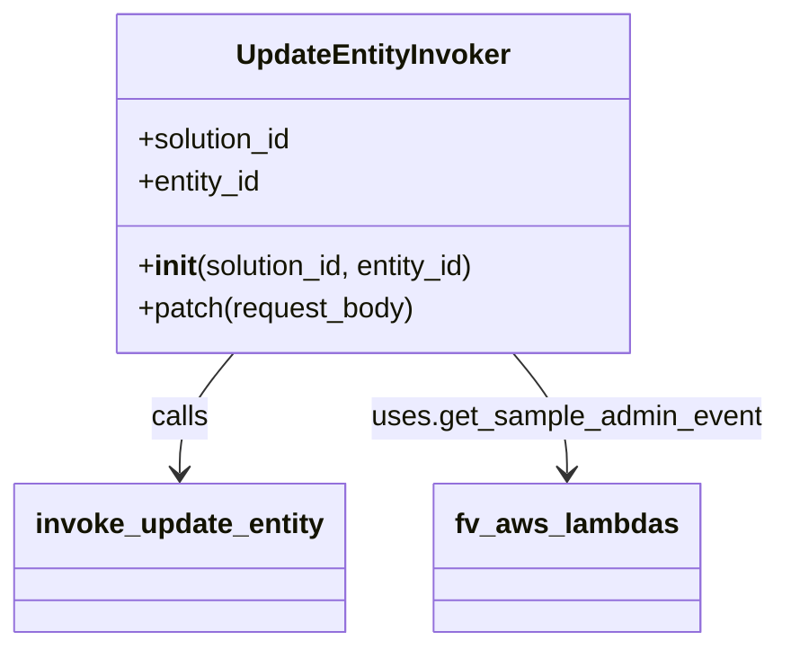

# Diagram: entity_core/entity_service/entity_service/common/update_entity_invoker.py


> Auto-generated by Obscura crawlers

## Diagram 1



### SVG

<svg id="container" width="431.890625" xmlns="http://www.w3.org/2000/svg" class="classDiagram" height="366" viewBox="0 0 431.890625 366" role="graphics-document document" aria-roledescription="class"><style>#container{font-family:"trebuchet ms",verdana,arial,sans-serif;font-size:16px;fill:#333;}@keyframes edge-animation-frame{from{stroke-dashoffset:0;}}@keyframes dash{to{stroke-dashoffset:0;}}#container .edge-animation-slow{stroke-dasharray:9,5!important;stroke-dashoffset:900;animation:dash 50s linear infinite;stroke-linecap:round;}#container .edge-animation-fast{stroke-dasharray:9,5!important;stroke-dashoffset:900;animation:dash 20s linear infinite;stroke-linecap:round;}#container .error-icon{fill:#552222;}#container .error-text{fill:#552222;stroke:#552222;}#container .edge-thickness-normal{stroke-width:1px;}#container .edge-thickness-thick{stroke-width:3.5px;}#container .edge-pattern-solid{stroke-dasharray:0;}#container .edge-thickness-invisible{stroke-width:0;fill:none;}#container .edge-pattern-dashed{stroke-dasharray:3;}#container .edge-pattern-dotted{stroke-dasharray:2;}#container .marker{fill:#333333;stroke:#333333;}#container .marker.cross{stroke:#333333;}#container svg{font-family:"trebuchet ms",verdana,arial,sans-serif;font-size:16px;}#container p{margin:0;}#container g.classGroup text{fill:#9370DB;stroke:none;font-family:"trebuchet ms",verdana,arial,sans-serif;font-size:10px;}#container g.classGroup text .title{font-weight:bolder;}#container .nodeLabel,#container .edgeLabel{color:#131300;}#container .edgeLabel .label rect{fill:#ECECFF;}#container .label text{fill:#131300;}#container .labelBkg{background:#ECECFF;}#container .edgeLabel .label span{background:#ECECFF;}#container .classTitle{font-weight:bolder;}#container .node rect,#container .node circle,#container .node ellipse,#container .node polygon,#container .node path{fill:#ECECFF;stroke:#9370DB;stroke-width:1px;}#container .divider{stroke:#9370DB;stroke-width:1;}#container g.clickable{cursor:pointer;}#container g.classGroup rect{fill:#ECECFF;stroke:#9370DB;}#container g.classGroup line{stroke:#9370DB;stroke-width:1;}#container .classLabel .box{stroke:none;stroke-width:0;fill:#ECECFF;opacity:0.5;}#container .classLabel .label{fill:#9370DB;font-size:10px;}#container .relation{stroke:#333333;stroke-width:1;fill:none;}#container .dashed-line{stroke-dasharray:3;}#container .dotted-line{stroke-dasharray:1 2;}#container #compositionStart,#container .composition{fill:#333333!important;stroke:#333333!important;stroke-width:1;}#container #compositionEnd,#container .composition{fill:#333333!important;stroke:#333333!important;stroke-width:1;}#container #dependencyStart,#container .dependency{fill:#333333!important;stroke:#333333!important;stroke-width:1;}#container #dependencyStart,#container .dependency{fill:#333333!important;stroke:#333333!important;stroke-width:1;}#container #extensionStart,#container .extension{fill:transparent!important;stroke:#333333!important;stroke-width:1;}#container #extensionEnd,#container .extension{fill:transparent!important;stroke:#333333!important;stroke-width:1;}#container #aggregationStart,#container .aggregation{fill:transparent!important;stroke:#333333!important;stroke-width:1;}#container #aggregationEnd,#container .aggregation{fill:transparent!important;stroke:#333333!important;stroke-width:1;}#container #lollipopStart,#container .lollipop{fill:#ECECFF!important;stroke:#333333!important;stroke-width:1;}#container #lollipopEnd,#container .lollipop{fill:#ECECFF!important;stroke:#333333!important;stroke-width:1;}#container .edgeTerminals{font-size:11px;line-height:initial;}#container .classTitleText{text-anchor:middle;font-size:18px;fill:#333;}#container .label-icon{display:inline-block;height:1em;overflow:visible;vertical-align:-0.125em;}#container .node .label-icon path{fill:currentColor;stroke:revert;stroke-width:revert;}#container :root{--mermaid-font-family:"trebuchet ms",verdana,arial,sans-serif;}</style><g><defs><marker id="container_class-aggregationStart" class="marker aggregation class" refX="18" refY="7" markerWidth="190" markerHeight="240" orient="auto"><path d="M 18,7 L9,13 L1,7 L9,1 Z"></path></marker></defs><defs><marker id="container_class-aggregationEnd" class="marker aggregation class" refX="1" refY="7" markerWidth="20" markerHeight="28" orient="auto"><path d="M 18,7 L9,13 L1,7 L9,1 Z"></path></marker></defs><defs><marker id="container_class-extensionStart" class="marker extension class" refX="18" refY="7" markerWidth="190" markerHeight="240" orient="auto"><path d="M 1,7 L18,13 V 1 Z"></path></marker></defs><defs><marker id="container_class-extensionEnd" class="marker extension class" refX="1" refY="7" markerWidth="20" markerHeight="28" orient="auto"><path d="M 1,1 V 13 L18,7 Z"></path></marker></defs><defs><marker id="container_class-compositionStart" class="marker composition class" refX="18" refY="7" markerWidth="190" markerHeight="240" orient="auto"><path d="M 18,7 L9,13 L1,7 L9,1 Z"></path></marker></defs><defs><marker id="container_class-compositionEnd" class="marker composition class" refX="1" refY="7" markerWidth="20" markerHeight="28" orient="auto"><path d="M 18,7 L9,13 L1,7 L9,1 Z"></path></marker></defs><defs><marker id="container_class-dependencyStart" class="marker dependency class" refX="6" refY="7" markerWidth="190" markerHeight="240" orient="auto"><path d="M 5,7 L9,13 L1,7 L9,1 Z"></path></marker></defs><defs><marker id="container_class-dependencyEnd" class="marker dependency class" refX="13" refY="7" markerWidth="20" markerHeight="28" orient="auto"><path d="M 18,7 L9,13 L14,7 L9,1 Z"></path></marker></defs><defs><marker id="container_class-lollipopStart" class="marker lollipop class" refX="13" refY="7" markerWidth="190" markerHeight="240" orient="auto"><circle stroke="black" fill="transparent" cx="7" cy="7" r="6"></circle></marker></defs><defs><marker id="container_class-lollipopEnd" class="marker lollipop class" refX="1" refY="7" markerWidth="190" markerHeight="240" orient="auto"><circle stroke="black" fill="transparent" cx="7" cy="7" r="6"></circle></marker></defs><g class="root"><g class="clusters"></g><g class="edgePaths"><path d="M129.108,200L124.159,206.167C119.21,212.333,109.312,224.667,104.363,236C99.414,247.333,99.414,257.667,99.414,262.833L99.414,268" id="id_UpdateEntityInvoker_invoke_update_entity_1" class="edge-thickness-normal edge-pattern-solid relation" style=";;;" data-edge="true" data-et="edge" data-id="id_UpdateEntityInvoker_invoke_update_entity_1" data-points="W3sieCI6MTI5LjEwODE3MDgxNzY2OTIsInkiOjIwMH0seyJ4Ijo5OS40MTQwNjI1LCJ5IjoyMzd9LHsieCI6OTkuNDE0MDYyNSwieSI6Mjc0fV0=" marker-end="url(#container_class-dependencyEnd)"></path><path d="M283.197,200L288.146,206.167C293.095,212.333,302.993,224.667,307.942,236C312.891,247.333,312.891,257.667,312.891,262.833L312.891,268" id="id_UpdateEntityInvoker_fv_aws_lambdas_2" class="edge-thickness-normal edge-pattern-solid relation" style=";;;" data-edge="true" data-et="edge" data-id="id_UpdateEntityInvoker_fv_aws_lambdas_2" data-points="W3sieCI6MjgzLjE5NjUxNjY4MjMzMDgsInkiOjIwMH0seyJ4IjozMTIuODkwNjI1LCJ5IjoyMzd9LHsieCI6MzEyLjg5MDYyNSwieSI6Mjc0fV0=" marker-end="url(#container_class-dependencyEnd)"></path></g><g class="edgeLabels"><g class="edgeLabel" transform="translate(99.4140625, 237)"><g class="label" data-id="id_UpdateEntityInvoker_invoke_update_entity_1" transform="translate(-16.4453125, -12)"><foreignObject width="32.890625" height="24"><div xmlns="http://www.w3.org/1999/xhtml" class="labelBkg" style="display: table-cell; white-space: nowrap; line-height: 1.5; max-width: 200px; text-align: center;"><span class="edgeLabel"><p>calls</p></span></div></foreignObject></g></g><g class="edgeLabel" transform="translate(312.890625, 237)"><g class="label" data-id="id_UpdateEntityInvoker_fv_aws_lambdas_2" transform="translate(-111, -12)"><foreignObject width="222" height="24"><div xmlns="http://www.w3.org/1999/xhtml" class="labelBkg" style="display: table; white-space: break-spaces; line-height: 1.5; max-width: 200px; text-align: center; width: 200px;"><span class="edgeLabel"><p>uses.get_sample_admin_event</p></span></div></foreignObject></g></g></g><g class="nodes"><g class="node default" id="classId-UpdateEntityInvoker-0" transform="translate(206.15234375, 104)"><g class="basic label-container"><path d="M-148.171875 -96 L148.171875 -96 L148.171875 96 L-148.171875 96" stroke="none" stroke-width="0" fill="#ECECFF" style=""></path><path d="M-148.171875 -96 C-33.27928828948539 -96, 81.61329842102921 -96, 148.171875 -96 M-148.171875 -96 C-84.03366875713094 -96, -19.89546251426188 -96, 148.171875 -96 M148.171875 -96 C148.171875 -24.880851906441208, 148.171875 46.238296187117584, 148.171875 96 M148.171875 -96 C148.171875 -43.99838461142784, 148.171875 8.003230777144324, 148.171875 96 M148.171875 96 C31.04077690340705 96, -86.0903211931859 96, -148.171875 96 M148.171875 96 C53.20899907220678 96, -41.75387685558644 96, -148.171875 96 M-148.171875 96 C-148.171875 39.467983229620316, -148.171875 -17.064033540759368, -148.171875 -96 M-148.171875 96 C-148.171875 26.377348932750024, -148.171875 -43.24530213449995, -148.171875 -96" stroke="#9370DB" stroke-width="1.3" fill="none" stroke-dasharray="0 0" style=""></path></g><g class="annotation-group text" transform="translate(0, -72)"></g><g class="label-group text" transform="translate(-75.375, -72)"><g class="label" style="font-weight: bolder" transform="translate(0,-12)"><foreignObject width="150.75" height="24"><div xmlns="http://www.w3.org/1999/xhtml" style="display: table-cell; white-space: nowrap; line-height: 1.5; max-width: 199px; text-align: center;"><span class="nodeLabel markdown-node-label" style=""><p>UpdateEntityInvoker</p></span></div></foreignObject></g></g><g class="members-group text" transform="translate(-136.171875, -24)"><g class="label" style="" transform="translate(0,-12)"><foreignObject width="90.21875" height="24"><div xmlns="http://www.w3.org/1999/xhtml" style="display: table-cell; white-space: nowrap; line-height: 1.5; max-width: 148px; text-align: center;"><span class="nodeLabel markdown-node-label" style=""><p>+solution_id</p></span></div></foreignObject></g><g class="label" style="" transform="translate(0,12)"><foreignObject width="71.859375" height="24"><div xmlns="http://www.w3.org/1999/xhtml" style="display: table-cell; white-space: nowrap; line-height: 1.5; max-width: 129px; text-align: center;"><span class="nodeLabel markdown-node-label" style=""><p>+entity_id</p></span></div></foreignObject></g></g><g class="methods-group text" transform="translate(-136.171875, 48)"><g class="label" style="" transform="translate(0,-12)"><foreignObject width="196.96875" height="24"><div xmlns="http://www.w3.org/1999/xhtml" style="display: table-cell; white-space: nowrap; line-height: 1.5; max-width: 286px; text-align: center;"><span class="nodeLabel markdown-node-label" style=""><p>+<strong>init</strong>(solution_id, entity_id)</p></span></div></foreignObject></g><g class="label" style="" transform="translate(0,12)"><foreignObject width="158.84375" height="24"><div xmlns="http://www.w3.org/1999/xhtml" style="display: table-cell; white-space: nowrap; line-height: 1.5; max-width: 216px; text-align: center;"><span class="nodeLabel markdown-node-label" style=""><p>+patch(request_body)</p></span></div></foreignObject></g></g><g class="divider" style=""><path d="M-148.171875 -48 C-72.76922684133834 -48, 2.633421317323325 -48, 148.171875 -48 M-148.171875 -48 C-60.777812538893414 -48, 26.61624992221317 -48, 148.171875 -48" stroke="#9370DB" stroke-width="1.3" fill="none" stroke-dasharray="0 0" style=""></path></g><g class="divider" style=""><path d="M-148.171875 24 C-45.86955924194743 24, 56.432756516105144 24, 148.171875 24 M-148.171875 24 C-39.13993565966288 24, 69.89200368067424 24, 148.171875 24" stroke="#9370DB" stroke-width="1.3" fill="none" stroke-dasharray="0 0" style=""></path></g></g><g class="node default" id="classId-invoke_update_entity-1" transform="translate(99.4140625, 316)"><g class="basic label-container"><path d="M-91.4140625 -42 L91.4140625 -42 L91.4140625 42 L-91.4140625 42" stroke="none" stroke-width="0" fill="#ECECFF" style=""></path><path d="M-91.4140625 -42 C-48.206478800754276 -42, -4.998895101508552 -42, 91.4140625 -42 M-91.4140625 -42 C-41.11973641325371 -42, 9.174589673492576 -42, 91.4140625 -42 M91.4140625 -42 C91.4140625 -13.000303114403152, 91.4140625 15.999393771193695, 91.4140625 42 M91.4140625 -42 C91.4140625 -12.440363037798939, 91.4140625 17.119273924402123, 91.4140625 42 M91.4140625 42 C19.530711665708125 42, -52.35263916858375 42, -91.4140625 42 M91.4140625 42 C21.876266729585325 42, -47.66152904082935 42, -91.4140625 42 M-91.4140625 42 C-91.4140625 19.23860828391812, -91.4140625 -3.522783432163763, -91.4140625 -42 M-91.4140625 42 C-91.4140625 24.93195817637343, -91.4140625 7.8639163527468625, -91.4140625 -42" stroke="#9370DB" stroke-width="1.3" fill="none" stroke-dasharray="0 0" style=""></path></g><g class="annotation-group text" transform="translate(0, -18)"></g><g class="label-group text" transform="translate(-79.4140625, -18)"><g class="label" style="font-weight: bolder" transform="translate(0,-12)"><foreignObject width="158.828125" height="24"><div xmlns="http://www.w3.org/1999/xhtml" style="display: table-cell; white-space: nowrap; line-height: 1.5; max-width: 206px; text-align: center;"><span class="nodeLabel markdown-node-label" style=""><p>invoke_update_entity</p></span></div></foreignObject></g></g><g class="members-group text" transform="translate(-79.4140625, 30)"></g><g class="methods-group text" transform="translate(-79.4140625, 60)"></g><g class="divider" style=""><path d="M-91.4140625 6 C-20.395399503762874 6, 50.62326349247425 6, 91.4140625 6 M-91.4140625 6 C-34.04743168431504 6, 23.319199131369913 6, 91.4140625 6" stroke="#9370DB" stroke-width="1.3" fill="none" stroke-dasharray="0 0" style=""></path></g><g class="divider" style=""><path d="M-91.4140625 24 C-24.73303255404072 24, 41.94799739191856 24, 91.4140625 24 M-91.4140625 24 C-34.91903339721715 24, 21.575995705565703 24, 91.4140625 24" stroke="#9370DB" stroke-width="1.3" fill="none" stroke-dasharray="0 0" style=""></path></g></g><g class="node default" id="classId-fv_aws_lambdas-2" transform="translate(312.890625, 316)"><g class="basic label-container"><path d="M-72.0625 -42 L72.0625 -42 L72.0625 42 L-72.0625 42" stroke="none" stroke-width="0" fill="#ECECFF" style=""></path><path d="M-72.0625 -42 C-20.244325139174173 -42, 31.573849721651655 -42, 72.0625 -42 M-72.0625 -42 C-33.77840457900689 -42, 4.5056908419862225 -42, 72.0625 -42 M72.0625 -42 C72.0625 -15.976879805409109, 72.0625 10.046240389181783, 72.0625 42 M72.0625 -42 C72.0625 -21.870857352207082, 72.0625 -1.7417147044141643, 72.0625 42 M72.0625 42 C21.751361041033782 42, -28.559777917932436 42, -72.0625 42 M72.0625 42 C32.49059161102514 42, -7.0813167779497235 42, -72.0625 42 M-72.0625 42 C-72.0625 24.37486193748153, -72.0625 6.74972387496306, -72.0625 -42 M-72.0625 42 C-72.0625 11.087421098737273, -72.0625 -19.825157802525453, -72.0625 -42" stroke="#9370DB" stroke-width="1.3" fill="none" stroke-dasharray="0 0" style=""></path></g><g class="annotation-group text" transform="translate(0, -18)"></g><g class="label-group text" transform="translate(-60.0625, -18)"><g class="label" style="font-weight: bolder" transform="translate(0,-12)"><foreignObject width="120.125" height="24"><div xmlns="http://www.w3.org/1999/xhtml" style="display: table-cell; white-space: nowrap; line-height: 1.5; max-width: 168px; text-align: center;"><span class="nodeLabel markdown-node-label" style=""><p>fv_aws_lambdas</p></span></div></foreignObject></g></g><g class="members-group text" transform="translate(-60.0625, 30)"></g><g class="methods-group text" transform="translate(-60.0625, 60)"></g><g class="divider" style=""><path d="M-72.0625 6 C-17.891148691972177 6, 36.28020261605565 6, 72.0625 6 M-72.0625 6 C-25.02474278904571 6, 22.01301442190858 6, 72.0625 6" stroke="#9370DB" stroke-width="1.3" fill="none" stroke-dasharray="0 0" style=""></path></g><g class="divider" style=""><path d="M-72.0625 24 C-29.903727631118777 24, 12.255044737762447 24, 72.0625 24 M-72.0625 24 C-15.254284106902382 24, 41.553931786195236 24, 72.0625 24" stroke="#9370DB" stroke-width="1.3" fill="none" stroke-dasharray="0 0" style=""></path></g></g></g></g></g></svg>

## Diagram 2

```mermaid
flowchart TD
    A[PATCH request to UpdateEntityInvoker.patch(request_body)] --> B[get_sample_admin_event("PATCH", [solution_id])]
    B --> C[invoke_update_entity(event, body=request_body, path_parameters={solution_id, entity_id}, invoke_type="RequestResponse")]
    C --> D[Return response]
```

> SVG rendering failed for this diagram.
