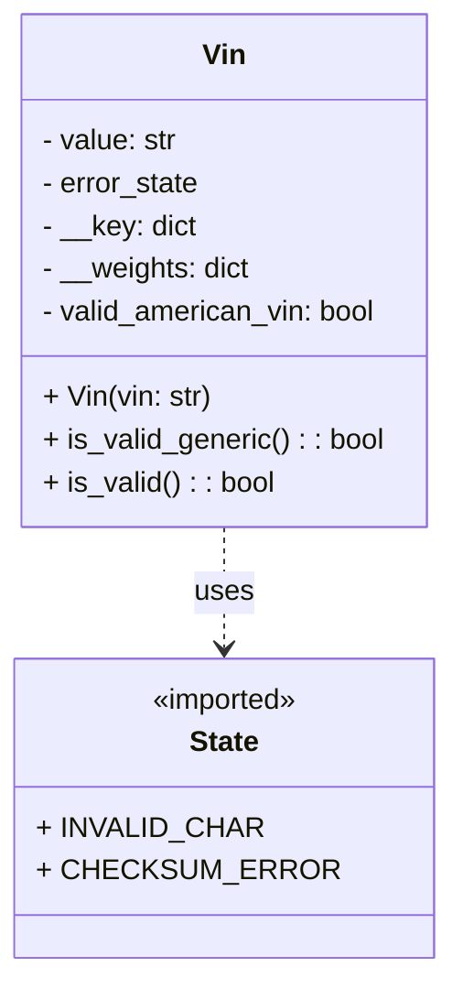

# Diagram: entity_core/entity_service/entity_service/common/vin.py


> Auto-generated by Obscura crawlers

## Diagram 1



### SVG

<svg id="container" width="243.421875" xmlns="http://www.w3.org/2000/svg" class="classDiagram" height="546" viewBox="0 0 243.421875 546" role="graphics-document document" aria-roledescription="class"><style>#container{font-family:"trebuchet ms",verdana,arial,sans-serif;font-size:16px;fill:#333;}@keyframes edge-animation-frame{from{stroke-dashoffset:0;}}@keyframes dash{to{stroke-dashoffset:0;}}#container .edge-animation-slow{stroke-dasharray:9,5!important;stroke-dashoffset:900;animation:dash 50s linear infinite;stroke-linecap:round;}#container .edge-animation-fast{stroke-dasharray:9,5!important;stroke-dashoffset:900;animation:dash 20s linear infinite;stroke-linecap:round;}#container .error-icon{fill:#552222;}#container .error-text{fill:#552222;stroke:#552222;}#container .edge-thickness-normal{stroke-width:1px;}#container .edge-thickness-thick{stroke-width:3.5px;}#container .edge-pattern-solid{stroke-dasharray:0;}#container .edge-thickness-invisible{stroke-width:0;fill:none;}#container .edge-pattern-dashed{stroke-dasharray:3;}#container .edge-pattern-dotted{stroke-dasharray:2;}#container .marker{fill:#333333;stroke:#333333;}#container .marker.cross{stroke:#333333;}#container svg{font-family:"trebuchet ms",verdana,arial,sans-serif;font-size:16px;}#container p{margin:0;}#container g.classGroup text{fill:#9370DB;stroke:none;font-family:"trebuchet ms",verdana,arial,sans-serif;font-size:10px;}#container g.classGroup text .title{font-weight:bolder;}#container .nodeLabel,#container .edgeLabel{color:#131300;}#container .edgeLabel .label rect{fill:#ECECFF;}#container .label text{fill:#131300;}#container .labelBkg{background:#ECECFF;}#container .edgeLabel .label span{background:#ECECFF;}#container .classTitle{font-weight:bolder;}#container .node rect,#container .node circle,#container .node ellipse,#container .node polygon,#container .node path{fill:#ECECFF;stroke:#9370DB;stroke-width:1px;}#container .divider{stroke:#9370DB;stroke-width:1;}#container g.clickable{cursor:pointer;}#container g.classGroup rect{fill:#ECECFF;stroke:#9370DB;}#container g.classGroup line{stroke:#9370DB;stroke-width:1;}#container .classLabel .box{stroke:none;stroke-width:0;fill:#ECECFF;opacity:0.5;}#container .classLabel .label{fill:#9370DB;font-size:10px;}#container .relation{stroke:#333333;stroke-width:1;fill:none;}#container .dashed-line{stroke-dasharray:3;}#container .dotted-line{stroke-dasharray:1 2;}#container #compositionStart,#container .composition{fill:#333333!important;stroke:#333333!important;stroke-width:1;}#container #compositionEnd,#container .composition{fill:#333333!important;stroke:#333333!important;stroke-width:1;}#container #dependencyStart,#container .dependency{fill:#333333!important;stroke:#333333!important;stroke-width:1;}#container #dependencyStart,#container .dependency{fill:#333333!important;stroke:#333333!important;stroke-width:1;}#container #extensionStart,#container .extension{fill:transparent!important;stroke:#333333!important;stroke-width:1;}#container #extensionEnd,#container .extension{fill:transparent!important;stroke:#333333!important;stroke-width:1;}#container #aggregationStart,#container .aggregation{fill:transparent!important;stroke:#333333!important;stroke-width:1;}#container #aggregationEnd,#container .aggregation{fill:transparent!important;stroke:#333333!important;stroke-width:1;}#container #lollipopStart,#container .lollipop{fill:#ECECFF!important;stroke:#333333!important;stroke-width:1;}#container #lollipopEnd,#container .lollipop{fill:#ECECFF!important;stroke:#333333!important;stroke-width:1;}#container .edgeTerminals{font-size:11px;line-height:initial;}#container .classTitleText{text-anchor:middle;font-size:18px;fill:#333;}#container .label-icon{display:inline-block;height:1em;overflow:visible;vertical-align:-0.125em;}#container .node .label-icon path{fill:currentColor;stroke:revert;stroke-width:revert;}#container :root{--mermaid-font-family:"trebuchet ms",verdana,arial,sans-serif;}</style><g><defs><marker id="container_class-aggregationStart" class="marker aggregation class" refX="18" refY="7" markerWidth="190" markerHeight="240" orient="auto"><path d="M 18,7 L9,13 L1,7 L9,1 Z"></path></marker></defs><defs><marker id="container_class-aggregationEnd" class="marker aggregation class" refX="1" refY="7" markerWidth="20" markerHeight="28" orient="auto"><path d="M 18,7 L9,13 L1,7 L9,1 Z"></path></marker></defs><defs><marker id="container_class-extensionStart" class="marker extension class" refX="18" refY="7" markerWidth="190" markerHeight="240" orient="auto"><path d="M 1,7 L18,13 V 1 Z"></path></marker></defs><defs><marker id="container_class-extensionEnd" class="marker extension class" refX="1" refY="7" markerWidth="20" markerHeight="28" orient="auto"><path d="M 1,1 V 13 L18,7 Z"></path></marker></defs><defs><marker id="container_class-compositionStart" class="marker composition class" refX="18" refY="7" markerWidth="190" markerHeight="240" orient="auto"><path d="M 18,7 L9,13 L1,7 L9,1 Z"></path></marker></defs><defs><marker id="container_class-compositionEnd" class="marker composition class" refX="1" refY="7" markerWidth="20" markerHeight="28" orient="auto"><path d="M 18,7 L9,13 L1,7 L9,1 Z"></path></marker></defs><defs><marker id="container_class-dependencyStart" class="marker dependency class" refX="6" refY="7" markerWidth="190" markerHeight="240" orient="auto"><path d="M 5,7 L9,13 L1,7 L9,1 Z"></path></marker></defs><defs><marker id="container_class-dependencyEnd" class="marker dependency class" refX="13" refY="7" markerWidth="20" markerHeight="28" orient="auto"><path d="M 18,7 L9,13 L14,7 L9,1 Z"></path></marker></defs><defs><marker id="container_class-lollipopStart" class="marker lollipop class" refX="13" refY="7" markerWidth="190" markerHeight="240" orient="auto"><circle stroke="black" fill="transparent" cx="7" cy="7" r="6"></circle></marker></defs><defs><marker id="container_class-lollipopEnd" class="marker lollipop class" refX="1" refY="7" markerWidth="190" markerHeight="240" orient="auto"><circle stroke="black" fill="transparent" cx="7" cy="7" r="6"></circle></marker></defs><g class="root"><g class="clusters"></g><g class="edgePaths"><path d="M121.711,296L121.711,302.167C121.711,308.333,121.711,320.667,121.711,332C121.711,343.333,121.711,353.667,121.711,358.833L121.711,364" id="id_Vin_State_1" class="edge-thickness-normal edge-pattern-dashed relation" style=";;;" data-edge="true" data-et="edge" data-id="id_Vin_State_1" data-points="W3sieCI6MTIxLjcxMDkzNzUsInkiOjI5Nn0seyJ4IjoxMjEuNzEwOTM3NSwieSI6MzMzfSx7IngiOjEyMS43MTA5Mzc1LCJ5IjozNzB9XQ==" marker-end="url(#container_class-dependencyEnd)"></path></g><g class="edgeLabels"><g class="edgeLabel" transform="translate(121.7109375, 333)"><g class="label" data-id="id_Vin_State_1" transform="translate(-16.4921875, -12)"><foreignObject width="32.984375" height="24"><div xmlns="http://www.w3.org/1999/xhtml" class="labelBkg" style="display: table-cell; white-space: nowrap; line-height: 1.5; max-width: 200px; text-align: center;"><span class="edgeLabel"><p>uses</p></span></div></foreignObject></g></g></g><g class="nodes"><g class="node default" id="classId-Vin-0" transform="translate(121.7109375, 152)"><g class="basic label-container"><path d="M-113.7109375 -144 L113.7109375 -144 L113.7109375 144 L-113.7109375 144" stroke="none" stroke-width="0" fill="#ECECFF" style=""></path><path d="M-113.7109375 -144 C-57.47542614331723 -144, -1.2399147866344578 -144, 113.7109375 -144 M-113.7109375 -144 C-60.587114647138776 -144, -7.463291794277552 -144, 113.7109375 -144 M113.7109375 -144 C113.7109375 -39.14260504253758, 113.7109375 65.71478991492484, 113.7109375 144 M113.7109375 -144 C113.7109375 -68.10888872074756, 113.7109375 7.782222558504884, 113.7109375 144 M113.7109375 144 C30.067843093001656 144, -53.57525131399669 144, -113.7109375 144 M113.7109375 144 C67.66628837923264 144, 21.62163925846528 144, -113.7109375 144 M-113.7109375 144 C-113.7109375 49.5666468385822, -113.7109375 -44.8667063228356, -113.7109375 -144 M-113.7109375 144 C-113.7109375 48.338188148777974, -113.7109375 -47.32362370244405, -113.7109375 -144" stroke="#9370DB" stroke-width="1.3" fill="none" stroke-dasharray="0 0" style=""></path></g><g class="annotation-group text" transform="translate(0, -120)"></g><g class="label-group text" transform="translate(-11.4375, -120)"><g class="label" style="font-weight: bolder" transform="translate(0,-12)"><foreignObject width="22.875" height="24"><div xmlns="http://www.w3.org/1999/xhtml" style="display: table-cell; white-space: nowrap; line-height: 1.5; max-width: 73px; text-align: center;"><span class="nodeLabel markdown-node-label" style=""><p>Vin</p></span></div></foreignObject></g></g><g class="members-group text" transform="translate(-101.7109375, -72)"><g class="label" style="" transform="translate(0,-12)"><foreignObject width="77.078125" height="24"><div xmlns="http://www.w3.org/1999/xhtml" style="display: table-cell; white-space: nowrap; line-height: 1.5; max-width: 135px; text-align: center;"><span class="nodeLabel markdown-node-label" style=""><p>- value: str</p></span></div></foreignObject></g><g class="label" style="" transform="translate(0,12)"><foreignObject width="89.9375" height="24"><div xmlns="http://www.w3.org/1999/xhtml" style="display: table-cell; white-space: nowrap; line-height: 1.5; max-width: 147px; text-align: center;"><span class="nodeLabel markdown-node-label" style=""><p>- error_state</p></span></div></foreignObject></g><g class="label" style="" transform="translate(0,36)"><foreignObject width="87.40625" height="24"><div xmlns="http://www.w3.org/1999/xhtml" style="display: table-cell; white-space: nowrap; line-height: 1.5; max-width: 145px; text-align: center;"><span class="nodeLabel markdown-node-label" style=""><p>- __key: dict</p></span></div></foreignObject></g><g class="label" style="" transform="translate(0,60)"><foreignObject width="118.09375" height="24"><div xmlns="http://www.w3.org/1999/xhtml" style="display: table-cell; white-space: nowrap; line-height: 1.5; max-width: 176px; text-align: center;"><span class="nodeLabel markdown-node-label" style=""><p>- __weights: dict</p></span></div></foreignObject></g><g class="label" style="" transform="translate(0,84)"><foreignObject width="191.578125" height="24"><div xmlns="http://www.w3.org/1999/xhtml" style="display: table-cell; white-space: nowrap; line-height: 1.5; max-width: 249px; text-align: center;"><span class="nodeLabel markdown-node-label" style=""><p>- valid_american_vin: bool</p></span></div></foreignObject></g></g><g class="methods-group text" transform="translate(-101.7109375, 72)"><g class="label" style="" transform="translate(0,-12)"><foreignObject width="94.640625" height="24"><div xmlns="http://www.w3.org/1999/xhtml" style="display: table-cell; white-space: nowrap; line-height: 1.5; max-width: 152px; text-align: center;"><span class="nodeLabel markdown-node-label" style=""><p>+ Vin(vin: str)</p></span></div></foreignObject></g><g class="label" style="" transform="translate(0,12)"><foreignObject width="191.984375" height="24"><div xmlns="http://www.w3.org/1999/xhtml" style="display: table-cell; white-space: nowrap; line-height: 1.5; max-width: 250px; text-align: center;"><span class="nodeLabel markdown-node-label" style=""><p>+ is_valid_generic() : : bool</p></span></div></foreignObject></g><g class="label" style="" transform="translate(0,36)"><foreignObject width="130.3125" height="24"><div xmlns="http://www.w3.org/1999/xhtml" style="display: table-cell; white-space: nowrap; line-height: 1.5; max-width: 188px; text-align: center;"><span class="nodeLabel markdown-node-label" style=""><p>+ is_valid() : : bool</p></span></div></foreignObject></g></g><g class="divider" style=""><path d="M-113.7109375 -96 C-38.41663452759916 -96, 36.877668444801685 -96, 113.7109375 -96 M-113.7109375 -96 C-62.735049252417035 -96, -11.75916100483407 -96, 113.7109375 -96" stroke="#9370DB" stroke-width="1.3" fill="none" stroke-dasharray="0 0" style=""></path></g><g class="divider" style=""><path d="M-113.7109375 48 C-64.86795947138114 48, -16.024981442762297 48, 113.7109375 48 M-113.7109375 48 C-25.923440543777488 48, 61.864056412445024 48, 113.7109375 48" stroke="#9370DB" stroke-width="1.3" fill="none" stroke-dasharray="0 0" style=""></path></g></g><g class="node default" id="classId-State-1" transform="translate(121.7109375, 454)"><g class="basic label-container"><path d="M-106.96875 -84 L106.96875 -84 L106.96875 84 L-106.96875 84" stroke="none" stroke-width="0" fill="#ECECFF" style=""></path><path d="M-106.96875 -84 C-50.427183368623325 -84, 6.11438326275335 -84, 106.96875 -84 M-106.96875 -84 C-52.89519695903748 -84, 1.1783560819250454 -84, 106.96875 -84 M106.96875 -84 C106.96875 -48.269681358998845, 106.96875 -12.53936271799769, 106.96875 84 M106.96875 -84 C106.96875 -18.046710005446258, 106.96875 47.906579989107485, 106.96875 84 M106.96875 84 C62.9021778788981 84, 18.835605757796202 84, -106.96875 84 M106.96875 84 C31.491905233855462 84, -43.984939532289076 84, -106.96875 84 M-106.96875 84 C-106.96875 28.749624326862765, -106.96875 -26.50075134627447, -106.96875 -84 M-106.96875 84 C-106.96875 21.088459497357526, -106.96875 -41.82308100528495, -106.96875 -84" stroke="#9370DB" stroke-width="1.3" fill="none" stroke-dasharray="0 0" style=""></path></g><g class="annotation-group text" transform="translate(-42.671875, -60)"><g class="label" style="" transform="translate(0,-12)"><foreignObject width="85.34375" height="24"><div xmlns="http://www.w3.org/1999/xhtml" style="display: table-cell; white-space: nowrap; line-height: 1.5; max-width: 135px; text-align: center;"><span class="nodeLabel markdown-node-label" style=""><p>«imported»</p></span></div></foreignObject></g></g><g class="label-group text" transform="translate(-19.3125, -36)"><g class="label" style="font-weight: bolder" transform="translate(0,-12)"><foreignObject width="38.625" height="24"><div xmlns="http://www.w3.org/1999/xhtml" style="display: table-cell; white-space: nowrap; line-height: 1.5; max-width: 87px; text-align: center;"><span class="nodeLabel markdown-node-label" style=""><p>State</p></span></div></foreignObject></g></g><g class="members-group text" transform="translate(-94.96875, 12)"><g class="label" style="" transform="translate(0,-12)"><foreignObject width="114.4375" height="24"><div xmlns="http://www.w3.org/1999/xhtml" style="display: table-cell; white-space: nowrap; line-height: 1.5; max-width: 172px; text-align: center;"><span class="nodeLabel markdown-node-label" style=""><p>+ INVALID_CHAR</p></span></div></foreignObject></g><g class="label" style="" transform="translate(0,12)"><foreignObject width="147.265625" height="24"><div xmlns="http://www.w3.org/1999/xhtml" style="display: table-cell; white-space: nowrap; line-height: 1.5; max-width: 205px; text-align: center;"><span class="nodeLabel markdown-node-label" style=""><p>+ CHECKSUM_ERROR</p></span></div></foreignObject></g></g><g class="methods-group text" transform="translate(-94.96875, 84)"></g><g class="divider" style=""><path d="M-106.96875 -12 C-27.26332849393343 -12, 52.44209301213314 -12, 106.96875 -12 M-106.96875 -12 C-25.910154307886998 -12, 55.148441384226004 -12, 106.96875 -12" stroke="#9370DB" stroke-width="1.3" fill="none" stroke-dasharray="0 0" style=""></path></g><g class="divider" style=""><path d="M-106.96875 60 C-26.799356097995656 60, 53.37003780400869 60, 106.96875 60 M-106.96875 60 C-40.147452148351434 60, 26.673845703297133 60, 106.96875 60" stroke="#9370DB" stroke-width="1.3" fill="none" stroke-dasharray="0 0" style=""></path></g></g></g></g></g></svg>

## Diagram 2

```mermaid
flowchart TD
Start([is_valid() start]) --> CheckLen{len(value) == 17?}
CheckLen -- No --> SetInvalid1[/error_state = State.INVALID_CHAR/]
SetInvalid1 --> ReturnFalse1([return False])
CheckLen -- Yes --> Transliterate[Transliterate each char using __key or int]
Transliterate --> CharsValid{All chars transliterated successfully?}
CharsValid -- No --> SetInvalid2[/error_state = State.INVALID_CHAR/]
SetInvalid2 --> ReturnFalse2([return False])
CharsValid -- Yes --> Weigh[Multiply each transliterated value by __weights[index]]
Weigh --> Sum[vin_sum = sum(weighted_vin)]
Sum --> Checksum[checksum = vin_sum % 11]
Checksum --> IsTen{checksum == 10?}
IsTen -- Yes --> SetX[checksum = "X"]
IsTen -- No --> SkipX[/no change/]
SetX --> Compare
SkipX --> Compare
Compare[Compare checksum to value[8]] --> Match{checksum equals value[8]?}
Match -- Yes --> ReturnTrue([return True])
Match -- No --> SetChecksumErr[/error_state = State.CHECKSUM_ERROR/]
SetChecksumErr --> ReturnFalse3([return False])
```

> SVG rendering failed for this diagram.
