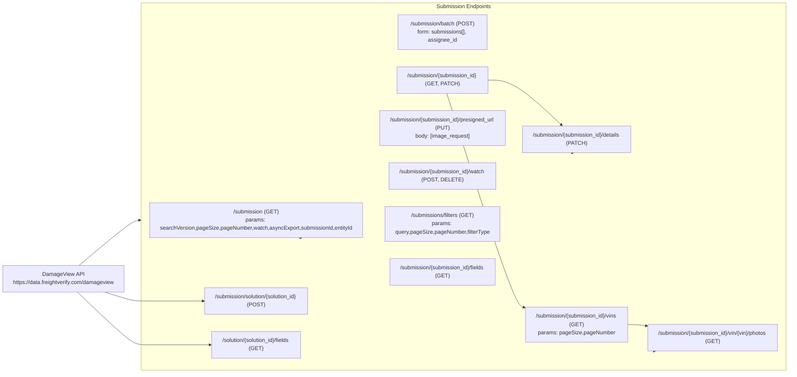
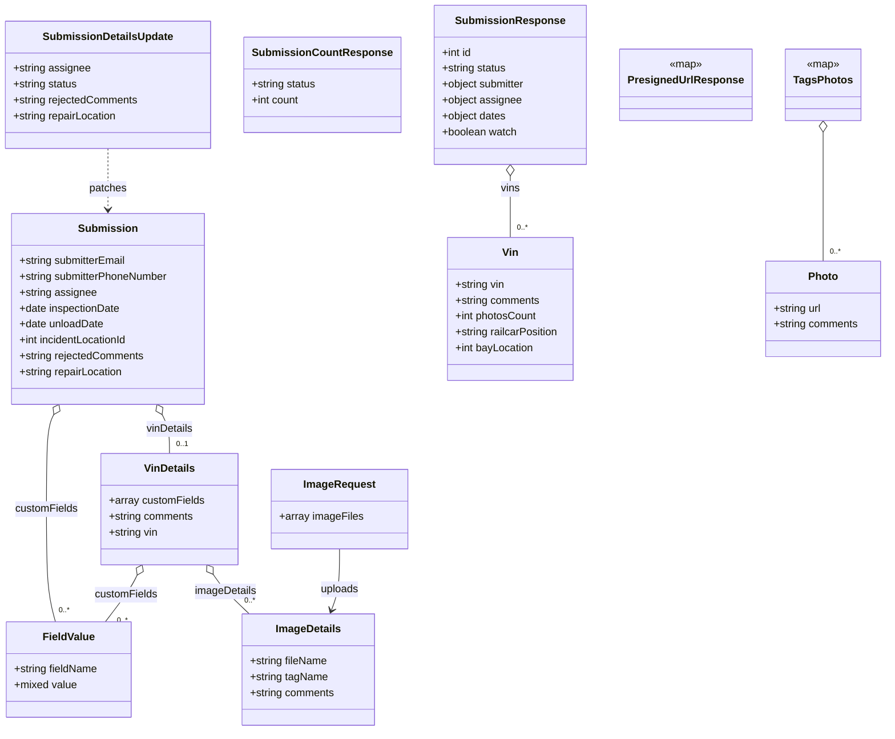

# Diagram: entity_core/entity_service/entity_service/damageview/api_documentation/DamageView.yaml

> Auto-generated by Obscura crawlers

## Diagram 1

### SVG

<svg id="container" width="2427.984375" xmlns="http://www.w3.org/2000/svg" class="flowchart" height="1041" viewBox="0 0 2427.984375 1041" role="graphics-document document" aria-roledescription="flowchart-v2"><g><marker id="container_flowchart-v2-pointEnd" class="marker flowchart-v2" viewBox="0 0 10 10" refX="5" refY="5" markerUnits="userSpaceOnUse" markerWidth="8" markerHeight="8" orient="auto"><path d="M 0 0 L 10 5 L 0 10 z" class="arrowMarkerPath" style="stroke-width: 1; stroke-dasharray: 1, 0;"></path></marker><marker id="container_flowchart-v2-pointStart" class="marker flowchart-v2" viewBox="0 0 10 10" refX="4.5" refY="5" markerUnits="userSpaceOnUse" markerWidth="8" markerHeight="8" orient="auto"><path d="M 0 5 L 10 10 L 10 0 z" class="arrowMarkerPath" style="stroke-width: 1; stroke-dasharray: 1, 0;"></path></marker><marker id="container_flowchart-v2-circleEnd" class="marker flowchart-v2" viewBox="0 0 10 10" refX="11" refY="5" markerUnits="userSpaceOnUse" markerWidth="11" markerHeight="11" orient="auto"><circle cx="5" cy="5" r="5" class="arrowMarkerPath" style="stroke-width: 1; stroke-dasharray: 1, 0;"></circle></marker><marker id="container_flowchart-v2-circleStart" class="marker flowchart-v2" viewBox="0 0 10 10" refX="-1" refY="5" markerUnits="userSpaceOnUse" markerWidth="11" markerHeight="11" orient="auto"><circle cx="5" cy="5" r="5" class="arrowMarkerPath" style="stroke-width: 1; stroke-dasharray: 1, 0;"></circle></marker><marker id="container_flowchart-v2-crossEnd" class="marker cross flowchart-v2" viewBox="0 0 11 11" refX="12" refY="5.2" markerUnits="userSpaceOnUse" markerWidth="11" markerHeight="11" orient="auto"><path d="M 1,1 l 9,9 M 10,1 l -9,9" class="arrowMarkerPath" style="stroke-width: 2; stroke-dasharray: 1, 0;"></path></marker><marker id="container_flowchart-v2-crossStart" class="marker cross flowchart-v2" viewBox="0 0 11 11" refX="-1" refY="5.2" markerUnits="userSpaceOnUse" markerWidth="11" markerHeight="11" orient="auto"><path d="M 1,1 l 9,9 M 10,1 l -9,9" class="arrowMarkerPath" style="stroke-width: 2; stroke-dasharray: 1, 0;"></path></marker><g class="root"><g class="clusters"><g class="cluster" id="SubmissionEndpoints" data-look="classic"><rect style="" x="469.703125" y="8" width="1950.28125" height="1025"></rect><g class="cluster-label" transform="translate(1364.1640625, 8)"><foreignObject width="161.359375" height="24">

Submission Endpoints

</foreignObject></g></g></g><g class="edgePaths"><path d="M260.5,805L291.201,830.667C321.901,856.333,383.302,907.667,418.169,933.333C453.036,959,461.37,959,497.56,959C533.75,959,597.797,959,629.82,959L661.844,959" id="L_API_S11_0" class="edge-thickness-normal edge-pattern-solid edge-thickness-normal edge-pattern-solid flowchart-link" style=";" data-edge="true" data-et="edge" data-id="L_API_S11_0" data-points="W3sieCI6MjYwLjUwMDMyMzgzNDE5NjksInkiOjgwNX0seyJ4Ijo0NDQuNzAzMTI1LCJ5Ijo5NTl9LHsieCI6NDY5LjcwMzEyNSwieSI6OTU5fSx7IngiOjY2NS44NDM3NSwieSI6OTU5fV0=" marker-end="url(#container_flowchart-v2-pointEnd)"></path><path d="M352.363,805L367.753,809.333C383.143,813.667,413.923,822.333,433.48,826.667C453.036,831,461.37,831,493.98,831C526.591,831,583.479,831,611.923,831L640.367,831" id="L_API_S9_0" class="edge-thickness-normal edge-pattern-solid edge-thickness-normal edge-pattern-solid flowchart-link" style=";" data-edge="true" data-et="edge" data-id="L_API_S9_0" data-points="W3sieCI6MzUyLjM2MjUsInkiOjgwNX0seyJ4Ijo0NDQuNzAzMTI1LCJ5Ijo4MzF9LHsieCI6NDY5LjcwMzEyNSwieSI6ODMxfSx7IngiOjY0NC4zNjcxODc1LCJ5Ijo4MzF9XQ==" marker-end="url(#container_flowchart-v2-pointEnd)"></path><path d="M1499.281,234L1512.44,234C1525.599,234,1551.917,234,1588.568,252.915C1625.219,271.83,1672.204,309.661,1695.697,328.576L1719.189,347.491" id="L_S3_S4_0" class="edge-thickness-normal edge-pattern-solid edge-thickness-normal edge-pattern-solid flowchart-link" style=";" data-edge="true" data-et="edge" data-id="L_S3_S4_0" data-points="W3sieCI6MTQ5OS4yODEyNSwieSI6MjM0fSx7IngiOjE1NzguMjM0Mzc1LCJ5IjoyMzR9LHsieCI6MTcyMi4zMDQ3Mzc5MDMyMjU3LCJ5IjozNTB9XQ==" marker-end="url(#container_flowchart-v2-pointEnd)"></path><path d="M1374.228,273L1408.229,367.5C1442.23,462,1510.232,651,1549.398,747.11C1588.563,843.219,1598.892,846.438,1604.056,848.048L1609.22,849.658" id="L_S3_S5_0" class="edge-thickness-normal edge-pattern-solid edge-thickness-normal edge-pattern-solid flowchart-link" style=";" data-edge="true" data-et="edge" data-id="L_S3_S5_0" data-points="W3sieCI6MTM3NC4yMjc1MjkzOTM1NjQzLCJ5IjoyNzN9LHsieCI6MTU3OC4yMzQzNzUsInkiOjg0MH0seyJ4IjoxNjEzLjAzOTA2MjUsInkiOjg1MC44NDc3NzQwMzUxNDQ3fV0=" marker-end="url(#container_flowchart-v2-pointEnd)"></path><path d="M1928.445,900L1934.246,900C1940.047,900,1951.648,900,1960.958,900.584C1970.268,901.168,1977.286,902.336,1980.795,902.92L1984.304,903.503" id="L_S5_S6_0" class="edge-thickness-normal edge-pattern-solid edge-thickness-normal edge-pattern-solid flowchart-link" style=";" data-edge="true" data-et="edge" data-id="L_S5_S6_0" data-points="W3sieCI6MTkyOC40NDUzMTI1LCJ5Ijo5MDB9LHsieCI6MTk2My4yNSwieSI6OTAwfSx7IngiOjE5ODguMjUsInkiOjkwNC4xNTk5NjcxNTgxNTR9XQ==" marker-end="url(#container_flowchart-v2-pointEnd)"></path><path d="M270.476,727L299.513,707C328.551,687,386.627,647,419.165,627C451.703,607,458.703,607,462.203,607L465.703,607" id="L_API_SubmissionEndpoints_0" class="edge-thickness-normal edge-pattern-solid edge-thickness-normal edge-pattern-solid flowchart-link" style=";" data-edge="true" data-et="edge" data-id="L_API_SubmissionEndpoints_0" data-points="W3sieCI6MjcwLjQ3NTUzMDY2MDM3NzMzLCJ5Ijo3Mjd9LHsieCI6NDQ0LjcwMzEyNSwieSI6NjA3fSx7IngiOjQ2OS43MDMxMjUsInkiOjYwN30seyJ4Ijo0OTQuNzAzMTI1LCJ5Ijo2MDd9XQ==" marker-end="url(#container_flowchart-v2-pointEnd)"></path><path d="M917.344,646Z" id="L_SubmissionEndpoints_S1_0" class="edge-thickness-normal edge-pattern-solid edge-thickness-normal edge-pattern-solid flowchart-link" style=";" data-edge="true" data-et="edge" data-id="L_SubmissionEndpoints_S1_0" data-points="W3sieCI6Njk4LjUxNTIxMDE3Njk5MTEsInkiOjY0Nn0seyJ4Ijo0OTQuNzAzMTI1LCJ5Ijo3MjB9LHsieCI6NDk0LjcwMzEyNSwieSI6NzM4LjV9LHsieCI6ODA1LjkyOTY4NzUsInkiOjc1N30seyJ4IjoxMTE3LjE1NjI1LCJ5Ijo3MzguNX0seyJ4IjoxMTE3LjE1NjI1LCJ5Ijo3MjB9LHsieCI6OTEzLjM0NDE2NDgyMzAwODksInkiOjY0Nn1d" marker-end="url(#container_flowchart-v2-pointEnd)"></path><path d="M1234.195,94Z" id="L_SubmissionEndpoints_S2_0" class="edge-thickness-normal edge-pattern-solid edge-thickness-normal edge-pattern-solid flowchart-link" style=";" data-edge="true" data-et="edge" data-id="L_SubmissionEndpoints_S2_0" data-points="W3sieCI6ODMxLjQ5MDc3MTE5ODgzMDQsInkiOjU2OH0seyJ4IjoxMTQyLjE1NjI1LCJ5Ijo5NH0seyJ4IjoxMjMwLjE5NTMxMjUsInkiOjk0fV0=" marker-end="url(#container_flowchart-v2-pointEnd)"></path><path d="M1225.109,234Z" id="L_SubmissionEndpoints_S3_0" class="edge-thickness-normal edge-pattern-solid edge-thickness-normal edge-pattern-solid flowchart-link" style=";" data-edge="true" data-et="edge" data-id="L_SubmissionEndpoints_S3_0" data-points="W3sieCI6ODQxLjA4NDc0MzYzMjcwNzcsInkiOjU2OH0seyJ4IjoxMTQyLjE1NjI1LCJ5IjoyMzR9LHsieCI6MTIyMS4xMDkzNzUsInkiOjIzNH1d" marker-end="url(#container_flowchart-v2-pointEnd)"></path><path d="M1757.323,428Z" id="L_SubmissionEndpoints_S4_0" class="edge-thickness-normal edge-pattern-solid edge-thickness-normal edge-pattern-solid flowchart-link" style=";" data-edge="true" data-et="edge" data-id="L_SubmissionEndpoints_S4_0" data-points="W3sieCI6ODY3LjQ5MjI5NzUzNTIxMTMsInkiOjY0Nn0seyJ4IjoxMTQyLjE1NjI1LCJ5Ijo4MjB9LHsieCI6MTM2MC4xOTUzMTI1LCJ5Ijo4MjB9LHsieCI6MTU3OC4yMzQzNzUsInkiOjgyMH0seyJ4IjoxNzUzLjMyMjY4NzA2NDk2NTMsInkiOjQyOH1d" marker-end="url(#container_flowchart-v2-pointEnd)"></path><path d="M1617.039,927.034Z" id="L_SubmissionEndpoints_S5_0" class="edge-thickness-normal edge-pattern-solid edge-thickness-normal edge-pattern-solid flowchart-link" style=";" data-edge="true" data-et="edge" data-id="L_SubmissionEndpoints_S5_0" data-points="W3sieCI6ODQ2LjE1MzExMDYyMTE2NTYsInkiOjY0Nn0seyJ4IjoxMTQyLjE1NjI1LCJ5Ijo5MzN9LHsieCI6MTM2MC4xOTUzMTI1LCJ5Ijo5MzN9LHsieCI6MTU3OC4yMzQzNzUsInkiOjkzM30seyJ4IjoxNjEzLjAzOTA2MjUsInkiOjkyNy4wMzM3MjQyODA2NzA0fV0=" marker-end="url(#container_flowchart-v2-pointEnd)"></path><path d="M2010.069,977Z" id="L_SubmissionEndpoints_S6_0" class="edge-thickness-normal edge-pattern-solid edge-thickness-normal edge-pattern-solid flowchart-link" style=";" data-edge="true" data-et="edge" data-id="L_SubmissionEndpoints_S6_0" data-points="W3sieCI6ODQwLjUyODE5OTIwODQ0MzMsInkiOjY0Nn0seyJ4IjoxMTQyLjE1NjI1LCJ5Ijo5ODZ9LHsieCI6MTM2MC4xOTUzMTI1LCJ5Ijo5ODZ9LHsieCI6MTU3OC4yMzQzNzUsInkiOjk4Nn0seyJ4IjoxNzcwLjc0MjE4NzUsInkiOjk4Nn0seyJ4IjoxOTYzLjI1LCJ5Ijo5ODZ9LHsieCI6MjAwNi4wNjg4NDc2NTYyNSwieSI6OTc3fV0=" marker-end="url(#container_flowchart-v2-pointEnd)"></path><path d="M1171.156,362Z" id="L_SubmissionEndpoints_S7_0" class="edge-thickness-normal edge-pattern-solid edge-thickness-normal edge-pattern-solid flowchart-link" style=";" data-edge="true" data-et="edge" data-id="L_SubmissionEndpoints_S7_0" data-points="W3sieCI6ODU5LjQ1MTQ2NjgzNjczNDcsInkiOjU2OH0seyJ4IjoxMTQyLjE1NjI1LCJ5IjozNjJ9LHsieCI6MTE2Ny4xNTYyNSwieSI6MzYyfV0=" marker-end="url(#container_flowchart-v2-pointEnd)"></path><path d="M1199.836,490Z" id="L_SubmissionEndpoints_S8_0" class="edge-thickness-normal edge-pattern-solid edge-thickness-normal edge-pattern-solid flowchart-link" style=";" data-edge="true" data-et="edge" data-id="L_SubmissionEndpoints_S8_0" data-points="W3sieCI6OTE4LjAwNTIwODMzMzMzMzQsInkiOjU2OH0seyJ4IjoxMTQyLjE1NjI1LCJ5Ijo0OTB9LHsieCI6MTE5NS44MzU5Mzc1LCJ5Ijo0OTB9XQ==" marker-end="url(#container_flowchart-v2-pointEnd)"></path><path d="M1196.477,618Z" id="L_SubmissionEndpoints_S10_0" class="edge-thickness-normal edge-pattern-solid edge-thickness-normal edge-pattern-solid flowchart-link" style=";" data-edge="true" data-et="edge" data-id="L_SubmissionEndpoints_S10_0" data-points="W3sieCI6MTExNy4xNTYyNSwieSI6NjE3LjE4MjA5OTEyNDAwOTZ9LHsieCI6MTE0Mi4xNTYyNSwieSI6NjE4fSx7IngiOjExOTIuNDc2NTYyNSwieSI6NjE4fV0=" marker-end="url(#container_flowchart-v2-pointEnd)"></path><path d="M1201.406,746Z" id="L_SubmissionEndpoints_S12_0" class="edge-thickness-normal edge-pattern-solid edge-thickness-normal edge-pattern-solid flowchart-link" style=";" data-edge="true" data-et="edge" data-id="L_SubmissionEndpoints_S12_0" data-points="W3sieCI6OTAwLjI2NjYzNjY5MDY0NzUsInkiOjY0Nn0seyJ4IjoxMTQyLjE1NjI1LCJ5Ijo3NDZ9LHsieCI6MTE5Ny40MDYyNSwieSI6NzQ2fV0=" marker-end="url(#container_flowchart-v2-pointEnd)"></path></g><g class="edgeLabels"><g class="edgeLabel"><g class="label" data-id="L_API_S11_0" transform="translate(0, 0)"><foreignObject width="0" height="0">

</foreignObject></g></g><g class="edgeLabel"><g class="label" data-id="L_API_S9_0" transform="translate(0, 0)"><foreignObject width="0" height="0">

</foreignObject></g></g><g class="edgeLabel"><g class="label" data-id="L_S3_S4_0" transform="translate(0, 0)"><foreignObject width="0" height="0">

</foreignObject></g></g><g class="edgeLabel"><g class="label" data-id="L_S3_S5_0" transform="translate(0, 0)"><foreignObject width="0" height="0">

</foreignObject></g></g><g class="edgeLabel"><g class="label" data-id="L_S5_S6_0" transform="translate(0, 0)"><foreignObject width="0" height="0">

</foreignObject></g></g><g class="edgeLabel"><g class="label" data-id="L_API_SubmissionEndpoints_0" transform="translate(0, 0)"><foreignObject width="0" height="0">

</foreignObject></g></g><g class="edgeLabel"><g class="label" data-id="L_SubmissionEndpoints_S1_0" transform="translate(0, 0)"><foreignObject width="0" height="0">

</foreignObject></g></g><g class="edgeLabel"><g class="label" data-id="L_SubmissionEndpoints_S2_0" transform="translate(0, 0)"><foreignObject width="0" height="0">

</foreignObject></g></g><g class="edgeLabel"><g class="label" data-id="L_SubmissionEndpoints_S3_0" transform="translate(0, 0)"><foreignObject width="0" height="0">

</foreignObject></g></g><g class="edgeLabel"><g class="label" data-id="L_SubmissionEndpoints_S4_0" transform="translate(0, 0)"><foreignObject width="0" height="0">

</foreignObject></g></g><g class="edgeLabel"><g class="label" data-id="L_SubmissionEndpoints_S5_0" transform="translate(0, 0)"><foreignObject width="0" height="0">

</foreignObject></g></g><g class="edgeLabel"><g class="label" data-id="L_SubmissionEndpoints_S6_0" transform="translate(0, 0)"><foreignObject width="0" height="0">

</foreignObject></g></g><g class="edgeLabel"><g class="label" data-id="L_SubmissionEndpoints_S7_0" transform="translate(0, 0)"><foreignObject width="0" height="0">

</foreignObject></g></g><g class="edgeLabel"><g class="label" data-id="L_SubmissionEndpoints_S8_0" transform="translate(0, 0)"><foreignObject width="0" height="0">

</foreignObject></g></g><g class="edgeLabel"><g class="label" data-id="L_SubmissionEndpoints_S10_0" transform="translate(0, 0)"><foreignObject width="0" height="0">

</foreignObject></g></g><g class="edgeLabel"><g class="label" data-id="L_SubmissionEndpoints_S12_0" transform="translate(0, 0)"><foreignObject width="0" height="0">

</foreignObject></g></g></g><g class="nodes"><g class="node default" id="flowchart-API-0" transform="translate(213.8515625, 766)"><rect class="basic label-container" style="" x="-205.8515625" y="-39" width="411.703125" height="78"></rect><g class="label" style="" transform="translate(-175.8515625, -24)"><rect></rect><foreignObject width="351.703125" height="48">

DamageView API\nhttps://data.freightverify.com/damageview

</foreignObject></g></g><g class="node default" id="flowchart-S1-1" transform="translate(805.9296875, 607)"><rect class="basic label-container" style="" x="-311.2265625" y="-39" width="622.453125" height="78"></rect><g class="label" style="" transform="translate(-281.2265625, -24)"><rect></rect><foreignObject width="562.453125" height="48">

/submission (GET)\nparams: searchVersion,pageSize,pageNumber,watch,asyncExport,submissionId,entityId

</foreignObject></g></g><g class="node default" id="flowchart-S2-2" transform="translate(1360.1953125, 94)"><rect class="basic label-container" style="" x="-130" y="-51" width="260" height="102"></rect><g class="label" style="" transform="translate(-100, -36)"><rect></rect><foreignObject width="200" height="72">

/submission/batch (POST)\nform: submissions[], assignee_id

</foreignObject></g></g><g class="node default" id="flowchart-S3-3" transform="translate(1360.1953125, 234)"><rect class="basic label-container" style="" x="-139.0859375" y="-39" width="278.171875" height="78"></rect><g class="label" style="" transform="translate(-109.0859375, -24)"><rect></rect><foreignObject width="218.171875" height="48">

/submission/{submission_id} (GET, PATCH)

</foreignObject></g></g><g class="node default" id="flowchart-S4-4" transform="translate(1770.7421875, 389)"><rect class="basic label-container" style="" x="-167.5078125" y="-39" width="335.015625" height="78"></rect><g class="label" style="" transform="translate(-137.5078125, -24)"><rect></rect><foreignObject width="275.015625" height="48">

/submission/{submission_id}/details (PATCH)

</foreignObject></g></g><g class="node default" id="flowchart-S5-5" transform="translate(1770.7421875, 900)"><rect class="basic label-container" style="" x="-157.703125" y="-51" width="315.40625" height="102"></rect><g class="label" style="" transform="translate(-127.703125, -36)"><rect></rect><foreignObject width="255.40625" height="72">

/submission/{submission_id}/vins (GET)\nparams: pageSize,pageNumber

</foreignObject></g></g><g class="node default" id="flowchart-S6-6" transform="translate(2191.6171875, 938)"><rect class="basic label-container" style="" x="-203.3671875" y="-39" width="406.734375" height="78"></rect><g class="label" style="" transform="translate(-173.3671875, -24)"><rect></rect><foreignObject width="346.734375" height="48">

/submission/{submission_id}/vin/{vin}/photos (GET)

</foreignObject></g></g><g class="node default" id="flowchart-S7-7" transform="translate(1360.1953125, 362)"><rect class="basic label-container" style="" x="-193.0390625" y="-39" width="386.078125" height="78"></rect><g class="label" style="" transform="translate(-163.0390625, -24)"><rect></rect><foreignObject width="326.078125" height="48">

/submission/{submission_id}/presigned_url (PUT)\nbody: [image_request]

</foreignObject></g></g><g class="node default" id="flowchart-S8-8" transform="translate(1360.1953125, 490)"><rect class="basic label-container" style="" x="-164.359375" y="-39" width="328.71875" height="78"></rect><g class="label" style="" transform="translate(-134.359375, -24)"><rect></rect><foreignObject width="268.71875" height="48">

/submission/{submission_id}/watch (POST, DELETE)

</foreignObject></g></g><g class="node default" id="flowchart-S9-9" transform="translate(805.9296875, 831)"><rect class="basic label-container" style="" x="-161.5625" y="-39" width="323.125" height="78"></rect><g class="label" style="" transform="translate(-131.5625, -24)"><rect></rect><foreignObject width="263.125" height="48">

/submission/solution/{solution_id} (POST)

</foreignObject></g></g><g class="node default" id="flowchart-S10-10" transform="translate(1360.1953125, 618)"><rect class="basic label-container" style="" x="-167.71875" y="-39" width="335.4375" height="78"></rect><g class="label" style="" transform="translate(-137.71875, -24)"><rect></rect><foreignObject width="275.4375" height="48">

/submissions/filters (GET)\nparams: query,pageSize,pageNumber,filterType

</foreignObject></g></g><g class="node default" id="flowchart-S11-11" transform="translate(805.9296875, 959)"><rect class="basic label-container" style="" x="-140.0859375" y="-39" width="280.171875" height="78"></rect><g class="label" style="" transform="translate(-110.0859375, -24)"><rect></rect><foreignObject width="220.171875" height="48">

/solution/{solution_id}/fields (GET)

</foreignObject></g></g><g class="node default" id="flowchart-S12-12" transform="translate(1360.1953125, 746)"><rect class="basic label-container" style="" x="-162.7890625" y="-39" width="325.578125" height="78"></rect><g class="label" style="" transform="translate(-132.7890625, -24)"><rect></rect><foreignObject width="265.578125" height="48">

/submission/{submission_id}/fields (GET)

</foreignObject></g></g></g></g></g></svg>

## Diagram 2

### SVG

<svg id="container" width="1306.40625" xmlns="http://www.w3.org/2000/svg" class="classDiagram" height="1102" viewBox="0 0 1306.40625 1102" role="graphics-document document" aria-roledescription="class"><g><defs><marker id="container_class-aggregationStart" class="marker aggregation class" refX="18" refY="7" markerWidth="190" markerHeight="240" orient="auto"><path d="M 18,7 L9,13 L1,7 L9,1 Z"></path></marker></defs><defs><marker id="container_class-aggregationEnd" class="marker aggregation class" refX="1" refY="7" markerWidth="20" markerHeight="28" orient="auto"><path d="M 18,7 L9,13 L1,7 L9,1 Z"></path></marker></defs><defs><marker id="container_class-extensionStart" class="marker extension class" refX="18" refY="7" markerWidth="190" markerHeight="240" orient="auto"><path d="M 1,7 L18,13 V 1 Z"></path></marker></defs><defs><marker id="container_class-extensionEnd" class="marker extension class" refX="1" refY="7" markerWidth="20" markerHeight="28" orient="auto"><path d="M 1,1 V 13 L18,7 Z"></path></marker></defs><defs><marker id="container_class-compositionStart" class="marker composition class" refX="18" refY="7" markerWidth="190" markerHeight="240" orient="auto"><path d="M 18,7 L9,13 L1,7 L9,1 Z"></path></marker></defs><defs><marker id="container_class-compositionEnd" class="marker composition class" refX="1" refY="7" markerWidth="20" markerHeight="28" orient="auto"><path d="M 18,7 L9,13 L1,7 L9,1 Z"></path></marker></defs><defs><marker id="container_class-dependencyStart" class="marker dependency class" refX="6" refY="7" markerWidth="190" markerHeight="240" orient="auto"><path d="M 5,7 L9,13 L1,7 L9,1 Z"></path></marker></defs><defs><marker id="container_class-dependencyEnd" class="marker dependency class" refX="13" refY="7" markerWidth="20" markerHeight="28" orient="auto"><path d="M 18,7 L9,13 L14,7 L9,1 Z"></path></marker></defs><defs><marker id="container_class-lollipopStart" class="marker lollipop class" refX="13" refY="7" markerWidth="190" markerHeight="240" orient="auto"><circle stroke="black" fill="transparent" cx="7" cy="7" r="6"></circle></marker></defs><defs><marker id="container_class-lollipopEnd" class="marker lollipop class" refX="1" refY="7" markerWidth="190" markerHeight="240" orient="auto"><circle stroke="black" fill="transparent" cx="7" cy="7" r="6"></circle></marker></defs><g class="root"><g class="clusters"></g><g class="edgePaths"><path d="M80.54,625.362L78.697,628.968C76.855,632.575,73.171,639.787,71.329,663.56C69.486,687.333,69.486,727.667,69.486,768C69.486,808.333,69.486,848.667,71.765,877C74.044,905.333,78.601,921.667,80.88,929.833L83.158,938" id="id_Submission_FieldValue_1" class="edge-thickness-normal edge-pattern-solid relation" style=";;;" data-edge="true" data-et="edge" data-id="id_Submission_FieldValue_1" data-points="W3sieCI6ODguMzg2NzgzNDk0NDc1MTQsInkiOjYxMH0seyJ4Ijo2OS40ODYzMjgxMjUsInkiOjY0N30seyJ4Ijo2OS40ODYzMjgxMjUsInkiOjc2OH0seyJ4Ijo2OS40ODYzMjgxMjUsInkiOjg4OX0seyJ4Ijo4My4xNTg0MjkxMDY0MDQ5NSwieSI6OTM4fV0=" marker-start="url(#container_class-aggregationStart)"></path><path d="M243.351,625.362L245.193,628.968C247.035,632.575,250.72,639.787,252.562,649.56C254.404,659.333,254.404,671.667,254.404,677.833L254.404,684" id="id_Submission_VinDetails_2" class="edge-thickness-normal edge-pattern-solid relation" style=";;;" data-edge="true" data-et="edge" data-id="id_Submission_VinDetails_2" data-points="W3sieCI6MjM1LjUwMzg0MTUwNTUyNDg2LCJ5Ijo2MTB9LHsieCI6MjU0LjQwNDI5Njg3NSwieSI6NjQ3fSx7IngiOjI1NC40MDQyOTY4NzUsInkiOjY4NH1d" marker-start="url(#container_class-aggregationStart)"></path><path d="M206.127,867.52L204.39,871.1C202.654,874.68,199.18,881.84,191.203,893.587C183.226,905.333,170.746,921.667,164.505,929.833L158.265,938" id="id_VinDetails_FieldValue_3" class="edge-thickness-normal edge-pattern-solid relation" style=";;;" data-edge="true" data-et="edge" data-id="id_VinDetails_FieldValue_3" data-points="W3sieCI6MjEzLjY1NTc4MTg5NTY2MTE2LCJ5Ijo4NTJ9LHsieCI6MTk1LjcwNzAzMTI1LCJ5Ijo4ODl9LHsieCI6MTU4LjI2NDk2MzE5NzMxNDA1LCJ5Ijo5Mzh9XQ==" marker-start="url(#container_class-aggregationStart)"></path><path d="M318.255,866.474L320.69,870.228C323.124,873.982,327.993,881.491,336.872,891.412C345.75,901.333,358.64,913.667,365.084,919.833L371.529,926" id="id_VinDetails_ImageDetails_4" class="edge-thickness-normal edge-pattern-solid relation" style=";;;" data-edge="true" data-et="edge" data-id="id_VinDetails_ImageDetails_4" data-points="W3sieCI6MzA4Ljg3MDMzNTA5ODE0MDUsInkiOjg1Mn0seyJ4IjozMzIuODYxMzI4MTI1LCJ5Ijo4ODl9LHsieCI6MzcxLjUyODgxMjYyOTEzMjIzLCJ5Ijo5MjZ9XQ==" marker-start="url(#container_class-aggregationStart)"></path><path d="M752.902,265.25L752.902,268.542C752.902,271.833,752.902,278.417,752.902,293.875C752.902,309.333,752.902,333.667,752.902,345.833L752.902,358" id="id_SubmissionResponse_Vin_5" class="edge-thickness-normal edge-pattern-solid relation" style=";;;" data-edge="true" data-et="edge" data-id="id_SubmissionResponse_Vin_5" data-points="W3sieCI6NzUyLjkwMjM0Mzc1LCJ5IjoyNDh9LHsieCI6NzUyLjkwMjM0Mzc1LCJ5IjoyODV9LHsieCI6NzUyLjkwMjM0Mzc1LCJ5IjozNTh9XQ==" marker-start="url(#container_class-aggregationStart)"></path><path d="M1210.984,199.25L1210.984,213.542C1210.984,227.833,1210.984,256.417,1210.984,288.875C1210.984,321.333,1210.984,357.667,1210.984,375.833L1210.984,394" id="id_TagsPhotos_Photo_6" class="edge-thickness-normal edge-pattern-solid relation" style=";;;" data-edge="true" data-et="edge" data-id="id_TagsPhotos_Photo_6" data-points="W3sieCI6MTIxMC45ODQzNzUsInkiOjE4Mn0seyJ4IjoxMjEwLjk4NDM3NSwieSI6Mjg1fSx7IngiOjEyMTAuOTg0Mzc1LCJ5IjozOTR9XQ==" marker-start="url(#container_class-aggregationStart)"></path><path d="M507.311,828L507.311,838.167C507.311,848.333,507.311,868.667,505.233,884.07C503.156,899.474,499.001,909.948,496.924,915.186L494.846,920.423" id="id_ImageRequest_ImageDetails_7" class="edge-thickness-normal edge-pattern-solid relation" style=";;;" data-edge="true" data-et="edge" data-id="id_ImageRequest_ImageDetails_7" data-points="W3sieCI6NTA3LjMxMDU0Njg3NSwieSI6ODI4fSx7IngiOjUwNy4zMTA1NDY4NzUsInkiOjg4OX0seyJ4Ijo0OTIuNjM0MDU1Mzk3NzI3MjUsInkiOjkyNn1d" marker-end="url(#container_class-dependencyEnd)"></path><path d="M161.945,224L161.945,234.167C161.945,244.333,161.945,264.667,161.945,280C161.945,295.333,161.945,305.667,161.945,310.833L161.945,316" id="id_SubmissionDetailsUpdate_Submission_8" class="edge-thickness-normal edge-pattern-dashed relation" style=";;;" data-edge="true" data-et="edge" data-id="id_SubmissionDetailsUpdate_Submission_8" data-points="W3sieCI6MTYxLjk0NTMxMjUsInkiOjIyNH0seyJ4IjoxNjEuOTQ1MzEyNSwieSI6Mjg1fSx7IngiOjE2MS45NDUzMTI1LCJ5IjozMjJ9XQ==" marker-end="url(#container_class-dependencyEnd)"></path></g><g class="edgeLabels"><g class="edgeLabel" transform="translate(69.486328125, 768)"><g class="label" data-id="id_Submission_FieldValue_1" transform="translate(-47.5234375, -12)"><foreignObject width="95.046875" height="24">

customFields

</foreignObject></g></g><g class="edgeLabel" transform="translate(254.404296875, 647)"><g class="label" data-id="id_Submission_VinDetails_2" transform="translate(-35.9140625, -12)"><foreignObject width="71.828125" height="24">

vinDetails

</foreignObject></g></g><g class="edgeLabel" transform="translate(189.47029, 897.16195)"><g class="label" data-id="id_VinDetails_FieldValue_3" transform="translate(-47.5234375, -12)"><foreignObject width="95.046875" height="24">

customFields

</foreignObject></g></g><g class="edgeLabel" transform="translate(336.26463, 892.25654)"><g class="label" data-id="id_VinDetails_ImageDetails_4" transform="translate(-46.8125, -12)"><foreignObject width="93.625" height="24">

imageDetails

</foreignObject></g></g><g class="edgeLabel" transform="translate(752.90234375, 285)"><g class="label" data-id="id_SubmissionResponse_Vin_5" transform="translate(-14.6171875, -12)"><foreignObject width="29.234375" height="24">

vins

</foreignObject></g></g><g class="edgeLabel"><g class="label" data-id="id_TagsPhotos_Photo_6" transform="translate(0, 0)"><foreignObject width="0" height="0">

</foreignObject></g></g><g class="edgeLabel" transform="translate(507.310546875, 889)"><g class="label" data-id="id_ImageRequest_ImageDetails_7" transform="translate(-29.1796875, -12)"><foreignObject width="58.359375" height="24">

uploads

</foreignObject></g></g><g class="edgeLabel" transform="translate(161.9453125, 285)"><g class="label" data-id="id_SubmissionDetailsUpdate_Submission_8" transform="translate(-28.40625, -12)"><foreignObject width="56.8125" height="24">

patches

</foreignObject></g></g><g class="edgeTerminals" transform="translate(87.90330537817655, 912.1125072956401)"><g class="inner" transform="translate(0, 0)"></g><foreignObject style="width: 36px; height: 12px;">
0..*
</foreignObject></g><g class="edgeTerminals" transform="translate(264.40429843749996, 661.5000013392857)"><g class="inner" transform="translate(0, 0)"></g><foreignObject style="width: 36px; height: 12px;">
0..1
</foreignObject></g><g class="edgeTerminals" transform="translate(175.80894557902337, 928.2022087737187)"><g class="inner" transform="translate(0, 0)"></g><foreignObject style="width: 36px; height: 12px;">
0..*
</foreignObject></g><g class="edgeTerminals" transform="translate(364.255167209368, 898.0635564773386)"><g class="inner" transform="translate(0, 0)"></g><foreignObject style="width: 36px; height: 12px;">
0..*
</foreignObject></g><g class="edgeTerminals" transform="translate(762.9023418749999, 335.49999839285715)"><g class="inner" transform="translate(0, 0)"></g><foreignObject style="width: 36px; height: 12px;">
0..*
</foreignObject></g><g class="edgeTerminals" transform="translate(1220.9843774999997, 371.50000214285717)"><g class="inner" transform="translate(0, 0)"></g><foreignObject style="width: 36px; height: 12px;">
0..*
</foreignObject></g></g><g class="nodes"><g class="node default" id="classId-Submission-0" transform="translate(161.9453125, 466)"><g class="basic label-container"><path d="M-147.44921875 -144 L147.44921875 -144 L147.44921875 144 L-147.44921875 144" stroke="none" stroke-width="0" fill="#ECECFF" style=""></path><path d="M-147.44921875 -144 C-79.45279051102563 -144, -11.456362272051251 -144, 147.44921875 -144 M-147.44921875 -144 C-86.87878024153966 -144, -26.308341733079317 -144, 147.44921875 -144 M147.44921875 -144 C147.44921875 -46.34470916098998, 147.44921875 51.31058167802004, 147.44921875 144 M147.44921875 -144 C147.44921875 -59.285792680598036, 147.44921875 25.42841463880393, 147.44921875 144 M147.44921875 144 C39.56012271546909 144, -68.32897331906182 144, -147.44921875 144 M147.44921875 144 C53.97818681439924 144, -39.492845121201526 144, -147.44921875 144 M-147.44921875 144 C-147.44921875 42.51811913284517, -147.44921875 -58.96376173430966, -147.44921875 -144 M-147.44921875 144 C-147.44921875 39.16835041760807, -147.44921875 -65.66329916478387, -147.44921875 -144" stroke="#9370DB" stroke-width="1.3" fill="none" stroke-dasharray="0 0" style=""></path></g><g class="annotation-group text" transform="translate(0, -120)"></g><g class="label-group text" transform="translate(-42.1640625, -120)"><g class="label" style="font-weight: bolder" transform="translate(0,-12)"><foreignObject width="84.328125" height="24">

Submission

</foreignObject></g></g><g class="members-group text" transform="translate(-135.44921875, -72)"><g class="label" style="" transform="translate(0,-12)"><foreignObject width="164.59375" height="24">

+string submitterEmail

</foreignObject></g><g class="label" style="" transform="translate(0,12)"><foreignObject width="228.734375" height="24">

+string submitterPhoneNumber

</foreignObject></g><g class="label" style="" transform="translate(0,36)"><foreignObject width="116.84375" height="24">

+string assignee

</foreignObject></g><g class="label" style="" transform="translate(0,60)"><foreignObject width="154.109375" height="24">

+date inspectionDate

</foreignObject></g><g class="label" style="" transform="translate(0,84)"><foreignObject width="128.609375" height="24">

+date unloadDate

</foreignObject></g><g class="label" style="" transform="translate(0,108)"><foreignObject width="167.78125" height="24">

+int incidentLocationId

</foreignObject></g><g class="label" style="" transform="translate(0,132)"><foreignObject width="189.703125" height="24">

+string rejectedComments

</foreignObject></g><g class="label" style="" transform="translate(0,156)"><foreignObject width="159.125" height="24">

+string repairLocation

</foreignObject></g></g><g class="methods-group text" transform="translate(-135.44921875, 144)"></g><g class="divider" style=""><path d="M-147.44921875 -96 C-81.45642525821488 -96, -15.463631766429756 -96, 147.44921875 -96 M-147.44921875 -96 C-76.37163281742302 -96, -5.29404688484604 -96, 147.44921875 -96" stroke="#9370DB" stroke-width="1.3" fill="none" stroke-dasharray="0 0" style=""></path></g><g class="divider" style=""><path d="M-147.44921875 120 C-47.95279710921008 120, 51.54362453157984 120, 147.44921875 120 M-147.44921875 120 C-76.10098677316842 120, -4.752754796336831 120, 147.44921875 120" stroke="#9370DB" stroke-width="1.3" fill="none" stroke-dasharray="0 0" style=""></path></g></g><g class="node default" id="classId-FieldValue-1" transform="translate(103.248046875, 1010)"><g class="basic label-container"><path d="M-94.7109375 -72 L94.7109375 -72 L94.7109375 72 L-94.7109375 72" stroke="none" stroke-width="0" fill="#ECECFF" style=""></path><path d="M-94.7109375 -72 C-40.089425851070835 -72, 14.532085797858329 -72, 94.7109375 -72 M-94.7109375 -72 C-32.03600037658266 -72, 30.638936746834673 -72, 94.7109375 -72 M94.7109375 -72 C94.7109375 -27.919144224970154, 94.7109375 16.161711550059692, 94.7109375 72 M94.7109375 -72 C94.7109375 -39.14833627980604, 94.7109375 -6.296672559612077, 94.7109375 72 M94.7109375 72 C48.801597437960666 72, 2.892257375921332 72, -94.7109375 72 M94.7109375 72 C26.236820338910206 72, -42.23729682217959 72, -94.7109375 72 M-94.7109375 72 C-94.7109375 15.424854772464919, -94.7109375 -41.15029045507016, -94.7109375 -72 M-94.7109375 72 C-94.7109375 27.58789076520012, -94.7109375 -16.824218469599757, -94.7109375 -72" stroke="#9370DB" stroke-width="1.3" fill="none" stroke-dasharray="0 0" style=""></path></g><g class="annotation-group text" transform="translate(0, -48)"></g><g class="label-group text" transform="translate(-37.390625, -48)"><g class="label" style="font-weight: bolder" transform="translate(0,-12)"><foreignObject width="74.78125" height="24">

FieldValue

</foreignObject></g></g><g class="members-group text" transform="translate(-82.7109375, 0)"><g class="label" style="" transform="translate(0,-12)"><foreignObject width="128.03125" height="24">

+string fieldName

</foreignObject></g><g class="label" style="" transform="translate(0,12)"><foreignObject width="95.234375" height="24">

+mixed value

</foreignObject></g></g><g class="methods-group text" transform="translate(-82.7109375, 72)"></g><g class="divider" style=""><path d="M-94.7109375 -24 C-24.80849306269691 -24, 45.09395137460618 -24, 94.7109375 -24 M-94.7109375 -24 C-55.718834340313265 -24, -16.72673118062653 -24, 94.7109375 -24" stroke="#9370DB" stroke-width="1.3" fill="none" stroke-dasharray="0 0" style=""></path></g><g class="divider" style=""><path d="M-94.7109375 48 C-48.62380390879553 48, -2.53667031759106 48, 94.7109375 48 M-94.7109375 48 C-19.727691200447353 48, 55.255555099105294 48, 94.7109375 48" stroke="#9370DB" stroke-width="1.3" fill="none" stroke-dasharray="0 0" style=""></path></g></g><g class="node default" id="classId-VinDetails-2" transform="translate(254.404296875, 768)"><g class="basic label-container"><path d="M-102.39453125 -84 L102.39453125 -84 L102.39453125 84 L-102.39453125 84" stroke="none" stroke-width="0" fill="#ECECFF" style=""></path><path d="M-102.39453125 -84 C-36.91877187221007 -84, 28.556987505579855 -84, 102.39453125 -84 M-102.39453125 -84 C-43.256349966378195 -84, 15.88183131724361 -84, 102.39453125 -84 M102.39453125 -84 C102.39453125 -27.793906423021582, 102.39453125 28.412187153956836, 102.39453125 84 M102.39453125 -84 C102.39453125 -20.087807976086566, 102.39453125 43.82438404782687, 102.39453125 84 M102.39453125 84 C47.53130974394335 84, -7.331911762113293 84, -102.39453125 84 M102.39453125 84 C41.19262819926186 84, -20.009274851476277 84, -102.39453125 84 M-102.39453125 84 C-102.39453125 29.909569584625054, -102.39453125 -24.180860830749893, -102.39453125 -84 M-102.39453125 84 C-102.39453125 30.705091337328035, -102.39453125 -22.58981732534393, -102.39453125 -84" stroke="#9370DB" stroke-width="1.3" fill="none" stroke-dasharray="0 0" style=""></path></g><g class="annotation-group text" transform="translate(0, -60)"></g><g class="label-group text" transform="translate(-36.9296875, -60)"><g class="label" style="font-weight: bolder" transform="translate(0,-12)"><foreignObject width="73.859375" height="24">

VinDetails

</foreignObject></g></g><g class="members-group text" transform="translate(-90.39453125, -12)"><g class="label" style="" transform="translate(0,-12)"><foreignObject width="143.859375" height="24">

+array customFields

</foreignObject></g><g class="label" style="" transform="translate(0,12)"><foreignObject width="129.296875" height="24">

+string comments

</foreignObject></g><g class="label" style="" transform="translate(0,36)"><foreignObject width="75.625" height="24">

+string vin

</foreignObject></g></g><g class="methods-group text" transform="translate(-90.39453125, 84)"></g><g class="divider" style=""><path d="M-102.39453125 -36 C-60.55937393347217 -36, -18.724216616944346 -36, 102.39453125 -36 M-102.39453125 -36 C-21.417273504343555 -36, 59.55998424131289 -36, 102.39453125 -36" stroke="#9370DB" stroke-width="1.3" fill="none" stroke-dasharray="0 0" style=""></path></g><g class="divider" style=""><path d="M-102.39453125 60 C-36.14057250325669 60, 30.113386243486616 60, 102.39453125 60 M-102.39453125 60 C-36.65321822834335 60, 29.088094793313303 60, 102.39453125 60" stroke="#9370DB" stroke-width="1.3" fill="none" stroke-dasharray="0 0" style=""></path></g></g><g class="node default" id="classId-ImageDetails-3" transform="translate(459.314453125, 1010)"><g class="basic label-container"><path d="M-100.42578125 -84 L100.42578125 -84 L100.42578125 84 L-100.42578125 84" stroke="none" stroke-width="0" fill="#ECECFF" style=""></path><path d="M-100.42578125 -84 C-54.412809806108335 -84, -8.39983836221667 -84, 100.42578125 -84 M-100.42578125 -84 C-54.53138313258161 -84, -8.63698501516322 -84, 100.42578125 -84 M100.42578125 -84 C100.42578125 -31.186951027904918, 100.42578125 21.626097944190164, 100.42578125 84 M100.42578125 -84 C100.42578125 -45.9193986916914, 100.42578125 -7.838797383382797, 100.42578125 84 M100.42578125 84 C50.40850107328885 84, 0.39122089657770687 84, -100.42578125 84 M100.42578125 84 C44.863585080781625 84, -10.69861108843675 84, -100.42578125 84 M-100.42578125 84 C-100.42578125 31.639171845619714, -100.42578125 -20.721656308760572, -100.42578125 -84 M-100.42578125 84 C-100.42578125 33.26782124218104, -100.42578125 -17.464357515637914, -100.42578125 -84" stroke="#9370DB" stroke-width="1.3" fill="none" stroke-dasharray="0 0" style=""></path></g><g class="annotation-group text" transform="translate(0, -60)"></g><g class="label-group text" transform="translate(-47.5546875, -60)"><g class="label" style="font-weight: bolder" transform="translate(0,-12)"><foreignObject width="95.109375" height="24">

ImageDetails

</foreignObject></g></g><g class="members-group text" transform="translate(-88.42578125, -12)"><g class="label" style="" transform="translate(0,-12)"><foreignObject width="118.453125" height="24">

+string fileName

</foreignObject></g><g class="label" style="" transform="translate(0,12)"><foreignObject width="118.453125" height="24">

+string tagName

</foreignObject></g><g class="label" style="" transform="translate(0,36)"><foreignObject width="129.296875" height="24">

+string comments

</foreignObject></g></g><g class="methods-group text" transform="translate(-88.42578125, 84)"></g><g class="divider" style=""><path d="M-100.42578125 -36 C-25.5856487685608 -36, 49.2544837128784 -36, 100.42578125 -36 M-100.42578125 -36 C-51.12624258427512 -36, -1.826703918550237 -36, 100.42578125 -36" stroke="#9370DB" stroke-width="1.3" fill="none" stroke-dasharray="0 0" style=""></path></g><g class="divider" style=""><path d="M-100.42578125 60 C-24.219239801040402 60, 51.987301647919196 60, 100.42578125 60 M-100.42578125 60 C-54.588470403909696 60, -8.751159557819392 60, 100.42578125 60" stroke="#9370DB" stroke-width="1.3" fill="none" stroke-dasharray="0 0" style=""></path></g></g><g class="node default" id="classId-Vin-4" transform="translate(752.90234375, 466)"><g class="basic label-container"><path d="M-97.1328125 -108 L97.1328125 -108 L97.1328125 108 L-97.1328125 108" stroke="none" stroke-width="0" fill="#ECECFF" style=""></path><path d="M-97.1328125 -108 C-38.55060299942052 -108, 20.03160650115896 -108, 97.1328125 -108 M-97.1328125 -108 C-45.65663236083048 -108, 5.819547778339043 -108, 97.1328125 -108 M97.1328125 -108 C97.1328125 -35.626197728059765, 97.1328125 36.74760454388047, 97.1328125 108 M97.1328125 -108 C97.1328125 -64.32174368786833, 97.1328125 -20.64348737573667, 97.1328125 108 M97.1328125 108 C36.18118834100499 108, -24.77043581799002 108, -97.1328125 108 M97.1328125 108 C45.45430600800326 108, -6.224200483993485 108, -97.1328125 108 M-97.1328125 108 C-97.1328125 41.68246409073758, -97.1328125 -24.635071818524835, -97.1328125 -108 M-97.1328125 108 C-97.1328125 27.41754136133534, -97.1328125 -53.16491727732932, -97.1328125 -108" stroke="#9370DB" stroke-width="1.3" fill="none" stroke-dasharray="0 0" style=""></path></g><g class="annotation-group text" transform="translate(0, -84)"></g><g class="label-group text" transform="translate(-11.4375, -84)"><g class="label" style="font-weight: bolder" transform="translate(0,-12)"><foreignObject width="22.875" height="24">

Vin

</foreignObject></g></g><g class="members-group text" transform="translate(-85.1328125, -36)"><g class="label" style="" transform="translate(0,-12)"><foreignObject width="75.625" height="24">

+string vin

</foreignObject></g><g class="label" style="" transform="translate(0,12)"><foreignObject width="129.296875" height="24">

+string comments

</foreignObject></g><g class="label" style="" transform="translate(0,36)"><foreignObject width="124.921875" height="24">

+int photosCount

</foreignObject></g><g class="label" style="" transform="translate(0,60)"><foreignObject width="158.828125" height="24">

+string railcarPosition

</foreignObject></g><g class="label" style="" transform="translate(0,84)"><foreignObject width="119.6875" height="24">

+int bayLocation

</foreignObject></g></g><g class="methods-group text" transform="translate(-85.1328125, 108)"></g><g class="divider" style=""><path d="M-97.1328125 -60 C-51.81344172987533 -60, -6.494070959750658 -60, 97.1328125 -60 M-97.1328125 -60 C-57.55805053513748 -60, -17.983288570274965 -60, 97.1328125 -60" stroke="#9370DB" stroke-width="1.3" fill="none" stroke-dasharray="0 0" style=""></path></g><g class="divider" style=""><path d="M-97.1328125 84 C-47.06045920637803 84, 3.0118940872439453 84, 97.1328125 84 M-97.1328125 84 C-32.87889447586713 84, 31.375023548265744 84, 97.1328125 84" stroke="#9370DB" stroke-width="1.3" fill="none" stroke-dasharray="0 0" style=""></path></g></g><g class="node default" id="classId-SubmissionResponse-5" transform="translate(752.90234375, 128)"><g class="basic label-container"><path d="M-115.01171875 -120 L115.01171875 -120 L115.01171875 120 L-115.01171875 120" stroke="none" stroke-width="0" fill="#ECECFF" style=""></path><path d="M-115.01171875 -120 C-68.91347423202674 -120, -22.8152297140535 -120, 115.01171875 -120 M-115.01171875 -120 C-43.65534484967799 -120, 27.701029050644024 -120, 115.01171875 -120 M115.01171875 -120 C115.01171875 -33.080761400706834, 115.01171875 53.83847719858633, 115.01171875 120 M115.01171875 -120 C115.01171875 -65.85989133911232, 115.01171875 -11.719782678224647, 115.01171875 120 M115.01171875 120 C53.22094601072518 120, -8.569826728549643 120, -115.01171875 120 M115.01171875 120 C28.3275528825977 120, -58.3566129848046 120, -115.01171875 120 M-115.01171875 120 C-115.01171875 59.639963736784985, -115.01171875 -0.7200725264300303, -115.01171875 -120 M-115.01171875 120 C-115.01171875 62.44265188896132, -115.01171875 4.885303777922644, -115.01171875 -120" stroke="#9370DB" stroke-width="1.3" fill="none" stroke-dasharray="0 0" style=""></path></g><g class="annotation-group text" transform="translate(0, -96)"></g><g class="label-group text" transform="translate(-77.6015625, -96)"><g class="label" style="font-weight: bolder" transform="translate(0,-12)"><foreignObject width="155.203125" height="24">

SubmissionResponse

</foreignObject></g></g><g class="members-group text" transform="translate(-103.01171875, -48)"><g class="label" style="" transform="translate(0,-12)"><foreignObject width="45.96875" height="24">

+int id

</foreignObject></g><g class="label" style="" transform="translate(0,12)"><foreignObject width="98.265625" height="24">

+string status

</foreignObject></g><g class="label" style="" transform="translate(0,36)"><foreignObject width="128.421875" height="24">

+object submitter

</foreignObject></g><g class="label" style="" transform="translate(0,60)"><foreignObject width="120.6875" height="24">

+object assignee

</foreignObject></g><g class="label" style="" transform="translate(0,84)"><foreignObject width="97.703125" height="24">

+object dates

</foreignObject></g><g class="label" style="" transform="translate(0,108)"><foreignObject width="114.21875" height="24">

+boolean watch

</foreignObject></g></g><g class="methods-group text" transform="translate(-103.01171875, 120)"></g><g class="divider" style=""><path d="M-115.01171875 -72 C-54.73439970195815 -72, 5.542919346083707 -72, 115.01171875 -72 M-115.01171875 -72 C-63.51422539224881 -72, -12.016732034497622 -72, 115.01171875 -72" stroke="#9370DB" stroke-width="1.3" fill="none" stroke-dasharray="0 0" style=""></path></g><g class="divider" style=""><path d="M-115.01171875 96 C-66.89361669902655 96, -18.775514648053118 96, 115.01171875 96 M-115.01171875 96 C-30.340785497066165 96, 54.33014775586767 96, 115.01171875 96" stroke="#9370DB" stroke-width="1.3" fill="none" stroke-dasharray="0 0" style=""></path></g></g><g class="node default" id="classId-SubmissionCountResponse-6" transform="translate(476.890625, 128)"><g class="basic label-container"><path d="M-111 -72 L111 -72 L111 72 L-111 72" stroke="none" stroke-width="0" fill="#ECECFF" style=""></path><path d="M-111 -72 C-49.792370760625374 -72, 11.415258478749251 -72, 111 -72 M-111 -72 C-64.8365209743844 -72, -18.673041948768798 -72, 111 -72 M111 -72 C111 -23.285764693705367, 111 25.428470612589265, 111 72 M111 -72 C111 -16.055762658083623, 111 39.888474683832754, 111 72 M111 72 C49.73744636220706 72, -11.525107275585881 72, -111 72 M111 72 C25.033087137345504 72, -60.93382572530899 72, -111 72 M-111 72 C-111 23.794013145088314, -111 -24.41197370982337, -111 -72 M-111 72 C-111 42.989409663035815, -111 13.97881932607163, -111 -72" stroke="#9370DB" stroke-width="1.3" fill="none" stroke-dasharray="0 0" style=""></path></g><g class="annotation-group text" transform="translate(0, -48)"></g><g class="label-group text" transform="translate(-99, -48)"><g class="label" style="font-weight: bolder" transform="translate(0,-12)"><foreignObject width="198" height="24">

SubmissionCountResponse

</foreignObject></g></g><g class="members-group text" transform="translate(-99, 0)"><g class="label" style="" transform="translate(0,-12)"><foreignObject width="98.265625" height="24">

+string status

</foreignObject></g><g class="label" style="" transform="translate(0,12)"><foreignObject width="73.03125" height="24">

+int count

</foreignObject></g></g><g class="methods-group text" transform="translate(-99, 72)"></g><g class="divider" style=""><path d="M-111 -24 C-60.836863296020105 -24, -10.673726592040211 -24, 111 -24 M-111 -24 C-37.50647973116696 -24, 35.987040537666076 -24, 111 -24" stroke="#9370DB" stroke-width="1.3" fill="none" stroke-dasharray="0 0" style=""></path></g><g class="divider" style=""><path d="M-111 48 C-24.341022682066182 48, 62.317954635867636 48, 111 48 M-111 48 C-46.98993633805138 48, 17.020127323897242 48, 111 48" stroke="#9370DB" stroke-width="1.3" fill="none" stroke-dasharray="0 0" style=""></path></g></g><g class="node default" id="classId-TagsPhotos-7" transform="translate(1210.984375, 128)"><g class="basic label-container"><path d="M-53.8359375 -54 L53.8359375 -54 L53.8359375 54 L-53.8359375 54" stroke="none" stroke-width="0" fill="#ECECFF" style=""></path><path d="M-53.8359375 -54 C-12.09825556865497 -54, 29.63942636269006 -54, 53.8359375 -54 M-53.8359375 -54 C-21.482759354709437 -54, 10.870418790581127 -54, 53.8359375 -54 M53.8359375 -54 C53.8359375 -12.096188573955928, 53.8359375 29.807622852088144, 53.8359375 54 M53.8359375 -54 C53.8359375 -29.422205017037175, 53.8359375 -4.84441003407435, 53.8359375 54 M53.8359375 54 C32.000687176910645 54, 10.165436853821284 54, -53.8359375 54 M53.8359375 54 C30.153433114627735 54, 6.470928729255469 54, -53.8359375 54 M-53.8359375 54 C-53.8359375 15.808146088368922, -53.8359375 -22.383707823262156, -53.8359375 -54 M-53.8359375 54 C-53.8359375 12.77043327708239, -53.8359375 -28.45913344583522, -53.8359375 -54" stroke="#9370DB" stroke-width="1.3" fill="none" stroke-dasharray="0 0" style=""></path></g><g class="annotation-group text" transform="translate(-24.9296875, -30)"><g class="label" style="" transform="translate(0,-12)"><foreignObject width="49.859375" height="24">

«map»

</foreignObject></g></g><g class="label-group text" transform="translate(-41.8359375, -6)"><g class="label" style="font-weight: bolder" transform="translate(0,-12)"><foreignObject width="83.671875" height="24">

TagsPhotos

</foreignObject></g></g><g class="members-group text" transform="translate(-41.8359375, 42)"></g><g class="methods-group text" transform="translate(-41.8359375, 72)"></g><g class="divider" style=""><path d="M-53.8359375 18 C-24.06786012529395 18, 5.700217249412098 18, 53.8359375 18 M-53.8359375 18 C-32.050468683876844 18, -10.264999867753694 18, 53.8359375 18" stroke="#9370DB" stroke-width="1.3" fill="none" stroke-dasharray="0 0" style=""></path></g><g class="divider" style=""><path d="M-53.8359375 36 C-25.26827100554591 36, 3.299395488908182 36, 53.8359375 36 M-53.8359375 36 C-13.374243930576839 36, 27.087449638846323 36, 53.8359375 36" stroke="#9370DB" stroke-width="1.3" fill="none" stroke-dasharray="0 0" style=""></path></g></g><g class="node default" id="classId-Photo-8" transform="translate(1210.984375, 466)"><g class="basic label-container"><path d="M-87.421875 -72 L87.421875 -72 L87.421875 72 L-87.421875 72" stroke="none" stroke-width="0" fill="#ECECFF" style=""></path><path d="M-87.421875 -72 C-20.940709366229683 -72, 45.540456267540634 -72, 87.421875 -72 M-87.421875 -72 C-41.427758893018776 -72, 4.566357213962448 -72, 87.421875 -72 M87.421875 -72 C87.421875 -19.0684114472541, 87.421875 33.8631771054918, 87.421875 72 M87.421875 -72 C87.421875 -19.85609829837329, 87.421875 32.28780340325342, 87.421875 72 M87.421875 72 C22.49596010897585 72, -42.4299547820483 72, -87.421875 72 M87.421875 72 C28.78317858081597 72, -29.85551783836806 72, -87.421875 72 M-87.421875 72 C-87.421875 29.90976610773798, -87.421875 -12.18046778452404, -87.421875 -72 M-87.421875 72 C-87.421875 29.102582010782058, -87.421875 -13.794835978435884, -87.421875 -72" stroke="#9370DB" stroke-width="1.3" fill="none" stroke-dasharray="0 0" style=""></path></g><g class="annotation-group text" transform="translate(0, -48)"></g><g class="label-group text" transform="translate(-21.546875, -48)"><g class="label" style="font-weight: bolder" transform="translate(0,-12)"><foreignObject width="43.09375" height="24">

Photo

</foreignObject></g></g><g class="members-group text" transform="translate(-75.421875, 0)"><g class="label" style="" transform="translate(0,-12)"><foreignObject width="74.046875" height="24">

+string url

</foreignObject></g><g class="label" style="" transform="translate(0,12)"><foreignObject width="129.296875" height="24">

+string comments

</foreignObject></g></g><g class="methods-group text" transform="translate(-75.421875, 72)"></g><g class="divider" style=""><path d="M-87.421875 -24 C-43.5816963071854 -24, 0.25848238562919335 -24, 87.421875 -24 M-87.421875 -24 C-51.39175893601454 -24, -15.36164287202908 -24, 87.421875 -24" stroke="#9370DB" stroke-width="1.3" fill="none" stroke-dasharray="0 0" style=""></path></g><g class="divider" style=""><path d="M-87.421875 48 C-46.69442378324873 48, -5.966972566497461 48, 87.421875 48 M-87.421875 48 C-42.58744912393167 48, 2.2469767521366606 48, 87.421875 48" stroke="#9370DB" stroke-width="1.3" fill="none" stroke-dasharray="0 0" style=""></path></g></g><g class="node default" id="classId-PresignedUrlResponse-9" transform="translate(1012.53125, 128)"><g class="basic label-container"><path d="M-94.6171875 -54 L94.6171875 -54 L94.6171875 54 L-94.6171875 54" stroke="none" stroke-width="0" fill="#ECECFF" style=""></path><path d="M-94.6171875 -54 C-47.55930740840201 -54, -0.5014273168040262 -54, 94.6171875 -54 M-94.6171875 -54 C-51.008325260283016 -54, -7.3994630205660314 -54, 94.6171875 -54 M94.6171875 -54 C94.6171875 -32.26517156538019, 94.6171875 -10.530343130760386, 94.6171875 54 M94.6171875 -54 C94.6171875 -19.581744252947942, 94.6171875 14.836511494104116, 94.6171875 54 M94.6171875 54 C28.39641348869101 54, -37.82436052261798 54, -94.6171875 54 M94.6171875 54 C20.104745279260314 54, -54.40769694147937 54, -94.6171875 54 M-94.6171875 54 C-94.6171875 26.231279408242997, -94.6171875 -1.5374411835140052, -94.6171875 -54 M-94.6171875 54 C-94.6171875 16.85906897830222, -94.6171875 -20.281862043395563, -94.6171875 -54" stroke="#9370DB" stroke-width="1.3" fill="none" stroke-dasharray="0 0" style=""></path></g><g class="annotation-group text" transform="translate(-24.9296875, -30)"><g class="label" style="" transform="translate(0,-12)"><foreignObject width="49.859375" height="24">

«map»

</foreignObject></g></g><g class="label-group text" transform="translate(-82.6171875, -6)"><g class="label" style="font-weight: bolder" transform="translate(0,-12)"><foreignObject width="165.234375" height="24">

PresignedUrlResponse

</foreignObject></g></g><g class="members-group text" transform="translate(-82.6171875, 42)"></g><g class="methods-group text" transform="translate(-82.6171875, 72)"></g><g class="divider" style=""><path d="M-94.6171875 18 C-30.89813280560616 18, 32.82092188878768 18, 94.6171875 18 M-94.6171875 18 C-19.394966174953836 18, 55.82725515009233 18, 94.6171875 18" stroke="#9370DB" stroke-width="1.3" fill="none" stroke-dasharray="0 0" style=""></path></g><g class="divider" style=""><path d="M-94.6171875 36 C-49.06705545515822 36, -3.516923410316437 36, 94.6171875 36 M-94.6171875 36 C-46.99528273058542 36, 0.6266220388291543 36, 94.6171875 36" stroke="#9370DB" stroke-width="1.3" fill="none" stroke-dasharray="0 0" style=""></path></g></g><g class="node default" id="classId-ImageRequest-10" transform="translate(507.310546875, 768)"><g class="basic label-container"><path d="M-100.51171875 -60 L100.51171875 -60 L100.51171875 60 L-100.51171875 60" stroke="none" stroke-width="0" fill="#ECECFF" style=""></path><path d="M-100.51171875 -60 C-54.74033156351321 -60, -8.968944377026418 -60, 100.51171875 -60 M-100.51171875 -60 C-26.47799752775343 -60, 47.55572369449314 -60, 100.51171875 -60 M100.51171875 -60 C100.51171875 -24.84399559601404, 100.51171875 10.312008807971921, 100.51171875 60 M100.51171875 -60 C100.51171875 -18.720977499665864, 100.51171875 22.558045000668272, 100.51171875 60 M100.51171875 60 C37.664181622372425 60, -25.18335550525515 60, -100.51171875 60 M100.51171875 60 C46.58068073258816 60, -7.350357284823673 60, -100.51171875 60 M-100.51171875 60 C-100.51171875 31.71897490347129, -100.51171875 3.4379498069425765, -100.51171875 -60 M-100.51171875 60 C-100.51171875 12.366092129275117, -100.51171875 -35.267815741449766, -100.51171875 -60" stroke="#9370DB" stroke-width="1.3" fill="none" stroke-dasharray="0 0" style=""></path></g><g class="annotation-group text" transform="translate(0, -36)"></g><g class="label-group text" transform="translate(-52.0390625, -36)"><g class="label" style="font-weight: bolder" transform="translate(0,-12)"><foreignObject width="104.078125" height="24">

ImageRequest

</foreignObject></g></g><g class="members-group text" transform="translate(-88.51171875, 12)"><g class="label" style="" transform="translate(0,-12)"><foreignObject width="124.984375" height="24">

+array imageFiles

</foreignObject></g></g><g class="methods-group text" transform="translate(-88.51171875, 60)"></g><g class="divider" style=""><path d="M-100.51171875 -12 C-51.851946681154175 -12, -3.1921746123083494 -12, 100.51171875 -12 M-100.51171875 -12 C-21.39024130816722 -12, 57.73123613366556 -12, 100.51171875 -12" stroke="#9370DB" stroke-width="1.3" fill="none" stroke-dasharray="0 0" style=""></path></g><g class="divider" style=""><path d="M-100.51171875 36 C-30.55338025227779 36, 39.40495824544442 36, 100.51171875 36 M-100.51171875 36 C-25.57297338387501 36, 49.36577198224998 36, 100.51171875 36" stroke="#9370DB" stroke-width="1.3" fill="none" stroke-dasharray="0 0" style=""></path></g></g><g class="node default" id="classId-SubmissionDetailsUpdate-11" transform="translate(161.9453125, 128)"><g class="basic label-container"><path d="M-153.9453125 -96 L153.9453125 -96 L153.9453125 96 L-153.9453125 96" stroke="none" stroke-width="0" fill="#ECECFF" style=""></path><path d="M-153.9453125 -96 C-72.62335658488637 -96, 8.698599330227268 -96, 153.9453125 -96 M-153.9453125 -96 C-36.89197765640118 -96, 80.16135718719764 -96, 153.9453125 -96 M153.9453125 -96 C153.9453125 -39.59656383068908, 153.9453125 16.806872338621844, 153.9453125 96 M153.9453125 -96 C153.9453125 -43.670217166511506, 153.9453125 8.659565666976988, 153.9453125 96 M153.9453125 96 C57.57044534049595 96, -38.8044218190081 96, -153.9453125 96 M153.9453125 96 C43.91505194442297 96, -66.11520861115406 96, -153.9453125 96 M-153.9453125 96 C-153.9453125 23.796612270032767, -153.9453125 -48.406775459934465, -153.9453125 -96 M-153.9453125 96 C-153.9453125 21.704877505270176, -153.9453125 -52.59024498945965, -153.9453125 -96" stroke="#9370DB" stroke-width="1.3" fill="none" stroke-dasharray="0 0" style=""></path></g><g class="annotation-group text" transform="translate(0, -72)"></g><g class="label-group text" transform="translate(-94.1875, -72)"><g class="label" style="font-weight: bolder" transform="translate(0,-12)"><foreignObject width="188.375" height="24">

SubmissionDetailsUpdate

</foreignObject></g></g><g class="members-group text" transform="translate(-141.9453125, -24)"><g class="label" style="" transform="translate(0,-12)"><foreignObject width="116.84375" height="24">

+string assignee

</foreignObject></g><g class="label" style="" transform="translate(0,12)"><foreignObject width="98.265625" height="24">

+string status

</foreignObject></g><g class="label" style="" transform="translate(0,36)"><foreignObject width="189.703125" height="24">

+string rejectedComments

</foreignObject></g><g class="label" style="" transform="translate(0,60)"><foreignObject width="159.125" height="24">

+string repairLocation

</foreignObject></g></g><g class="methods-group text" transform="translate(-141.9453125, 96)"></g><g class="divider" style=""><path d="M-153.9453125 -48 C-59.504283355859556 -48, 34.93674578828089 -48, 153.9453125 -48 M-153.9453125 -48 C-88.75026241863557 -48, -23.555212337271143 -48, 153.9453125 -48" stroke="#9370DB" stroke-width="1.3" fill="none" stroke-dasharray="0 0" style=""></path></g><g class="divider" style=""><path d="M-153.9453125 72 C-33.39710057929486 72, 87.15111134141029 72, 153.9453125 72 M-153.9453125 72 C-61.284267568728254 72, 31.376777362543493 72, 153.9453125 72" stroke="#9370DB" stroke-width="1.3" fill="none" stroke-dasharray="0 0" style=""></path></g></g></g></g></g></svg>
