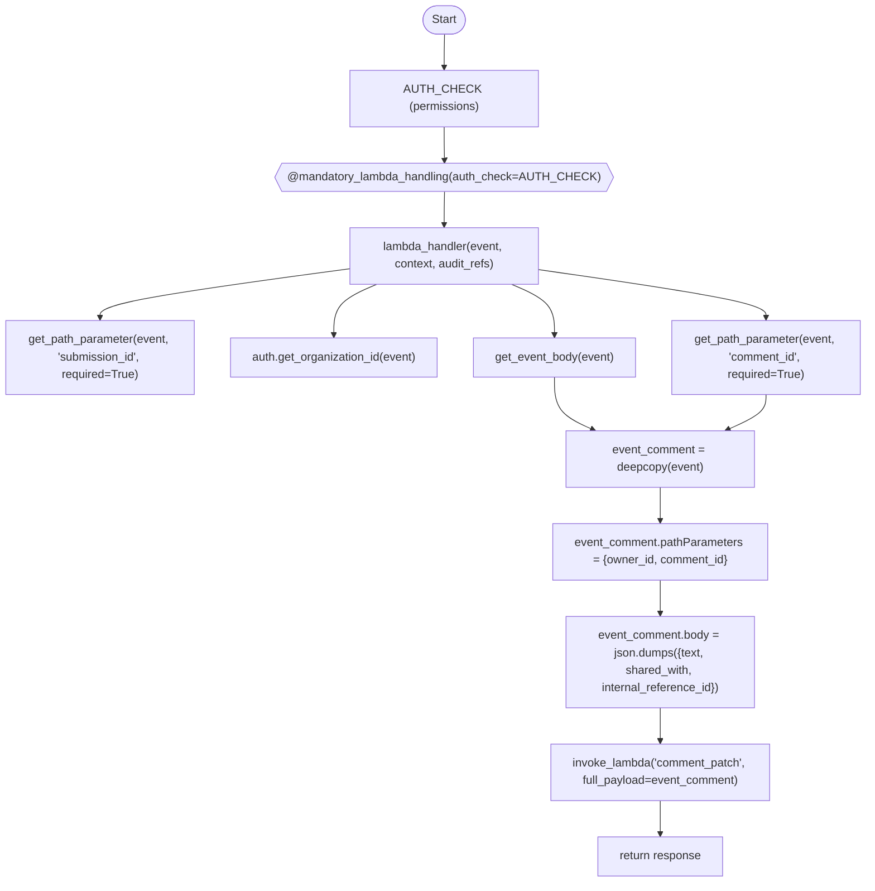
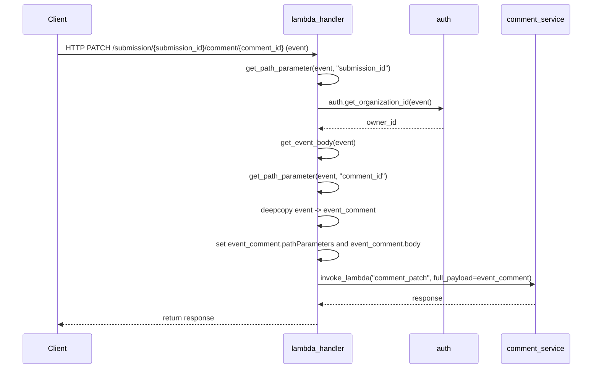

# Diagram: entity_core/entity_service/entity_service/damageview/comment/comment_patch.py

> Auto-generated by Obscura crawlers

## Diagram 1

### SVG

<svg id="container" width="1205.6875" xmlns="http://www.w3.org/2000/svg" class="flowchart" height="1192" viewBox="0 0 1205.6875 1192" role="graphics-document document" aria-roledescription="flowchart-v2"><g><marker id="container_flowchart-v2-pointEnd" class="marker flowchart-v2" viewBox="0 0 10 10" refX="5" refY="5" markerUnits="userSpaceOnUse" markerWidth="8" markerHeight="8" orient="auto"><path d="M 0 0 L 10 5 L 0 10 z" class="arrowMarkerPath" style="stroke-width: 1; stroke-dasharray: 1, 0;"></path></marker><marker id="container_flowchart-v2-pointStart" class="marker flowchart-v2" viewBox="0 0 10 10" refX="4.5" refY="5" markerUnits="userSpaceOnUse" markerWidth="8" markerHeight="8" orient="auto"><path d="M 0 5 L 10 10 L 10 0 z" class="arrowMarkerPath" style="stroke-width: 1; stroke-dasharray: 1, 0;"></path></marker><marker id="container_flowchart-v2-circleEnd" class="marker flowchart-v2" viewBox="0 0 10 10" refX="11" refY="5" markerUnits="userSpaceOnUse" markerWidth="11" markerHeight="11" orient="auto"><circle cx="5" cy="5" r="5" class="arrowMarkerPath" style="stroke-width: 1; stroke-dasharray: 1, 0;"></circle></marker><marker id="container_flowchart-v2-circleStart" class="marker flowchart-v2" viewBox="0 0 10 10" refX="-1" refY="5" markerUnits="userSpaceOnUse" markerWidth="11" markerHeight="11" orient="auto"><circle cx="5" cy="5" r="5" class="arrowMarkerPath" style="stroke-width: 1; stroke-dasharray: 1, 0;"></circle></marker><marker id="container_flowchart-v2-crossEnd" class="marker cross flowchart-v2" viewBox="0 0 11 11" refX="12" refY="5.2" markerUnits="userSpaceOnUse" markerWidth="11" markerHeight="11" orient="auto"><path d="M 1,1 l 9,9 M 10,1 l -9,9" class="arrowMarkerPath" style="stroke-width: 2; stroke-dasharray: 1, 0;"></path></marker><marker id="container_flowchart-v2-crossStart" class="marker cross flowchart-v2" viewBox="0 0 11 11" refX="-1" refY="5.2" markerUnits="userSpaceOnUse" markerWidth="11" markerHeight="11" orient="auto"><path d="M 1,1 l 9,9 M 10,1 l -9,9" class="arrowMarkerPath" style="stroke-width: 2; stroke-dasharray: 1, 0;"></path></marker><g class="root"><g class="clusters"></g><g class="edgePaths"><path d="M619.508,47.5L619.424,51.583C619.341,55.667,619.174,63.833,619.091,71.417C619.008,79,619.008,86,619.008,89.5L619.008,93" id="L_Start_AUTH_CHECK_0" class="edge-thickness-normal edge-pattern-solid edge-thickness-normal edge-pattern-solid flowchart-link" style=";" data-edge="true" data-et="edge" data-id="L_Start_AUTH_CHECK_0" data-points="W3sieCI6NjE5LjUwNzgxMjUsInkiOjQ3LjV9LHsieCI6NjE5LjAwNzgxMjUsInkiOjcyfSx7IngiOjYxOS4wMDc4MTI1LCJ5Ijo5N31d" marker-end="url(#container_flowchart-v2-pointEnd)"></path><path d="M619.008,151L619.008,155.167C619.008,159.333,619.008,167.667,619.078,175.417C619.148,183.167,619.289,190.334,619.359,193.917L619.429,197.501" id="L_AUTH_CHECK_Decorator_0" class="edge-thickness-normal edge-pattern-solid edge-thickness-normal edge-pattern-solid flowchart-link" style=";" data-edge="true" data-et="edge" data-id="L_AUTH_CHECK_Decorator_0" data-points="W3sieCI6NjE5LjAwNzgxMjUsInkiOjE1MX0seyJ4Ijo2MTkuMDA3ODEyNSwieSI6MTc2fSx7IngiOjYxOS41MDc4MTI1LCJ5IjoyMDEuNX1d" marker-end="url(#container_flowchart-v2-pointEnd)"></path><path d="M619.508,240.5L619.424,244.583C619.341,248.667,619.174,256.833,619.091,264.417C619.008,272,619.008,279,619.008,282.5L619.008,286" id="L_Decorator_Lambda_0" class="edge-thickness-normal edge-pattern-solid edge-thickness-normal edge-pattern-solid flowchart-link" style=";" data-edge="true" data-et="edge" data-id="L_Decorator_Lambda_0" data-points="W3sieCI6NjE5LjUwNzgxMjUsInkiOjI0MC41fSx7IngiOjYxOS4wMDc4MTI1LCJ5IjoyNjV9LHsieCI6NjE5LjAwNzgxMjUsInkiOjI5MH1d" marker-end="url(#container_flowchart-v2-pointEnd)"></path><path d="M489.008,346.32L430.615,354.1C372.221,361.88,255.435,377.44,197.042,388.72C138.648,400,138.648,407,138.648,410.5L138.648,414" id="L_Lambda_GetSubmission_0" class="edge-thickness-normal edge-pattern-solid edge-thickness-normal edge-pattern-solid flowchart-link" style=";" data-edge="true" data-et="edge" data-id="L_Lambda_GetSubmission_0" data-points="W3sieCI6NDg5LjAwNzgxMjUsInkiOjM0Ni4zMjAzNjU2MTE2ODM5NH0seyJ4IjoxMzguNjQ4NDM3NSwieSI6MzkzfSx7IngiOjEzOC42NDg0Mzc1LCJ5Ijo0MTh9XQ==" marker-end="url(#container_flowchart-v2-pointEnd)"></path><path d="M524.997,368L514.954,372.167C504.91,376.333,484.822,384.667,474.778,396.333C464.734,408,464.734,423,464.734,430.5L464.734,438" id="L_Lambda_GetOwner_0" class="edge-thickness-normal edge-pattern-solid edge-thickness-normal edge-pattern-solid flowchart-link" style=";" data-edge="true" data-et="edge" data-id="L_Lambda_GetOwner_0" data-points="W3sieCI6NTI0Ljk5NzQzNjUyMzQzNzUsInkiOjM2OH0seyJ4Ijo0NjQuNzM0Mzc1LCJ5IjozOTN9LHsieCI6NDY0LjczNDM3NSwieSI6NDQyfV0=" marker-end="url(#container_flowchart-v2-pointEnd)"></path><path d="M713.018,368L723.062,372.167C733.106,376.333,753.194,384.667,763.237,396.333C773.281,408,773.281,423,773.281,430.5L773.281,438" id="L_Lambda_GetBody_0" class="edge-thickness-normal edge-pattern-solid edge-thickness-normal edge-pattern-solid flowchart-link" style=";" data-edge="true" data-et="edge" data-id="L_Lambda_GetBody_0" data-points="W3sieCI6NzEzLjAxODE4ODQ3NjU2MjUsInkiOjM2OH0seyJ4Ijo3NzMuMjgxMjUsInkiOjM5M30seyJ4Ijo3NzMuMjgxMjUsInkiOjQ0Mn1d" marker-end="url(#container_flowchart-v2-pointEnd)"></path><path d="M749.008,347.57L802.013,355.142C855.018,362.713,961.029,377.857,1014.034,388.928C1067.039,400,1067.039,407,1067.039,410.5L1067.039,414" id="L_Lambda_GetComment_0" class="edge-thickness-normal edge-pattern-solid edge-thickness-normal edge-pattern-solid flowchart-link" style=";" data-edge="true" data-et="edge" data-id="L_Lambda_GetComment_0" data-points="W3sieCI6NzQ5LjAwNzgxMjUsInkiOjM0Ny41NzAxMzMyMjE3MzM5NX0seyJ4IjoxMDY3LjAzOTA2MjUsInkiOjM5M30seyJ4IjoxMDY3LjAzOTA2MjUsInkiOjQxOH1d" marker-end="url(#container_flowchart-v2-pointEnd)"></path><path d="M773.281,496L773.281,504.167C773.281,512.333,773.281,528.667,782.233,540.734C791.184,552.801,809.086,560.601,818.038,564.502L826.989,568.402" id="L_GetBody_Deepcopy_0" class="edge-thickness-normal edge-pattern-solid edge-thickness-normal edge-pattern-solid flowchart-link" style=";" data-edge="true" data-et="edge" data-id="L_GetBody_Deepcopy_0" data-points="W3sieCI6NzczLjI4MTI1LCJ5Ijo0OTZ9LHsieCI6NzczLjI4MTI1LCJ5Ijo1NDV9LHsieCI6ODMwLjY1NTgyMjc1MzkwNjIsInkiOjU3MH1d" marker-end="url(#container_flowchart-v2-pointEnd)"></path><path d="M1067.039,520L1067.039,524.167C1067.039,528.333,1067.039,536.667,1058.088,544.734C1049.137,552.801,1031.234,560.601,1022.283,564.502L1013.331,568.402" id="L_GetComment_Deepcopy_0" class="edge-thickness-normal edge-pattern-solid edge-thickness-normal edge-pattern-solid flowchart-link" style=";" data-edge="true" data-et="edge" data-id="L_GetComment_Deepcopy_0" data-points="W3sieCI6MTA2Ny4wMzkwNjI1LCJ5Ijo1MjB9LHsieCI6MTA2Ny4wMzkwNjI1LCJ5Ijo1NDV9LHsieCI6MTAwOS42NjQ0ODk3NDYwOTM4LCJ5Ijo1NzB9XQ==" marker-end="url(#container_flowchart-v2-pointEnd)"></path><path d="M920.16,648L920.16,652.167C920.16,656.333,920.16,664.667,920.16,672.333C920.16,680,920.16,687,920.16,690.5L920.16,694" id="L_Deepcopy_SetPath_0" class="edge-thickness-normal edge-pattern-solid edge-thickness-normal edge-pattern-solid flowchart-link" style=";" data-edge="true" data-et="edge" data-id="L_Deepcopy_SetPath_0" data-points="W3sieCI6OTIwLjE2MDE1NjI1LCJ5Ijo2NDh9LHsieCI6OTIwLjE2MDE1NjI1LCJ5Ijo2NzN9LHsieCI6OTIwLjE2MDE1NjI1LCJ5Ijo2OTh9XQ==" marker-end="url(#container_flowchart-v2-pointEnd)"></path><path d="M920.16,776L920.16,780.167C920.16,784.333,920.16,792.667,920.16,800.333C920.16,808,920.16,815,920.16,818.5L920.16,822" id="L_SetPath_SetBody_0" class="edge-thickness-normal edge-pattern-solid edge-thickness-normal edge-pattern-solid flowchart-link" style=";" data-edge="true" data-et="edge" data-id="L_SetPath_SetBody_0" data-points="W3sieCI6OTIwLjE2MDE1NjI1LCJ5Ijo3NzZ9LHsieCI6OTIwLjE2MDE1NjI1LCJ5Ijo4MDF9LHsieCI6OTIwLjE2MDE1NjI1LCJ5Ijo4MjZ9XQ==" marker-end="url(#container_flowchart-v2-pointEnd)"></path><path d="M920.16,952L920.16,956.167C920.16,960.333,920.16,968.667,920.16,976.333C920.16,984,920.16,991,920.16,994.5L920.16,998" id="L_SetBody_Invoke_0" class="edge-thickness-normal edge-pattern-solid edge-thickness-normal edge-pattern-solid flowchart-link" style=";" data-edge="true" data-et="edge" data-id="L_SetBody_Invoke_0" data-points="W3sieCI6OTIwLjE2MDE1NjI1LCJ5Ijo5NTJ9LHsieCI6OTIwLjE2MDE1NjI1LCJ5Ijo5Nzd9LHsieCI6OTIwLjE2MDE1NjI1LCJ5IjoxMDAyfV0=" marker-end="url(#container_flowchart-v2-pointEnd)"></path><path d="M920.16,1080L920.16,1084.167C920.16,1088.333,920.16,1096.667,920.16,1104.333C920.16,1112,920.16,1119,920.16,1122.5L920.16,1126" id="L_Invoke_Return_0" class="edge-thickness-normal edge-pattern-solid edge-thickness-normal edge-pattern-solid flowchart-link" style=";" data-edge="true" data-et="edge" data-id="L_Invoke_Return_0" data-points="W3sieCI6OTIwLjE2MDE1NjI1LCJ5IjoxMDgwfSx7IngiOjkyMC4xNjAxNTYyNSwieSI6MTEwNX0seyJ4Ijo5MjAuMTYwMTU2MjUsInkiOjExMzB9XQ==" marker-end="url(#container_flowchart-v2-pointEnd)"></path></g><g class="edgeLabels"><g class="edgeLabel"><g class="label" data-id="L_Start_AUTH_CHECK_0" transform="translate(0, 0)"><foreignObject width="0" height="0">

</foreignObject></g></g><g class="edgeLabel"><g class="label" data-id="L_AUTH_CHECK_Decorator_0" transform="translate(0, 0)"><foreignObject width="0" height="0">

</foreignObject></g></g><g class="edgeLabel"><g class="label" data-id="L_Decorator_Lambda_0" transform="translate(0, 0)"><foreignObject width="0" height="0">

</foreignObject></g></g><g class="edgeLabel"><g class="label" data-id="L_Lambda_GetSubmission_0" transform="translate(0, 0)"><foreignObject width="0" height="0">

</foreignObject></g></g><g class="edgeLabel"><g class="label" data-id="L_Lambda_GetOwner_0" transform="translate(0, 0)"><foreignObject width="0" height="0">

</foreignObject></g></g><g class="edgeLabel"><g class="label" data-id="L_Lambda_GetBody_0" transform="translate(0, 0)"><foreignObject width="0" height="0">

</foreignObject></g></g><g class="edgeLabel"><g class="label" data-id="L_Lambda_GetComment_0" transform="translate(0, 0)"><foreignObject width="0" height="0">

</foreignObject></g></g><g class="edgeLabel"><g class="label" data-id="L_GetBody_Deepcopy_0" transform="translate(0, 0)"><foreignObject width="0" height="0">

</foreignObject></g></g><g class="edgeLabel"><g class="label" data-id="L_GetComment_Deepcopy_0" transform="translate(0, 0)"><foreignObject width="0" height="0">

</foreignObject></g></g><g class="edgeLabel"><g class="label" data-id="L_Deepcopy_SetPath_0" transform="translate(0, 0)"><foreignObject width="0" height="0">

</foreignObject></g></g><g class="edgeLabel"><g class="label" data-id="L_SetPath_SetBody_0" transform="translate(0, 0)"><foreignObject width="0" height="0">

</foreignObject></g></g><g class="edgeLabel"><g class="label" data-id="L_SetBody_Invoke_0" transform="translate(0, 0)"><foreignObject width="0" height="0">

</foreignObject></g></g><g class="edgeLabel"><g class="label" data-id="L_Invoke_Return_0" transform="translate(0, 0)"><foreignObject width="0" height="0">

</foreignObject></g></g></g><g class="nodes"><g class="node default" id="flowchart-Start-0" transform="translate(619.0078125, 27.5)"><g class="basic label-container outer-path"><path d="M-10.3984375 -19.5 C-3.3057823724346767 -19.5, 3.7868727551306467 -19.5, 10.3984375 -19.5 C10.3984375 -19.5, 10.3984375 -19.5, 10.398437499999998 -19.5 C10.663074161987113 -19.49151361733409, 10.927710823974227 -19.483027234668175, 11.6478067896239 -19.45993515863156 C12.018200857197627 -19.424203688396762, 12.388594924771356 -19.38847221816196, 12.892042152847864 -19.3399052695533 C13.29295203471399 -19.275089268955753, 13.693861916580113 -19.210273268358208, 14.126030759676757 -19.140403561325776 C14.430209336325646 -19.070976786156383, 14.734387912974537 -19.00155001098699, 15.34470188623539 -18.862249829261074 C15.756684745387748 -18.739975479206812, 16.168667604540108 -18.61770112915255, 16.543047751460602 -18.50658706670804 C16.964620379488753 -18.351444442619027, 17.386193007516905 -18.19630181853001, 17.716144095147794 -18.074876768247425 C18.046254894899818 -17.928746509586155, 18.376365694651838 -17.782616250924885, 18.85917041279238 -17.568892924097174 C19.149478536689436 -17.417439361811308, 19.439786660586492 -17.265985799525442, 19.967429764076783 -16.990714730406097 C20.373209756580355 -16.744728514322507, 20.778989749083927 -16.498742298238913, 21.036368073605697 -16.342718045390892 C21.26072864969589 -16.18621381992318, 21.48508922578608 -16.029709594455465, 22.061592844578712 -15.627565626425154 C22.441435265118184 -15.324651404076246, 22.821277685657655 -15.021737181727339, 23.03889120850187 -14.848196188198123 C23.23533868325686 -14.669787789341, 23.43178615801185 -14.491379390483873, 23.964247236767985 -14.007812326905688 C24.213595554390043 -13.750339717083312, 24.462943872012097 -13.492867107260937, 24.833858442968648 -13.10986736009568 C25.118866596285137 -12.77508056578679, 25.403874749601627 -12.4402937714779, 25.644151408126582 -12.158051136245305 C25.908137432811618 -11.804333912788952, 26.172123457496657 -11.450616689332596, 26.391796464640635 -11.156274872382312 C26.572680658716607 -10.878388176074477, 26.753564852792582 -10.600501479766642, 27.073721378604247 -10.108655082055241 C27.26158751527449 -9.775079732888052, 27.44945365194473 -9.441504383720861, 27.6871239742735 -9.019496659696287 C27.88755009575273 -8.603307530012659, 28.08797621723196 -8.187118400329032, 28.22948364880834 -7.893275190886684 C28.369082513903656 -7.548463295140811, 28.50868137899897 -7.203651399394938, 28.698571729970325 -6.734618561215508 C28.824506155154094 -6.355324137487782, 28.95044058033786 -5.976029713760056, 29.09246063421488 -5.548287939305138 C29.21578473662152 -5.077999687824546, 29.339108839028157 -4.607711436343955, 29.40953178754556 -4.339158212148133 C29.466617980514307 -4.046032676424779, 29.523704173483054 -3.7529071407014243, 29.648482276581777 -3.1121979531509023 C29.693706824220325 -2.7614452922633914, 29.738931371858868 -2.4106926313758805, 29.808330202509367 -1.872449005199798 C29.829480833098643 -1.5430108612900983, 29.850631463687918 -1.2135727173803987, 29.888418715913414 -0.6250057626472757 C29.888418715913414 -0.25609085960125927, 29.888418715913414 0.11282404344475716, 29.888418715913414 0.625005762647271 C29.85694787820041 1.1151894628303283, 29.825477040487403 1.6053731630133856, 29.808330202509367 1.8724490051997846 C29.74974973193084 2.3267875669844917, 29.691169261352314 2.781126128769199, 29.648482276581777 3.1121979531508885 C29.56343036227812 3.548921557371726, 29.47837844797446 3.9856451615925637, 29.40953178754556 4.339158212148129 C29.31243886267246 4.709415615029087, 29.21534593779936 5.079673017910046, 29.092460634214884 5.548287939305125 C28.943179971450327 5.997897510908373, 28.793899308685774 6.447507082511621, 28.69857172997033 6.734618561215495 C28.55937098079104 7.07844710295174, 28.42017023161175 7.4222756446879865, 28.229483648808344 7.893275190886679 C28.105082521889592 8.151596792691178, 27.98068139497084 8.409918394495678, 27.687123974273504 9.019496659696284 C27.50519607739975 9.34252806279283, 27.323268180525993 9.665559465889377, 27.07372137860425 10.108655082055236 C26.817988781365155 10.501529025232086, 26.56225618412606 10.894402968408937, 26.39179646464064 11.156274872382301 C26.108506405752987 11.535857743036471, 25.82521634686533 11.91544061369064, 25.644151408126582 12.158051136245302 C25.353995028096573 12.498885330594295, 25.06383864806656 12.839719524943286, 24.83385844296866 13.10986736009567 C24.617815667139332 13.332949263581217, 24.401772891310006 13.556031167066763, 23.96424723676799 14.007812326905684 C23.715710051052188 14.23352722303919, 23.46717286533639 14.459242119172695, 23.038891208501887 14.848196188198111 C22.70886368312527 15.111384357284676, 22.37883615774865 15.37457252637124, 22.061592844578715 15.627565626425152 C21.699043962823357 15.88046403184955, 21.336495081067998 16.13336243727395, 21.036368073605708 16.34271804539089 C20.695230788490942 16.54951747237267, 20.354093503376173 16.756316899354452, 19.967429764076787 16.990714730406093 C19.53716241844233 17.2151849290242, 19.106895072807873 17.43965512764231, 18.859170412792388 17.56889292409717 C18.522874185886565 17.717761287875252, 18.18657795898074 17.86662965165333, 17.716144095147804 18.07487676824742 C17.441612111853008 18.17590707584574, 17.167080128558208 18.27693738344406, 16.543047751460616 18.506587066708033 C16.072314250619403 18.646298298827137, 15.601580749778194 18.78600953094624, 15.344701886235413 18.86224982926107 C14.964477997328501 18.94903345071132, 14.584254108421588 19.035817072161567, 14.126030759676766 19.140403561325773 C13.72393335456866 19.205411551471702, 13.321835949460553 19.270419541617635, 12.892042152847878 19.3399052695533 C12.53353879648159 19.374489657178586, 12.175035440115302 19.409074044803877, 11.6478067896239 19.45993515863156 C11.324887846617433 19.470290540610183, 11.001968903610965 19.48064592258881, 10.398437500000004 19.5 C10.398437500000002 19.5, 10.398437500000002 19.5, 10.3984375 19.5 C6.158063721105062 19.5, 1.9176899422101243 19.5, -10.398437499999996 19.5 C-10.818039940107752 19.486544166452347, -11.23764238021551 19.473088332904695, -11.647806789623893 19.45993515863156 C-12.078419797190362 19.418394439679535, -12.50903280475683 19.376853720727507, -12.892042152847871 19.3399052695533 C-13.315446023625308 19.27145261527206, -13.738849894402744 19.20299996099082, -14.126030759676759 19.140403561325773 C-14.513278284835417 19.052016840734574, -14.900525809994075 18.963630120143375, -15.344701886235388 18.862249829261074 C-15.595950893091365 18.78768044285917, -15.84719989994734 18.713111056457265, -16.54304775146059 18.506587066708043 C-16.869989317246066 18.386269548284286, -17.19693088303154 18.265952029860525, -17.716144095147797 18.074876768247425 C-18.06164881326616 17.92193207856974, -18.407153531384523 17.768987388892054, -18.85917041279238 17.568892924097174 C-19.204690762047914 17.388635179206908, -19.550211111303447 17.208377434316642, -19.96742976407678 16.990714730406097 C-20.27313672822363 16.805393372206744, -20.578843692370477 16.62007201400739, -21.036368073605686 16.3427180453909 C-21.387835544976355 16.09754955214434, -21.739303016347023 15.85238105889778, -22.061592844578712 15.627565626425156 C-22.367279294946115 15.383788816915231, -22.672965745313515 15.140012007405305, -23.03889120850187 14.848196188198125 C-23.386627783570574 14.532391031326327, -23.73436435863928 14.216585874454527, -23.964247236767974 14.007812326905697 C-24.300345498429646 13.660763277559557, -24.636443760091318 13.313714228213419, -24.833858442968655 13.109867360095677 C-25.127950751961663 12.764409799626044, -25.422043060954675 12.41895223915641, -25.64415140812658 12.158051136245307 C-25.818101680007825 11.924973619120214, -25.99205195188907 11.69189610199512, -26.391796464640635 11.156274872382316 C-26.646535176620905 10.76492780385858, -26.901273888601178 10.373580735334844, -27.073721378604244 10.108655082055249 C-27.27200476417367 9.756582852606725, -27.47028814974309 9.4045106231582, -27.6871239742735 9.019496659696289 C-27.850465615132272 8.680314247501812, -28.013807255991047 8.341131835307337, -28.22948364880834 7.893275190886686 C-28.400762241919676 7.47021375445537, -28.572040835031007 7.047152318024056, -28.698571729970325 6.73461856121551 C-28.819209293492616 6.37127744087185, -28.93984685701491 6.00793632052819, -29.09246063421488 5.5482879393051325 C-29.172561478728912 5.242828703247513, -29.252662323242944 4.9373694671898924, -29.409531787545557 4.339158212148136 C-29.461070765764703 4.074516451759733, -29.512609743983848 3.8098746913713293, -29.648482276581777 3.112197953150904 C-29.690091240228288 2.789487047727815, -29.731700203874794 2.4667761423047256, -29.808330202509364 1.872449005199809 C-29.827118797291014 1.579801475594873, -29.845907392072665 1.287153945989937, -29.888418715913414 0.6250057626472781 C-29.888418715913414 0.29205974081750186, -29.888418715913414 -0.04088628101227443, -29.888418715913414 -0.6250057626472687 C-29.862050245069778 -1.035715980283504, -29.83568177422614 -1.4464261979197395, -29.808330202509367 -1.8724490051997822 C-29.751035457485216 -2.316815733479985, -29.693740712461064 -2.7611824617601877, -29.648482276581777 -3.112197953150895 C-29.570508603730794 -3.5125762834991003, -29.49253493087981 -3.9129546138473055, -29.40953178754556 -4.339158212148126 C-29.290745101225582 -4.792143329561723, -29.1719584149056 -5.24512844697532, -29.092460634214884 -5.548287939305123 C-28.935178571952196 -6.021996451346867, -28.77789650968951 -6.4957049633886115, -28.698571729970332 -6.734618561215485 C-28.515563185847636 -7.186653203428042, -28.33255464172494 -7.638687845640599, -28.229483648808344 -7.893275190886676 C-28.02885688878334 -8.309880950803576, -27.828230128758342 -8.726486710720474, -27.687123974273504 -9.019496659696282 C-27.451633276280138 -9.437634240002447, -27.216142578286775 -9.855771820308615, -27.073721378604247 -10.108655082055243 C-26.86429962595288 -10.430383131742339, -26.654877873301515 -10.752111181429434, -26.39179646464064 -11.156274872382308 C-26.14095682490889 -11.492377137661567, -25.89011718517714 -11.828479402940824, -25.644151408126586 -12.158051136245302 C-25.358198914800784 -12.4939472060636, -25.072246421474983 -12.8298432758819, -24.833858442968662 -13.10986736009567 C-24.539886586425272 -13.413417437515003, -24.24591472988188 -13.716967514934336, -23.964247236767996 -14.007812326905677 C-23.737485977267177 -14.21375090301017, -23.51072471776636 -14.419689479114663, -23.038891208501887 -14.848196188198107 C-22.744626575306125 -15.082864402460972, -22.450361942110362 -15.317532616723835, -22.06159284457872 -15.627565626425149 C-21.666787583581662 -15.902964685652405, -21.271982322584606 -16.17836374487966, -21.03636807360571 -16.342718045390885 C-20.624049448935168 -16.592668018719362, -20.211730824264627 -16.84261799204784, -19.96742976407679 -16.99071473040609 C-19.601001616274505 -17.18188006040611, -19.234573468472217 -17.373045390406137, -18.859170412792388 -17.56889292409717 C-18.42708294758448 -17.76016522752546, -17.99499548237657 -17.95143753095375, -17.716144095147804 -18.07487676824742 C-17.454232054028527 -18.171262820467682, -17.192320012909246 -18.267648872687946, -16.54304775146062 -18.506587066708033 C-16.121979842982288 -18.631557811713847, -15.700911934503955 -18.756528556719662, -15.344701886235413 -18.862249829261067 C-15.011683445794858 -18.938259115143207, -14.678665005354306 -19.01426840102535, -14.126030759676768 -19.140403561325773 C-13.695986802573277 -19.20992973326957, -13.265942845469787 -19.279455905213364, -12.89204215284788 -19.3399052695533 C-12.604658568532708 -19.367628818302855, -12.317274984217534 -19.395352367052414, -11.647806789623903 -19.45993515863156 C-11.154278551938697 -19.475761648619685, -10.660750314253491 -19.49158813860781, -10.398437500000005 -19.5 C-10.398437500000004 -19.5, -10.398437500000002 -19.5, -10.3984375 -19.5" stroke="none" stroke-width="0" fill="#ECECFF" style=""></path><path d="M-10.3984375 -19.5 C-2.706808701482897 -19.5, 4.984820097034206 -19.5, 10.3984375 -19.5 M-10.3984375 -19.5 C-3.1900144723514945 -19.5, 4.018408555297011 -19.5, 10.3984375 -19.5 M10.3984375 -19.5 C10.3984375 -19.5, 10.398437499999998 -19.5, 10.398437499999998 -19.5 M10.3984375 -19.5 C10.3984375 -19.5, 10.398437499999998 -19.5, 10.398437499999998 -19.5 M10.398437499999998 -19.5 C10.786776570447683 -19.487546721866888, 11.175115640895367 -19.475093443733776, 11.6478067896239 -19.45993515863156 M10.398437499999998 -19.5 C10.71681722946097 -19.489790181764736, 11.03519695892194 -19.47958036352947, 11.6478067896239 -19.45993515863156 M11.6478067896239 -19.45993515863156 C12.025926383249708 -19.42345841618982, 12.404045976875516 -19.386981673748082, 12.892042152847864 -19.3399052695533 M11.6478067896239 -19.45993515863156 C12.036958887687675 -19.42239412375522, 12.42611098575145 -19.384853088878877, 12.892042152847864 -19.3399052695533 M12.892042152847864 -19.3399052695533 C13.27275076851862 -19.27835525301106, 13.653459384189375 -19.216805236468822, 14.126030759676757 -19.140403561325776 M12.892042152847864 -19.3399052695533 C13.329244563910999 -19.26922177428795, 13.766446974974132 -19.198538279022596, 14.126030759676757 -19.140403561325776 M14.126030759676757 -19.140403561325776 C14.443823904542995 -19.067869349804134, 14.761617049409233 -18.995335138282492, 15.34470188623539 -18.862249829261074 M14.126030759676757 -19.140403561325776 C14.403666947364858 -19.077034913231408, 14.681303135052957 -19.01366626513704, 15.34470188623539 -18.862249829261074 M15.34470188623539 -18.862249829261074 C15.611969360295637 -18.782926245875593, 15.879236834355883 -18.703602662490113, 16.543047751460602 -18.50658706670804 M15.34470188623539 -18.862249829261074 C15.597871028023807 -18.787110556890216, 15.851040169812224 -18.711971284519358, 16.543047751460602 -18.50658706670804 M16.543047751460602 -18.50658706670804 C16.952769084470653 -18.355805828737857, 17.3624904174807 -18.205024590767675, 17.716144095147794 -18.074876768247425 M16.543047751460602 -18.50658706670804 C16.964625922894033 -18.35144240259464, 17.386204094327464 -18.196297738481242, 17.716144095147794 -18.074876768247425 M17.716144095147794 -18.074876768247425 C18.071698647860174 -17.91748331491272, 18.42725320057255 -17.760089861578017, 18.85917041279238 -17.568892924097174 M17.716144095147794 -18.074876768247425 C18.13223150195391 -17.89068721604874, 18.54831890876003 -17.706497663850055, 18.85917041279238 -17.568892924097174 M18.85917041279238 -17.568892924097174 C19.260697504230553 -17.359416497684258, 19.662224595668725 -17.149940071271338, 19.967429764076783 -16.990714730406097 M18.85917041279238 -17.568892924097174 C19.16826813601894 -17.407636839876417, 19.477365859245502 -17.24638075565566, 19.967429764076783 -16.990714730406097 M19.967429764076783 -16.990714730406097 C20.351645653127353 -16.757800800560453, 20.735861542177922 -16.52488687071481, 21.036368073605697 -16.342718045390892 M19.967429764076783 -16.990714730406097 C20.258701310838028 -16.814144207057826, 20.549972857599272 -16.637573683709554, 21.036368073605697 -16.342718045390892 M21.036368073605697 -16.342718045390892 C21.393355240638684 -16.093699251394074, 21.750342407671667 -15.844680457397255, 22.061592844578712 -15.627565626425154 M21.036368073605697 -16.342718045390892 C21.41952164136561 -16.0754467029722, 21.802675209125525 -15.808175360553507, 22.061592844578712 -15.627565626425154 M22.061592844578712 -15.627565626425154 C22.263696993432827 -15.46639294593127, 22.46580114228694 -15.305220265437386, 23.03889120850187 -14.848196188198123 M22.061592844578712 -15.627565626425154 C22.30795426128717 -15.43109895255279, 22.554315677995625 -15.234632278680428, 23.03889120850187 -14.848196188198123 M23.03889120850187 -14.848196188198123 C23.395282238452374 -14.524531284387004, 23.751673268402875 -14.200866380575883, 23.964247236767985 -14.007812326905688 M23.03889120850187 -14.848196188198123 C23.27693048442825 -14.632015215975896, 23.51496976035463 -14.41583424375367, 23.964247236767985 -14.007812326905688 M23.964247236767985 -14.007812326905688 C24.249555992888848 -13.713207611926387, 24.53486474900971 -13.418602896947085, 24.833858442968648 -13.10986736009568 M23.964247236767985 -14.007812326905688 C24.307103606505546 -13.6537849761202, 24.649959976243107 -13.29975762533471, 24.833858442968648 -13.10986736009568 M24.833858442968648 -13.10986736009568 C25.004904045361563 -12.90894746275447, 25.17594964775448 -12.70802756541326, 25.644151408126582 -12.158051136245305 M24.833858442968648 -13.10986736009568 C25.1478262416951 -12.741062918437745, 25.461794040421548 -12.372258476779809, 25.644151408126582 -12.158051136245305 M25.644151408126582 -12.158051136245305 C25.850900837427833 -11.881025736242117, 26.05765026672908 -11.604000336238927, 26.391796464640635 -11.156274872382312 M25.644151408126582 -12.158051136245305 C25.830596985633232 -11.90823104792793, 26.01704256313988 -11.658410959610555, 26.391796464640635 -11.156274872382312 M26.391796464640635 -11.156274872382312 C26.559892000871443 -10.89803498876012, 26.727987537102255 -10.639795105137928, 27.073721378604247 -10.108655082055241 M26.391796464640635 -11.156274872382312 C26.586218937945443 -10.85758974364199, 26.780641411250254 -10.558904614901667, 27.073721378604247 -10.108655082055241 M27.073721378604247 -10.108655082055241 C27.256165199210457 -9.784707604128782, 27.438609019816667 -9.46076012620232, 27.6871239742735 -9.019496659696287 M27.073721378604247 -10.108655082055241 C27.25307180676013 -9.790200235664289, 27.43242223491601 -9.471745389273336, 27.6871239742735 -9.019496659696287 M27.6871239742735 -9.019496659696287 C27.81366831234661 -8.756724634072388, 27.940212650419724 -8.49395260844849, 28.22948364880834 -7.893275190886684 M27.6871239742735 -9.019496659696287 C27.891776026967687 -8.59453229342436, 28.096428079661873 -8.16956792715243, 28.22948364880834 -7.893275190886684 M28.22948364880834 -7.893275190886684 C28.35722455273354 -7.577752688489072, 28.484965456658742 -7.262230186091461, 28.698571729970325 -6.734618561215508 M28.22948364880834 -7.893275190886684 C28.37695841469717 -7.52900966791064, 28.524433180586005 -7.164744144934596, 28.698571729970325 -6.734618561215508 M28.698571729970325 -6.734618561215508 C28.782435222770175 -6.482035082735363, 28.866298715570025 -6.229451604255219, 29.09246063421488 -5.548287939305138 M28.698571729970325 -6.734618561215508 C28.84041304773053 -6.307415111466711, 28.982254365490732 -5.880211661717914, 29.09246063421488 -5.548287939305138 M29.09246063421488 -5.548287939305138 C29.21337107120933 -5.0872040401304215, 29.33428150820378 -4.626120140955705, 29.40953178754556 -4.339158212148133 M29.09246063421488 -5.548287939305138 C29.18743907669317 -5.186093974218065, 29.282417519171457 -4.823900009130991, 29.40953178754556 -4.339158212148133 M29.40953178754556 -4.339158212148133 C29.493575510221888 -3.907611458852275, 29.577619232898215 -3.476064705556417, 29.648482276581777 -3.1121979531509023 M29.40953178754556 -4.339158212148133 C29.465868771737785 -4.049879705146879, 29.522205755930013 -3.760601198145625, 29.648482276581777 -3.1121979531509023 M29.648482276581777 -3.1121979531509023 C29.690294138463855 -2.787913409079522, 29.732106000345937 -2.4636288650081415, 29.808330202509367 -1.872449005199798 M29.648482276581777 -3.1121979531509023 C29.684454024572414 -2.833208179160626, 29.720425772563047 -2.5542184051703494, 29.808330202509367 -1.872449005199798 M29.808330202509367 -1.872449005199798 C29.83292196043831 -1.4894125253468067, 29.85751371836725 -1.1063760454938154, 29.888418715913414 -0.6250057626472757 M29.808330202509367 -1.872449005199798 C29.826115610664367 -1.5954269170626094, 29.843901018819366 -1.3184048289254209, 29.888418715913414 -0.6250057626472757 M29.888418715913414 -0.6250057626472757 C29.888418715913414 -0.34444878118652456, 29.888418715913414 -0.06389179972577341, 29.888418715913414 0.625005762647271 M29.888418715913414 -0.6250057626472757 C29.888418715913414 -0.13363354082318574, 29.888418715913414 0.3577386810009042, 29.888418715913414 0.625005762647271 M29.888418715913414 0.625005762647271 C29.863162080804386 1.0183982412592791, 29.837905445695363 1.4117907198712871, 29.808330202509367 1.8724490051997846 M29.888418715913414 0.625005762647271 C29.869782642860574 0.9152776432126666, 29.851146569807735 1.2055495237780622, 29.808330202509367 1.8724490051997846 M29.808330202509367 1.8724490051997846 C29.756911291160993 2.2712439278052616, 29.70549237981262 2.6700388504107386, 29.648482276581777 3.1121979531508885 M29.808330202509367 1.8724490051997846 C29.75816690814786 2.261505610404743, 29.70800361378635 2.650562215609701, 29.648482276581777 3.1121979531508885 M29.648482276581777 3.1121979531508885 C29.594806019058215 3.3878141910533386, 29.541129761534652 3.6634304289557886, 29.40953178754556 4.339158212148129 M29.648482276581777 3.1121979531508885 C29.569546405769607 3.5175169666691857, 29.490610534957437 3.9228359801874833, 29.40953178754556 4.339158212148129 M29.40953178754556 4.339158212148129 C29.343939856765616 4.589288671934685, 29.27834792598567 4.8394191317212405, 29.092460634214884 5.548287939305125 M29.40953178754556 4.339158212148129 C29.345694894510537 4.58259595237513, 29.281858001475513 4.826033692602133, 29.092460634214884 5.548287939305125 M29.092460634214884 5.548287939305125 C28.99797174483332 5.832873419362352, 28.903482855451756 6.117458899419578, 28.69857172997033 6.734618561215495 M29.092460634214884 5.548287939305125 C28.955596030789994 5.960502318407707, 28.818731427365105 6.372716697510288, 28.69857172997033 6.734618561215495 M28.69857172997033 6.734618561215495 C28.54939156150462 7.103096461528141, 28.400211393038912 7.471574361840787, 28.229483648808344 7.893275190886679 M28.69857172997033 6.734618561215495 C28.556817891040097 7.0847532839972045, 28.415064052109862 7.434888006778915, 28.229483648808344 7.893275190886679 M28.229483648808344 7.893275190886679 C28.096359651531795 8.169710019628669, 27.96323565425525 8.446144848370658, 27.687123974273504 9.019496659696284 M28.229483648808344 7.893275190886679 C28.035714551587056 8.295640867261193, 27.841945454365764 8.698006543635707, 27.687123974273504 9.019496659696284 M27.687123974273504 9.019496659696284 C27.53212516193762 9.294712746330339, 27.377126349601735 9.569928832964393, 27.07372137860425 10.108655082055236 M27.687123974273504 9.019496659696284 C27.48332783795188 9.381357336331885, 27.279531701630255 9.743218012967485, 27.07372137860425 10.108655082055236 M27.07372137860425 10.108655082055236 C26.83259922265776 10.479083463953822, 26.59147706671127 10.84951184585241, 26.39179646464064 11.156274872382301 M27.07372137860425 10.108655082055236 C26.85010857891616 10.452184390820435, 26.62649577922807 10.795713699585631, 26.39179646464064 11.156274872382301 M26.39179646464064 11.156274872382301 C26.09651018719375 11.551931583027853, 25.80122390974686 11.947588293673405, 25.644151408126582 12.158051136245302 M26.39179646464064 11.156274872382301 C26.12305061827212 11.516369823265846, 25.854304771903603 11.87646477414939, 25.644151408126582 12.158051136245302 M25.644151408126582 12.158051136245302 C25.323382176246064 12.534844928298519, 25.00261294436554 12.911638720351737, 24.83385844296866 13.10986736009567 M25.644151408126582 12.158051136245302 C25.400900471122398 12.443787528220842, 25.15764953411821 12.729523920196383, 24.83385844296866 13.10986736009567 M24.83385844296866 13.10986736009567 C24.58174611656468 13.37019403591472, 24.329633790160706 13.630520711733768, 23.96424723676799 14.007812326905684 M24.83385844296866 13.10986736009567 C24.522102988588887 13.431780462341601, 24.210347534209117 13.753693564587534, 23.96424723676799 14.007812326905684 M23.96424723676799 14.007812326905684 C23.68278286815733 14.263430819338785, 23.401318499546665 14.519049311771886, 23.038891208501887 14.848196188198111 M23.96424723676799 14.007812326905684 C23.751999315603694 14.200570273134836, 23.539751394439403 14.393328219363989, 23.038891208501887 14.848196188198111 M23.038891208501887 14.848196188198111 C22.657950278728848 15.151986442428232, 22.277009348955808 15.455776696658353, 22.061592844578715 15.627565626425152 M23.038891208501887 14.848196188198111 C22.7113684586738 15.1093868654396, 22.383845708845715 15.370577542681087, 22.061592844578715 15.627565626425152 M22.061592844578715 15.627565626425152 C21.698442384699973 15.880883666706525, 21.335291924821234 16.1342017069879, 21.036368073605708 16.34271804539089 M22.061592844578715 15.627565626425152 C21.699333861320188 15.880261811207665, 21.33707487806166 16.13295799599018, 21.036368073605708 16.34271804539089 M21.036368073605708 16.34271804539089 C20.660914175913508 16.57032040458391, 20.285460278221308 16.797922763776935, 19.967429764076787 16.990714730406093 M21.036368073605708 16.34271804539089 C20.711226071642987 16.539821037727183, 20.386084069680262 16.73692403006348, 19.967429764076787 16.990714730406093 M19.967429764076787 16.990714730406093 C19.593628445444008 17.185726638905642, 19.21982712681123 17.38073854740519, 18.859170412792388 17.56889292409717 M19.967429764076787 16.990714730406093 C19.62221791097016 17.170811533053076, 19.27700605786353 17.35090833570006, 18.859170412792388 17.56889292409717 M18.859170412792388 17.56889292409717 C18.591687404231276 17.687299717385642, 18.324204395670165 17.805706510674113, 17.716144095147804 18.07487676824742 M18.859170412792388 17.56889292409717 C18.460003868536432 17.74559211238445, 18.06083732428048 17.922291300671734, 17.716144095147804 18.07487676824742 M17.716144095147804 18.07487676824742 C17.257849734285827 18.24353332947126, 16.799555373423846 18.4121898906951, 16.543047751460616 18.506587066708033 M17.716144095147804 18.07487676824742 C17.4174292872084 18.184806578858538, 17.118714479268995 18.29473638946965, 16.543047751460616 18.506587066708033 M16.543047751460616 18.506587066708033 C16.23138463005026 18.59908704518952, 15.919721508639904 18.691587023671005, 15.344701886235413 18.86224982926107 M16.543047751460616 18.506587066708033 C16.2447650967485 18.595115792908985, 15.946482442036384 18.683644519109937, 15.344701886235413 18.86224982926107 M15.344701886235413 18.86224982926107 C14.910883897383242 18.961265954289637, 14.47706590853107 19.060282079318203, 14.126030759676766 19.140403561325773 M15.344701886235413 18.86224982926107 C14.894979286833474 18.964896077860338, 14.445256687431533 19.067542326459606, 14.126030759676766 19.140403561325773 M14.126030759676766 19.140403561325773 C13.658964158538975 19.215915267242142, 13.191897557401184 19.29142697315851, 12.892042152847878 19.3399052695533 M14.126030759676766 19.140403561325773 C13.701619966969881 19.20901900693577, 13.277209174262998 19.277634452545765, 12.892042152847878 19.3399052695533 M12.892042152847878 19.3399052695533 C12.448642630701661 19.3826794881888, 12.005243108555442 19.4254537068243, 11.6478067896239 19.45993515863156 M12.892042152847878 19.3399052695533 C12.415830612713393 19.385844824101902, 11.939619072578909 19.431784378650505, 11.6478067896239 19.45993515863156 M11.6478067896239 19.45993515863156 C11.271208594365866 19.472011929749566, 10.894610399107835 19.484088700867574, 10.398437500000004 19.5 M11.6478067896239 19.45993515863156 C11.212101565059815 19.47390737713456, 10.776396340495728 19.487879595637555, 10.398437500000004 19.5 M10.398437500000004 19.5 C10.398437500000002 19.5, 10.3984375 19.5, 10.3984375 19.5 M10.398437500000004 19.5 C10.398437500000004 19.5, 10.398437500000002 19.5, 10.3984375 19.5 M10.3984375 19.5 C6.099746941675024 19.5, 1.8010563833500477 19.5, -10.398437499999996 19.5 M10.3984375 19.5 C3.5785984178878962 19.5, -3.2412406642242075 19.5, -10.398437499999996 19.5 M-10.398437499999996 19.5 C-10.82300638520245 19.48638490222476, -11.247575270404903 19.47276980444952, -11.647806789623893 19.45993515863156 M-10.398437499999996 19.5 C-10.791475081676044 19.487396049756892, -11.184512663352091 19.474792099513785, -11.647806789623893 19.45993515863156 M-11.647806789623893 19.45993515863156 C-11.930567509034468 19.43265757209954, -12.213328228445045 19.40537998556752, -12.892042152847871 19.3399052695533 M-11.647806789623893 19.45993515863156 C-12.10192813597339 19.41612661851005, -12.556049482322887 19.37231807838854, -12.892042152847871 19.3399052695533 M-12.892042152847871 19.3399052695533 C-13.311576476857965 19.27207821358462, -13.731110800868057 19.204251157615943, -14.126030759676759 19.140403561325773 M-12.892042152847871 19.3399052695533 C-13.243322419703507 19.283113000227235, -13.594602686559144 19.226320730901172, -14.126030759676759 19.140403561325773 M-14.126030759676759 19.140403561325773 C-14.563050337734575 19.04065669445334, -15.000069915792393 18.940909827580906, -15.344701886235388 18.862249829261074 M-14.126030759676759 19.140403561325773 C-14.380021898623962 19.082431741308152, -14.634013037571163 19.024459921290532, -15.344701886235388 18.862249829261074 M-15.344701886235388 18.862249829261074 C-15.724091808846076 18.749648891688565, -16.103481731456764 18.637047954116056, -16.54304775146059 18.506587066708043 M-15.344701886235388 18.862249829261074 C-15.641281189003754 18.77422664897595, -15.93786049177212 18.68620346869083, -16.54304775146059 18.506587066708043 M-16.54304775146059 18.506587066708043 C-16.966800653539305 18.35064208161419, -17.390553555618023 18.194697096520336, -17.716144095147797 18.074876768247425 M-16.54304775146059 18.506587066708043 C-16.99908237264933 18.338762110572763, -17.455116993838065 18.17093715443748, -17.716144095147797 18.074876768247425 M-17.716144095147797 18.074876768247425 C-17.95954864057289 17.967128796327035, -18.202953185997988 17.859380824406646, -18.85917041279238 17.568892924097174 M-17.716144095147797 18.074876768247425 C-18.11673851598467 17.897545501354223, -18.517332936821543 17.72021423446102, -18.85917041279238 17.568892924097174 M-18.85917041279238 17.568892924097174 C-19.12072191507848 17.43244167288625, -19.38227341736458 17.295990421675324, -19.96742976407678 16.990714730406097 M-18.85917041279238 17.568892924097174 C-19.257074825201716 17.361306447013163, -19.65497923761105 17.153719969929153, -19.96742976407678 16.990714730406097 M-19.96742976407678 16.990714730406097 C-20.22961658354609 16.831775539663024, -20.491803403015403 16.672836348919954, -21.036368073605686 16.3427180453909 M-19.96742976407678 16.990714730406097 C-20.36892342053562 16.74732691642213, -20.770417076994462 16.50393910243816, -21.036368073605686 16.3427180453909 M-21.036368073605686 16.3427180453909 C-21.35499316196656 16.120458976808123, -21.67361825032744 15.898199908225347, -22.061592844578712 15.627565626425156 M-21.036368073605686 16.3427180453909 C-21.290393193128626 16.16552111858189, -21.544418312651562 15.988324191772879, -22.061592844578712 15.627565626425156 M-22.061592844578712 15.627565626425156 C-22.277138572922293 15.455673643983873, -22.492684301265875 15.28378166154259, -23.03889120850187 14.848196188198125 M-22.061592844578712 15.627565626425156 C-22.321177711904507 15.420553602576263, -22.580762579230306 15.213541578727371, -23.03889120850187 14.848196188198125 M-23.03889120850187 14.848196188198125 C-23.34911147491695 14.566462350218416, -23.65933174133203 14.284728512238706, -23.964247236767974 14.007812326905697 M-23.03889120850187 14.848196188198125 C-23.23397858119461 14.671022998047606, -23.42906595388735 14.493849807897089, -23.964247236767974 14.007812326905697 M-23.964247236767974 14.007812326905697 C-24.139289022102364 13.827067312350096, -24.314330807436757 13.646322297794494, -24.833858442968655 13.109867360095677 M-23.964247236767974 14.007812326905697 C-24.145079970800218 13.821087682373832, -24.32591270483246 13.63436303784197, -24.833858442968655 13.109867360095677 M-24.833858442968655 13.109867360095677 C-25.09505681275372 12.803048892337856, -25.356255182538792 12.496230424580034, -25.64415140812658 12.158051136245307 M-24.833858442968655 13.109867360095677 C-25.092499163307984 12.806053252911196, -25.351139883647313 12.502239145726717, -25.64415140812658 12.158051136245307 M-25.64415140812658 12.158051136245307 C-25.927625360324885 11.778221865307893, -26.211099312523192 11.398392594370478, -26.391796464640635 11.156274872382316 M-25.64415140812658 12.158051136245307 C-25.916503848612454 11.793123677811993, -26.188856289098325 11.428196219378677, -26.391796464640635 11.156274872382316 M-26.391796464640635 11.156274872382316 C-26.55014830012473 10.91300392965708, -26.708500135608823 10.669732986931844, -27.073721378604244 10.108655082055249 M-26.391796464640635 11.156274872382316 C-26.621288456290717 10.803713545979404, -26.850780447940803 10.451152219576493, -27.073721378604244 10.108655082055249 M-27.073721378604244 10.108655082055249 C-27.219186443376316 9.85036712961737, -27.364651508148388 9.592079177179489, -27.6871239742735 9.019496659696289 M-27.073721378604244 10.108655082055249 C-27.216844043518414 9.854526297758781, -27.35996670843258 9.600397513462314, -27.6871239742735 9.019496659696289 M-27.6871239742735 9.019496659696289 C-27.84638035949814 8.688797368236559, -28.00563674472278 8.358098076776827, -28.22948364880834 7.893275190886686 M-27.6871239742735 9.019496659696289 C-27.863059845725065 8.654162058202518, -28.03899571717663 8.288827456708747, -28.22948364880834 7.893275190886686 M-28.22948364880834 7.893275190886686 C-28.357671616220244 7.5766484330335375, -28.485859583632145 7.260021675180389, -28.698571729970325 6.73461856121551 M-28.22948364880834 7.893275190886686 C-28.38983446756461 7.4972055683865175, -28.550185286320886 7.101135945886349, -28.698571729970325 6.73461856121551 M-28.698571729970325 6.73461856121551 C-28.83946460946146 6.310271656420028, -28.980357488952592 5.885924751624547, -29.09246063421488 5.5482879393051325 M-28.698571729970325 6.73461856121551 C-28.838176113131027 6.314152402073282, -28.97778049629173 5.893686242931055, -29.09246063421488 5.5482879393051325 M-29.09246063421488 5.5482879393051325 C-29.16857454882648 5.258032594911835, -29.24468846343808 4.967777250518538, -29.409531787545557 4.339158212148136 M-29.09246063421488 5.5482879393051325 C-29.176212025255882 5.2289075871833095, -29.25996341629688 4.909527235061487, -29.409531787545557 4.339158212148136 M-29.409531787545557 4.339158212148136 C-29.466175414540988 4.048305159161406, -29.52281904153642 3.757452106174676, -29.648482276581777 3.112197953150904 M-29.409531787545557 4.339158212148136 C-29.482308622307304 3.965464547036042, -29.55508545706905 3.5917708819239484, -29.648482276581777 3.112197953150904 M-29.648482276581777 3.112197953150904 C-29.68204094662595 2.8519235351972423, -29.715599616670126 2.59164911724358, -29.808330202509364 1.872449005199809 M-29.648482276581777 3.112197953150904 C-29.70528132727222 2.6716757322370195, -29.762080377962665 2.231153511323135, -29.808330202509364 1.872449005199809 M-29.808330202509364 1.872449005199809 C-29.836455429798633 1.434375887894587, -29.864580657087902 0.9963027705893646, -29.888418715913414 0.6250057626472781 M-29.808330202509364 1.872449005199809 C-29.83987412326242 1.3811269776764024, -29.871418044015478 0.8898049501529958, -29.888418715913414 0.6250057626472781 M-29.888418715913414 0.6250057626472781 C-29.888418715913414 0.26826022305883246, -29.888418715913414 -0.08848531652961322, -29.888418715913414 -0.6250057626472687 M-29.888418715913414 0.6250057626472781 C-29.888418715913414 0.2400485424203539, -29.888418715913414 -0.14490867780657035, -29.888418715913414 -0.6250057626472687 M-29.888418715913414 -0.6250057626472687 C-29.862672576708416 -1.026022662674617, -29.836926437503422 -1.4270395627019652, -29.808330202509367 -1.8724490051997822 M-29.888418715913414 -0.6250057626472687 C-29.86028253708536 -1.0632494590089723, -29.832146358257308 -1.5014931553706758, -29.808330202509367 -1.8724490051997822 M-29.808330202509367 -1.8724490051997822 C-29.751771093324546 -2.311110287177878, -29.69521198413972 -2.749771569155974, -29.648482276581777 -3.112197953150895 M-29.808330202509367 -1.8724490051997822 C-29.774327925742355 -2.136163949295721, -29.740325648975343 -2.39987889339166, -29.648482276581777 -3.112197953150895 M-29.648482276581777 -3.112197953150895 C-29.595094495109098 -3.3863329275014973, -29.54170671363642 -3.660467901852099, -29.40953178754556 -4.339158212148126 M-29.648482276581777 -3.112197953150895 C-29.587903656333133 -3.4232563648317638, -29.527325036084488 -3.7343147765126323, -29.40953178754556 -4.339158212148126 M-29.40953178754556 -4.339158212148126 C-29.29078758117199 -4.791981335115134, -29.172043374798424 -5.244804458082141, -29.092460634214884 -5.548287939305123 M-29.40953178754556 -4.339158212148126 C-29.285793153670195 -4.811027251778058, -29.16205451979483 -5.28289629140799, -29.092460634214884 -5.548287939305123 M-29.092460634214884 -5.548287939305123 C-28.988723923048806 -5.860726385137002, -28.884987211882727 -6.173164830968881, -28.698571729970332 -6.734618561215485 M-29.092460634214884 -5.548287939305123 C-28.937616655445915 -6.014653332319639, -28.78277267667694 -6.481018725334157, -28.698571729970332 -6.734618561215485 M-28.698571729970332 -6.734618561215485 C-28.525367273344962 -7.16243691776051, -28.35216281671959 -7.590255274305535, -28.229483648808344 -7.893275190886676 M-28.698571729970332 -6.734618561215485 C-28.535739190979108 -7.136818080676782, -28.372906651987886 -7.539017600138078, -28.229483648808344 -7.893275190886676 M-28.229483648808344 -7.893275190886676 C-28.056247428565182 -8.253003908882922, -27.883011208322017 -8.612732626879168, -27.687123974273504 -9.019496659696282 M-28.229483648808344 -7.893275190886676 C-28.061419764647866 -8.242263442336963, -27.893355880487388 -8.59125169378725, -27.687123974273504 -9.019496659696282 M-27.687123974273504 -9.019496659696282 C-27.551323924714765 -9.260623398933976, -27.415523875156023 -9.501750138171673, -27.073721378604247 -10.108655082055243 M-27.687123974273504 -9.019496659696282 C-27.48621590848128 -9.376229274658078, -27.28530784268906 -9.732961889619874, -27.073721378604247 -10.108655082055243 M-27.073721378604247 -10.108655082055243 C-26.802823615370468 -10.524826792617192, -26.531925852136688 -10.940998503179143, -26.39179646464064 -11.156274872382308 M-27.073721378604247 -10.108655082055243 C-26.80785457295154 -10.517097890771396, -26.54198776729883 -10.925540699487549, -26.39179646464064 -11.156274872382308 M-26.39179646464064 -11.156274872382308 C-26.14855713430458 -11.482193415473775, -25.905317803968515 -11.808111958565242, -25.644151408126586 -12.158051136245302 M-26.39179646464064 -11.156274872382308 C-26.21412507201013 -11.394338352310342, -26.036453679379623 -11.632401832238374, -25.644151408126586 -12.158051136245302 M-25.644151408126586 -12.158051136245302 C-25.473806126625316 -12.3581483968178, -25.303460845124043 -12.5582456573903, -24.833858442968662 -13.10986736009567 M-25.644151408126586 -12.158051136245302 C-25.380063918066735 -12.468263329073482, -25.11597642800689 -12.778475521901662, -24.833858442968662 -13.10986736009567 M-24.833858442968662 -13.10986736009567 C-24.626838225764246 -13.323632731035158, -24.41981800855983 -13.537398101974645, -23.964247236767996 -14.007812326905677 M-24.833858442968662 -13.10986736009567 C-24.492400849100868 -13.462450359953987, -24.150943255233077 -13.815033359812304, -23.964247236767996 -14.007812326905677 M-23.964247236767996 -14.007812326905677 C-23.639272944453474 -14.302945380837128, -23.314298652138948 -14.59807843476858, -23.038891208501887 -14.848196188198107 M-23.964247236767996 -14.007812326905677 C-23.736429221254713 -14.21471062086046, -23.50861120574143 -14.421608914815241, -23.038891208501887 -14.848196188198107 M-23.038891208501887 -14.848196188198107 C-22.8291489334169 -15.015460071102039, -22.61940665833191 -15.18272395400597, -22.06159284457872 -15.627565626425149 M-23.038891208501887 -14.848196188198107 C-22.80402952152415 -15.035492133630884, -22.569167834546413 -15.222788079063658, -22.06159284457872 -15.627565626425149 M-22.06159284457872 -15.627565626425149 C-21.774849956248325 -15.827585052424856, -21.488107067917934 -16.027604478424564, -21.03636807360571 -16.342718045390885 M-22.06159284457872 -15.627565626425149 C-21.70973753764314 -15.873004656972661, -21.357882230707563 -16.118443687520173, -21.03636807360571 -16.342718045390885 M-21.03636807360571 -16.342718045390885 C-20.78409292265864 -16.495648724428346, -20.531817771711573 -16.648579403465803, -19.96742976407679 -16.99071473040609 M-21.03636807360571 -16.342718045390885 C-20.79063458185779 -16.491683132178764, -20.544901090109875 -16.64064821896664, -19.96742976407679 -16.99071473040609 M-19.96742976407679 -16.99071473040609 C-19.57846258186045 -17.193638660222984, -19.189495399644105 -17.39656259003988, -18.859170412792388 -17.56889292409717 M-19.96742976407679 -16.99071473040609 C-19.584134513921633 -17.19067961689971, -19.200839263766472 -17.390644503393332, -18.859170412792388 -17.56889292409717 M-18.859170412792388 -17.56889292409717 C-18.410328311846307 -17.76758200775814, -17.961486210900226 -17.966271091419106, -17.716144095147804 -18.07487676824742 M-18.859170412792388 -17.56889292409717 C-18.47022176344899 -17.741068953409748, -18.081273114105596 -17.913244982722322, -17.716144095147804 -18.07487676824742 M-17.716144095147804 -18.07487676824742 C-17.260245412382446 -18.242651697786297, -16.80434672961709 -18.410426627325176, -16.54304775146062 -18.506587066708033 M-17.716144095147804 -18.07487676824742 C-17.471586317679183 -18.164876291023187, -17.22702854021056 -18.254875813798954, -16.54304775146062 -18.506587066708033 M-16.54304775146062 -18.506587066708033 C-16.15228464496836 -18.622563505557533, -15.761521538476103 -18.738539944407034, -15.344701886235413 -18.862249829261067 M-16.54304775146062 -18.506587066708033 C-16.133855674558326 -18.62803312723959, -15.724663597656031 -18.74947918777115, -15.344701886235413 -18.862249829261067 M-15.344701886235413 -18.862249829261067 C-14.904005270619145 -18.962835955961307, -14.463308655002876 -19.063422082661543, -14.126030759676768 -19.140403561325773 M-15.344701886235413 -18.862249829261067 C-14.97068316002693 -18.94761716281787, -14.596664433818447 -19.032984496374674, -14.126030759676768 -19.140403561325773 M-14.126030759676768 -19.140403561325773 C-13.78882454192269 -19.194920447538976, -13.451618324168614 -19.249437333752184, -12.89204215284788 -19.3399052695533 M-14.126030759676768 -19.140403561325773 C-13.67256507644566 -19.213716376311684, -13.219099393214552 -19.287029191297595, -12.89204215284788 -19.3399052695533 M-12.89204215284788 -19.3399052695533 C-12.45874695470077 -19.381704736204835, -12.02545175655366 -19.423504202856368, -11.647806789623903 -19.45993515863156 M-12.89204215284788 -19.3399052695533 C-12.524138135549682 -19.37539652763274, -12.156234118251483 -19.41088778571218, -11.647806789623903 -19.45993515863156 M-11.647806789623903 -19.45993515863156 C-11.242713663720075 -19.472925706713358, -10.837620537816246 -19.485916254795157, -10.398437500000005 -19.5 M-11.647806789623903 -19.45993515863156 C-11.257558222603521 -19.472449670603147, -10.86730965558314 -19.484964182574736, -10.398437500000005 -19.5 M-10.398437500000005 -19.5 C-10.398437500000004 -19.5, -10.398437500000002 -19.5, -10.3984375 -19.5 M-10.398437500000005 -19.5 C-10.398437500000004 -19.5, -10.398437500000002 -19.5, -10.3984375 -19.5" stroke="#9370DB" stroke-width="1.3" fill="none" stroke-dasharray="0 0" style=""></path></g><g class="label" style="" transform="translate(-17.5234375, -12)"><rect></rect><foreignObject width="35.046875" height="24">

Start

</foreignObject></g></g><g class="node default" id="flowchart-AUTH_CHECK-1" transform="translate(619.0078125, 124)"><rect class="basic label-container" style="" x="-127.875" y="-27" width="255.75" height="54"></rect><g class="label" style="" transform="translate(-97.875, -12)"><rect></rect><foreignObject width="195.75" height="24">

AUTH_CHECK (permissions)

</foreignObject></g></g><g class="node default" id="flowchart-Decorator-2" transform="translate(619.0078125, 220.5)"><g class="basic label-container"><path d="M-259.421875 -19.5 C-195.24376294959484 -19.5, -131.0656508991897 -19.5, 0 -19.5 C84.17827110403873 -19.5, 168.35654220807746 -19.5, 259.421875 -19.5 C261.45819783586353 -15.427354328272987, 263.494520671727 -11.354708656545972, 269.171875 0 C266.223535012647 5.896679974705976, 263.275195025294 11.793359949411952, 259.421875 19.5 C159.65329787731352 19.5, 59.88472075462704 19.5, 0 19.5 C-103.62705025928 19.5, -207.25410051856 19.5, -259.421875 19.5 C-261.8537705306955 14.636208938608963, -264.28566606139105 9.772417877217926, -269.171875 0 C-265.92399365949103 -6.495762681017954, -262.67611231898206 -12.991525362035908, -259.421875 -19.5" stroke="none" stroke-width="0" fill="#ECECFF" style=""></path><path d="M-259.421875 -19.5 C-174.7548645125785 -19.5, -90.08785402515701 -19.5, 0 -19.5 M-259.421875 -19.5 C-204.48481204783894 -19.5, -149.54774909567791 -19.5, 0 -19.5 M0 -19.5 C54.936462514512485 -19.5, 109.87292502902497 -19.5, 259.421875 -19.5 M0 -19.5 C66.98570012051259 -19.5, 133.97140024102518 -19.5, 259.421875 -19.5 M259.421875 -19.5 C262.241664135025 -13.860421729949966, 265.06145327005004 -8.220843459899934, 269.171875 0 M259.421875 -19.5 C262.9208633991415 -12.502023201716916, 266.4198517982831 -5.5040464034338346, 269.171875 0 M269.171875 0 C265.2901435814287 7.763462837142558, 261.4084121628574 15.526925674285115, 259.421875 19.5 M269.171875 0 C266.7387663280461 4.86621734390776, 264.30565765609225 9.73243468781552, 259.421875 19.5 M259.421875 19.5 C162.93649025745444 19.5, 66.45110551490887 19.5, 0 19.5 M259.421875 19.5 C157.2709326644718 19.5, 55.11999032894357 19.5, 0 19.5 M0 19.5 C-89.06518788539488 19.5, -178.13037577078975 19.5, -259.421875 19.5 M0 19.5 C-57.95861064487491 19.5, -115.91722128974982 19.5, -259.421875 19.5 M-259.421875 19.5 C-262.2191759170223 13.905398165955344, -265.0164768340447 8.310796331910687, -269.171875 0 M-259.421875 19.5 C-262.05767144775206 14.228407104495862, -264.6934678955041 8.956814208991723, -269.171875 0 M-269.171875 0 C-266.86600067945756 -4.611748641084851, -264.56012635891517 -9.223497282169703, -259.421875 -19.5 M-269.171875 0 C-266.6790833539971 -4.985583292005745, -264.18629170799426 -9.97116658401149, -259.421875 -19.5" stroke="#9370DB" stroke-width="1.3" fill="none" stroke-dasharray="0 0" style=""></path></g><g class="label" style="" transform="translate(-211.96875, -12)"><rect></rect><foreignObject width="423.9375" height="24">

@mandatory_lambda_handling(auth_check=AUTH_CHECK)

</foreignObject></g></g><g class="node default" id="flowchart-Lambda-3" transform="translate(619.0078125, 329)"><rect class="basic label-container" style="" x="-130" y="-39" width="260" height="78"></rect><g class="label" style="" transform="translate(-100, -24)"><rect></rect><foreignObject width="200" height="48">

lambda_handler(event, context, audit_refs)

</foreignObject></g></g><g class="node default" id="flowchart-GetSubmission-4" transform="translate(138.6484375, 469)"><rect class="basic label-container" style="" x="-130.6484375" y="-51" width="261.296875" height="102"></rect><g class="label" style="" transform="translate(-100.6484375, -36)"><rect></rect><foreignObject width="201.296875" height="72">

get_path_parameter(event, 'submission_id', required=True)

</foreignObject></g></g><g class="node default" id="flowchart-GetOwner-5" transform="translate(464.734375, 469)"><rect class="basic label-container" style="" x="-145.4375" y="-27" width="290.875" height="54"></rect><g class="label" style="" transform="translate(-115.4375, -12)"><rect></rect><foreignObject width="230.875" height="24">

auth.get_organization_id(event)

</foreignObject></g></g><g class="node default" id="flowchart-GetBody-6" transform="translate(773.28125, 469)"><rect class="basic label-container" style="" x="-113.109375" y="-27" width="226.21875" height="54"></rect><g class="label" style="" transform="translate(-83.109375, -12)"><rect></rect><foreignObject width="166.21875" height="24">

get_event_body(event)

</foreignObject></g></g><g class="node default" id="flowchart-GetComment-7" transform="translate(1067.0390625, 469)"><rect class="basic label-container" style="" x="-130.6484375" y="-51" width="261.296875" height="102"></rect><g class="label" style="" transform="translate(-100.6484375, -36)"><rect></rect><foreignObject width="201.296875" height="72">

get_path_parameter(event, 'comment_id', required=True)

</foreignObject></g></g><g class="node default" id="flowchart-Deepcopy-8" transform="translate(920.16015625, 609)"><rect class="basic label-container" style="" x="-130" y="-39" width="260" height="78"></rect><g class="label" style="" transform="translate(-100, -24)"><rect></rect><foreignObject width="200" height="48">

event_comment = deepcopy(event)

</foreignObject></g></g><g class="node default" id="flowchart-SetPath-9" transform="translate(920.16015625, 737)"><rect class="basic label-container" style="" x="-149.59375" y="-39" width="299.1875" height="78"></rect><g class="label" style="" transform="translate(-119.59375, -24)"><rect></rect><foreignObject width="239.1875" height="48">

event_comment.pathParameters = {owner_id, comment_id}

</foreignObject></g></g><g class="node default" id="flowchart-SetBody-10" transform="translate(920.16015625, 889)"><rect class="basic label-container" style="" x="-130" y="-63" width="260" height="126"></rect><g class="label" style="" transform="translate(-100, -48)"><rect></rect><foreignObject width="200" height="96">

event_comment.body = json.dumps({text, shared_with, internal_reference_id})

</foreignObject></g></g><g class="node default" id="flowchart-Invoke-11" transform="translate(920.16015625, 1041)"><rect class="basic label-container" style="" x="-152.796875" y="-39" width="305.59375" height="78"></rect><g class="label" style="" transform="translate(-122.796875, -24)"><rect></rect><foreignObject width="245.59375" height="48">

invoke_lambda('comment_patch', full_payload=event_comment)

</foreignObject></g></g><g class="node default" id="flowchart-Return-12" transform="translate(920.16015625, 1157)"><rect class="basic label-container" style="" x="-87.8046875" y="-27" width="175.609375" height="54"></rect><g class="label" style="" transform="translate(-57.8046875, -12)"><rect></rect><foreignObject width="115.609375" height="24">

return response

</foreignObject></g></g></g></g></g></svg>

## Diagram 2

### SVG

<svg id="container" width="1364" xmlns="http://www.w3.org/2000/svg" height="849" viewBox="-50 -10 1364 849" role="graphics-document document" aria-roledescription="sequence"><g><rect x="1114" y="763" fill="#eaeaea" stroke="#666" width="150" height="65" name="CommentSvc" rx="3" ry="3" class="actor actor-bottom"></rect><text x="1189" y="795.5" dominant-baseline="central" alignment-baseline="central" class="actor actor-box" style="text-anchor: middle; font-size: 16px; font-weight: 400;"><tspan x="1189" dy="0">comment_service</tspan></text></g><g><rect x="914" y="763" fill="#eaeaea" stroke="#666" width="150" height="65" name="Auth" rx="3" ry="3" class="actor actor-bottom"></rect><text x="989" y="795.5" dominant-baseline="central" alignment-baseline="central" class="actor actor-box" style="text-anchor: middle; font-size: 16px; font-weight: 400;"><tspan x="989" dy="0">auth</tspan></text></g><g><rect x="613" y="763" fill="#eaeaea" stroke="#666" width="150" height="65" name="Lambda" rx="3" ry="3" class="actor actor-bottom"></rect><text x="688" y="795.5" dominant-baseline="central" alignment-baseline="central" class="actor actor-box" style="text-anchor: middle; font-size: 16px; font-weight: 400;"><tspan x="688" dy="0">lambda_handler</tspan></text></g><g><rect x="0" y="763" fill="#eaeaea" stroke="#666" width="150" height="65" name="Client" rx="3" ry="3" class="actor actor-bottom"></rect><text x="75" y="795.5" dominant-baseline="central" alignment-baseline="central" class="actor actor-box" style="text-anchor: middle; font-size: 16px; font-weight: 400;"><tspan x="75" dy="0">Client</tspan></text></g><g><line id="actor3" x1="1189" y1="65" x2="1189" y2="763" class="actor-line 200" stroke-width="0.5px" stroke="#999" name="CommentSvc"></line><g id="root-3"><rect x="1114" y="0" fill="#eaeaea" stroke="#666" width="150" height="65" name="CommentSvc" rx="3" ry="3" class="actor actor-top"></rect><text x="1189" y="32.5" dominant-baseline="central" alignment-baseline="central" class="actor actor-box" style="text-anchor: middle; font-size: 16px; font-weight: 400;"><tspan x="1189" dy="0">comment_service</tspan></text></g></g><g><line id="actor2" x1="989" y1="65" x2="989" y2="763" class="actor-line 200" stroke-width="0.5px" stroke="#999" name="Auth"></line><g id="root-2"><rect x="914" y="0" fill="#eaeaea" stroke="#666" width="150" height="65" name="Auth" rx="3" ry="3" class="actor actor-top"></rect><text x="989" y="32.5" dominant-baseline="central" alignment-baseline="central" class="actor actor-box" style="text-anchor: middle; font-size: 16px; font-weight: 400;"><tspan x="989" dy="0">auth</tspan></text></g></g><g><line id="actor1" x1="688" y1="65" x2="688" y2="763" class="actor-line 200" stroke-width="0.5px" stroke="#999" name="Lambda"></line><g id="root-1"><rect x="613" y="0" fill="#eaeaea" stroke="#666" width="150" height="65" name="Lambda" rx="3" ry="3" class="actor actor-top"></rect><text x="688" y="32.5" dominant-baseline="central" alignment-baseline="central" class="actor actor-box" style="text-anchor: middle; font-size: 16px; font-weight: 400;"><tspan x="688" dy="0">lambda_handler</tspan></text></g></g><g><line id="actor0" x1="75" y1="65" x2="75" y2="763" class="actor-line 200" stroke-width="0.5px" stroke="#999" name="Client"></line><g id="root-0"><rect x="0" y="0" fill="#eaeaea" stroke="#666" width="150" height="65" name="Client" rx="3" ry="3" class="actor actor-top"></rect><text x="75" y="32.5" dominant-baseline="central" alignment-baseline="central" class="actor actor-box" style="text-anchor: middle; font-size: 16px; font-weight: 400;"><tspan x="75" dy="0">Client</tspan></text></g></g><g></g><defs><symbol id="computer" width="24" height="24"><path transform="scale(.5)" d="M2 2v13h20v-13h-20zm18 11h-16v-9h16v9zm-10.228 6l.466-1h3.524l.467 1h-4.457zm14.228 3h-24l2-6h2.104l-1.33 4h18.45l-1.297-4h2.073l2 6zm-5-10h-14v-7h14v7z"></path></symbol></defs><defs><symbol id="database" fill-rule="evenodd" clip-rule="evenodd"><path transform="scale(.5)" d="M12.258.001l.256.004.255.005.253.008.251.01.249.012.247.015.246.016.242.019.241.02.239.023.236.024.233.027.231.028.229.031.225.032.223.034.22.036.217.038.214.04.211.041.208.043.205.045.201.046.198.048.194.05.191.051.187.053.183.054.18.056.175.057.172.059.168.06.163.061.16.063.155.064.15.066.074.033.073.033.071.034.07.034.069.035.068.035.067.035.066.035.064.036.064.036.062.036.06.036.06.037.058.037.058.037.055.038.055.038.053.038.052.038.051.039.05.039.048.039.047.039.045.04.044.04.043.04.041.04.04.041.039.041.037.041.036.041.034.041.033.042.032.042.03.042.029.042.027.042.026.043.024.043.023.043.021.043.02.043.018.044.017.043.015.044.013.044.012.044.011.045.009.044.007.045.006.045.004.045.002.045.001.045v17l-.001.045-.002.045-.004.045-.006.045-.007.045-.009.044-.011.045-.012.044-.013.044-.015.044-.017.043-.018.044-.02.043-.021.043-.023.043-.024.043-.026.043-.027.042-.029.042-.03.042-.032.042-.033.042-.034.041-.036.041-.037.041-.039.041-.04.041-.041.04-.043.04-.044.04-.045.04-.047.039-.048.039-.05.039-.051.039-.052.038-.053.038-.055.038-.055.038-.058.037-.058.037-.06.037-.06.036-.062.036-.064.036-.064.036-.066.035-.067.035-.068.035-.069.035-.07.034-.071.034-.073.033-.074.033-.15.066-.155.064-.16.063-.163.061-.168.06-.172.059-.175.057-.18.056-.183.054-.187.053-.191.051-.194.05-.198.048-.201.046-.205.045-.208.043-.211.041-.214.04-.217.038-.22.036-.223.034-.225.032-.229.031-.231.028-.233.027-.236.024-.239.023-.241.02-.242.019-.246.016-.247.015-.249.012-.251.01-.253.008-.255.005-.256.004-.258.001-.258-.001-.256-.004-.255-.005-.253-.008-.251-.01-.249-.012-.247-.015-.245-.016-.243-.019-.241-.02-.238-.023-.236-.024-.234-.027-.231-.028-.228-.031-.226-.032-.223-.034-.22-.036-.217-.038-.214-.04-.211-.041-.208-.043-.204-.045-.201-.046-.198-.048-.195-.05-.19-.051-.187-.053-.184-.054-.179-.056-.176-.057-.172-.059-.167-.06-.164-.061-.159-.063-.155-.064-.151-.066-.074-.033-.072-.033-.072-.034-.07-.034-.069-.035-.068-.035-.067-.035-.066-.035-.064-.036-.063-.036-.062-.036-.061-.036-.06-.037-.058-.037-.057-.037-.056-.038-.055-.038-.053-.038-.052-.038-.051-.039-.049-.039-.049-.039-.046-.039-.046-.04-.044-.04-.043-.04-.041-.04-.04-.041-.039-.041-.037-.041-.036-.041-.034-.041-.033-.042-.032-.042-.03-.042-.029-.042-.027-.042-.026-.043-.024-.043-.023-.043-.021-.043-.02-.043-.018-.044-.017-.043-.015-.044-.013-.044-.012-.044-.011-.045-.009-.044-.007-.045-.006-.045-.004-.045-.002-.045-.001-.045v-17l.001-.045.002-.045.004-.045.006-.045.007-.045.009-.044.011-.045.012-.044.013-.044.015-.044.017-.043.018-.044.02-.043.021-.043.023-.043.024-.043.026-.043.027-.042.029-.042.03-.042.032-.042.033-.042.034-.041.036-.041.037-.041.039-.041.04-.041.041-.04.043-.04.044-.04.046-.04.046-.039.049-.039.049-.039.051-.039.052-.038.053-.038.055-.038.056-.038.057-.037.058-.037.06-.037.061-.036.062-.036.063-.036.064-.036.066-.035.067-.035.068-.035.069-.035.07-.034.072-.034.072-.033.074-.033.151-.066.155-.064.159-.063.164-.061.167-.06.172-.059.176-.057.179-.056.184-.054.187-.053.19-.051.195-.05.198-.048.201-.046.204-.045.208-.043.211-.041.214-.04.217-.038.22-.036.223-.034.226-.032.228-.031.231-.028.234-.027.236-.024.238-.023.241-.02.243-.019.245-.016.247-.015.249-.012.251-.01.253-.008.255-.005.256-.004.258-.001.258.001zm-9.258 20.499v.01l.001.021.003.021.004.022.005.021.006.022.007.022.009.023.01.022.011.023.012.023.013.023.015.023.016.024.017.023.018.024.019.024.021.024.022.025.023.024.024.025.052.049.056.05.061.051.066.051.07.051.075.051.079.052.084.052.088.052.092.052.097.052.102.051.105.052.11.052.114.051.119.051.123.051.127.05.131.05.135.05.139.048.144.049.147.047.152.047.155.047.16.045.163.045.167.043.171.043.176.041.178.041.183.039.187.039.19.037.194.035.197.035.202.033.204.031.209.03.212.029.216.027.219.025.222.024.226.021.23.02.233.018.236.016.24.015.243.012.246.01.249.008.253.005.256.004.259.001.26-.001.257-.004.254-.005.25-.008.247-.011.244-.012.241-.014.237-.016.233-.018.231-.021.226-.021.224-.024.22-.026.216-.027.212-.028.21-.031.205-.031.202-.034.198-.034.194-.036.191-.037.187-.039.183-.04.179-.04.175-.042.172-.043.168-.044.163-.045.16-.046.155-.046.152-.047.148-.048.143-.049.139-.049.136-.05.131-.05.126-.05.123-.051.118-.052.114-.051.11-.052.106-.052.101-.052.096-.052.092-.052.088-.053.083-.051.079-.052.074-.052.07-.051.065-.051.06-.051.056-.05.051-.05.023-.024.023-.025.021-.024.02-.024.019-.024.018-.024.017-.024.015-.023.014-.024.013-.023.012-.023.01-.023.01-.022.008-.022.006-.022.006-.022.004-.022.004-.021.001-.021.001-.021v-4.127l-.077.055-.08.053-.083.054-.085.053-.087.052-.09.052-.093.051-.095.05-.097.05-.1.049-.102.049-.105.048-.106.047-.109.047-.111.046-.114.045-.115.045-.118.044-.12.043-.122.042-.124.042-.126.041-.128.04-.13.04-.132.038-.134.038-.135.037-.138.037-.139.035-.142.035-.143.034-.144.033-.147.032-.148.031-.15.03-.151.03-.153.029-.154.027-.156.027-.158.026-.159.025-.161.024-.162.023-.163.022-.165.021-.166.02-.167.019-.169.018-.169.017-.171.016-.173.015-.173.014-.175.013-.175.012-.177.011-.178.01-.179.008-.179.008-.181.006-.182.005-.182.004-.184.003-.184.002h-.37l-.184-.002-.184-.003-.182-.004-.182-.005-.181-.006-.179-.008-.179-.008-.178-.01-.176-.011-.176-.012-.175-.013-.173-.014-.172-.015-.171-.016-.17-.017-.169-.018-.167-.019-.166-.02-.165-.021-.163-.022-.162-.023-.161-.024-.159-.025-.157-.026-.156-.027-.155-.027-.153-.029-.151-.03-.15-.03-.148-.031-.146-.032-.145-.033-.143-.034-.141-.035-.14-.035-.137-.037-.136-.037-.134-.038-.132-.038-.13-.04-.128-.04-.126-.041-.124-.042-.122-.042-.12-.044-.117-.043-.116-.045-.113-.045-.112-.046-.109-.047-.106-.047-.105-.048-.102-.049-.1-.049-.097-.05-.095-.05-.093-.052-.09-.051-.087-.052-.085-.053-.083-.054-.08-.054-.077-.054v4.127zm0-5.654v.011l.001.021.003.021.004.021.005.022.006.022.007.022.009.022.01.022.011.023.012.023.013.023.015.024.016.023.017.024.018.024.019.024.021.024.022.024.023.025.024.024.052.05.056.05.061.05.066.051.07.051.075.052.079.051.084.052.088.052.092.052.097.052.102.052.105.052.11.051.114.051.119.052.123.05.127.051.131.05.135.049.139.049.144.048.147.048.152.047.155.046.16.045.163.045.167.044.171.042.176.042.178.04.183.04.187.038.19.037.194.036.197.034.202.033.204.032.209.03.212.028.216.027.219.025.222.024.226.022.23.02.233.018.236.016.24.014.243.012.246.01.249.008.253.006.256.003.259.001.26-.001.257-.003.254-.006.25-.008.247-.01.244-.012.241-.015.237-.016.233-.018.231-.02.226-.022.224-.024.22-.025.216-.027.212-.029.21-.03.205-.032.202-.033.198-.035.194-.036.191-.037.187-.039.183-.039.179-.041.175-.042.172-.043.168-.044.163-.045.16-.045.155-.047.152-.047.148-.048.143-.048.139-.05.136-.049.131-.05.126-.051.123-.051.118-.051.114-.052.11-.052.106-.052.101-.052.096-.052.092-.052.088-.052.083-.052.079-.052.074-.051.07-.052.065-.051.06-.05.056-.051.051-.049.023-.025.023-.024.021-.025.02-.024.019-.024.018-.024.017-.024.015-.023.014-.023.013-.024.012-.022.01-.023.01-.023.008-.022.006-.022.006-.022.004-.021.004-.022.001-.021.001-.021v-4.139l-.077.054-.08.054-.083.054-.085.052-.087.053-.09.051-.093.051-.095.051-.097.05-.1.049-.102.049-.105.048-.106.047-.109.047-.111.046-.114.045-.115.044-.118.044-.12.044-.122.042-.124.042-.126.041-.128.04-.13.039-.132.039-.134.038-.135.037-.138.036-.139.036-.142.035-.143.033-.144.033-.147.033-.148.031-.15.03-.151.03-.153.028-.154.028-.156.027-.158.026-.159.025-.161.024-.162.023-.163.022-.165.021-.166.02-.167.019-.169.018-.169.017-.171.016-.173.015-.173.014-.175.013-.175.012-.177.011-.178.009-.179.009-.179.007-.181.007-.182.005-.182.004-.184.003-.184.002h-.37l-.184-.002-.184-.003-.182-.004-.182-.005-.181-.007-.179-.007-.179-.009-.178-.009-.176-.011-.176-.012-.175-.013-.173-.014-.172-.015-.171-.016-.17-.017-.169-.018-.167-.019-.166-.02-.165-.021-.163-.022-.162-.023-.161-.024-.159-.025-.157-.026-.156-.027-.155-.028-.153-.028-.151-.03-.15-.03-.148-.031-.146-.033-.145-.033-.143-.033-.141-.035-.14-.036-.137-.036-.136-.037-.134-.038-.132-.039-.13-.039-.128-.04-.126-.041-.124-.042-.122-.043-.12-.043-.117-.044-.116-.044-.113-.046-.112-.046-.109-.046-.106-.047-.105-.048-.102-.049-.1-.049-.097-.05-.095-.051-.093-.051-.09-.051-.087-.053-.085-.052-.083-.054-.08-.054-.077-.054v4.139zm0-5.666v.011l.001.02.003.022.004.021.005.022.006.021.007.022.009.023.01.022.011.023.012.023.013.023.015.023.016.024.017.024.018.023.019.024.021.025.022.024.023.024.024.025.052.05.056.05.061.05.066.051.07.051.075.052.079.051.084.052.088.052.092.052.097.052.102.052.105.051.11.052.114.051.119.051.123.051.127.05.131.05.135.05.139.049.144.048.147.048.152.047.155.046.16.045.163.045.167.043.171.043.176.042.178.04.183.04.187.038.19.037.194.036.197.034.202.033.204.032.209.03.212.028.216.027.219.025.222.024.226.021.23.02.233.018.236.017.24.014.243.012.246.01.249.008.253.006.256.003.259.001.26-.001.257-.003.254-.006.25-.008.247-.01.244-.013.241-.014.237-.016.233-.018.231-.02.226-.022.224-.024.22-.025.216-.027.212-.029.21-.03.205-.032.202-.033.198-.035.194-.036.191-.037.187-.039.183-.039.179-.041.175-.042.172-.043.168-.044.163-.045.16-.045.155-.047.152-.047.148-.048.143-.049.139-.049.136-.049.131-.051.126-.05.123-.051.118-.052.114-.051.11-.052.106-.052.101-.052.096-.052.092-.052.088-.052.083-.052.079-.052.074-.052.07-.051.065-.051.06-.051.056-.05.051-.049.023-.025.023-.025.021-.024.02-.024.019-.024.018-.024.017-.024.015-.023.014-.024.013-.023.012-.023.01-.022.01-.023.008-.022.006-.022.006-.022.004-.022.004-.021.001-.021.001-.021v-4.153l-.077.054-.08.054-.083.053-.085.053-.087.053-.09.051-.093.051-.095.051-.097.05-.1.049-.102.048-.105.048-.106.048-.109.046-.111.046-.114.046-.115.044-.118.044-.12.043-.122.043-.124.042-.126.041-.128.04-.13.039-.132.039-.134.038-.135.037-.138.036-.139.036-.142.034-.143.034-.144.033-.147.032-.148.032-.15.03-.151.03-.153.028-.154.028-.156.027-.158.026-.159.024-.161.024-.162.023-.163.023-.165.021-.166.02-.167.019-.169.018-.169.017-.171.016-.173.015-.173.014-.175.013-.175.012-.177.01-.178.01-.179.009-.179.007-.181.006-.182.006-.182.004-.184.003-.184.001-.185.001-.185-.001-.184-.001-.184-.003-.182-.004-.182-.006-.181-.006-.179-.007-.179-.009-.178-.01-.176-.01-.176-.012-.175-.013-.173-.014-.172-.015-.171-.016-.17-.017-.169-.018-.167-.019-.166-.02-.165-.021-.163-.023-.162-.023-.161-.024-.159-.024-.157-.026-.156-.027-.155-.028-.153-.028-.151-.03-.15-.03-.148-.032-.146-.032-.145-.033-.143-.034-.141-.034-.14-.036-.137-.036-.136-.037-.134-.038-.132-.039-.13-.039-.128-.041-.126-.041-.124-.041-.122-.043-.12-.043-.117-.044-.116-.044-.113-.046-.112-.046-.109-.046-.106-.048-.105-.048-.102-.048-.1-.05-.097-.049-.095-.051-.093-.051-.09-.052-.087-.052-.085-.053-.083-.053-.08-.054-.077-.054v4.153zm8.74-8.179l-.257.004-.254.005-.25.008-.247.011-.244.012-.241.014-.237.016-.233.018-.231.021-.226.022-.224.023-.22.026-.216.027-.212.028-.21.031-.205.032-.202.033-.198.034-.194.036-.191.038-.187.038-.183.04-.179.041-.175.042-.172.043-.168.043-.163.045-.16.046-.155.046-.152.048-.148.048-.143.048-.139.049-.136.05-.131.05-.126.051-.123.051-.118.051-.114.052-.11.052-.106.052-.101.052-.096.052-.092.052-.088.052-.083.052-.079.052-.074.051-.07.052-.065.051-.06.05-.056.05-.051.05-.023.025-.023.024-.021.024-.02.025-.019.024-.018.024-.017.023-.015.024-.014.023-.013.023-.012.023-.01.023-.01.022-.008.022-.006.023-.006.021-.004.022-.004.021-.001.021-.001.021.001.021.001.021.004.021.004.022.006.021.006.023.008.022.01.022.01.023.012.023.013.023.014.023.015.024.017.023.018.024.019.024.02.025.021.024.023.024.023.025.051.05.056.05.06.05.065.051.07.052.074.051.079.052.083.052.088.052.092.052.096.052.101.052.106.052.11.052.114.052.118.051.123.051.126.051.131.05.136.05.139.049.143.048.148.048.152.048.155.046.16.046.163.045.168.043.172.043.175.042.179.041.183.04.187.038.191.038.194.036.198.034.202.033.205.032.21.031.212.028.216.027.22.026.224.023.226.022.231.021.233.018.237.016.241.014.244.012.247.011.25.008.254.005.257.004.26.001.26-.001.257-.004.254-.005.25-.008.247-.011.244-.012.241-.014.237-.016.233-.018.231-.021.226-.022.224-.023.22-.026.216-.027.212-.028.21-.031.205-.032.202-.033.198-.034.194-.036.191-.038.187-.038.183-.04.179-.041.175-.042.172-.043.168-.043.163-.045.16-.046.155-.046.152-.048.148-.048.143-.048.139-.049.136-.05.131-.05.126-.051.123-.051.118-.051.114-.052.11-.052.106-.052.101-.052.096-.052.092-.052.088-.052.083-.052.079-.052.074-.051.07-.052.065-.051.06-.05.056-.05.051-.05.023-.025.023-.024.021-.024.02-.025.019-.024.018-.024.017-.023.015-.024.014-.023.013-.023.012-.023.01-.023.01-.022.008-.022.006-.023.006-.021.004-.022.004-.021.001-.021.001-.021-.001-.021-.001-.021-.004-.021-.004-.022-.006-.021-.006-.023-.008-.022-.01-.022-.01-.023-.012-.023-.013-.023-.014-.023-.015-.024-.017-.023-.018-.024-.019-.024-.02-.025-.021-.024-.023-.024-.023-.025-.051-.05-.056-.05-.06-.05-.065-.051-.07-.052-.074-.051-.079-.052-.083-.052-.088-.052-.092-.052-.096-.052-.101-.052-.106-.052-.11-.052-.114-.052-.118-.051-.123-.051-.126-.051-.131-.05-.136-.05-.139-.049-.143-.048-.148-.048-.152-.048-.155-.046-.16-.046-.163-.045-.168-.043-.172-.043-.175-.042-.179-.041-.183-.04-.187-.038-.191-.038-.194-.036-.198-.034-.202-.033-.205-.032-.21-.031-.212-.028-.216-.027-.22-.026-.224-.023-.226-.022-.231-.021-.233-.018-.237-.016-.241-.014-.244-.012-.247-.011-.25-.008-.254-.005-.257-.004-.26-.001-.26.001z"></path></symbol></defs><defs><symbol id="clock" width="24" height="24"><path transform="scale(.5)" d="M12 2c5.514 0 10 4.486 10 10s-4.486 10-10 10-10-4.486-10-10 4.486-10 10-10zm0-2c-6.627 0-12 5.373-12 12s5.373 12 12 12 12-5.373 12-12-5.373-12-12-12zm5.848 12.459c.202.038.202.333.001.372-1.907.361-6.045 1.111-6.547 1.111-.719 0-1.301-.582-1.301-1.301 0-.512.77-5.447 1.125-7.445.034-.192.312-.181.343.014l.985 6.238 5.394 1.011z"></path></symbol></defs><defs><marker id="arrowhead" refX="7.9" refY="5" markerUnits="userSpaceOnUse" markerWidth="12" markerHeight="12" orient="auto-start-reverse"><path d="M -1 0 L 10 5 L 0 10 z"></path></marker></defs><defs><marker id="crosshead" markerWidth="15" markerHeight="8" orient="auto" refX="4" refY="4.5"><path fill="none" stroke="#000000" stroke-width="1pt" d="M 1,2 L 6,7 M 6,2 L 1,7" style="stroke-dasharray: 0, 0;"></path></marker></defs><defs><marker id="filled-head" refX="15.5" refY="7" markerWidth="20" markerHeight="28" orient="auto"><path d="M 18,7 L9,13 L14,7 L9,1 Z"></path></marker></defs><defs><marker id="sequencenumber" refX="15" refY="15" markerWidth="60" markerHeight="40" orient="auto"><circle cx="15" cy="15" r="6"></circle></marker></defs><text x="380" y="80" text-anchor="middle" dominant-baseline="middle" alignment-baseline="middle" class="messageText" dy="1em" style="font-size: 16px; font-weight: 400;">HTTP PATCH /submission/{submission_id}/comment/{comment_id} (event)</text><line x1="76" y1="113" x2="684" y2="113" class="messageLine0" stroke-width="2" stroke="none" marker-end="url(#arrowhead)" style="fill: none;"></line><text x="689" y="128" text-anchor="middle" dominant-baseline="middle" alignment-baseline="middle" class="messageText" dy="1em" style="font-size: 16px; font-weight: 400;">get_path_parameter(event, "submission_id")</text><path d="M 689,161 C 749,151 749,191 689,181" class="messageLine0" stroke-width="2" stroke="none" marker-end="url(#arrowhead)" style="fill: none;"></path><text x="837" y="206" text-anchor="middle" dominant-baseline="middle" alignment-baseline="middle" class="messageText" dy="1em" style="font-size: 16px; font-weight: 400;">auth.get_organization_id(event)</text><line x1="689" y1="239" x2="985" y2="239" class="messageLine0" stroke-width="2" stroke="none" marker-end="url(#arrowhead)" style="fill: none;"></line><text x="840" y="254" text-anchor="middle" dominant-baseline="middle" alignment-baseline="middle" class="messageText" dy="1em" style="font-size: 16px; font-weight: 400;">owner_id</text><line x1="988" y1="287" x2="692" y2="287" class="messageLine1" stroke-width="2" stroke="none" marker-end="url(#arrowhead)" style="stroke-dasharray: 3, 3; fill: none;"></line><text x="689" y="302" text-anchor="middle" dominant-baseline="middle" alignment-baseline="middle" class="messageText" dy="1em" style="font-size: 16px; font-weight: 400;">get_event_body(event)</text><path d="M 689,335 C 749,325 749,365 689,355" class="messageLine0" stroke-width="2" stroke="none" marker-end="url(#arrowhead)" style="fill: none;"></path><text x="689" y="380" text-anchor="middle" dominant-baseline="middle" alignment-baseline="middle" class="messageText" dy="1em" style="font-size: 16px; font-weight: 400;">get_path_parameter(event, "comment_id")</text><path d="M 689,413 C 749,403 749,443 689,433" class="messageLine0" stroke-width="2" stroke="none" marker-end="url(#arrowhead)" style="fill: none;"></path><text x="689" y="458" text-anchor="middle" dominant-baseline="middle" alignment-baseline="middle" class="messageText" dy="1em" style="font-size: 16px; font-weight: 400;">deepcopy event -&gt; event_comment</text><path d="M 689,491 C 749,481 749,521 689,511" class="messageLine0" stroke-width="2" stroke="none" marker-end="url(#arrowhead)" style="fill: none;"></path><text x="689" y="536" text-anchor="middle" dominant-baseline="middle" alignment-baseline="middle" class="messageText" dy="1em" style="font-size: 16px; font-weight: 400;">set event_comment.pathParameters and event_comment.body</text><path d="M 689,569 C 749,559 749,599 689,589" class="messageLine0" stroke-width="2" stroke="none" marker-end="url(#arrowhead)" style="fill: none;"></path><text x="937" y="614" text-anchor="middle" dominant-baseline="middle" alignment-baseline="middle" class="messageText" dy="1em" style="font-size: 16px; font-weight: 400;">invoke_lambda("comment_patch", full_payload=event_comment)</text><line x1="689" y1="647" x2="1185" y2="647" class="messageLine0" stroke-width="2" stroke="none" marker-end="url(#arrowhead)" style="fill: none;"></line><text x="940" y="662" text-anchor="middle" dominant-baseline="middle" alignment-baseline="middle" class="messageText" dy="1em" style="font-size: 16px; font-weight: 400;">response</text><line x1="1188" y1="695" x2="692" y2="695" class="messageLine1" stroke-width="2" stroke="none" marker-end="url(#arrowhead)" style="stroke-dasharray: 3, 3; fill: none;"></line><text x="383" y="710" text-anchor="middle" dominant-baseline="middle" alignment-baseline="middle" class="messageText" dy="1em" style="font-size: 16px; font-weight: 400;">return response</text><line x1="687" y1="743" x2="79" y2="743" class="messageLine1" stroke-width="2" stroke="none" marker-end="url(#arrowhead)" style="stroke-dasharray: 3, 3; fill: none;"></line></svg>
