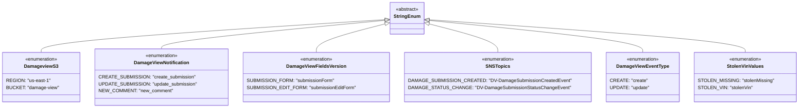

# Diagram: entity_core/entity_service/entity_service/damageview/common/constants.py

> Auto-generated by Obscura crawlers

## Mermaid

### SVG

<svg id="container" width="2563.390625" xmlns="http://www.w3.org/2000/svg" class="classDiagram" height="366" viewBox="0 0 2563.390625 366" role="graphics-document document" aria-roledescription="class"><g><defs><marker id="container_class-aggregationStart" class="marker aggregation class" refX="18" refY="7" markerWidth="190" markerHeight="240" orient="auto"><path d="M 18,7 L9,13 L1,7 L9,1 Z"></path></marker></defs><defs><marker id="container_class-aggregationEnd" class="marker aggregation class" refX="1" refY="7" markerWidth="20" markerHeight="28" orient="auto"><path d="M 18,7 L9,13 L1,7 L9,1 Z"></path></marker></defs><defs><marker id="container_class-extensionStart" class="marker extension class" refX="18" refY="7" markerWidth="190" markerHeight="240" orient="auto"><path d="M 1,7 L18,13 V 1 Z"></path></marker></defs><defs><marker id="container_class-extensionEnd" class="marker extension class" refX="1" refY="7" markerWidth="20" markerHeight="28" orient="auto"><path d="M 1,1 V 13 L18,7 Z"></path></marker></defs><defs><marker id="container_class-compositionStart" class="marker composition class" refX="18" refY="7" markerWidth="190" markerHeight="240" orient="auto"><path d="M 18,7 L9,13 L1,7 L9,1 Z"></path></marker></defs><defs><marker id="container_class-compositionEnd" class="marker composition class" refX="1" refY="7" markerWidth="20" markerHeight="28" orient="auto"><path d="M 18,7 L9,13 L1,7 L9,1 Z"></path></marker></defs><defs><marker id="container_class-dependencyStart" class="marker dependency class" refX="6" refY="7" markerWidth="190" markerHeight="240" orient="auto"><path d="M 5,7 L9,13 L1,7 L9,1 Z"></path></marker></defs><defs><marker id="container_class-dependencyEnd" class="marker dependency class" refX="13" refY="7" markerWidth="20" markerHeight="28" orient="auto"><path d="M 18,7 L9,13 L14,7 L9,1 Z"></path></marker></defs><defs><marker id="container_class-lollipopStart" class="marker lollipop class" refX="13" refY="7" markerWidth="190" markerHeight="240" orient="auto"><circle stroke="black" fill="transparent" cx="7" cy="7" r="6"></circle></marker></defs><defs><marker id="container_class-lollipopEnd" class="marker lollipop class" refX="1" refY="7" markerWidth="190" markerHeight="240" orient="auto"><circle stroke="black" fill="transparent" cx="7" cy="7" r="6"></circle></marker></defs><g class="root"><g class="clusters"></g><g class="edgePaths"><path d="M1238.879,66.797L1054.676,79.164C870.472,91.531,502.066,116.266,317.863,134.799C133.66,153.333,133.66,165.667,133.66,171.833L133.66,178" id="id_StringEnum_DamageviewS3_1" class="edge-thickness-normal edge-pattern-solid relation" style=";;;" data-edge="true" data-et="edge" data-id="id_StringEnum_DamageviewS3_1" data-points="W3sieCI6MTI1Ni4wODk4NDM3NSwieSI6NjUuNjQxMjM5NDY4MDQwNjF9LHsieCI6MTMzLjY2MDE1NjI1LCJ5IjoxNDF9LHsieCI6MTMzLjY2MDE1NjI1LCJ5IjoxNzh9XQ==" marker-start="url(#container_class-extensionStart)"></path><path d="M1238.926,69.173L1119.767,81.144C1000.608,93.115,762.291,117.058,643.132,133.195C523.973,149.333,523.973,157.667,523.973,161.833L523.973,166" id="id_StringEnum_DamageViewNotification_2" class="edge-thickness-normal edge-pattern-solid relation" style=";;;" data-edge="true" data-et="edge" data-id="id_StringEnum_DamageViewNotification_2" data-points="W3sieCI6MTI1Ni4wODk4NDM3NSwieSI6NjcuNDQ4NjAwNjM3ODM0OTR9LHsieCI6NTIzLjk3MjY1NjI1LCJ5IjoxNDF9LHsieCI6NTIzLjk3MjY1NjI1LCJ5IjoxNjZ9XQ==" marker-start="url(#container_class-extensionStart)"></path><path d="M1239.45,81.375L1203.099,91.312C1166.747,101.25,1094.043,121.125,1057.692,137.229C1021.34,153.333,1021.34,165.667,1021.34,171.833L1021.34,178" id="id_StringEnum_DamageViewFieldsVersion_3" class="edge-thickness-normal edge-pattern-solid relation" style=";;;" data-edge="true" data-et="edge" data-id="id_StringEnum_DamageViewFieldsVersion_3" data-points="W3sieCI6MTI1Ni4wODk4NDM3NSwieSI6NzYuODI2MTE1MTY2MjYxMTV9LHsieCI6MTAyMS4zMzk4NDM3NSwieSI6MTQxfSx7IngiOjEwMjEuMzM5ODQzNzUsInkiOjE3OH1d" marker-start="url(#container_class-extensionStart)"></path><path d="M1381.198,81.375L1417.55,91.312C1453.902,101.25,1526.605,121.125,1562.957,137.229C1599.309,153.333,1599.309,165.667,1599.309,171.833L1599.309,178" id="id_StringEnum_SNSTopics_4" class="edge-thickness-normal edge-pattern-solid relation" style=";;;" data-edge="true" data-et="edge" data-id="id_StringEnum_SNSTopics_4" data-points="W3sieCI6MTM2NC41NTg1OTM3NSwieSI6NzYuODI2MTE1MTY2MjYxMTV9LHsieCI6MTU5OS4zMDg1OTM3NSwieSI6MTQxfSx7IngiOjE1OTkuMzA4NTkzNzUsInkiOjE3OH1d" marker-start="url(#container_class-extensionStart)"></path><path d="M1381.714,69.501L1495.127,81.418C1608.54,93.334,1835.366,117.167,1948.779,135.25C2062.191,153.333,2062.191,165.667,2062.191,171.833L2062.191,178" id="id_StringEnum_DamageViewEventType_5" class="edge-thickness-normal edge-pattern-solid relation" style=";;;" data-edge="true" data-et="edge" data-id="id_StringEnum_DamageViewEventType_5" data-points="W3sieCI6MTM2NC41NTg1OTM3NSwieSI6NjcuNjk4NTAwNjA3ODYxNjd9LHsieCI6MjA2Mi4xOTE0MDYyNSwieSI6MTQxfSx7IngiOjIwNjIuMTkxNDA2MjUsInkiOjE3OH1d" marker-start="url(#container_class-extensionStart)"></path><path d="M1381.763,67.215L1550.237,79.512C1718.71,91.81,2055.658,116.405,2224.132,134.869C2392.605,153.333,2392.605,165.667,2392.605,171.833L2392.605,178" id="id_StringEnum_StolenVinValues_6" class="edge-thickness-normal edge-pattern-solid relation" style=";;;" data-edge="true" data-et="edge" data-id="id_StringEnum_StolenVinValues_6" data-points="W3sieCI6MTM2NC41NTg1OTM3NSwieSI6NjUuOTU4NzgyMDg2NDQ5MzV9LHsieCI6MjM5Mi42MDU0Njg3NSwieSI6MTQxfSx7IngiOjIzOTIuNjA1NDY4NzUsInkiOjE3OH1d" marker-start="url(#container_class-extensionStart)"></path></g><g class="edgeLabels"><g class="edgeLabel"><g class="label" data-id="id_StringEnum_DamageviewS3_1" transform="translate(0, 0)"><foreignObject width="0" height="0">

</foreignObject></g></g><g class="edgeLabel"><g class="label" data-id="id_StringEnum_DamageViewNotification_2" transform="translate(0, 0)"><foreignObject width="0" height="0">

</foreignObject></g></g><g class="edgeLabel"><g class="label" data-id="id_StringEnum_DamageViewFieldsVersion_3" transform="translate(0, 0)"><foreignObject width="0" height="0">

</foreignObject></g></g><g class="edgeLabel"><g class="label" data-id="id_StringEnum_SNSTopics_4" transform="translate(0, 0)"><foreignObject width="0" height="0">

</foreignObject></g></g><g class="edgeLabel"><g class="label" data-id="id_StringEnum_DamageViewEventType_5" transform="translate(0, 0)"><foreignObject width="0" height="0">

</foreignObject></g></g><g class="edgeLabel"><g class="label" data-id="id_StringEnum_StolenVinValues_6" transform="translate(0, 0)"><foreignObject width="0" height="0">

</foreignObject></g></g></g><g class="nodes"><g class="node default" id="classId-StringEnum-0" transform="translate(1310.32421875, 62)"><g class="basic label-container"><path d="M-54.234375 -54 L54.234375 -54 L54.234375 54 L-54.234375 54" stroke="none" stroke-width="0" fill="#ECECFF" style=""></path><path d="M-54.234375 -54 C-15.795165305159664 -54, 22.644044389680673 -54, 54.234375 -54 M-54.234375 -54 C-12.576340272181582 -54, 29.081694455636836 -54, 54.234375 -54 M54.234375 -54 C54.234375 -15.579175474149487, 54.234375 22.841649051701026, 54.234375 54 M54.234375 -54 C54.234375 -20.110972056445256, 54.234375 13.778055887109488, 54.234375 54 M54.234375 54 C10.89920032497534 54, -32.43597435004932 54, -54.234375 54 M54.234375 54 C31.0138900266158 54, 7.793405053231602 54, -54.234375 54 M-54.234375 54 C-54.234375 13.5657264610945, -54.234375 -26.868547077811, -54.234375 -54 M-54.234375 54 C-54.234375 29.34249919498077, -54.234375 4.684998389961542, -54.234375 -54" stroke="#9370DB" stroke-width="1.3" fill="none" stroke-dasharray="0 0" style=""></path></g><g class="annotation-group text" transform="translate(-38.609375, -30)"><g class="label" style="" transform="translate(0,-12)"><foreignObject width="77.21875" height="24">

«abstract»

</foreignObject></g></g><g class="label-group text" transform="translate(-42.234375, -6)"><g class="label" style="font-weight: bolder" transform="translate(0,-12)"><foreignObject width="84.46875" height="24">

StringEnum

</foreignObject></g></g><g class="members-group text" transform="translate(-42.234375, 42)"></g><g class="methods-group text" transform="translate(-42.234375, 72)"></g><g class="divider" style=""><path d="M-54.234375 18 C-31.708060491457097 18, -9.181745982914194 18, 54.234375 18 M-54.234375 18 C-17.753125683402487 18, 18.728123633195025 18, 54.234375 18" stroke="#9370DB" stroke-width="1.3" fill="none" stroke-dasharray="0 0" style=""></path></g><g class="divider" style=""><path d="M-54.234375 36 C-19.05050762614723 36, 16.13335974770554 36, 54.234375 36 M-54.234375 36 C-26.519748396192227 36, 1.1948782076155453 36, 54.234375 36" stroke="#9370DB" stroke-width="1.3" fill="none" stroke-dasharray="0 0" style=""></path></g></g><g class="node default" id="classId-DamageviewS3-1" transform="translate(133.66015625, 262)"><g class="basic label-container"><path d="M-125.66015625 -84 L125.66015625 -84 L125.66015625 84 L-125.66015625 84" stroke="none" stroke-width="0" fill="#ECECFF" style=""></path><path d="M-125.66015625 -84 C-38.60462649528638 -84, 48.450903259427236 -84, 125.66015625 -84 M-125.66015625 -84 C-32.98313205788665 -84, 59.6938921342267 -84, 125.66015625 -84 M125.66015625 -84 C125.66015625 -33.199572601482465, 125.66015625 17.60085479703507, 125.66015625 84 M125.66015625 -84 C125.66015625 -42.83412614456152, 125.66015625 -1.6682522891230462, 125.66015625 84 M125.66015625 84 C48.84464251184035 84, -27.970871226319304 84, -125.66015625 84 M125.66015625 84 C47.81911781715867 84, -30.02192061568266 84, -125.66015625 84 M-125.66015625 84 C-125.66015625 28.27192065375072, -125.66015625 -27.456158692498562, -125.66015625 -84 M-125.66015625 84 C-125.66015625 34.23950938446026, -125.66015625 -15.520981231079475, -125.66015625 -84" stroke="#9370DB" stroke-width="1.3" fill="none" stroke-dasharray="0 0" style=""></path></g><g class="annotation-group text" transform="translate(-55.5546875, -60)"><g class="label" style="" transform="translate(0,-12)"><foreignObject width="111.109375" height="24">

«enumeration»

</foreignObject></g></g><g class="label-group text" transform="translate(-54.671875, -36)"><g class="label" style="font-weight: bolder" transform="translate(0,-12)"><foreignObject width="109.34375" height="24">

DamageviewS3

</foreignObject></g></g><g class="members-group text" transform="translate(-113.66015625, 12)"><g class="label" style="" transform="translate(0,-12)"><foreignObject width="140.765625" height="24">

REGION: "us-east-1"

</foreignObject></g><g class="label" style="" transform="translate(0,12)"><foreignObject width="171.765625" height="24">

BUCKET: "damage-view"

</foreignObject></g></g><g class="methods-group text" transform="translate(-113.66015625, 84)"></g><g class="divider" style=""><path d="M-125.66015625 -12 C-30.820107691395307 -12, 64.01994086720939 -12, 125.66015625 -12 M-125.66015625 -12 C-42.64772746111581 -12, 40.36470132776839 -12, 125.66015625 -12" stroke="#9370DB" stroke-width="1.3" fill="none" stroke-dasharray="0 0" style=""></path></g><g class="divider" style=""><path d="M-125.66015625 60 C-32.80995120225124 60, 60.04025384549752 60, 125.66015625 60 M-125.66015625 60 C-56.675772102945956 60, 12.308612044108088 60, 125.66015625 60" stroke="#9370DB" stroke-width="1.3" fill="none" stroke-dasharray="0 0" style=""></path></g></g><g class="node default" id="classId-DamageViewNotification-2" transform="translate(523.97265625, 262)"><g class="basic label-container"><path d="M-214.65234375 -96 L214.65234375 -96 L214.65234375 96 L-214.65234375 96" stroke="none" stroke-width="0" fill="#ECECFF" style=""></path><path d="M-214.65234375 -96 C-104.93297394501347 -96, 4.786395859973055 -96, 214.65234375 -96 M-214.65234375 -96 C-102.45463772748312 -96, 9.743068295033765 -96, 214.65234375 -96 M214.65234375 -96 C214.65234375 -52.27259385074248, 214.65234375 -8.545187701484963, 214.65234375 96 M214.65234375 -96 C214.65234375 -53.47766022529487, 214.65234375 -10.955320450589738, 214.65234375 96 M214.65234375 96 C44.04683170583482 96, -126.55868033833036 96, -214.65234375 96 M214.65234375 96 C75.43000854940627 96, -63.792326651187466 96, -214.65234375 96 M-214.65234375 96 C-214.65234375 42.530304380662784, -214.65234375 -10.939391238674432, -214.65234375 -96 M-214.65234375 96 C-214.65234375 32.466279037649414, -214.65234375 -31.06744192470117, -214.65234375 -96" stroke="#9370DB" stroke-width="1.3" fill="none" stroke-dasharray="0 0" style=""></path></g><g class="annotation-group text" transform="translate(-55.5546875, -72)"><g class="label" style="" transform="translate(0,-12)"><foreignObject width="111.109375" height="24">

«enumeration»

</foreignObject></g></g><g class="label-group text" transform="translate(-89.3359375, -48)"><g class="label" style="font-weight: bolder" transform="translate(0,-12)"><foreignObject width="178.671875" height="24">

DamageViewNotification

</foreignObject></g></g><g class="members-group text" transform="translate(-202.65234375, 0)"><g class="label" style="" transform="translate(0,-12)"><foreignObject width="306.5" height="24">

CREATE_SUBMISSION: "create_submission"

</foreignObject></g><g class="label" style="" transform="translate(0,12)"><foreignObject width="315.96875" height="24">

UPDATE_SUBMISSION: "update_submission"

</foreignObject></g><g class="label" style="" transform="translate(0,36)"><foreignObject width="236.875" height="24">

NEW_COMMENT: "new_comment"

</foreignObject></g></g><g class="methods-group text" transform="translate(-202.65234375, 96)"></g><g class="divider" style=""><path d="M-214.65234375 -24 C-57.79220917428859 -24, 99.06792540142283 -24, 214.65234375 -24 M-214.65234375 -24 C-115.32959835437993 -24, -16.00685295875985 -24, 214.65234375 -24" stroke="#9370DB" stroke-width="1.3" fill="none" stroke-dasharray="0 0" style=""></path></g><g class="divider" style=""><path d="M-214.65234375 72 C-64.81715743030938 72, 85.01802888938124 72, 214.65234375 72 M-214.65234375 72 C-90.01825563243592 72, 34.61583248512815 72, 214.65234375 72" stroke="#9370DB" stroke-width="1.3" fill="none" stroke-dasharray="0 0" style=""></path></g></g><g class="node default" id="classId-DamageViewFieldsVersion-3" transform="translate(1021.33984375, 262)"><g class="basic label-container"><path d="M-232.71484375 -84 L232.71484375 -84 L232.71484375 84 L-232.71484375 84" stroke="none" stroke-width="0" fill="#ECECFF" style=""></path><path d="M-232.71484375 -84 C-58.27480549989809 -84, 116.16523275020381 -84, 232.71484375 -84 M-232.71484375 -84 C-95.16464862811739 -84, 42.38554649376522 -84, 232.71484375 -84 M232.71484375 -84 C232.71484375 -30.818543311376068, 232.71484375 22.362913377247864, 232.71484375 84 M232.71484375 -84 C232.71484375 -29.798532551271045, 232.71484375 24.40293489745791, 232.71484375 84 M232.71484375 84 C118.24337640342586 84, 3.7719090568517117 84, -232.71484375 84 M232.71484375 84 C130.87126978580798 84, 29.027695821615964 84, -232.71484375 84 M-232.71484375 84 C-232.71484375 38.94149996308407, -232.71484375 -6.117000073831861, -232.71484375 -84 M-232.71484375 84 C-232.71484375 35.45846535510837, -232.71484375 -13.083069289783253, -232.71484375 -84" stroke="#9370DB" stroke-width="1.3" fill="none" stroke-dasharray="0 0" style=""></path></g><g class="annotation-group text" transform="translate(-55.5546875, -60)"><g class="label" style="" transform="translate(0,-12)"><foreignObject width="111.109375" height="24">

«enumeration»

</foreignObject></g></g><g class="label-group text" transform="translate(-95.0859375, -36)"><g class="label" style="font-weight: bolder" transform="translate(0,-12)"><foreignObject width="190.171875" height="24">

DamageViewFieldsVersion

</foreignObject></g></g><g class="members-group text" transform="translate(-220.71484375, 12)"><g class="label" style="" transform="translate(0,-12)"><foreignObject width="278.875" height="24">

SUBMISSION_FORM: "submissionForm"

</foreignObject></g><g class="label" style="" transform="translate(0,12)"><foreignObject width="346.34375" height="24">

SUBMISSION_EDIT_FORM: "submissionEditForm"

</foreignObject></g></g><g class="methods-group text" transform="translate(-220.71484375, 84)"></g><g class="divider" style=""><path d="M-232.71484375 -12 C-55.20320266451327 -12, 122.30843842097346 -12, 232.71484375 -12 M-232.71484375 -12 C-91.13976826609152 -12, 50.435307217816955 -12, 232.71484375 -12" stroke="#9370DB" stroke-width="1.3" fill="none" stroke-dasharray="0 0" style=""></path></g><g class="divider" style=""><path d="M-232.71484375 60 C-111.95389753534157 60, 8.807048679316864 60, 232.71484375 60 M-232.71484375 60 C-63.41062233084858 60, 105.89359908830284 60, 232.71484375 60" stroke="#9370DB" stroke-width="1.3" fill="none" stroke-dasharray="0 0" style=""></path></g></g><g class="node default" id="classId-SNSTopics-4" transform="translate(1599.30859375, 262)"><g class="basic label-container"><path d="M-295.25390625 -84 L295.25390625 -84 L295.25390625 84 L-295.25390625 84" stroke="none" stroke-width="0" fill="#ECECFF" style=""></path><path d="M-295.25390625 -84 C-129.73919267411122 -84, 35.775520901777554 -84, 295.25390625 -84 M-295.25390625 -84 C-136.052540822452 -84, 23.148824605096024 -84, 295.25390625 -84 M295.25390625 -84 C295.25390625 -37.758617311976494, 295.25390625 8.482765376047013, 295.25390625 84 M295.25390625 -84 C295.25390625 -34.91559106895276, 295.25390625 14.168817862094485, 295.25390625 84 M295.25390625 84 C170.61983441005586 84, 45.98576257011172 84, -295.25390625 84 M295.25390625 84 C98.60562948952114 84, -98.04264727095773 84, -295.25390625 84 M-295.25390625 84 C-295.25390625 21.61159547069981, -295.25390625 -40.77680905860038, -295.25390625 -84 M-295.25390625 84 C-295.25390625 40.79289398226767, -295.25390625 -2.414212035464658, -295.25390625 -84" stroke="#9370DB" stroke-width="1.3" fill="none" stroke-dasharray="0 0" style=""></path></g><g class="annotation-group text" transform="translate(-55.5546875, -60)"><g class="label" style="" transform="translate(0,-12)"><foreignObject width="111.109375" height="24">

«enumeration»

</foreignObject></g></g><g class="label-group text" transform="translate(-37.5703125, -36)"><g class="label" style="font-weight: bolder" transform="translate(0,-12)"><foreignObject width="75.140625" height="24">

SNSTopics

</foreignObject></g></g><g class="members-group text" transform="translate(-283.25390625, 12)"><g class="label" style="" transform="translate(0,-12)"><foreignObject width="510.859375" height="24">

DAMAGE_SUBMISSION_CREATED: "DV-DamageSubmissionCreatedEvent"

</foreignObject></g><g class="label" style="" transform="translate(0,12)"><foreignObject width="510.953125" height="24">

DAMAGE_STATUS_CHANGE: "DV-DamageSubmissionStatusChangeEvent"

</foreignObject></g></g><g class="methods-group text" transform="translate(-283.25390625, 84)"></g><g class="divider" style=""><path d="M-295.25390625 -12 C-161.40084220865126 -12, -27.54777816730251 -12, 295.25390625 -12 M-295.25390625 -12 C-136.14831277023416 -12, 22.957280709531688 -12, 295.25390625 -12" stroke="#9370DB" stroke-width="1.3" fill="none" stroke-dasharray="0 0" style=""></path></g><g class="divider" style=""><path d="M-295.25390625 60 C-120.83613484104433 60, 53.581636567911346 60, 295.25390625 60 M-295.25390625 60 C-133.47318141137242 60, 28.307543427255155 60, 295.25390625 60" stroke="#9370DB" stroke-width="1.3" fill="none" stroke-dasharray="0 0" style=""></path></g></g><g class="node default" id="classId-DamageViewEventType-5" transform="translate(2062.19140625, 262)"><g class="basic label-container"><path d="M-117.62890625 -84 L117.62890625 -84 L117.62890625 84 L-117.62890625 84" stroke="none" stroke-width="0" fill="#ECECFF" style=""></path><path d="M-117.62890625 -84 C-48.348115457155814 -84, 20.932675335688373 -84, 117.62890625 -84 M-117.62890625 -84 C-49.56265229174397 -84, 18.503601666512054 -84, 117.62890625 -84 M117.62890625 -84 C117.62890625 -20.005113957014373, 117.62890625 43.98977208597125, 117.62890625 84 M117.62890625 -84 C117.62890625 -35.044781363055, 117.62890625 13.910437273889997, 117.62890625 84 M117.62890625 84 C29.81294268882867 84, -58.00302087234266 84, -117.62890625 84 M117.62890625 84 C32.188984425175875 84, -53.25093739964825 84, -117.62890625 84 M-117.62890625 84 C-117.62890625 16.884197707235842, -117.62890625 -50.231604585528316, -117.62890625 -84 M-117.62890625 84 C-117.62890625 36.432599461613975, -117.62890625 -11.13480107677205, -117.62890625 -84" stroke="#9370DB" stroke-width="1.3" fill="none" stroke-dasharray="0 0" style=""></path></g><g class="annotation-group text" transform="translate(-55.5546875, -60)"><g class="label" style="" transform="translate(0,-12)"><foreignObject width="111.109375" height="24">

«enumeration»

</foreignObject></g></g><g class="label-group text" transform="translate(-83.9921875, -36)"><g class="label" style="font-weight: bolder" transform="translate(0,-12)"><foreignObject width="167.984375" height="24">

DamageViewEventType

</foreignObject></g></g><g class="members-group text" transform="translate(-105.62890625, 12)"><g class="label" style="" transform="translate(0,-12)"><foreignObject width="117.796875" height="24">

CREATE: "create"

</foreignObject></g><g class="label" style="" transform="translate(0,12)"><foreignObject width="127.265625" height="24">

UPDATE: "update"

</foreignObject></g></g><g class="methods-group text" transform="translate(-105.62890625, 84)"></g><g class="divider" style=""><path d="M-117.62890625 -12 C-53.27698548746734 -12, 11.074935275065314 -12, 117.62890625 -12 M-117.62890625 -12 C-68.97559826678452 -12, -20.322290283569032 -12, 117.62890625 -12" stroke="#9370DB" stroke-width="1.3" fill="none" stroke-dasharray="0 0" style=""></path></g><g class="divider" style=""><path d="M-117.62890625 60 C-63.40869051561635 60, -9.1884747812327 60, 117.62890625 60 M-117.62890625 60 C-51.963070879912834 60, 13.702764490174332 60, 117.62890625 60" stroke="#9370DB" stroke-width="1.3" fill="none" stroke-dasharray="0 0" style=""></path></g></g><g class="node default" id="classId-StolenVinValues-6" transform="translate(2392.60546875, 262)"><g class="basic label-container"><path d="M-162.78515625 -84 L162.78515625 -84 L162.78515625 84 L-162.78515625 84" stroke="none" stroke-width="0" fill="#ECECFF" style=""></path><path d="M-162.78515625 -84 C-47.04364605018074 -84, 68.69786414963852 -84, 162.78515625 -84 M-162.78515625 -84 C-80.64360550866472 -84, 1.4979452326705598 -84, 162.78515625 -84 M162.78515625 -84 C162.78515625 -20.51594654387427, 162.78515625 42.96810691225146, 162.78515625 84 M162.78515625 -84 C162.78515625 -39.182149297698295, 162.78515625 5.6357014046034095, 162.78515625 84 M162.78515625 84 C89.11224653566585 84, 15.439336821331693 84, -162.78515625 84 M162.78515625 84 C41.666361878542176 84, -79.45243249291565 84, -162.78515625 84 M-162.78515625 84 C-162.78515625 21.524889952554688, -162.78515625 -40.950220094890625, -162.78515625 -84 M-162.78515625 84 C-162.78515625 45.99923223166013, -162.78515625 7.998464463320261, -162.78515625 -84" stroke="#9370DB" stroke-width="1.3" fill="none" stroke-dasharray="0 0" style=""></path></g><g class="annotation-group text" transform="translate(-55.5546875, -60)"><g class="label" style="" transform="translate(0,-12)"><foreignObject width="111.109375" height="24">

«enumeration»

</foreignObject></g></g><g class="label-group text" transform="translate(-58.7734375, -36)"><g class="label" style="font-weight: bolder" transform="translate(0,-12)"><foreignObject width="117.546875" height="24">

StolenVinValues

</foreignObject></g></g><g class="members-group text" transform="translate(-150.78515625, 12)"><g class="label" style="" transform="translate(0,-12)"><foreignObject width="242.796875" height="24">

STOLEN_MISSING: "stolenMissing"

</foreignObject></g><g class="label" style="" transform="translate(0,12)"><foreignObject width="175.046875" height="24">

STOLEN_VIN: "stolenVin"

</foreignObject></g></g><g class="methods-group text" transform="translate(-150.78515625, 84)"></g><g class="divider" style=""><path d="M-162.78515625 -12 C-69.61704555255461 -12, 23.55106514489077 -12, 162.78515625 -12 M-162.78515625 -12 C-73.82776732913719 -12, 15.129621591725623 -12, 162.78515625 -12" stroke="#9370DB" stroke-width="1.3" fill="none" stroke-dasharray="0 0" style=""></path></g><g class="divider" style=""><path d="M-162.78515625 60 C-44.66436151593439 60, 73.45643321813122 60, 162.78515625 60 M-162.78515625 60 C-33.9127610214222 60, 94.9596342071556 60, 162.78515625 60" stroke="#9370DB" stroke-width="1.3" fill="none" stroke-dasharray="0 0" style=""></path></g></g></g></g></g></svg>
